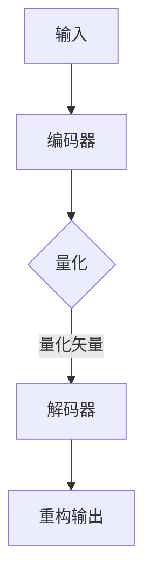
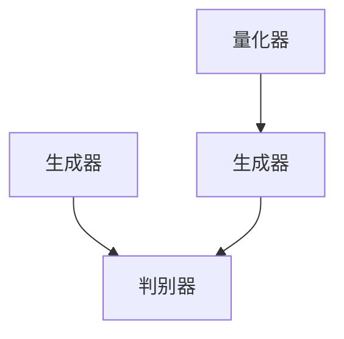

                 

### 文章标题

### VQVAE 和 VQGAN 的差异

---

关键词：VQVAE，VQGAN，矢量量化，变分自编码器，生成对抗网络，图像生成，图像处理

---

摘要：本文旨在探讨VQVAE（Vector Quantized Variational Autoencoder）和VQGAN（Vector Quantized Generative Adversarial Network）这两种基于矢量量化技术的生成模型之间的差异。通过对两者的基本概念、原理、技术细节以及应用场景的详细分析，本文旨在为读者提供一种清晰的理解框架，以便更好地应用这些模型于实际的图像生成和图像处理任务中。

---

## 第一部分: VQVAE 和 VQGAN 的基本概念与原理

### 第1章: VQVAE 和 VQGAN 简介

#### 1.1 VQVAE 和 VQGAN 的基本概念

**VQVAE（Vector Quantized Variational Autoencoder）** 是一种变分自编码器（VAE）的变体，它使用矢量量化（Vector Quantization, VQ）技术来近似编码器（encoder）和解码器（decoder）的参数。传统VAE使用均值和方差来表示潜在空间中的数据分布，而VQVAE则通过量化器（quantizer）将潜在空间中的数据映射到一组预定义的量化矢量（codevectors）。这种量化技术使得VQVAE可以在较低的参数数量下实现良好的数据重构效果。

**VQGAN（Vector Quantized Generative Adversarial Network）** 是一种结合了矢量量化技术的生成对抗网络（GAN）。与传统的GAN相比，VQGAN在生成器和判别器中都引入了量化器，以增强生成图像的质量和多样性。VQGAN通过量化器引入了额外的结构信息，使得生成图像能够更加细腻和真实。

#### 1.2 VQVAE 和 VQGAN 的诞生背景与发展历程

**VQVAE** 的诞生可以追溯到2017年，当时由Maxim Lapan和Andrea Vedaldi在论文《Vector-Quantized Variational Autoencoders》中首次提出。VQVAE的提出是为了解决传统VAE在参数效率和重构质量之间的权衡问题。通过引入量化技术，VQVAE在参数数量上大大减少，同时保持了较高的重构效果。

**VQGAN** 则是在2018年由Matthieu Latouche和米卡埃尔·阿姆布尔（Michaël Abry）在论文《Vector Quantized Generative Adversarial Networks》中提出的。VQGAN结合了GAN和VQVAE的优点，通过量化器在生成器和判别器中引入了额外的结构信息，从而在生成图像的质量和多样性上取得了显著提升。

#### 1.3 VQVAE 和 VQGAN 的核心目标与应用场景

**VQVAE 的核心目标：**
- 提高参数效率：通过矢量量化技术减少模型参数数量，使得模型可以在更少的计算资源下运行。
- 保持重构质量：在减少参数数量的同时，保持较高的重构效果，使得模型能够有效编码和解码数据。

**VQVAE 的应用场景：**
- 图像去噪与修复：利用VQVAE强大的数据编码和解码能力，去除图像中的噪声和损坏。
- 图像超分辨率：通过VQVAE学习高分辨率图像的特征，提升低分辨率图像的视觉效果。
- 生成式图像编辑：利用VQVAE生成新的图像内容，实现图像编辑和创意设计。

**VQGAN 的核心目标：**
- 提升生成图像的质量和多样性：通过引入量化器，生成更加细腻和真实的图像。
- 保持生成器的稳定训练：量化器引入的结构信息有助于缓解GAN训练中的不稳定问题。

**VQGAN 的应用场景：**
- 图像生成与编辑：利用VQGAN生成高质量的图像，实现图像编辑和艺术创作。
- 视频生成与编辑：扩展VQGAN到视频领域，生成和编辑视频内容，应用于视频游戏和虚拟现实。
- 文本生成与编辑：利用VQGAN生成和编辑文本内容，应用于自然语言处理和人工智能写作。

### 第2章: VQVAE 和 VQGAN 的原理与架构

#### 2.1 VQVAE 的原理与架构

**图示：**


**描述：**
VQVAE由编码器、量化器和解码器组成。编码器将输入数据映射到一个潜在空间，量化器将潜在空间中的点映射到一组量化矢量，解码器则使用这些量化矢量重构输入数据。

**伪代码：**

```python
def vqvae_encoder(x):
    z_mean, z_log_var = ... # 计算均值和日志方差
    z = ... # 根据均值和方差采样
    q_indices = ... # 通过量化器得到索引
    quantized_z = ... # 通过索引得到量化后的z
    return quantized_z, z_mean, z_log_var

def vqvae_decoder(z):
    ... # 使用量化后的z进行解码
    x_recon = ... # 生成重构数据
    return x_recon
```

#### 2.2 VQGAN 的原理与架构

**图示：**


**描述：**
VQGAN由生成器、判别器和量化器组成。生成器生成伪造数据，判别器判断伪造数据和真实数据的区别。量化器在生成器和判别器之间引入结构信息。

**伪代码：**

```python
def vqgan_generator(z):
    ... # 生成器生成图像
    x_fake = ... # 生成伪造数据
    return x_fake

def vqgan_discriminator(x):
    ... # 判别器判断真实与伪造数据
    return logits
```

### 第3章: VQVAE 和 VQGAN 的技术细节

#### 3.1 VQVAE 的技术细节

**量化器的设计与优化：**
量化器是VQVAE的关键组件，其设计直接影响模型的重构质量。常用的量化器包括基于梯度的量化器、基于贪心的量化器等。

**损失函数的选择与优化：**
VQVAE的损失函数通常包括重建损失和量化损失。重建损失衡量重构数据与原始数据之间的差异，量化损失则衡量潜在空间中点与量化矢量之间的差异。优化损失函数可以提升模型的重构效果。

**VQVAE 的变体与改进：**
VQVAE的变体包括VQ-VAE2和Wasserstein VQ-VAE等。这些变体通过改进量化器和损失函数，进一步提升了模型的性能。

#### 3.2 VQGAN 的技术细节

**标签平滑技术：**
在VQGAN中，标签平滑技术用于提高生成图像的质量。该技术不对生成图像进行精确分类，而是给出一个概率分布。

**训练技巧与策略：**
VQGAN的训练需要精心设计，包括选择合适的训练数据集、调整学习率、避免模式崩溃等。

**VQGAN 的变体与改进：**
VQGAN的变体包括VQ-VAE-W和VQ-VAE-DR等。这些变体通过改进生成器和判别器的设计，提升了生成图像的细节和多样性。

## 第二部分: VQVAE 和 VQGAN 的实践应用

### 第4章: VQVAE 和 VQGAN 的应用场景与案例分析

#### 4.1 VQVAE 的应用场景与案例分析

**图像去噪与修复：**
VQVAE可以用于去除图像中的噪声和损坏。通过训练，模型能够学习到去噪和修复的规则，从而在新的图像上应用这些规则，实现高质量的图像去噪和修复。

**图像超分辨率：**
VQVAE可以用于提升低分辨率图像的视觉效果。通过学习高分辨率图像的特征，模型能够生成更清晰、更细腻的高分辨率图像。

**生成式图像编辑：**
VQVAE可以用于生成新的图像内容，实现图像编辑和创意设计。例如，通过控制潜在空间中的参数，可以生成具有不同风格和主题的图像。

#### 4.2 VQGAN 的应用场景与案例分析

**图像生成与编辑：**
VQGAN可以生成高质量的图像，实现图像编辑和艺术创作。通过调整生成器的参数，可以生成具有不同风格和主题的图像。

**视频生成与编辑：**
VQGAN可以扩展到视频领域，生成和编辑视频内容。通过训练，模型能够学习到视频内容的规律，从而在新的视频上应用这些规律，实现高质量的图像生成和编辑。

**文本生成与编辑：**
VQGAN可以生成和编辑文本内容，应用于自然语言处理和人工智能写作。通过学习大量的文本数据，模型能够生成连贯、有逻辑的文本内容。

### 第5章: VQVAE 和 VQGAN 的项目实践

#### 5.1 VQVAE 项目实践

**项目背景与目标：**
以图像去噪为例，描述项目的背景和目标。目标是使用VQVAE模型去除图像中的噪声，提高图像的质量。

**项目开发环境与工具：**
列出项目使用的开发环境、框架和工具，如Python、TensorFlow等。

**项目实现步骤与代码解读：**
详细描述项目的实现步骤，包括数据准备、模型设计、训练与评估等，并提供代码解读。

#### 5.2 VQGAN 项目实践

**项目背景与目标：**
以图像生成为例，描述项目的背景和目标。目标是使用VQGAN模型生成高质量的图像。

**项目开发环境与工具：**
列出项目使用的开发环境、框架和工具，如Python、PyTorch等。

**项目实现步骤与代码解读：**
详细描述项目的实现步骤，包括数据准备、模型设计、训练与评估等，并提供代码解读。

### 第6章: VQVAE 和 VQGAN 的比较与评估

#### 6.1 VQVAE 和 VQGAN 的比较

**性能比较：**
通过实验数据比较VQVAE和VQGAN在不同任务上的性能，包括重建误差、生成质量等。

**应用场景比较：**
分析VQVAE和VQGAN在不同应用场景的适用性。

**训练时间与资源消耗比较：**
比较VQVAE和VQGAN的训练时间和计算资源消耗。

#### 6.2 VQVAE 和 VQGAN 的评估方法

**评价指标的选择：**
选择合适的评价指标来评估VQVAE和VQGAN的性能，如PSNR、SSIM、Inception Score等。

**实验设计与数据分析：**
设计实验并分析结果，比较VQVAE和VQGAN在不同条件下的性能。

### 第7章: VQVAE 和 VQGAN 的发展趋势与未来方向

#### 7.1 VQVAE 和 VQGAN 的发展趋势

**技术创新与应用拓展：**
介绍VQVAE和VQGAN在技术上的创新，如新的量化器设计、改进的损失函数等。

**开源项目与社区发展：**
介绍VQVAE和VQGAN的开源项目，以及相关社区的发展和贡献。

#### 7.2 VQVAE 和 VQGAN 的未来方向

**算法优化与性能提升：**
讨论VQVAE和VQGAN在算法优化方面的潜力，如更高效的量化器、更稳定的训练过程等。

**跨学科融合与多元化应用：**
探讨VQVAE和VQGAN在跨学科领域的应用前景，如医学图像处理、音乐生成等。

### 附录：VQVAE 和 VQGAN 相关资源与资料

**A.1 VQVAE 和 VQGAN 的开源代码与工具：**
- [VQ-VAE](https://github.com/codecraftr/vqvae)
- [VQGAN](https://github.com/NVLab-FAU/vqgan)

**A.2 VQVAE 和 VQGAN 的论文与文献：**
- [Vector-Quantized Variational Autoencoders](https://arxiv.org/abs/1711.00917)
- [Vector Quantized Generative Adversarial Networks](https://arxiv.org/abs/1805.08318)

**A.3 VQVAE 和 VQGAN 的教程与课程：**
- [VQ-VAE Tutorial](https://github.com/fartash/VQ-VAE-Tutorial)
- [VQGAN Tutorial](https://github.com/NVLab-FAU/vqgan-tutorial)

