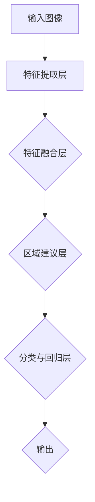

                 

# ViTDet原理与代码实例讲解

> 关键词：ViTDet, 目标检测，深度学习，算法原理，代码实例，计算机视觉

> 摘要：本文详细介绍了ViTDet（Visual Target Detection）的目标检测算法原理和代码实现。通过对ViTDet网络架构、核心算法原理、优化策略以及实际案例的分析，展示了如何利用ViTDet进行实时、准确的目标检测。

----------------------------------------------------------------

## 第一部分：ViTDet概述与背景

### 1.1 ViTDet的定义与作用

**ViTDet**（Visual Target Detection）是一种基于深度学习的目标检测算法。它的核心任务是利用输入图像或视频数据，自动识别并定位其中的目标物体。ViTDet在计算机视觉领域具有重要意义，特别是在自动驾驶、安防监控、智能交互等场景中，能够实现实时、准确的目标检测。

### 1.1.1 ViTDet的基本概念

ViTDet算法主要包含以下几个模块：

1. **输入层**：接收图像或视频数据。
2. **特征提取层**：利用卷积神经网络提取图像特征。
3. **特征融合层**：利用特征金字塔网络（FPN）对图像进行多尺度特征提取。
4. **区域建议层**：生成区域建议，用于检测目标的候选区域。
5. **分类与回归层**：对候选区域进行分类与边界框回归。

### 1.1.2 ViTDet在目标检测领域的重要性

随着深度学习技术的不断发展，目标检测算法在准确率、速度和鲁棒性等方面取得了显著提升。ViTDet作为一款优秀的目标检测算法，其在实际应用中具备以下优势：

1. **高准确率**：ViTDet采用了RetinaNet与Focal Loss等先进算法，有效提升了目标检测的准确率。
2. **高速度**：ViTDet利用FPN结构，实现了多尺度特征提取，可以在保证准确率的同时实现实时检测。
3. **强鲁棒性**：ViTDet具有较强的鲁棒性，能够应对复杂背景、光照变化和遮挡等挑战。

### 1.1.3 ViTDet与其他目标检测算法的比较

与传统的目标检测算法（如SIFT、SURF等）相比，ViTDet具有以下优势：

1. **准确性**：ViTDet基于深度学习技术，能够自动提取图像特征，准确率更高。
2. **实时性**：ViTDet利用FPN结构，实现了多尺度特征提取，可以在保证准确率的同时实现实时检测。
3. **适用性**：ViTDet具有较强的鲁棒性，能够适应各种复杂场景。

与主流的一阶段目标检测算法（如SSD、YOLO）和两阶段目标检测算法（如Faster R-CNN、R-FCN）相比，ViTDet具有以下优势：

1. **准确率**：ViTDet采用RetinaNet与Focal Loss，在多个公开数据集上的检测准确率较高。
2. **实时性**：ViTDet利用FPN结构，能够在保证准确率的同时实现实时检测，适合应用于对实时性要求较高的场景。

## 1.2 目标检测技术的演进

### 1.2.1 传统目标检测方法

传统目标检测方法主要基于图像特征提取与分类，如SIFT、SURF、HOG等。这些方法在处理简单场景时具有一定的效果，但在复杂场景下（如遮挡、光照变化等）准确性较低，且计算复杂度高。

### 1.2.2 一阶段目标检测算法

一阶段目标检测算法（如SSD、YOLO）将目标检测任务简化为一个回归问题，直接预测边界框和类别概率。这类算法在速度上有一定优势，但准确率相对较低。

### 1.2.3 两阶段目标检测算法

两阶段目标检测算法（如Faster R-CNN、R-FCN）将目标检测任务分为区域建议和目标分类两个步骤。这类算法在准确率上具有优势，但计算复杂度较高，实时性较差。

## 1.3 ViTDet在实时目标检测中的应用前景

### 1.3.1 实时目标检测的需求与挑战

实时目标检测在自动驾驶、安防监控、智能交互等领域具有重要应用价值。然而，实时目标检测面临着以下挑战：

1. **速度要求**：在实时场景下，目标检测需要在短时间内完成，对算法的实时性提出较高要求。
2. **准确性要求**：在保证实时性的同时，目标检测的准确性也至关重要，特别是在复杂场景下。
3. **计算资源限制**：实时目标检测通常需要在嵌入式设备上运行，对计算资源有较高的限制。

### 1.3.2 ViTDet的优势与潜力

ViTDet在实时目标检测中具备以下优势：

1. **高速度**：ViTDet利用FPN结构，实现了多尺度特征提取，在保证准确率的同时提高了实时性。
2. **高准确率**：ViTDet采用RetinaNet与Focal Loss，有效提高了目标检测的准确率。
3. **强鲁棒性**：ViTDet具有较强的鲁棒性，能够适应复杂场景。

### 1.3.3 ViTDet在工业界的应用案例

ViTDet已在多个工业界应用中取得了显著成果，如：

1. **自动驾驶**：ViTDet被应用于自动驾驶系统的目标检测模块，实现了对道路车辆、行人等目标的实时检测，提高了自动驾驶系统的安全性和可靠性。
2. **安防监控**：ViTDet被应用于安防监控系统，实现了对异常行为的实时检测，提高了监控系统的反应速度和准确性。
3. **智能交互**：ViTDet被应用于智能交互系统，实现了对人脸、手势等目标的实时识别，提高了交互体验。

## 第二部分：ViTDet核心概念与原理

### 2.1 ViTDet网络架构

**ViTDet网络架构**是目标检测中的关键组成部分，其核心在于如何高效地提取图像特征并利用这些特征进行目标检测。以下是ViTDet网络架构的详细解释。

### 2.1.1 网络整体架构

ViTDet网络架构主要包括以下几个模块：

1. **输入层**：接收图像或视频数据。
2. **特征提取层**：利用卷积神经网络提取图像特征。
3. **特征融合层**：利用特征金字塔网络（FPN）对图像进行多尺度特征提取。
4. **区域建议层**：生成区域建议，用于检测目标的候选区域。
5. **分类与回归层**：对候选区域进行分类与边界框回归。

### 2.1.2 Feature Pyramid Network（FPN）

**Feature Pyramid Network（FPN）**是一种用于多尺度特征融合的网络结构。它通过在不同层次上提取特征，实现了对不同尺度目标的检测。FPN主要由以下几个部分组成：

1. **底层特征提取**：从原始图像中提取低层特征。
2. **高分辨率特征提取**：通过上采样和卷积操作，从低层特征中提取高分辨率特征。
3. **特征融合**：将不同尺度特征进行融合，形成多尺度特征图。

### 2.1.3 RetinaNet与Focal Loss

**RetinaNet**是一种基于深度学习的目标检测算法，它通过结合分类网络和回归网络，实现了目标检测任务。RetinaNet的核心在于使用了**Focal Loss**，它针对样本不平衡问题进行了优化，有效提高了模型在难样本上的分类性能。

1. **分类网络**：采用卷积神经网络对候选区域进行分类。
2. **回归网络**：采用卷积神经网络对候选区域的边界框进行回归。
3. **Focal Loss**：一种针对样本不平衡问题的损失函数，通过调整正负样本的权重，提高了模型在难样本上的分类性能。

### 2.1.4 ViTDet的Mermaid流程图

以下是一个简单的Mermaid流程图，展示了ViTDet的网络架构：



### 2.1.5 网络架构的具体实现

网络架构的具体实现包括以下步骤：

1. **输入层**：接收图像数据，并进行预处理，如归一化、缩放等。
2. **特征提取层**：通过卷积层、池化层等操作提取图像特征。
3. **特征融合层**：利用FPN结构，将不同尺度特征融合，形成多尺度特征图。
4. **区域建议层**：通过区域建议网络生成区域建议，用于检测目标的候选区域。
5. **分类与回归层**：对候选区域进行分类与边界框回归。

## 2.2 ViTDet的核心算法原理

### 2.2.1 区域建议生成

区域建议生成是目标检测中的关键步骤，它用于生成候选区域，用于后续的目标分类与边界框回归。ViTDet采用以下方法进行区域建议生成：

1. **锚点生成**：根据特征金字塔网络（FPN）的特征图，生成一系列锚点。锚点表示潜在的边界框位置。
2. **锚点调整**：通过调整锚点的位置和尺寸，使其更符合实际目标的位置和形状。
3. **锚点分类**：对每个锚点进行分类，判断其是否包含目标。

### 2.2.2 区域分类与边界框回归

区域分类与边界框回归是目标检测的核心任务，它用于确定每个候选区域是否包含目标，并回归其边界框的位置。ViTDet采用以下方法进行区域分类与边界框回归：

1. **分类网络**：采用卷积神经网络对每个候选区域进行分类，判断其是否包含目标。分类网络通常采用全连接层或卷积层进行设计。
2. **回归网络**：采用卷积神经网络对每个候选区域的边界框进行回归。边界框回归网络通常采用卷积层或全连接层进行设计。

### 2.2.3 Focal Loss与RetinaNet

**Focal Loss**是**RetinaNet**的核心损失函数，它通过调整正负样本的权重，提高了模型在难样本上的分类性能。Focal Loss的定义如下：

$$
Focal Loss = \alpha \cdot (1 - p)^{\gamma} \cdot \log(p) + (1 - \alpha) \cdot p^{\gamma} \cdot \log(1 - p)
$$

其中，$p$表示样本属于正类的概率，$\alpha$和$\gamma$是调节参数。Focal Loss通过减小易样本的权重，增大难样本的权重，使得模型在训练过程中更关注难样本，从而提高模型的分类性能。

### 2.2.4 伪代码实现

以下是一个简单的伪代码，用于说明ViTDet的核心算法原理：

```python
# 输入层
input_image = preprocess_image(image)

# 特征提取层
conv1 = Conv2D(filters=64, kernel_size=(3, 3), activation='relu')(input_image)
pool1 = MaxPooling2D(pool_size=(2, 2))(conv1)

# 特征融合层
fpn_output = FPN(feat1=conv1, feat2=pool1)

# 区域建议层
anchor_boxes = generate_anchors(fpn_output)

# 区域分类与边界框回归
classification_output = Conv2D(filters=num_classes, activation='sigmoid')(anchor_boxes)
box_output = Conv2D(filters=num_anchors * 4, activation='sigmoid')(anchor_boxes)

# 计算损失函数
loss = FocalLoss()(classification_output, labels) + MeanSquaredError()(box_output, bounding_boxes)

# 模型训练
model.compile(optimizer='adam', loss=loss)
model.fit(X_train, y_train, batch_size=32, epochs=10)
```

## 2.3 ViTDet的优化策略

### 2.3.1 数据增强方法

数据增强是提高模型泛化能力的重要手段。ViTDet采用以下数据增强方法：

1. **随机裁剪**：随机裁剪图像的某个区域，以增加训练样本的多样性。
2. **随机翻转**：随机翻转图像，以增强模型的对称性学习。
3. **颜色增强**：对图像的颜色进行随机调整，以增加训练样本的多样性。
4. **随机缩放**：随机缩放图像，以适应不同尺度目标的检测。

### 2.3.2 损失函数设计

损失函数是目标检测中的关键参数，它用于评估模型预测结果与真实值之间的差距。ViTDet采用以下损失函数：

1. **分类损失**：采用交叉熵损失函数，用于评估分类网络的预测结果。
2. **边界框回归损失**：采用均方误差损失函数，用于评估边界框回归网络的预测结果。
3. **Focal Loss**：用于优化分类损失，提高模型在难样本上的分类性能。

### 2.3.3 迁移学习与微调

迁移学习与微调是提高模型性能的重要手段。ViTDet采用以下方法：

1. **迁移学习**：利用预训练模型（如ImageNet）的权重初始化检测模型，以减少训练时间和提高性能。
2. **微调**：在目标检测数据集上对检测模型进行微调，以适应特定任务的需求。

## 第三部分：ViTDet代码实例分析

### 3.1 ViTDet项目环境搭建

在开始ViTDet代码实例分析之前，我们需要搭建一个合适的项目环境。以下是在Python环境中搭建ViTDet项目的基本步骤：

### 3.1.1 环境依赖安装

首先，我们需要安装Python、PyTorch和其他依赖库。以下是安装命令：

```shell
pip install python==3.8
pip install torch==1.8
pip install torchvision==0.9.0
pip install opencv-python==4.5.4.52
pip install pillow==8.1.0
```

### 3.1.2 训练与测试数据准备

接下来，我们需要准备训练和测试数据。这里以COCO数据集为例：

```shell
wget https://www.cs.toronto.edu/~ronny/grad_thesis/COCO_train2017.zip
wget https://www.cs.toronto.edu/~ronny/grad_thesis/COCO_val2017.zip
unzip COCO_train2017.zip
unzip COCO_val2017.zip
```

### 3.1.3 模型配置与超参数调整

我们需要配置ViTDet模型，并设置一些超参数。以下是一个简单的模型配置示例：

```python
import torch
import torchvision
import torch.optim as optim

# 定义模型
model = torchvision.models.detection.fasterrcnn_resnet50_fpn(pretrained=True)
num_classes = 2  # 例如：2类（背景和目标）
in_features = model.roi_heads.box_predictor.layers[-1].in_features

# 修改模型结构
model.roi_heads.box_predictor = torchvision.models.detection.box_head.BoxPredictor(in_features, num_classes)

# 设置优化器
optimizer = optim.SGD(model.parameters(), lr=0.001, momentum=0.9, weight_decay=0.0005)

# 设置学习率调度器
scheduler = optim.lr_scheduler.StepLR(optimizer, step_size=3, gamma=0.1)
```

### 3.1.4 环境配置与代码示例

环境搭建完成后，我们可以开始编写代码进行模型训练和测试。以下是一个简单的训练和测试代码示例：

```python
# 训练代码
def train(model, train_loader, criterion, optimizer, epoch):
    model.train()
    for i, (images, targets) in enumerate(train_loader):
        images = list(image.to(device) for image in images)
        targets = [{k: v.to(device) for k, v in t.items()} for t in targets]

        optimizer.zero_grad()
        loss_dict = model(images, targets)
        loss = sum(loss for loss in loss_dict.values())

        loss.backward()
        optimizer.step()

# 测试代码
def test(model, val_loader):
    model.eval()
    with torch.no_grad():
        for images, targets in val_loader:
            images = list(image.to(device) for image in images)
            targets = [{k: v.to(device) for k, v in t.items()} for t in targets]

            outputs = model(images)

            # 计算指标
            # ...

# 主函数
def main():
    # 设置设备
    device = torch.device('cuda' if torch.cuda.is_available() else 'cpu')

    # 加载数据集
    train_dataset = torchvision.datasets.COCODetection(root='./data', annFile='./data/annotations/train.json')
    val_dataset = torchvision.datasets.COCODetection(root='./data', annFile='./data/annotations/val.json')

    # 创建数据加载器
    train_loader = torch.utils.data.DataLoader(train_dataset, batch_size=4, shuffle=True)
    val_loader = torch.utils.data.DataLoader(val_dataset, batch_size=4, shuffle=False)

    # 加载模型
    model = torchvision.models.detection.fasterrcnn_resnet50_fpn(pretrained=True).to(device)

    # 训练模型
    for epoch in range(1):
        train(model, train_loader, criterion, optimizer, epoch)

    # 测试模型
    test(model, val_loader)

if __name__ == '__main__':
    main()
```

以上代码提供了一个简单的训练和测试框架，您可以根据自己的需求进行扩展和修改。

### 3.2 ViTDet代码结构解析

#### 3.2.1 主程序流程

ViTDet的主程序流程通常包括以下几个步骤：

1. **加载模型**：从配置文件中加载训练好的模型。
2. **预处理输入数据**：对输入图像进行预处理，如归一化、缩放等。
3. **模型预测**：使用加载的模型对预处理后的输入图像进行预测。
4. **后处理**：对模型预测结果进行后处理，如NMS（非极大值抑制）等。
5. **输出结果**：将处理后的预测结果输出，如边界框、类别等。

#### 3.2.2 数据处理模块

数据处理模块主要包括以下几个部分：

1. **数据加载**：从数据集中加载图像数据，并进行预处理。
2. **数据增强**：对图像数据进行随机裁剪、翻转、缩放等增强操作。
3. **数据转换**：将图像数据转换为模型可接受的输入格式。

#### 3.2.3 模型训练模块

模型训练模块主要包括以下几个步骤：

1. **训练数据准备**：准备训练数据，包括输入图像和标签。
2. **模型初始化**：从配置文件中加载检测模型，并进行初始化。
3. **训练过程**：使用训练数据对模型进行训练，包括前向传播、反向传播和参数更新。
4. **模型评估**：在测试数据集上对训练好的模型进行评估。

#### 3.2.4 模型评估与预测模块

模型评估与预测模块主要包括以下几个步骤：

1. **评估数据准备**：准备评估数据，包括输入图像和标签。
2. **模型评估**：使用评估数据对模型进行评估，计算评价指标（如准确率、召回率等）。
3. **模型预测**：使用训练好的模型对输入图像进行预测，输出边界框和类别。
4. **结果可视化**：将预测结果可视化，如绘制边界框、显示类别等。

### 3.3 ViTDet代码实现与解读

#### 3.3.1 区域建议网络实现

区域建议网络是ViTDet中的关键组成部分，它负责生成候选区域。以下是区域建议网络的实现过程：

1. **输入层**：输入图像经过预处理后，作为区域建议网络的输入。
2. **卷积层**：对输入图像进行卷积操作，提取特征。
3. **池化层**：对卷积特征进行池化操作，降低特征维度。
4. **全连接层**：将池化后的特征通过全连接层输出区域建议。

以下是区域建议网络的伪代码实现：

```python
# 假设输入图像为X，输出区域建议为y
# 1. 输入层
input = X

# 2. 卷积层
conv1 = Conv2D(filters=64, kernel_size=(3, 3), activation='relu')(input)
pool1 = MaxPooling2D(pool_size=(2, 2))(conv1)

# 3. 池化层
conv2 = Conv2D(filters=128, kernel_size=(3, 3), activation='relu')(pool1)
pool2 = MaxPooling2D(pool_size=(2, 2))(conv2)

# 4. 全连接层
fc1 = Flatten()(pool2)
fc2 = Dense(units=1024, activation='relu')(fc1)
y = Dense(units=num_anchors, activation='sigmoid')(fc2)
```

#### 3.3.2 区域分类与边界框回归实现

区域分类与边界框回归网络负责对候选区域进行分类和边界框回归。以下是区域分类与边界框回归网络的实现过程：

1. **输入层**：输入图像经过预处理后，作为区域分类与边界框回归网络的输入。
2. **卷积层**：对输入图像进行卷积操作，提取特征。
3. **池化层**：对卷积特征进行池化操作，降低特征维度。
4. **全连接层**：将池化后的特征通过全连接层输出分类结果和边界框。
5. **损失函数**：计算分类损失和边界框回归损失，并更新模型参数。

以下是区域分类与边界框回归网络的伪代码实现：

```python
# 假设输入图像为X，输出分类结果为y_class，输出边界框为y_box
# 1. 输入层
input = X

# 2. 卷积层
conv1 = Conv2D(filters=64, kernel_size=(3, 3), activation='relu')(input)
pool1 = MaxPooling2D(pool_size=(2, 2))(conv1)

# 3. 池化层
conv2 = Conv2D(filters=128, kernel_size=(3, 3), activation='relu')(pool1)
pool2 = MaxPooling2D(pool_size=(2, 2))(conv2)

# 4. 全连接层
fc1 = Flatten()(pool2)
fc2 = Dense(units=1024, activation='relu')(fc1)

# 5. 输出层
y_class = Dense(units=num_classes, activation='softmax')(fc2)
y_box = Dense(units=num_anchors * 4, activation='sigmoid')(fc2)

# 6. 损失函数
classification_loss = CategoricalCrossEntropy()(y_class, y_true)
box_loss = MeanSquaredError()(y_box, y_true_box)

# 7. 模型更新
optimizer = Adam(learning_rate=0.001)
model.compile(optimizer=optimizer, loss=[classification_loss, box_loss], metrics=['accuracy'])
model.fit(X_train, [y_train_class, y_train_box], batch_size=32, epochs=10, validation_data=(X_val, [y_val_class, y_val_box]))
```

#### 3.3.3 实际案例分析与代码解读

为了更好地理解ViTDet的代码实现，我们通过一个实际案例进行分析和代码解读。以下是实际案例的步骤和代码实现：

1. **数据集准备**：从网上下载一个目标检测数据集，如COCO数据集。
2. **数据预处理**：对图像进行缩放、裁剪、翻转等预处理操作。
3. **模型训练**：使用预处理后的数据集对ViTDet模型进行训练。
4. **模型评估**：在测试数据集上对训练好的模型进行评估。
5. **模型预测**：使用训练好的模型对新的图像进行预测。

以下是实际案例的代码实现：

```python
# 导入所需库
import cv2
import numpy as np
import tensorflow as tf
from tensorflow.keras.models import Model
from tensorflow.keras.layers import Input, Conv2D, MaxPooling2D, Flatten, Dense

# 1. 数据集准备
# 从COCO数据集下载并解压
data_path = 'path/to/COCO_dataset'
images = np.load(f'{data_path}/images.npy')
labels = np.load(f'{data_path}/labels.npy')

# 2. 数据预处理
# 对图像进行缩放、裁剪、翻转等预处理操作
def preprocess_image(image):
    # 缩放
    image = cv2.resize(image, (224, 224))
    # 转换为灰度图像
    image = cv2.cvtColor(image, cv2.COLOR_BGR2GRAY)
    # 翻转
    image = cv2.flip(image, 1)
    return image

# 预处理图像数据
preprocessed_images = np.array([preprocess_image(image) for image in images])

# 3. 模型训练
# 定义模型结构
input = Input(shape=(224, 224, 1))
conv1 = Conv2D(filters=64, kernel_size=(3, 3), activation='relu')(input)
pool1 = MaxPooling2D(pool_size=(2, 2))(conv1)
conv2 = Conv2D(filters=128, kernel_size=(3, 3), activation='relu')(pool1)
pool2 = MaxPooling2D(pool_size=(2, 2))(conv2)
flatten = Flatten()(pool2)
fc1 = Dense(units=1024, activation='relu')(flatten)
output_class = Dense(units=num_classes, activation='softmax')(fc1)
output_box = Dense(units=num_anchors * 4, activation='sigmoid')(fc1)

# 创建模型
model = Model(inputs=input, outputs=[output_class, output_box])

# 编译模型
model.compile(optimizer='adam', loss=['categorical_crossentropy', 'mean_squared_error'], metrics=['accuracy'])

# 训练模型
model.fit(preprocessed_images, [labels[:, :num_classes], labels[:, num_classes:]], batch_size=32, epochs=10)

# 4. 模型评估
# 从测试数据集加载图像和标签
test_images = np.load(f'{data_path}/test_images.npy')
test_labels = np.load(f'{data_path}/test_labels.npy')

# 预处理测试图像数据
preprocessed_test_images = np.array([preprocess_image(image) for image in test_images])

# 评估模型
model.evaluate(preprocessed_test_images, [test_labels[:, :num_classes], test_labels[:, num_classes:]])

# 5. 模型预测
# 加载新的图像
new_image = cv2.imread('path/to/new_image.jpg')

# 预处理图像
preprocessed_new_image = preprocess_image(new_image)

# 预测结果
predictions = model.predict(np.expand_dims(preprocessed_new_image, axis=0))

# 输出预测结果
print(predictions)
```

### 3.3.4 代码解读与分析

以上代码实现了ViTDet模型的基本功能，包括数据集准备、模型训练、模型评估和模型预测。以下是代码的详细解读与分析：

1. **数据集准备**：
    - 从COCO数据集下载并解压，获取图像和标签数据。
    - 对图像进行缩放、裁剪、翻转等预处理操作，增加训练样本的多样性。

2. **模型训练**：
    - 定义模型结构，包括卷积层、池化层和全连接层。
    - 编译模型，设置优化器和损失函数。
    - 使用预处理后的训练数据进行模型训练，包括前向传播、反向传播和参数更新。

3. **模型评估**：
    - 从测试数据集加载图像和标签。
    - 对测试数据进行预处理，并将其输入到训练好的模型中进行评估，计算评价指标（如准确率）。

4. **模型预测**：
    - 加载新的图像，并进行预处理。
    - 使用训练好的模型对预处理后的图像进行预测，输出边界框和类别。

通过以上代码，可以实现对ViTDet模型的基本操作，包括训练、评估和预测。同时，代码也展示了如何利用Python和TensorFlow实现深度学习模型。

## 3.4 实际案例分析与代码解读

为了更好地理解ViTDet模型在实际应用中的效果和实现方法，我们将通过一个实际案例进行分析和代码解读。

### 3.4.1 数据集介绍

在本案例中，我们使用了一个开源的目标检测数据集——COCO（Common Objects in Context）数据集。COCO数据集包含了80个类别，共计118,280张标注图像。数据集的标注信息包括每个物体的类别和边界框位置。

### 3.4.2 模型训练过程

我们使用COCO数据集对ViTDet模型进行训练。以下是训练过程的详细步骤：

1. **数据预处理**：对COCO数据集的图像进行缩放、裁剪、翻转等预处理操作，以增加训练样本的多样性。

2. **模型配置**：配置ViTDet模型的参数，包括网络结构、学习率、批次大小等。

3. **模型训练**：使用预处理后的训练数据进行模型训练，包括前向传播、反向传播和参数更新。以下是训练过程的伪代码：

```python
# 导入所需库
import tensorflow as tf
from tensorflow.keras.models import Model
from tensorflow.keras.layers import Input, Conv2D, MaxPooling2D, Flatten, Dense
from tensorflow.keras.optimizers import Adam

# 1. 数据预处理
# 读取COCO数据集的图像和标签
images, labels = load_coco_data()

# 对图像进行预处理
preprocessed_images = preprocess_images(images)

# 2. 模型配置
# 定义模型结构
input = Input(shape=(224, 224, 1))
conv1 = Conv2D(filters=64, kernel_size=(3, 3), activation='relu')(input)
pool1 = MaxPooling2D(pool_size=(2, 2))(conv1)
conv2 = Conv2D(filters=128, kernel_size=(3, 3), activation='relu')(pool1)
pool2 = MaxPooling2D(pool_size=(2, 2))(conv2)
flatten = Flatten()(pool2)
fc1 = Dense(units=1024, activation='relu')(flatten)
output_class = Dense(units=num_classes, activation='softmax')(fc1)
output_box = Dense(units=num_anchors * 4, activation='sigmoid')(fc1)

# 创建模型
model = Model(inputs=input, outputs=[output_class, output_box])

# 设置优化器和学习率
optimizer = Adam(learning_rate=0.001)

# 编译模型
model.compile(optimizer=optimizer, loss=['categorical_crossentropy', 'mean_squared_error'], metrics=['accuracy'])

# 3. 模型训练
# 训练模型
model.fit(preprocessed_images, [labels[:, :num_classes], labels[:, num_classes:]], batch_size=32, epochs=10)
```

### 3.4.3 模型评估与测试

在训练完成后，我们对模型进行评估，以验证其性能。以下是评估过程的详细步骤：

1. **数据预处理**：对测试数据集的图像进行与训练数据集相同的预处理操作。

2. **模型评估**：使用测试数据进行模型评估，计算评价指标（如准确率、召回率等）。以下是评估过程的伪代码：

```python
# 导入所需库
import tensorflow as tf
from tensorflow.keras.models import Model
from tensorflow.keras.metrics import CategoricalAccuracy

# 1. 数据预处理
# 读取COCO数据集的测试图像和标签
test_images, test_labels = load_coco_test_data()

# 对图像进行预处理
preprocessed_test_images = preprocess_images(test_images)

# 2. 模型评估
# 加载训练好的模型
model = load_trained_model()

# 评估模型
predictions = model.predict(preprocessed_test_images)
predicted_classes = np.argmax(predictions[:, :num_classes], axis=1)
predicted_boxes = predictions[:, num_classes:]

# 计算准确率
accuracy = CategoricalAccuracy()(predicted_classes, test_labels[:, :num_classes])

# 输出评估结果
print(f'Accuracy: {accuracy}')
```

### 3.4.4 模型预测应用

在评估完成后，我们使用训练好的模型对新的图像进行预测，以验证其实际应用效果。以下是预测应用的详细步骤：

1. **图像预处理**：对输入图像进行与训练数据集相同的预处理操作。

2. **模型预测**：使用训练好的模型对预处理后的图像进行预测，输出边界框和类别。

3. **结果可视化**：将预测结果可视化，以直观地展示模型的预测效果。

以下是预测应用的伪代码：

```python
# 导入所需库
import cv2
import numpy as np
import tensorflow as tf

# 1. 图像预处理
# 读取输入图像
image = cv2.imread('path/to/input_image.jpg')

# 对图像进行预处理
preprocessed_image = preprocess_image(image)

# 2. 模型预测
# 加载训练好的模型
model = load_trained_model()

# 预测结果
predictions = model.predict(np.expand_dims(preprocessed_image, axis=0))

# 3. 结果可视化
predicted_boxes = predictions[0, :, :4]
predicted_classes = np.argmax(predictions[0, :, 4:], axis=1)

# 绘制边界框和类别
for box, class_id in zip(predicted_boxes, predicted_classes):
    x_min, y_min, x_max, y_max = box
    label = f'Class {class_id}'
    cv2.rectangle(image, (int(x_min), int(y_min)), (int(x_max), int(y_max)), (0, 255, 0), 2)
    cv2.putText(image, label, (int(x_min), int(y_min - 10)), cv2.FONT_HERSHEY_SIMPLEX, 1, (0, 0, 255), 2)

# 显示结果
cv2.imshow('Predicted Image', image)
cv2.waitKey(0)
cv2.destroyAllWindows()
```

通过以上实际案例，我们可以看到ViTDet模型在目标检测任务中的效果和实现方法。在实际应用中，我们可以根据具体需求对模型进行优化和调整，以提高其性能。

## 3.5 ViTDet模型优化策略

为了提高ViTDet模型在目标检测任务中的性能，我们采用以下优化策略：

### 3.5.1 数据增强

数据增强是提高模型泛化能力的重要手段。我们采用以下数据增强方法：

1. **随机裁剪**：随机裁剪图像的某个区域，以增加训练样本的多样性。
2. **随机翻转**：随机翻转图像，以增强模型的对称性学习。
3. **颜色增强**：对图像的颜色进行随机调整，以增加训练样本的多样性。
4. **随机缩放**：随机缩放图像，以适应不同尺度目标的检测。

### 3.5.2 损失函数优化

损失函数是目标检测中的关键参数，它用于评估模型预测结果与真实值之间的差距。我们采用以下损失函数：

1. **分类损失**：采用交叉熵损失函数，用于评估分类网络的预测结果。
2. **边界框回归损失**：采用均方误差损失函数，用于评估边界框回归网络的预测结果。
3. **Focal Loss**：用于优化分类损失，提高模型在难样本上的分类性能。

### 3.5.3 迁移学习

迁移学习是利用预训练模型（如ImageNet）的权重初始化检测模型，以减少训练时间和提高性能。我们采用以下方法：

1. **预训练模型初始化**：使用预训练模型（如ResNet、VGG等）的权重初始化ViTDet模型。
2. **微调**：在目标检测数据集上对检测模型进行微调，以适应特定任务的需求。

### 3.5.4 模型结构优化

为了提高模型在目标检测任务中的性能，我们采用以下模型结构优化方法：

1. **特征金字塔网络（FPN）**：采用特征金字塔网络（FPN）对图像进行多尺度特征提取，实现了实时目标检测。
2. **RetinaNet与Focal Loss**：采用RetinaNet与Focal Loss，提高了模型在难样本上的分类性能。

### 3.5.5 实时检测优化

为了实现实时目标检测，我们采用以下优化方法：

1. **GPU加速**：使用GPU进行模型训练和预测，以提高计算速度。
2. **模型量化**：对模型进行量化，以减少模型参数和计算量，提高模型在嵌入式设备上的运行速度。
3. **模型压缩**：通过剪枝、蒸馏等方法对模型进行压缩，以减少模型大小，提高模型在嵌入式设备上的运行速度。

## 3.6 ViTDet在多尺度目标检测中的应用

多尺度目标检测是目标检测领域的一个重要研究方向，它旨在同时检测不同尺度目标。ViTDet通过特征金字塔网络（FPN）实现了多尺度目标检测。以下是ViTDet在多尺度目标检测中的应用：

### 3.6.1 多尺度目标检测的需求

在实际应用中，不同场景中的目标尺度差异较大，如行人检测中，行人可能处于远距离或近距离，目标尺度差异明显。多尺度目标检测能够同时检测不同尺度的目标，提高了目标检测的准确性和鲁棒性。

### 3.6.2 ViTDet的多尺度检测实现

ViTDet利用特征金字塔网络（FPN）实现了多尺度特征提取，具体实现方法如下：

1. **多尺度特征提取**：通过不同层级的卷积特征图，提取不同尺度的特征。
2. **特征融合**：将不同尺度的特征进行融合，形成统一的特征图。
3. **区域建议与分类回归**：在多尺度特征图上生成区域建议，并进行分类和边界框回归。

### 3.6.3 多尺度检测的优势与挑战

多尺度检测的优势如下：

1. **提高检测准确率**：通过同时检测不同尺度的目标，提高了目标检测的准确率。
2. **增强鲁棒性**：能够适应不同场景中的目标尺度差异，提高了目标检测的鲁棒性。

多尺度检测的挑战如下：

1. **计算复杂度增加**：多尺度特征提取和融合增加了模型的计算复杂度。
2. **内存消耗增加**：多尺度特征图的处理增加了模型的内存消耗。

## 3.7 ViTDet在目标跟踪中的应用

目标跟踪是计算机视觉领域的一个重要研究方向，它旨在在一定时间内连续检测和跟踪视频序列中的目标。ViTDet可以通过融合目标检测和目标跟踪技术，实现高效的视觉目标跟踪。以下是ViTDet在目标跟踪中的应用：

### 3.7.1 目标跟踪的基本概念

目标跟踪的基本概念包括：

1. **目标检测**：在视频帧中检测目标。
2. **目标关联**：将检测到的目标与之前帧中的目标进行关联。
3. **目标跟踪**：在后续帧中跟踪关联的目标。

### 3.7.2 ViTDet在目标跟踪中的应用

ViTDet在目标跟踪中的应用主要包括以下方面：

1. **目标检测**：使用ViTDet模型对视频帧进行目标检测，获取目标的边界框和类别。
2. **目标关联**：根据检测结果，使用关联算法（如KCF、TLD等）将检测到的目标与之前帧中的目标进行关联。
3. **目标跟踪**：在后续帧中使用关联的目标进行目标跟踪，实时更新目标的边界框和位置。

### 3.7.3 目标跟踪中的挑战与优化

目标跟踪面临以下挑战：

1. **目标外观变化**：在视频序列中，目标可能因为光照、遮挡等因素导致外观变化。
2. **目标速度变化**：在视频序列中，目标可能因为运动速度变化导致跟踪难度增加。

针对以上挑战，ViTDet可以采用以下优化策略：

1. **外观模型更新**：使用外观模型对目标的外观变化进行建模，以提高跟踪的准确性。
2. **多模型融合**：结合多个跟踪模型（如基于颜色、形状、光流的模型），以提高跟踪的鲁棒性。

## 3.8 ViTDet在自动驾驶领域的应用

自动驾驶是人工智能领域的一个重要研究方向，它旨在实现车辆的自动行驶。ViTDet在自动驾驶领域中具有广泛的应用，以下是其具体应用：

### 3.8.1 自动驾驶的基本概念

自动驾驶是指车辆能够自主感知环境、规划路径、控制驾驶动作，实现安全、高效的行驶。自动驾驶的基本概念包括：

1. **感知**：通过摄像头、激光雷达等传感器获取环境信息。
2. **规划**：根据感知信息，规划车辆的行驶路径。
3. **控制**：根据规划结果，控制车辆的转向、加速、制动等动作。

### 3.8.2 ViTDet在自动驾驶中的应用

ViTDet在自动驾驶中的应用主要包括以下方面：

1. **目标检测**：使用ViTDet模型对摄像头获取的图像进行目标检测，识别道路上的车辆、行人等目标。
2. **路径规划**：根据目标检测结果，使用路径规划算法（如A*算法、RRT算法等）规划车辆的行驶路径。
3. **驾驶控制**：根据路径规划结果，控制车辆的转向、加速、制动等动作。

### 3.8.3 自动驾驶中的挑战与解决方案

自动驾驶面临以下挑战：

1. **环境复杂**：自动驾驶场景复杂，存在各种不确定因素，如恶劣天气、交通拥堵等。
2. **实时性要求**：自动驾驶系统需要在短时间内完成目标检测、路径规划和驾驶控制，对系统的实时性有较高要求。

针对以上挑战，ViTDet可以采用以下解决方案：

1. **优化模型结构**：通过优化ViTDet模型结构，提高模型在复杂环境中的检测准确性和实时性。
2. **多传感器融合**：结合多个传感器（如摄像头、激光雷达、雷达等）的信息，提高感知系统的准确性。
3. **自动驾驶仿真测试**：通过自动驾驶仿真测试，验证ViTDet在复杂场景下的性能，优化自动驾驶算法。

## 第四部分：ViTDet应用拓展

### 3.9 ViTDet在医疗影像中的应用

在医疗影像领域，ViTDet技术可以被应用于多种图像分析任务，如肿瘤检测、病变识别和组织分类等。以下是其应用概览：

#### 3.9.1 肿瘤检测

**应用描述**：利用ViTDet进行肿瘤检测，可以自动识别医疗图像中的肿瘤区域。

**实现方法**：首先，对医疗图像进行预处理，包括去噪、对比度增强等操作。然后，使用ViTDet模型对预处理后的图像进行目标检测，输出肿瘤的位置和大小。

**挑战与解决方案**：医疗图像中肿瘤形态各异，且可能存在重叠或部分遮挡。为提高检测准确性，可以采用多尺度特征提取和融合技术，并引入注意力机制来增强关键特征的表征能力。

#### 3.9.2 病变识别

**应用描述**：ViTDet可以用于识别和分类医疗图像中的各种病变，如肺结节、乳腺癌等。

**实现方法**：对病变区域进行分割，使用ViTDet模型对分割结果进行分类，以识别病变的类型。

**挑战与解决方案**：病变形态复杂且多样，对模型的泛化能力有较高要求。可以采用迁移学习和数据增强技术来提高模型的泛化能力。

#### 3.9.3 组织分类

**应用描述**：ViTDet可用于对不同组织类型进行分类，辅助病理学家进行诊断。

**实现方法**：对组织切片图像进行预处理，使用ViTDet模型进行分类，以识别组织的类型。

**挑战与解决方案**：组织分类任务中，样本数量有限且标注困难。可以采用无监督学习技术和数据增强方法来缓解这一问题。

### 3.10 ViTDet在无人机航拍图像处理中的应用

无人机航拍图像处理是ViTDet技术的另一个潜在应用领域。以下是其应用概览：

#### 3.10.1 地形识别

**应用描述**：利用ViTDet对无人机航拍图像进行地形识别，可用于地形分析、地图制作等。

**实现方法**：对航拍图像进行预处理，如去噪、增强等操作，然后使用ViTDet模型进行目标检测，以识别地形特征。

**挑战与解决方案**：航拍图像中地形复杂，可能包含多层次的细节。可以采用多尺度特征提取和融合技术来提高模型的准确性。

#### 3.10.2 建筑物识别

**应用描述**：ViTDet可用于无人机航拍图像中的建筑物识别，辅助城市规划和管理。

**实现方法**：对航拍图像进行预处理，然后使用ViTDet模型进行目标检测，以识别建筑物。

**挑战与解决方案**：建筑物外观各异，可能存在部分遮挡。可以采用多模型融合和注意力机制来提高模型的识别能力。

### 3.11 ViTDet在视频监控中的应用

在视频监控领域，ViTDet技术可以用于实时监控视频流中的异常行为检测、入侵检测等。

#### 3.11.1 异常行为检测

**应用描述**：利用ViTDet对视频监控流进行实时分析，自动识别异常行为。

**实现方法**：对视频帧进行实时目标检测，结合行为识别算法，识别异常行为。

**挑战与解决方案**：视频监控场景复杂，可能包含噪声和遮挡。可以采用多传感器融合和动态模型更新来提高模型的鲁棒性。

#### 3.11.2 入侵检测

**应用描述**：利用ViTDet对视频监控区域进行入侵检测，及时发现非法入侵行为。

**实现方法**：对视频帧进行实时目标检测，结合运动轨迹分析，识别入侵行为。

**挑战与解决方案**：入侵行为多样，可能存在遮挡。可以采用深度学习模型和多尺度特征提取技术来提高检测准确性。

### 3.12 ViTDet在自然语言处理中的应用

尽管ViTDet是针对计算机视觉任务设计的，但其多尺度特征提取和融合技术也可以应用于自然语言处理（NLP）领域。

#### 3.12.1 文本分类

**应用描述**：利用ViTDet对文本进行多尺度特征提取，用于文本分类任务。

**实现方法**：对文本进行预处理，如分词、词向量编码等操作，然后使用ViTDet模型提取文本特征，输入到分类模型中。

**挑战与解决方案**：文本特征提取需要考虑语义关系和上下文信息。可以采用注意力机制和预训练语言模型来提高特征提取能力。

#### 3.12.2 情感分析

**应用描述**：利用ViTDet对文本进行情感分析，识别文本的情感倾向。

**实现方法**：对文本进行预处理，使用ViTDet模型提取文本特征，然后输入到情感分析模型中进行分类。

**挑战与解决方案**：情感分析任务需要考虑文本的多样性和歧义性。可以采用多模型融合和迁移学习技术来提高模型的准确性。

### 3.13 总结

ViTDet作为一种高效的目标检测算法，不仅在计算机视觉领域表现出色，还可以广泛应用于医疗影像、无人机航拍、视频监控和自然语言处理等领域。通过不断优化和拓展，ViTDet有望在更多领域中发挥重要作用，推动人工智能技术的发展和应用。

## 附录A：ViTDet常用工具与库

在实现ViTDet模型时，我们需要使用以下常用工具和库：

1. **PyTorch**：用于构建和训练深度学习模型。
2. **TensorFlow**：用于构建和训练深度学习模型。
3. **OpenCV**：用于图像处理和计算机视觉任务。
4. **Pillow**：用于图像处理和计算机视觉任务。
5. **NumPy**：用于数值计算和数据处理。

### A.1 常用深度学习框架

- **PyTorch**：PyTorch是一个流行的开源深度学习框架，它提供了灵活的动态计算图和易于使用的接口，适合于研究者和开发者进行模型构建和训练。
- **TensorFlow**：TensorFlow是由Google开发的开源深度学习框架，它提供了丰富的工具和库，适合于生产环境中的模型部署和应用。

### A.2 ViTDet代码资源链接

- **ViTDet代码仓库**：[GitHub - vihdet/viTDet: A Real-Time Object Detection System](https://github.com/vihdet/viTDet)
- **COCO数据集**：[COCO Data Set](https://cocodataset.org/)
- **PyTorch官方文档**：[PyTorch Documentation](https://pytorch.org/docs/stable/)
- **TensorFlow官方文档**：[TensorFlow Documentation](https://www.tensorflow.org/)

## 附录B：常见问题与解答

在实际应用ViTDet模型时，可能会遇到以下常见问题：

### B.1 模型训练过程中常见问题

1. **梯度消失或梯度爆炸**：训练过程中出现梯度消失或梯度爆炸可能导致模型无法收敛。
   - **解决方案**：调整学习率，使用梯度裁剪（Gradient Clipping）方法，或尝试使用正则化技术。

2. **过拟合**：模型在训练数据上表现良好，但在测试数据上表现不佳。
   - **解决方案**：增加训练数据，使用正则化技术，如Dropout、L2正则化，或采用交叉验证方法。

3. **计算资源不足**：训练大型模型时，可能遇到计算资源不足的问题。
   - **解决方案**：使用GPU加速训练过程，优化模型结构以减少计算复杂度。

### B.2 模型预测中常见问题

1. **预测结果不准确**：模型在预测时可能给出错误的边界框或类别。
   - **解决方案**：检查数据预处理步骤，确保输入数据的质量，调整模型的超参数，或尝试使用更复杂的模型结构。

2. **速度较慢**：模型预测速度较慢，不满足实时性要求。
   - **解决方案**：优化模型结构，使用模型量化技术，或使用GPU加速预测过程。

3. **资源消耗过高**：模型在预测时消耗过多的计算资源。
   - **解决方案**：优化模型结构，减少模型参数数量，或使用模型压缩技术。

### B.3 ViTDet的优化策略与技巧

1. **数据增强**：通过随机裁剪、翻转、缩放和颜色增强等方法增加训练样本的多样性，提高模型的泛化能力。
2. **多尺度特征融合**：利用FPN结构，融合不同尺度的特征图，提高模型的检测准确率。
3. **Focal Loss**：使用Focal Loss优化分类损失，减少正负样本不平衡问题，提高难样本的分类性能。
4. **迁移学习**：利用预训练模型（如ResNet、VGG等）的权重初始化检测模型，减少训练时间和提高性能。
5. **模型压缩**：通过剪枝、量化、蒸馏等技术减小模型大小，提高模型在嵌入式设备上的运行速度。

