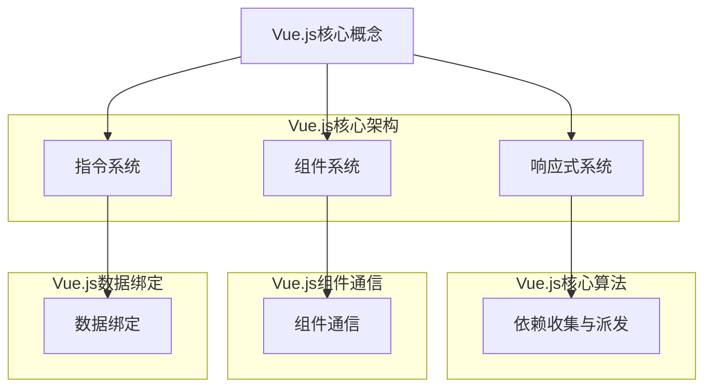

                 

### 《Vue.js 入门：渐进式 JavaScript 框架》

> 关键词：Vue.js、JavaScript框架、渐进式、前端开发、响应式、组件化、路由管理、Vuex状态管理

> 摘要：本文将带领读者逐步了解Vue.js，一个渐进式JavaScript框架。我们将从Vue.js的历史和背景开始，深入探讨其核心特性和优势，并详细介绍其开发环境的搭建。随后，我们将逐步学习Vue.js的基本语法，包括模板语法、数据绑定和计算属性等。接着，我们将深入研究Vue.js的组件化开发，讲解组件的基本概念、创建和使用，以及组件之间的通信。本文还将探讨Vue Router和Vuex的使用，介绍它们的安装、配置和应用。此外，我们还将讨论Vue.js的响应式原理，解释其依赖收集和派发机制。最后，我们将通过实际项目实战，展示Vue.js的开发流程、状态管理、路由管理和测试部署，并总结Vue.js的优缺点及其未来发展趋势。读者将通过本文全面掌握Vue.js，为成为专业的前端开发者打下坚实基础。

---

### 《Vue.js 入门：渐进式 JavaScript 框架》目录大纲

1. **第一部分：Vue.js基础**
   - **第1章：Vue.js概述**
     - **1.1 Vue.js的历史和背景**
     - **1.2 Vue.js的核心特性和优势**
     - **1.3 Vue.js的开发环境搭建**
   - **第2章：Vue.js的基本语法**
     - **2.1 Vue.js的模板语法**
     - **2.2 Vue.js的数据绑定**
     - **2.3 Vue.js的计算属性和侦听器**
   - **第3章：Vue.js的组件化开发**
     - **3.1 Vue组件的基本概念**
     - **3.2 Vue组件的创建和使用**
     - **3.3 Vue组件的通信**
   - **第4章：Vue.js的Vue Router**
     - **4.1 Vue Router的基本概念**
     - **4.2 Vue Router的安装和使用**
     - **4.3 Vue Router的导航守卫和动态路由匹配**
   - **第5章：Vue.js的Vuex**
     - **5.1 Vuex的基本概念**
     - **5.2 Vuex的安装和使用**
     - **5.3 Vuex的模块化**
   - **第6章：Vue.js的响应式原理**
     - **6.1 Vue的响应式原理**
     - **6.2 Vue的依赖收集和派发原理**
     - **6.3 Vue的优化策略**
   - **第7章：Vue.js的实战应用**
     - **7.1 Vue项目开发流程**
     - **7.2 Vue项目的状态管理**
     - **7.3 Vue项目的路由管理**
     - **7.4 Vue项目的测试与部署**

2. **第二部分：高级Vue.js应用**
   - **第8章：Vue.js的过渡和动画**
     - **8.1 Vue的过渡效果**
     - **8.2 Vue的动画效果**
     - **8.3 Vue的动态过渡和动画**
   - **第9章：Vue.js的插槽和异步组件**
     - **9.1 Vue的插槽机制**
     - **9.2 Vue的异步组件**
     - **9.3 Vue的异步组件优化**
   - **第10章：Vue.js的测试与调试**
     - **10.1 Vue单元测试**
     - **10.2 Vue端到端测试**
     - **10.3 Vue的调试工具**
   - **第11章：Vue.js的生态扩展**
     - **11.1 Vue的UI组件库**
     - **11.2 Vue的第三方库和插件**
     - **11.3 Vue的国际化**
   - **第12章：Vue.js的优缺点与未来发展趋势**
     - **12.1 Vue.js的优缺点分析**
     - **12.2 Vue.js的未来发展趋势**
     - **12.3 Vue.js在企业级应用中的前景**

3. **附录**
   - **附录A：Vue.js开发资源**
     - **A.1 Vue.js官方文档**
     - **A.2 Vue.js社区和论坛**
     - **A.3 Vue.js优秀案例和教程**
     - **A.4 Vue.js技术栈集成指南**

通过这个目录大纲，我们将系统地学习Vue.js的基础知识和高级应用，为成为一名合格的前端开发者打下坚实的基础。每章内容都将围绕Vue.js的核心概念和技术原理进行详细讲解，并结合实际案例进行剖析，帮助读者深入理解和掌握Vue.js的各个方面。

---

### 第一部分：Vue.js基础

#### 第1章：Vue.js概述

作为现代前端开发中广泛使用的JavaScript框架，Vue.js凭借其渐进式、简单易用和高效的特点，已经成为前端开发者们的首选。在这一章中，我们将介绍Vue.js的历史、背景以及它的核心特性和优势，帮助读者对Vue.js有一个全面的认识。

#### 1.1 Vue.js的历史和背景

Vue.js是由前Google员工Evan You于2014年创建的，其初衷是为了解决前端的构建问题。Vue.js的发布始于2014年，经过几年的发展，它已经成为一个功能丰富、社区活跃的JavaScript框架。Vue.js的名称来源于其前缀“Vue”，法语中意为“看看”，象征着Vue.js希望通过简洁直观的界面帮助开发者“看看”并更好地理解和构建复杂的交互式Web应用。

Vue.js之所以能够在短时间内获得广泛的关注，离不开其优秀的特性和易用性。Vue.js旨在简化前端开发流程，提高开发效率，使得开发者能够更加专注于业务逻辑的实现，而不是底层的技术细节。Vue.js的设计理念是“渐进式框架”，这意味着开发者可以根据项目的需要，逐步引入Vue.js的各个功能模块，而不是一开始就需要全部掌握。

#### 1.2 Vue.js的核心特性和优势

Vue.js的核心特性和优势如下：

1. **渐进式框架**：Vue.js的设计非常灵活，可以逐步引入。开发者可以从最简单的数据绑定开始使用Vue.js，然后逐渐引入组件化、路由管理、状态管理等高级功能。这种渐进式的设计使得Vue.js适合各种规模的项目，从简单的个人博客到复杂的企业级应用。

2. **响应式系统**：Vue.js使用响应式系统来追踪数据变化。当数据发生变化时，Vue.js能够自动更新DOM，这一特性极大地简化了数据绑定和状态管理的复杂度。

3. **组件化开发**：Vue.js的组件化开发使得开发者可以将UI界面拆分成多个独立的组件，这些组件可以独立开发、测试和维护。组件化不仅提高了代码的可复用性，还提高了项目的可维护性。

4. **高效的虚拟DOM**：Vue.js使用虚拟DOM来优化性能。虚拟DOM是一种在内存中构建的DOM结构，只有当数据发生变化时，虚拟DOM才会与实际的DOM进行对比并更新，这极大地减少了浏览器的渲染开销。

5. **简洁的语法**：Vue.js采用了简洁直观的模板语法，使得开发者能够快速上手。Vue.js的模板语法易于理解和阅读，同时与现有的HTML语法无缝集成。

6. **强大的生态系统**：Vue.js拥有一个强大的生态系统，包括Vue Router、Vuex、Vue Test Utils等官方库，以及众多第三方库和插件，为开发者提供了丰富的工具和资源。

#### 1.3 Vue.js的开发环境搭建

要开始使用Vue.js，我们需要搭建一个合适的工作环境。以下是搭建Vue.js开发环境的基本步骤：

1. **安装Node.js**：Vue.js依赖于Node.js，因此首先需要安装Node.js。可以从[Node.js官网](https://nodejs.org/)下载并安装最新版本的Node.js。

2. **安装Vue CLI**：Vue CLI是Vue.js的官方命令行工具，用于快速生成和管理Vue.js项目。在命令行中运行以下命令来全局安装Vue CLI：

   ```bash
   npm install -g @vue/cli
   ```

   或者使用Yarn：

   ```bash
   yarn global add @vue/cli
   ```

3. **创建Vue项目**：安装Vue CLI后，可以使用它来创建新的Vue.js项目。在命令行中运行以下命令：

   ```bash
   vue create my-vue-project
   ```

   这里`my-vue-project`是一个自定义的项目名称。根据提示选择项目配置，Vue CLI将自动生成一个包含基础结构的Vue.js项目。

4. **启动开发服务器**：进入项目目录并启动开发服务器：

   ```bash
   cd my-vue-project
   npm run serve
   ```

   或者使用Yarn：

   ```bash
   cd my-vue-project
   yarn serve
   ```

   这将在本地启动一个开发服务器，通常在浏览器中打开`http://localhost:8080/`即可看到项目。

通过以上步骤，我们成功搭建了Vue.js的开发环境，并可以开始创建和运行Vue.js项目。

---

在这一章中，我们了解了Vue.js的历史背景、核心特性和优势，以及如何搭建Vue.js的开发环境。Vue.js作为一个渐进式JavaScript框架，以其简单易用、高效和强大的特性，受到了广泛的前端开发者的青睐。在接下来的章节中，我们将逐步深入探讨Vue.js的基本语法和核心概念，帮助读者更加全面地掌握Vue.js。

---

### 第2章：Vue.js的基本语法

在了解了Vue.js的基本概况后，接下来我们将详细学习Vue.js的基本语法，包括模板语法、数据绑定和计算属性等。这些基本语法是构建Vue.js应用程序的核心，是理解Vue.js响应式系统和组件化开发的基础。

#### 2.1 Vue.js的模板语法

Vue.js的模板语法是其核心特性之一，它允许开发者以简洁明了的方式在HTML中插入JavaScript表达式和指令。模板语法主要包括插值、指令和过滤器。

1. **插值**

   插值是Vue.js中最基本的数据绑定方式，它允许开发者将数据动态地渲染到HTML中。插值有两种形式：文本插值和属性插值。

   - **文本插值**：

     ```html
     <div>{{ message }}</div>
     ```

     在这个例子中，`{{ message }}`是一个文本插值表达式，它会将`message`变量的值渲染到标签内。

   - **属性插值**：

     ```html
     <div id="{{ id }}"></div>
     ```

     属性插值允许开发者动态设置HTML属性。例如，上面的例子会将`id`变量的值设置为`div`标签的`id`属性。

2. **指令**

   指令是Vue.js模板语法的核心，用于执行各种操作。下面介绍几个常用的指令：

   - **v-bind**：

     用于动态绑定属性值，等同于使用`:`符号。

     ```html
     
     ```

     简写形式：

     ```html
     
     ```

   - **v-model**：

     用于在表单元素上创建双向数据绑定。

     ```html
     <input v-model="inputValue">
     ```

   - **v-for**：

     用于遍历数组，生成多个DOM元素。

     ```html
     <ul>
       <li v-for="item in items">{{ item }}</li>
     </ul>
     ```

   - **v-if** 和 **v-else-if**：

     用于条件性地渲染或隐藏元素。

     ```html
     <template v-if="condition">
       <h1>条件为真</h1>
     </template>
     <template v-else>
       <h1>条件为假</h1>
     </template>
     ```

   - **v-show**：

     用于根据条件显示或隐藏元素，与`v-if`不同的是，它仅仅切换元素的CSS属性`display`。

     ```html
     <h1 v-show="isVisible">可见</h1>
     ```

3. **过滤器**

   Vue.js过滤器用于对模板中的数据进行格式化。过滤器通过管道符（`|`）应用到插值或绑定中。

   ```html
   <div>{{ message | upperCase }}</div>
   ```

   在这个例子中，`upperCase`是一个自定义过滤器，它将`message`变量的值转换为大写形式。

#### 2.2 Vue.js的数据绑定

Vue.js的数据绑定机制是其响应式系统的核心。当数据发生变化时，Vue.js能够自动更新DOM，保持数据与视图的一致性。数据绑定主要有以下几种形式：

1. **单向绑定**：

   单向绑定是指数据变化时，DOM会更新，但DOM的变化不会影响数据。

   - **v-bind**：

     ```html
     
     ```

   - **v-model**：

     虽然v-model默认是双向绑定，但在某些情况下可以设置为单向绑定。

     ```html
     <input v-model="inputValue" v-bind:value="inputValue">
     ```

2. **双向绑定**：

   双向绑定是指数据变化时，DOM会更新，DOM的变化也会影响数据。

   - **v-model**：

     ```html
     <input v-model="inputValue">
     ```

   双向绑定通常用于表单输入控件，如文本输入框、复选框和单选按钮等。

#### 2.3 Vue.js的计算属性和侦听器

计算属性和侦听器是Vue.js提供的高级数据绑定机制，用于处理复杂的计算逻辑。

1. **计算属性**：

   计算属性是基于其依赖属性进行缓存的计算结果。只有当依赖属性发生变化时，计算属性才会重新计算。

   ```javascript
   computed: {
     reversedMessage() {
       return this.message.split('').reverse().join('');
     }
   }
   ```

   在模板中访问计算属性：

   ```html
   <div>{{ reversedMessage }}</div>
   ```

2. **侦听器**：

   侦听器可以监听数据的变化，并在变化时执行特定的回调函数。与计算属性不同的是，侦听器不会缓存结果，每次触发都会执行回调。

   ```javascript
   watch: {
     price() {
       // 当price发生变化时执行的代码
     }
   }
   ```

   侦听器可以带有参数，如新值和旧值：

   ```javascript
   watch: {
     price(newValue, oldValue) {
       // 新值和旧值
     }
   }
   ```

通过上述内容，我们详细介绍了Vue.js的基本语法，包括模板语法、数据绑定和计算属性。这些基本语法是理解Vue.js响应式系统和组件化开发的关键。在下一章中，我们将进一步探讨Vue.js的组件化开发，讲解组件的基本概念、创建和使用，以及组件之间的通信。

---

### 第3章：Vue.js的组件化开发

组件化开发是Vue.js的核心思想之一，它允许开发者将UI界面拆分成多个独立的、可复用的组件。通过组件化开发，不仅可以提高代码的可维护性和可复用性，还能降低开发成本，提升开发效率。本章将详细讲解Vue.js组件的基本概念、创建和使用，以及组件之间的通信。

#### 3.1 Vue组件的基本概念

在Vue.js中，组件（Component）是一个可复用的Vue实例，它包含了自己的模板、样式和行为。组件可以使代码更易于维护，提高代码的可读性，同时使得开发过程更加模块化。

Vue组件可以分为三类：

1. **全局组件**：全局组件可以在任何Vue实例中直接使用，通常用于跨组件共享功能。
2. **局部组件**：局部组件只能在创建它的Vue实例中引用，适用于在特定组件间共享功能。
3. **内置组件**：Vue提供了一些内置组件，如`<transition>`、`<keep-alive>`等，用于实现特殊的UI效果。

#### 3.2 Vue组件的创建和使用

创建Vue组件有几种方式，下面分别介绍：

1. **使用`<template>`标签**：

   ```html
   <template>
     <div>
       <h2>{{ title }}</h2>
       <p>{{ content }}</p>
     </div>
   </template>

   <script>
   export default {
     name: 'MyComponent',
     data() {
       return {
         title: '组件标题',
         content: '组件内容'
       };
     }
   };
   </script>
   ```

   在这里，我们定义了一个名为`MyComponent`的全局组件，使用`<template>`标签定义组件的结构，使用`<script>`标签定义组件的逻辑和状态。

2. **使用`Vue.component()`方法**：

   ```javascript
   Vue.component('my-component', {
     template: '<div><h2>{{ title }}</h2><p>{{ content }}</p></div>',
     data() {
       return {
         title: '组件标题',
         content: '组件内容'
       };
     }
   });
   ```

   这种方法可以直接通过Vue实例的`Vue.component()`方法注册全局组件。

3. **使用文件系统**：

   通过创建单独的`.vue`文件，可以将组件模板、样式和脚本分离。

   ```html
   <!-- MyComponent.vue -->
   <template>
     <div>
       <h2>{{ title }}</h2>
       <p>{{ content }}</p>
     </div>
   </template>

   <script>
   export default {
     name: 'MyComponent',
     data() {
       return {
         title: '组件标题',
         content: '组件内容'
       };
     }
   };
   </script>

   <style>
   /* 组件的样式 */
   </style>
   ```

   在Vue项目中，可以通过Vue CLI自动导入和使用这些文件系统组件。

#### 3.3 Vue组件的通信

组件之间的通信是Vue.js组件化开发中至关重要的一部分。Vue.js提供了多种通信方式，包括props、events和插槽。

1. **Props**：

   Props是父组件向子组件传递数据的一种方式。子组件通过props接收来自父组件的数据。

   - **父组件传递数据**：

     ```html
     <my-component :title="parentTitle" :content="parentContent"></my-component>
     ```

     在这里，`parentTitle`和`parentContent`是从父组件传递给子组件的属性。

   - **子组件使用数据**：

     ```html
     <template>
       <div>
         <h2>{{ title }}</h2>
         <p>{{ content }}</p>
       </div>
     </template>

     <script>
     export default {
       props: ['title', 'content']
     };
     </script>
     ```

2. **Events**：

   Events是子组件向父组件发送数据的一种方式。子组件通过自定义事件向父组件传递信息。

   - **子组件触发事件**：

     ```html
     <template>
       <div>
         <h2>{{ title }}</h2>
         <p>{{ content }}</p>
         <button @click="notifyParent">通知父组件</button>
       </div>
     </template>

     <script>
     export default {
       methods: {
         notifyParent() {
           this.$emit('my-event', '子组件数据');
         }
       }
     };
     </script>
     ```

   - **父组件监听事件**：

     ```html
     <my-component @my-event="handleMyEvent"></my-component>
     ```

     在这里，`handleMyEvent`是父组件定义的一个方法，用于处理子组件发送的数据。

3. **插槽**：

   插槽是Vue.js提供的一种强大机制，用于组件之间的内容分发。

   - **父组件使用插槽**：

     ```html
     <my-component>
       <h2 slot="header">这是标题</h2>
       <p slot="body">这是内容</p>
     </my-component>
     ```

     在这里，`<slot>`标签定义了两个插槽：`header`和`body`。

   - **子组件定义插槽**：

     ```html
     <template>
       <div>
         <slot name="header"></slot>
         <slot name="body"></slot>
       </div>
     </template>
     ```

通过以上介绍，我们可以看到Vue.js组件化开发不仅简单易懂，而且功能强大。组件化开发使得代码更加模块化、可复用，大大提高了开发效率。在下一章中，我们将深入学习Vue Router的使用，探讨Vue应用程序的路由管理。

---

### 第4章：Vue.js的Vue Router

在构建复杂的前端应用程序时，路由管理是必不可少的一部分。Vue Router是Vue.js的官方路由管理器，它允许开发者根据不同的URL动态地展示不同的内容。本章将详细介绍Vue Router的基本概念、安装和使用，以及导航守卫和动态路由匹配。

#### 4.1 Vue Router的基本概念

Vue Router是一个基于Vue.js的路由管理器，它允许开发者定义路由规则，并支持动态路由和导航守卫等功能。Vue Router的核心概念包括路由（Route）、路由器（Router）和视图（View）。

1. **路由（Route）**：

   路由是定义URL与组件之间映射的一种规则。每个路由都包含一个路径（path）和一个组件（component）。例如：

   ```javascript
   {
     path: '/home',
     component: Home
   }
   ```

   在这个例子中，当用户访问`/home`路径时，将显示`Home`组件。

2. **路由器（Router）**：

   路由器是Vue Router的核心，它管理路由规则和路由状态。通过创建Vue Router实例，可以注册路由规则并处理导航。

   ```javascript
   const router = new VueRouter({
     routes: [
       { path: '/home', component: Home },
       { path: '/about', component: About }
     ]
   });
   ```

3. **视图（View）**：

   视图是渲染路由组件的地方，通常是一个`<router-view>`元素。通过改变路由，可以动态地替换视图中的内容。

   ```html
   <div id="app">
     <router-view></router-view>
   </div>
   ```

#### 4.2 Vue Router的安装和使用

要使用Vue Router，需要先安装它。Vue Router可以通过npm或Yarn进行安装：

```bash
npm install vue-router
```

或者：

```bash
yarn add vue-router
```

安装完成后，可以在Vue项目中引入Vue Router并初始化。

1. **创建Vue Router实例**：

   ```javascript
   import Vue from 'vue';
   import VueRouter from 'vue-router';

   Vue.use(VueRouter);

   const router = new VueRouter({
     routes: [
       { path: '/', component: Home },
       { path: '/about', component: About }
     ]
   });
   ```

2. **在Vue实例中注入路由器**：

   ```javascript
   new Vue({
     router,
     render: h => h(App)
   }).$mount('#app');
   ```

3. **在模板中使用路由**：

   ```html
   <div id="app">
     <nav>
       <router-link to="/">Home</router-link>
       <router-link to="/about">About</router-link>
     </nav>
     <router-view></router-view>
   </div>
   ```

通过以上步骤，我们成功地在Vue应用程序中设置了Vue Router，并可以在不同的路径间进行切换。

#### 4.3 Vue Router的导航守卫和动态路由匹配

导航守卫是Vue Router提供的一种机制，允许开发者拦截和修改导航行为。导航守卫分为全局守卫、路由级守卫和组件内守卫。

1. **全局守卫**：

   全局守卫在每次路由改变之前或之后执行。例如：

   ```javascript
   router.beforeEach((to, from, next) => {
     // 执行逻辑
     next();
   });
   ```

2. **路由级守卫**：

   路由级守卫针对特定的路由进行拦截。例如：

   ```javascript
   router.beforeEach({
     path: '/about',
     component: About,
     beforeEnter: (to, from, next) => {
       // 执行逻辑
       next();
     }
   });
   ```

3. **组件内守卫**：

   组件内守卫允许组件内部拦截和修改导航行为。例如：

   ```javascript
   export default {
     beforeRouteEnter(to, from, next) {
       // 执行逻辑
       next();
     },
     beforeRouteUpdate(to, from, next) {
       // 执行逻辑
       next();
     },
     beforeRouteLeave(to, from, next) {
       // 执行逻辑
       next();
     }
   };
   ```

动态路由匹配允许开发者根据路由参数动态地渲染组件。例如：

```javascript
{
  path: '/user/:id',
  component: User,
  props: true
}
```

在这个例子中，`/user/:id`是一个动态路由，它会根据路径中的`id`参数渲染`User`组件。

通过以上内容，我们详细介绍了Vue Router的基本概念、安装和使用，以及导航守卫和动态路由匹配。Vue Router为Vue.js应用程序提供了强大的路由管理功能，使得开发者可以更灵活地构建动态的交互式Web应用。在下一章中，我们将探讨Vuex的使用，了解Vue应用程序的状态管理。

---

### 第5章：Vue.js的Vuex

在构建复杂的前端应用程序时，状态管理是关键的一环。Vuex是Vue.js的官方状态管理库，它提供了一种集中式存储和管理应用所有状态的方法。Vuex的核心概念包括状态（State）、 getters、mutations、actions和模块（Module）。本章将详细介绍Vuex的基本概念、安装和使用，以及Vuex的模块化。

#### 5.1 Vuex的基本概念

Vuex的核心概念如下：

1. **状态（State）**：

   状态是应用程序的数据源，它包含所有需要共享的全局数据。状态通常是一个对象，可以通过Vuex的store访问和修改。

   ```javascript
   const state = {
     count: 0
   };
   ```

2. **getters**：

   Getters是计算属性，用于根据状态返回派生状态。它们可以用于简化对状态的计算，并且可以在任何组件中访问。

   ```javascript
   const getters = {
     evenOrOdd: state => state.count % 2 === 0 ? '偶数' : '奇数'
   };
   ```

3. **mutations**：

   Mutations是用于更改状态的唯一方式。它们是同步操作，并且只能通过提交（commit）来触发。

   ```javascript
   const mutations = {
     increment(state) {
       state.count++;
     },
     decrement(state) {
       state.count--;
     }
   };
   ```

4. **actions**：

   Actions是用于异步操作的函数。它们可以通过触发mutations来更改状态，并且可以通过携带参数和载荷来传递更复杂的数据。

   ```javascript
   const actions = {
     async increment({ commit }) {
       // 异步操作
       commit('increment');
     },
     async decrement({ commit }) {
       // 异步操作
       commit('decrement');
     }
   };
   ```

5. **模块（Module）**：

   模块是Vuex的一个高级功能，它允许开发者将不同的状态、getters、mutations和actions拆分成独立的模块，使得大型应用程序的状态管理更加清晰和模块化。

   ```javascript
   const moduleA = {
     namespaced: true,
     state: { count: 0 },
     getters: { evenOrOdd: ... },
     mutations: { increment: ... },
     actions: { increment: ... }
   };

   const store = new Vuex.Store({
     modules: {
       a: moduleA
     }
   });
   ```

#### 5.2 Vuex的安装和使用

要使用Vuex，需要先安装它。Vuex可以通过npm或Yarn进行安装：

```bash
npm install vuex
```

或者：

```bash
yarn add vuex
```

安装完成后，可以在Vue项目中引入Vuex并初始化。

1. **创建Vuex Store**：

   ```javascript
   import Vue from 'vue';
   import Vuex from 'vuex';

   Vue.use(Vuex);

   const store = new Vuex.Store({
     state: {
       count: 0
     },
     getters: {
       evenOrOdd: state => state.count % 2 === 0 ? '偶数' : '奇数'
     },
     mutations: {
       increment(state) {
         state.count++;
       },
       decrement(state) {
         state.count--;
       }
     },
     actions: {
       increment({ commit }) {
         commit('increment');
       },
       decrement({ commit }) {
         commit('decrement');
       }
     }
   });
   ```

2. **在Vue实例中注入Store**：

   ```javascript
   new Vue({
     el: '#app',
     store,
     render: h => h(App)
   });
   ```

3. **在组件中使用状态**：

   - **访问状态**：

     ```javascript
     computed: {
       count() {
         return this.$store.state.count;
       }
     }
     ```

   - **提交mutation**：

     ```javascript
     methods: {
       increment() {
         this.$store.commit('increment');
       },
       decrement() {
         this.$store.commit('decrement');
       }
     }
     ```

   - **分发action**：

     ```javascript
     methods: {
       async incrementAsync() {
         await this.$store.dispatch('increment');
       },
       async decrementAsync() {
         await this.$store.dispatch('decrement');
       }
     }
     ```

通过以上步骤，我们成功地在Vue应用程序中设置了Vuex，并可以在组件中访问和修改状态。Vuex为Vue.js应用程序提供了一种强大且灵活的状态管理方案，使得开发者可以更好地管理复杂的应用程序状态。在下一章中，我们将探讨Vue.js的响应式原理，深入理解其实现机制。

---

### 第6章：Vue.js的响应式原理

Vue.js的响应式原理是其核心特性之一，它使得Vue.js能够自动追踪和更新数据变化。理解Vue.js的响应式原理对于开发高效的Vue.js应用程序至关重要。本章将深入探讨Vue.js的响应式原理，包括依赖收集和派发机制，并讨论Vue.js的优化策略。

#### 6.1 Vue的响应式原理

Vue.js使用响应式系统来追踪数据变化。当数据发生变化时，Vue.js能够自动更新DOM，确保数据与视图保持一致。Vue的响应式系统主要依赖于以下概念：

1. **响应式对象**：

   Vue.js通过`Object.defineProperty()`方法将每个属性转换成getter和setter，从而实现响应式。当访问或修改属性时，getter和setter会被触发，触发依赖收集和派发机制。

2. **依赖收集**：

   当访问数据时，Vue.js会创建一个`watcher`对象，并将其添加到属性依赖列表中。这样，当数据变化时，可以通过依赖列表通知到所有相关的`watcher`。

3. **派发更新**：

   当数据发生变化时，Vue.js会触发依赖的`watcher`对象，并执行相应的更新操作，最终更新DOM。

#### 6.2 Vue的依赖收集和派发原理

Vue.js的依赖收集和派发过程可以概括为以下几个步骤：

1. **初始化数据**：

   当创建Vue实例时，数据对象会被代理到观察者对象上。Vue.js通过`Object.defineProperty()`方法遍历数据对象的每个属性，为每个属性设置getter和setter。

2. **依赖收集**：

   当数据属性被访问时，触发getter方法。getter方法会添加当前的`watcher`对象到依赖列表中。

   ```javascript
   function observer(value) {
     if (!isObject(value)) return;
     Object.keys(value).forEach(key => {
       defineReactive(value, key, value[key]);
     });
   }

   function defineReactive(obj, key, value) {
     observer(value);
     Object.defineProperty(obj, key, {
       get: function reactiveGetter() {
         track(obj, key);
         return value;
       },
       set: function reactiveSetter(newValue) {
         if (newValue === value) return;
         value = newValue;
         trigger(obj, key);
       }
     });
   }

   function track(target, key) {
     // 实现依赖的收集
   }

   function trigger(target, key) {
     // 实现依赖的派发
   }
   ```

3. **派发更新**：

   当数据属性被修改时，触发setter方法。setter方法会通知所有与该属性关联的`watcher`对象，并执行相应的更新操作。

   ```javascript
   function trigger(target, key) {
     const watcher = target._watcher;
     if (watcher) {
       watcher.update();
     }
   }

   function updateComponent() {
     // 实现组件的更新
   }
   ```

#### 6.3 Vue的优化策略

Vue.js在实现响应式系统时，采取了一系列优化策略，以提高性能：

1. **对象劫持**：

   Vue.js使用`Object.defineProperty()`方法对对象的属性进行劫持，从而实现响应式。这种方法相比于其他实现方式（如遍历整个对象）要高效得多。

2. **依赖收集的批量处理**：

   Vue.js使用`Dep`类来管理依赖。在依赖收集过程中，Vue.js会将所有`watcher`对象添加到一个队列中，并批量处理。这样可以减少不必要的计算，提高性能。

3. **懒加载**：

   Vue.js在初始化时并不会立即执行依赖收集，而是在数据变化时才进行。这样可以避免在初始化阶段进行不必要的计算，提高性能。

4. **虚拟DOM**：

   Vue.js使用虚拟DOM来优化渲染性能。虚拟DOM是一种在内存中构建的DOM结构，只有当数据发生变化时，虚拟DOM才会与实际的DOM进行对比并更新，从而减少浏览器的渲染开销。

通过以上内容，我们深入探讨了Vue.js的响应式原理，包括依赖收集和派发机制，并讨论了Vue.js的优化策略。理解Vue.js的响应式原理对于开发高效的Vue.js应用程序至关重要。在下一章中，我们将通过实际项目实战，展示Vue.js的开发流程、状态管理、路由管理和测试部署。

---

### 第7章：Vue.js的实战应用

在前几章中，我们详细介绍了Vue.js的基础知识，包括其历史、特性、基本语法、组件化开发、路由管理和状态管理。为了更好地理解和掌握Vue.js，本章将通过一个实际项目实战，展示Vue.js的开发流程、状态管理、路由管理和测试部署。

#### 7.1 Vue项目开发流程

一个Vue.js项目的开发流程通常包括以下几个步骤：

1. **项目初始化**：

   使用Vue CLI创建一个新的Vue.js项目。在命令行中运行以下命令：

   ```bash
   vue create my-vue-project
   ```

   然后按照提示选择项目配置，Vue CLI将自动生成一个包含基础结构的Vue.js项目。

2. **搭建项目结构**：

   在创建的项目中，通常会有以下几个目录和文件：

   - `src/`：项目源代码目录，包含组件、视图、样式和脚本。
   - `src/components/`：存放公共组件。
   - `src/views/`：存放页面组件。
   - `src/App.vue`：应用的根组件。
   - `src/main.js`：入口文件，用于创建Vue实例并启动应用。

3. **创建组件**：

   在`src/components/`目录中创建所需的组件。例如，创建一个名为`Counter.vue`的计数器组件：

   ```vue
   <!-- Counter.vue -->
   <template>
     <div>
       <h2>{{ count }}</h2>
       <button @click="increment">增加</button>
       <button @click="decrement">减少</button>
     </div>
   </template>

   <script>
   export default {
     data() {
       return {
         count: 0
       };
     },
     methods: {
       increment() {
         this.count++;
       },
       decrement() {
         this.count--;
       }
     }
   };
   </script>
   ```

4. **编写页面逻辑**：

   在`src/views/`目录中创建页面组件。例如，创建一个名为`Home.vue`的首页组件：

   ```vue
   <!-- Home.vue -->
   <template>
     <div>
       <h1>首页</h1>
       <counter></counter>
     </div>
   </template>

   <script>
   import Counter from '@/components/Counter.vue';

   export default {
     components: {
       Counter
     }
   };
   </script>
   ```

5. **配置路由**：

   使用Vue Router配置路由。在`src/router/`目录中创建`index.js`文件，配置路由规则：

   ```javascript
   import Vue from 'vue';
   import Router from 'vue-router';
   import Home from '@/views/Home.vue';

   Vue.use(Router);

   export default new Router({
     routes: [
       {
         path: '/',
         name: 'home',
         component: Home
       }
     ]
   });
   ```

6. **配置Vuex**：

   使用Vuex配置状态管理。在`src/store/`目录中创建`index.js`文件，配置Vuex store：

   ```javascript
   import Vue from 'vue';
   import Vuex from 'vuex';

   Vue.use(Vuex);

   export default new Vuex.Store({
     state: {
       count: 0
     },
     mutations: {
       increment(state) {
         state.count++;
       },
       decrement(state) {
         state.count--;
       }
     }
   });
   ```

7. **创建主组件**：

   在`src/App.vue`文件中，引入并配置路由和Vuex store：

   ```vue
   <template>
     <div id="app">
       <router-view />
     </div>
   </template>

   <script>
   import Router from './router';
   import Store from './store';

   export default {
     name: 'App',
     router: Router,
     store: Store
   };
   </script>
   ```

8. **启动开发服务器**：

   在项目根目录中，运行以下命令启动开发服务器：

   ```bash
   npm run serve
   ```

   这将在本地启动一个开发服务器，通常在浏览器中打开`http://localhost:8080/`即可看到项目。

#### 7.2 Vue项目的状态管理

在Vue.js项目中，状态管理是确保数据一致性和可维护性的关键。Vuex为Vue.js提供了一种集中式状态管理方案，使得开发者可以更方便地管理全局状态。

1. **创建Vuex Store**：

   在`src/store/`目录中创建`index.js`文件，定义Vuex store：

   ```javascript
   import Vue from 'vue';
   import Vuex from 'vuex';

   Vue.use(Vuex);

   const store = new Vuex.Store({
     state: {
       count: 0
     },
     mutations: {
       increment(state) {
         state.count++;
       },
       decrement(state) {
         state.count--;
       }
     },
     actions: {
       increment({ commit }) {
         commit('increment');
       },
       decrement({ commit }) {
         commit('decrement');
       }
     }
   });

   export default store;
   ```

2. **在组件中使用Vuex**：

   - **访问状态**：

     ```javascript
     computed: {
       count() {
         return this.$store.state.count;
       }
     }
     ```

   - **提交mutation**：

     ```javascript
     methods: {
       increment() {
         this.$store.commit('increment');
       },
       decrement() {
         this.$store.commit('decrement');
       }
     }
     ```

   - **分发action**：

     ```javascript
     methods: {
       async incrementAsync() {
         await this.$store.dispatch('increment');
       },
       async decrementAsync() {
         await this.$store.dispatch('decrement');
       }
     }
     ```

3. **模块化Vuex**：

   对于大型项目，可以使用Vuex的模块化功能，将不同的状态、mutations、actions和getters拆分成独立的模块。

   ```javascript
   const moduleA = {
     namespaced: true,
     state: { count: 0 },
     mutations: { increment: ... },
     actions: { increment: ... }
   };

   const store = new Vuex.Store({
     modules: {
       a: moduleA
     }
   });
   ```

通过以上步骤，我们成功地配置了Vue项目的状态管理，并可以在组件中访问和修改状态。Vuex为Vue.js项目提供了一种强大且灵活的状态管理方案，使得开发者可以更好地管理复杂的应用程序状态。

#### 7.3 Vue项目的路由管理

Vue Router为Vue.js项目提供了一种灵活的路由管理方案，使得开发者可以轻松地实现多页面应用和动态路由。

1. **安装Vue Router**：

   使用npm或Yarn安装Vue Router：

   ```bash
   npm install vue-router
   ```

   或者：

   ```bash
   yarn add vue-router
   ```

2. **创建路由配置**：

   在`src/router/`目录中创建`index.js`文件，配置路由规则：

   ```javascript
   import Vue from 'vue';
   import Router from 'vue-router';
   import Home from '@/views/Home.vue';

   Vue.use(Router);

   export default new Router({
     routes: [
       {
         path: '/',
         name: 'home',
         component: Home
       }
     ]
   });
   ```

3. **在组件中使用路由**：

   - **导航链接**：

     ```vue
     <template>
       <div>
         <nav>
           <router-link to="/">首页</router-link>
           <router-link to="/about">关于我们</router-link>
         </nav>
         <router-view />
       </div>
     </template>
     ```

   - **路由视图**：

     ```vue
     <template>
       <div>
         <router-view />
       </div>
     </template>
     ```

4. **动态路由匹配**：

   动态路由匹配允许开发者根据路由参数动态地渲染组件。例如：

   ```javascript
   export default new Router({
     routes: [
       {
         path: '/user/:id',
         name: 'user',
         component: User
       }
     ]
   });
   ```

   在这里，`/user/:id`是一个动态路由，它会根据路径中的`id`参数渲染`User`组件。

通过以上步骤，我们成功地配置了Vue项目的路由管理，并可以在组件间进行切换。Vue Router为Vue.js项目提供了一种强大且灵活的路由管理方案，使得开发者可以更方便地实现复杂的应用程序。

#### 7.4 Vue项目的测试与部署

测试和部署是Vue.js项目开发的重要环节，确保项目的质量并使其在生产环境中稳定运行。

1. **单元测试**：

   使用Vue Test Utils进行单元测试，确保组件的功能正确。Vue Test Utils提供了丰富的API，用于模拟用户交互、断言和测试组件的输出。

   ```javascript
   import { shallowMount } from '@vue/test-utils';
   import Counter from '@/components/Counter.vue';

   describe('Counter.vue', () => {
     it('renders correct initial count', () => {
       const wrapper = shallowMount(Counter);
       expect(wrapper.find('h2').text()).toBe('0');
     });
   });
   ```

2. **端到端测试**：

   使用Cypress或Nightwatch进行端到端测试，确保整个应用程序的交互和功能正确。这些测试工具允许开发者模拟用户的浏览器行为，并在实际环境中测试应用程序。

   ```javascript
   it('visits the home page', () => {
     cy.visit('/');
     cy.contains('首页');
   });
   ```

3. **部署**：

   将Vue.js项目部署到生产环境，可以使用以下工具：

   - **Web服务器**：使用Nginx或Apache等Web服务器，将项目部署到服务器。
   - **静态资源服务器**：使用CDN或静态资源服务器，加速资源的加载。
   - **持续集成/持续部署（CI/CD）**：使用GitHub Actions、GitLab CI/CD或Jenkins等工具，实现自动化测试和部署。

通过以上步骤，我们成功地测试和部署了Vue.js项目。测试和部署是确保Vue.js项目质量的关键环节，确保项目在生产环境中稳定运行。

---

通过本章的实际项目实战，我们系统地介绍了Vue.js项目的开发流程、状态管理、路由管理和测试部署。Vue.js以其渐进式、简单易用和高效的特点，使得前端开发变得更加简单和高效。通过本章的实战，读者可以更好地掌握Vue.js的各个方面，为成为一名合格的前端开发者打下坚实的基础。在下一章中，我们将探讨Vue.js的高级应用，包括过渡和动画、插槽和异步组件，以及测试与调试。

---

### 第二部分：高级Vue.js应用

#### 第8章：Vue.js的过渡和动画

在Vue.js应用程序中，过渡和动画效果是提升用户体验的重要手段。通过Vue.js的过渡系统，开发者可以轻松地实现元素的动画效果，使用户界面更加生动和直观。本章将详细介绍Vue.js的过渡效果、动画效果以及动态过渡和动画。

#### 8.1 Vue的过渡效果

Vue的过渡效果允许开发者对DOM元素的变化进行平滑动画处理。Vue提供了多种方式来实现过渡效果，包括CSS过渡、CSS动画和JavaScript钩子。

1. **CSS过渡**：

   CSS过渡是最简单的一种过渡效果，它利用CSS的`transition`属性来实现。当DOM元素的属性发生变化时，Vue会自动触发过渡效果。

   ```html
   <template>
     <transition name="fade">
       <div v-if="show">Hello!</div>
     </transition>
   </template>

   <script>
   export default {
     data() {
       return {
         show: false
       };
     }
   };
   </script>

   <style>
   .fade-enter-active, .fade-leave-active {
     transition: opacity 1s;
   }
   .fade-enter, .fade-leave-to {
     opacity: 0;
   }
   </style>
   ```

   在这个例子中，当`show`属性为`true`时，`<div>`元素会逐渐淡入；当`show`属性为`false`时，`<div>`元素会逐渐淡出。

2. **CSS动画**：

   CSS动画与CSS过渡类似，但它使用`@keyframes`规则来定义动画。Vue可以自动应用这些动画。

   ```html
   <template>
     <transition name="bounce">
       <div v-if="show">Hello!</div>
     </transition>
   </template>

   <script>
   export default {
     data() {
       return {
         show: false
       };
     }
   };
   </script>

   <style>
   @keyframes bounce-in {
     0%, 20%, 53%, 80%, 100% {
       transform: translate3d(0, 0, 0);
       animation-timing-function: cubic-bezier(0.215, 0.610, 0.355, 1);
     }
     40% {
       transform: translate3d(0, 30px, 0);
       animation-timing-function: cubic-bezier(0.755, 0.050, 0.855, 0.060);
     }
     70% {
       transform: translate3d(0, -15px, 0);
       animation-timing-function: cubic-bezier(0.76,-0.48, 0.245, 1);
     }
   }
   .bounce-enter-active {
     animation: bounce-in 1s;
   }
   .bounce-leave-active {
     animation: bounce-in 1s reverse;
   }
   </style>
   ```

   在这个例子中，当`show`属性为`true`时，`<div>`元素会经历一个弹跳进入的动画；当`show`属性为`false`时，`<div>`元素会经历一个弹跳退出的动画。

3. **JavaScript钩子**：

   Vue提供了`enter-active-class`、`leave-active-class`等属性，允许开发者通过JavaScript钩子自定义过渡和动画的行为。

   ```html
   <template>
     <transition
       @before-enter="beforeEnter"
       @enter="enter"
       @after-enter="afterEnter"
       @before-leave="beforeLeave"
       @leave="leave"
       @after-leave="afterLeave"
     >
       <div v-if="show">Hello!</div>
     </transition>
   </template>

   <script>
   export default {
     data() {
       return {
         show: false
       };
     },
     methods: {
       beforeEnter(el) {
         el.style.opacity = 0;
       },
       enter(el, done) {
         setTimeout(() => {
           el.style.opacity = 1;
           done();
         }, 500);
       },
       afterEnter(el) {
         console.log('Animation finished');
       },
       beforeLeave(el) {
         el.style.opacity = 1;
       },
       leave(el, done) {
         setTimeout(() => {
           el.style.opacity = 0;
           done();
         }, 500);
       },
       afterLeave(el) {
         console.log('Leave animation finished');
       }
     }
   };
   </script>
   ```

#### 8.2 Vue的动画效果

Vue.js的动画效果主要依赖于CSS的`transition`和`animation`属性。Vue.js通过动态添加和移除类名来触发动画效果。

1. **使用`<transition>`标签**：

   ```html
   <template>
     <transition name="custom-classes">
       <div v-if="show">Hello!</div>
     </transition>
   </template>

   <script>
   export default {
     data() {
       return {
         show: false
       };
     }
   };
   </script>

   <style>
   .custom-classes-enter {
     opacity: 0;
     transform: translateY(-20px);
   }
   .custom-classes-enter-active {
     transition: all 1s ease;
   }
   .custom-classes-leave-to {
     opacity: 0;
     transform: translateY(20px);
   }
   .custom-classes-leave-active {
     transition: all 1s ease;
   }
   </style>
   ```

   在这个例子中，当`show`属性为`true`时，`<div>`元素会从顶部滑入；当`show`属性为`false`时，`<div>`元素会从顶部滑出。

2. **使用`<transition-group>`标签**：

   `<transition-group>`用于对一组元素进行过渡和动画处理，它允许元素在添加和删除时进行换位。

   ```html
   <template>
     <transition-group name="list" tag="div">
       <div v-for="item in items" :key="item.id">
         {{ item.text }}
       </div>
     </transition-group>
   </template>

   <script>
   export default {
     data() {
       return {
         items: [
           { id: 1, text: 'Item 1' },
           { id: 2, text: 'Item 2' },
           { id: 3, text: 'Item 3' },
         ]
       };
     }
   };
   </script>

   <style>
   .list-enter-active, .list-leave-active {
     transition: all 1s;
   }
   .list-enter, .list-leave-to {
     opacity: 0;
     transform: translateY(30px);
   }
   </style>
   ```

   在这个例子中，当`items`数组中的元素被添加或移除时，它们会进行平移和淡入淡出的动画。

#### 8.3 Vue的动态过渡和动画

动态过渡和动画是指通过Vue.js的`<transition>`和`<transition-group>`标签，根据条件动态地应用过渡和动画。

1. **条件动态过渡**：

   ```html
   <template>
     <transition name="fade" v-if="isVisible">
       <div>Hello!</div>
     </transition>
   </template>

   <script>
   export default {
     data() {
       return {
         isVisible: false
       };
     }
   };
   </script>

   <style>
   .fade-enter-active, .fade-leave-active {
     transition: opacity 1s;
   }
   .fade-enter, .fade-leave-to {
     opacity: 0;
   }
   </style>
   ```

   在这个例子中，只有当`isVisible`为`true`时，`<div>`元素才会显示并经历淡入动画。

2. **动态动画**：

   ```html
   <template>
     <transition :name="animationName" v-if="isVisible">
       <div>Hello!</div>
     </transition>
   </template>

   <script>
   export default {
     data() {
       return {
         isVisible: false,
         animationName: 'bounce'
       };
     }
   };
   </script>

   <style>
   @keyframes bounce-in {
     0%, 20%, 53%, 80%, 100% {
       transform: translate3d(0, 0, 0);
       animation-timing-function: cubic-bezier(0.215, 0.610, 0.355, 1);
     }
     40% {
       transform: translate3d(0, 30px, 0);
       animation-timing-function: cubic-bezier(0.755, 0.050, 0.855, 0.060);
     }
     70% {
       transform: translate3d(0, -15px, 0);
       animation-timing-function: cubic-bezier(0.76,-0.48, 0.245, 1);
     }
   }
   .bounce-enter-active {
     animation: bounce-in 1s;
   }
   .bounce-leave-active {
     animation: bounce-in 1s reverse;
   }
   </style>
   ```

   在这个例子中，通过动态绑定`animationName`属性，可以根据条件动态地应用不同的动画效果。

通过以上内容，我们详细介绍了Vue.js的过渡效果、动画效果以及动态过渡和动画。过渡和动画不仅提升了用户界面的视觉效果，还增强了用户体验。在下一章中，我们将探讨Vue.js的插槽和异步组件，了解Vue.js在组件通信和性能优化方面的应用。

---

### 第9章：Vue.js的插槽和异步组件

在Vue.js中，插槽和异步组件是增强组件灵活性和性能的重要机制。本章将详细介绍Vue.js的插槽机制和异步组件，以及它们的实际应用和优化策略。

#### 9.1 Vue的插槽机制

插槽（Slots）是Vue.js提供的一种组件内容分发机制，它允许开发者将父组件的内容插入到子组件的指定位置。通过插槽，组件可以拥有动态内容，实现更灵活的组件组合。

1. **基本概念**：

   插槽通过`<slot>`元素定义，可以在子组件中使用。子组件可以有一个或多个插槽，每个插槽可以有不同的名称。

   ```vue
   <!-- ParentComponent.vue -->
   <template>
     <div>
       <ChildComponent>
         <h1 slot="header">标题</h1>
         <p>内容</p>
       </ChildComponent>
     </div>
   </template>
   ```

   在这个例子中，`<ChildComponent>`拥有一个默认插槽和一个名为`"header"`的具名插槽。父组件通过插槽名称将内容插入到子组件的指定位置。

2. **具名插槽**：

   具名插槽允许开发者指定插槽的具体名称，并在模板中引用。

   ```vue
   <!-- ChildComponent.vue -->
   <template>
     <div>
       <slot name="header"></slot>
       <content></content>
       <slot></slot>
     </div>
   </template>
   ```

   在这个例子中，`<slot name="header">`定义了一个名为`"header"`的插槽，而`<slot>`定义了一个默认插槽。

3. **动态插槽**：

   Vue.js还支持动态插槽，允许开发者通过数据动态地确定插槽的名称。

   ```vue
   <template>
     <div>
       <ChildComponent :slotName="slotName">
         <h1>标题</h1>
       </ChildComponent>
     </div>
   </template>

   <script>
   export default {
     data() {
       return {
         slotName: 'header'
       };
     }
   };
   </script>
   ```

   在这个例子中，通过动态绑定`slotName`属性，可以将内容插入到不同的插槽。

#### 9.2 Vue的异步组件

异步组件是一种优化Vue.js应用程序性能的重要机制，它允许开发者将组件拆分为多个小块，并在需要时动态加载。通过异步组件，可以减少应用初始加载时间，提高性能。

1. **基本概念**：

   异步组件通过`import()`函数动态导入组件。在Vue中，可以使用`<template>`标签的`async`属性或`<script>`标签的`async`属性来定义异步组件。

   ```vue
   <!-- AsyncComponent.vue -->
   <template async>
     <div>Hello from AsyncComponent!</div>
   </template>
   ```

   或者：

   ```vue
   <!-- AsyncComponent.vue -->
   <script async>
     export default {
       template: '<div>Hello from AsyncComponent!</div>'
     };
   </script>
   ```

   在这个例子中，`<template async>`和`<script async>`属性指示Vue.js在需要时异步加载这个组件。

2. **组件懒加载**：

   通过在路由配置中使用异步组件，可以实现路由懒加载，只有在访问对应路由时才会加载组件。

   ```javascript
   const router = new VueRouter({
     routes: [
       {
         path: '/async-component',
         name: 'async-component',
         component: () => import('@/components/AsyncComponent.vue')
       }
     ]
   });
   ```

   在这个例子中，当用户访问`/async-component`路由时，Vue.js才会异步加载`AsyncComponent.vue`组件。

#### 9.3 Vue的异步组件优化

异步组件虽然可以优化应用程序的初始加载时间，但如果不合理使用，可能会导致性能问题。以下是一些优化异步组件的策略：

1. **按需加载**：

   只有在真正需要组件时才加载，避免提前加载不必要组件。例如，通过路由懒加载实现按需加载。

   ```javascript
   const router = new VueRouter({
     routes: [
       {
         path: '/user/:id',
         name: 'user',
         component: () => import(/* webpackChunkName: "user" */ '@/components/User.vue')
       }
     ]
   });
   ```

   通过使用`webpackChunkName`参数，可以将组件打包到不同的代码块，并在需要时异步加载。

2. **预加载**：

   预加载是一种优化策略，它预先加载即将使用的组件，减少用户等待时间。Vue.js通过`<keep-alive>`和`<router-view>`组件实现了预加载。

   ```vue
   <keep-alive>
     <router-view />
   </keep-alive>
   ```

   通过使用`<keep-alive>`，Vue.js可以缓存激活的路由组件，提高后续访问的速度。

3. **代码分割**：

   代码分割（Code Splitting）是将代码拆分为多个块，并在需要时异步加载。Vue.js通过Webpack的动态导入语法实现代码分割。

   ```javascript
   const User = () => import('@/components/User.vue');
   ```

   在这个例子中，`User`组件将在需要时异步加载。

4. **资源缓存**：

   通过合理配置Webpack的缓存策略，可以缓存组件代码和静态资源，减少后续请求的加载时间。

通过以上内容，我们详细介绍了Vue.js的插槽机制和异步组件，以及它们的实际应用和优化策略。插槽和异步组件不仅增强了Vue.js组件的灵活性和性能，还为开发者提供了更高效的开发体验。在下一章中，我们将探讨Vue.js的测试与调试，确保Vue.js应用程序的质量和稳定性。

---

### 第10章：Vue.js的测试与调试

在Vue.js开发过程中，测试与调试是确保代码质量和性能的关键环节。Vue.js提供了丰富的工具和机制，帮助开发者进行单元测试、端到端测试和调试。本章将详细介绍Vue.js的测试与调试，包括单元测试、端到端测试以及调试工具的使用。

#### 10.1 Vue单元测试

单元测试是测试应用程序功能的最小单元，通常针对组件、服务、工具等模块进行。Vue.js提供了Vue Test Utils，这是一个功能强大的测试工具，允许开发者进行全面的单元测试。

1. **安装Vue Test Utils**：

   使用npm或Yarn安装Vue Test Utils：

   ```bash
   npm install vue-test-utils@1 --save-dev
   ```

   或者：

   ```bash
   yarn add vue-test-utils@1
   ```

2. **编写单元测试**：

   在项目中创建一个名为`__tests__`的目录，用于存放测试文件。以下是一个简单的Vue组件单元测试示例：

   ```javascript
   // __tests__/Counter.spec.js
   import { shallowMount } from '@vue/test-utils';
   import Counter from '@/components/Counter.vue';

   describe('Counter.vue', () => {
     it('renders correct initial count', () => {
       const wrapper = shallowMount(Counter);
       expect(wrapper.find('h2').text()).toBe('0');
     });

     it('increments count when button is clicked', () => {
       const wrapper = shallowMount(Counter);
       const button = wrapper.find('button');
       button.trigger('click');
       expect(wrapper.find('h2').text()).toBe('1');
     });
   });
   ```

   在这个例子中，我们使用了`shallowMount`方法创建组件的浅度实例，然后通过断言检查组件的初始状态和点击按钮后的状态。

3. **测试工具**：

   - **Jest**：Vue Test Utils与Jest紧密集成，提供了一个简单、强大的测试环境。
   - **Mocha**：Vue Test Utils也可以与Mocha结合使用，通过Chai实现断言。

#### 10.2 Vue端到端测试

端到端（End-to-End）测试是对应用程序的整体流程进行测试，通常涵盖多个页面或功能。Vue.js与Cypress和Nightwatch等端到端测试工具集成，帮助开发者模拟用户行为，确保应用程序在不同设备和浏览器上的表现一致。

1. **安装Cypress**：

   使用npm或Yarn安装Cypress：

   ```bash
   npm install cypress --save-dev
   ```

   或者：

   ```bash
   yarn add cypress
   ```

2. **编写端到端测试**：

   在Cypress测试文件中，可以编写测试用例来模拟用户操作，验证应用程序的功能。

   ```javascript
   // cypress/integration/app.js
   describe('App', () => {
     it('displays welcome message', () => {
       cy.visit('/');
       cy.get('h1').should('contain', 'Welcome to Vue.js');
     });

     it('navigates to about page', () => {
       cy.get('a').contains('About').click();
       cy.url().should('include', '/about');
     });
   });
   ```

   在这个例子中，我们使用`cy.visit()`访问应用程序，并使用`cy.get()`选择DOM元素，最后使用`should()`断言验证元素的文本和URL。

3. **测试工具**：

   - **Cypress**：Cypress提供了一个全功能的测试框架，具有直观的命令行界面和强大的调试工具。
   - **Nightwatch**：Nightwatch是一个流行的端到端测试框架，支持多种浏览器和自动化工具。

#### 10.3 Vue的调试工具

Vue.js提供了多种调试工具，帮助开发者发现和修复问题。

1. **开发者工具**：

   浏览器的开发者工具是进行Vue.js调试的基础。通过控制台（Console）和元素检查器（Elements），可以查看Vue实例的状态和DOM结构，调试Vue组件。

2. **断点调试**：

   在Vue.js项目中，可以使用断点调试功能。在代码中设置断点，当执行到断点时，调试器会暂停执行，允许开发者检查变量和函数调用。

   ```javascript
   // 在Vue实例的created钩子中设置断点
   created() {
     console.log(this.$data);
   }
   ```

3. **Vue Devtools**：

   Vue Devtools是一个专门的调试工具，提供了丰富的Vue.js实例状态和组件树视图，允许开发者查看和管理Vue实例的数据和事件。安装Vue Devtools后，可以通过浏览器的扩展程序使用。

通过以上内容，我们详细介绍了Vue.js的测试与调试，包括单元测试、端到端测试和调试工具的使用。测试与调试是确保Vue.js应用程序质量和性能的关键步骤，通过合理使用这些工具，可以有效地提高开发效率和代码质量。在下一章中，我们将探讨Vue.js的生态扩展，了解Vue社区提供的丰富资源。

---

### 第11章：Vue.js的生态扩展

Vue.js的生态扩展是其强大的一个方面，为开发者提供了丰富的工具和资源，使得Vue.js的应用更加广泛和多样化。本章将详细介绍Vue.js的UI组件库、第三方库和插件，以及国际化。

#### 11.1 Vue的UI组件库

UI组件库是Vue.js生态系统的重要组成部分，提供了丰富的UI组件，帮助开发者快速构建美观、一致的用户界面。以下是一些流行的Vue UI组件库：

1. **Vuetify**：

   Vuetify是一个基于Material Design的UI库，提供了大量高质量的组件和布局工具。它支持多种主题和布局，并且可以通过Vue CLI快速集成。

   ```bash
   npm install vuetify
   ```

   安装后，可以通过以下步骤将其集成到Vue项目中：

   ```javascript
   import Vuetify from 'vuetify';
   import 'vuetify/dist/vuetify.min.css';

   const vuetify = new Vuetify();

   new Vue({
     vuetify,
     // ...
   });
   ```

2. **Quasar Framework**：

   Quasar是一个基于Vue.js的全栈框架，提供了丰富的UI组件、构建工具和插件。它支持移动设备和桌面应用程序的构建，并且可以通过Webpack或Parcel进行集成。

   ```bash
   npm install quasar
   ```

   安装后，可以通过以下命令生成一个新的Quasar项目：

   ```bash
   quasar create my-app
   ```

3. **Element UI**：

   Element UI是一个基于Vue 2的UI库，提供了多种常用的UI组件，如按钮、表单、通知等。它提供了详细的文档和示例，方便开发者快速上手。

   ```bash
   npm install element-ui
   ```

   安装后，可以通过以下步骤将其集成到Vue项目中：

   ```javascript
   import ElementUI from 'element-ui';
   import 'element-ui/lib/theme-chalk/index.css';

   new Vue({
     el: '#app',
     components: {
       'el-button': ElementUI.Button
     }
   });
   ```

#### 11.2 Vue的第三方库和插件

除了官方UI组件库，Vue.js社区还提供了许多第三方库和插件，用于增强Vue.js的功能。以下是一些常用的第三方库和插件：

1. **Vuex-PersistedState**：

   Vuex-PersistedState是一个Vuex插件，用于在页面刷新时保存和恢复Vuex状态。这有助于保持用户会话和应用程序的状态。

   ```bash
   npm install vuex-persistedstate
   ```

   安装后，可以在Vuex store中配置这个插件：

   ```javascript
   import createPersistedState from 'vuex-persistedstate';

   const store = new Vuex.Store({
     // ...
     plugins: [createPersistedState()]
   });
   ```

2. **Vue-Quill-Editor**：

   Vue-Quill-Editor是一个基于Quill编辑器的Vue组件，提供了丰富的富文本编辑功能。它支持自定义主题和工具栏，适用于构建内容管理系统。

   ```bash
   npm install vue-quill-editor
   ```

   安装后，可以在Vue组件中使用：

   ```javascript
   import { QuillEditor } from 'vue-quill-editor';

   export default {
     components: {
       QuillEditor
     },
     // ...
   };
   ```

3. **Vue-Avatar**：

   Vue-Avatar是一个简单的头像生成组件，允许开发者根据用户名和背景颜色生成个性化的头像。

   ```bash
   npm install vue-avatar
   ```

   安装后，可以在Vue组件中使用：

   ```javascript
   import Avatar from 'vue-avatar';

   export default {
     components: {
       Avatar
     },
     // ...
   };
   ```

#### 11.3 Vue的国际化

国际化是Vue.js应用程序的一个重要功能，它允许应用程序根据用户的语言环境展示不同的内容。Vue-i18n是一个强大的国际化插件，提供了详细的文档和丰富的功能。

1. **安装Vue-i18n**：

   ```bash
   npm install vue-i18n
   ```

2. **配置国际化**：

   在Vue项目中，可以通过以下步骤配置国际化：

   ```javascript
   import Vue from 'vue';
   import VueI18n from 'vue-i18n';

   Vue.use(VueI18n);

   const messages = {
     en: {
       welcome: 'Welcome'
     },
     zh: {
       welcome: '欢迎'
     }
   };

   const i18n = new VueI18n({
     locale: 'en', // 设置语言环境
     messages
   });

   new Vue({
     i18n,
     // ...
   });
   ```

3. **切换语言**：

   通过Vue组件，用户可以切换不同的语言环境：

   ```vue
   <template>
     <div>
       <select v-model="locale">
         <option value="en">English</option>
         <option value="zh">中文</option>
       </select>
     </div>
   </template>

   <script>
   export default {
     data() {
       return {
         locale: this.$i18n.locale
       };
     },
     watch: {
       locale(newLocale) {
         this.$i18n.locale = newLocale;
       }
     }
   };
   </script>
   ```

通过以上内容，我们详细介绍了Vue.js的生态扩展，包括UI组件库、第三方库和插件，以及国际化。Vue.js的丰富生态扩展使其成为了一个功能强大、灵活多样的前端开发框架，为开发者提供了丰富的工具和资源，进一步提升了开发效率和项目质量。

---

### 第12章：Vue.js的优缺点与未来发展趋势

Vue.js作为现代前端开发的重要框架，拥有广泛的社区支持和众多成功案例。本章将分析Vue.js的优缺点，探讨其未来发展趋势，并讨论Vue.js在企业级应用中的前景。

#### 12.1 Vue.js的优缺点分析

**优点**：

1. **渐进式框架**：Vue.js的设计非常灵活，可以逐步引入。开发者可以从简单的数据绑定开始，然后逐步引入组件化、路由管理、状态管理等高级功能。这种渐进式的设计使得Vue.js适合各种规模的项目。

2. **响应式系统**：Vue.js的响应式系统是它的核心特性之一，通过数据劫持和依赖收集，实现数据的自动更新，大大简化了数据绑定和状态管理的复杂度。

3. **高效的虚拟DOM**：Vue.js使用虚拟DOM来优化性能。虚拟DOM通过对比实际DOM和虚拟DOM的差异，只更新变化的部分，减少了浏览器的渲染开销。

4. **简洁的语法**：Vue.js的模板语法简洁直观，与现有的HTML语法无缝集成，使得开发者能够快速上手。

5. **强大的生态系统**：Vue.js拥有一个强大的生态系统，包括Vue Router、Vuex、Vue Test Utils等官方库，以及众多第三方库和插件，为开发者提供了丰富的工具和资源。

**缺点**：

1. **学习曲线**：尽管Vue.js相对简单易学，但对于初学者来说，理解其响应式系统和组件化开发可能需要一定的时间。

2. **性能优化**：尽管Vue.js提供了虚拟DOM优化，但在大型应用中，如果不进行适当的性能优化，仍可能遇到性能瓶颈。

3. **社区支持**：虽然Vue.js的社区支持非常活跃，但相较于一些成熟的框架（如React和Angular），Vue.js在一些领域（如企业级应用）的支持可能不够全面。

#### 12.2 Vue.js的未来发展趋势

Vue.js的未来发展趋势主要包括以下几个方面：

1. **性能优化**：随着前端应用规模的扩大，性能优化将是Vue.js持续关注的重要方向。Vue.js将继续改进其虚拟DOM算法，引入更多的性能优化技术，以满足大型应用的需求。

2. **工具链整合**：Vue.js将进一步加强与Webpack、Vite等构建工具的整合，提供更高效的开发体验。此外，Vue.js还将加强对TypeScript、PWA等现代前端技术的支持。

3. **生态扩展**：Vue.js将继续扩展其生态系统，引入更多官方库和插件，提供更丰富的功能。例如，Vue.js可能推出官方的GraphQL客户端、数据库连接器等。

4. **国际化支持**：随着国际化需求的增加，Vue.js将加强对多语言和国际化的支持，提供更完善的国际化解决方案。

#### 12.3 Vue.js在企业级应用中的前景

Vue.js在企业级应用中具有广阔的前景，其优点和灵活性使其成为企业开发的首选框架之一：

1. **开发效率**：Vue.js的渐进式框架和响应式系统提高了开发效率，使得企业团队能够更快地交付高质量的代码。

2. **组件化开发**：Vue.js的组件化开发使得代码更加模块化、可复用，有利于维护和管理大型项目。

3. **性能优化**：Vue.js的虚拟DOM和性能优化技术确保了企业级应用的高性能和稳定性。

4. **生态系统支持**：Vue.js的强大生态系统提供了丰富的工具和资源，使得企业团队能够更加灵活地构建和维护企业级应用。

尽管Vue.js在企业级应用中面临一些挑战，如性能优化和社区支持等，但随着Vue.js的不断发展和优化，其在企业级应用中的前景仍然非常乐观。

---

通过本章的分析，我们了解了Vue.js的优缺点以及未来发展趋势，并探讨了其在企业级应用中的前景。Vue.js以其渐进式、简单易用和高效的特点，已经在前端开发中占据了一席之地，并在未来将继续发展壮大。

### 附录

#### 附录A：Vue.js开发资源

以下是Vue.js开发中可以参考的资源和工具，包括官方文档、社区和论坛、优秀案例和教程，以及技术栈集成指南。

**A.1 Vue.js官方文档**

Vue.js的官方文档是学习Vue.js的权威资料。文档提供了全面的指南，涵盖基础知识、高级特性、API参考等。

- 官网地址：[Vue.js 官方文档](https://vuejs.org/)
- 特色内容：详细的英文文档、丰富的示例代码和官方API参考。

**A.2 Vue.js社区和论坛**

Vue.js社区和论坛是Vue.js开发者交流和学习的重要平台。以下是一些活跃的Vue.js社区和论坛：

- **Vue.js 官方论坛**：[Vue.js Forum](https://forum.vuejs.org/)
- **Vue.js 中文社区**：[Vue.js Community](https://vue-js.cn/)
- **Vue.js Stack Overflow**：[Vue.js Questions on Stack Overflow](https://stackoverflow.com/questions/tagged/vuejs)

**A.3 Vue.js优秀案例和教程**

Vue.js社区中存在许多优秀的案例和教程，以下是一些值得推荐的资源：

- **Vue.js Apps Showcase**：[Vue.js Showcase](https://vuejs.org/v2/guide]+)/examples/)
- **Vue.js Tutorial**：[Vue.js Guide](https://vuejs.org/v2/guide/)
- **Vue.js Cookbook**：[Vue.js Cookbook](https://vuejs.org/v2/cookbook/)

**A.4 Vue.js技术栈集成指南**

Vue.js与其他前端技术栈的集成指南，帮助开发者构建复杂的应用程序：

- **Vue.js + Webpack**：[Vue.js + Webpack Guide](https://vuejs.org/v2/guide/installation.html#Vue-CLI-%E5%92%8C-Webpack)
- **Vue.js + TypeScript**：[Vue.js with TypeScript](https://vuejs.org/v2/guide/typescript.html)
- **Vue.js + PWA**：[Vue.js Progressive Web Apps](https://vuejs.org/v2/guide/migration.html#Vue-CLI-3---Progressive-Web-Apps)

这些资源和工具为Vue.js开发者提供了丰富的学习资料和实践经验，帮助开发者更好地掌握Vue.js，并构建高质量的前端应用程序。

### 附录B：Mermaid流程图示例

以下是一个使用Mermaid编写的Vue.js响应式系统的流程图示例：



这个流程图展示了Vue.js的核心概念、核心算法和组件通信，以及数据绑定，有助于读者更清晰地理解Vue.js的工作原理。

### 总结

通过本文，我们系统地介绍了Vue.js的基础知识、高级应用以及生态扩展。Vue.js以其渐进式、简单易用和高效的特点，成为现代前端开发的重要框架。我们详细讲解了Vue.js的核心概念、响应式原理、组件化开发、路由管理、状态管理，并通过实际项目实战展示了Vue.js的开发流程和测试部署。此外，我们还探讨了Vue.js的过渡和动画、插槽和异步组件，以及测试与调试。Vue.js的强大生态扩展，为开发者提供了丰富的工具和资源，使得Vue.js的应用更加广泛和多样化。未来，Vue.js将继续优化性能，扩展生态系统，并在企业级应用中发挥更大的作用。希望通过本文，读者能够全面掌握Vue.js，为成为一名合格的前端开发者打下坚实基础。

### 附录C：Vue.js最佳实践、注意事项和拓展阅读

#### 最佳实践

1. **渐进式引入Vue.js**：根据项目需求逐步引入Vue.js的功能模块，避免一开始就引入所有功能。
2. **合理使用组件**：遵循单一职责原则，将功能模块化，提高组件的可复用性和可维护性。
3. **优化响应式性能**：避免在响应式系统中过度使用复杂的计算属性和侦听器，减少不必要的性能开销。
4. **使用路由守卫**：合理使用Vue Router的路由守卫，进行权限验证、页面加载动画等操作。
5. **合理使用Vuex**：对于状态管理，优先考虑Vuex，但对于简单场景，可以使用Vue的响应式系统。
6. **利用异步组件**：对于大型应用，合理使用异步组件，减少应用初始加载时间。

#### 注意事项

1. **避免在组件内部直接修改状态**：组件内部应通过派发actions或提交mutations来修改全局状态，避免直接修改Vuex的state。
2. **合理使用watcher**：过多的watcher会导致性能下降，应避免在组件内部过度使用watcher。
3. **避免使用箭头函数**：在计算属性、侦听器和watcher中，应避免使用箭头函数，以保持函数的上下文。
4. **合理使用生命周期钩子**：生命周期钩子应合理使用，避免在不需要的地方触发不必要的操作。

#### 拓展阅读

1. **Vue.js官方文档**：深入理解Vue.js的核心概念和API，[Vue.js 官方文档](https://vuejs.org/)
2. **Vue.js中文社区**：加入Vue.js中文社区，与其他开发者交流学习，[Vue.js 中文社区](https://vue-js.cn/)
3. **Vue.js实战项目**：通过实际项目实战，深入了解Vue.js的应用，如GitHub上的Vue.js项目示例。
4. **Vue.js性能优化**：学习Vue.js的性能优化策略，[Vue.js 性能优化](https://vuejs.org/v2/guide performance.html)
5. **Vue.js最佳实践**：参考Vue.js最佳实践，提高代码质量和开发效率，[Vue.js Best Practices](https://vuejs.org/v2/style guide/)

通过以上最佳实践、注意事项和拓展阅读，开发者可以更好地掌握Vue.js，提高开发效率，构建高质量的前端应用程序。

