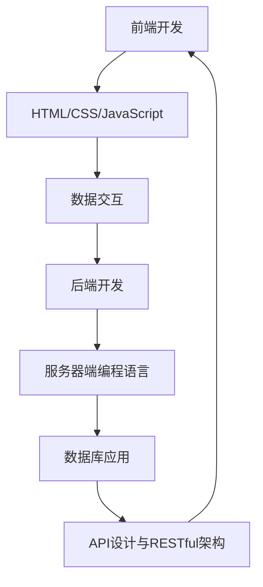

                 


### 文章标题

# Web 全栈开发：构建动态网站

> 关键词：Web全栈开发，动态网站，前端开发，后端开发，全栈项目实战

> 摘要：本文将深入探讨Web全栈开发的原理、技术和实践，帮助读者掌握构建动态网站的全栈开发技能。文章分为三部分，首先介绍Web全栈开发的基础知识，包括前端和后端技术栈，然后详细讲解前端和后端开发的核心概念与原理，最后通过实战项目展示全栈开发的全过程。

### 目录大纲

## 第一部分：Web全栈开发基础

### 第1章：Web全栈开发概述

#### 1.1 Web全栈开发的定义与作用

#### 1.2 Web全栈开发的技术栈

#### 1.3 全栈开发人员的能力要求

### 第2章：前端开发基础

#### 2.1 HTML与CSS基础

##### 2.1.1 HTML文档结构

##### 2.1.2 HTML元素与属性

##### 2.1.3 CSS选择器和样式规则

#### 2.2 JavaScript基础

##### 2.2.1 JavaScript基本语法

##### 2.2.2 常用JavaScript库与框架

##### 2.2.3 JavaScript模块化开发

### 第3章：前端框架与组件化开发

#### 3.1 React.js 深入理解

##### 3.1.1 React组件生命周期

##### 3.1.2 React Hook机制

##### 3.1.3 React Router 路由配置

#### 3.2 Vue.js 框架应用

##### 3.2.1 Vue数据绑定和计算属性

##### 3.2.2 Vue组件通信和生命周期

##### 3.2.3 Vue Router 路由配置

#### 3.3 Angular框架入门

##### 3.3.1 Angular组件和指令

##### 3.3.2 Angular服务与依赖注入

##### 3.3.3 Angular路由和导航

### 第4章：前端工程化

#### 4.1 Webpack 打包工具

##### 4.1.1 Webpack配置

##### 4.1.2 使用Webpack优化前端性能

#### 4.2 Babel 转译工具

##### 4.2.1 Babel基础知识

##### 4.2.2 Babel配置和插件

#### 4.3 ES6+新特性应用

##### 4.3.1 let、const与块级作用域

##### 4.3.2 解构赋值与扩展运算符

##### 4.3.3 Promise和异步编程

## 第二部分：后端开发基础

### 第5章：后端开发基础

#### 5.1 Node.js 深入理解

##### 5.1.1 Node.js基本概念

##### 5.1.2 Node.js异步编程

##### 5.1.3 Node.js模块化开发

#### 5.2 Express.js 框架应用

##### 5.2.1 Express基本路由

##### 5.2.2 Express中间件机制

##### 5.2.3 Express错误处理与日志记录

### 第6章：数据库应用

#### 6.1 MySQL数据库入门

##### 6.1.1 MySQL基本操作

##### 6.1.2 MySQL数据库设计

##### 6.1.3 MySQL性能优化

#### 6.2 MongoDB数据库应用

##### 6.2.1 MongoDB基本概念

##### 6.2.2 MongoDB CRUD操作

##### 6.2.3 MongoDB聚合框架

### 第7章：API设计与RESTful架构

#### 7.1 RESTful API设计原则

##### 7.1.1 RESTful架构基础

##### 7.1.2 RESTful API设计方法

##### 7.1.3 API安全与认证

### 第8章：服务端路由与中间件

#### 8.1 Koa.js 框架应用

##### 8.1.1 Koa基本概念

##### 8.1.2 Koa中间件机制

##### 8.1.3 Koa错误处理与日志记录

#### 8.2 中间件技术在后端开发中的应用

##### 8.2.1 中间件的作用与分类

##### 8.2.2 中间件的实现与定制

##### 8.2.3 中间件在API安全中的应用

## 第三部分：全栈项目实战

### 第9章：搭建个人博客系统

#### 9.1 项目需求分析

##### 9.1.1 博客系统功能需求

##### 9.1.2 技术选型与架构设计

#### 9.2 前端项目搭建

##### 9.2.1 前端工程化环境配置

##### 9.2.2 使用React构建前端组件

##### 9.2.3 前端路由与状态管理

#### 9.3 后端项目搭建

##### 9.3.1 使用Node.js搭建后端服务

##### 9.3.2 接口设计与实现

##### 9.3.3 数据库设计与迁移

#### 9.4 项目部署与维护

##### 9.4.1 项目部署策略

##### 9.4.2 持续集成与持续部署

##### 9.4.3 项目监控与维护

### 第10章：电商网站开发实战

#### 10.1 项目需求分析

##### 10.1.1 电商网站功能需求

##### 10.1.2 技术选型与架构设计

#### 10.2 前端项目搭建

##### 10.2.1 前端工程化环境配置

##### 10.2.2 使用Vue.js构建前端组件

##### 10.2.3 前端路由与状态管理

#### 10.3 后端项目搭建

##### 10.3.1 使用Express.js搭建后端服务

##### 10.3.2 接口设计与实现

##### 10.3.3 数据库设计与迁移

#### 10.4 项目部署与维护

##### 10.4.1 项目部署策略

##### 10.4.2 持续集成与持续部署

##### 10.4.3 项目监控与维护

### 第11章：微信小程序开发实战

#### 11.1 项目需求分析

##### 11.1.1 微信小程序功能需求

##### 11.1.2 技术选型与架构设计

#### 11.2 前端项目搭建

##### 11.2.1 小程序开发工具配置

##### 11.2.2 使用小程序框架开发

##### 11.2.3 小程序API调用与封装

#### 11.3 后端项目搭建

##### 11.3.1 使用Koa.js搭建后端服务

##### 11.3.2 接口设计与实现

##### 11.3.3 数据库设计与迁移

#### 11.4 项目部署与维护

##### 11.4.1 项目部署策略

##### 11.4.2 持续集成与持续部署

##### 11.4.3 项目监控与维护

## 附录

### 附录 A：技术资源与工具

#### A.1 前端开发资源

##### A.1.1 常用前端开发库与框架

##### A.1.2 前端工程化工具

##### A.1.3 前端性能优化方法

#### A.2 后端开发资源

##### A.2.1 常用后端开发框架

##### A.2.2 数据库设计与优化

##### A.2.3 API设计与安全

#### A.3 项目开发资源

##### A.3.1 持续集成与持续部署工具

##### A.3.2 项目监控与日志分析工具

##### A.3.3 小程序开发资源与工具

### 附录 B：全栈项目代码示例

#### B.1 个人博客系统代码示例

##### B.1.1 前端代码示例

##### B.1.2 后端代码示例

##### B.1.3 数据库迁移脚本

#### B.2 电商网站代码示例

##### B.2.1 前端代码示例

##### B.2.2 后端代码示例

##### B.2.3 数据库迁移脚本

#### B.3 微信小程序代码示例

##### B.3.1 前端代码示例

##### B.3.2 后端代码示例

##### B.3.3 数据库迁移脚本

### 附录 C：全栈开发实用技巧

#### C.1 性能优化技巧

##### C.1.1 前端性能优化

##### C.1.2 后端性能优化

##### C.1.3 全栈性能优化案例

#### C.2 跨平台开发与集成

##### C.2.1 前后端分离与集成

##### C.2.2 微服务架构与集成

##### C.2.3 跨平台开发与部署

### 附录 D：常见问题与解决方案

#### D.1 前端开发常见问题

##### D.1.1 HTML/CSS问题

##### D.1.2 JavaScript问题

##### D.1.3 前端框架问题

#### D.2 后端开发常见问题

##### D.2.1 Node.js问题

##### D.2.2 Express.js问题

##### D.2.3 数据库问题

#### D.3 全栈开发常见问题

##### D.3.1 API设计与实现问题

##### D.3.2 项目部署与维护问题

##### D.3.3 跨平台开发问题
## Web全栈开发的定义与作用

### 背景介绍

Web全栈开发，也被称为全栈工程师（Full-Stack Engineer），是指在Web开发领域，既具备前端开发技能，又具备后端开发技能的工程师。随着互联网技术的发展，Web应用越来越复杂，单一的前端或后端开发已经无法满足需求。全栈开发工程师能够独立完成Web应用的前后端开发，大大提高了开发效率，降低了项目沟通成本。

### 核心概念与联系

全栈开发涉及的核心概念包括：

- **前端开发**：主要负责用户界面的设计与实现，包括HTML、CSS和JavaScript等。
- **后端开发**：主要负责服务器端逻辑、数据处理和存储等，通常使用服务器端编程语言如Node.js、Python、Java等。
- **数据库应用**：负责数据的存储和管理，常用的数据库有MySQL、MongoDB等。
- **API设计与RESTful架构**：负责前后端的交互，确保数据能够在前端和后端之间高效、安全地传输。

这些概念之间的关系可以表示为以下Mermaid流程图：



### 核心算法原理讲解

全栈开发中，前端和后端的交互通常通过API实现。以下是使用伪代码描述的一个简单的API交互示例：

```python
# 前端请求示例
fetch('http://api.example.com/data')
    .then(response => response.json())
    .then(data => displayData(data))
    .catch(error => console.error('Error fetching data:', error));

# 后端响应示例
app.get('/data', (req, res) => {
    const data = fetchDataFromDatabase();
    res.json(data);
});
```

在这个示例中，前端通过`fetch`方法发起HTTP GET请求，后端接收到请求后，从数据库中获取数据，并将数据以JSON格式返回给前端。

### 数学模型和公式

在全栈开发中，常用的数学模型和公式包括：

- **线性回归**：用于预测连续值，如用户行为分析。
- **逻辑回归**：用于预测二分类问题，如用户是否点击按钮。
- **决策树**：用于分类和回归问题，易于理解和解释。

以下是线性回归的公式：

$$
y = \beta_0 + \beta_1 \cdot x
$$

其中，$y$ 是预测值，$x$ 是输入特征，$\beta_0$ 和 $\beta_1$ 是模型参数。

### 详细讲解与举例说明

为了更好地理解全栈开发的概念和原理，以下是一个具体的例子：

假设我们要开发一个博客系统，前端需要展示文章列表、文章详情页以及文章评论功能，后端需要提供文章存储、用户认证和评论管理等服务。

- **前端**：使用React框架构建用户界面，React组件负责展示数据和响应用户操作。例如，文章列表组件会通过API请求获取文章数据，并在页面上展示。
- **后端**：使用Node.js和Express.js搭建服务器，处理前端发起的API请求。例如，文章数据的获取和存储会通过MySQL数据库进行。
- **数据库**：使用MySQL存储用户数据、文章数据和评论数据。数据库设计需要考虑数据的规范化、索引优化和查询性能。

通过这个例子，我们可以看到全栈开发如何将前端、后端和数据库有机地结合起来，实现一个完整的Web应用。

### 总结

Web全栈开发是一个涵盖前端、后端和数据库技术的综合性领域，它要求开发人员具备多方面的技能。通过本文的介绍，读者可以了解全栈开发的定义、作用以及核心概念和原理。在接下来的章节中，我们将进一步深入探讨前端和后端开发的具体技术和实践。

### 最佳实践 Tips

1. **熟悉主流前端框架**：React、Vue和Angular是当前最受欢迎的前端框架，熟练掌握其中任何一个可以帮助提高开发效率。
2. **理解异步编程**：异步编程是全栈开发的核心，熟练掌握异步编程可以提高代码的可读性和稳定性。
3. **数据库设计要合理**：数据库是数据存储的核心，合理的设计可以提高查询性能和系统稳定性。
4. **持续学习和实践**：全栈开发技术更新迅速，持续学习和实践是保持竞争力的关键。

### 小结

本文介绍了Web全栈开发的定义、作用和核心概念，通过Mermaid流程图和伪代码展示了前后端交互的基本原理。在接下来的章节中，我们将详细讲解前端和后端开发的基础知识和实践技巧，帮助读者全面掌握Web全栈开发的技能。

### 注意事项

1. **前后端分离**：在开发过程中，要确保前后端分离，避免出现前后端代码混淆的情况。
2. **API安全性**：在设计和实现API时，要注意数据安全和用户认证，防止数据泄露和未授权访问。
3. **性能优化**：要关注前端和后端的性能优化，提高系统的响应速度和用户体验。

### 拓展阅读

- 《你不知道的JavaScript》
- 《深入理解Node.js》
- 《Web性能优化：前端工程师进阶指南》
- 《RESTful API设计》

---

### 前端开发基础

### HTML与CSS基础

#### HTML文档结构

HTML（超文本标记语言）是构建Web页面的基础。一个典型的HTML文档结构如下：

```html
<!DOCTYPE html>
<html lang="zh">
<head>
    <meta charset="UTF-8">
    <meta name="viewport" content="width=device-width, initial-scale=1.0">
    <title>我的网页</title>
    <link rel="stylesheet" href="styles.css">
</head>
<body>
    <header>
        <h1>欢迎来到我的博客</h1>
    </header>
    <nav>
        <ul>
            <li><a href="#home">首页</a></li>
            <li><a href="#about">关于我</a></li>
            <li><a href="#contact">联系我</a></li>
        </ul>
    </nav>
    <main>
        <article>
            <h2>第一篇文章</h2>
            <p>文章内容...</p>
        </article>
        <article>
            <h2>第二篇文章</h2>
            <p>文章内容...</p>
        </article>
    </main>
    <footer>
        <p>版权所有 &copy; 2022</p>
    </footer>
</body>
</html>
```

在这个结构中，`<!DOCTYPE html>` 声明了文档类型，`<html>` 元素是根元素，`<head>` 和 `<body>` 分别包含元数据和页面内容。`<head>` 中包含了文档的元信息，如字符集、视图端口和标题等，而 `<body>` 中包含了页面的实际内容。

#### HTML元素与属性

HTML元素是构成Web页面的基本单位，每个元素都有自己的名称和属性。例如：

- `<h1>` 到 `<h6>`：标题元素
- `<p>`：段落元素
- `<a>`：超链接元素
- ``：图像元素
- `<div>`：分割元素
- `<span>`：内联元素

元素属性用来描述元素的行为和样式。例如：

```html
<a href="https://example.com" target="_blank">点击这里</a>

```

在这里，`<a>` 元素的 `href` 属性指定了链接的URL，而 `target="_blank"` 属性指定了链接在新窗口中打开。`` 元素的 `src` 属性指定了图像的URL，而 `alt` 属性提供了图像的替代文本。

#### CSS选择器和样式规则

CSS（层叠样式表）用于控制HTML元素的样式。选择器用于定位要应用的样式的元素，而样式规则定义了元素的样式。

常见的CSS选择器包括：

- **元素选择器**：如 `h1` 选择所有的 `h1` 元素。
- **类选择器**：如 `.highlight` 选择所有类名为 `highlight` 的元素。
- **ID选择器**：如 `#title` 选择ID为 `title` 的元素。

示例CSS代码如下：

```css
/* 元素选择器 */
h1 {
    color: blue;
}

/* 类选择器 */
.highlight {
    font-weight: bold;
    color: red;
}

/* ID选择器 */
#title {
    font-size: 24px;
}
```

在这个示例中，`h1` 元素的所有文本颜色将被设置为蓝色，类名为 `highlight` 的元素样式将被加粗并设置为红色，ID为 `title` 的元素的字体大小将被设置为24像素。

### JavaScript基础

JavaScript是Web开发中的核心脚本语言，用于实现动态页面和交互效果。

#### JavaScript基本语法

JavaScript的基本语法包括变量声明、数据类型、运算符和流程控制等。

- **变量声明**：使用 `var`、`let` 或 `const` 关键字声明变量。
  
  ```javascript
  var name = "全栈开发";
  let age = 30;
  const PI = 3.14159;
  ```

- **数据类型**：JavaScript有基本数据类型和引用数据类型。
  - 基本数据类型：`number`、`string`、`boolean`、`null`、`undefined`、`symbol`
  - 引用数据类型：`Object`、`Array`、`Function`

- **运算符**：包括算术运算符、比较运算符、逻辑运算符等。
  
  ```javascript
  let x = 5 + 3; // 算术运算
  let result = x == 8; // 比较运算
  let isTrue = true && false; // 逻辑运算
  ```

- **流程控制**：包括条件语句和循环语句。
  
  ```javascript
  if (x > 10) {
      console.log("x 大于 10");
  } else {
      console.log("x 小于或等于 10");
  }
  
  for (let i = 0; i < 5; i++) {
      console.log(i);
  }
  ```

#### 常用JavaScript库与框架

- **jQuery**：一个快速、小巧且功能丰富的JavaScript库，用于简化DOM操作和事件处理。
  
  ```javascript
  $('#myButton').click(function() {
      alert('按钮被点击！');
  });
  ```

- **Bootstrap**：一个流行的前端框架，提供响应式布局和组件，帮助快速构建现代网站。
  
  ```html
  <div class="container">
      <h1 class="text-center">全栈开发</h1>
      <p class="lead">掌握前端和后端技术，打造强大网站。</p>
  </div>
  ```

- **React**：一个用于构建用户界面的JavaScript库，采用组件化开发，提供高效的更新机制。

  ```javascript
  import React from 'react';

  function Greeting(props) {
      return <h1>Hello, {props.name}!</h1>;
  }
  ```

- **Vue**：一个渐进式的前端框架，简单易用，提供响应式数据和组合式API。

  ```javascript
  const app = Vue.createApp({
      data() {
          return {
              message: 'Hello Vue!'
          }
      },
      template: `
          <h1>{{ message }}</h1>
      `
  }).mount('#app');
  ```

- **Angular**：一个由谷歌支持的开源前端框架，提供完整的开发工具和丰富的特性。

  ```typescript
  @Component({
      selector: 'app-greeting',
      template: `<h1>Hello, {{ name }}!</h1>`
  })
  export class GreetingComponent {
      name = 'Angular';
  }
  ```

#### JavaScript模块化开发

模块化开发是一种组织代码的方式，通过将代码分割成模块，可以提高代码的可维护性和复用性。

- **CommonJS**：Node.js使用的模块化规范，使用 `require()` 导入模块，使用 `module.exports` 导出模块。

  ```javascript
  // moduleA.js
  module.exports = {
      add: function(a, b) {
          return a + b;
      }
  };
  
  // moduleB.js
  const math = require('./moduleA');
  console.log(math.add(2, 3)); // 输出 5
  ```

- **ES6模块**：ES6引入的模块化标准，使用 `import` 和 `export` 关键字。

  ```javascript
  // math.js
  export function add(a, b) {
      return a + b;
  }
  
  // app.js
  import { add } from './math';
  console.log(add(2, 3)); // 输出 5
  ```

通过以上介绍，读者可以初步了解HTML和CSS的基础知识以及JavaScript的基本语法和常用库与框架。在下一章中，我们将深入探讨前端框架与组件化开发，帮助读者进一步提升前端开发技能。

### 前端框架与组件化开发

在现代化的Web开发中，前端框架与组件化开发已经成为提高开发效率和质量的重要手段。本节将重点介绍当前最流行的前端框架：React、Vue和Angular，并探讨它们的组件生命周期、数据绑定、组件通信及路由配置。

#### React.js 深入理解

React是由Facebook开发的一个用于构建用户界面的JavaScript库。它的核心思想是组件化开发，通过虚拟DOM实现高效的页面更新。

##### React组件生命周期

React组件生命周期可以分为几个关键阶段：挂载阶段、更新阶段和卸载阶段。每个阶段都有特定的方法和生命周期钩子。

1. **构造函数（Constructor）**：在组件创建时调用，通常用于初始化状态和绑定事件处理函数。
   ```javascript
   class MyComponent extends React.Component {
       constructor(props) {
           super(props);
           this.state = {
               count: 0
           };
       }
   }
   ```

2. **挂载阶段**：
   - `componentWillMount`：组件挂载之前调用，但在服务器端渲染时不会触发。
   - `render`：渲染组件的UI。
   - `componentDidMount`：组件挂载之后调用，通常用于初始化数据和绑定外部DOM事件。

   ```javascript
   class MyComponent extends React.Component {
       componentDidMount() {
           this.fetchData();
       }

       fetchData() {
           // 发起请求获取数据
       }
   }
   ```

3. **更新阶段**：
   - `componentWillReceiveProps`：组件接收到新的属性时调用。
   - `shouldComponentUpdate`：在组件更新之前调用，用于控制组件的更新。
   - `componentWillUpdate`：组件更新之前调用。
   - `render`：重新渲染组件的UI。
   - `componentDidUpdate`：组件更新之后调用。

   ```javascript
   class MyComponent extends React.Component {
       shouldComponentUpdate(nextProps, nextState) {
           // 根据nextProps和nextState决定是否更新
           return true;
       }

       componentDidUpdate(prevProps, prevState) {
           // 更新后的操作
       }
   }
   ```

4. **卸载阶段**：
   - `componentWillUnmount`：组件卸载之前调用，通常用于清除定时器、取消订阅和解除DOM事件绑定。

   ```javascript
   class MyComponent extends React.Component {
       componentWillUnmount() {
           // 清除定时器
           clearInterval(this.timer);
       }
   }
   ```

##### React Hook机制

React Hook是为了解决类组件中的状态管理和生命周期问题而引入的。Hook是一种复用组件状态逻辑的方式，它不改变组件的结构，而是在组件内部直接使用。

常用的Hook包括：

- `useState`：用于设置和更新状态。
  ```javascript
  function MyComponent() {
      const [count, setCount] = useState(0);
  }
  ```

- `useEffect`：用于执行副作用操作，类似于生命周期钩子。
  ```javascript
  function MyComponent() {
      useEffect(() => {
          // 副作用操作，如数据请求、定时器和监听器
      }, [count]); // 依赖项数组
  }
  ```

- `useContext`：用于提供组件树中的上下文值。
  ```javascript
  const ThemeContext = React.createContext('light');

  function MyComponent() {
      const theme = useContext(ThemeContext);
  }
  ```

##### React Router 路由配置

React Router是React的官方路由库，用于在单页应用中管理路由。

```javascript
import { BrowserRouter as Router, Route, Switch } from 'react-router-dom';

function App() {
    return (
        <Router>
            <Switch>
                <Route exact path="/" component={Home} />
                <Route path="/about" component={About} />
                <Route path="/contact" component={Contact} />
            </Switch>
        </Router>
    );
}
```

在这个示例中，`<Route>` 元素定义了不同的路由路径和对应的组件，`<Switch>` 元素确保只有第一个匹配的路径被渲染。

#### Vue.js 框架应用

Vue是一个渐进式JavaScript框架，其核心库只关注视图层，易于上手和整合其他库。

##### Vue数据绑定和计算属性

Vue使用双向数据绑定来同步视图和数据的变更。数据绑定语法如下：

```html
<div id="app">
    <p>{{ message }}</p>
    <button v-on:click="increase">增加</button>
</div>
```

计算属性是Vue中的高级特性，用于根据依赖数据进行计算。

```javascript
new Vue({
    el: '#app',
    data: {
        count: 0
    },
    computed: {
        reversedMessage() {
            return this.message.split('').reverse().join('');
        }
    }
});
```

##### Vue组件通信和生命周期

Vue组件通信主要通过props和events实现。

- **props**：父组件向子组件传递数据。

  ```javascript
  Vue.component('child', {
      props: ['message'],
      template: '<p>{{ message }}</p>'
  });
  ```

- **events**：子组件向父组件传递数据。

  ```html
  <child @update:count="handleCountUpdate"></child>
  ```

Vue组件的生命周期与React类似，包括创建、更新和卸载阶段。

1. **创建阶段**：
   - `beforeCreate`：组件实例化之前调用。
   - `created`：组件实例化之后调用。
   - `beforeMount`：组件挂载之前调用。
   - `mounted`：组件挂载之后调用。

2. **更新阶段**：
   - `beforeUpdate`：组件更新之前调用。
   - `updated`：组件更新之后调用。

3. **卸载阶段**：
   - `beforeDestroy`：组件卸载之前调用。
   - `destroyed`：组件卸载之后调用。

```javascript
new Vue({
    el: '#app',
    beforeCreate() {
        console.log('beforeCreate');
    },
    created() {
        console.log('created');
    },
    mounted() {
        console.log('mounted');
    },
    beforeUpdate() {
        console.log('beforeUpdate');
    },
    updated() {
        console.log('updated');
    },
    beforeDestroy() {
        console.log('beforeDestroy');
    },
    destroyed() {
        console.log('destroyed');
    }
});
```

##### Vue Router 路由配置

Vue Router是Vue的官方路由库，用于管理单页应用的导航。

```javascript
import Vue from 'vue';
import VueRouter from 'vue-router';
import Home from './views/Home.vue';

Vue.use(VueRouter);

const routes = [
    {
        path: '/',
        name: 'Home',
        component: Home
    },
    {
        path: '/about',
        name: 'About',
        component: () => import('./views/About.vue')
    }
];

const router = new VueRouter({
    routes
});

new Vue({
    router,
    el: '#app'
});
```

在这个示例中，`routes` 数组定义了不同的路由路径和对应的组件，`VueRouter` 实例化并安装到Vue实例上。

#### Angular框架入门

Angular是由谷歌开发的下一代前端框架，它提供了完整的开发工具和丰富的特性。

##### Angular组件和指令

Angular组件是可复用的UI组成部分，通过`@Component`装饰器定义。

```typescript
import { Component } from '@angular/core';

@Component({
    selector: 'app-greeting',
    template: `<h1>Hello, {{ name }}!</h1>`
})
export class GreetingComponent {
    name = 'Angular';
}
```

指令是Angular中用于操作DOM的语法糖，包括属性绑定、类绑定和样式绑定。

```html
<p [ngClass]="'highlight'">这是一个绑定的类。</p>
<p [ngStyle]="{{ {'color': 'blue'} }}">这是一个绑定的样式。</p>
```

##### Angular服务与依赖注入

服务是Angular中用于封装逻辑和共享数据的功能组件。

```typescript
import { Injectable } from '@angular/core';

@Injectable({
    providedIn: 'root'
})
export class DataService {
    getData() {
        return 'Hello, Data Service!';
    }
}
```

依赖注入是Angular的核心特性之一，允许服务在组件中自动注入。

```typescript
@Component({
    selector: 'app-fetch-data',
    template: `<button (click)="fetchData()">获取数据</button>`
})
export class FetchDataComponent {
    constructor(private dataService: DataService) {}

    fetchData() {
        alert(this.dataService.getData());
    }
}
```

##### Angular路由和导航

Angular的路由系统通过`RouterModule`配置路由路径和对应组件。

```typescript
import { NgModule } from '@angular/core';
import { RouterModule, Routes } from '@angular/router';
import { HomeComponent } from './home/home.component';
import { AboutComponent } from './about/about.component';

const routes: Routes = [
    { path: '', component: HomeComponent },
    { path: 'about', component: AboutComponent }
];

@NgModule({
    imports: [RouterModule.forRoot(routes)],
    exports: [RouterModule]
})
export class AppRoutingModule {}
```

通过上述对React、Vue和Angular框架的介绍，我们可以看到它们各自的优势和特点。React提供了灵活的组件化和虚拟DOM机制，Vue的渐进式框架使其易于上手，Angular则提供了强大的开发工具和依赖注入机制。在下一章中，我们将进一步探讨前端工程化，包括Webpack、Babel和ES6+新特性。

### 前端工程化

前端工程化是现代Web开发中不可或缺的一环，它通过一系列的工具和流程，提高开发效率、优化性能和确保代码质量。本节将重点介绍Webpack、Babel和ES6+新特性在前端工程化中的应用。

#### Webpack 打包工具

Webpack是一个模块打包工具，它能够将各种资源（如JavaScript、CSS、图片等）打包成一个或多个bundle，以便在浏览器中高效运行。

##### Webpack配置

Webpack的配置文件通常命名为`webpack.config.js`，其中包含输入（entry）、输出（output）、加载器（loader）和插件（plugin）等配置。

示例配置文件如下：

```javascript
const path = require('path');

module.exports = {
    entry: './src/index.js',
    output: {
        filename: 'bundle.js',
        path: path.resolve(__dirname, 'dist')
    },
    module: {
        rules: [
            {
                test: /\.css$/,
                use: ['style-loader', 'css-loader']
            },
            {
                test: /\.(jpg|png|gif)$/,
                use: [
                    {
                        loader: 'url-loader',
                        options: {
                            limit: 8000,
                            name: 'images/[name]-[hash].[ext]'
                        }
                    }
                ]
            }
        ]
    },
    plugins: [
        new webpack.SourceMapWebpackPlugin(),
        new webpack.DefinePlugin({
            'process.env.NODE_ENV': JSON.stringify('production')
        })
    ],
    optimization: {
        minimize: true
    }
};
```

在这个配置文件中，我们定义了输入文件、输出文件、CSS和图片的加载规则，以及SourceMap和DefinePlugin插件。通过这些配置，Webpack能够将项目中的各种资源打包成优化过的bundle。

##### 使用Webpack优化前端性能

Webpack提供了多种方式来优化前端性能，以下是一些常用的优化策略：

1. **代码分割（Code Splitting）**：通过将代码分割成多个chunk，按需加载，减少初始加载时间。
2. **长期缓存（Long-term Caching）**：通过使用ContentHash，确保缓存的有效性，减少不必要的重新加载。
3. **压缩（Minification）**：使用UglifyJS或Terser插件压缩JavaScript文件，减少文件大小。
4. **图像优化（Image Optimization）**：使用url-loader和image-webpack-loader对图片进行压缩和转换。

#### Babel 转译工具

Babel是一个JavaScript编译器，它能够将现代JavaScript代码编译成兼容当前和旧版浏览器的代码。通过Babel，开发者可以使用ES6+的新特性，而不用担心兼容性问题。

##### Babel基础知识

Babel的核心组件包括：

1. **Babel-core**：Babel的核心库，提供编译API。
2. **Babel-preset-env**：用于预设ES6+环境的插件集合。
3. **Babel-loader**：Webpack的加载器，用于处理Babel转译。

配置Babel的基本步骤如下：

1. 安装Babel依赖：

```bash
npm install --save-dev @babel/core @babel/preset-env babel-loader
```

2. 创建`.babelrc`配置文件：

```json
{
    "presets": ["@babel/preset-env"]
}
```

3. 在Webpack配置中添加Babel-loader：

```javascript
{
    test: /\.js$/,
    exclude: /node_modules/,
    use: {
        loader: 'babel-loader'
    }
}
```

##### Babel配置和插件

除了`@babel/preset-env`，Babel还支持各种插件，用于扩展其功能。例如：

- `@babel/plugin-proposal-class-properties`：用于支持类属性。
- `@babel/plugin-syntax-dynamic-import`：用于支持动态导入。

通过在`.babelrc`文件中添加插件，可以启用这些功能：

```json
{
    "presets": [
        "@babel/preset-env",
        "@babel/preset-react"
    ],
    "plugins": ["@babel/plugin-proposal-class-properties"]
}
```

#### ES6+新特性应用

ES6+引入了许多新的语法和特性，提高了代码的可读性和可维护性。以下是一些常用的新特性：

1. **let和const**：用于声明变量，`let`允许变量重新赋值，而`const`用于声明不可变的常量。

   ```javascript
   let x = 10;
   const PI = 3.14159;
   ```

2. **解构赋值**：用于同时提取值并对变量进行赋值。

   ```javascript
   const [firstName, lastName] = ['John', 'Doe'];
   ```

3. **扩展运算符**：用于将数组或对象扩展到另一个数组或对象中。

   ```javascript
   const arr = [...arr1, ...arr2];
   ```

4. **Promise和异步编程**：用于处理异步操作，提高了代码的执行效率。

   ```javascript
   function fetchData() {
       return new Promise((resolve, reject) => {
           // 异步操作
           resolve('Data fetched');
       });
   }

   fetchData().then(data => console.log(data));
   ```

5. **类和模块**：类用于定义对象的行为，模块用于组织代码和隐藏实现细节。

   ```javascript
   class Person {
       constructor(name) {
           this.name = name;
       }
   }

   export default function greet() {
       console.log(`Hello, ${this.name}!`);
   }
   ```

通过Webpack、Babel和ES6+新特性的应用，前端工程化不仅提高了开发效率，还优化了代码质量和性能。在下一章中，我们将深入探讨后端开发的基础，包括Node.js、Express.js和数据库应用。

### 后端开发基础

### Node.js 深入理解

Node.js是一个基于Chrome V8引擎的JavaScript运行环境，它允许开发者使用JavaScript编写服务器端代码。Node.js的出现打破了传统的客户端-服务器架构，使得JavaScript能够一统前端和后端开发，提高了开发效率。

#### Node.js基本概念

Node.js的核心概念包括：

- **事件驱动**：Node.js使用事件驱动模型，通过异步编程提高应用程序的性能。
- **回调函数**：Node.js中的回调函数用于处理异步操作，使得程序能够继续执行其他任务。
- **模块化**：Node.js支持CommonJS模块化规范，使得代码组织更加清晰，可复用性更高。

#### Node.js异步编程

异步编程是Node.js的核心特性之一，它使得程序能够高效地处理并发请求。以下是一个使用回调函数实现异步操作的基本示例：

```javascript
function fetchData(callback) {
    setTimeout(() => {
        const data = 'Data fetched';
        callback(null, data);
    }, 1000);
}

fetchData((err, data) => {
    if (err) {
        console.error('Error fetching data:', err);
    } else {
        console.log('Data:', data);
    }
});
```

在这个示例中，`fetchData` 函数使用 `setTimeout` 模拟异步操作，并通过回调函数 `callback` 返回结果。

#### Node.js模块化开发

模块化开发有助于提高代码的可维护性和复用性。Node.js使用CommonJS模块化规范，通过 `require()` 导入模块，通过 `module.exports` 或 `exports` 导出模块。

以下是一个简单的模块化示例：

```javascript
// moduleA.js
module.exports = {
    add: function(a, b) {
        return a + b;
    }
};

// moduleB.js
const math = require('./moduleA');
console.log(math.add(2, 3)); // 输出 5
```

在这个示例中，`moduleA.js` 模块导出了一个名为 `add` 的函数，`moduleB.js` 模块通过 `require()` 导入了 `moduleA.js` 模块，并调用了导出的函数。

#### Express.js 框架应用

Express.js是一个流行的Node.js Web应用框架，它简化了Web应用的搭建过程，提供了丰富的中间件和路由功能。

##### Express基本路由

Express的基本路由包括以下几种方法：

- `app.get()`：处理GET请求。
- `app.post()`：处理POST请求。
- `app.put()`：处理PUT请求。
- `app.delete()`：处理DELETE请求。

以下是一个简单的Express应用程序：

```javascript
const express = require('express');
const app = express();

app.get('/', (req, res) => {
    res.send('首页');
});

app.get('/about', (req, res) => {
    res.send('关于我们');
});

app.listen(3000, () => {
    console.log('服务器运行在 http://localhost:3000/');
});
```

在这个示例中，`app.get()` 方法用于处理GET请求，`res.send()` 方法用于响应请求。

##### Express中间件机制

Express中间件是Express的核心特性之一，它允许开发者编写一系列的处理函数，对请求和响应进行预处理和后处理。以下是一个简单的中间件示例：

```javascript
const express = require('express');
const app = express();

app.use((req, res, next) => {
    console.log('中间件：请求路径:', req.path);
    next();
});

app.get('/', (req, res) => {
    res.send('首页');
});

app.listen(3000, () => {
    console.log('服务器运行在 http://localhost:3000/');
});
```

在这个示例中，`app.use()` 方法用于注册中间件，`next()` 方法用于将控制权传递给下一个中间件。

##### Express错误处理与日志记录

Express提供了内置的错误处理中间件，用于处理各种错误情况。以下是一个简单的错误处理示例：

```javascript
const express = require('express');
const app = express();

app.use((err, req, res, next) => {
    console.error(err.stack);
    res.status(500).send('发生错误！');
});

app.listen(3000, () => {
    console.log('服务器运行在 http://localhost:3000/');
});
```

在这个示例中，`app.use()` 方法用于注册错误处理中间件，`res.status()` 和 `res.send()` 方法用于响应错误。

通过以上对Node.js和Express.js的介绍，我们可以看到它们在后端开发中的重要性和应用。在下一章中，我们将详细探讨数据库应用，包括MySQL和MongoDB的使用。

### MySQL数据库入门

MySQL是一种广泛使用的关系型数据库管理系统，它提供了强大的数据存储和管理功能，广泛应用于各类Web应用和大数据系统中。

#### MySQL基本操作

以下是一些基本的MySQL操作，包括连接数据库、创建数据库、创建表、插入数据、查询数据等。

##### 连接数据库

要连接到MySQL数据库，可以使用`mysql`包提供的连接函数。以下是一个简单的示例：

```javascript
const mysql = require('mysql');

const connection = mysql.createConnection({
    host: 'localhost',
    user: 'root',
    password: 'password',
    database: 'test_db'
});

connection.connect((err) => {
    if (err) throw err;
    console.log('Connected to MySQL!');
});

connection.end();
```

在这个示例中，我们创建了数据库连接，并连接到名为 `test_db` 的数据库。

##### 创建数据库

创建数据库可以使用 `CREATE DATABASE` 语句。以下是一个示例：

```sql
CREATE DATABASE IF NOT EXISTS test_db;
```

这个语句创建了一个名为 `test_db` 的数据库，如果数据库已存在，则不执行任何操作。

##### 创建表

创建表可以使用 `CREATE TABLE` 语句。以下是一个示例：

```sql
CREATE TABLE IF NOT EXISTS users (
    id INT AUTO_INCREMENT PRIMARY KEY,
    username VARCHAR(50) NOT NULL,
    password VARCHAR(50) NOT NULL,
    email VARCHAR(100) NOT NULL
);
```

这个语句创建了一个名为 `users` 的表，包含 `id`、`username`、`password` 和 `email` 四个字段。

##### 插入数据

插入数据可以使用 `INSERT INTO` 语句。以下是一个示例：

```sql
INSERT INTO users (username, password, email) VALUES ('john', 'password123', 'john@example.com');
```

这个语句向 `users` 表插入了一行数据，包括用户名、密码和邮箱。

##### 查询数据

查询数据可以使用 `SELECT` 语句。以下是一个示例：

```sql
SELECT * FROM users;
```

这个语句查询了 `users` 表中的所有数据。

#### MySQL数据库设计

数据库设计是数据库管理的关键步骤，它涉及到数据的规范化、索引优化和查询性能等方面。

##### 数据规范化

数据规范化是一种设计数据库表结构的方法，通过消除冗余数据来提高数据的一致性和完整性。常见的规范化规则包括：

1. **第一范式（1NF）**：每个字段的值都是原子的，不能分割。
2. **第二范式（2NF）**：满足1NF，且所有非主属性完全依赖于主键。
3. **第三范式（3NF）**：满足2NF，且所有非主属性不传递依赖于主键。

以下是一个简单的规范化示例：

```sql
-- 创建订单表
CREATE TABLE IF NOT EXISTS orders (
    order_id INT AUTO_INCREMENT PRIMARY KEY,
    customer_id INT,
    order_date DATE,
    total DECIMAL(10, 2)
);

-- 创建客户表
CREATE TABLE IF NOT EXISTS customers (
    customer_id INT AUTO_INCREMENT PRIMARY KEY,
    customer_name VARCHAR(100),
    email VARCHAR(100)
);

-- 创建订单详情表
CREATE TABLE IF NOT EXISTS order_details (
    detail_id INT AUTO_INCREMENT PRIMARY KEY,
    order_id INT,
    product_id INT,
    quantity INT,
    price DECIMAL(10, 2),
    FOREIGN KEY (order_id) REFERENCES orders(order_id),
    FOREIGN KEY (product_id) REFERENCES products(product_id)
);
```

在这个示例中，我们创建了三个表：`orders`（订单表）、`customers`（客户表）和 `order_details`（订单详情表），并应用了规范化规则。

##### 索引优化

索引优化是提高数据库查询性能的重要手段。常见的索引类型包括：

1. **主键索引**：用于唯一标识表中的每条记录。
2. **唯一索引**：确保表中每个字段的值都是唯一的。
3. **普通索引**：提高查询速度，但允许字段中存在重复值。
4. **全文索引**：用于全文搜索。

以下是一个示例，创建一个主键索引和一个普通索引：

```sql
CREATE TABLE IF NOT EXISTS users (
    id INT AUTO_INCREMENT PRIMARY KEY,
    username VARCHAR(50) NOT NULL,
    email VARCHAR(100) UNIQUE,
    age INT,
    INDEX(age)
);
```

在这个示例中，`id` 字段为主键索引，`email` 字段为唯一索引，`age` 字段为普通索引。

#### MySQL性能优化

MySQL性能优化涉及到多个方面，包括查询优化、存储引擎优化、服务器配置优化等。

##### 查询优化

以下是一些常见的查询优化技巧：

1. **使用索引**：为频繁查询的字段创建索引，避免全表扫描。
2. **避免SELECT ***：只选择需要的字段，减少数据传输量。
3. **优化SQL语句**：避免使用子查询、联合查询等复杂查询，优化查询逻辑。
4. **查询缓存**：使用查询缓存来提高查询速度。

##### 存储引擎优化

MySQL支持多种存储引擎，如InnoDB、MyISAM等。每种存储引擎都有其优缺点。以下是一些常见优化策略：

1. **选择合适的存储引擎**：根据业务需求选择合适的存储引擎，例如，InnoDB适合事务处理，MyISAM适合读密集型应用。
2. **调整存储引擎配置**：调整存储引擎的配置参数，如缓冲池大小、日志文件大小等。
3. **使用分区表**：对于大表，使用分区表可以提高查询性能。

##### 服务器配置优化

以下是一些常见的服务器配置优化策略：

1. **调整系统资源限制**：增加系统内存、CPU核心数等资源，提高服务器性能。
2. **优化网络配置**：调整网络延迟、带宽等参数，提高网络通信效率。
3. **优化MySQL配置**：调整MySQL的配置参数，如最大连接数、线程缓存等。

通过以上对MySQL数据库的介绍，我们可以看到它作为一种关系型数据库管理系统，在Web应用开发中的重要作用。在下一章中，我们将进一步探讨API设计与RESTful架构，帮助读者深入理解前后端交互的核心。

### API设计与RESTful架构

API（应用程序编程接口）是前后端交互的核心，它允许前端通过请求获取和操作后端数据。RESTful架构是一种常用的API设计方法，它基于HTTP协议，通过统一的接口和状态转换，实现资源的访问和操作。本节将介绍RESTful API设计原则、设计方法以及API安全与认证。

#### RESTful API设计原则

RESTful API设计遵循以下原则：

1. **统一接口**：API应具有统一的接口格式，包括URL结构、请求方法和参数格式。
2. **无状态**：API不存储请求上下文，每次请求都是独立的，确保可扩展性和可维护性。
3. **客户端-服务器模式**：API应遵循客户端-服务器模式，客户端负责发送请求，服务器负责处理请求并返回响应。
4. **分层系统**：API应采用分层设计，将不同层次的功能分开，降低系统的复杂性和耦合度。
5. **状态转移**：API应通过HTTP方法（如GET、POST、PUT、DELETE）实现状态转移，客户端通过发送不同类型的请求来更新或查询资源。

#### RESTful API设计方法

RESTful API设计方法包括以下步骤：

1. **确定资源**：首先确定API需要操作的资源，如用户、产品、订单等。每个资源对应一个URL路径。
2. **定义URL结构**：为每个资源定义一个清晰的URL结构，通常采用名词复数形式。例如，用户资源可以表示为`/users`。
3. **定义HTTP方法**：为每个资源定义适当的HTTP方法，如GET用于查询资源，POST用于创建资源，PUT用于更新资源，DELETE用于删除资源。
4. **定义请求和响应格式**：定义请求和响应的格式，通常采用JSON格式。请求通常包含必要的参数，响应则包含请求结果和状态码。
5. **错误处理**：定义错误处理机制，确保在请求失败时能够返回清晰的错误信息和状态码。

以下是一个简单的RESTful API示例：

- **资源**：用户（User）
- **URL结构**：`/users`
- **HTTP方法**：GET、POST、PUT、DELETE
- **请求和响应格式**：

```json
# GET /users
{
    "status": "success",
    "data": [
        {
            "id": 1,
            "username": "john",
            "email": "john@example.com"
        },
        {
            "id": 2,
            "username": "jane",
            "email": "jane@example.com"
        }
    ]
}

# POST /users
{
    "status": "success",
    "message": "User created"
}

# PUT /users/1
{
    "status": "success",
    "message": "User updated"
}

# DELETE /users/1
{
    "status": "success",
    "message": "User deleted"
}
```

#### API安全与认证

API安全性是确保数据安全和用户隐私的重要环节。以下是一些常见的API安全与认证方法：

1. **认证**：认证是指验证用户身份的过程。常用的认证方法包括基本认证、OAuth2.0和JWT（JSON Web Token）。
   - **基本认证**：通过用户名和密码进行认证，通常使用HTTP Basic Authentication协议。
   - **OAuth2.0**：一种开放标准，用于授权第三方应用访问用户资源，常见于社交媒体API。
   - **JWT**：一种基于JSON的令牌，用于认证和授权，通常包含用户的身份信息和权限信息。

2. **授权**：授权是指验证用户是否有权限访问特定资源。常见的授权方法包括访问控制列表（ACL）、角色基础访问控制（RBAC）和属性基础访问控制（ABAC）。

3. **加密**：使用加密算法对敏感数据进行加密，确保数据在传输过程中不会被窃取或篡改。常用的加密算法包括AES、RSA等。

4. **API网关**：API网关是API调用的入口，它可以提供统一的接口、路由、负载均衡、安全等功能，有助于保护后端系统。

5. **监控和日志**：实时监控API的访问情况，记录日志并进行分析，有助于及时发现和解决潜在的安全问题。

通过以上对API设计与RESTful架构的介绍，我们可以看到API设计在前后端交互中的重要性。合理的设计不仅能提高开发效率，还能确保系统的安全性。在下一章中，我们将探讨中间件在Web全栈开发中的应用。

### 服务端路由与中间件

在Web全栈开发中，服务端路由和中间件是至关重要的组成部分。它们不仅负责处理HTTP请求和响应，还承担了安全性、日志记录、错误处理等关键任务。本节将详细介绍Koa.js框架的应用、中间件的作用与分类、中间件的实现与定制，以及中间件在API安全中的应用。

#### Koa.js 框架应用

Koa.js是一个基于Node.js的Web应用框架，它提供了非阻塞、基于Promise的中间件架构，使得开发者能够以更简洁、高效的方式构建Web应用。

##### Koa基本概念

Koa.js的核心概念包括：

- **中间件（Middleware）**：中间件是一系列函数，用于处理HTTP请求和响应。Koa.js通过中间件实现请求路由、数据处理、安全性控制等功能。
- **上下文（Context）**：上下文是一个对象，包含请求和响应的属性和方法。通过上下文，中间件可以访问请求体、响应体、状态码等。
- **应用（Application）**：应用是Koa.js的核心，用于注册中间件、处理HTTP请求。

##### Koa中间件机制

Koa.js的中间件机制允许开发者以模块化的方式组织代码，提高代码的可维护性和可扩展性。以下是一个简单的Koa.js示例：

```javascript
const Koa = require('koa');
const app = new Koa();

// 注册中间件
app.use(async (ctx, next) => {
    console.log(`Request Path: ${ctx.path}`);
    await next();
    console.log(`Response Status: ${ctx.status}`);
});

// 处理请求
app.use(async ctx => {
    ctx.body = 'Hello, Koa.js!';
});

// 启动服务器
app.listen(3000, () => {
    console.log('Server running on http://localhost:3000/');
});
```

在这个示例中，`app.use()` 方法用于注册中间件，`next()` 方法用于将请求传递给下一个中间件。通过这种方式，开发者可以灵活地添加各种功能，如日志记录、错误处理、安全控制等。

##### Koa错误处理与日志记录

Koa.js提供了内置的错误处理机制，可以通过注册错误处理中间件来处理各种异常情况。以下是一个简单的错误处理示例：

```javascript
const Koa = require('koa');
const app = new Koa();

// 注册错误处理中间件
app.on('error', (err, ctx) => {
    console.error('Server error:', err);
    ctx.status = 500;
    ctx.body = 'Internal Server Error';
});

// 处理请求
app.use(async ctx => {
    try {
        ctx.body = 'Hello, Koa.js!';
    } catch (err) {
        ctx.status = 400;
        ctx.body = 'Bad Request';
    }
});

// 启动服务器
app.listen(3000, () => {
    console.log('Server running on http://localhost:3000/');
});
```

在这个示例中，`app.on()` 方法用于注册错误处理中间件，当发生错误时，它会记录错误信息并返回相应的响应。

#### 中间件的作用与分类

中间件在Web全栈开发中发挥着重要作用，它可以实现各种功能，如请求路由、数据验证、安全性控制、日志记录等。中间件可以分为以下几类：

1. **请求路由中间件**：用于根据请求路径和HTTP方法转发请求到相应的处理函数。
2. **数据验证中间件**：用于验证请求体和查询参数，确保数据的合法性和完整性。
3. **安全性控制中间件**：用于实现认证、授权和加密等功能，确保API的安全性。
4. **日志记录中间件**：用于记录请求和响应信息，帮助开发者监控和管理应用。
5. **错误处理中间件**：用于处理各种异常情况，提供友好的错误信息和日志。

#### 中间件的实现与定制

实现和定制中间件是Koa.js开发中的关键技术。以下是一个简单的中间件实现示例：

```javascript
function logMiddleware(ctx, next) {
    console.log(`Request Path: ${ctx.path}`);
    return next().then(() => {
        console.log(`Response Status: ${ctx.status}`);
    });
}

module.exports = logMiddleware;
```

在这个示例中，`logMiddleware` 函数是一个中间件，它通过 `next()` 方法将请求传递给下一个中间件，并在响应完成后记录日志。

为了定制中间件，Koa.js 允许开发者将中间件组合成管道（Pipeline），如下所示：

```javascript
const koa = require('koa');
const app = new koa();
const router = require('koa-router')();

// 注册路由中间件
router.get('/', async ctx => {
    ctx.body = 'Hello, Koa.js!';
});

// 注册日志中间件
app.use(logMiddleware);

// 注册错误处理中间件
app.on('error', (err, ctx) => {
    console.error('Server error:', err);
    ctx.status = 500;
    ctx.body = 'Internal Server Error';
});

// 使用路由中间件
app.use(router.routes()).use(router.allowedMethods());

// 启动服务器
app.listen(3000, () => {
    console.log('Server running on http://localhost:3000/');
});
```

在这个示例中，`logMiddleware` 被添加到应用中，用于记录请求和响应信息。通过这种方式，开发者可以灵活地组合和定制中间件，实现各种功能。

#### 中间件在API安全中的应用

API安全是Web全栈开发中不可忽视的一环。中间件在实现API安全中发挥着关键作用，以下是一些常用的API安全中间件：

1. **认证中间件**：用于验证用户的身份，常见的认证方法包括基本认证、OAuth2.0和JWT。
2. **授权中间件**：用于验证用户是否有权限访问特定资源，常见的授权机制包括访问控制列表（ACL）、角色基础访问控制（RBAC）和属性基础访问控制（ABAC）。
3. **加密中间件**：用于加密请求和响应数据，确保数据在传输过程中不会被窃取或篡改。
4. **日志记录中间件**：用于记录API访问日志，帮助开发者监控和管理应用。

以下是一个简单的API安全中间件示例，使用JWT进行认证：

```javascript
const jwt = require('jsonwebtoken');
const koaJwt = require('koa-jwt')({ secret: 'mySecretKey' });

// 认证中间件
function authenticateMiddleware(ctx, next) {
    const token = ctx.request.headers.authorization;
    try {
        const payload = jwt.verify(token, 'mySecretKey');
        ctx.user = payload;
        await next();
    } catch (error) {
        ctx.status = 401;
        ctx.body = 'Unauthorized';
    }
}

// 使用认证中间件
app.use(koaJwt);
app.use(authenticateMiddleware);

// 处理请求
app.use(async ctx => {
    if (ctx.path === '/api/protected') {
        ctx.body = 'Protected Resource';
    } else {
        ctx.body = 'Hello, Koa.js!';
    }
});

// 启动服务器
app.listen(3000, () => {
    console.log('Server running on http://localhost:3000/');
});
```

在这个示例中，`koaJwt` 是一个用于JWT认证的中间件，`authenticateMiddleware` 是一个自定义的认证中间件，它们共同实现了API认证功能。

通过以上对Koa.js框架、中间件机制和API安全中间件的介绍，我们可以看到中间件在Web全栈开发中的重要性。合理地使用中间件，不仅可以提高开发效率，还能确保系统的安全性和稳定性。在下一章中，我们将通过全栈项目实战，进一步巩固所学知识。

### 搭建个人博客系统

#### 项目需求分析

个人博客系统通常需要实现以下功能：

1. **用户管理**：包括用户注册、登录、密码重置等。
2. **文章管理**：包括文章发布、修改、删除、分类管理、标签管理等。
3. **评论管理**：包括评论发布、删除、回复等功能。
4. **用户权限**：区分管理员和普通用户，管理员可以管理文章和评论，普通用户只能发布评论。
5. **界面设计**：简洁美观，易于阅读和导航。

技术选型方面，我们可以选择React作为前端框架，Node.js和Express.js作为后端框架，MySQL作为数据库。React的组件化开发使得界面设计和维护更加方便，Node.js和Express.js能够快速搭建服务器并处理请求，MySQL提供了稳定的数据存储和管理功能。

#### 技术选型与架构设计

1. **前端架构**：

   - **React**：用于构建动态和响应式的用户界面。
   - **React Router**：用于管理路由，实现多页面导航。
   - **Redux**：用于状态管理，确保组件之间的数据一致性。

2. **后端架构**：

   - **Node.js**：作为服务器端运行环境，提供高性能、事件驱动的服务。
   - **Express.js**：用于处理HTTP请求，提供路由和控制器的功能。
   - **MySQL**：用于存储用户、文章和评论数据。

3. **API设计**：

   - **RESTful API**：使用标准的HTTP方法（GET、POST、PUT、DELETE）实现资源操作。
   - **JWT**：用于用户认证，确保数据传输的安全性和完整性。

#### 前端项目搭建

##### 前端工程化环境配置

首先，我们需要安装Node.js和npm（Node Package Manager）。在安装完成后，执行以下命令创建一个新项目：

```bash
npx create-react-app my-blog
cd my-blog
npm install
```

这会创建一个基本的React项目，包括源代码、构建工具和测试环境。接下来，我们可以安装一些额外的库来支持状态管理和路由：

```bash
npm install redux react-redux
npm install react-router-dom
```

##### 使用React构建前端组件

在前端项目中，我们可以根据功能模块创建不同的React组件。以下是一些示例组件：

- **App Component**：整个应用的入口组件，负责管理页面路由。
- **Header Component**：页面头部组件，包含导航菜单和用户信息。
- **Footer Component**：页面底部组件，包含版权信息和链接。
- **ArticleList Component**：文章列表组件，负责展示文章列表。
- **ArticleDetail Component**：文章详情组件，展示单个文章的内容。
- **CommentList Component**：评论列表组件，展示文章下的评论。

以下是一个简单的 `App` 组件示例：

```javascript
import React from 'react';
import { BrowserRouter as Router, Route, Switch } from 'react-router-dom';
import Header from './components/Header';
import Footer from './components/Footer';
import ArticleList from './components/ArticleList';
import ArticleDetail from './components/ArticleDetail';

function App() {
    return (
        <Router>
            <Header />
            <Switch>
                <Route exact path="/" component={ArticleList} />
                <Route path="/article/:id" component={ArticleDetail} />
            </Switch>
            <Footer />
        </Router>
    );
}

export default App;
```

在这个组件中，我们使用了 `BrowserRouter`、`Route` 和 `Switch`，分别用于配置路由、定义路由路径和渲染组件。

##### 前端路由与状态管理

为了实现前端路由和状态管理，我们可以在 `App` 组件中引入 `React Router` 和 `Redux`：

```javascript
import { Provider } from 'react-redux';
import store from './store';

function App() {
    return (
        <Provider store={store}>
            <Router>
                <Header />
                <Switch>
                    <Route exact path="/" component={ArticleList} />
                    <Route path="/article/:id" component={ArticleDetail} />
                </Switch>
                <Footer />
            </Router>
        </Provider>
    );
}

export default App;
```

在这个示例中，`Provider` 组件用于将Redux的 `store` 提供给所有子组件，使得组件可以访问和管理全局状态。

##### 前端状态管理

为了管理前端状态，我们可以使用Redux。首先，创建一个 `store.js` 文件，初始化Redux的 `store`：

```javascript
import { createStore } from 'redux';
import rootReducer from './reducers';

const store = createStore(rootReducer);

export default store;
```

然后，创建一个 `reducers.js` 文件，定义应用的状态和相关的action creator：

```javascript
import { combineReducers } from 'redux';
import articleReducer from './articleReducer';

const rootReducer = combineReducers({
    article: articleReducer
});

export default rootReducer;
```

在这个示例中，我们定义了一个名为 `rootReducer` 的组合 reducer，它包含了所有功能模块的reducer。

##### 前端API调用

为了与后端进行数据交互，我们可以使用Axios库。首先，安装Axios：

```bash
npm install axios
```

然后，创建一个 `axiosInstance.js` 文件，配置Axios实例：

```javascript
import axios from 'axios';

const axiosInstance = axios.create({
    baseURL: 'http://localhost:3000'
});

export default axiosInstance;
```

在这个文件中，我们设置了基础URL，用于请求后端API。

接下来，在组件中调用API：

```javascript
import axios from './axiosInstance';

class ArticleDetail extends React.Component {
    state = {
        article: null
    };

    componentDidMount() {
        const { id } = this.props.match.params;
        axios.get(`/api/articles/${id}`)
            .then(response => {
                this.setState({ article: response.data });
            })
            .catch(error => {
                console.error('Error fetching article:', error);
            });
    }

    render() {
        const { article } = this.state;
        if (!article) return <div>Loading...</div>;

        return (
            <div>
                <h1>{article.title}</h1>
                <div>{article.content}</div>
            </div>
        );
    }
}
```

在这个组件中，我们使用 `componentDidMount` 生命周期钩子调用API，并更新组件状态。

#### 后端项目搭建

##### 使用Node.js搭建后端服务

首先，我们需要安装Node.js和npm。在安装完成后，创建一个新的项目文件夹，并初始化项目：

```bash
mkdir my-blog-api
cd my-blog-api
npm init -y
```

接下来，安装Express.js和其他依赖：

```bash
npm install express mysql jsonwebtoken
npm install --save-dev nodemon
```

在项目根目录下创建一个名为 `app.js` 的文件，作为应用的入口：

```javascript
const express = require('express');
const mysql = require('mysql');
const jwt = require('jsonwebtoken');

const app = express();
const port = 3000;

// 连接数据库
const db = mysql.createConnection({
    host: 'localhost',
    user: 'root',
    password: 'password',
    database: 'my_blog'
});

db.connect((err) => {
    if (err) throw err;
    console.log('Connected to MySQL!');
});

// 中间件
app.use(express.json());

// JWT密钥
const jwtSecret = 'mySecretKey';

// 用户路由
app.post('/api/users/register', (req, res) => {
    // 注册用户
});

app.post('/api/users/login', (req, res) => {
    // 登录用户，生成JWT
});

// 文章路由
app.get('/api/articles', (req, res) => {
    // 获取文章列表
});

app.post('/api/articles', (req, res) => {
    // 发布文章
});

app.put('/api/articles/:id', (req, res) => {
    // 修改文章
});

app.delete('/api/articles/:id', (req, res) => {
    // 删除文章
});

// 评论路由
app.post('/api/comments', (req, res) => {
    // 发布评论
});

app.delete('/api/comments/:id', (req, res) => {
    // 删除评论
});

// 启动服务器
app.listen(port, () => {
    console.log(`Server running on port ${port}`);
});

module.exports = app;
```

在这个示例中，我们设置了数据库连接、中间件和基本的用户和文章路由。

##### 接口设计与实现

接下来，我们将实现具体的接口，处理用户和文章的注册、登录、获取、发布、修改和删除等操作。

1. **用户注册**：

```javascript
app.post('/api/users/register', (req, res) => {
    const { username, password, email } = req.body;

    // 检查用户名和邮箱是否已存在
    db.query('SELECT * FROM users WHERE username = ? OR email = ?', [username, email], (err, result) => {
        if (err) throw err;

        if (result.length > 0) {
            res.status(409).json({ message: 'User already exists' });
        } else {
            // 插入新用户
            db.query('INSERT INTO users (username, password, email) VALUES (?, ?, ?)', [username, password, email], (err, result) => {
                if (err) throw err;
                res.status(201).json({ message: 'User registered' });
            });
        }
    });
});
```

2. **用户登录**：

```javascript
app.post('/api/users/login', (req, res) => {
    const { username, password } = req.body;

    db.query('SELECT * FROM users WHERE username = ? AND password = ?', [username, password], (err, result) => {
        if (err) throw err;

        if (result.length > 0) {
            // 生成JWT
            const token = jwt.sign({ id: result[0].id }, jwtSecret, { expiresIn: '1h' });
            res.status(200).json({ token });
        } else {
            res.status(401).json({ message: 'Invalid credentials' });
        }
    });
});
```

3. **获取文章列表**：

```javascript
app.get('/api/articles', (req, res) => {
    db.query('SELECT * FROM articles', (err, result) => {
        if (err) throw err;
        res.status(200).json(result);
    });
});
```

4. **发布文章**：

```javascript
app.post('/api/articles', (req, res) => {
    const { title, content, author } = req.body;

    db.query('INSERT INTO articles (title, content, author) VALUES (?, ?, ?)', [title, content, author], (err, result) => {
        if (err) throw err;
        res.status(201).json({ message: 'Article created' });
    });
});
```

5. **修改文章**：

```javascript
app.put('/api/articles/:id', (req, res) => {
    const { title, content } = req.body;
    const id = req.params.id;

    db.query('UPDATE articles SET title = ?, content = ? WHERE id = ?', [title, content, id], (err, result) => {
        if (err) throw err;
        res.status(200).json({ message: 'Article updated' });
    });
});
```

6. **删除文章**：

```javascript
app.delete('/api/articles/:id', (req, res) => {
    const id = req.params.id;

    db.query('DELETE FROM articles WHERE id = ?', [id], (err, result) => {
        if (err) throw err;
        res.status(200).json({ message: 'Article deleted' });
    });
});
```

7. **发布评论**：

```javascript
app.post('/api/comments', (req, res) => {
    const { articleId, content, author } = req.body;

    db.query('INSERT INTO comments (article_id, content, author) VALUES (?, ?, ?)', [articleId, content, author], (err, result) => {
        if (err) throw err;
        res.status(201).json({ message: 'Comment created' });
    });
});
```

8. **删除评论**：

```javascript
app.delete('/api/comments/:id', (req, res) => {
    const id = req.params.id;

    db.query('DELETE FROM comments WHERE id = ?', [id], (err, result) => {
        if (err) throw err;
        res.status(200).json({ message: 'Comment deleted' });
    });
});
```

##### 数据库设计与迁移

为了实现个人博客系统的数据存储，我们需要设计数据库模型，并创建相关的表。以下是一个简单的数据库设计示例：

1. **用户表（users）**：

   ```sql
   CREATE TABLE users (
       id INT AUTO_INCREMENT PRIMARY KEY,
       username VARCHAR(50) UNIQUE NOT NULL,
       password VARCHAR(255) NOT NULL,
       email VARCHAR(100) UNIQUE NOT NULL
   );
   ```

2. **文章表（articles）**：

   ```sql
   CREATE TABLE articles (
       id INT AUTO_INCREMENT PRIMARY KEY,
       title VARCHAR(255) NOT NULL,
       content TEXT NOT NULL,
       author VARCHAR(50) NOT NULL,
       created_at TIMESTAMP DEFAULT CURRENT_TIMESTAMP
   );
   ```

3. **评论表（comments）**：

   ```sql
   CREATE TABLE comments (
       id INT AUTO_INCREMENT PRIMARY KEY,
       article_id INT NOT NULL,
       content TEXT NOT NULL,
       author VARCHAR(50) NOT NULL,
       created_at TIMESTAMP DEFAULT CURRENT_TIMESTAMP,
       FOREIGN KEY (article_id) REFERENCES articles(id)
   );
   ```

为了方便数据库的迁移和管理，我们可以使用 Sequelize 或 Mongoose 等ORM（对象关系映射）库。以下是一个使用 Sequelize 创建数据库迁移的示例：

```javascript
const { Sequelize } = require('sequelize');

const sequelize = new Sequelize({
    database: 'my_blog',
    username: 'root',
    password: 'password',
    host: 'localhost',
    dialect: 'mysql'
});

const User = sequelize.define('User', {
    id: {
        type: Sequelize.INTEGER,
        primaryKey: true,
        autoIncrement: true
    },
    username: Sequelize.STRING,
    password: Sequelize.STRING,
    email: Sequelize.STRING
});

const Article = sequelize.define('Article', {
    id: {
        type: Sequelize.INTEGER,
        primaryKey: true,
        autoIncrement: true
    },
    title: Sequelize.STRING,
    content: Sequelize.TEXT,
    author: Sequelize.STRING
});

const Comment = sequelize.define('Comment', {
    id: {
        type: Sequelize.INTEGER,
        primaryKey: true,
        autoIncrement: true
    },
    article_id: Sequelize.INTEGER,
    content: Sequelize.TEXT,
    author: Sequelize.STRING
});

// 同步数据库模型到数据库
sequelize.sync({ force: true }).then(() => {
    console.log('Database & tables created!');
}).catch(error => {
    console.error('Error creating database & tables:', error);
});
```

在这个示例中，我们使用 Sequelize 创建了用户、文章和评论三个模型，并同步到MySQL数据库。

#### 项目部署与维护

##### 项目部署策略

在项目开发完成后，我们需要将其部署到生产环境。以下是一个简单的部署流程：

1. **代码托管**：将代码托管到版本控制系统（如Git），确保代码的安全和可追溯性。
2. **持续集成/持续部署（CI/CD）**：使用 CI/CD 工具（如 Jenkins、GitLab CI/CD、GitHub Actions）自动化测试和部署流程。
3. **服务器配置**：配置服务器环境，包括操作系统、Node.js、MySQL等。
4. **应用部署**：使用 PM2 或 forever 等进程管理工具部署 Node.js 应用。
5. **数据库部署**：备份现有数据库，恢复到新服务器上。

##### 持续集成与持续部署

持续集成（CI）和持续部署（CD）是现代软件开发中常用的实践，可以确保代码质量和快速部署。以下是一个简单的CI/CD示例：

1. **配置文件**：在代码仓库中添加 `.gitlab-ci.yml` 或 `.github/workflows/ci.yml` 文件，配置 CI/CD 工作流程。
2. **构建**：使用 Docker 构建应用镜像。
3. **测试**：运行单元测试和集成测试。
4. **部署**：部署到生产环境。

以下是一个简单的 `.gitlab-ci.yml` 示例：

```yaml
image: node:14

stages:
  - build
  - test
  - deploy

build:
  stage: build
  script:
    - docker build -t my-blog-api:latest .
  artifacts:
    paths:
      - docker/image.tar

test:
  stage: test
  script:
    - npm test

deploy:
  stage: deploy
  script:
    - docker login -u $CI_USER -p $CI_PASSWORD
    - docker pull my-blog-api:latest
    - docker stop my-blog-api || true
    - docker run -d --name my-blog-api my-blog-api:latest
  only:
    - master
```

在这个示例中，我们定义了一个 CI/CD 工作流程，包括构建、测试和部署步骤。

##### 项目监控与维护

为了确保项目的稳定运行，我们需要进行监控与维护：

1. **性能监控**：使用性能监控工具（如 New Relic、Prometheus）监控应用性能，及时发现性能瓶颈。
2. **日志分析**：使用日志分析工具（如 ELK Stack、Grafana）收集和分析日志，快速定位问题。
3. **安全防护**：定期进行安全审计和漏洞扫描，确保应用的安全性。
4. **版本控制**：确保代码库中的版本控制，避免历史问题重现。

通过以上对个人博客系统的搭建过程、前端和后端实现、数据库设计、项目部署与维护的详细讲解，我们可以看到如何从零开始构建一个完整的Web全栈应用。在下一章中，我们将进一步探讨电商网站开发实战。

### 电商网站开发实战

#### 项目需求分析

电商网站是一个复杂的应用系统，涉及用户管理、商品管理、购物车、订单管理、支付处理等多个功能模块。以下是电商网站的主要功能需求：

1. **用户管理**：包括用户注册、登录、密码重置等。
2. **商品管理**：包括商品分类、商品列表、商品详情、商品搜索等。
3. **购物车**：包括添加商品、删除商品、修改商品数量等。
4. **订单管理**：包括订单创建、订单详情、订单支付、订单取消等。
5. **支付处理**：集成第三方支付平台，如支付宝、微信支付，实现在线支付。
6. **用户权限**：区分管理员和普通用户，管理员可以管理商品和订单，普通用户只能浏览和购买商品。

技术选型方面，我们可以选择Vue.js作为前端框架，Express.js作为后端框架，MySQL作为数据库，结合Mongoose进行数据库操作。Vue.js的组件化开发模式使得项目结构更加清晰，Express.js提供了丰富的中间件支持，MySQL和Mongoose提供了稳定的数据存储和管理功能。

#### 技术选型与架构设计

1. **前端架构**：

   - **Vue.js**：用于构建动态和响应式的用户界面。
   - **Vue Router**：用于管理路由，实现多页面导航。
   - **Vuex**：用于状态管理，确保组件之间的数据一致性。
   - **Element UI**：用于快速搭建用户界面。

2. **后端架构**：

   - **Node.js**：作为服务器端运行环境，提供高性能、事件驱动的服务。
   - **Express.js**：用于处理HTTP请求，提供路由和控制器的功能。
   - **MySQL**：用于存储用户、商品和订单数据。
   - **Mongoose**：用于MongoDB数据库操作，但在本项目中我们将使用MySQL。

3. **API设计**：

   - **RESTful API**：使用标准的HTTP方法（GET、POST、PUT、DELETE）实现资源操作。
   - **JWT**：用于用户认证，确保数据传输的安全性和完整性。

#### 前端项目搭建

##### 前端工程化环境配置

首先，我们需要安装Node.js和npm。在安装完成后，创建一个新的项目文件夹，并初始化项目：

```bash
mkdir my-ecommerce
cd my-ecommerce
npm init -y
```

接下来，安装Vue CLI和其他依赖：

```bash
npm install -g @vue/cli
npm install
```

使用Vue CLI创建一个新的项目：

```bash
vue create my-ecommerce
cd my-ecommerce
npm install axios vue-router vuex element-ui
```

##### 使用Vue.js构建前端组件

在前端项目中，我们可以根据功能模块创建不同的Vue组件。以下是一些示例组件：

- **App Component**：整个应用的入口组件，负责管理页面路由。
- **Header Component**：页面头部组件，包含导航菜单和用户信息。
- **Footer Component**：页面底部组件，包含版权信息和链接。
- **ProductList Component**：商品列表组件，负责展示商品列表。
- **ProductDetail Component**：商品详情组件，展示单个商品的信息。
- **Cart Component**：购物车组件，管理购物车中的商品。
- **OrderComponent**：订单组件，展示订单详情和支付操作。

以下是一个简单的 `App` 组件示例：

```vue
<template>
  <div id="app">
    <header-component />
    <router-view />
    <footer-component />
  </div>
</template>

<script>
import HeaderComponent from './components/HeaderComponent.vue';
import FooterComponent from './components/FooterComponent.vue';
import Vue from 'vue';
import VueRouter from 'vue-router';
import ProductListComponent from './components/ProductListComponent.vue';
import ProductDetailComponent from './components/ProductDetailComponent.vue';
import CartComponent from './components/CartComponent.vue';
import OrderComponent from './components/OrderComponent.vue';

Vue.use(VueRouter);

const routes = [
  {
    path: '/',
    name: 'Home',
    component: ProductListComponent
  },
  {
    path: '/product/:id',
    name: 'ProductDetail',
    component: ProductDetailComponent
  },
  {
    path: '/cart',
    name: 'Cart',
    component: CartComponent
  },
  {
    path: '/order',
    name: 'Order',
    component: OrderComponent
  }
];

const router = new VueRouter({
  routes
});

export default {
  name: 'App',
  router
};
</script>
```

在这个组件中，我们使用了 `HeaderComponent`、`FooterComponent` 和 `router-view`，分别用于页面头部、页面内容和页面底部。

##### 前端路由与状态管理

为了实现前端路由和状态管理，我们可以在 `App` 组件中引入 `Vue Router` 和 `Vuex`：

```vue
<template>
  <div id="app">
    <header-component />
    <router-view />
    <footer-component />
  </div>
</template>

<script>
import HeaderComponent from './components/HeaderComponent.vue';
import FooterComponent from './components/FooterComponent.vue';
import Vue from 'vue';
import VueRouter from 'vue-router';
import VueResource from 'vue-resource';
import Vuex from 'vuex';
import ProductListComponent from './components/ProductListComponent.vue';
import ProductDetailComponent from './components/ProductDetailComponent.vue';
import CartComponent from './components/CartComponent.vue';
import OrderComponent from './components/OrderComponent.vue';

Vue.use(VueRouter);
Vue.use(VueResource);
Vue.use(Vuex);

const routes = [
  {
    path: '/',
    name: 'Home',
    component: ProductListComponent
  },
  {
    path: '/product/:id',
    name: 'ProductDetail',
    component: ProductDetailComponent
  },
  {
    path: '/cart',
    name: 'Cart',
    component: CartComponent
  },
  {
    path: '/order',
    name: 'Order',
    component: OrderComponent
  }
];

const router = new VueRouter({
  routes
});

export default {
  name: 'App',
  router,
  store
};
</script>
```

在这个组件中，我们使用了 `Vuex` 的 `store` 对象，将路由和状态管理集成到 `App` 组件中。

##### 前端状态管理

为了管理前端状态，我们可以使用 `Vuex`。首先，创建一个 `store.js` 文件，初始化 `Vuex` 的 `store`：

```javascript
import Vue from 'vue';
import Vuex from 'vuex';

Vue.use(Vuex);

export default new Vuex.Store({
  state: {
    cart: [],
    order: {}
  },
  mutations: {
    ADD_TO_CART(state, product) {
      state.cart.push(product);
    },
    CLEAR_CART(state) {
      state.cart = [];
    },
    SET_ORDER(state, order) {
      state.order = order;
    }
  },
  actions: {
    addToCart({ commit }, product) {
      commit('ADD_TO_CART', product);
    },
    clearCart({ commit }) {
      commit('CLEAR_CART');
    },
    setOrder({ commit }, order) {
      commit('SET_ORDER', order);
    }
  }
});
```

在这个文件中，我们定义了应用的状态和相关的 `mutations` 和 `actions`。

##### 前端API调用

为了与后端进行数据交互，我们可以使用Axios库。首先，安装Axios：

```bash
npm install axios
```

然后，创建一个 `axiosInstance.js` 文件，配置Axios实例：

```javascript
import axios from 'axios';

const axiosInstance = axios.create({
  baseURL: 'http://localhost:3000'
});

export default axiosInstance;
```

在这个文件中，我们设置了基础URL，用于请求后端API。

接下来，在组件中调用API：

```javascript
<template>
  <div>
    <h1>商品列表</h1>
    <div v-for="product in products" :key="product.id">
      <h2>{{ product.name }}</h2>
      <p>{{ product.description }}</p>
      <button @click="addToCart(product)">加入购物车</button>
    </div>
  </div>
</template>

<script>
import axios from './axiosInstance';

export default {
  data() {
    return {
      products: []
    };
  },
  created() {
    this.fetchProducts();
  },
  methods: {
    fetchProducts() {
      axios.get('/api/products')
        .then(response => {
          this.products = response.data;
        })
        .catch(error => {
          console.error('Error fetching products:', error);
        });
    },
    addToCart(product) {
      axios.post('/api/cart', { product })
        .then(response => {
          alert('商品已成功加入购物车！');
        })
        .catch(error => {
          console.error('Error adding product to cart:', error);
        });
    }
  }
};
</script>
```

在这个组件中，我们使用了 `fetchProducts` 方法获取商品列表，并使用了 `addToCart` 方法将商品添加到购物车。

#### 后端项目搭建

##### 使用Node.js搭建后端服务

首先，我们需要安装Node.js和npm。在安装完成后，创建一个新的项目文件夹，并初始化项目：

```bash
mkdir my-ecommerce-api
cd my-ecommerce-api
npm init -y
```

接下来，安装Express.js和其他依赖：

```bash
npm install express mysql jsonwebtoken
npm install --save-dev nodemon
```

在项目根目录下创建一个名为 `app.js` 的文件，作为应用的入口：

```javascript
const express = require('express');
const mysql = require('mysql');
const jwt = require('jsonwebtoken');

const app = express();
const port = 3000;

// 连接数据库
const db = mysql.createConnection({
  host: 'localhost',
  user: 'root',
  password: 'password',
  database: 'my_ecommerce'
});

db.connect((err) => {
  if (err) throw err;
  console.log('Connected to MySQL!');
});

// 中间件
app.use(express.json());

// JWT密钥
const jwtSecret = 'mySecretKey';

// 用户路由
app.post('/api/users/register', (req, res) => {
  // 注册用户
});

app.post('/api/users/login', (req, res) => {
  // 登录用户，生成JWT
});

// 商品路由
app.get('/api/products', (req, res) => {
  // 获取商品列表
});

app.post('/api/products', (req, res) => {
  // 添加商品
});

app.put('/api/products/:id', (req, res) => {
  // 修改商品
});

app.delete('/api/products/:id', (req, res) => {
  // 删除商品
});

// 购物车路由
app.post('/api/cart', (req, res) => {
  // 添加商品到购物车
});

app.delete('/api/cart/:id', (req, res) => {
  // 从购物车中删除商品
});

// 订单路由
app.post('/api/orders', (req, res) => {
  // 创建订单
});

app.get('/api/orders/:id', (req, res) => {
  // 获取订单详情
});

app.put('/api/orders/:id', (req, res) => {
  // 支付订单
});

// 启动服务器
app.listen(port, () => {
  console.log(`Server running on port ${port}`);
});

module.exports = app;
```

在这个示例中，我们设置了数据库连接、中间件和基本的用户、商品、购物车和订单路由。

##### 接口设计与实现

接下来，我们将实现具体的接口，处理用户和商品的管理、购物车和订单的操作。

1. **用户注册**：

```javascript
app.post('/api/users/register', (req, res) => {
  const { username, password, email } = req.body;

  // 检查用户名和邮箱是否已存在
  db.query('SELECT * FROM users WHERE username = ? OR email = ?', [username, email], (err, result) => {
    if (err) throw err;

    if (result.length > 0) {
      res.status(409).json({ message: 'User already exists' });
    } else {
      // 插入新用户
      db.query('INSERT INTO users (username, password, email) VALUES (?, ?, ?)', [username, password, email], (err, result) => {
        if (err) throw err;
        res.status(201).json({ message: 'User registered' });
      });
    }
  });
});
```

2. **用户登录**：

```javascript
app.post('/api/users/login', (req, res) => {
  const { username, password } = req.body;

  db.query('SELECT * FROM users WHERE username = ? AND password = ?', [username, password], (err, result) => {
    if (err) throw err;

    if (result.length > 0) {
      // 生成JWT
      const token = jwt.sign({ id: result[0].id }, jwtSecret, { expiresIn: '1h' });
      res.status(200).json({ token });
    } else {
      res.status(401).json({ message: 'Invalid credentials' });
    }
  });
});
```

3. **获取商品列表**：

```javascript
app.get('/api/products', (req, res) => {
  db.query('SELECT * FROM products', (err, result) => {
    if (err) throw err;
    res.status(200).json(result);
  });
});
```

4. **添加商品到购物车**：

```javascript
app.post('/api/cart', (req, res) => {
  const { userId, productId, quantity } = req.body;

  // 检查用户和商品是否存在
  db.query('SELECT * FROM users WHERE id = ?', [userId], (err, userResult) => {
    if (err) throw err;

    db.query('SELECT * FROM products WHERE id = ?', [productId], (err, productResult) => {
      if (err) throw err;

      if (userResult.length > 0 && productResult.length > 0) {
        // 插入新购物车项
        db.query('INSERT INTO cart (user_id, product_id, quantity) VALUES (?, ?, ?)', [userId, productId, quantity], (err, result) => {
          if (err) throw err;
          res.status(201).json({ message: 'Product added to cart' });
        });
      } else {
        res.status(404).json({ message: 'User or product not found' });
      }
    });
  });
});
```

5. **从购物车中删除商品**：

```javascript
app.delete('/api/cart/:id', (req, res) => {
  const { id } = req.params;

  db.query('DELETE FROM cart WHERE id = ?', [id], (err, result) => {
    if (err) throw err;
    res.status(200).json({ message: 'Product removed from cart' });
  });
});
```

6. **创建订单**：

```javascript
app.post('/api/orders', (req, res) => {
  const { userId, cartId } = req.body;

  // 检查用户和购物车是否存在
  db.query('SELECT * FROM users WHERE id = ?', [userId], (err, userResult) => {
    if (err) throw err;

    db.query('SELECT * FROM cart WHERE id = ?', [cartId], (err, cartResult) => {
      if (err) throw err;

      if (userResult.length > 0 && cartResult.length > 0) {
        // 创建订单
        const orderData = {
          user_id: userId,
          total: cartResult[0].total,
          status: 'pending'
        };

        db.query('INSERT INTO orders SET ?', orderData, (err, result) => {
          if (err) throw err;
          res.status(201).json({ message: 'Order created' });
        });
      } else {
        res.status(404).json({ message: 'User or cart not found' });
      }
    });
  });
});
```

7. **获取订单详情**：

```javascript
app.get('/api/orders/:id', (req, res) => {
  const { id } = req.params;

  db.query('SELECT * FROM orders WHERE id = ?', [id], (err, result) => {
    if (err) throw err;
    res.status(200).json(result);
  });
});
```

8. **支付订单**：

```javascript
app.put('/api/orders/:id', (req, res) => {
  const { id } = req.params;
  const { status } = req.body;

  db.query('UPDATE orders SET status = ? WHERE id = ?', [status, id], (err, result) => {
    if (err) throw err;
    res.status(200).json({ message: 'Order status updated' });
  });
});
```

##### 数据库设计与迁移

为了实现电商网站的数据存储，我们需要设计数据库模型，并创建相关的表。以下是一个简单的数据库设计示例：

1. **用户表（users）**：

   ```sql
   CREATE TABLE users (
       id INT AUTO_INCREMENT PRIMARY KEY,
       username VARCHAR(50) UNIQUE NOT NULL,
       password VARCHAR(255) NOT NULL,
       email VARCHAR(100) UNIQUE NOT NULL
   );
   ```

2. **商品表（products）**：

   ```sql
   CREATE TABLE products (
       id INT AUTO_INCREMENT PRIMARY KEY,
       name VARCHAR(100) NOT NULL,
       description TEXT,
       price DECIMAL(10, 2) NOT NULL,
       stock INT NOT NULL
   );
   ```

3. **购物车表（cart）**：

   ```sql
   CREATE TABLE cart (
       id INT AUTO_INCREMENT PRIMARY KEY,
       user_id INT NOT NULL,
       product_id INT NOT NULL,
       quantity INT NOT NULL,
       price DECIMAL(10, 2) NOT NULL,
       FOREIGN KEY (user_id) REFERENCES users(id),
       FOREIGN KEY (product_id) REFERENCES products(id)
   );
   ```

4. **订单表（orders）**：

   ```sql
   CREATE TABLE orders (
       id INT AUTO_INCREMENT PRIMARY KEY,
       user_id INT NOT NULL,
       total DECIMAL(10, 2) NOT NULL,
       status VARCHAR(50) NOT NULL,
       created_at TIMESTAMP DEFAULT CURRENT_TIMESTAMP,
       FOREIGN KEY (user_id) REFERENCES users(id)
   );
   ```

为了方便数据库的迁移和管理，我们可以使用 Sequelize 或 Mongoose 等ORM（对象关系映射）库。以下是一个使用 Sequelize 创建数据库迁移的示例：

```javascript
const { Sequelize } = require('sequelize');

const sequelize = new Sequelize({
  database: 'my_ecommerce',
  username: 'root',
  password: 'password',
  host: 'localhost',
  dialect: 'mysql'
});

const User = sequelize.define('User', {
  id: {
    type: Sequelize.INTEGER,
    primaryKey: true,
    autoIncrement: true
  },
  username: Sequelize.STRING,
  password: Sequelize.STRING,
  email: Sequelize.STRING
});

const Product = sequelize.define('Product', {
  id: {
    type: Sequelize.INTEGER,
    primaryKey: true,
    autoIncrement: true
  },
  name: Sequelize.STRING,
  description: Sequelize.TEXT,
  price: Sequelize.DECIMAL,
  stock: Sequelize.INTEGER
});

const Cart = sequelize.define('Cart', {
  id: {
    type: Sequelize.INTEGER,
    primaryKey: true,
    autoIncrement: true
  },
  user_id: Sequelize.INTEGER,
  product_id: Sequelize.INTEGER,
  quantity: Sequelize.INTEGER,
  price: Sequelize.DECIMAL,
  FOREIGN KEY (user_id) REFERENCES User(id),
  FOREIGN KEY (product_id) REFERENCES Product(id)
});

const Order = sequelize.define('Order', {
  id: {
    type: Sequelize.INTEGER,
    primaryKey: true,
    autoIncrement: true
  },
  user_id: Sequelize.INTEGER,
  total: Sequelize.DECIMAL,
  status: Sequelize.STRING,
  created_at: Sequelize.TIMESTAMP,
  FOREIGN KEY (user_id) REFERENCES User(id)
});

// 同步数据库模型到数据库
sequelize.sync({ force: true }).then(() => {
  console.log('Database & tables created!');
}).catch(error => {
  console.error('Error creating database & tables:', error);
});
```

在这个示例中，我们使用 Sequelize 创建了用户、商品、购物车和订单四个模型，并同步到MySQL数据库。

#### 项目部署与维护

##### 项目部署策略

在项目开发完成后，我们需要将其部署到生产环境。以下是一个简单的部署流程：

1. **代码托管**：将代码托管到版本控制系统（如Git），确保代码的安全和可追溯性。
2. **持续集成/持续部署（CI/CD）**：使用 CI/CD 工具（如 Jenkins、GitLab CI/CD、GitHub Actions）自动化测试和部署流程。
3. **服务器配置**：配置服务器环境，包括操作系统、Node.js、MySQL等。
4. **应用部署**：使用 PM2 或 forever 等进程管理工具部署 Node.js 应用。
5. **数据库部署**：备份现有数据库，恢复到新服务器上。

##### 持续集成与持续部署

持续集成（CI）和持续部署（CD）是现代软件开发中常用的实践，可以确保代码质量和快速部署。以下是一个简单的CI/CD示例：

1. **配置文件**：在代码仓库中添加 `.gitlab-ci.yml` 或 `.github/workflows/ci.yml` 文件，配置 CI/CD 工作流程。
2. **构建**：使用 Docker 构建应用镜像。
3. **测试**：运行单元测试和集成测试。
4. **部署**：部署到生产环境。

以下是一个简单的 `.gitlab-ci.yml` 示例：

```yaml
image: node:14

stages:
  - build
  - test
  - deploy

build:
  stage: build
  script:
    - docker build -t my-ecommerce-api:latest .
  artifacts:
    paths:
      - docker/image.tar

test:
  stage: test
  script:
    - npm test

deploy:
  stage: deploy
  script:
    - docker login -u $CI_USER -p $CI_PASSWORD
    - docker pull my-ecommerce-api:latest
    - docker stop my-ecommerce-api || true
    - docker run -d --name my-ecommerce-api my-ecommerce-api:latest
  only:
    - master
```

在这个示例中，我们定义了一个 CI/CD 工作流程，包括构建、测试和部署步骤。

##### 项目监控与维护

为了确保项目的稳定运行，我们需要进行监控与维护：

1. **性能监控**：使用性能监控工具（如 New Relic、Prometheus）监控应用性能，及时发现性能瓶颈。
2. **日志分析**：使用日志分析工具（如 ELK Stack、Grafana）收集和分析日志，快速定位问题。
3. **安全防护**：定期进行安全审计和漏洞扫描，确保应用的安全性。
4. **版本控制**：确保代码库中的版本控制，避免历史问题重现。

通过以上对电商网站的需求分析、技术选型、前端和后端实现、数据库设计、项目部署与维护的详细讲解，我们可以看到如何从零开始构建一个完整的Web全栈应用。在下一章中，我们将进一步探讨微信小程序开发实战。

### 微信小程序开发实战

#### 项目需求分析

微信小程序是一种无需下载安装即可使用的应用，它集成了微信生态中的各种功能，如社交、支付、地图等。以下是微信小程序的主要功能需求：

1. **用户管理**：包括用户注册、登录、密码重置等。
2. **商品管理**：包括商品分类、商品列表、商品详情、商品搜索等。
3. **购物车**：包括添加商品、删除商品、修改商品数量等。
4. **订单管理**：包括订单创建、订单详情、订单支付、订单取消等。
5. **支付处理**：集成微信支付，实现在线支付。
6. **用户权限**：区分管理员和普通用户，管理员可以管理商品和订单，普通用户只能浏览和购买商品。

技术选型方面，我们可以选择微信小程序框架作为前端开发工具，Koa.js作为后端框架，MongoDB作为数据库。微信小程序框架提供了丰富的API和组件，使得开发过程更加便捷，Koa.js提供了高性能的服务器端支持，MongoDB则提供了灵活的数据存储和管理功能。

#### 技术选型与架构设计

1. **前端架构**：

   - **微信小程序框架**：用于构建用户界面。
   - **wx-socket.io**：用于实现实时通信功能，如即时消息和在线状态更新。
   - **小程序云开发**：用于快速搭建后端服务，提供数据存储、用户认证、云函数等。

2. **后端架构**：

   - **Koa.js**：用于处理HTTP请求，提供路由和控制器的功能。
   - **MongoDB**：用于存储用户、商品和订单数据。
   - **Mongoose**：用于MongoDB数据库操作。

3. **API设计**：

   - **RESTful API**：使用标准的HTTP方法（GET、POST、PUT、DELETE）实现资源操作。
   - **JWT**：用于用户认证，确保数据传输的安全性和完整性。

#### 前端项目搭建

##### 前端开发工具配置

首先，我们需要安装微信开发者工具和Node.js。在安装完成后，打开微信开发者工具，创建一个新的小程序项目。

接下来，安装一些必要的库：

```bash
npm install wx-socket.io koa koa-router koa-json koa-bodyparser
```

在项目根目录下创建一个名为 `app.js` 的文件，作为小程序的入口：

```javascript
App({
  onLaunch: function () {
    // 小程序初始化完成时执行，只调用一次
  },
  onShow: function () {
    // 小程序显示时执行
  },
  onHide: function () {
    // 小程序隐藏时执行
  },
  globalData: {
    // 定义全局数据
  }
});
```

##### 使用Koa.js搭建后端服务

在项目根目录下创建一个名为 `server.js` 的文件，作为Koa.js服务的入口：

```javascript
const Koa = require('koa');
const router = require('koa-router')();
const bodyParser = require('koa-bodyparser');
const json = require('koa-json');
const jwt = require('jsonwebtoken');

const app = new Koa();

// 中间件
app.use(json());
app.use(bodyParser());

// JWT密钥
const jwtSecret = 'mySecretKey';

// 用户路由
router.post('/api/users/register', (req, res) => {
  // 注册用户
});

router.post('/api/users/login', (req, res) => {
  // 登录用户，生成JWT
});

// 商品路由
router.get('/api/products', (req, res) => {
  // 获取商品列表
});

router.get('/api/products/:id', (req, res) => {
  // 获取商品详情
});

// 购物车路由
router.post('/api/cart', (req, res) => {
  // 添加商品到购物车
});

router.delete('/api/cart/:id', (req, res) => {
  // 从购物车中删除商品
});

// 订单路由
router.post('/api/orders', (req, res) => {
  // 创建订单
});

router.get('/api/orders/:id', (req, res) => {
  // 获取订单详情
});

app.use(router.routes()).use(router.allowedMethods());

app.listen(3000, () => {
  console.log('Server running on port 3000');
});
```

在这个示例中，我们设置了数据库连接、中间件和基本的用户、商品、购物车和订单路由。

##### 前后端API交互

为了实现前后端的交互，我们需要在微信小程序中使用 `wx.request` 方法发起API请求。以下是一个简单的示例：

```javascript
// 获取商品列表
wx.request({
  url: 'https://example.com/api/products',
  method: 'GET',
  success: function (res) {
    console.log(res.data);
  },
  fail: function (err) {
    console.error(err);
  }
});
```

在这个示例中，我们使用 `wx.request` 方法发起了一个 GET 请求，成功时输出响应数据，失败时输出错误信息。

#### 前端页面开发

在微信开发者工具中，我们可以根据功能模块创建不同的页面。以下是一些示例页面：

- **首页**：展示商品列表和推荐商品。
- **商品详情页**：展示单个商品的信息。
- **购物车页**：展示购物车中的商品列表和总价。
- **订单页**：展示订单详情和支付操作。

以下是一个简单的首页示例：

```html
<view class="container">
  <view class="banner">
    <!-- 轮播图组件 -->
  </view>
  <view class="products">
    <view class="product" wx:for="{{products}}" wx:key="id">
      <image class="product-image" src="{{item.image}}" bindtap="goToProductDetail" data-id="{{item.id}}"></image>
      <view class="product-info">
        <text class="product-name">{{item.name}}</text>
        <text class="product-price">¥{{item.price}}</text>
      </view>
    </view>
  </view>
</view>
```

在这个示例中，我们使用了 `wx:for` 指令循环渲染商品列表，并使用 `bindtap` 事件跳转到商品详情页。

#### 前端状态管理

为了管理前端状态，我们可以使用 `wx.getState` 和 `wx.setState` 方法。以下是一个简单的状态管理示例：

```javascript
// 状态
const state = {
  products: [],
  cart: []
};

// 获取状态
const getState = () => {
  return state;
};

// 设置状态
const setState = (newState) => {
  Object.assign(state, newState);
  // 通知UI更新
};

// 获取商品列表
wx.request({
  url: 'https://example.com/api/products',
  method: 'GET',
  success: function (res) {
    setState({ products: res.data });
  },
  fail: function (err) {
    console.error(err);
  }
});
```

在这个示例中，我们定义了一个状态对象 `state`，并提供了获取和设置状态的方法。

#### 后端项目搭建

##### 使用Koa.js搭建后端服务

首先，我们需要安装Koa.js和其他依赖：

```bash
npm install koa koa-router koa-json koa-bodyparser mongoose
```

在项目根目录下创建一个名为 `server.js` 的文件，作为Koa.js服务的入口：

```javascript
const Koa = require('koa');
const router = require('koa-router')();
const bodyParser = require('koa-bodyparser');
const json = require('koa-json');
const jwt = require('jsonwebtoken');
const mongoose = require('mongoose');

const app = new Koa();

// 连接MongoDB
mongoose.connect('mongodb://localhost:27017/ecommerce', {
  useNewUrlParser: true,
  useUnifiedTopology: true
});

// 中间件
app.use(json());
app.use(bodyParser());

// JWT密钥
const jwtSecret = 'mySecretKey';

// 用户路由
router.post('/api/users/register', (req, res) => {
  // 注册用户
});

router.post('/api/users/login', (req, res) => {
  // 登录用户，生成JWT
});

// 商品路由
router.get('/api/products', (req, res) => {
  // 获取商品列表
});

router.get('/api/products/:id', (req, res) => {
  // 获取商品详情
});

// 购物车路由
router.post('/api/cart', (req, res) => {
  // 添加商品到购物车
});

router.delete('/api/cart/:id', (req, res) => {
  // 从购物车中删除商品
});

// 订单路由
router.post('/api/orders', (req, res) => {
  // 创建订单
});

router.get('/api/orders/:id', (req, res) => {
  // 获取订单详情
});

app.use(router.routes()).use(router.allowedMethods());

app.listen(3000, () => {
  console.log('Server running on port 3000');
});
```

在这个示例中，我们设置了MongoDB连接、中间件和基本的用户、商品、购物车和订单路由。

##### 数据库设计与迁移

为了实现微信小程序的数据存储，我们需要设计数据库模型，并创建相关的表。以下是一个简单的数据库设计示例：

1. **用户表（users）**：

   ```javascript
   const UserSchema = new mongoose.Schema({
     username: { type: String, required: true, unique: true },
     password: { type: String, required: true },
     email: { type: String, required: true, unique: true }
   });

   const User = mongoose.model('User', UserSchema);
   ```

2. **商品表（products）**：

   ```javascript
   const ProductSchema = new mongoose.Schema({
     name: { type: String, required: true },
     description: { type: String },
     price: { type: Number, required: true },
     image: { type: String }
   });

   const Product = mongoose.model('Product', ProductSchema);
   ```

3. **购物车表（cart）**：

   ```javascript
   const CartSchema = new mongoose.Schema({
     user: { type: mongoose.Schema.Types.ObjectId, ref: 'User', required: true },
     products: [{
       product: { type: mongoose.Schema.Types.ObjectId, ref: 'Product', required: true },
       quantity: { type: Number, required: true }
     }]
   });

   const Cart = mongoose.model('Cart', CartSchema);
   ```

4. **订单表（orders）**：

   ```javascript
   const OrderSchema = new mongoose.Schema({
     user: { type: mongoose.Schema.Types.ObjectId, ref: 'User', required: true },
     total: { type: Number, required: true },
     status: { type: String, required: true },
     items: [{
       product: { type: mongoose.Schema.Types.ObjectId, ref: 'Product', required: true },
       quantity: { type: Number, required: true },
       price: { type: Number, required: true }
     }]
   });

   const Order = mongoose.model('Order', OrderSchema);
   ```

为了方便数据库的迁移和管理，我们可以使用Mongoose模型和MongoDB的命令行工具。以下是一个简单的迁移示例：

```javascript
// 连接MongoDB
mongoose.connect('mongodb://localhost:27017/ecommerce', {
  useNewUrlParser: true,
  useUnifiedTopology: true
});

// 创建用户模型
const User = mongoose.model('User', UserSchema);

// 创建商品模型
const Product = mongoose.model('Product', ProductSchema);

// 创建购物车模型
const Cart = mongoose.model('Cart', CartSchema);

// 创建订单模型
const Order = mongoose.model('Order', OrderSchema);

// 同步数据库模型到数据库
User.collection.drop();
Product.collection.drop();
Cart.collection.drop();
Order.collection.drop();

User.create({ username: 'john', password: 'password', email: 'john@example.com' });
Product.create({ name: 'iPhone 12', description: 'The latest iPhone model', price: 799, image: 'https://example.com/iphone12.jpg' });
Cart.create({ user: User._id, products: [{ product: Product._id, quantity: 1 }] });
Order.create({ user: User._id, total: 799, status: 'pending', items: [{ product: Product._id, quantity: 1, price: 799 }] });
```

在这个示例中，我们首先连接MongoDB，然后创建用户、商品、购物车和订单模型，并同步到数据库。

#### 项目部署与维护

##### 项目部署策略

在项目开发完成后，我们需要将其部署到生产环境。以下是一个简单的部署流程：

1. **代码托管**：将代码托管到版本控制系统（如Git），确保代码的安全和可追溯性。
2. **持续集成/持续部署（CI/CD）**：使用 CI/CD 工具（如 Jenkins、GitLab CI/CD、GitHub Actions）自动化测试和部署流程。
3. **服务器配置**：配置服务器环境，包括操作系统、Node.js、MongoDB等。
4. **应用部署**：使用 PM2 或 forever 等进程管理工具部署 Node.js 应用。
5. **数据库部署**：备份现有数据库，恢复到新服务器上。

##### 持续集成与持续部署

持续集成（CI）和持续部署（CD）是现代软件开发中常用的实践，可以确保代码质量和快速部署。以下是一个简单的CI/CD示例：

1. **配置文件**：在代码仓库中添加 `.gitlab-ci.yml` 或 `.github/workflows/ci.yml` 文件，配置 CI/CD 工作流程。
2. **构建**：使用 Docker 构建应用镜像。
3. **测试**：运行单元测试和集成测试。
4. **部署**：部署到生产环境。

以下是一个简单的 `.gitlab-ci.yml` 示例：

```yaml
image: node:14

stages:
  - build
  - test
  - deploy

build:
  stage: build
  script:
    - docker build -t my-ecommerce-api:latest .
  artifacts:
    paths:
      - docker/image.tar

test:
  stage: test
  script:
    - npm test

deploy:
  stage: deploy
  script:
    - docker login -u $CI_USER -p $CI_PASSWORD
    - docker pull my-ecommerce-api:latest
    - docker stop my-ecommerce-api || true
    - docker run -d --name my-ecommerce-api my-ecommerce-api:latest
  only:
    - master
```

在这个示例中，我们定义了一个 CI/CD 工作流程，包括构建、测试和部署步骤。

##### 项目监控与维护

为了确保项目的稳定运行，我们需要进行监控与维护：

1. **性能监控**：使用性能监控工具（如 New Relic、Prometheus）监控应用性能，及时发现性能瓶颈。
2. **日志分析**：使用日志分析工具（如 ELK Stack、Grafana）收集和分析日志，快速定位问题。
3. **安全防护**：定期进行安全审计和漏洞扫描，确保应用的安全性。
4. **版本控制**：确保代码库中的版本控制，避免历史问题重现。

通过以上对微信小程序的需求分析、技术选型、前端和后端实现、数据库设计、项目部署与维护的详细讲解，我们可以看到如何从零开始构建一个完整的微信小程序。在附录中，我们将提供一些技术资源和工具，以及一些全栈项目代码示例，帮助读者进一步学习和实践。

### 附录 A：技术资源与工具

#### 前端开发资源

- **常用前端开发库与框架**：
  - React：https://reactjs.org/
  - Vue.js：https://vuejs.org/
  - Angular：https://angular.io/
  - Bootstrap：https://getbootstrap.com/
  - jQuery：https://jquery.com/

- **前端工程化工具**：
  - Webpack：https://webpack.js.org/
  - Babel：https://babeljs.io/
  - Create React App：https://create-react-app.dev/
  - Vue CLI：https://vuejs.org/v2/cli/

- **前端性能优化方法**：
  - Lighthouse：https://developers.google.com/web/tools/lighthouse/
  - WebPageTest：https://www.webpagetest.org/

#### 后端开发资源

- **常用后端开发框架**：
  - Express.js：https://expressjs.com/
  - Koa.js：https://koajs.org/
  - Flask：https://flask.palletsprojects.com/
  - Django：https://www.djangoproject.com/

- **数据库设计与优化**：
  - MySQL：https://www.mysql.com/
  - MongoDB：https://www.mongodb.com/
  - Redis：https://redis.io/
  - Elasticsearch：https://www.elastic.co/products/elasticsearch

- **API设计与安全**：
  - RESTful API设计：https://restfulapi.net/
  - OAuth2.0：https://oauth.net/2/
  - JWT：https://auth0.com/learn/JSON-Web-Tokens/

#### 项目开发资源

- **持续集成与持续部署工具**：
  - Jenkins：https://www.jenkins.io/
  - GitLab CI/CD：https://gitlab.com/gitlab-org/gitlab-ce/tree/main/lib/gitlab/ci
  - GitHub Actions：https://docs.github.com/en/actions/learn-github-actions/introduction-to-github-actions

- **项目监控与日志分析工具**：
  - New Relic：https://newrelic.com/
  - Prometheus：https://prometheus.io/
  - Grafana：https://grafana.com/

- **小程序开发资源与工具**：
  - 微信开发者工具：https://developers.weixin.qq.com/miniprogram/dev/devtools/download.html
  - 小程序云开发：https://cloud.miniprogram.com/

### 附录 B：全栈项目代码示例

#### 个人博客系统代码示例

##### 前端代码示例

```javascript
// src/App.js
import React from 'react';
import { BrowserRouter as Router, Route, Switch } from 'react-router-dom';
import Header from './components/Header';
import Footer from './components/Footer';
import Home from './pages/Home';
import ArticleDetail from './pages/ArticleDetail';

function App() {
  return (
    <Router>
      <div>
        <Header />
        <Switch>
          <Route exact path="/" component={Home} />
          <Route path="/article/:id" component={ArticleDetail} />
        </Switch>
        <Footer />
      </div>
    </Router>
  );
}

export default App;

// src/pages/Home.js
import React, { useEffect, useState } from 'react';
import axios from 'axios';

function Home() {
  const [articles, setArticles] = useState([]);

  useEffect(() => {
    const fetchArticles = async () => {
      const response = await axios.get('http://localhost:3000/api/articles');
      setArticles(response.data);
    };
    fetchArticles();
  }, []);

  return (
    <div>
      <h1>文章列表</h1>
      <ul>
        {articles.map((article) => (
          <li key={article.id}>
            <a href={`/article/${article.id}`}>{article.title}</a>
          </li>
        ))}
      </ul>
    </div>
  );
}

export default Home;

// src/pages/ArticleDetail.js
import React, { useEffect, useState } from 'react';
import axios from 'axios';

function ArticleDetail({ match }) {
  const [article, setArticle] = useState(null);

  useEffect(() => {
    const fetchArticle = async () => {
      const response = await axios.get(`http://localhost:3000/api/articles/${match.params.id}`);
      setArticle(response.data);
    };
    fetchArticle();
  }, [match.params.id]);

  if (!article) return <div>Loading...</div>;

  return (
    <div>
      <h1>{article.title}</h1>
      <div>{article.content}</div>
    </div>
  );
}

export default ArticleDetail;
```

##### 后端代码示例

```javascript
// server.js
const express = require('express');
const bodyParser = require('body-parser');
const articleRoutes = require('./routes/articleRoutes');

const app = express();
const PORT = 3000;

app.use(bodyParser.json());
app.use('/api', articleRoutes);

app.listen(PORT, () => {
  console.log(`Server running on port ${PORT}`);
});
```

```javascript
// routes/articleRoutes.js
const express = require('express');
const router = express.Router();
const { getArticleById } = require('../controllers/articleController');

router.get('/articles/:id', getArticleById);

module.exports = router;
```

```javascript
// controllers/articleController.js
const db = require('../models');

const getArticleById = (req, res) => {
  const { id } = req.params;

  db.Article.findById(id)
    .then((article) => {
      if (!article) {
        return res.status(404).json({ message: 'Article not found' });
      }
      res.json(article);
    })
    .catch((error) => {
      res.status(500).json({ message: 'Error fetching article', error });
    });
};

module.exports = { getArticleById };
```

##### 数据库迁移脚本

```javascript
// db/migrations/20220318095749-create-articles.js
'use strict';
const { QueryInterface, Sequelize } = require('sequelize');
const Article = require('../models').Article;

module.exports = {
  up: async (queryInterface, Sequelize) => {
    await queryInterface.createTable('Articles', {
      id: {
        allowNull: false,
        autoIncrement: true,
        primaryKey: true,
        type: Sequelize.INTEGER
      },
      title: {
        allowNull: false,
        type: Sequelize.STRING
      },
      content: {
        allowNull: false,
        type: Sequelize.TEXT
      },
      author: {
        allowNull: false,
        type: Sequelize.STRING
      },
      createdAt: {
        allowNull: false,
        type: Sequelize.DATE,
        defaultValue: Sequelize.literal('CURRENT_TIMESTAMP')
      },
      updatedAt: {
        allowNull: false,
        type: Sequelize.DATE,
        defaultValue: Sequelize.literal('CURRENT_TIMESTAMP')
      }
    });
  },

  down: async (queryInterface, Sequelize) => {
    await queryInterface.dropTable('Articles');
  }
};
```

#### 电商网站代码示例

##### 前端代码示例

```javascript
// src/App.js
import React from 'react';
import { BrowserRouter as Router, Route, Switch } from 'react-router-dom';
import Header from './components/Header';
import Footer from './components/Footer';
import Home from './pages/Home';
import ProductDetail from './pages/ProductDetail';
import Cart from './pages/Cart';
import Order from './pages/Order';

function App() {
  return (
    <Router>
      <div>
        <Header />
        <Switch>
          <Route exact path="/" component={Home} />
          <Route path="/product/:id" component={ProductDetail} />
          <Route path="/cart" component={Cart} />
          <Route path="/order" component={Order} />
        </Switch>
        <Footer />
      </div>
    </Router>
  );
}

export default App;

// src/pages/Home.js
import React, { useEffect, useState } from 'react';
import axios from 'axios';

function Home() {
  const [products, setProducts] = useState([]);

  useEffect(() => {
    const fetchProducts = async () => {
      const response = await axios.get('http://localhost:3000/api/products');
      setProducts(response.data);
    };
    fetchProducts();
  }, []);

  return (
    <div>
      <h1>商品列表</h1>
      <div className="product-list">
        {products.map((product) => (
          <div key={product.id} className="product-item">
            
            <h3>{product.name}</h3>
            <p>{product.description}</p>
            <button>加入购物车</button>
          </div>
        ))}
      </div>
    </div>
  );
}

export default Home;

// src/pages/ProductDetail.js
import React, { useEffect, useState } from 'react';
import axios from 'axios';

function ProductDetail({ match }) {
  const [product, setProduct] = useState(null);

  useEffect(() => {
    const fetchProduct = async () => {
      const response = await axios.get(`http://localhost:3000/api/products/${match.params.id}`);
      setProduct(response.data);
    };
    fetchProduct();
  }, [match.params.id]);

  if (!product) return <div>Loading...</div>;

  return (
    <div>
      <h1>{product.name}</h1>
      
      <p>{product.description}</p>
      <h3>{`¥${product.price.toFixed(2)}`}</h3>
      <button>Add to Cart</button>
    </div>
  );
}

export default ProductDetail;

// src/pages/Cart.js
import React, { useEffect, useState } from 'react';
import axios from 'axios';

function Cart() {
  const [cart, setCart] = useState([]);

  useEffect(() => {
   

