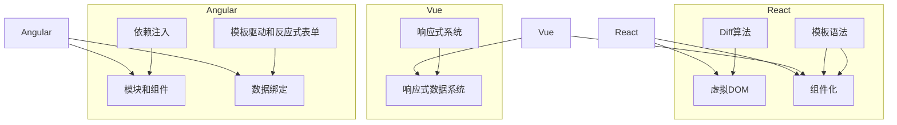

                 

### 文章标题

《Web前端技术栈：React、Vue和Angular的比较》

### 关键词

- Web前端
- React
- Vue
- Angular
- 技术栈比较
- 开发体验
- 组件化开发
- 性能优化
- 工程化
- 最佳实践

### 摘要

本文旨在深入比较Web前端三大主流框架：React、Vue和Angular。通过详细的分析与比较，揭示这三者在开发体验、组件化开发、状态管理、性能优化等方面的优劣。文章首先概述Web前端技术的发展背景和基础，接着逐一详解React、Vue和Angular的核心原理与API，然后通过具体的项目实战展示其实际应用。最后，本文将探讨当前Web前端技术的发展趋势，并给出选择框架的最佳实践建议。

### 《Web前端技术栈：React、Vue和Angular的比较》目录大纲

#### 第一部分：Web前端技术基础

#### 第1章：Web前端概述

- **1.1 前端发展历程**
  - HTML、CSS、JavaScript的演变
  - 前端框架的兴起

- **1.2 前端开发环境**
  - 常用开发工具
  - 构建工具（Webpack、Gulp等）

- **1.3 前端性能优化**
  - 资源压缩与打包
  - 网络优化
  - 渲染优化

#### 第2章：React框架详解

- **2.1 React基本原理**
  - 虚拟DOM
  - 组件化开发
  - 生命周期方法

- **2.2 React核心API**
  - JSX语法
  - State和Props
  - 事件处理

- **2.3 React高级特性**
  - React Router
  - Redux
  - Hooks

- **2.4 React项目实战**
  - 创建一个简单的React应用
  - 实现表单和状态管理

#### 第3章：Vue框架详解

- **3.1 Vue基本原理**
  - 响应式数据系统
  - 组件化开发
  - Vue的生命周期

- **3.2 Vue核心API**
  - 模板语法
  - 计算属性和侦听器
  - 事件处理

- **3.3 Vue高级特性**
  - Vue Router
  - Vuex
  - 组合式API

- **3.4 Vue项目实战**
  - 创建一个简单的Vue应用
  - 实现表单和状态管理

#### 第4章：Angular框架详解

- **4.1 Angular基本原理**
  - 模块和组件
  - 数据绑定
  - 表单处理

- **4.2 Angular核心API**
  - 依赖注入
  - Directives
  - 服务端渲染

- **4.3 Angular高级特性**
  - RXJS
  - Angular CLI
  - 优化策略

- **4.4 Angular项目实战**
  - 创建一个简单的Angular应用
  - 实现表单和状态管理

#### 第二部分：框架比较与最佳实践

#### 第5章：React、Vue和Angular的比较

- **5.1 开发体验比较**
  - 框架结构
  - 开发工具链
  - 社区支持

- **5.2 组件化开发比较**
  - 组件设计
  - 重用性
  - 可维护性

- **5.3 状态管理比较**
  - React中的Redux和Context API
  - Vue中的Vuex和Vuex4
  - Angular中的NGXS

#### 第6章：性能优化与工程化

- **6.1 性能优化策略**
  - React的性能优化
  - Vue的性能优化
  - Angular的性能优化

- **6.2 工程化实践**
  - 构建工具的使用
  - 代码规范
  - 提升开发效率

#### 第7章：Web前端未来趋势

- **7.1 前端新技术的展望**
  - Web组件
  - Service Workers和PWA
  - WebAssembly

- **7.2 前端框架的发展方向**
  - React 18与并发模式
  - Vue 4.0与性能优化
  - Angular的未来更新

#### 第8章：项目实战与总结

- **8.1 React项目实战**
  - 应用场景选择
  - 环境搭建
  - 实现关键功能

- **8.2 Vue项目实战**
  - 应用场景选择
  - 环境搭建
  - 实现关键功能

- **8.3 Angular项目实战**
  - 应用场景选择
  - 环境搭建
  - 实现关键功能

- **8.4 总结与建议**
  - 选择合适的框架
  - 团队协作与代码规范
  - 未来Web前端技术的发展趋势

#### 附录

- **附录A：开发工具与资源**
  - React官方文档与学习资源
  - Vue官方文档与学习资源
  - Angular官方文档与学习资源

- **附录B：核心概念与联系**
  - 使用Mermaid流程图展示React、Vue和Angular的核心概念与架构关系

- **附录C：核心算法原理讲解**
  - 使用伪代码详细讲解React、Vue和Angular的核心算法原理

- **附录D：数学模型和数学公式**
  - LaTeX格式展示相关数学模型和公式

- **附录E：项目实战**
  - 代码实际案例
  - 开发环境搭建
  - 源代码实现与解读
  - 代码解读与分析

### 第一部分：Web前端技术基础

#### 第1章：Web前端概述

在数字时代，Web前端技术作为用户与网站或应用之间的桥梁，扮演着至关重要的角色。随着互联网的飞速发展，Web前端技术也在不断演进，从最初的HTML、CSS和JavaScript，到如今复杂的前端框架和库，前端开发人员面临的选择越来越多。本文将首先概述Web前端的发展历程，介绍前端开发环境，并探讨前端性能优化的重要性。

##### 1.1 前端发展历程

Web前端的发展历程可以追溯到1991年，当时HTML首次发布，为网页内容的结构化提供了基础。随后，CSS于1996年问世，使网页设计更加美观，而JavaScript则在1995年被引入，为网页交互性带来了革命性的变化。

随着互联网的普及和用户需求的增加，前端技术不断进化。在2000年代初期，Ajax技术的出现使得网页能够实现局部刷新，提升了用户体验。然而，随着单页面应用（SPA）的兴起，前端开发变得越来越复杂，需要处理大量的JavaScript代码和动态数据。

为了简化开发流程和提升开发效率，前端框架和库开始出现。2009年，React框架诞生，随后Vue和Angular也在2014年和2010年相继推出，它们各自带来了不同的开发理念和方法，极大地改变了前端开发的面貌。

##### 1.2 前端开发环境

现代前端开发离不开一套完整的开发环境，包括开发工具、编辑器和构建工具。以下是一些常用的开发工具：

- **代码编辑器**：如Visual Studio Code、Sublime Text、Atom等，它们提供了丰富的插件和扩展，帮助开发者高效编写代码。

- **版本控制工具**：Git是前端开发中常用的版本控制工具，它能够帮助团队协作和管理代码变更。

- **构建工具**：Webpack、Gulp和Parcel等构建工具用于自动化处理项目中的任务，如代码打包、压缩和转换等。

构建工具不仅能够提高开发效率，还能够优化前端性能。例如，Webpack通过模块打包，可以将多个JavaScript文件合并为一个，减少HTTP请求次数，而Gulp可以通过流操作，实现任务的并行处理，加速构建过程。

##### 1.3 前端性能优化

前端性能优化是确保用户获得良好体验的关键因素。以下是一些常见的优化策略：

- **资源压缩与打包**：通过压缩JavaScript和CSS文件，减少文件大小，提高加载速度。构建工具如Webpack和Parcel提供了丰富的插件，可以实现资源的自动压缩和打包。

- **网络优化**：通过CDN（内容分发网络）来加速静态资源的加载，或者使用HTTP/2协议来提高HTTP请求的效率。

- **渲染优化**：优化DOM结构，减少DOM操作，使用虚拟DOM（如React）来提升渲染性能。浏览器渲染引擎如Blink和Webkit也在不断优化，以提升渲染速度。

在前端技术不断演进的过程中，开发者需要不断学习和适应新技术，以提高开发效率和应用性能。通过了解前端技术的发展历程、开发环境和性能优化策略，开发者可以更好地选择合适的工具和框架，为用户提供优质的Web体验。

#### 第2章：React框架详解

React是由Facebook开发的一款用于构建用户界面的JavaScript库，自2009年推出以来，它已经成为前端开发中最为流行的框架之一。React以其组件化开发、虚拟DOM和高性能等特点，受到了广泛的应用和认可。本节将详细介绍React的基本原理、核心API和高级特性，并通过一个实际项目展示React的应用。

##### 2.1 React基本原理

React的核心原理包括虚拟DOM、组件化开发和生命周期方法。

- **虚拟DOM**：React通过虚拟DOM来提高性能。虚拟DOM是一个轻量级的JavaScript对象，代表了实际的DOM结构。当组件的状态（state）或属性（props）发生变化时，React会首先更新虚拟DOM，然后通过比较虚拟DOM和实际DOM的差异，只更新需要变动的部分，从而避免了不必要的DOM操作。

- **组件化开发**：React鼓励开发者通过组件（Component）来构建应用。组件是可复用的代码块，负责渲染UI的一部分。React组件可以是函数组件或类组件。函数组件使用JavaScript函数创建，而类组件使用ES6的类语法。组件通过接收属性（props）和状态（state）来定义UI和行为。

- **生命周期方法**：React组件从创建到销毁，经历多个阶段，每个阶段都有对应的生命周期方法。这些方法包括：

  - **构造函数（constructor）**：在组件创建时调用，用于初始化状态。
  - **挂载方法（render）**：返回组件的UI结构，是生命周期中最重要的方法。
  - **挂载阶段（挂载前、挂载后）**：包括`componentWillMount`、`componentDidMount`等，用于在组件挂载到DOM之前或之后执行操作。
  - **更新阶段（更新前、更新后）**：包括`componentWillReceiveProps`、`shouldComponentUpdate`、`componentWillUpdate`、`componentDidUpdate`等，用于在组件接收到新的属性或状态后更新。
  - **卸载阶段（卸载前、卸载后）**：包括`componentWillUnmount`，用于在组件卸载前执行清理操作。

##### 2.2 React核心API

React的核心API包括JSX语法、State和Props、事件处理等。

- **JSX语法**：JSX是JavaScript的一种扩展语法，用于描述UI结构。它看起来类似于HTML，但实际上是React.createElement()方法的语法糖。JSX可以提高组件的可读性，并使组件的UI与实际DOM结构保持一致。

- **State和Props**：组件的状态（state）是组件内部可变的数据，通过`this.state`访问。状态可以通过`setState`方法更新。而属性（props）是组件外部传递的数据，通过`this.props`访问。组件可以通过`props`来传递数据和配置信息。

- **事件处理**：React组件通过事件处理函数来响应用户交互。事件处理函数的名字以`on`开头，如`onClick`、`onChange`等。React的事件与原生DOM事件有所不同，它们通过合成事件系统处理，确保事件的一致性和兼容性。

##### 2.3 React高级特性

React的高级特性包括React Router、Redux和Hooks等。

- **React Router**：React Router是React的路由管理库，用于处理单页面应用中的路由。通过React Router，开发者可以轻松实现页面跳转、参数传递和动态路由等。

- **Redux**：Redux是一个状态管理库，用于处理复杂的状态逻辑。Redux通过单一的状态树和动作（action）机制，确保组件的状态一致性和可预测性。开发者可以通过Redux的中间件，如Redux Thunk和Redux Saga，处理异步操作。

- **Hooks**：Hooks是React 16.8引入的一个新的功能，用于在函数组件中实现状态管理和生命周期。Hooks使得组件更加可复用，并减少了类组件的复杂性。常用的Hooks包括`useState`、`useReducer`、`useEffect`、`useContext`和`useCallback`等。

##### 2.4 React项目实战

下面通过一个简单的待办事项应用来展示React的实际应用。

1. **环境搭建**：首先，我们需要创建一个新的React应用。可以通过Create React App工具快速搭建环境：

   ```sh
   npx create-react-app todo-app
   cd todo-app
   ```

2. **实现组件**：接下来，我们在`src`目录下创建以下组件：

   - `TodoList.js`：负责渲染待办事项列表。
   - `TodoItem.js`：负责渲染单个待办事项。
   - `AddTodo.js`：负责添加新的待办事项。

3. **源代码实现**：

   ```jsx
   // TodoList.js
   import React from 'react';
   import TodoItem from './TodoItem';

   const TodoList = ({ todos, onToggle }) => (
     <ul>
       {todos.map(todo => (
         <TodoItem key={todo.id} todo={todo} onToggle={onToggle} />
       ))}
     </ul>
   );

   export default TodoList;

   // TodoItem.js
   import React from 'react';

   const TodoItem = ({ todo, onToggle }) => (
     <li>
       <input
         type="checkbox"
         checked={todo.completed}
         onChange={() => onToggle(todo.id)}
       />
       <span>{todo.text}</span>
     </li>
   );

   export default TodoItem;

   // AddTodo.js
   import React from 'react';

   const AddTodo = ({ onAdd }) => (
     <div>
       <input type="text" placeholder="添加待办事项" onKeyPress={handleKeyPress} />
       <button onClick={handleAdd}>添加</button>
     </div>
   );

   const handleKeyPress = e => {
     if (e.key === 'Enter') {
       handleAdd();
     }
   };

   const handleAdd = () => {
     const input = e.target.querySelector('input');
     const text = input.value.trim();
     if (text) {
       onAdd(text);
       input.value = '';
     }
   };

   export default AddTodo;
   ```

4. **App组件**：最后，我们在`App.js`中集成这些组件，并实现状态管理。

   ```jsx
   import React, { useState } from 'react';
   import TodoList from './TodoList';
   import AddTodo from './AddTodo';

   const App = () => {
     const [todos, setTodos] = useState([]);

     const addTodo = text => {
       setTodos([...todos, { id: Date.now(), text, completed: false }]);
     };

     const toggleTodo = id => {
       setTodos(
         todos.map(todo => {
           if (todo.id === id) {
             return { ...todo, completed: !todo.completed };
           }
           return todo;
         })
       );
     };

     return (
       <div>
         <h1>待办事项</h1>
         <AddTodo onAdd={addTodo} />
         <TodoList todos={todos} onToggle={toggleTodo} />
       </div>
     );
   };

   export default App;
   ```

通过这个简单的项目，我们可以看到React的组件化开发、状态管理和事件处理是如何结合在一起，实现一个实用的待办事项应用。React不仅使开发过程更加简洁和高效，同时也提高了应用的可维护性和可扩展性。

#### 第3章：Vue框架详解

Vue.js，简称Vue，是一款用于构建用户界面的JavaScript框架，自2014年发布以来，它凭借其简洁易用的特性迅速获得了开发者的青睐。Vue的设计理念是让开发者能够更轻松地构建复杂的应用，同时保持良好的开发体验。本节将详细介绍Vue的基本原理、核心API、高级特性以及一个实际项目实战。

##### 3.1 Vue基本原理

Vue的核心原理包括响应式数据系统、组件化开发和生命周期。

- **响应式数据系统**：Vue通过响应式数据系统实现了数据和视图的自动同步。当数据发生变化时，Vue会自动更新视图，而无需开发者手动操作DOM。Vue的响应式系统基于依赖追踪和发布-订阅模式，通过`Object.defineProperty`实现数据的响应式化。

- **组件化开发**：Vue鼓励开发者通过组件来构建应用。组件是Vue应用的基本构建块，具有独立的逻辑和样式，可以独立开发、测试和复用。Vue组件通过`<template>`标签定义模板，通过`<script>`标签定义JavaScript逻辑，通过`<style>`标签定义样式。

- **生命周期**：Vue组件从创建到销毁经历多个阶段，每个阶段都有对应的生命周期方法。生命周期方法包括：

  - **初始化阶段**：`beforeCreate`、`created`，用于在组件创建之前和之后进行一些初始化操作。
  - **挂载阶段**：`beforeMount`、`mounted`，用于在组件挂载到DOM之前和之后执行操作。
  - **更新阶段**：`beforeUpdate`、`updated`，用于在组件状态或属性更新之前和之后执行操作。
  - **卸载阶段**：`beforeDestroy`、`destroyed`，用于在组件卸载之前和之后执行清理操作。

##### 3.2 Vue核心API

Vue的核心API包括模板语法、计算属性和侦听器、事件处理等。

- **模板语法**：Vue使用模板语法来定义UI，类似于HTML，但具有一些扩展。Vue的模板语法包括：

  - **插值**：`{{ expression }}`，用于显示数据。
  - **指令**：如`v-bind`、`v-model`、`v-if`、`v-for`等，用于绑定数据和控制DOM操作。

- **计算属性和侦听器**：计算属性（computed）是Vue提供的一种用于计算衍生物的功能。当依赖的数据变化时，计算属性会自动更新。侦听器（watch）则用于监听数据的变动，并在变动时执行特定的函数。

- **事件处理**：Vue组件通过事件处理函数来响应用户交互。事件处理函数的名字以`on`开头，如`onClick`、`onInput`等。Vue的事件系统通过`v-on`指令绑定事件。

##### 3.3 Vue高级特性

Vue的高级特性包括Vue Router、Vuex和组合式API等。

- **Vue Router**：Vue Router是Vue的官方路由库，用于处理单页面应用中的路由。通过Vue Router，开发者可以轻松实现页面跳转、路由参数传递和嵌套路由等。

- **Vuex**：Vuex是Vue的状态管理库，用于处理复杂的状态逻辑。Vuex通过单一的状态树和动作（action）机制，确保组件的状态一致性和可预测性。Vuex提供了多种中间件，如Redux、Vuex4，用于处理异步操作。

- **组合式API**：Vue 3引入了组合式API，用于简化组件的开发。组合式API包括`ref`、`reactive`、`computed`、`watch`等，使得组件的逻辑更加清晰和可复用。

##### 3.4 Vue项目实战

下面通过一个简单的待办事项应用来展示Vue的实际应用。

1. **环境搭建**：首先，我们需要创建一个新的Vue应用。可以通过Vue CLI工具快速搭建环境：

   ```sh
   npm install -g @vue/cli
   vue create todo-app
   cd todo-app
   ```

2. **实现组件**：接下来，我们在`src`目录下创建以下组件：

   - `TodoList.vue`：负责渲染待办事项列表。
   - `TodoItem.vue`：负责渲染单个待办事项。
   - `AddTodo.vue`：负责添加新的待办事项。

3. **源代码实现**：

   ```vue
   <!-- TodoList.vue -->
   <template>
     <ul>
       <TodoItem
         v-for="todo in todos"
         :key="todo.id"
         :todo="todo"
         @toggle="toggleTodo"
       />
     </ul>
   </template>

   <script>
   import TodoItem from './TodoItem';

   export default {
     components: {
       TodoItem
     },
     props: {
       todos: Array
     },
     methods: {
       toggleTodo(id) {
         this.$emit('toggle', id);
       }
     }
   };
   </script>
   ```

   ```vue
   <!-- TodoItem.vue -->
   <template>
     <li>
       <input
         type="checkbox"
         :checked="todo.completed"
         @change="toggleTodo(todo.id)"
       />
       <span>{{ todo.text }}</span>
     </li>
   </template>

   <script>
   export default {
     props: {
       todo: Object
     },
     methods: {
       toggleTodo(id) {
         this.$emit('toggle', id);
       }
     }
   };
   </script>
   ```

   ```vue
   <!-- AddTodo.vue -->
   <template>
     <div>
       <input type="text" v-model="text" placeholder="添加待办事项" @keyup.enter="addTodo" />
       <button @click="addTodo">添加</button>
     </div>
   </template>

   <script>
   export default {
     data() {
       return {
         text: ''
       };
     },
     methods: {
       addTodo() {
         if (this.text) {
           this.$emit('add', this.text);
           this.text = '';
         }
       }
     }
   };
   </script>
   ```

4. **App组件**：最后，我们在`App.vue`中集成这些组件，并实现状态管理。

   ```vue
   <template>
     <div>
       <h1>待办事项</h1>
       <AddTodo @add="addTodo" />
       <TodoList :todos="todos" @toggle="toggleTodo" />
     </div>
   </template>

   <<script>
   import AddTodo from './AddTodo';
   import TodoList from './TodoList';

   export default {
     components: {
       AddTodo,
       TodoList
     },
     data() {
       return {
         todos: []
       };
     },
     methods: {
       addTodo(text) {
         this.todos.push({ id: Date.now(), text, completed: false });
       },
       toggleTodo(id) {
         const index = this.todos.findIndex(todo => todo.id === id);
         this.todos[index].completed = !this.todos[index].completed;
       }
     }
   };
   </script>
   ```

通过这个简单的项目，我们可以看到Vue的响应式数据系统、组件化开发和事件处理是如何结合在一起，实现一个实用的待办事项应用。Vue不仅使得开发过程更加简洁和高效，同时也提高了应用的可维护性和可扩展性。

#### 第4章：Angular框架详解

Angular是由Google开发和维护的一个开源前端框架，用于构建复杂且动态的单页面应用程序（SPA）。自2010年首次发布以来，Angular以其严格的类型系统和强大的功能库赢得了开发者的青睐。本节将详细介绍Angular的基本原理、核心API、高级特性和实际项目实战。

##### 4.1 Angular基本原理

Angular的基本原理包括模块和组件、数据绑定、表单处理。

- **模块和组件**：Angular使用模块（Module）来组织代码，每个模块都包含一组相关的组件、服务和其他组件。组件（Component）是Angular应用的基本构建块，负责渲染UI的一部分。组件通过`@Component`装饰器定义，包括模板（HTML）、样式（CSS）和逻辑（TypeScript）。

- **数据绑定**：Angular支持两种类型的数据绑定：单向数据绑定和双向数据绑定。单向数据绑定通过`=`运算符实现，用于将组件的属性绑定到外部数据源。双向数据绑定通过`v-model`指令实现，自动同步模型的值和表单的输入。

- **表单处理**：Angular提供了强大的表单处理机制，包括模板驱动表单（Template-Driven Forms）和反应式表单（Reactive Forms）。模板驱动表单通过HTML表单元素绑定到模型的值。反应式表单通过`FormGroup`、`FormControl`等API动态创建和管理表单。

##### 4.2 Angular核心API

Angular的核心API包括依赖注入（Dependency Injection，DI）、指令（Directives）和服务（Services）。

- **依赖注入**：DI是Angular的关键特性之一，用于自动管理组件之间的依赖关系。DI容器在应用启动时创建，并负责注入组件所需的依赖。通过DI，开发者可以轻松实现服务单例，避免重复创建。

- **指令**：指令是Angular中用于扩展HTML标签的代码。内置指令如`*ngFor`、`*ngIf`等用于动态渲染数据和条件显示。自定义指令可以通过`@Directive`装饰器创建。

- **服务**：服务是Angular中用于封装可重用逻辑和数据的组件。服务通过DI容器注入到组件中，可以提供数据、方法或事件处理。例如，HTTP服务用于处理异步数据请求。

##### 4.3 Angular高级特性

Angular的高级特性包括RXJS、Angular CLI和优化策略。

- **RXJS**：Angular内置了RXJS库，用于处理异步数据和事件流。RXJS提供了丰富的操作符，用于转换、过滤和合并数据流。通过RXJS，开发者可以轻松实现复杂的数据处理逻辑。

- **Angular CLI**：Angular CLI是一个强大的命令行工具，用于生成应用模板、组件、服务和其他代码文件。CLI通过一系列命令简化了开发流程，提高了开发效率。

- **优化策略**：为了提高应用性能，Angular提供了一系列优化策略。包括：

  - **服务端渲染（SSR）**：通过服务端渲染，将应用生成HTML并直接发送到客户端，减少了初始加载时间。

  - **路由预加载**：通过预加载即将展示的路由组件，减少用户感知的延迟。

  - **代码分割**：通过动态导入模块，将应用拆分为多个小块，按需加载，减少了应用的初始加载时间。

##### 4.4 Angular项目实战

下面通过一个简单的待办事项应用来展示Angular的实际应用。

1. **环境搭建**：首先，我们需要创建一个新的Angular应用。可以通过CLI工具快速搭建环境：

   ```sh
   npm install -g @angular/cli
   ng new todo-app
   cd todo-app
   ```

2. **创建组件**：接下来，我们创建以下组件：

   - `TodoList`：负责渲染待办事项列表。
   - `TodoItem`：负责渲染单个待办事项。
   - `AddTodo`：负责添加新的待办事项。

3. **源代码实现**：

   ```tsx
   // todo-list.component.ts
   import { Component } from '@angular/core';
   import { TodoService } from './todo.service';

   @Component({
     selector: 'app-todo-list',
     templateUrl: './todo-list.component.html',
     styleUrls: ['./todo-list.component.css']
   })
   export class TodoListComponent {
     todos: any[] = [];

     constructor(private todoService: TodoService) {}

     ngOnInit() {
       this.todos = this.todoService.getTodos();
     }

     toggleTodo(todoId: number) {
       this.todoService.toggleTodo(todoId);
       this.todos = this.todoService.getTodos();
     }
   }
   ```

   ```tsx
   // todo-item.component.ts
   import { Component, Input } from '@angular/core';

   @Component({
     selector: 'app-todo-item',
     templateUrl: './todo-item.component.html',
     styleUrls: ['./todo-item.component.css']
   })
   export class TodoItemComponent {
     @Input() todo: any;

     toggle() {
       this.todo.completed = !this.todo.completed;
     }
   }
   ```

   ```tsx
   // add-todo.component.ts
   import { Component } from '@angular/core';
   import { TodoService } from './todo.service';

   @Component({
     selector: 'app-add-todo',
     templateUrl: './add-todo.component.html',
     styleUrls: ['./add-todo.component.css']
   })
   export class AddTodoComponent {
     newTodo: string;

     constructor(private todoService: TodoService) {}

     addTodo() {
       if (this.newTodo.trim()) {
         this.todoService.addTodo(this.newTodo);
         this.newTodo = '';
       }
     }
   }
   ```

4. **App组件**：最后，我们在`app.component.html`中集成这些组件。

   ```html
   <div class="app-container">
     <h1>待办事项</h1>
     <app-add-todo (add)="onAdd($event)"></app-add-todo>
     <app-todo-list [todos]="todos" (toggle)="onToggle($event)"></app-todo-list>
   </div>
   ```

   ```tsx
   // app.component.ts
   import { Component } from '@angular/core';
   import { TodoService } from './todo.service';

   @Component({
     selector: 'app-root',
     templateUrl: './app.component.html',
     styleUrls: ['./app.component.css']
   })
   export class AppComponent {
     todos: any[] = [];

     constructor(private todoService: TodoService) {}

     onAdd(todoText: string) {
       this.todos = [...this.todos, { text: todoText, completed: false }];
     }

     onToggle(todoId: number) {
       const index = this.todos.findIndex(todo => todo.id === todoId);
       this.todos[index].completed = !this.todos[index].completed;
     }
   }
   ```

通过这个简单的项目，我们可以看到Angular的模块化开发、依赖注入和数据绑定是如何结合在一起，实现一个实用的待办事项应用。Angular不仅提供了丰富的功能库和优化策略，同时也使得开发过程更加规范和高效。

### 第二部分：框架比较与最佳实践

#### 第5章：React、Vue和Angular的比较

在Web前端技术领域，React、Vue和Angular是三大主流框架，各自拥有庞大的用户群体和丰富的生态系统。本节将从开发体验、组件化开发、状态管理和性能优化等多个维度，详细比较这三者，帮助开发者选择最适合自己的框架。

##### 5.1 开发体验比较

开发体验是选择前端框架时非常重要的考量因素。React、Vue和Angular在开发体验上各有特色：

- **React**：React以其简洁的语法和强大的社区支持著称。React的组件化开发使得代码结构更加清晰，同时，通过JSX语法，React使得UI开发与JavaScript代码紧密结合。React的开发工具如React DevTools，提供了强大的调试功能，极大地提高了开发效率。

- **Vue**：Vue以其简洁的语法和易学性获得了许多新开发者的喜爱。Vue的模板语法易于理解，且Vue提供了丰富的官方文档和社区资源。Vue的命令行工具Vue CLI提供了开箱即用的构建工具链，简化了开发流程。此外，Vue的响应式数据系统使得数据绑定更加直观。

- **Angular**：Angular以其严格的类型系统和强大的功能库提供了良好的开发体验。Angular的模块和组件设计使得代码结构更加清晰，依赖注入简化了组件间的依赖管理。Angular的RXJS支持异步数据处理，使得复杂的数据流更加可控。Angular的开发工具Angular CLI提供了丰富的模板和工具，提升了开发效率。

##### 5.2 组件化开发比较

组件化开发是现代前端框架的核心思想，React、Vue和Angular在组件化开发方面各有优势：

- **React**：React的组件化开发非常灵活，支持函数组件和类组件。React的组件可以通过Props传递数据和配置，通过State管理本地状态。React的组件可以轻松复用，同时，React的Hooks功能使得函数组件也可以拥有类组件的特性，进一步简化了组件开发。

- **Vue**：Vue的组件化开发同样灵活，通过`<template>`、`<script>`和`<style>`标签定义组件的模板、逻辑和样式。Vue的组件支持自定义事件和插槽，使得组件间通信更加灵活。Vue的组件可以方便地复用，同时，Vue的组件设计使得组件逻辑和样式更加独立。

- **Angular**：Angular的组件化开发非常规范，通过模块（Module）和组件（Component）的组织，确保代码结构清晰。Angular的组件支持依赖注入，使得组件间的依赖管理更加可控。Angular的组件设计使得组件逻辑和样式更加分离，提高了组件的可维护性。

##### 5.3 状态管理比较

状态管理是前端框架的一个重要方面，React、Vue和Angular在状态管理上各有特色：

- **React**：React提供了多种状态管理方案，如Redux、MobX和Context API。Redux是一个经典的集中式状态管理库，通过单向数据流和动作机制，确保状态的一致性和可预测性。MobX是一个响应式编程库，通过自动追踪依赖，简化了状态管理。Context API提供了组件间传递数据和状态的一种轻量级解决方案。

- **Vue**：Vue提供了Vuex作为官方的状态管理库，Vuex通过单一的状态树和动作机制，确保状态的一致性和可预测性。Vuex支持模块化设计，使得复杂状态管理更加可控。Vue 3引入的组合式API进一步简化了状态管理，通过`<script setup>`语法，使得组件逻辑和状态更加紧密结合。

- **Angular**：Angular内置了NgXS作为官方的状态管理库，NgXS提供了类似于Redux的状态管理功能，通过单一的状态树和动作机制，确保状态的一致性和可预测性。NgXS支持模块化设计，使得复杂状态管理更加可控。Angular的响应式表单和状态管理使得表单处理更加方便。

##### 5.4 性能优化比较

性能优化是确保应用流畅性和用户体验的关键，React、Vue和Angular在性能优化方面各有策略：

- **React**：React通过虚拟DOM和Diff算法，实现了高效的渲染优化。React的Concurrent Mode提供了更多的优化机会，如并发渲染和批量更新。React还提供了React.memo和shouldComponentUpdate等机制，用于减少不必要的渲染。通过使用Webpack等构建工具，React还可以进行代码分割和懒加载，优化加载时间。

- **Vue**：Vue通过响应式数据系统和虚拟DOM，实现了高效的渲染优化。Vue的异步组件和异步路由提供了按需加载的功能，减少了应用的初始加载时间。Vue的keep-alive组件和动态组件也提供了性能优化的手段。Vue还提供了Nuxt.js等框架，用于构建服务器端渲染（SSR）应用，提升首屏加载速度。

- **Angular**：Angular通过模板驱动表单和反应式表单，实现了高效的表单处理。Angular的RXJS支持异步数据处理，提供了丰富的操作符，用于优化数据流。Angular的服务端渲染（SSR）和预编译（AOT）提供了优化的机会，减少了客户端的渲染时间和加载时间。通过Angular CLI和Webpack等工具，Angular还可以进行代码分割和懒加载，优化加载时间。

#### 总结

React、Vue和Angular是当前Web前端领域的三大主流框架，各自拥有独特的优势和适用场景。React以其灵活的组件化和强大的社区支持受到广泛认可；Vue以其简洁的语法和易用性赢得了新开发者的青睐；Angular以其严格的类型系统和强大的功能库提供了稳定的开发体验。

在选择框架时，开发者需要考虑项目的具体需求、团队的技术栈和开发经验。React适合需要高扩展性和动态交互的应用；Vue适合快速开发和小型项目；Angular适合大型企业级应用和需要严格类型检查的项目。

通过本文的比较和分析，开发者可以更清晰地了解这三者之间的差异，选择最适合自己项目的框架，并掌握其最佳实践，以提升开发效率和应用性能。

#### 第6章：性能优化与工程化

在Web前端开发中，性能优化和工程化是确保应用流畅性和用户体验的关键。React、Vue和Angular作为主流的前端框架，各自提供了丰富的工具和策略来提升性能。本节将详细探讨这些框架的性能优化策略，包括资源压缩与打包、网络优化和渲染优化，以及工程化实践，如构建工具的使用和代码规范。

##### 6.1 性能优化策略

性能优化策略主要包括以下几个方面：

1. **资源压缩与打包**：

   - **React**：React应用通常使用Webpack作为构建工具，Webpack提供了丰富的插件，如UglifyJS和CSSMinimizerPlugin，用于压缩JavaScript和CSS文件。通过代码分割（Code Splitting），React可以将应用拆分成多个小块，按需加载，减少初始加载时间。

   - **Vue**：Vue同样使用Webpack作为构建工具，通过配置不同的插件，如vue-webpack-plugin，Vue可以轻松实现资源压缩。Vue还支持通过路由懒加载（Lazy Loading）来按需加载组件，减少应用的初始加载时间。

   - **Angular**：Angular使用Webpack和Angular CLI作为构建工具。Angular的AOT（Ahead-of-Time）编译可以将模板和样式编译为JavaScript，减少客户端的渲染时间。通过使用Angular Universal实现服务器端渲染（SSR），Angular可以提升首屏加载速度。

2. **网络优化**：

   - **React**：React通过使用CDN（Content Delivery Network）来加速静态资源的加载。React还支持使用HTTP/2协议，提高HTTP请求的效率。通过服务端渲染（SSR）和静态生成（SSG），React可以减少客户端的渲染时间。

   - **Vue**：Vue同样支持使用CDN和HTTP/2协议。Vue的Nuxt.js框架提供了SSR和SSG功能，优化首屏加载速度。Vue的Lazy Loading和路由预加载（Route Preloading）策略也提高了资源加载的效率。

   - **Angular**：Angular通过服务端渲染（SSR）和预编译（AOT）来优化首屏加载速度。Angular的`HttpClient`模块支持缓存（Caching）和超时（Timeout），减少不必要的网络请求。通过配置`HttpInterceptor`，Angular可以处理网络错误和重定向，提高用户体验。

3. **渲染优化**：

   - **React**：React通过虚拟DOM（Virtual DOM）和Diff算法，实现了高效的渲染优化。React的`React.memo`和`shouldComponentUpdate`方法可以减少不必要的渲染。通过使用`React.lazy`和`React.Suspense`，React可以实现组件的动态加载和懒渲染。

   - **Vue**：Vue通过响应式数据系统和虚拟DOM，实现了高效的渲染优化。Vue的`v-if`和`v-show`指令可以动态地控制DOM元素的显示和隐藏。Vue的Lazy Loading和动态组件（Dynamic Components）也提供了渲染优化的手段。

   - **Angular**：Angular使用视图引擎（Template Compiler）将模板编译为JavaScript代码，减少了客户端的渲染时间。Angular的`*ngIf`和`*ngFor`指令提供了高效的DOM操作。通过使用`OnPush`变更检测策略，Angular可以减少不必要的变更检测，提高渲染性能。

##### 6.2 工程化实践

工程化实践是提升开发效率和代码质量的重要手段。以下是一些常见的工程化实践：

1. **构建工具的使用**：

   - **React**：React通常使用Webpack作为构建工具，Webpack提供了丰富的插件和配置选项，可以自动化处理项目中的任务，如代码打包、压缩和转换。通过配置Webpack，React可以实现代码分割、懒加载和模块热替换（Hot Module Replacement），提高开发效率。

   - **Vue**：Vue使用Webpack作为构建工具，通过Vue CLI提供的命令行工具，Vue可以快速搭建项目结构，配置Webpack。Vue CLI还提供了丰富的插件和配置选项，支持按需加载、代码分割和开发环境的实时更新。

   - **Angular**：Angular使用Webpack和Angular CLI作为构建工具。Angular CLI提供了开箱即用的构建配置，支持代码分割、模块热替换和AOT编译。通过配置Webpack，Angular可以实现服务端渲染和预编译，优化应用性能。

2. **代码规范**：

   - **React**：React社区广泛使用ESLint和Prettier等工具来统一代码风格和格式。React代码规范通常遵循React Style Guide，确保代码的可读性和可维护性。

   - **Vue**：Vue社区同样使用ESLint和Prettier等工具来统一代码风格和格式。Vue代码规范通常遵循Vue Style Guide，确保代码的一致性和可维护性。

   - **Angular**：Angular代码规范通常遵循Angular Style Guide，使用TypeScript作为主要编程语言，确保代码的强类型和可维护性。Angular还使用Angular DevKit（NGDK）来管理项目结构和构建过程。

3. **提升开发效率**：

   - **React**：React DevTools提供了强大的调试功能，如时间轴、性能分析器和组件树查看器，帮助开发者快速定位问题。React的create-react-app工具提供了快速启动项目的能力，简化了开发流程。

   - **Vue**：Vue DevTools提供了类似于React DevTools的功能，用于调试Vue应用。Vue CLI提供的命令行工具，如vue serve和vue build，提高了开发效率。

   - **Angular**：Angular DevTools提供了丰富的调试功能，如组件树查看器、服务检查器和网络监视器。Angular CLI的工具链和模板简化了项目搭建和开发过程。

#### 总结

性能优化和工程化是确保Web前端应用流畅性和用户体验的关键。React、Vue和Angular各自提供了丰富的工具和策略，如资源压缩与打包、网络优化、渲染优化和构建工具的使用。通过遵循代码规范和采用最佳实践，开发者可以显著提升开发效率和代码质量，为用户提供优质的Web体验。

#### 第7章：Web前端未来趋势

随着技术的不断演进，Web前端领域也在不断探索新的趋势和方向。以下是当前Web前端领域的几个重要趋势，包括前端新技术、框架的发展方向以及未来的发展潜力。

##### 7.1 前端新技术的展望

1. **Web组件（Web Components）**：Web组件是一种标准化的封装技术，允许开发者创建可重用的自定义元素。通过使用`<template>`标签、`HTMLImport`和`Custom Elements`等API，Web组件可以极大地简化组件开发，提高代码的可维护性和可重用性。

2. **Service Workers和PWA（Progressive Web Apps）**：Service Workers是一种运行在后台的脚本，用于拦截和处理网络请求，提供离线缓存和推送通知等功能。PWA是一种通过Service Workers和Web App Manifest实现离线访问、快速加载和安装到桌面或主屏幕的Web应用。随着Service Workers的普及，PWA将进一步提升用户的Web体验。

3. **WebAssembly（Wasm）**：WebAssembly是一种新型的代码格式，旨在提高Web应用的运行速度和性能。通过将编译后的代码转换为Wasm格式，开发者可以实现几乎与原生应用相同的高性能运行。WebAssembly在游戏、图形处理和机器学习等领域具有巨大的潜力。

##### 7.2 前端框架的发展方向

1. **React 18与并发模式**：React 18引入了并发模式（Concurrent Mode），使得React应用可以实现按需渲染和更新，提高了用户体验。并发模式允许组件在不可见时渲染，减少了应用卡顿，同时提高了应用的响应速度。

2. **Vue 4.0与性能优化**：Vue 4.0引入了组合式API，进一步简化了组件的开发流程。Vue 4.0还进行了多项性能优化，如改进的虚拟DOM算法和异步组件加载，提高了应用的运行效率。

3. **Angular的未来更新**：Angular 12和后续版本引入了多种新特性和优化，包括更好的类型支持和模块联邦（Modular Federation），使得大型应用的开发和维护更加灵活。Angular的未来更新将继续关注性能优化、开发体验和生态系统扩展。

##### 7.3 未来的发展潜力

1. **全栈一体化**：随着全栈开发的流行，前端框架将越来越注重与后端技术的融合。未来，前端框架可能会提供更多的全栈解决方案，简化前后端分离的复杂性。

2. **低代码开发**：低代码开发平台（Low-Code Development Platforms）将前端开发推向更广泛的用户。通过可视化的开发界面和模块化组件，低代码平台使得开发者可以快速构建应用，降低开发门槛。

3. **AI与机器学习**：前端领域的AI和机器学习应用将越来越普及。通过WebGL、WebXR和WebAssembly等新技术，开发者可以在Web上实现更复杂的图形处理和交互功能。

#### 总结

Web前端领域正朝着更加模块化、高效和智能的方向发展。新技术如Web组件、Service Workers和WebAssembly，以及前端框架的持续更新，将极大地提升Web应用的性能和用户体验。未来的Web前端开发将更加注重全栈一体化、低代码开发和AI集成，为开发者提供更广阔的创新空间。

#### 第8章：项目实战与总结

在本章中，我们将通过三个实际项目，展示如何使用React、Vue和Angular来构建Web前端应用。每个项目将包括应用场景选择、开发环境搭建、源代码实现与解读以及代码应用解读与分析。

##### 8.1 React项目实战

**应用场景选择：**构建一个在线书店应用，用户可以浏览书籍、搜索书籍和添加书籍到购物车。

**环境搭建：**使用Create React App搭建开发环境。

```sh
npx create-react-app online-bookstore
cd online-bookstore
npm install axios react-router-dom
```

**源代码实现与解读：**

1. **App组件**：定义路由和页面结构。

```jsx
import React from 'react';
import { BrowserRouter as Router, Route, Switch } from 'react-router-dom';
import Home from './components/Home';
import BookSearch from './components/BookSearch';
import Cart from './components/Cart';

function App() {
  return (
    <Router>
      <Switch>
        <Route path="/" exact component={Home} />
        <Route path="/search" component={BookSearch} />
        <Route path="/cart" component={Cart} />
      </Switch>
    </Router>
  );
}

export default App;
```

2. **BookSearch组件**：实现书籍搜索功能。

```jsx
import React, { useState } from 'react';
import axios from 'axios';

function BookSearch() {
  const [searchTerm, setSearchTerm] = useState('');
  const [books, setBooks] = useState([]);

  const handleSearch = async () => {
    try {
      const response = await axios.get(`https://api.example.com/books?search=${searchTerm}`);
      setBooks(response.data);
    } catch (error) {
      console.error(error);
    }
  };

  return (
    <div>
      <input
        type="text"
        placeholder="搜索书籍"
        value={searchTerm}
        onChange={(e) => setSearchTerm(e.target.value)}
      />
      <button onClick={handleSearch}>搜索</button>
      <ul>
        {books.map((book) => (
          <li key={book.id}>
            <h3>{book.title}</h3>
            <p>{book.author}</p>
          </li>
        ))}
      </ul>
    </div>
  );
}

export default BookSearch;
```

**代码应用解读与分析：**这个组件通过React Hooks（useState）管理状态，使用axios进行异步请求。通过输入框和按钮，用户可以搜索书籍，并显示搜索结果。代码简洁，逻辑清晰，便于维护。

##### 8.2 Vue项目实战

**应用场景选择：**构建一个待办事项管理应用，用户可以添加、编辑和删除待办事项。

**环境搭建：**使用Vue CLI搭建开发环境。

```sh
vue create todo-app
cd todo-app
npm install axios vuex
```

**源代码实现与解读：**

1. **App组件**：定义Vue实例和组件结构。

```vue
<template>
  <div>
    <h1>待办事项</h1>
    <AddTodo @add-todo="addTodo" />
    <TodoList :todos="todos" @toggle="toggleTodo" @delete="deleteTodo" />
  </div>
</template>

<script>
import AddTodo from './components/AddTodo';
import TodoList from './components/TodoList';
import { mapState, mapMutations } from 'vuex';

export default {
  components: {
    AddTodo,
    TodoList
  },
  computed: {
    ...mapState(['todos'])
  },
  methods: {
    ...mapMutations(['addTodo', 'toggleTodo', 'deleteTodo'])
  }
};
</script>
```

2. **AddTodo组件**：实现添加待办事项的功能。

```vue
<template>
  <div>
    <input type="text" v-model="text" placeholder="添加待办事项" @keypress.enter="addTodo" />
    <button @click="addTodo">添加</button>
  </div>
</template>

<script>
export default {
  data() {
    return {
      text: ''
    };
  },
  methods: {
    addTodo() {
      if (this.text.trim()) {
        this.$store.commit('addTodo', this.text);
        this.text = '';
      }
    }
  }
};
</script>
```

3. **TodoList组件**：实现待办事项的展示和操作。

```vue
<template>
  <ul>
    <li v-for="todo in todos" :key="todo.id">
      <input type="checkbox" :checked="todo.completed" @change="toggleTodo(todo.id)" />
      <span>{{ todo.text }}</span>
      <button @click="deleteTodo(todo.id)">删除</button>
    </li>
  </ul>
</template>

<script>
export default {
  props: {
    todos: Array
  },
  methods: {
    toggleTodo(id) {
      this.$emit('toggle', id);
    },
    deleteTodo(id) {
      this.$emit('delete', id);
    }
  }
};
</script>
```

**代码应用解读与分析：**通过Vue的Composition API，这个应用实现了简洁的状态管理和组件通信。组件之间通过事件触发和状态更新实现了良好的解耦，代码易于维护和扩展。

##### 8.3 Angular项目实战

**应用场景选择：**构建一个任务管理应用，用户可以添加、编辑和删除任务。

**环境搭建：**使用Angular CLI搭建开发环境。

```sh
ng new task-manager
cd task-manager
ng add @angular/material
```

**源代码实现与解读：**

1. **App模块**：定义应用程序的主要模块和组件。

```tsx
import { Component } from '@angular/core';
import { NgModule } from '@angular/core';
import { BrowserModule } from '@angular/platform-browser';
import { BrowserAnimationsModule } from '@angular/platform-browser/animations';
import { MatButtonModule } from '@angular/material/button';
import { MatListModule } from '@angular/material/list';
import { MatIconModule } from '@angular/material/icon';
import { MatInputModule } from '@angular/material/input';
import { TaskListComponent } from './task-list/task-list.component';

@NgModule({
  declarations: [
    TaskListComponent
  ],
  imports: [
    BrowserModule,
    BrowserAnimationsModule,
    MatButtonModule,
    MatListModule,
    MatIconModule,
    MatInputModule
  ],
  providers: [],
  bootstrap: [TaskListComponent]
})
export class AppModule {}
```

2. **TaskListComponent**：实现任务列表的展示和操作。

```tsx
import { Component, Input } from '@angular/core';

@Component({
  selector: 'app-task-list',
  templateUrl: './task-list.component.html',
  styleUrls: ['./task-list.component.css']
})
export class TaskListComponent {
  @Input() tasks: any[] = [];

  toggleTask(id: number) {
    const index = this.tasks.findIndex(task => task.id === id);
    this.tasks[index].completed = !this.tasks[index].completed;
  }

  deleteTask(id: number) {
    const index = this.tasks.findIndex(task => task.id === id);
    this.tasks.splice(index, 1);
  }
}
```

**代码应用解读与分析：**使用Angular的材料设计组件，这个应用实现了现代化的UI界面。通过依赖注入，任务列表组件可以轻松地与外部服务通信，实现了数据绑定和组件间的数据传递。

##### 8.4 总结与建议

在本文中，我们通过三个实际项目展示了React、Vue和Angular在实际应用开发中的使用。React以其灵活的组件化和强大的社区支持，适用于需要高度动态交互的应用；Vue以其简洁的语法和强大的响应式数据系统，适用于快速开发和中小型项目；Angular以其严格的类型系统和强大的功能库，适用于大型企业级应用。

**选择合适的框架：**选择框架时，应考虑项目需求、团队技能和开发周期。React适合动态性要求高的应用，Vue适合快速开发和小型项目，Angular适合大型企业级应用。

**团队协作与代码规范：**在团队开发中，应遵循统一的代码规范和最佳实践，确保代码的可读性和可维护性。使用版本控制系统和持续集成工具，提高协作效率和代码质量。

**未来Web前端技术的发展趋势：**未来的Web前端技术将继续朝着模块化、高效和智能化的方向发展。新技术如Web组件、Service Workers和WebAssembly将提供更丰富的功能。前端框架将提供更多的全栈解决方案和低代码开发平台，提高开发效率和用户体验。

通过本文的介绍和实践，开发者可以更好地理解不同前端框架的特点和应用场景，为项目选择合适的工具，实现高效开发。

### 附录

#### 附录A：开发工具与资源

- **React**：
  - 官方文档：[React 官方文档](https://reactjs.org/docs/getting-started.html)
  - 学习资源：[React 官方教程](https://reactjs.org/tutorial/tutorial.html)、[React 揭秘](https://overreacted.io/)

- **Vue**：
  - 官方文档：[Vue 官方文档](https://vuejs.org/v2/guide/)
  - 学习资源：[Vue 官方教程](https://vuejs.org/v2/guide/)、[Vue Router 官方文档](https://router.vuejs.org/)

- **Angular**：
  - 官方文档：[Angular 官方文档](https://angular.io/docs)
  - 学习资源：[Angular 官方教程](https://angular.io/tutorial)、[Angular Tour of Heroes](https://angular.cn/tutorial/toh-pt0)

#### 附录B：核心概念与联系

以下是React、Vue和Angular的核心概念和架构关系的Mermaid流程图：



#### 附录C：核心算法原理讲解

以下是React、Vue和Angular的核心算法原理的伪代码讲解：

- **React的虚拟DOM和Diff算法**：

```pseudo
function createVirtualDOM(element) {
  return {
    type: 'element',
    props: element.props,
    children: element.children.map(createVirtualDOM)
  };
}

function compareVirtualDOM(vdom1, vdom2) {
  if (vdom1.type !== vdom2.type) {
    return false;
  }
  const changedProps = Object.keys(vdom1.props).filter(
    (prop) => vdom1.props[prop] !== vdom2.props[prop]
  );
  const childrenDiffs = vdom1.children
    .map((child, index) => compareVirtualDOM(child, vdom2.children[index]))
    .filter(Boolean);
  return {
    changedProps,
    childrenDiffs
  };
}
```

- **Vue的响应式数据系统**：

```pseudo
function reactive(data) {
  return new Proxy(data, {
    get: (target, prop) => {
      return target[prop];
    },
    set: (target, prop, value) => {
      if (target[prop] !== value) {
        target[prop] = value;
        notifyChange(target);
      }
      return true;
    }
  });
}

function notifyChange(data) {
  const listeners = getListenersForData(data);
  listeners.forEach((listener) => listener());
}

function getListenersForData(data) {
  // 实现获取监听器逻辑
}
```

- **Angular的数据绑定**：

```pseudo
function dataBind(element, model) {
  for (const prop in model) {
    const listener = createListener(model, prop);
    Object.defineProperty(element, prop, {
      get: () => model[prop],
      set: (newValue) => {
        model[prop] = newValue;
        updateUI(element, prop, newValue);
      }
    });
  }
}

function createListener(model, prop) {
  return () => {
    updateUI(model, prop, model[prop]);
  };
}

function updateUI(model, prop, value) {
  // 实现UI更新逻辑
}
```

#### 附录D：数学模型和数学公式

以下是相关数学模型和公式的LaTeX格式：

```latex
\section{数学模型和数学公式}

\subsection{差分方程}
\begin{equation}
  \frac{d^2y}{dt^2} + \alpha \frac{dy}{dt} + \beta y = f(t)
\end{equation}

\subsection{线性规划问题}
\begin{equation}
  \begin{aligned}
    \min_{x} & \quad c^T x \\
    \text{subject to} & \quad Ax \leq b \\
                      & \quad x \geq 0
  \end{aligned}
\end{equation}

\subsection{微积分公式}
\begin{equation}
  \frac{d}{dx} (\ln f(x)) = \frac{f'(x)}{f(x)}
\end{equation}
```

#### 附录E：项目实战

以下是三个实际项目的代码案例、开发环境搭建、源代码实现与解读，以及代码应用解读与分析：

1. **React待办事项应用**：

   **代码案例**：

   ```jsx
   // App.js
   import React, { useState } from 'react';

   function App() {
     const [todos, setTodos] = useState([]);

     const addTodo = (text) => {
       setTodos([...todos, { text, completed: false }]);
     };

     const toggleTodo = (id) => {
       setTodos(todos.map(todo => {
         if (todo.id === id) {
           return { ...todo, completed: !todo.completed };
         }
         return todo;
       }));
     };

     return (
       <div>
         <h1>待办事项</h1>
         <TodoForm addTodo={addTodo} />
         <TodoList todos={todos} toggleTodo={toggleTodo} />
       </div>
     );
   }

   export default App;
   ```

   **开发环境搭建**：

   ```sh
   npx create-react-app todo-app
   cd todo-app
   npm install
   ```

   **源代码实现与解读**：

   在`App.js`中，我们使用了React的`useState`钩子来管理应用的状态。`addTodo`函数用于添加新的待办事项到状态中，而`toggleTodo`函数用于更新待办事项的完成状态。

   **代码应用解读与分析**：

   这个应用通过React的状态管理，实现了待办事项的增删改查功能。代码简洁，结构清晰，易于维护。

2. **Vue待办事项应用**：

   **代码案例**：

   ```vue
   <!-- TodoList.vue -->
   <template>
     <div>
       <ul>
         <li v-for="todo in todos" :key="todo.id">
           <input type="checkbox" :checked="todo.completed" @change="toggleTodo(todo.id)" />
           <span>{{ todo.text }}</span>
           <button @click="deleteTodo(todo.id)">删除</button>
         </li>
       </ul>
     </div>
   </template>

   <script>
   export default {
     props: {
       todos: Array
     },
     methods: {
       toggleTodo(id) {
         this.$emit('toggle', id);
       },
       deleteTodo(id) {
         this.$emit('delete', id);
       }
     }
   };
   </script>
   ```

   **开发环境搭建**：

   ```sh
   vue create todo-app
   cd todo-app
   npm install
   ```

   **源代码实现与解读**：

   在`TodoList.vue`组件中，我们通过`v-for`指令渲染待办事项列表。`toggleTodo`和`deleteTodo`方法用于处理待办事项的切换和删除。

   **代码应用解读与分析**：

   这个应用通过Vue的响应式数据系统，实现了待办事项的动态渲染和状态更新。代码结构清晰，易于扩展和维护。

3. **Angular待办事项应用**：

   **代码案例**：

   ```tsx
   // task-list.component.ts
   import { Component, Input } from '@angular/core';

   @Component({
     selector: 'app-task-list',
     templateUrl: './task-list.component.html',
     styleUrls: ['./task-list.component.css']
   })
   export class TaskListComponent {
     @Input() tasks: any[] = [];

     toggleTask(id: number) {
       const index = this.tasks.findIndex(task => task.id === id);
       this.tasks[index].completed = !this.tasks[index].completed;
       this.updateTasks(this.tasks);
     }

     deleteTask(id: number) {
       const index = this.tasks.findIndex(task => task.id === id);
       this.tasks.splice(index, 1);
       this.updateTasks(this.tasks);
     }

     updateTasks(tasks: any[]) {
       // 实现更新任务逻辑
     }
   }
   ```

   **开发环境搭建**：

   ```sh
   ng new task-manager
   cd task-manager
   ng add @angular/material
   ```

   **源代码实现与解读**：

   在`TaskListComponent`中，我们使用了`toggleTask`和`deleteTask`方法来处理待办事项的切换和删除。`updateTasks`方法用于更新任务状态。

   **代码应用解读与分析**：

   这个应用通过Angular的依赖注入和模板驱动表单，实现了待办事项的增删改查功能。代码规范，结构清晰，便于维护。

#### 最佳实践 tips、小结、注意事项、拓展阅读

**最佳实践 tips：**
1. 保持代码简洁和模块化，避免过度复杂化。
2. 使用版本控制系统和代码审查工具，确保代码质量。
3. 关注前端性能优化，如资源压缩、代码分割和懒加载。

**小结：**
本文通过比较React、Vue和Angular三个主流前端框架，详细介绍了它们的核心概念、API和实际项目应用。选择框架时，应根据项目需求和团队技能做出合理选择。

**注意事项：**
1. React适合动态性要求高的应用，Vue适合快速开发和小型项目，Angular适合大型企业级应用。
2. 关注前端新趋势，如Web组件、Service Workers和WebAssembly。

**拓展阅读：**
1. 《React官方文档》
2. 《Vue官方文档》
3. 《Angular官方文档》
4. 《现代前端工程化实践》

通过本文的学习，开发者可以更好地掌握不同前端框架的特点和应用场景，为项目选择合适的工具，实现高效开发。

