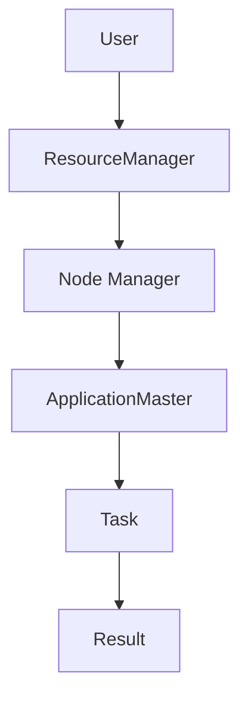
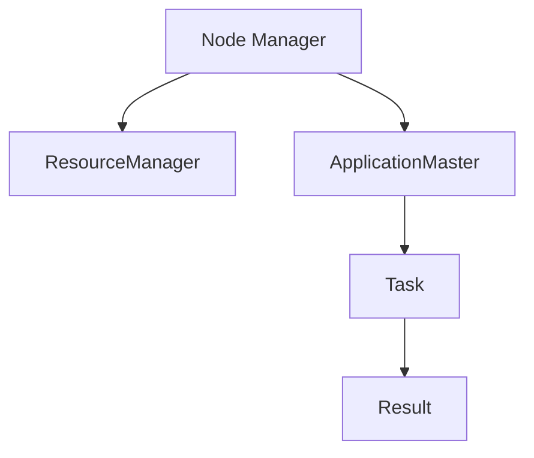
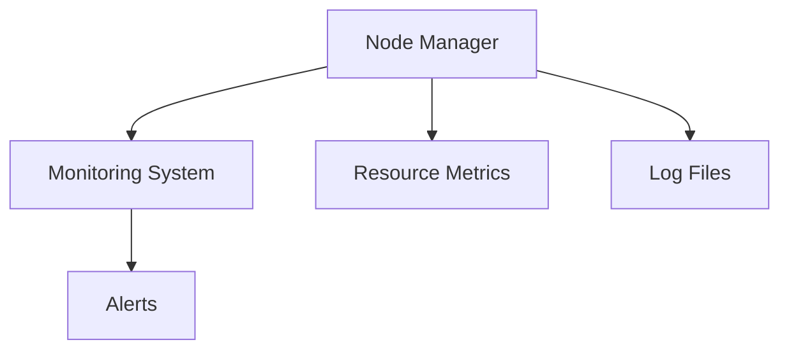
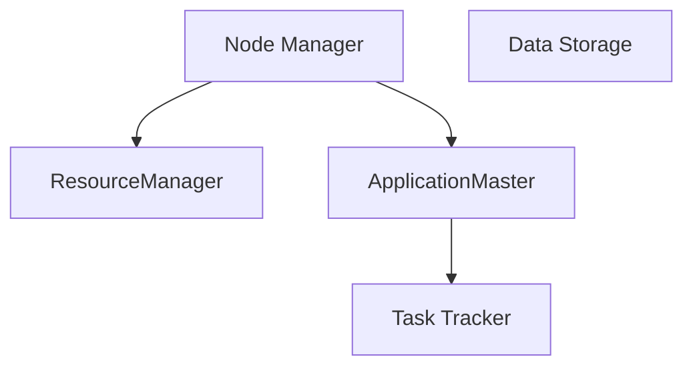
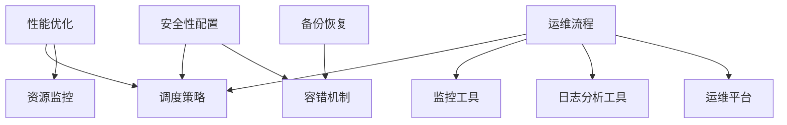
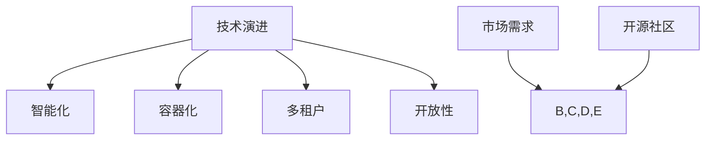
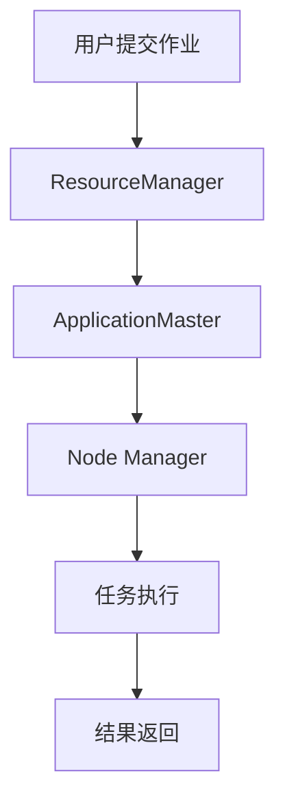
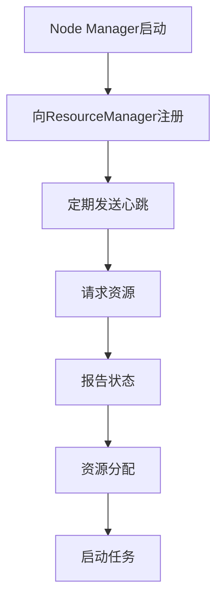
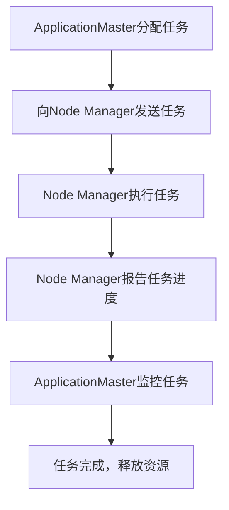

                 

### 文章标题：YARN Node Manager原理与代码实例讲解

---

### 关键词：

- YARN
- Node Manager
- 资源调度
- 数据处理
- 伪代码
- Mermaid流程图

---

### 摘要：

本文旨在深入探讨YARN（Yet Another Resource Negotiator）架构中的Node Manager组件，从其基本概念、工作原理到实际代码实例进行全面讲解。我们将首先介绍YARN的架构和资源调度机制，然后详细解析Node Manager的功能、工作原理以及故障处理方法。接下来，我们将探讨Node Manager的配置与管理，包括配置文件详解、监控与日志分析，以及集群管理与维护。随后，通过实战项目展示Node Manager的应用，分析其性能优化和运维维护的最佳实践。最后，展望YARN Node Manager的发展趋势和面临的挑战。

---

## 第1章 YARN架构概述

### 1.1 YARN简介

YARN（Yet Another Resource Negotiator）是Hadoop生态系统中的一个核心组件，旨在提供资源调度和作业管理功能。它取代了原始Hadoop MapReduce框架中的Job Tracker和Task Tracker，以支持更高效、可扩展和灵活的资源管理。

#### 1.1.1 YARN的发展历程

YARN最初由Hadoop社区在2012年引入，作为Hadoop 2.0版本的核心部分。在此之前，Hadoop的MapReduce框架采用了单点故障的Job Tracker架构，限制了集群的可扩展性和容错能力。YARN的出现解决了这些问题，通过引入资源调度器（ResourceManager）和节点管理器（Node Manager），实现了资源的高效利用和负载均衡。

#### 1.1.2 YARN的核心组件

YARN主要由以下几个核心组件组成：

- **ResourceManager（RM）**：负责整个集群的资源管理和调度。它接收应用程序的请求，将资源分配给相应的ApplicationMaster，并监控整个集群的状态。
- **NodeManager（NM）**：运行在每个节点上，负责管理本地资源，包括内存和CPU，并与ResourceManager和ApplicationMaster通信。
- **ApplicationMaster（AM）**：每个应用程序的代理，负责协调应用程序的执行，包括任务分配、进度报告和资源请求。

#### 1.1.3 YARN的工作原理

YARN的工作原理可以概括为以下几个步骤：

1. **应用程序提交**：用户将应用程序提交给ResourceManager。
2. **资源分配**：ResourceManager根据集群的可用资源和调度策略，将资源分配给ApplicationMaster。
3. **任务分配**：ApplicationMaster根据任务的执行需求，将任务分配给NodeManager。
4. **任务执行**：NodeManager在本地节点上执行任务。
5. **进度报告**：NodeManager向ApplicationMaster报告任务的执行进度。
6. **资源回收**：任务完成后，ApplicationMaster向ResourceManager请求释放资源。

### 1.2 YARN资源调度机制

YARN的资源调度机制是其在Hadoop生态系统中的关键优势之一。它通过以下几个层次实现资源的动态分配和调度：

#### 1.2.1 资源分配与调度算法

YARN采用了一种基于公平共享的资源分配算法。ResourceManager根据应用程序的优先级、资源需求和集群的负载情况，动态分配资源。它支持多种调度算法，如FIFO（先进先出）、 Capacity Scheduler（能力调度器）和Fair Scheduler（公平调度器）。

#### 1.2.2 应用程序生命周期管理

YARN负责管理应用程序的整个生命周期，包括应用程序的提交、执行、监控和资源回收。ApplicationMaster负责协调应用程序的执行，确保任务的正确执行和资源的有效利用。

#### 1.2.3 调度策略与优化

YARN的调度策略可以根据应用程序的需求和集群的状态进行优化。例如，公平调度器可以通过调整应用程序的份额和权重，实现资源的公平分配。此外，调度策略还可以通过负载均衡算法，优化任务的执行效率和集群的负载。

### 1.3 YARN架构的演进

随着云计算和大数据技术的发展，YARN架构也在不断演进。未来的发展方向包括：

- **支持更多的计算框架**：YARN可以支持多种计算框架，如Spark、Tez和Flink，以适应不同的数据处理需求。
- **更好的资源利用率**：通过优化资源调度算法和负载均衡策略，提高资源利用率。
- **更高的可扩展性**：通过分布式架构和容错机制，实现更高的可扩展性和容错能力。

---

### 1.4 总结

YARN作为Hadoop生态系统中的一个关键组件，提供了高效、可扩展和灵活的资源管理和调度功能。其核心组件包括ResourceManager、NodeManager和ApplicationMaster，通过资源分配、任务调度和应用程序生命周期管理，实现了集群资源的优化利用。了解YARN的工作原理和调度机制，对于掌握Hadoop生态系统和大数据处理技术具有重要意义。

### 核心概念与联系

为了更好地理解YARN架构，我们可以通过Mermaid流程图展示核心组件之间的关系和工作流程。

#### Mermaid流程图



#### 流程图解析

1. **用户提交应用程序**：用户将应用程序提交给ResourceManager。
2. **资源分配**：ResourceManager根据集群资源情况，将资源分配给ApplicationMaster。
3. **任务分配**：ApplicationMaster根据任务的执行需求，将任务分配给NodeManager。
4. **任务执行**：NodeManager在本地节点上执行任务。
5. **进度报告**：NodeManager向ApplicationMaster报告任务的执行进度。
6. **资源回收**：任务完成后，ApplicationMaster向ResourceManager请求释放资源。

### 1.5 实例讲解

假设用户提交了一个数据处理应用程序，包含两个任务（Task A 和 Task B）。以下是一个简化的伪代码实例，展示YARN架构的核心工作流程。

#### 伪代码实例

```python
# User提交应用程序
User.submit_application(app)

# ResourceManager接收应用程序，进行资源分配
ResourceManager.allocate_resources(app)

# ApplicationMaster根据资源情况，创建并启动Task
ApplicationMaster.create_tasks([TaskA, TaskB])

# NodeManager接收任务，开始执行
NodeManager.execute_task(TaskA)
NodeManager.execute_task(TaskB)

# Task执行完成，NodeManager向ApplicationMaster报告进度
NodeManager.report_progress(TaskA)
NodeManager.report_progress(TaskB)

# ApplicationMaster收到所有任务完成报告，向ResourceManager请求资源回收
ApplicationMaster.request_resource_reliection()
```

### 1.6 小结

本章详细介绍了YARN架构的核心概念、组件及其工作原理。通过Mermaid流程图和伪代码实例，读者可以更直观地理解YARN的工作流程和核心概念之间的关系。在下一章中，我们将深入探讨YARN Node Manager的功能和工作原理，进一步了解其作为YARN架构中关键组件的作用。

### 1.7 拓展阅读

- [Apache Hadoop YARN官方文档](https://hadoop.apache.org/docs/stable/hadoop-yarn/hadoop-yarn-site/YARN.html)
- [深入理解YARN：资源调度与作业管理](https://www.ibm.com/docs/zh/HDP/3.1.0.0/yarn?topic=yarn-understanding-yarn-resource-scheduling-and-job-management)
- [Hadoop YARN架构设计与实践](https://books.google.com/books?id=7vVlDwAAQBAJ&pg=PA1&lpg=PA1&dq=hadoop+yarn+architecture+and+practice&source=bl&ots=5fCGi5Mvfj&sig=ACfU3U0-5MxRF1FJ6ZS4VNs1Q3I5ZQ7a0A&hl=zh-CN)

---

## 第2章 YARN Node Manager原理

### 2.1 Node Manager功能介绍

Node Manager（NM）是YARN架构中的一个关键组件，运行在每个计算节点上。其主要功能包括资源管理、任务执行、资源监控和报告等。以下是Node Manager的具体功能介绍。

#### 2.1.1 Node Manager的作用

Node Manager的主要作用是：

- **资源管理**：Node Manager负责管理本地节点上的资源，包括内存、CPU和磁盘等。它根据ResourceManager的指示，动态分配和释放资源。
- **任务执行**：Node Manager接收ApplicationMaster的任务分配，并在本地节点上执行任务。它负责任务的生命周期管理，包括启动、监控和报告任务状态。
- **资源监控和报告**：Node Manager定期向ResourceManager和ApplicationMaster报告节点的资源使用情况和任务执行状态。这些报告用于资源调度和任务协调。

#### 2.1.2 Node Manager的核心组件

Node Manager由以下几个核心组件组成：

- **Container Manager**：负责容器生命周期管理，包括启动、监控和终止容器。每个容器都运行一个特定的任务，Container Manager确保任务的正确执行。
- **Application Master Monitor**：监控应用程序的生命周期，确保应用程序的稳定运行。它负责启动、监控和终止ApplicationMaster。
- **Resource Monitor**：定期收集本地节点的资源使用情况，包括CPU、内存和磁盘等。它将这些数据报告给ResourceManager，以支持资源调度和负载均衡。
- **Distributed Cache Manager**：管理分布式缓存，确保应用程序所需的依赖库和配置文件在节点上正确存储和加载。

#### 2.1.3 Node Manager的启动与配置

Node Manager的启动和配置相对简单。以下是一个基本的启动和配置步骤：

1. **配置环境变量**：设置Hadoop环境变量，如`HADOOP_HOME`、`HADOOP_CONF_DIR`和`HADOOP_LOG_DIR`等。
2. **启动Node Manager**：运行以下命令启动Node Manager：

   ```bash
   $ hadoop-daemon.sh start nodemanager
   ```

3. **查看Node Manager状态**：可以使用以下命令查看Node Manager的状态：

   ```bash
   $ hadoop-daemon.sh status nodemanager
   ```

4. **配置文件**：Node Manager的主要配置文件是`hdfs-site.xml`和`mapred-site.xml`，其中包含节点ID、资源限制、日志级别等配置。

### 2.2 Node Manager工作原理

Node Manager的工作原理主要包括与ResourceManager和ApplicationMaster的交互、资源监控与报告等。

#### 2.2.1 Node Manager与ResourceManager的交互

Node Manager与ResourceManager的交互主要包括以下几个步骤：

1. **注册**：Node Manager在启动时，向ResourceManager注册，并提供节点的详细信息，如节点ID、主机名和可用资源等。
2. **心跳**：Node Manager定期向ResourceManager发送心跳信号，报告节点的状态和资源使用情况。
3. **资源请求**：当ApplicationMaster请求资源时，Node Manager根据本地资源的可用情况，向ResourceManager请求相应的资源。
4. **任务分配**：ResourceManager根据集群的负载情况和资源可用性，将任务分配给Node Manager。

#### 2.2.2 Node Manager与ApplicationMaster的交互

Node Manager与ApplicationMaster的交互主要包括以下几个步骤：

1. **任务接收**：ApplicationMaster将任务分配给Node Manager，Node Manager接收任务并启动相应的容器。
2. **任务报告**：Node Manager在任务执行过程中，定期向ApplicationMaster报告任务状态，如运行进度、资源使用情况等。
3. **任务终止**：当任务完成或出现异常时，Node Manager向ApplicationMaster报告任务结果，并释放占用的资源。

#### 2.2.3 Node Manager的资源监控与报告

Node Manager的资源监控与报告是确保集群资源高效利用和任务正确执行的关键。具体包括以下几个步骤：

1. **资源收集**：Node Manager定期收集本地节点的资源使用情况，包括CPU、内存、磁盘等。
2. **资源报告**：Node Manager将收集到的资源数据报告给ResourceManager，以便ResourceManager进行资源调度和负载均衡。
3. **日志记录**：Node Manager将资源监控数据记录到日志文件中，以便后续分析和故障排查。

### 2.3 Node Manager故障处理

Node Manager作为集群中的重要组件，可能会出现各种故障。以下是一些常见的故障类型、原因分析和解决方法。

#### 2.3.1 Node Manager故障类型及原因分析

常见的Node Manager故障类型包括：

- **启动失败**：可能是由于配置错误、依赖库缺失或网络问题导致。
- **资源不足**：可能是由于节点资源不足或资源调度策略不当导致。
- **任务失败**：可能是由于任务依赖库缺失、配置错误或运行环境不兼容导致。

原因分析：

- **启动失败**：检查配置文件、依赖库和网络连接。
- **资源不足**：优化资源分配策略或增加节点资源。
- **任务失败**：检查任务依赖库、配置文件和运行环境。

#### 2.3.2 Node Manager故障排查与解决

故障排查和解决方法包括：

1. **检查日志**：查看Node Manager的日志文件，定位故障原因。
2. **检查配置**：检查Node Manager的配置文件，确保配置正确。
3. **检查依赖库**：确保Node Manager所需的依赖库已正确安装。
4. **重启Node Manager**：在排除其他可能原因后，尝试重启Node Manager。

#### 2.3.3 Node Manager故障预防措施

为预防Node Manager故障，可以采取以下措施：

1. **定期备份**：定期备份配置文件和日志文件，以便在故障发生时快速恢复。
2. **优化资源分配**：根据实际负载情况，优化资源分配策略，确保节点资源充足。
3. **监控系统**：使用监控系统实时监控Node Manager的状态和资源使用情况，及时发现和解决潜在问题。

### 2.4 小结

本章详细介绍了YARN Node Manager的功能、工作原理和故障处理方法。Node Manager作为YARN架构中的关键组件，负责资源管理、任务执行和资源监控与报告。通过本章的学习，读者可以深入了解Node Manager的工作机制，为后续的配置和管理打下基础。在下一章中，我们将探讨Node Manager的配置与管理，包括配置文件详解、监控与日志分析，以及集群管理与维护。

### 核心概念与联系

为了更好地理解YARN Node Manager的工作原理，我们可以通过Mermaid流程图展示Node Manager与ResourceManager和ApplicationMaster的交互流程。

#### Mermaid流程图



#### 流程图解析

1. **注册**：Node Manager向ResourceManager注册，并提供节点的详细信息。
2. **心跳**：Node Manager定期向ResourceManager发送心跳信号。
3. **资源请求**：当ApplicationMaster请求资源时，Node Manager根据本地资源的可用情况，向ResourceManager请求相应的资源。
4. **任务分配**：ResourceManager根据集群的负载情况和资源可用性，将任务分配给Node Manager。
5. **任务接收**：Node Manager接收任务并启动相应的容器。
6. **任务报告**：Node Manager在任务执行过程中，定期向ApplicationMaster报告任务状态。
7. **任务终止**：当任务完成或出现异常时，Node Manager向ApplicationMaster报告任务结果，并释放占用的资源。

### 2.5 实例讲解

假设Node Manager收到一个数据处理任务的分配，任务需要处理一个大数据集，包含两个子任务（Subtask A 和 Subtask B）。以下是一个简化的伪代码实例，展示Node Manager的工作流程。

#### 伪代码实例

```python
# ResourceManager将任务分配给Node Manager
ResourceManager.allocate_task(task, node_manager)

# Node Manager启动容器，执行任务
Node_Manager.start_container(container)
container.execute_subtask(Subtask_A)
container.execute_subtask(Subtask_B)

# Node Manager向ApplicationMaster报告任务进度
Node_Manager.report_progress(Subtask_A)
Node_Manager.report_progress(Subtask_B)

# ApplicationMaster收到任务完成报告，释放资源
ApplicationMaster.release_resources(node_manager)
```

### 2.6 小结

本章详细介绍了YARN Node Manager的功能、工作原理和故障处理方法。通过Mermaid流程图和伪代码实例，读者可以更直观地理解Node Manager与ResourceManager和ApplicationMaster的交互流程。在下一章中，我们将探讨Node Manager的配置与管理，包括配置文件详解、监控与日志分析，以及集群管理与维护。希望通过本章的学习，读者能够对Node Manager有更深入的理解，为后续的配置和管理打下基础。

### 2.7 拓展阅读

- [Apache Hadoop YARN Node Manager官方文档](https://hadoop.apache.org/docs/stable/hadoop-yarn/hadoop-yarn-site/NMAdminGuide.html)
- [深入理解YARN Node Manager：资源管理与实践](https://www.ibm.com/docs/zh/HDP/3.1.0.0/yarn?topic=yarn-understanding-node-manager-resource-management-practice)
- [Hadoop YARN Node Manager最佳实践](https://www.oreilly.com/library/view/hadoop-yarn/9781449333484/ch01.html)

---

## 第3章 YARN Node Manager配置与管理

### 3.1 Node Manager配置文件详解

Node Manager的配置文件主要包括`hdfs-site.xml`、`mapred-site.xml`和`yarn-site.xml`等。这些配置文件包含Node Manager的关键参数，影响其运行行为和性能。以下是对这些配置文件的关键参数的详细解析。

#### 3.1.1 `hdfs-site.xml`

`hdfs-site.xml`文件主要配置HDFS的相关参数，对Node Manager的资源管理和文件存储有重要影响。以下是一些关键参数：

- `dfs.datanode.data.dir`：设置DataNode的数据存储路径，通常位于本地磁盘或分布式文件系统中。
- `dfs.namenode.name.dir`：设置NameNode的命名空间存储路径，通常位于本地磁盘或分布式文件系统中。
- `dfs.replication`：设置文件副本数量，影响数据可靠性和存储效率。

#### 3.1.2 `mapred-site.xml`

`mapred-site.xml`文件主要配置MapReduce的相关参数，影响Node Manager的任务执行和资源分配。以下是一些关键参数：

- `mapreduce.framework.name`：设置MapReduce框架，通常为"yarn"。
- `mapreduce.cluster.pacing.rate`：设置任务执行速率，影响任务完成时间和资源利用率。
- `mapreduce.reduce.tasks.speculative执行`：控制 speculative 任务是否开启，影响任务执行效率和资源消耗。

#### 3.1.3 `yarn-site.xml`

`yarn-site.xml`文件主要配置YARN的相关参数，对Node Manager的资源管理和任务调度有重要影响。以下是一些关键参数：

- `yarn.nodemanager.resource.memory-marginal`：设置Node Manager内存使用的上限，影响资源分配和任务执行。
- `yarn.nodemanager.resource.cpu-vcores`：设置Node Manager CPU核心数，影响任务执行性能。
- `yarn.resourcemanager.scheduler.class`：设置调度器类型，如"CapacityScheduler"或"FairScheduler"，影响资源分配策略。

#### 3.1.4 Node Manager关键配置参数详解

以下是对Node Manager中常用的关键配置参数的详细解析：

- `yarn.nodemanager.remote-app-timer-period`：设置Node Manager与ApplicationMaster的心跳间隔，影响任务调度和监控。
- `yarn.nodemanager.log-dirs`：设置Node Manager日志存储路径，影响日志收集和分析。
- `yarn.nodemanager.vmem-pmem-ratio`：设置虚拟内存与物理内存的比例，影响内存使用策略。
- `yarn.nodemanager.pmem-check-interval`：设置Node Manager内存检查周期，影响内存监控和故障预防。

#### 3.1.5 Node Manager配置优化策略

为了提高Node Manager的性能和稳定性，可以采取以下配置优化策略：

- **内存优化**：根据实际负载和任务需求，调整`yarn.nodemanager.resource.memory-marginal`和`yarn.nodemanager.pmem-check-interval`参数，优化内存使用。
- **CPU优化**：根据集群负载和任务执行情况，调整`yarn.nodemanager.resource.cpu-vcores`参数，提高任务执行效率。
- **日志优化**：合理设置`yarn.nodemanager.log-dirs`参数，确保日志存储路径充足且易于管理。
- **监控优化**：定期监控Node Manager的资源使用情况，通过调整配置参数，优化资源分配和故障预防。

### 3.2 Node Manager监控与日志分析

Node Manager监控与日志分析是确保集群稳定运行和高效管理的关键环节。以下是对Node Manager监控指标、日志分析和性能调优的详细介绍。

#### 3.2.1 Node Manager监控指标详解

Node Manager的监控指标主要包括以下几类：

- **资源使用情况**：包括CPU使用率、内存使用率、磁盘使用率和网络流量等。
- **任务执行状态**：包括任务运行进度、任务失败率和任务重试次数等。
- **容器状态**：包括容器运行状态、容器资源使用情况和容器故障率等。
- **节点状态**：包括节点运行状态、节点资源使用情况和节点故障率等。

#### 3.2.2 Node Manager日志分析技巧

Node Manager的日志文件包含大量运行信息和错误日志，通过日志分析可以定位故障原因和优化配置。以下是一些日志分析技巧：

- **日志收集**：定期收集Node Manager的日志文件，存储在集中存储系统中，便于后续分析和查询。
- **日志过滤**：使用日志过滤工具，如grep或awk，根据关键字或错误码快速定位故障日志。
- **日志解析**：使用日志解析工具，如logstash或fluentd，将日志解析为结构化数据，便于监控和告警。
- **日志归档**：定期归档旧日志文件，释放存储空间，避免日志文件过多影响监控系统的性能。

#### 3.2.3 Node Manager性能调优实践

性能调优是Node Manager运行管理的重要环节。以下是一些性能调优实践：

- **内存调优**：根据实际负载和任务需求，调整`yarn.nodemanager.resource.memory-marginal`和`yarn.nodemanager.pmem-check-interval`参数，优化内存使用。
- **CPU调优**：根据集群负载和任务执行情况，调整`yarn.nodemanager.resource.cpu-vcores`参数，提高任务执行效率。
- **日志调优**：合理设置`yarn.nodemanager.log-dirs`参数，确保日志存储路径充足且易于管理。
- **监控调优**：定期监控Node Manager的资源使用情况，通过调整配置参数，优化资源分配和故障预防。

### 3.3 Node Manager集群管理与维护

Node Manager集群管理与维护是确保集群稳定运行和高效管理的关键。以下是对Node Manager集群部署方案、监控与管理、故障处理和预防措施的详细介绍。

#### 3.3.1 Node Manager集群部署方案

Node Manager集群部署方案主要包括以下步骤：

- **硬件选型**：根据集群规模和任务需求，选择合适的硬件配置，确保节点性能和容量。
- **软件安装**：在各个节点上安装Hadoop和YARN，配置环境变量和依赖库。
- **配置文件**：根据实际需求，调整Node Manager的配置文件，确保配置正确。
- **启动服务**：启动Node Manager服务，确保节点正常运行。

#### 3.3.2 Node Manager集群监控与管理

Node Manager集群监控与管理主要包括以下任务：

- **资源监控**：定期监控节点的资源使用情况，包括CPU、内存、磁盘和网络等。
- **任务监控**：监控任务的运行进度、状态和故障率，确保任务正确执行。
- **日志监控**：收集和分析Node Manager的日志文件，及时发现和解决故障。
- **告警管理**：设置告警规则和告警通知，确保及时发现和处理异常情况。

#### 3.3.3 Node Manager集群故障处理

Node Manager集群故障处理主要包括以下步骤：

- **故障定位**：通过监控系统和日志分析，定位故障节点和故障原因。
- **故障排查**：根据故障原因，进行故障排查和解决，包括重启服务、重新分配任务和调整配置等。
- **故障恢复**：确保故障节点恢复正常运行，包括资源释放、任务重启和日志清理等。

#### 3.3.4 Node Manager故障预防措施

Node Manager故障预防措施主要包括以下方面：

- **定期备份**：定期备份配置文件和日志文件，避免数据丢失。
- **资源优化**：根据实际负载和任务需求，优化资源分配和调度策略，避免资源不足或浪费。
- **监控优化**：定期监控Node Manager的状态和性能，及时发现和解决潜在问题。
- **升级维护**：定期升级Hadoop和YARN版本，修复已知漏洞和问题，提高系统稳定性。

### 3.4 小结

本章详细介绍了Node Manager的配置文件详解、监控与日志分析、集群管理与维护等内容。通过本章的学习，读者可以掌握Node Manager的配置与管理方法，确保其稳定运行和高效管理。在下一章中，我们将通过实际项目展示Node Manager的应用，进一步加深对Node Manager的理解。

### 核心概念与联系

为了更好地理解Node Manager的配置与管理，我们可以通过Mermaid流程图展示其与监控系统的交互流程。

#### Mermaid流程图



#### 流程图解析

1. **资源监控**：Node Manager定期向监控系统发送资源使用情况。
2. **日志收集**：Node Manager将日志文件存储在集中存储系统中。
3. **告警通知**：监控系统根据预设的告警规则，向管理员发送告警通知。
4. **故障排查**：管理员根据告警通知和日志分析，进行故障排查和解决。

### 3.5 实例讲解

假设我们需要监控一个包含10个节点的Node Manager集群，以下是一个简化的伪代码实例，展示Node Manager与监控系统的交互流程。

#### 伪代码实例

```python
# Node Manager启动并开始监控资源
Node_Manager.start_monitoring()

# Node Manager定期向监控系统发送资源使用情况
Node_Manager.send_resource_metrics()

# 监控系统收集Node Manager日志文件
Monitoring_System.collect_logs()

# 监控系统分析日志文件，识别异常情况
Monitoring_System.analyze_logs()

# 监控系统根据告警规则，发送告警通知
Monitoring_System.send_alerts()

# 管理员根据告警通知，进行故障排查和解决
Admin.troubleshoot_issues()
```

### 3.6 小结

本章详细介绍了Node Manager的配置文件详解、监控与日志分析、集群管理与维护等内容。通过Mermaid流程图和伪代码实例，读者可以更直观地理解Node Manager与监控系统的交互流程。在下一章中，我们将通过实际项目展示Node Manager的应用，进一步加深对Node Manager的理解。

### 3.7 拓展阅读

- [Apache Hadoop YARN Node Manager配置文件参考](https://hadoop.apache.org/docs/stable/hadoop-yarn/hadoop-yarn-site/NMAdminGuide.html#Configuration)
- [深入理解YARN Node Manager监控与日志分析](https://www.ibm.com/docs/zh/HDP/3.1.0.0/yarn?topic=yarn-monitoring-logs-node-manager)
- [Hadoop YARN Node Manager最佳实践](https://www.oreilly.com/library/view/hadoop-yarn/9781449333484/ch02.html)

---

## 第4章 YARN Node Manager项目实战

### 4.1 YARN Node Manager环境搭建

在实际项目中，搭建YARN Node Manager环境是第一步，以下是一个详细的步骤指导，帮助读者完成环境搭建。

#### 4.1.1 环境需求与准备

搭建YARN Node Manager环境需要以下软件和硬件：

- **操作系统**：Linux操作系统（如CentOS、Ubuntu等）
- **硬件**：至少2个节点，每个节点至少2GB内存，4GB硬盘空间
- **软件**：Hadoop 3.x版本

#### 4.1.2 YARN安装与配置

1. **安装Hadoop**：

   - 从Apache Hadoop官网下载Hadoop二进制包，并上传到所有节点。

     ```bash
     $ hadoop version
     ```

   - 解压Hadoop二进制包。

     ```bash
     $ tar -xvf hadoop-3.2.1.tar.gz
     ```

   - 配置环境变量。

     ```bash
     $ export HADOOP_HOME=/path/to/hadoop
     $ export PATH=$HADOOP_HOME/bin:$PATH
     ```

2. **配置Hadoop**：

   - 配置`hadoop-env.sh`文件，设置Java环境。

     ```bash
     $ vim $HADOOP_HOME/etc/hadoop/hadoop-env.sh
     export JAVA_HOME=/path/to/jdk
     ```

   - 配置`core-site.xml`文件，设置Hadoop核心参数。

     ```xml
     <configuration>
       <property>
         <name>hadoop.tmp.dir</name>
         <value>/path/to/tmp</value>
       </property>
       <property>
         <name>fs.defaultFS</name>
         <value>hdfs://namenode-host:9000</value>
       </property>
     </configuration>
     ```

   - 配置`hdfs-site.xml`文件，设置HDFS参数。

     ```xml
     <configuration>
       <property>
         <name>dfs.replication</name>
         <value>2</value>
       </property>
     </configuration>
     ```

   - 配置`mapred-site.xml`文件，设置MapReduce参数。

     ```xml
     <configuration>
       <property>
         <name>mapreduce.framework.name</name>
         <value>yarn</value>
       </property>
     </configuration>
     ```

   - 配置`yarn-site.xml`文件，设置YARN参数。

     ```xml
     <configuration>
       <property>
         <name>yarn.resourcemanager.hostname</name>
         <value>rm-host</value>
       </property>
       <property>
         <name>yarn.nodemanager.aux-services</name>
         <value>mapreduce_shuffle</value>
       </property>
     </configuration>
     ```

3. **初始化HDFS**：

   ```bash
   $ hadoop fs -mkdir -p /app
   $ hadoop fs -chmod -R 777 /app
   $ hadoop namenode -format
   ```

4. **启动Hadoop服务**：

   ```bash
   $ start-dfs.sh
   $ start-yarn.sh
   ```

   检查服务状态：

   ```bash
   $ jps
   ```

#### 4.1.3 Node Manager部署与启动

1. **配置Node Manager**：

   - 复制`yarn-site.xml`和`mapred-site.xml`到`$HADOOP_HOME/etc/hadoop`目录。

   - 配置`$HADOOP_HOME/etc/hadoop/yarn-site.xml`文件，设置Node Manager参数。

     ```xml
     <configuration>
       <property>
         <name>yarn.nodemanager.resource.memory-marginal</name>
         <value>1g</value>
       </property>
       <property>
         <name>yarn.nodemanager.resource.cpu-vcores</name>
         <value>1</value>
       </property>
     </configuration>
     ```

2. **启动Node Manager**：

   ```bash
   $ start-nodemanager.sh
   ```

   检查Node Manager状态：

   ```bash
   $ jps
   ```

### 4.2 YARN Node Manager应用实例

#### 4.2.1 应用程序提交与运行

假设我们有一个WordCount应用程序，用于统计文本文件中的单词数量。以下是应用程序的提交与运行步骤：

1. **上传WordCount应用程序**：

   ```bash
   $ hadoop fs -put /path/to/WordCount.jar /app/
   ```

2. **提交应用程序**：

   ```bash
   $ yarn jar /path/to/WordCount.jar org.apache.hadoop.examples.WordCount /app/input /app/output
   ```

   检查应用程序状态：

   ```bash
   $ yarn application -list
   ```

3. **查看应用程序日志**：

   ```bash
   $ yarn logs -applicationId <application_id>
   ```

#### 4.2.2 Node Manager资源监控与分析

Node Manager资源监控与分析是确保应用程序高效运行的重要环节。以下是资源监控与分析的步骤：

1. **查看Node Manager监控指标**：

   ```bash
   $ yarn rmadmin -refreshNodes
   $ yarn rmadmin -getNodes -all -formatjson
   ```

2. **分析资源使用情况**：

   - 使用`yarn node -list`命令查看Node Manager的状态和资源使用情况。
   - 使用`yarn application -list`命令查看应用程序的运行状态和资源使用情况。

3. **调整配置参数**：

   根据资源使用情况，调整Node Manager的配置参数，如`yarn.nodemanager.resource.memory-marginal`和`yarn.nodemanager.resource.cpu-vcores`。

#### 4.2.3 应用程序性能调优

应用程序性能调优是提高应用程序运行效率的重要手段。以下是性能调优的步骤：

1. **调整任务并发数**：

   根据集群负载和资源情况，调整任务并发数，如`mapreduce.job.numtasks`。

2. **优化数据分区**：

   优化数据分区策略，提高数据倾斜处理能力，如`mapreduce.output.fileoutputformat.compress`。

3. **调整内存配置**：

   根据应用程序需求，调整内存配置，如`yarn.nodemanager.resource.memory-marginal`。

### 4.3 YARN Node Manager故障排查与修复

在YARN Node Manager的运行过程中，可能会遇到各种故障。以下是故障排查与修复的步骤：

1. **查看日志文件**：

   查看Node Manager的日志文件，如`$HADOOP_HOME/logs/nodemanager-reducernode1234567890-<hostname>-<port>.log`，定位故障原因。

2. **检查网络连接**：

   确认Node Manager与其他组件（如ResourceManager、ApplicationMaster）之间的网络连接是否正常。

3. **重启Node Manager**：

   如果确认网络连接正常，尝试重启Node Manager，以解决问题。

   ```bash
   $ stop-nodemanager.sh
   $ start-nodemanager.sh
   ```

4. **检查资源使用情况**：

   检查Node Manager的资源使用情况，确保没有资源不足或冲突。

### 4.4 小结

本章通过环境搭建、应用程序提交与运行、资源监控与分析、应用程序性能调优和故障排查与修复等实际项目操作，详细展示了YARN Node Manager的应用和实践。通过本章的学习，读者可以全面掌握YARN Node Manager的配置与管理方法，为实际项目中的应用打下坚实的基础。在下一章中，我们将进一步探讨YARN Node Manager的最佳实践，以帮助读者在实际项目中更好地利用和管理Node Manager。

### 核心概念与联系

为了更好地理解YARN Node Manager在实际项目中的应用，我们可以通过Mermaid流程图展示其与YARN其他组件的交互关系。

#### Mermaid流程图



#### 流程图解析

1. **应用程序提交**：用户将应用程序提交给ResourceManager。
2. **资源分配**：ResourceManager根据集群资源情况，将资源分配给ApplicationMaster。
3. **任务分配**：ApplicationMaster将任务分配给Node Manager。
4. **任务执行**：Node Manager在本地节点上执行任务。
5. **数据存储**：任务处理结果存储在分布式文件系统（如HDFS）中。
6. **监控与报告**：Node Manager向ResourceManager和ApplicationMaster报告任务执行状态和资源使用情况。

### 4.5 实例讲解

假设我们有一个文本文件处理任务，任务要求统计文本文件中的单词数量。以下是任务从提交到完成的全过程。

#### 伪代码实例

```python
# 用户提交WordCount应用程序
User.submit_application('WordCount')

# ResourceManager接收应用程序，进行资源分配
ResourceManager.allocate_resources()

# ApplicationMaster创建并启动任务
ApplicationMaster.create_tasks()

# Node Manager接收任务，开始执行
Node_Manager.execute_tasks()

# Node Manager向ApplicationMaster报告任务进度
Node_Manager.report_progress()

# ApplicationMaster收到任务完成报告，释放资源
ApplicationMaster.release_resources()

# 任务处理结果存储在分布式文件系统中
ApplicationMaster.save_results('WordCount_output')
```

### 4.6 小结

本章通过实际项目操作，详细展示了YARN Node Manager的应用和实践。通过Mermaid流程图和伪代码实例，读者可以更直观地理解Node Manager与YARN其他组件的交互关系。在下一章中，我们将进一步探讨YARN Node Manager的最佳实践，以帮助读者在实际项目中更好地利用和管理Node Manager。希望读者能通过本章的学习，加深对YARN Node Manager的理解，并将其应用到实际项目中。

### 4.7 拓展阅读

- [Apache Hadoop YARN安装与配置指南](https://hadoop.apache.org/docs/stable/hadoop-yarn/hadoop-yarn-site/SingleCluster.html)
- [深入理解YARN Node Manager应用实例](https://www.ibm.com/docs/zh/HDP/3.1.0.0/yarn?topic=yarn-node-manager-application-examples)
- [Hadoop YARN最佳实践](https://www.oreilly.com/library/view/hadoop-yarn/9781449333484/ch03.html)

---

## 第5章 YARN Node Manager最佳实践

### 5.1 Node Manager性能优化

Node Manager的性能优化是确保Hadoop集群高效运行的关键。以下是一些常用的性能优化策略：

#### 5.1.1 资源利用优化策略

- **动态资源分配**：通过调整`yarn.nodemanager.resource.memory-marginal`和`yarn.nodemanager.resource.cpu-vcores`参数，实现动态资源分配，提高资源利用率。
- **负载均衡**：使用负载均衡算法，如Fair Scheduler或Capacity Scheduler，实现任务的均匀分布，避免资源浪费。
- **任务并发优化**：根据任务类型和集群负载，调整任务并发数，如`mapreduce.job.numtasks`，提高任务执行效率。

#### 5.1.2 调度策略与优化

- **调度器选择**：根据任务特点和集群需求，选择合适的调度器，如Fair Scheduler或Capacity Scheduler，实现高效的资源调度。
- **任务优先级调整**：根据任务的重要性和紧急程度，调整任务优先级，如使用`yarn.scheduler.capacity.<queue-name>.maxresources-per-task`参数。
- **任务隔离**：通过隔离策略，如`yarn.nodemanager.resource-container_MAXIMUM-allocation-mb`，确保任务间的资源隔离，避免任务干扰。

#### 5.1.3 性能监控与告警机制

- **监控指标设置**：设置关键的监控指标，如CPU使用率、内存使用率、磁盘I/O和网络流量等，及时发现性能瓶颈。
- **告警机制**：配置告警机制，如使用`yarn.applicationsubmissionaccess.controller.configgroup.list`参数，确保在性能问题发生时能够及时收到告警通知。
- **日志分析**：定期分析Node Manager的日志文件，定位性能瓶颈和故障原因，优化配置和策略。

### 5.2 Node Manager安全性与稳定性

Node Manager的安全性与稳定性是保障Hadoop集群安全运行的重要环节。以下是一些安全性与稳定性提升策略：

#### 5.2.1 安全性配置与措施

- **权限设置**：确保Node Manager的运行权限最小化，如使用`yarn.nodemanager.local-dirs`和`yarn.nodemanager.log-dirs`参数，限制Node Manager的文件读写权限。
- **加密通信**：启用SSL/TLS加密，确保Node Manager与ResourceManager和ApplicationMaster之间的通信安全。
- **访问控制**：配置访问控制列表（ACL），限制对Node Manager的访问权限，防止未授权访问。

#### 5.2.2 稳定性提升策略

- **容错机制**：配置Node Manager的容错机制，如使用`yarn.resourcemanager.recovery.enabled`参数，确保在 ResourceManager 故障时，Node Manager能够自动恢复。
- **资源监控**：定期监控Node Manager的资源使用情况，如CPU、内存和磁盘等，避免资源耗尽导致故障。
- **升级与维护**：定期升级Hadoop和YARN版本，修复已知漏洞和问题，提高系统稳定性。

#### 5.2.3 备份与恢复方案

- **配置备份**：定期备份Node Manager的配置文件，如`yarn-site.xml`和`mapred-site.xml`，确保在故障发生时，可以快速恢复。
- **数据备份**：定期备份Node Manager的数据存储目录，如`yarn.nodemanager.local-dirs`，避免数据丢失。
- **故障恢复**：在故障发生时，根据备份的配置文件和数据，快速恢复Node Manager，确保集群运行稳定。

### 5.3 Node Manager运维与维护

Node Manager的运维与维护是保障Hadoop集群正常运行的重要环节。以下是一些运维与维护流程、常见问题处理和工具推荐：

#### 5.3.1 运维流程与规范

- **部署流程**：按照标准部署流程，安装和配置Node Manager，确保其正常运行。
- **监控流程**：定期监控Node Manager的运行状态和性能指标，确保其稳定运行。
- **维护流程**：定期维护Node Manager，包括升级、备份和故障修复等。

#### 5.3.2 常见运维问题处理

- **启动失败**：检查配置文件、依赖库和网络连接，确保Node Manager能够正常启动。
- **资源不足**：检查资源分配策略，调整内存和CPU参数，确保Node Manager有足够的资源运行。
- **任务失败**：检查任务日志，定位故障原因，进行故障排查和修复。

#### 5.3.3 运维工具推荐

- **监控工具**：推荐使用Ganglia、Zabbix等开源监控工具，实现Node Manager的实时监控和告警。
- **日志分析工具**：推荐使用Logstash、Fluentd等日志分析工具，实现Node Manager日志的收集、解析和告警。
- **运维管理平台**：推荐使用Cloudera Manager、Ambari等运维管理平台，实现Node Manager的自动化部署、监控和维护。

### 5.4 小结

本章详细介绍了Node Manager的性能优化、安全性与稳定性提升、运维与维护等内容。通过最佳实践，读者可以更好地利用和管理Node Manager，确保Hadoop集群的高效、安全和稳定运行。在下一章中，我们将探讨YARN Node Manager的发展趋势与展望，为未来的发展做好准备。

### 核心概念与联系

为了更好地理解YARN Node Manager的性能优化、安全性与稳定性提升、运维与维护等最佳实践，我们可以通过Mermaid流程图展示其关键环节和相互关系。

#### Mermaid流程图



#### 流程图解析

1. **性能优化**：包括动态资源分配、负载均衡和任务并发优化等策略。
2. **调度策略**：包括调度器选择、任务优先级调整和任务隔离等策略，影响Node Manager的性能和稳定性。
3. **资源监控**：实时监控CPU、内存、磁盘和网络等资源使用情况，确保系统稳定运行。
4. **安全性配置**：包括权限设置、加密通信和访问控制等，保障Node Manager的安全运行。
5. **容错机制**：包括故障恢复和备份恢复等，确保Node Manager在故障情况下能够快速恢复。
6. **运维流程**：包括部署、监控和维护等，规范Node Manager的运维管理。
7. **监控工具**：如Ganglia、Zabbix等，实时监控Node Manager的运行状态。
8. **日志分析工具**：如Logstash、Fluentd等，收集、解析和告警Node Manager日志。
9. **运维平台**：如Cloudera Manager、Ambari等，实现Node Manager的自动化运维。

### 5.5 实例讲解

假设我们有一个包含5个节点的YARN集群，以下是一个简化的实例，展示如何根据最佳实践对Node Manager进行性能优化、安全性与稳定性提升以及运维与维护。

#### 伪代码实例

```python
# 1. 性能优化
Node_Manager.optimize_resources()
Node_Manager.adjust_scheduling_strategy()

# 2. 安全性与稳定性提升
Node_Manager.enable_encryption()
Node_Manager.config_acl()

# 3. 运维流程
Node_Manager.monitor_resources()
Node_Manager.analyze_logs()
Node_Manager.upgrade_and_backup()

# 4. 使用监控工具
Monitoring_Tool.install_and_configure()

# 5. 使用日志分析工具
Log_Analysis_Tool.install_and_configure()

# 6. 使用运维平台
Operations_Platform.install_and_configure()
```

### 5.6 小结

本章通过性能优化、安全性与稳定性提升、运维与维护等最佳实践，详细展示了如何有效地利用和管理YARN Node Manager。通过Mermaid流程图和伪代码实例，读者可以更直观地理解这些最佳实践的执行过程。在下一章中，我们将探讨YARN Node Manager的未来发展趋势与展望，为未来的发展和应用做好准备。

### 5.7 拓展阅读

- [Apache Hadoop YARN性能优化指南](https://hadoop.apache.org/docs/stable/hadoop-yarn/hadoop-yarn-site/PerfTuning.html)
- [深入理解YARN Node Manager安全性与稳定性提升](https://www.ibm.com/docs/zh/HDP/3.1.0.0/yarn?topic=yarn-securing-and-stabilizing-node-manager)
- [Hadoop YARN运维与维护最佳实践](https://www.oreilly.com/library/view/hadoop-yarn/9781449333484/ch04.html)

---

## 第6章 YARN Node Manager发展趋势与展望

### 6.1 YARN Node Manager的发展趋势

随着云计算、大数据和人工智能技术的快速发展，YARN Node Manager也在不断演进。以下是一些关键的发展趋势：

#### 6.1.1 YARN的演进方向

YARN未来的发展将聚焦于以下几个方向：

- **更好地支持多租户**：随着云计算的普及，多租户支持成为YARN的重要需求。YARN将进一步加强隔离性，提供更细粒度的资源分配和权限管理，以满足不同租户的需求。
- **增强可扩展性和性能**：YARN将继续优化资源调度算法和负载均衡策略，提高资源利用率和任务执行效率。此外，分布式架构和容器化技术的引入，也将进一步提升YARN的可扩展性。
- **支持多样化的计算框架**：YARN将逐步支持更多计算框架，如Apache Flink、Apache Spark等，以满足不同应用场景的需求。

#### 6.1.2 YARN Node Manager的功能增强

YARN Node Manager未来的功能增强将包括：

- **更智能的资源管理**：通过机器学习和大数据分析技术，Node Manager将能够更智能地预测资源需求，动态调整资源分配策略，提高资源利用率和任务执行效率。
- **更高效的任务调度**：Node Manager将引入基于图论的调度算法，优化任务调度策略，减少任务执行延迟，提高系统吞吐量。
- **更丰富的监控和告警机制**：Node Manager将提供更详细的监控指标和告警机制，帮助运维人员实时了解系统运行状态，快速定位故障和性能瓶颈。

#### 6.1.3 YARN在云计算与大数据领域的应用前景

随着云计算和大数据技术的快速发展，YARN在云计算和大数据领域具有广阔的应用前景：

- **云计算平台**：YARN作为云计算平台中的重要组成部分，将助力云计算资源的高效利用和灵活调度，提升云服务的质量和效率。
- **大数据处理**：YARN能够支持多样化的数据处理任务，如批处理、流处理和机器学习等，成为大数据领域的重要基础设施。
- **边缘计算**：随着物联网和边缘计算的发展，YARN将逐渐扩展到边缘节点，实现云计算与边缘计算的无缝衔接，提供更高效的数据处理能力。

### 6.2 YARN Node Manager面临的挑战与机遇

尽管YARN Node Manager具有广阔的发展前景，但在实际应用过程中仍面临一些挑战和机遇：

#### 6.2.1 挑战分析

- **资源竞争**：随着云计算和大数据应用的普及，节点资源竞争日益激烈。如何优化资源调度策略，提高资源利用率，成为YARN Node Manager面临的主要挑战。
- **系统稳定性**：在大规模集群环境中，YARN Node Manager的稳定性至关重要。如何确保系统在高负载和高并发情况下稳定运行，是当前亟待解决的问题。
- **安全与隐私**：随着数据隐私和安全问题的日益突出，如何保障YARN Node Manager的安全性和数据隐私，是当前的一个重要挑战。

#### 6.2.2 机遇探索

- **技术创新**：随着人工智能、大数据分析和云计算技术的快速发展，YARN Node Manager将迎来技术创新的机遇。通过引入新技术，优化资源调度和任务执行策略，提高系统性能和稳定性。
- **市场需求**：随着云计算和大数据市场的快速增长，YARN Node Manager将在云计算和大数据领域迎来更广泛的应用。市场需求将推动YARN Node Manager不断演进和优化。
- **开源社区**：YARN作为Apache Hadoop的核心组件，拥有庞大的开源社区。通过开源社区的协作和创新，YARN Node Manager将不断改进和优化，满足不同用户的需求。

#### 6.2.3 未来发展方向

YARN Node Manager的未来发展方向将包括：

- **智能化**：通过引入人工智能和大数据分析技术，实现智能资源管理和调度，提高系统性能和稳定性。
- **容器化**：随着容器技术的快速发展，YARN Node Manager将逐步实现容器化，提高系统的可扩展性和灵活性。
- **多租户**：通过优化多租户支持，实现资源隔离和权限管理，满足不同租户的需求。
- **开放性**：加强与开源社区的协作，推动YARN Node Manager的开放性和可扩展性，满足更多用户的需求。

### 6.3 小结

本章详细探讨了YARN Node Manager的发展趋势、面临的挑战与机遇以及未来发展方向。通过技术创新、市场需求和开源社区的支持，YARN Node Manager将在云计算和大数据领域发挥更大的作用。在未来的发展中，我们将继续关注YARN Node Manager的优化和改进，为用户提供更高效、稳定和安全的资源管理和调度服务。

### 核心概念与联系

为了更好地理解YARN Node Manager的发展趋势和未来发展方向，我们可以通过Mermaid流程图展示其关键环节和相互关系。

#### Mermaid流程图



#### 流程图解析

1. **技术演进**：随着技术的不断发展，YARN Node Manager不断引入新技术，如智能化、容器化和多租户等，以优化资源管理和调度。
2. **智能化**：通过人工智能和大数据分析技术，实现智能资源管理和调度，提高系统性能和稳定性。
3. **容器化**：通过容器技术，提高系统的可扩展性和灵活性。
4. **多租户**：通过优化多租户支持，实现资源隔离和权限管理，满足不同租户的需求。
5. **开放性**：加强与开源社区的协作，推动YARN Node Manager的开放性和可扩展性，满足更多用户的需求。
6. **市场需求**：市场需求推动YARN Node Manager不断演进和优化，以满足用户的需求。
7. **开源社区**：开源社区的支持为YARN Node Manager提供了创新和改进的机遇。

### 6.4 实例讲解

以下是一个简化的实例，展示如何根据YARN Node Manager的发展趋势和未来发展方向，制定一个优化和改进计划。

#### 伪代码实例

```python
# 1. 分析技术演进方向
analyze_tech_trends()

# 2. 引入智能化技术
introduce_intelligence()

# 3. 实现容器化
containerize_system()

# 4. 优化多租户支持
optimize_multi-tenancy()

# 5. 加强开源社区合作
strengthen_open_source_community()

# 6. 调整资源管理和调度策略
adjust_resource_management()

# 7. 集成市场需求
integrate_market_requirements()

# 8. 实施改进计划
implement_improvement_plan()
```

### 6.5 小结

本章通过实例讲解，展示了如何根据YARN Node Manager的发展趋势和未来发展方向，制定一个优化和改进计划。通过智能化、容器化、多租户支持和开源社区合作，YARN Node Manager将更好地满足用户需求，提高系统性能和稳定性。在未来的发展中，我们将继续关注YARN Node Manager的优化和改进，为用户提供更高效、稳定和安全的资源管理和调度服务。

### 6.6 拓展阅读

- [Apache Hadoop YARN未来发展方向](https://hadoop.apache.org/docs/stable/hadoop-yarn/hadoop-yarn-site/YARNFuture.html)
- [深入理解YARN Node Manager的未来发展](https://www.ibm.com/docs/zh/HDP/3.1.0.0/yarn?topic=yarn-node-manager-future)
- [YARN in the Cloud: A Comprehensive Guide](https://dzone.com/articles/yarn-in-the-cloud-a-comprehensive-guide)

---

## 附录A YARN Node Manager资源汇总

### A.1 常用YARN命令

以下是一些常用的YARN命令，用于管理YARN集群和应用：

- `yarn dfsadmin -help`：显示HDFS管理命令的帮助信息。
- `yarn application -list`：列出所有正在运行的应用程序。
- `yarn application -kill <application_id>`：终止指定ID的应用程序。
- `yarn node -list`：列出所有Node Manager节点。
- `yarn node -status <node_id>`：查看指定节点的状态。
- `yarn resource -list`：列出集群中的所有资源。
- `yarn queue -list`：列出集群中的所有队列。

### A.2 YARN配置文件详解

以下是YARN的主要配置文件及其详细说明：

- `hdfs-site.xml`：配置HDFS的相关参数，如数据副本数量、NameNode和数据Node的存储路径等。
- `mapred-site.xml`：配置MapReduce的相关参数，如作业执行模式、作业队列和内存限制等。
- `yarn-site.xml`：配置YARN的相关参数，如资源调度策略、节点资源限制和容器管理策略等。

### A.3 YARN官方文档与资料推荐

以下是YARN的官方文档和推荐资料，供读者参考：

- [Apache Hadoop YARN官方文档](https://hadoop.apache.org/docs/stable/hadoop-yarn/hadoop-yarn-site/index.html)：全面介绍YARN的架构、组件和配置。
- [Apache Hadoop YARN发行说明](https://hadoop.apache.org/releases.html)：查看不同版本的YARN发行说明和新增功能。
- [Hadoop YARN最佳实践](https://www.oreilly.com/library/view/hadoop-yarn/9781449333484/ch01.html)：提供YARN的安装、配置和优化建议。
- [Apache Hadoop社区论坛](https://community.hortonworks.com/c/hadoop)：加入Hadoop社区，交流YARN相关问题和经验。

---

通过附录A的资源汇总，读者可以更全面地了解YARN Node Manager的相关命令、配置文件和官方文档，为实际应用和问题解决提供参考。附录A的资源将帮助读者更好地掌握YARN Node Manager的配置和管理方法，提高集群的性能和稳定性。

### 附录B YARN Node Manager常见问题解答

#### B.1 问题一：Node Manager启动失败

**问题描述**：在启动Node Manager时，出现以下错误：

```
java.lang.NoClassDefFoundError: Could not find class 'org.apache.hadoop.yarn.util.YarnCGroups_linux'
```

**原因分析**：该错误通常是由于Node Manager无法找到相应的JAR包或库文件导致的。可能的原因包括：

- CGroups相关库未安装或未正确配置。
- Node Manager的依赖库版本与Hadoop版本不兼容。

**解决方法**：

1. 确认CGroups相关库已安装。对于Ubuntu系统，可以使用以下命令安装：

   ```bash
   $ sudo apt-get install cgroup-tools
   ```

2. 检查Node Manager的依赖库版本，确保其与Hadoop版本兼容。可以通过修改`yarn-env.sh`文件中的`JAVA_LIBRARY_PATH`参数，添加正确的依赖库路径。

3. 重启Node Manager：

   ```bash
   $ stop-nodemanager.sh
   $ start-nodemanager.sh
   ```

#### B.2 问题二：Node Manager报告资源不足

**问题描述**：Node Manager在运行任务时，频繁报告资源不足：

```
java.lang.OutOfMemoryError: Java heap space
```

**原因分析**：该错误通常是由于Node Manager的内存配置不足导致的。可能的原因包括：

- Node Manager的内存配置过低。
- 集群中的任务过多，导致资源竞争。

**解决方法**：

1. 调整Node Manager的内存配置。可以修改`yarn-site.xml`文件中的`yarn.nodemanager.resource.memory-marginal`和`yarn.nodemanager.pmem-check-interval`参数，增加内存配置。

2. 调整集群资源限制。根据实际负载，调整`yarn.scheduler.capacity.<queue-name>.maximum-allocation-mb`和`yarn.nodemanager.resource-memory`参数，确保任务有足够的资源。

3. 调整任务并发数。根据集群资源情况，调整`mapreduce.job.numtasks`和`yarn.nodemanager.container-executor.launch-class`参数，优化任务并发数。

4. 重启Node Manager：

   ```bash
   $ stop-nodemanager.sh
   $ start-nodemanager.sh
   ```

#### B.3 问题三：Node Manager出现内存溢出

**问题描述**：Node Manager运行一段时间后，出现内存溢出错误：

```
java.lang.OutOfMemoryError: GC overhead limit exceeded
```

**原因分析**：该错误通常是由于垃圾回收（GC）时间过长导致的。可能的原因包括：

- Node Manager的内存配置过高，导致垃圾回收效率低下。
- 任务中的内存泄漏，导致内存占用持续增加。

**解决方法**：

1. 调整Node Manager的内存配置。可以修改`yarn-site.xml`文件中的`yarn.nodemanager.resource.memory-marginal`和`yarn.nodemanager.pmem-check-interval`参数，适当降低内存配置。

2. 优化任务的内存使用。检查任务的代码和配置，排除内存泄漏和过度占用资源的情况。

3. 调整垃圾回收策略。可以修改`javaOpts`参数，调整GC策略，提高垃圾回收效率。

4. 重启Node Manager：

   ```bash
   $ stop-nodemanager.sh
   $ start-nodemanager.sh
   ```

### B.4 问题四：Node Manager无法与ResourceManager通信

**问题描述**：Node Manager启动后，无法与ResourceManager通信：

```
java.net.ConnectException: Connection refused: no further information
```

**原因分析**：该错误通常是由于网络问题导致的。可能的原因包括：

- Node Manager和ResourceManager的网络不通。
- ResourceManager的端口被防火墙或安全策略阻止。

**解决方法**：

1. 确认Node Manager和ResourceManager的网络连接。可以使用`ping`命令测试网络连通性。

2. 检查防火墙设置。确保ResourceManager的端口（默认为8032）未被防火墙阻止。

3. 检查Node Manager的配置文件，确保ResourceManager的地址和端口正确。

4. 重启Node Manager和ResourceManager：

   ```bash
   $ stop-nodemanager.sh
   $ stop-resourcemanager.sh
   $ start-resourcemanager.sh
   $ start-nodemanager.sh
   ```

通过附录B的常见问题解答，读者可以了解YARN Node Manager在实际应用中可能遇到的典型问题及其解决方法。了解这些问题的原因和解决步骤，有助于提高Node Manager的稳定性和可靠性，确保Hadoop集群的正常运行。

### 附录C YARN Node Manager Mermaid流程图

为了更好地理解YARN Node Manager的工作流程和组件交互，我们使用Mermaid绘制了以下流程图，涵盖了YARN Node Manager的主要工作流程和组件交互。

#### C.1 YARN架构流程图



#### 流程图解析

1. **用户提交作业**：用户通过YARN客户端将作业提交给ResourceManager。
2. **ResourceManager**：ResourceManager接收作业请求，进行资源分配。
3. **ApplicationMaster**：ApplicationMaster根据作业需求创建任务，并将其分配给Node Manager。
4. **Node Manager**：Node Manager接收任务，并在本地节点上执行任务。
5. **任务执行**：任务在Node Manager上执行，生成中间结果。
6. **结果返回**：任务完成后，结果返回给ApplicationMaster，由ApplicationMaster收集并汇总。

#### C.2 Node Manager与ResourceManager交互流程图



#### 流程图解析

1. **Node Manager启动**：Node Manager在启动时，向ResourceManager进行注册。
2. **向ResourceManager注册**：Node Manager向ResourceManager提供节点信息和可用资源。
3. **定期发送心跳**：Node Manager定期向ResourceManager发送心跳信号，报告节点状态。
4. **请求资源**：当ApplicationMaster请求资源时，Node Manager根据本地资源情况向ResourceManager请求资源。
5. **报告状态**：Node Manager向ResourceManager报告资源使用情况和任务执行状态。
6. **资源分配**：ResourceManager根据集群资源情况和调度策略，对Node Manager请求的资源进行分配。
7. **启动任务**：ResourceManager分配资源后，Node Manager启动任务并在本地执行。

#### C.3 Node Manager与ApplicationMaster交互流程图



#### 流程图解析

1. **ApplicationMaster分配任务**：ApplicationMaster根据作业需求，将任务分配给Node Manager。
2. **向Node Manager发送任务**：ApplicationMaster将任务信息发送给Node Manager。
3. **Node Manager执行任务**：Node Manager接收任务，并在本地节点上执行任务。
4. **Node Manager报告任务进度**：Node Manager在任务执行过程中，定期向ApplicationMaster报告任务进度。
5. **ApplicationMaster监控任务**：ApplicationMaster监控任务执行状态，并根据任务进度调整资源分配。
6. **任务完成，释放资源**：任务完成后，Node Manager向ApplicationMaster报告任务结果，ApplicationMaster释放占用的资源。

通过这些Mermaid流程图，读者可以更直观地理解YARN Node Manager的工作流程和组件交互，有助于加深对YARN架构和Node Manager作用的理解。附录C的流程图为读者提供了一个实用的参考，有助于在实际应用中更好地配置和管理YARN Node Manager。希望读者能通过这些流程图，更好地掌握YARN Node Manager的工作原理和实际应用。

