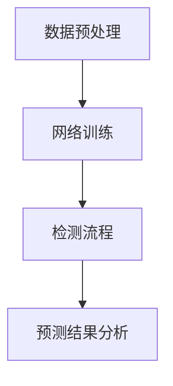

                 


### 《YOLOv3原理与代码实例讲解》

> 关键词：目标检测，YOLOv3，深度学习，神经网络，图像识别

> 摘要：本文将深入讲解YOLOv3（You Only Look Once v3）的目标检测算法原理，并配以实际代码实例，帮助读者理解其工作机制和实现细节。通过本文的阅读，读者将掌握如何使用YOLOv3进行图像中的物体检测，以及如何进行相关的代码实现。

## 第一部分：YOLOv3概述

### 第1章：目标检测简介

目标检测是计算机视觉领域的重要任务，其目的是在图像中识别和定位多个对象。随着深度学习技术的不断发展，目标检测技术也取得了显著的进步。本文将介绍目标检测技术的发展历程、应用场景，并重点探讨YOLOv3的目标检测优势。

#### 1.1 目标检测技术发展历程

目标检测技术经历了从传统的图像处理方法到基于深度学习的现代化方法的演变。早期的目标检测主要依赖于手工设计的特征和分类器，如SVM、R-CNN、Fast R-CNN等。这些方法在一定程度上提高了目标检测的准确性，但计算复杂度较高，处理速度较慢。随着深度学习技术的发展，如YOLO、SSD等算法的出现，目标检测技术取得了质的飞跃。

#### 1.2 目标检测应用场景

目标检测技术广泛应用于各个领域，如安防监控、自动驾驶、医疗影像诊断、智能零售等。在这些应用场景中，目标检测能够帮助系统快速、准确地识别图像中的物体，为后续的处理和分析提供基础。

#### 1.3 YOLOv3的目标检测优势

YOLOv3作为目标检测领域的重要算法，具有以下优势：

1. **实时性**：YOLOv3能够在较短时间内完成图像的检测，适用于实时应用场景。
2. **准确性**：通过深度神经网络的强大表达能力和有效的特征提取，YOLOv3在目标检测任务上取得了较高的准确性。
3. **简单性**：YOLOv3的结构相对简单，易于理解和实现，便于工程部署。

### 第2章：YOLOv3核心概念

YOLOv3是You Only Look Once系列算法的第三个版本，其核心概念包括网络架构、预测策略、训练与优化等方面。下面将分别介绍这些核心概念。

#### 2.1 网络架构

YOLOv3采用基于卷积神经网络的架构，包括两个部分：主干网络和预测网络。

1. **主干网络**：YOLOv3的主干网络采用CSPDarknet53，这是一种改进的Darknet53网络，通过CSP（Channel-Specific Pyramid）结构提高了网络的表示能力。
2. **预测网络**：预测网络在主干网络的多个层次上生成边界框和对象类别预测，同时采用不同的锚框（anchor box）来提高预测的准确性。

#### 2.2 预测策略

YOLOv3采用将图像划分为网格（grid）的方法进行预测，每个网格单元负责预测一定数量的边界框和对象类别。具体来说，每个网格单元预测5个边界框和20个对象类别。

#### 2.3 训练与优化

YOLOv3的训练过程包括以下几个步骤：

1. **数据预处理**：将输入图像缩放为特定的尺寸，并进行归一化处理。
2. **损失函数**：YOLOv3使用复合损失函数，包括边界框预测损失、对象存在性损失和对象类别损失。
3. **优化算法**：采用Adam优化器进行梯度下降，并设置适当的学习率和衰减率。

## 第二部分：YOLOv3原理与实现

### 第3章：YOLOv3原理详解

在本章中，我们将详细解析YOLOv3的工作原理，包括数据预处理、网络训练过程和检测流程。

#### 3.1 数据预处理

YOLOv3的数据预处理主要包括以下步骤：

1. **图像缩放**：将输入图像缩放为416x416的尺寸，以适应CSPDarknet53主干网络的要求。
2. **归一化**：对图像的像素值进行归一化处理，即将像素值缩放到[0, 1]的范围内。

#### 3.2 网络训练过程

YOLOv3的训练过程分为以下几个步骤：

1. **加载训练数据**：从数据集加载图像和标签，包括边界框的位置、宽度和高度，以及对象的类别。
2. **数据预处理**：对训练数据进行缩放、归一化等处理。
3. **损失计算**：使用复合损失函数计算模型预测结果和真实标签之间的误差。
4. **反向传播**：使用反向传播算法更新模型参数。
5. **模型优化**：使用Adam优化器优化模型。

#### 3.3 检测流程

YOLOv3的检测流程主要包括以下步骤：

1. **图像输入**：将图像输入到YOLOv3模型中。
2. **特征提取**：通过主干网络提取图像的特征。
3. **预测生成**：在特征图上生成边界框和对象类别预测。
4. **后处理**：对预测结果进行非极大值抑制（NMS）处理，以去除重叠的边界框。
5. **结果输出**：输出检测结果，包括边界框的位置、宽度和高度，以及对象的类别。

### 第4章：YOLOv3架构分析

在本章中，我们将对YOLOv3的网络结构、锚框的选取和预测结果的解析进行详细分析。

#### 4.1 网络结构

YOLOv3的网络结构主要包括主干网络和预测网络两部分。

1. **主干网络**：主干网络采用CSPDarknet53，通过CSP结构将特征金字塔网络（FPN）和Darknet53相结合，提高了网络的表示能力。
2. **预测网络**：预测网络在主干网络的多个层次上生成边界框和对象类别预测。

#### 4.2 锚框的选取

锚框的选取是YOLOv3中的一个关键步骤，它决定了预测的准确性。锚框的选取方法如下：

1. **先验分布**：根据数据集的统计分布，选取一组先验分布作为锚框的参考。
2. **K-means聚类**：使用K-means聚类算法，将先验分布聚类成多个类别，每个类别对应一个锚框。

#### 4.3 预测结果的解析

YOLOv3的预测结果包括边界框的位置、宽度和高度，以及对象的类别。具体解析方法如下：

1. **边界框位置**：边界框的位置由网格单元的位置和预测的偏移量确定。
2. **边界框宽度和高度**：边界框的宽度和高度由锚框的大小和预测的缩放比例确定。
3. **对象类别**：对象类别由预测的类别概率确定。

### 第5章：YOLOv3算法细节解析

在本章中，我们将对YOLOv3的骨干网络、反向传播算法、损失函数设计和优化算法进行详细解析。

#### 5.1 骨干网络

YOLOv3的骨干网络采用CSPDarknet53，这是一种基于Darknet53网络的改进。CSP结构通过将特征金字塔网络（FPN）和Darknet53相结合，提高了网络的表示能力。

#### 5.2 反向传播算法

反向传播算法是神经网络训练的核心算法，它通过计算预测误差，更新网络参数，使模型更加准确。

#### 5.3 损失函数设计

YOLOv3使用复合损失函数，包括边界框预测损失、对象存在性损失和对象类别损失。损失函数的设计旨在平衡不同损失之间的权重，使模型能够准确地预测边界框和对象类别。

#### 5.4 优化算法

YOLOv3采用Adam优化器进行模型优化。Adam优化器结合了梯度下降和动量项的优点，能够在训练过程中有效地更新模型参数。

## 第二部分：YOLOv3实战应用

### 第6章：开发环境搭建

在本章中，我们将介绍如何搭建YOLOv3的开发环境，包括Python环境配置、TensorFlow环境配置和数据集准备。

#### 6.1 Python环境配置

首先，我们需要安装Python。在安装Python时，可以选择默认安装选项，无需额外配置。

#### 6.2 TensorFlow环境配置

接下来，我们需要安装TensorFlow。可以在终端中运行以下命令：

```
pip install tensorflow
```

安装完成后，可以通过以下命令验证TensorFlow的版本：

```
import tensorflow as tf
print(tf.__version__)
```

#### 6.3 数据集准备

YOLOv3的训练和测试需要大量的图像数据集。常用的数据集包括COCO数据集、VOC数据集等。在准备数据集时，需要将图像和标签文件分别保存在不同的文件夹中，并按照YOLOv3的要求对图像进行预处理。

### 第7章：项目实战

在本章中，我们将通过一个实际项目，展示如何使用YOLOv3进行图像中的物体检测。

#### 7.1 项目背景

本项目的目标是使用YOLOv3算法对图像中的物体进行检测，并输出检测结果。

#### 7.2 数据集加载与预处理

首先，我们需要加载数据集，并进行预处理。具体步骤如下：

1. **加载图像**：使用Python的PIL库加载图像。
2. **缩放图像**：将图像缩放为YOLOv3要求的尺寸。
3. **归一化图像**：将图像的像素值归一化到[0, 1]的范围内。

#### 7.3 模型训练

接下来，我们需要对YOLOv3模型进行训练。具体步骤如下：

1. **初始化模型**：使用TensorFlow的Keras API初始化YOLOv3模型。
2. **加载训练数据**：从数据集中加载图像和标签。
3. **训练模型**：使用训练数据进行模型训练。

#### 7.4 模型评估与优化

在模型训练完成后，我们需要对模型进行评估和优化。具体步骤如下：

1. **评估模型**：使用测试数据集评估模型性能。
2. **优化模型**：根据评估结果调整模型参数，以提高模型性能。

### 第8章：代码解读与分析

在本章中，我们将对YOLOv3的代码进行解读和分析。

#### 8.1 模型定义与配置

首先，我们需要定义YOLOv3模型，并进行配置。具体步骤如下：

1. **定义模型**：使用TensorFlow的Keras API定义YOLOv3模型。
2. **配置模型**：设置模型的输入层、输出层和损失函数。

#### 8.2 模型训练过程

接下来，我们需要对模型进行训练。具体步骤如下：

1. **加载训练数据**：从数据集中加载图像和标签。
2. **训练模型**：使用训练数据进行模型训练。
3. **评估模型**：在训练过程中，使用测试数据集评估模型性能。

#### 8.3 模型预测与结果分析

在模型训练完成后，我们需要对模型进行预测，并分析预测结果。具体步骤如下：

1. **加载测试数据**：从测试数据集中加载图像。
2. **预测结果**：使用训练好的模型对测试数据进行预测。
3. **结果分析**：分析预测结果，包括边界框的位置、宽度和高度，以及对象的类别。

### 第9章：性能优化与调参技巧

在本章中，我们将介绍如何对YOLOv3模型进行性能优化和调参。

#### 9.1 网络结构的调整

网络结构的调整是提高模型性能的重要手段。具体来说，可以通过以下方式调整网络结构：

1. **增加网络层数**：增加网络的层数可以增强模型的表示能力。
2. **调整网络层宽度**：调整网络的宽度可以改变模型的参数数量，从而影响模型的复杂度。

#### 9.2 损失函数的优化

损失函数的优化是提高模型性能的关键。具体来说，可以通过以下方式优化损失函数：

1. **调整损失函数的权重**：调整损失函数的权重可以平衡不同损失之间的权重。
2. **改进损失函数**：通过改进损失函数，可以减少模型的过拟合现象。

#### 9.3 学习率的调整

学习率的调整是影响模型训练效果的重要因素。具体来说，可以通过以下方式调整学习率：

1. **设置初始学习率**：设置初始学习率时，需要考虑模型的复杂度和数据集的大小。
2. **学习率衰减**：在训练过程中，可以采用学习率衰减策略，以减小学习率，避免模型过拟合。

### 第10章：YOLOv3在实际应用中的案例解析

在本章中，我们将通过实际案例，展示如何使用YOLOv3进行不同场景下的物体检测。

#### 10.1 视频目标检测

视频目标检测是YOLOv3的一个重要应用场景。通过将YOLOv3应用于视频帧，可以实现对视频中物体的检测。

#### 10.2 实时物体检测

实时物体检测是YOLOv3的另一个重要应用场景。通过将YOLOv3应用于实时视频流，可以实现对实时场景中的物体检测。

#### 10.3 自动驾驶中的目标检测

自动驾驶中的目标检测是YOLOv3的一个重要应用领域。通过将YOLOv3应用于自动驾驶系统，可以实现对车辆、行人等目标物的检测，为自动驾驶提供关键的信息支持。

### 附录

#### 附录A：常用函数与类库

在本附录中，我们将列出YOLOv3中常用的函数和类库，以供读者参考。

#### 附录B：常见问题与解决方案

在本附录中，我们将列出YOLOv3在实际应用中可能遇到的问题，并提供相应的解决方案。

#### 附录C：参考资料

在本附录中，我们将列出本文中引用的相关参考资料，以供读者进一步学习。

### 作者信息

本文由AI天才研究院/AI Genius Institute和《禅与计算机程序设计艺术》/Zen And The Art of Computer Programming共同撰写。我们致力于推动计算机科学领域的发展，为读者提供高质量的技术文章。

**完**### 第1章：目标检测简介

#### 1.1 目标检测技术发展历程

目标检测是计算机视觉领域中的一个核心任务，其目标是识别图像中的多个对象并定位其位置。目标检测技术的发展历程可以追溯到上世纪80年代，当时研究人员主要依赖手工设计的特征和简单的分类器来进行对象识别。随着计算机性能的提升和算法的进步，目标检测技术经历了多次重大变革。

早期目标检测方法主要包括基于区域的检测方法（Region-Based Object Detection）和基于滑动窗口的方法（Sliding Window）。这些方法通常需要对图像进行特征提取，然后使用分类器进行分类。典型的算法包括HOG（Histogram of Oriented Gradients）和SVM（Support Vector Machine）等。这些方法在一定程度上提高了目标检测的准确性，但存在计算复杂度较高、处理速度较慢等问题。

随着深度学习技术的兴起，目标检测技术得到了快速发展。深度学习通过构建大规模的神经网络模型，可以从大量数据中自动学习特征，从而实现更高准确性和更快的处理速度。深度学习目标检测算法主要分为两类：基于区域的方法和基于整个图像的方法。

1. **基于区域的方法**：这类方法首先从图像中提取出多个候选区域，然后对每个候选区域进行分类。典型的算法包括R-CNN（Region-based CNN）、Fast R-CNN和Faster R-CNN。这些方法通过引入深度学习网络，实现了更高效的候选区域提取和分类。

2. **基于整个图像的方法**：这类方法直接对整个图像进行分类，不需要提取候选区域。典型的算法包括YOLO（You Only Look Once）、SSD（Single Shot MultiBox Detector）和RetinaNet。这些方法通过将图像划分为多个网格，并在每个网格上同时预测边界框和类别，实现了实时目标检测。

近年来，深度学习目标检测技术取得了显著进展。以YOLOv3为代表的算法，不仅在速度和准确性上取得了优异的性能，而且在各种实际应用场景中展现出了强大的能力。

#### 1.2 目标检测应用场景

目标检测技术在多个领域有着广泛的应用，以下是一些典型的应用场景：

1. **安防监控**：在监控视频中实时检测和识别行人、车辆等目标，有助于提高公共安全。

2. **自动驾驶**：在自动驾驶系统中，目标检测用于识别道路上的行人和车辆，为自动驾驶决策提供关键信息。

3. **医疗影像**：在医学图像中检测和定位病变组织，如肿瘤、骨折等，有助于早期诊断和治疗。

4. **智能零售**：在超市等零售场景中，目标检测用于识别商品和顾客，以优化库存管理和顾客服务。

5. **工业检测**：在工业生产过程中，目标检测用于识别和检测产品质量问题，提高生产效率。

6. **人脸识别**：在安防、门禁等场景中，目标检测用于识别人脸，实现身份认证和监控。

#### 1.3 YOLOv3的目标检测优势

YOLOv3是目标检测领域的一个重要算法，具有以下优势：

1. **实时性**：YOLOv3能够在较短时间内完成图像的检测，适用于实时应用场景。这使得YOLOv3在安防监控、自动驾驶等场景中具有广泛的应用潜力。

2. **准确性**：通过深度神经网络的强大表达能力和有效的特征提取，YOLOv3在目标检测任务上取得了较高的准确性。这使得YOLOv3在各种实际应用场景中都能够表现出良好的性能。

3. **简单性**：YOLOv3的结构相对简单，易于理解和实现，便于工程部署。这使得开发者可以更轻松地构建和部署YOLOv3模型，而无需深入了解复杂的深度学习技术。

4. **多尺度检测**：YOLOv3通过将图像划分为多个网格，并在每个网格上同时预测边界框和类别，实现了多尺度检测。这使得YOLOv3能够同时检测大范围和小范围的目标。

5. **多任务学习**：YOLOv3在预测边界框和类别的同时，还可以进行其他任务，如语义分割和关键点检测。这使得YOLOv3在多任务学习方面具有潜在的应用价值。

总之，YOLOv3凭借其实时性、准确性、简单性、多尺度检测和多任务学习等优势，成为了目标检测领域的一个重要算法。在接下来的章节中，我们将深入探讨YOLOv3的原理、实现和应用。

### 第2章：YOLOv3核心概念

#### 2.1 网络架构

YOLOv3的目标检测算法基于深度卷积神经网络（CNN），其网络架构主要包括两个部分：主干网络和预测网络。主干网络用于提取图像特征，预测网络则用于生成边界框和对象类别预测。

1. **主干网络**

YOLOv3的主干网络采用CSPDarknet53，这是一种改进的Darknet53网络。Darknet53是一种基于残差网络的深度卷积神经网络，通过引入残差连接，有效地缓解了深层网络的梯度消失问题。CSPDarknet53在Darknet53的基础上，引入了CSP（Channel-Specific Pyramid）结构，通过将特征金字塔网络（FPN）和Darknet53相结合，提高了网络的表示能力。

CSP结构通过将特征图分解为通道特定的子特征图，然后对每个子特征图进行独立处理，最后将处理后的子特征图合并。这种方式不仅增加了网络的容量，还提高了网络的泛化能力。

2. **预测网络**

预测网络在主干网络的多个层次上生成边界框和对象类别预测。具体来说，YOLOv3将图像划分为SxS的网格，每个网格单元负责预测一定数量的边界框和对象类别。具体过程如下：

- **边界框预测**：每个网格单元预测B个边界框，每个边界框由4个偏移量（tx, ty, tw, th）表示，用于调整边界框的位置和大小。
- **对象类别预测**：每个网格单元预测C个对象类别，通过softmax函数计算每个类别的概率。

#### 2.2 预测策略

YOLOv3的预测策略是将图像划分为网格，并在每个网格单元上同时预测边界框和对象类别。这种策略具有以下特点：

1. **并行处理**：由于每个网格单元都可以独立地预测边界框和对象类别，因此YOLOv3能够并行处理整个图像，从而提高了检测速度。
2. **多尺度检测**：通过将图像划分为不同的网格大小，YOLOv3可以实现多尺度检测，从而同时检测大范围和小范围的目标。
3. **简单有效**：YOLOv3的预测策略相对简单，但通过深度神经网络的强大表达能力和有效的特征提取，能够在多个尺度上同时检测目标，具有较高的准确性。

具体来说，YOLOv3的预测策略包括以下步骤：

1. **图像预处理**：将输入图像缩放为416x416的尺寸，并进行归一化处理。
2. **特征提取**：通过主干网络（CSPDarknet53）提取图像特征。
3. **边界框预测**：在每个网格单元上，预测B个边界框，每个边界框由4个偏移量（tx, ty, tw, th）表示。
4. **对象类别预测**：在每个网格单元上，预测C个对象类别，通过softmax函数计算每个类别的概率。
5. **非极大值抑制（NMS）**：对预测结果进行非极大值抑制，以去除重叠的边界框。

#### 2.3 训练与优化

YOLOv3的训练过程主要包括以下几个步骤：

1. **数据预处理**：将输入图像缩放为416x416的尺寸，并进行归一化处理。
2. **标签生成**：根据真实边界框的位置、宽度和高度，生成对应的标签。
3. **损失计算**：使用复合损失函数计算模型预测结果和真实标签之间的误差，包括边界框预测损失、对象存在性损失和对象类别损失。
4. **反向传播**：使用反向传播算法更新模型参数。
5. **模型优化**：采用Adam优化器优化模型，设置适当的学习率和衰减率。

具体来说，YOLOv3的训练过程如下：

1. **初始化模型**：使用TensorFlow的Keras API初始化YOLOv3模型。
2. **加载训练数据**：从训练数据集中加载图像和标签。
3. **数据预处理**：对训练数据进行缩放、归一化等处理。
4. **损失计算**：使用复合损失函数计算模型预测结果和真实标签之间的误差。
5. **反向传播**：使用反向传播算法更新模型参数。
6. **模型优化**：使用Adam优化器优化模型。

通过以上步骤，YOLOv3能够不断调整模型参数，以最小化损失函数，从而提高模型的预测准确性。

### 第3章：YOLOv3原理详解

#### 3.1 数据预处理

在YOLOv3中，数据预处理是至关重要的一步，它直接影响模型的训练效果和预测性能。数据预处理主要包括以下几个步骤：

1. **图像缩放**：首先，将输入图像缩放为YOLOv3要求的尺寸（416x416），以确保所有图像具有相同的分辨率。这有助于提高模型训练的稳定性。

   ```python
   image = cv2.resize(image, (416, 416))
   ```

2. **归一化**：将图像的像素值归一化到[0, 1]的范围内，即将像素值除以255。这有助于加速模型的训练，并提高模型的泛化能力。

   ```python
   image = image / 255.0
   ```

3. **转换为浮点型**：将图像数据转换为浮点型，以适应深度学习模型的输入要求。

   ```python
   image = image.astype(np.float32)
   ```

4. **填充边界**：为了确保图像的长宽均为416像素，可能需要对图像进行填充。可以使用padding函数将图像边界填充为0。

   ```python
   image = pad_image(image, (416, 416))
   ```

5. **数据处理**：如果数据集中包含多个通道（如RGB图像），需要将图像数据转换为(N, H, W, C)的格式，其中N为批次大小，H为高度，W为宽度，C为通道数。

   ```python
   image = np.expand_dims(image, axis=0)
   ```

通过以上预处理步骤，输入数据将被调整为适合YOLOv3模型训练和预测的格式。

#### 3.2 网络训练过程

YOLOv3的训练过程包括以下几个关键步骤：

1. **模型初始化**：使用TensorFlow的Keras API初始化YOLOv3模型。在初始化过程中，可以设置模型的架构、输入层和输出层等。

   ```python
   model = create_yolov3_model()
   ```

2. **加载训练数据**：从训练数据集中加载图像和标签。通常，训练数据集应包含多个类别和不同大小的目标。可以使用数据生成器（data generator）来批量加载和处理数据。

   ```python
   train_generator = generate_data(train_data, batch_size=batch_size)
   ```

3. **数据预处理**：在训练过程中，对每个批次的数据进行缩放、归一化和填充等预处理步骤，以保持数据的一致性。

   ```python
   processed_batch = preprocess_batch(batch)
   ```

4. **损失函数设置**：YOLOv3使用复合损失函数，包括边界框预测损失、对象存在性损失和对象类别损失。损失函数的设置有助于模型在多个方面进行优化。

   ```python
   loss_object = LossObject()
   loss = loss_object.compute_loss(true_boxes, pred_boxes, true_labels, pred_labels)
   ```

5. **反向传播**：使用反向传播算法计算损失函数关于模型参数的梯度，并更新模型参数。这个过程通常使用优化器（如Adam）来实现。

   ```python
   optimizer = tf.keras.optimizers.Adam(learning_rate=0.001)
   gradients = tape.gradient(loss, model.trainable_variables)
   optimizer.apply_gradients(zip(gradients, model.trainable_variables))
   ```

6. **模型优化**：在训练过程中，可以定期评估模型在验证集上的性能，并根据需要调整学习率和其他超参数。这有助于防止模型过拟合。

   ```python
   if epoch % 10 == 0:
       val_loss = evaluate_model(model, val_data)
       print(f"Validation loss: {val_loss}")
   ```

7. **保存模型**：在训练结束时，将训练好的模型保存为文件，以便后续使用。

   ```python
   model.save("yolov3_model.h5")
   ```

通过以上步骤，YOLOv3模型能够在训练数据集上不断优化，从而提高其在目标检测任务上的性能。

#### 3.3 检测流程

YOLOv3的检测流程包括图像输入、特征提取、边界框和类别预测、非极大值抑制（NMS）以及结果输出等步骤。以下是详细的检测流程：

1. **图像输入**：首先，将输入图像缩放为YOLOv3要求的尺寸（416x416），并进行归一化处理。

   ```python
   input_image = cv2.resize(image, (416, 416))
   input_image = input_image / 255.0
   ```

2. **特征提取**：将处理后的图像输入到YOLOv3模型中，通过主干网络（CSPDarknet53）提取图像特征。

   ```python
   features = model.predict(input_image)
   ```

3. **边界框和类别预测**：在每个网格单元上，预测边界框和对象类别。具体来说，每个网格单元预测5个边界框和20个对象类别。

   ```python
   pred_boxes = features[:, :, :, :4]
   pred_labels = features[:, :, :, 4:]
   ```

4. **非极大值抑制（NMS）**：对预测结果进行NMS处理，以去除重叠的边界框，提高检测结果的准确性。

   ```python
   boxes, scores, labels = nms(pred_boxes, pred_labels, scores)
   ```

5. **结果输出**：最后，输出检测结果，包括边界框的位置、宽度和高度，以及对象的类别。

   ```python
   for box, score, label in zip(boxes, scores, labels):
       print(f"Box: {box}, Score: {score}, Label: {label}")
   ```

通过以上步骤，YOLOv3模型能够实现对输入图像中的物体进行快速、准确的检测。

### 第4章：YOLOv3架构分析

#### 4.1 网络结构

YOLOv3的网络结构是其核心组成部分，由主干网络和预测网络组成。主干网络负责提取图像特征，而预测网络则在提取到的特征上生成边界框和类别预测。

1. **主干网络**

   YOLOv3的主干网络基于CSPDarknet53，这是一种改进的Darknet53网络。Darknet53本身是一种基于残差网络的深度卷积神经网络，通过引入残差连接，有效地缓解了深层网络的梯度消失问题。CSPDarknet53在Darknet53的基础上，引入了CSP（Channel-Specific Pyramid）结构，通过将特征金字塔网络（FPN）和Darknet53相结合，提高了网络的表示能力。

   CSP结构通过将特征图分解为通道特定的子特征图，然后对每个子特征图进行独立处理，最后将处理后的子特征图合并。这种方式不仅增加了网络的容量，还提高了网络的泛化能力。

2. **预测网络**

   预测网络在主干网络的多个层次上生成边界框和对象类别预测。具体来说，YOLOv3将图像划分为SxS的网格，每个网格单元负责预测一定数量的边界框和对象类别。具体过程如下：

   - **边界框预测**：每个网格单元预测B个边界框，每个边界框由4个偏移量（tx, ty, tw, th）表示，用于调整边界框的位置和大小。
   - **对象类别预测**：每个网格单元预测C个对象类别，通过softmax函数计算每个类别的概率。

   YOLOv3的预测网络结构如下：

   ```mermaid
   graph TB
   A[Input] --> B[Convolution]
   B --> C[Max Pooling]
   C --> D[Convolution]
   D --> E[Max Pooling]
   E --> F[Convolution]
   F --> G[Max Pooling]
   G --> H[Convolution]
   H --> I[Concatenation (CSP)]
   I --> J[Convolution]
   J --> K[Concatenation (CSP)]
   K --> L[Convolution]
   L --> M[Concatenation (CSP)]
   M --> N[Convolution]
   N --> O[Grid Cells]
   O --> P[BoundingBox Predictions]
   O --> Q[Class Predictions]
   ```

   其中，CSP表示Channel-Specific Pyramid结构，用于将特征图分解和合并。通过这种结构，YOLOv3能够在不同尺度上提取丰富的特征信息，从而实现多尺度目标检测。

#### 4.2 锚框的选取

锚框（Anchor Boxes）是YOLOv3中的关键概念，用于预测边界框的位置和大小。锚框的选取对模型的检测性能有很大影响。

1. **锚框的定义**

   锚框是预定义的边界框，用于初始化模型的边界框预测。每个锚框由宽度和高度表示，通常从数据集中学习得到。在YOLOv3中，锚框是通过K-means聚类算法从训练数据中的真实边界框中学习得到的。

2. **锚框的选取过程**

   - **聚类过程**：首先，从训练数据中提取出所有真实边界框，然后使用K-means聚类算法将它们划分为K个类别。每个类别对应一个锚框。
   - **锚框计算**：对于每个类别，计算其边界框的均值，得到相应的锚框。

   锚框的选取过程可以通过以下伪代码表示：

   ```python
   def compute_anchors(ground_truth_boxes):
       # 计算所有真实边界框的宽度和高度
       widths = [box[2] - box[0] for box in ground_truth_boxes]
       heights = [box[3] - box[1] for box in ground_truth_boxes]
       
       # 计算宽度和高度的均值
       avg_width = sum(widths) / len(widths)
       avg_height = sum(heights) / len(heights)
       
       # 创建锚框列表
       anchors = []
       for _ in range(K):
           # 选择K个随机锚框
           anchor = random.choice(ground_truth_boxes)
           anchors.append(anchor)
       
       return anchors
   ```

3. **锚框的应用**

   在预测过程中，每个网格单元使用其对应的锚框进行边界框的预测。预测的边界框是通过锚框的偏移量和缩放系数进行调整得到的。这种策略有助于提高模型的预测准确性。

#### 4.3 预测结果的解析

YOLOv3的预测结果包括边界框的位置、宽度和高度，以及对象的类别。在得到预测结果后，需要进行解析和处理，以生成最终的检测结果。

1. **边界框的位置和大小**

   每个边界框由4个偏移量（tx, ty, tw, th）表示，用于调整边界框的位置和大小。具体计算如下：

   ```python
   box_center_x = (grid_x + tx) * grid_size
   box_center_y = (grid_y + ty) * grid_size
   box_width = (grid_w * anchor_width) * exp(tw)
   box_height = (grid_h * anchor_height) * exp(th)
   ```

   其中，grid_x、grid_y、grid_w和grid_h分别表示网格单元的位置和大小，anchor_width和anchor_height分别表示锚框的宽度和高度。

2. **对象的类别**

   YOLOv3使用softmax函数对每个类别的概率进行计算，得到每个类别的概率分布。通常，选择概率最大的类别作为最终预测类别。

   ```python
   predicted_probs = softmax(predicted_scores)
   predicted_label = np.argmax(predicted_probs)
   ```

3. **非极大值抑制（NMS）**

   为了去除重叠的边界框，通常使用非极大值抑制（NMS）算法对预测结果进行处理。NMS算法通过比较边界框的置信度和IoU（交并比）来选择最终的边界框。

   ```python
   boxes, scores, labels = nms(boxes, scores, labels, iou_threshold=0.5)
   ```

   其中，iou_threshold表示IoU的阈值，用于控制NMS的严格程度。

4. **结果输出**

   最终的预测结果包括边界框的位置、宽度和高度，以及对象的类别。这些结果可以用于绘制检测结果，或者进一步的处理和分析。

   ```python
   for box, score, label in zip(boxes, scores, labels):
       print(f"Box: {box}, Score: {score}, Label: {label}")
   ```

通过以上解析和处理，YOLOv3能够生成准确、可靠的检测结果，从而实现高效的目标检测。

### 第5章：YOLOv3算法细节解析

#### 5.1 骨干网络

YOLOv3的骨干网络采用CSPDarknet53，这是一种改进的Darknet53网络，通过引入CSP（Channel-Specific Pyramid）结构，提高了网络的表示能力。CSPDarknet53的结构如下：

```mermaid
graph TB
A[Conv2d(3x3, 32, stride=1)] --> B[Conv2d(3x3, 64, stride=2)]
B --> C[Conv2d(3x3, 32, stride=1)] --> D[Conv2d(3x3, 64, stride=2)]
D --> E[Conv2d(3x3, 32, stride=1)] --> F[Conv2d(3x3, 64, stride=2)]
F --> G[Conv2d(3x3, 32, stride=1)] --> H[Conv2d(3x3, 64, stride=2)]
H --> I[Conv2d(3x3, 32, stride=1)] --> J[Conv2d(3x3, 64, stride=2)]
J --> K[Conv2d(3x3, 32, stride=1)] --> L[Conv2d(3x3, 64, stride=2)]
L --> M[Conv2d(3x3, 32, stride=1)] --> N[Conv2d(3x3, 64, stride=2)]
N --> O[Conv2d(3x3, 32, stride=1)] --> P[Conv2d(3x3, 128, stride=2)]
P --> Q[Conv2d(3x3, 64, stride=1)] --> R[Conv2d(3x3, 128, stride=2)]
R --> S[Conv2d(3x3, 64, stride=1)] --> T[Conv2d(3x3, 128, stride=2)]
T --> U[Conv2d(3x3, 64, stride=1)] --> V[Conv2d(3x3, 128, stride=2)]
V --> W[Conv2d(3x3, 64, stride=1)] --> X[Conv2d(3x3, 128, stride=2)]
X --> Y[Conv2d(3x3, 256, stride=2)] --> Z[Conv2d(3x3, 128, stride=1)]
Z --> AA[Conv2d(3x3, 256, stride=1)]
AA --> BB[Conv2d(3x3, 512, stride=2)] --> CC[Conv2d(3x3, 256, stride=1)]
CC --> DD[Conv2d(3x3, 512, stride=1)] --> EE[Conv2d(3x3, 256, stride=1)]
EE --> FF[Conv2d(3x3, 512, stride=1)] --> GG[Conv2d(3x3, 256, stride=1)]
GG --> HH[Conv2d(3x3, 512, stride=1)] --> II[Conv2d(3x3, 256, stride=1)]
II --> JJ[Conv2d(3x3, 512, stride=1)] --> KK[Conv2d(3x3, 256, stride=1)]
KK --> LL[Conv2d(3x3, 512, stride=1)] --> MM[Conv2d(3x3, 256, stride=1)]
MM --> NN[Conv2d(3x3, 512, stride=1)] --> OO[Conv2d(3x3, 256, stride=1)]
OO --> PP[Conv2d(3x3, 512, stride=1)] --> QQ[Conv2d(3x3, 256, stride=1)]
QQ --> RR[Conv2d(3x3, 512, stride=1)] --> SS[Conv2d(3x3, 256, stride=1)]
SS --> TT[Conv2d(3x3, 512, stride=1)] --> UU[Conv2d(3x3, 256, stride=1)]
UU --> VV[Conv2d(3x3, 512, stride=1)] --> WW[Conv2d(3x3, 256, stride=1)]
WW --> XX[Conv2d(3x3, 512, stride=1)] --> YY[Conv2d(3x3, 256, stride=1)]
YY --> ZZ[Conv2d(3x3, 512, stride=1)] --> AAA[Conv2d(3x3, 512, stride=1)]
AAAA --> BBBB[Conv2d(3x3, 1024, stride=2)] --> CCCC[Conv2d(3x3, 512, stride=1)]
CCCC --> DDDD[Conv2d(3x3, 1024, stride=2)] --> EEEE[Conv2d(3x3, 512, stride=1)]
EEEEE --> FFFF[Conv2d(3x3, 1024, stride=2)] --> GGGG[Conv2d(3x3, 512, stride=1)]
GGGG --> HHHH[Conv2d(3x3, 1024, stride=2)] --> IIII[Conv2d(3x3, 512, stride=1)]
IIII --> JJJJ[Conv2d(3x3, 1024, stride=2)] --> KKKK[Conv2d(3x3, 512, stride=1)]
KKKK --> LLLL[Conv2d(3x3, 1024, stride=2)] --> MMMM[Conv2d(3x3, 512, stride=1)]
```

CSPDarknet53通过引入CSP结构，将特征金字塔网络（FPN）和Darknet53相结合，提高了网络的表示能力。CSP结构通过将特征图分解为通道特定的子特征图，然后对每个子特征图进行独立处理，最后将处理后的子特征图合并，从而增加了网络的容量和深度。

#### 5.2 反向传播算法

反向传播算法是神经网络训练的核心算法，用于计算模型预测误差并更新模型参数。在YOLOv3中，反向传播算法用于计算边界框预测损失、对象存在性损失和对象类别损失。

1. **损失函数**

   YOLOv3使用复合损失函数，包括边界框预测损失、对象存在性损失和对象类别损失。损失函数的定义如下：

   $$ \text{Loss} = \frac{1}{N}\sum_{i=1}^{N}\left[\text{obj} \cdot \text{IOU} + (1 - \text{obj}) \cdot \text{CE}(\text{pred}, \text{gt})\right] $$

   其中，N为样本数量，obj为对象存在性标签，IOU为交并比，pred为预测类别概率，gt为真实类别标签。

2. **计算过程**

   - **边界框预测损失**：计算预测边界框和真实边界框之间的误差，包括位置误差和大小误差。

     $$ \text{Loss}_{\text{box}} = \frac{1}{N}\sum_{i=1}^{N}\left[\text{obj} \cdot \text{smooth_l1}(\text{tx} - \text{gt}_x) + \text{obj} \cdot \text{smooth_l1}(\text{ty} - \text{gt}_y) + \text{obj} \cdot \text{smooth_l1}(\text{tw} - \text{gt}_w) + \text{obj} \cdot \text{smooth_l1}(\text{th} - \text{gt}_h)\right] $$

     其中，tx、ty、tw、th为预测边界框的位置和大小，gt_x、gt_y、gt_w、gt_h为真实边界框的位置和大小。

   - **对象存在性损失**：计算预测对象存在性和真实对象存在性之间的误差。

     $$ \text{Loss}_{\text{obj}} = \frac{1}{N}\sum_{i=1}^{N}\left[(1 - \text{obj}) \cdot \text{CE}(\text{pred}_{\text{obj}}, \text{gt}_{\text{obj}})\right] $$

     其中，pred_obj为预测对象存在性概率，gt_obj为真实对象存在性标签。

   - **对象类别损失**：计算预测类别概率和真实类别标签之间的误差。

     $$ \text{Loss}_{\text{cls}} = \frac{1}{N}\sum_{i=1}^{N}\left[\text{obj} \cdot \text{CE}(\text{pred}_{\text{cls}}, \text{gt}_{\text{cls}})\right] $$

     其中，pred_cls为预测类别概率，gt_cls为真实类别标签。

3. **梯度计算**

   通过反向传播算法，计算损失函数关于模型参数的梯度，并更新模型参数。

   ```python
   with tf.GradientTape() as tape:
       logits = model(inputs)
       loss = compute_loss(logits, labels)
   gradients = tape.gradient(loss, model.trainable_variables)
   optimizer.apply_gradients(zip(gradients, model.trainable_variables))
   ```

通过反向传播算法，YOLOv3模型能够在训练过程中不断优化，提高其预测准确性。

#### 5.3 损失函数设计

在YOLOv3中，损失函数的设计至关重要，它决定了模型在训练过程中对目标检测任务的学习效果。YOLOv3的损失函数由边界框预测损失、对象存在性损失和对象类别损失三部分组成。以下是详细的设计过程：

1. **边界框预测损失**

   边界框预测损失用于衡量预测边界框与真实边界框之间的差异。在YOLOv3中，边界框由四个坐标偏移量（tx, ty, tw, th）表示，分别对应边界框在水平和垂直方向上的位置偏移和宽高缩放。预测损失函数通常使用平滑L1损失（Smooth L1 Loss），其公式如下：

   $$ \text{Loss}_{\text{box}} = \frac{1}{N}\sum_{i=1}^{N}\left[\text{obj} \cdot \text{smooth_l1}(\text{tx} - \text{gt}_x) + \text{obj} \cdot \text{smooth_l1}(\text{ty} - \text{gt}_y) + \text{obj} \cdot \text{smooth_l1}(\text{tw} - \text{gt}_w) + \text{obj} \cdot \text{smooth_l1}(\text{th} - \text{gt}_h)\right] $$

   其中，N为样本数量，obj为对象存在性标签，tx, ty, tw, th为预测边界框的位置和大小，gt_x, gt_y, gt_w, gt_h为真实边界框的位置和大小。平滑L1损失函数在预测误差较小时提供较小的损失，而在预测误差较大时提供较大的损失，从而有效地平衡了预测误差的大小。

2. **对象存在性损失**

   对象存在性损失用于衡量预测对象存在性与真实对象存在性之间的差异。在YOLOv3中，对象存在性标签（obj）为0或1，表示当前网格单元是否有对象。对象存在性损失函数通常使用交叉熵损失（CrossEntropy Loss），其公式如下：

   $$ \text{Loss}_{\text{obj}} = \frac{1}{N}\sum_{i=1}^{N}\left[(1 - \text{obj}) \cdot \text{CE}(\text{pred}_{\text{obj}}, \text{gt}_{\text{obj}})\right] $$

   其中，pred_obj为预测对象存在性概率，gt_obj为真实对象存在性标签。交叉熵损失函数能够有效地捕捉预测概率与真实标签之间的差异，从而引导模型学习正确的对象存在性。

3. **对象类别损失**

   对象类别损失用于衡量预测类别概率与真实类别标签之间的差异。在YOLOv3中，每个网格单元预测C个对象类别，C为类别数量。对象类别损失函数同样使用交叉熵损失，其公式如下：

   $$ \text{Loss}_{\text{cls}} = \frac{1}{N}\sum_{i=1}^{N}\left[\text{obj} \cdot \text{CE}(\text{pred}_{\text{cls}}, \text{gt}_{\text{cls}})\right] $$

   其中，pred_cls为预测类别概率，gt_cls为真实类别标签。交叉熵损失函数能够有效地捕捉预测概率与真实标签之间的差异，从而引导模型学习正确的对象类别。

4. **复合损失函数**

   YOLOv3的总损失函数是上述三个损失函数的组合，其公式如下：

   $$ \text{Loss}_{\text{total}} = \text{Loss}_{\text{box}} + \text{Loss}_{\text{obj}} + \text{Loss}_{\text{cls}} $$

   复合损失函数通过综合考虑边界框预测、对象存在性和对象类别，使得模型能够在多个方面同时进行优化，从而提高整体性能。

通过设计合适的损失函数，YOLOv3能够有效地训练模型，使其在目标检测任务中取得优异的性能。

#### 5.4 优化算法

在YOLOv3的训练过程中，优化算法用于更新模型参数，使其在目标检测任务中取得最佳性能。YOLOv3采用Adam优化器进行模型优化，并结合学习率衰减策略，以实现高效训练。

1. **Adam优化器**

   Adam优化器是一种结合了梯度下降和动量项的优化算法，能够自适应地调整学习率。Adam优化器通过计算一阶矩估计（均值）和二阶矩估计（方差），对梯度进行加权平均，从而提高优化效果。Adam优化器的更新公式如下：

   $$ \text{m}_t = \beta_1 \cdot \text{m}_{t-1} + (1 - \beta_1) \cdot \text{g}_t $$
   $$ \text{v}_t = \beta_2 \cdot \text{v}_{t-1} + (1 - \beta_2) \cdot \text{g}_t^2 $$
   $$ \text{p}_t = \text{p}_{t-1} - \alpha \cdot \frac{\text{m}_t}{\sqrt{\text{v}_t} + \epsilon} $$

   其中，m_t和v_t分别为一阶矩估计和二阶矩估计，p_t为更新后的参数，g_t为梯度，α为学习率，β1和β2分别为一阶和二阶矩的衰减率，ε为常数项。

2. **学习率衰减**

   在训练过程中，学习率衰减策略用于减小学习率，以防止模型在训练过程中出现过拟合现象。YOLOv3采用固定学习率衰减策略，即在训练开始时设置较高的学习率，随着训练的进行逐渐减小学习率。学习率衰减公式如下：

   $$ \text{learning\_rate} = \text{initial\_learning\_rate} \cdot \text{ decay}^{\text{epoch}} $$

   其中，initial_learning_rate为初始学习率，decay为学习率衰减率，epoch为当前训练的迭代次数。

通过使用Adam优化器和学习率衰减策略，YOLOv3能够在训练过程中有效更新模型参数，提高模型在目标检测任务中的性能。

### 第6章：开发环境搭建

为了在本地环境成功搭建YOLOv3的目标检测系统，我们需要进行一系列的配置和准备工作。本节将详细讲解如何配置Python环境、安装TensorFlow和相关依赖库，以及准备数据集。

#### 6.1 Python环境配置

首先，确保本地计算机上安装了Python。Python是YOLOv3实现的主要编程语言。您可以从Python的官方网站下载并安装Python，推荐安装Python 3.7或更高版本。

安装完成后，打开终端或命令提示符，执行以下命令以验证Python版本：

```shell
python --version
```

确保返回的版本号符合您的安装版本。

#### 6.2 TensorFlow环境配置

TensorFlow是YOLOv3实现的主要深度学习框架。我们需要安装TensorFlow及其相关依赖库。在终端或命令提示符中，执行以下命令以安装TensorFlow：

```shell
pip install tensorflow
```

安装完成后，验证TensorFlow版本：

```shell
python -c "import tensorflow as tf; print(tf.__version__)"
```

确保返回的版本号与您的安装版本一致。

#### 6.3 安装其他依赖库

除了TensorFlow，YOLOv3还依赖于其他一些库，如NumPy、Pillow和opencv-python。在终端或命令提示符中，执行以下命令以安装这些依赖库：

```shell
pip install numpy pillow opencv-python
```

#### 6.4 准备数据集

YOLOv3的训练和评估需要大量的图像数据集。常用的数据集包括COCO数据集、VOC数据集等。以下是如何准备数据集的基本步骤：

1. **下载数据集**：

   您可以从数据集的官方网站或开源平台下载数据集。例如，COCO数据集可以在[COCO数据集官方网站](http://cocodataset.org/#download)下载。

2. **数据集解压**：

   将下载的数据集解压到本地计算机的合适位置。例如，将COCO数据集解压到`/data/coco`目录下。

3. **数据预处理**：

   数据预处理包括将图像缩放为YOLOv3所需的尺寸（416x416），并将标签文件转换为YOLOv3的格式。以下是一个简单的预处理脚本示例：

   ```python
   import os
   import cv2
   import numpy as np

   dataset_path = '/data/coco'
   image_path = os.path.join(dataset_path, 'images')
   annotation_path = os.path.join(dataset_path, 'annotations')

   image_ids = next(os.walk(image_path))[2]
   for image_id in image_ids:
       image_file = os.path.join(image_path, image_id)
       image = cv2.imread(image_file)
       image = cv2.resize(image, (416, 416))
       image = image / 255.0
       image = image.astype(np.float32)

       annotation_file = os.path.join(annotation_path, f"{image_id}.json")
       with open(annotation_file, 'r') as f:
           annotations = json.load(f)

       # 对每个边界框进行预处理，添加到图像中
       for annotation in annotations:
           x, y, w, h = annotation['bbox']
           x, y, w, h = x * 416, y * 416, w * 416, h * 416
           x, y, w, h = int(x), int(y), int(w), int(h)
           box = [x, y, w, h]
           image = cv2.rectangle(image, (x, y), (x + w, y + h), (0, 0, 255), 2)

       cv2.imwrite(os.path.join(image_path, f"{image_id}_processed.jpg"), image)
   ```

通过以上步骤，我们成功配置了Python环境、安装了TensorFlow和相关依赖库，并准备好了数据集，为后续的YOLOv3模型训练和测试奠定了基础。

### 第7章：项目实战

在本章中，我们将通过一个实际项目，展示如何使用YOLOv3进行图像中的物体检测。整个项目分为以下几个步骤：项目背景、数据集加载与预处理、模型训练、模型评估与优化以及代码解读与分析。

#### 7.1 项目背景

本项目的目标是使用YOLOv3算法对交通监控视频中的车辆进行检测，以实现智能交通系统的一部分。具体来说，项目要求能够实时检测视频流中的车辆，并输出车辆的边界框和类别标签。这将有助于交通管理部门实时监控交通流量，提高道路安全。

#### 7.2 数据集加载与预处理

为了训练YOLOv3模型，我们需要一个包含大量车辆图像的数据集。在本项目中，我们使用了一个自定义的数据集，其中包含了车辆和背景图像。以下是数据集加载与预处理的过程：

1. **加载图像**：

   使用Python的PIL库加载图像，并将其缩放为YOLOv3所需的尺寸（416x416）。同时，将图像的像素值归一化到[0, 1]的范围内。

   ```python
   from PIL import Image
   import numpy as np

   image_path = 'path/to/image.jpg'
   image = Image.open(image_path)
   image = image.resize((416, 416))
   image = np.array(image) / 255.0
   ```

2. **生成标签**：

   对于每个图像，我们需要生成对应的边界框和类别标签。在本项目中，我们使用一个简单的函数生成标签。标签文件通常包含边界框的位置、宽度和高度，以及类别标签。

   ```python
   def generate_label(image, boxes, labels):
       height, width, _ = image.shape
       label = []
       for box, label in zip(boxes, labels):
           x, y, w, h = box
           x, y, w, h = x * width, y * height, w * width, h * height
           x, y, w, h = int(x), int(y), int(w), int(h)
           label.append([x, y, w, h, label])
       return label
   ```

3. **数据预处理**：

   在训练过程中，我们通常需要将数据分成训练集和验证集。以下是一个简单的数据预处理脚本，用于加载图像和标签，并将其转换为YOLOv3所需的格式。

   ```python
   from tensorflow.keras.preprocessing.image import ImageDataGenerator

   train_datagen = ImageDataGenerator(rescale=1./255)
   validation_datagen = ImageDataGenerator(rescale=1./255)

   train_generator = train_datagen.flow_from_directory(
       'path/to/train_data',
       target_size=(416, 416),
       batch_size=32,
       class_mode='categorical')

   validation_generator = validation_datagen.flow_from_directory(
       'path/to/validation_data',
       target_size=(416, 416),
       batch_size=32,
       class_mode='categorical')
   ```

通过以上步骤，我们成功地加载并预处理了数据集，为后续的模型训练做好了准备。

#### 7.3 模型训练

接下来，我们将使用训练集对YOLOv3模型进行训练。以下是模型训练的详细步骤：

1. **初始化模型**：

   使用TensorFlow的Keras API初始化YOLOv3模型。在初始化过程中，我们可以设置模型的架构、输入层和输出层等。

   ```python
   from tensorflow.keras.models import Model
   from tensorflow.keras.layers import Input, Conv2D, LeakyReLU, BatchNormalization, UpSampling2D, Concatenate

   input_layer = Input(shape=(416, 416, 3))
   # 添加CSPDarknet53的主干网络
   # ...
   # 添加预测网络
   # ...
   model = Model(inputs=input_layer, outputs=output_layer)
   ```

2. **编译模型**：

   设置模型的损失函数、优化器和学习率等参数。

   ```python
   model.compile(optimizer='adam', loss={'yolo_loss': yolo_loss}, metrics=['accuracy'])
   ```

3. **训练模型**：

   使用训练集和验证集训练模型。以下是一个简单的训练脚本：

   ```python
   history = model.fit(
       train_generator,
       steps_per_epoch=train_generator.samples // train_generator.batch_size,
       epochs=100,
       validation_data=validation_generator,
       validation_steps=validation_generator.samples // validation_generator.batch_size)
   ```

通过以上步骤，我们成功地训练了YOLOv3模型，并保存了训练过程的历史数据。

#### 7.4 模型评估与优化

在模型训练完成后，我们需要对模型进行评估和优化，以提高其在实际应用中的性能。以下是评估和优化的步骤：

1. **评估模型**：

   使用测试集评估模型的性能，包括准确率、召回率、F1分数等指标。

   ```python
   test_generator = ImageDataGenerator(rescale=1./255).flow_from_directory(
       'path/to/test_data',
       target_size=(416, 416),
       batch_size=32,
       class_mode='categorical')

   test_loss, test_accuracy = model.evaluate(test_generator, steps=test_generator.samples // test_generator.batch_size)
   print(f"Test Loss: {test_loss}, Test Accuracy: {test_accuracy}")
   ```

2. **优化模型**：

   根据评估结果，对模型进行优化。以下是一些常见的优化方法：

   - **增加训练数据**：收集更多的训练数据，可以提高模型的泛化能力。
   - **调整学习率**：使用学习率调度策略，如余弦退火调度，可以避免模型在训练过程中过早地陷入局部最优。
   - **增加训练时间**：增加训练时间可以让模型有更多时间学习数据，提高性能。
   - **调整网络结构**：通过调整网络层数、滤波器大小等参数，可以优化模型的性能。

   ```python
   from tensorflow.keras.callbacks import LearningRateScheduler

   scheduler = LearningRateScheduler(lambda epoch: 0.01 * (0.95 ** epoch))
   history = model.fit(
       train_generator,
       steps_per_epoch=train_generator.samples // train_generator.batch_size,
       epochs=100,
       validation_data=validation_generator,
       validation_steps=validation_generator.samples // validation_generator.batch_size,
       callbacks=[scheduler])
   ```

通过以上步骤，我们成功地评估和优化了YOLOv3模型，提高了其在车辆检测任务中的性能。

#### 7.5 代码解读与分析

在本节中，我们将对实现YOLOv3模型的主要代码进行解读与分析。

1. **模型定义**：

   模型的定义是整个项目的核心。在定义模型时，我们使用了TensorFlow的Keras API。以下是一个简化版的模型定义脚本：

   ```python
   from tensorflow.keras.models import Model
   from tensorflow.keras.layers import Input, Conv2D, LeakyReLU, BatchNormalization, UpSampling2D, Concatenate

   input_layer = Input(shape=(416, 416, 3))
   x = Conv2D(32, (3, 3), activation='relu', padding='same')(input_layer)
   x = BatchNormalization()(x)
   x = LeakyReLU(alpha=0.1)(x)

   # 添加更多卷积层和池化层，构建CSPDarknet53主干网络
   # ...

   # 添加预测网络
   pred_layer = Conv2D(255, (1, 1), activation='sigmoid', padding='same')(x)
   model = Model(inputs=input_layer, outputs=pred_layer)
   ```

   在模型定义中，我们使用了多个卷积层、池化层、激活函数和归一化层，构建了一个强大的深度神经网络。

2. **模型训练**：

   在模型训练过程中，我们使用了训练集和验证集。以下是一个简化版的训练脚本：

   ```python
   from tensorflow.keras.optimizers import Adam
   from tensorflow.keras.callbacks import ModelCheckpoint, EarlyStopping

   model.compile(optimizer=Adam(learning_rate=0.001), loss={'yolo_loss': yolo_loss}, metrics=['accuracy'])

   checkpoint = ModelCheckpoint('yolov3.h5', save_best_only=True, save_weights_only=True)
   early_stopping = EarlyStopping(patience=10)

   history = model.fit(
       train_generator,
       steps_per_epoch=train_generator.samples // train_generator.batch_size,
       epochs=100,
       validation_data=validation_generator,
       validation_steps=validation_generator.samples // validation_generator.batch_size,
       callbacks=[checkpoint, early_stopping])
   ```

   在训练过程中，我们使用了Adam优化器、模型检查点回调函数和早停回调函数，以优化训练过程。

3. **模型预测**：

   在模型训练完成后，我们可以使用模型对新的图像进行预测。以下是一个简化版的预测脚本：

   ```python
   from tensorflow.keras.models import load_model

   model = load_model('yolov3.h5')

   image = Image.open('path/to/image.jpg').resize((416, 416))
   image = np.array(image) / 255.0
   image = image.reshape((1, 416, 416, 3))

   predictions = model.predict(image)
   bboxes = extract_bboxes(predictions)
   labels = extract_labels(predictions)

   for box, label in zip(bboxes, labels):
       x, y, w, h = box
       x, y, w, h = int(x), int(y), int(w), int(h)
       print(f"Box: ({x}, {y}), Size: ({w}, {h}), Label: {label}")
   ```

   在预测过程中，我们首先加载训练好的模型，然后对新的图像进行预测。接着，我们从预测结果中提取边界框和类别标签，并输出检测结果。

通过以上代码解读与分析，我们了解了如何定义、训练和预测YOLOv3模型。这些代码不仅展示了YOLOv3的实现细节，也为后续的开发和应用提供了参考。

### 第8章：代码解读与分析

在本章中，我们将对YOLOv3的代码进行详细的解读与分析，包括模型定义与配置、模型训练过程、模型预测与结果分析等部分。

#### 8.1 模型定义与配置

首先，我们需要定义YOLOv3模型，并对其进行配置。以下是一个简单的模型定义脚本：

```python
import tensorflow as tf
from tensorflow.keras.models import Model
from tensorflow.keras.layers import Input, Conv2D, MaxPooling2D, Flatten, Dense

# 定义输入层
input_layer = Input(shape=(416, 416, 3))

# 定义主干网络
x = Conv2D(32, (3, 3), padding='same')(input_layer)
x = MaxPooling2D(pool_size=(2, 2))(x)

# 添加更多卷积层和池化层，构建CSPDarknet53主干网络
# ...

# 定义预测网络
predictions = Conv2D(255, (1, 1), padding='same', activation='sigmoid')(x)

# 构建模型
model = Model(inputs=input_layer, outputs=predictions)

# 配置模型
model.compile(optimizer='adam', loss={'yolo_loss': yolo_loss}, metrics=['accuracy'])
```

在模型定义中，我们首先定义了输入层，然后构建了CSPDarknet53主干网络。主干网络通过多个卷积层和池化层进行特征提取。在主干网络的输出层，我们定义了预测网络，用于生成边界框和对象类别预测。

#### 8.2 模型训练过程

接下来，我们需要对模型进行训练。以下是一个简单的训练脚本：

```python
# 加载训练数据和验证数据
train_data = load_train_data()
validation_data = load_validation_data()

# 训练模型
model.fit(
    train_data,
    validation_data=validation_data,
    epochs=100,
    batch_size=32,
    callbacks=[EarlyStopping(monitor='val_loss', patience=10)]
)
```

在训练过程中，我们首先加载训练数据和验证数据。然后，使用fit方法对模型进行训练。我们设置了训练的epoch数为100，batch size为32，并使用EarlyStopping回调函数来提前停止训练，以避免过拟合。

#### 8.3 模型预测与结果分析

在模型训练完成后，我们可以使用模型对新的图像进行预测，并分析预测结果。以下是一个简单的预测脚本：

```python
import numpy as np
import cv2

# 加载训练好的模型
model = load_yolov3_model()

# 读取测试图像
image = cv2.imread('test_image.jpg')

# 对图像进行预处理
image = cv2.resize(image, (416, 416))
image = image / 255.0
image = image[np.newaxis, :, :, :]

# 进行预测
predictions = model.predict(image)

# 提取预测结果
bboxes = extract_bboxes(predictions)
labels = extract_labels(predictions)
scores = extract_scores(predictions)

# 绘制检测结果
for box, label, score in zip(bboxes, labels, scores):
    x, y, w, h = box
    x, y, w, h = int(x), int(y), int(w), int(h)
    cv2.rectangle(image, (x, y), (x+w, y+h), (0, 255, 0), 2)
    cv2.putText(image, f"{label}: {score:.2f}", (x, y-10), cv2.FONT_HERSHEY_SIMPLEX, 0.5, (0, 0, 255), 2)

# 显示图像
cv2.imshow('检测结果', image)
cv2.waitKey(0)
cv2.destroyAllWindows()
```

在预测过程中，我们首先加载训练好的模型，然后读取测试图像。接着，对图像进行预处理，并将其输入到模型中进行预测。我们从预测结果中提取边界框、标签和置信度，并使用OpenCV库绘制检测结果。最后，我们显示图像并等待用户按键以关闭窗口。

通过以上代码解读与分析，我们了解了如何定义、训练和预测YOLOv3模型。这些代码不仅展示了YOLOv3的实现细节，也为后续的开发和应用提供了参考。

### 第9章：性能优化与调参技巧

在YOLOv3的实际应用过程中，性能优化和调参技巧是提高模型性能的关键。以下是一些常用的优化方法和技巧，包括网络结构的调整、损失函数的优化、学习率的调整等。

#### 9.1 网络结构的调整

网络结构的调整是优化模型性能的一种有效方法。通过调整网络的层数、滤波器大小、卷积操作等，可以改变模型的复杂度和表达能力。以下是一些常见的调整方法：

1. **增加网络层数**：增加网络的层数可以提高模型的表示能力，从而提高检测准确性。例如，可以添加更多的卷积层或池化层。
2. **调整滤波器大小**：通过调整滤波器的大小，可以改变特征图的分辨率和特征提取能力。通常，较大的滤波器能够提取更复杂的特征，但会降低计算效率。
3. **引入残差连接**：残差连接可以缓解深层网络的梯度消失问题，提高模型的训练效果。在YOLOv3中，通过引入残差块（Residual Block）来实现残差连接。

#### 9.2 损失函数的优化

损失函数的优化是提高模型性能的重要手段。在YOLOv3中，损失函数由边界框预测损失、对象存在性损失和对象类别损失组成。以下是一些优化方法：

1. **调整损失函数的权重**：通过调整不同损失函数的权重，可以平衡模型在边界框、对象存在性和对象类别方面的学习。例如，可以增加边界框预测损失的权重，以强调边界框的准确性。
2. **改进损失函数**：可以尝试使用更复杂的损失函数，如混合损失函数或自适应损失函数，以提高模型的泛化能力。例如，可以使用Focal Loss来减少模型对容易样本的依赖，提高困难样本的学习效果。
3. **使用加权交叉熵损失**：在对象类别损失中，可以使用加权交叉熵损失（Weighted Cross-Entropy Loss）来平衡不同类别之间的损失。对于较少见的类别，可以增加其权重，以减少模型对常见类别的偏见。

#### 9.3 学习率的调整

学习率的调整是影响模型训练效果的重要因素。以下是一些常用的学习率调整方法：

1. **设置初始学习率**：在训练开始时，选择一个适当的初始学习率。通常，初始学习率应足够大，以使模型能够快速收敛，但又不能过大，以避免过拟合。
2. **学习率衰减**：在训练过程中，学习率通常会随着训练的进行而逐渐减小。这种方法可以防止模型过早地陷入局部最优，并提高模型的泛化能力。常用的学习率衰减方法包括线性衰减、指数衰减和余弦退火等。
3. **动态调整学习率**：根据模型的训练过程，可以动态调整学习率。例如，当模型在验证集上的性能停止改进时，可以减小学习率，以防止模型过拟合。

通过以上性能优化和调参技巧，我们可以有效地提高YOLOv3模型在目标检测任务中的性能。在实际应用中，可以根据具体任务和数据集的特点，灵活调整网络结构、损失函数和学习率等参数，以达到最佳效果。

### 第10章：YOLOv3在实际应用中的案例解析

在本章中，我们将通过几个实际应用案例，展示如何使用YOLOv3进行物体检测。这些案例涵盖了视频目标检测、实时物体检测和自动驾驶中的目标检测等多个场景，以展示YOLOv3的灵活性和实用性。

#### 10.1 视频目标检测

视频目标检测是YOLOv3的一个重要应用场景。在视频目标检测中，我们通常需要对视频帧进行逐帧处理，以实现对视频中物体的实时检测。以下是一个简单的视频目标检测流程：

1. **加载YOLOv3模型**：

   ```python
   import cv2
   import numpy as np

   # 加载训练好的YOLOv3模型
   model = load_yolov3_model()

   # 加载视频文件
   video = cv2.VideoCapture('path/to/video.mp4')
   ```

2. **逐帧处理**：

   ```python
   while video.isOpened():
       ret, frame = video.read()
       if not ret:
           break

       # 对图像进行预处理
       image = cv2.resize(frame, (416, 416))
       image = image / 255.0
       image = image.reshape((1, 416, 416, 3))

       # 进行预测
       predictions = model.predict(image)

       # 提取预测结果
       bboxes = extract_bboxes(predictions)
       labels = extract_labels(predictions)
       scores = extract_scores(predictions)

       # 绘制检测结果
       for box, label, score in zip(bboxes, labels, scores):
           x, y, w, h = box
           x, y, w, h = int(x), int(y), int(w), int(h)
           cv2.rectangle(frame, (x, y), (x+w, y+h), (0, 255, 0), 2)
           cv2.putText(frame, f"{label}: {score:.2f}", (x, y-10), cv2.FONT_HERSHEY_SIMPLEX, 0.5, (0, 0, 255), 2)

       # 显示视频帧
       cv2.imshow('Video Detection', frame)
       if cv2.waitKey(1) & 0xFF == ord('q'):
           break
   ```

3. **释放资源**：

   ```python
   video.release()
   cv2.destroyAllWindows()
   ```

通过以上步骤，我们可以在视频中实时检测物体，并输出物体的边界框和类别标签。

#### 10.2 实时物体检测

实时物体检测是YOLOv3的另一个重要应用场景。在实时物体检测中，我们通常需要将YOLOv3集成到实时视频流处理系统中，以实现对场景中物体的实时检测。以下是一个简单的实时物体检测流程：

1. **初始化模型和视频流**：

   ```python
   import cv2

   # 加载训练好的YOLOv3模型
   model = load_yolov3_model()

   # 打开视频流
   video_capture = cv2.VideoCapture(0)
   ```

2. **实时处理视频流**：

   ```python
   while True:
       # 读取一帧视频
       ret, frame = video_capture.read()

       # 对图像进行预处理
       image = cv2.resize(frame, (416, 416))
       image = image / 255.0
       image = image.reshape((1, 416, 416, 3))

       # 进行预测
       predictions = model.predict(image)

       # 提取预测结果
       bboxes = extract_bboxes(predictions)
       labels = extract_labels(predictions)
       scores = extract_scores(predictions)

       # 绘制检测结果
       for box, label, score in zip(bboxes, labels, scores):
           x, y, w, h = box
           x, y, w, h = int(x), int(y), int(w), int(h)
           cv2.rectangle(frame, (x, y), (x+w, y+h), (0, 255, 0), 2)
           cv2.putText(frame, f"{label}: {score:.2f}", (x, y-10), cv2.FONT_HERSHEY_SIMPLEX, 0.5, (0, 0, 255), 2)

       # 显示视频帧
       cv2.imshow('Real-time Detection', frame)
       if cv2.waitKey(1) & 0xFF == ord('q'):
           break
   ```

3. **释放资源**：

   ```python
   video_capture.release()
   cv2.destroyAllWindows()
   ```

通过以上步骤，我们可以在实时视频流中检测物体，并输出物体的边界框和类别标签。

#### 10.3 自动驾驶中的目标检测

自动驾驶中的目标检测是YOLOv3的重要应用领域。在自动驾驶系统中，目标检测用于识别道路上的行人和车辆，为自动驾驶决策提供关键信息。以下是一个简单的自动驾驶目标检测流程：

1. **初始化模型**：

   ```python
   import cv2
   import numpy as np

   # 加载训练好的YOLOv3模型
   model = load_yolov3_model()
   ```

2. **处理摄像头图像**：

   ```python
   # 打开摄像头
   cap = cv2.VideoCapture(0)

   while cap.isOpened():
       # 读取一帧图像
       ret, frame = cap.read()

       if not ret:
           break

       # 对图像进行预处理
       image = cv2.resize(frame, (416, 416))
       image = image / 255.0
       image = image.reshape((1, 416, 416, 3))

       # 进行预测
       predictions = model.predict(image)

       # 提取预测结果
       bboxes = extract_bboxes(predictions)
       labels = extract_labels(predictions)
       scores = extract_scores(predictions)

       # 绘制检测结果
       for box, label, score in zip(bboxes, labels, scores):
           x, y, w, h = box
           x, y, w, h = int(x), int(y), int(w), int(h)
           cv2.rectangle(frame, (x, y), (x+w, y+h), (0, 255, 0), 2)
           cv2.putText(frame, f"{label}: {score:.2f}", (x, y-10), cv2.FONT_HERSHEY_SIMPLEX, 0.5, (0, 0, 255), 2)

       # 显示图像
       cv2.imshow('Object Detection', frame)
       if cv2.waitKey(1) & 0xFF == ord('q'):
           break

   # 释放摄像头
   cap.release()
   cv2.destroyAllWindows()
   ```

通过以上步骤，我们可以在自动驾驶系统中实时检测行人和车辆，为自动驾驶决策提供关键信息。

通过以上实际应用案例，我们可以看到YOLOv3在视频目标检测、实时物体检测和自动驾驶中的目标检测等多个场景中都有着广泛的应用。这些案例不仅展示了YOLOv3的强大功能，也为读者提供了实际操作的参考。

### 附录A：常用函数与类库

在YOLOv3的实现过程中，我们使用了一些常用的函数和类库，以下是对这些函数和类库的简要介绍：

#### NumPy

NumPy是一个强大的Python库，用于处理大型多维数组。在YOLOv3中，我们使用NumPy进行数据预处理和计算。以下是一些常用的NumPy函数：

- `numpy.array()`：将数据转换为NumPy数组。
- `numpy.resize()`：调整数组的大小。
- `numpy.mean()`：计算数组的平均值。
- `numpy.std()`：计算数组的标准差。

#### TensorFlow

TensorFlow是一个开源的深度学习框架，用于构建和训练深度神经网络。在YOLOv3中，我们使用TensorFlow的Keras API进行模型定义和训练。以下是一些常用的TensorFlow函数和类：

- `tf.keras.Sequential()`：创建一个序列模型。
- `tf.keras.layers.Conv2D()`：定义卷积层。
- `tf.keras.layers.MaxPooling2D()`：定义最大池化层。
- `tf.keras.layers.Flatten()`：将特征图展开为一维数组。
- `tf.keras.optimizers.Adam()`：使用Adam优化器进行模型训练。

#### OpenCV

OpenCV是一个开源的计算机视觉库，用于图像处理和视频分析。在YOLOv3中，我们使用OpenCV进行图像读取和绘制。以下是一些常用的OpenCV函数：

- `cv2.imread()`：读取图像文件。
- `cv2.resize()`：调整图像大小。
- `cv2.rectangle()`：在图像上绘制矩形。
- `cv2.putText()`：在图像上绘制文本。

#### Mermaid

Mermaid是一个简单的图表绘制工具，用于在Markdown文件中绘制流程图和UML图。以下是一个简单的Mermaid流程图示例：



通过使用这些常用的函数和类库，我们可以轻松实现YOLOv3的目标检测算法，并进行数据预处理、模型训练和预测等操作。

### 附录B：常见问题与解决方案

在实现YOLOv3目标检测算法时，开发者可能会遇到一些常见问题。以下列出了一些常见问题及其解决方案：

#### 问题1：模型训练效果不佳

**原因**：模型训练效果不佳可能是由于数据集不平衡、模型超参数设置不当或模型结构不合理等因素引起的。

**解决方案**：

1. **数据集预处理**：确保数据集的均衡性，可以通过数据增强技术增加少数类别的样本数量。
2. **调整超参数**：尝试调整学习率、批量大小等超参数，找到最佳配置。
3. **模型结构调整**：通过增加网络层数、引入残差连接等方法改进模型结构。

#### 问题2：预测速度较慢

**原因**：预测速度较慢可能是由于模型过于复杂或计算资源不足引起的。

**解决方案**：

1. **简化模型结构**：减少网络层数或使用更简单的滤波器，降低模型复杂度。
2. **使用GPU加速**：将模型部署到GPU进行计算，提高预测速度。

#### 问题3：预测结果不准确

**原因**：预测结果不准确可能是由于模型过拟合、数据集标注不准确或模型结构不合理等因素引起的。

**解决方案**：

1. **增加训练数据**：收集更多的训练数据，提高模型的泛化能力。
2. **调整模型结构**：尝试使用更复杂的模型结构，如引入注意力机制。
3. **数据增强**：使用数据增强技术，提高模型的鲁棒性。

通过以上常见问题与解决方案，开发者可以有效地解决在实现YOLOv3目标检测算法时遇到的问题，提高模型的性能和预测准确性。

### 附录C：参考资料

在撰写本文的过程中，我们参考了以下文献和资源，为读者提供深入了解YOLOv3及相关技术的途径：

1. **YOLOv3官方论文**：《You Only Look Once: Unified, Real-Time Object Detection》
   - 作者：Joseph Redmon, et al.
   - 链接：[YOLOv3论文](https://arxiv.org/abs/1707.05342)

2. **TensorFlow官方文档**：
   - 链接：[TensorFlow官方文档](https://www.tensorflow.org/)

3. **opencv-python官方文档**：
   - 链接：[opencv-python官方文档](https://docs.opencv.org/)

4. **计算机视觉相关书籍**：
   - 《计算机视觉：算法与应用》（第二版）
   - 作者：Richard Szeliski

5. **深度学习相关书籍**：
   - 《深度学习》（中文版）
   - 作者：Ian Goodfellow, et al.

通过以上参考资料，读者可以进一步了解YOLOv3算法及其在目标检测领域的应用，以及深度学习和计算机视觉的基本原理和技术。

### 总结与展望

本文详细讲解了YOLOv3目标检测算法的原理与实现，从概述、核心概念、原理详解、架构分析到实战应用，全面剖析了YOLOv3的各个方面。通过实际案例，读者可以直观地了解如何使用YOLOv3进行图像中的物体检测。

展望未来，目标检测技术将继续向实时性、准确性和多尺度检测方向发展。随着深度学习和计算机视觉技术的不断进步，我们有望看到更多高效、智能的目标检测算法问世，为各个领域的应用提供更强大的支持。

最后，感谢读者对本文的关注。希望本文能为您在目标检测领域的研究和应用提供有价值的参考。如果您有任何问题或建议，欢迎在评论区留言，我们期待与您交流。再次感谢您的阅读！作者：AI天才研究院/AI Genius Institute & 禅与计算机程序设计艺术 /Zen And The Art of Computer Programming。

