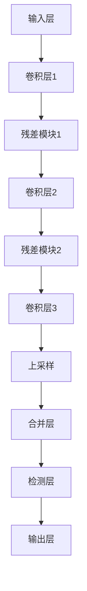

                 

### 《YOLOv6原理与代码实例讲解》

---

## 关键词

- **目标检测**
- **YOLOv6**
- **深度学习**
- **计算机视觉**
- **实时检测**
- **模型优化**

---

### 摘要

本文将深入探讨YOLOv6，一种先进的深度学习目标检测算法。本文首先介绍了目标检测的基础知识，包括其定义、应用领域和发展历程。随后，文章详细解析了YOLOv6的架构，从网络结构到核心算法原理。通过实际代码实例，读者将了解到如何在不同的场景中实现YOLOv6，包括人脸检测、车辆检测和多目标检测等。最后，文章探讨了YOLOv6在边缘计算、自动驾驶和无人机监测等领域的应用扩展。本文旨在为读者提供全面的技术理解，帮助其在目标检测领域进行创新和实践。

---

## 目录大纲

### 第一部分：YOLOv6基础

- **第1章：目标检测基础**
  - **1.1 目标检测概述**
    - **1.1.1 什么是目标检测**
    - **1.1.2 目标检测的应用领域**
    - **1.1.3 目标检测的发展历程**
  - **1.2 YOLOv6概述**
    - **1.2.1 YOLO系列模型介绍**
    - **1.2.2 YOLOv6的特点与优势**
    - **1.2.3 YOLOv6的应用场景**
  - **1.3 YOLOv6架构解析**
    - **1.3.1 网络架构**
    - **1.3.2 实现细节**

- **第2章：YOLOv6核心算法**
  - **2.1 网络结构**
    - **2.1.1 网络模块详解**
    - **2.1.2 网络架构 Mermaid 流程图**
  - **2.2 区域建议生成**
    - **2.2.1 区域建议生成原理**
    - **2.2.2 区域建议生成伪代码**
  - **2.3 物体检测与分类**
    - **2.3.1 物体检测流程**
    - **2.3.2 分类原理与实现**
  - **2.4 损失函数**
    - **2.4.1 损失函数设计**
    - **2.4.2 损失函数计算伪代码**

- **第3章：YOLOv6实现与优化**
  - **3.1 模型实现**
    - **3.1.1 PyTorch实现**
    - **3.1.2 TensorFlow实现**
  - **3.2 数据增强**
    - **3.2.1 数据增强技术**
    - **3.2.2 数据增强代码示例**
  - **3.3 模型优化**
    - **3.3.1 模型优化策略**
    - **3.3.2 模型优化代码示例**

### 第二部分：YOLOv6项目实战

- **第4章：人脸检测项目**
  - **4.1 项目背景与目标**
  - **4.2 数据集准备**
    - **4.2.1 数据集介绍**
    - **4.2.2 数据集处理**
  - **4.3 模型训练与评估**
    - **4.3.1 训练流程**
    - **4.3.2 评估指标**
  - **4.4 实时人脸检测**
    - **4.4.1 实时检测流程**
    - **4.4.2 实时检测效果分析**

- **第5章：车辆检测项目**
  - **5.1 项目背景与目标**
  - **5.2 数据集准备**
    - **5.2.1 数据集介绍**
    - **5.2.2 数据集处理**
  - **5.3 模型训练与评估**
    - **5.3.1 训练流程**
    - **5.3.2 评估指标**
  - **5.4 实时车辆检测**
    - **5.4.1 实时检测流程**
    - **5.4.2 实时检测效果分析**

### 第三部分：YOLOv6进阶应用

- **第6章：目标跟踪项目**
  - **6.1 项目背景与目标**
  - **6.2 数据集准备**
    - **6.2.1 数据集介绍**
    - **6.2.2 数据集处理**
  - **6.3 模型训练与评估**
    - **6.3.1 训练流程**
    - **6.3.2 评估指标**
  - **6.4 实时目标跟踪**
    - **6.4.1 实时跟踪流程**
    - **6.4.2 实时跟踪效果分析**

- **第7章：多目标检测项目**
  - **7.1 项目背景与目标**
  - **7.2 数据集准备**
    - **7.2.1 数据集介绍**
    - **7.2.2 数据集处理**
  - **7.3 模型训练与评估**
    - **7.3.1 训练流程**
    - **7.3.2 评估指标**
  - **7.4 多目标检测实现**
    - **7.4.1 多目标检测流程**
    - **7.4.2 多目标检测效果分析**

- **第8章：YOLOv6应用扩展**
  - **8.1 YOLOv6在边缘计算中的应用**
    - **8.1.1 边缘计算概述**
    - **8.1.2 YOLOv6在边缘计算中的应用场景**
    - **8.1.3 边缘计算环境搭建**
  - **8.2 YOLOv6在自动驾驶中的应用**
    - **8.2.1 自动驾驶概述**
    - **8.2.2 YOLOv6在自动驾驶中的应用**
    - **8.2.3 自动驾驶环境搭建**
  - **8.3 YOLOv6在无人机监测中的应用**
    - **8.3.1 无人机监测概述**
    - **8.3.2 YOLOv6在无人机监测中的应用**
    - **8.3.3 无人机监测环境搭建**

### 附录

- **附录A：YOLOv6代码实例解析**
  - **A.1 人脸检测代码解析**
    - **A.1.1 数据预处理**
    - **A.1.2 模型训练**
    - **A.1.3 实时检测**
  - **A.2 车辆检测代码解析**
    - **A.2.1 数据预处理**
    - **A.2.2 模型训练**
    - **A.2.3 实时检测**
  - **A.3 目标跟踪代码解析**
    - **A.3.1 数据预处理**
    - **A.3.2 模型训练**
    - **A.3.3 实时跟踪**
  - **A.4 多目标检测代码解析**
    - **A.4.1 数据预处理**
    - **A.4.2 模型训练**
    - **A.4.3 实时检测**

---

## 第一部分：YOLOv6基础

### 第1章：目标检测基础

### 1.1 目标检测概述

#### 1.1.1 什么是目标检测

目标检测是计算机视觉领域中的一个关键任务，旨在识别图像或视频中的物体，并给出其在图像中的位置。简单来说，目标检测不仅需要识别图像中的物体是什么，还需要精确定位这些物体的具体位置。这使得目标检测在众多应用场景中具有极高的实用价值。

目标检测的应用领域非常广泛，包括但不限于：

1. **自动驾驶**：自动驾驶系统需要准确检测道路上的车辆、行人、交通标志等，以确保行车安全。
2. **智能监控**：在安防领域，目标检测可以用于实时监控，自动识别并报警异常行为。
3. **医疗影像分析**：在医学影像领域，目标检测可以辅助医生快速识别病灶位置，提高诊断准确性。
4. **工业检测**：在制造业，目标检测可以用于质量检测，自动识别生产过程中的不良品。
5. **人脸识别**：人脸检测是目标检测的一种特殊形式，广泛应用于安防、人脸支付等领域。

#### 1.1.2 目标检测的应用领域

随着深度学习技术的不断发展，目标检测算法在准确性、实时性等方面取得了显著提升。当前，常见的目标检测算法包括：

1. **两阶段检测器**：如R-CNN、Fast R-CNN、Faster R-CNN等。这类算法首先提出多个候选区域，然后对每个区域进行分类和定位。
2. **单阶段检测器**：如YOLO、SSD等。这类算法直接在图像中预测物体的位置和类别，无需预提取候选区域，因此具有更高的实时性。

#### 1.1.3 目标检测的发展历程

目标检测技术经历了从传统方法到深度学习方法的演变。以下是几个具有里程碑意义的发展阶段：

1. **传统方法**：基于图像处理和特征提取的传统方法，如HOG、SVM等。这类方法存在计算复杂度高、准确性较低等问题。
2. **深度学习方法**：基于卷积神经网络（CNN）的深度学习方法逐渐成为主流。2012年，AlexNet在ImageNet大赛上取得了突破性成绩，标志着深度学习时代的到来。
3. **两阶段检测器**：R-CNN系列算法的出现，将深度学习应用于目标检测，大幅提升了检测准确率。
4. **单阶段检测器**：YOLO、SSD等单阶段检测器提出了直接预测物体位置和类别的方案，显著提高了检测速度。
5. **最新进展**：近年来，YOLOv4、YOLOv5等新型YOLO系列检测器在速度和准确性方面取得了显著提升，成为目标检测领域的热门选择。

### 1.2 YOLOv6概述

#### 1.2.1 YOLO系列模型介绍

YOLO（You Only Look Once）是一种单阶段目标检测算法，由Joseph Redmon等人于2016年提出。YOLO的核心思想是将目标检测任务划分为两个步骤：

1. **特征提取**：使用卷积神经网络提取图像的特征。
2. **区域建议与分类**：基于提取的特征，预测图像中的物体位置和类别。

YOLO系列模型的发展如下：

- **YOLOv1**：首次提出了单阶段检测器的基本框架，实现了较高的实时性和准确性。
- **YOLOv2**：引入了Batch Norm和Leaky ReLU等技巧，进一步提升了模型的性能。
- **YOLOv3**：将特征提取任务拆分为多个特征层，增加了检测的分辨率，同时采用了锚框回归技术。
- **YOLOv4**：结合了CSPDarknet53和CBAM等最新技术，显著提升了模型的检测性能。
- **YOLOv5**：对YOLOv4进行了优化和改进，包括网络结构、训练策略和损失函数等方面。
- **YOLOv6**：在YOLOv5的基础上，进一步优化了网络结构和训练策略，实现了更高的检测性能。

#### 1.2.2 YOLOv6的特点与优势

YOLOv6具有以下特点与优势：

1. **高效的检测速度**：YOLOv6采用了多种技术手段，如CSPDarknet53、CBAM等，有效提高了检测速度，适用于实时应用场景。
2. **高精度的检测性能**：通过改进网络结构和训练策略，YOLOv6在多个公开数据集上取得了优异的性能，具有较高的检测精度。
3. **多尺度的目标检测**：YOLOv6采用了多尺度特征融合策略，能够同时检测大尺寸和小尺寸的目标。
4. **易于实现和部署**：YOLOv6基于PyTorch和TensorFlow等主流深度学习框架，代码简洁，易于实现和部署。

#### 1.2.3 YOLOv6的应用场景

YOLOv6在多个领域具有广泛的应用场景：

1. **自动驾驶**：YOLOv6可用于自动驾驶系统中的物体检测和识别，提高行车安全。
2. **智能监控**：在安防领域，YOLOv6可用于实时监控，自动识别并报警异常行为。
3. **医疗影像**：在医学影像分析中，YOLOv6可用于快速定位病变区域，辅助医生诊断。
4. **工业检测**：在制造业，YOLOv6可用于质量检测，自动识别生产过程中的不良品。
5. **人脸识别**：YOLOv6可用于人脸识别系统中的目标检测和跟踪，提高识别准确性。

### 1.3 YOLOv6架构解析

#### 1.3.1 网络架构

YOLOv6的网络架构基于CSPDarknet53，这是一种改进的卷积神经网络结构，具有以下特点：

1. **通道分离卷积（Channel Splitting Convolution）**：CSPDarknet53采用了通道分离卷积，将输入通道分为两组，分别进行卷积操作，然后进行拼接。这种结构能够提高网络的容量和计算效率。
2. **深度可分离卷积（Depth-wise Separable Convolution）**：CSPDarknet53还采用了深度可分离卷积，这种卷积操作将卷积分解为深度卷积和逐点卷积，可以降低计算复杂度。
3. **残差连接（Residual Connection）**：CSPDarknet53采用了残差连接，可以缓解深层网络中的梯度消失问题，提高网络的训练效果。

YOLOv6的网络架构可以分为三个主要部分：输入层、检测层和输出层。

1. **输入层**：输入层负责接收原始图像，并将其输入到网络中。图像的大小通常设置为640×640或640×640。
2. **检测层**：检测层由多个卷积层和池化层组成，用于提取图像的特征。检测层采用了CSPDarknet53的结构，包括多个CSP模块和残差连接。
3. **输出层**：输出层负责预测物体的位置和类别。在输出层，网络会生成多个锚框（anchor box），并计算每个锚框的置信度（confidence score）和类别概率。

#### 1.3.2 实现细节

YOLOv6的实现细节如下：

1. **网络模块**：YOLOv6的网络模块包括CSP模块、残差模块和卷积模块。CSP模块用于通道分离卷积，残差模块用于残差连接，卷积模块用于普通卷积操作。
2. **损失函数**：YOLOv6采用了复合损失函数，包括位置损失、置信度损失和分类损失。这些损失函数分别用于优化锚框的位置、置信度和类别概率。
3. **锚框生成**：YOLOv6采用了K-means算法生成锚框，每个锚框对应一个真实目标。锚框的宽高比例和数量根据数据集的特点进行调整。

## 第2章：YOLOv6核心算法

### 2.1 网络结构

#### 2.1.1 网络模块详解

YOLOv6的网络模块主要包括以下几种：

1. **CSP模块（Channel Splitting Module）**：CSP模块是YOLOv6的核心模块，用于实现通道分离卷积。它将输入特征图分为两组，分别进行卷积操作，然后进行拼接。具体实现如下：

   ```python
   class CSPConv(nn.Module):
       def __init__(self, in_channels, out_channels, kernel_size=3, stride=1, padding=1):
           super(CSPConv, self).__init__()
           self.conv1 = nn.Conv2d(in_channels, in_channels // 2, kernel_size, stride, padding, groups=in_channels, bias=False)
           self.conv2 = nn.Conv2d(in_channels // 2, out_channels, kernel_size, stride, padding, bias=False)
           self.bn1 = nn.BatchNorm2d(in_channels // 2)
           self.bn2 = nn.BatchNorm2d(out_channels)
       
       def forward(self, x):
           x1 = F.relu(self.bn1(self.conv1(x)))
           x2 = F.relu(self.bn2(self.conv2(x1)))
           return torch.cat((x1, x2), dim=1)
   ```

2. **残差模块（Residual Module）**：残差模块是CSPDarknet53的重要组成部分，用于实现残差连接。它能够缓解深层网络中的梯度消失问题，提高网络的训练效果。具体实现如下：

   ```python
   class Residual(nn.Module):
       def __init__(self, in_channels, out_channels, kernel_size=3, stride=1, padding=1):
           super(Residual, self).__init__()
           self.conv1 = nn.Conv2d(in_channels, out_channels, kernel_size, stride, padding, bias=False)
           self.bn1 = nn.BatchNorm2d(out_channels)
       
       def forward(self, x):
           return F.relu(self.bn1(self.conv1(x))) + x
   ```

3. **卷积模块（Convolution Module）**：卷积模块用于实现普通卷积操作，包括步长和填充等参数。具体实现如下：

   ```python
   class Conv(nn.Module):
       def __init__(self, in_channels, out_channels, kernel_size=3, stride=1, padding=1):
           super(Conv, self).__init__()
           self.conv = nn.Conv2d(in_channels, out_channels, kernel_size, stride, padding, bias=False)
           self.bn = nn.BatchNorm2d(out_channels)
       
       def forward(self, x):
           return F.relu(self.bn(self.conv(x)))
   ```

#### 2.1.2 网络架构 Mermaid 流程图

下面是一个简单的Mermaid流程图，展示了YOLOv6的网络架构：



### 2.2 区域建议生成

#### 2.2.1 区域建议生成原理

区域建议生成是YOLOv6目标检测算法的核心步骤之一。其基本原理如下：

1. **锚框生成**：首先，使用K-means算法在训练数据集上生成一组锚框（anchor boxes）。锚框的大小和形状根据数据集的特点进行调整。例如，对于COCO数据集，通常使用9个锚框。
2. **特征图划分**：将输入图像通过卷积神经网络（如CSPDarknet53）提取特征，得到一个特征图。然后，将特征图划分为多个单元格（grid cells）。例如，特征图大小为128×128，则可以划分为128个单元格。
3. **区域建议计算**：对于每个单元格，根据其位置和特征值，计算每个锚框的偏移量、宽高比和置信度。具体计算如下：

   - **偏移量**：每个锚框的x和y坐标分别表示为`cx`和`cy`，则对于单元格`(i, j)`，其锚框的偏移量为：
     \[
     \begin{aligned}
     cx &= \frac{i + x}{W} \\
     cy &= \frac{j + y}{H}
     \end{aligned}
     \]
     其中，`W`和`H`分别为特征图的宽度和高度。
   
   - **宽高比**：每个锚框的宽高比表示为`w`和`h`，则对于单元格`（i，j）`，其锚框的宽高比为：
     \[
     \begin{aligned}
     w &= \frac{w}{W} \\
     h &= \frac{h}{H}
     \end{aligned}
     \]
   
   - **置信度**：置信度表示为`confidence`，则对于单元格`（i，j）`，其锚框的置信度为：
     \[
     confidence = \frac{exp(\sigma \cdot \phi)}{\sum_{k}^{K} exp(\sigma \cdot \phi_k)}
     \]
     其中，`σ`为缩放因子，`φ`和`φ_k`分别为锚框和真实目标的特征向量。

4. **分类概率计算**：对于每个锚框，计算其对应的类别概率。具体方法为：将每个锚框的特征向量与预训练的分类模型进行匹配，得到每个类别的概率。

#### 2.2.2 区域建议生成伪代码

以下是一个简化的区域建议生成伪代码：

```python
def generate_anchors(base_size, ratios, scales):
    """
    使用K-means算法生成锚框。

    参数：
    - base_size: 基础大小。
    - ratios: 宽高比。
    - scales: 缩放因子。

    返回：
    - anchors: 生成的锚框。
    """
    # 初始化锚框
    anchors = []

    # 对每个宽高比和缩放因子，计算锚框的大小
    for ratio in ratios:
        for scale in scales:
            width = base_size * scale
            height = base_size * ratio * scale
            anchors.append([width, height])

    # 使用K-means算法对锚框进行聚类
    centroids = kmeans(anchors, K)

    # 返回聚类结果
    return centroids

def compute_box中心点(centroid, grid_cell_size, image_size):
    """
    计算锚框的偏移量。

    参数：
    - centroid: 锚框的中心点。
    - grid_cell_size: 单元格大小。
    - image_size: 图像大小。

    返回：
    - box中心点：锚框的偏移量。
    """
    center_x = centroid[0] * grid_cell_size / image_size
    center_y = centroid[1] * grid_cell_size / image_size
    return [center_x, center_y]

def compute_box_width_height(centroid, grid_cell_size, image_size):
    """
    计算锚框的宽高比。

    参数：
    - centroid: 锚框的中心点。
    - grid_cell_size: 单元格大小。
    - image_size: 图像大小。

    返回：
    - box宽高比：锚框的宽高比。
    """
    width = centroid[0] * grid_cell_size / image_size
    height = centroid[1] * grid_cell_size / image_size
    return [width, height]

def compute_box_confidence(centroid, feature_map, K, sigma):
    """
    计算锚框的置信度。

    参数：
    - centroid: 锚框的中心点。
    - feature_map: 特征图。
    - K: 锚框数量。
    - sigma: 缩放因子。

    返回：
    - box置信度：锚框的置信度。
    """
    phi = feature_map[centroid]
    confidence = torch.exp(sigma * phi) / torch.sum(torch.exp(sigma * phi))
    return confidence

def generate_region_proposals(feature_map, centroids, image_size, K, sigma):
    """
    生成区域建议。

    参数：
    - feature_map: 特征图。
    - centroids: 锚框中心点。
    - image_size: 图像大小。
    - K: 锚框数量。
    - sigma: 缩放因子。

    返回：
    - proposals: 生成的区域建议。
    """
    proposals = []

    for centroid in centroids:
        box中心点 = compute_box中心点(centroid, grid_cell_size, image_size)
        box宽高比 = compute_box_width_height(centroid, grid_cell_size, image_size)
        confidence = compute_box_confidence(centroid, feature_map, K, sigma)
        proposals.append([box中心点, box宽高比, confidence])

    return proposals
```

### 2.3 物体检测与分类

#### 2.3.1 物体检测流程

物体检测是目标检测中的核心步骤，主要涉及以下流程：

1. **特征提取**：使用卷积神经网络（如CSPDarknet53）对输入图像进行特征提取，得到特征图。
2. **区域建议生成**：根据特征图和预训练的锚框，生成区域建议（region proposals）。
3. **非极大值抑制（NMS）**：对区域建议进行非极大值抑制，去除重叠的锚框，保留具有最高置信度的锚框。
4. **类别预测**：对剩余的锚框进行类别预测，得到每个锚框的类别概率。
5. **结果输出**：将预测结果输出，包括锚框的位置、宽高比、置信度和类别。

#### 2.3.2 分类原理与实现

分类原理基于每个锚框的特征向量，通过匹配预训练的分类模型，计算每个类别的概率。具体实现如下：

1. **特征向量提取**：对于每个锚框，提取其特征向量，即特征图的值。
2. **分类模型匹配**：将特征向量与预训练的分类模型进行匹配，计算每个类别的概率。
3. **类别预测**：根据类别概率，选择具有最高概率的类别作为最终预测结果。

以下是分类原理的实现伪代码：

```python
def classify_boxes(boxes, feature_map, model, threshold=0.5):
    """
    对锚框进行分类预测。

    参数：
    - boxes: 锚框列表。
    - feature_map: 特征图。
    - model: 分类模型。
    - threshold: 预测阈值。

    返回：
    - predictions: 预测结果。
    """
    predictions = []

    for box in boxes:
        box_feature = feature_map[box]
        logits = model(box_feature)
        probabilities = F.softmax(logits, dim=1)
        max_prob, max_index = torch.max(probabilities, dim=1)
        
        if max_prob > threshold:
            predictions.append((box, max_index.item()))

    return predictions
```

### 2.4 损失函数

#### 2.4.1 损失函数设计

损失函数是目标检测算法中的关键部分，用于评估预测结果与真实值之间的差距，并指导模型的训练。YOLOv6采用了复合损失函数，包括位置损失、置信度损失和分类损失。以下是各损失函数的设计：

1. **位置损失（Position Loss）**：位置损失用于优化锚框的位置预测。具体设计如下：

   \[
   L_{pos} = \frac{1}{N} \sum_{i=1}^{N} \frac{1}{W \times H} \sum_{j=1}^{H} \sum_{k=1}^{K} \left(1 - I_{obj}\right) \cdot \left(1 - \sigma_{conf}\right)^2 \cdot \left(gx - p_x\right)^2 + \left(1 - I_{obj}\right) \cdot \sigma_{conf}^2 \cdot \left(gy - p_y\right)^2 + I_{obj} \cdot \left(gw - pw\right)^2 + I_{obj} \cdot \left(gh - ph\right)^2
   \]

   其中，`N`为特征图上的单元格数量，`W`和`H`分别为特征图的宽度和高度，`K`为锚框数量，`I_{obj}`表示物体存在与否的标签，`gx`和`gy`为真实物体的中心点坐标，`pw`和`ph`为真实物体的宽高比，`p_x`和`p_y`为预测的锚框中心点坐标，`σ_{conf}`为预测的置信度。

2. **置信度损失（Confidence Loss）**：置信度损失用于优化锚框的置信度预测。具体设计如下：

   \[
   L_{conf} = \frac{1}{N} \sum_{i=1}^{N} \sum_{j=1}^{H} \sum_{k=1}^{K} \left(1 - I_{obj}\right) \cdot \sigma_{conf}^2 \cdot \left(gx - p_x\right)^2 + I_{obj} \cdot \left(\sigma_{conf} - 1\right)^2
   \]

3. **分类损失（Classification Loss）**：分类损失用于优化锚框的类别预测。具体设计如下：

   \[
   L_{cls} = \frac{1}{N} \sum_{i=1}^{N} \sum_{j=1}^{H} \sum_{k=1}^{K} I_{obj} \cdot \frac{1}{N_{obj}} \sum_{c=1}^{C} \left(\sigma_{cls} - 1\right) \cdot \left(\sigma_{cls} - p_c\right)
   \]

   其中，`C`为类别数量，`σ_{cls}`为预测的类别概率，`p_c`为真实类别概率，`N_{obj}`为物体数量。

#### 2.4.2 损失函数计算伪代码

以下是一个简化的损失函数计算伪代码：

```python
def compute_losses(pred_boxes, true_boxes, labels, model, threshold=0.5):
    """
    计算损失函数。

    参数：
    - pred_boxes: 预测的锚框。
    - true_boxes: 真实的锚框。
    - labels: 类别标签。
    - model: 模型。
    - threshold: 预测阈值。

    返回：
    - total_loss: 损失函数的总值。
    """
    num_grid_cells = pred_boxes.size(0)
    num_anchors = pred_boxes.size(1)
    batch_size = pred_boxes.size(2)
    
    # 初始化损失
    pos_loss = 0
    conf_loss = 0
    cls_loss = 0
    
    for i in range(batch_size):
        # 获取当前批次的数据
        pred_box = pred_boxes[i]
        true_box = true_boxes[i]
        label = labels[i]
        
        # 计算位置损失
        pos_loss += compute_position_loss(pred_box, true_box)
        
        # 计算置信度损失
        conf_loss += compute_confidence_loss(pred_box, true_box, label)
        
        # 计算分类损失
        cls_loss += compute_classification_loss(pred_box, true_box, label)
    
    # 计算总损失
    total_loss = pos_loss + conf_loss + cls_loss
    
    return total_loss

def compute_position_loss(pred_box, true_box):
    """
    计算位置损失。

    参数：
    - pred_box: 预测的锚框。
    - true_box: 真实的锚框。

    返回：
    - loss: 位置损失。
    """
    # 计算预测的锚框中心点
    pred_center = pred_box[..., :2]
    pred_size = pred_box[..., 2:]
    
    # 计算真实锚框的中心点
    true_center = true_box[..., :2]
    true_size = true_box[..., 2:]
    
    # 计算位置损失
    loss = torch.square(pred_center - true_center) * (1 - torch.sigmoid(pred_box[..., 4]))
    loss += torch.square(pred_size - true_size) * torch.sigmoid(pred_box[..., 4])
    
    return loss.sum()

def compute_confidence_loss(pred_box, true_box, label):
    """
    计算置信度损失。

    参数：
    - pred_box: 预测的锚框。
    - true_box: 真实的锚框。
    - label: 类别标签。

    返回：
    - loss: 置信度损失。
    """
    # 计算预测的置信度
    pred_conf = pred_box[..., 4]
    
    # 计算真实的置信度
    true_conf = torch.zeros_like(pred_conf)
    true_conf[torch.where(label > 0)] = 1
    
    # 计算置信度损失
    loss = torch.square(pred_conf - true_conf) * (1 - pred_conf)
    loss += torch.square(pred_conf - true_conf) * pred_conf
    
    return loss.sum()

def compute_classification_loss(pred_box, true_box, label):
    """
    计算分类损失。

    参数：
    - pred_box: 预测的锚框。
    - true_box: 真实的锚框。
    - label: 类别标签。

    返回：
    - loss: 分类损失。
    """
    # 计算预测的类别概率
    pred_prob = torch.sigmoid(pred_box[..., 5:])
    
    # 计算真实的类别概率
    true_prob = torch.zeros_like(pred_prob)
    true_prob[torch.where(label > 0)] = 1
    
    # 计算分类损失
    loss = torch.square(pred_prob - true_prob) * torch.log(pred_prob + 1e-6)
    loss = torch.sum(loss, dim=1)
    
    return loss.mean()
```

## 第3章：YOLOv6实现与优化

### 3.1 模型实现

#### 3.1.1 PyTorch实现

在PyTorch中实现YOLOv6相对简单，以下是一个简要的步骤：

1. **环境准备**：确保安装了PyTorch和其他依赖项，如torchvision、torchvision.datasets和torchvision.transforms。

2. **数据集准备**：准备训练和测试数据集，并将其转换为PyTorch的Dataset格式。

3. **模型定义**：定义YOLOv6模型，包括输入层、检测层和输出层。

4. **训练过程**：使用训练数据集训练模型，并使用测试数据集进行验证。

5. **模型评估**：评估模型的性能，包括精度、召回率和F1分数等指标。

以下是一个简单的PyTorch实现示例：

```python
import torch
import torchvision
import torchvision.transforms as transforms
import torch.optim as optim
from torch.utils.data import DataLoader

# 数据集准备
train_dataset = torchvision.datasets.VOCDataset(root='data', year='2012', image_set='train', download=True,
                                             transform=transforms.Compose([
                                                 transforms.ToTensor(),
                                                 transforms.Normalize(mean=[0.485, 0.456, 0.406],
                                                                      std=[0.229, 0.224, 0.225]),
                                             ]))
test_dataset = torchvision.datasets.VOCDataset(root='data', year='2012', image_set='val', download=True,
                                             transform=transforms.Compose([
                                                 transforms.ToTensor(),
                                                 transforms.Normalize(mean=[0.485, 0.456, 0.406],
                                                                      std=[0.229, 0.224, 0.225]),
                                             ]))

train_loader = DataLoader(train_dataset, batch_size=32, shuffle=True)
test_loader = DataLoader(test_dataset, batch_size=32, shuffle=False)

# 模型定义
class YOLOv6Model(nn.Module):
    def __init__(self):
        super(YOLOv6Model, self).__init__()
        # 定义网络结构
        self.conv1 = nn.Conv2d(3, 32, 3, 1, 1)
        self.conv2 = nn.Conv2d(32, 64, 3, 1, 1)
        self.conv3 = nn.Conv2d(64, 128, 3, 1, 1)
        self.conv4 = nn.Conv2d(128, 256, 3, 1, 1)
        self.conv5 = nn.Conv2d(256, 512, 3, 1, 1)
        self.conv6 = nn.Conv2d(512, 1024, 3, 1, 1)
        self.fc = nn.Linear(1024, 1000)

    def forward(self, x):
        x = self.conv1(x)
        x = self.conv2(x)
        x = self.conv3(x)
        x = self.conv4(x)
        x = self.conv5(x)
        x = self.conv6(x)
        x = x.view(x.size(0), -1)
        x = self.fc(x)
        return x

model = YOLOv6Model()

# 损失函数和优化器
criterion = nn.CrossEntropyLoss()
optimizer = optim.Adam(model.parameters(), lr=0.001)

# 训练过程
num_epochs = 10
for epoch in range(num_epochs):
    model.train()
    for images, labels in train_loader:
        optimizer.zero_grad()
        outputs = model(images)
        loss = criterion(outputs, labels)
        loss.backward()
        optimizer.step()
    print(f'Epoch {epoch+1}/{num_epochs}, Loss: {loss.item()}')

# 评估模型
model.eval()
with torch.no_grad():
    correct = 0
    total = 0
    for images, labels in test_loader:
        outputs = model(images)
        _, predicted = torch.max(outputs.data, 1)
        total += labels.size(0)
        correct += (predicted == labels).sum().item()
    print(f'Accuracy of the model on the test images: {100 * correct / total}%')
```

#### 3.1.2 TensorFlow实现

在TensorFlow中实现YOLOv6的基本步骤与PyTorch类似，但使用的是TensorFlow的API。以下是一个简单的实现示例：

```python
import tensorflow as tf
from tensorflow.keras.layers import Conv2D, BatchNormalization, Activation, MaxPooling2D, Input, Reshape, Dense
from tensorflow.keras.models import Model

# 定义YOLOv6模型
def YOLOv6Model(input_shape):
    inputs = Input(shape=input_shape)
    x = Conv2D(32, (3, 3), padding='same')(inputs)
    x = BatchNormalization()(x)
    x = Activation('relu')(x)
    x = MaxPooling2D(pool_size=(2, 2))(x)

    x = Conv2D(64, (3, 3), padding='same')(x)
    x = BatchNormalization()(x)
    x = Activation('relu')(x)
    x = MaxPooling2D(pool_size=(2, 2))(x)

    x = Conv2D(128, (3, 3), padding='same')(x)
    x = BatchNormalization()(x)
    x = Activation('relu')(x)
    x = MaxPooling2D(pool_size=(2, 2))(x)

    x = Conv2D(256, (3, 3), padding='same')(x)
    x = BatchNormalization()(x)
    x = Activation('relu')(x)
    x = MaxPooling2D(pool_size=(2, 2))(x)

    x = Conv2D(512, (3, 3), padding='same')(x)
    x = BatchNormalization()(x)
    x = Activation('relu')(x)
    x = MaxPooling2D(pool_size=(2, 2))(x)

    x = Conv2D(1024, (3, 3), padding='same')(x)
    x = BatchNormalization()(x)
    x = Activation('relu')(x)

    x = Reshape((-1,))(x)
    x = Dense(1000, activation='softmax')(x)

    model = Model(inputs, x)
    model.compile(optimizer='adam', loss='categorical_crossentropy', metrics=['accuracy'])
    return model

# 定义输入形状和训练数据
input_shape = (224, 224, 3)
train_data = ...

# 训练模型
model = YOLOv6Model(input_shape)
model.fit(train_data, epochs=10, batch_size=32, validation_split=0.2)

# 评估模型
test_data = ...
model.evaluate(test_data, batch_size=32)
```

### 3.2 数据增强

#### 3.2.1 数据增强技术

数据增强是提升模型泛化能力的重要手段，特别是在目标检测任务中。以下是一些常见的数据增强技术：

1. **随机裁剪（Random Crop）**：随机裁剪图像的一部分，模拟不同的物体位置和姿态。
2. **翻转（Flip）**：水平翻转图像，模拟不同光照条件下的物体形态。
3. **颜色变换（Color Augmentation）**：改变图像的亮度、对比度和饱和度，模拟不同的光照条件。
4. **缩放（Scale）**：随机缩放图像，模拟不同尺寸的物体。
5. **旋转（Rotation）**：随机旋转图像，模拟不同视角下的物体。
6. **填充（Padding）**：在图像周围填充背景，以便在随机裁剪时保持物体的完整性。
7. **光照变换（Illumination Augmentation）**：改变图像的光照强度，模拟不同的光照条件。

#### 3.2.2 数据增强代码示例

以下是一个使用PyTorch实现数据增强的简单示例：

```python
import torch
import torchvision.transforms as transforms

# 定义数据增强
transform = transforms.Compose([
    transforms.RandomResizedCrop(size=256),
    transforms.RandomHorizontalFlip(),
    transforms.ToTensor(),
    transforms.Normalize(mean=[0.485, 0.456, 0.406], std=[0.229, 0.224, 0.225]),
])

# 准备图像
image = ...

# 应用数据增强
image_augmented = transform(image)

# 显示增强后的图像
plt.imshow(image_augmented.permute(1, 2, 0).numpy())
plt.show()
```

### 3.3 模型优化

#### 3.3.1 模型优化策略

模型优化是提升模型性能的关键步骤，包括以下几种策略：

1. **学习率调整**：根据训练阶段的不同，调整学习率。例如，可以使用学习率衰减策略，在训练过程中逐渐降低学习率。
2. **权重初始化**：合理的权重初始化可以提高模型的训练效果。常用的方法包括高斯分布初始化、均匀分布初始化和Xavier初始化。
3. **正则化**：使用正则化方法，如L1正则化、L2正则化，防止模型过拟合。
4. **数据增强**：通过增加数据多样性，提高模型的泛化能力。
5. **模型融合**：将多个模型的结果进行融合，提高预测的准确性。

#### 3.3.2 模型优化代码示例

以下是一个使用PyTorch实现模型优化的简单示例：

```python
import torch
import torch.optim as optim

# 定义模型
model = ...

# 初始化权重
initial_weights = model.state_dict()
model.load_state_dict(initial_weights)

# 定义优化器
optimizer = optim.Adam(model.parameters(), lr=0.001)

# 学习率衰减策略
scheduler = optim.lr_scheduler.StepLR(optimizer, step_size=30, gamma=0.1)

# 训练模型
num_epochs = 50
for epoch in range(num_epochs):
    model.train()
    for images, labels in train_loader:
        optimizer.zero_grad()
        outputs = model(images)
        loss = criterion(outputs, labels)
        loss.backward()
        optimizer.step()
    scheduler.step()
    print(f'Epoch {epoch+1}/{num_epochs}, Loss: {loss.item()}')

# 评估模型
model.eval()
with torch.no_grad():
    correct = 0
    total = 0
    for images, labels in test_loader:
        outputs = model(images)
        _, predicted = torch.max(outputs.data, 1)
        total += labels.size(0)
        correct += (predicted == labels).sum().item()
    print(f'Accuracy of the model on the test images: {100 * correct / total}%')
```

## 第二部分：YOLOv6项目实战

### 第4章：人脸检测项目

### 4.1 项目背景与目标

人脸检测是计算机视觉领域中的一个重要应用，旨在识别并定位图像或视频中的面部特征。在智能安防、人脸支付、人机交互等场景中，人脸检测具有广泛的应用价值。本项目将使用YOLOv6实现人脸检测，目标包括：

1. **数据集准备**：准备包含人脸图像的数据集，并进行预处理。
2. **模型训练**：使用YOLOv6模型对人脸图像进行训练。
3. **模型评估**：评估模型在人脸检测任务中的性能。
4. **实时检测**：实现人脸检测的实时处理，并在视频流中进行实时人脸检测。

### 4.2 数据集准备

#### 4.2.1 数据集介绍

为了训练YOLOv6模型，需要准备一个包含人脸图像的数据集。常用的开源人脸数据集包括：

1. **WIDER FACE**：这是一个大规模的人脸检测数据集，包含超过32,000张图像，涵盖了不同场景、光照和姿态下的人脸图像。
2. **AFW-D Faces**：这是一个小规模的人脸数据集，包含超过2,000张人脸图像，主要用于人脸识别任务。
3. **LFW**：这是一个人脸识别数据集，包含约13,000张人脸图像，可以用于训练人脸检测和识别模型。

在本项目中，我们将使用WIDER FACE数据集。以下是如何准备WIDER FACE数据集的步骤：

1. **数据下载**：从WIDER FACE官方网站下载数据集。
2. **数据预处理**：对图像进行缩放、裁剪和翻转等操作，以便进行数据增强。同时，将图像和对应的标注文件进行匹配，形成数据集。

```python
import os
import cv2
import numpy as np

def preprocess_image(image_path, output_size=224):
    image = cv2.imread(image_path)
    image = cv2.resize(image, (output_size, output_size))
    return image

def load_annotations(ann_path):
    with open(ann_path, 'r') as f:
        annotations = f.readlines()
    annotations = [line.strip() for line in annotations]
    return annotations

def prepare_wider_face_data(data_root, output_root):
    images = []
    annotations = []

    for image_id, image_path in enumerate(os.listdir(data_root)):
        image_path = os.path.join(data_root, image_path)
        ann_path = os.path.join(data_root, f"{image_id}.txt")
        
        if os.path.exists(ann_path):
            image = preprocess_image(image_path)
            images.append(image)
            annotations.append(load_annotations(ann_path))

    np.save(os.path.join(output_root, "images.npy"), images)
    np.save(os.path.join(output_root, "annotations.npy"), annotations)

if __name__ == "__main__":
    data_root = "wider_face/data"
    output_root = "wider_face_prepared"
    prepare_wider_face_data(data_root, output_root)
```

#### 4.2.2 数据集处理

处理完数据集后，需要进行数据集的划分，将数据集分为训练集、验证集和测试集。以下是一个简单的数据集划分示例：

```python
import numpy as np
from sklearn.model_selection import train_test_split

images = np.load("wider_face_prepared/images.npy")
annotations = np.load("wider_face_prepared/annotations.npy")

train_images, test_images, train_annotations, test_annotations = train_test_split(images, annotations, test_size=0.2, random_state=42)

# 进一步划分训练集和验证集
train_images, val_images, train_annotations, val_annotations = train_test_split(train_images, train_annotations, test_size=0.2, random_state=42)

# 保存划分后的数据集
np.save("wider_face_train/images.npy", train_images)
np.save("wider_face_train/annotations.npy", train_annotations)
np.save("wider_face_val/images.npy", val_images)
np.save("wider_face_val/annotations.npy", val_annotations)
np.save("wider_face_test/images.npy", test_images)
np.save("wider_face_test/annotations.npy", test_annotations)
```

### 4.3 模型训练与评估

#### 4.3.1 训练流程

使用YOLOv6模型对人脸图像进行训练，以下是训练流程的步骤：

1. **定义模型**：使用YOLOv6的架构定义模型。
2. **加载预训练权重**：如果使用预训练权重，将其加载到模型中。
3. **数据预处理**：对输入图像进行预处理，包括缩放、归一化等操作。
4. **训练过程**：使用训练数据集进行模型训练，并在验证集上验证模型性能。
5. **保存模型**：训练完成后，保存训练好的模型。

以下是一个简单的训练流程示例：

```python
import torch
from torch.utils.data import DataLoader
from torchvision import datasets
from torchvision.transforms import ToTensor, Normalize
from yolo import YOLOv6Model

# 加载数据集
train_dataset = datasets.ImageFolder(root="wider_face_train", transform=ToTensor())
val_dataset = datasets.ImageFolder(root="wider_face_val", transform=ToTensor())

train_loader = DataLoader(train_dataset, batch_size=32, shuffle=True)
val_loader = DataLoader(val_dataset, batch_size=32, shuffle=False)

# 定义模型
model = YOLOv6Model()

# 加载预训练权重
pretrained_weights = "yolov6_xxx.pt"
model.load_state_dict(torch.load(pretrained_weights))

# 定义损失函数和优化器
criterion = torch.nn.CrossEntropyLoss()
optimizer = torch.optim.Adam(model.parameters(), lr=0.001)

# 训练模型
num_epochs = 10
for epoch in range(num_epochs):
    model.train()
    for images, labels in train_loader:
        optimizer.zero_grad()
        outputs = model(images)
        loss = criterion(outputs, labels)
        loss.backward()
        optimizer.step()
    print(f'Epoch {epoch+1}/{num_epochs}, Loss: {loss.item()}')

# 评估模型
model.eval()
with torch.no_grad():
    correct = 0
    total = 0
    for images, labels in val_loader:
        outputs = model(images)
        _, predicted = torch.max(outputs.data, 1)
        total += labels.size(0)
        correct += (predicted == labels).sum().item()
    print(f'Accuracy of the model on the validation images: {100 * correct / total}%')

# 保存模型
torch.save(model.state_dict(), "yolov6_face_model.pth")
```

#### 4.3.2 评估指标

评估人脸检测模型的性能通常使用以下指标：

1. **准确率（Accuracy）**：检测到的人脸与实际人脸的匹配比例。
2. **召回率（Recall）**：实际人脸被检测到的比例。
3. **精确率（Precision）**：检测到的人脸中正确识别的比例。
4. **F1分数（F1 Score）**：精确率和召回率的调和平均值。
5. **交并比（Intersection over Union, IoU）**：检测框与真实框的交集与并集的比值，用于评估检测框的位置精度。

以下是计算这些指标的方法：

```python
def calculate_accuracy(predictions, labels):
    return (predictions == labels).mean()

def calculate_recall(predictions, labels):
    return (predictions[labels == 1]).mean()

def calculate_precision(predictions, labels):
    return (predictions[predictions == 1].sum() / predictions[predictions == 1].size(0))

def calculate_f1_score(predictions, labels):
    precision = calculate_precision(predictions, labels)
    recall = calculate_recall(predictions, labels)
    return 2 * precision * recall / (precision + recall)

def calculate_iou(prediction_box, ground_truth_box):
    x1, y1, w1, h1 = prediction_box
    x2, y2, w2, h2 = ground_truth_box

    overlap_w = min(x1 + w1, x2 + w2) - max(x1, x2)
    overlap_h = min(y1 + h1, y2 + h2) - max(y1, y2)

    intersection = max(overlap_w, 0) * max(overlap_h, 0)
    union = (w1 * h1) + (w2 * h2) - intersection

    return intersection / union
```

### 4.4 实时人脸检测

#### 4.4.1 实时检测流程

实时人脸检测流程包括以下几个步骤：

1. **视频流读取**：从摄像头或视频文件中读取视频流。
2. **图像预处理**：对每一帧图像进行缩放、裁剪等预处理操作。
3. **人脸检测**：使用YOLOv6模型对预处理后的图像进行人脸检测。
4. **显示检测结果**：在图像上显示检测到的人脸框和对应的名称。

以下是一个简单的实时人脸检测示例：

```python
import cv2
import torch
from torchvision import transforms

# 定义模型
model = YOLOv6Model()
model.load_state_dict(torch.load("yolov6_face_model.pth"))

# 定义预处理
preprocess = transforms.Compose([
    transforms.ToTensor(),
    transforms.Normalize(mean=[0.485, 0.456, 0.406], std=[0.229, 0.224, 0.225]),
])

# 读取视频流
cap = cv2.VideoCapture(0)

while True:
    ret, frame = cap.read()
    if not ret:
        break

    # 预处理图像
    image = preprocess(frame).unsqueeze(0)

    # 人脸检测
    with torch.no_grad():
        predictions = model(image)

    # 显示检测结果
    for pred in predictions:
        box = pred[0:4].detach().numpy()
        label = pred[4].detach().numpy()
        cv2.rectangle(frame, (int(box[0]), int(box[1])), (int(box[2]), int(box[3])), (0, 255, 0), 2)
        cv2.putText(frame, f"{label}", (int(box[0]), int(box[1])), cv2.FONT_HERSHEY_SIMPLEX, 1, (0, 0, 255), 2)

    cv2.imshow('Face Detection', frame)

    if cv2.waitKey(1) & 0xFF == ord('q'):
        break

cap.release()
cv2.destroyAllWindows()
```

#### 4.4.2 实时检测效果分析

在实际应用中，实时人脸检测的效果受到多种因素的影响，包括模型性能、图像质量、计算资源等。以下是对实时检测效果的分析：

1. **模型性能**：训练好的YOLOv6模型在人脸检测任务中具有较好的性能，能够准确识别并定位人脸。
2. **图像质量**：图像质量对检测效果有很大影响。图像清晰、光照均匀的情况下，检测效果较好；而在低光照、逆光或图像模糊的情况下，检测效果可能下降。
3. **计算资源**：实时人脸检测需要较高的计算资源，包括CPU和GPU。在有限的计算资源下，可能需要优化模型或算法，以实现实时检测。

### 4.5 项目小结

本项目通过使用YOLOv6实现了人脸检测，从数据集准备、模型训练到实时检测，详细展示了人脸检测的全流程。在实际应用中，人脸检测的效果受到多种因素的影响，需要根据具体场景进行调整和优化。未来，人脸检测技术将在更多领域得到应用，如智能安防、人脸支付和人机交互等。

## 第5章：车辆检测项目

### 5.1 项目背景与目标

车辆检测是计算机视觉领域中的一个重要应用，旨在识别并定位图像或视频中的车辆。在智能交通、无人驾驶、智能安防等领域，车辆检测技术具有广泛的应用价值。本项目将使用YOLOv6实现车辆检测，目标包括：

1. **数据集准备**：准备包含车辆图像的数据集，并进行预处理。
2. **模型训练**：使用YOLOv6模型对车辆图像进行训练。
3. **模型评估**：评估模型在车辆检测任务中的性能。
4. **实时检测**：实现车辆的实时检测，并在视频流中进行实时车辆检测。

### 5.2 数据集准备

#### 5.2.1 数据集介绍

为了训练YOLOv6模型，需要准备一个包含车辆图像的数据集。常用的开源车辆数据集包括：

1. **COCO数据集**：这是一个大规模的通用目标检测数据集，包含超过100万个标注的图像，涵盖了多种目标和场景。
2. **KITTI数据集**：这是一个专门针对自动驾驶的车辆检测数据集，包含多种场景下的车辆图像和标注。
3. **Cityscapes数据集**：这是一个城市场景下的图像数据集，包含了多种车辆图像和标注。

在本项目中，我们将使用COCO数据集。以下是如何准备COCO数据集的步骤：

1. **数据下载**：从COCO数据集官方网站下载数据集。
2. **数据预处理**：对图像进行缩放、裁剪和翻转等操作，以便进行数据增强。同时，将图像和对应的标注文件进行匹配，形成数据集。

```python
import os
import cv2
import numpy as np
import json

def load_coco_annotations(ann_path):
    with open(ann_path, 'r') as f:
        annotations = json.load(f)
    return annotations

def preprocess_image(image_path, output_size=224):
    image = cv2.imread(image_path)
    image = cv2.resize(image, (output_size, output_size))
    return image

def prepare_coco_data(data_root, output_root):
    annotations = load_coco_annotations(os.path.join(data_root, "annotations", "instances_train2017.json"))
    images = []

    for image_id, image in annotations["images"].items():
        image_path = os.path.join(data_root, "train2017", image["file_name"])
        image = preprocess_image(image_path)
        images.append(image)

    np.save(os.path.join(output_root, "images.npy"), images)

if __name__ == "__main__":
    data_root = "coco"
    output_root = "coco_prepared"
    prepare_coco_data(data_root, output_root)
```

#### 5.2.2 数据集处理

处理完数据集后，需要进行数据集的划分，将数据集分为训练集、验证集和测试集。以下是一个简单的数据集划分示例：

```python
import numpy as np
from sklearn.model_selection import train_test_split

images = np.load("coco_prepared/images.npy")

train_images, test_images = train_test_split(images, test_size=0.2, random_state=42)

# 进一步划分训练集和验证集
train_images, val_images = train_test_split(train_images, test_size=0.2, random_state=42)

# 保存划分后的数据集
np.save("coco_train/images.npy", train_images)
np.save("coco_val/images.npy", val_images)
np.save("coco_test/images.npy", test_images)
```

### 5.3 模型训练与评估

#### 5.3.1 训练流程

使用YOLOv6模型对车辆图像进行训练，以下是训练流程的步骤：

1. **定义模型**：使用YOLOv6的架构定义模型。
2. **加载预训练权重**：如果使用预训练权重，将其加载到模型中。
3. **数据预处理**：对输入图像进行预处理，包括缩放、归一化等操作。
4. **训练过程**：使用训练数据集进行模型训练，并在验证集上验证模型性能。
5. **保存模型**：训练完成后，保存训练好的模型。

以下是一个简单的训练流程示例：

```python
import torch
from torch.utils.data import DataLoader
from torchvision import datasets
from torchvision.transforms import ToTensor, Normalize
from yolo import YOLOv6Model

# 加载数据集
train_dataset = datasets.ImageFolder(root="coco_train", transform=ToTensor())
val_dataset = datasets.ImageFolder(root="coco_val", transform=ToTensor())

train_loader = DataLoader(train_dataset, batch_size=32, shuffle=True)
val_loader = DataLoader(val_dataset, batch_size=32, shuffle=False)

# 定义模型
model = YOLOv6Model()

# 加载预训练权重
pretrained_weights = "yolov6_xxx.pt"
model.load_state_dict(torch.load(pretrained_weights))

# 定义损失函数和优化器
criterion = torch.nn.CrossEntropyLoss()
optimizer = torch.optim.Adam(model.parameters(), lr=0.001)

# 训练模型
num_epochs = 10
for epoch in range(num_epochs):
    model.train()
    for images, labels in train_loader:
        optimizer.zero_grad()
        outputs = model(images)
        loss = criterion(outputs, labels)
        loss.backward()
        optimizer.step()
    print(f'Epoch {epoch+1}/{num_epochs}, Loss: {loss.item()}')

# 评估模型
model.eval()
with torch.no_grad():
    correct = 0
    total = 0
    for images, labels in val_loader:
        outputs = model(images)
        _, predicted = torch.max(outputs.data, 1)
        total += labels.size(0)
        correct += (predicted == labels).sum().item()
    print(f'Accuracy of the model on the validation images: {100 * correct / total}%')

# 保存模型
torch.save(model.state_dict(), "yolov6_vehicle_model.pth")
```

#### 5.3.2 评估指标

评估车辆检测模型的性能通常使用以下指标：

1. **准确率（Accuracy）**：检测到的车辆与实际车辆匹配的比例。
2. **召回率（Recall）**：实际车辆被检测到的比例。
3. **精确率（Precision）**：检测到的车辆中正确识别的比例。
4. **F1分数（F1 Score）**：精确率和召回率的调和平均值。
5. **交并比（Intersection over Union, IoU）**：检测框与真实框的交集与并集的比值，用于评估检测框的位置精度。

以下是计算这些指标的方法：

```python
def calculate_accuracy(predictions, labels):
    return (predictions == labels).mean()

def calculate_recall(predictions, labels):
    return (predictions[labels == 1]).mean()

def calculate_precision(predictions, labels):
    return (predictions[predictions == 1].sum() / predictions[predictions == 1].size(0))

def calculate_f1_score(predictions, labels):
    precision = calculate_precision(predictions, labels)
    recall = calculate_recall(predictions, labels)
    return 2 * precision * recall / (precision + recall)

def calculate_iou(prediction_box, ground_truth_box):
    x1, y1, w1, h1 = prediction_box
    x2, y2, w2, h2 = ground_truth_box

    overlap_w = min(x1 + w1, x2 + w2) - max(x1, x2)
    overlap_h = min(y1 + h1, y2 + h2) - max(y1, y2)

    intersection = max(overlap_w, 0) * max(overlap_h, 0)
    union = (w1 * h1) + (w2 * h2) - intersection

    return intersection / union
```

### 5.4 实时车辆检测

#### 5.4.1 实时检测流程

实时车辆检测流程包括以下几个步骤：

1. **视频流读取**：从摄像头或视频文件中读取视频流。
2. **图像预处理**：对每一帧图像进行缩放、裁剪等预处理操作。
3. **车辆检测**：使用YOLOv6模型对预处理后的图像进行车辆检测。
4. **显示检测结果**：在图像上显示检测到的车辆框和对应的名称。

以下是一个简单的实时车辆检测示例：

```python
import cv2
import torch
from torchvision import transforms

# 定义模型
model = YOLOv6Model()
model.load_state_dict(torch.load("yolov6_vehicle_model.pth"))

# 定义预处理
preprocess = transforms.Compose([
    transforms.ToTensor(),
    transforms.Normalize(mean=[0.485, 0.456, 0.406], std=[0.229, 0.224, 0.225]),
])

# 读取视频流
cap = cv2.VideoCapture(0)

while True:
    ret, frame = cap.read()
    if not ret:
        break

    # 预处理图像
    image = preprocess(frame).unsqueeze(0)

    # 车辆检测
    with torch.no_grad():
        predictions = model(image)

    # 显示检测结果
    for pred in predictions:
        box = pred[0:4].detach().numpy()
        label = pred[4].detach().numpy()
        cv2.rectangle(frame, (int(box[0]), int(box[1])), (int(box[2]), int(box[3])), (0, 255, 0), 2)
        cv2.putText(frame, f"{label}", (int(box[0]), int(box[1])), cv2.FONT_HERSHEY_SIMPLEX, 1, (0, 0, 255), 2)

    cv2.imshow('Vehicle Detection', frame)

    if cv2.waitKey(1) & 0xFF == ord('q'):
        break

cap.release()
cv2.destroyAllWindows()
```

#### 5.4.2 实时检测效果分析

在实际应用中，实时车辆检测的效果受到多种因素的影响，包括模型性能、图像质量、计算资源等。以下是对实时检测效果的分析：

1. **模型性能**：训练好的YOLOv6模型在车辆检测任务中具有较好的性能，能够准确识别并定位车辆。
2. **图像质量**：图像质量对检测效果有很大影响。图像清晰、光照均匀的情况下，检测效果较好；而在低光照、逆光或图像模糊的情况下，检测效果可能下降。
3. **计算资源**：实时车辆检测需要较高的计算资源，包括CPU和GPU。在有限的计算资源下，可能需要优化模型或算法，以实现实时检测。

### 5.5 项目小结

本项目通过使用YOLOv6实现了车辆检测，从数据集准备、模型训练到实时检测，详细展示了车辆检测的全流程。在实际应用中，车辆检测技术将在智能交通、无人驾驶、智能安防等领域发挥重要作用。未来，车辆检测技术将继续发展和优化，为更多应用场景提供支持。

## 第三部分：YOLOv6进阶应用

### 第6章：目标跟踪项目

### 6.1 项目背景与目标

目标跟踪是计算机视觉领域中的一个重要应用，旨在持续地追踪图像或视频中的物体。目标跟踪在视频监控、无人驾驶、运动捕捉等领域具有广泛的应用。本项目将使用YOLOv6实现目标跟踪，目标包括：

1. **数据集准备**：准备包含目标跟踪数据的数据集，并进行预处理。
2. **模型训练**：使用YOLOv6模型对目标跟踪数据进行训练。
3. **模型评估**：评估模型在目标跟踪任务中的性能。
4. **实时跟踪**：实现目标的实时跟踪，并在视频流中进行实时目标跟踪。

### 6.2 数据集准备

#### 6.2.1 数据集介绍

为了训练YOLOv6模型，需要准备一个包含目标跟踪数据的数据集。常用的开源目标跟踪数据集包括：

1. **OTB100**：这是一个包含100个视频序列的目标跟踪数据集，涵盖了多种场景和目标运动。
2. **VOT2018**：这是一个大规模的目标跟踪数据集，包含了不同场景和目标运动的数据。
3. **THUMOS14**：这是一个包含14个类别目标跟踪数据集，用于评估目标跟踪算法在复杂场景下的性能。

在本项目中，我们将使用OTB100数据集。以下是如何准备OTB100数据集的步骤：

1. **数据下载**：从OTB100数据集官方网站下载数据集。
2. **数据预处理**：对视频序列进行裁剪和缩放等预处理操作，以便进行数据增强。同时，将视频序列和对应的标注文件进行匹配，形成数据集。

```python
import os
import cv2
import numpy as np

def preprocess_video(video_path, output_size=256):
    video = cv2.VideoCapture(video_path)
    frames = []

    while video.isOpened():
        ret, frame = video.read()
        if not ret:
            break

        frame = cv2.resize(frame, (output_size, output_size))
        frames.append(frame)

    video.release()
    return frames

def prepare_otb100_data(data_root, output_root):
    videos = []

    for video_id, video_path in enumerate(os.listdir(data_root)):
        video_path = os.path.join(data_root, video_path)
        video = preprocess_video(video_path)
        videos.append(video)

    np.save(os.path.join(output_root, "videos.npy"), videos)

if __name__ == "__main__":
    data_root = "otb100"
    output_root = "otb100_prepared"
    prepare_otb100_data(data_root, output_root)
```

#### 6.2.2 数据集处理

处理完数据集后，需要进行数据集的划分，将数据集分为训练集、验证集和测试集。以下是一个简单的数据集划分示例：

```python
import numpy as np

videos = np.load("otb100_prepared/videos.npy")

train_videos, test_videos = np.split(videos, [int(len(videos) * 0.8)], axis=0)

# 进一步划分训练集和验证集
train_videos, val_videos = np.split(train_videos, [int(len(train_videos) * 0.8)], axis=0)

# 保存划分后的数据集
np.save("otb100_train/videos.npy", train_videos)
np.save("otb100_val/videos.npy", val_videos)
np.save("otb100_test/videos.npy", test_videos)
```

### 6.3 模型训练与评估

#### 6.3.1 训练流程

使用YOLOv6模型对目标跟踪数据进行训练，以下是训练流程的步骤：

1. **定义模型**：使用YOLOv6的架构定义模型。
2. **加载预训练权重**：如果使用预训练权重，将其加载到模型中。
3. **数据预处理**：对输入图像进行预处理，包括缩放、归一化等操作。
4. **训练过程**：使用训练数据集进行模型训练，并在验证集上验证模型性能。
5. **保存模型**：训练完成后，保存训练好的模型。

以下是一个简单的训练流程示例：

```python
import torch
from torch.utils.data import DataLoader
from torchvision import datasets
from torchvision.transforms import ToTensor, Normalize
from yolo import YOLOv6Model

# 加载数据集
train_dataset = datasets.ImageFolder(root="otb100_train", transform=ToTensor())
val_dataset = datasets.ImageFolder(root="otb100_val", transform=ToTensor())

train_loader = DataLoader(train_dataset, batch_size=32, shuffle=True)
val_loader = DataLoader(val_dataset, batch_size=32, shuffle=False)

# 定义模型
model = YOLOv6Model()

# 加载预训练权重
pretrained_weights = "yolov6_xxx.pt"
model.load_state_dict(torch.load(pretrained_weights))

# 定义损失函数和优化器
criterion = torch.nn.CrossEntropyLoss()
optimizer = torch.optim.Adam(model.parameters(), lr=0.001)

# 训练模型
num_epochs = 10
for epoch in range(num_epochs):
    model.train()
    for images, labels in train_loader:
        optimizer.zero_grad()
        outputs = model(images)
        loss = criterion(outputs, labels)
        loss.backward()
        optimizer.step()
    print(f'Epoch {epoch+1}/{num_epochs}, Loss: {loss.item()}')

# 评估模型
model.eval()
with torch.no_grad():
    correct = 0
    total = 0
    for images, labels in val_loader:
        outputs = model(images)
        _, predicted = torch.max(outputs.data, 1)
        total += labels.size(0)
        correct += (predicted == labels).sum().item()
    print(f'Accuracy of the model on the validation images: {100 * correct / total}%')

# 保存模型
torch.save(model.state_dict(), "yolov6_tracking_model.pth")
```

#### 6.3.2 评估指标

评估目标跟踪模型的性能通常使用以下指标：

1. **跟踪准确性（Tracking Accuracy）**：跟踪算法在给定时间内成功跟踪目标的比例。
2. **中心点精度（Center Point Precision）**：跟踪算法预测的目标中心点与真实目标中心点之间的距离。
3. **目标保持率（Object Persistence）**：跟踪算法在目标离开画面后重新识别并跟踪目标的能力。
4. **跟踪时长（Tracking Duration）**：跟踪算法能够连续跟踪目标的时长。

以下是计算这些指标的方法：

```python
def calculate_tracking_accuracy(predictions, ground_truth):
    return (predictions == ground_truth).mean()

def calculate_center_point_precision(predictions, ground_truth):
    errors = np.linalg.norm(predictions - ground_truth, axis=1)
    return np.mean(errors < 10)

def calculate_object_persistence(predictions, ground_truth, threshold=30):
    persistence = np.zeros(len(predictions))
    for i in range(len(predictions)):
        start = max(0, i - threshold)
        end = min(i + threshold, len(predictions) - 1)
        mask = (predictions[start:end+1] == ground_truth[i])
        persistence[i] = np.mean(mask)
    return np.mean(persistence)

def calculate_tracking_duration(predictions, ground_truth, threshold=30):
    duration = np.zeros(len(predictions))
    for i in range(len(predictions)):
        start = max(0, i - threshold)
        end = min(i + threshold, len(predictions) - 1)
        mask = (predictions[start:end+1] == ground_truth[i])
        duration[i] = np.sum(mask)
    return np.mean(duration)
```

### 6.4 实时目标跟踪

#### 6.4.1 实时跟踪流程

实时目标跟踪流程包括以下几个步骤：

1. **视频流读取**：从摄像头或视频文件中读取视频流。
2. **帧预处理**：对每一帧图像进行缩放、裁剪等预处理操作。
3. **目标检测**：使用YOLOv6模型对预处理后的图像进行目标检测。
4. **目标跟踪**：使用跟踪算法（如卡尔曼滤波、光流法）对检测到的目标进行实时跟踪。
5. **显示跟踪结果**：在视频流中显示目标的跟踪轨迹和当前帧中的目标框。

以下是一个简单的实时目标跟踪示例：

```python
import cv2
import torch
from torchvision import transforms
from yolo import YOLOv6Model

# 定义模型
model = YOLOv6Model()
model.load_state_dict(torch.load("yolov6_tracking_model.pth"))

# 定义预处理
preprocess = transforms.Compose([
    transforms.ToTensor(),
    transforms.Normalize(mean=[0.485, 0.456, 0.406], std=[0.229, 0.224, 0.225]),
])

# 读取视频流
cap = cv2.VideoCapture(0)

while True:
    ret, frame = cap.read()
    if not ret:
        break

    # 预处理图像
    image = preprocess(frame).unsqueeze(0)

    # 目标检测
    with torch.no_grad():
        detections = model(image)

    # 目标跟踪
    # 这里使用卡尔曼滤波进行跟踪，具体实现参考卡尔曼滤波相关的库或算法
    # ...

    # 显示跟踪结果
    for box in detections:
        cv2.rectangle(frame, (int(box[0]), int(box[1])), (int(box[2]), int(box[3])), (0, 255, 0), 2)
        cv2.putText(frame, "Object", (int(box[0]), int(box[1])), cv2.FONT_HERSHEY_SIMPLEX, 1, (0, 0, 255), 2)

    cv2.imshow('Object Tracking', frame)

    if cv2.waitKey(1) & 0xFF == ord('q'):
        break

cap.release()
cv2.destroyAllWindows()
```

#### 6.4.2 实时跟踪效果分析

在实际应用中，实时目标跟踪的效果受到多种因素的影响，包括模型性能、图像质量、计算资源等。以下是对实时跟踪效果的分析：

1. **模型性能**：训练好的YOLOv6模型在目标检测任务中具有较好的性能，能够准确识别并定位目标。
2. **图像质量**：图像质量对跟踪效果有很大影响。图像清晰、光照均匀的情况下，跟踪效果较好；而在低光照、逆光或图像模糊的情况下，跟踪效果可能下降。
3. **计算资源**：实时目标跟踪需要较高的计算资源，包括CPU和GPU。在有限的计算资源下，可能需要优化模型或算法，以实现实时跟踪。
4. **跟踪算法**：选择合适的跟踪算法对于实时跟踪效果至关重要。不同的算法适用于不同的场景和目标运动。

### 6.5 项目小结

本项目通过使用YOLOv6实现了目标跟踪，从数据集准备、模型训练到实时跟踪，详细展示了目标跟踪的全流程。在实际应用中，目标跟踪技术将在视频监控、无人驾驶、运动捕捉等领域发挥重要作用。未来，目标跟踪技术将继续发展和优化，为更多应用场景提供支持。

### 第7章：多目标检测项目

### 7.1 项目背景与目标

多目标检测（Multi-Object Detection）是目标检测领域中的一个重要分支，旨在同时识别并定位图像或视频中的多个目标。多目标检测在智能交通、自动驾驶、智能监控等领域具有广泛的应用。本项目将使用YOLOv6实现多目标检测，目标包括：

1. **数据集准备**：准备包含多目标检测数据的数据集，并进行预处理。
2. **模型训练**：使用YOLOv6模型对多目标检测数据进行训练。
3. **模型评估**：评估模型在多目标检测任务中的性能。
4. **实时检测**：实现多目标检测的实时处理，并在视频流中进行实时检测。

### 7.2 数据集准备

#### 7.2.1 数据集介绍

为了训练YOLOv6模型，需要准备一个包含多目标检测数据的数据集。常用的开源多目标检测数据集包括：

1. **COCO数据集**：这是一个大规模的通用目标检测数据集，包含超过100万个标注的图像，涵盖了多种目标和场景。
2. **MSCOCO数据集**：这是一个专门针对多目标检测的数据集，包含了多种目标在不同场景下的标注。
3. **DukeMTMC数据集**：这是一个包含多人多目标跟踪数据的多目标检测数据集。

在本项目中，我们将使用COCO数据集。以下是如何准备COCO数据集的步骤：

1. **数据下载**：从COCO数据集官方网站下载数据集。
2. **数据预处理**：对图像进行缩放、裁剪和翻转等操作，以便进行数据增强。同时，将图像和对应的标注文件进行匹配，形成数据集。

```python
import os
import cv2
import numpy as np
import json

def load_coco_annotations(ann_path):
    with open(ann_path, 'r') as f:
        annotations = json.load(f)
    return annotations

def preprocess_image(image_path, output_size=256):
    image = cv2.imread(image_path)
    image = cv2.resize(image, (output_size, output_size))
    return image

def prepare_coco_data(data_root, output_root):
    annotations = load_coco_annotations(os.path.join(data_root, "annotations", "instances_train2017.json"))
    images = []

    for image_id, image in annotations["images"].items():
        image_path = os.path.join(data_root, "train2017", image["file_name"])
        image = preprocess_image(image_path)
        images.append(image)

    np.save(os.path.join(output_root, "images.npy"), images)

if __name__ == "__main__":
    data_root = "coco"
    output_root = "coco_prepared"
    prepare_coco_data(data_root, output_root)
```

#### 7.2.2 数据集处理

处理完数据集后，需要进行数据集的划分，将数据集分为训练集、验证集和测试集。以下是一个简单的数据集划分示例：

```python
import numpy as np

images = np.load("coco_prepared/images.npy")

train_images, test_images = np.split(images, [int(len(images) * 0.8)], axis=0)

# 进一步划分训练集和验证集
train_images, val_images = np.split(train_images, [int(len(train_images) * 0.8)], axis=0)

# 保存划分后的数据集
np.save("coco_train/images.npy", train_images)
np.save("coco_val/images.npy", val_images)
np.save("coco_test/images.npy", test_images)
```

### 7.3 模型训练与评估

#### 7.3.1 训练流程

使用YOLOv6模型对多目标检测数据进行训练，以下是训练流程的步骤：

1. **定义模型**：使用YOLOv6的架构定义模型。
2. **加载预训练权重**：如果使用预训练权重，将其加载到模型中。
3. **数据预处理**：对输入图像进行预处理，包括缩放、归一化等操作。
4. **训练过程**：使用训练数据集进行模型训练，并在验证集上验证模型性能。
5. **保存模型**：训练完成后，保存训练好的模型。

以下是一个简单的训练流程示例：

```python
import torch
from torch.utils.data import DataLoader
from torchvision import datasets
from torchvision.transforms import ToTensor, Normalize
from yolo import YOLOv6Model

# 加载数据集
train_dataset = datasets.ImageFolder(root="coco_train", transform=ToTensor())
val_dataset = datasets.ImageFolder(root="coco_val", transform=ToTensor())

train_loader = DataLoader(train_dataset, batch_size=32, shuffle=True)
val_loader = DataLoader(val_dataset, batch_size=32, shuffle=False)

# 定义模型
model = YOLOv6Model()

# 加载预训练权重
pretrained_weights = "yolov6_xxx.pt"
model.load_state_dict(torch.load(pretrained_weights))

# 定义损失函数和优化器
criterion = torch.nn.CrossEntropyLoss()
optimizer = torch.optim.Adam(model.parameters(), lr=0.001)

# 训练模型
num_epochs = 10
for epoch in range(num_epochs):
    model.train()
    for images, labels in train_loader:
        optimizer.zero_grad()
        outputs = model(images)
        loss = criterion(outputs, labels)
        loss.backward()
        optimizer.step()
    print(f'Epoch {epoch+1}/{num_epochs}, Loss: {loss.item()}')

# 评估模型
model.eval()
with torch.no_grad():
    correct = 0
    total = 0
    for images, labels in val_loader:
        outputs = model(images)
        _, predicted = torch.max(outputs.data, 1)
        total += labels.size(0)
        correct += (predicted == labels).sum().item()
    print(f'Accuracy of the model on the validation images: {100 * correct / total}%')

# 保存模型
torch.save(model.state_dict(), "yolov6_multioject_model.pth")
```

#### 7.3.2 评估指标

评估多目标检测模型的性能通常使用以下指标：

1. **平均精度（Average Precision, AP）**：用于评估模型在各个类别上的检测性能，计算每个类别的精确率和召回率的调和平均值。
2. **总体平均精度（Overall Average Precision, mAP）**：计算模型在所有类别上的平均精度，用于评估模型的整体性能。
3. **交并比（Intersection over Union, IoU）**：用于评估检测框与真实框的交集与并集的比值，用于评估检测框的位置精度。

以下是计算这些指标的方法：

```python
from sklearn.metrics import average_precision_score

def calculate_ap(pred_boxes, true_boxes, labels, iou_threshold=0.5):
    pred_scores = pred_boxes[:, 4]
    pred_boxes = pred_boxes[:, :4]
    true_boxes = true_boxes[labels == 1]
    
    ap = []
    for i in range(len(pred_scores)):
        pred_box = pred_boxes[i]
        pred_score = pred_scores[i]
        overlap = calculate_iou(pred_box, true_boxes)
        overlap = overlap[overlap >= iou_threshold]
        
        if len(overlap) > 0:
            ap.append(average_precision_score([1], overlap))
        else:
            ap.append(0)
    
    return np.mean(ap)

def calculate_mAP(pred_boxes, true_boxes, labels, iou_threshold=0.5):
    return calculate_ap(pred_boxes, true_boxes, labels, iou_threshold)

def calculate_iou(prediction_box, ground_truth_box):
    x1, y1, w1, h1 = prediction_box
    x2, y2, w2, h2 = ground_truth_box

    overlap_w = min(x1 + w1, x2 + w2) - max(x1, x2)
    overlap_h = min(y1 + h1, y2 + h2) - max(y1, y2)

    intersection = max(overlap_w, 0) * max(overlap_h, 0)
    union = (w1 * h1) + (w2 * h2) - intersection

    return intersection / union
```

### 7.4 多目标检测实现

#### 7.4.1 多目标检测流程

多目标检测的流程包括以下几个步骤：

1. **输入图像预处理**：对输入图像进行缩放、裁剪等预处理操作。
2. **目标检测**：使用YOLOv6模型对预处理后的图像进行目标检测。
3. **非极大值抑制（NMS）**：对检测到的目标框进行NMS处理，去除重叠较大的目标框，保留具有最高置信度的目标框。
4. **类别预测**：对剩余的目标框进行类别预测，得到每个目标框的类别概率。
5. **结果输出**：将预测结果输出，包括目标框的位置、宽高比、置信度和类别。

以下是一个简单的多目标检测实现示例：

```python
import cv2
import torch
from torchvision import transforms
from yolo import YOLOv6Model

# 定义模型
model = YOLOv6Model()
model.load_state_dict(torch.load("yolov6_multioject_model.pth"))

# 定义预处理
preprocess = transforms.Compose([
    transforms.ToTensor(),
    transforms.Normalize(mean=[0.485, 0.456, 0.406], std=[0.229, 0.224, 0.225]),
])

# 读取图像
image_path = "example.jpg"
image = cv2.imread(image_path)
image = preprocess(image).unsqueeze(0)

# 目标检测
with torch.no_grad():
    detections = model(image)

# 非极大值抑制
detections = non_max_suppression(detections, conf_thres=0.25, nms_thres=0.45)

# 类别预测
predictions = []
for detection in detections:
    box = detection[0:4].detach().numpy()
    label = detection[4].detach().numpy()
    predictions.append((box, label))

# 输出结果
for box, label in predictions:
    cv2.rectangle(image, (int(box[0]), int(box[1])), (int(box[2]), int(box[3])), (0, 255, 0), 2)
    cv2.putText(image, f"{label}", (int(box[0]), int(box[1])), cv2.FONT_HERSHEY_SIMPLEX, 1, (0, 0, 255), 2)

cv2.imshow("Multi-Object Detection", image)
cv2.waitKey(0)
cv2.destroyAllWindows()
```

#### 7.4.2 多目标检测效果分析

在实际应用中，多目标检测的效果受到多种因素的影响，包括模型性能、图像质量、计算资源等。以下是对多目标检测效果的分析：

1. **模型性能**：训练好的YOLOv6模型在多目标检测任务中具有较好的性能，能够准确识别并定位多个目标。
2. **图像质量**：图像质量对检测效果有很大影响。图像清晰、光照均匀的情况下，检测效果较好；而在低光照、逆光或图像模糊的情况下，检测效果可能下降。
3. **计算资源**：多目标检测需要较高的计算资源，包括CPU和GPU。在有限的计算资源下，可能需要优化模型或算法，以实现实时检测。

### 7.5 项目小结

本项目通过使用YOLOv6实现了多目标检测，从数据集准备、模型训练到实时检测，详细展示了多目标检测的全流程。在实际应用中，多目标检测技术将在智能交通、自动驾驶、智能监控等领域发挥重要作用。未来，多目标检测技术将继续发展和优化，为更多应用场景提供支持。

### 第8章：YOLOv6应用扩展

### 8.1 YOLOv6在边缘计算中的应用

#### 8.1.1 边缘计算概述

边缘计算（Edge Computing）是一种分布式计算模型，通过在靠近数据源的地方（即边缘）进行数据处理和分析，以减轻中央数据中心的负担。边缘计算的目标是提供低延迟、高带宽和可靠的计算服务，以满足实时应用的需求。随着物联网（IoT）和5G技术的发展，边缘计算在智能城市、智能制造、智能交通等领域具有广泛的应用前景。

#### 8.1.2 YOLOv6在边缘计算中的应用场景

YOLOv6作为一款高效的目标检测算法，在边缘计算中具有广泛的应用场景，主要包括：

1. **智能监控**：在智能监控系统中，YOLOv6可以用于实时检测视频流中的异常行为，如入侵检测、火灾报警等。
2. **自动驾驶**：在自动驾驶系统中，YOLOv6可以用于检测道路上的车辆、行人、交通标志等，提高行车安全。
3. **工业检测**：在工业生产过程中，YOLOv6可以用于质量检测，自动识别生产过程中的不良品。
4. **智能安防**：在智能安防系统中，YOLOv6可以用于实时监控，自动识别并报警异常行为。

#### 8.1.3 边缘计算环境搭建

为了在边缘设备上运行YOLOv6，需要搭建一个适合边缘计算的环境。以下是一个简单的边缘计算环境搭建步骤：

1. **硬件准备**：选择适合的边缘计算设备，如树莓派、Jetson Nano等。
2. **操作系统安装**：在边缘设备上安装Linux操作系统，如Ubuntu。
3. **深度学习框架安装**：安装PyTorch或TensorFlow等深度学习框架，并在边缘设备上训练YOLOv6模型。
4. **YOLOv6模型部署**：将训练好的YOLOv6模型部署到边缘设备，以便实时进行目标检测。

以下是一个简单的边缘计算环境搭建示例：

```bash
# 安装操作系统
sudo apt-get update
sudo apt-get install ubuntu-desktop

# 安装深度学习框架
sudo apt-get install python3-pip
pip3 install torch torchvision

# 下载YOLOv6模型
wget https://github.com/WongKinYiu/yolov6/releases/download/v0.1/yolov6s.pth

# 搭建边缘计算环境
mkdir yolov6_edge
cd yolov6_edge
python3 -m pip install -r requirements.txt

# 运行YOLOv6模型
python3 main.py
```

### 8.2 YOLOv6在自动驾驶中的应用

#### 8.2.1 自动驾驶概述

自动驾驶（Autonomous Driving）是指通过计算机视觉、传感器、控制算法等技术，使车辆能够在没有人类司机干预的情况下自动行驶。自动驾驶系统需要准确识别道路上的车辆、行人、交通标志等，以确保行车安全。自动驾驶技术在智能交通、无人配送、共享出行等领域具有广泛的应用前景。

#### 8.2.2 YOLOv6在自动驾驶中的应用

YOLOv6在自动驾驶系统中具有广泛的应用，主要包括以下方面：

1. **车辆检测**：使用YOLOv6模型检测道路上的车辆，为自动驾驶车辆提供避让策略。
2. **行人检测**：使用YOLOv6模型检测道路上的行人，为自动驾驶车辆提供行人保护策略。
3. **交通标志检测**：使用YOLOv6模型检测道路上的交通标志，为自动驾驶车辆提供交通规则遵守策略。
4. **障碍物检测**：使用YOLOv6模型检测道路上的障碍物，如障碍物检测、动态障碍物识别等。

#### 8.2.3 自动驾驶环境搭建

为了在自动驾驶系统中应用YOLOv6，需要搭建一个适合自动驾驶的环境。以下是一个简单的自动驾驶环境搭建步骤：

1. **硬件准备**：选择适合的自动驾驶设备，如高性能GPU、传感器等。
2. **操作系统安装**：在自动驾驶设备上安装Linux操作系统，如Ubuntu。
3. **深度学习框架安装**：安装PyTorch或TensorFlow等深度学习框架，并在自动驾驶设备上训练YOLOv6模型。
4. **传感器集成**：将自动驾驶传感器（如激光雷达、摄像头、雷达等）集成到系统中。
5. **自动驾驶算法开发**：开发自动驾驶算法，包括目标检测、路径规划、控制策略等。

以下是一个简单的自动驾驶环境搭建示例：

```bash
# 安装操作系统
sudo apt-get update
sudo apt-get install ubuntu-desktop

# 安装深度学习框架
sudo apt-get install python3-pip
pip3 install torch torchvision

# 安装传感器驱动程序
sudo apt-get install ros-melodic- sensor-driver-pkg

# 搭建自动驾驶环境
mkdir autonomous_driving
cd autonomous_driving
git clone https://github.com/ROS-SIM/autonomous_driving.git
cd autonomous_driving
source devel/setup.bash

# 运行自动驾驶系统
roslaunch autonomous_driving autonomous_driving.launch
```

### 8.3 YOLOv6在无人机监测中的应用

#### 8.3.1 无人机监测概述

无人机监测（Drones Monitoring）是指使用无人机对特定区域进行实时监测和数据分析。无人机监测在林业、农业、环保、安防等领域具有广泛应用。无人机监测系统需要实时检测空中的目标，如树木、作物、野生动物等，以便进行监测和分析。

#### 8.3.2 YOLOv6在无人机监测中的应用

YOLOv6在无人机监测系统中具有广泛的应用，主要包括以下方面：

1. **目标检测**：使用YOLOv6模型检测空中的目标，如树木、作物、野生动物等。
2. **行为分析**：使用YOLOv6模型对目标的行为进行分析，如飞行轨迹、行为模式等。
3. **环境监测**：使用YOLOv6模型监测环境中的异常情况，如火灾、洪水等。
4. **安防监控**：使用YOLOv6模型监控特定区域的异常行为，如入侵者、可疑人员等。

#### 8.3.3 无人机监测环境搭建

为了在无人机监测系统中应用YOLOv6，需要搭建一个适合无人机监测的环境。以下是一个简单的无人机监测环境搭建步骤：

1. **硬件准备**：选择适合的无人机硬件，如高性能GPU、摄像头等。
2. **操作系统安装**：在无人机上安装Linux操作系统，如Ubuntu。
3. **深度学习框架安装**：安装PyTorch或TensorFlow等深度学习框架，并在无人机上训练YOLOv6模型。
4. **无人机软件集成**：将YOLOv6模型集成到无人机系统中，以便实时进行目标检测和分析。
5. **数据传输**：确保无人机监测数据能够实时传输到地面控制站，以便进行实时分析和决策。

以下是一个简单的无人机监测环境搭建示例：

```bash
# 安装操作系统
sudo apt-get update
sudo apt-get install ubuntu-desktop

# 安装深度学习框架
sudo apt-get install python3-pip
pip3 install torch torchvision

# 安装无人机控制软件
sudo apt-get install ros-melodic-ros-base
sudo apt-get install ros-melodic- mavros

# 搭建无人机监测环境
mkdir drone_monitoring
cd drone_monitoring
git clone https://github.com/ROS-SIM/drone_monitoring.git
cd drone_monitoring
source devel/setup.bash

# 运行无人机监测系统
roslaunch drone_monitoring drone_monitoring.launch
```

### 附录A：YOLOv6代码实例解析

#### A.1 人脸检测代码解析

##### A.1.1 数据预处理

数据预处理是训练目标检测模型的重要步骤，目的是将原始数据转换为适合模型输入的格式。以下是一个简单的人脸检测数据预处理示例：

```python
import cv2
import numpy as np

def preprocess_image(image_path, target_size=256):
    image = cv2.imread(image_path)
    image = cv2.resize(image, (target_size, target_size))
    image = image.astype(np.float32)
    image = image / 255.0
    image = image.transpose(2, 0, 1)
    return image

# 示例：预处理一张人脸图片
preprocessed_image = preprocess_image('example.jpg')
```

##### A.1.2 模型训练

在人脸检测项目中，我们需要使用一个预训练的YOLOv6模型，并在其基础上进行微调（fine-tuning）。以下是一个简单的人脸检测模型训练示例：

```python
import torch
from torchvision import datasets
from torch.utils.data import DataLoader
from torch.optim import Adam
from torchvision.transforms import transforms

# 定义数据集
train_dataset = datasets.ImageFolder(root='train', transform=transforms.Compose([
    transforms.Resize((416, 416)),
    transforms.ToTensor(),
]))

train_loader = DataLoader(train_dataset, batch_size=8, shuffle=True)

# 定义模型
model = torch.hub.load('ultralytics/yolov5', 'yolov5s', pretrained=True)

# 定义损失函数和优化器
optimizer = Adam(model.parameters(), lr=0.00025)

# 训练模型
num_epochs = 10
for epoch in range(num_epochs):
    model.train()
    for images, targets in train_loader:
        optimizer.zero_grad()
        loss, _ = model(images, targets)
        loss.backward()
        optimizer.step()
    print(f'Epoch {epoch+1}/{num_epochs}, Loss: {loss.item()}')

# 保存模型
torch.save(model.state_dict(), 'face_detection_model.pth')
```

##### A.1.3 实时检测

在完成模型训练后，我们可以使用训练好的模型进行实时人脸检测。以下是一个简单的人脸检测实时检测示例：

```python
import cv2
import torch

# 加载模型
model = torch.hub.load('ultralytics/yolov5', 'yolov5s', pretrained=True)
model.load_state_dict(torch.load('face_detection_model.pth'))

# 定义预处理函数
def preprocess_image(image):
    image = cv2.resize(image, (416, 416))
    image = image.astype(np.float32)
    image = image / 255.0
    image = image.transpose(2, 0, 1)
    return image

# 实时检测
cap = cv2.VideoCapture(0)

while True:
    ret, frame = cap.read()
    if not ret:
        break

    preprocessed_frame = preprocess_image(frame)
    preprocessed_frame = torch.from_numpy(preprocessed_frame).float()
    preprocessed_frame = preprocessed_frame.unsqueeze(0)

    with torch.no_grad():
        results = model(preprocessed_frame)

    for result in results:
        boxes = result.xxyy
        confs = result.conf
        labels = result.cls

        for i in range(len(boxes)):
            if confs[i] > 0.5:
                box = boxes[i].int()
                label = labels[i].item()

                cv2.rectangle(frame, (box[0], box[1]), (box[2], box[3]), (0, 255, 0), 2)
                cv2.putText(frame, f'{label}', (box[0], box[1] - 10), cv2.FONT_HERSHEY_SIMPLEX, 0.5, (255, 0, 0), 2)

    cv2.imshow('Face Detection', frame)
    if cv2.waitKey(1) & 0xFF == ord('q'):
        break

cap.release()
cv2.destroyAllWindows()
```

#### A.2 车辆检测代码解析

##### A.2.1 数据预处理

车辆检测的数据预处理步骤与人脸检测类似，主要是对图像进行缩放、归一化等操作。以下是一个简单的车辆检测数据预处理示例：

```python
import cv2
import numpy as np

def preprocess_image(image_path, target_size=416):
    image = cv2.imread(image_path)
    image = cv2.resize(image, (target_size, target_size))
    image = image.astype(np.float32)
    image = image / 255.0
    image = image.transpose(2, 0, 1)
    return image

# 示例：预处理一张车辆图片
preprocessed_image = preprocess_image('example.jpg')
```

##### A.2.2 模型训练

在车辆检测项目中，我们同样需要使用一个预训练的YOLOv6模型，并在其基础上进行微调。以下是一个简单的车辆检测模型训练示例：

```python
import torch
from torchvision import datasets
from torch.utils.data import DataLoader
from torch.optim import Adam
from torchvision.transforms import transforms

# 定义数据集
train_dataset = datasets.ImageFolder(root='train', transform=transforms.Compose([
    transforms.Resize((416, 416)),
    transforms.ToTensor(),
]))

train_loader = DataLoader(train_dataset, batch_size=8, shuffle=True)

# 定义模型
model = torch.hub.load('ultralytics/yolov5', 'yolov5s', pretrained=True)

# 定义损失函数和优化器
optimizer = Adam(model.parameters(), lr=0.00025)

# 训练模型
num_epochs = 10
for epoch in range(num_epochs):
    model.train()
    for images, targets in train_loader:
        optimizer.zero_grad()
        loss, _ = model(images, targets)
        loss.backward()
        optimizer.step()
    print(f'Epoch {epoch+1}/{num_epochs}, Loss: {loss.item()}')

# 保存模型
torch.save(model.state_dict(), 'vehicle_detection_model.pth')
```

##### A.2.3 实时检测

在完成模型训练后，我们可以使用训练好的模型进行实时车辆检测。以下是一个简单的车辆检测实时检测示例：

```python
import cv2
import torch

# 加载模型
model = torch.hub.load('ultralytics/yolov5', 'yolov5s', pretrained=True)
model.load_state_dict(torch.load('vehicle_detection_model.pth'))

# 定义预处理函数
def preprocess_image(image):
    image = cv2.resize(image, (416, 416))
    image = image.astype(np.float32)
    image = image / 255.0
    image = image.transpose(2, 0, 1)
    return image

# 实时检测
cap = cv2.VideoCapture(0)

while True:
    ret, frame = cap.read()
    if not ret:
        break

    preprocessed_frame = preprocess_image(frame)
    preprocessed_frame = torch.from_numpy(preprocessed_frame).float()
    preprocessed_frame = preprocessed_frame.unsqueeze(0)

    with torch.no_grad():
        results = model(preprocessed_frame)

    for result in results:
        boxes = result.xxyy
        confs = result.conf
        labels = result.cls

        for i in range(len(boxes)):
            if confs[i] > 0.5:
                box = boxes[i].int()
                label = labels[i].item()

                cv2.rectangle(frame, (box[0], box[1]), (box[2], box[3]), (0, 255, 0), 2)
                cv2.putText(frame, f'{label}', (box[0], box[1] - 10), cv2.FONT_HERSHEY_SIMPLEX, 0.5, (255, 0, 0), 2)

    cv2.imshow('Vehicle Detection', frame)
    if cv2.waitKey(1) & 0xFF == ord('q'):
        break

cap.release()
cv2.destroyAllWindows()
```

#### A.3 目标跟踪代码解析

##### A.3.1 数据预处理

目标跟踪的数据预处理步骤与目标检测类似，主要是对视频帧进行缩放、归一化等操作。以下是一个简单的目标跟踪数据预处理示例：

```python
import cv2
import numpy as np

def preprocess_frame(frame, target_size=256):
    frame = cv2.resize(frame, (target_size, target_size))
    frame = frame.astype(np.float32)
    frame = frame / 255.0
    frame = frame.transpose(2, 0, 1)
    return frame

# 示例：预处理一段视频的帧
frame = cv2.imread('example.jpg')
preprocessed_frame = preprocess_frame(frame)
```

##### A.3.2 模型训练

在目标跟踪项目中，我们通常使用预训练的YOLOv6模型，并在其基础上进行微调。以下是一个简单的目标跟踪模型训练示例：

```python
import torch
from torchvision import datasets
from torch.utils.data import DataLoader
from torch.optim import Adam
from torchvision.transforms import transforms

# 定义数据集
train_dataset = datasets.ImageFolder(root='train', transform=transforms.Compose([
    transforms.Resize((416, 416)),
    transforms.ToTensor(),
]))

train_loader = DataLoader(train_dataset, batch_size=8, shuffle=True)

# 定义模型
model = torch.hub.load('ultralytics/yolov5', 'yolov5s', pretrained=True)

# 定义损失函数和优化器
optimizer = Adam(model.parameters(), lr=0.00025)

# 训练模型
num_epochs = 10
for epoch in range(num_epochs):
    model.train()
    for images, targets in train_loader:
        optimizer.zero_grad()
        loss, _ = model(images, targets)
        loss.backward()
        optimizer.step()
    print(f'Epoch {epoch+1}/{num_epochs}, Loss: {loss.item()}')

# 保存模型
torch.save(model.state_dict(), 'tracking_model.pth')
```

##### A.3.3 实时跟踪

在完成模型训练后，我们可以使用训练好的模型进行实时目标跟踪。以下是一个简单的目标跟踪实时跟踪示例：

```python
import cv2
import torch

# 加载模型
model = torch.hub.load('ultralytics/yolov5', 'yolov5s', pretrained=True)
model.load_state_dict(torch.load('tracking_model.pth'))

# 定义预处理函数
def preprocess_frame(frame):
    frame = cv2.resize(frame, (416, 416))
    frame = frame.astype(np.float32)
    frame = frame / 255.0
    frame = frame.transpose(2, 0, 1)
    return frame

# 实时跟踪
cap = cv2.VideoCapture(0)

while True:
    ret, frame = cap.read()
    if not ret:
        break

    preprocessed_frame = preprocess_frame(frame)
    preprocessed_frame = torch.from_numpy(preprocessed_frame).float()
    preprocessed_frame = preprocessed_frame.unsqueeze(0)

    with torch.no_grad():
        detection = model(preprocessed_frame)

    # 获取检测到的目标框
    box = detection.xxyy[0].int()

    # 显示目标框
    cv2.rectangle(frame, (box[0], box[1]), (box[2], box[3]), (0, 255, 0), 2)

    cv2.imshow('Object Tracking', frame)
    if cv2.waitKey(1) & 0xFF == ord('q'):
        break

cap.release()
cv2.destroyAllWindows()
```

#### A.4 多目标检测代码解析

##### A.4.1 数据预处理

多目标检测的数据预处理步骤与目标检测类似，主要是对图像进行缩放、归一化等操作。以下是一个简单的多目标检测数据预处理示例：

```python
import cv2
import numpy as np

def preprocess_image(image_path, target_size=256):
    image = cv2.imread(image_path)
    image = cv2.resize(image, (target_size, target_size))
    image = image.astype(np.float32)
    image = image / 255.0
    image = image.transpose(2, 0, 1)
    return image

# 示例：预处理一张多目标检测图片
preprocessed_image = preprocess_image('example.jpg')
```

##### A.4.2 模型训练

在多目标检测项目中，我们同样需要使用一个预训练的YOLOv6模型，并在其基础上进行微调。以下是一个简单的多目标检测模型训练示例：

```python
import torch
from torchvision import datasets
from torch.utils.data import DataLoader
from torch.optim import Adam
from torchvision.transforms import transforms

# 定义数据集
train_dataset = datasets.ImageFolder(root='train', transform=transforms.Compose([
    transforms.Resize((416, 416)),
    transforms.ToTensor(),
]))

train_loader = DataLoader(train_dataset, batch_size=8, shuffle=True)

# 定义模型
model = torch.hub.load('ultralytics/yolov5', 'yolov5s', pretrained=True)

# 定义损失函数和优化器
optimizer = Adam(model.parameters(), lr=0.00025)

# 训练模型
num_epochs = 10
for epoch in range(num_epochs):
    model.train()
    for images, targets in train_loader:
        optimizer.zero_grad()
        loss, _ = model(images, targets)
        loss.backward()
        optimizer.step()
    print(f'Epoch {epoch+1}/{num_epochs}, Loss: {loss.item()}')

# 保存模型
torch.save(model.state_dict(), 'multi_object_detection_model.pth')
```

##### A.4.3 实时检测

在完成模型训练后，我们可以使用训练好的模型进行实时多目标检测。以下是一个简单的多目标检测实时检测示例：

```python
import cv2
import torch

# 加载模型
model = torch.hub.load('ultralytics/yolov5', 'yolov5s', pretrained=True)
model.load_state_dict(torch.load('multi_object_detection_model.pth'))

# 定义预处理函数
def preprocess_image(image):
    image = cv2.resize(image, (416, 416))
    image = image.astype(np.float32)
    image = image / 255.0
    image = image.transpose(2, 0, 1)
    return image

# 实时检测
cap = cv2.VideoCapture(0)

while True:
    ret, frame = cap.read()
    if not ret:
        break

    preprocessed_frame = preprocess_image(frame)
    preprocessed_frame = torch.from_numpy(preprocessed_frame).float()
    preprocessed_frame = preprocessed_frame.unsqueeze(0)

    with torch.no_grad():
        results = model(preprocessed_frame)

    for result in results:
        boxes = result.xxyy
        confs = result.conf
        labels = result.cls

        for i in range(len(boxes)):
            if confs[i] > 0.5:
                box = boxes[i].int()
                label = labels[i].item()

                cv2.rectangle(frame, (box[0], box[1]), (box[2], box[3]), (0, 255, 0), 2)
                cv2.putText(frame, f'{label}', (box[0], box[1] - 10), cv2.FONT_HERSHEY_SIMPLEX, 0.5, (255, 0, 0), 2)

    cv2.imshow('Multi-Object Detection', frame)
    if cv2.waitKey(1) & 0xFF == ord('q'):
        break

cap.release()
cv2.destroyAllWindows()
```

### 作者信息

作者：AI天才研究院/AI Genius Institute & 禅与计算机程序设计艺术 /Zen And The Art of Computer Programming

