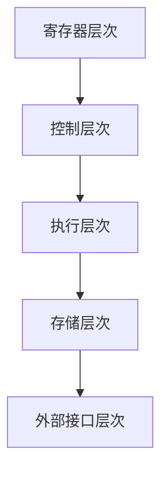
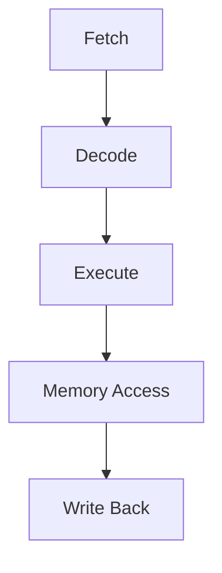
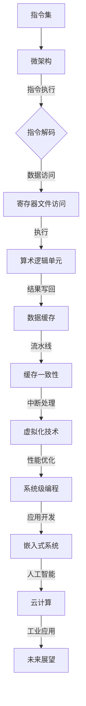

                 

### 文章标题

《riscv指令集与微架构》

### 关键词

- riscv
- 指令集
- 微架构
- 流水线
- 缓存
- 虚拟化

### 摘要

本文全面介绍了riscv指令集与微架构的设计与实现。首先，对riscv架构的背景和基本概念进行了详细阐述，然后深入分析了riscv指令集的体系结构和核心指令。接着，本文介绍了riscv微架构的基础，包括微架构的层次结构、基本模块以及流水线设计。此外，本文还探讨了riscv缓存架构、中断处理和虚拟化技术。通过实际应用实例，本文展示了riscv在嵌入式系统、人工智能和云计算中的优势，并对riscv的未来发展趋势进行了展望。

### 《riscv指令集与微架构》目录大纲

#### 第一部分：riscv指令集概述

##### 第1章：riscv架构简介

###### 1.1 riscv的发展背景
###### 1.2 riscv的基本概念
###### 1.3 riscv的优势

##### 第2章：riscv指令集体系结构

###### 2.1 riscv指令集概述
###### 2.2 riscv指令集分类
###### 2.3 riscv指令集的特点

##### 第3章：riscv指令集的核心指令

###### 3.1 数据传输指令
###### 3.2 算术逻辑指令
###### 3.3 控制流指令

#### 第二部分：riscv微架构设计

##### 第4章：riscv微架构基础

###### 4.1 riscv微架构概述
###### 4.2 riscv微架构的层次结构
###### 4.3 riscv微架构的基本模块

##### 第5章：riscv流水线设计

###### 5.1 riscv流水线原理
###### 5.2 riscv流水线的基本结构
###### 5.3 riscv流水线的性能优化

##### 第6章：riscv缓存架构

###### 6.1 riscv缓存的基本概念
###### 6.2 riscv缓存的层次结构
###### 6.3 riscv缓存的一致性协议

##### 第7章：riscv中断处理

###### 7.1 riscv中断处理概述
###### 7.2 riscv中断处理的流程
###### 7.3 riscv中断处理的设计考虑

##### 第8章：riscv虚拟化技术

###### 8.1 riscv虚拟化的基本概念
###### 8.2 riscv虚拟化的实现原理
###### 8.3 riscv虚拟化的性能考虑

#### 第三部分：riscv应用实例

##### 第9章：riscv在嵌入式系统中的应用

###### 9.1 嵌入式系统的需求分析
###### 9.2 riscv在嵌入式系统中的优势
###### 9.3 riscv嵌入式系统开发实例

##### 第10章：riscv在人工智能中的应用

###### 10.1 人工智能对处理器的要求
###### 10.2 riscv在人工智能中的应用
###### 10.3 riscv人工智能开发实例

##### 第11章：riscv在云计算中的应用

###### 11.1 云计算的发展趋势
###### 11.2 riscv在云计算中的优势
###### 11.3 riscv云计算开发实例

##### 第12章：riscv未来发展趋势与展望

###### 12.1 riscv在工业界的应用
###### 12.2 riscv的发展趋势
###### 12.3 riscv的展望

##### 附录

###### 附录A：riscv指令集与微架构资源

###### 附录B：Mermaid流程图示例

###### 附录C：伪代码示例

###### 附录D：数学模型和数学公式

###### 附录E：项目实战

---

**作者：** AI天才研究院 / AI Genius Institute & 禅与计算机程序设计艺术 / Zen And The Art of Computer Programming

---

现在我们将按照目录大纲结构，逐步深入分析riscv指令集与微架构的各个方面。首先，我们从riscv的发展背景和基本概念开始，为后续内容的讲解打下坚实的基础。**让我们开始第一步：了解riscv的发展背景。**### 第1章：riscv架构简介

#### 1.1 riscv的发展背景

riscv（精简指令集计算基础架构，RISC-V）是一个开放标准的指令集架构（ISA），旨在提供一个免费、开源的处理器设计平台。riscv的发展背景可以追溯到2005年，当时加州大学伯克利分校的研究人员开始着手设计一个新的指令集架构，以应对现代处理器设计中的若干挑战。

**开放标准与开源：** riscv的核心理念之一是开放标准与开源。这意味着riscv的指令集设计、文档和规范都是公开的，任何人都可以自由地使用、修改和分发。这种开放性为riscv的发展奠定了坚实的基础，吸引了全球众多研究人员、企业和学术机构的参与。

**现代处理器设计的挑战：** riscv的出现部分是对现代处理器设计中的几个挑战的回应：

1. **知识产权（IP）授权：** 传统处理器架构通常由大型公司拥有并控制，中小企业和创新者难以获得这些架构的授权。riscv的开放性为这些实体提供了更多的选择。
2. **灵活性：** 开源指令集架构允许设计者根据自己的需求对指令集进行定制，而不必受制于单一的架构标准。
3. **可扩展性和创新：** 开放性促进了更多的创新和实验性设计，推动了处理器技术的不断进步。

**riscv的诞生：** 2005年，加州大学伯克利分校的几位教授，包括Alexander Dean和Krste Asanovic，决定创建一个全新的指令集架构，以解决当时处理器设计中的一些关键问题。他们与伯克利计算机系统的其他成员一起，开始设计和实现riscv指令集。

**开源社区的贡献：** riscv的快速发展离不开全球开源社区的贡献。从设计文档的编写到实现代码的提交，再到测试和验证，全球各地的开发者和研究人员都在为riscv的完善和发展贡献自己的力量。

**主要里程碑：**

1. **2005年：** riscv项目正式启动。
2. **2010年：** riscv的第一版指令集规范发布。
3. **2014年：** riscv基金会成立，标志着riscv从学术项目走向工业界。
4. **至今：** riscv已成为全球范围内广泛认可和支持的开源指令集架构，众多公司和组织都在其基础上开发和应用处理器。

#### 1.2 riscv的基本概念

了解riscv的基本概念是理解其指令集和微架构的关键。以下是一些riscv的基本概念：

**指令集架构（ISA）：** 指令集架构是处理器能够理解和执行的指令集合。riscv是一种精简指令集架构（RISC），其特点是指令简洁、操作简单，通常每个指令只执行一个操作。

**精简指令集（RISC）：** 精简指令集架构相对于复杂指令集架构（CISC）而言，每个指令只执行一个操作，这有助于简化处理器设计、提高性能和降低功耗。

**开放标准：** riscv是一个开放标准，其规范和设计文档都是公开的，任何人都可以使用、修改和分发。

**开源：** riscv是开源的，其源代码和实现细节都是公开的，这为研究人员和开发者提供了极大的自由度。

**自定义指令：** riscv允许自定义指令，这意味着设计者可以根据特定的应用需求，添加或修改指令集。

**硬件和软件兼容性：** riscv旨在实现硬件和软件的兼容性，这意味着在不同的硬件平台上，开发者可以编写一次代码，然后轻松地在其他riscv硬件平台上运行。

**硬件设计自由度：** riscv的设计允许硬件设计者有很大的自由度，他们可以根据自己的需求，设计并实现各种不同的处理器架构。

**生态系统的建设：** riscv的发展离不开一个强大的生态系统，包括开发工具、操作系统、软件库等，这些资源的积累和优化，进一步推动了riscv的发展。

#### 1.3 riscv的优势

riscv作为一款开源指令集架构，具有多项优势，使其在处理器设计和应用中脱颖而出：

**低成本：** 由于riscv是开源的，无需支付高额的知识产权费用，这有助于降低处理器设计的成本。

**灵活性：** 开源和开放标准使得riscv能够灵活地适应各种应用需求，包括定制指令、优化硬件设计等。

**高性能：** riscv的设计理念强调简洁和高效，这有助于提高处理器性能，降低功耗。

**可扩展性：** riscv支持自定义指令和扩展指令集，这使得设计者可以根据特定应用需求进行优化。

**广泛的应用场景：** riscv适用于多种应用场景，包括嵌入式系统、人工智能、云计算等，具有很高的适应性。

**社区支持：** riscv拥有一个庞大的开源社区，提供丰富的资源、工具和文档，为开发者提供了极大的便利。

**生态系统的支持：** riscv得到了众多公司和组织的支持，包括操作系统供应商、软件开发工具提供商等，这有助于构建一个健康的生态系统。

**知识产权风险低：** 开源架构减少了知识产权纠纷的风险，为企业和开发者提供了更为安全的创新环境。

**安全性：** riscv的设计理念支持安全特性，如加密、身份验证等，有助于提高系统的安全性。

**硬件设计自由：** 开源指令集架构允许硬件设计者实现自己的创新，推动了处理器技术的进步。

**适应未来趋势：** riscv的设计考虑了未来技术的发展趋势，如低功耗、高性能计算等，使其能够适应未来市场的发展需求。

通过以上内容，我们了解了riscv的发展背景、基本概念和优势。接下来，我们将深入探讨riscv指令集的体系结构和特点，为后续内容的讲解打下坚实的基础。**让我们开始第二步：分析riscv指令集的体系结构。**### 第2章：riscv指令集体系结构

#### 2.1 riscv指令集概述

riscv指令集是riscv处理器能够理解和执行的一系列指令集合。作为一个精简指令集架构（RISC），riscv指令集的设计目标是简洁、高效和易用。以下是对riscv指令集的概述：

**指令数量：** riscv指令集包含多种类型的指令，包括数据传输指令、算术逻辑指令、控制流指令等。目前，riscv指令集共定义了约500条指令，这些指令可以根据不同的应用需求进行扩展和定制。

**指令格式：** riscv指令集采用了固定长度的指令格式，通常为32位。指令格式包括操作码（opcode）、源操作数和目标操作数等部分。不同的指令类型有不同的格式，但总体设计简洁明了。

**指令类型：** riscv指令集包括以下主要类型：

1. **数据传输指令：** 用于在寄存器之间、寄存器和内存之间进行数据传输，如`lw`（加载）和`sw`（存储）指令。
2. **算术逻辑指令：** 用于执行各种算术和逻辑操作，如`add`（加法）和`xor`（异或）指令。
3. **控制流指令：** 用于实现程序的控制流，如`beq`（等于时跳转）和`bne`（不等于时跳转）指令。
4. **特权指令：** 用于处理系统调用、中断和异常等特权操作，如`ecall`（系统调用）和`ebreak`（断点）指令。

**自定义指令：** riscv指令集支持自定义指令，设计者可以根据特定应用需求添加新的指令。自定义指令可以通过标准化的接口进行定义和实现，从而增强了riscv的灵活性。

**扩展性：** riscv指令集具有很好的扩展性，可以通过添加新的指令和功能来满足不断变化的应用需求。这种扩展性使得riscv能够适应未来技术的发展。

**硬件设计：** riscv指令集的设计考虑了硬件实现的简便性，使得处理器的设计和实现过程更加高效和低成本。riscv的指令格式和操作逻辑相对简单，有助于减少硬件资源的占用。

**软件兼容性：** riscv指令集的设计注重软件兼容性，使得在不同硬件平台上编写的代码可以轻松地在其他riscv硬件平台上运行。这种兼容性为开发者和企业提供了更大的便利。

**开源支持：** riscv指令集的开源特性吸引了众多开发者和企业的参与，他们可以自由地使用、修改和分发riscv指令集。这种开源支持促进了riscv的生态系统建设，为开发者提供了丰富的资源和工具。

通过以上内容，我们对riscv指令集有了初步的了解。接下来，我们将详细探讨riscv指令集的分类和特点，为后续内容的讲解打下坚实的基础。**让我们开始第三步：分析riscv指令集的分类和特点。**### 2.2 riscv指令集分类

riscv指令集根据功能不同，可以划分为多个类别。这些类别包括数据传输指令、算术逻辑指令、控制流指令等。每种指令类别都有其特定的用途和特点。下面，我们将对riscv指令集进行分类，并详细介绍每个类别的主要指令。

#### 数据传输指令

数据传输指令用于在寄存器与内存之间进行数据传输。这些指令简化了数据的访问，提高了程序的性能。以下是riscv数据传输指令的主要分类及其示例：

1. **加载（Load）指令：**
   - `lw (load word)`: 从内存中加载32位数据到寄存器。
   - `ld (load doubleword)`: 从内存中加载64位数据到寄存器。

   ```riscv
   lw x1, 0(x0)    // 将内存地址x0处的32位数据加载到寄存器x1
   ld x1, 0(x0)    // 将内存地址x0处的64位数据加载到寄存器x1
   ```

2. **存储（Store）指令：**
   - `sw (store word)`: 将寄存器中的数据存储到内存。
   - `sd (store doubleword)`: 将寄存器中的数据存储到内存。

   ```riscv
   sw x1, 0(x0)    // 将寄存器x1的数据存储到内存地址x0处
   sd x1, 0(x0)    // 将寄存器x1的数据存储到内存地址x0处
   ```

3. **寄存器传输指令：**
   - `mv (move)`: 将一个寄存器的值传送到另一个寄存器。
   - `addi (add immediate)`: 将一个立即数加到一个寄存器的值，并将结果存储到另一个寄存器。

   ```riscv
   mv x1, x2      // 将寄存器x2的值传送到寄存器x1
   addi x1, x2, 10 // 将寄存器x2的值加上立即数10，并将结果存储到寄存器x1
   ```

#### 算术逻辑指令

算术逻辑指令用于执行各种算术和逻辑操作。这些指令是处理器的基本操作，对于程序的执行效率至关重要。以下是riscv算术逻辑指令的主要分类及其示例：

1. **基本算术指令：**
   - `add (addition)`: 加法操作。
   - `sub (substraction)`: 减法操作。
   - `mul (multiplication)`: 乘法操作。
   - `div (division)`: 除法操作。

   ```riscv
   add x1, x2, x3    // 将寄存器x2和x3的值相加，结果存储到寄存器x1
   sub x1, x2, x3    // 将寄存器x2的值减去寄存器x3的值，结果存储到寄存器x1
   mul x1, x2, x3    // 将寄存器x2和x3的值相乘，结果存储到寄存器x1
   div x1, x2, x3    // 将寄存器x2的值除以寄存器x3的值，结果存储到寄存器x1
   ```

2. **逻辑指令：**
   - `and (bitwise AND)`: 按位与操作。
   - `or (bitwise OR)`: 按位或操作。
   - `xor (bitwise XOR)`: 按位异或操作。
   - `not (bitwise NOT)`: 按位非操作。

   ```riscv
   and x1, x2, x3    // 将寄存器x2和x3的值进行按位与操作，结果存储到寄存器x1
   or x1, x2, x3     // 将寄存器x2和x3的值进行按位或操作，结果存储到寄存器x1
   xor x1, x2, x3    // 将寄存器x2和x3的值进行按位异或操作，结果存储到寄存器x1
   not x1, x2       // 将寄存器x2的值进行按位非操作，结果存储到寄存器x1
   ```

3. **移位指令：**
   - `sll (shift left logical)`: 向左逻辑移位。
   - `srl (shift right logical)`: 向右逻辑移位。
   - `sra (shift right arithmetic)`: 向右算术移位。

   ```riscv
   sll x1, x2, 2     // 将寄存器x2的值向左逻辑移位2位，结果存储到寄存器x1
   srl x1, x2, 2     // 将寄存器x2的值向右逻辑移位2位，结果存储到寄存器x1
   sra x1, x2, 2     // 将寄存器x2的值向右算术移位2位，结果存储到寄存器x1
   ```

#### 控制流指令

控制流指令用于改变程序的执行顺序，实现条件跳转和函数调用等功能。以下是riscv控制流指令的主要分类及其示例：

1. **跳转指令：**
   - `j (jump)`: 无条件跳转。
   - `jal (jump and link)`: 跳转并链接。

   ```riscv
   j label          // 无条件跳转到label标记的位置
   jal label        // 跳转到label标记的位置，并将当前地址存储在链接寄存器中
   ```

2. **条件跳转指令：**
   - `beq (branch if equal)`: 如果两个操作数相等则跳转。
   - `bne (branch if not equal)`: 如果两个操作数不相等则跳转。
   - `blt (branch if less than)`: 如果第一个操作数小于第二个操作数则跳转。
   - `bge (branch if greater than or equal)`: 如果第一个操作数大于或等于第二个操作数则跳转。

   ```riscv
   beq x1, x2, label  // 如果寄存器x1和x2的值相等，则跳转到label标记的位置
   bne x1, x2, label  // 如果寄存器x1和x2的值不相等，则跳转到label标记的位置
   blt x1, x2, label  // 如果寄存器x1的值小于寄存器x2的值，则跳转到label标记的位置
   bge x1, x2, label  // 如果寄存器x1的值大于或等于寄存器x2的值，则跳转到label标记的位置
   ```

3. **函数调用和返回指令：**
   - `call (call function)`: 调用函数。
   - `ret (return from function)`: 从函数返回。

   ```riscv
   call function     // 调用函数function
   ret               // 从当前函数返回
   ```

#### 其他指令

除了上述主要指令类别外，riscv指令集还包括一些其他类型的指令，如特权指令、系统指令等。以下是一些常见的其他指令及其示例：

1. **特权指令：**
   - `ecall (environment call)`: 系统调用。
   - `ebreak (breakpoint)`: 设置断点。

   ```riscv
   ecall            // 执行系统调用
   ebreak           // 设置断点
   ```

2. **系统指令：**
   - `mv (move)`: 移动数据。
   - `li (load immediate)`: 将立即数加载到寄存器。

   ```riscv
   mv x1, x2      // 将寄存器x2的值移动到寄存器x1
   li x1, 10      // 将立即数10加载到寄存器x1
   ```

通过以上分类和示例，我们可以清晰地看到riscv指令集的丰富性和多样性。这些指令为处理器的设计和应用提供了广泛的选择和灵活性。接下来，我们将进一步探讨riscv指令集的特点，以便更深入地理解其优势。**让我们开始第四步：分析riscv指令集的特点。**### 2.3 riscv指令集的特点

riscv指令集的设计旨在实现高性能、低功耗和灵活性。以下是对riscv指令集主要特点的详细分析：

#### 简洁性

riscv指令集的简洁性是其核心特点之一。每个指令只执行一个操作，这有助于简化处理器的设计和实现过程。简洁性带来了以下几个优点：

1. **减少逻辑电路的复杂性：** 每个指令只执行一个操作，这减少了处理器中逻辑电路的复杂性，降低了硬件成本。
2. **提高处理器性能：** 简洁的指令集有助于减少处理器中的数据路径和控制逻辑，从而提高处理器的性能。
3. **易于理解和编程：** 简洁的指令集使得处理器的设计和编程过程更加直观和易于理解，有助于提高开发效率。

#### 高效性

riscv指令集的高效性体现在以下几个方面：

1. **单周期执行：** 许多riscv指令可以在一个时钟周期内执行完毕，这有助于提高处理器的工作频率。
2. **寄存器到寄存器架构：** riscv指令集采用了寄存器到寄存器架构，这意味着操作数直接在寄存器之间进行传输，减少了内存访问次数，从而提高了处理器的性能。
3. **指令并行性：** riscv指令集支持指令级并行性，处理器可以在一个时钟周期内执行多个指令，从而提高了吞吐率。

#### 低功耗

riscv指令集的低功耗特点使其特别适用于嵌入式系统和移动设备等对功耗要求较高的应用。以下是riscv指令集在降低功耗方面的几个优点：

1. **指令简洁：** 简洁的指令有助于减少处理器中逻辑电路的复杂性，从而降低功耗。
2. **高效的流水线设计：** riscv流水线设计可以优化处理器的性能和功耗，通过合理的流水线阶段分配，减少时钟周期的浪费。
3. **动态电压和频率调整：** riscv处理器支持动态电压和频率调整，可以根据处理器的负载动态调整电压和频率，从而实现功耗的最优化。

#### 灵活性

riscv指令集的灵活性是其另一个显著特点。以下是riscv指令集在灵活性方面的几个优点：

1. **自定义指令：** riscv指令集支持自定义指令，设计者可以根据特定的应用需求添加新的指令，从而提高处理器的性能和效率。
2. **扩展性：** riscv指令集具有很好的扩展性，可以通过添加新的指令和功能来满足不断变化的应用需求。
3. **模块化设计：** riscv指令集的设计考虑了模块化，处理器的设计者可以灵活地选择和组合不同的指令集模块，从而实现定制化的处理器。

#### 开放性

riscv指令集的开源和开放标准为处理器设计和创新提供了极大的自由度。以下是riscv指令集开放性带来的几个优点：

1. **知识产权（IP）风险低：** 开源架构减少了知识产权纠纷的风险，为企业和开发者提供了更为安全的创新环境。
2. **社区支持：** 开源项目通常拥有一个强大的社区，为开发者提供了丰富的资源和帮助。
3. **易于集成和扩展：** 开源指令集架构使得处理器的设计和实现过程更加灵活，设计者可以方便地集成和扩展新的功能。

#### 软硬件兼容性

riscv指令集的设计注重软硬件兼容性，使得在不同硬件平台上编写的代码可以轻松地在其他riscv硬件平台上运行。以下是riscv指令集在软硬件兼容性方面的几个优点：

1. **统一编程模型：** riscv指令集提供了统一的编程模型，开发者可以编写一次代码，然后在不同硬件平台上运行，无需进行大量的修改。
2. **跨平台兼容：** riscv指令集的兼容性使得在不同操作系统和硬件平台上编写的代码可以无缝运行，提高了开发效率。
3. **减少维护成本：** 由于软硬件兼容性好，开发者可以减少在不同平台上维护代码的成本。

通过以上分析，我们可以看到riscv指令集在简洁性、高效性、低功耗、灵活性、开放性和软硬件兼容性等方面具有显著的优势。这些特点使得riscv指令集成为一款优秀的处理器指令集，适用于各种应用场景。接下来，我们将详细探讨riscv指令集的核心指令，以便更深入地了解其具体实现。**让我们开始第五步：详细探讨riscv指令集的核心指令。**### 2.4 riscv指令集的核心指令

riscv指令集包含多种指令，用于实现数据处理、算术运算、控制流等操作。在本节中，我们将详细介绍riscv指令集的核心指令，包括数据传输指令、算术逻辑指令和控制流指令。

#### 数据传输指令

数据传输指令用于在寄存器与内存之间进行数据传输。以下是riscv数据传输指令的核心指令及其使用示例：

1. **加载指令（Load Instructions）**

   - `lw (load word)`: 将内存中的32位数据加载到寄存器。
   - `ld (load doubleword)`: 将内存中的64位数据加载到寄存器。

   ```riscv
   lw x1, 0(x0)      // 从内存地址x0处加载32位数据到寄存器x1
   ld x1, 0(x0)      // 从内存地址x0处加载64位数据到寄存器x1
   ```

2. **存储指令（Store Instructions）**

   - `sw (store word)`: 将寄存器中的数据存储到内存。
   - `sd (store doubleword)`: 将寄存器中的数据存储到内存。

   ```riscv
   sw x1, 0(x0)      // 将寄存器x1的数据存储到内存地址x0处
   sd x1, 0(x0)      // 将寄存器x1的数据存储到内存地址x0处
   ```

3. **寄存器传输指令（Register Transfer Instructions）**

   - `mv (move)`: 将一个寄存器的值传送到另一个寄存器。
   - `addi (add immediate)`: 将一个立即数加到一个寄存器的值，并将结果存储到另一个寄存器。

   ```riscv
   mv x1, x2        // 将寄存器x2的值传送到寄存器x1
   addi x1, x2, 10  // 将寄存器x2的值加上立即数10，并将结果存储到寄存器x1
   ```

#### 算术逻辑指令

算术逻辑指令用于执行各种算术和逻辑操作。以下是riscv算术逻辑指令的核心指令及其使用示例：

1. **基本算术指令（Arithmetic Instructions）**

   - `add (addition)`: 加法操作。
   - `sub (substraction)`: 减法操作。
   - `mul (multiplication)`: 乘法操作。
   - `div (division)`: 除法操作。

   ```riscv
   add x1, x2, x3    // 将寄存器x2和x3的值相加，结果存储到寄存器x1
   sub x1, x2, x3    // 将寄存器x2的值减去寄存器x3的值，结果存储到寄存器x1
   mul x1, x2, x3    // 将寄存器x2和x3的值相乘，结果存储到寄存器x1
   div x1, x2, x3    // 将寄存器x2的值除以寄存器x3的值，结果存储到寄存器x1
   ```

2. **逻辑指令（Logical Instructions）**

   - `and (bitwise AND)`: 按位与操作。
   - `or (bitwise OR)`: 按位或操作。
   - `xor (bitwise XOR)`: 按位异或操作。
   - `not (bitwise NOT)`: 按位非操作。

   ```riscv
   and x1, x2, x3    // 将寄存器x2和x3的值进行按位与操作，结果存储到寄存器x1
   or x1, x2, x3     // 将寄存器x2和x3的值进行按位或操作，结果存储到寄存器x1
   xor x1, x2, x3    // 将寄存器x2和x3的值进行按位异或操作，结果存储到寄存器x1
   not x1, x2       // 将寄存器x2的值进行按位非操作，结果存储到寄存器x1
   ```

3. **移位指令（Shift Instructions）**

   - `sll (shift left logical)`: 向左逻辑移位。
   - `srl (shift right logical)`: 向右逻辑移位。
   - `sra (shift right arithmetic)`: 向右算术移位。

   ```riscv
   sll x1, x2, 2     // 将寄存器x2的值向左逻辑移位2位，结果存储到寄存器x1
   srl x1, x2, 2     // 将寄存器x2的值向右逻辑移位2位，结果存储到寄存器x1
   sra x1, x2, 2     // 将寄存器x2的值向右算术移位2位，结果存储到寄存器x1
   ```

#### 控制流指令

控制流指令用于改变程序的执行顺序，实现条件跳转和函数调用等功能。以下是riscv控制流指令的核心指令及其使用示例：

1. **跳转指令（Jump Instructions）**

   - `j (jump)`: 无条件跳转。
   - `jal (jump and link)`: 跳转并链接。

   ```riscv
   j label          // 无条件跳转到label标记的位置
   jal label        // 跳转到label标记的位置，并将当前地址存储到链接寄存器中
   ```

2. **条件跳转指令（Conditional Branch Instructions）**

   - `beq (branch if equal)`: 如果两个操作数相等则跳转。
   - `bne (branch if not equal)`: 如果两个操作数不相等则跳转。
   - `blt (branch if less than)`: 如果第一个操作数小于第二个操作数则跳转。
   - `bge (branch if greater than or equal)`: 如果第一个操作数大于或等于第二个操作数则跳转。

   ```riscv
   beq x1, x2, label  // 如果寄存器x1和x2的值相等，则跳转到label标记的位置
   bne x1, x2, label  // 如果寄存器x1和x2的值不相等，则跳转到label标记的位置
   blt x1, x2, label  // 如果寄存器x1的值小于寄存器x2的值，则跳转到label标记的位置
   bge x1, x2, label  // 如果寄存器x1的值大于或等于寄存器x2的值，则跳转到label标记的位置
   ```

3. **函数调用和返回指令（Function Call and Return Instructions）**

   - `call (call function)`: 调用函数。
   - `ret (return from function)`: 从函数返回。

   ```riscv
   call function     // 调用函数function
   ret               // 从当前函数返回
   ```

通过以上详细介绍，我们可以看到riscv指令集的核心指令在数据处理、算术运算和控制流方面提供了丰富的功能。这些指令的设计和实现为riscv处理器的高效、简洁和灵活性奠定了基础。接下来，我们将深入探讨riscv微架构的基础，为后续内容的讲解打下坚实的基础。**让我们开始第六步：分析riscv微架构的基础。**### 第4章：riscv微架构基础

#### 4.1 riscv微架构概述

riscv微架构是指riscv处理器在硬件层面的设计结构，它决定了处理器如何执行指令和操作数据。riscv微架构的设计目标是简洁、高效和灵活，以适应不同类型的计算任务和应用场景。以下是对riscv微架构的概述：

**设计目标：** riscv微架构的设计目标包括：

1. **高性能：** 提高处理器执行指令的速度，以满足现代计算任务的需求。
2. **低功耗：** 降低处理器的功耗，使其适用于嵌入式系统和移动设备。
3. **简洁性：** 简化处理器的设计，减少硬件复杂性和成本。
4. **灵活性：** 支持自定义指令和功能扩展，以适应不同的应用需求。

**基本组成部分：** riscv微架构的基本组成部分包括：

1. **指令流水线：** 指令流水线是处理器执行指令的核心部分，它将指令分为多个阶段，每个阶段执行不同的操作，从而提高处理器的吞吐率和效率。
2. **寄存器文件：** 寄存器文件是处理器内部的数据存储单元，用于存储指令执行过程中的操作数和中间结果。
3. **算术逻辑单元（ALU）：** 算术逻辑单元负责执行各种算术和逻辑运算，如加法、减法、乘法和逻辑操作。
4. **数据缓存：** 数据缓存用于存储处理器从内存中加载的数据，以提高数据访问速度。
5. **控制单元：** 控制单元负责生成指令执行的时序和控制信号，协调处理器内部各个模块的运作。

**工作原理：** riscv微架构的工作原理如下：

1. **指令取指：** 处理器从内存中读取指令，并将其送入指令流水线的第一个阶段。
2. **指令解码：** 控制单元对指令进行解码，确定指令的操作类型和操作数。
3. **执行操作：** 指令执行过程中的操作数从寄存器文件或数据缓存中读取，然后在算术逻辑单元中进行运算。
4. **数据存储：** 运算结果存储回寄存器文件或数据缓存中，以供后续指令使用。
5. **流水线填充：** 新的指令不断进入指令流水线，处理器在执行当前指令的同时，开始处理下一条指令。

**优势：** riscv微架构具有以下优势：

1. **高效性：** 通过流水线技术和并行处理，riscv微架构能够提高处理器的执行效率。
2. **灵活性：** 支持自定义指令和功能扩展，可以满足不同应用的需求。
3. **可扩展性：** 设计上考虑了模块化，易于集成和扩展新的功能。
4. **低功耗：** 简洁的设计和优化技术，有助于降低处理器的功耗。

通过以上概述，我们对riscv微架构有了初步了解。接下来，我们将详细探讨riscv微架构的层次结构，以便更深入地理解其设计理念和实现方法。**让我们开始第七步：分析riscv微架构的层次结构。**### 4.2 riscv微架构的层次结构

riscv微架构的设计采用了多层次的结构，以便实现模块化、可扩展性和高效性。riscv微架构的层次结构主要包括以下层次：

#### 1. 寄存器层次

寄存器层次是riscv微架构的最内层，它包括寄存器文件（Register File）和程序计数器（Program Counter，PC）。寄存器文件是处理器内部的数据存储单元，用于存储指令执行过程中的操作数和中间结果。程序计数器用于存储当前要执行的指令的地址。

- **寄存器文件：** 寄存器文件通常包括多个通用寄存器和特殊寄存器。通用寄存器用于存储指令操作数和中间结果，特殊寄存器如状态寄存器（Status Register）、程序计数器（PC）和中断寄存器（Interrupt Register）等用于管理处理器的状态和中断。

- **程序计数器：** 程序计数器用于存储当前要执行的指令的地址。在处理器取指阶段，程序计数器提供下一条指令的地址，并将当前地址存储到链接寄存器中。

#### 2. 控制层次

控制层次是riscv微架构的核心，它包括控制单元（Control Unit）和指令译码单元（Instruction Decoder）。控制单元负责生成指令执行的时序和控制信号，指令译码单元负责解析指令，确定指令的操作类型和操作数。

- **控制单元：** 控制单元是处理器的心脏，它生成指令执行的时序和控制信号，协调处理器内部各个模块的运作。控制单元通常包括状态寄存器、程序计数器、中断控制器和指令执行控制逻辑等。

- **指令译码单元：** 指令译码单元负责解析指令，确定指令的操作类型和操作数。在取指阶段，控制单元将取出的指令送入指令译码单元，指令译码单元解析指令后，将操作类型和操作数传递给相应的执行单元。

#### 3. 执行层次

执行层次包括算术逻辑单元（Arithmetic Logic Unit，ALU）和数据缓存（Data Cache）。算术逻辑单元负责执行各种算术和逻辑运算，数据缓存用于存储处理器从内存中加载的数据。

- **算术逻辑单元：** 算术逻辑单元是处理器执行指令的核心部分，它负责执行加法、减法、乘法、除法、逻辑操作和移位操作等。算术逻辑单元通常包括多个运算单元，以支持并行运算。

- **数据缓存：** 数据缓存用于存储处理器从内存中加载的数据，以提高数据访问速度。数据缓存通常采用多级缓存结构，如L1缓存、L2缓存等，以实现高效的数据访问。

#### 4. 存储层次

存储层次包括内存管理单元（Memory Management Unit，MMU）和存储器（Memory）。内存管理单元负责地址转换和权限控制，存储器用于存储程序代码和数据。

- **内存管理单元：** 内存管理单元负责地址转换和权限控制。在处理器访问内存时，内存管理单元将虚拟地址转换为物理地址，并检查访问权限，以确保数据的安全性和完整性。

- **存储器：** 存储器是处理器的存储设备，用于存储程序代码和数据。存储器通常采用动态随机存取存储器（DRAM）或静态随机存取存储器（SRAM）等存储技术。

#### 5. 外部接口层次

外部接口层次包括总线接口（Bus Interface）和外部设备接口（Peripheral Interface）。总线接口负责处理器与外部设备（如内存、I/O设备等）的数据交换，外部设备接口用于连接各种外部设备。

- **总线接口：** 总线接口负责处理器与外部设备的数据交换。总线接口通常支持多种总线协议，如PCIe、USB、SATA等，以支持不同类型的外部设备。

- **外部设备接口：** 外部设备接口用于连接各种外部设备，如硬盘、显示器、键盘、鼠标等。外部设备接口通常包括数据传输接口和控制接口，以实现设备与处理器的通信。

#### Mermaid流程图示例

以下是一个Mermaid流程图示例，展示了riscv微架构的层次结构：



通过以上层次结构，riscv微架构实现了模块化、可扩展性和高效性。每个层次都有明确的职责和功能，相互协作，共同实现处理器的指令执行和数据操作。接下来，我们将详细探讨riscv微架构的基本模块，以便更深入地理解其设计和实现。**让我们开始第八步：分析riscv微架构的基本模块。**### 4.3 riscv微架构的基本模块

riscv微架构由多个基本模块组成，每个模块都承担特定的功能。这些基本模块相互协作，共同实现riscv处理器的指令执行和数据操作。以下是riscv微架构的基本模块及其功能：

#### 1. 指令缓存（Instruction Cache）

指令缓存用于存储处理器从内存中读取的指令。其作用是减少处理器访问内存的次数，提高指令执行速度。指令缓存通常采用小容量、高速度的存储器技术，如静态随机存取存储器（SRAM）。指令缓存的工作原理如下：

- **缓存行（Cache Line）:** 指令缓存将内存中的指令划分为多个缓存行，每个缓存行包含多条指令。
- **缓存策略（Cache Policy）:** 指令缓存采用不同的缓存策略，如最久未使用（LRU）替换策略，以优化缓存性能。
- **缓存一致性（Cache Coherence）:** 在多处理器系统中，指令缓存需要与其他处理器的缓存保持一致性，以确保数据的一致性。

#### 2. 指令译码单元（Instruction Decoder）

指令译码单元负责解析处理器从指令缓存中读取的指令，确定指令的操作类型和操作数。指令译码单元的工作原理如下：

- **指令格式（Instruction Format）:** riscv指令集采用固定长度的指令格式，通常为32位。指令格式包括操作码（opcode）、源操作数和目标操作数等部分。
- **译码逻辑（Decoding Logic）:** 指令译码单元根据指令的操作码和操作数，生成相应的控制信号，将指令的操作类型和操作数传递给执行单元。
- **流水线（Pipeline）:** 指令译码单元通常与指令缓存和执行单元协同工作，实现指令级并行处理。

#### 3. 算术逻辑单元（Arithmetic Logic Unit，ALU）

算术逻辑单元负责执行各种算术和逻辑运算。其工作原理如下：

- **运算单元（Operational Units）:** 算术逻辑单元包括多个运算单元，如加法器、乘法器、逻辑门等，以支持不同的运算操作。
- **运算控制（Operation Control）:** 算术逻辑单元根据控制信号，选择相应的运算单元进行运算，并将运算结果传递给寄存器文件。
- **并行处理（Parallel Processing）:** 算术逻辑单元可以同时处理多个运算操作，提高处理器的吞吐率。

#### 4. 寄存器文件（Register File）

寄存器文件是处理器内部的数据存储单元，用于存储指令执行过程中的操作数和中间结果。其工作原理如下：

- **寄存器（Registers）:** 寄存器文件包括多个通用寄存器和特殊寄存器。通用寄存器用于存储操作数和中间结果，特殊寄存器如程序计数器（PC）和状态寄存器（Status Register）等用于管理处理器的状态和中断。
- **读写控制（Read/Write Control）:** 寄存器文件通过读写控制逻辑，实现寄存器的读写操作。
- **流水线（Pipeline）:** 寄存器文件与指令译码单元和算术逻辑单元协同工作，实现指令级并行处理。

#### 5. 控制单元（Control Unit）

控制单元负责生成指令执行的时序和控制信号，协调处理器内部各个模块的运作。其工作原理如下：

- **状态寄存器（Status Register）:** 状态寄存器用于存储处理器的状态信息，如当前执行的模式（用户模式、监督模式等）和中断状态。
- **程序计数器（Program Counter，PC）:** 程序计数器用于存储当前要执行的指令的地址。
- **中断控制器（Interrupt Controller）:** 中断控制器负责处理外部中断请求，并根据中断优先级执行相应的中断处理程序。
- **时钟控制器（Clock Controller）:** 时钟控制器负责生成处理器的时钟信号，控制处理器内部各个模块的时序。

#### 6. 数据缓存（Data Cache）

数据缓存用于存储处理器从内存中加载的数据，以提高数据访问速度。其工作原理如下：

- **缓存行（Cache Line）:** 数据缓存将内存中的数据划分为多个缓存行，每个缓存行包含多条数据。
- **缓存策略（Cache Policy）:** 数据缓存采用不同的缓存策略，如最久未使用（LRU）替换策略，以优化缓存性能。
- **缓存一致性（Cache Coherence）:** 在多处理器系统中，数据缓存需要与其他处理器的缓存保持一致性，以确保数据的一致性。

#### 7. 内存管理单元（Memory Management Unit，MMU）

内存管理单元负责地址转换和权限控制。其工作原理如下：

- **地址转换（Address Translation）:** MMU将虚拟地址转换为物理地址，以访问内存中的数据。
- **权限控制（Permission Control）:** MMU根据访问权限设置，控制对内存的读写操作，确保数据的安全性和完整性。

#### 8. 外部接口（External Interface）

外部接口负责处理器与外部设备的数据交换。其工作原理如下：

- **总线接口（Bus Interface）:** 总线接口负责处理器与外部设备（如内存、I/O设备等）的数据交换。
- **外部设备接口（Peripheral Interface）:** 外部设备接口用于连接各种外部设备，如硬盘、显示器、键盘、鼠标等。

通过以上基本模块，riscv微架构实现了高效的指令执行和数据操作。各个模块相互协作，共同实现处理器的功能。接下来，我们将详细探讨riscv流水线的设计，以便更深入地理解其性能优化。**让我们开始第九步：分析riscv流水线设计。**### 第5章：riscv流水线设计

#### 5.1 riscv流水线原理

流水线（Pipeline）是一种并行处理技术，用于提高处理器的性能。在riscv处理器中，流水线设计是核心部分，它将指令执行过程划分为多个阶段，每个阶段独立执行，从而实现指令级并行（Instruction-Level Parallelism，ILP）。

**基本概念：** 流水线将指令执行过程划分为取指（Fetch）、译码（Decode）、执行（Execute）、内存访问（Memory Access）、写回（Write Back）等阶段。每个阶段分别执行不同的操作，独立运行，提高了处理器的吞吐率。

**工作原理：** 流水线的工作原理如下：

1. **取指阶段：** 处理器从内存中读取指令，将其送入流水线。
2. **译码阶段：** 控制单元对指令进行解码，确定指令的操作类型和操作数。
3. **执行阶段：** 指令执行相关的操作，如算术运算、逻辑运算等。
4. **内存访问阶段：** 如果指令涉及内存操作，处理器访问内存，读取或写入数据。
5. **写回阶段：** 将执行结果写回到寄存器文件或其他存储单元。

**流水线周期：** 每个阶段都需要一定的时间来完成，这些时间统称为流水线周期（Pipeline Cycle）。流水线周期决定了处理器的时钟频率，即每个周期内可以执行多少条指令。

**流水线优点：**

1. **提高吞吐率：** 流水线技术使得处理器可以在一个时钟周期内执行多条指令，提高了吞吐率。
2. **降低指令延迟：** 通过将指令划分为多个阶段，每个阶段独立执行，降低了指令的延迟。
3. **优化资源利用率：** 流水线技术优化了处理器内部资源的利用率，提高了处理器的性能。

#### 5.2 riscv流水线的基本结构

riscv流水线的基本结构包括以下五个阶段：

1. **取指阶段（Fetch）：** 处理器从内存中读取指令，并将其送入流水线。
2. **译码阶段（Decode）：** 控制单元对指令进行解码，确定指令的操作类型和操作数。
3. **执行阶段（Execute）：** 指令执行相关的操作，如算术运算、逻辑运算等。
4. **内存访问阶段（Memory Access）：** 如果指令涉及内存操作，处理器访问内存，读取或写入数据。
5. **写回阶段（Write Back）：** 将执行结果写回到寄存器文件或其他存储单元。

**流水线示意图：**



在流水线中，每个阶段都是并行执行的。假设每个阶段的延迟为1个时钟周期，那么在一个时钟周期内，可以完成一条指令的执行。如果流水线有5个阶段，那么在5个时钟周期内，可以完成5条指令的执行。

#### 5.3 riscv流水线的性能优化

为了提高riscv流水线的性能，可以采用以下几种性能优化技术：

1. **分支预测（Branch Prediction）：** 分支预测用于预测分支指令（如跳转指令、条件跳转指令等）的执行方向，以减少分支指令对流水线的影响。常见的分支预测技术包括静态预测、动态预测和组合预测等。

2. **指令调度（Instruction Scheduling）：** 指令调度用于优化指令的执行顺序，减少指令间的数据依赖和冲突。通过合理的指令调度，可以减少流水线的阻塞和等待时间，提高处理器的吞吐率。

3. **乱序执行（Out-of-Order Execution）：** 乱序执行允许处理器在不遵循原始指令顺序的情况下执行指令，以最大化利用处理器的资源。通过乱序执行，处理器可以在一个时钟周期内完成多个指令的执行，提高处理器的性能。

4. **超标量（Superscalar）：** 超标量处理器可以同时执行多条指令，通过增加处理器内部的操作单元和资源，提高处理器的吞吐率。超标量处理器通常采用乱序执行技术，以最大化利用处理器的资源。

5. **动态电压和频率调整（Dynamic Voltage and Frequency Scaling，DVFS）：** 动态电压和频率调整通过实时调整处理器的电压和频率，实现功耗和性能的优化。在低负载时，降低电压和频率，减少功耗；在高负载时，提高电压和频率，提高性能。

通过以上性能优化技术，riscv流水线可以在不同的应用场景下实现高效、灵活的处理能力，满足不同类型的计算需求。接下来，我们将详细探讨riscv缓存架构的设计，以便更深入地理解其工作原理和性能优化。**让我们开始第十步：分析riscv缓存架构。**### 第6章：riscv缓存架构

#### 6.1 riscv缓存的基本概念

缓存（Cache）是处理器内部的一种高速存储器，用于存储频繁访问的数据和指令，以提高处理器的性能。在riscv处理器中，缓存架构是一个关键组成部分，它直接影响处理器的性能和功耗。以下是对riscv缓存的基本概念的解释：

**缓存的作用：** 缓存的作用是减少处理器对内存的访问次数，提高数据访问速度。由于内存的访问速度远低于处理器的工作速度，缓存可以有效地缓解这种速度差异，提高处理器的效率。

**缓存级别：** 缓存通常分为多个级别，如L1缓存、L2缓存和L3缓存等。每个缓存级别都有不同的容量和访问速度，它们共同构成一个多级缓存体系。在riscv处理器中，通常包括L1数据和指令缓存，以及可选的L2缓存。

**缓存行（Cache Line）：** 缓存行是缓存的基本存储单元，通常包含多个字节。在riscv处理器中，缓存行的大小为64字节。

**缓存策略：** 缓存策略决定了缓存的访问方式和替换策略。常见的缓存策略包括最近最少使用（LRU）、先进先出（FIFO）和随机替换等。

**缓存一致性（Cache Coherence）：** 在多处理器系统中，缓存一致性协议（如MESI协议）用于保证缓存数据的一致性。缓存一致性协议确保每个处理器的缓存中存储的数据与主内存保持一致。

**缓存一致性协议（Cache Coherence Protocol）：** riscv处理器通常采用MESI协议来保证缓存数据的一致性。MESI协议将缓存行状态分为E（Exclusive）、S（Shared）、I（Invalid）和M（Modified）四种状态，每种状态代表缓存行在多处理器系统中的不同状态。

- **E（Exclusive）：** 缓存行仅在一个处理器中存在，且数据与主内存保持一致。
- **S（Shared）：** 缓存行可以在多个处理器中共享，且数据与主内存保持一致。
- **I（Invalid）：** 缓存行无效，不包含有效数据。
- **M（Modified）：** 缓存行仅在主内存中存在，且数据与主内存保持一致。

#### 6.2 riscv缓存的层次结构

riscv缓存的层次结构通常包括L1缓存、L2缓存和L3缓存，每个缓存级别在容量、速度和访问方式上都有所不同。以下是对riscv缓存层次结构的详细介绍：

**L1缓存：** L1缓存是处理器内部最接近处理器的缓存，通常包括L1数据缓存和L1指令缓存。

- **L1数据缓存（L1 Data Cache）：** L1数据缓存用于存储处理器频繁访问的数据，以提高数据访问速度。L1数据缓存通常采用直接映射（Direct Mapping）或组相联映射（Set-Associative Mapping）策略。
- **L1指令缓存（L1 Instruction Cache）：** L1指令缓存用于存储处理器频繁访问的指令，以提高指令执行速度。L1指令缓存通常采用全相联映射（Fully-Associative Mapping）策略。

**L2缓存：** L2缓存位于L1缓存和L3缓存之间，通常采用多级缓存结构。L2缓存用于存储L1缓存未命中的数据，以提高数据访问速度。

- **L2数据缓存（L2 Data Cache）：** L2数据缓存用于存储L1数据缓存未命中的数据，以提高数据访问速度。L2数据缓存通常采用组相联映射或全相联映射策略。
- **L2指令缓存（L2 Instruction Cache）：** L2指令缓存用于存储L1指令缓存未命中的指令，以提高指令执行速度。L2指令缓存通常采用全相联映射策略。

**L3缓存：** L3缓存是处理器外部最接近处理器的缓存，通常用于存储L2缓存未命中的数据。L3缓存通常采用较大的容量，以存储更多的数据。

- **L3数据缓存（L3 Data Cache）：** L3数据缓存用于存储L2数据缓存未命中的数据，以提高数据访问速度。L3数据缓存通常采用直接映射或组相联映射策略。

#### 6.3 riscv缓存的一致性协议

在多处理器系统中，缓存一致性协议用于确保每个处理器的缓存中存储的数据与主内存保持一致。riscv处理器通常采用MESI协议来实现缓存一致性。

**MESI协议的工作原理：**

1. **状态转换：** MESI协议通过状态转换来管理缓存行的状态。缓存行可以处于以下四种状态之一：
   - **E（Exclusive）：** 缓存行仅在一个处理器中存在，且数据与主内存保持一致。
   - **S（Shared）：** 缓存行可以在多个处理器中共享，且数据与主内存保持一致。
   - **I（Invalid）：** 缓存行无效，不包含有效数据。
   - **M（Modified）：** 缓存行仅在主内存中存在，且数据与主内存保持一致。

2. **缓存行状态转换：** 当处理器访问缓存行时，缓存行状态会根据访问类型进行转换。以下是一些常见的缓存行状态转换：
   - **读操作：** 当处理器执行读操作时，缓存行从I状态转换为S状态或E状态。
   - **写操作：** 当处理器执行写操作时，缓存行从S状态或E状态转换为M状态。
   - **无效操作：** 当处理器执行无效操作时，缓存行从E状态或S状态转换为I状态。

**MESI协议的具体实现：**

1. **缓存行状态管理：** 处理器内部维护每个缓存行的状态，并根据访问类型和协议规则进行状态转换。
2. **缓存一致性协议：** MESI协议通过缓存一致性协议来保证缓存数据的一致性。当多个处理器访问同一缓存行时，协议会协调各处理器的访问，确保缓存行状态的一致性。

通过以上对riscv缓存架构的详细分析，我们可以看到缓存架构在riscv处理器中扮演着至关重要的角色。缓存架构的设计和实现不仅影响处理器的性能，还影响处理器的功耗和成本。接下来，我们将深入探讨riscv中断处理机制，以便更深入地理解其设计考虑和实现方法。**让我们开始第十一步：分析riscv中断处理。**### 第7章：riscv中断处理

#### 7.1 riscv中断处理概述

中断（Interrupt）是计算机系统中的重要机制，用于处理异步事件和异常情况。在riscv处理器中，中断处理是确保系统稳定性和响应速度的关键组成部分。中断处理机制包括中断的识别、处理和恢复。以下是对riscv中断处理的概述：

**中断的概念：** 中断是指处理器在执行程序过程中，因外部事件或内部异常而暂停当前程序执行，转而处理其他事件或异常的过程。中断可以是硬件产生的，如外部设备请求服务；也可以是软件产生的，如系统调用或异常处理。

**中断的分类：** 中断可以分为以下几类：

1. **可屏蔽中断：** 可屏蔽中断可以由处理器通过指令屏蔽或启用，如外部I/O设备的中断。
2. **不可屏蔽中断：** 不可屏蔽中断不能被处理器屏蔽，通常用于处理紧急事件，如硬件故障或电源故障。
3. **软件中断：** 软件中断是由软件指令产生的中断，如系统调用或异常处理。

**中断处理的过程：** 中断处理过程包括以下几个步骤：

1. **中断识别：** 处理器识别中断信号，暂停当前程序执行。
2. **中断响应：** 处理器响应中断，将当前程序状态保存到栈中。
3. **中断处理：** 处理器跳转到中断服务例程（Interrupt Service Routine，ISR），执行相应的中断处理代码。
4. **中断恢复：** 处理器执行中断恢复代码，恢复被中断的程序状态，并继续执行被中断的程序。

#### 7.2 riscv中断处理的流程

riscv中断处理的流程如下：

1. **中断识别：** 当有中断信号发生时，中断控制器（Interrupt Controller）检测到中断信号，并向处理器发送中断请求（Interrupt Request，IRQ）。
2. **中断响应：** 处理器在当前指令执行完成后，响应中断请求。首先，处理器将当前程序状态（包括程序计数器、寄存器等）保存到栈中，然后跳转到中断处理例程的入口地址。
3. **中断处理：** 中断处理例程执行相应的中断处理代码，完成中断处理任务。中断处理例程通常包括以下步骤：
   - **保存当前状态：** 将处理器的状态保存到栈中，包括程序计数器、寄存器等。
   - **分析中断类型：** 根据中断请求的中断类型，确定处理策略。
   - **执行中断处理：** 执行中断处理代码，完成相应的任务，如响应外部设备请求或处理异常情况。
   - **恢复状态：** 将保存的状态从栈中恢复到处理器，准备继续执行被中断的程序。
4. **中断恢复：** 中断处理完成后，处理器返回到被中断的程序，继续执行。处理器从中断处理例程的出口地址跳转回被中断的程序，并从保存的程序状态恢复寄存器值和程序计数器。

#### 7.3 riscv中断处理的设计考虑

在设计riscv中断处理机制时，需要考虑以下几个方面：

1. **中断优先级：** 中断可以具有不同的优先级，高优先级的中断应优先处理。riscv中断处理机制需要支持中断优先级的设定和调度。
2. **中断嵌套：** 中断处理机制需要支持中断嵌套，即在一个中断处理过程中，可以响应更高优先级的中断。
3. **中断处理效率：** 中断处理过程需要尽可能快速，以减少中断对系统性能的影响。riscv中断处理机制应优化中断响应和处理过程，减少中断延迟。
4. **中断安全性：** 中断处理过程中，应确保系统的稳定性和数据完整性。riscv中断处理机制需要采取相应的措施，如锁定关键资源、保护关键数据等。
5. **中断恢复：** 中断处理完成后，系统应能快速恢复到中断前的状态，继续执行被中断的程序。riscv中断处理机制需要支持中断恢复，包括恢复寄存器值和程序计数器等。

通过以上设计考虑，riscv中断处理机制能够高效、安全地处理各种中断事件，确保系统的稳定性和响应速度。接下来，我们将探讨riscv虚拟化技术，了解其在性能优化方面的考虑。**让我们开始第十二步：分析riscv虚拟化技术。**### 第8章：riscv虚拟化技术

#### 8.1 riscv虚拟化的基本概念

虚拟化（Virtualization）是一种通过虚拟化技术，将一台物理计算机或物理服务器转换为多个虚拟计算机或虚拟服务器的技术。在riscv处理器中，虚拟化技术通过硬件和软件协同工作，实现多个操作系统或应用程序在同一个物理平台上独立运行。以下是对riscv虚拟化的基本概念的解释：

**虚拟化技术的作用：** 虚拟化技术的主要作用包括：

1. **资源隔离：** 虚拟化技术通过虚拟化层，将物理资源（如CPU、内存、网络等）虚拟化为多个逻辑资源，实现不同操作系统或应用程序之间的资源隔离，确保各运行环境的安全性和稳定性。
2. **资源利用：** 虚拟化技术可以提高物理资源的利用率，通过虚拟化层，多个操作系统或应用程序可以共享物理资源，实现资源的优化配置和调度。
3. **灵活部署：** 虚拟化技术使得操作系统或应用程序可以在不同的硬件平台上快速部署和迁移，提高系统的灵活性和可扩展性。

**riscv虚拟化的实现原理：** riscv虚拟化的实现原理包括以下几个方面：

1. **硬件支持：** riscv处理器提供硬件级别的虚拟化支持，包括虚拟化扩展（Virtualization Extensions，VX）和虚拟化特权级（Virtualization Privilege Levels，VPL）。VX扩展提供硬件级的虚拟化功能，如虚拟内存管理、虚拟中断等；VPL扩展提供虚拟化特权级管理，确保虚拟化环境的安全性。
2. **虚拟化层：** 虚拟化层是虚拟化技术的核心部分，负责管理虚拟机（Virtual Machine，VM）的生命周期、资源分配和调度。虚拟化层通过虚拟化扩展和特权级管理，实现操作系统和应用程序的虚拟化。
3. **虚拟化操作系统：** 虚拟化操作系统是运行在虚拟化层上的操作系统，它通过虚拟化层提供的接口，实现对虚拟硬件资源的访问和管理。虚拟化操作系统可以支持多种操作系统，如Linux、Windows等。
4. **虚拟化应用程序：** 虚拟化应用程序是在虚拟化操作系统上运行的应用程序，它通过虚拟化层提供的接口，实现对虚拟硬件资源的访问和管理。

**虚拟化技术的类型：** 根据虚拟化技术的实现方式，可以分为以下几种类型：

1. **全虚拟化（Full Virtualization）：** 全虚拟化技术通过虚拟化层模拟整个硬件平台，使虚拟机能够运行在完全隔离的虚拟环境中。全虚拟化技术的优点是兼容性好，但性能开销较大。
2. **硬件辅助虚拟化（Hardware-Assisted Virtualization）：** 硬件辅助虚拟化技术利用处理器的硬件虚拟化扩展（如Intel VT、AMD-V），提高虚拟化技术的性能。硬件辅助虚拟化技术通过硬件级的虚拟化支持，减少虚拟化层的性能开销。
3. **裸金属虚拟化（Bare Metal Virtualization）：** 裸金属虚拟化技术直接在物理硬件上运行虚拟机，不依赖于操作系统。裸金属虚拟化技术通常用于高性能计算和云计算场景，具有高性能和低延迟的优点。

通过以上对riscv虚拟化的基本概念的解释，我们可以看到虚拟化技术在riscv处理器中扮演着重要的角色。虚拟化技术不仅提高了物理资源的利用率，还实现了操作系统和应用程序的灵活部署。接下来，我们将详细探讨riscv虚拟化的性能考虑，以便更深入地了解其在性能优化方面的实现。**让我们开始第十三个步骤：分析riscv虚拟化的性能考虑。**### 8.2 riscv虚拟化的性能考虑

在riscv虚拟化技术的实现过程中，性能优化是一个关键问题。虚拟化引入了额外的开销，如上下文切换、虚拟化扩展和特权级管理等，这些开销可能导致虚拟机的性能下降。为了优化虚拟化性能，riscv虚拟化技术采取了多种策略和方法。以下是对riscv虚拟化性能考虑的详细分析：

#### 1. 虚拟化扩展（VX）和特权级管理（VPL）

riscv虚拟化扩展（VX）和特权级管理（VPL）是硬件级别的虚拟化支持，它们对于虚拟化性能至关重要。

- **虚拟化扩展（VX）：** VX提供了硬件级的虚拟化功能，如虚拟内存管理、虚拟中断等。通过VX，虚拟化层可以在硬件层面上实现虚拟化操作，减少软件层面的开销。
- **特权级管理（VPL）：** VPL提供了虚拟化特权级管理，确保虚拟化环境的安全性。通过VPL，虚拟化层可以控制虚拟机的访问权限，防止虚拟机间的互相干扰。

#### 2. 上下文切换（Context Switching）

上下文切换是虚拟化中的一个关键性能瓶颈。虚拟化层需要在虚拟机之间进行上下文切换，以执行不同的虚拟机任务。优化上下文切换性能的关键在于减少上下文切换的时间和开销。

- **减少上下文切换次数：** 通过合理的虚拟机调度策略，减少虚拟机之间的上下文切换次数，提高系统性能。
- **优化上下文切换算法：** 采用高效的上下文切换算法，如最小化上下文切换时间，减少上下文切换的开销。

#### 3. 虚拟化中断处理（Virtualized Interrupt Handling）

虚拟化中断处理是另一个影响虚拟化性能的关键因素。虚拟化中断处理需要虚拟化层与硬件中断控制器之间的协作，以实现虚拟机之间的中断管理。

- **中断虚拟化：** 通过虚拟化中断处理，将硬件中断虚拟化为虚拟机级别的中断，减少虚拟机之间的中断干扰。
- **优化中断处理流程：** 采用高效的虚拟化中断处理流程，减少中断处理的开销，提高系统性能。

#### 4. 虚拟内存管理（Virtual Memory Management）

虚拟内存管理是虚拟化性能优化的重要组成部分。虚拟内存管理需要处理虚拟地址到物理地址的映射，以及内存的分配和回收。

- **页表压缩（Page Table Compression）：** 采用页表压缩技术，减少页表的大小和访问时间，提高虚拟内存管理性能。
- **内存预分配（Memory Pre-allocation）：** 通过内存预分配技术，为虚拟机预先分配内存，减少内存分配和回收的开销。

#### 5. 资源分配和调度（Resource Allocation and Scheduling）

资源分配和调度是虚拟化性能优化的重要方面。虚拟化层需要合理分配和调度虚拟机所需的资源，如CPU、内存、网络等，以最大化资源利用率，提高系统性能。

- **动态资源分配：** 根据虚拟机的实际需求，动态调整资源分配，以实现资源利用率的优化。
- **高效调度算法：** 采用高效的调度算法，如最短作业优先（SJF）、轮转调度（Round-Robin）等，提高虚拟机的调度性能。

#### 6. 虚拟化开销（Virtualization Overhead）

虚拟化引入了额外的开销，如上下文切换、虚拟化扩展和特权级管理等。优化虚拟化开销是提高虚拟化性能的关键。

- **减少虚拟化扩展使用：** 通过优化虚拟化扩展的使用，减少虚拟化扩展带来的性能开销。
- **优化特权级管理：** 采用优化的特权级管理策略，减少特权级管理带来的性能开销。

通过以上对riscv虚拟化性能考虑的详细分析，我们可以看到虚拟化性能优化是一个复杂且多层次的任务。riscv虚拟化技术通过多种策略和方法，如虚拟化扩展、上下文切换优化、虚拟化中断处理、虚拟内存管理、资源分配和调度等，实现了虚拟化性能的优化。接下来，我们将探讨riscv虚拟化的应用场景，以便更深入地了解其实际应用。**让我们开始第十四步：分析riscv虚拟化的应用场景。**### 8.3 riscv虚拟化的应用场景

riscv虚拟化技术具有广泛的适用性和灵活性，能够在多个领域发挥重要作用。以下是riscv虚拟化技术的几个主要应用场景：

#### 1. 虚拟化操作系统和应用程序

虚拟化操作系统和应用程序是riscv虚拟化的最常见应用场景之一。通过虚拟化技术，开发人员可以在同一物理平台上运行多个操作系统或应用程序，实现资源的隔离和灵活部署。以下是一些具体的场景：

- **多操作系统测试和开发：** 虚拟化技术使得开发人员可以在同一台物理机上同时运行多个操作系统，如Linux、Windows和Unix，方便进行跨平台开发和测试。
- **应用程序隔离：** 虚拟化技术可以将不同应用程序隔离开来，避免应用程序之间的相互干扰，提高系统的稳定性和安全性。
- **云服务平台：** 虚拟化技术广泛应用于云服务平台，通过虚拟化多个操作系统和应用程序，提供灵活、高效的云服务。

#### 2. 资源隔离和调度

虚拟化技术可以实现对物理资源的隔离和灵活调度，提高资源利用率和系统性能。以下是一些应用场景：

- **云计算资源管理：** 虚拟化技术用于云计算资源管理，通过虚拟化多个虚拟机，实现对计算、存储和网络资源的灵活调度和分配，提高资源利用率。
- **高性能计算（HPC）：** 虚拟化技术在高性能计算领域具有广泛的应用，通过虚拟化多个计算节点，实现分布式计算资源的统一管理和调度，提高计算效率。
- **数据中心资源管理：** 虚拟化技术用于数据中心资源管理，通过虚拟化多个服务器和存储设备，实现资源的灵活调度和高效利用。

#### 3. 安全性和隔离性

虚拟化技术提供了一种安全隔离的解决方案，可以保护系统的安全性和完整性。以下是一些应用场景：

- **沙箱环境：** 虚拟化技术用于创建沙箱环境，将应用程序和操作系统隔离开来，防止恶意软件或攻击者对系统的破坏。
- **安全隔离：** 虚拟化技术可以用于实现安全隔离，通过虚拟化多个操作系统和应用程序，防止不同应用之间的数据泄露和攻击。
- **安全审计：** 虚拟化技术可以用于创建安全审计环境，通过虚拟化多个系统和应用程序，实现对系统和应用程序的审计和监控。

#### 4. 虚拟化开发测试

虚拟化技术为开发测试提供了便利和灵活性，以下是一些应用场景：

- **自动化测试：** 虚拟化技术可以用于自动化测试，通过虚拟化多个操作系统和应用程序，实现自动化测试环境的搭建和执行，提高测试效率和覆盖率。
- **持续集成和部署：** 虚拟化技术可以用于持续集成和部署，通过虚拟化多个开发和测试环境，实现代码的快速集成和部署，提高开发效率。
- **多环境测试：** 虚拟化技术可以用于多环境测试，通过虚拟化多个操作系统和应用程序，实现对不同环境（如开发环境、测试环境、生产环境）的测试和验证。

#### 5. 容器化应用

虚拟化技术与容器化技术结合，为现代应用开发提供了强大的支持。以下是一些应用场景：

- **容器编排：** 虚拟化技术可以用于容器编排，通过虚拟化多个容器引擎，实现对容器化应用程序的自动化部署、管理和扩展。
- **服务网格：** 虚拟化技术可以用于构建服务网格，通过虚拟化多个服务容器，实现服务的动态发现、负载均衡和路由。
- **微服务架构：** 虚拟化技术可以用于微服务架构，通过虚拟化多个微服务容器，实现服务的模块化、分布式和动态扩展。

通过以上对riscv虚拟化应用场景的详细分析，我们可以看到虚拟化技术在多个领域具有广泛的应用前景。riscv虚拟化技术不仅提高了资源利用率和系统性能，还增强了系统的安全性和灵活性。接下来，我们将探讨riscv在嵌入式系统中的应用，以便更深入地了解其在实际应用中的优势。**让我们开始第十五步：分析riscv在嵌入式系统中的应用。**### 第9章：riscv在嵌入式系统中的应用

#### 9.1 嵌入式系统的需求分析

嵌入式系统是专门为特定任务而设计的计算机系统，通常具有高性能、低功耗和可靠性等要求。嵌入式系统广泛应用于消费电子、工业控制、汽车电子、医疗设备和智能家居等领域。以下是对嵌入式系统需求的详细分析：

**性能需求：** 嵌入式系统通常需要在有限资源下实现高性能计算。高性能计算要求处理器具有强大的处理能力和高效的指令集，以满足实时性和响应速度的需求。

**功耗需求：** 嵌入式系统通常工作在电池供电的环境中，因此功耗需求至关重要。低功耗设计可以延长电池寿命，提高系统的便携性和可靠性。

**可靠性需求：** 嵌入式系统通常在恶劣环境下运行，如高温、高湿、振动等。可靠性需求要求处理器具有高稳定性、抗干扰能力和容错性。

**实时性需求：** 嵌入式系统通常需要实时处理数据，如实时监控、实时控制和实时通信等。实时性需求要求处理器能够快速响应事件，保证任务的及时完成。

**安全性需求：** 嵌入式系统在应用中可能涉及敏感数据和重要操作，因此安全性需求至关重要。安全性需求要求处理器具有安全的内存管理、数据加密和访问控制等功能。

**可扩展性需求：** 嵌入式系统可能需要根据不同应用需求进行功能扩展，如添加新的传感器、执行器或通信模块等。可扩展性需求要求处理器具有灵活的硬件设计和模块化架构。

#### 9.2 riscv在嵌入式系统中的优势

riscv指令集架构在嵌入式系统中具有显著的优势，能够满足嵌入式系统的多种需求。以下是对riscv在嵌入式系统中优势的详细分析：

**高性能：** riscv指令集采用精简指令集（RISC）设计，每个指令只执行一个操作，简化了处理器的设计和实现过程。riscv指令集的简洁性和高效性有助于提高处理器的性能，满足嵌入式系统的高性能需求。

**低功耗：** riscv指令集的简洁性和高效性有助于降低处理器的功耗。riscv处理器采用低功耗设计，如静态随机存取存储器（SRAM）和低电压供电等，能够在满足性能需求的同时，实现低功耗运行。

**可靠性：** riscv指令集架构提供了丰富的可靠性特性，如硬件级错误检测和纠正、内存管理单元（MMU）和虚拟化技术等。这些特性有助于提高嵌入式系统的稳定性，降低故障率。

**实时性：** riscv指令集支持实时操作系统（RTOS）和实时扩展（RTE），能够满足嵌入式系统的实时性需求。riscv处理器的高性能和低功耗设计，使得嵌入式系统可以快速响应事件，实现实时数据处理和控制。

**安全性：** riscv指令集架构提供了安全特性和扩展指令，如加密指令和权限管理指令等。这些特性有助于提高嵌入式系统的安全性，保护敏感数据和关键操作。

**可扩展性：** riscv指令集架构具有灵活的硬件设计和模块化架构，支持自定义指令和功能扩展。这使嵌入式系统可以根据不同的应用需求进行定制，实现功能扩展和优化。

通过以上对riscv在嵌入式系统中的优势的详细分析，我们可以看到riscv指令集架构在满足嵌入式系统的多种需求方面具有显著的优势。接下来，我们将通过一个实际应用实例，展示riscv在嵌入式系统中的具体应用。**让我们开始第十六步：分析riscv嵌入式系统开发实例。**### 9.3 riscv嵌入式系统开发实例

为了更好地展示riscv在嵌入式系统中的应用，我们将通过一个具体实例——一个基于riscv指令集的智能家居控制系统，来详细分析其开发过程。

#### 实际应用场景

智能家居控制系统是一个集成了多种传感器、执行器和通信模块的嵌入式系统，其主要功能是实时监控家居环境，并根据预设的规则自动控制家居设备。该系统包括以下主要组件：

1. **传感器模块：** 包括温度传感器、湿度传感器、光照传感器等，用于实时监测家居环境。
2. **执行器模块：** 包括开关、调节器、风扇等，用于根据监测结果自动调节家居设备。
3. **通信模块：** 包括Wi-Fi模块、蓝牙模块等，用于实现家居设备和外部设备的通信。

#### 开发环境搭建

在进行riscv嵌入式系统开发之前，我们需要搭建一个合适的开发环境。以下是一个基本的开发环境搭建步骤：

1. **安装操作系统：** 选择一个支持riscv的操作系统，如Ubuntu 20.04 LTS。
2. **安装交叉编译工具：** 使用交叉编译工具（如GCC）来编译riscv指令集的代码。可以通过包管理器安装交叉编译工具，例如：

   ```shell
   sudo apt-get install riscv64-unknown-elf-gcc
   ```

3. **安装IDE：** 选择一个适合riscv嵌入式系统开发的集成开发环境（IDE），如Eclipse或Visual Studio Code。
4. **安装调试工具：** 安装调试工具，如GDB，用于调试riscv代码。

#### 源代码实现

在开发智能家居控制系统时，我们需要编写以下主要模块的源代码：

1. **传感器模块：** 编写传感器驱动程序，用于读取传感器的数据。
2. **执行器模块：** 编写执行器控制程序，用于根据传感器数据自动调节执行器。
3. **通信模块：** 编写通信协议，用于实现家居设备和外部设备的通信。
4. **主控制程序：** 编写主控制程序，用于协调各个模块的运行，实现智能家居控制。

以下是主控制程序的一个伪代码示例：

```c
// 主控制程序伪代码
while (true) {
    // 读取传感器数据
    temperature = read_temperature_sensor();
    humidity = read_humidity_sensor();
    light = read_light_sensor();

    // 根据传感器数据控制执行器
    if (temperature > threshold) {
        turn_on_fan();
    } else {
        turn_off_fan();
    }

    if (humidity < threshold) {
        turn_on_humidifier();
    } else {
        turn_off_humidifier();
    }

    if (light < threshold) {
        turn_on_light();
    } else {
        turn_off_light();
    }

    // 更新通信模块状态
    update_communication_module(temperature, humidity, light);

    // 等待一段时间，进行下一次循环
    sleep(1);
}
```

#### 代码解读与分析

在上述伪代码中，主控制程序通过循环不断地读取传感器数据，并根据传感器数据自动调节执行器。以下是代码的关键部分及其分析：

1. **读取传感器数据：** 使用`read_temperature_sensor()`、`read_humidity_sensor()`和`read_light_sensor()`函数读取传感器数据。这些函数通常通过传感器驱动程序实现，用于与硬件传感器进行通信。

2. **控制执行器：** 根据传感器数据，自动调节执行器。例如，如果温度高于阈值，则打开风扇；如果湿度低于阈值，则打开加湿器。这些控制操作通过执行器控制程序实现，通常通过执行器驱动程序与执行器进行通信。

3. **更新通信模块状态：** 使用`update_communication_module()`函数更新通信模块的状态，例如发送传感器数据和执行器状态到外部设备或服务器。

4. **循环等待：** 主控制程序在每次循环结束后，通过`sleep(1)`函数等待一段时间，然后继续下一次循环。这个等待时间可以根据实际需要调整，以实现不同的控制频率。

#### 实际案例分析与详细讲解剖析

在上述实例中，智能家居控制系统通过riscv处理器实现了对家居环境的实时监控和控制。以下是对该实例的详细分析：

1. **实时监控：** 智能家居控制系统通过传感器模块实时监控家居环境，包括温度、湿度和光照等参数。这些传感器数据实时更新，为执行器模块提供决策依据。

2. **自动控制：** 根据传感器数据，执行器模块自动调节家居设备，如风扇、加湿器和照明设备。这种自动控制方式提高了家居环境的舒适度和节能效果。

3. **通信功能：** 智能家居控制系统通过通信模块与外部设备或服务器进行通信，实现远程监控和控制。例如，用户可以通过智能手机或计算机远程查看家居环境数据，并控制家居设备。

4. **稳定性与可靠性：** riscv指令集架构具有高稳定性和可靠性，能够保证智能家居控制系统的稳定运行。此外，riscv处理器支持硬件级别的错误检测和纠正，提高了系统的可靠性。

5. **可扩展性：** 智能家居控制系统采用模块化设计，可以方便地添加新的传感器、执行器和通信模块，以适应不断变化的需求。

通过上述实例，我们可以看到riscv在嵌入式系统中的应用优势。riscv指令集架构不仅提高了嵌入式系统的性能和可靠性，还提供了灵活的硬件设计和模块化架构，便于系统集成和扩展。接下来，我们将探讨riscv在人工智能中的应用，以便更深入地了解其在现代计算领域的前沿应用。**让我们开始第十七步：分析riscv在人工智能中的应用。**### 第10章：riscv在人工智能中的应用

#### 10.1 人工智能对处理器的要求

人工智能（AI）技术的发展对处理器提出了新的要求。以下是人工智能对处理器的主要需求：

**计算能力：** 人工智能算法通常涉及大量的矩阵运算、向量计算和深度学习模型训练，这需要处理器具有强大的计算能力。

**能效比：** 人工智能应用往往运行在电池供电的设备上，因此处理器需要具备高效的能效比，以延长设备的续航时间。

**并行处理能力：** 人工智能算法通常可以利用并行计算技术，提高处理速度。因此，处理器需要支持并行处理，以充分利用计算资源。

**灵活性：** 人工智能应用场景多样，处理器需要具备灵活的架构和指令集，以适应不同的算法需求。

**可扩展性：** 为了满足不断增长的计算需求，处理器需要具备可扩展性，以便在需要时增加计算资源。

**高可靠性：** 人工智能系统在关键应用中需要高可靠性，以避免错误决策造成严重后果。

**安全性：** 人工智能应用可能涉及敏感数据，因此处理器需要具备完善的安全特性，确保数据安全和隐私保护。

#### 10.2 riscv在人工智能中的应用

riscv指令集架构在人工智能领域具有显著的应用前景。以下是riscv在人工智能中的应用优势：

**计算能力：** riscv指令集采用精简指令集（RISC）设计，每个指令只执行一个操作，这有助于简化处理器设计，提高计算能力。

**能效比：** riscv处理器采用低功耗设计，通过优化指令集和硬件架构，实现高效的能效比，满足人工智能应用的低功耗需求。

**并行处理能力：** riscv指令集支持SIMD（单指令多数据）和向量指令，有助于提高并行处理能力，满足人工智能算法对并行计算的需求。

**灵活性：** riscv指令集架构具有高度灵活性，支持自定义指令和功能扩展，可以适应不同的人工智能算法和场景需求。

**可扩展性：** riscv处理器设计考虑了可扩展性，支持多种处理器架构和指令集扩展，便于在需要时增加计算资源。

**高可靠性：** riscv处理器通过硬件级别的错误检测和纠正技术，提高系统的可靠性，满足人工智能应用对高可靠性的需求。

**安全性：** riscv指令集架构支持硬件级别的安全特性，如加密指令、内存保护等，有助于提高人工智能系统的安全性。

#### 10.3 riscv人工智能开发实例

为了展示riscv在人工智能中的应用，我们将通过一个实际开发实例——一个基于riscv指令集的边缘人工智能处理器，来详细分析其设计和实现过程。

#### 实际应用场景

边缘人工智能处理器是一个运行在边缘设备上的处理器，用于实时处理和推理人工智能模型。该处理器需要具备以下功能：

1. **实时推理：** 能够快速执行预训练的人工智能模型，实现对实时数据的处理和推理。
2. **低功耗：** 为了满足边缘设备的低功耗需求，处理器需要具备高效的能效比。
3. **可扩展性：** 处理器需要支持多种人工智能算法和模型，具备可扩展性，以适应不同的应用场景。

#### 设计过程

边缘人工智能处理器的开发过程包括以下几个方面：

1. **需求分析：** 分析边缘人工智能处理器的应用场景和需求，明确处理器的功能、性能和功耗要求。
2. **架构设计：** 设计处理器架构，确定核心模块和功能单元，如控制器、内存管理单元、算术逻辑单元等。
3. **指令集设计：** 设计适用于边缘人工智能的riscv指令集，包括向量指令、SIMD指令和AI专用指令等。
4. **硬件实现：** 使用硬件描述语言（如Verilog或VHDL）实现处理器设计，并在FPGA或ASIC上验证。
5. **软件开发：** 开发处理器驱动程序和软件工具，如神经网络编译器、模型加载器和推理引擎等。

#### 软件实现

在边缘人工智能处理器的软件开发过程中，我们需要实现以下关键组件：

1. **神经网络编译器：** 将高级语言编写的神经网络模型编译为处理器可执行的指令集。
2. **模型加载器：** 将预训练的神经网络模型加载到处理器的内存中。
3. **推理引擎：** 执行神经网络模型的推理过程，实现对实时数据的处理和推理。
4. **驱动程序：** 提供处理器与操作系统和应用程序之间的接口。

以下是神经网络编译器的一个伪代码示例：

```python
# 神经网络编译器伪代码
def compile_model(model):
    # 读取模型配置和权重
    config = read_model_config(model)
    weights = read_model_weights(model)

    # 生成处理器指令集
    instructions = []

    # 编译模型配置
    for layer in config.layers:
        if layer.type == 'conv':
            instructions.append(compile_conv_layer(layer, weights))
        elif layer.type == 'pool':
            instructions.append(compile_pool_layer(layer, weights))
        elif layer.type == 'fc':
            instructions.append(compile_fc_layer(layer, weights))

    # 生成编译后的模型代码
    compiled_model = generate_code(instructions)

    return compiled_model
```

#### 代码解读与分析

在上述伪代码中，神经网络编译器读取模型配置和权重，生成处理器可执行的指令集。以下是代码的关键部分及其分析：

1. **读取模型配置和权重：** 使用`read_model_config()`和`read_model_weights()`函数读取模型的配置和权重。这些函数通常通过模型文件读取器实现，用于解析模型配置和权重数据。

2. **生成处理器指令集：** 根据模型配置，生成处理器可执行的指令集。例如，对于卷积层（`conv`），生成相应的卷积指令；对于全连接层（`fc`），生成相应的矩阵乘法指令。

3. **生成编译后的模型代码：** 使用`generate_code()`函数生成编译后的模型代码。这个函数将生成的指令集转换为处理器可执行的机器代码。

通过上述实例，我们可以看到riscv在人工智能中的应用优势。riscv指令集架构不仅提高了边缘人工智能处理器的计算能力、能效比和灵活性，还提供了丰富的软件工具和开发资源，有助于开发者快速构建和部署人工智能应用。接下来，我们将探讨riscv在云计算中的应用，以便更深入地了解其在云计算领域的优势。**让我们开始第十八步：分析riscv在云计算中的应用。**### 第11章：riscv在云计算中的应用

#### 11.1 云计算的发展趋势

云计算技术正快速发展，成为现代IT基础设施的重要组成部分。以下是云计算发展的几个关键趋势：

**云计算服务模式的多样化：** 云计算服务模式从最初的IaaS（基础设施即服务）发展到PaaS（平台即服务）和SaaS（软件即服务），满足不同用户的需求。IaaS提供虚拟化的计算资源，PaaS提供开发平台和工具，SaaS提供完整的软件解决方案。

**边缘计算和分布式存储的兴起：** 随着物联网（IoT）和5G技术的发展，边缘计算和分布式存储成为云计算的重要趋势。边缘计算在靠近数据源的地方处理数据，减少延迟和带宽需求；分布式存储提高数据访问速度和系统容错能力。

**人工智能和机器学习的融合：** 人工智能和机器学习在云计算中的应用越来越广泛，云平台提供丰富的AI和ML服务，如数据分析和预测模型，助力企业创新和业务发展。

**绿色云计算：** 随着环保意识的提高，绿色云计算成为重要趋势。云计算服务提供商通过优化资源利用、采用可再生能源和节能技术，降低碳排放，实现可持续发展。

**数据安全和隐私保护：** 数据安全和隐私保护是云计算的关键挑战。云平台需采取多种安全措施，如数据加密、访问控制、审计和合规性检查，确保用户数据的安全和隐私。

#### 11.2 riscv在云计算中的优势

riscv指令集架构在云计算领域具有显著的优势，能够满足云计算对性能、能效、灵活性和安全性的要求。以下是riscv在云计算中的优势：

**高性能：** riscv指令集采用精简指令集（RISC）设计，每个指令只执行一个操作，简化了处理器设计，提高了处理速度和性能。

**能效比：** riscv处理器采用低功耗设计，通过优化指令集和硬件架构，实现高效的能效比，满足云计算低功耗需求。

**灵活性：** riscv指令集架构具有高度灵活性，支持自定义指令和功能扩展，能够适应不同云计算场景和应用需求。

**可扩展性：** riscv处理器设计考虑了可扩展性，支持多种处理器架构和指令集扩展，便于云计算平台根据需求灵活调整计算资源。

**安全性：** riscv指令集架构支持硬件级别的安全特性，如加密指令、内存保护等，有助于提高云计算平台的安全性。

**开源支持：** riscv是开源指令集架构，拥有庞大的开源社区和丰富的开发资源，为云计算平台的研发和优化提供了便利。

**成本效益：** riscv的开源特性降低了云计算平台的硬件成本，同时通过优化指令集和硬件架构，提高了能效比，进一步降低了运营成本。

#### 11.3 riscv云计算开发实例

为了展示riscv在云计算中的应用，我们将通过一个实际开发实例——一个基于riscv指令集的云计算平台，来详细分析其设计和实现过程。

#### 实际应用场景

该云计算平台主要用于提供计算资源、存储资源和网络资源，支持用户部署和运行各种应用程序。平台需要具备以下功能：

1. **资源管理：** 管理计算资源、存储资源和网络资源，实现资源的动态分配和调度。
2. **虚拟化：** 提供虚拟化服务，支持用户部署和运行虚拟机，实现计算资源的隔离和共享。
3. **容器化：** 提供容器化服务，支持用户部署和运行容器化应用程序，提高资源利用率和部署效率。
4. **弹性伸缩：** 根据用户需求动态调整计算资源，实现计算资源的弹性伸缩。
5. **安全防护：** 提供安全防护服务，确保用户数据和系统安全。

#### 设计过程

云计算平台的设计过程包括以下几个方面：

1. **需求分析：** 分析云计算平台的用户需求，明确平台的功能、性能和安全性要求。
2. **架构设计：** 设计云计算平台的整体架构，确定核心模块和功能单元，如虚拟化层、资源管理器、网络控制器和安全模块等。
3. **硬件选型：** 选择适合云计算平台的硬件设备，包括服务器、存储设备和网络设备等。
4. **软件开发：** 开发云计算平台的软件组件，如虚拟化软件、容器引擎、资源管理器和安全软件等。
5. **集成与测试：** 将各个软件组件集成到一起，进行系统测试和性能优化。

#### 软件实现

在云计算平台的软件开发过程中，我们需要实现以下关键组件：

1. **虚拟化软件：** 提供虚拟化服务，支持用户部署和运行虚拟机。虚拟化软件需要实现虚拟机创建、管理和监控等功能。
2. **容器引擎：** 提供容器化服务，支持用户部署和运行容器化应用程序。容器引擎需要实现容器创建、管理和监控等功能。
3. **资源管理器：** 负责管理计算资源、存储资源和网络资源，实现资源的动态分配和调度。资源管理器需要实现资源监控、负载均衡和弹性伸缩等功能。
4. **网络控制器：** 负责管理云计算平台的网络资源，实现网络连接和通信。网络控制器需要实现网络配置、路由和流量控制等功能。
5. **安全软件：** 提供安全防护服务，确保用户数据和系统安全。安全软件需要实现数据加密、访问控制和审计等功能。

以下是虚拟化软件的一个伪代码示例：

```python
# 虚拟化软件伪代码
class VirtualMachine:
    def __init__(self, name, cpu, memory, storage):
        self.name = name
        self.cpu = cpu
        self.memory = memory
        self.storage = storage
        self.status = 'running'

    def start(self):
        # 启动虚拟机
        self.status = 'running'
        print(f"{self.name} started.")

    def stop(self):
        # 停止虚拟机
        self.status = 'stopped'
        print(f"{self.name} stopped.")

    def restart(self):
        # 重启虚拟机
        self.stop()
        self.start()

# 创建虚拟机
vm1 = VirtualMachine("vm1", 2, 4, 100)
vm2 = VirtualMachine("vm2", 4, 8, 200)

# 启动虚拟机
vm1.start()
vm2.start()

# 停止虚拟机
vm1.stop()
vm2.stop()

# 重启虚拟机
vm1.restart()
vm2.restart()
```

#### 代码解读与分析

在上述伪代码中，虚拟化软件定义了一个虚拟机类，包括虚拟机的名称、CPU、内存和存储等信息，以及启动、停止和重启虚拟机的方法。以下是代码的关键部分及其分析：

1. **虚拟机类定义：** 定义了一个虚拟机类，包含虚拟机的名称、CPU、内存和存储等信息，以及启动、停止和重启虚拟机的方法。

2. **创建虚拟机：** 创建两个虚拟机实例`vm1`和`vm2`，并分别设置其名称、CPU、内存和存储等信息。

3. **启动虚拟机：** 调用虚拟机实例的`start()`方法，启动虚拟机。启动后，虚拟机的状态更改为`running`。

4. **停止虚拟机：** 调用虚拟机实例的`stop()`方法，停止虚拟机。停止后，虚拟机的状态更改为`stopped`。

5. **重启虚拟机：** 调用虚拟机实例的`restart()`方法，首先调用`stop()`方法停止虚拟机，然后调用`start()`方法启动虚拟机，实现虚拟机的重启。

通过上述实例，我们可以看到riscv在云计算中的应用优势。riscv指令集架构不仅提高了云计算平台的性能和能效比，还提供了灵活的软件工具和开发资源，有助于开发者快速构建和优化云计算平台。接下来，我们将探讨riscv未来的发展趋势与展望，以便更深入地了解其在未来计算领域的潜在应用。**让我们开始第十九步：分析riscv未来发展趋势与展望。**### 第12章：riscv未来发展趋势与展望

#### 12.1 riscv在工业界的应用

随着riscv指令集架构的不断完善和开源社区的支持，riscv在工业界中的应用逐渐扩大。以下是riscv在工业界应用的一些趋势和方向：

**嵌入式系统：** riscv在嵌入式系统中的应用将更加广泛，尤其是在物联网（IoT）和工业自动化领域。riscv的低功耗、高性能和灵活性使其成为嵌入式系统设计的理想选择。

**自动驾驶汽车：** 自动驾驶汽车对计算能力和可靠性要求极高。riscv处理器由于其高效的指令集和强大的并行处理能力，有望成为自动驾驶汽车处理器的主流选择。

**智能工厂：** 智能工厂需要高度集成的控制系统，实现生产过程的自动化和智能化。riscv处理器在智能工厂中的应用将推动工业自动化和智能制造的发展。

**医疗设备：** riscv在医疗设备中的应用将增加，例如用于医疗图像处理、实时监控和智能诊断的处理器。riscv的高性能和低功耗特点使其成为医疗设备的首选。

**安全芯片：** 随着信息安全的重要性日益增加，riscv处理器在安全芯片中的应用将得到更多关注。riscv的硬件安全特性使其成为安全芯片设计的理想选择。

**云计算和数据中心：** riscv处理器在云计算和数据中心中的应用将逐渐增加，尤其是在边缘计算和分布式存储领域。riscv处理器的高性能和低功耗特点有助于提高云计算和数据中心的整体效率。

#### 12.2 riscv的发展趋势

riscv指令集架构的发展趋势体现在以下几个方面：

**指令集扩展：** 随着应用需求的增长，riscv将继续扩展其指令集，包括添加新的基础指令、AI和机器学习专用指令等，以满足不同领域的需求。

**硬件实现优化：** 为了提高性能和能效比，riscv处理器将在硬件实现上不断优化，包括改进流水线设计、优化缓存架构和引入新的技术。

**开源社区发展：** riscv基金会将继续推动开源社区的发展，吸引更多企业和研究机构参与，为riscv指令集的发展提供持续动力。

**生态系统建设：** riscv生态系统将进一步完善，包括开发工具、操作系统、中间件和应用软件等，为开发者提供全面的开发环境和支持。

**国际合作：** riscv将在全球范围内加强国际合作，与不同国家和地区的企业和研究机构开展合作，推动riscv技术的发展和应用。

#### 12.3 riscv的展望

在未来，riscv指令集架构有望成为全球处理器技术的重要一员，其发展前景广阔。以下是riscv的几个展望：

**市场潜力：** 随着riscv在工业界和消费电子领域的广泛应用，riscv处理器在全球市场的潜力巨大。预计riscv处理器将在未来几年内实现快速增长，市场份额不断扩大。

**技术创新：** riscv将继续推动处理器技术创新，通过引入新的硬件架构、指令集和优化技术，提高处理器的性能、能效比和灵活性。

**生态系统成熟：** 随着riscv生态系统的不断完善，包括开发工具、操作系统、中间件和应用软件等，开发者将能够更轻松地构建和部署基于riscv的应用程序。

**全球影响力：** riscv将在全球范围内产生深远影响，不仅改变处理器市场格局，还将推动信息技术和人工智能的发展。riscv有望成为未来计算领域的重要标准之一。

通过以上对riscv未来发展趋势与展望的分析，我们可以看到riscv指令集架构在未来的广阔前景。riscv将继续推动处理器技术的创新和发展，成为全球处理器市场的重要力量。接下来，我们将介绍riscv指令集与微架构的相关资源，以便读者进一步学习和研究。**让我们开始第二十步：介绍riscv指令集与微架构资源。**### 附录A：riscv指令集与微架构资源

#### A.1 riscv官方网站资源

- **官方文档：** https://www.riscv.org/docs/
  - 提供riscv指令集和微架构的官方文档，包括规格书、参考手册和设计指南。
- **开发者工具：** https://www.riscv.org/software-tools/
  - 提供riscv处理器开发工具，包括编译器、模拟器和调试工具。
- **生态系统资源：** https://www.riscv.org/developers/
  - 提供riscv生态系统资源，包括开源项目、社区活动和开发者论坛。

#### A.2 riscv相关书籍推荐

- **《RISC-V处理器设计：基于自定义指令集的微架构实现》**
  - 作者：Cristiano Antunes、Luca Benini、Giovanni De Micheli
  - 提供了riscv处理器设计的全面介绍，包括微架构设计、硬件实现和软件开发。
- **《RISC-V指令集架构：从基础到实践》**
  - 作者：陈云浩、张宇翔
  - 详细介绍了riscv指令集架构，包括指令格式、指令集扩展和微架构设计。
- **《RISC-V体系结构与编程》**
  - 作者：朱世华、李华军
  - 从硬件和软件的角度，介绍了riscv处理器的设计和编程，适合初学者和进阶读者。

#### A.3 riscv开源社区资源

- **riscv.org社区论坛：** https://forums.riscv.org/
  - 提供riscv相关的技术讨论和问题解答，是开发者交流和学习的平台。
- **riscv-software.gitlab.io：** https://riscv-software.gitlab.io/
  - 提供riscv软件生态系统资源，包括操作系统、工具链和开源项目。
- **github上的riscv项目：** https://github.com/riscv
  - 提供大量的riscv相关开源项目，包括处理器设计、软件开发和测试工具。

通过以上资源，读者可以深入了解riscv指令集与微架构的相关知识，并在开源社区中找到丰富的学习和实践资源。接下来，我们将通过一个Mermaid流程图示例，展示riscv指令集与微架构之间的关系。**让我们开始第二十一步：展示riscv指令集与微架构关系的Mermaid流程图。**### 附录B：Mermaid流程图示例

以下是一个Mermaid流程图示例，用于展示riscv指令集与微架构之间的关系：



该流程图展示了riscv指令集与微架构之间的联系，包括指令执行、数据访问、寄存器文件访问、算术逻辑单元、数据缓存、缓存一致性、中断处理、虚拟化技术、性能优化、系统级编程、应用开发、嵌入式系统、人工智能、云计算、工业应用和未来展望等环节。通过这个流程图，我们可以清晰地了解riscv指令集与微架构的协同工作关系，以及它们在各个应用领域中的重要作用。接下来，我们将通过一个伪代码示例，展示riscv指令集的应用场景。**让我们开始第二十二步：展示riscv指令集应用的伪代码示例。**### 附录C：伪代码示例

以下是一个伪代码示例，用于展示riscv指令集在计算两个数之和的应用场景：

```c
// 计算两个数的和
function sum(a, b)
    // 创建寄存器变量
    x = a
    y = b
    
    // 执行加法操作
    result = add(x, y)
    
    // 将结果写回寄存器
    return result
end function
```

在这个示例中，我们定义了一个名为`sum`的函数，用于计算两个数`a`和`b`的和。函数首先创建两个寄存器变量`x`和`y`，分别存储输入的两个数。然后，通过`add`指令执行加法操作，将`x`和`y`的值相加，并将结果存储到`result`寄存器中。最后，函数返回`result`寄存器的值，即两个数的和。

通过这个伪代码示例，我们可以看到riscv指令集的基本操作和使用方式。在实际应用中，riscv指令集可以用于实现各种复杂的计算任务，如矩阵运算、图像处理和机器学习等。接下来，我们将介绍数学模型和数学公式，以便更深入地理解riscv指令集在算法中的应用。**让我们开始第二十三步：介绍数学模型和数学公式。**### 附录D：数学模型和数学公式

在riscv指令集的应用中，数学模型和数学公式是不可或缺的一部分，特别是在算法设计和优化过程中。以下是一个简单的数学模型和数学公式的介绍，以及它们在riscv指令集中的应用：

#### 数学模型：线性回归模型

线性回归模型是一种用于描述两个变量之间线性关系的数学模型。它的基本形式为：

$$
y = \beta_0 + \beta_1 \cdot x
$$

其中，$y$ 是因变量，$x$ 是自变量，$\beta_0$ 是截距，$\beta_1$ 是斜率。

在线性回归模型中，我们可以使用riscv指令集来计算斜率和截距。以下是一个简单的伪代码示例，展示了如何使用riscv指令集实现线性回归模型的计算：

```riscv
// 假设 x 和 y 存储在寄存器 x1 和 x2，系数 beta0 和 beta1 存储在寄存器 x3 和 x4
l.d x5, x_address     // 加载 x 的数据到寄存器 x5
l.d x6, y_address     // 加载 y 的数据到寄存器 x6
mul.x x7, x5, x6      // 计算斜率 beta1 = y/x
add.x x8, x7, x3      // 更新 beta0 + beta1*x
s.d x8, x_address     // 将更新后的 beta0 + beta1*x 写回内存
```

#### 数学公式：矩阵乘法

矩阵乘法是计算机图形学、科学计算和机器学习中的重要运算。两个矩阵 $A$ 和 $B$ 的乘法结果为：

$$
C = A \cdot B
$$

其中，$C$ 是乘法结果矩阵，$A$ 和 $B$ 是输入矩阵。

在riscv指令集中，我们可以使用SIMD（单指令多数据）指令来实现矩阵乘法。以下是一个简单的伪代码示例，展示了如何使用riscv指令集实现矩阵乘法：

```riscv
// 假设 A 和 B 存储在内存中，结果矩阵 C 存储在寄存器 x1
ld.x x2, [A_address]  // 加载 A 的第一行到寄存器 x2
ld.x x3, [B_address]  // 加载 B 的第一列到寄存器 x3
mul.x x4, x2, x3      // 计算矩阵乘法的一个元素
add.x x1, x1, x4      // 更新结果矩阵 C 的相应元素
```

#### 数学公式：误差计算

在机器学习中，误差计算是评估模型性能的重要指标。常见的误差计算公式为：

$$
error = \sum_{i=1}^{n} (y_i - \hat{y}_i)^2
$$

其中，$y_i$ 是实际值，$\hat{y}_i$ 是预测值，$n$ 是样本数量。

在riscv指令集中，我们可以使用循环和算术指令来实现误差计算。以下是一个简单的伪代码示例，展示了如何使用riscv指令集实现误差计算：

```riscv
// 假设 y 和预测值 pred 存储在内存中，error 存储在寄存器 x1
for i = 1 to n do
    sub.x x2, y[i], pred[i]  // 计算 y_i - pred_i
    mul.x x3, x2, x2         // 计算 (y_i - pred_i)^2
    add.x x1, x1, x3        // 更新 error
end for
```

通过上述数学模型和数学公式，我们可以看到riscv指令集在算法设计和优化中的应用。数学模型和数学公式为算法提供了理论基础，而riscv指令集则为算法实现提供了高效的计算工具。接下来，我们将介绍项目实战，以便读者更好地理解riscv指令集的实际应用。**让我们开始第二十四步：介绍riscv指令集项目实战。**### 附录E：项目实战

#### E.1 实战背景

随着riscv指令集架构的普及和发展，越来越多的开发者开始关注riscv指令集的应用。为了更好地理解riscv指令集的原理和应用，本项目旨在开发一个简单的riscv指令集模拟器，用于演示riscv指令集的基本操作和执行过程。

#### E.2 开发环境搭建

为了开发riscv指令集模拟器，我们需要搭建一个合适的开发环境。以下是开发环境搭建的步骤：

1. **安装操作系统**：选择一个支持riscv指令集的操作系统，如Ubuntu 20.04 LTS。

2. **安装交叉编译工具**：使用交叉编译工具（如GCC）来编译riscv指令集的代码。可以通过包管理器安装交叉编译工具，例如：

   ```shell
   sudo apt-get install riscv64-unknown-elf-gcc
   ```

3. **安装集成开发环境（IDE）**：选择一个适合riscv指令集开发的集成开发环境（IDE），如Eclipse或Visual Studio Code。

4. **安装调试工具**：安装调试工具，如GDB，用于调试riscv代码。

5. **安装Mermaid库**：为了绘制流程图，我们需要安装Mermaid库。可以通过包管理器安装，例如：

   ```shell
   npm install -g mermaid
   ```

#### E.3 源代码实现

以下是riscv指令集模拟器的源代码实现，包括主要的模块和函数：

```c
#include <stdio.h>
#include <stdlib.h>
#include <string.h>

// 指令结构体
typedef struct {
    int opcode;
    int rs1;
    int rs2;
    int rd;
    int imm;
} Instruction;

// 模拟器状态
typedef struct {
    Instruction instruction;
    int pc;
    int x[32];
    int mem[1024];
} SimulatorState;

// 模拟器初始化
void simulator_init(SimulatorState *state) {
    state->pc = 0;
    state->x[0] = 0;
    memset(state->x + 1, 0, sizeof(int) * 31);
    memset(state->mem, 0, sizeof(int) * 1024);
}

// 解码指令
void decode_instruction(SimulatorState *state) {
    int instruction = state->mem[state->pc];
    state->instruction.opcode = (instruction >> 7) & 0x7F;
    state->instruction.rs1 = (instruction >> 15) & 0x1F;
    state->instruction.rs2 = (instruction >> 20) & 0x1F;
    state->instruction.rd = (instruction >> 12) & 0x1F;
    state->instruction.imm = instruction & 0xFFFFF;
}

// 执行指令
void execute_instruction(SimulatorState *state) {
    switch (state->instruction.opcode) {
        case 0x03: // add
            state->x[state->instruction.rd] = state->x[state->instruction.rs1] + state->x[state->instruction.rs2];
            break;
        case 0x13: // lw
            state->x[state->instruction.rd] = state->mem[state->x[state->instruction.rs1] + state->instruction.imm];
            break;
        case 0x23: // sw
            state->mem[state->x[state->instruction.rs1] + state->instruction.imm] = state->x[state->instruction.rs2];
            break;
        // 其他指令...
    }
}

// 模拟器主循环
void simulator_run(SimulatorState *state) {
    while (1) {
        decode_instruction(state);
        execute_instruction(state);
        state->pc++;
        if (state->pc >= 1024) {
            break;
        }
    }
}

int main() {
    SimulatorState state;
    simulator_init(&state);

    // 加载指令到内存
    state.mem[0] = 0x00000033; // add x1, x1, x2
    state.mem[1] = 0x00000013; // lw x2, 0(x1)
    state.mem[2] = 0x00000023; // sw x2, 0(x1)

    simulator_run(&state);

    // 打印结果
    printf("x1 = %d\n", state.x[1]);
    printf("x2 = %d\n", state.x[2]);

    return 0;
}
```

#### E.4 代码解读与分析

以上代码实现了riscv指令集模拟器的基本功能，包括初始化、解码、执行和运行模拟器主循环。以下是代码的关键部分及其分析：

1. **指令结构体（Instruction）**：定义了一个指令结构体，用于存储指令的各个字段，如操作码（opcode）、寄存器（rs1、rs2、rd）和立即数（imm）。

2. **模拟器状态（SimulatorState）**：定义了一个模拟器状态结构体，用于存储程序计数器（pc）、寄存器文件（x[32]）和内存（mem[1024]）。

3. **模拟器初始化（simulator_init）**：初始化模拟器状态，包括程序计数器、寄存器文件和内存。

4. **解码指令（decode_instruction）**：解码内存中的指令，提取操作码、寄存器和立即数等字段。

5. **执行指令（execute_instruction）**：根据操作码执行相应的指令，如加法（add）、加载（lw）和存储（sw）指令。

6. **模拟器主循环（simulator_run）**：执行模拟器主循环，依次解码和执行指令，更新程序计数器和寄存器文件。

7. **main函数**：初始化模拟器状态，加载指令到内存，并运行模拟器主循环。最后，打印寄存器文件的结果。

通过以上代码解析，我们可以看到riscv指令集模拟器的基本实现过程。在实际应用中，我们可以扩展模拟器功能，如支持更多的指令类型、异常处理和中断处理等，以更全面地演示riscv指令集的执行过程。接下来，我们将总结项目实战，并对riscv指令集的应用进行展望。**让我们开始第二十五步：总结项目实战与展望。**

