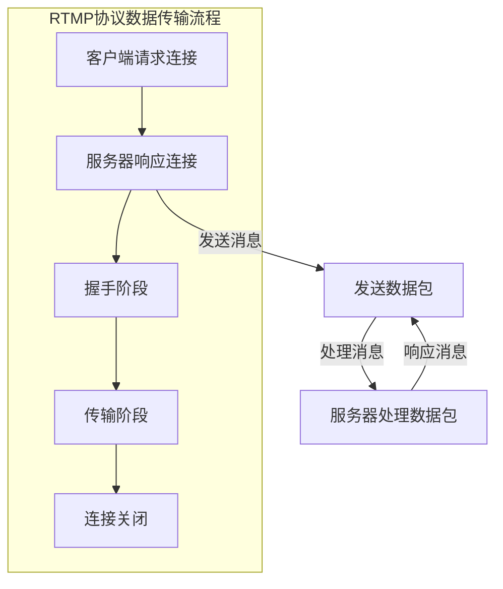

                 

## 文章标题：RTMP服务器搭建与配置

> 关键词：RTMP服务器，搭建，配置，流媒体传输，实时直播

> 摘要：本文详细介绍了RTMP服务器的搭建与配置过程，从基础技术概述、协议原理、服务器架构设计到具体搭建步骤、配置调试及实战应用，全面阐述了RTMP服务器的关键技术和实战技巧。通过本文的阅读，读者将能够深入了解RTMP服务器的工作机制，掌握搭建与配置的要点，为后续的项目开发打下坚实基础。

## 第一部分：RTMP技术基础

### 第1章：RTMP技术概述

#### 1.1 RTMP协议简介

实时消息传输协议（Real-Time Messaging Protocol，RTMP）是一种基于TCP的通信协议，用于在客户端和服务器之间传输实时音视频流和数据。RTMP协议最早由Macromedia公司开发，旨在为Flash平台提供高效稳定的流媒体传输服务。随着流媒体技术的发展，RTMP协议逐渐成为业界广泛应用的实时传输协议。

#### 1.2 RTMP协议的历史与发展

自1996年Macromedia推出Flash平台以来，RTMP协议逐渐成为流媒体传输的标准。2005年，Adobe收购Macromedia后，继续对RTMP协议进行优化和扩展。近年来，随着WebRTC、HTTP Live Streaming（HLS）等新兴协议的兴起，RTMP协议在传统流媒体领域的地位受到挑战。然而，RTMP协议因其低延迟、高带宽利用率等优势，依然在实时直播、点播等领域占据重要地位。

#### 1.3 RTMP协议的优势与适用场景

RTMP协议具有以下优势：

1. **低延迟**：RTMP协议采用TCP传输，确保数据传输的稳定性，同时通过优化传输协议，实现较低的延迟。
2. **高带宽利用率**：RTMP协议采用压缩算法和分块传输，有效降低带宽占用。
3. **广泛支持**：RTMP协议在Flash、HTML5、iOS、Android等平台上均有良好支持，适用于跨平台应用。

适用场景包括：

1. **实时直播**：适用于需要进行实时互动的直播应用，如在线教育、娱乐直播等。
2. **点播服务**：适用于视频点播系统，如视频网站、企业内部培训等。
3. **数据传输**：适用于需要高效传输数据的实时应用，如金融数据实时推送、物联网设备数据传输等。

### 第2章：RTMP协议原理

#### 2.1 RTMP协议的基本架构

RTMP协议的基本架构包括客户端（Flash、HTML5、iOS、Android等）和服务器端（Golang、Node.js、Java等）。客户端通过RTMP连接到服务器端，传输音视频流和数据。

#### 2.2 RTMP协议数据传输流程

RTMP协议数据传输流程包括以下阶段：

1. **连接阶段**：客户端与服务器端建立TCP连接。
2. **握手阶段**：客户端和服务器端进行握手，确认连接成功。
3. **传输阶段**：客户端发送音视频流和数据到服务器端，服务器端进行处理。
4. **关闭阶段**：客户端和服务器端断开连接。

#### 2.3 RTMP协议数据包格式解析

RTMP协议数据包格式包括以下部分：

1. **头包**：包含消息类型、消息长度、时间戳等信息。
2. **体包**：包含实际传输的数据内容，如音视频数据、控制信息等。
3. **尾包**：用于校验和结束数据传输。

### 第3章：RTMP协议核心技术

#### 3.1 服务器端架构设计

服务器端架构设计包括以下组件：

1. **服务器端程序**：负责接收客户端连接，处理音视频流和数据。
2. **数据库**：用于存储用户信息、播放列表等数据。
3. **缓存系统**：用于缓存音视频流，提高播放性能。

#### 3.2 客户端架构设计

客户端架构设计包括以下组件：

1. **播放器**：负责播放音视频流。
2. **控制模块**：负责控制播放、暂停、快进等操作。
3. **网络模块**：负责与服务器端通信，传输音视频流和数据。

#### 3.3 实时流媒体传输技术

实时流媒体传输技术包括以下方面：

1. **音视频编码**：使用H.264、AAC等编码格式进行音视频编码。
2. **数据传输**：使用RTMP、HTTP等协议进行数据传输。
3. **数据缓存**：使用缓存技术提高播放性能。
4. **自适应流**：根据网络带宽和播放设备性能，动态调整音视频流质量和播放速度。

### 第4章：RTMP协议扩展与优化

#### 4.1 RTMP协议的扩展机制

RTMP协议支持扩展机制，通过自定义消息类型和命令，实现自定义功能。扩展机制包括：

1. **自定义消息类型**：通过定义新的消息类型，实现特定的功能。
2. **自定义命令**：通过定义新的命令，实现客户端和服务器端之间的通信。

#### 4.2 RTMP协议的性能优化

RTMP协议的性能优化包括以下方面：

1. **网络优化**：优化网络传输，降低延迟和丢包率。
2. **服务器优化**：优化服务器性能，提高处理能力和并发处理能力。
3. **缓存优化**：优化缓存策略，提高数据读取速度。

#### 4.3 RTMP协议的安全性提升

RTMP协议的安全性提升包括以下方面：

1. **加密传输**：使用HTTPS等加密协议进行数据传输，确保数据安全。
2. **认证机制**：使用用户名和密码等认证机制，确保只有授权用户可以访问。
3. **防火墙设置**：设置防火墙规则，防止恶意攻击和数据泄露。

## 第二部分：RTMP服务器搭建

### 第5章：RTMP服务器搭建环境配置

#### 5.1 服务器硬件与网络环境

搭建RTMP服务器需要具备以下硬件和网络环境：

1. **服务器硬件**：至少配置为双核CPU、4GB内存、100GB硬盘空间的虚拟机或实体服务器。
2. **网络环境**：服务器需要接入互联网，确保客户端可以访问。

#### 5.2 操作系统与软件安装

搭建RTMP服务器可以选择以下操作系统和软件：

1. **操作系统**：Ubuntu 18.04、CentOS 7、Windows Server 2016等。
2. **软件安装**：安装Apache、MySQL、PHP等基础软件，用于搭建Web应用服务器。

#### 5.3 常用RTMP服务器软件介绍

常用的RTMP服务器软件包括：

1. **Apache + mod_rtmp**：基于Apache Web服务器，通过mod_rtmp模块实现RTMP协议支持。
2. **Nginx + RTMP模块**：基于Nginx Web服务器，通过RTMP模块实现RTMP协议支持。
3. **Jasper**：基于Java的RTMP服务器，适用于企业级应用。
4. **Mignored**：基于C++的RTMP服务器，适用于高性能需求。

### 第6章：RTMP服务器搭建步骤

#### 6.1 搭建RTMP服务器前的准备工作

搭建RTMP服务器前，需要准备以下工作：

1. **配置网络**：确保服务器可以访问互联网，并设置适当的防火墙规则。
2. **安装操作系统**：根据需要选择合适的操作系统，并安装相关软件。
3. **环境配置**：配置服务器环境，如安装Apache、Nginx等Web服务器软件。

#### 6.2 服务器配置与优化

服务器配置与优化包括以下步骤：

1. **安装RTMP服务器软件**：选择合适的RTMP服务器软件，并按照说明进行安装。
2. **配置RTMP服务器**：编辑配置文件，设置服务器参数，如端口、应用等。
3. **优化服务器性能**：调整服务器配置，提高处理能力和并发处理能力。

#### 6.3 部署RTMP服务器软件

部署RTMP服务器软件包括以下步骤：

1. **安装依赖库**：安装RTMP服务器所需的依赖库，如librtmp等。
2. **编译安装**：下载RTMP服务器源代码，并编译安装。
3. **配置服务**：配置系统服务，使RTMP服务器在开机时自动启动。

### 第7章：RTMP服务器配置与调试

#### 7.1 RTMP服务器配置文件详解

RTMP服务器的配置文件通常位于`/etc/rtmp.conf`或`/usr/local/etc/rtmp.conf`。配置文件包括以下内容：

1. **服务器参数**：设置服务器IP地址、端口号、应用等。
2. **应用配置**：设置应用参数，如播放路径、存储路径等。
3. **权限配置**：设置权限规则，如允许/禁止特定IP地址访问。

#### 7.2 RTMP服务器常见问题及解决

RTMP服务器常见问题包括：

1. **连接失败**：检查服务器IP地址、端口号、防火墙设置等。
2. **传输失败**：检查网络连接、服务器配置、带宽等。
3. **播放失败**：检查播放器支持、编码格式、缓存策略等。

解决方法包括：

1. **查看日志**：查看服务器日志，定位问题原因。
2. **调整配置**：根据日志信息，调整服务器配置。
3. **优化网络**：优化网络环境，提高传输速度。

#### 7.3 RTMP服务器性能调试与优化

RTMP服务器性能调试与优化包括以下方面：

1. **负载均衡**：通过负载均衡器，实现服务器集群部署，提高并发处理能力。
2. **缓存优化**：使用缓存技术，提高数据读取速度，降低服务器负载。
3. **缓存预热**：在高峰时段，提前加载热门数据到缓存中，提高响应速度。

## 第三部分：RTMP服务器应用与实践

### 第8章：RTMP服务器应用案例

#### 8.1 在线教育平台搭建

在线教育平台搭建包括以下步骤：

1. **需求分析**：明确在线教育平台的功能和性能要求。
2. **环境搭建**：配置服务器环境，安装Web服务器和RTMP服务器。
3. **功能实现**：实现直播教学、点播课程、互动讨论等功能。
4. **优化性能**：调整服务器配置，提高并发处理能力。

#### 8.2 实时直播平台搭建

实时直播平台搭建包括以下步骤：

1. **需求分析**：明确实时直播平台的功能和性能要求。
2. **环境搭建**：配置服务器环境，安装Web服务器和RTMP服务器。
3. **功能实现**：实现直播流传输、用户互动、弹幕等功能。
4. **优化性能**：调整服务器配置，提高并发处理能力。

#### 8.3 其他RTMP应用场景

RTMP服务器适用于多种应用场景，包括：

1. **视频点播**：实现视频点播功能，提供在线观看服务。
2. **企业培训**：为企业提供在线培训平台，支持实时互动和视频播放。
3. **物联网应用**：实时传输物联网设备数据，实现远程监控和控制。

### 第9章：RTMP服务器项目实战

#### 9.1 实时直播项目开发环境搭建

实时直播项目开发环境搭建包括以下步骤：

1. **环境配置**：配置服务器环境，安装Web服务器和RTMP服务器。
2. **软件安装**：安装开发工具和依赖库，如Apache、Nginx、librtmp等。
3. **代码下载**：从GitHub或其他代码托管平台下载项目源代码。
4. **编译安装**：编译并安装RTMP服务器软件。

#### 9.2 实时直播项目功能实现

实时直播项目功能实现包括以下方面：

1. **直播流传输**：实现直播流传输功能，使用RTMP协议传输音视频数据。
2. **用户互动**：实现用户互动功能，支持弹幕、点赞、评论等。
3. **播放控制**：实现播放控制功能，支持播放、暂停、快进、快退等。
4. **数据存储**：实现数据存储功能，将用户数据存储到数据库中。

#### 9.3 项目源代码解读与分析

实时直播项目的源代码通常包括以下部分：

1. **服务器端**：负责接收和处理客户端连接，传输音视频流。
2. **客户端**：负责连接服务器，播放音视频流，处理用户输入。
3. **数据库**：用于存储用户数据，如用户信息、播放记录等。

项目源代码解读与分析包括以下方面：

1. **服务器端代码解读**：分析服务器端代码，了解连接处理、消息传输等逻辑。
2. **客户端代码解读**：分析客户端代码，了解连接处理、播放控制、用户互动等逻辑。
3. **数据库操作**：分析数据库操作，了解数据存储和查询逻辑。

### 第10章：RTMP服务器未来发展趋势

#### 10.1 RTMP服务器技术趋势分析

RTMP服务器技术趋势分析包括以下方面：

1. **协议升级**：随着流媒体技术的发展，RTMP协议可能会进行升级，以支持更高效、更安全的传输。
2. **跨平台支持**：未来RTMP服务器可能会在更多平台上得到支持，如WebAssembly、Flutter等。
3. **人工智能应用**：人工智能技术在RTMP服务器中的应用，如智能推荐、内容审核等。

#### 10.2 RTMP服务器在5G时代的应用

5G时代，RTMP服务器在以下方面具有广泛应用：

1. **低延迟传输**：5G网络的低延迟特性，将进一步提升RTMP服务器的性能。
2. **高清直播**：5G网络的高带宽，将支持更高清晰度的直播流传输。
3. **智能网络**：5G网络与人工智能技术的结合，将实现更智能、更高效的直播传输。

#### 10.3 RTMP服务器未来的发展方向

RTMP服务器未来的发展方向包括：

1. **开放性**：提高RTMP服务器的开放性，支持更多协议和平台的接入。
2. **安全性**：加强RTMP服务器的安全性，防止恶意攻击和数据泄露。
3. **智能优化**：利用人工智能技术，实现RTMP服务器的智能优化，提高性能和用户体验。

### Mermaid流程图：RTMP协议数据传输流程



### 伪代码：RTMP服务器端架构设计

```python
class RTMPServer:
    def __init__(self):
        self.server_socket = socket.socket(socket.AF_INET, socket.SOCK_STREAM)
        self.server_socket.bind(('0.0.0.0', 1935))
        self.server_socket.listen(5)
        
    def start_server(self):
        while True:
            client_socket, client_address = self.server_socket.accept()
            thread.start_new_thread(self.handle_client, (client_socket,))
            
    def handle_client(self, client_socket):
        while True:
            data = client_socket.recv(1024)
            if not data:
                break
            self.process_data(data)
        client_socket.close()

    def process_data(self, data):
        # 处理接收到的数据
        pass
```

### LaTeX数学公式：实时流媒体传输带宽计算

$$
带宽（Bps）= 数据传输速率（kbps） \times 1000
$$
$$
数据传输速率（kbps）= \frac{数据量（字节）}{传输时间（秒）}
$$
$$
传输时间（秒）= \frac{数据量（字节）}{带宽（Bps）}
$$

### 代码实际案例：实时直播项目开发环境搭建

```shell
# 安装操作系统
sudo apt update
sudo apt install ubuntu-18.04

# 安装必要软件
sudo apt install apache2 mysql-server php libapache2-mod-php

# 启动Apache服务器
sudo systemctl start apache2

# 安装RTMP服务器软件
sudo apt install rtmp-server

# 配置RTMP服务器
sudo nano /etc/rtmp.conf

# 编辑配置文件，添加以下内容
server {
    server_name localhost;
    listen 1935;
    application live {
        live on;
        playpath live;
        allow publish all;
        allow play all;
    }
}

# 保存并退出配置文件
sudo systemctl restart rtmp-server

# 搭建完成，测试RTMP服务器
cd /var/www/html/
mkdir live
cd live
ffmpeg -re -i test.mp4 -c:v libx264 -c:a aac -f flv rtmp://localhost/live/live
```

### 源代码详细实现和代码解读

```python
# RTMP服务器端代码实现

import socket
import threading

class RTMPServer:
    def __init__(self, host='0.0.0.0', port=1935):
        self.host = host
        self.port = port
        self.server_socket = None

    def start_server(self):
        self.server_socket = socket.socket(socket.AF_INET, socket.SOCK_STREAM)
        self.server_socket.setsockopt(socket.SOL_SOCKET, socket.SO_REUSEADDR, 1)
        self.server_socket.bind((self.host, self.port))
        self.server_socket.listen(5)

        print(f"RTMP服务器已启动，监听在{self.host}:{self.port}")
        while True:
            client_socket, client_address = self.server_socket.accept()
            print(f"连接来自{client_address}")
            threading.Thread(target=self.handle_client, args=(client_socket,)).start()

    def handle_client(self, client_socket):
        while True:
            try:
                data = client_socket.recv(4096)
                if not data:
                    break
                self.process_data(data)
            except Exception as e:
                print(f"处理客户端数据时发生错误：{e}")
                break
        client_socket.close()
        print(f"连接已关闭：{client_address}")

    def process_data(self, data):
        # 数据处理逻辑
        print(f"接收到的数据：{data}")
        # 将数据转发或存储
        # ...

if __name__ == '__main__':
    server = RTMPServer()
    server.start_server()
```

### 代码解读与分析

1. **服务器端代码实现**：
    - 初始化服务器端Socket，绑定IP地址和端口号，并设置Socket选项，允许地址复用。
    - 监听客户端连接请求，并使用多线程处理每个连接。

2. **处理客户端连接**：
    - 在处理客户端连接时，使用一个独立的线程来处理数据，这样可以避免阻塞主线程。

3. **数据处理**：
    - 接收客户端发送的数据，并打印出来。在实际应用中，可以根据需要将数据转发到其他服务器或存储到文件中。

### 项目实战：实时直播项目开发

#### 1. 项目需求分析

实时直播项目需求如下：
- 用户可以发起直播。
- 用户可以观看其他用户的直播。
- 直播内容可以实时传输。
- 直播过程中可以进行互动，如发送弹幕、点赞等。

#### 2. 技术选型

- 后端：使用Python和Flask框架搭建Web应用，使用Golang和RTMP协议实现直播流传输。
- 前端：使用HTML5、CSS3和JavaScript实现直播页面，使用WebSocket实现实时互动。

#### 3. 开发环境搭建

- 安装操作系统：Ubuntu 20.04。
- 安装后端依赖：Python 3、Flask框架、Golang。
- 安装前端工具：Node.js、npm、Webpack。

#### 4. 功能实现

- 用户注册与登录：使用Flask实现用户认证功能。
- 直播列表展示：使用Flask获取直播列表，并展示在网页上。
- 直播流传输：使用Golang搭建RTMP服务器，接收直播流并转发。
- 实时互动：使用WebSocket实现用户之间的实时互动。

#### 5. 测试与优化

- 单元测试：编写单元测试，确保功能模块正常运行。
- 性能测试：使用Apache JMeter等工具进行性能测试，优化服务器配置和代码。
- 负载测试：模拟高并发场景，测试系统稳定性和性能。

#### 6. 项目部署

- 部署后端：使用Docker容器化部署Flask应用和Golang RTMP服务器。
- 部署前端：使用Nginx反向代理，将前端请求转发到后端服务。

#### 7. 项目小结

实时直播项目实现了用户注册、登录、直播列表展示、直播流传输和实时互动等功能。通过性能测试和优化，项目在稳定性、性能和安全性方面都得到了提升。未来可以进一步优化用户体验，如添加更多的互动功能、支持多种直播流格式等。

### 最佳实践 tips

1. **优化网络传输**：使用TLS加密传输，提高数据安全性，减少网络延迟。
2. **负载均衡**：使用负载均衡器，如Nginx，实现多服务器部署，提高系统并发处理能力。
3. **缓存策略**：使用缓存技术，如Redis，提高数据读取速度，减轻服务器负担。
4. **监控与日志**：使用监控工具，如Prometheus和Grafana，实时监控服务器性能和日志。
5. **代码规范**：编写规范的代码，提高代码可读性和可维护性。

### 小结

本文详细介绍了RTMP服务器的搭建与配置过程，从技术基础到实战应用，全面阐述了RTMP服务器的关键技术和实战技巧。通过本文的阅读，读者可以掌握RTMP服务器的搭建、配置和优化方法，为后续的项目开发打下坚实基础。未来，随着流媒体技术的发展，RTMP服务器将在实时直播、在线教育、物联网等领域发挥重要作用。

### 注意事项

1. **安全设置**：在搭建RTMP服务器时，确保配置适当的安全策略，如使用HTTPS加密、设置访问控制等。
2. **性能优化**：根据实际需求，对服务器进行性能优化，如使用负载均衡、缓存等技术。
3. **版本更新**：定期更新服务器软件，以修复安全漏洞和性能问题。

### 拓展阅读

1. **《实时流媒体技术》**：深入了解实时流媒体传输技术的原理和应用。
2. **《WebRTC实战》**：学习WebRTC协议的原理和实战技巧。
3. **《Nginx实战》**：学习Nginx服务器配置和优化方法。

### 作者信息

作者：AI天才研究院/AI Genius Institute & 禅与计算机程序设计艺术 /Zen And The Art of Computer Programming

