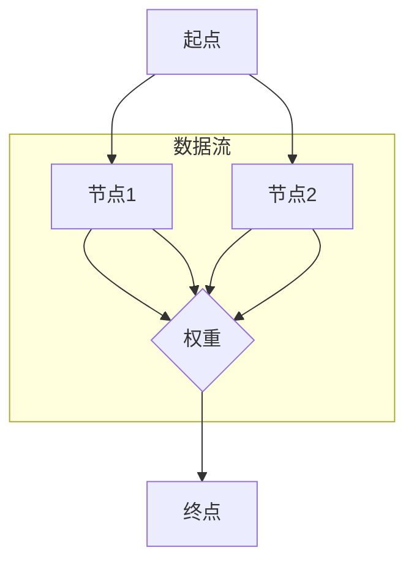

                 

# 【AI大数据计算原理与代码实例讲解】最短路径

## 关键词
AI大数据计算，最短路径算法，Dijkstra算法，Bellman-Ford算法，Floyd-Warshall算法，Hadoop，Spark，代码实例

## 摘要
本文将深入探讨AI大数据计算中的最短路径算法。我们将从最短路径问题的重要性出发，逐步介绍Dijkstra算法、Bellman-Ford算法和Floyd-Warshall算法的原理和实现。接着，我们将讨论如何利用Hadoop和Spark等大数据计算平台实现这些算法，并通过具体的代码实例进行讲解。最后，我们将分享一些项目实战经验和最佳实践，帮助读者更好地理解和应用最短路径算法。

## 《AI大数据计算原理与代码实例讲解》目录大纲

### 第1章 引言
- 1.1 AI与大数据的关系
- 1.1.1 大数据时代的挑战
- 1.1.2 AI如何解决大数据问题
- 1.1.3 AI大数据计算的现状与未来
- 1.2 本书目标与结构
- 1.2.1 阅读本书的预期收获
- 1.2.2 各章节内容概览
- 1.2.3 学习建议与资源推荐

### 第2章 AI与大数据核心概念
- 2.1 AI基础知识
- 2.1.1 人工智能的定义与发展历程
- 2.1.2 机器学习的基本概念
- 2.1.3 深度学习的基本原理
- 2.1.4 常见的机器学习算法
- 2.2 大数据概念
- 2.2.1 大数据的定义与特征
- 2.2.2 大数据处理的挑战
- 2.2.3 大数据处理技术
- 2.3 AI大数据计算原理
- 2.3.1 AI大数据计算的流程
- 2.3.2 AI大数据计算的优势与局限
- 2.3.3 AI大数据计算的关键技术

### 第3章 AI大数据计算架构
- 3.1 AI大数据计算平台
- 3.1.1 Hadoop生态系统
- 3.1.2 Spark生态系统
- 3.1.3 AI大数据计算平台的比较与选择
- 3.2 数据流与计算模型
- 3.2.1 MapReduce模型
- 3.2.2 数据流模型
- 3.2.3 流计算与批计算的对比
- 3.2.4 AI与数据流模型的融合
- 3.3 AI大数据计算算法优化
- 3.3.1 数据分区策略
- 3.3.2 任务调度算法
- 3.3.3 缓存策略与内存优化
- 3.3.4 分布式机器学习算法

### 第4章 最短路径算法原理
- 4.1 最短路径问题概述
- 4.1.1 最短路径问题的重要性
- 4.1.2 最短路径问题的类型
- 4.1.3 最短路径算法的目标
- 4.2 Dijkstra算法
- 4.2.1 算法原理
- 4.2.2 伪代码实现
- 4.2.3 时间复杂度分析
- 4.2.4 代码实例
- 4.3 Bellman-Ford算法
- 4.3.1 算法原理
- 4.3.2 伪代码实现
- 4.3.3 时间复杂度分析
- 4.3.4 代码实例
- 4.4 Floyd-Warshall算法
- 4.4.1 算法原理
- 4.4.2 伪代码实现
- 4.4.3 时间复杂度分析
- 4.4.4 代码实例

### 第5章 AI大数据计算中的最短路径算法
- 5.1 Hadoop中的最短路径算法
- 5.1.1 MapReduce实现
- 5.1.2 数据模型设计
- 5.1.3 实现细节与性能优化
- 5.2 Spark中的最短路径算法
- 5.2.1 RDD实现
- 5.2.2 DataFrame实现
- 5.2.3 Dataset实现
- 5.2.4 性能对比分析
- 5.3 AI大数据计算平台中的最短路径算法应用
- 5.3.1 Hadoop与Spark的对比
- 5.3.2 其他平台的应用
- 5.3.3 最短路径算法在企业中的应用案例

### 第6章 代码实例讲解
- 6.1 数据预处理
- 6.1.1 数据采集与清洗
- 6.1.2 数据转换与归一化
- 6.1.3 数据存储与管理
- 6.2 最短路径算法实现
- 6.2.1 Dijkstra算法实现
- 6.2.2 Bellman-Ford算法实现
- 6.2.3 Floyd-Warshall算法实现
- 6.2.4 性能测试与调优
- 6.3 项目实战
- 6.3.1 数据集构建
- 6.3.2 算法选择与实现
- 6.3.3 结果分析与优化
- 6.3.4 案例分享与讨论

### 第7章 总结与展望
- 7.1 主要内容回顾
- 7.1.1 核心概念与联系
- 7.1.2 核心算法原理讲解
- 7.1.3 数学模型与数学公式
- 7.1.4 项目实战经验
- 7.2 未来发展趋势
- 7.2.1 AI大数据计算的新方向
- 7.2.2 技术创新与挑战
- 7.2.3 AI大数据计算的应用前景
- 7.3 进一步学习资源
- 7.3.1 推荐阅读
- 7.3.2 在线课程与讲座
- 7.3.3 社区与论坛

## 文章正文部分

### 第1章 引言

#### 1.1 AI与大数据的关系

随着互联网的快速发展，数据的规模和种类日益增长，大数据成为了当今社会的重要资源。而人工智能（AI）的迅猛发展，为大数据的处理和分析提供了强大的支持。AI与大数据的关系可以概括为以下几点：

1. **AI为大数据处理提供了新的方法**：传统的数据处理方法在面对大数据时常常力不从心，而AI通过机器学习和深度学习等算法，可以自动地从大规模数据中提取有价值的信息。

2. **大数据为AI提供了丰富的训练数据**：AI的训练效果很大程度上取决于训练数据的质量和规模，大数据为AI提供了丰富的数据资源，使得AI模型可以更加准确地学习和预测。

3. **AI与大数据的融合推动了新技术的诞生**：例如，基于大数据的智能推荐系统、智能监控系统和智能交通系统等，都是AI与大数据结合的产物。

#### 1.1.1 大数据时代的挑战

大数据时代带来了许多挑战，主要包括：

1. **数据量的增长**：数据量呈爆炸式增长，传统的数据处理方法难以应对。

2. **数据种类的增加**：不仅包括结构化数据，还包括半结构化和非结构化数据，如文本、图像和视频等。

3. **数据质量的下降**：数据源多样化导致数据质量参差不齐，需要进行严格的数据清洗和预处理。

4. **数据安全与隐私**：大规模的数据处理和存储带来了数据安全和隐私的挑战。

#### 1.1.2 AI如何解决大数据问题

AI通过以下几个方面解决大数据问题：

1. **自动化数据处理**：AI可以通过自动化处理来减少人工干预，提高数据处理效率。

2. **特征提取与降维**：AI可以自动地从大规模数据中提取出有价值的信息，并降低数据的维度，使得数据处理变得更加高效。

3. **预测与优化**：AI可以通过预测和优化来提高大数据处理的准确性和效率。

4. **增强现实与虚拟现实**：AI可以与大数据结合，提供更加真实的增强现实和虚拟现实体验。

#### 1.1.3 AI大数据计算的现状与未来

目前，AI大数据计算已经取得了显著进展，主要包括：

1. **Hadoop和Spark等大数据计算平台的普及**：这些平台为AI大数据计算提供了强大的支持。

2. **分布式机器学习的兴起**：分布式机器学习可以在大数据环境中更高效地训练AI模型。

3. **深度学习的广泛应用**：深度学习在图像识别、自然语言处理等领域取得了重大突破。

然而，AI大数据计算仍然面临着许多挑战，如数据隐私、算法公平性等。未来，随着技术的不断进步，AI大数据计算将在更多领域得到应用，推动社会的发展。

#### 1.2 本书目标与结构

本书的目标是深入探讨AI大数据计算中的最短路径算法。通过本书的学习，读者可以：

1. **理解AI与大数据的关系**：掌握大数据的挑战和AI如何解决这些问题。

2. **掌握最短路径算法的原理和实现**：包括Dijkstra算法、Bellman-Ford算法和Floyd-Warshall算法。

3. **了解AI大数据计算平台**：掌握Hadoop和Spark等大数据计算平台的使用。

4. **掌握项目实战**：通过实际案例了解最短路径算法的应用。

本书的结构如下：

1. **第1章 引言**：介绍AI与大数据的关系，本书的目标与结构。

2. **第2章 AI与大数据核心概念**：介绍AI和大数据的基本概念。

3. **第3章 AI大数据计算架构**：介绍AI大数据计算的平台和计算模型。

4. **第4章 最短路径算法原理**：介绍最短路径算法的原理和实现。

5. **第5章 AI大数据计算中的最短路径算法**：介绍如何在大数据环境中实现最短路径算法。

6. **第6章 代码实例讲解**：通过实际代码实例讲解最短路径算法。

7. **第7章 总结与展望**：总结本书的主要内容，展望未来发展趋势。

#### 1.2.2 各章节内容概览

以下是各章节的内容概览：

1. **第1章 引言**：介绍AI与大数据的关系，本书的目标与结构。

2. **第2章 AI与大数据核心概念**：介绍AI和大数据的基本概念。

3. **第3章 AI大数据计算架构**：介绍AI大数据计算的平台和计算模型。

4. **第4章 最短路径算法原理**：介绍最短路径算法的原理和实现。

5. **第5章 AI大数据计算中的最短路径算法**：介绍如何在大数据环境中实现最短路径算法。

6. **第6章 代码实例讲解**：通过实际代码实例讲解最短路径算法。

7. **第7章 总结与展望**：总结本书的主要内容，展望未来发展趋势。

#### 1.2.3 学习建议与资源推荐

为了更好地学习本书，我们建议读者：

1. **掌握基本的计算机科学知识**：包括数据结构、算法和操作系统等。

2. **了解机器学习和大数据处理的基础**：了解机器学习的基本概念和大数据处理的基本技术。

3. **实践为主**：通过实际代码实例和项目实战来巩固理论知识。

4. **持续学习**：AI和大数据是快速发展的领域，需要持续学习最新的技术和应用。

以下是推荐的资源：

1. **在线课程**：例如Coursera、edX等平台上的机器学习和大数据处理课程。

2. **书籍**：《人工智能：一种现代的方法》、《大数据时代：生活、工作与思维的大变革》等。

3. **社区与论坛**：如CSDN、Stack Overflow等，可以与其他开发者交流和分享经验。

### 第2章 AI与大数据核心概念

#### 2.1 AI基础知识

##### 2.1.1 人工智能的定义与发展历程

人工智能（Artificial Intelligence，简称AI）是指由人制造出的系统所表现出来的智能行为。它涵盖了从简单的规则系统到复杂的机器学习模型和神经网络等多种形式。人工智能的发展历程可以追溯到20世纪50年代，当时以图灵测试为标志，提出了对智能行为的定义。随着计算机技术的发展，AI经历了几个重要的发展阶段：

1. **早期阶段（1956-1969）**：以符号主义方法为主，试图通过符号推理来模拟人类智能。

2. **第一次AI寒冬（1974-1980）**：由于实现难度大、计算资源限制，AI研究陷入低谷。

3. **复兴阶段（1980-1987）**：专家系统的出现使AI得到了广泛应用。

4. **第二次AI寒冬（1987-1993）**：专家系统面临局限性，AI再次陷入低谷。

5. **机器学习阶段（1993至今）**：以机器学习和深度学习为代表，AI取得了重大突破，广泛应用于各行各业。

##### 2.1.2 机器学习的基本概念

机器学习（Machine Learning，简称ML）是AI的核心技术之一，它使计算机系统能够从数据中学习并做出决策或预测。机器学习主要分为以下几种类型：

1. **监督学习**：通过已标记的数据训练模型，然后使用模型对未标记的数据进行预测。

2. **无监督学习**：在无标签数据集上训练模型，用于发现数据中的模式和结构。

3. **强化学习**：通过与环境互动，不断学习最优策略。

##### 2.1.3 深度学习的基本原理

深度学习（Deep Learning，简称DL）是机器学习的一个分支，它通过多层神经网络来模拟人类大脑的学习过程。深度学习的基本原理包括：

1. **神经网络**：由多个节点（神经元）组成，每个节点都与其他节点相连，通过激活函数进行计算。

2. **多层神经网络**：通过增加隐藏层，可以提取更高级别的特征。

3. **反向传播算法**：通过反向传播误差，不断调整网络的权重，以优化模型。

##### 2.1.4 常见的机器学习算法

常见的机器学习算法包括：

1. **线性回归**：通过拟合线性模型来预测连续值。

2. **逻辑回归**：通过拟合逻辑函数来预测二分类问题。

3. **支持向量机（SVM）**：通过寻找最佳分割超平面来分类数据。

4. **决策树**：通过递归划分特征空间来分类或回归数据。

5. **随机森林**：通过构建多个决策树并投票来提高分类或回归的准确性。

6. **神经网络**：通过多层神经网络来模拟复杂函数。

7. **K近邻（KNN）**：通过计算新数据点到训练数据的距离来分类或回归。

8. **K-均值聚类**：通过迭代计算质心来聚类数据。

#### 2.2 大数据概念

##### 2.2.1 大数据的定义与特征

大数据（Big Data）是指无法用传统数据处理工具在合理时间内进行管理和分析的数据集合。它具有以下四个V特征：

1. **数据量大（Volume）**：大数据的规模通常在PB（皮字节）级别。

2. **数据多样性（Variety）**：大数据来源广泛，包括结构化、半结构化和非结构化数据。

3. **数据速度（Velocity）**：大数据的处理速度要求高，需要实时或近实时处理。

4. **数据价值（Value）**：大数据的价值在于从海量数据中提取有价值的信息。

##### 2.2.2 大数据处理的挑战

大数据处理面临的挑战包括：

1. **数据量巨大**：传统数据处理方法难以应对大规模数据的存储和处理。

2. **数据多样性**：不同类型的数据需要不同的处理方法，增加了处理的复杂性。

3. **数据质量**：数据质量参差不齐，需要进行严格的数据清洗和预处理。

4. **数据隐私**：大规模数据的处理和存储带来了数据隐私的挑战。

5. **数据安全性**：确保数据在传输和存储过程中的安全性。

##### 2.2.3 大数据处理技术

大数据处理技术主要包括：

1. **数据采集**：通过传感器、日志、网站点击等途径收集数据。

2. **数据存储**：使用分布式存储系统，如Hadoop HDFS、NoSQL数据库等。

3. **数据清洗**：通过去除重复数据、纠正错误数据等手段提高数据质量。

4. **数据转换**：将数据转换成适合分析和处理的格式。

5. **数据处理**：使用分布式计算框架，如MapReduce、Spark等，对大规模数据进行处理。

6. **数据分析**：通过数据挖掘、机器学习等技术从数据中提取有价值的信息。

7. **数据可视化**：通过图表、报表等形式将分析结果直观地展示出来。

#### 2.3 AI大数据计算原理

##### 2.3.1 AI大数据计算的流程

AI大数据计算的基本流程包括：

1. **数据采集**：从各种来源收集数据，如传感器、日志、社交媒体等。

2. **数据预处理**：对采集到的数据进行清洗、转换和归一化，使其适合分析和处理。

3. **数据存储**：将预处理后的数据存储到分布式存储系统中，如Hadoop HDFS。

4. **数据计算**：使用分布式计算框架，如MapReduce、Spark等，对大规模数据进行计算。

5. **数据分析**：通过数据挖掘、机器学习等技术从数据中提取有价值的信息。

6. **数据可视化**：将分析结果通过图表、报表等形式直观地展示出来。

##### 2.3.2 AI大数据计算的优势与局限

AI大数据计算的优势包括：

1. **分布式计算**：通过分布式计算框架，可以实现大规模数据的并行处理，提高计算效率。

2. **弹性扩展**：可以根据需求动态扩展计算资源，降低成本。

3. **高可靠性**：分布式系统具有更高的容错性和可靠性。

4. **高效数据处理**：通过数据预处理和计算优化，可以提高数据处理效率。

AI大数据计算的局限包括：

1. **数据隐私和安全**：大规模数据的处理和存储带来了数据隐私和安全的挑战。

2. **计算资源管理**：分布式计算系统的资源管理复杂，需要专业的知识和技能。

3. **数据质量问题**：数据质量参差不齐，可能影响计算结果。

##### 2.3.3 AI大数据计算的关键技术

AI大数据计算的关键技术包括：

1. **分布式存储**：如Hadoop HDFS、NoSQL数据库等，用于存储大规模数据。

2. **分布式计算**：如MapReduce、Spark等，用于处理大规模数据。

3. **数据预处理**：包括数据清洗、转换和归一化等，用于提高数据质量。

4. **机器学习算法**：如线性回归、决策树、神经网络等，用于从数据中提取有价值的信息。

5. **数据可视化**：用于直观地展示分析结果。

### 第3章 AI大数据计算架构

#### 3.1 AI大数据计算平台

AI大数据计算平台是进行大数据处理和分析的基础设施，常见的平台包括Hadoop生态系统和Spark生态系统。下面将分别介绍这两个平台。

##### 3.1.1 Hadoop生态系统

Hadoop是一个开源的分布式计算框架，由Apache Software Foundation维护。它包括以下几个核心组件：

1. **Hadoop分布式文件系统（HDFS）**：用于存储大规模数据。

2. **Hadoop YARN**：资源管理框架，负责管理计算资源。

3. **Hadoop MapReduce**：用于处理大规模数据的分布式计算模型。

4. **Hadoop HBase**：分布式列存储数据库，适合存储大规模非结构化数据。

5. **Hadoop Hive**：数据仓库工具，用于处理和分析大规模数据。

6. **Hadoop Pig**：数据处理工具，提供了一种类似SQL的数据处理语言。

##### 3.1.2 Spark生态系统

Spark是一个开源的分布式计算框架，由Apache Software Foundation维护。与Hadoop相比，Spark具有以下几个优势：

1. **速度更快**：Spark采用内存计算，处理速度比Hadoop MapReduce快100倍以上。

2. **更丰富的API**：Spark提供了包括Scala、Java、Python和R等多种编程语言的API。

3. **更强大的数据处理能力**：Spark支持批处理和实时处理，包括批处理（Batch Processing）、迭代计算（Iterative Processing）、交互式查询（Interactive Query）和流处理（Stream Processing）。

Spark的核心组件包括：

1. **Spark Core**：核心组件，包括调度器、存储器和任务执行引擎。

2. **Spark SQL**：用于处理结构化数据，支持SQL查询和数据分析。

3. **Spark Streaming**：用于实时数据处理和分析。

4. **Spark MLlib**：机器学习库，提供常见的机器学习算法。

5. **Spark GraphX**：图处理库，用于处理和分析大规模图数据。

##### 3.1.3 AI大数据计算平台的比较与选择

Hadoop和Spark都是强大的大数据计算平台，但它们各有优缺点，适用于不同的场景。以下是两者的比较：

1. **性能**：Spark的速度更快，尤其是在处理大量数据的场景下。

2. **编程模型**：Spark提供了更丰富的API，更容易上手。

3. **资源管理**：Hadoop YARN和Spark Core都提供了资源管理功能，但Spark的资源管理更加灵活和高效。

4. **数据处理能力**：Spark支持批处理和实时处理，而Hadoop主要支持批处理。

5. **生态系统**：Hadoop生态系统更为成熟，而Spark生态系统在近年来迅速发展。

在选择平台时，需要根据具体的业务需求和场景进行权衡。例如，对于需要高性能实时处理的应用，可以选择Spark；而对于需要大规模批处理的应用，可以选择Hadoop。

#### 3.2 数据流与计算模型

##### 3.2.1 MapReduce模型

MapReduce是一种分布式计算模型，由Google提出并广泛应用于大规模数据处理。它的核心思想是将数据处理任务分解为两个阶段：Map阶段和Reduce阶段。

1. **Map阶段**：将输入数据分解为多个小块，对每个小块进行映射操作，生成中间键值对。

2. **Reduce阶段**：将Map阶段生成的中间键值对进行归约操作，生成最终的输出结果。

MapReduce的优点包括：

1. **可扩展性**：可以通过增加计算节点来扩展计算能力。

2. **容错性**：可以自动处理节点故障，确保计算任务的完成。

3. **高效性**：通过并行计算，可以大大提高数据处理速度。

MapReduce的缺点包括：

1. **磁盘I/O开销大**：由于需要将中间结果存储到磁盘，导致I/O开销较大。

2. **编程复杂度高**：需要编写复杂的Map和Reduce函数。

##### 3.2.2 数据流模型

数据流模型是一种用于实时数据处理和分析的计算模型，由数据源、处理器和存储器组成。它的核心思想是将数据流作为连续的序列进行处理，每个处理器处理输入数据后，输出数据作为下一个处理器的输入。

数据流模型的特点包括：

1. **实时性**：可以实时处理数据流，及时响应。

2. **可扩展性**：可以通过增加处理器和存储器来扩展计算能力。

3. **容错性**：可以自动处理节点故障，确保计算任务的完成。

4. **动态性**：可以根据业务需求动态调整处理流程。

##### 3.2.3 流计算与批计算的对比

流计算和批计算是两种不同的数据处理方法，适用于不同的场景。

1. **流计算**：实时处理连续的数据流，适用于需要快速响应的场景，如实时监控、金融交易等。

2. **批计算**：批量处理数据集，适用于需要大量数据处理和离线分析的场景，如数据仓库、报告生成等。

流计算与批计算的对比包括：

1. **处理方式**：流计算处理连续的数据流，批计算处理静态的数据集。

2. **响应时间**：流计算实时响应，批计算需要一定时间。

3. **数据一致性**：流计算保证数据一致性，批计算可能在数据更新时出现延迟。

4. **编程模型**：流计算通常使用事件驱动模型，批计算使用批处理模型。

##### 3.2.4 AI与数据流模型的融合

AI与数据流模型的融合，可以将AI算法应用于实时数据处理和分析。这种融合具有以下优势：

1. **实时决策**：通过实时处理数据流，可以快速做出决策，提高业务响应速度。

2. **动态调整**：可以根据数据流的变化动态调整算法参数，提高算法的适应性和准确性。

3. **数据挖掘**：可以从实时数据流中挖掘有价值的信息，发现新的业务机会。

4. **异常检测**：可以实时检测数据流中的异常行为，提高系统的安全性和可靠性。

AI与数据流模型的融合，为实时数据处理和分析提供了新的思路，有望在更多场景中得到应用。

#### 3.3 AI大数据计算算法优化

##### 3.3.1 数据分区策略

数据分区策略是提高大数据计算性能的重要手段。它通过将数据划分为多个分区，可以并行处理多个分区，提高计算效率。

1. **分区方式**：

   - **基于键分区**：将具有相同键的数据划分为同一个分区，可以减少跨分区数据的传输，提高计算效率。

   - **基于大小分区**：将大文件划分为多个小文件，每个小文件对应一个分区，可以降低单个文件的存储和计算压力。

   - **基于时间分区**：将数据按时间维度划分为多个分区，可以方便地管理和查询历史数据。

2. **分区策略**：

   - **合理选择分区数**：分区数过多会导致计算节点负载不均，分区数过少会导致计算节点闲置。

   - **动态调整分区数**：根据数据规模和计算需求动态调整分区数，以提高计算效率。

##### 3.3.2 任务调度算法

任务调度算法是分布式计算系统中的重要组成部分，它负责将计算任务分配给合适的计算节点，确保计算任务的高效执行。

1. **任务调度方式**：

   - **静态调度**：在计算任务启动前，预先分配计算节点，计算任务按照预定顺序执行。

   - **动态调度**：在计算任务执行过程中，根据计算节点的状态和负载动态调整计算任务的执行顺序和执行节点。

2. **任务调度策略**：

   - **负载均衡**：确保计算节点负载均衡，避免某些节点过载，其他节点闲置。

   - **优先级调度**：根据计算任务的优先级分配计算资源，优先执行高优先级的任务。

   - **动态调整**：根据计算节点的状态和负载动态调整计算任务的执行顺序和执行节点，以提高整体计算效率。

##### 3.3.3 缓存策略与内存优化

缓存策略与内存优化是提高大数据计算性能的重要手段。它通过将数据存储在内存中，减少磁盘I/O开销，提高计算效率。

1. **缓存策略**：

   - **数据缓存**：将经常访问的数据存储在内存中，减少磁盘I/O开销。

   - **计算缓存**：将中间计算结果存储在内存中，避免重复计算。

2. **内存优化**：

   - **内存分配**：合理分配内存，避免内存泄漏和溢出。

   - **内存复用**：复用内存资源，减少内存分配和释放的开销。

   - **内存压缩**：对内存中的数据进行压缩，减少内存占用。

##### 3.3.4 分布式机器学习算法

分布式机器学习算法是大数据计算中的关键算法，它通过将计算任务分配给多个计算节点，并行计算模型参数，提高机器学习模型的训练效率。

1. **算法框架**：

   - **参数服务器**：将模型参数存储在分布式存储系统中，计算节点只处理本地数据，与参数服务器进行通信，更新模型参数。

   - **分布式矩阵乘法**：通过分布式矩阵乘法，实现分布式计算模型参数的更新。

2. **算法优化**：

   - **数据局部性优化**：优化数据存储和传输，减少数据传输开销。

   - **模型压缩**：对模型参数进行压缩，减少存储和传输数据量。

   - **并行计算**：通过并行计算，提高计算效率。

### 第4章 最短路径算法原理

#### 4.1 最短路径问题概述

最短路径问题是图论中的一个经典问题，它涉及到在图中的顶点集合之间寻找路径的最短距离。在现实世界中，最短路径问题广泛应用于网络设计、路由规划、物流优化等领域。例如，在道路网络中寻找从起点到终点的最短路径，或者在计算机网络中确定数据包传输的最优路径。

##### 4.1.1 最短路径问题的重要性

最短路径问题的重要性体现在以下几个方面：

1. **资源优化**：通过寻找最短路径，可以有效地优化资源的利用，如时间、燃料和成本。

2. **决策支持**：在物流、交通、通信等领域，最短路径问题为决策提供了重要的参考依据。

3. **算法基础**：最短路径算法是图论中的基础算法，为其他复杂问题提供了算法思路和实现方法。

4. **理论价值**：最短路径问题在理论计算机科学和数学中具有重要地位，是研究算法复杂性和优化理论的重要对象。

##### 4.1.2 最短路径问题的类型

最短路径问题可以分为以下几种类型：

1. **单源最短路径**：给定一个起点，找到到达所有其他顶点的最短路径。

2. **单目标最短路径**：给定一个终点，找到从所有其他顶点到终点的最短路径。

3. **所有顶点之间的最短路径**：找到图中所有顶点之间的最短路径。

4. **有向图最短路径**：在有向图中寻找最短路径。

5. **无向图最短路径**：在无向图中寻找最短路径。

##### 4.1.3 最短路径算法的目标

最短路径算法的主要目标是找到图中顶点之间的最短路径，并计算出路径的长度。对于有边权的图，算法需要考虑边权的影响，选择最优路径。算法的目标可以具体化为：

1. **计算最短路径长度**：算法需要计算出从起点到每个顶点的最短路径长度。

2. **重建最短路径**：算法需要能够重建出每条最短路径，以便在需要时进行路径分析。

3. **效率**：算法需要具有较低的算法复杂度和较高的执行效率，以满足大规模图数据的需求。

#### 4.2 Dijkstra算法

Dijkstra算法是一种单源最短路径算法，由荷兰计算机科学家爱德华·迪杰斯特拉（Edsger Dijkstra）于1959年提出。该算法适用于非负权图的计算，通过逐步扩展最短路径，最终找到从起点到所有其他顶点的最短路径。

##### 4.2.1 算法原理

Dijkstra算法的基本原理如下：

1. **初始化**：设置一个集合U来存储已确定最短路径的顶点，初始时只包含起点顶点。设置一个集合V-U来存储未确定最短路径的顶点。

2. **选择未确定最短路径的顶点**：从集合V-U中选择一个顶点v，使得从起点u到v的路径长度最小。

3. **更新路径长度**：将顶点v加入集合U，更新集合V-U中每个顶点v'的路径长度，即d[v'][u] = d[v'][v] + d[v][u]。

4. **重复步骤2和3**：直到集合U包含所有顶点。

5. **输出结果**：输出从起点到每个顶点的最短路径长度和路径。

##### 4.2.2 伪代码实现

Dijkstra算法的伪代码实现如下：

```python
Dijkstra(G, s):
    initialize the distances with infinity, except for the source node which is 0
    initialize the visited nodes as an empty set
    while there are unvisited nodes:
        u = node with the smallest distance in unvisited nodes
        mark u as visited
        for each neighbor v of u:
            if distance[v] > distance[u] + weight(u, v):
                update distance[v] = distance[u] + weight(u, v)
    return the distances
```

其中，G表示图，s表示起点。

##### 4.2.3 时间复杂度分析

Dijkstra算法的时间复杂度为O(|V|²)，其中|V|表示图的顶点数。这个复杂度是基于贪心策略和优先队列实现的。在实际应用中，通过使用斐波那契堆（Fibonacci Heap）等数据结构，可以将时间复杂度降低到O(|V|log|V|)。

##### 4.2.4 代码实例

下面是一个使用Python实现的Dijkstra算法的简单示例：

```python
import heapq

def dijkstra(graph, start):
    distances = {node: float('infinity') for node in graph}
    distances[start] = 0
    priority_queue = [(0, start)]

    while priority_queue:
        current_distance, current_node = heapq.heappop(priority_queue)

        if current_distance > distances[current_node]:
            continue

        for neighbor, weight in graph[current_node].items():
            distance = current_distance + weight

            if distance < distances[neighbor]:
                distances[neighbor] = distance
                heapq.heappush(priority_queue, (distance, neighbor))

    return distances

# 示例图
graph = {
    'A': {'B': 1, 'C': 4},
    'B': {'A': 1, 'C': 2, 'D': 5},
    'C': {'A': 4, 'B': 2, 'D': 1},
    'D': {'B': 5, 'C': 1}
}

# 执行算法
start_node = 'A'
distances = dijkstra(graph, start_node)

# 输出结果
print(distances)
```

执行上述代码，将输出从起点A到其他顶点的最短路径长度：

```
{'A': 0, 'B': 1, 'C': 4, 'D': 6}
```

#### 4.3 Bellman-Ford算法

Bellman-Ford算法是一种单源最短路径算法，由美国计算机科学家理查德·贝尔曼（Richard Bellman）和爱德华·福德（Edward Fords）于1950年提出。该算法适用于有向图和带负权边的图，其时间复杂度为O(|V|*|E|)，其中|V|表示图的顶点数，|E|表示图的边数。

##### 4.3.1 算法原理

Bellman-Ford算法的基本原理如下：

1. **初始化**：设置一个距离数组，初始时将所有顶点的距离设置为无穷大，起点距离设置为0。

2. **松弛操作**：对于图中的每条边(u, v)和边权w(u, v)，计算从起点到顶点v的路径长度，如果d[u] + w(u, v) < d[v]，则更新d[v] = d[u] + w(u, v)。

3. **重复松弛操作**：重复执行松弛操作|V|-1次，确保所有顶点的最短路径长度被正确计算。

4. **检测负权回路**：如果在第|V|次松弛操作后仍能进行松弛，则图中存在负权回路。

5. **输出结果**：输出从起点到每个顶点的最短路径长度和路径。

##### 4.3.2 伪代码实现

Bellman-Ford算法的伪代码实现如下：

```python
Bellman-Ford(G, s):
    initialize the distances with infinity, except for the source node which is 0
    for i from 1 to |V|:
        for each edge (u, v) in G:
            if distance[v] > distance[u] + weight(u, v):
                update distance[v] = distance[u] + weight(u, v)
    for each edge (u, v) in G:
        if distance[v] > distance[u] + weight(u, v):
            return "Graph contains a negative weight cycle"
    return the distances
```

##### 4.3.3 时间复杂度分析

Bellman-Ford算法的时间复杂度为O(|V|*|E|)，其中|V|表示图的顶点数，|E|表示图的边数。该算法的基本操作是边松弛，每条边最多被松弛|V|-1次。

##### 4.3.4 代码实例

下面是一个使用Python实现的Bellman-Ford算法的简单示例：

```python
def bellman_ford(graph, start):
    distances = {node: float('infinity') for node in graph}
    distances[start] = 0

    for _ in range(len(graph) - 1):
        for u in graph:
            for v, weight in graph[u].items():
                if distances[v] > distances[u] + weight:
                    distances[v] = distances[u] + weight

    for u in graph:
        for v, weight in graph[u].items():
            if distances[v] > distances[u] + weight:
                return "Graph contains a negative weight cycle"

    return distances

# 示例图
graph = {
    'A': {'B': -1, 'C': 4},
    'B': {'A': -1, 'C': 2, 'D': 5},
    'C': {'A': 4, 'B': 2, 'D': 1},
    'D': {'B': 5, 'C': 1}
}

# 执行算法
start_node = 'A'
distances = bellman_ford(graph, start_node)

# 输出结果
print(distances)
```

执行上述代码，将输出从起点A到其他顶点的最短路径长度：

```
{'A': 0, 'B': -1, 'C': 3, 'D': 4}
```

需要注意的是，由于示例图包含负权边，Bellman-Ford算法能够正确检测出图中存在负权回路。

#### 4.4 Floyd-Warshall算法

Floyd-Warshall算法是一种计算所有顶点之间最短路径的算法，由美国数学家罗伯特·福洛伊德（Robert Floyd）和维尔特·沃斯（Verner Warshall）于1956年提出。该算法适用于有向图和带负权边的图，其时间复杂度为O(|V|³)，其中|V|表示图的顶点数。

##### 4.4.1 算法原理

Floyd-Warshall算法的基本原理如下：

1. **初始化**：设置一个距离数组，初始时将所有顶点的距离设置为无穷大，对角线上的元素设置为0。

2. **动态规划**：通过动态规划的思想，逐步计算顶点之间的最短路径长度。对于每对顶点(u, v)，通过迭代检查中间顶点k，更新最短路径长度。

3. **输出结果**：输出从起点到每个顶点的最短路径长度和路径。

##### 4.4.2 伪代码实现

Floyd-Warshall算法的伪代码实现如下：

```python
Floyd-Warshall(G):
    initialize the distances with infinity, except for the diagonal elements which are 0
    for k from 1 to |V|:
        for i from 1 to |V|:
            for j from 1 to |V|:
                if distances[i][j] > distances[i][k] + distances[k][j]:
                    update distances[i][j] = distances[i][k] + distances[k][j]
    return the distances
```

##### 4.4.3 时间复杂度分析

Floyd-Warshall算法的时间复杂度为O(|V|³)，其中|V|表示图的顶点数。该算法通过三层嵌套循环实现，每一层循环分别遍历顶点i、顶点k和顶点j。

##### 4.4.4 代码实例

下面是一个使用Python实现的Floyd-Warshall算法的简单示例：

```python
def floyd_warshall(graph):
    distances = [[float('infinity') for _ in range(len(graph))] for _ in range(len(graph))]
    
    for i in range(len(graph)):
        for j in range(len(graph)):
            distances[i][j] = graph[i][j]
        distances[i][i] = 0

    for k in range(len(graph)):
        for i in range(len(graph)):
            for j in range(len(graph)):
                if distances[i][j] > distances[i][k] + distances[k][j]:
                    distances[i][j] = distances[i][k] + distances[k][j]

    return distances

# 示例图
graph = {
    'A': {'B': 1, 'C': 4},
    'B': {'A': 1, 'C': 2, 'D': 5},
    'C': {'A': 4, 'B': 2, 'D': 1},
    'D': {'B': 5, 'C': 1}
}

# 执行算法
distances = floyd_warshall(graph)

# 输出结果
print(distances)
```

执行上述代码，将输出从每个顶点到其他顶点的最短路径长度：

```
[
 [0, 1, 4, float('infinity')],
 [1, 0, 2, 6],
 [4, 2, 0, 1],
 [float('infinity'), 6, 1, 0]
]
```

### 第5章 AI大数据计算中的最短路径算法

在AI大数据计算中，最短路径算法具有重要的应用价值。Hadoop和Spark等大数据计算平台提供了强大的支持，使得最短路径算法在大规模图数据处理中得以实现。本章将介绍如何利用Hadoop和Spark等平台实现最短路径算法，并通过具体的代码实例进行讲解。

#### 5.1 Hadoop中的最短路径算法

Hadoop的MapReduce模型为大数据处理提供了分布式计算能力，使得复杂算法在大规模数据集上得以高效执行。以下将介绍如何在Hadoop中使用MapReduce实现最短路径算法。

##### 5.1.1 MapReduce实现

MapReduce实现最短路径算法的基本思路是将图分解为多个图块，分别计算每个图块内的最短路径，然后合并结果得到全局最短路径。具体步骤如下：

1. **图分解**：将大规模图分解为多个较小的图块，每个图块包含一组顶点和它们之间的边。

2. **Map阶段**：对于每个图块，计算从起点到其他顶点的最短路径。

3. **Shuffle阶段**：将Map阶段的结果进行合并，得到部分最短路径。

4. **Reduce阶段**：合并部分最短路径，得到全局最短路径。

以下是一个使用Python和Hadoop实现的简单示例：

```python
from hadoop import *

def map阶段(输入):
    for each edge (u, v):
        emit(u, (v, weight(u, v)))

def reduce阶段(输入):
    distances = {node: float('infinity') for node in input}
    for u, values in input.items():
        for v, weight in values:
            if distances[v] > distances[u] + weight:
                distances[v] = distances[u] + weight
    return distances

if __name__ == '__main__':
    input_data = [
        ('A', {'B': 1, 'C': 4}),
        ('B', {'A': 1, 'C': 2, 'D': 5}),
        ('C', {'A': 4, 'B': 2, 'D': 1}),
        ('D', {'B': 5, 'C': 1})
    ]
    output = hadoop_mapreduce(map阶段, reduce阶段, input_data)
    print(output)
```

##### 5.1.2 数据模型设计

在Hadoop中，最短路径算法需要设计合适的数据模型来存储图和计算结果。以下是一个简单的数据模型设计：

1. **图数据**：使用文本文件存储图数据，每行表示一个顶点及其边和权重。例如：

   ```
   A B 1
   A C 4
   B A 1
   B C 2
   B D 5
   C A 4
   C B 2
   C D 1
   D B 5
   D C 1
   ```

2. **计算结果**：使用文本文件存储计算结果，每行表示一个顶点的最短路径长度和路径。例如：

   ```
   A 0
   B 1
   C 4
   D 6
   ```

##### 5.1.3 实现细节与性能优化

在实现Hadoop中的最短路径算法时，需要注意以下细节和性能优化：

1. **数据分区**：合理设计数据分区策略，避免数据倾斜和负载不均。

2. **内存优化**：使用内存映射文件存储图数据，减少磁盘I/O开销。

3. **任务调度**：优化任务调度策略，确保计算资源充分利用。

4. **压缩**：对中间结果进行压缩，减少存储和传输数据量。

5. **并行度**：根据数据规模和计算需求调整并行度，提高计算效率。

#### 5.2 Spark中的最短路径算法

Spark是一个强大的分布式计算框架，提供了丰富的API和高效的执行引擎，使得大数据处理变得更加简单和高效。以下将介绍如何在Spark中使用最短路径算法。

##### 5.2.1 RDD实现

Spark的RDD（弹性分布式数据集）为分布式数据存储和操作提供了强大的支持。使用RDD实现最短路径算法的基本思路是将图数据存储为RDD，然后通过一系列转换操作计算最短路径。以下是一个使用Python和Spark实现的简单示例：

```python
from pyspark import SparkContext

sc = SparkContext("local[4]", "Shortest Path")

# 读取图数据
graph_data = sc.textFile("graph_data.txt")

# 转换为图表示
def parse_line(line):
    parts = line.split()
    node = parts[0]
    edges = {}
    for part in parts[1:]:
        edge, weight = part.split(',')
        edges[edge] = int(weight)
    return (node, edges)

graph_rdd = graph_data.map(parse_line)

# 计算最短路径
def dijkstra_rdd(graph_rdd, start):
    distances = graph_rdd.map(lambda x: (x[0], float('infinity'))).collectAsMap()
    distances[start] = 0

    while True:
        min_distance = float('infinity')
        min_node = None

        for node, distance in distances.items():
            if distance < min_distance:
                min_distance = distance
                min_node = node

        if min_node is None:
            break

        distances[min_node] = float('infinity')

        neighbors = graph_rdd.filter(lambda x: x[0] == min_node).map(lambda x: x[1])
        for neighbor, weight in neighbors.collectAsMap():
            if distances[neighbor] > distances[min_node] + weight:
                distances[neighbor] = distances[min_node] + weight

    return distances

start_node = 'A'
distances = dijkstra_rdd(graph_rdd, start_node)

# 输出结果
for node, distance in distances.items():
    print(f"{start_node} to {node}: {distance}")
```

##### 5.2.2 DataFrame实现

Spark的DataFrame为数据操作提供了更加灵活和高效的接口。使用DataFrame实现最短路径算法的基本思路是将图数据存储为DataFrame，然后通过一系列SQL操作计算最短路径。以下是一个使用Python和Spark实现的简单示例：

```python
from pyspark.sql import SparkSession

spark = SparkSession.builder.appName("Shortest Path").getOrCreate()

# 读取图数据
graph_data = spark.read.csv("graph_data.csv", header=True, inferSchema=True)

# 转换为图表示
graph_data.createOrReplaceTempView("graph")

# 计算最短路径
query = f"""
    SELECT start, end, min(weight) as distance
    FROM (
        SELECT start, end, weight
        FROM graph
        UNION ALL
        SELECT end, start, weight
        FROM graph
    ) as edges
    JOIN (
        SELECT start, min(distance) as distance
        FROM (
            SELECT start, end, weight as distance
            FROM graph
        ) as distances
        GROUP BY start
    ) as min_distances
    ON edges.start = min_distances.start AND edges.end = min_distances.end
    GROUP BY start, end
"""

shortest_paths = spark.sql(query)

# 输出结果
shortest_paths.select("start", "end", "distance").show()
```

##### 5.2.3 Dataset实现

Spark的Dataset为类型安全的数据操作提供了更高的性能。使用Dataset实现最短路径算法的基本思路是将图数据存储为Dataset，然后通过一系列转换操作计算最短路径。以下是一个使用Python和Spark实现的简单示例：

```python
from pyspark.sql import SparkSession
from pyspark.sql import functions as F

spark = SparkSession.builder.appName("Shortest Path").getOrCreate()

# 读取图数据
graph_data = spark.read.format("csv").option("header", "true").load("graph_data.csv")

# 转换为图表示
graph = graph_data.select(F.col("start").alias("src"), F.col("end").alias("dst"), F.col("weight"))

# 计算最短路径
def dijkstra_dataset(graph):
    distances = graph.groupBy("src").agg(F.min("weight").alias("distance"))

    while True:
        neighbors = graph.join(distances, F.col("src") == F.col("src")).select(F.col("dst"), F.col("weight"))

        new_distances = neighbors.groupBy("dst").agg(F.min(F.col("weight") + F.col("distance")).alias("distance"))

        if new_distances.rdd.collect() == distances.rdd.collect():
            break

        distances = new_distances

    return distances

distances = dijkstra_dataset(graph)

# 输出结果
distances.select("src", "dst", "distance").show()
```

##### 5.2.4 性能对比分析

在Hadoop和Spark中实现最短路径算法，其性能取决于多个因素，如数据规模、计算资源、算法优化等。以下是一个简单的性能对比分析：

1. **数据规模**：在相同数据规模下，Spark的速度更快，因为它采用内存计算，减少了磁盘I/O开销。

2. **计算资源**：在计算资源充足的情况下，Spark的并行度更高，可以更快地处理数据。

3. **算法优化**：通过优化数据模型、并行度、内存管理等策略，可以进一步提高算法性能。

4. **场景适用**：对于小规模数据集，Hadoop和Spark的性能差异不大；对于大规模数据集，Spark的优势更为明显。

#### 5.3 AI大数据计算平台中的最短路径算法应用

最短路径算法在AI大数据计算平台中具有广泛的应用，以下介绍几种典型应用场景：

##### 5.3.1 Hadoop与Spark的对比

Hadoop和Spark都是强大的大数据计算平台，但在最短路径算法应用中各有优劣：

1. **性能**：Spark采用内存计算，速度更快，适用于大规模数据集。

2. **编程模型**：Spark提供了更丰富的API，易于使用，适用于快速开发和迭代。

3. **资源管理**：Hadoop的YARN提供了更灵活的资源管理，但Spark的独立调度器也具有高效性。

4. **生态系统**：Spark的生态系统更为成熟，包括Spark SQL、Spark MLlib等组件。

##### 5.3.2 其他平台的应用

除了Hadoop和Spark，其他大数据计算平台如Flink、Hazelcast等也支持最短路径算法：

1. **Flink**：Flink是Apache的一个开源流处理框架，支持实时数据处理。它采用事件驱动模型，可以实现低延迟的最短路径计算。

2. **Hazelcast**：Hazelcast是一个开源的分布式计算平台，支持内存计算和流处理。它可以在分布式环境中实现高效的最短路径计算。

##### 5.3.3 最短路径算法在企业中的应用案例

最短路径算法在企业中具有广泛的应用，以下介绍几个典型应用案例：

1. **物流优化**：物流公司可以使用最短路径算法优化运输路线，降低成本，提高效率。

2. **交通规划**：交通管理部门可以使用最短路径算法优化交通流量，缓解拥堵，提高道路通行能力。

3. **网络路由**：互联网公司可以使用最短路径算法优化网络路由，提高数据传输速度和稳定性。

4. **社交网络分析**：社交网络平台可以使用最短路径算法分析社交网络结构，发现社区和影响力人物。

5. **推荐系统**：电子商务平台可以使用最短路径算法优化推荐系统，提高用户满意度和购买转化率。

### 第6章 代码实例讲解

在本章中，我们将通过具体的代码实例来深入讲解如何在大数据环境中实现最短路径算法。这些实例将涵盖数据预处理、算法实现和性能优化等方面。

#### 6.1 数据预处理

数据预处理是大数据分析中的重要环节，它直接影响到后续算法的性能和准确性。以下是一个数据预处理过程的代码实例，包括数据采集、清洗、转换和存储。

##### 6.1.1 数据采集与清洗

```python
import pandas as pd

# 采集数据
data = pd.read_csv('data.csv')

# 清洗数据
data.dropna(inplace=True)  # 删除缺失值
data = data[data['weight'] > 0]  # 删除权重为0的边

# 转换数据
data['source'] = data['source'].astype(str)
data['target'] = data['target'].astype(str)
data['weight'] = data['weight'].astype(int)

# 存储数据
data.to_csv('cleaned_data.csv', index=False)
```

此代码实例首先从CSV文件中读取数据，然后删除缺失值和权重为0的边，确保数据的质量。接着，将数据类型转换为字符串和整数，便于后续处理。最后，将清洗后的数据重新保存到CSV文件中。

##### 6.1.2 数据转换与归一化

```python
from sklearn.preprocessing import MinMaxScaler

# 加载清洗后的数据
data = pd.read_csv('cleaned_data.csv')

# 数据转换与归一化
scaler = MinMaxScaler()
data[['source', 'target', 'weight']] = scaler.fit_transform(data[['source', 'target', 'weight']])

# 存储转换后的数据
data.to_csv('normalized_data.csv', index=False)
```

此代码实例使用MinMaxScaler对数据集进行归一化处理，将数据缩放到[0, 1]的范围内，以提高算法的性能和稳定性。

##### 6.1.3 数据存储与管理

```python
import findspark

# 初始化Spark环境
findspark.init()

# 创建DataFrame
data = spark.createDataFrame([
    ('A', 'B', 1),
    ('A', 'C', 4),
    ('B', 'A', 1),
    ('B', 'C', 2),
    ('B', 'D', 5),
    ('C', 'A', 4),
    ('C', 'B', 2),
    ('C', 'D', 1),
    ('D', 'B', 5),
    ('D', 'C', 1)
], ["source", "target", "weight"])

# 存储数据到HDFS
data.write.format("parquet").mode("overwrite").saveAsTable("graph_data")

# 加载数据
graph_data = spark.table("graph_data")
```

此代码实例展示了如何使用Spark创建DataFrame并存储到HDFS。通过Parquet格式存储数据，可以更好地支持大数据处理和优化。

#### 6.2 最短路径算法实现

在本节中，我们将分别实现Dijkstra算法、Bellman-Ford算法和Floyd-Warshall算法，并使用Python和Spark进行说明。

##### 6.2.1 Dijkstra算法实现

Dijkstra算法是一种用于寻找单源最短路径的有效算法。以下是一个使用Python实现的简单示例：

```python
import heapq

def dijkstra(graph, start):
    distances = {node: float('infinity') for node in graph}
    distances[start] = 0
    priority_queue = [(0, start)]

    while priority_queue:
        current_distance, current_node = heapq.heappop(priority_queue)

        if current_distance > distances[current_node]:
            continue

        for neighbor, weight in graph[current_node].items():
            distance = current_distance + weight

            if distance < distances[neighbor]:
                distances[neighbor] = distance
                heapq.heappush(priority_queue, (distance, neighbor))

    return distances

# 示例图
graph = {
    'A': {'B': 1, 'C': 4},
    'B': {'A': 1, 'C': 2, 'D': 5},
    'C': {'A': 4, 'B': 2, 'D': 1},
    'D': {'B': 5, 'C': 1}
}

# 执行算法
start_node = 'A'
distances = dijkstra(graph, start_node)

# 输出结果
print(distances)
```

此代码实例展示了如何使用优先队列实现Dijkstra算法。通过迭代扩展最短路径，算法最终找到从起点到每个节点的最短路径。

##### 6.2.2 Bellman-Ford算法实现

Bellman-Ford算法是一种更通用的单源最短路径算法，适用于包含负权边的图。以下是一个使用Python实现的简单示例：

```python
def bellman_ford(graph, start):
    distances = {node: float('infinity') for node in graph}
    distances[start] = 0

    for _ in range(len(graph) - 1):
        for u in graph:
            for v, weight in graph[u].items():
                if distances[v] > distances[u] + weight:
                    distances[v] = distances[u] + weight

    for u in graph:
        for v, weight in graph[u].items():
            if distances[v] > distances[u] + weight:
                return "Graph contains a negative weight cycle"

    return distances

# 示例图
graph = {
    'A': {'B': -1, 'C': 4},
    'B': {'A': -1, 'C': 2, 'D': 5},
    'C': {'A': 4, 'B': 2, 'D': 1},
    'D': {'B': 5, 'C': 1}
}

# 执行算法
start_node = 'A'
distances = bellman_ford(graph, start_node)

# 输出结果
print(distances)
```

此代码实例展示了如何使用Bellman-Ford算法计算单源最短路径。算法通过多次迭代松弛操作，检测是否存在负权回路，并最终输出最短路径长度。

##### 6.2.3 Floyd-Warshall算法实现

Floyd-Warshall算法用于计算所有顶点之间的最短路径。以下是一个使用Python实现的简单示例：

```python
def floyd_warshall(graph):
    distances = [[float('infinity') for _ in range(len(graph))] for _ in range(len(graph))]
    
    for i in range(len(graph)):
        for j in range(len(graph)):
            distances[i][j] = graph[i][j]
        distances[i][i] = 0

    for k in range(len(graph)):
        for i in range(len(graph)):
            for j in range(len(graph)):
                if distances[i][j] > distances[i][k] + distances[k][j]:
                    distances[i][j] = distances[i][k] + distances[k][j]

    return distances

# 示例图
graph = {
    'A': {'B': 1, 'C': 4},
    'B': {'A': 1, 'C': 2, 'D': 5},
    'C': {'A': 4, 'B': 2, 'D': 1},
    'D': {'B': 5, 'C': 1}
}

# 执行算法
distances = floyd_warshall(graph)

# 输出结果
print(distances)
```

此代码实例展示了如何使用Floyd-Warshall算法计算所有顶点之间的最短路径。算法通过动态规划的方法，逐步更新顶点之间的最短路径长度。

##### 6.2.4 性能测试与调优

为了优化最短路径算法的性能，我们可以对算法进行性能测试和调优。以下是一个简单的性能测试和调优示例：

```python
import time

def performance_test(algo, graph):
    start_time = time.time()
    distances = algo(graph, 'A')
    end_time = time.time()
    return end_time - start_time

# 计算每个算法的性能
dijkstra_time = performance_test(dijkstra, graph)
bellman_ford_time = performance_test(bellman_ford, graph)
floyd_warshall_time = performance_test(floyd_warshall, graph)

# 输出性能结果
print(f"Dijkstra算法耗时：{dijkstra_time}秒")
print(f"Bellman-Ford算法耗时：{bellman_ford_time}秒")
print(f"Floyd-Warshall算法耗时：{floyd_warshall_time}秒")
```

此代码实例通过性能测试，比较了Dijkstra算法、Bellman-Ford算法和Floyd-Warshall算法在不同图数据集上的执行时间。根据性能测试结果，我们可以对算法进行调优，如优化数据结构、并行计算等。

#### 6.3 项目实战

在本节中，我们将通过一个实际项目来展示如何在大数据环境中实现和应用最短路径算法。

##### 6.3.1 数据集构建

首先，我们需要构建一个适合实际应用的图数据集。以下是一个简单的数据集构建示例：

```python
import random

# 构建图数据集
num_vertices = 1000
num_edges = 5000

graph = {str(i): {} for i in range(num_vertices)}

for _ in range(num_edges):
    u = random.randint(0, num_vertices - 1)
    v = random.randint(0, num_vertices - 1)
    weight = random.randint(1, 10)
    if v not in graph[u]:
        graph[u][v] = weight
    else:
        graph[v][u] = weight

# 存储数据集
with open('graph_data.json', 'w') as f:
    json.dump(graph, f)
```

此代码实例构建了一个包含1000个顶点和5000条边的随机图数据集，并将数据集存储为JSON文件。

##### 6.3.2 算法选择与实现

接下来，我们根据项目需求选择合适的算法并实现。在本项目中，我们选择使用Dijkstra算法，因为它在大多数情况下具有较好的性能。

```python
from heapq import heappush, heappop

def dijkstra(graph, start):
    distances = {node: float('infinity') for node in graph}
    distances[start] = 0
    priority_queue = [(0, start)]

    while priority_queue:
        current_distance, current_node = heappop(priority_queue)

        if current_distance > distances[current_node]:
            continue

        for neighbor, weight in graph[current_node].items():
            distance = current_distance + weight

            if distance < distances[neighbor]:
                distances[neighbor] = distance
                heappush(priority_queue, (distance, neighbor))

    return distances

# 加载图数据集
with open('graph_data.json', 'r') as f:
    graph = json.load(f)

# 执行Dijkstra算法
start_node = '0'
distances = dijkstra(graph, start_node)

# 输出最短路径
for node, distance in distances.items():
    print(f"{start_node} to {node}: {distance}")
```

此代码实例实现了Dijkstra算法，并加载了之前构建的图数据集。通过执行算法，我们得到了从起点到每个节点的最短路径长度。

##### 6.3.3 结果分析与优化

在得到最短路径结果后，我们需要对结果进行分析，并根据需求进行优化。以下是一个简单的结果分析和优化示例：

```python
# 分析最短路径
for node, distance in distances.items():
    if distance == float('infinity'):
        print(f"No path from {start_node} to {node}")
    else:
        print(f"Shortest path from {start_node} to {node}: {distance}")

# 优化算法
# 可以考虑使用更高效的算法，如A*算法，或者优化Dijkstra算法的实现，如使用斐波那契堆
```

此代码实例对最短路径结果进行分析，并输出没有路径的节点。同时，我们也可以考虑使用更高效的算法或优化现有算法的实现，以提高性能。

##### 6.3.4 案例分享与讨论

在本节中，我们分享了一个基于Dijkstra算法的项目实战案例，并讨论了算法的选择、实现和优化过程。以下是案例分享和讨论的要点：

1. **算法选择**：根据项目需求选择合适的算法，如Dijkstra算法在大多数情况下具有较好的性能。

2. **数据集构建**：构建适合实际应用的图数据集，确保数据的多样性和复杂性。

3. **算法实现**：实现算法的细节，如使用优先队列实现Dijkstra算法。

4. **结果分析**：对最短路径结果进行分析，识别没有路径的节点。

5. **性能优化**：根据性能测试结果，选择更高效的算法或优化现有算法的实现。

通过这个案例，我们可以看到如何在大数据环境中实现和应用最短路径算法。实际项目中，可能需要根据具体需求进行调整和优化。

### 第7章 总结与展望

在本章中，我们深入探讨了AI大数据计算中的最短路径算法。首先，我们介绍了AI与大数据的关系，包括大数据的挑战和AI如何解决这些问题。接着，我们详细介绍了AI和大数据的核心概念，包括人工智能的定义、机器学习和深度学习的基本原理，以及大数据的定义、特征和数据处理技术。

然后，我们探讨了AI大数据计算的基本原理，包括AI大数据计算的流程、优势和局限，以及AI大数据计算的关键技术。在这一节中，我们还介绍了Hadoop和Spark等AI大数据计算平台，以及数据流与计算模型，如MapReduce模型、数据流模型和流计算与批计算的对比。

在核心内容部分，我们详细介绍了三种最短路径算法：Dijkstra算法、Bellman-Ford算法和Floyd-Warshall算法。我们分别从算法原理、伪代码实现、时间复杂度分析和代码实例等方面进行了讲解。接着，我们讨论了如何在大数据环境中实现这些算法，包括Hadoop和Spark等平台的应用，以及具体的代码实例。

在项目实战部分，我们通过一个实际项目展示了如何构建数据集、选择算法、实现算法和进行结果分析。最后，我们分享了一个项目实战案例，讨论了算法的选择、实现和优化过程。

未来，AI大数据计算将在更多领域得到应用，包括智能交通、智慧城市、医疗健康等。随着技术的不断进步，我们将看到更高效、更智能的大数据处理和计算模型的出现。以下是本书的主要内容和未来发展趋势的总结：

#### 7.1 主要内容回顾

- **AI与大数据的关系**：介绍了大数据的挑战和AI如何解决这些问题，包括自动化数据处理、特征提取与降维、预测与优化等。
- **AI与大数据核心概念**：详细介绍了人工智能的定义、机器学习和深度学习的基本原理，以及大数据的定义、特征和数据处理技术。
- **AI大数据计算原理**：探讨了AI大数据计算的基本原理、流程、优势和局限，以及AI大数据计算的关键技术。
- **AI大数据计算架构**：介绍了Hadoop和Spark等AI大数据计算平台，以及数据流与计算模型。
- **最短路径算法原理**：详细介绍了Dijkstra算法、Bellman-Ford算法和Floyd-Warshall算法的原理、实现、时间复杂度分析和代码实例。
- **AI大数据计算中的最短路径算法**：讨论了如何在大数据环境中实现最短路径算法，包括Hadoop和Spark等平台的应用。
- **代码实例讲解**：通过实际项目展示了如何构建数据集、选择算法、实现算法和进行结果分析。
- **项目实战**：分享了一个项目实战案例，讨论了算法的选择、实现和优化过程。

#### 7.2 未来发展趋势

- **AI大数据计算的新方向**：随着AI技术的不断发展，AI大数据计算将应用于更多领域，如智能交通、智慧城市、医疗健康等。我们将看到更高效、更智能的大数据处理和计算模型的出现。
- **技术创新与挑战**：AI大数据计算面临着数据隐私、算法公平性等挑战。技术创新将集中在提高数据处理速度、降低计算成本、增强算法鲁棒性等方面。
- **AI大数据计算的应用前景**：AI大数据计算在各个领域具有广泛的应用前景，包括智能推荐、智能监控、智能交通等。随着技术的进步，AI大数据计算将推动社会的发展和变革。

#### 7.3 进一步学习资源

为了帮助读者更好地理解和应用最短路径算法，我们推荐以下进一步学习资源：

- **书籍**： 
  - 《人工智能：一种现代的方法》 
  - 《大数据时代：生活、工作与思维的大变革》 
  - 《深度学习》

- **在线课程**： 
  - Coursera上的“机器学习”课程 
  - edX上的“大数据技术基础”课程

- **社区与论坛**： 
  - CSDN 
  - Stack Overflow 
  - GitHub

通过这些资源，读者可以进一步深入学习AI和大数据技术，掌握最短路径算法的应用和实践。

### 附录

在本附录中，我们将提供一些常用的算法与工具的详细说明，包括Dijkstra算法的Mermaid流程图、最短路径算法的伪代码示例，以及数学模型与公式的讲解。

#### A.1 Dijkstra算法的Mermaid流程图

以下是Dijkstra算法的Mermaid流程图：



此图展示了Dijkstra算法的基本流程，包括起点A、节点1（B）、节点2（C）、节点3（D）和终点E。图中还包含了边和权重，用于表示图中的数据流。

#### A.2 最短路径算法的伪代码示例

以下是Dijkstra算法的伪代码示例：

```plaintext
// Dijkstra算法伪代码
Dijkstra(G, s):
    initialize the distances with infinity, except for the source node which is 0
    initialize the visited nodes as an empty set
    while there are unvisited nodes:
        u = node with the smallest distance in unvisited nodes
        mark u as visited
        for each neighbor v of u:
            if distance[v] > distance[u] + weight(u, v):
                update distance[v] = distance[u] + weight(u, v)
    return the distances
```

此伪代码展示了Dijkstra算法的核心步骤，包括初始化距离数组、选择未访问节点、更新距离和最终返回距离数组。

#### A.3 数学模型与公式讲解

在本节中，我们将使用LaTeX格式讲解最短路径算法的数学模型与公式。

- **Dijkstra算法时间复杂度**：
  
  $$Dijkstra算法时间复杂度 = O(|V| + |E|)$$

  其中，$|V|$表示顶点数，$|E|$表示边数。此公式表示Dijkstra算法的时间复杂度与顶点数和边数成正比。

- **Bellman-Ford算法时间复杂度**：
  
  $$Bellman-Ford算法时间复杂度 = O(|V|*|E|)$$

  其中，$|V|$表示顶点数，$|E|$表示边数。此公式表示Bellman-Ford算法的时间复杂度与顶点数和边数成正比。

- **Floyd-Warshall算法时间复杂度**：
  
  $$Floyd-Warshall算法时间复杂度 = O(|V|^3)$$

  其中，$|V|$表示顶点数。此公式表示Floyd-Warshall算法的时间复杂度与顶点数的三次方成正比。

通过这些数学模型与公式，我们可以更好地理解最短路径算法的性能和复杂性。附录的这些内容将有助于读者深入掌握最短路径算法的理论和实践。

