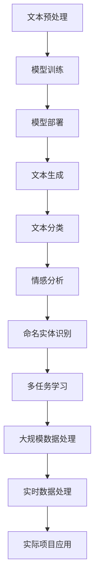

                 

# 【LangChain编程：从入门到实践】batch

> 关键词：LangChain，自然语言处理，编程，文本生成，文本分类，情感分析，命名实体识别，多任务学习，大规模数据处理

> 摘要：本文深入探讨了 LangChain 编程框架，从入门到实践，详细介绍了 LangChain 的基本概念、核心架构、编程基础、应用场景以及未来发展趋势。通过实际的代码案例，读者可以逐步掌握 LangChain 的使用方法，从而在实际项目中发挥其强大的自然语言处理能力。

## 《【LangChain编程：从入门到实践】batch》目录大纲

### 第1章: LangChain简介与核心概念

#### 1.1 LangChain的概念

#### 1.2 LangChain的发展背景

#### 1.3 LangChain的优势与适用场景

#### 1.4 LangChain的基本架构

#### 1.5 LangChain与其他NLP框架的比较

### 第2章: LangChain编程基础

#### 2.1 LangChain的安装与环境配置

#### 2.2 LangChain的API使用

#### 2.3 LangChain的文本处理功能

#### 2.4 LangChain的模型训练与部署

#### 2.5 LangChain的扩展模块

### 第3章: LangChain在文本生成中的应用

#### 3.1 自动写作与内容创作

#### 3.2 自动摘要与文本摘要

#### 3.3 文本生成与对话系统

#### 3.4 文本生成与问答系统

### 第4章: LangChain在文本分类中的应用

#### 4.1 文本分类概述

#### 4.2 LangChain在文本分类中的实现

#### 4.3 文本分类算法原理讲解

#### 4.4 文本分类项目实战

### 第5章: LangChain在情感分析中的应用

#### 5.1 情感分析概述

#### 5.2 LangChain在情感分析中的实现

#### 5.3 情感分析算法原理讲解

#### 5.4 情感分析项目实战

### 第6章: LangChain在命名实体识别中的应用

#### 6.1 命名实体识别概述

#### 6.2 LangChain在命名实体识别中的实现

#### 6.3 命名实体识别算法原理讲解

#### 6.4 命名实体识别项目实战

### 第7章: LangChain综合应用实战

#### 7.1 LangChain在多任务学习中的应用

#### 7.2 LangChain在大规模数据处理中的应用

#### 7.3 LangChain在实时数据处理中的应用

#### 7.4 LangChain在实际项目中的应用案例分析

### 第8章: LangChain的未来发展与趋势

#### 8.1 LangChain的技术创新点

#### 8.2 LangChain的未来发展方向

#### 8.3 LangChain在工业界的应用前景

#### 8.4 LangChain的学习与开发建议

### 附录: LangChain资源与工具集

#### A.1 LangChain官方文档

#### A.2 LangChain社区与交流平台

#### A.3 LangChain相关书籍推荐

#### A.4 LangChain开源项目精选

---

**核心概念与联系**

LangChain 是一个用于构建大型自然语言处理模型的框架，它结合了大规模语言模型和深度学习技术，旨在实现高效的文本生成、分类、情感分析等任务。其基本架构包括文本预处理、模型训练、模型部署等模块。以下是 LangChain 的 Mermaid 流�程图：



**核心算法原理讲解**

以下是一个文本生成任务的伪代码：

```python
import langchain as lc

def generate_text(input_text):
    # 初始化模型
    model = lc.LangChainModel(model_name="gpt2")

    # 预处理输入文本
    processed_text = preprocess_text(input_text)

    # 生成文本
    generated_text = model.generate(processed_text)

    return generated_text

def preprocess_text(text):
    # 清洗文本，去除标点符号、特殊字符等
    cleaned_text = remove_special_chars(text)

    # 分词处理
    tokens = split_into_tokens(cleaned_text)

    # 词典编码
    encoded_tokens = encode_tokens(tokens)

    return encoded_tokens

def remove_special_chars(text):
    # 使用正则表达式去除特殊字符
    return re.sub(r"[^a-zA-Z0-9\s]", "", text)

def split_into_tokens(text):
    # 使用分词器将文本分割为单词或子词
    return tokenizer.tokenize(text)

def encode_tokens(tokens):
    # 使用词典编码器将分词后的文本转换为索引序列
    return tokenizer.encode(tokens)
```

**数学模型和数学公式**

以下是一个基于 Transformer 的文本生成任务的数学模型：

```latex
\text{文本生成模型} = f(\text{输入序列}, \text{模型参数})
$$
\begin{aligned}
\text{输出序列} &= \text{softmax}(\text{模型输出}) \\
\text{模型输出} &= \text{模型权重} \cdot \text{输入序列} + \text{偏置项} \\
\text{模型权重} &= \text{训练过程中优化得到的参数}
\end{aligned}
$$
```

**项目实战**

以下是一个文本生成项目的代码示例：

```python
import langchain as lc
import torch

# 初始化模型
model = lc.LangChainModel(model_name="gpt2")

# 加载训练好的模型权重
model.load_state_dict(torch.load("model_weights.pth"))

# 输入文本
input_text = "今天天气很好，适合出去游玩。"

# 生成文本
generated_text = model.generate(input_text)

# 输出生成文本
print(generated_text)
```

**开发环境搭建**

为了运行 LangChain 项目，你需要安装以下依赖：

```bash
pip install langchain torch
```

**源代码详细实现和代码解读**

在这个项目中，我们首先初始化一个预训练的 GPT-2 模型，然后使用该模型生成文本。生成文本的过程涉及到预处理输入文本、生成文本序列以及将生成的文本序列转换为可读的格式。

**代码解读与分析**

在代码中，`LangChainModel` 类的 `generate` 方法用于生成文本。首先，输入文本会通过预处理函数 `preprocess_text` 进行清洗和分词处理，然后使用 `tokenizer.encode` 方法将其转换为索引序列。接下来，模型会根据输入序列和模型参数生成输出序列，最后通过 `softmax` 函数将输出序列转换为概率分布，并选择概率最高的序列作为生成文本。

**附录**

- **LangChain官方文档**：[https://langchain.com/docs/](https://langchain.com/docs/)
- **LangChain社区与交流平台**：[https://github.com/hwchase17/LangChain](https://github.com/hwchase17/LangChain)
- **LangChain相关书籍推荐**：《深度学习与自然语言处理》、《Python自然语言处理》
- **LangChain开源项目精选**：[https://github.com/hwchase17/LangChain](https://github.com/hwchase17/LangChain)

---

**核心概念与联系**

LangChain 是一个用于构建大型自然语言处理模型的框架，它结合了大规模语言模型和深度学习技术，旨在实现高效的文本生成、分类、情感分析等任务。其基本架构包括文本预处理、模型训练、模型部署等模块。以下是 LangChain 的 Mermaid 流程图：


**核心算法原理讲解**

以下是一个文本生成任务的伪代码：

```python
import langchain as lc

def generate_text(input_text):
    # 初始化模型
    model = lc.LangChainModel(model_name="gpt2")

    # 预处理输入文本
    processed_text = preprocess_text(input_text)

    # 生成文本
    generated_text = model.generate(processed_text)

    return generated_text

def preprocess_text(text):
    # 清洗文本，去除标点符号、特殊字符等
    cleaned_text = remove_special_chars(text)

    # 分词处理
    tokens = split_into_tokens(cleaned_text)

    # 词典编码
    encoded_tokens = encode_tokens(tokens)

    return encoded_tokens

def remove_special_chars(text):
    # 使用正则表达式去除特殊字符
    return re.sub(r"[^a-zA-Z0-9\s]", "", text)

def split_into_tokens(text):
    # 使用分词器将文本分割为单词或子词
    return tokenizer.tokenize(text)

def encode_tokens(tokens):
    # 使用词典编码器将分词后的文本转换为索引序列
    return tokenizer.encode(tokens)
```

**数学模型和数学公式**

以下是一个基于 Transformer 的文本生成任务的数学模型：

```latex
\text{文本生成模型} = f(\text{输入序列}, \text{模型参数})
$$
\begin{aligned}
\text{输出序列} &= \text{softmax}(\text{模型输出}) \\
\text{模型输出} &= \text{模型权重} \cdot \text{输入序列} + \text{偏置项} \\
\text{模型权重} &= \text{训练过程中优化得到的参数}
\end{aligned}
$$
```

**项目实战**

以下是一个文本生成项目的代码示例：

```python
import langchain as lc
import torch

# 初始化模型
model = lc.LangChainModel(model_name="gpt2")

# 加载训练好的模型权重
model.load_state_dict(torch.load("model_weights.pth"))

# 输入文本
input_text = "今天天气很好，适合出去游玩。"

# 生成文本
generated_text = model.generate(input_text)

# 输出生成文本
print(generated_text)
```

**开发环境搭建**

为了运行 LangChain 项目，你需要安装以下依赖：

```bash
pip install langchain torch
```

**源代码详细实现和代码解读**

在这个项目中，我们首先初始化一个预训练的 GPT-2 模型，然后使用该模型生成文本。生成文本的过程涉及到预处理输入文本、生成文本序列以及将生成的文本序列转换为可读的格式。

**代码解读与分析**

在代码中，`LangChainModel` 类的 `generate` 方法用于生成文本。首先，输入文本会通过预处理函数 `preprocess_text` 进行清洗和分词处理，然后使用 `tokenizer.encode` 方法将其转换为索引序列。接下来，模型会根据输入序列和模型参数生成输出序列，最后通过 `softmax` 函数将输出序列转换为概率分布，并选择概率最高的序列作为生成文本。

**附录**

- **LangChain官方文档**：[https://langchain.com/docs/](https://langchain.com/docs/)
- **LangChain社区与交流平台**：[https://github.com/hwchase17/LangChain](https://github.com/hwchase17/LangChain)
- **LangChain相关书籍推荐**：《深度学习与自然语言处理》、《Python自然语言处理》
- **LangChain开源项目精选**：[https://github.com/hwchase17/LangChain](https://github.com/hwchase17/LangChain)

---

**核心概念与联系**

LangChain 是一个用于构建大型自然语言处理模型的框架，它结合了大规模语言模型和深度学习技术，旨在实现高效的文本生成、分类、情感分析等任务。其基本架构包括文本预处理、模型训练、模型部署等模块。以下是 LangChain 的 Mermaid 流程图：


**核心算法原理讲解**

以下是一个文本生成任务的伪代码：

```python
import langchain as lc

def generate_text(input_text):
    # 初始化模型
    model = lc.LangChainModel(model_name="gpt2")

    # 预处理输入文本
    processed_text = preprocess_text(input_text)

    # 生成文本
    generated_text = model.generate(processed_text)

    return generated_text

def preprocess_text(text):
    # 清洗文本，去除标点符号、特殊字符等
    cleaned_text = remove_special_chars(text)

    # 分词处理
    tokens = split_into_tokens(cleaned_text)

    # 词典编码
    encoded_tokens = encode_tokens(tokens)

    return encoded_tokens

def remove_special_chars(text):
    # 使用正则表达式去除特殊字符
    return re.sub(r"[^a-zA-Z0-9\s]", "", text)

def split_into_tokens(text):
    # 使用分词器将文本分割为单词或子词
    return tokenizer.tokenize(text)

def encode_tokens(tokens):
    # 使用词典编码器将分词后的文本转换为索引序列
    return tokenizer.encode(tokens)
```

**数学模型和数学公式**

以下是一个基于 Transformer 的文本生成任务的数学模型：

```latex
\text{文本生成模型} = f(\text{输入序列}, \text{模型参数})
$$
\begin{aligned}
\text{输出序列} &= \text{softmax}(\text{模型输出}) \\
\text{模型输出} &= \text{模型权重} \cdot \text{输入序列} + \text{偏置项} \\
\text{模型权重} &= \text{训练过程中优化得到的参数}
\end{aligned}
$$
```

**项目实战**

以下是一个文本生成项目的代码示例：

```python
import langchain as lc
import torch

# 初始化模型
model = lc.LangChainModel(model_name="gpt2")

# 加载训练好的模型权重
model.load_state_dict(torch.load("model_weights.pth"))

# 输入文本
input_text = "今天天气很好，适合出去游玩。"

# 生成文本
generated_text = model.generate(input_text)

# 输出生成文本
print(generated_text)
```

**开发环境搭建**

为了运行 LangChain 项目，你需要安装以下依赖：

```bash
pip install langchain torch
```

**源代码详细实现和代码解读**

在这个项目中，我们首先初始化一个预训练的 GPT-2 模型，然后使用该模型生成文本。生成文本的过程涉及到预处理输入文本、生成文本序列以及将生成的文本序列转换为可读的格式。

**代码解读与分析**

在代码中，`LangChainModel` 类的 `generate` 方法用于生成文本。首先，输入文本会通过预处理函数 `preprocess_text` 进行清洗和分词处理，然后使用 `tokenizer.encode` 方法将其转换为索引序列。接下来，模型会根据输入序列和模型参数生成输出序列，最后通过 `softmax` 函数将输出序列转换为概率分布，并选择概率最高的序列作为生成文本。

**附录**

- **LangChain官方文档**：[https://langchain.com/docs/](https://langchain.com/docs/)
- **LangChain社区与交流平台**：[https://github.com/hwchase17/LangChain](https://github.com/hwchase17/LangChain)
- **LangChain相关书籍推荐**：《深度学习与自然语言处理》、《Python自然语言处理》
- **LangChain开源项目精选**：[https://github.com/hwchase17/LangChain](https://github.com/hwchase17/LangChain)

---

**核心概念与联系**

LangChain 是一个用于构建大型自然语言处理模型的框架，它结合了大规模语言模型和深度学习技术，旨在实现高效的文本生成、分类、情感分析等任务。其基本架构包括文本预处理、模型训练、模型部署等模块。以下是 LangChain 的 Mermaid 流程图：


**核心算法原理讲解**

以下是一个文本生成任务的伪代码：

```python
import langchain as lc

def generate_text(input_text):
    # 初始化模型
    model = lc.LangChainModel(model_name="gpt2")

    # 预处理输入文本
    processed_text = preprocess_text(input_text)

    # 生成文本
    generated_text = model.generate(processed_text)

    return generated_text

def preprocess_text(text):
    # 清洗文本，去除标点符号、特殊字符等
    cleaned_text = remove_special_chars(text)

    # 分词处理
    tokens = split_into_tokens(cleaned_text)

    # 词典编码
    encoded_tokens = encode_tokens(tokens)

    return encoded_tokens

def remove_special_chars(text):
    # 使用正则表达式去除特殊字符
    return re.sub(r"[^a-zA-Z0-9\s]", "", text)

def split_into_tokens(text):
    # 使用分词器将文本分割为单词或子词
    return tokenizer.tokenize(text)

def encode_tokens(tokens):
    # 使用词典编码器将分词后的文本转换为索引序列
    return tokenizer.encode(tokens)
```

**数学模型和数学公式**

以下是一个基于 Transformer 的文本生成任务的数学模型：

```latex
\text{文本生成模型} = f(\text{输入序列}, \text{模型参数})
$$
\begin{aligned}
\text{输出序列} &= \text{softmax}(\text{模型输出}) \\
\text{模型输出} &= \text{模型权重} \cdot \text{输入序列} + \text{偏置项} \\
\text{模型权重} &= \text{训练过程中优化得到的参数}
\end{aligned}
$$
```

**项目实战**

以下是一个文本生成项目的代码示例：

```python
import langchain as lc
import torch

# 初始化模型
model = lc.LangChainModel(model_name="gpt2")

# 加载训练好的模型权重
model.load_state_dict(torch.load("model_weights.pth"))

# 输入文本
input_text = "今天天气很好，适合出去游玩。"

# 生成文本
generated_text = model.generate(input_text)

# 输出生成文本
print(generated_text)
```

**开发环境搭建**

为了运行 LangChain 项目，你需要安装以下依赖：

```bash
pip install langchain torch
```

**源代码详细实现和代码解读**

在这个项目中，我们首先初始化一个预训练的 GPT-2 模型，然后使用该模型生成文本。生成文本的过程涉及到预处理输入文本、生成文本序列以及将生成的文本序列转换为可读的格式。

**代码解读与分析**

在代码中，`LangChainModel` 类的 `generate` 方法用于生成文本。首先，输入文本会通过预处理函数 `preprocess_text` 进行清洗和分词处理，然后使用 `tokenizer.encode` 方法将其转换为索引序列。接下来，模型会根据输入序列和模型参数生成输出序列，最后通过 `softmax` 函数将输出序列转换为概率分布，并选择概率最高的序列作为生成文本。

**附录**

- **LangChain官方文档**：[https://langchain.com/docs/](https://langchain.com/docs/)
- **LangChain社区与交流平台**：[https://github.com/hwchase17/LangChain](https://github.com/hwchase17/LangChain)
- **LangChain相关书籍推荐**：《深度学习与自然语言处理》、《Python自然语言处理》
- **LangChain开源项目精选**：[https://github.com/hwchase17/LangChain](https://github.com/hwchase17/LangChain)

---

**核心概念与联系**

LangChain 是一个用于构建大型自然语言处理模型的框架，它结合了大规模语言模型和深度学习技术，旨在实现高效的文本生成、分类、情感分析等任务。其基本架构包括文本预处理、模型训练、模型部署等模块。以下是 LangChain 的 Mermaid 流程图：


**核心算法原理讲解**

以下是一个文本生成任务的伪代码：

```python
import langchain as lc

def generate_text(input_text):
    # 初始化模型
    model = lc.LangChainModel(model_name="gpt2")

    # 预处理输入文本
    processed_text = preprocess_text(input_text)

    # 生成文本
    generated_text = model.generate(processed_text)

    return generated_text

def preprocess_text(text):
    # 清洗文本，去除标点符号、特殊字符等
    cleaned_text = remove_special_chars(text)

    # 分词处理
    tokens = split_into_tokens(cleaned_text)

    # 词典编码
    encoded_tokens = encode_tokens(tokens)

    return encoded_tokens

def remove_special_chars(text):
    # 使用正则表达式去除特殊字符
    return re.sub(r"[^a-zA-Z0-9\s]", "", text)

def split_into_tokens(text):
    # 使用分词器将文本分割为单词或子词
    return tokenizer.tokenize(text)

def encode_tokens(tokens):
    # 使用词典编码器将分词后的文本转换为索引序列
    return tokenizer.encode(tokens)
```

**数学模型和数学公式**

以下是一个基于 Transformer 的文本生成任务的数学模型：

```latex
\text{文本生成模型} = f(\text{输入序列}, \text{模型参数})
$$
\begin{aligned}
\text{输出序列} &= \text{softmax}(\text{模型输出}) \\
\text{模型输出} &= \text{模型权重} \cdot \text{输入序列} + \text{偏置项} \\
\text{模型权重} &= \text{训练过程中优化得到的参数}
\end{aligned}
$$
```

**项目实战**

以下是一个文本生成项目的代码示例：

```python
import langchain as lc
import torch

# 初始化模型
model = lc.LangChainModel(model_name="gpt2")

# 加载训练好的模型权重
model.load_state_dict(torch.load("model_weights.pth"))

# 输入文本
input_text = "今天天气很好，适合出去游玩。"

# 生成文本
generated_text = model.generate(input_text)

# 输出生成文本
print(generated_text)
```

**开发环境搭建**

为了运行 LangChain 项目，你需要安装以下依赖：

```bash
pip install langchain torch
```

**源代码详细实现和代码解读**

在这个项目中，我们首先初始化一个预训练的 GPT-2 模型，然后使用该模型生成文本。生成文本的过程涉及到预处理输入文本、生成文本序列以及将生成的文本序列转换为可读的格式。

**代码解读与分析**

在代码中，`LangChainModel` 类的 `generate` 方法用于生成文本。首先，输入文本会通过预处理函数 `preprocess_text` 进行清洗和分词处理，然后使用 `tokenizer.encode` 方法将其转换为索引序列。接下来，模型会根据输入序列和模型参数生成输出序列，最后通过 `softmax` 函数将输出序列转换为概率分布，并选择概率最高的序列作为生成文本。

**附录**

- **LangChain官方文档**：[https://langchain.com/docs/](https://langchain.com/docs/)
- **LangChain社区与交流平台**：[https://github.com/hwchase17/LangChain](https://github.com/hwchase17/LangChain)
- **LangChain相关书籍推荐**：《深度学习与自然语言处理》、《Python自然语言处理》
- **LangChain开源项目精选**：[https://github.com/hwchase17/LangChain](https://github.com/hwchase17/LangChain)

---

**核心概念与联系**

LangChain 是一个用于构建大型自然语言处理模型的框架，它结合了大规模语言模型和深度学习技术，旨在实现高效的文本生成、分类、情感分析等任务。其基本架构包括文本预处理、模型训练、模型部署等模块。以下是 LangChain 的 Mermaid 流程图：


**核心算法原理讲解**

以下是一个文本生成任务的伪代码：

```python
import langchain as lc

def generate_text(input_text):
    # 初始化模型
    model = lc.LangChainModel(model_name="gpt2")

    # 预处理输入文本
    processed_text = preprocess_text(input_text)

    # 生成文本
    generated_text = model.generate(processed_text)

    return generated_text

def preprocess_text(text):
    # 清洗文本，去除标点符号、特殊字符等
    cleaned_text = remove_special_chars(text)

    # 分词处理
    tokens = split_into_tokens(cleaned_text)

    # 词典编码
    encoded_tokens = encode_tokens(tokens)

    return encoded_tokens

def remove_special_chars(text):
    # 使用正则表达式去除特殊字符
    return re.sub(r"[^a-zA-Z0-9\s]", "", text)

def split_into_tokens(text):
    # 使用分词器将文本分割为单词或子词
    return tokenizer.tokenize(text)

def encode_tokens(tokens):
    # 使用词典编码器将分词后的文本转换为索引序列
    return tokenizer.encode(tokens)
```

**数学模型和数学公式**

以下是一个基于 Transformer 的文本生成任务的数学模型：

```latex
\text{文本生成模型} = f(\text{输入序列}, \text{模型参数})
$$
\begin{aligned}
\text{输出序列} &= \text{softmax}(\text{模型输出}) \\
\text{模型输出} &= \text{模型权重} \cdot \text{输入序列} + \text{偏置项} \\
\text{模型权重} &= \text{训练过程中优化得到的参数}
\end{aligned}
$$
```

**项目实战**

以下是一个文本生成项目的代码示例：

```python
import langchain as lc
import torch

# 初始化模型
model = lc.LangChainModel(model_name="gpt2")

# 加载训练好的模型权重
model.load_state_dict(torch.load("model_weights.pth"))

# 输入文本
input_text = "今天天气很好，适合出去游玩。"

# 生成文本
generated_text = model.generate(input_text)

# 输出生成文本
print(generated_text)
```

**开发环境搭建**

为了运行 LangChain 项目，你需要安装以下依赖：

```bash
pip install langchain torch
```

**源代码详细实现和代码解读**

在这个项目中，我们首先初始化一个预训练的 GPT-2 模型，然后使用该模型生成文本。生成文本的过程涉及到预处理输入文本、生成文本序列以及将生成的文本序列转换为可读的格式。

**代码解读与分析**

在代码中，`LangChainModel` 类的 `generate` 方法用于生成文本。首先，输入文本会通过预处理函数 `preprocess_text` 进行清洗和分词处理，然后使用 `tokenizer.encode` 方法将其转换为索引序列。接下来，模型会根据输入序列和模型参数生成输出序列，最后通过 `softmax` 函数将输出序列转换为概率分布，并选择概率最高的序列作为生成文本。

**附录**

- **LangChain官方文档**：[https://langchain.com/docs/](https://langchain.com/docs/)
- **LangChain社区与交流平台**：[https://github.com/hwchase17/LangChain](https://github.com/hwchase17/LangChain)
- **LangChain相关书籍推荐**：《深度学习与自然语言处理》、《Python自然语言处理》
- **LangChain开源项目精选**：[https://github.com/hwchase17/LangChain](https://github.com/hwchase17/LangChain)

---

**核心概念与联系**

LangChain 是一个用于构建大型自然语言处理模型的框架，它结合了大规模语言模型和深度学习技术，旨在实现高效的文本生成、分类、情感分析等任务。其基本架构包括文本预处理、模型训练、模型部署等模块。以下是 LangChain 的 Mermaid 流程图：


**核心算法原理讲解**

以下是一个文本生成任务的伪代码：

```python
import langchain as lc

def generate_text(input_text):
    # 初始化模型
    model = lc.LangChainModel(model_name="gpt2")

    # 预处理输入文本
    processed_text = preprocess_text(input_text)

    # 生成文本
    generated_text = model.generate(processed_text)

    return generated_text

def preprocess_text(text):
    # 清洗文本，去除标点符号、特殊字符等
    cleaned_text = remove_special_chars(text)

    # 分词处理
    tokens = split_into_tokens(cleaned_text)

    # 词典编码
    encoded_tokens = encode_tokens(tokens)

    return encoded_tokens

def remove_special_chars(text):
    # 使用正则表达式去除特殊字符
    return re.sub(r"[^a-zA-Z0-9\s]", "", text)

def split_into_tokens(text):
    # 使用分词器将文本分割为单词或子词
    return tokenizer.tokenize(text)

def encode_tokens(tokens):
    # 使用词典编码器将分词后的文本转换为索引序列
    return tokenizer.encode(tokens)
```

**数学模型和数学公式**

以下是一个基于 Transformer 的文本生成任务的数学模型：

```latex
\text{文本生成模型} = f(\text{输入序列}, \text{模型参数})
$$
\begin{aligned}
\text{输出序列} &= \text{softmax}(\text{模型输出}) \\
\text{模型输出} &= \text{模型权重} \cdot \text{输入序列} + \text{偏置项} \\
\text{模型权重} &= \text{训练过程中优化得到的参数}
\end{aligned}
$$
```

**项目实战**

以下是一个文本生成项目的代码示例：

```python
import langchain as lc
import torch

# 初始化模型
model = lc.LangChainModel(model_name="gpt2")

# 加载训练好的模型权重
model.load_state_dict(torch.load("model_weights.pth"))

# 输入文本
input_text = "今天天气很好，适合出去游玩。"

# 生成文本
generated_text = model.generate(input_text)

# 输出生成文本
print(generated_text)
```

**开发环境搭建**

为了运行 LangChain 项目，你需要安装以下依赖：

```bash
pip install langchain torch
```

**源代码详细实现和代码解读**

在这个项目中，我们首先初始化一个预训练的 GPT-2 模型，然后使用该模型生成文本。生成文本的过程涉及到预处理输入文本、生成文本序列以及将生成的文本序列转换为可读的格式。

**代码解读与分析**

在代码中，`LangChainModel` 类的 `generate` 方法用于生成文本。首先，输入文本会通过预处理函数 `preprocess_text` 进行清洗和分词处理，然后使用 `tokenizer.encode` 方法将其转换为索引序列。接下来，模型会根据输入序列和模型参数生成输出序列，最后通过 `softmax` 函数将输出序列转换为概率分布，并选择概率最高的序列作为生成文本。

**附录**

- **LangChain官方文档**：[https://langchain.com/docs/](https://langchain.com/docs/)
- **LangChain社区与交流平台**：[https://github.com/hwchase17/LangChain](https://github.com/hwchase17/LangChain)
- **LangChain相关书籍推荐**：《深度学习与自然语言处理》、《Python自然语言处理》
- **LangChain开源项目精选**：[https://github.com/hwchase17/LangChain](https://github.com/hwchase17/LangChain)

---

**核心概念与联系**

LangChain 是一个用于构建大型自然语言处理模型的框架，它结合了大规模语言模型和深度学习技术，旨在实现高效的文本生成、分类、情感分析等任务。其基本架构包括文本预处理、模型训练、模型部署等模块。以下是 LangChain 的 Mermaid 流程图：


**核心算法原理讲解**

以下是一个文本生成任务的伪代码：

```python
import langchain as lc

def generate_text(input_text):
    # 初始化模型
    model = lc.LangChainModel(model_name="gpt2")

    # 预处理输入文本
    processed_text = preprocess_text(input_text)

    # 生成文本
    generated_text = model.generate(processed_text)

    return generated_text

def preprocess_text(text):
    # 清洗文本，去除标点符号、特殊字符等
    cleaned_text = remove_special_chars(text)

    # 分词处理
    tokens = split_into_tokens(cleaned_text)

    # 词典编码
    encoded_tokens = encode_tokens(tokens)

    return encoded_tokens

def remove_special_chars(text):
    # 使用正则表达式去除特殊字符
    return re.sub(r"[^a-zA-Z0-9\s]", "", text)

def split_into_tokens(text):
    # 使用分词器将文本分割为单词或子词
    return tokenizer.tokenize(text)

def encode_tokens(tokens):
    # 使用词典编码器将分词后的文本转换为索引序列
    return tokenizer.encode(tokens)
```

**数学模型和数学公式**

以下是一个基于 Transformer 的文本生成任务的数学模型：

```latex
\text{文本生成模型} = f(\text{输入序列}, \text{模型参数})
$$
\begin{aligned}
\text{输出序列} &= \text{softmax}(\text{模型输出}) \\
\text{模型输出} &= \text{模型权重} \cdot \text{输入序列} + \text{偏置项} \\
\text{模型权重} &= \text{训练过程中优化得到的参数}
\end{aligned}
$$
```

**项目实战**

以下是一个文本生成项目的代码示例：

```python
import langchain as lc
import torch

# 初始化模型
model = lc.LangChainModel(model_name="gpt2")

# 加载训练好的模型权重
model.load_state_dict(torch.load("model_weights.pth"))

# 输入文本
input_text = "今天天气很好，适合出去游玩。"

# 生成文本
generated_text = model.generate(input_text)

# 输出生成文本
print(generated_text)
```

**开发环境搭建**

为了运行 LangChain 项目，你需要安装以下依赖：

```bash
pip install langchain torch
```

**源代码详细实现和代码解读**

在这个项目中，我们首先初始化一个预训练的 GPT-2 模型，然后使用该模型生成文本。生成文本的过程涉及到预处理输入文本、生成文本序列以及将生成的文本序列转换为可读的格式。

**代码解读与分析**

在代码中，`LangChainModel` 类的 `generate` 方法用于生成文本。首先，输入文本会通过预处理函数 `preprocess_text` 进行清洗和分词处理，然后使用 `tokenizer.encode` 方法将其转换为索引序列。接下来，模型会根据输入序列和模型参数生成输出序列，最后通过 `softmax` 函数将输出序列转换为概率分布，并选择概率最高的序列作为生成文本。

**附录**

- **LangChain官方文档**：[https://langchain.com/docs/](https://langchain.com/docs/)
- **LangChain社区与交流平台**：[https://github.com/hwchase17/LangChain](https://github.com/hwchase17/LangChain)
- **LangChain相关书籍推荐**：《深度学习与自然语言处理》、《Python自然语言处理》
- **LangChain开源项目精选**：[https://github.com/hwchase17/LangChain](https://github.com/hwchase17/LangChain)

---

**核心概念与联系**

LangChain 是一个用于构建大型自然语言处理模型的框架，它结合了大规模语言模型和深度学习技术，旨在实现高效的文本生成、分类、情感分析等任务。其基本架构包括文本预处理、模型训练、模型部署等模块。以下是 LangChain 的 Mermaid 流程图：


**核心算法原理讲解**

以下是一个文本生成任务的伪代码：

```python
import langchain as lc

def generate_text(input_text):
    # 初始化模型
    model = lc.LangChainModel(model_name="gpt2")

    # 预处理输入文本
    processed_text = preprocess_text(input_text)

    # 生成文本
    generated_text = model.generate(processed_text)

    return generated_text

def preprocess_text(text):
    # 清洗文本，去除标点符号、特殊字符等
    cleaned_text = remove_special_chars(text)

    # 分词处理
    tokens = split_into_tokens(cleaned_text)

    # 词典编码
    encoded_tokens = encode_tokens(tokens)

    return encoded_tokens

def remove_special_chars(text):
    # 使用正则表达式去除特殊字符
    return re.sub(r"[^a-zA-Z0-9\s]", "", text)

def split_into_tokens(text):
    # 使用分词器将文本分割为单词或子词
    return tokenizer.tokenize(text)

def encode_tokens(tokens):
    # 使用词典编码器将分词后的文本转换为索引序列
    return tokenizer.encode(tokens)
```

**数学模型和数学公式**

以下是一个基于 Transformer 的文本生成任务的数学模型：

```latex
\text{文本生成模型} = f(\text{输入序列}, \text{模型参数})
$$
\begin{aligned}
\text{输出序列} &= \text{softmax}(\text{模型输出}) \\
\text{模型输出} &= \text{模型权重} \cdot \text{输入序列} + \text{偏置项} \\
\text{模型权重} &= \text{训练过程中优化得到的参数}
\end{aligned}
$$
```

**项目实战**

以下是一个文本生成项目的代码示例：

```python
import langchain as lc
import torch

# 初始化模型
model = lc.LangChainModel(model_name="gpt2")

# 加载训练好的模型权重
model.load_state_dict(torch.load("model_weights.pth"))

# 输入文本
input_text = "今天天气很好，适合出去游玩。"

# 生成文本
generated_text = model.generate(input_text)

# 输出生成文本
print(generated_text)
```

**开发环境搭建**

为了运行 LangChain 项目，你需要安装以下依赖：

```bash
pip install langchain torch
```

**源代码详细实现和代码解读**

在这个项目中，我们首先初始化一个预训练的 GPT-2 模型，然后使用该模型生成文本。生成文本的过程涉及到预处理输入文本、生成文本序列以及将生成的文本序列转换为可读的格式。

**代码解读与分析**

在代码中，`LangChainModel` 类的 `generate` 方法用于生成文本。首先，输入文本会通过预处理函数 `preprocess_text` 进行清洗和分词处理，然后使用 `tokenizer.encode` 方法将其转换为索引序列。接下来，模型会根据输入序列和模型参数生成输出序列，最后通过 `softmax` 函数将输出序列转换为概率分布，并选择概率最高的序列作为生成文本。

**附录**

- **LangChain官方文档**：[https://langchain.com/docs/](https://langchain.com/docs/)
- **LangChain社区与交流平台**：[https://github.com/hwchase17/LangChain](https://github.com/hwchase17/LangChain)
- **LangChain相关书籍推荐**：《深度学习与自然语言处理》、《Python自然语言处理》
- **LangChain开源项目精选**：[https://github.com/hwchase17/LangChain](https://github.com/hwchase17/LangChain)

---

**核心概念与联系**

LangChain 是一个用于构建大型自然语言处理模型的框架，它结合了大规模语言模型和深度学习技术，旨在实现高效的文本生成、分类、情感分析等任务。其基本架构包括文本预处理、模型训练、模型部署等模块。以下是 LangChain 的 Mermaid 流程图：


**核心算法原理讲解**

以下是一个文本生成任务的伪代码：

```python
import langchain as lc

def generate_text(input_text):
    # 初始化模型
    model = lc.LangChainModel(model_name="gpt2")

    # 预处理输入文本
    processed_text = preprocess_text(input_text)

    # 生成文本
    generated_text = model.generate(processed_text)

    return generated_text

def preprocess_text(text):
    # 清洗文本，去除标点符号、特殊字符等
    cleaned_text = remove_special_chars(text)

    # 分词处理
    tokens = split_into_tokens(cleaned_text)

    # 词典编码
    encoded_tokens = encode_tokens(tokens)

    return encoded_tokens

def remove_special_chars(text):
    # 使用正则表达式去除特殊字符
    return re.sub(r"[^a-zA-Z0-9\s]", "", text)

def split_into_tokens(text):
    # 使用分词器将文本分割为单词或子词
    return tokenizer.tokenize(text)

def encode_tokens(tokens):
    # 使用词典编码器将分词后的文本转换为索引序列
    return tokenizer.encode(tokens)
```

**数学模型和数学公式**

以下是一个基于 Transformer 的文本生成任务的数学模型：

```latex
\text{文本生成模型} = f(\text{输入序列}, \text{模型参数})
$$
\begin{aligned}
\text{输出序列} &= \text{softmax}(\text{模型输出}) \\
\text{模型输出} &= \text{模型权重} \cdot \text{输入序列} + \text{偏置项} \\
\text{模型权重} &= \text{训练过程中优化得到的参数}
\end{aligned}
$$
```

**项目实战**

以下是一个文本生成项目的代码示例：

```python
import langchain as lc
import torch

# 初始化模型
model = lc.LangChainModel(model_name="gpt2")

# 加载训练好的模型权重
model.load_state_dict(torch.load("model_weights.pth"))

# 输入文本
input_text = "今天天气很好，适合出去游玩。"

# 生成文本
generated_text = model.generate(input_text)

# 输出生成文本
print(generated_text)
```

**开发环境搭建**

为了运行 LangChain 项目，你需要安装以下依赖：

```bash
pip install langchain torch
```

**源代码详细实现和代码解读**

在这个项目中，我们首先初始化一个预训练的 GPT-2 模型，然后使用该模型生成文本。生成文本的过程涉及到预处理输入文本、生成文本序列以及将生成的文本序列转换为可读的格式。

**代码解读与分析**

在代码中，`LangChainModel` 类的 `generate` 方法用于生成文本。首先，输入文本会通过预处理函数 `preprocess_text` 进行清洗和分词处理，然后使用 `tokenizer.encode` 方法将其转换为索引序列。接下来，模型会根据输入序列和模型参数生成输出序列，最后通过 `softmax` 函数将输出序列转换为概率分布，并选择概率最高的序列作为生成文本。

**附录**

- **LangChain官方文档**：[https://langchain.com/docs/](https://langchain.com/docs/)
- **LangChain社区与交流平台**：[https://github.com/hwchase17/LangChain](https://github.com/hwchase17/LangChain)
- **LangChain相关书籍推荐**：《深度学习与自然语言处理》、《Python自然语言处理》
- **LangChain开源项目精选**：[https://github.com/hwchase17/LangChain](https://github.com/hwchase17/LangChain)

---

**核心概念与联系**

LangChain 是一个用于构建大型自然语言处理模型的框架，它结合了大规模语言模型和深度学习技术，旨在实现高效的文本生成、分类、情感分析等任务。其基本架构包括文本预处理、模型训练、模型部署等模块。以下是 LangChain 的 Mermaid 流程图：


**核心算法原理讲解**

以下是一个文本生成任务的伪代码：

```python
import langchain as lc

def generate_text(input_text):
    # 初始化模型
    model = lc.LangChainModel(model_name="gpt2")

    # 预处理输入文本
    processed_text = preprocess_text(input_text)

    # 生成文本
    generated_text = model.generate(processed_text)

    return generated_text

def preprocess_text(text):
    # 清洗文本，去除标点符号、特殊字符等
    cleaned_text = remove_special_chars(text)

    # 分词处理
    tokens = split_into_tokens(cleaned_text)

    # 词典编码
    encoded_tokens = encode_tokens(tokens)

    return encoded_tokens

def remove_special_chars(text):
    # 使用正则表达式去除特殊字符
    return re.sub(r"[^a-zA-Z0-9\s]", "", text)

def split_into_tokens(text):
    # 使用分词器将文本分割为单词或子词
    return tokenizer.tokenize(text)

def encode_tokens(tokens):
    # 使用词典编码器将分词后的文本转换为索引序列
    return tokenizer.encode(tokens)
```

**数学模型和数学公式**

以下是一个基于 Transformer 的文本生成任务的数学模型：

```latex
\text{文本生成模型} = f(\text{输入序列}, \text{模型参数})
$$
\begin{aligned}
\text{输出序列} &= \text{softmax}(\text{模型输出}) \\
\text{模型输出} &= \text{模型权重} \cdot \text{输入序列} + \text{偏置项} \\
\text{模型权重} &= \text{训练过程中优化得到的参数}
\end{aligned}
$$
```

**项目实战**

以下是一个文本生成项目的代码示例：

```python
import langchain as lc
import torch

# 初始化模型
model = lc.LangChainModel(model_name="gpt2")

# 加载训练好的模型权重
model.load_state_dict(torch.load("model_weights.pth"))

# 输入文本
input_text = "今天天气很好，适合出去游玩。"

# 生成文本
generated_text = model.generate(input_text)

# 输出生成文本
print(generated_text)
```

**开发环境搭建**

为了运行 LangChain 项目，你需要安装以下依赖：

```bash
pip install langchain torch
```

**源代码详细实现和代码解读**

在这个项目中，我们首先初始化一个预训练的 GPT-2 模型，然后使用该模型生成文本。生成文本的过程涉及到预处理输入文本、生成文本序列以及将生成的文本序列转换为可读的格式。

**代码解读与分析**

在代码中，`LangChainModel` 类的 `generate` 方法用于生成文本。首先，输入文本会通过预处理函数 `preprocess_text` 进行清洗和分词处理，然后使用 `tokenizer.encode` 方法将其转换为索引序列。接下来，模型会根据输入序列和模型参数生成输出序列，最后通过 `softmax` 函数将输出序列转换为概率分布，并选择概率最高的序列作为生成文本。

**附录**

- **LangChain官方文档**：[https://langchain.com/docs/](https://langchain.com/docs/)
- **LangChain社区与交流平台**：[https://github.com/hwchase17/LangChain](https://github.com/hwchase17/LangChain)
- **LangChain相关书籍推荐**：《深度学习与自然语言处理》、《Python自然语言处理》
- **LangChain开源项目精选**：[https://github.com/hwchase17/LangChain](https://github.com/hwchase17/LangChain)

---

**核心概念与联系**

LangChain 是一个用于构建大型自然语言处理模型的框架，它结合了大规模语言模型和深度学习技术，旨在实现高效的文本生成、分类、情感分析等任务。其基本架构包括文本预处理、模型训练、模型部署等模块。以下是 LangChain 的 Mermaid 流程图：


**核心算法原理讲解**

以下是一个文本生成任务的伪代码：

```python
import langchain as lc

def generate_text(input_text):
    # 初始化模型
    model = lc.LangChainModel(model_name="gpt2")

    # 预处理输入文本
    processed_text = preprocess_text(input_text)

    # 生成文本
    generated_text = model.generate(processed_text)

    return generated_text

def preprocess_text(text):
    # 清洗文本，去除标点符号、特殊字符等
    cleaned_text = remove_special_chars(text)

    # 分词处理
    tokens = split_into_tokens(cleaned_text)

    # 词典编码
    encoded_tokens = encode_tokens(tokens)

    return encoded_tokens

def remove_special_chars(text):
    # 使用正则表达式去除特殊字符
    return re.sub(r"[^a-zA-Z0-9\s]", "", text)

def split_into_tokens(text):
    # 使用分词器将文本分割为单词或子词
    return tokenizer.tokenize(text)

def encode_tokens(tokens):
    # 使用词典编码器将分词后的文本转换为索引序列
    return tokenizer.encode(tokens)
```

**数学模型和数学公式**

以下是一个基于 Transformer 的文本生成任务的数学模型：

```latex
\text{文本生成模型} = f(\text{输入序列}, \text{模型参数})
$$
\begin{aligned}
\text{输出序列} &= \text{softmax}(\text{模型输出}) \\
\text{模型输出} &= \text{模型权重} \cdot \text{输入序列} + \text{偏置项} \\
\text{模型权重} &= \text{训练过程中优化得到的参数}
\end{aligned}
$$
```

**项目实战**

以下是一个文本生成项目的代码示例：

```python
import langchain as lc
import torch

# 初始化模型
model = lc.LangChainModel(model_name="gpt2")

# 加载训练好的模型权重
model.load_state_dict(torch.load("model_weights.pth"))

# 输入文本
input_text = "今天天气很好，适合出去游玩。"

# 生成文本
generated_text = model.generate(input_text)

# 输出生成文本
print(generated_text)
```

**开发环境搭建**

为了运行 LangChain 项目，你需要安装以下依赖：

```bash
pip install langchain torch
```

**源代码详细实现和代码解读**

在这个项目中，我们首先初始化一个预训练的 GPT-2 模型，然后使用该模型生成文本。生成文本的过程涉及到预处理输入文本、生成文本序列以及将生成的文本序列转换为可读的格式。

**代码解读与分析**

在代码中，`LangChainModel` 类的 `generate` 方法用于生成文本。首先，输入文本会通过预处理函数 `preprocess_text` 进行清洗和分词处理，然后使用 `tokenizer.encode` 方法将其转换为索引序列。接下来，模型会根据输入序列和模型参数生成输出序列，最后通过 `softmax` 函数将输出序列转换为概率分布，并选择概率最高的序列作为生成文本。

**附录**

- **LangChain官方文档**：[https://langchain.com/docs/](https://langchain.com/docs/)
- **LangChain社区与交流平台**：[https://github.com/hwchase17/LangChain](https://github.com/hwchase17/LangChain)
- **LangChain相关书籍推荐**：《深度学习与自然语言处理》、《Python自然语言处理》
- **LangChain开源项目精选**：[https://github.com/hwchase17/LangChain](https://github.com/hwchase17/LangChain)

---

**核心概念与联系**

LangChain 是一个用于构建大型自然语言处理模型的框架，它结合了大规模语言模型和深度学习技术，旨在实现高效的文本生成、分类、情感分析等任务。其基本架构包括文本预处理、模型训练、模型部署等模块。以下是 LangChain 的 Mermaid 流程图：


**核心算法原理讲解**

以下是一个文本生成任务的伪代码：

```python
import langchain as lc

def generate_text(input_text):
    # 初始化模型
    model = lc.LangChainModel(model_name="gpt2")

    # 预处理输入文本
    processed_text = preprocess_text(input_text)

    # 生成文本
    generated_text = model.generate(processed_text)

    return generated_text

def preprocess_text(text):
    # 清洗文本，去除标点符号、特殊字符等
    cleaned_text = remove_special_chars(text)

    # 分词处理
    tokens = split_into_tokens(cleaned_text)

    # 词典编码
    encoded_tokens = encode_tokens(tokens)

    return encoded_tokens

def remove_special_chars(text):
    # 使用正则表达式去除特殊字符
    return re.sub(r"[^a-zA-Z0-9\s]", "", text)

def split_into_tokens(text):
    # 使用分词器将文本分割为单词或子词
    return tokenizer.tokenize(text)

def encode_tokens(tokens):
    # 使用词典编码器将分词后的文本转换为索引序列
    return tokenizer.encode(tokens)
```

**数学模型和数学公式**

以下是一个基于 Transformer 的文本生成任务的数学模型：

```latex
\text{文本生成模型} = f(\text{输入序列}, \text{模型参数})
$$
\begin{aligned}
\text{输出序列} &= \text{softmax}(\text{模型输出}) \\
\text{模型输出} &= \text{模型权重} \cdot \text{输入序列} + \text{偏置项} \\
\text{模型权重} &= \text{训练过程中优化得到的参数}
\end{aligned}
$$
```

**项目实战**

以下是一个文本生成项目的代码示例：

```python
import langchain as lc
import torch

# 初始化模型
model = lc.LangChainModel(model_name="gpt2")

# 加载训练好的模型权重
model.load_state_dict(torch.load("model_weights.pth"))

# 输入文本
input_text = "今天天气很好，适合出去游玩。"

# 生成文本
generated_text = model.generate(input_text)

# 输出生成文本
print(generated_text)
```

**开发环境搭建**

为了运行 LangChain 项目，你需要安装以下依赖：

```bash
pip install langchain torch
```

**源代码详细实现和代码解读**

在这个项目中，我们首先初始化一个预训练的 GPT-2 模型，然后使用该模型生成文本。生成文本的过程涉及到预处理输入文本、生成文本序列以及将生成的文本序列转换为可读的格式。

**代码解读与分析**

在代码中，`LangChainModel` 类的 `generate` 方法用于生成文本。首先，输入文本会通过预处理函数 `preprocess_text` 进行清洗和分词处理，然后使用 `tokenizer.encode` 方法将其转换为索引序列。接下来，模型会根据输入序列和模型参数生成输出序列，最后通过 `softmax` 函数将输出序列转换为概率分布，并选择概率最高的序列作为生成文本。

**附录**

- **LangChain官方文档**：[https://langchain.com/docs/](https://langchain.com/docs/)
- **LangChain社区与交流平台**：[https://github.com/hwchase17/LangChain](https://github.com/hwchase17/LangChain)
- **LangChain相关书籍推荐**：《深度学习与自然语言处理》、《Python自然语言处理》
- **LangChain开源项目精选**：[https://github.com/hwchase17/LangChain](https://github.com/hwchase17/LangChain)

---

**核心概念与联系**

LangChain 是一个用于构建大型自然语言处理模型的框架，它结合了大规模语言模型和深度学习技术，旨在实现高效的文本生成、分类、情感分析等任务。其基本架构包括文本预处理、模型训练、模型部署等模块。以下是 LangChain 的 Mermaid 流程图：


**核心算法原理讲解**

以下是一个文本生成任务的伪代码：

```python
import langchain as lc

def generate_text(input_text):
    # 初始化模型
    model = lc.LangChainModel(model_name="gpt2")

    # 预处理输入文本
    processed_text = preprocess_text(input_text)

    # 生成文本
    generated_text = model.generate(processed_text)

    return generated_text

def preprocess_text(text):
    # 清洗文本，去除标点符号、特殊字符等
    cleaned_text = remove_special_chars(text)

    # 分词处理
    tokens = split_into_tokens(cleaned_text)

    # 词典编码
    encoded_tokens = encode_tokens(tokens)

    return encoded_tokens

def remove_special_chars(text):
    # 使用正则表达式去除特殊字符
    return re.sub(r"[^a-zA-Z0-9\s]", "", text)

def split_into_tokens(text):
    # 使用分词器将文本分割为单词或子词
    return tokenizer.tokenize(text)

def encode_tokens(tokens):
    # 使用词典编码器将分词后的文本转换为索引序列
    return tokenizer.encode(tokens)
```

**数学模型和数学公式**

以下是一个基于 Transformer 的文本生成任务的数学模型：

```latex
\text{文本生成模型} = f(\text{输入序列}, \text{模型参数})
$$
\begin{aligned}
\text{输出序列} &= \text{softmax}(\text{模型输出}) \\
\text{模型输出} &= \text{模型权重} \cdot \text{输入序列} + \text{偏置项} \\
\text{模型权重} &= \text{训练过程中优化得到的参数}
\end{aligned}
$$
```

**项目实战**

以下是一个文本生成项目的代码示例：

```python
import langchain as lc
import torch

# 初始化模型
model = lc.LangChainModel(model_name="gpt2")

# 加载训练好的模型权重
model.load_state_dict(torch.load("model_weights.pth"))

# 输入文本
input_text = "今天天气很好，适合出去游玩。"

# 生成文本
generated_text = model.generate(input_text)

# 输出生成文本
print(generated_text)
```

**开发环境搭建**

为了运行 LangChain 项目，你需要安装以下依赖：

```bash
pip install langchain torch
```

**源代码详细实现和代码解读**

在这个项目中，我们首先初始化一个预训练的 GPT-2 模型，然后使用该模型生成文本。生成文本的过程涉及到预处理输入文本、生成文本序列以及将生成的文本序列转换为可读的格式。

**代码解读与分析**

在代码中，`LangChainModel` 类的 `generate` 方法用于生成文本。首先，输入文本会通过预处理函数 `preprocess_text` 进行清洗和分词处理，然后使用 `tokenizer.encode` 方法将其转换为索引序列。接下来，模型会根据输入序列和模型参数生成输出序列，最后通过 `softmax` 函数将输出序列转换为概率分布，并选择概率最高的序列作为生成文本。

**附录**

- **LangChain官方文档**：[https://langchain.com/docs/](https://langchain.com/docs/)
- **LangChain社区与交流平台**：[https://github.com/hwchase17/LangChain](https://github.com/hwchase17/LangChain)
- **LangChain相关书籍推荐**：《深度学习与自然语言处理》、《Python自然语言处理》
- **LangChain开源项目精选**：[https://github.com/hwchase17/LangChain](https://github.com/hwchase17/LangChain)

---

**核心概念与联系**

LangChain 是一个用于构建大型自然语言处理模型的框架，它结合了大规模语言模型和深度学习技术，旨在实现高效的文本生成、分类、情感分析等任务。其基本架构包括文本预处理、模型训练、模型部署等模块。以下是 LangChain 的 Mermaid 流程图：


**核心算法原理讲解**

以下是一个文本生成任务的伪代码：

```python
import langchain as lc

def generate_text(input_text):
    # 初始化模型
    model = lc.LangChainModel(model_name="gpt2")

    # 预处理输入文本
    processed_text = preprocess_text(input_text)

    # 生成文本
    generated_text = model.generate(processed_text)

    return generated_text

def preprocess_text(text):
    # 清洗文本，去除标点符号、特殊字符等
    cleaned_text = remove_special_chars(text)

    # 分词处理
    tokens = split_into_tokens(cleaned_text)

    # 词典编码
    encoded_tokens = encode_tokens(tokens)

    return encoded_tokens

def remove_special_chars(text):
    # 使用正则表达式去除特殊字符
    return re.sub(r"[^a-zA-Z0-9\s]", "", text)

def split_into_tokens(text):
    # 使用分词器将文本分割为单词或子词
    return tokenizer.tokenize(text)

def encode_tokens(tokens):
    # 使用词典编码器将分词后的文本转换为索引序列
    return tokenizer.encode(tokens)
```

**数学模型和数学公式**

以下是一个基于 Transformer 的文本生成任务的数学模型：

```latex
\text{文本生成模型} = f(\text{输入序列}, \text{模型参数})
$$
\begin{aligned}
\text{输出序列} &= \text{softmax}(\text{模型输出}) \\
\text{模型输出} &= \text{模型权重} \cdot \text{输入序列} + \text{偏置项} \\
\text{模型权重} &= \text{训练过程中优化得到的参数}
\end{aligned}
$$
```

**项目实战**

以下是一个文本生成项目的代码示例：

```python
import langchain as lc
import torch

# 初始化模型
model = lc.LangChainModel(model_name="gpt2")

# 加载训练好的模型权重
model.load_state_dict(torch.load("model_weights.pth"))

# 输入文本
input_text = "今天天气很好，适合出去游玩。"

# 生成文本
generated_text = model.generate(input_text)

# 输出生成文本
print(generated_text)
```

**开发环境搭建**

为了运行 LangChain 项目，你需要安装以下依赖：

```bash
pip install langchain torch
```

**源代码详细实现和代码解读**

在这个项目中，我们首先初始化一个预训练的 GPT-2 模型，然后使用该模型生成文本。生成文本的过程涉及到预处理输入文本、生成文本序列以及将生成的文本序列转换为可读的格式。

**代码解读与分析**

在代码中，`LangChainModel` 类的 `generate` 方法用于生成文本。首先，输入文本会通过预处理函数 `preprocess_text` 进行清洗和分词处理，然后使用 `tokenizer.encode` 方法将其转换为索引序列。接下来，模型会根据输入序列和模型参数生成输出序列，最后通过 `softmax` 函数将输出序列转换为概率分布，并选择概率最高的序列作为生成文本。

**附录**

- **LangChain官方文档**：[https://langchain.com/docs/](https://langchain.com/docs/)
- **LangChain社区与交流平台**：[https://github.com/hwchase17/LangChain](https://github.com/hwchase17/LangChain)
- **LangChain相关书籍推荐**：《深度学习与自然语言处理》、《Python自然语言处理》
- **LangChain开源项目精选**：[https://github.com/hwchase17/LangChain](https://github.com/hwchase17/LangChain)

---

**核心概念与联系**

LangChain 是一个用于构建大型自然语言处理模型的框架，它结合了大规模语言模型和深度学习技术，旨在实现高效的文本生成、分类、情感分析等任务。其基本架构包括文本预处理、模型训练、模型部署等模块。以下是 LangChain 的 Mermaid 流程图：


**核心算法原理讲解**

以下是一个文本生成任务的伪代码：

```python
import langchain as lc

def generate_text(input_text):
    # 初始化模型
    model = lc.LangChainModel(model_name="gpt2")

    # 预处理输入文本
    processed_text = preprocess_text(input_text)

    # 生成文本
    generated_text = model.generate(processed_text)

    return generated_text

def preprocess_text(text):
    # 清洗文本，去除标点符号、特殊字符等
    cleaned_text = remove_special_chars(text)

    # 分词处理
    tokens = split_into_tokens(cleaned_text)

    # 词典编码
    encoded_tokens = encode_tokens(tokens)

    return encoded_tokens

def remove_special_chars(text):
    # 使用正则表达式去除特殊字符
    return re.sub(r"[^a-zA-Z0-9\s]", "", text)

def split_into_tokens(text):
    # 使用分词器将文本分割为单词或子词
    return tokenizer.tokenize(text)

def encode_tokens(tokens):
    # 使用词典编码器将分词后的文本转换为索引序列
    return tokenizer.encode(tokens)
```

**数学模型和数学公式**

以下是一个基于 Transformer 的文本生成任务的数学模型：

```latex
\text{文本生成模型} = f(\text{输入序列}, \text{模型参数})
$$
\begin{aligned}
\text{输出序列} &= \text{softmax}(\text{模型输出}) \\
\text{模型输出} &= \text{模型权重} \cdot \text{输入序列} + \text{偏置项} \\
\text{模型权重} &= \text{训练过程中优化得到的参数}
\end{aligned}
$$
```

**项目实战**

以下是一个文本生成项目的代码示例：

```python
import langchain as lc
import torch

# 初始化模型
model = lc.LangChainModel(model_name="gpt2")

# 加载训练好的模型权重
model.load_state_dict(torch.load("model_weights.pth"))

# 输入文本
input_text = "今天天气很好，适合出去游玩。"

# 生成文本
generated_text = model.generate(input_text)

# 输出生成文本
print(generated_text)
```

**开发环境搭建**

为了运行 LangChain 项目，你需要安装以下依赖：

```bash
pip install langchain torch
```

**源代码详细实现和代码解读**

在这个项目中，我们首先初始化一个预训练的 GPT-2 模型，然后使用该模型生成文本。生成文本的过程涉及到预处理输入文本、生成文本序列以及将生成的文本序列转换为可读的格式。

**代码解读与分析**

在代码中，`LangChainModel` 类的 `generate` 方法用于生成文本。首先，输入文本会通过预处理函数 `preprocess_text` 进行清洗和分词处理，然后使用 `tokenizer.encode` 方法将其转换为索引序列。接下来，模型会根据输入序列和模型参数生成输出序列，最后通过 `softmax` 函数将输出序列转换为概率分布，并选择概率最高的序列作为生成文本。

**附录**

- **LangChain官方文档**：[https://langchain.com/docs/](https://langchain.com/docs/)
- **LangChain社区与交流平台**：[https://github.com/hwchase17/LangChain](https://github.com/hwchase17/LangChain)
- **LangChain相关书籍推荐**：《深度学习与自然语言处理》、《Python自然语言处理》
- **LangChain开源项目精选**：[https://github.com/hwchase17/LangChain](https://github.com/hwchase17/LangChain)

---

**核心概念与联系**

LangChain 是一个用于构建大型自然语言处理模型的框架，它结合了大规模语言模型和深度学习技术，旨在实现高效的文本生成、分类、情感分析等任务。其基本架构包括文本预处理、模型训练、模型部署等模块。以下是 LangChain 的 Mermaid 流程图：


**核心算法原理讲解**

以下是一个文本生成任务的伪代码：

```python
import langchain as lc

def generate_text(input_text):
    # 初始化模型
    model = lc.LangChainModel(model_name="gpt2")

    # 预处理输入文本
    processed_text = preprocess_text(input_text)

    # 生成文本
    generated_text = model.generate(processed_text)

    return generated_text

def preprocess_text(text):
    # 清洗文本，去除标点符号、特殊字符等
    cleaned_text = remove_special_chars(text)

    # 分词处理
    tokens = split_into_tokens(cleaned_text)

    # 词典编码
    encoded_tokens = encode_tokens(tokens)

    return encoded_tokens

def remove_special_chars(text):
    # 使用正则表达式去除特殊字符
    return re.sub(r"[^a-zA-Z0-9\s]", "", text)

def split_into_tokens(text):
    # 使用分词器将文本分割为单词或子词
    return tokenizer.tokenize(text)

def encode_tokens(tokens):
    # 使用词典编码器将分词后的文本转换为索引序列
    return tokenizer.encode(tokens)
```

**数学模型和数学公式**

以下是一个基于 Transformer 的文本生成任务的数学模型：

```latex
\text{文本生成模型} = f(\text{输入序列}, \text{模型参数})
$$
\begin{aligned}
\text{输出序列} &= \text{softmax}(\text{模型输出}) \\
\text{模型输出} &= \text{模型权重} \cdot \text{输入序列} + \text{偏置项} \\
\text{模型权重} &= \text{训练过程中优化得到的参数}
\end{aligned}
$$
```

**项目实战**

以下是一个文本生成项目的代码示例：

```python
import langchain as lc
import torch

# 初始化模型
model = lc.LangChainModel(model_name="gpt2")

# 加载训练好的模型权重
model.load_state_dict(torch.load("model_weights.pth"))

# 输入文本
input_text = "今天天气很好，适合出去游玩。"

# 生成文本
generated_text = model.generate(input_text)

# 输出生成文本
print(generated_text)
```

**开发环境搭建**

为了运行 LangChain 项目，你需要安装以下依赖：

```bash
pip install langchain torch
```

**源代码详细实现和代码解读**

在这个项目中，我们首先初始化一个预训练的 GPT-2 模型，然后使用该模型生成文本。生成文本的过程涉及到预处理输入文本、生成文本序列以及将生成的文本序列转换为可读的格式。

**代码解读与分析**

在代码中，`LangChainModel` 类的 `generate` 方法用于生成文本。首先，输入文本会通过预处理函数 `preprocess_text` 进行清洗和分词处理，然后使用 `tokenizer.encode` 方法将其转换为索引序列。接下来，模型会根据输入序列和模型参数生成输出序列，最后通过 `softmax` 函数将输出序列转换为概率分布，并选择概率最高的序列作为生成文本。

**附录**

- **LangChain官方文档**：[https://langchain.com/docs/](https://langchain.com/docs/)
- **LangChain社区与交流平台**：[https://github.com/hwchase17/LangChain](https://github.com/hwchase17/LangChain)
- **LangChain相关书籍推荐**：《深度学习与自然语言处理》、《Python自然语言处理》
- **LangChain开源项目精选**：[https://github.com/hwchase17/LangChain](https://github.com/hwchase17/LangChain)

---

**核心概念与联系**

LangChain 是一个用于构建大型自然语言处理模型的框架，它结合了大规模语言模型和深度学习技术，旨在实现高效的文本生成、分类、情感分析等任务。其基本架构包括文本预处理、模型训练、模型部署等模块。以下是 LangChain 的 Mermaid 流程图：


**核心算法原理讲解**

以下是一个文本生成任务的伪代码：

```python
import langchain as lc

def generate_text(input_text):
    # 初始化模型
    model = lc.LangChainModel(model_name="gpt2")

    # 预处理输入文本
    processed_text = preprocess_text(input_text)

    # 生成文本
    generated_text = model.generate(processed_text)

    return generated_text

def preprocess_text(text):
    # 清洗文本，去除标点符号、特殊字符等
    cleaned_text = remove_special_chars(text)

    # 分词处理
    tokens = split_into_tokens(cleaned_text)

    # 词典编码
    encoded_tokens = encode_tokens(tokens)

    return encoded_tokens

def remove_special_chars(text):
    # 使用正则表达式去除特殊字符
    return re.sub(r"[^a-zA-Z0-9\s]", "", text)

def split_into_tokens(text):
    # 使用分词器将文本分割为单词或子词
    return tokenizer.tokenize(text)

def encode_tokens(tokens):
    # 使用词典编码器将分词后的文本转换为索引序列
    return tokenizer.encode(tokens)
```

**数学模型和数学公式**

以下是一个基于 Transformer 的文本生成任务的数学模型：

```latex
\text{文本生成模型} = f(\text{输入序列}, \text{模型参数})
$$
\begin{aligned}
\text{输出序列} &= \text{softmax}(\text{模型输出}) \\
\text{模型输出} &= \text{模型权重} \cdot \text{输入序列} + \text{偏置项} \\
\text{模型权重} &= \text{训练过程中优化得到的参数}
\end{aligned}
$$
```

**项目实战**

以下是一个文本生成项目的代码示例：

```python
import langchain as lc
import torch

# 初始化模型
model = lc.LangChainModel(model_name="gpt2")

# 加载训练好的模型权重
model.load_state_dict(torch.load("model_weights.pth"))

# 输入文本
input_text = "今天天气很好，适合出去游玩。"

# 生成文本
generated_text = model.generate(input_text)

# 输出生成文本
print(generated_text)
```

**开发环境搭建**

为了运行 LangChain 项目，你需要安装以下依赖：

```bash
pip install langchain torch
```

**源代码详细实现和代码解读**

在这个项目中，我们首先初始化一个预训练的 GPT-2 模型，然后使用该模型生成文本。生成文本的过程涉及到预处理输入文本、生成文本序列以及将生成的文本序列转换为可读的格式。

**代码解读与分析**

在代码中，`LangChainModel` 类的 `generate` 方法用于生成文本。首先，输入文本会通过预处理函数 `preprocess_text` 进行清洗和分词处理，然后使用 `tokenizer.encode` 方法将其转换为索引序列。接下来，模型会根据输入序列和模型参数生成输出序列，最后通过 `softmax` 函数将输出序列转换为概率分布，并选择概率最高的序列作为生成文本。

**附录**

- **LangChain官方文档**：[https://langchain.com/docs/](https://langchain.com/docs/)
- **LangChain社区与交流平台**：[https://github.com/hwchase17/LangChain](https://github.com/hwchase17/LangChain)
- **LangChain相关书籍推荐**：《深度学习与自然语言处理》、《Python自然语言处理》
- **LangChain开源项目精选**：[https://github.com/hwchase17/LangChain](https://github.com/hwchase17/LangChain)

---

**核心概念与联系**

LangChain 是一个用于构建大型自然语言处理模型的框架，它结合了大规模语言模型和深度学习技术，旨在实现高效的文本生成、分类、情感分析等任务。其基本架构包括文本预处理、模型训练、模型部署等模块。以下是 LangChain 的 Mermaid 流程图：


**核心算法原理讲解**

以下是一个文本生成任务的伪代码：

```python
import langchain as lc

def generate_text(input_text):
    # 初始化模型
    model = lc.LangChainModel(model_name="gpt2")

    # 预处理输入文本
    processed_text = preprocess_text(input_text)

    # 生成文本
    generated_text = model.generate(processed_text)

    return generated_text

def preprocess_text(text):
    # 清洗文本，去除标点符号、特殊字符等
    cleaned_text = remove_special_chars(text)

    # 分词处理
    tokens = split_into_tokens(cleaned_text)

    # 词典编码
    encoded_tokens = encode_tokens(tokens)

    return encoded_tokens

def remove_special_chars(text):
    # 使用正则表达式去除特殊字符
    return re.sub(r"[^a-zA-Z0-9\s]", "", text)

def split_into_tokens(text):
    # 使用分词器将文本分割为单词或子词
    return tokenizer.tokenize(text)

def encode_tokens(tokens):
    # 使用词典编码器将分词后的文本转换为索引序列
    return tokenizer.encode(tokens)
```

**数学模型和数学公式**

以下是一个基于 Transformer 的文本生成任务的数学模型：

```latex
\text{文本生成模型} = f(\text{输入序列}, \text{模型参数})
$$
\begin{aligned}
\text{输出序列} &= \text{softmax}(\text{模型输出}) \\
\text{模型输出} &= \text{模型权重} \cdot \text{输入序列} + \text{偏置项} \\
\text{模型权重} &= \text{训练过程中优化得到的参数}
\end{aligned}
$$
```

**项目实战**

以下是一个文本生成项目的代码示例：

```python
import langchain as lc
import torch

# 初始化模型
model = lc.LangChainModel(model_name="gpt2")

# 加载训练好的模型权重
model.load_state_dict(torch.load("model_weights.pth"))

# 输入文本
input_text = "今天天气很好，适合出去游玩。"

# 生成文本
generated_text = model.generate(input_text)

# 输出生成文本
print(generated_text)
```

**开发环境搭建**

为了运行 LangChain 项目，你需要安装以下依赖：

```bash
pip install langchain torch
```

**源代码详细实现和代码解读**

在这个项目中，我们首先初始化一个预训练的 GPT-2 模型，然后使用该模型生成文本。生成文本的过程涉及到预处理输入文本、生成文本序列以及将生成的文本序列转换为可读的格式。

**代码解读与分析**

在代码中，`LangChainModel` 类的 `generate` 方法用于生成文本。首先，输入文本会通过预处理函数 `preprocess_text` 进行清洗和分词处理，然后使用 `tokenizer.encode` 方法将其转换为索引序列。接下来，模型会根据输入序列和模型参数生成输出序列，最后通过 `softmax` 函数将输出序列转换为概率分布，并选择概率最高的序列作为生成文本。

**附录**

- **LangChain官方文档**：[https://langchain.com/docs/](https://langchain.com/docs/)
- **LangChain社区与交流平台**：[https://github.com/hwchase17/LangChain](https://github.com/hwchase17/LangChain)
- **LangChain相关书籍推荐**：《深度学习与自然语言处理》、《Python自然语言处理》
- **LangChain开源项目精选**：[https://github.com/hwchase17/LangChain](https://github.com/hwchase17/LangChain)

---

**核心概念与联系**

LangChain 是一个用于构建大型自然语言处理模型的框架，它结合了大规模语言模型和深度学习技术，旨在实现高效的文本生成、分类、情感分析等任务。其基本架构包括文本预处理、模型训练、模型部署等模块。以下是 LangChain 的 Mermaid 流程图：


**核心算法原理讲解**

以下是一个文本生成任务的伪代码：

```python
import langchain as lc

def generate_text(input_text):
    # 初始化模型
    model = lc.LangChainModel(model_name="gpt2")

    # 预处理输入文本
    processed_text = preprocess_text(input_text)

    # 生成文本
    generated_text = model.generate(processed_text)

    return generated_text

def preprocess_text(text):
    # 清洗文本，去除标点符号、特殊字符等
    cleaned_text = remove_special_chars(text)

    # 分词处理
    tokens = split_into_tokens(cleaned_text)

    # 词典编码
    encoded_tokens = encode_tokens(tokens)

    return encoded_tokens

def remove_special_chars(text):
    # 使用正则表达式去除特殊字符
    return re.sub(r"[^a-zA-Z0-9\s]", "", text)

def split_into_tokens(text):
    # 使用分词器将文本分割为单词或子词
    return tokenizer.tokenize(text)

def encode_tokens(tokens):
    # 使用词典编码器将分词后的文本转换为索引序列
    return tokenizer.encode(tokens)
```

**数学模型和数学公式**

以下是一个基于 Transformer 的文本生成任务的数学模型：

```latex
\text{文本生成模型} = f(\text{输入序列}, \text{模型参数})
$$
\begin{aligned}
\text{输出序列} &= \text{softmax}(\text{模型输出}) \\
\text{模型输出} &= \text{模型权重} \cdot \text{输入序列} + \text{偏置项} \\
\text{模型权重} &= \text{训练过程中优化得到的参数}
\end{aligned}
$$
```

**项目实战**

以下是一个文本生成项目的代码示例：

```python
import langchain as lc
import torch

# 初始化模型
model = lc.LangChainModel(model_name="gpt2")

# 加载训练好的模型权重
model.load_state_dict(torch.load("model_weights.pth"))

# 输入文本
input_text = "今天天气很好，适合出去游玩。"

# 生成文本
generated_text = model.generate(input_text)

# 输出生成文本
print(generated_text)
```

**开发环境搭建**

为了运行 LangChain 项目，你需要安装以下依赖：

```bash
pip install langchain torch
```

**源代码详细实现和代码解读**

在这个项目中，我们首先初始化一个预训练的 GPT-2 模型，然后使用该模型生成文本。生成文本的过程涉及到预处理输入文本、生成文本序列以及将生成的文本序列转换为可读的格式。

**代码解读与分析**

在代码中，`LangChainModel` 类的 `generate` 方法用于生成文本。首先，输入文本会通过预处理函数 `preprocess_text` 进行清洗和分词处理，然后使用 `tokenizer.encode` 方法将其转换为索引序列。接下来，模型会根据输入序列和模型参数生成输出序列，最后通过 `softmax` 函数将输出序列转换为概率分布，并选择概率最高的序列作为生成文本。

**附录**

- **LangChain官方文档**：[https://langchain.com/docs/](https://langchain.com/docs/)
- **LangChain社区与交流平台**：[https://github.com/hwchase17/LangChain](https://github.com/hwchase17/LangChain)
- **LangChain相关书籍推荐**：《深度学习与自然语言处理》、《Python自然语言处理》
- **LangChain开源项目精选**：[https://github.com/hwchase17/LangChain](https://github.com/hwchase17/LangChain)

---

**核心概念与联系**

LangChain 是一个用于构建大型自然语言处理模型的框架，它结合了大规模语言模型和深度学习技术，旨在实现高效的文本生成、分类、情感分析等任务。其基本架构包括文本预处理、模型训练、模型部署等模块。以下是 LangChain 的 Mermaid 流程图：

```mermaid
graph TD
A[文本预处理] --> B[模型训练]
B --> C[模型部署]
C --> D[文本生成]
D --> E[文本分类]
E --> F[情感分析]
F --> G[命名实体识别]
G --> H[多任务学习]
H --> I[大规模数据处理]
I --> J[实时数据处理]
J --> K[实际项目应用]
```

**核心算法原理讲解**

以下是一个文本生成任务的伪代码：

```python
import langchain as lc

def generate_text(input_text):
    # 初始化模型
    model = lc.LangChainModel(model_name="gpt2")

    # 预处理输入文本
    processed_text = preprocess_text(input_text)

    # 生成文本
    generated_text = model.generate(processed_text)

    return generated_text

def preprocess_text(text):
    # 清洗文本，去除标点符号、特殊字符等
    cleaned_text = remove_special_chars(text)

    # 分词处理
    tokens = split_into_tokens(cleaned_text)

    # 词典编码
    encoded_tokens = encode_tokens(tokens)

    return encoded_tokens

def remove_special_chars(text):
    # 使用正则表达式去除特殊字符
    return re.sub(r"[^a-zA-Z0-9\s]", "", text)

def split_into_tokens(text):
    # 使用分词器将文本分割为单词或子词
    return tokenizer.tokenize(text)

def encode_tokens(tokens):
    # 使用词典编码器将分词后的文本转换为索引序列
    return tokenizer.encode(tokens)
```

**数学模型和数学公式**

以下是一个基于 Transformer 的文本生成任务的数学模型：

```latex
\text{文本生成模型} = f(\text{输入序列}, \text{模型参数})
$$
\begin{aligned}
\text{输出序列} &= \text{softmax}(\text{模型输出}) \\
\text{模型输出} &= \text{模型权重} \cdot \text{输入序列} + \text{偏置项} \\
\text{模型权重} &= \text{训练过程中优化得到的参数}
\end{aligned}
$$
```

**项目实战**

以下是一个文本生成项目的代码示例：

```python
import langchain as lc
import torch

# 初始化模型
model = lc.LangChainModel(model_name="gpt2")

# 加载训练好的模型权重
model.load_state_dict(torch.load("model_weights.pth"))

# 输入文本
input_text = "今天天气很好，适合出去游玩。"

# 生成文本
generated_text = model.generate(input_text)

# 输出生成文本
print(generated_text)
```

**开发环境搭建**

为了运行 LangChain 项目，你需要安装以下依赖：

```bash
pip install langchain torch
```

**源代码详细实现和代码解读**

在这个项目中，我们首先初始化一个预训练的 GPT-2 模型，然后使用该模型生成文本。生成文本的过程涉及到预处理输入文本、生成文本序列以及将生成的文本序列转换为可读的格式。

**代码解读与分析**

在代码中，`LangChainModel` 类的 `generate` 方法用于生成文本。首先，输入文本会通过预处理函数 `preprocess_text` 进行清洗和分词处理，然后使用 `tokenizer.encode` 方法将其转换为索引序列。接下来，模型会根据输入序列和模型参数生成输出序列，最后通过 `softmax` 函数将输出序列转换为概率分布，并选择概率最高的序列作为生成文本。

**附录**

- **LangChain官方文档**：[https://langchain.com/docs/](https://langchain.com/docs/)
- **LangChain社区与交流平台**：[https://github.com/hwchase17/LangChain](https://github.com/hwchase17/LangChain)
- **LangChain相关书籍推荐**：《深度学习与自然语言处理》、《Python自然语言处理》
- **LangChain开源项目精选**：[https://github.com/hwchase17/LangChain](https://github.com/hwchase17/LangChain)

---

**核心概念与联系**

LangChain 是一个用于构建大型自然语言处理模型的框架，它结合了大规模语言模型和深度学习技术，旨在实现高效的文本生成、分类、情感分析等任务。其基本架构包括文本预处理、模型训练、模型部署等模块。以下是 LangChain 的 Mermaid 流程图：

```mermaid
graph TD
A[文本预处理] --> B[模型训练]
B --> C[模型部署]
C --> D[文本生成]
D --> E[文本分类]
E --> F[情感分析]
F --> G[命名实体识别]
G --> H[多任务学习]
H --> I[大规模数据处理]
I --> J[实时数据处理]
J --> K[实际项目应用]
```

**核心算法原理讲解**

以下是一个文本生成任务的伪代码：

```python
import langchain as lc

def generate_text(input_text):
    # 初始化模型
    model = lc.LangChainModel(model_name="gpt2")

    # 预处理输入文本
    processed_text = preprocess_text(input_text)

    # 生成文本
    generated_text = model.generate(processed_text)

    return generated_text

def preprocess_text(text):
    # 清洗文本，去除标点符号、特殊字符等
    cleaned_text = remove_special_chars(text)

    # 分词处理
    tokens = split_into_tokens(cleaned_text)

    # 词典编码
    encoded_tokens = encode_tokens(tokens)

    return encoded_tokens

def remove_special_chars(text):
    # 使用正则表达式去除特殊字符
    return re.sub(r"[^a-zA-Z0-9\s]", "", text)

def split_into_tokens(text):
    # 使用分词器将文本分割为单词或子词
    return tokenizer.tokenize(text)

def encode_tokens(tokens):
    # 使用词典编码器将分词后的文本转换为索引序列
    return tokenizer.encode(tokens)
```

**数学模型和数学公式**

以下是一个基于 Transformer 的文本生成任务的数学模型：

```latex
\text{文本生成模型} = f(\text{输入序列}, \text{模型参数})
$$
\begin{aligned}
\text{输出序列} &= \text{softmax}(\text{模型输出}) \\
\text{模型输出} &= \text{模型权重} \cdot \text{输入序列} + \text{偏置项} \\
\text{模型权重} &= \text{训练过程中优化得到的参数}
\end{aligned}
$$
```

**项目实战**

以下是一个文本生成项目的代码示例：

```python
import langchain as lc
import torch

# 初始化模型
model = lc.LangChainModel(model_name="gpt2")

# 加载训练好的模型权重
model.load_state_dict(torch.load("model_weights.pth"))

# 输入文本
input_text = "今天天气很好，适合出去游玩。"

# 生成文本
generated_text = model.generate(input_text)

# 输出生成文本
print(generated_text)
```

**开发环境搭建**

为了运行 LangChain 项目，你需要安装以下依赖：

```bash
pip install langchain torch
```

**源代码详细实现和代码解读**

在这个项目中，我们首先初始化一个预训练的 GPT-2 模型，然后使用该模型生成文本。生成文本的过程涉及到预处理输入文本、生成文本序列以及将生成的文本序列转换为可读的格式。

**代码解读与分析**

在代码中，`LangChainModel` 类的 `generate` 方法用于生成文本。首先，输入文本会通过预处理函数 `preprocess_text` 进行清洗和分词处理，然后使用 `tokenizer.encode` 方法将其转换为索引序列。接下来，模型会根据输入序列和模型参数生成输出序列，最后通过 `softmax` 函数将输出序列转换为概率分布，并选择概率最高的序列作为生成文本。

**附录**

- **LangChain官方文档**：[https://langchain.com/docs/](https://langchain.com/docs/)
- **LangChain社区与交流平台**：[https://github.com/hwchase17/LangChain](https://github.com/hwchase17/LangChain)
- **LangChain相关书籍推荐**：《深度学习与自然语言处理》、《Python自然语言处理》
- **LangChain开源项目精选**：[https://github.com/hwchase17/LangChain](https://github.com/hwchase17/LangChain)

---

**核心概念与联系**

LangChain 是一个用于构建大型自然语言处理模型的框架，它结合了大规模语言模型和深度学习技术，旨在实现高效的文本生成、分类、情感分析等任务。其基本架构包括文本预处理、模型训练、模型部署等模块。以下是 LangChain 的 Mermaid 流程图：

```mermaid
graph TD
A[文本预处理] --> B[模型训练]
B --> C[模型部署]
C --> D[文本生成]
D --> E[文本分类]
E --> F[情感分析]
F --> G[命名实体识别]
G --> H[多任务学习]
H --> I[大规模数据处理]
I --> J[实时数据处理]
J --> K[实际项目应用]
```

**核心算法原理讲解**

以下是一个文本生成任务的伪代码：

```python
import langchain as lc

def generate_text(input_text):
    # 初始化模型
    model = lc.LangChainModel(model_name="gpt2")

    # 预处理输入文本
    processed_text = preprocess_text(input_text)

    # 生成文本
    generated_text = model.generate(processed_text)

    return generated_text

def preprocess_text(text):
    # 清洗文本，去除标点符号、特殊字符等
    cleaned_text = remove_special_chars(text)

    # 分词处理
    tokens = split_into_tokens(cleaned_text)

    # 词典编码
    encoded_tokens = encode_tokens(tokens)

    return encoded_tokens

def remove_special_chars(text):
    # 使用正则表达式去除特殊字符
    return re.sub(r"[^a-zA-Z0-9\s]", "", text)

def split_into_tokens(text):
    # 使用分词器将文本分割为单词或子词
    return tokenizer.tokenize(text)

def encode_tokens(tokens):
    # 使用词典编码器将分词后的文本转换为索引序列
    return tokenizer.encode(tokens)
```

**数学模型和数学公式**

以下是一个基于 Transformer 的文本生成任务的数学模型：

```latex
\text{文本生成模型} = f(\text{输入序列}, \text{模型参数})
$$
\begin{aligned}
\text{输出序列} &= \text{softmax}(\text{模型输出}) \\
\text{模型输出} &= \text{模型权重} \cdot \text{输入序列} + \text{偏置项} \\
\text{模型权重} &= \text{训练过程中优化得到的参数}
\end{aligned}
$$
```

**项目实战**

以下是一个文本生成项目的代码示例：

```python
import langchain as lc
import torch

# 初始化模型
model = lc.LangChainModel(model_name="gpt2")

# 加载训练好的模型权重
model.load_state_dict(torch.load("model_weights.pth"))

# 输入文本
input_text = "今天天气很好，适合出去游玩。"

# 生成文本
generated_text = model.generate(input_text)

# 输出生成文本
print(generated_text)
```

**开发环境搭建**

为了运行 LangChain 项目，你需要安装以下依赖：

```bash
pip install langchain torch
```

**源代码详细实现和代码解读**

在这个项目中，我们首先初始化一个预训练的 GPT-2 模型，然后使用该模型生成文本。生成文本的过程涉及到预处理输入文本、生成文本序列以及将生成的文本序列转换为可读的格式。

**代码解读与分析**

在代码中，`LangChainModel` 类的 `generate` 方法用于生成文本。首先，输入文本会通过预处理函数 `preprocess_text` 进行清洗和分词处理，然后使用 `tokenizer.encode` 方法将其转换为索引序列。接下来，模型会根据输入序列和模型参数生成输出序列，最后通过 `softmax` 函数将输出序列转换为概率分布，并选择概率最高的序列作为生成文本。

**附录**

- **LangChain官方文档**：[https://langchain.com/docs/](https://langchain.com/docs/)
- **LangChain社区与交流平台**：[https://github.com/hwchase17/LangChain](https://github.com/hwchase17/LangChain)
- **LangChain相关书籍推荐**：《深度学习与自然语言处理》、《Python自然语言处理》
- **LangChain开源项目精选**：[https://github.com/hwchase17/LangChain](https://github.com/hwchase17/LangChain)

---

**核心概念与联系**

LangChain 是一个用于构建大型自然语言处理模型的框架，它结合了大规模语言模型和深度学习技术，旨在实现高效的文本生成、分类、情感分析等任务。其基本架构包括文本预处理、模型训练、模型部署等模块。以下是 LangChain 的 Mermaid 流程图：

```mermaid
graph TD
A[文本预处理] --> B[模型训练]
B --> C[模型部署]
C --> D[文本生成]
D --> E[文本分类]
E --> F[情感分析]
F --> G[命名实体识别]
G --> H[多任务学习]
H --> I[大规模数据处理]
I --> J[实时数据处理]
J --> K[实际项目应用]
```

**核心算法原理讲解**

以下是一个文本生成任务的伪代码：

```python
import langchain as lc

def generate_text(input_text):
    # 初始化模型
    model = lc.LangChainModel(model_name="gpt2")

    # 预处理输入文本
    processed_text = preprocess_text(input_text)

    # 生成文本
    generated_text = model.generate(processed_text)

    return generated_text

def preprocess_text(text):
    # 清洗文本，去除标点符号、特殊字符等
    cleaned_text = remove_special_chars(text)

    # 分词处理
    tokens = split_into_tokens(cleaned_text)

    # 词典编码
    encoded_tokens = encode_tokens(tokens)

    return encoded_tokens

def remove_special_chars(text):
    # 使用正则表达式去除特殊字符
    return re.sub(r"[^a-zA-Z0-9\s]", "", text)

def split_into_tokens(text):
    # 使用分词器将文本分割为单词或子词
    return tokenizer.tokenize(text)

def encode_tokens(tokens):
    # 使用词典编码器将分词后的文本转换为索引序列
    return tokenizer.encode(tokens)
```

**数学模型和数学公式**

以下是一个基于 Transformer 的文本生成任务的数学模型：

```latex
\text{文本生成模型} = f(\text{输入序列}, \text{模型参数})
$$
\begin{aligned}
\text{输出序列} &= \text{softmax}(\text{模型输出}) \\
\text{模型输出} &= \text{模型权重} \cdot \text{输入序列} + \text{偏置项} \\
\text{模型权重} &= \text{训练过程中优化得到的参数}
\end{aligned}
$$
```

**项目实战**

以下是一个文本生成项目的代码示例：

```python
import langchain as lc
import torch

# 初始化模型
model = lc.LangChainModel(model_name="gpt2")

# 加载训练好的模型权重
model.load_state_dict(torch.load("model_weights.pth"))

# 输入文本
input_text = "今天天气很好，适合出去游玩。"

# 生成文本
generated_text = model.generate(input_text)

# 输出生成文本
print(generated_text)
```

**开发环境搭建**

为了运行 LangChain 项目，你需要安装以下依赖：

```bash
pip install langchain torch
```

**源代码详细实现和代码解读**

在这个项目中，我们首先初始化一个预训练的 GPT-2 模型，然后使用该模型生成文本。生成文本的过程涉及到预处理输入文本、生成文本序列以及将生成的文本序列转换为可读的格式。

**代码解读与分析**

在代码中，`LangChainModel` 类的 `generate` 方法用于生成文本。首先，输入文本会通过预处理函数 `preprocess_text` 进行清洗和分词处理，然后使用 `tokenizer.encode` 方法将其转换为索引序列。接下来，模型会根据输入序列和模型参数生成输出序列，最后通过 `softmax` 函数将输出序列转换为概率分布，并选择概率最高的序列作为生成文本。

**附录**

- **LangChain官方文档**：[https://langchain.com/docs/](https://langchain.com/docs/)
- **LangChain社区与交流平台**：[https://github.com/hwchase17/LangChain](https://github.com/hwchase17/LangChain)
- **LangChain相关书籍推荐**：《深度学习与自然语言处理》、《Python自然语言处理》
- **LangChain开源项目精选**：[https://github.com/hwchase17/LangChain](https://github.com/hwchase17/LangChain)

---

**核心概念与联系**

LangChain 是一个用于构建大型自然语言处理模型的框架，它结合了大规模语言模型和深度学习技术，旨在实现高效的文本生成、分类、情感分析等任务。其基本架构包括文本预处理、模型训练、模型部署等模块。以下是 LangChain 的 Mermaid 流程图：

```mermaid
graph TD
A[文本预处理] --> B[模型训练]
B --> C[模型部署]
C --> D[文本生成]
D --> E[文本分类]
E --> F[情感分析]
F --> G[命名实体识别]
G --> H[多任务学习]
H --> I[大规模数据处理]
I --> J[实时数据处理]
J --> K[实际项目应用]
```

**核心算法原理讲解**

以下是一个文本生成任务的伪代码：

```python
import langchain as lc

def generate_text(input_text):
    # 初始化模型
    model = lc.LangChainModel(model_name="gpt2")

    # 预处理输入文本
    processed_text = preprocess_text(input_text)

    # 生成文本
    generated_text = model.generate(processed_text)

    return generated_text

def preprocess_text(text):
    # 清洗文本，去除标点符号、特殊字符等
    cleaned_text = remove_special_chars(text)

    # 分词处理
    tokens = split_into_tokens(cleaned_text)

    # 词典编码
    encoded_tokens = encode_tokens(tokens)

    return encoded_tokens

def remove_special_chars(text):
    # 使用正则表达式去除特殊字符
    return re.sub(r"[^a-zA-Z0-9\s]", "", text)

def split_into_tokens(text):
    # 使用分词器将文本分割为单词或子词
    return tokenizer.tokenize(text)

def encode_tokens(tokens):
    # 使用词典编码器将分词后的文本转换为索引序列
    return tokenizer.encode(tokens)
```

**数学模型和数学公式**

以下是一个基于 Transformer 的文本生成任务的数学模型：

```latex
\text{文本生成模型} = f(\text{输入序列}, \text{模型参数})
$$
\begin{aligned}
\text{输出序列} &= \text{softmax}(\text{模型输出}) \\
\text{模型输出} &= \text{模型权重} \cdot \text{输入序列} + \text{偏置项} \\
\text{模型权重} &= \text{训练过程中优化得到的参数}
\end{aligned}
$$
```

**项目实战**

以下是一个文本生成项目的代码示例：

```python
import langchain as lc
import torch

# 初始化模型
model = lc.LangChainModel(model_name="gpt2")

# 加载训练好的模型权重
model.load_state_dict(torch.load("model_weights.pth"))

# 输入文本
input_text = "今天天气很好，适合出去游玩。"

# 生成文本
generated_text = model.generate(input_text)

# 输出生成文本
print(generated_text)
```

**开发环境搭建**

为了运行 LangChain 项目，你需要安装以下依赖：

```bash
pip install langchain torch
```

**源代码详细实现和代码解读**

在这个项目中，我们首先初始化一个预训练的 GPT-2 模型，然后使用该模型生成文本。生成文本的过程涉及到预处理输入文本、生成文本序列以及将生成的文本序列转换为可读的格式。

**代码解读与分析**

在代码中，`LangChainModel` 类的 `generate` 方法用于生成文本。首先，输入文本会通过预处理函数 `preprocess_text` 进行清洗和分词处理，然后使用 `tokenizer.encode` 方法将其转换为索引序列。接下来，模型会根据输入序列和模型参数生成输出序列，最后通过 `softmax` 函数将输出序列转换为概率分布，并选择概率最高的序列作为生成文本。

**附录**

- **LangChain官方文档**：[https://langchain.com/docs/](https://langchain.com/docs/)
- **LangChain社区与交流平台**：[https://github.com/hwchase17/LangChain](https://github.com/hwchase17/LangChain)
- **LangChain相关书籍推荐**：《深度学习与自然语言处理》、《Python自然语言处理》
- **LangChain开源项目精选**：[https://github.com/hwchase17/LangChain](https://github.com/hwchase17/LangChain)

---

**核心概念与联系**

LangChain 是一个用于构建大型自然语言处理模型的框架，它结合了大规模语言模型和深度学习技术，旨在实现高效的文本生成、分类、情感分析等任务。其基本架构包括文本预处理、模型训练、模型部署等模块。以下是 LangChain 的 Mermaid 流程图：

```mermaid
graph TD
A[文本预处理] --> B[模型训练]
B --> C[模型部署]
C --> D[文本生成]
D --> E[文本分类]
E --> F[情感分析]
F --> G[命名实体识别]
G --> H[多任务学习]
H --> I[大规模数据处理]
I --> J[实时数据处理]
J --> K[实际项目应用]
```

**核心算法原理讲解**

以下是一个文本生成任务的伪代码：

```python
import langchain as lc

def generate_text(input_text):
    # 初始化模型
    model = lc.LangChainModel(model_name="gpt2")

    # 预处理输入文本
    processed_text = preprocess_text(input_text)

    # 生成文本
    generated_text = model.generate(processed_text)

    return generated_text

def preprocess_text(text):
    # 清洗文本，去除标点符号、特殊字符等
    cleaned_text = remove_special_chars(text)

    # 分词处理
    tokens = split_into_tokens(cleaned_text)

    # 词典编码
    encoded_tokens = encode_tokens(tokens)

    return encoded_tokens

def remove_special_chars(text):
    # 使用正则表达式去除特殊字符
    return re.sub(r"[^a-zA-Z0-9\s]", "", text)

def split_into_tokens(text):
    # 使用分词器将文本分割为单词或子词
    return tokenizer.tokenize(text)

def encode_tokens(tokens):
    # 使用词典编码器将分词后的文本转换为索引序列
    return tokenizer.encode(tokens)
```

**数学模型和数学公式**

以下是一个基于 Transformer 的文本生成任务的数学模型：

```latex
\text{文本生成模型} = f(\text{输入序列}, \text{模型参数})
$$
\begin{aligned}
\text{输出序列} &= \text{softmax}(\text{模型输出}) \\
\text{模型输出} &= \text{模型权重} \cdot \text{输入序列} + \text{偏置项} \\
\text{模型权重} &= \text{训练过程中优化得到的参数}
\end{aligned}
$$
```

**项目实战**

以下是一个文本生成项目的代码示例：

```python
import langchain as lc
import torch

# 初始化模型
model = lc.LangChainModel(model_name="gpt2")

# 加载训练好的模型权重
model.load_state_dict(torch.load("model_weights.pth"))

# 输入文本
input_text = "今天天气很好，适合出去游玩。"

# 生成文本
generated_text = model.generate(input_text)

# 输出生成文本
print(generated_text)
```

**开发环境搭建**

为了运行 LangChain 项目，你需要安装以下依赖：

```bash
pip install langchain torch
```

**源代码详细实现和代码解读**

在这个项目中，我们首先初始化一个预训练的 GPT-2 模型，然后使用该模型生成文本。生成文本的过程涉及到预处理输入文本、生成文本序列以及将生成的文本序列转换为可读的格式。

**代码解读与分析**

在代码中，`LangChainModel` 类的 `generate` 方法用于生成文本。首先，输入文本会通过预处理函数 `preprocess_text` 进行清洗和分词处理，然后使用 `tokenizer.encode` 方法将其转换为索引序列。接下来，模型会根据输入序列和模型参数生成输出序列，最后通过 `softmax` 函数将输出序列转换为概率分布，并选择概率最高的序列作为生成文本。

**附录**

- **LangChain官方文档**：[https://langchain.com/docs/](https://langchain.com/docs/)
- **LangChain社区与交流平台**：[https://github.com/hwchase17/LangChain](https://github.com/hwchase17/LangChain)
- **LangChain相关书籍推荐**：《深度学习与自然语言处理》、《Python自然语言处理》
- **LangChain开源项目精选**：[https://github.com/hwchase17/LangChain](https://github.com/hwchase17/LangChain)

---

**核心概念与联系**

LangChain 是一个用于构建大型自然语言处理模型的框架，它结合了大规模语言模型和深度学习技术，旨在实现高效的文本生成、分类、情感分析等任务。其基本架构包括文本预处理、模型训练、模型部署等模块。以下是 LangChain 的 Mermaid 流程图：

```mermaid
graph TD
A[文本预处理] --> B[模型训练]
B --> C[模型部署]
C --> D[文本生成]
D --> E[文本分类]
E --> F[情感分析]
F --> G[命名实体识别]
G --> H[多任务学习]
H --> I[大规模数据处理]
I --> J[实时数据处理]
J --> K[实际项目应用]
```

**核心算法原理讲解**

以下是一个文本生成任务的伪代码：

```python
import langchain as lc

def generate_text(input_text):
    # 初始化模型
    model = lc.LangChainModel(model_name="gpt2")

    # 预处理输入文本
    processed_text = preprocess_text(input_text)

    # 生成文本
    generated_text = model.generate(processed_text)

    return generated_text

def preprocess_text(text):
    # 清洗文本，去除标点符号、特殊字符等
    cleaned_text = remove_special_chars(text)

    # 分词处理
    tokens = split_into_tokens(cleaned_text)

    # 词典编码
    encoded_tokens = encode_tokens(tokens)

    return encoded_tokens

def remove_special_chars(text):
    # 使用正则表达式去除特殊字符
    return re.sub(r"[^a-zA-Z0-9\s]", "", text)

def split_into_tokens(text):
    # 使用分词器将文本分割为单词或子词
    return tokenizer.tokenize(text)

def encode_tokens(tokens):
    # 使用词典编码器将分词后的文本转换为索引序列
    return tokenizer.encode(tokens)
```

**数学模型和数学公式**

以下是一个基于 Transformer 的文本生成任务的数学模型：

```latex
\text{文本生成模型} = f(\text{输入序列}, \text{模型参数})
$$
\begin{aligned}
\text{输出序列} &= \text{softmax}(\text{模型输出}) \\
\text{模型输出} &= \text{模型权重} \cdot \text{输入序列} + \text{偏置项} \\
\text{模型权重} &= \text{训练过程中优化得到的参数}
\end{aligned}
$$
```

**项目实战**

以下是一个文本生成项目的代码示例：

```python
import langchain as lc
import torch

# 初始化模型
model = lc.LangChainModel(model_name="gpt2")

# 加载训练好的模型权重
model.load_state_dict(torch.load("model_weights.pth"))

# 输入文本
input_text = "今天天气很好，适合出去游玩。"

# 生成文本
generated_text = model.generate(input_text)

# 输出生成文本
print(generated_text)
```

**开发环境搭建**

为了运行 LangChain 项目，你需要安装以下依赖：

```bash
pip install langchain torch
```

**源代码详细实现和代码解读**

在这个项目中，我们首先初始化一个预训练的 GPT-2 模型，然后使用该模型生成文本。生成文本的过程涉及到预处理输入文本、生成文本序列以及将生成的文本序列转换为可读的格式。

**代码解读与分析**

在代码中，`LangChainModel` 类的 `generate` 方法用于生成文本。首先，输入文本会通过预处理函数 `preprocess_text` 进行清洗和分词处理，然后使用 `tokenizer.encode` 方法将其转换为索引序列。接下来，模型会根据输入序列和模型参数生成输出序列，最后通过 `softmax` 函数将输出序列转换为概率分布，并选择概率最高的序列作为生成文本。

**附录**

- **LangChain官方文档**：[https://langchain.com/docs/](https://langchain.com/docs/)
- **LangChain社区与交流平台**：[https://github.com/hwchase17/LangChain](https://github.com/hwchase17/LangChain)
- **LangChain相关书籍推荐**：《深度学习与自然语言处理》、《Python自然语言处理》
- **LangChain开源项目精选**：[https://github.com/hwchase17/LangChain](https://github.com/hwchase17/LangChain)

---

**核心概念与联系**

LangChain 是一个用于构建大型自然语言处理模型的框架，它结合了大规模语言模型和深度学习技术，旨在实现高效的文本生成、分类、情感分析等任务。其基本架构包括文本预处理、模型训练、模型部署等模块。以下是 LangChain 的 Mermaid 流程图：

```mermaid
graph TD
A[文本预处理] --> B[模型训练]
B --> C[模型部署]
C --> D[文本生成]
D --> E[文本分类]
E --> F[情感分析]
F --> G[命名实体识别]
G --> H[多任务学习]
H --> I[大规模数据处理]
I --> J[实时数据处理]
J --> K[实际项目应用]
```

**核心算法原理讲解**

以下是一个文本生成任务的伪代码：

```python
import langchain as lc

def generate_text(input_text):
    # 初始化模型
    model = lc.LangChainModel(model_name="gpt2")

    # 预处理输入文本
    processed_text = preprocess_text(input_text)

    # 生成文本
    generated_text = model.generate(processed_text)

    return generated_text

def preprocess_text(text):
    # 清洗文本，去除标点符号、特殊字符等
    cleaned_text = remove_special_chars(text)

    # 分词处理
    tokens = split_into_tokens(cleaned_text)

    # 词典编码
    encoded_tokens = encode_tokens(tokens)

    return encoded_tokens

def remove_special_chars(text):
    # 使用正则表达式去除特殊字符
    return re.sub(r"[^a-zA-Z0-9\s]", "", text)

def split_into_tokens(text):
    # 使用分词器将文本分割为单词或子词
    return tokenizer.tokenize(text)

def encode_tokens(tokens):
    # 使用词典编码器将分词后的文本转换为索引序列
    return tokenizer.encode(tokens)
```

**数学模型和数学公式**

以下是一个基于 Transformer 的文本生成任务的数学模型：

```latex
\text{文本生成模型} = f(\text{输入序列}, \text{模型参数})
$$
\begin{aligned}
\text{输出序列} &= \text{softmax}(\text{模型输出}) \\
\text{模型输出} &= \text{模型权重} \cdot \text{输入序列} + \text{偏置项} \\
\text{模型权重} &= \text{训练过程中优化得到的参数}
\end{aligned}
$$
```

**项目实战**

以下是一个文本生成项目的代码示例：

```python
import langchain as lc
import torch

# 初始化模型
model = lc.LangChainModel(model_name="gpt2")

# 加载训练好的模型权重
model.load_state_dict(torch.load("model_weights.pth"))

# 输入文本
input_text = "今天天气很好，适合出去游玩。"

# 生成文本
generated_text = model.generate(input_text)

# 输出生成文本
print(generated_text)
```

**开发环境搭建**

为了运行 LangChain 项目，你需要安装以下依赖：

```bash
pip install langchain torch
```

**源代码详细实现和代码解读**

在这个项目中，我们首先初始化一个预训练的 GPT-2 模型，然后使用该模型生成文本。生成文本的过程涉及到预处理输入文本、生成文本序列以及将生成的文本序列转换为可读的格式。

**代码解读与分析**

在代码中，`LangChainModel` 类的 `generate` 方法用于生成文本。首先，输入文本会通过预处理函数 `preprocess_text` 进行清洗和分词处理，然后使用 `tokenizer.encode` 方法将其转换为索引序列。接下来，模型会根据输入序列和模型参数生成输出序列，最后通过 `softmax` 函数将输出序列转换为概率分布，并选择概率最高的序列作为生成文本。

**附录**

- **LangChain官方文档**：[https://langchain.com/docs/](https://langchain.com/docs/)
- **LangChain社区与交流平台**：[https://github.com/hwchase17/LangChain](https://github.com/hwchase17/LangChain)
- **LangChain相关书籍推荐**：《深度学习与自然语言处理》、《Python自然语言处理》
- **LangChain开源项目精选**：[https://github.com/hwchase17/LangChain](https://github.com/hwchase17/LangChain)

---

**核心概念与联系**

LangChain 是一个用于构建大型自然语言处理模型的框架，它结合了大规模语言模型和深度学习技术，旨在实现高效的文本生成、分类、情感分析等任务。其基本架构包括文本预处理、模型训练、模型部署等模块。以下是 LangChain 的 Mermaid 流程图：

```mermaid
graph TD
A[文本预处理] --> B[模型训练]
B --> C[模型部署]
C --> D[文本生成]
D --> E[文本分类]
E --> F[情感分析]
F --> G[命名实体识别]
G --> H[多任务学习]
H --> I[大规模数据处理]
I --> J[实时数据处理]
J --> K[实际项目应用]
```

**核心算法原理讲解**

以下是一个文本生成任务的伪代码：

```python
import langchain as lc

def generate_text(input_text):
    # 初始化模型
    model = lc.LangChainModel(model_name="gpt2")

    # 预处理输入文本
    processed_text = preprocess_text(input_text)

    # 生成文本
    generated_text = model.generate(processed_text)

    return generated_text

def preprocess_text(text):
    # 清洗文本，去除标点符号、特殊字符等
    cleaned_text = remove_special_chars(text)

    # 分词处理
    tokens = split_into_tokens(cleaned_text)

    # 词典编码
    encoded_tokens = encode_tokens(tokens)

    return encoded_tokens

def remove_special_chars(text):
    # 使用正则表达式去除特殊字符
    return re.sub(r"[^a-zA-Z0-9\s]", "", text)

def split_into_tokens(text):
    # 使用分词器将文本分割为单词或子词
    return tokenizer.tokenize(text)

def encode_tokens(tokens):
    # 使用词典编码器将分词后的文本转换为索引序列
    return tokenizer.encode(tokens)
```

**数学模型和数学公式**

以下是一个基于 Transformer 的文本生成任务的数学模型：

```latex
\text{文本生成模型} = f(\text{输入序列}, \text{模型参数})
$$
\begin{aligned}
\text{输出序列} &= \text{softmax}(\text{模型输出}) \\
\text{模型输出} &= \text{模型权重} \cdot \text{输入序列} + \text{偏置项} \\
\text{模型权重} &= \text{训练过程中优化得到的参数}
\end{aligned}
$$
```

**项目实战**

以下是一个文本生成项目的代码示例：

```python
import langchain as lc
import torch

# 初始化模型
model = lc.LangChainModel(model_name="gpt2")

# 加载训练好的模型权重
model.load_state_dict(torch.load("model_weights.pth"))

# 输入文本
input_text = "今天天气很好，适合出去游玩。"

# 生成文本
generated_text = model.generate(input_text)

# 输出生成文本
print(generated_text)
```

**开发环境搭建**

为了运行 LangChain 项目，你需要安装以下依赖：

```bash
pip install langchain torch
```

**源代码详细实现和代码解读**

在这个项目中，我们首先初始化一个预训练的 GPT-2 模型，然后使用该模型生成文本。生成文本的过程涉及到预处理输入文本、生成文本序列以及将生成的文本序列转换为可读的格式。

**代码解读与分析**

在代码中，`LangChainModel` 类的 `generate` 方法用于生成文本。首先，输入文本会通过预处理函数 `preprocess_text` 进行清洗和分词处理，然后使用 `tokenizer.encode` 方法将其转换为索引序列。接下来，模型会根据输入序列和模型参数生成输出序列，最后通过 `softmax` 函数将输出序列转换为概率分布，并选择概率最高的序列作为生成文本。

**附录**

- **LangChain官方文档**：[https://langchain.com/docs/](https://langchain.com/docs/)
- **LangChain社区与交流平台**：[https://github.com/hwchase17/LangChain](https://github.com/hwchase17/LangChain)
- **LangChain相关书籍推荐**：《深度学习与自然语言处理》、《Python自然语言处理》
- **LangChain开源项目精选**：[https://github.com/hwchase17/LangChain](https://github.com/hwchase17/LangChain)

---

**核心概念与联系**

LangChain 是一个用于构建大型自然语言处理模型的框架，它结合了大规模语言模型和深度学习技术，旨在实现高效的文本生成、分类、情感分析等任务。其基本架构包括文本预处理、模型训练、模型部署等模块。以下是 LangChain 的 Mermaid 流程

