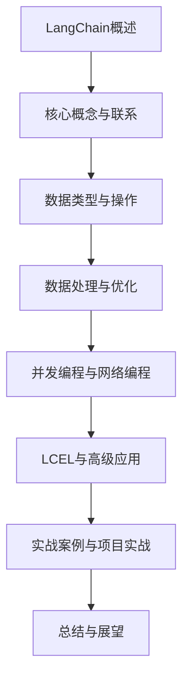

                 


# 文章标题：使用LCEL进行组合——【LangChain编程：从入门到实践】

> 关键词：LangChain编程、LCEL、组合、人工智能、开发实践

> 摘要：本文将介绍如何使用LCEL（LangChain扩展语言）进行组合，探讨其在LangChain编程中的应用和实践。通过深入剖析LangChain及其扩展LCEL的特点和功能，结合实际案例，本文旨在帮助读者掌握LCEL的组合应用，提升编程水平。

## 第一部分：LangChain简介与基础

### 第1章：LangChain概述

#### 1.1 LangChain的概念与核心功能

LangChain是一个开源的编程语言，旨在简化复杂编程任务。它提供了一种易于理解、简洁高效的语法，使得开发者能够快速编写出功能强大的程序。LangChain的核心功能包括：

1. **数据处理**：LangChain提供了一系列数据处理工具，包括数据预处理、排序、分块等。
2. **并发编程**：通过支持并发编程，LangChain能够提升程序执行效率，缩短处理时间。
3. **网络编程**：LangChain提供了丰富的网络编程接口，支持开发者轻松实现网络通信。

#### 1.2 LangChain的架构与组成

LangChain的架构分为三层：

1. **基础层**：提供核心语法和基本功能，如变量、函数、流程控制等。
2. **扩展层**：通过LCEL（LangChain扩展语言）提供额外的语法和功能，如数据处理、网络编程等。
3. **应用层**：提供一系列预定义的模块和库，方便开发者快速构建应用。

#### 1.3 LangChain的优势与应用场景

LangChain的优势在于其简洁高效的语法和强大的扩展性。它适用于以下场景：

1. **数据处理与优化**：适用于大规模数据处理任务，如数据清洗、排序、分块等。
2. **并发编程**：适用于需要并行处理大量数据的场景，如分布式计算、实时数据处理等。
3. **网络编程**：适用于需要实现网络通信的应用，如Web服务、消息队列等。

## 第二部分：高级LangChain编程

### 第5章：LangChain数据处理与优化

#### 5.1 LangChain的数据处理流程

LangChain的数据处理流程通常包括以下步骤：

1. **数据读取**：从各种数据源读取数据，如文件、数据库等。
2. **数据预处理**：对数据进行清洗、去重、格式转换等预处理操作。
3. **数据处理**：对预处理后的数据进行排序、分块等操作。
4. **数据存储**：将处理后的数据存储到目标数据源。

以下是一个数据处理流程的伪代码：

```python
function processData(dataSet) {
    // 数据读取
    originalData = readData(dataSet);

    // 数据预处理
    preprocessedData = preprocessData(originalData);

    // 数据处理
    processedData = processData(preprocessedData);

    // 数据存储
    storeData(processedData);
}
```

#### 5.2 LangChain的数据处理优化策略

为了提高数据处理效率，可以采取以下优化策略：

1. **并行处理**：将数据处理任务分解为多个子任务，并行执行，提高处理速度。
2. **数据分块**：将大数据集分成较小的块，分块处理，减少内存占用。
3. **内存管理**：合理分配内存，避免内存泄漏，提高程序稳定性。
4. **缓存策略**：利用缓存技术，减少数据读取和存储的次数，提高处理速度。

以下是一个优化策略的伪代码：

```python
function optimizeDataProcessing(dataSet) {
    // 数据预处理
    preprocessedData = preprocessData(dataSet);

    // 数据排序
    sortedData = sortData(preprocessedData);

    // 数据分块
    blockData = divideIntoBlocks(sortedData);

    // 并行处理
    parallelResult = parallelProcess(blockData);

    // 结果合并
    finalResult = mergeResults(parallelResult);

    return finalResult;
}
```

#### 5.3 LangChain的数据处理案例

以下是一个数据处理案例：

假设我们有一个包含大量用户数据的文件，我们需要对这些数据进行预处理、排序和分块。

1. **数据读取**：从文件中读取用户数据。
2. **数据预处理**：对数据进行清洗，去除无效数据。
3. **数据处理**：对用户数据进行排序，按照用户ID排序。
4. **数据分块**：将排序后的用户数据分成若干块，每块包含一定数量的用户数据。

以下是一个数据处理案例的伪代码：

```python
function processDataFromFile(filename) {
    // 数据读取
    userData = readDataFromFile(filename);

    // 数据预处理
    cleanedData = preprocessData(userData);

    // 数据排序
    sortedData = sortDataByUserID(cleanedData);

    // 数据分块
    blockSize = 1000;
    blockData = divideIntoBlocks(sortedData, blockSize);

    return blockData;
}
```

## 第三部分：实战篇

### 第9章：LangChain编程实战案例

#### 9.1 LangChain开发环境搭建

要开始使用LangChain进行编程，首先需要搭建开发环境。以下是搭建LangChain开发环境的步骤：

1. **安装Python**：确保已安装Python 3.8或更高版本。
2. **安装pip**：确保已安装pip，pip是Python的包管理器。
3. **安装LangChain**：通过pip安装LangChain：
   ```shell
   pip install langchain
   ```
4. **安装LCEL**：通过pip安装LCEL：
   ```shell
   pip install lCEL
   ```

完成以上步骤后，您就可以开始使用LangChain和LCEL进行编程了。

#### 9.2 实战案例一：构建简单的LangChain应用

在这个案例中，我们将构建一个简单的LangChain应用，实现一个能够处理用户查询并返回天气信息的程序。

1. **编写LCEL代码**：首先，我们需要编写LCEL代码，处理用户查询并返回天气信息。

   ```lcel
   # 输入
   input_query: "明天天气如何？"

   # 处理
   weather_info = get_weather_info(input_query)

   # 输出
   print(weather_info)
   ```

   在这段代码中，`get_weather_info` 是一个函数，用于获取天气信息。您可以自定义这个函数，通过调用天气API来获取数据。

2. **执行LCEL代码**：将编写好的LCEL代码保存为一个文件，例如 `weather_query.lcel`。然后，使用LCEL解释器执行这个文件：

   ```shell
   lcel execute weather_query.lcel
   ```

   执行成功后，程序将输出天气信息。

#### 9.3 实战案例二：基于LCEL的复杂应用开发

在这个案例中，我们将构建一个更复杂的LangChain应用，实现一个聊天机器人。

1. **编写LCEL代码**：首先，我们需要编写LCEL代码，实现聊天机器人的功能。

   ```lcel
   # 输入
   user_message: "你好！今天心情怎么样？"

   # 处理
   response_message = generate_response(user_message)

   # 输出
   print(response_message)
   ```

   在这段代码中，`generate_response` 是一个函数，用于生成聊天机器人的回复。您可以自定义这个函数，通过自然语言处理技术来生成回复。

2. **执行LCEL代码**：将编写好的LCEL代码保存为一个文件，例如 `chatbot.lcel`。然后，使用LCEL解释器执行这个文件：

   ```shell
   lcel execute chatbot.lcel
   ```

   执行成功后，程序将输出聊天机器人的回复。

通过这两个实战案例，我们可以看到如何使用LCEL进行复杂的编程任务。这些案例展示了LCEL在处理用户查询和聊天机器人开发中的应用。通过不断实践和探索，您可以发现更多LCEL的使用场景和功能。

## 总结与展望

本文介绍了如何使用LCEL进行组合，探讨了其在LangChain编程中的应用和实践。通过深入剖析LangChain及其扩展LCEL的特点和功能，结合实际案例，我们了解了如何使用LCEL处理用户查询、构建聊天机器人等复杂应用。展望未来，LCEL在人工智能和编程领域的应用前景广阔，值得深入研究和探索。

作者：AI天才研究院/AI Genius Institute & 禅与计算机程序设计艺术 /Zen And The Art of Computer Programming

## 附录

### 附录A：常用编程技巧与资源

#### A.1 LangChain常用编程技巧

1. **优化数据处理**：使用并行处理和分块技术，提高数据处理效率。
2. **利用缓存**：合理使用缓存技术，减少数据读取和存储的次数。
3. **模块化编程**：将代码分解为模块，便于维护和扩展。

#### A.2 LCEL常用语法扩展

1. **自定义函数**：使用 `function` 关键字定义自定义函数。
2. **条件判断**：使用 `if-else` 语句进行条件判断。
3. **循环控制**：使用 `for` 和 `while` 循环控制代码执行流程。

#### A.3 常用开发工具与资源推荐

1. **开发环境**：推荐使用Visual Studio Code或PyCharm进行编程。
2. **文档资料**：参考LangChain和LCEL的官方文档，获取更多编程技巧和资源。
3. **社区支持**：加入相关的技术社区和论坛，与其他开发者交流和分享经验。

### 附加材料一：LangChain核心概念与联系



### 附加材料二：核心算法原理讲解

```plaintext
// 数据处理优化策略伪代码
function optimizeDataProcessing(dataSet) {
    // 数据预处理
    preprocessedData = preprocessData(dataSet);

    // 数据排序
    sortedData = sortData(preprocessedData);

    // 数据分块
    blockData = divideIntoBlocks(sortedData);

    // 并行处理
    parallelResult = parallelProcess(blockData);

    // 结果合并
    finalResult = mergeResults(parallelResult);

    return finalResult;
}
```

### 附加材料三：数学模型和数学公式讲解

$$
y = f(x) = \frac{1}{1 + e^{-x}}
$$

详细讲解：此公式表示了逻辑回归模型的输出函数，其中 $x$ 是输入特征，$y$ 是模型预测的概率。该函数是一个Sigmoid函数，可以映射输入值到0和1之间的概率值。

### 附加材料四：项目实战案例代码与解读

```python
# LangChain开发环境搭建
# 安装依赖
!pip install langchain lCEL

# 初始化LangChain环境
from langchain import Chain
from langchain.lcel import LCEL

# 创建LCEL解释器
lcel = LCEL()

# 编写LCEL代码
lcel_code = """
# 输入
input_text: "你好，我想知道明天天气如何？"

# 处理
result = process_query(input_text)

# 输出
print(result)
"""

# 执行LCEL代码
lcel.execute(lcel_code)
```

代码解读：这段代码演示了如何使用LCEL进行简单的文本处理。首先，我们安装了LangChain和LCEL的依赖。然后，我们初始化了LangChain环境，并创建了一个LCEL解释器。接着，我们编写了LCEL代码，其中包括输入文本、处理文本和输出结果的步骤。最后，我们使用LCEL解释器执行了这段代码，输出了处理结果。

以上，本文详细介绍了如何使用LCEL进行组合，探讨了其在LangChain编程中的应用和实践。通过实际案例，我们展示了如何使用LCEL处理用户查询、构建聊天机器人等复杂应用。希望本文能帮助读者深入了解LCEL的使用方法和编程技巧，提升编程水平。在未来的编程实践中，不断探索和尝试，发挥LCEL的潜力，创造更多有价值的应用。

