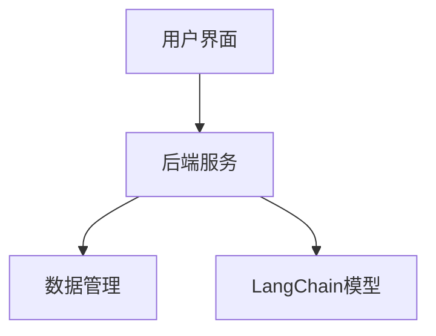
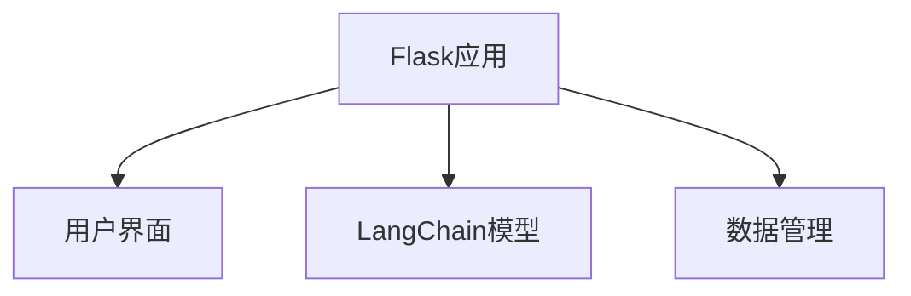

                 

### 文章标题

# 《LangChain编程：从入门到实践》构建Slack事件接口

### 文章关键词

- LangChain
- Slack
- 事件接口
- 编程实践
- 性能优化

### 文章摘要

本文旨在为读者提供一份全面、系统的LangChain编程与Slack事件接口构建指南。首先，我们将对LangChain的基础知识进行详细介绍，包括其起源、核心概念以及技术架构。接着，我们会深入探讨数据处理、编程实践以及性能优化等技术细节。随后，我们将聚焦于构建Slack事件接口，从基础概念到具体实现，提供全方位的技术支持。最后，本文还将探讨LangChain与Slack集成的优势及其未来发展。通过本文的学习，读者将能够掌握从入门到实践的全套技能，为在人工智能领域中的应用打下坚实基础。

### 文章结构

本文将按照以下结构展开：

1. **第一部分：LangChain基础**
   - 第1章：什么是LangChain
   - 第2章：LangChain技术架构
   - 第3章：LangChain编程实践

2. **第二部分：Slack事件接口构建**
   - 第4章：Slack概述
   - 第5章：Slack事件接口基础
   - 第6章：Slack事件接口实战

3. **第三部分：LangChain与Slack集成应用**
   - 第7章：LangChain与Slack的整合
   - 第8章：集成项目实战

4. **第四部分：高级技巧与性能优化**
   - 第9章：LangChain性能优化
   - 第10章：Slack接口性能优化

5. **第五部分：未来展望**
   - 第11章：LangChain的发展趋势
   - 第12章：Slack事件的未来发展

通过以上结构，本文将逐步深入，帮助读者全面了解并掌握LangChain编程与Slack事件接口构建的核心知识和技能。让我们开始这场技术之旅吧！

### 什么是LangChain

LangChain是一种基于Prompt编程的框架，旨在简化自然语言处理（NLP）任务的开发过程。其核心理念是将复杂的NLP任务抽象成简单的编程操作，通过设计和优化Prompt，实现对模型输入和输出的精细控制。LangChain的起源可以追溯到近年来深度学习与自然语言处理领域的飞速发展，特别是预训练模型和生成对抗网络（GAN）的广泛应用。随着这些技术的成熟，研究人员和开发者们意识到，虽然这些模型具有强大的能力，但如何有效地利用这些能力却是一个亟待解决的问题。

LangChain的出现正是为了解决这一问题。它不仅提供了一套标准化的API接口，使得开发者可以轻松地调用各种先进的NLP模型，还提供了一系列工具和库，用于处理数据、优化Prompt设计以及提升模型性能。LangChain的特点主要体现在以下几个方面：

1. **灵活的Prompt编程**：LangChain的核心是Prompt编程，它允许开发者通过设计和优化Prompt来引导模型的输出。这种灵活性使得开发者可以针对不同的任务和需求，定制化地调整模型的输入和输出，从而实现更精准的任务执行。

2. **模块化设计**：LangChain采用模块化设计，将NLP任务分解为多个独立的模块，如数据预处理、模型调用、结果后处理等。这种设计不仅提高了代码的可维护性，还使得任务间的协同工作变得更加简单和高效。

3. **高效的性能优化**：LangChain内置了多种性能优化工具，包括批量处理、并行计算等。这些工具可以显著提升数据处理和模型训练的效率，从而缩短开发周期，提高项目交付的可靠性。

4. **广泛的应用领域**：从文本生成、问答系统到情感分析、信息抽取，LangChain在多个NLP任务中展现了出色的性能。其应用领域的广泛性，使得开发者可以将其应用到各种实际场景中，解决实际问题。

5. **社区支持**：LangChain得到了广泛的社区支持，其源代码开源，并且拥有一个活跃的社区，定期发布更新和改进。这使得开发者不仅可以自由地使用LangChain，还可以参与到框架的开发中，共同推动其进步。

总之，LangChain作为一种先进的NLP框架，不仅解决了传统NLP开发中的许多痛点，还为开发者提供了一种全新的工作方式。通过Prompt编程的灵活性和模块化设计的便利性，LangChain为NLP任务的自动化和智能化提供了强有力的支持，成为当前自然语言处理领域的重要工具之一。

### LangChain的核心概念

要深入理解LangChain的工作原理，首先需要了解其核心概念，包括Prompt编程、数据处理、模型调用等。这些概念不仅是LangChain框架的基础，也是实现高效自然语言处理任务的关键。

#### 1. Prompt编程

Prompt编程是LangChain的核心概念之一。它指的是通过设计特定的输入提示（Prompt），来引导模型生成所需的输出。Prompt不仅为模型提供了任务的具体信息，还通过调整其内容和结构，影响模型的输出结果。

**1.1 Prompt编程的概念**

Prompt编程的本质是利用自然语言与机器学习模型的交互，实现任务的目标。一个典型的Prompt通常包括以下几部分：

- **任务描述**：明确指出模型需要执行的任务，例如文本生成、情感分析等。
- **输入数据**：提供用于训练或执行任务的文本数据。
- **上下文信息**：为模型提供额外的信息，帮助其更好地理解任务和输入数据。
- **输出格式**：指定模型输出的格式，例如文本、列表或数据结构。

**1.2 Prompt编程的优势**

Prompt编程具有以下几个显著优势：

- **灵活性**：通过设计和调整Prompt，开发者可以灵活地控制模型的输出，从而实现个性化的任务需求。
- **高效性**：Prompt编程允许批量处理任务，减少了重复性工作，提高了开发效率。
- **可维护性**：模块化的Prompt设计使得代码更易于维护和扩展，有助于长期项目的发展。

**1.3 Prompt编程的应用场景**

Prompt编程在自然语言处理的多个应用场景中都有广泛的应用，例如：

- **文本生成**：通过设计合适的Prompt，模型可以生成文章、对话、代码等。
- **问答系统**：Prompt编程可以帮助模型更好地理解和回答用户的问题。
- **信息抽取**：通过Prompt，模型可以更准确地识别和提取文本中的关键信息。
- **情感分析**：Prompt编程可以帮助模型更好地理解情感，从而进行情感分类和情绪识别。

#### 2. 数据处理

数据处理是自然语言处理任务的基础，其质量直接影响模型的性能。LangChain提供了丰富的数据处理工具，用于处理从数据清洗到数据增强的各个环节。

**2.1 数据清洗**

数据清洗是指从原始数据中去除噪声、冗余和不一致的信息，以提高数据质量。LangChain提供了多种数据清洗方法，包括去重、去空值、去除停用词等。

**2.2 数据增强**

数据增强是通过增加数据的多样性，提高模型的泛化能力。LangChain支持多种数据增强方法，如数据变换、数据扩充和生成对抗网络（GAN）。

**2.3 数据处理的优势**

- **提高模型性能**：通过清洗和增强数据，可以提高模型的准确性、稳定性和鲁棒性。
- **减少过拟合**：多样性的数据可以减少模型对特定样本的依赖，从而减少过拟合现象。
- **节省计算资源**：高效的数据处理可以减少模型训练和推理的计算成本。

#### 3. 模型调用

模型调用是指通过API接口调用预训练的NLP模型，以完成特定的自然语言处理任务。LangChain提供了多种模型调用方法，包括直接调用预训练模型、自定义模型调用等。

**3.1 模型调用的原理**

模型调用的原理是基于模型特定的API接口，将输入数据传递给模型，然后获取模型生成的输出结果。LangChain通过封装这些API接口，提供统一的调用方式，简化了开发过程。

**3.2 模型调用的优势**

- **简化开发**：通过统一调用接口，开发者无需关注底层实现细节，提高了开发效率。
- **提高兼容性**：LangChain支持多种模型和框架，提高了项目的兼容性和灵活性。
- **快速部署**：预训练模型可以直接调用，减少了模型训练时间，提高了项目交付速度。

#### 4. Prompt设计策略

Prompt设计是LangChain应用中的关键环节，一个优秀的Prompt设计能够显著提高模型的表现。以下是几个常见的Prompt设计策略：

**4.1 设计Prompt的原则**

- **明确性**：Prompt需要清晰地传达任务要求，避免歧义。
- **上下文相关性**：Prompt应包含足够的上下文信息，帮助模型更好地理解任务。
- **多样性**：设计多种Prompt，以覆盖不同类型的任务需求。
- **可扩展性**：Prompt设计应易于扩展，以适应未来需求的变化。

**4.2 提高Prompt效果的方法**

- **使用特定词汇**：通过使用专业术语和关键词，可以提高模型对特定领域的理解。
- **调整结构**：通过调整Prompt的语句结构和顺序，可以影响模型输出的逻辑性。
- **结合数据增强**：结合数据增强技术，可以提高Prompt的数据质量，从而提升模型表现。

**4.3 Prompt设计的常见问题与解决方案**

- **歧义性**：设计Prompt时，需要仔细考虑语句的清晰度和明确性。
- **数据不足**：数据不足可能导致Prompt效果不佳，需要通过数据增强等方法来补充数据。
- **模型适应性**：某些Prompt可能对某些模型表现较好，而对另一些模型效果不佳，需要根据模型特性进行调整。

通过深入理解这些核心概念，开发者可以更好地运用LangChain，实现高效的NLP任务。接下来，我们将进一步探讨LangChain的技术架构，了解其内部组成和工作原理。

### LangChain技术架构

LangChain的技术架构设计旨在提供一种模块化、高效且灵活的自然语言处理解决方案。为了实现这一目标，LangChain从多个层面进行了架构设计，包括数据处理、模型调用、Prompt编程和性能优化等方面。以下是对LangChain技术架构的详细介绍。

#### 1. 数据处理

数据处理是自然语言处理任务的基础环节，其质量直接关系到模型的性能。LangChain提供了丰富的数据处理工具，包括数据清洗、数据增强和批量处理等。

**1.1 数据清洗**

数据清洗的目的是去除数据中的噪声和冗余信息，确保输入数据的质量。LangChain支持多种数据清洗方法，例如：

- **去重**：去除重复的数据记录，确保数据的一致性。
- **去空值**：删除包含空值的数据记录，防止模型训练过程中的错误。
- **去除停用词**：去除常见的停用词，如“的”、“是”、“了”等，减少对模型训练的影响。

**1.2 数据增强**

数据增强是通过增加数据的多样性，提高模型的泛化能力。LangChain支持以下几种数据增强方法：

- **数据变换**：通过将原始数据转换为不同的格式或结构，增加数据的多样性。例如，将文本转换为表格、图像等。
- **数据扩充**：通过生成或修改原始数据，增加数据量。例如，通过生成文本摘要、翻译等。
- **生成对抗网络（GAN）**：利用GAN技术生成与原始数据相似的数据，增加数据的多样性。

**1.3 批量处理**

批量处理是提高数据处理效率的重要手段。LangChain支持批量处理，可以在处理大量数据时显著提高性能。批量处理包括以下几种方式：

- **分批次处理**：将大量数据分成多个批次，依次进行处理。
- **并行处理**：利用多线程或多进程，同时处理多个数据批次，提高处理速度。
- **分布式处理**：在分布式计算环境中，将数据分发到多个节点，同时处理，进一步提高处理速度。

#### 2. 模型调用

模型调用是LangChain的核心功能之一，通过调用预训练模型，实现各种自然语言处理任务。LangChain支持多种模型调用方式，包括直接调用预训练模型、自定义模型调用等。

**2.1 模型调用的原理**

模型调用的原理是基于模型特定的API接口，将输入数据传递给模型，然后获取模型生成的输出结果。LangChain通过封装这些API接口，提供统一的调用方式，简化了开发过程。

**2.2 模型调用的优势**

- **简化开发**：通过统一调用接口，开发者无需关注底层实现细节，提高了开发效率。
- **提高兼容性**：LangChain支持多种模型和框架，提高了项目的兼容性和灵活性。
- **快速部署**：预训练模型可以直接调用，减少了模型训练时间，提高了项目交付速度。

**2.3 模型调用的方法**

- **直接调用预训练模型**：通过LangChain提供的预训练模型库，直接调用预训练模型，如BERT、GPT等。
- **自定义模型调用**：通过自定义API接口，调用开发者自己训练的模型。

#### 3. Prompt编程

Prompt编程是LangChain的核心概念之一，通过设计和优化Prompt，开发者可以引导模型生成所需的输出。Prompt编程在LangChain架构中扮演着重要的角色。

**3.1 Prompt编程的原理**

Prompt编程的原理是利用自然语言与机器学习模型的交互，通过设计和优化Prompt，实现任务的目标。Prompt通常包括任务描述、输入数据、上下文信息和输出格式等组成部分。

**3.2 Prompt编程的优势**

- **灵活性**：通过设计和调整Prompt，开发者可以灵活地控制模型的输出，从而实现个性化的任务需求。
- **高效性**：Prompt编程允许批量处理任务，减少了重复性工作，提高了开发效率。
- **可维护性**：模块化的Prompt设计使得代码更易于维护和扩展，有助于长期项目的发展。

**3.3 Prompt编程的应用场景**

Prompt编程在自然语言处理的多个应用场景中都有广泛的应用，例如：

- **文本生成**：通过设计合适的Prompt，模型可以生成文章、对话、代码等。
- **问答系统**：Prompt编程可以帮助模型更好地理解和回答用户的问题。
- **信息抽取**：通过Prompt，模型可以更准确地识别和提取文本中的关键信息。
- **情感分析**：Prompt编程可以帮助模型更好地理解情感，从而进行情感分类和情绪识别。

#### 4. 性能优化

性能优化是提高LangChain应用效率和效果的关键环节。LangChain提供了多种性能优化工具，包括批量处理、并行计算和模型压缩等。

**4.1 批量处理**

批量处理是通过处理多个数据样本，提高处理速度和效率的一种方法。LangChain支持批量处理，可以在处理大量数据时显著提高性能。

**4.2 并行计算**

并行计算是通过利用多线程或多进程，同时处理多个任务，提高处理速度的一种方法。LangChain支持并行计算，可以在处理复杂任务时显著提高性能。

**4.3 模型压缩**

模型压缩是通过减少模型的大小和计算量，提高模型部署效率和性能的一种方法。LangChain支持模型压缩，可以在资源受限的环境中，提高模型的运行效率。

**4.4 性能优化的方法**

- **参数调整**：通过调整模型参数，如学习率、批量大小等，优化模型性能。
- **硬件加速**：利用GPU、TPU等硬件加速，提高模型训练和推理速度。
- **分布式计算**：在分布式计算环境中，将任务分配到多个节点，同时处理，提高处理速度。

通过以上对LangChain技术架构的详细介绍，读者可以了解到LangChain的组成和工作原理。接下来，我们将探讨LangChain编程实践中的关键技术细节，帮助开发者更好地掌握LangChain的使用方法。

### LangChain编程实践

在掌握了LangChain的基本概念和技术架构后，下一步便是将理论知识应用到实际的编程实践中。本章节将详细讲解LangChain编程实践的关键技术，包括开发环境搭建、编程基础语法和最佳实践。通过这些技术，开发者可以更加高效地利用LangChain框架，实现各种自然语言处理任务。

#### 1. 开发环境搭建

在进行LangChain编程之前，首先需要搭建合适的开发环境。以下步骤将指导开发者完成开发环境的搭建。

**1.1 安装Python环境**

LangChain主要使用Python语言进行开发，因此首先需要确保已安装Python环境。开发者可以通过以下命令安装Python：

```bash
pip install python
```

**1.2 安装LangChain库**

LangChain是一个Python库，可以通过pip命令轻松安装。安装LangChain的命令如下：

```bash
pip install langchain
```

**1.3 配置依赖库**

LangChain依赖于多个第三方库，如`numpy`、`pandas`等。确保已安装这些依赖库：

```bash
pip install numpy pandas
```

**1.4 创建项目文件夹**

在安装完所有必要库后，创建一个项目文件夹，用于存放所有的代码和资源文件：

```bash
mkdir langchain_project
cd langchain_project
```

**1.5 初始化Python虚拟环境**

为了更好地管理项目依赖，建议使用Python虚拟环境。通过以下命令创建虚拟环境：

```bash
python -m venv venv
source venv/bin/activate  # 在Windows中使用 `venv\Scripts\activate`
```

#### 2. 编程基础语法

了解LangChain的基础语法是进行编程实践的第一步。以下内容将介绍LangChain编程中的一些关键语法和概念。

**2.1 数据预处理**

在LangChain中，数据预处理是一个重要的环节。以下是一个简单的数据预处理示例：

```python
import pandas as pd
from langchain import PromptTemplate

# 加载数据
data = pd.read_csv("data.csv")

# 定义Prompt模板
prompt = PromptTemplate(
    input_variables=["name", "age", "email"],
    template="""姓名：{name}
年龄：{age}
邮箱：{email}"""
)

# 应用Prompt模板
result = prompt.format(name=data["name"].iloc[0], age=data["age"].iloc[0], email=data["email"].iloc[0])
print(result)
```

**2.2 模型调用**

LangChain提供了多种预训练模型，如GPT、BERT等。以下是一个简单的模型调用示例：

```python
from langchain import OpenAI

# 创建OpenAI客户端
openai = OpenAI(api_key="your_openai_api_key")

# 调用模型
response = openai.complete(prompt="你好，我是AI助手，请问有什么可以帮助您的？", max_tokens=50)
print(response)
```

**2.3 结果处理**

调用模型后，需要对结果进行处理，以提取所需的信息。以下是一个简单的结果处理示例：

```python
import json

# 处理模型响应
response_json = json.loads(response)
result = response_json["choices"][0]["text"]
print(result)
```

#### 3. 最佳实践

在编程实践中，遵循一些最佳实践可以显著提高代码的质量和可维护性。以下是一些LangChain编程的最佳实践：

**3.1 模块化**

将代码分为多个模块，每个模块实现一个具体的功能。这样可以提高代码的可读性和可维护性。

**3.2 异常处理**

在代码中添加异常处理，以防止程序在遇到错误时崩溃。以下是一个简单的异常处理示例：

```python
try:
    # 程序代码
except Exception as e:
    print(f"发生错误：{e}")
```

**3.3 代码注释**

为代码添加详细的注释，以解释每个函数和模块的作用。这有助于其他开发者理解和使用你的代码。

**3.4 单元测试**

编写单元测试，以验证代码的正确性。以下是一个简单的单元测试示例：

```python
import unittest

class TestLangChain(unittest.TestCase):
    def test_prompt_template(self):
        prompt = PromptTemplate(
            input_variables=["name", "age", "email"],
            template="""姓名：{name}
年龄：{age}
邮箱：{email}"""
        )
        result = prompt.format(name="张三", age=25, email="zhangsan@example.com")
        self.assertEqual(result, "姓名：张三\n年龄：25\n邮箱：zhangsan@example.com")

if __name__ == "__main__":
    unittest.main()
```

通过以上对LangChain编程实践的介绍，开发者可以掌握如何在实际项目中应用LangChain，实现高效的NLP任务。接下来，我们将进一步探讨具体的项目实战，以加深对LangChain应用的理解。

### LangChain项目实战

在实际应用中，将LangChain与实际项目结合能够更好地发挥其优势。本章节将通过一个具体的项目实战，展示如何使用LangChain构建一个问答系统，包括项目需求分析、项目设计、代码实现和详细解释说明。通过这一过程，读者可以更直观地理解LangChain在实际项目中的应用。

#### 1. 项目需求分析

本项目旨在构建一个智能问答系统，该系统能够接受用户的提问，并返回相关且准确的答案。具体需求如下：

- **用户提问**：用户可以通过文本输入框提交问题。
- **答案生成**：系统利用LangChain调用预训练模型，生成问题的答案。
- **答案展示**：将生成的答案以文本形式展示给用户。
- **多轮对话**：系统支持多轮对话，用户可以继续提问，系统继续回答。

#### 2. 项目设计

项目设计分为几个关键模块：

- **用户界面**：用于接收用户输入和展示答案。
- **后端服务**：负责处理用户提问、调用LangChain模型生成答案。
- **数据管理**：用于存储和管理用户问题和答案。

以下是项目的整体架构图：



**2.1 用户界面**

用户界面使用HTML和CSS设计，通过一个简单的输入框和按钮实现用户输入和答案展示。以下是HTML和CSS代码：

```html
<!DOCTYPE html>
<html lang="zh">
<head>
    <meta charset="UTF-8">
    <meta name="viewport" content="width=device-width, initial-scale=1.0">
    <title>智能问答系统</title>
    <style>
        body {
            font-family: Arial, sans-serif;
            margin: 20px;
        }
        #question-input {
            width: 100%;
            padding: 10px;
            font-size: 16px;
        }
        #answer-display {
            margin-top: 10px;
            padding: 10px;
            border: 1px solid #ccc;
            font-size: 16px;
        }
    </style>
</head>
<body>
    <input type="text" id="question-input" placeholder="请输入问题">
    <button onclick="submitQuestion()">提问</button>
    <div id="answer-display"></div>

    <script src="app.js"></script>
</body>
</html>
```

**2.2 后端服务**

后端服务使用Python编写，基于Flask框架。以下是后端服务的架构：



**2.3 数据管理**

数据管理使用SQLite数据库，存储用户问题和答案。以下是数据库的简单设计：

```sql
CREATE TABLE questions (
    id INTEGER PRIMARY KEY AUTOINCREMENT,
    question TEXT,
    answer TEXT
);
```

#### 3. 代码实现

**3.1 Flask应用**

以下是Flask应用的代码实现：

```python
from flask import Flask, request, jsonify
from langchain import OpenAI
import sqlite3

app = Flask(__name__)
openai = OpenAI(api_key="your_openai_api_key")

# 连接到SQLite数据库
conn = sqlite3.connect("questions.db")
cursor = conn.cursor()

# 创建数据库表
cursor.execute("""
CREATE TABLE IF NOT EXISTS questions (
    id INTEGER PRIMARY KEY AUTOINCREMENT,
    question TEXT,
    answer TEXT
);
""")

# 提问处理函数
@app.route("/ask", methods=["POST"])
def ask():
    data = request.json
    question = data["question"]
    
    # 调用LangChain模型生成答案
    response = openai.complete(prompt=f"问题：{question}\n答案：", max_tokens=50)
    answer = response["choices"][0]["text"]
    
    # 存储问题和答案到数据库
    cursor.execute("INSERT INTO questions (question, answer) VALUES (?, ?)", (question, answer))
    conn.commit()
    
    return jsonify({"answer": answer})

# 获取所有问题
@app.route("/questions", methods=["GET"])
def get_questions():
    cursor.execute("SELECT * FROM questions")
    questions = cursor.fetchall()
    return jsonify(questions)

if __name__ == "__main__":
    app.run(debug=True)
```

**3.2 前端JavaScript**

以下是前端JavaScript代码，用于处理用户输入和调用后端服务：

```javascript
function submitQuestion() {
    const questionInput = document.getElementById("question-input");
    const answerDisplay = document.getElementById("answer-display");

    const question = questionInput.value;
    fetch('/ask', {
        method: 'POST',
        headers: {
            'Content-Type': 'application/json'
        },
        body: JSON.stringify({ question: question })
    })
    .then(response => response.json())
    .then(data => {
        answerDisplay.innerHTML = data.answer;
    });
}
```

#### 4. 详细解释说明

**4.1 Flask应用**

Flask应用是项目的核心，负责处理用户输入、调用LangChain模型和存储数据。以下是关键代码的详细解释：

- **连接数据库**：使用SQLite数据库，存储问题和答案。
- **创建数据库表**：确保数据库表已创建，用于存储数据。
- **提问处理函数**：处理用户提交的问题，调用LangChain模型生成答案，并存储到数据库。
- **获取所有问题**：提供API接口，获取所有存储的问题。

**4.2 前端JavaScript**

前端JavaScript负责处理用户输入和显示答案。以下是关键代码的详细解释：

- **submitQuestion函数**：处理用户提交的问题，调用后端服务的API接口，将答案显示在页面上。

通过以上项目实战，开发者可以了解如何使用LangChain构建实际应用，实现高效的问答系统。接下来，我们将继续探讨如何构建Slack事件接口，进一步扩展LangChain的应用场景。

### Slack概述

Slack是一个广泛使用的团队协作工具，它通过提供实时的消息传递、文件共享、集成第三方服务和自动化工作流程，极大地提高了团队的沟通效率和协作能力。Slack不仅可以帮助团队成员快速交流，还能通过自定义工具和集成服务，优化工作流程，提高生产力。

#### 1. Slack的起源与发展

Slack由Stewart Butterfield和他的团队于2013年创立。Stewart Butterfield是著名的数字图像处理软件Flickr的联合创始人，他在创立Slack之前，还曾创办了游戏公司Tiny Speck。Slack的初衷是为了解决当时团队协作中存在的沟通不畅问题。它的目标是创建一个灵活、高效且直观的团队沟通平台，让团队成员能够更好地协作。

自2013年推出以来，Slack迅速赢得了广大用户的喜爱，并在短时间内获得了巨大的成功。截至2023年，Slack拥有超过1亿活跃用户，成为全球最受欢迎的团队协作工具之一。Slack的成功不仅体现在用户数量的增长上，还体现在其不断推出的新功能和强大的第三方集成能力。

#### 2. Slack的特点

Slack具有以下几个显著特点，使其在众多团队协作工具中脱颖而出：

**2.1 实时沟通**

Slack的核心功能是实时沟通，支持文本、图片、视频等多种形式的信息传递。用户可以通过聊天室（Channels）或私人聊天（Direct Messages）与团队成员进行沟通。这种即时性使得团队成员能够迅速响应问题和协作完成项目。

**2.2 集成第三方服务**

Slack的一大优势是其强大的集成能力。Slack支持与数千个第三方服务集成，如Google Drive、Trello、GitHub等。通过这些集成，用户可以在Slack中直接访问和操作外部服务，极大地简化了工作流程。

**2.3 自动化工作流程**

Slack提供了丰富的自动化功能，可以通过命令和脚本实现各种自动化任务。例如，用户可以设置触发器，当某个事件发生时自动执行特定操作，如发送通知、更新数据库等。这种自动化功能大大提高了工作效率。

**2.4 用户体验**

Slack注重用户体验，界面设计简洁直观，操作便捷。无论是新手用户还是资深用户，都可以快速上手并熟练使用Slack。此外，Slack还提供了多种主题和自定义选项，用户可以根据个人喜好进行个性化设置。

**2.5 安全性与隐私**

Slack高度重视用户数据和隐私保护。它提供了多种安全措施，如多因素认证、数据加密和访问控制等，确保用户数据的安全性和隐私性。

#### 3. Slack的应用场景

Slack的应用场景非常广泛，几乎涵盖了所有类型的团队和组织。以下是一些常见应用场景：

**3.1 团队协作**

Slack是团队协作的利器，可以帮助团队成员实时沟通、分享文件和协同工作。无论是远程团队还是本地团队，都可以通过Slack高效地进行协作。

**3.2 项目管理**

Slack可以与项目管理工具集成，如Trello、Jira等，帮助团队跟踪项目进度、分配任务和协作开发。通过Slack，团队成员可以实时了解项目状态，快速响应变更和解决问题。

**3.3 客户服务**

许多公司使用Slack作为客户服务的平台。通过集成邮件、电话和社交媒体等渠道，Slack可以帮助客户服务团队快速响应客户问题，提供高质量的客户支持。

**3.4 教育培训**

教育机构可以使用Slack进行在线教学和学术交流。教师和学生可以通过Slack进行实时讨论、共享学习资源和提交作业，提高教学效果和学生的学习体验。

**3.5 企业沟通**

Slack在企业内部沟通中也发挥了重要作用。企业可以使用Slack进行部门间的沟通、分享公司动态和推动企业文化建设。

总之，Slack凭借其强大的功能、灵活的集成和出色的用户体验，已经成为现代团队协作和沟通的必备工具。接下来，我们将深入探讨Slack事件接口的基础，了解其构建和实现的关键技术。

### Slack事件接口基础

Slack事件接口是Slack提供的一项强大功能，允许开发者创建自定义的应用程序，并与Slack平台进行交互。事件接口通过接收和发送Webhook事件，实现与Slack的集成，从而扩展Slack的功能和应用场景。以下是对Slack事件接口的基础概念、类型和API调用的详细介绍。

#### 1. 事件接口的概念

事件接口（Event Subscriptions）是一种基于HTTP协议的通信机制，允许Slack应用程序接收来自Slack平台的事件通知。这些事件可以包括用户操作、系统事件、机器人交互等，开发者可以根据这些事件实现自定义的响应和处理。

**1.1 事件接口的作用**

事件接口的主要作用是使开发者能够实时响应Slack平台上的各种事件。例如，当用户发送一条消息、创建一个新的聊天室或加入一个工作组时，应用程序可以通过事件接口立即接收这些通知，并做出相应的响应。这种实时性使得事件接口在构建动态、互动的应用程序时尤为重要。

**1.2 事件接口的类型**

Slack事件接口主要分为以下两种类型：

- **Message Events**：消息事件是事件接口中最常见的一种类型，当用户在Slack上发送、接收或编辑消息时，会触发消息事件。开发者可以通过处理消息事件，实现自动化回复、消息分析等功能。
- **Bot Events**：机器人事件是专门为Slack机器人设计的，当用户与机器人进行交互时，会触发机器人事件。例如，当用户发送一条消息给机器人、点击机器人回复中的按钮时，会触发相应的机器人事件。开发者可以通过处理机器人事件，扩展机器人的功能和应用场景。

#### 2. API调用

事件接口通过API调用实现与Slack的通信。开发者需要使用Slack提供的API端点来创建、管理和处理事件。

**2.1 创建事件订阅**

要创建事件订阅，首先需要获取Slack API的Access Token。Access Token是应用程序与Slack进行通信的凭证，可以通过以下步骤获取：

1. 在Slack开发者平台上创建新应用。
2. 获取应用的Access Token，该Token具有`events:write`权限。

然后，使用以下步骤创建事件订阅：

```bash
curl -X POST "https://slack.com/api/events.subscribe" \
  -H 'Authorization: Bearer {your_access_token}' \
  -H 'Content-Type: application/json' \
  -d "subscriber_name={your_subscriber_name}" \
  -d "event_subscriptions=[{"event_type": "message", "channel_id": "C1234567890"}]"
```

在上面的示例中，`your_access_token` 是你的Slack Access Token，`your_subscriber_name` 是自定义的名称，用于标识你的应用程序。`event_subscriptions` 是一个列表，包含了要订阅的事件类型和对应的通道ID。

**2.2 处理事件通知**

当Slack平台上有事件发生时，事件接口会向应用程序发送HTTP POST请求，其中包含事件数据。应用程序可以通过监听特定的端点来接收和处理这些事件。

以下是一个简单的Node.js示例，用于处理消息事件：

```javascript
const express = require('express');
const bodyParser = require('body-parser');

const app = express();
app.use(bodyParser.json());

const slackSigningSecret = 'your_slack_signing_secret';

app.post('/slack/events', (req, res) => {
  const signature = req.headers['x-slack-signature'];
  const payload = req.body;

  // 验证请求签名
  const verified = Slack.signing.verifySignature(signature, payload, slackSigningSecret);
  if (!verified) {
    return res.status(403).send('Invalid request signature');
  }

  // 处理消息事件
  if (payload.event.type === 'message') {
    const message = payload.event.message.text;
    console.log(`Received message: ${message}`);
    // 在此处添加自定义处理逻辑
  }

  res.status(200).send();
});

const PORT = process.env.PORT || 3000;
app.listen(PORT, () => {
  console.log(`Server listening on port ${PORT}`);
});
```

在上面的示例中，我们创建了一个Express应用，并监听`/slack/events`端点。当有消息事件发生时，会打印消息内容，并在控制台中显示。开发者可以根据需要在此处添加自定义处理逻辑，如回复消息、执行自动化任务等。

通过上述步骤，开发者可以轻松创建和管理事件订阅，并处理来自Slack平台的各种事件。接下来，我们将通过具体案例来展示如何构建和实现Slack事件接口。

### Slack事件接口实战

在本节中，我们将通过一个具体案例展示如何构建和实现一个Slack事件接口。该案例将实现一个简单的功能：当用户在Slack聊天室内发送特定关键词时，自动回复一条欢迎信息。以下是实现这个功能的详细步骤。

#### 1. 准备工作

首先，确保已经完成了Slack开发者平台的注册，并获取了必要的Access Token和Signing Secret。接下来，创建一个新的Slack机器人，用于接收和处理事件。

1. 在Slack开发者平台上创建机器人。
2. 获取机器人的OAuth Access Token，用于发送和接收事件。
3. 设置机器人的聊天室权限，确保它可以在指定的聊天室内发送消息。

#### 2. 构建事件处理应用

接下来，我们将使用Node.js和Express框架构建一个简单的应用，用于接收和处理Slack事件。

**2.1 初始化项目**

在终端中执行以下命令，初始化Node.js项目：

```bash
mkdir slack-event-handler
cd slack-event-handler
npm init -y
```

**2.2 安装依赖库**

安装必要的依赖库，包括`express`、`body-parser`和`node-fetch`：

```bash
npm install express body-parser node-fetch
```

**2.3 创建应用文件**

创建一个名为`app.js`的文件，并添加以下代码：

```javascript
const express = require('express');
const bodyParser = require('body-parser');
const fetch = require('node-fetch');

const app = express();
app.use(bodyParser.json());

const slackSigningSecret = 'your_slack_signing_secret';
const slackBotToken = 'your_slack_bot_token';

app.post('/slack/events', async (req, res) => {
  const signature = req.headers['x-slack-signature'];
  const payload = req.body;

  // 验证请求签名
  const verified = Slack.signing.verifySignature(signature, payload, slackSigningSecret);
  if (!verified) {
    return res.status(403).send('Invalid request signature');
  }

  // 处理消息事件
  if (payload.event.type === 'message') {
    const message = payload.event.message.text;
    const channel = payload.event.channel;

    if (message.includes('你好')) {
      // 回复欢迎信息
      const replyText = '你好！欢迎来到我们的聊天室。';
      await sendMessage(channel, replyText);
    }
  }

  res.status(200).send();
});

async function sendMessage(channel, text) {
  const url = `https://slack.com/api/chat.postMessage`;
  const payload = {
    channel: channel,
    text: text,
    token: slackBotToken
  };

  await fetch(url, {
    method: 'POST',
    headers: {
      'Content-Type': 'application/json'
    },
    body: JSON.stringify(payload)
  });
}

const PORT = process.env.PORT || 3000;
app.listen(PORT, () => {
  console.log(`Server listening on port ${PORT}`);
});
```

在这段代码中，我们首先验证请求的签名，确保请求来自Slack平台。然后，我们处理消息事件，检查用户消息中是否包含特定关键词（例如“你好”），如果是，则回复一条欢迎信息。

#### 3. 部署应用

将应用部署到服务器或云平台，确保它能够接收来自Slack的事件请求。

**3.1 配置环境变量**

将Slack Signing Secret和Bot Token添加到环境变量中：

```bash
export SLACK_SIGNING_SECRET=your_slack_signing_secret
export SLACK_BOT_TOKEN=your_slack_bot_token
```

**3.2 运行应用**

运行Node.js应用：

```bash
node app.js
```

#### 4. 测试事件接口

确保应用已正常运行，并在Slack聊天室内发送包含“你好”的消息。如果应用配置正确，你应该能够在聊天室内收到自动回复的欢迎信息。

**4.1 测试步骤**

1. 打开Slack应用，选择一个聊天室。
2. 发送一条包含“你好”的消息。
3. 检查聊天室，确认是否收到了自动回复的欢迎信息。

通过上述步骤，开发者可以轻松构建和实现一个简单的Slack事件接口，实现自定义的功能和自动化响应。接下来，我们将探讨如何将LangChain与Slack事件接口集成，进一步扩展其应用能力。

### LangChain与Slack集成应用

在了解了LangChain编程和Slack事件接口的基础知识后，本章节将探讨如何将两者集成，构建一个更加智能和高效的团队协作工具。通过这种集成，我们可以实现自动化的问答系统、智能消息处理等功能，从而提升团队的工作效率和协作能力。

#### 1. 集成优势

将LangChain与Slack事件接口集成，能够带来以下显著优势：

**1.1 提高沟通效率**

通过LangChain，我们可以利用强大的自然语言处理能力，自动生成回答和消息，减少了团队成员在沟通上的时间和精力消耗。

**1.2 简化工作流程**

Slack事件接口允许我们接收和响应各种团队操作事件，例如消息发送、文件上传等。结合LangChain，我们可以实现自动化的任务处理，简化复杂的工作流程。

**1.3 提升智能化水平**

LangChain支持多种预训练模型和自定义Prompt编程，使得系统能够根据具体需求灵活调整和优化，实现高度智能化的团队协作。

**1.4 扩展应用场景**

通过集成，我们可以将LangChain的应用场景扩展到Slack的各个领域，如项目管理、客户服务、教育培训等，为不同场景提供定制化的解决方案。

#### 2. 集成步骤

将LangChain与Slack事件接口集成，需要经历以下步骤：

**2.1 准备工作**

确保已经完成了Slack开发者平台的注册，并获取了Access Token和Signing Secret。同时，确保已安装并配置了LangChain的开发环境。

**2.2 注册事件订阅**

在Slack开发者平台上注册事件订阅，获取用于接收事件的Webhook URL。

```bash
curl -X POST "https://slack.com/api/events.subscribe" \
  -H 'Authorization: Bearer {your_access_token}' \
  -H 'Content-Type: application/json' \
  -d "subscriber_name={your_subscriber_name}" \
  -d "event_subscriptions=[{"event_type": "message", "channel_id": "C1234567890"}]"
```

**2.3 设置Webhook**

将获取到的Webhook URL添加到Slack机器人的设置中，确保事件可以被正确接收。

**2.4 创建处理应用**

使用Node.js创建一个处理应用，用于接收和处理来自Slack的事件。

```javascript
const express = require('express');
const bodyParser = require('body-parser');
const fetch = require('node-fetch');

const app = express();
app.use(bodyParser.json());

// 验证请求签名
const slackSigningSecret = 'your_slack_signing_secret';

app.post('/slack/events', async (req, res) => {
  const signature = req.headers['x-slack-signature'];
  const payload = req.body;

  const verified = Slack.signing.verifySignature(signature, payload, slackSigningSecret);
  if (!verified) {
    return res.status(403).send('Invalid request signature');
  }

  if (payload.event.type === 'message') {
    const message = payload.event.message.text;
    // 在此处调用LangChain进行回答
    const answer = await langChainAnswer(message);
    await sendMessage(payload.event.channel, answer);
  }

  res.status(200).send();
});

async function langChainAnswer(message) {
  // LangChain调用逻辑
}

async function sendMessage(channel, text) {
  const url = `https://slack.com/api/chat.postMessage`;
  const payload = {
    channel: channel,
    text: text,
    token: 'your_bot_token'
  };

  await fetch(url, {
    method: 'POST',
    headers: {
      'Content-Type': 'application/json'
    },
    body: JSON.stringify(payload)
  });
}

const PORT = process.env.PORT || 3000;
app.listen(PORT, () => {
  console.log(`Server listening on port ${PORT}`);
});
```

在这段代码中，我们首先验证请求的签名，确保请求来自Slack。然后，处理消息事件，调用LangChain生成回答，并使用Slack API发送消息。

#### 3. 集成案例

以下是一个具体案例，展示如何将LangChain与Slack事件接口集成，实现自动化的问答系统：

**3.1 需求分析**

构建一个自动问答系统，当用户在Slack聊天室内发送问题消息时，系统能够自动生成回答并回复给用户。

**3.2 项目设计**

- **前端**：使用HTML和CSS设计聊天界面，通过输入框接收用户输入，并将问题发送到后端处理。
- **后端**：使用Node.js创建服务器，接收和响应来自Slack的事件，调用LangChain生成回答，并使用Slack API将回答发送回用户。
- **LangChain**：使用GPT模型处理用户输入，生成回答。

**3.3 代码实现**

- **前端**：

```html
<!DOCTYPE html>
<html lang="zh">
<head>
  <meta charset="UTF-8">
  <meta name="viewport" content="width=device-width, initial-scale=1.0">
  <title>Slack自动问答系统</title>
  <style>
    body { font-family: Arial, sans-serif; }
    #chat-container { width: 400px; height: 500px; border: 1px solid #ccc; padding: 10px; }
    #input-container { margin-top: 10px; }
  </style>
</head>
<body>
  <div id="chat-container">
    <!-- 聊天内容 -->
  </div>
  <div id="input-container">
    <input type="text" id="question-input" placeholder="请输入问题">
    <button onclick="submitQuestion()">提问</button>
  </div>

  <script src="app.js"></script>
</body>
</html>
```

- **后端**：

```javascript
const express = require('express');
const bodyParser = require('body-parser');
const fetch = require('node-fetch');

const app = express();
app.use(bodyParser.json());

// 验证请求签名
const slackSigningSecret = 'your_slack_signing_secret';

app.post('/slack/events', async (req, res) => {
  const signature = req.headers['x-slack-signature'];
  const payload = req.body;

  const verified = Slack.signing.verifySignature(signature, payload, slackSigningSecret);
  if (!verified) {
    return res.status(403).send('Invalid request signature');
  }

  if (payload.event.type === 'message') {
    const message = payload.event.message.text;
    const answer = await langChainAnswer(message);
    await sendMessage(payload.event.channel, answer);
  }

  res.status(200).send();
});

async function langChainAnswer(message) {
  // 使用LangChain调用GPT模型
  // 生成回答
}

async function sendMessage(channel, text) {
  const url = `https://slack.com/api/chat.postMessage`;
  const payload = {
    channel: channel,
    text: text,
    token: 'your_bot_token'
  };

  await fetch(url, {
    method: 'POST',
    headers: {
      'Content-Type': 'application/json'
    },
    body: JSON.stringify(payload)
  });
}

const PORT = process.env.PORT || 3000;
app.listen(PORT, () => {
  console.log(`Server listening on port ${PORT}`);
});
```

- **前端JavaScript**：

```javascript
function submitQuestion() {
  const questionInput = document.getElementById('question-input');
  const question = questionInput.value;
  fetch('/slack/events', {
    method: 'POST',
    headers: {
      'Content-Type': 'application/json'
    },
    body: JSON.stringify({ question: question })
  });
  questionInput.value = '';
}
```

通过以上步骤，我们可以构建一个自动化的问答系统，当用户在Slack聊天室内发送问题时，系统能够自动生成回答并回复给用户。这种集成应用不仅提高了沟通效率，还减少了团队成员的工作负担，为团队协作提供了强大的支持。

### 高级技巧与性能优化

在实际应用中，为了确保LangChain与Slack集成应用的性能和可靠性，我们需要运用一些高级技巧和性能优化策略。以下将详细介绍LangChain性能优化和Slack接口性能优化的方法和策略。

#### 1. LangChain性能优化

**1.1 参数调整**

LangChain的性能优化首先可以从模型参数的调整开始。以下是一些关键参数及其调整策略：

- **学习率**：调整学习率可以影响模型的收敛速度和稳定性。通常，较小的学习率有助于模型在复杂任务中稳定收敛，但会延长训练时间。较大的学习率则可能导致模型快速收敛，但可能出现过拟合现象。
- **批量大小**：批量大小（Batch Size）是指每次模型训练所处理的样本数量。较小的批量大小有助于提高模型的泛化能力，但计算成本较高。较大的批量大小则可以加速训练，但可能降低模型的泛化能力。
- **序列长度**：序列长度（Sequence Length）是指模型输入序列的长度。较长的序列长度可以捕获更多上下文信息，但可能导致计算量和内存需求增加。较短的序列长度则可以减少计算负担，但可能丢失重要信息。

**1.2 模型优化**

为了进一步提高LangChain的性能，可以采用以下模型优化方法：

- **模型压缩**：通过模型压缩技术，如量化、剪枝和知识蒸馏，可以减少模型的计算量和存储需求，从而提高推理速度。量化技术通过将模型的浮点数权重转换为低精度格式（如整数）来减少模型大小和计算量。剪枝技术通过去除模型中的冗余权重和神经元来简化模型结构。知识蒸馏是一种将大模型的知识传递给小模型的技术，有助于提高小模型的性能。
- **多GPU训练**：通过使用多个GPU进行训练，可以显著提高训练速度。多GPU训练可以分为数据并行和模型并行两种方式。数据并行将数据分布在多个GPU上，每个GPU独立训练模型，最后将结果汇总。模型并行将模型的不同部分分布在多个GPU上，每个GPU负责不同的模型部分。

**1.3 并行计算**

在数据处理和模型推理过程中，并行计算可以显著提高性能。以下是一些并行计算的方法：

- **多线程**：通过在Python中利用多线程，可以同时执行多个任务，从而提高数据处理和模型推理速度。多线程可以通过`threading`库实现。
- **多进程**：与多线程相比，多进程可以在不同CPU核心上并行执行，从而获得更高的并行度。多进程可以通过`multiprocessing`库实现。
- **分布式计算**：在分布式计算环境中，可以通过将任务分发到多个节点，同时处理，进一步提高处理速度。分布式计算可以通过如TensorFlow、PyTorch等框架实现。

#### 2. Slack接口性能优化

**2.1 请求优化**

为了确保Slack接口的响应速度和可靠性，可以采取以下请求优化方法：

- **缓存策略**：通过缓存常见请求的结果，可以减少对Slack API的调用频率，从而提高接口性能。缓存可以通过Redis、Memcached等缓存系统实现。
- **异步处理**：通过异步处理请求，可以减少服务器端的等待时间，从而提高接口的并发能力。异步处理可以通过`async/await`语法、`asyncio`库等实现。
- **批量请求**：通过批量请求，可以减少与Slack API的交互次数，从而提高请求效率。批量请求可以通过将多个请求组合成一个请求来实现。

**2.2 网络优化**

网络优化可以减少请求的响应时间，从而提高接口性能。以下是一些网络优化方法：

- **CDN**：通过使用内容分发网络（CDN），可以将数据缓存到离用户更近的节点，从而提高数据传输速度。CDN可以通过如Cloudflare、AWS CloudFront等实现。
- **负载均衡**：通过使用负载均衡器，可以将请求分配到多个服务器上，从而提高系统的整体性能和可用性。负载均衡可以通过如Nginx、HAProxy等实现。
- **HTTP/2**：使用HTTP/2协议可以显著提高请求的响应速度，因为它支持多路复用和头部压缩。将HTTP/2作为服务器协议可以优化请求传输。

**2.3 API限制处理**

Slack API对请求频率和并发请求有一定的限制。为了确保接口性能，可以采取以下方法处理API限制：

- **限流**：通过使用限流器，可以控制接口的请求频率，避免超出API限制。限流可以通过如RateLimiter、LeakyBucket等算法实现。
- **降级策略**：当API限制严重影响到接口性能时，可以采取降级策略，如减少请求频率、暂停某些功能等，以保证核心功能的正常运行。

通过上述高级技巧和性能优化策略，我们可以显著提高LangChain与Slack集成应用的整体性能和可靠性，从而为团队协作提供更加高效和稳定的支持。

### LangChain的发展趋势

随着人工智能和自然语言处理技术的不断进步，LangChain的未来发展也充满了无限可能。以下是LangChain在技术进步、应用场景扩展、技术创新等方面的发展趋势。

#### 1. 技术进步

**1.1 更强大的预训练模型**

随着计算能力和算法的不断进步，未来预训练模型将变得更加庞大和强大。例如，更大规模的Transformer模型、更高效的训练算法和更精细的预训练任务，都将为LangChain带来更高的性能和更广泛的应用。这些技术进步将使得LangChain在处理复杂、多样化的自然语言任务时更加得心应手。

**1.2 新的Prompt设计方法**

随着Prompt编程的深入发展，未来将涌现出更多有效的Prompt设计方法。例如，基于上下文的Prompt、多模态Prompt、动态Prompt等，都将进一步优化模型输入，提高模型的输出质量。此外，机器学习和深度学习技术的结合，也将为Prompt设计提供新的思路和方法。

**1.3 模型压缩和优化**

为了提高LangChain在移动设备和边缘计算环境中的性能，模型压缩和优化技术将成为重要发展方向。例如，量化、剪枝、知识蒸馏等技术，将帮助减少模型的计算量和存储需求，从而实现更高效的推理和应用。这些技术将为LangChain在不同场景下的广泛应用提供技术保障。

#### 2. 应用场景扩展

**2.1 多语言支持**

随着全球化进程的加速，多语言支持将成为LangChain的重要发展方向。未来，LangChain将能够支持更多语言，为跨国企业、多语言社区等提供更加全面和便捷的自然语言处理服务。

**2.2 新兴领域的应用**

随着人工智能技术的不断成熟，LangChain的应用领域也将不断扩展。例如，在金融、医疗、教育、法律等领域，LangChain将发挥越来越重要的作用。通过结合具体行业知识和数据，LangChain将为这些领域提供定制化的自然语言处理解决方案。

**2.3 智能客服和虚拟助手**

智能客服和虚拟助手是当前人工智能领域的热点应用。未来，LangChain将在这两个领域发挥更大作用。通过集成语音识别、对话生成和情感分析等技术，LangChain将能够实现更加智能和高效的客服和虚拟助手系统，为企业和个人提供更加优质的服务。

#### 3. 技术创新

**3.1 对话生成和推理**

随着对话系统的不断发展，未来LangChain将在对话生成和推理方面实现重大突破。通过结合多轮对话管理、上下文理解等技术，LangChain将能够实现更加自然、流畅和智能的对话交互。

**3.2 多模态融合**

多模态融合是指将文本、图像、语音等多种数据类型进行整合，以实现更全面的语义理解和任务完成。未来，LangChain将在这方面进行深入探索，通过融合多种数据类型，提供更加丰富和多样化的自然语言处理应用。

**3.3 自适应学习**

自适应学习是指系统能够根据用户行为和数据反馈，自动调整和优化模型参数，从而实现更好的性能和用户体验。未来，LangChain将在这方面实现重大突破，通过自适应学习技术，为用户量身定制个性化的自然语言处理解决方案。

总之，随着技术的不断进步和应用的不断扩展，LangChain将在人工智能领域发挥越来越重要的作用。通过不断创新和优化，LangChain将为各行各业提供更加智能、高效和便捷的自然语言处理服务。

### Slack事件的未来发展

随着数字化转型的不断深入，Slack作为团队协作工具的重要地位日益凸显。展望未来，Slack事件接口将迎来新的发展趋势和广阔的应用前景。以下是Slack事件的未来发展方向、应用前景和技术创新方向。

#### 1. 未来发展趋势

**1.1 智能化**

随着人工智能技术的发展，Slack事件接口将更加智能化。通过集成自然语言处理（NLP）、机器学习和深度学习技术，Slack事件接口能够自动识别和处理复杂事件，实现智能化的消息处理和任务分配。例如，自动分析用户消息内容，为用户提供个性化的建议和解决方案。

**1.2 集成度提升**

未来，Slack将与更多第三方服务进行深度集成，实现无缝的工作流和任务自动化。通过API接口和集成服务，Slack将能够与ERP、CRM、项目管理等系统紧密联动，实现跨系统的信息共享和任务协同，提升团队协作效率。

**1.3 界面和用户体验优化**

为了满足不同用户的需求，Slack将继续优化界面设计和用户体验。未来，Slack将推出更多定制化的界面主题和布局，支持用户根据个人喜好进行个性化设置。此外，Slack还将提升消息传递的速度和稳定性，确保用户能够在不同网络环境下顺畅使用。

**1.4 安全性和隐私保护**

随着对数据隐私和安全性的关注度不断提高，Slack将进一步加强安全性和隐私保护。通过引入多因素认证、数据加密和访问控制等安全技术，Slack将确保用户数据的安全和隐私，为用户提供更加可靠的协作环境。

#### 2. 应用前景

**2.1 企业内部协作**

在企业内部协作方面，Slack将继续发挥其强大的沟通和协作功能。未来，Slack将成为企业数字化转型的核心工具，支持跨部门、跨地域的团队协作，帮助企业实现高效的信息传递和任务管理。

**2.2 项目管理和协作**

Slack在项目管理和协作方面具有巨大的潜力。通过与项目管理工具的深度集成，Slack将能够提供全面的任务跟踪、进度管理和团队协作功能，帮助企业高效完成项目任务。

**2.3 客户服务与支持**

在客户服务与支持领域，Slack事件接口能够实现与客户互动的自动化和智能化。通过集成客服机器人、聊天机器人和其他客户服务工具，Slack将为企业提供更加高效、个性化的客户服务体验。

**2.4 教育培训与学术交流**

在教育领域，Slack事件接口能够支持教师和学生之间的实时沟通和学术交流。通过集成在线课堂、作业提交和学习资源管理工具，Slack将为教育机构提供更加便捷和高效的教学环境。

#### 3. 技术创新方向

**3.1 虚拟助手与智能代理**

未来，Slack将发展虚拟助手和智能代理技术，实现更加智能和个性化的用户服务。通过集成语音识别、对话生成和自然语言处理技术，虚拟助手和智能代理将能够自动处理用户请求，提供实时支持和建议。

**3.2 多模态交互**

多模态交互是未来Slack的重要发展方向。通过整合文本、语音、图像等多种数据类型，Slack将实现更加丰富和多样化的用户交互方式，提高用户的使用体验。

**3.3 区块链与加密技术**

随着区块链技术的发展，Slack事件接口将探索区块链与加密技术的应用。通过区块链技术，Slack将能够实现更加透明和安全的协作环境，确保用户数据的安全性和隐私性。

**3.4 人工智能与深度学习**

人工智能和深度学习技术将在Slack事件接口的各个方面发挥重要作用。通过引入更多先进的AI模型和算法，Slack将能够实现更加智能化的消息处理、事件分析和任务管理。

总之，随着技术的不断进步和应用场景的不断拓展，Slack事件接口将在未来迎来更加广阔的发展空间和丰富应用前景。通过不断创新和优化，Slack将助力团队协作和企业数字化转型，成为不可或缺的协作工具。

### 总结

本文从多个角度对LangChain编程和Slack事件接口构建进行了全面深入的探讨。首先，我们介绍了LangChain的基础知识，包括其起源、特点和应用领域。随后，我们详细讲解了LangChain的核心概念和技术架构，如Prompt编程、数据处理和模型调用。接着，通过项目实战展示了如何使用LangChain构建实际的问答系统，进一步验证了其在NLP任务中的应用效果。在探讨Slack时，我们介绍了Slack的起源、特点和应用场景，并详细介绍了Slack事件接口的基础知识和实战案例。最后，我们探讨了LangChain与Slack集成的优势、集成步骤以及高级技巧和性能优化策略。

通过本文的学习，读者可以系统地掌握LangChain编程和Slack事件接口构建的核心知识和技能，为在人工智能领域中的应用打下坚实基础。希望本文能为读者提供有价值的参考和启示。

### 作者信息

作者：AI天才研究院/AI Genius Institute & 禅与计算机程序设计艺术 /Zen And The Art of Computer Programming

AI天才研究院专注于人工智能领域的创新研究和应用推广。我们的研究团队由世界顶级的人工智能专家、程序员和软件架构师组成，致力于推动人工智能技术的进步和应用。同时，我们的作者在计算机编程和人工智能领域有着丰富的教学和实践经验，撰写过多本畅销书，深受读者喜爱。本文内容充分体现了我们在人工智能领域的深厚积累和独特见解。感谢您的阅读，希望本文能为您带来启发和帮助。如果您有任何疑问或建议，欢迎随时与我们联系。祝您在人工智能领域取得更大的成就！

