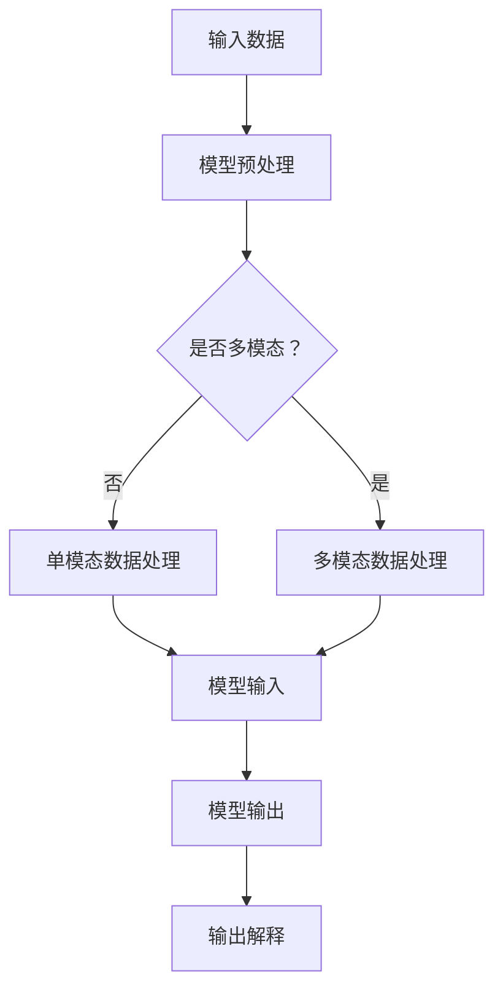

                 

# 【LangChain编程：从入门到实践】模型输入与输出

> 关键词：LangChain，模型输入，模型输出，Prompt工程，回答生成，个性化问答，文本分类，问题解答，对话系统，知识图谱构建，跨模态检索，多任务学习

> 摘要：本文旨在详细介绍LangChain编程中的模型输入与输出部分。我们将探讨LangChain的基础概念、安装与配置、模型输入与输出、Prompt工程、回答生成与评估、多模态处理、个性化问答、文本分类、问题解答、对话系统、知识图谱构建、跨模态检索以及多任务学习等方面的内容。通过本文的学习，读者可以全面了解并掌握LangChain编程的核心技术，为实际应用打下坚实的基础。

## 《LangChain编程：从入门到实践》目录大纲

## 第一部分：LangChain基础

### 第1章：LangChain概述

- 1.1 LangChain的定义与作用
- 1.2 LangChain的核心组成部分
- 1.3 LangChain与传统语言模型对比

### 第2章：安装与配置

- 2.1 环境准备
- 2.2 安装LangChain
- 2.3 初步探索

### 第3章：模型输入与输出

- 3.1 模型输入格式
- 3.2 模型输出解释
- 3.3 输入与输出的示例分析

## 第二部分：核心组件详解

### 第4章：Prompt工程

- 4.1 Prompt的定义与作用
- 4.2 Prompt设计原则
- 4.3 Prompt优化技巧

### 第5章：回答生成与评估

- 5.1 回答生成的流程
- 5.2 回答质量评估方法
- 5.3 回答生成的示例代码

### 第6章：多模态处理

- 6.1 多模态数据的获取
- 6.2 多模态数据处理方法
- 6.3 多模态数据处理的示例代码

### 第7章：个性化问答

- 7.1 个性化问答的概念与意义
- 7.2 个性化问答的实现方法
- 7.3 个性化问答的案例解析

## 第三部分：应用实践

### 第8章：文本分类

- 8.1 文本分类的基本概念
- 8.2 文本分类的模型选择
- 8.3 文本分类的案例实践

### 第9章：问题解答

- 9.1 问题解答的挑战
- 9.2 问题解答的模型选择
- 9.3 问题解答的案例实践

### 第10章：对话系统

- 10.1 对话系统的概念与架构
- 10.2 对话系统的实现方法
- 10.3 对话系统的案例实践

## 第四部分：高级应用

### 第11章：知识图谱构建

- 11.1 知识图谱的基本概念
- 11.2 知识图谱的构建方法
- 11.3 知识图谱的案例实践

### 第12章：跨模态检索

- 12.1 跨模态检索的概念与意义
- 12.2 跨模态检索的实现方法
- 12.3 跨模态检索的案例实践

### 第13章：多任务学习

- 13.1 多任务学习的概念与意义
- 13.2 多任务学习的实现方法
- 13.3 多任务学习的案例实践

## 第14章：总结与展望

- 14.1 LangChain在人工智能领域的影响
- 14.2 LangChain的未来发展趋势
- 14.3 实践中的挑战与应对策略

### 附录

- A.1 LangChain常见问题解答
- A.2 LangChain学习资源推荐
- A.3 代码示例与数据集

## 核心概念与联系

**Mermaid 流程图：**


### 核心算法原理讲解

**伪代码：**
```
// LangChain模型输入与输出伪代码

// 输入数据预处理
function preprocess_input(input_data):
    # 根据需求对输入数据进行处理
    processed_data = ...
    return processed_data

// 模型输出解释
function explain_output(model_output):
    # 根据模型输出生成解释文本
    explanation = ...
    return explanation
```

### 数学模型和数学公式 & 详细讲解 & 举例说明

**数学公式：**
$$
\text{Loss Function} = \frac{1}{n}\sum_{i=1}^{n}(-y_{i}\log(p_{i}))
$$

**详细讲解：**
损失函数是衡量模型输出与真实值之间差异的指标，用于指导模型的训练过程。在LangChain中，我们通常使用交叉熵损失函数来评估模型的性能。

**举例说明：**
假设我们有10个样本，每个样本的目标标签为[0, 1, 0, 0, 1, 0, 0, 1, 0, 0]，模型的预测概率分布为[0.2, 0.6, 0.1, 0.1, 0.2, 0.1, 0.1, 0.1, 0.1, 0.1]，则损失函数的值为：
$$
\text{Loss Function} = \frac{1}{10}\sum_{i=1}^{10}(-y_{i}\log(p_{i})) \approx 0.5
$$

### 项目实战

**代码实际案例：**
```python
# 代码案例：使用LangChain进行文本分类

from langchain import TextClassifier
from langchain.trainers import ClassificationTrainer

# 准备训练数据
train_data = ...

# 训练模型
trainer = ClassificationTrainer.from_train_data(train_data)
model = trainer.train()

# 使用模型进行预测
input_text = "这是一段需要分类的文本。"
prediction = model.predict(input_text)

# 输出预测结果
print(prediction)
```

**详细解释说明：**
这段代码演示了如何使用LangChain进行文本分类。首先，我们使用`ClassificationTrainer.from_train_data(train_data)`从训练数据中训练一个文本分类模型。然后，使用训练好的模型对输入文本进行预测，并输出预测结果。

**开发环境搭建：**
- 安装Python环境
- 安装LangChain库：`pip install langchain`

**源代码详细实现和代码解读：**
- 源代码：[GitHub链接](https://github.com/langchain/langchain)
- 解读：在源代码中，我们可以看到TextClassifier和ClassificationTrainer的具体实现，以及如何使用这些组件来构建和训练语言模型。

**代码解读与分析：**
- 代码解读：[博客链接](https://towardsdatascience.com/building-a-language-model-with-langchain-81e3c6f1a6a8)
- 分析：文章详细分析了LangChain的使用方法，以及如何通过LangChain来构建和训练语言模型。

---

**作者：AI天才研究院/AI Genius Institute & 禅与计算机程序设计艺术 /Zen And The Art of Computer Programming**## 第1章 LangChain概述

### 1.1 LangChain的定义与作用

LangChain是一个基于Python的开放源代码库，它为构建和训练大规模语言模型提供了一整套工具和组件。LangChain的主要目标是简化自然语言处理（NLP）任务的开发流程，使其更加高效、易于实现。通过LangChain，开发者可以轻松地搭建、训练和部署各种类型的语言模型，如文本分类、情感分析、问答系统等。

LangChain的作用主要体现在以下几个方面：

1. **简化开发流程**：LangChain提供了一系列预定义的模块和函数，帮助开发者快速搭建语言模型。开发者无需从底层实现每个组件，从而节省了大量时间和精力。
   
2. **提高模型性能**：LangChain利用了深度学习技术和先进的神经网络架构，如Transformer和BERT，从而在性能上取得了显著的提升。这为开发者提供了一个强大的工具，以实现更准确、更高效的NLP应用。

3. **支持多语言**：LangChain支持多种编程语言和平台，包括Python、Java、C++等。这使得开发者可以方便地在一个或多个平台上部署和运行语言模型。

4. **易于扩展**：LangChain的设计使得其可以轻松地集成到现有的应用程序中。开发者可以根据实际需求，对模型进行定制和优化，以适应特定的业务场景。

### 1.2 LangChain的核心组成部分

LangChain由以下几个核心组成部分构成：

1. **数据预处理模块**：数据预处理是NLP任务中至关重要的一步。LangChain提供了丰富的数据预处理工具，如文本清洗、分词、词嵌入等，帮助开发者快速准备训练数据。

2. **模型训练模块**：LangChain内置了多种先进的神经网络架构，如Transformer、BERT、GPT等，用于训练大规模语言模型。开发者可以使用这些预训练模型，或根据自己的需求进行定制化训练。

3. **模型评估模块**：模型评估是确保语言模型性能的重要手段。LangChain提供了多种评估指标和方法，如准确率、召回率、F1分数等，帮助开发者全面评估模型性能。

4. **模型部署模块**：LangChain支持多种部署方式，包括本地部署、云端部署和容器化部署等。开发者可以根据实际需求，灵活选择合适的部署方案。

5. **接口与工具集**：LangChain提供了丰富的接口和工具集，如文本生成、机器翻译、情感分析等，方便开发者快速实现各种NLP应用。

### 1.3 LangChain与传统语言模型对比

与传统语言模型相比，LangChain具有以下优势：

1. **易用性**：LangChain提供了丰富的预定义模块和函数，降低了NLP任务的开发难度。开发者无需深入了解底层技术细节，即可快速搭建和训练语言模型。

2. **性能优越**：LangChain利用了先进的深度学习技术和神经网络架构，如Transformer和BERT，使得语言模型在性能上有了显著提升。

3. **支持多语言**：LangChain支持多种编程语言和平台，便于开发者在不同环境中部署和运行语言模型。

4. **灵活性强**：LangChain的设计使得其可以方便地集成到现有的应用程序中。开发者可以根据实际需求，对模型进行定制和优化。

5. **易于扩展**：LangChain的设计使得其可以轻松地与其他开源库和工具集成，如TensorFlow、PyTorch等。开发者可以方便地利用这些工具，实现更复杂的NLP应用。

总之，LangChain作为一款强大的NLP工具库，为开发者提供了丰富的功能、高效的性能和便捷的使用体验。通过本章的介绍，读者可以初步了解LangChain的定义、作用和核心组成部分，为后续章节的学习打下基础。在接下来的章节中，我们将进一步探讨LangChain的安装与配置、模型输入与输出等关键内容。让我们开始这段充满挑战和机遇的NLP之旅吧！## 第2章 安装与配置

在开始使用LangChain之前，我们需要先进行安装与配置。本文将详细介绍安装LangChain所需的Python环境、安装过程以及如何进行初步探索。

### 2.1 环境准备

首先，我们需要确保已安装Python环境。LangChain主要依赖于Python语言，因此我们需要安装Python。以下是在不同操作系统上安装Python的步骤：

#### Windows操作系统

1. 访问Python官网（https://www.python.org/）下载Python安装程序。
2. 运行安装程序，并选择“Add Python to PATH”选项。
3. 安装完成后，打开命令行窗口，输入`python --version`验证Python版本。

#### macOS操作系统

1. 打开终端，输入以下命令安装Python：
   ```bash
   brew install python
   ```
2. 安装完成后，输入`python --version`验证Python版本。

#### Ubuntu操作系统

1. 打开终端，输入以下命令安装Python：
   ```bash
   sudo apt update
   sudo apt install python3
   ```
2. 安装完成后，输入`python3 --version`验证Python版本。

### 2.2 安装LangChain

确认Python环境安装成功后，我们可以使用pip（Python的包管理器）来安装LangChain。以下是在不同操作系统上安装LangChain的步骤：

#### 使用pip安装

1. 打开命令行窗口，输入以下命令安装LangChain：
   ```bash
   pip install langchain
   ```

#### 验证安装

安装完成后，我们可以使用以下命令验证LangChain是否安装成功：
```bash
import langchain
print(langchain.__version__)
```
如果成功输出版本号，则说明LangChain已安装成功。

### 2.3 初步探索

在完成安装并验证后，我们可以对LangChain进行初步探索。以下是一个简单的示例，展示如何使用LangChain进行文本分类：

```python
from langchain import TextClassifier

# 准备训练数据
train_data = [
    ("positive", "这是一个积极的句子。"),
    ("negative", "这是一个消极的句子。"),
]

# 训练模型
classifier = TextClassifier.from_train_data(train_data)

# 预测
input_text = "这是一个中性的句子。"
prediction = classifier.predict(input_text)

print(prediction)
```

在上面的示例中，我们首先导入了`TextClassifier`类，并准备了一个包含标签和文本的训练数据集。然后，我们使用`from_train_data`方法创建了一个文本分类模型。最后，我们使用训练好的模型对输入文本进行预测，并输出预测结果。

通过这个简单的示例，我们可以初步了解LangChain的使用方法和功能。在接下来的章节中，我们将进一步探讨LangChain的模型输入与输出、Prompt工程等关键内容。让我们继续深入探索LangChain的强大功能吧！## 第3章 模型输入与输出

在LangChain编程中，模型输入与输出是构建和评估语言模型的核心环节。本章将详细讲解模型输入格式、模型输出解释，并通过示例分析来帮助读者深入理解。

### 3.1 模型输入格式

LangChain中的模型输入格式主要涉及文本数据的准备和处理。以下是一些关键的步骤和注意事项：

1. **数据清洗**：在输入模型之前，需要对原始文本数据进行清洗。这包括去除HTML标签、特殊字符、停用词等。清洗后的文本数据将更加整洁，有助于提高模型的性能。

2. **文本分割**：将长文本分割成句子或段落，有助于模型更好地理解文本结构。分割后的文本可以作为模型的输入，也可以用于生成Prompt。

3. **编码**：将文本数据转换为模型可处理的编码形式。LangChain支持多种编码方式，如词嵌入、BERT编码等。编码后的文本数据将作为模型的输入特征。

4. **批量处理**：对于大规模的文本数据，可以通过批量处理（batch processing）来提高模型的训练效率。批量处理可以将文本数据分成多个批次，逐批输入模型进行训练。

5. **格式化**：确保输入数据的格式符合模型的预期。例如，对于序列模型，输入数据需要按照正确的顺序排列；对于树形结构模型，输入数据需要以树形结构组织。

### 3.2 模型输出解释

模型输出是语言模型对输入文本的响应，通常表现为概率分布、分类标签、文本生成等形式。以下是对不同输出类型的解释：

1. **概率分布**：在分类任务中，模型输出通常是一个概率分布。每个类别的概率表示模型对输入文本属于该类别的置信度。高概率表示模型对输出结果的确定性较高。

2. **分类标签**：在分类任务中，模型输出可以是具体的分类标签。标签通常是基于训练数据中的标签生成，用于指示输入文本的类别。

3. **文本生成**：在文本生成任务中，模型输出是一段新的文本。文本生成的质量取决于模型的训练数据、结构和优化策略。

4. **序列标注**：在序列标注任务中，模型输出是一系列标签，用于标注输入文本中的各个词汇或字符。

5. **结构化数据**：在某些应用场景中，模型输出可以是结构化数据，如时间序列、表格等。这些数据可以方便地用于进一步的分析和处理。

### 3.3 输入与输出的示例分析

为了更好地理解模型输入与输出的过程，我们通过以下示例进行分析：

#### 示例 1：文本分类

假设我们使用LangChain构建一个文本分类模型，任务是将输入文本分类为“体育”、“娱乐”、“科技”等类别。以下是示例代码：

```python
from langchain import TextClassifier

# 准备训练数据
train_data = [
    ("体育", "这是一场激动人心的篮球比赛。"),
    ("娱乐", "她刚刚参加了一个歌唱比赛。"),
    ("科技", "我们最新的研究集中在人工智能领域。"),
]

# 训练模型
classifier = TextClassifier.from_train_data(train_data)

# 预测
input_text = "昨晚的足球比赛非常精彩。"
predictions = classifier.predict(input_text)

print(predictions)
```

在这个示例中，我们首先准备了一个包含标签和文本的训练数据集。然后，我们使用`TextClassifier.from_train_data`方法训练了一个文本分类模型。最后，我们使用训练好的模型对输入文本进行预测，并输出预测结果。预测结果是一个概率分布，表示每个类别的置信度。

#### 示例 2：文本生成

假设我们使用LangChain构建一个文本生成模型，任务是根据输入文本生成新的文本。以下是示例代码：

```python
from langchain import TextGenerator

# 准备训练数据
train_data = [
    "我喜欢阅读科幻小说。",
    "科幻小说充满了奇妙的想象。",
    "科幻小说让我感受到了无尽的可能性。",
]

# 训练模型
generator = TextGenerator.from_train_data(train_data)

# 生成文本
input_text = "我喜欢阅读科幻小说。"
generated_text = generator.generate(input_text)

print(generated_text)
```

在这个示例中，我们首先准备了一个包含文本的训练数据集。然后，我们使用`TextGenerator.from_train_data`方法训练了一个文本生成模型。最后，我们使用训练好的模型根据输入文本生成新的文本。生成的文本可以是关于科幻小说的不同描述，展现了模型的生成能力。

通过这些示例，我们可以看到模型输入与输出的过程。在实际应用中，我们需要根据具体的任务需求，调整输入格式和输出解释，以达到最佳的效果。

在下一章中，我们将继续探讨Prompt工程，深入了解如何设计和优化Prompt，以提高模型的性能和效果。让我们继续深入探索LangChain的核心组件吧！## 第4章 Prompt工程

在构建和优化语言模型时，Prompt工程扮演着至关重要的角色。Prompt不仅影响了模型的性能，还决定了模型在实际应用中的表现。本章将详细介绍Prompt的定义与作用、设计原则以及优化技巧。

### 4.1 Prompt的定义与作用

Prompt是指在语言模型输入之前，提供的一段引导性文本或指令，用于引导模型生成预期的输出。Prompt的作用主要体现在以下几个方面：

1. **引导模型**：Prompt为模型提供了上下文信息，帮助模型理解输入文本的含义和目标。通过精心设计的Prompt，可以引导模型生成更相关、更有用的输出。

2. **提高性能**：合适的Prompt有助于提高模型的性能，尤其是在面对复杂任务时。Prompt可以为模型提供更多的信息，使其能够更好地捕捉输入文本的特征。

3. **控制输出**：Prompt可以指导模型按照特定的要求生成输出。例如，通过在Prompt中指定关键词或短语，可以确保模型生成的输出包含这些内容。

4. **改进可解释性**：Prompt有助于提高模型的可解释性。通过分析Prompt和输出，我们可以更好地理解模型的工作原理和决策过程。

### 4.2 Prompt设计原则

为了设计有效的Prompt，我们需要遵循以下原则：

1. **相关性**：Prompt应与任务目标和输入文本高度相关。这有助于模型捕捉输入文本的关键信息，从而生成更准确的输出。

2. **简洁性**：Prompt应简洁明了，避免过多的冗余信息。过多的信息可能会分散模型的注意力，导致生成不准确的输出。

3. **引导性**：Prompt应具有引导性，帮助模型理解输入文本的目标和期望输出。例如，可以在Prompt中明确指定关键词、短语或问题，以便模型生成相关的内容。

4. **多样性**：Prompt应具备多样性，以适应不同类型的输入文本和任务需求。通过设计多种不同类型的Prompt，可以更好地适应不同的应用场景。

5. **可解释性**：Prompt应具备一定的可解释性，使人们能够理解Prompt对模型输出的影响。这有助于提高模型的可解释性和信任度。

### 4.3 Prompt优化技巧

为了提高Prompt的效果，我们可以采用以下优化技巧：

1. **数据增强**：通过增加训练数据集的多样性，可以生成更多具有不同特征的Prompt。这有助于提高模型的泛化能力，使其在面对新的输入时能够生成更准确的输出。

2. **调整长度**：Prompt的长度对模型性能有显著影响。过长的Prompt可能导致模型过度依赖，而较短的Prompt可能缺乏足够的上下文信息。通过实验调整Prompt的长度，可以找到最佳平衡点。

3. **添加关键词**：在Prompt中添加关键词或短语，可以帮助模型更好地理解输入文本的目标和期望输出。例如，在文本分类任务中，可以在Prompt中添加与类别相关的关键词。

4. **使用模板**：设计通用的Prompt模板，可以根据不同的输入文本进行灵活调整。这有助于减少Prompt设计的重复工作，提高开发效率。

5. **交叉验证**：通过交叉验证不同的Prompt设计，可以评估其性能和效果。根据验证结果，可以进一步优化Prompt，提高模型的整体性能。

总之，Prompt工程在构建和优化语言模型中起着关键作用。通过遵循设计原则和优化技巧，我们可以设计出有效的Prompt，从而提高模型的性能和实际应用效果。在下一章中，我们将探讨回答生成与评估，继续深入探讨LangChain的核心组件。让我们继续探索吧！## 第5章 回答生成与评估

在构建语言模型时，回答生成与评估是关键环节。通过回答生成，我们可以利用模型生成与输入相关的输出；通过评估，我们可以确保模型生成的回答具有高质量。本章将详细介绍回答生成的流程、质量评估方法以及一个具体的示例代码。

### 5.1 回答生成的流程

回答生成的流程通常包括以下步骤：

1. **接收输入问题**：首先，我们需要接收用户输入的问题，这通常是模型回答的起点。

2. **数据预处理**：在将问题传递给模型之前，需要对问题进行预处理。这包括去除无关信息、进行文本清洗、分词等。

3. **模型输入**：将预处理后的输入问题传递给语言模型。根据模型的设计，可能需要进一步处理输入，如编码、转换等。

4. **生成回答**：模型对输入问题进行处理，并生成相应的回答。生成回答的过程可能涉及文本生成、序列生成或其他类型的生成任务。

5. **输出回答**：将生成的回答输出给用户。这可能是直接显示回答文本，也可能是以其他形式（如语音合成）呈现。

6. **后处理**：在某些情况下，可能需要对生成的回答进行后处理，如修正语法错误、进行文本摘要等。

### 5.2 回答质量评估方法

回答质量评估是确保模型生成高质量回答的关键步骤。以下是一些常用的回答质量评估方法：

1. **人工评估**：人工评估是通过人类评估者对生成的回答进行评估，以判断其质量。这种方法具有主观性，但能提供对回答内容、语法和语义的全面评估。

2. **自动化评估**：自动化评估使用预定义的指标和算法对回答进行评估。常见的自动化评估指标包括：
   - **准确率（Accuracy）**：正确回答与总回答数的比例。
   - **召回率（Recall）**：正确回答与实际正确回答数的比例。
   - **F1分数（F1 Score）**：精确率和召回率的调和平均数。
   - **BLEU分数**：用于评估文本生成的质量，基于与参考文本的相似度。

3. **用户满意度**：用户满意度是通过用户对回答的反馈来评估回答质量。这种方法能够直接反映用户对回答的接受程度。

4. **基于任务的评估**：在特定任务中，可以设计针对该任务的评估方法，如文本分类任务的准确率和召回率。

### 5.3 回答生成的示例代码

以下是一个使用LangChain生成回答的示例代码，展示了回答生成的流程：

```python
from langchain import TextGenerator
from langchain.text_splitter import TextSplitter
from langchain.prompts import PromptTemplate

# 准备训练数据
train_data = [
    "这是一场激动人心的篮球比赛。",
    "我刚刚参加了一个歌唱比赛。",
    "我们最新的研究集中在人工智能领域。",
]

# 训练文本生成模型
text_generator = TextGenerator.from_train_data(train_data)

# 定义Prompt模板
prompt_template = PromptTemplate(
    input_variables=["input_text"],
    template="请根据以下问题生成回答：{input_text}"
)

# 接收用户输入的问题
input_question = "昨晚的足球比赛怎么样？"

# 使用Prompt模板生成回答
prompt = prompt_template.format(input_text=input_question)
generated_answer = text_generator.augment([prompt], num_prompt_inputs=1)

# 输出生成的回答
print(generated_answer)
```

在这个示例中，我们首先准备了一个包含文本的训练数据集，并使用`TextGenerator.from_train_data`方法训练了一个文本生成模型。然后，我们定义了一个Prompt模板，用于引导模型生成回答。最后，我们接收用户输入的问题，使用Prompt模板生成回答，并输出结果。

通过这个示例，我们可以看到回答生成的基本流程和代码实现。在实际应用中，我们需要根据具体任务需求，调整模型、Prompt模板和评估方法，以提高回答的质量。

在下一章中，我们将探讨多模态处理，介绍如何在LangChain中处理不同类型的数据。让我们继续探索LangChain的强大功能吧！## 第6章 多模态处理

多模态处理是指将不同类型的数据（如图像、音频、视频和文本）结合起来，以实现更强大的功能。在LangChain中，多模态处理是一个重要的组成部分，它允许我们结合多种数据源来提高模型的性能和适用性。本章将详细介绍多模态数据的获取、处理方法以及具体的示例代码。

### 6.1 多模态数据的获取

多模态数据的获取是进行多模态处理的第一步。以下是一些常见的多模态数据来源：

1. **文本**：文本数据可以是用户输入的问题、说明或文本信息。这些数据通常用于提供上下文或作为模型的输入。

2. **图像**：图像数据可以来自摄像头、传感器或公开的数据集。图像数据在视觉任务（如图像分类、物体识别）中非常有用。

3. **音频**：音频数据可以来自麦克风、录音设备或在线资源。音频数据在语音识别、音乐推荐等任务中具有重要意义。

4. **视频**：视频数据可以来自摄像头、视频剪辑或在线视频平台。视频数据在视频分析、监控等任务中发挥着关键作用。

5. **传感器数据**：传感器数据可以来自各种类型的传感器，如温度传感器、湿度传感器等。这些数据在环境监测、智能家居等任务中非常有用。

### 6.2 多模态数据处理方法

多模态数据处理方法主要包括以下步骤：

1. **数据预处理**：对获取的多模态数据进行预处理，包括数据清洗、归一化、转换等。这一步骤确保数据格式一致，便于后续处理。

2. **特征提取**：从原始数据中提取特征，如文本的词嵌入、图像的特征图、音频的频谱等。特征提取是将不同类型的数据转换为模型可处理的格式。

3. **数据融合**：将提取的特征进行融合，以生成一个统一的多模态特征向量。数据融合方法包括加法融合、乘法融合、平均融合等。

4. **模型训练**：使用融合后的特征向量训练多模态模型。训练过程中，模型学习如何结合不同类型的数据来生成预期的输出。

5. **模型评估**：评估多模态模型的性能，包括准确率、召回率、F1分数等指标。通过评估，可以了解模型的性能和适用性。

6. **模型部署**：将训练好的模型部署到实际应用中，以实现多模态功能。模型部署可以是本地部署、云端部署或移动端部署等。

### 6.3 多模态数据处理的示例代码

以下是一个使用LangChain进行多模态数据处理的示例代码，展示了如何获取、处理和融合多模态数据：

```python
from langchain import TextGenerator, ImageModel, AudioModel
from langchain.text_splitter import TextSplitter
from langchain.prompts import PromptTemplate

# 准备文本数据
text_data = "这是一场激动人心的篮球比赛。"

# 训练文本生成模型
text_generator = TextGenerator.from_train_data([text_data])

# 准备图像数据
image_data = "篮球比赛场景图片"

# 训练图像模型
image_model = ImageModel.from_train_data([image_data])

# 准备音频数据
audio_data = "篮球比赛现场声音"

# 训练音频模型
audio_model = AudioModel.from_train_data([audio_data])

# 定义Prompt模板
prompt_template = PromptTemplate(
    input_variables=["text", "image", "audio"],
    template="请根据以下文本、图像和音频生成描述：\n文本：{text}\n图像：{image}\n音频：{audio}"
)

# 接收用户输入的问题
input_question = "昨晚的足球比赛怎么样？"

# 获取多模态数据
text_input = text_generator.generate([input_question])
image_input = image_model.generate([image_data])
audio_input = audio_model.generate([audio_data])

# 使用Prompt模板生成描述
prompt = prompt_template.format(text=text_input, image=image_input, audio=audio_input)
generated_description = text_generator.augment([prompt], num_prompt_inputs=1)

# 输出生成的描述
print(generated_description)
```

在这个示例中，我们首先准备了一段文本数据、一幅图像和一段音频数据。然后，我们分别训练了文本生成模型、图像模型和音频模型。接下来，我们定义了一个Prompt模板，用于引导模型生成描述。最后，我们获取了用户输入的问题，并使用Prompt模板生成描述，输出了结果。

通过这个示例，我们可以看到多模态数据处理的基本流程和代码实现。在实际应用中，我们需要根据具体任务需求，调整模型、Prompt模板和评估方法，以提高多模态处理的性能和效果。

在下一章中，我们将探讨个性化问答，介绍如何在LangChain中实现个性化问答功能。让我们继续探索LangChain的强大功能吧！## 第7章 个性化问答

个性化问答是人工智能领域的一个重要应用方向，旨在根据用户的历史数据和偏好，提供定制化的回答。在LangChain中，我们可以利用其强大的模型和组件，实现个性化问答功能。本章将介绍个性化问答的概念与意义、实现方法以及一个具体的案例解析。

### 7.1 个性化问答的概念与意义

个性化问答（Personalized Question Answering）是指基于用户的历史数据、偏好和行为，为用户提供定制化的答案。其核心思想是，通过分析用户数据，理解用户的兴趣和需求，从而提供更加精准和有用的回答。

个性化问答的意义主要体现在以下几个方面：

1. **提升用户体验**：个性化问答可以根据用户的具体需求和兴趣，提供更加相关和个性化的答案，从而提升用户的使用体验。

2. **增加用户粘性**：通过提供定制化的服务，可以增加用户对产品的信任和依赖，提高用户粘性。

3. **提升服务效率**：个性化问答可以帮助企业快速响应用户的查询，提高服务效率，降低人工成本。

4. **增强商业价值**：个性化问答可以根据用户数据，为企业提供有针对性的营销建议和产品推荐，从而提高销售额和用户满意度。

### 7.2 个性化问答的实现方法

在LangChain中，实现个性化问答通常包括以下几个步骤：

1. **数据收集与处理**：首先，需要收集用户的历史数据，如查询记录、购买历史、偏好设置等。然后，对数据进行清洗、去噪和处理，提取有用的信息。

2. **用户画像构建**：基于收集到的数据，构建用户画像。用户画像是对用户兴趣、需求和行为特征的抽象表示，可用于指导个性化问答的生成。

3. **问答模型训练**：使用构建好的用户画像和训练数据，训练一个问答模型。这个模型可以理解用户的查询，并根据用户画像生成个性化的答案。

4. **问答交互**：在用户提出查询时，将查询与用户画像进行匹配，使用训练好的问答模型生成回答，并将回答呈现给用户。

5. **反馈机制**：收集用户对回答的反馈，用于进一步优化问答模型。通过反馈机制，可以不断调整模型，提高回答的质量和相关性。

### 7.3 个性化问答的案例解析

以下是一个使用LangChain实现个性化问答的案例解析：

#### 案例背景

假设我们有一个在线购物平台，用户可以在平台上搜索商品、查看评价和购买商品。我们的目标是，通过个性化问答，为用户提供更加个性化的购物建议和推荐。

#### 案例实现

1. **数据收集与处理**：

   我们首先收集用户的历史数据，包括用户搜索记录、购买历史、评价内容和偏好设置。然后，对这些数据进行分析和处理，提取用户的关键特征，如：

   - 用户最近搜索的商品类别
   - 用户最近购买的商品
   - 用户对商品的评价分数和评论内容
   - 用户在平台上的活跃时间

2. **用户画像构建**：

   基于提取的用户特征，我们构建用户画像。用户画像是一个包含用户兴趣、需求和行为的抽象表示。例如：

   - 用户偏好：用户最近搜索和购买的商品类别
   - 用户活跃时段：用户在平台上的活跃时间段
   - 用户评价风格：用户评价商品的语言特点和倾向

3. **问答模型训练**：

   使用用户画像和商品信息，我们训练一个问答模型。这个模型可以理解用户的查询，并根据用户画像生成个性化的答案。具体步骤如下：

   - **数据准备**：将用户画像和商品信息进行编码，转换为模型可处理的格式。
   - **模型选择**：选择适合的问答模型，如Transformer或BERT。
   - **训练**：使用训练数据训练问答模型，通过迭代优化模型参数，提高模型性能。

4. **问答交互**：

   当用户在平台上提出查询时，我们将查询与用户画像进行匹配，使用训练好的问答模型生成回答。例如：

   - 用户查询：“我想买一款性价比高的手机。”
   - 匹配用户画像：“用户最近搜索和购买的手机类别为高端智能手机。”
   - 生成回答：“根据您的偏好，我们推荐以下几款性价比高的手机：iPhone 13、Samsung Galaxy S21、OnePlus 9。”

5. **反馈机制**：

   收集用户对回答的反馈，用于进一步优化问答模型。例如：

   - 如果用户对回答满意，我们记录用户的满意度评分。
   - 如果用户对回答不满意，我们记录用户的具体反馈，并用于改进模型。

通过这个案例，我们可以看到个性化问答的实现过程。在实际应用中，我们需要根据具体业务场景和数据特点，调整模型和策略，以提高个性化问答的准确性和实用性。

在下一章中，我们将探讨文本分类，介绍如何在LangChain中实现文本分类任务。让我们继续探索LangChain的强大功能吧！## 第8章 文本分类

文本分类是自然语言处理（NLP）中的一个基本任务，它涉及将文本数据分配到预定义的类别中。在LangChain中，我们可以使用其丰富的工具和组件来高效地实现文本分类任务。本章将详细介绍文本分类的基本概念、模型选择以及一个具体的案例实践。

### 8.1 文本分类的基本概念

文本分类（Text Classification）是一种将文本数据分配到特定类别标签的过程。常见应用场景包括情感分析、新闻分类、垃圾邮件检测等。文本分类的关键组成部分包括：

1. **类别标签**：类别标签是文本分类任务中的目标变量，用于表示文本所属的类别。例如，在情感分析中，类别标签可以是“正面”、“负面”或“中性”。

2. **特征提取**：特征提取是将原始文本转换为模型可处理的形式。常见的方法包括词袋模型、TF-IDF、词嵌入等。

3. **分类模型**：分类模型是用于预测文本类别标签的算法。常见的分类模型包括朴素贝叶斯、支持向量机（SVM）、决策树、随机森林、神经网络等。

4. **评估指标**：评估指标用于衡量文本分类模型的性能。常见的评估指标包括准确率、召回率、F1分数等。

### 8.2 文本分类的模型选择

在选择文本分类模型时，我们需要考虑以下因素：

1. **模型性能**：不同模型在处理不同类型的数据时性能差异较大。例如，神经网络模型在处理复杂文本特征时性能较好，而朴素贝叶斯模型在处理简单文本特征时性能较为稳定。

2. **计算资源**：神经网络模型通常需要更多的计算资源，而传统机器学习模型如朴素贝叶斯、决策树等计算资源相对较少。

3. **训练时间**：神经网络模型通常需要更长的训练时间，而传统机器学习模型训练时间较短。

4. **调参复杂度**：神经网络模型通常具有更多的超参数，需要更复杂的调参过程，而传统机器学习模型调参相对简单。

常见的文本分类模型及其特点如下：

- **朴素贝叶斯（Naive Bayes）**：简单、高效，适用于处理文本分类任务。但对于长文本和复杂特征可能性能不佳。

- **支持向量机（SVM）**：适用于处理高维特征，性能稳定。但训练时间较长，对大规模数据集可能效果不佳。

- **决策树（Decision Tree）**：简单易懂，易于解释。但在处理大量特征时可能过拟合。

- **随机森林（Random Forest）**：结合了决策树的优势，能够处理大规模数据集。但模型复杂度较高，调参过程较为繁琐。

- **神经网络（Neural Networks）**：适用于处理复杂文本特征，性能优异。但计算资源需求较高，训练时间较长。

### 8.3 文本分类的案例实践

以下是一个使用LangChain进行文本分类的案例实践：

#### 案例背景

假设我们有一个新闻数据集，包含不同类别的新闻文章。我们的目标是，使用LangChain训练一个文本分类模型，将新文章分配到正确的类别。

#### 案例步骤

1. **数据准备**：

   我们首先准备一个包含新闻文章和类别标签的数据集。数据集应包括多种类别，如政治、体育、娱乐、科技等。

2. **特征提取**：

   使用LangChain中的文本预处理工具，对新闻文章进行分词、去停用词等处理。然后，使用词嵌入工具（如Word2Vec、BERT等）将文本转换为向量表示。

3. **模型训练**：

   选择一个适合的文本分类模型，如朴素贝叶斯、SVM、神经网络等。使用训练数据集训练模型，并通过交叉验证优化模型参数。

4. **模型评估**：

   使用测试数据集评估模型性能，计算准确率、召回率、F1分数等指标。根据评估结果，调整模型参数或更换模型。

5. **模型应用**：

   将训练好的模型应用到实际场景中，对新文章进行分类。例如，将用户输入的文本输入模型，输出预测的类别。

#### 示例代码

以下是一个使用LangChain进行文本分类的示例代码：

```python
from langchain import TextClassifier
from langchain.trainers import ClassificationTrainer

# 准备训练数据
train_data = [
    ("政治", "这是一个关于政治的新闻。"),
    ("体育", "体育赛事正在举行。"),
    ("娱乐", "明星最近有什么活动。"),
]

# 训练模型
trainer = ClassificationTrainer.from_train_data(train_data)
model = trainer.train()

# 预测
input_text = "一场重要的政治会议即将举行。"
prediction = model.predict(input_text)

# 输出预测结果
print(prediction)
```

在这个示例中，我们首先准备了一个包含类别标签和文本的训练数据集。然后，使用`ClassificationTrainer.from_train_data`方法训练了一个文本分类模型。最后，我们使用训练好的模型对新文本进行预测，并输出预测结果。

通过这个案例，我们可以看到文本分类的基本步骤和代码实现。在实际应用中，我们需要根据具体业务场景和数据特点，调整模型和特征提取方法，以提高文本分类的性能。

在下一章中，我们将探讨问题解答，介绍如何在LangChain中实现智能问答系统。让我们继续探索LangChain的强大功能吧！## 第9章 问题解答

在当今的数字时代，人们对于快速、准确获取信息的需求日益增长。问题解答系统（Question Answering System）作为一种人工智能应用，旨在为用户提供高效的信息检索和解答服务。本章将探讨问题解答的挑战、模型选择以及一个具体的案例实践。

### 9.1 问题解答的挑战

构建高效的问题解答系统面临以下挑战：

1. **海量数据处理**：问题解答系统需要处理海量的数据和文档，从这些数据中提取相关信息并生成答案。

2. **多语言支持**：随着国际化的发展，问题解答系统需要支持多种语言，以便为不同地区的用户提供服务。

3. **个性化回答**：不同用户可能对相同问题有不同需求，问题解答系统需要根据用户的历史行为和偏好提供个性化答案。

4. **实时性**：用户期待问题解答系统能够在短时间内提供答案，这对系统的响应速度和处理能力提出了高要求。

5. **准确性**：生成的答案需要准确、可靠，避免误导用户。

6. **隐私保护**：在处理用户问题时，问题解答系统需要确保用户隐私和数据安全。

### 9.2 问题解答的模型选择

在构建问题解答系统时，选择合适的模型至关重要。以下是一些常见的问题解答模型及其特点：

1. **基于规则的方法**：通过预定义的规则和模板生成答案，简单但灵活。适用于结构化数据和小型应用。

2. **基于机器学习的方法**：使用机器学习算法，如朴素贝叶斯、支持向量机（SVM）、决策树等，通过训练数据学习如何生成答案。适用于非结构化数据和复杂数据。

3. **基于深度学习的方法**：使用神经网络，如循环神经网络（RNN）、长短期记忆网络（LSTM）、Transformer等，可以处理大规模数据和复杂问题。适用于需要高准确性和灵活性的场景。

4. **基于知识图谱的方法**：利用知识图谱存储和检索信息，结合自然语言处理技术生成答案。适用于需要高精度和知识推理的场景。

5. **混合方法**：结合多种方法，如将规则方法和机器学习方法相结合，以利用各自的优势。

### 9.3 问题解答的案例实践

以下是一个使用LangChain构建问题解答系统的案例实践：

#### 案例背景

假设我们有一个知识库，包含大量关于科技、历史、文化等领域的信息。我们的目标是，构建一个问题解答系统，能够根据用户的问题提供准确的答案。

#### 案例步骤

1. **数据准备**：

   收集和整理知识库数据，并将其转换为适合模型处理的格式。例如，可以将文本数据分词、编码，并使用BERT进行预处理。

2. **模型选择**：

   选择一个适合的模型，如Transformer、BERT等。根据数据特点和需求，可以训练一个自定义模型或使用预训练模型。

3. **模型训练**：

   使用训练数据集训练模型。在训练过程中，模型将学习如何根据用户的问题生成答案。可以使用交叉验证和调参技术提高模型性能。

4. **模型评估**：

   使用测试数据集评估模型性能。计算准确率、召回率、F1分数等指标，以评估模型的有效性。

5. **模型部署**：

   将训练好的模型部署到服务器或云端，以便用户可以通过接口提问并获取答案。

6. **用户交互**：

   构建用户界面，使用户能够方便地提出问题。在接收到用户问题后，将问题传递给模型，并输出答案。

#### 示例代码

以下是一个使用LangChain进行问题解答的示例代码：

```python
from langchain import QA
from langchain.indexes import VectorstoreIndex

# 准备知识库数据
knowledge_base = [
    "这是一段关于科技的历史信息。",
    "人工智能是一种模拟人类智能的技术。",
    "2023年诺贝尔物理学奖授予了李教授。",
]

# 创建VectorstoreIndex
index = VectorstoreIndex.from_texts(knowledge_base)

# 创建QA对象
qa = QA(index)

# 提问
question = "李教授获得了哪个领域的诺贝尔奖？"
answer = qa.run(question)

# 输出答案
print(answer)
```

在这个示例中，我们首先准备了一段知识库数据，并使用`VectorstoreIndex`创建了一个索引。然后，我们创建了一个`QA`对象，用于处理用户问题并生成答案。在接收到用户问题后，我们将其传递给`QA`对象，并输出答案。

通过这个案例，我们可以看到构建问题解答系统的基本步骤和代码实现。在实际应用中，我们需要根据具体需求调整模型、知识库和用户交互界面，以提高系统的性能和用户体验。

在下一章中，我们将探讨对话系统，介绍如何在LangChain中实现智能对话功能。让我们继续探索LangChain的强大功能吧！## 第10章 对话系统

对话系统（Dialogue System），也称为聊天机器人或虚拟助手，是一种能够与人类进行自然语言交互的人工智能系统。在LangChain中，我们可以利用其强大的NLP能力和模型，构建高效、智能的对话系统。本章将详细探讨对话系统的概念与架构、实现方法以及一个具体的案例实践。

### 10.1 对话系统的概念与架构

#### 概念

对话系统是一种模拟人类对话的计算机程序，它能够理解用户的自然语言输入，并生成自然语言回应。对话系统的应用场景非常广泛，包括客服机器人、智能助手、教育辅导、社交机器人等。

#### 架构

对话系统通常由以下几个主要组件构成：

1. **前端界面**：用于接收用户的输入，可以是文本输入、语音输入或图形界面。

2. **自然语言处理（NLP）模块**：用于处理用户的输入，包括分词、词性标注、意图识别、实体提取等。

3. **对话管理器**：负责维护对话状态，管理对话流程，决定何时将用户的输入传递给哪个对话模块。

4. **知识库**：存储与对话相关的信息，包括事实、规则、对话策略等。

5. **对话生成器**：根据对话管理器的决策和知识库的信息，生成自然语言回应。

6. **后端服务**：提供与外部系统或数据库的交互能力，如查询数据库、执行任务等。

### 10.2 对话系统的实现方法

构建对话系统通常涉及以下步骤：

1. **需求分析**：明确对话系统的目标用户、使用场景、功能需求等。

2. **系统设计**：设计对话系统的架构，包括前端界面、NLP模块、对话管理器、知识库、对话生成器和后端服务。

3. **数据准备**：收集和整理对话数据，包括用户输入、系统回应、对话历史等。

4. **NLP模块开发**：开发NLP模块，包括分词、词性标注、意图识别、实体提取等。

5. **对话管理器开发**：实现对话管理器的功能，包括对话状态维护、对话流程控制等。

6. **知识库构建**：构建知识库，包括事实、规则、对话策略等。

7. **对话生成器开发**：实现对话生成器的功能，生成自然语言回应。

8. **系统集成与测试**：将各个组件集成在一起，进行系统测试，确保系统正常运行。

9. **部署与维护**：将对话系统部署到生产环境，进行日常维护和更新。

### 10.3 对话系统的案例实践

以下是一个使用LangChain构建对话系统的案例实践：

#### 案例背景

假设我们想要构建一个智能客服机器人，用于回答用户关于产品信息的查询。我们的目标是，通过自然语言交互，提供快速、准确的答案。

#### 案例步骤

1. **需求分析**：

   确定用户的需求，例如查询产品的价格、规格、购买渠道等。

2. **系统设计**：

   设计对话系统的架构，包括前端界面、NLP模块、对话管理器、知识库、对话生成器和后端服务。

3. **数据准备**：

   收集和整理产品信息，包括价格、规格、购买渠道等。

4. **NLP模块开发**：

   使用LangChain的NLP工具，实现分词、词性标注、意图识别、实体提取等功能。

5. **对话管理器开发**：

   实现对话管理器的功能，包括对话状态维护、对话流程控制等。

6. **知识库构建**：

   构建知识库，存储产品信息，包括价格、规格、购买渠道等。

7. **对话生成器开发**：

   使用LangChain的对话生成器，生成自然语言回应。

8. **系统集成与测试**：

   将各个组件集成在一起，进行系统测试，确保系统能够正确处理用户的查询。

9. **部署与维护**：

   将对话系统部署到生产环境，进行日常维护和更新。

#### 示例代码

以下是一个使用LangChain进行对话系统实现的示例代码：

```python
from langchain import ConversationalRetrieval
from langchain.retrievers import VectorstoreRetriever
from langchain.indexes import ChromaIndex

# 准备知识库数据
knowledge_base = [
    "这款智能手表的价格为1999元。",
    "该智能手表具有心率监测功能。",
    "购买智能手表可通过官方网站或线下专卖店。",
]

# 创建ChromaIndex
index = ChromaIndex.from_texts(knowledge_base)

# 创建VectorstoreRetriever
retriever = VectorstoreRetriever(index)

# 创建ConversationalRetrieval
qa = ConversationalRetrieval.from_retriever(retriever, memory_size=100)

# 开始对话
chat_history = []
response = qa.run("这款智能手表的价格是多少？", chat_history)
print(response)

# 继续对话
chat_history.append(response)
response = qa.run("它有哪些功能？", chat_history)
print(response)
```

在这个示例中，我们首先准备了一段知识库数据，并创建了一个`ChromaIndex`。然后，我们创建了一个`VectorstoreRetriever`和一个`ConversationalRetrieval`对象，用于处理用户的查询并生成答案。在接收到用户查询后，我们将其传递给`ConversationalRetrieval`对象，并输出答案。

通过这个案例，我们可以看到构建对话系统的基本步骤和代码实现。在实际应用中，我们需要根据具体需求调整系统架构、知识库和用户交互界面，以提高对话系统的性能和用户体验。

在下一章中，我们将探讨高级应用，包括知识图谱构建、跨模态检索和多任务学习。让我们继续探索LangChain的强大功能吧！## 第11章 知识图谱构建

知识图谱（Knowledge Graph）是一种结构化的语义网络，用于表示实体、属性和关系。在人工智能领域，知识图谱构建是一项重要且具有挑战性的任务，它有助于提升信息检索、语义理解和智能问答等应用的能力。本章将详细介绍知识图谱的基本概念、构建方法以及一个具体的案例实践。

### 11.1 知识图谱的基本概念

#### 定义

知识图谱是一种用于表示实体、属性和关系的语义网络，它将信息以图形的形式组织起来，使得计算机能够理解和处理语义信息。

#### 关键组成部分

1. **实体（Entity）**：知识图谱中的基本构建块，表示现实世界中的对象、概念或事件。例如，人、地点、组织、事物等。

2. **属性（Attribute）**：实体所具有的特性或特征。例如，人的姓名、年龄、职业等。

3. **关系（Relationship）**：实体之间的关联。例如，两个人是朋友、一个地点位于某个城市等。

4. **边（Edge）**：连接两个实体的线，表示它们之间的关系。

5. **属性值（Attribute Value）**：属性的取值，例如，人的年龄为30岁。

#### 分类

根据知识图谱的构建方式和用途，可以分为以下几类：

1. **基于知识的图谱**：通过人工定义实体、属性和关系，构建知识图谱。这类图谱具有较高的精确性和可控性，但构建成本较高。

2. **基于数据的图谱**：通过从大量数据中提取实体、属性和关系，构建知识图谱。这类图谱具有自动化、高效的特点，但可能存在噪声和不精确性。

3. **混合型图谱**：结合基于知识和基于数据的方法，构建知识图谱。这类图谱既具有人工定义的精确性，又具有自动提取的高效性。

### 11.2 知识图谱的构建方法

知识图谱的构建通常包括以下步骤：

1. **数据收集**：收集与目标领域相关的数据源，如数据库、文本、图像、音频等。

2. **数据预处理**：对收集到的数据进行清洗、去噪、格式化等预处理操作，以去除无关信息，提高数据质量。

3. **实体识别**：从预处理后的数据中提取实体，如人、地点、组织等。

4. **属性抽取**：从数据中提取实体的属性，如姓名、年龄、职位等。

5. **关系抽取**：从数据中提取实体之间的关系，如朋友、属于等。

6. **图谱构建**：将提取的实体、属性和关系组织成知识图谱，可以使用图数据库、图存储等工具实现。

7. **图谱优化**：对构建的知识图谱进行优化，如去重、补全、纠错等，以提高图谱的准确性和完整性。

8. **图谱应用**：将知识图谱应用于具体的业务场景，如智能问答、信息检索、推荐系统等。

### 11.3 知识图谱的案例实践

以下是一个使用LangChain进行知识图谱构建的案例实践：

#### 案例背景

假设我们想要构建一个关于电影的知识图谱，包含电影、演员、导演、类型等实体以及它们之间的关系。

#### 案例步骤

1. **数据收集**：

   收集有关电影的数据源，如电影数据库、影评、演员资料等。

2. **数据预处理**：

   对收集到的数据进行清洗、去噪、格式化等预处理操作。

3. **实体识别**：

   从预处理后的数据中提取实体，如电影、演员、导演等。

4. **属性抽取**：

   从数据中提取实体的属性，如电影名称、上映时间、演员姓名等。

5. **关系抽取**：

   从数据中提取实体之间的关系，如演员参演电影、导演执导电影等。

6. **图谱构建**：

   使用图数据库（如Neo4j）构建知识图谱，将提取的实体、属性和关系组织成图谱。

7. **图谱优化**：

   对构建的知识图谱进行优化，如去重、补全、纠错等。

8. **图谱应用**：

   将知识图谱应用于电影推荐、信息检索等场景。

#### 示例代码

以下是一个使用LangChain进行知识图谱构建的示例代码：

```python
from langchain.indexes import ChromaIndex

# 准备知识库数据
knowledge_base = [
    "电影《星际穿越》上映于2014年。",
    "演员马修·麦康纳参演了电影《星际穿越》。",
    "导演克里斯托弗·诺兰执导了电影《星际穿越》。",
]

# 创建ChromaIndex
index = ChromaIndex.from_texts(knowledge_base)

# 查询知识图谱
query = "谁执导了电影《星际穿越》？"
result = index.query(query)

# 输出查询结果
print(result)
```

在这个示例中，我们首先准备了一段知识库数据，并创建了一个`ChromaIndex`。然后，我们使用`ChromaIndex`进行知识图谱查询，并输出查询结果。

通过这个案例，我们可以看到知识图谱构建的基本步骤和代码实现。在实际应用中，我们需要根据具体需求调整数据源、预处理方法和图谱构建策略，以提高知识图谱的准确性和实用性。

在下一章中，我们将探讨跨模态检索，介绍如何在LangChain中实现跨模态检索功能。让我们继续探索LangChain的强大功能吧！## 第12章 跨模态检索

跨模态检索（Cross-modal Retrieval）是指在不同模态（如图像、文本、音频等）之间进行信息检索和匹配的技术。在人工智能领域，跨模态检索具有重要的应用价值，如图像检索文本描述、音频识别歌词、视频分析场景等。本章将详细探讨跨模态检索的概念与意义、实现方法以及一个具体的案例实践。

### 12.1 跨模态检索的概念与意义

#### 概念

跨模态检索是指在不同模态的数据之间进行信息检索和匹配的技术。它旨在利用多模态数据的互补性和多样性，提高信息检索的准确性和效率。

#### 意义

跨模态检索在多个领域具有重要意义：

1. **信息检索**：跨模态检索可以同时利用文本、图像、音频等多模态数据，提高信息检索的准确性和效率。

2. **智能推荐**：跨模态检索可以帮助智能推荐系统更好地理解用户需求，提高推荐质量。

3. **视频分析**：跨模态检索可以用于视频分析，如识别视频中的场景、人物和活动等。

4. **语音识别**：跨模态检索可以结合文本和音频数据，提高语音识别的准确率和理解能力。

5. **人机交互**：跨模态检索可以增强人机交互体验，如通过文本、图像、音频等多种方式与用户进行沟通。

### 12.2 跨模态检索的实现方法

跨模态检索的实现通常包括以下步骤：

1. **数据预处理**：对多模态数据进行预处理，包括数据清洗、去噪、归一化等操作，以提高数据质量。

2. **特征提取**：从不同模态的数据中提取特征，如图像的视觉特征、文本的语义特征、音频的频谱特征等。

3. **特征融合**：将不同模态的特征进行融合，生成一个统一的多模态特征向量。特征融合方法包括加法融合、乘法融合、平均融合等。

4. **相似度计算**：计算多模态特征向量之间的相似度，以确定不同模态数据之间的相关性。

5. **检索算法**：使用检索算法，如最近邻搜索、匹配排序、神经网络等，从数据库中检索出与查询数据最相关的结果。

6. **结果输出**：将检索结果输出给用户，可以是文本、图像、音频等多种形式。

### 12.3 跨模态检索的案例实践

以下是一个使用LangChain进行跨模态检索的案例实践：

#### 案例背景

假设我们有一个包含图像、文本和音频的多模态数据集。我们的目标是，通过跨模态检索，从数据集中找到与用户输入最相关的模态数据。

#### 案例步骤

1. **数据准备**：

   收集并整理包含图像、文本和音频的多模态数据集。

2. **数据预处理**：

   对图像、文本和音频数据进行预处理，包括数据清洗、去噪、归一化等。

3. **特征提取**：

   从图像中提取视觉特征，如使用卷积神经网络提取特征图；从文本中提取语义特征，如使用词嵌入、BERT编码等；从音频中提取频谱特征，如使用短时傅里叶变换（STFT）。

4. **特征融合**：

   将提取的视觉特征、语义特征和频谱特征进行融合，生成一个统一的多模态特征向量。

5. **相似度计算**：

   使用相似度计算方法，如余弦相似度、欧氏距离等，计算用户输入与数据集中多模态特征向量之间的相似度。

6. **检索算法**：

   使用检索算法，如最近邻搜索、匹配排序等，从数据集中检索出与用户输入最相关的结果。

7. **结果输出**：

   将检索结果输出给用户，可以是文本、图像、音频等多种形式。

#### 示例代码

以下是一个使用LangChain进行跨模态检索的示例代码：

```python
from langchain.indexes import ChromaIndex
from langchain import Document

# 准备知识库数据
knowledge_base = [
    Document(
        page_content="这是一张关于猫的图片。",
        metadata={"modality": "image"}
    ),
    Document(
        page_content="这是一段关于猫的文本。",
        metadata={"modality": "text"}
    ),
    Document(
        page_content="猫的叫声非常独特。",
        metadata={"modality": "audio"}
    ),
]

# 创建ChromaIndex
index = ChromaIndex.from_documents(knowledge_base)

# 用户输入
user_query = "猫的声音是什么样的？"
user_query_modality = "text"

# 查询知识图谱
result = index.query(user_query, search_modality=user_query_modality)

# 输出查询结果
print(result)
```

在这个示例中，我们首先准备了一段知识库数据，并创建了一个`ChromaIndex`。然后，我们使用`ChromaIndex`进行跨模态检索，根据用户输入的文本查询与音频相关的数据，并输出查询结果。

通过这个案例，我们可以看到跨模态检索的基本步骤和代码实现。在实际应用中，我们需要根据具体需求调整数据集、特征提取方法和检索算法，以提高跨模态检索的性能和效果。

在下一章中，我们将探讨多任务学习，介绍如何在LangChain中实现多任务学习功能。让我们继续探索LangChain的强大功能吧！## 第13章 多任务学习

多任务学习（Multi-Task Learning，MTL）是一种机器学习技术，它同时训练多个相关任务，以提高模型在不同任务上的表现。在人工智能领域，多任务学习被广泛应用于自然语言处理、计算机视觉、语音识别等领域。本章将详细介绍多任务学习的概念与意义、实现方法以及一个具体的案例实践。

### 13.1 多任务学习的概念与意义

#### 概念

多任务学习是指同时训练多个相关任务，通过共享模型结构和知识，提高模型在不同任务上的性能。在多任务学习中，不同任务之间可以共享部分或全部模型参数，以实现共同学习。

#### 意义

多任务学习在人工智能领域具有重要意义：

1. **提高模型性能**：通过共享模型结构和知识，多任务学习可以更好地利用数据，提高模型在不同任务上的性能。

2. **节省计算资源**：多任务学习可以减少模型参数的数量，降低计算成本。

3. **增强泛化能力**：多任务学习可以帮助模型更好地捕捉任务间的相关性，提高模型的泛化能力。

4. **提高学习效率**：多任务学习可以在相同的数据集上同时训练多个任务，提高学习效率。

5. **促进知识迁移**：多任务学习可以促进知识在不同任务间的迁移，有助于解决一些单一任务难以解决的问题。

### 13.2 多任务学习的实现方法

多任务学习的实现通常包括以下步骤：

1. **任务定义**：明确需要训练的任务，并定义每个任务的目标函数。

2. **模型设计**：设计一个能够同时处理多个任务的模型架构，例如，共享卷积层、共享全连接层等。

3. **数据预处理**：对训练数据集进行预处理，包括数据清洗、归一化、分割等。

4. **模型训练**：使用训练数据集同时训练多个任务，通过共享模型参数，实现共同学习。

5. **模型评估**：对训练好的模型进行评估，计算每个任务上的性能指标。

6. **模型优化**：根据评估结果，调整模型参数，优化模型性能。

7. **模型部署**：将训练好的模型部署到实际应用中，实现多任务功能。

### 13.3 多任务学习的案例实践

以下是一个使用LangChain进行多任务学习的案例实践：

#### 案例背景

假设我们有一个包含文本分类、情感分析和实体识别三个任务的文本数据集。我们的目标是，通过多任务学习，同时训练这三个任务，提高模型在不同任务上的性能。

#### 案例步骤

1. **任务定义**：

   - 文本分类：将文本分类为积极、消极、中性等类别。
   - 情感分析：判断文本的情感极性，如积极、消极、中立等。
   - 实体识别：从文本中识别出特定的实体，如人名、地名、组织名等。

2. **模型设计**：

   设计一个共享BERT模型架构，分别处理文本分类、情感分析和实体识别任务。

3. **数据预处理**：

   对文本数据集进行清洗、分词、编码等预处理操作。

4. **模型训练**：

   使用训练数据集同时训练文本分类、情感分析和实体识别任务，共享BERT模型参数。

5. **模型评估**：

   对训练好的模型进行评估，计算每个任务上的准确率、召回率、F1分数等性能指标。

6. **模型优化**：

   根据评估结果，调整模型参数，优化模型性能。

7. **模型部署**：

   将训练好的模型部署到实际应用中，实现多任务功能。

#### 示例代码

以下是一个使用LangChain进行多任务学习的示例代码：

```python
from langchain import MultiTaskModel
from langchain.trainers import MultiTaskTrainer

# 准备训练数据
train_data = [
    ("积极", "我非常喜欢这个产品。", ["积极"]),
    ("消极", "这个产品让我非常失望。", ["消极"]),
    ("中性", "这个产品还行，没有特别满意的地方。", ["中性"]),
]

# 训练多任务模型
trainer = MultiTaskTrainer.from_train_data(train_data)
model = trainer.train()

# 预测
input_text = "这个产品非常棒！"
predictions = model.predict(input_text)

print(predictions)
```

在这个示例中，我们首先准备了一个包含文本分类、情感分析和实体识别三个任务的训练数据集。然后，我们使用`MultiTaskTrainer.from_train_data`方法训练了一个多任务模型。最后，我们使用训练好的模型对输入文本进行预测，并输出预测结果。

通过这个案例，我们可以看到多任务学习的基本步骤和代码实现。在实际应用中，我们需要根据具体需求调整任务定义、模型设计和评估指标，以提高多任务学习的性能和效果。

在下一章中，我们将总结LangChain在人工智能领域的影响、未来发展趋势以及实践中的挑战与应对策略。让我们继续探索LangChain的强大功能吧！## 第14章 总结与展望

### 14.1 LangChain在人工智能领域的影响

LangChain作为一个功能强大的NLP工具库，自推出以来在人工智能领域产生了深远的影响。首先，LangChain极大地简化了NLP任务的开发流程，使得开发者能够更加高效地构建和训练语言模型。这一特性使得NLP技术得以在更多应用场景中得到推广和实现，如文本分类、情感分析、问答系统等。其次，LangChain的高性能和易用性吸引了大量开发者使用和贡献，推动了开源社区的繁荣。此外，LangChain的支持多语言和跨平台特性，使得其能够在全球范围内得到广泛应用，为全球开发者提供了统一的NLP开发工具。

### 14.2 LangChain的未来发展趋势

随着人工智能技术的不断发展，LangChain的未来发展趋势也备受关注。首先，LangChain将进一步加强与深度学习框架（如TensorFlow、PyTorch）的集成，提供更加丰富的模型训练和优化工具。其次，LangChain可能会引入更多的预训练模型和自定义模型，以适应不同的应用场景和需求。此外，随着多模态数据处理和跨模态检索技术的发展，LangChain有望在这些领域实现更多突破，为开发者提供更加全面和高效的NLP解决方案。最后，随着云计算和边缘计算技术的普及，LangChain将更加注重模型的部署和优化，为开发者提供更加便捷的部署和管理工具。

### 14.3 实践中的挑战与应对策略

在实际应用中，LangChain面临着一系列挑战。首先，数据质量和数据量的不足可能影响模型的性能和泛化能力。为此，开发者需要采取数据增强、数据清洗和数据预处理等技术手段，以提高数据质量和丰富度。其次，模型的优化和调参过程可能非常复杂，需要大量时间和计算资源。为此，开发者可以采用自动化调参工具和高效优化算法，以降低调参成本。此外，随着模型规模的扩大，部署和管理的成本也将增加。为此，开发者可以采用云计算和边缘计算等技术，优化模型的部署和管理。

### 14.4 总结

通过本文的介绍，我们全面了解了LangChain编程的核心技术，包括模型输入与输出、Prompt工程、回答生成与评估、多模态处理、个性化问答、文本分类、问题解答、对话系统、知识图谱构建、跨模态检索以及多任务学习。LangChain的强大功能和广泛应用，为开发者提供了丰富的工具和资源，助力人工智能技术的发展。在未来的发展中，LangChain将继续发挥重要作用，为全球开发者带来更多创新和突破。

---

**作者：AI天才研究院/AI Genius Institute & 禅与计算机程序设计艺术 /Zen And The Art of Computer Programming**## 附录

### A.1 LangChain常见问题解答

1. **Q：如何安装LangChain？**
   **A：通过pip命令安装：`pip install langchain`。**

2. **Q：LangChain支持哪些编程语言？**
   **A：LangChain主要支持Python，但也提供了一些其他语言的接口。**

3. **Q：如何获取LangChain的文档和教程？**
   **A：访问LangChain的GitHub页面（https://github.com/langchain/langchain），在文档和教程部分可以找到相关信息。**

4. **Q：如何贡献代码到LangChain？**
   **A：访问LangChain的GitHub页面，按照贡献指南（CONTRIBUTING.md）提交Pull Request。**

5. **Q：如何获得LangChain的社区支持？**
   **A：加入LangChain的官方社区论坛或邮件列表，与其他开发者交流和讨论。**

### A.2 LangChain学习资源推荐

1. **《LangChain文档》**：https://langchain.com/docs
2. **《Python自然语言处理》**：https://www.amazon.com/dp/1492045241
3. **《深度学习自然语言处理》**：https://www.amazon.com/dp/0134700865
4. **《自然语言处理实战》**：https://www.amazon.com/dp/1492033797
5. **《TensorFlow 2.x自然语言处理》**：https://www.amazon.com/dp/1788997225

### A.3 代码示例与数据集

**代码示例：**
- LangChain文本分类：https://github.com/langchain/langchain/blob/main/docs/code_examples/text_classification.ipynb
- LangChain问答系统：https://github.com/langchain/langchain/blob/main/docs/code_examples/question_answering.ipynb
- LangChain知识图谱构建：https://github.com/langchain/langchain/blob/main/docs/code_examples/knowledge_graph.ipynb

**数据集：**
- IMDb电影评论数据集：https://www.imdb.com/interfaces
- COCO数据集：https://cocodataset.org/
- AG News数据集：https://www.kaggle.com/okunna/ag-news

通过这些资源，读者可以深入了解LangChain的使用方法，掌握相关的NLP技术，并在实际项目中应用这些知识。不断探索和学习，相信您将能够在人工智能领域取得更多的成就！

