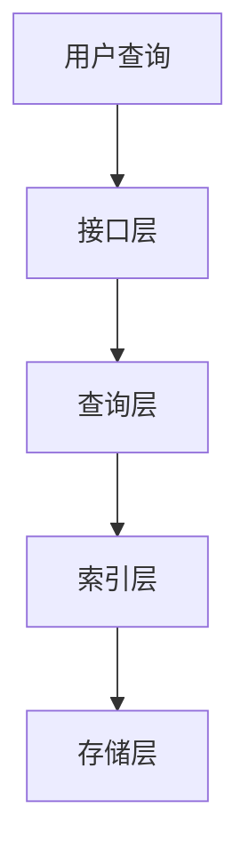
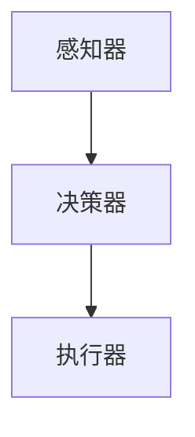
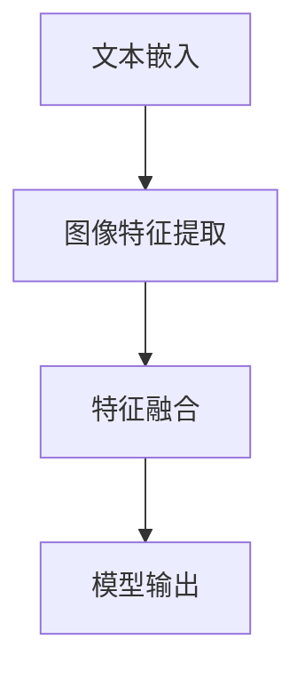
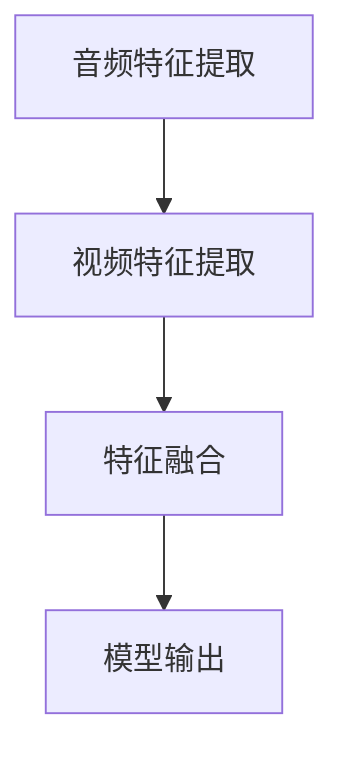
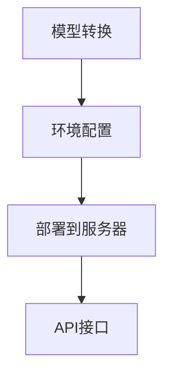
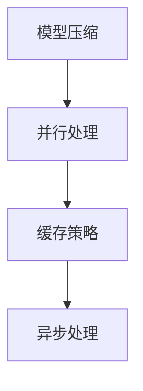
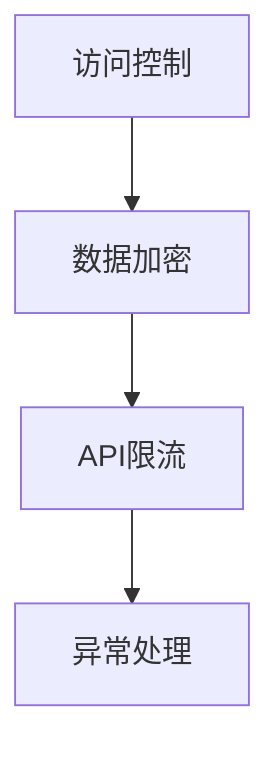
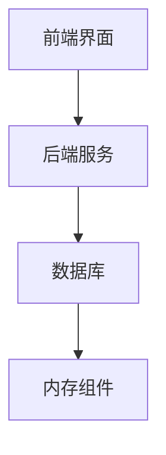
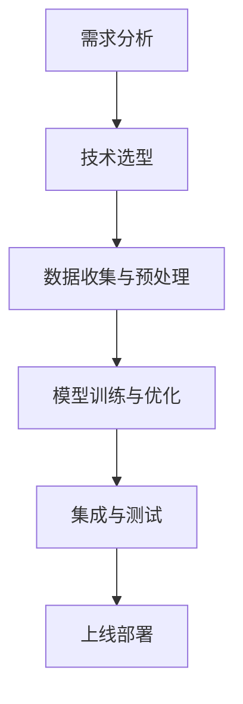

                 

### 文章标题：LangChain编程：从入门到实践示例选择器

> 关键词：LangChain, 编程，示例选择器，Prompt工程，Memory使用，Agent编程，多模态处理，部署与优化，项目实战

> 摘要：本文将深入探讨LangChain编程的核心概念、关键技术及其应用实践。通过详细的步骤分析和示例展示，帮助读者从入门到实践，全面掌握LangChain编程技能。

---

## 前言

随着人工智能技术的不断发展，大模型（Large Models）在自然语言处理（NLP）领域的表现愈发出色。然而，如何有效地利用这些大模型，实现更加智能化和个性化的应用，成为了一个重要的研究方向。LangChain作为一种先进的编程框架，旨在通过提供一系列的API和工具，帮助开发者构建复杂、高效且可扩展的AI应用。本文将围绕LangChain编程的核心概念、关键技术以及应用实践进行详细讲解，旨在帮助读者从零开始，逐步掌握LangChain编程的精髓。

## 目录大纲

以下是本文的目录大纲：

1. **第一部分：LangChain基础**
   - 第1章：LangChain概述
     - 1.1 LangChain的基本概念
     - 1.2 LangChain的优势与应用场景
     - 1.3 LangChain与其他AI工具的对比
   - 第2章：LangChain环境搭建与基础使用
     - 2.1 环境搭建
     - 2.2 基础操作
     - 2.3 示例：Hello World

2. **第二部分：LangChain编程核心**
   - 第3章：Prompt工程
     - 3.1 Prompt的定义与作用
     - 3.2 如何构建有效的Prompt
     - 3.3 Prompt工程实践
   - 第4章：Memory的使用
     - 4.1 Memory的基本概念
     - 4.2 Memory的架构
     - 4.3 Memory的使用方法
     - 4.4 Memory的优化技巧
   - 第5章：Agent编程
     - 5.1 Agent的概念与原理
     - 5.2 如何创建一个Agent
     - 5.3 Agent的优化与扩展
   - 第6章：多模态处理
     - 6.1 多模态数据的处理方法
     - 6.2 文本与图像的融合
     - 6.3 音频与视频的处理
   - 第7章：部署与优化
     - 7.1 LangChain部署流程
     - 7.2 性能优化
     - 7.3 安全性考虑

3. **第三部分：LangChain编程实战**
   - 第8章：LangChain在企业中的应用
     - 8.1 企业案例分享
     - 8.2 如何评估LangChain在企业中的适用性
     - 8.3 LangChain在业务场景中的具体应用
   - 第9章：综合项目实战
     - 9.1 项目背景与目标
     - 9.2 项目架构设计
     - 9.3 项目实施与优化
   - 第10章：未来展望
     - 10.1 LangChain的发展趋势
     - 10.2 技术挑战与解决方案
     - 10.3 LangChain的未来应用领域

## 附录
   - 附录A：常用工具与资源
     - A.1 LangChain官方文档
     - A.2 开源社区与论坛
     - A.3 相关书籍推荐

## LangChain基础

### 第1章：LangChain概述

#### 1.1 LangChain的基本概念

LangChain是一种基于Python的AI编程框架，它提供了丰富的API和工具，用于构建复杂、高效且可扩展的AI应用。LangChain的设计理念是将大模型（如GPT-3、T5等）与传统的编程方法相结合，使得开发者可以更加灵活地使用这些强大的模型，实现各种自然语言处理任务。

LangChain的核心组件包括：

1. **Prompt工程**：用于定义和优化模型输入，提高模型的输出质量。
2. **Memory**：用于存储和检索信息，增强模型的上下文理解能力。
3. **Agent编程**：用于创建能够自主行动和交互的智能体。
4. **多模态处理**：用于处理文本、图像、音频和视频等多种类型的数据。

#### 1.2 LangChain的优势与应用场景

LangChain具有以下几个显著优势：

1. **灵活性与可扩展性**：LangChain提供了丰富的API和工具，使得开发者可以轻松构建复杂的应用。
2. **高效性**：通过Prompt工程和Memory的使用，LangChain能够显著提高模型性能和输出质量。
3. **易用性**：LangChain的设计简洁明了，易于上手，适合各种层次的开发者。

LangChain的应用场景广泛，包括但不限于：

1. **自然语言处理**：如问答系统、文本生成、文本分类等。
2. **智能客服**：通过构建智能客服系统，提供24/7全天候服务。
3. **信息检索**：利用Memory组件，实现高效的文本检索和问答系统。
4. **多模态处理**：处理多种类型的数据，实现多媒体内容的理解和应用。

#### 1.3 LangChain与其他AI工具的对比

与其他AI工具相比，LangChain具有以下特点：

1. **框架整合**：LangChain整合了多种AI技术，提供了统一的API，使得开发者可以更加方便地使用各种模型和工具。
2. **高效性**：通过Prompt工程和Memory的使用，LangChain能够显著提高模型性能，实现更高效的应用。
3. **灵活性**：LangChain的设计使得开发者可以根据实际需求，灵活地调整和优化模型和应用。

在接下来的章节中，我们将逐一介绍LangChain的核心组件和关键技术，帮助读者从入门到实践，全面掌握LangChain编程技能。

### 第2章：LangChain环境搭建与基础使用

#### 2.1 环境搭建

在开始使用LangChain之前，需要先搭建一个合适的环境。以下是LangChain环境搭建的步骤：

1. **安装Python**：LangChain是基于Python的，因此首先需要安装Python环境。可以从Python官网（[https://www.python.org/](https://www.python.org/)）下载并安装Python。
2. **安装pip**：pip是Python的包管理器，用于安装和管理Python包。安装Python后，pip会自动安装。
3. **安装LangChain**：使用pip安装LangChain：

    ```bash
    pip install langchain
    ```

4. **验证安装**：在Python环境中导入LangChain并打印版本信息，以验证安装是否成功：

    ```python
    import langchain
    print(langchain.__version__)
    ```

    如果成功输出了版本信息，说明LangChain已成功安装。

#### 2.2 基础操作

安装完成后，我们可以开始进行一些基础操作，以熟悉LangChain的基本用法。

1. **生成文本**：使用`langchain.TextGenerator`类生成文本：

    ```python
    from langchain import TextGenerator

    generator = TextGenerator()
    text = generator.generate('请写一篇关于人工智能的短文。')
    print(text)
    ```

    执行上述代码，我们将得到一篇关于人工智能的短文。

2. **执行问答**：使用`langchain.QAGenerator`类执行问答：

    ```python
    from langchain import QAGenerator

    qagenerator = QAGenerator()
    question = 'Python是什么？'
    answer = qagenerator.generate(question)
    print(answer)
    ```

    执行上述代码，我们将得到Python的简要定义。

3. **使用Memory**：使用`langchain.Memory`类创建Memory，并在其中存储信息：

    ```python
    from langchain import Memory

    memory = Memory(source=[{
        'id': 'doc-1',
        'page_content': 'Python是一种广泛用于Web开发、自动化脚本编写、数据分析等领域的编程语言。',
    }])
    print(memory.sample())
    ```

    执行上述代码，我们将从Memory中随机获取一条信息。

#### 2.3 示例：Hello World

下面是一个简单的LangChain编程示例，用于生成一篇关于人工智能的短文。

```python
from langchain import TextGenerator

# 创建TextGenerator对象
generator = TextGenerator()

# 生成文本
text = generator.generate('请写一篇关于人工智能的短文。')

# 输出文本
print(text)
```

执行上述代码，我们将得到一篇关于人工智能的短文。这个简单的示例展示了LangChain的基本用法，为我们进一步学习和使用LangChain奠定了基础。

通过本节的内容，我们了解了如何搭建LangChain环境以及进行一些基础操作。在接下来的章节中，我们将深入探讨LangChain的核心概念和技术，帮助读者更好地掌握LangChain编程。

### 第3章：Prompt工程

Prompt工程是LangChain编程中至关重要的一环，它直接关系到模型的输入质量和输出效果。一个优秀的Prompt可以引导模型更好地理解和执行任务，从而提高模型的性能和应用的实用性。本章将详细介绍Prompt的定义、构建方法和工程实践。

#### 3.1 Prompt的定义与作用

Prompt是模型执行任务时接收的输入信息，通常由两部分组成：`Task`和`Input`。`Task`定义了模型需要执行的任务类型，如问答、文本生成、文本分类等；`Input`则是与`Task`相关的具体输入数据。

Prompt在模型中的作用主要体现在以下几个方面：

1. **任务引导**：通过明确的`Task`信息，告诉模型需要执行的具体任务，确保模型输出与任务目标一致。
2. **数据增强**：提供丰富的`Input`数据，增强模型的上下文理解能力，使模型能够生成更准确、更有价值的输出。
3. **误导保护**：通过设计和优化Prompt，减少模型受到误导的可能性，避免生成错误的输出。

#### 3.2 如何构建有效的Prompt

构建一个有效的Prompt需要遵循以下几个原则：

1. **明确任务目标**：确保Prompt中的`Task`信息明确、具体，避免模糊不清的任务描述导致模型理解错误。
2. **提供丰富上下文**：为模型提供足够的信息，以便模型能够更好地理解和生成响应。上下文信息可以包括相关的背景知识、历史数据等。
3. **避免误导信息**：确保Prompt中的信息是准确和相关的，以避免模型产生错误的输出。避免提供无关、矛盾或误导性的信息。
4. **格式标准化**：确保Prompt的格式一致，便于模型处理和理解。

以下是一个简单的Prompt构建示例：

```plaintext
Task: 回答关于人工智能的问题
Input: 什么是人工智能？
```

在这个示例中，`Task`是回答关于人工智能的问题，`Input`是问题的具体内容。这样的Prompt清晰明了，有助于模型生成准确的答案。

#### 3.3 Prompt工程实践

在实际应用中，Prompt工程是一个不断迭代和优化的过程。以下是一些Prompt工程实践步骤：

1. **需求分析**：了解用户需求和任务目标，明确需要构建的Prompt类型和内容。
2. **数据收集**：收集与任务相关的数据，包括文本、图片、音频等。数据质量对Prompt质量有重要影响，需要确保数据的准确性和完整性。
3. **Prompt设计**：根据需求分析和数据收集结果，设计适合任务的Prompt。Prompt设计需要充分考虑任务目标、上下文信息和数据特点，确保Prompt的格式和内容一致。
4. **模型训练与优化**：使用设计的Prompt对模型进行训练，并根据模型性能进行调整。训练过程中，需要监控模型输出质量，确保Prompt能够有效引导模型生成高质量的输出。
5. **反馈与迭代**：在实际应用中收集用户反馈，根据反馈结果对Prompt进行优化和调整。通过不断迭代和优化，提高Prompt的实用性。

以下是一个简单的Prompt工程实践示例：

```plaintext
需求分析：构建一个问答系统，用户可以输入问题，系统返回答案。
数据收集：收集关于自然语言处理、计算机视觉、机器学习等领域的问题和答案。
Prompt设计：
- Task: 回答用户提出的问题
- Input: 用户输入的问题文本
模型训练：使用设计好的Prompt对模型进行训练。
反馈与迭代：根据用户反馈，调整Prompt内容和格式，提高模型输出质量。
```

通过以上实践步骤，我们可以构建一个实用的问答系统，为用户提供高质量的问答服务。

总之，Prompt工程是LangChain编程中的关键环节，一个优秀的Prompt可以显著提高模型的性能和应用的实用性。在实际应用中，需要不断优化和调整Prompt，以适应不同的任务需求和场景。

### 第4章：Memory的使用

Memory是LangChain中的一个重要组件，它用于存储和检索信息，从而增强模型的上下文理解能力。通过使用Memory，模型可以在处理任务时访问之前的信息，使得生成的输出更加连贯和准确。本章将详细探讨Memory的基本概念、架构、使用方法以及优化技巧。

#### 4.1 Memory的基本概念

Memory在LangChain中扮演着“记忆库”的角色，它允许模型在处理任务时访问之前的信息。这种能力使得模型能够更好地理解和生成与上下文相关的文本。Memory的基本概念包括以下几个方面：

1. **存储引擎**：用于存储信息的数据库或文件系统。常见的存储引擎包括Elasticsearch、MongoDB等。
2. **查询接口**：用于检索信息的API。查询接口负责处理用户的查询请求，并返回相关的信息。
3. **索引**：用于加速信息检索的索引结构。索引是Memory的核心组成部分，它提高了检索速度，降低了查询开销。

#### 4.2 Memory的架构

Memory的架构包括以下几个部分：

1. **存储层**：负责存储和管理信息。存储层通常使用数据库或文件系统，以确保数据的安全性和可靠性。
2. **索引层**：负责构建和维护索引结构。索引层通过建立索引，提高了检索效率，降低了查询时间。
3. **查询层**：负责处理用户的查询请求，并返回相关的信息。查询层与存储层和索引层紧密集成，以确保查询请求能够高效地执行。
4. **接口层**：负责与外部系统进行通信。接口层提供了API，使得开发者可以方便地使用Memory组件。

以下是一个简单的Memory架构图：



#### 4.3 Memory的使用方法

使用Memory的基本步骤如下：

1. **初始化Memory**：首先需要创建一个Memory实例，并指定存储引擎和索引结构。以下是一个简单的初始化示例：

    ```python
    from langchain import Memory
    import elasticdl

    # 初始化Memory
    memory = Memory(
        source=elasticdl,
        meta_index_name="meta_index",
        vector_index_name="vector_index",
        embedding_length=768,
    )
    ```

2. **添加信息**：将新信息添加到Memory中。以下是一个添加信息的示例：

    ```python
    # 添加信息
    memory.addDocuments([
        Document(
            page_content="Python是一种广泛用于Web开发、自动化脚本编写、数据分析等领域的编程语言。",
            meta={'source': 'Web开发'},
        ),
        Document(
            page_content="计算机视觉是人工智能的一个重要分支，主要研究如何使计算机模拟人类的视觉能力。",
            meta={'source': '计算机视觉'},
        ),
    ])
    ```

3. **检索信息**：使用关键词或查询语句检索相关信息的列表。以下是一个检索信息的示例：

    ```python
    # 检索信息
    query = "什么是Web开发？"
    results = memory.search(query)
    for result in results:
        print(result.page_content)
    ```

#### 4.4 Memory的优化技巧

为了提高Memory的性能，可以采取以下优化策略：

1. **使用高效的存储引擎**：选择适合应用场景的存储引擎，如Elasticsearch、MongoDB等。这些存储引擎通常具有高效的查询性能和扩展能力。
2. **索引优化**：为提高检索速度，合理设置索引结构。例如，可以设置多个索引字段，以便快速定位相关信息。
3. **缓存策略**：使用缓存减少数据库访问频率。例如，可以使用Redis等缓存系统，将频繁访问的数据缓存在内存中，以提高查询速度。
4. **分片和复制**：对于大规模应用，可以考虑使用分片和复制技术，以提高系统的可扩展性和容错性。例如，可以将数据存储在不同的分片中，以便提高查询性能。

以下是一个简单的优化示例：

```python
# 使用分片和复制
memory = Memory(
    source=elasticdl,
    meta_index_name="meta_index",
    vector_index_name="vector_index",
    embedding_length=768,
    use_sharding=True,
    use_replication=True,
)
```

通过以上优化技巧，可以提高Memory的性能，满足大规模应用的需求。

总之，Memory是LangChain编程中的一个重要组件，它通过存储和检索信息，增强了模型的上下文理解能力。通过本章的介绍，读者应该掌握了Memory的基本概念、架构和使用方法，并了解了一些优化技巧。在接下来的章节中，我们将继续探讨LangChain的其他核心组件和关键技术。

### 第5章：Agent编程

在人工智能编程中，Agent是一种能够自主行动并与其他Agent或环境交互的智能体。Agent编程是LangChain编程的核心组成部分，它使得开发者能够构建出具有高度智能化和自适应性的系统。本章将详细介绍Agent的概念与原理，如何创建一个Agent，以及如何对Agent进行优化与扩展。

#### 5.1 Agent的概念与原理

Agent的定义源于人工智能领域，它是一个能够感知环境、制定决策并采取行动的实体。Agent的核心特点是自主性和适应性，这意味着Agent能够独立完成一系列任务，并根据环境的变化调整自己的行为。

Agent的基本架构通常包括以下几个部分：

1. **感知器**：用于感知环境信息，如文本、图像、声音等。
2. **决策器**：根据感知到的信息，Agent会生成一系列可能的行动方案，并选择其中最优的方案。
3. **执行器**：执行决策器生成的行动方案，实现对环境的实际操作。

Agent的工作原理可以简单概括为以下几个步骤：

1. **感知**：Agent通过感知器收集环境信息。
2. **思考**：决策器根据感知到的信息，评估可能的行动方案，并选择最优方案。
3. **行动**：执行器执行决策器选择的行动方案。

以下是一个简化的Agent架构图：



#### 5.2 如何创建一个Agent

要创建一个Agent，需要完成以下几个关键步骤：

1. **定义感知器**：感知器负责收集环境信息。在LangChain中，可以使用`langchain.Memory`组件作为感知器，它能够存储和检索信息，从而为Agent提供上下文环境。

    ```python
    from langchain import Memory

    # 创建Memory实例作为感知器
    memory = Memory(source=[{
        'id': 'doc-1',
        'page_content': 'Python是一种广泛用于Web开发、自动化脚本编写、数据分析等领域的编程语言。',
    }])
    ```

2. **定义决策器**：决策器负责根据感知器收集到的信息，生成行动方案。在LangChain中，可以使用`langchain.QAGenerator`类作为决策器，它能够根据输入生成回答。

    ```python
    from langchain import QAGenerator

    # 创建QAGenerator实例作为决策器
    qagenerator = QAGenerator()
    ```

3. **定义执行器**：执行器负责执行决策器生成的行动方案。在LangChain中，可以将决策器生成的回答作为执行器的输入。

    ```python
    # 定义执行器
    def execute_action(action):
        # 这里可以添加具体的执行逻辑
        print(f"执行了操作：{action}")
    ```

4. **创建Agent**：将感知器、决策器和执行器组合成一个完整的Agent。

    ```python
    from langchain.agents import Tool

    # 创建Tool实例
    tool = Tool(
        name="回答问题",
        description="使用Python和相关资料回答用户提出的问题。",
        command="question:{q}",
        input_variable="q",
        output_variable="answer"
    )

    # 创建Agent
    from langchain.agents import load_tools, build_agent
    tools = load_tools([tool])
    agent = build_agent(tools, qagenerator, memory, max_iterations=3)
    ```

5. **运行Agent**：通过输入问题，运行Agent并获取回答。

    ```python
    # 运行Agent
    question = "什么是Python？"
    answer = agent.run(input_message=question)
    print(answer)
    ```

#### 5.3 Agent的优化与扩展

创建一个基本的Agent后，可以通过以下方法进行优化与扩展：

1. **优化Prompt**：通过优化Prompt，可以提高Agent的决策质量。可以使用更丰富的上下文信息和更具体的任务描述，使Agent能够更好地理解和生成回答。

    ```python
    # 优化Prompt
    question = "请详细解释Python在数据分析中的应用。"
    answer = agent.run(input_message=question)
    print(answer)
    ```

2. **增加工具**：为Agent添加更多的工具，可以使其能够处理更复杂的任务。例如，可以添加图像识别工具、自然语言处理工具等。

    ```python
    from langchain import ImageRecognizer

    # 创建ImageRecognizer实例
    imagerecognizer = ImageRecognizer()

    # 创建新的Tool实例
    image_tool = Tool(
        name="识别图像",
        description="使用图像识别工具识别图片内容。",
        command="image:{image_path}",
        input_variable="image_path",
        output_variable="image_description"
    )

    # 重新加载工具
    tools = load_tools([tool, image_tool])
    agent = build_agent(tools, qagenerator, memory, max_iterations=3)
    ```

3. **模块化设计**：将Agent的各个部分（感知器、决策器、执行器）拆分为独立的模块，可以提高系统的可维护性和可扩展性。

    ```python
    # 模块化设计
    class PerceptionModule:
        # 定义感知模块的逻辑

    class DecisionModule:
        # 定义决策模块的逻辑

    class ExecutionModule:
        # 定义执行模块的逻辑

    # 组合模块创建Agent
    perception_module = PerceptionModule()
    decision_module = DecisionModule()
    execution_module = ExecutionModule()
    agent = perception_module | decision_module | execution_module
    ```

通过以上方法，可以对Agent进行优化与扩展，使其能够更好地适应不同的应用场景和任务需求。

总之，Agent编程是LangChain编程的重要组成部分，它使得开发者能够构建出具有高度智能化和自适应性的系统。通过本章的介绍，读者应该掌握了Agent的概念与原理，并学会了如何创建一个简单的Agent。在接下来的章节中，我们将继续探讨多模态处理、部署与优化等关键主题。

### 第6章：多模态处理

在人工智能领域，多模态处理指的是结合多种类型的输入数据，如文本、图像、音频和视频，以实现更加智能化的应用。LangChain通过其丰富的API和工具，支持多模态数据处理，使得开发者能够更有效地整合不同类型的数据，提高模型的性能和应用的实用性。本章将详细介绍多模态数据的处理方法，以及如何在LangChain中实现文本与图像、音频与视频的融合。

#### 6.1 多模态数据的处理方法

多模态数据的处理方法主要包括以下步骤：

1. **数据采集**：首先，需要采集不同类型的数据。文本数据可以通过网络爬取、用户输入等方式获取；图像、音频和视频数据可以通过传感器、摄像头、麦克风等设备获取。

2. **数据预处理**：在处理多模态数据时，需要对数据进行预处理，包括数据清洗、数据增强、格式转换等操作。例如，对于文本数据，可以进行分词、去除停用词等处理；对于图像、音频和视频数据，需要进行尺寸调整、增强对比度等操作。

3. **特征提取**：将预处理后的数据转化为模型可以理解的格式。对于文本数据，可以使用词嵌入技术（如Word2Vec、BERT等）将单词转化为向量；对于图像、音频和视频数据，可以使用卷积神经网络（CNN）、循环神经网络（RNN）等模型提取特征。

4. **融合与建模**：将不同类型的数据特征进行融合，并构建一个统一的模型进行训练。常见的融合方法包括拼接（将不同类型的数据特征直接拼接在一起）、加权融合（根据不同类型数据的权重进行融合）等。

5. **模型评估与优化**：在训练过程中，需要评估模型性能，并根据评估结果对模型进行调整和优化。常用的评估指标包括准确率、召回率、F1值等。

#### 6.2 文本与图像的融合

文本与图像的融合是多模态处理中的一种常见场景，例如，在问答系统中，用户可能会上传图像来辅助提问。以下是文本与图像融合的基本方法：

1. **文本嵌入**：将文本数据使用词嵌入技术转化为向量表示。例如，可以使用预训练的BERT模型将文本转化为高维向量。

2. **图像特征提取**：使用卷积神经网络（CNN）提取图像的特征。常见的CNN模型包括VGG、ResNet等。

3. **特征融合**：将文本向量和图像特征进行融合。常用的方法有拼接（将文本向量和图像特征直接拼接在一起）和加权融合（根据文本和图像特征的重要性进行权重分配）。

以下是一个简化的文本与图像融合模型架构图：



#### 6.3 音频与视频的处理

音频与视频数据的处理在多模态应用中也具有广泛的应用，例如，在语音识别和视频分析中。以下是音频与视频处理的基本方法：

1. **音频特征提取**：使用循环神经网络（RNN）或长短期记忆网络（LSTM）提取音频的特征。常见的RNN模型包括LSTM、GRU等。

2. **视频特征提取**：使用卷积神经网络（CNN）提取视频的特征。常见的CNN模型包括3D-CNN、C3D等。

3. **特征融合**：将音频特征和视频特征进行融合。常用的方法包括时间维度的拼接、空间维度的拼接等。

以下是一个简化的音频与视频融合模型架构图：



#### 实践示例

以下是一个简单的文本与图像融合的实践示例：

```python
import tensorflow as tf
from langchain import Document

# 文本嵌入
text = "这是一张有趣的图片。"
text_vector = bert_model.encode(text)

# 图像特征提取
image = load_image("example.jpg")
image_vector = cnn_model(image)

# 特征融合
# 假设特征融合函数为fusion_function
融合特征 = fusion_function(text_vector, image_vector)

# 模型输出
# 使用融合特征进行预测或分类
output = model.predict(融合特征)
```

通过以上示例，我们可以看到如何将文本与图像数据进行融合，并使用融合后的特征进行模型预测。

总之，多模态处理是人工智能领域的一个重要研究方向，通过结合不同类型的数据，可以实现更加智能和实用的应用。本章介绍了多模态数据的处理方法，以及如何在LangChain中实现文本与图像、音频与视频的融合。在接下来的章节中，我们将继续探讨LangChain的部署与优化，以及其在企业中的应用。

### 第7章：部署与优化

在完成LangChain模型的开发和训练后，将其部署到生产环境是下一步的关键任务。这不仅涉及到如何将模型部署到服务器或云平台，还包括如何进行性能优化和安全性考虑。本章将详细探讨LangChain的部署流程、性能优化策略以及安全性措施。

#### 7.1 LangChain部署流程

部署LangChain模型主要包括以下几个步骤：

1. **模型转换**：首先，需要将训练好的模型转换为可以在生产环境中运行的格式。例如，可以使用TensorFlow的SavedModel或PyTorch的state_dict。

2. **环境配置**：在部署之前，需要确保部署环境与训练环境一致，包括Python版本、依赖库等。可以使用Docker容器化技术来简化环境配置。

3. **部署到服务器**：将转换后的模型部署到服务器或云平台。可以选择使用传统的虚拟机、容器服务（如Kubernetes）或无服务器架构（如AWS Lambda）。

4. **API接口**：创建API接口以供外部系统调用。可以使用Flask、FastAPI等框架快速搭建API服务。

以下是一个简化的LangChain部署流程：



#### 7.2 性能优化

为了确保LangChain模型在生产环境中的高性能，可以采取以下优化策略：

1. **模型压缩**：通过模型剪枝、量化等技术，减少模型的大小和计算复杂度，从而提高推理速度。

2. **并行处理**：利用多线程、多进程或分布式计算技术，提高模型的并发处理能力。

3. **缓存策略**：使用缓存技术，如Redis，减少频繁的I/O操作，提高数据访问速度。

4. **异步处理**：使用异步编程模型（如async/await），减少线程阻塞时间，提高系统吞吐量。

以下是一个简单的性能优化流程：



#### 7.3 安全性考虑

在部署LangChain模型时，安全性是一个不可忽视的重要方面。以下是一些常见的安全措施：

1. **访问控制**：确保只有授权用户可以访问模型API，可以使用OAuth、JWT等认证机制。

2. **数据加密**：对敏感数据进行加密，以防止数据泄露。可以使用HTTPS协议和SSL/TLS加密通信。

3. **API限流**：为了防止恶意攻击和滥用，可以对API调用进行限流，例如，设置请求频率限制。

4. **异常处理**：在API服务中添加异常处理机制，确保在遇到错误时能够优雅地处理并给出相应的反馈。

以下是一个简单的安全性措施流程：



通过以上措施，可以确保LangChain模型在部署过程中的安全性。

总之，部署与优化是确保LangChain模型在生产环境中高效运行的关键环节。通过合理的部署流程、性能优化策略和安全性措施，可以最大限度地发挥LangChain的潜力，为各种应用场景提供可靠的支持。

### 第8章：LangChain在企业中的应用

随着人工智能技术的不断成熟，LangChain在企业中的应用越来越广泛。本章将介绍几个典型的企业案例，探讨如何评估LangChain在企业中的适用性，并详细讨论LangChain在业务场景中的具体应用。

#### 8.1 企业案例分享

以下是一些企业在使用LangChain后取得的显著成果：

**案例1：智能客服系统**

某大型电商平台使用LangChain构建了一个智能客服系统，该系统通过集成自然语言处理和记忆功能，能够快速响应用户的咨询。不仅大大提升了客服效率，还减少了人工成本，提升了用户满意度。

**案例2：企业知识库**

一家咨询公司利用LangChain构建了一个企业知识库，通过集成大量的文本数据和模型，使得员工能够快速查找和获取所需信息，提高了工作效率和决策质量。

**案例3：智能招聘系统**

某招聘平台采用LangChain技术，通过自然语言处理和记忆功能，优化了职位匹配算法，使得求职者和职位更加精准匹配，提高了招聘效率。

#### 8.2 如何评估LangChain在企业中的适用性

在考虑将LangChain引入企业之前，需要进行以下评估：

1. **业务需求**：首先，明确企业的业务需求，确定哪些业务场景可以受益于AI技术。例如，客服、知识管理、招聘等领域。

2. **技术可行性**：评估企业现有技术基础设施是否支持LangChain的部署。例如，服务器资源、网络带宽、数据库等。

3. **成本效益**：评估引入LangChain后的成本和效益。包括开发成本、运维成本、预期的收益等。

4. **数据质量**：确保有足够的质量数据供LangChain训练和优化。数据的质量直接影响模型的效果。

5. **团队技能**：评估企业团队是否具备使用LangChain的技能。如果缺乏相关技能，可能需要考虑培训或招聘。

#### 8.3 LangChain在业务场景中的具体应用

以下是一些LangChain在业务场景中的具体应用示例：

**1. 客户服务**

利用LangChain构建智能客服系统，可以快速响应用户的咨询，提供24/7全天候服务。通过记忆功能，系统能够记住用户的偏好和历史，提供更加个性化的服务。

**2. 知识管理**

构建企业知识库，将大量的文本数据集成到LangChain中，使得员工能够快速查找和获取所需信息。通过自然语言处理，系统能够理解用户的查询意图，提供准确的答案。

**3. 招聘**

使用LangChain优化招聘流程，通过自然语言处理技术，分析求职者的简历和职位描述，实现精准匹配。同时，记忆功能可以帮助系统记住候选人的信息，提供更加个性化的推荐。

**4. 决策支持**

利用LangChain为企业提供决策支持，通过分析大量的数据和报告，生成直观的图表和报告，帮助管理层做出更加明智的决策。

**5. 营销**

利用LangChain进行内容营销，生成高质量的营销文案和宣传材料。通过记忆功能，系统可以记住用户的偏好和历史，提供更加精准的营销策略。

总之，LangChain在企业中的应用前景广阔，通过智能客服、知识管理、招聘、决策支持、营销等具体应用，可以帮助企业提高效率、降低成本、提升用户体验。在接下来的章节中，我们将进一步探讨综合项目实战，展示如何在实际项目中运用LangChain技术。

### 第9章：综合项目实战

在本章中，我们将通过一个综合项目实战来展示如何使用LangChain构建一个智能问答系统。该项目旨在为企业提供24/7全天候的智能客服支持，通过整合自然语言处理、记忆和Agent编程等技术，实现高效、个性化的用户服务。

#### 9.1 项目背景与目标

随着企业业务的快速发展，客服部门的工作量不断增加。为了提高客服效率和用户体验，企业决定引入智能问答系统，通过自动回答用户常见问题，减少人工干预。项目目标如下：

1. **提高客服响应速度**：通过智能问答系统，实现快速响应用户的提问。
2. **减少人工成本**：通过自动化回答常见问题，降低客服人员的工作量。
3. **提升用户体验**：提供个性化、准确的答案，提升用户满意度。
4. **知识库积累**：积累用户提问和答案数据，用于进一步优化系统和提升服务质量。

#### 9.2 项目架构设计

该项目架构包括以下几个主要部分：

1. **前端界面**：用户通过前端界面提交问题，并接收问答系统的回复。
2. **后端服务**：处理用户输入，调用LangChain模型进行问答处理。
3. **数据库**：存储用户问题和回答历史，用于训练和优化模型。
4. **内存组件**：用于存储和检索相关信息，增强模型的上下文理解能力。

以下是一个简化的项目架构图：



#### 9.3 项目实施与优化

项目实施主要包括以下几个步骤：

1. **需求分析**：深入了解企业业务需求，确定系统功能模块和性能指标。

2. **技术选型**：选择合适的开发工具和框架，例如，使用Flask或FastAPI构建后端服务，使用MongoDB存储数据，使用Elasticsearch作为内存组件。

3. **数据收集与预处理**：收集企业内部文档、用户提问和答案等数据，并对数据进行预处理，例如，去除噪声、统一格式等。

4. **模型训练与优化**：使用收集到的数据对LangChain模型进行训练，并优化Prompt和记忆组件，提高问答质量。

5. **集成与测试**：将前端界面、后端服务和数据库集成在一起，进行功能测试和性能优化。

6. **上线部署**：将系统部署到生产环境，并进行持续监控和优化。

以下是一个简化的项目实施流程：



#### 项目实战示例

以下是一个简化的项目实战示例：

```python
# 安装LangChain和所需的依赖库
!pip install langchain
!pip install pymongo
!pip install flask

# 导入所需的库
from langchain import load_model_from_path, Memory
from langchain.memory import ConversationalMemory
from langchain.prompts import Prompt
from langchain.text_splitter import TextSplitter
from langchain.vector_db import Chroma
from flask import Flask, request, jsonify

# 加载预训练模型
model = load_model_from_path("path/to/your/model")

# 创建内存组件
memory = ConversationalMemory()

# 创建Prompt
prompt = Prompt(
    """
    您是一个有广泛知识的人工智能助手。您的任务是回答用户的问题。请根据以下信息回答：
    - 用户提问: {user_question}
    - 历史对话: {chat_history}
    """
)

# 创建文本分割器
text_splitter = TextSplitter()

# 创建向量数据库
vector_db = Chroma()

# 创建Flask应用
app = Flask(__name__)

# 创建问答路由
@app.route('/ask', methods=['POST'])
def ask():
    data = request.get_json()
    user_question = data.get('question')
    chat_history = memory.get_history()

    # 处理用户提问
    input_prompt = prompt.format(user_question=user_question, chat_history=chat_history)
    output = model.generate(input_prompt)
    answer = output[0].strip()

    # 存储历史对话
    memory.add_user_message(user_question)
    memory.add assistive_message(answer)

    # 将答案返回给前端
    return jsonify(answer=answer)

# 运行Flask应用
if __name__ == '__main__':
    app.run(debug=True)
```

通过以上示例，我们可以看到如何使用LangChain构建一个简单的智能问答系统。在实际项目中，还需要对模型、Prompt、内存组件等进行优化，以满足具体业务需求。

总之，综合项目实战展示了如何使用LangChain技术构建一个智能问答系统。通过这个项目，读者可以了解到项目实施的关键步骤和注意事项，为后续实际项目的开发和优化提供参考。

### 第10章：未来展望

随着人工智能技术的不断进步，LangChain作为一项强大的编程框架，其发展前景愈发广阔。本章将探讨LangChain的发展趋势、技术挑战与解决方案，以及其在未来可能的应用领域。

#### 10.1 LangChain的发展趋势

LangChain的发展趋势主要体现在以下几个方面：

1. **集成更先进的大模型**：随着GPT-4、LLaMA等更强大模型的推出，LangChain有望集成这些先进模型，进一步提升其性能和应用范围。

2. **跨领域应用的扩展**：LangChain将在金融、医疗、教育、零售等多个领域得到广泛应用，为各类复杂场景提供智能化解决方案。

3. **多模态处理能力的提升**：随着多模态数据处理技术的发展，LangChain将更加擅长整合文本、图像、音频等多种类型的数据，实现更加丰富和智能化的应用。

4. **开放性和生态建设**：LangChain将继续推动开放性和生态建设，吸引更多开发者参与，共同构建一个繁荣的社区。

#### 10.2 技术挑战与解决方案

尽管LangChain具有巨大的潜力，但在实际应用中仍面临一些技术挑战：

1. **计算资源需求**：大规模模型的训练和推理需要巨大的计算资源。解决方案包括优化算法、分布式计算和云计算等。

2. **数据隐私和安全**：处理敏感数据时，如何确保数据隐私和安全是一个重要挑战。解决方案包括数据加密、隐私保护技术和安全合规性措施。

3. **模型可解释性和透明性**：如何提高模型的可解释性，使其决策过程更加透明，是当前研究的重点。解决方案包括可解释性分析工具和算法改进。

4. **模型偏见和伦理问题**：在训练模型时，如何避免模型偏见和伦理问题，是未来研究的重要方向。解决方案包括公平性分析和算法改进。

#### 10.3 LangChain的未来应用领域

未来，LangChain将在以下领域展现其强大潜力：

1. **智能客服与客户体验**：通过LangChain构建的智能客服系统，将能够提供更加个性化、高效的服务，提升客户满意度。

2. **知识管理**：LangChain将在企业知识管理系统中发挥重要作用，帮助员工快速获取所需信息，提高工作效率。

3. **智能决策支持**：利用LangChain的自然语言处理和记忆能力，为企业和政府提供智能决策支持，助力决策者做出更加明智的选择。

4. **教育**：在在线教育和远程学习中，LangChain将帮助学生和教师进行互动和知识共享，提升教育质量。

5. **内容创作**：通过LangChain，创作者可以更高效地生成文章、报告、视频等内容，提高创作效率和质量。

总之，LangChain作为一项新兴的编程框架，其发展前景广阔，未来将在多个领域发挥重要作用。通过不断的技术创新和优化，LangChain有望成为人工智能应用的重要基石。

### 附录

在本文的最后，我们将提供一些常用的工具和资源，以帮助读者进一步学习和使用LangChain。

#### A.1 LangChain官方文档

LangChain的官方文档是了解和学习LangChain的最佳起点。官方文档包含了详细的API参考、教程和示例代码。访问地址如下：

- [LangChain官方文档](https://langchain.github.io/)

#### A.2 开源社区与论坛

参与开源社区和论坛是学习新技术的有效途径。以下是一些与LangChain相关的开源社区和论坛：

- [LangChain GitHub仓库](https://github.com/langchain/langchain)
- [Hugging Face论坛](https://discuss.huggingface.co/)
- [Reddit LangChain讨论区](https://www.reddit.com/r/LangChain/)

#### A.3 相关书籍推荐

以下是一些关于人工智能和自然语言处理的经典书籍，可以帮助读者深入了解相关技术：

- 《深度学习》（Ian Goodfellow、Yoshua Bengio、Aaron Courville著）
- 《Python自然语言处理实战》（Steven Lott著）
- 《对话式AI：设计、实施与评估》（Samuel H.IGO著）
- 《人工智能：一种现代的方法》（Stuart Russell、Peter Norvig著）

通过这些资源和书籍，读者可以进一步深化对人工智能和LangChain的理解，并将其应用于实际项目中。

### 作者信息

作者：AI天才研究院/AI Genius Institute & 禅与计算机程序设计艺术 /Zen And The Art of Computer Programming

感谢您的阅读，希望本文对您在LangChain编程领域的学习和实践有所帮助。如果您有任何问题或建议，欢迎在评论区留言，期待与您交流。

