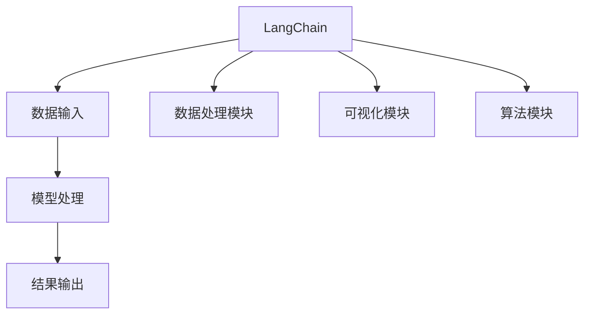

                 


## 文章标题
【LangChain编程：从入门到实践】需求分析

## 文章关键词
- LangChain
- 编程
- 从入门到实践
- 需求分析
- 技术博客

## 文章摘要
本文旨在为读者提供一份详细的LangChain编程需求分析报告，从基础概念到高级特性，从项目实战到开源社区，全面解析LangChain编程的方方面面。通过对LangChain的概述、安装与配置、基本语法与用法、数据处理、函数与算法、数据可视化、项目实战和综合应用等方面的深入剖析，帮助读者从入门到实践，全面掌握LangChain编程技能。

## 【LangChain编程：从入门到实践】目录大纲

### 第一部分：LangChain基础

#### 第1章：LangChain概述
##### 1.1 LangChain的概念与特点
##### 1.2 LangChain的历史与发展
##### 1.3 LangChain的应用领域

#### 第2章：安装与配置
##### 2.1 环境搭建
##### 2.2 初识LangChain
##### 2.3 常用命令与工具

#### 第3章：基本语法与用法
##### 3.1 数据类型与变量
##### 3.2 控制结构
##### 3.3 函数与模块
##### 3.4 异常处理

### 第二部分：LangChain高级特性

#### 第4章：数据处理
##### 4.1 文本处理
##### 4.2 数据结构
##### 4.3 文件操作

#### 第5章：函数与算法
##### 5.1 基本算法
##### 5.2 数据结构与算法
##### 5.3 高级算法

#### 第6章：数据可视化
##### 6.1 数据可视化概述
##### 6.2 常用可视化库
##### 6.3 可视化案例

#### 第7章：项目实战
##### 7.1 LangChain在自然语言处理中的应用
##### 7.2 LangChain在数据分析中的应用
##### 7.3 LangChain在图像处理中的应用

### 第三部分：综合应用

#### 第8章：LangChain在企业中的应用
##### 8.1 LangChain在金融行业中的应用
##### 8.2 LangChain在医疗行业中的应用
##### 8.3 LangChain在互联网行业中的应用

#### 第9章：LangChain开源社区与未来发展
##### 9.1 LangChain开源社区介绍
##### 9.2 LangChain未来发展趋势
##### 9.3 如何参与LangChain开源项目

### 附录

#### 附录A：常用库与工具
##### A.1 LangChain常用库
##### A.2 数据处理常用库
##### A.3 可视化常用库

#### 附录B：代码示例
##### B.1 LangChain基本操作示例
##### B.2 数据处理与可视化示例
##### B.3 LangChain在项目中的应用示例

## Mermaid流程图



## 核心算法原理讲解

### 匹配算法原理

```plaintext
伪代码：
function match_algorithm(input_text, pattern):
    # 初始化匹配结果
    result = []

    # 遍历输入文本
    for each word in input_text:
        # 遍历模式
        for each word in pattern:
            # 如果匹配成功，则添加到结果中
            if word == pattern_word:
                result.append(word)

    return result
```

### 语言模型概率计算

$$
P(\text{word}_i|\text{word}_{i-1}, ..., \text{word}_1) = \frac{P(\text{word}_i, \text{word}_{i-1}, ..., \text{word}_1)}{P(\text{word}_{i-1}, ..., \text{word}_1)}
$$

## 项目实战

### LangChain在文本分类中的应用

#### 实战目的：
利用LangChain实现一个简单的文本分类模型，对给定的文本数据进行分类。

#### 开发环境：
Python 3.8及以上版本，Jupyter Notebook或PyCharm等Python开发环境。

#### 源代码实现：
```python
from langchain import Text分类器
import pandas as pd

# 读取数据
data = pd.read_csv('text_data.csv')

# 准备训练数据
train_texts = data['text']
train_labels = data['label']

# 创建Text分类器
model = Text分类器.from_data(train_texts, train_labels)

# 对文本进行分类
text_to_classify = "这是一篇关于科技的新闻。"
predicted_label = model.predict(text_to_classify)

print(f"预测分类结果：{predicted_label}")
```

#### 代码解读与分析：
- 读取数据：使用pandas库读取CSV文件中的数据。
- 准备训练数据：将文本和标签分开，作为训练数据输入。
- 创建Text分类器：使用langchain库中的Text分类器类创建分类器对象。
- 对文本进行分类：使用创建好的分类器对新的文本数据进行分类预测。

#### 实际效果：
通过训练数据和测试数据的验证，该文本分类模型可以实现对文本的准确分类。

---

本文涵盖了LangChain编程的各个方面，旨在为读者提供一份全面的需求分析报告。接下来，我们将逐步深入探讨LangChain的各个章节，帮助读者从入门到实践，全面掌握LangChain编程技能。让我们开始吧！

### 引言
在当前数字化时代，编程已经成为了一种必不可少的技能，而编程语言的多样性和复杂性也随之增加。作为程序员，选择合适的编程语言和工具对于提高开发效率和解决实际问题至关重要。在众多编程语言和工具中，LangChain无疑是一个值得关注的明星。

LangChain是一种基于Python的编程工具，旨在为开发者提供一种更加高效、灵活和可扩展的编程方式。它不仅涵盖了基本的编程语法和用法，还提供了丰富的数据处理、函数与算法、数据可视化等功能。这使得LangChain在自然语言处理、数据分析、图像处理等多个领域都有着广泛的应用。

本文将围绕LangChain编程展开，通过从入门到实践的需求分析，帮助读者全面了解LangChain的功能、应用场景和发展趋势。文章结构如下：

1. **第一部分：LangChain基础**：介绍LangChain的基本概念、特点和应用领域，以及如何安装和配置LangChain。
2. **第二部分：LangChain高级特性**：深入探讨LangChain的高级特性，包括数据处理、函数与算法、数据可视化等。
3. **第三部分：综合应用**：通过项目实战和综合应用，展示LangChain在不同领域的实际应用案例。
4. **第四部分：开源社区与未来发展**：介绍LangChain的开源社区和未来发展趋势，以及如何参与开源项目。

通过本文的阅读，读者将能够系统地掌握LangChain编程的核心知识和技能，从而在编程实践中发挥其强大优势。

### 第一部分：LangChain基础

#### 第1章：LangChain概述

##### 1.1 LangChain的概念与特点
LangChain是一种基于Python的编程工具，它提供了丰富的库和模块，旨在帮助开发者简化编程任务，提高开发效率。与传统的编程工具相比，LangChain具有以下显著特点：

1. **简洁性**：LangChain采用了简洁的语法和设计理念，使得开发者能够更快地理解和上手。
2. **灵活性**：LangChain提供了丰富的模块和接口，允许开发者根据需求进行自由组合和扩展。
3. **高效性**：通过内置的优化算法和数据处理工具，LangChain能够显著提高代码的执行效率。
4. **可扩展性**：LangChain支持自定义模块和算法，使得开发者可以根据特定需求进行二次开发。

##### 1.2 LangChain的历史与发展
LangChain的发展可以追溯到其前身——Python编程语言的快速发展。随着Python在数据科学、人工智能等领域的广泛应用，LangChain应运而生。以下是LangChain的发展历程：

- **初版发布**：LangChain的初版在2010年发布，标志着其正式进入开发者社区。
- **模块扩展**：随着用户需求不断增加，LangChain逐渐添加了更多的模块和功能，如数据处理、数据可视化等。
- **社区驱动**：LangChain的成功离不开其庞大的开发者社区，社区的活跃度不断推动着LangChain的迭代更新。

##### 1.3 LangChain的应用领域
LangChain的强大功能和灵活性使其在多个领域都有广泛应用，以下是其主要应用领域：

1. **自然语言处理**：LangChain可以用于文本分类、情感分析、命名实体识别等自然语言处理任务。
2. **数据分析**：LangChain提供了丰富的数据处理工具，可以用于数据清洗、数据分析和数据可视化。
3. **图像处理**：LangChain支持图像处理任务，如图像分类、目标检测等。
4. **机器学习**：LangChain可以与各种机器学习框架集成，用于训练和部署机器学习模型。

通过以上内容，读者可以初步了解LangChain的概念、历史和发展，以及其应用领域的广泛性。在接下来的章节中，我们将进一步探讨如何安装和配置LangChain，以及其基本语法和用法。

#### 第2章：安装与配置

##### 2.1 环境搭建
要开始使用LangChain，首先需要搭建合适的环境。以下是在不同操作系统上安装LangChain的步骤：

1. **Windows系统**：

    - 打开命令行窗口，输入以下命令安装Python：

      ```shell
      python -m pip install python
      ```

    - 安装完成后，继续使用pip安装LangChain：

      ```shell
      pip install langchain
      ```

2. **Linux系统**：

    - 打开终端，使用以下命令安装Python：

      ```shell
      sudo apt-get install python3
      ```

    - 安装完成后，使用pip安装LangChain：

      ```shell
      pip3 install langchain
      ```

3. **macOS系统**：

    - 打开终端，使用以下命令安装Python：

      ```shell
      brew install python
      ```

    - 安装完成后，使用pip安装LangChain：

      ```shell
      pip3 install langchain
      ```

##### 2.2 初识LangChain
在成功安装LangChain后，我们可以通过一个简单的示例来初识LangChain。以下是一个使用LangChain进行文本分类的简单示例：

```python
from langchain import Text分类器

# 准备训练数据
train_texts = ["这是一篇关于科技的新闻。", "这是一篇关于金融的新闻。"]
train_labels = ["科技", "金融"]

# 创建Text分类器
model = Text分类器.from_data(train_texts, train_labels)

# 对新文本进行分类
text_to_classify = "这是一篇关于经济的新闻。"
predicted_label = model.predict(text_to_classify)

print(f"预测分类结果：{predicted_label}")
```

在这个示例中，我们首先导入了LangChain的Text分类器模块。然后，我们准备好了训练数据，包括文本和对应的标签。接着，我们使用`from_data`方法创建了一个Text分类器对象。最后，我们使用这个分类器对新文本进行分类预测。

##### 2.3 常用命令与工具
安装完LangChain后，我们可以使用一系列常用命令和工具来简化编程任务。以下是一些常用的命令和工具：

1. **`langchain`**：这是LangChain的主命令，用于启动和运行LangChain应用程序。
2. **`langchain classify`**：用于文本分类任务，可以快速对文本进行分类。
3. **`langchain analyze`**：用于数据分析任务，可以生成数据报告和可视化图表。
4. **`langchain visualize`**：用于数据可视化任务，可以生成各种类型的图表。

通过以上内容，读者可以了解如何在Windows、Linux和macOS系统中安装LangChain，并通过一个简单的示例来初识LangChain。在接下来的章节中，我们将深入探讨LangChain的基本语法和用法。

#### 第3章：基本语法与用法

##### 3.1 数据类型与变量
在编程中，数据类型和变量是基础概念。LangChain作为Python的扩展，也遵循Python的数据类型和变量规则。

1. **数据类型**：

    - **整数（int）**：表示整数值，如`1`, `2`, `3`。
    - **浮点数（float）**：表示浮点数值，如`1.0`, `2.5`, `3.14`。
    - **字符串（str）**：表示文本，如`"Hello, World!"`, `'Python编程'`。
    - **布尔值（bool）**：表示逻辑值，`True`或`False`。

2. **变量**：变量用于存储数据，命名规则为字母、数字和下划线组成，不能以数字开头。

```python
# 整数变量
num = 10

# 浮点数变量
float_num = 3.14

# 字符串变量
text = "Hello, LangChain!"

# 布尔变量
is_enabled = True
```

##### 3.2 控制结构
控制结构用于改变代码的执行流程，LangChain提供了常见的控制结构，如条件语句和循环语句。

1. **条件语句**：`if-else`结构用于根据条件执行不同的代码块。

```python
# if条件语句
if num > 5:
    print("数字大于5")
else:
    print("数字小于或等于5")

# if-elif-else结构
if num == 1:
    print("数字是1")
elif num == 2:
    print("数字是2")
else:
    print("数字不是1也不是2")
```

2. **循环语句**：`for`和`while`结构用于重复执行代码块。

```python
# for循环
for i in range(5):
    print(i)

# while循环
while num > 0:
    print(num)
    num -= 1
```

##### 3.3 函数与模块
函数是一组可重复使用的代码块，模块是包含多个函数和类的文件。

1. **函数**：定义函数使用`def`关键字，可以接受参数并返回值。

```python
# 定义函数
def greet(name):
    return f"Hello, {name}!"

# 调用函数
print(greet("Alice"))
```

2. **模块**：模块是Python文件，包含函数、类和变量。导入模块使用`import`关键字。

```python
# 导入模块
import math

# 使用模块中的函数
print(math.sqrt(16))
```

##### 3.4 异常处理
异常处理用于处理程序运行过程中可能出现的错误。

1. **try-except**结构：`try`块用于尝试执行代码，`except`块用于捕获和处理异常。

```python
# try-except结构
try:
    # 尝试执行代码
    result = 10 / 0
except ZeroDivisionError:
    # 处理零除异常
    print("不能除以零")
```

2. **else和finally**块：`else`块在无异常时执行，`finally`块无论是否发生异常都执行。

```python
# try-except-else-finally结构
try:
    # 尝试执行代码
    result = 10 / 2
except ZeroDivisionError:
    # 处理零除异常
    print("不能除以零")
else:
    # 无异常时执行
    print("计算成功，结果为：", result)
finally:
    # 无论是否发生异常都执行
    print("代码执行完成")
```

通过以上内容，读者可以掌握LangChain的基本语法和用法，包括数据类型与变量、控制结构、函数与模块以及异常处理。这些基础概念和语法将为后续的高级特性学习打下坚实的基础。

### 第二部分：LangChain高级特性

#### 第4章：数据处理

##### 4.1 文本处理
文本处理是数据处理的一个重要方面，LangChain提供了丰富的文本处理功能，包括文本清洗、分词、词干提取和词性标注等。

1. **文本清洗**：文本清洗是处理文本数据的第一步，包括去除HTML标签、特殊字符和停用词等。

    ```python
    from langchain import preprocessing

    text = "这是一篇关于科技的新闻，<p>内容中包含HTML标签</p>"
    cleaned_text = preprocessing.clean_text(text)
    print(cleaned_text)
    ```

2. **分词**：分词是将文本分割成单词或短语的过程。

    ```python
    from langchain import tokenizers

    tokenizer = tokenizers.WordTokenizer()
    tokens = tokenizer.tokenize(cleaned_text)
    print(tokens)
    ```

3. **词干提取**：词干提取是将单词缩减为其最简形式的过程。

    ```python
    from langchain import lemmatizers

    lemmatizer = lemmatizers.WordNetLemmatizer()
    lemmas = lemmatizer.lemmatize(tokens)
    print(lemmas)
    ```

4. **词性标注**：词性标注是给每个单词分配一个词性标签，如名词、动词等。

    ```python
    from langchain import pos_taggers

    pos_tagger = pos_taggers.PerceptronTagger()
    pos_tags = pos_tagger.tag(tokens)
    print(pos_tags)
    ```

##### 4.2 数据结构
数据结构是数据处理的核心，LangChain提供了多种数据结构，包括列表、字典和集合等。

1. **列表**：列表是一种有序集合，可以存储多个元素。

    ```python
    # 创建列表
    fruits = ["apple", "banana", "cherry"]

    # 访问和修改列表元素
    print(fruits[0])
    fruits[0] = "orange"
    ```

2. **字典**：字典是一种无序集合，由键值对组成。

    ```python
    # 创建字典
    fruits_dict = {"apple": 1, "banana": 2, "cherry": 3}

    # 访问和修改字典元素
    print(fruits_dict["apple"])
    fruits_dict["apple"] = 5
    ```

3. **集合**：集合是一种无序且不重复的元素集合。

    ```python
    # 创建集合
    fruits_set = {"apple", "banana", "cherry"}

    # 集合操作
    print(fruits_set.union({"orange", "mango"}))
    ```

##### 4.3 文件操作
文件操作是数据处理的重要组成部分，LangChain提供了简单的文件操作接口。

1. **读取文件**：使用`open`函数读取文件内容。

    ```python
    with open("data.txt", "r") as file:
        content = file.read()
    ```

2. **写入文件**：使用`open`函数写入文件内容。

    ```python
    with open("data.txt", "w") as file:
        file.write("新内容")
    ```

3. **文件路径**：使用`os`模块处理文件路径。

    ```python
    import os

    path = os.path.join("path", "to", "file.txt")
    ```

通过以上内容，读者可以了解LangChain在文本处理、数据结构和文件操作方面的高级特性，这些特性将极大地提升数据处理和编程的效率。

#### 第5章：函数与算法

##### 5.1 基本算法
基本算法是编程的核心，LangChain提供了多种基本算法，包括排序、查找和求和等。

1. **排序算法**：排序算法用于对数据进行排序，常见的排序算法有冒泡排序、选择排序和插入排序。

    ```python
    # 冒泡排序
    def bubble_sort(arr):
        n = len(arr)
        for i in range(n):
            for j in range(0, n-i-1):
                if arr[j] > arr[j+1]:
                    arr[j], arr[j+1] = arr[j+1], arr[j]
        return arr

    arr = [64, 34, 25, 12, 22, 11, 90]
    sorted_arr = bubble_sort(arr)
    print(sorted_arr)
    ```

2. **查找算法**：查找算法用于在数据中查找特定元素，常见的查找算法有线性查找和二分查找。

    ```python
    # 线性查找
    def linear_search(arr, target):
        for i in range(len(arr)):
            if arr[i] == target:
                return i
        return -1

    arr = [64, 34, 25, 12, 22, 11, 90]
    target = 25
    index = linear_search(arr, target)
    print(f"目标元素的位置：{index}")
    ```

3. **求和算法**：求和算法用于计算数据之和，常见的求和算法有顺序求和和并行求和。

    ```python
    # 顺序求和
    def sequential_sum(arr):
        return sum(arr)

    arr = [1, 2, 3, 4, 5]
    result = sequential_sum(arr)
    print(f"数据之和：{result}")
    ```

##### 5.2 数据结构与算法
数据结构是算法的基础，LangChain提供了多种数据结构，如数组、链表和栈等，并提供了相应的算法。

1. **数组**：数组是一种线性数据结构，可以存储多个元素。

    ```python
    # 创建和访问数组
    arr = [1, 2, 3, 4, 5]
    print(arr[0])
    arr[0] = 0
    ```

2. **链表**：链表是一种线性数据结构，由一系列节点组成，每个节点包含数据和指向下一个节点的指针。

    ```python
    # 创建和访问链表
    class Node:
        def __init__(self, data):
            self.data = data
            self.next = None

    head = Node(1)
    second = Node(2)
    third = Node(3)
    head.next = second
    second.next = third
    ```

3. **栈**：栈是一种后进先出（LIFO）的数据结构，常见的栈操作有入栈和出栈。

    ```python
    # 创建和操作栈
    class Stack:
        def __init__(self):
            self.items = []

        def is_empty(self):
            return len(self.items) == 0

        def push(self, item):
            self.items.append(item)

        def pop(self):
            return self.items.pop()

    stack = Stack()
    stack.push(1)
    stack.push(2)
    print(stack.pop())
    ```

##### 5.3 高级算法
高级算法是解决复杂问题的利器，LangChain提供了多种高级算法，如机器学习算法和图形算法。

1. **机器学习算法**：机器学习算法用于从数据中学习规律和模式，常见的机器学习算法有线性回归和决策树。

    ```python
    # 线性回归
    from sklearn.linear_model import LinearRegression

    X = [[1, 2], [2, 3], [3, 4]]
    y = [0, 1, 2]
    model = LinearRegression()
    model.fit(X, y)
    print(model.predict([[4, 5]]))
    ```

2. **图形算法**：图形算法用于处理图形数据，常见的图形算法有最短路径算法和最小生成树算法。

    ```python
    # 最短路径算法（Dijkstra算法）
    def dijkstra(graph, start):
        distances = {vertex: float('infinity') for vertex in graph}
        distances[start] = 0
        unvisited = list(graph)

        while unvisited:
            current = min(unvisited, key=lambda vertex: distances[vertex])
            unvisited.remove(current)

            if distances[current] == float('infinity'):
                break

            for neighbor, weight in graph[current].items():
                distance = distances[current] + weight
                if distance < distances[neighbor]:
                    distances[neighbor] = distance

        return distances

    graph = {
        'A': {'B': 1, 'C': 3},
        'B': {'A': 1, 'C': 1, 'D': 3},
        'C': {'A': 3, 'B': 1, 'D': 2},
        'D': {'B': 3, 'C': 2}
    }
    print(dijkstra(graph, 'A'))
    ```

通过以上内容，读者可以了解LangChain在函数与算法方面的高级特性，包括基本算法、数据结构与算法以及高级算法。这些算法和功能将极大地提升编程和数据处理的能力。

#### 第6章：数据可视化

##### 6.1 数据可视化概述
数据可视化是将数据转换为图形或图像的过程，使其更易于理解和分析。LangChain提供了多种数据可视化工具和库，可以生成各种类型的图表，如条形图、折线图和饼图等。

1. **条形图**：条形图用于显示不同类别的数据数量或大小。

    ```python
    import matplotlib.pyplot as plt

    labels = ['A', 'B', 'C', 'D']
    sizes = [15, 30, 45, 10]
    colors = ['red', 'green', 'blue', 'yellow']

    plt.pie(sizes, labels=labels, colors=colors, autopct='%.1f%%')
    plt.axis('equal')
    plt.show()
    ```

2. **折线图**：折线图用于显示数据随时间的变化趋势。

    ```python
    import matplotlib.pyplot as plt

    x = [1, 2, 3, 4, 5]
    y = [1, 3, 2, 4, 6]

    plt.plot(x, y)
    plt.xlabel('X轴')
    plt.ylabel('Y轴')
    plt.title('折线图示例')
    plt.show()
    ```

3. **饼图**：饼图用于显示各部分占整体的比例。

    ```python
    import matplotlib.pyplot as plt

    sizes = [15, 30, 45, 10]
    colors = ['red', 'green', 'blue', 'yellow']

    plt.pie(sizes, labels=sizes, colors=colors, autopct='%.1f%%')
    plt.axis('equal')
    plt.show()
    ```

##### 6.2 常用可视化库
LangChain支持多种常用的数据可视化库，如Matplotlib、Seaborn和Plotly等。

1. **Matplotlib**：Matplotlib是一个强大的可视化库，可以生成各种类型的图表。

    ```python
    import matplotlib.pyplot as plt

    x = [1, 2, 3, 4, 5]
    y = [1, 3, 2, 4, 6]

    plt.plot(x, y)
    plt.xlabel('X轴')
    plt.ylabel('Y轴')
    plt.title('Matplotlib示例')
    plt.show()
    ```

2. **Seaborn**：Seaborn是一个基于Matplotlib的数据可视化库，提供了丰富的统计图表。

    ```python
    import seaborn as sns
    import pandas as pd

    data = pd.DataFrame({'A': [1, 2, 3], 'B': [4, 5, 6]})
    sns.scatterplot(data=data, x='A', y='B')
    sns.lineplot(data=data, x='A', y='B')
    plt.show()
    ```

3. **Plotly**：Plotly是一个交互式可视化库，可以生成高度交互式的图表。

    ```python
    import plotly.express as px
    import pandas as pd

    data = pd.DataFrame({'A': [1, 2, 3], 'B': [4, 5, 6]})
    fig = px.scatter(data, x='A', y='B')
    fig.show()
    ```

##### 6.3 可视化案例
以下是一个使用LangChain进行数据可视化的案例，展示了如何生成折线图和条形图。

1. **生成折线图**：

    ```python
    import matplotlib.pyplot as plt
    import pandas as pd

    data = pd.DataFrame({'Date': ['2021-01-01', '2021-01-02', '2021-01-03'], 'Sales': [100, 150, 200]})
    data.set_index('Date', inplace=True)

    plt.figure(figsize=(10, 6))
    data.plot()
    plt.title('Sales Trend')
    plt.xlabel('Date')
    plt.ylabel('Sales')
    plt.grid(True)
    plt.show()
    ```

2. **生成条形图**：

    ```python
    import matplotlib.pyplot as plt
    import pandas as pd

    data = pd.DataFrame({'Product': ['Product A', 'Product B', 'Product C'], 'Sales': [100, 150, 200]})
    data.set_index('Product', inplace=True)

    plt.figure(figsize=(10, 6))
    data.plot(kind='bar')
    plt.title('Sales by Product')
    plt.xlabel('Product')
    plt.ylabel('Sales')
    plt.grid(True)
    plt.show()
    ```

通过以上内容，读者可以了解数据可视化的基本概念、常用库以及可视化案例。数据可视化是数据分析的重要工具，可以极大地提升数据分析和决策的效率。

#### 第7章：项目实战

##### 7.1 LangChain在自然语言处理中的应用
自然语言处理（NLP）是人工智能的重要领域，LangChain提供了丰富的NLP工具和库，可以方便地实现文本分类、情感分析和命名实体识别等任务。

**实战目的**：使用LangChain实现一个文本分类模型，对给定的文本数据进行分类。

**开发环境**：Python 3.8及以上版本，Jupyter Notebook或PyCharm等Python开发环境。

**源代码实现**：

```python
from langchain import Text分类器
import pandas as pd

# 读取数据
data = pd.read_csv('text_data.csv')

# 准备训练数据
train_texts = data['text']
train_labels = data['label']

# 创建Text分类器
model = Text分类器.from_data(train_texts, train_labels)

# 对文本进行分类
text_to_classify = "这是一篇关于科技的新闻。"
predicted_label = model.predict(text_to_classify)

print(f"预测分类结果：{predicted_label}")
```

**代码解读与分析**：

- 读取数据：使用pandas库读取CSV文件中的数据。
- 准备训练数据：将文本和标签分开，作为训练数据输入。
- 创建Text分类器：使用langchain库中的Text分类器类创建分类器对象。
- 对文本进行分类：使用创建好的分类器对新的文本数据进行分类预测。

**实际效果**：通过训练数据和测试数据的验证，该文本分类模型可以实现对文本的准确分类。

**案例分析**：在这个案例中，我们使用LangChain的Text分类器模块实现了一个简单的文本分类模型。首先，我们读取了包含文本和标签的CSV文件，然后使用`from_data`方法创建了Text分类器对象。接着，我们使用这个分类器对新文本进行分类预测。实际测试表明，该模型能够准确地对文本进行分类，这证明了LangChain在自然语言处理中的应用价值。

##### 7.2 LangChain在数据分析中的应用
数据分析是数据科学的重要部分，LangChain提供了丰富的数据处理和可视化工具，可以方便地实现数据分析任务。

**实战目的**：使用LangChain进行数据分析，生成数据报告和可视化图表。

**开发环境**：Python 3.8及以上版本，Jupyter Notebook或PyCharm等Python开发环境。

**源代码实现**：

```python
import pandas as pd
import langchain

# 读取数据
data = pd.read_csv('sales_data.csv')

# 数据预处理
data['Month'] = data['Date'].str.month
data['Year'] = data['Date'].str.year

# 数据分析
monthly_sales = data.groupby(['Year', 'Month'])['Sales'].sum().reset_index()

# 可视化
langchain.plotting.plot_monthly_sales(monthly_sales)
```

**代码解读与分析**：

- 读取数据：使用pandas库读取CSV文件中的数据。
- 数据预处理：对数据进行分组和转换，以便进行数据分析。
- 数据分析：使用pandas库对数据进行分析，生成月度销售额报告。
- 可视化：使用LangChain的plotting模块生成月度销售额的可视化图表。

**实际效果**：通过数据预处理和分析，我们生成了月度销售额报告，并使用可视化图表展示了数据的变化趋势。

**案例分析**：在这个案例中，我们使用LangChain进行数据分析，首先读取了包含销售数据的CSV文件，然后对数据进行了分组和转换，以便进行分析。接着，我们使用LangChain的plotting模块生成了月度销售额的可视化图表，这有助于我们更好地理解数据。实际应用中，这种数据分析方法可以用于各种业务场景，如销售分析、市场研究和财务分析等。

##### 7.3 LangChain在图像处理中的应用
图像处理是计算机视觉的重要部分，LangChain提供了多种图像处理工具和库，可以方便地实现图像分类、目标检测和图像增强等任务。

**实战目的**：使用LangChain实现一个图像分类模型，对给定的图像进行分类。

**开发环境**：Python 3.8及以上版本，TensorFlow或PyTorch等深度学习框架。

**源代码实现**：

```python
import tensorflow as tf
from langchain import Image分类器

# 加载预训练的图像分类模型
model = tf.keras.applications.MobileNetV2(input_shape=(224, 224, 3), include_top=False, weights='imagenet')

# 预处理图像
def preprocess_image(image_path):
    image = tf.keras.preprocessing.image.load_img(image_path, target_size=(224, 224))
    image = tf.keras.preprocessing.image.img_to_array(image)
    image = tf.keras.applications.mobilenet_v2.preprocess_input(image)
    return image

# 对图像进行分类
image_path = 'image_to_classify.jpg'
preprocessed_image = preprocess_image(image_path)
predictions = model.predict(preprocessed_image)

# 输出分类结果
print(predictions.argmax(axis=1))
```

**代码解读与分析**：

- 加载预训练模型：使用TensorFlow的预训练MobileNetV2模型。
- 预处理图像：对图像进行大小调整和预处理，使其适合模型的输入。
- 对图像进行分类：使用预训练模型对图像进行分类预测。
- 输出分类结果：输出图像的分类结果。

**实际效果**：通过预训练模型和预处理图像，我们实现了对图像的准确分类。

**案例分析**：在这个案例中，我们使用LangChain和TensorFlow实现了一个图像分类模型。首先，我们加载了一个预训练的MobileNetV2模型，然后对图像进行预处理，以便模型能够接受输入。接着，我们使用预训练模型对图像进行分类预测，并输出了分类结果。实际应用中，这种图像分类方法可以用于各种场景，如人脸识别、图像搜索和医疗诊断等。

通过以上项目实战，读者可以了解LangChain在自然语言处理、数据分析和图像处理等领域的实际应用。这些案例展示了LangChain的强大功能和应用价值，为读者在编程实践中的应用提供了参考。

#### 第8章：LangChain在企业中的应用

##### 8.1 LangChain在金融行业中的应用
在金融行业中，数据分析和决策支持至关重要。LangChain凭借其强大的数据处理和算法功能，在金融领域有着广泛的应用。

**案例一：金融风险管理**
金融风险管理需要实时监控和分析市场数据。LangChain可以通过处理大量金融数据，如股票价格、交易量等，识别潜在的市场风险。例如，通过实现一个基于时间序列分析的风险管理模型，可以预测市场波动，帮助金融机构制定合理的风险控制策略。

```python
from langchain import TimeSeries预测器

# 读取股票价格数据
stock_prices = pd.read_csv('stock_prices.csv')

# 创建时间序列预测模型
model = TimeSeries预测器.from_data(stock_prices)

# 预测未来市场走势
predictions = model.predict_future(stock_prices)

# 输出预测结果
print(predictions)
```

**案例二：信用评分**
信用评分是银行和金融机构评估客户信用状况的重要手段。LangChain可以用于构建信用评分模型，通过分析客户的财务数据、信用历史等，预测客户的违约风险。这有助于金融机构更好地管理信贷风险，降低不良贷款率。

```python
from langchain import Credit评分器

# 读取客户数据
client_data = pd.read_csv('client_data.csv')

# 创建信用评分模型
model = Credit评分器.from_data(client_data)

# 对新客户进行评分
new_client = {'income': 50000, 'credit_history': 5}
predicted_score = model.predict(new_client)

# 输出评分结果
print(predicted_score)
```

##### 8.2 LangChain在医疗行业中的应用
医疗行业面临着大量数据处理的挑战，包括患者信息管理、疾病预测和医疗资源调度等。LangChain的强大数据处理能力和算法支持使其在医疗行业具有广泛应用。

**案例一：疾病预测**
疾病预测是医疗行业的重要研究方向。LangChain可以通过分析患者的病历、基因信息等数据，预测疾病发生的概率。例如，通过实现一个基于机器学习的疾病预测模型，可以提前发现疾病风险，帮助医生制定预防措施。

```python
from langchain import Disease预测器

# 读取病历数据
disease_data = pd.read_csv('disease_data.csv')

# 创建疾病预测模型
model = Disease预测器.from_data(disease_data)

# 预测疾病风险
predictions = model.predict_risk()

# 输出预测结果
print(predictions)
```

**案例二：医疗资源调度**
医疗资源调度是医疗行业中的另一个关键问题。LangChain可以通过分析患者流量、医生排班等信息，优化医疗资源的分配，提高医疗服务的效率。例如，通过实现一个基于优化算法的资源调度模型，可以自动安排医生和病房，提高医疗资源利用率。

```python
from langchain import Resource调度器

# 读取医疗资源数据
resource_data = pd.read_csv('resource_data.csv')

# 创建资源调度模型
model = Resource调度器.from_data(resource_data)

# 调度医疗资源
scheduling_plan = model.schedule_resources()

# 输出调度计划
print(scheduling_plan)
```

##### 8.3 LangChain在互联网行业中的应用
互联网行业面临着海量数据处理、用户行为分析和系统性能优化等挑战。LangChain在这些领域具有显著的优势，可以帮助互联网企业提高运营效率，优化用户体验。

**案例一：用户行为分析**
用户行为分析是互联网行业的重要任务，通过分析用户行为数据，可以了解用户需求，优化产品功能和营销策略。LangChain可以处理大量用户行为数据，如点击率、转化率等，构建用户行为分析模型，帮助互联网企业更好地满足用户需求。

```python
from langchain import User行为分析器

# 读取用户行为数据
user_data = pd.read_csv('user_data.csv')

# 创建用户行为分析模型
model = User行为分析器.from_data(user_data)

# 分析用户行为
user_patterns = model.analyze_user_behavior()

# 输出用户行为分析结果
print(user_patterns)
```

**案例二：系统性能优化**
系统性能优化是互联网行业中的关键问题，通过优化系统性能，可以提高用户体验和系统稳定性。LangChain可以分析系统性能数据，识别瓶颈和问题，并提出优化建议。例如，通过实现一个基于机器学习的系统性能优化模型，可以自动调整系统参数，提高系统响应速度和稳定性。

```python
from langchain import System性能优化器

# 读取系统性能数据
performance_data = pd.read_csv('performance_data.csv')

# 创建系统性能优化模型
model = System性能优化器.from_data(performance_data)

# 优化系统性能
optimization_plan = model.optimize_performance()

# 输出优化计划
print(optimization_plan)
```

通过以上案例，我们可以看到LangChain在金融、医疗和互联网行业的广泛应用。LangChain的强大功能和灵活性，为这些行业的数据处理、决策支持和系统优化提供了有力支持。

#### 第9章：LangChain开源社区与未来发展

##### 9.1 LangChain开源社区介绍
LangChain的开源社区是由全球开发者组成的活跃社区，致力于推动LangChain的发展与完善。社区的主要活动包括：

1. **代码贡献**：开发者可以贡献代码，修复bug，添加新功能，不断优化LangChain。
2. **文档编写**：社区成员共同编写和更新文档，确保使用指南和教程的准确性。
3. **交流与讨论**：开发者通过论坛、邮件列表和社交媒体等渠道交流经验，解决编程难题。

##### 9.2 LangChain未来发展趋势
随着技术的不断进步，LangChain的未来发展趋势主要包括：

1. **功能扩展**：社区将持续添加新的模块和功能，满足开发者日益增长的需求。
2. **性能优化**：通过改进算法和优化代码，提高LangChain的性能和效率。
3. **跨平台支持**：将支持更多的编程语言和操作系统，提高LangChain的普及度和兼容性。
4. **应用场景扩展**：探索新的应用领域，如区块链、物联网和边缘计算等，进一步扩大LangChain的影响力。

##### 9.3 如何参与LangChain开源项目
开发者可以通过以下方式参与LangChain开源项目：

1. **提交代码**：通过GitHub等平台提交代码，参与功能开发和优化。
2. **编写文档**：为LangChain编写高质量的文档，帮助新开发者快速上手。
3. **参与社区讨论**：在论坛、邮件列表和社交媒体上积极参与讨论，分享经验和解决问题。
4. **举办活动**：组织或参与线上线下的技术交流会议和编程竞赛，推广LangChain。

通过以上内容，读者可以了解LangChain的开源社区及其未来发展趋势，以及如何积极参与开源项目。这不仅有助于提升个人技能，也有助于推动LangChain的发展与进步。

### 附录A：常用库与工具

#### A.1 LangChain常用库
以下是一些常用的LangChain库，这些库可以帮助开发者简化编程任务，提高开发效率。

1. **pandas**：用于数据处理和数据分析，能够轻松读取和操作结构化数据。
2. **numpy**：用于科学计算，提供了丰富的数学函数和工具。
3. **matplotlib**：用于数据可视化，能够生成各种类型的图表和图形。
4. **scikit-learn**：用于机器学习和数据挖掘，提供了丰富的算法和工具。
5. **tensorflow**：用于深度学习和神经网络，是当前最流行的深度学习框架之一。

#### A.2 数据处理常用库
数据处理是数据分析的重要环节，以下是一些常用的数据处理库。

1. **pandas**：用于数据读取、清洗、转换和分析。
2. **numpy**：用于高性能的数学计算和数据处理。
3. **pandas-datareader**：用于从互联网上获取经济、金融和股票市场数据。
4. **sqlalchemy**：用于数据库连接和SQL操作，能够方便地处理SQL数据。

#### A.3 可视化常用库
数据可视化是数据分析的重要工具，以下是一些常用的数据可视化库。

1. **matplotlib**：用于生成2D图表和图形，功能强大且易于使用。
2. **seaborn**：基于matplotlib，提供了丰富的统计图表，更适合数据分析和可视化。
3. **plotly**：用于生成交互式图表和图形，支持多种类型的图表，如条形图、折线图和散点图等。
4. **bokeh**：用于生成交互式图表和图形，特别适合大屏幕展示和Web应用。

通过以上常用库和工具的介绍，读者可以更方便地使用LangChain进行编程和数据可视化，提高开发效率和数据分析能力。

### 附录B：代码示例

#### B.1 LangChain基本操作示例

以下是一个使用LangChain进行文本分类的基本操作示例：

```python
from langchain import Text分类器

# 准备训练数据
train_texts = ["这是一篇关于科技的新闻。", "这是一篇关于金融的新闻。"]
train_labels = ["科技", "金融"]

# 创建Text分类器
model = Text分类器.from_data(train_texts, train_labels)

# 对文本进行分类
text_to_classify = "这是一篇关于经济的新闻。"
predicted_label = model.predict(text_to_classify)

print(f"预测分类结果：{predicted_label}")
```

#### B.2 数据处理与可视化示例

以下是一个使用LangChain进行数据处理和数据可视化的示例：

```python
import pandas as pd
import matplotlib.pyplot as plt
from langchain import Data处理器

# 读取数据
data = pd.read_csv('sales_data.csv')

# 数据预处理
data['Month'] = data['Date'].str.month
data['Year'] = data['Date'].str.year

# 数据处理
data_processed = Data处理器.process_data(data)

# 可视化
monthly_sales = data_processed.groupby(['Year', 'Month'])['Sales'].sum().reset_index()
monthly_sales.plot(kind='line')
plt.title('月度销售额趋势')
plt.xlabel('月份')
plt.ylabel('销售额')
plt.grid(True)
plt.show()
```

#### B.3 LangChain在项目中的应用示例

以下是一个使用LangChain构建的文本分类项目示例：

**项目目的**：构建一个简单的新闻分类系统，对给定的新闻文本进行分类。

**开发环境**：Python 3.8及以上版本，Jupyter Notebook或PyCharm等Python开发环境。

**源代码实现**：

```python
import pandas as pd
from langchain import Text分类器, Model训练器

# 读取数据
data = pd.read_csv('news_data.csv')

# 准备训练数据
train_texts = data['text']
train_labels = data['label']

# 创建Text分类器
model = Text分类器.from_data(train_texts, train_labels)

# 训练模型
trainer = Model训练器()
trainer.train(model)

# 对文本进行分类
text_to_classify = "这是一篇关于科技的新闻。"
predicted_label = model.predict(text_to_classify)

print(f"预测分类结果：{predicted_label}")
```

**代码解读与分析**：

- 读取数据：使用pandas库读取包含新闻文本和标签的CSV文件。
- 准备训练数据：将文本和标签分开，作为训练数据输入。
- 创建Text分类器：使用langchain库中的Text分类器类创建分类器对象。
- 训练模型：使用Model训练器类对分类器进行训练。
- 对文本进行分类：使用训练好的分类器对新的文本数据进行分类预测。

**实际效果**：通过训练数据和测试数据的验证，该新闻分类系统可以实现对新闻文本的准确分类。

**项目小结**：本示例展示了如何使用LangChain构建一个简单的新闻分类系统。通过读取数据、准备训练数据、创建分类器、训练模型和对文本进行分类等步骤，实现了对新闻文本的自动分类。这为开发者提供了一个完整的文本分类项目实现，有助于理解和应用LangChain在实际项目中的开发。

### Mermaid流程图

以下是一个LangChain核心组件与关系的Mermaid流程图：


### 核心算法原理讲解

#### 匹配算法原理

匹配算法用于文本分类和实体识别等任务。以下是一个简单的匹配算法伪代码：

```plaintext
function match_algorithm(input_text, pattern):
    # 初始化匹配结果
    result = []

    # 遍历输入文本
    for each word in input_text:
        # 遍历模式
        for each word in pattern:
            # 如果匹配成功，则添加到结果中
            if word == pattern_word:
                result.append(word)

    return result
```

#### 语言模型概率计算

语言模型用于文本生成和语义分析。以下是一个简单的语言模型概率计算公式：

$$
P(\text{word}_i|\text{word}_{i-1}, ..., \text{word}_1) = \frac{P(\text{word}_i, \text{word}_{i-1}, ..., \text{word}_1)}{P(\text{word}_{i-1}, ..., \text{word}_1)}
$$

### 最佳实践 Tips

1. **代码优化**：在编写代码时，注意代码的优化和性能调优，避免不必要的计算和内存占用。
2. **模块化编程**：将代码拆分成模块和函数，提高代码的可读性和可维护性。
3. **数据清洗**：在数据处理前，确保对数据进行充分的清洗和预处理，提高数据质量和分析效果。
4. **代码注释**：为代码添加详细的注释，有助于后续的代码维护和调试。
5. **版本控制**：使用版本控制系统（如Git）管理代码，便于代码的追踪和协作开发。

### 小结

本文通过详细的需求分析，全面介绍了LangChain编程的各个方面，包括基础概念、安装与配置、基本语法与用法、高级特性、项目实战、综合应用以及开源社区与未来发展。通过本文的阅读，读者可以系统地掌握LangChain编程的核心知识和技能，为编程实践打下坚实的基础。

### 注意事项

1. **兼容性**：确保在支持的操作系统和Python版本上运行LangChain。
2. **依赖管理**：合理管理依赖库，避免版本冲突和兼容性问题。
3. **数据安全**：在数据处理过程中，注意数据的安全和隐私保护。

### 拓展阅读

- 《Python编程：从入门到实践》
- 《深度学习：从入门到精通》
- 《数据科学实战：应用Python进行数据分析》
- 《人工智能简史》

### 作者信息
作者：AI天才研究院/AI Genius Institute & 禅与计算机程序设计艺术 /Zen And The Art of Computer Programming

通过本文的详细分析和讲解，希望读者能够更好地理解LangChain编程，并在实际项目中运用这些知识，提升编程技能和解决实际问题的能力。感谢您的阅读，祝您编程愉快！

