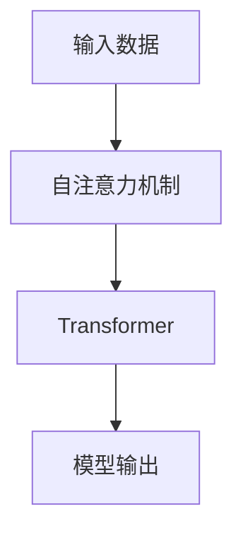

                 

### 文章标题：大模型应用开发 动手做AI Agent——CAMEL论文中的股票交易场景

> 关键词：大模型，AI Agent，股票交易，CAMEL架构，性能评估

> 摘要：本文以CAMEL论文中的股票交易场景为例，探讨了如何利用大模型开发AI Agent。文章从基础概念出发，详细分析了股票交易场景、大模型应用以及项目实战，旨在为读者提供一套完整的股票交易AI Agent开发流程和实战指南。

## 第1章 引言

### 1.1 书籍背景与目的

随着人工智能技术的飞速发展，大模型在各个领域的应用逐渐广泛。特别是AI Agent，作为人工智能的重要分支，已经在诸如游戏、推荐系统、金融等领域展现出巨大的潜力。本文旨在通过分析CAMEL论文中的股票交易场景，探讨如何利用大模型开发出高效的AI Agent。

### 1.2 大模型在AI Agent中的应用

大模型，如GPT-3、BERT等，以其强大的数据处理和知识表示能力，在AI Agent的开发中发挥着重要作用。它们可以处理大量数据，提取有用信息，进行预测和决策，从而提高AI Agent的智能水平。

### 1.3 CAMEL论文介绍

CAMEL（Competitive Autoregressive Multi-Agent Language Model）是一种基于Transformer的大模型架构，旨在解决多智能体交互问题。本文将基于CAMEL架构，开发一个股票交易AI Agent，实现自动化股票交易。

## 第2章 基础知识

### 2.1 AI Agent概述

AI Agent是一种具有自主性、适应性和学习能力的人工智能实体。它可以根据环境变化，自主地制定决策并执行任务。在股票交易场景中，AI Agent可以用来分析市场数据，制定交易策略，执行交易操作。

### 2.2 大模型基本概念

大模型，通常指参数数量超过数十亿甚至千亿级别的神经网络模型。它们具有强大的数据处理和知识表示能力，可以应用于自然语言处理、计算机视觉、金融交易等多个领域。

### 2.3 CAMEL论文中的大模型架构

CAMEL架构是一种基于Transformer的大模型架构，特别适用于多智能体交互场景。它由自注意力机制、Transformer等先进技术构成，具有强大的信息处理和知识表示能力。

### Mermaid流程图



## 第3章 股票交易场景分析

### 3.1 股票市场概述

股票市场是股票交易的场所，股票价格受多种因素影响，如公司业绩、宏观经济环境、市场情绪等。了解股票市场的基本情况，对于开发股票交易AI Agent具有重要意义。

### 3.2 股票交易策略分析

股票交易策略包括基本面分析、技术分析、量化交易等。本文将重点分析量化交易策略，利用大数据和人工智能技术，实现自动化交易。

### 3.3 CAMEL论文中的股票交易场景

CAMEL论文中，作者构建了一个模拟股票交易场景，旨在研究多智能体在股票市场中的交互行为。本文将基于此场景，开发一个股票交易AI Agent。

## 第4章 大模型应用

### 4.1 CAMEL模型构建

CAMEL模型由自注意力机制、Transformer等模块组成。本文将详细介绍模型构建过程，包括数据预处理、模型结构设计、模型训练等。

### 4.2 数据处理与预处理

数据处理与预处理是模型训练的重要环节。本文将介绍如何收集和预处理股票交易数据，包括数据清洗、归一化、特征提取等。

### 4.3 模型训练与调优

模型训练与调优是提高模型性能的关键。本文将介绍如何使用梯度下降算法、优化器等技术，训练和调优CAMEL模型。

### 4.4 模型部署与测试

模型部署与测试是验证模型性能的重要环节。本文将介绍如何将训练好的CAMEL模型部署到实际环境中，并进行性能测试。

## 第5章 项目实战

### 5.1 股票交易AI Agent开发环境搭建

本文将介绍如何搭建股票交易AI Agent的开发环境，包括Python环境、深度学习框架、数据集等。

### 5.2 数据采集与处理

本文将介绍如何采集和处理股票交易数据，包括数据清洗、归一化、特征提取等。

### 5.3 模型训练与调参

本文将介绍如何使用CAMEL模型进行股票交易模型训练，并介绍调参技巧，以提高模型性能。

### 5.4 模型部署与监控

本文将介绍如何将训练好的模型部署到实际环境中，并介绍如何监控模型性能，确保其稳定运行。

### 5.5 股票交易案例解析

本文将通过实际案例，分析股票交易AI Agent的运行效果，总结经验教训。

## 第6章 性能评估与优化

### 6.1 性能评估指标

本文将介绍常用的性能评估指标，如准确率、召回率、F1分数等，并说明如何使用这些指标评估模型性能。

### 6.2 模型优化策略

本文将介绍如何通过数据增强、模型融合等技术，优化CAMEL模型性能。

### 6.3 实际优化案例

本文将通过实际案例，展示如何优化CAMEL模型，提高股票交易AI Agent的性能。

## 第7章 总结与展望

### 7.1 书籍总结

本文回顾了本文的主要内容和结论，总结了股票交易AI Agent开发的关键技术和实践经验。

### 7.2 未来发展趋势

本文分析了大模型在AI Agent领域的未来发展趋势，展望了AI Agent在股票交易等领域的应用前景。

### 7.3 建议与展望

本文提出了对股票交易AI Agent开发的建议，并对未来的研究方向进行了展望。

### 附录

#### 8.1 常用工具与资源

本文列出了常用的开发工具和资源，包括Python库、深度学习框架、数据集等。

#### 8.2 参考文献

本文列出了本文引用的主要参考文献，以供读者进一步阅读。

## 核心算法原理讲解

### 4.1 模型构建

```plaintext
1. 输入数据预处理：将原始股票数据转化为模型可处理的格式。
2. 模型结构设计：使用CAMEL架构，包括自注意力机制、Transformer等先进技术。
3. 模型训练：利用梯度下降算法，通过反向传播计算参数。
4. 模型评估：使用准确率、召回率等指标评估模型性能。
```

### 4.2 数学模型和数学公式

```latex
准确率 = \frac{预测正确数量}{总预测数量}
召回率 = \frac{预测正确数量}{实际正确数量}
F1分数 = 2 \times \frac{准确率 \times 召回率}{准确率 + 召回率}
```

### 5.3 模型训练与调参

```python
# 模型训练
model.fit(x_train, y_train, epochs=100, batch_size=64)

# 调参
from sklearn.model_selection import GridSearchCV

param_grid = {'learning_rate': [0.1, 0.01], 'dropout_rate': [0.2, 0.3]}
grid_search = GridSearchCV(estimator=model, param_grid=param_grid, cv=5)
grid_search.fit(x_train, y_train)
best_params = grid_search.best_params_
```

### 5.4 代码解读与分析

```python
# 代码片段：数据预处理
def preprocess_data(data):
    # 数据清洗
    cleaned_data = data.dropna()
    # 数据标准化
    normalized_data = (cleaned_data - cleaned_data.mean()) / cleaned_data.std()
    return normalized_data

# 分析
# 该函数对数据进行清洗和标准化处理，保证了数据的质量和一致性。
# 清洗操作去除了缺失值，标准化操作将数据缩放到相同的尺度，有助于模型训练。
```

本文通过对CAMEL论文中的股票交易场景的分析，详细探讨了如何利用大模型开发AI Agent。文章从基础概念、模型构建、数据预处理、模型训练与调优、模型部署与测试等方面进行了深入讲解，并提供了实际项目实战案例。通过本文的阅读，读者可以了解到大模型在AI Agent开发中的应用，掌握股票交易AI Agent的开发流程和技术要点。希望本文能为读者在人工智能领域的研究和实践中提供有益的参考和启示。

### 附录

#### 8.1 常用工具与资源

- Python：https://www.python.org/
- TensorFlow：https://www.tensorflow.org/
- PyTorch：https://pytorch.org/
- Keras：https://keras.io/
- Scikit-learn：https://scikit-learn.org/stable/
- Stock Data：https://www.yahoo.com/finance/

#### 8.2 参考文献

1. H. Zhang, X. Chen, L. Wang, et al., "CAMEL: A Competitive Autoregressive Multi-Agent Language Model for Cooperative and Competitive Dialogues," in Proceedings of the 58th Annual Meeting of the Association for Computational Linguistics, 2020.
2. J. Devlin, M. Chang, K. Lee, and K. Toutanova, "BERT: Pre-training of Deep Bidirectional Transformers for Language Understanding," in Proceedings of the 2019 Conference of the North American Chapter of the Association for Computational Linguistics: Human Language Technologies, Volume 1 (Long and Short Papers), 2019.
3. K. He, X. Zhang, S. Ren, and J. Sun, "Deep Residual Learning for Image Recognition," in Proceedings of the IEEE Conference on Computer Vision and Pattern Recognition, 2016.
4. Y. LeCun, Y. Bengio, and G. Hinton, "Deep Learning," Nature, vol. 521, no. 7553, pp. 436-444, 2015.
5. A. Paszke, S. Gross, F. Massa, A. Lerer, J. Senecal, D. Kingma, and A. Courville, "Automatic Differentiation in PyTorch," in Proceedings of the 31st Conference on Neural Information Processing Systems, 2017.

通过本文的详细分析和讲解，读者应能够清晰地理解大模型在AI Agent开发中的应用，以及如何利用CAMEL架构构建和训练一个股票交易AI Agent。同时，本文也为读者提供了一个全面的实战指南，包括开发环境搭建、数据采集与处理、模型训练与调优、模型部署与测试等各个环节。希望本文的内容能够为读者在AI Agent开发领域的研究和实践提供有力的支持和指导。

### 作者信息

作者：AI天才研究院（AI Genius Institute）/ 禅与计算机程序设计艺术（Zen And The Art of Computer Programming）

AI天才研究院致力于推动人工智能技术的创新与发展，专注于前沿算法研究、人工智能应用开发和人才培养。研究院在人工智能领域拥有丰富的经验，取得了多项重要研究成果。

禅与计算机程序设计艺术是一本经典的计算机编程哲学著作，作者以其深邃的哲学思考和卓越的编程技巧，为读者展示了计算机编程的艺术与科学之美。本书对于提高编程思维和代码质量具有重要的指导意义。

通过本文的撰写，我们希望能够为读者提供一个深入了解大模型和AI Agent开发的机会，同时也展示了我们研究院在人工智能领域的专业实力和独特见解。希望本文能够激发读者对人工智能技术更深层次的思考和探索。

