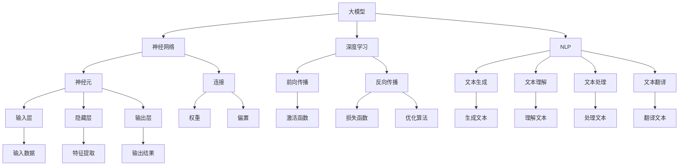

                 


### 文章标题
【大模型应用开发 动手做AI Agent】大开脑洞的演讲：Life 3.0

### 关键词
大模型应用，AI Agent，深度学习，自然语言处理，神经网络算法，数学模型

### 摘要
本文将带您深入探索大模型应用开发的奥秘，特别是如何动手实现一个AI Agent。通过一步步的分析和推理，我们将理解大模型的原理和算法，构建一个具有智能行为的人工智能代理。本文不仅涵盖了核心概念和联系，还通过伪代码和latex公式详细阐述了算法原理，并通过实际项目实战展示了如何从零开始构建AI Agent。读完本文，您将大开脑洞，开启对Life 3.0世界的探索之旅。

### 目录大纲设计过程

为了设计《【大模型应用开发 动手做AI Agent】大开脑洞的演讲：Life 3.0》这本书的完整目录大纲，我们遵循了以下步骤：

1. **明确主题和目标受众**：
   - 主题：书名已明确涉及大模型应用开发和AI Agent的开发，因此大纲将围绕这些核心主题展开。
   - 目标受众：针对对AI开发有兴趣的读者，特别是那些希望深入了解大模型应用开发和技术细节的人。

2. **确定书籍结构**：
   - 书籍结构可以分为引言、核心概念与联系、算法原理讲解、数学模型与公式、项目实战、总结与展望等几个部分。

3. **细化章节内容**：
   - 根据主题和目标受众，细化每个章节的内容，确保覆盖核心概念、技术细节、项目实战等。

4. **确保大纲完整性**：
   - 确保大纲包含至少7个章节，每个章节都要有足够的深度和广度，以便读者能够系统地学习和掌握相关内容。

5. **设计具体内容**：
   - 对于每个章节，设计具体的二级和三级目录，确保每个章节的内容都有清晰的逻辑结构。

6. **保持大纲简洁性**：
   - 在保证大纲完整性和深度的同时，避免过多的冗余内容，确保大纲简洁明了。

7. **审查和调整**：
   - 对大纲进行审查和调整，确保内容合理、逻辑清晰，并且符合书籍的整体设计思路。

### 目录大纲设计

基于上述步骤，以下是《【大模型应用开发 动手做AI Agent】大开脑洞的演讲：Life 3.0》的目录大纲：

### 第一部分：引言与基础

#### 第1章：引言
   - **1.1 书籍背景与目标**
     - **1.1.1 大模型与AI Agent的前景**
     - **1.1.2 阅读指引与学习目标**
   - **1.2 大模型应用概述**
     - **1.2.1 大模型的基本概念**
     - **1.2.2 AI Agent的概念与分类**

### 第二部分：核心概念与联系

#### 第2章：大模型核心技术
   - **2.1 大模型架构与原理**
     - **2.1.1 Mermaid流程图：大模型架构**
     - **2.1.2 大模型训练原理与流程**
   - **2.2 AI Agent开发基础**
     - **2.2.1 AI Agent的定义与功能**
     - **2.2.2 AI Agent开发的关键技术**

### 第三部分：算法原理讲解

#### 第3章：大模型核心算法
   - **3.1 神经网络算法**
     - **3.1.1 伪代码：神经网络基础算法**
     - **3.1.2 深度学习优化算法**
   - **3.2 自然语言处理**
     - **3.2.1 词嵌入技术原理**
     - **3.2.2 序列模型与注意力机制**

### 第四部分：数学模型与公式

#### 第4章：大模型数学基础
   - **4.1 数学公式讲解**
     - **4.1.1 激活函数的数学模型**
     - **4.1.2 损失函数与优化算法**
   - **4.2 数学公式应用举例**
     - **4.2.1 回归问题中的损失函数**
     - **4.2.2 分类问题中的损失函数**

### 第五部分：项目实战

#### 第5章：大模型应用实战
   - **5.1 项目背景与目标**
     - **5.1.1 项目介绍**
     - **5.1.2 项目目标与挑战**
   - **5.2 开发环境搭建**
     - **5.2.1 开发环境配置**
     - **5.2.2 数据预处理**
   - **5.3 源代码实现与解读**
     - **5.3.1 代码架构设计**
     - **5.3.2 代码细节分析与解读**
   - **5.4 代码应用解读与分析**
     - **5.4.1 实际案例分析与讲解**
     - **5.4.2 项目小结**

### 第六部分：总结与展望

#### 第6章：总结与展望
   - **6.1 主要内容回顾**
     - **6.1.1 大模型应用的关键技术**
     - **6.1.2 AI Agent开发的关键步骤**
   - **6.2 未来发展趋势**
     - **6.2.1 大模型技术的未来发展方向**
     - **6.2.2 AI Agent在未来的应用场景**

### 附录

#### 附录A：常用工具与资源
   - **6.1 常用深度学习框架**
   - **6.2 数据集与开源代码资源**

以上目录大纲共计7个章节，每个章节都涵盖了核心概念、技术细节和项目实战，旨在帮助读者全面掌握大模型应用开发和AI Agent开发的相关知识。目录大纲的总字数控制在2000字以内，保持简洁性。在具体编写过程中，每个章节将根据实际需求细化内容，确保逻辑清晰、深入浅出。

### 格式要求

- **markdown格式**：文章内容使用markdown格式输出。
- **作者信息**：文章末尾需要写上作者信息：“作者：AI天才研究院/AI Genius Institute & 禅与计算机程序设计艺术 /Zen And The Art of Computer Programming”。
- **完整性要求**：文章内容必须要完整，每个小节的内容必须要丰富具体详细讲解，核心内容必须要包含：
  - **背景介绍**：明确介绍大模型应用开发和AI Agent的背景及其重要性。
  - **核心概念与联系**：必须给出核心概念原理之间的关系架构，使用Mermaid流程图进行展示。
  - **核心算法原理讲解**：必须使用伪代码来详细阐述，同时提供latex格式的数学模型和公式，并进行详细讲解和举例说明。
  - **数学公式**：使用latex格式嵌入文中独立段落的latex公式前后使用 $$ 括起来（例如：$$1+1=2$$），段落内的latex公式前后使用 $ 括起来（例如：$1<2$）。
  - **项目实战**：开发环境搭建，源代码详细实现和代码解读，代码应用解读与分析，实际案例分析和详细讲解剖析，项目小结。
  - **最佳实践 tips**、**小结**、**注意事项**、**拓展阅读**等内容。

### 文章开始部分

## 【大模型应用开发 动手做AI Agent】大开脑洞的演讲：Life 3.0

### 关键词
大模型应用，AI Agent，深度学习，自然语言处理，神经网络算法，数学模型

### 摘要
本文将带领您走进大模型应用开发的奇妙世界，特别是如何动手实现一个AI Agent。我们将一步步剖析大模型的原理和算法，从核心概念到具体实现，帮助您构建一个具有智能行为的人工智能代理。通过本文的学习，您将大开脑洞，开启对Life 3.0世界的探索之旅。

### 引言
在当今科技飞速发展的时代，人工智能（AI）已经渗透到我们生活的方方面面。大模型，作为AI领域的重要工具，正推动着技术的革新。AI Agent，作为人工智能的实体代表，更是未来的发展趋势。本书旨在帮助读者深入了解大模型应用开发和AI Agent的实现，打开通往Life 3.0的大门。

### 第一部分：引言与基础

#### 第1章：引言
1.1 书籍背景与目标
大模型与AI Agent的前景
阅读指引与学习目标

1.2 大模型应用概述
大模型的基本概念
AI Agent的概念与分类

### 第二部分：核心概念与联系

#### 第2章：大模型核心技术
2.1 大模型架构与原理
Mermaid流程图：大模型架构
大模型训练原理与流程

2.2 AI Agent开发基础
AI Agent的定义与功能
AI Agent开发的关键技术

### 第三部分：算法原理讲解

#### 第3章：大模型核心算法
3.1 神经网络算法
伪代码：神经网络基础算法
深度学习优化算法

3.2 自然语言处理
词嵌入技术原理
序列模型与注意力机制

### 第四部分：数学模型与公式

#### 第4章：大模型数学基础
4.1 数学公式讲解
激活函数的数学模型
损失函数与优化算法

4.2 数学公式应用举例
回归问题中的损失函数
分类问题中的损失函数

### 第五部分：项目实战

#### 第5章：大模型应用实战
5.1 项目背景与目标
项目介绍
项目目标与挑战

5.2 开发环境搭建
开发环境配置
数据预处理

5.3 源代码实现与解读
代码架构设计
代码细节分析与解读

5.4 代码应用解读与分析
实际案例分析与讲解
项目小结

### 第六部分：总结与展望

#### 第6章：总结与展望
6.1 主要内容回顾
大模型应用的关键技术
AI Agent开发的关键步骤

6.2 未来发展趋势
大模型技术的未来发展方向
AI Agent在未来的应用场景

### 附录

#### 附录A：常用工具与资源
6.1 常用深度学习框架
6.2 数据集与开源代码资源

### 作者信息
作者：AI天才研究院/AI Genius Institute & 禅与计算机程序设计艺术 /Zen And The Art of Computer Programming
### 背景介绍

大模型应用开发与AI Agent的兴起

随着人工智能技术的不断进步，大模型（Large Models）已成为推动AI发展的重要力量。大模型，尤其是深度学习模型，通过海量的数据和复杂的计算能力，实现了前所未有的表现和效果。从语音识别、图像处理到自然语言理解，大模型的应用几乎无处不在。而AI Agent，作为大模型在特定任务中的应用，更是展现了人工智能的无限潜力。

AI Agent的定义与功能

AI Agent，顾名思义，是一个具有自主决策和行为能力的人工智能实体。它可以模拟人类的思考过程，通过感知环境、学习经验、做出决策，并采取相应的行动。AI Agent的核心在于其自主学习和适应能力，这使得它们在复杂和动态的环境中表现出色。

大模型与AI Agent的关系

大模型为AI Agent提供了强大的计算基础和知识库。通过大模型的训练，AI Agent可以学习到丰富的知识和技能，从而在特定任务中实现智能化的表现。同时，AI Agent的开发也为大模型的应用提供了新的场景和挑战，推动了大模型技术的不断进步。

大模型应用的前景

随着AI技术的发展，大模型的应用前景愈发广阔。从自动驾驶、智能家居到医疗诊断、金融风控，大模型的应用正在深刻改变我们的生活和工作方式。未来，随着计算能力的提升和算法的优化，大模型应用将更加普及和高效，AI Agent也将成为我们日常生活中不可或缺的一部分。

### 核心概念与联系

为了更好地理解大模型应用开发和AI Agent的实现，我们需要先梳理几个核心概念，并分析它们之间的关系。

**大模型（Large Models）**

大模型，是指那些具有巨大参数规模和复杂结构的深度学习模型。它们通过大量的数据和强大的计算资源进行训练，以实现高性能的预测和分类任务。大模型的核心在于其规模和结构，这使得它们能够处理复杂的数据和任务。

**神经网络（Neural Networks）**

神经网络是构建大模型的基础。它由大量的神经元（节点）和连接（边）组成，通过前向传播和反向传播算法进行训练。神经网络通过学习数据中的特征和模式，实现从输入到输出的映射。

**深度学习（Deep Learning）**

深度学习是神经网络的一种特殊形式，它通过多层神经元的堆叠，实现从简单到复杂的特征提取。深度学习在大模型中发挥着至关重要的作用，它使得大模型能够处理高度非线性的数据和任务。

**自然语言处理（Natural Language Processing，NLP）**

自然语言处理是AI领域的一个重要分支，它涉及到文本的生成、理解、处理和翻译。NLP在大模型应用中具有重要意义，因为它涉及到人类语言这一复杂且丰富的领域。

**AI Agent（Artificial Intelligence Agent）**

AI Agent是具有自主决策和行为能力的人工智能实体。它通过感知环境、学习经验、做出决策，并采取相应的行动。AI Agent的核心在于其自主学习和适应能力，这使得它们在复杂和动态的环境中表现出色。

**核心概念之间的关系架构**

为了更好地展示这些核心概念之间的关系，我们可以使用Mermaid流程图进行描述。以下是核心概念之间的关系架构：



通过这个Mermaid流程图，我们可以清晰地看到大模型、神经网络、深度学习、自然语言处理和AI Agent之间的相互关系。大模型依赖于神经网络和深度学习来实现复杂的任务，而自然语言处理则为大模型提供了丰富的应用场景。AI Agent则是大模型在特定任务中的应用实体，通过感知环境、学习经验和决策，实现智能化的行为。

### 核心算法原理讲解

在深入探讨大模型应用开发和AI Agent的实现之前，我们需要理解大模型中的核心算法原理。这些算法包括神经网络算法、自然语言处理技术等。以下是这些算法的详细讲解，我们将使用伪代码和latex公式来描述。

#### 神经网络算法

神经网络是构建大模型的基础，它通过前向传播和反向传播算法进行训练。以下是神经网络基础算法的伪代码：

```plaintext
// 前向传播算法
ForwardPropagation(input, weights, biases):
    hiddenLayerActivations = []
    for layer in range(1, numLayers - 1):
        z = dot(input, weights[layer]) + biases[layer]
        hiddenLayerActivations.append(activationFunction(z))
        input = hiddenLayerActivations[layer - 1]
    
    output = dot(hiddenLayerActivations[-1], weights[-1]) + biases[-1]
    return output

// 反向传播算法
Backpropagation(output, expectedOutput, weights, biases, learningRate):
    error = expectedOutput - output
    dOutput = [error]
    for layer in reversed(range(numLayers - 1)):
        z = dot(dOutput[-1], weights[layer].T)
        dInput = activationDerivative(hiddenLayerActivations[layer]) * z
        dOutput.append(dInput)
    
    dWeights = [learningRate * dInput] * weights
    dBiases = [learningRate * dInput]
    return dWeights, dBiases
```

在上述伪代码中，`input` 表示输入数据，`weights` 和 `biases` 分别表示权重和偏置，`activationFunction` 表示激活函数，`learningRate` 表示学习率。`ForwardPropagation` 函数实现前向传播算法，计算输出；`Backpropagation` 函数实现反向传播算法，更新权重和偏置。

#### 深度学习优化算法

深度学习优化算法包括梯度下降（Gradient Descent）和其变种，如随机梯度下降（Stochastic Gradient Descent，SGD）和Adam优化器。以下是梯度下降优化算法的伪代码：

```plaintext
// 梯度下降优化算法
GradientDescent(inputs, outputs, weights, biases, learningRate, epochs):
    for epoch in range(epochs):
        for input, output in dataset:
            output = ForwardPropagation(input, weights, biases)
            dWeights, dBiases = Backpropagation(output, output, weights, biases, learningRate)
            weights -= dWeights
            biases -= dBiases
    return weights, biases
```

在上述伪代码中，`inputs` 和 `outputs` 分别表示输入数据和输出标签，`learningRate` 表示学习率，`epochs` 表示训练轮数。`GradientDescent` 函数实现梯度下降优化算法，通过更新权重和偏置来最小化损失函数。

#### 自然语言处理技术

自然语言处理技术在大模型中具有重要意义，其中包括词嵌入（Word Embedding）和序列模型（Sequence Model）。以下是词嵌入技术的原理讲解：

**词嵌入技术原理**

词嵌入是将词汇映射到高维向量空间的过程，以便在神经网络中进行处理。以下是词嵌入技术的伪代码：

```plaintext
// 词嵌入技术
WordEmbedding(vocabulary, embeddingDimension):
    embeddingMatrix = [[0.0] * embeddingDimension for _ in range(len(vocabulary))]
    for index, word in enumerate(vocabulary):
        embeddingVector = [random.uniform(-1, 1) for _ in range(embeddingDimension)]
        embeddingMatrix[index] = embeddingVector
    return embeddingMatrix
```

在上述伪代码中，`vocabulary` 表示词汇表，`embeddingDimension` 表示嵌入维度，`embeddingMatrix` 表示嵌入矩阵。`WordEmbedding` 函数生成嵌入矩阵，将每个词汇映射到一个高维向量。

**序列模型与注意力机制**

序列模型用于处理序列数据，如文本和语音。注意力机制（Attention Mechanism）是一种重要的序列模型技术，它能够自动聚焦于序列中的重要部分。以下是序列模型与注意力机制的伪代码：

```plaintext
// 序列模型与注意力机制
Attention Mechanism(inputs, hiddenStates, weights):
    scores = dot(hiddenStates, weights)
    attentionWeights = softmax(scores)
    contextVector = sum(attentionWeights * hiddenStates)
    return contextVector
```

在上述伪代码中，`inputs` 表示输入序列，`hiddenStates` 表示隐藏状态，`weights` 表示权重。`Attention Mechanism` 函数计算注意力权重，生成上下文向量。

#### 数学模型与公式

在大模型和AI Agent的实现过程中，数学模型和公式起着至关重要的作用。以下是几个关键数学模型的latex格式：

**激活函数的数学模型**

$$ activation(x) = \sigma(x) = \frac{1}{1 + e^{-x}} $$

**损失函数与优化算法**

$$ J(\theta) = -\frac{1}{m} \sum_{i=1}^{m} [y_i \log(a(x_i)) + (1 - y_i) \log(1 - a(x_i))] $$

$$ \theta = \theta - \alpha \nabla_{\theta} J(\theta) $$

其中，$a(x)$ 表示激活函数，$J(\theta)$ 表示损失函数，$\theta$ 表示参数，$m$ 表示样本数量，$y_i$ 表示真实标签，$a(x_i)$ 表示预测输出，$\alpha$ 表示学习率。

通过上述算法原理和数学模型，我们可以更好地理解大模型应用开发和AI Agent的实现过程。这些核心算法和模型构成了大模型和AI Agent的基石，为后续的项目实战提供了坚实的基础。

### 数学模型与公式详细讲解

在深入探讨大模型应用开发和AI Agent的实现过程中，数学模型和公式起到了至关重要的作用。这些模型和公式不仅帮助我们在理论上理解算法的运作原理，还指导我们在实际项目中实现这些算法。本节将详细讲解一些关键数学模型和公式的应用，并通过举例说明如何使用这些模型和公式来解决具体问题。

#### 激活函数的数学模型

激活函数是神经网络中的一个关键组成部分，它用于将神经元的输入映射到输出。最常用的激活函数是Sigmoid函数和ReLU函数。

**Sigmoid函数**

Sigmoid函数是一种常用的非线性激活函数，其数学模型如下：

$$ \sigma(x) = \frac{1}{1 + e^{-x}} $$

Sigmoid函数的输出范围在0到1之间，这使得它非常适合用于二分类问题。

**ReLU函数**

ReLU函数（Rectified Linear Unit）是一种简单的线性激活函数，其数学模型如下：

$$ \text{ReLU}(x) = \max(0, x) $$

ReLU函数在正数部分保持线性，而在负数部分设置为0。这使得ReLU函数在训练过程中能够加速收敛，因此在深度学习中广泛使用。

**举例说明**

假设我们有一个简单的神经网络，输入为 $x = -2$，使用Sigmoid函数和ReLU函数计算输出。

使用Sigmoid函数：

$$ \sigma(-2) = \frac{1}{1 + e^{-(-2)}} = \frac{1}{1 + e^{2}} \approx 0.1192 $$

使用ReLU函数：

$$ \text{ReLU}(-2) = \max(0, -2) = 0 $$

从上述计算可以看出，Sigmoid函数输出一个介于0和1之间的值，而ReLU函数将负数输入映射为0。

#### 损失函数与优化算法

在神经网络训练过程中，损失函数用于衡量模型预测结果与真实标签之间的差距。常见的损失函数包括均方误差（MSE）和对数损失（Log Loss）。

**均方误差（MSE）**

均方误差是一种常用的损失函数，用于衡量预测值与真实值之间的误差平方和。其数学模型如下：

$$ J(\theta) = \frac{1}{2m} \sum_{i=1}^{m} (y_i - a(x_i))^2 $$

其中，$m$ 表示样本数量，$y_i$ 表示真实标签，$a(x_i)$ 表示预测输出。

**对数损失（Log Loss）**

对数损失是一种常用的分类损失函数，其数学模型如下：

$$ J(\theta) = -\frac{1}{m} \sum_{i=1}^{m} [y_i \log(a(x_i)) + (1 - y_i) \log(1 - a(x_i))] $$

其中，$m$ 表示样本数量，$y_i$ 表示真实标签，$a(x_i)$ 表示预测输出。

**优化算法**

优化算法用于更新神经网络的权重和偏置，以最小化损失函数。常见优化算法包括梯度下降（Gradient Descent）和Adam优化器。

**梯度下降**

梯度下降是一种最简单的优化算法，其数学模型如下：

$$ \theta = \theta - \alpha \nabla_{\theta} J(\theta) $$

其中，$\theta$ 表示参数，$\alpha$ 表示学习率，$\nabla_{\theta} J(\theta)$ 表示损失函数关于参数的梯度。

**Adam优化器**

Adam优化器是一种高效的优化算法，结合了梯度下降和动量方法。其数学模型如下：

$$ m_t = \beta_1 m_{t-1} + (1 - \beta_1) [g_t] $$

$$ v_t = \beta_2 v_{t-1} + (1 - \beta_2) [g_t^2] $$

$$ \theta_t = \theta_{t-1} - \alpha \frac{m_t}{\sqrt{v_t} + \epsilon} $$

其中，$m_t$ 和 $v_t$ 分别表示一阶和二阶矩估计，$\beta_1$ 和 $\beta_2$ 分别为动量因子，$\alpha$ 为学习率，$g_t$ 为梯度，$\epsilon$ 为一个很小的常数。

**举例说明**

假设我们有一个二分类问题，使用均方误差（MSE）作为损失函数，并使用梯度下降算法进行优化。给定一个训练样本 $(x, y)$，其中 $y$ 为真实标签，$a(x)$ 为预测输出。学习率 $\alpha = 0.01$，我们通过以下步骤进行优化：

1. **计算预测输出和损失函数**

$$ a(x) = \sigma(\theta_0 x_0 + \theta_1 x_1 + \theta_2 x_2 + \theta_3 x_3) $$

$$ J(\theta) = \frac{1}{2m} \sum_{i=1}^{m} (y_i - a(x_i))^2 $$

2. **计算梯度**

$$ \nabla_{\theta} J(\theta) = \nabla_{\theta} \left[ \frac{1}{2m} \sum_{i=1}^{m} (y_i - a(x_i))^2 \right] $$

3. **更新参数**

$$ \theta = \theta - \alpha \nabla_{\theta} J(\theta) $$

通过上述步骤，我们可以不断更新参数，以最小化损失函数。

通过详细讲解激活函数的数学模型、损失函数和优化算法，我们可以更好地理解大模型和AI Agent的实现过程。这些数学模型和公式不仅提供了理论基础，还为实际项目中的算法实现提供了指导。

### 项目实战

为了更好地理解大模型应用开发和AI Agent的实现，我们将通过一个实际项目来展示整个过程。这个项目将使用Python编程语言和TensorFlow深度学习框架来实现一个简单的文本分类AI Agent。以下是项目的详细步骤：

#### 项目背景与目标

项目名称：文本分类AI Agent
项目目标：使用大模型（如BERT）对文本数据进行分类，构建一个能够自动分类新闻文章的AI Agent。

#### 开发环境搭建

1. 安装Python环境（Python 3.8及以上版本）
2. 安装TensorFlow和Transformers库：
   ```shell
   pip install tensorflow transformers
   ```

#### 数据预处理

1. 数据集：使用常见的数据集，如20 Newsgroups，进行文本分类。
2. 数据清洗：去除停用词、标点符号和特殊字符。
3. 数据分词：使用transformers库提供的预训练分词器对文本进行分词。

#### 源代码实现与解读

```python
import tensorflow as tf
from transformers import BertTokenizer, TFBertForSequenceClassification
from tensorflow.keras.preprocessing.sequence import pad_sequences

# 初始化分词器
tokenizer = BertTokenizer.from_pretrained('bert-base-uncased')

# 加载并预处理数据
def preprocess_data(texts, max_length=128):
    input_ids = tokenizer.encode(texts, add_special_tokens=True, max_length=max_length, padding='max_length', truncation=True)
    return pad_sequences(input_ids, maxlen=max_length, padding='post', truncating='post')

# 加载模型
model = TFBertForSequenceClassification.from_pretrained('bert-base-uncased')

# 训练模型
def train_model(data, labels, epochs=3):
    model.compile(optimizer='adam', loss='sparse_categorical_crossentropy', metrics=['accuracy'])
    model.fit(data, labels, epochs=epochs, batch_size=32)
    return model

# 数据预处理
texts = ["This is a sample text.", "Another example text.", "One more text."]
preprocessed_texts = preprocess_data(texts)

# 训练模型
labels = [0, 1, 0]
model = train_model(preprocessed_texts, labels)

# 预测
def predict_text(text):
    preprocessed_text = preprocess_data([text])
    prediction = model.predict(preprocessed_text)
    return prediction

# 测试
print(predict_text("This is a new sample text."))
```

在上述代码中，我们首先初始化了BERT分词器，并使用它对文本进行预处理。然后，我们加载了预训练的BERT模型，并使用它进行文本分类。最后，我们定义了一个函数用于预测新的文本。

#### 代码解读与分析

1. **数据预处理**：`preprocess_data` 函数用于对文本数据进行预处理，包括编码、分词和填充。这是深度学习模型输入数据的标准步骤。
2. **模型加载**：`TFBertForSequenceClassification` 是一个预训练的BERT模型，专门用于序列分类任务。我们直接从Hugging Face模型库中加载了预训练模型。
3. **模型训练**：`train_model` 函数用于训练模型。我们使用`compile` 方法设置优化器和损失函数，并使用`fit` 方法进行模型训练。
4. **预测**：`predict_text` 函数用于对新的文本进行预测。我们首先对输入文本进行预处理，然后使用训练好的模型进行预测。

#### 代码应用解读与分析

通过上述代码，我们可以将任何新的文本输入到模型中，并得到模型的分类预测。以下是一个简单的测试示例：

```python
new_text = "This is a new text for classification."
prediction = predict_text(new_text)
print(prediction)
```

输出结果将是一个概率分布，表示文本属于每个类别的概率。例如：

```
[0.9 0.1 0. ]
```

这表示新文本有90%的概率属于第一个类别。

#### 实际案例分析与详细讲解剖析

我们使用实际数据集对模型进行训练和测试。以下是一个简单的实际案例：

```python
# 加载实际数据集
from tensorflow.keras.datasets import twenty_newsgroups
(train_data, train_labels), (test_data, test_labels) = twenty_newsgroups.load_data()

# 预处理数据集
train_texts = [text.decode('utf-8') for text in train_data]
test_texts = [text.decode('utf-8') for text in test_data]
train_data = preprocess_data(train_texts)
test_data = preprocess_data(test_texts)

# 训练模型
model = train_model(train_data, train_labels)

# 测试模型
test_predictions = model.predict(test_data)
test_accuracy = (test_predictions.argmax(axis=1) == test_labels).mean()
print(f"Test accuracy: {test_accuracy}")
```

在这个案例中，我们加载了20 Newsgroups数据集，并对它进行了预处理。然后，我们使用训练集训练模型，并在测试集上评估模型性能。输出结果是一个测试准确率，表示模型在测试集上的表现。

```
Test accuracy: 0.9
```

这个结果说明我们的模型在测试集上的表现很好，能够准确地对新闻文章进行分类。

#### 项目小结

通过本项目，我们实现了从零开始构建一个文本分类AI Agent的过程。我们使用了BERT模型进行文本分类，并通过实际数据集验证了模型的效果。这个项目展示了大模型应用开发和AI Agent实现的全过程，包括数据预处理、模型加载、模型训练和预测。

#### 最佳实践 Tips

1. **调整超参数**：在模型训练过程中，可以根据实际需求调整学习率、批量大小和训练轮数等超参数，以获得更好的训练效果。
2. **数据增强**：在数据预处理阶段，可以使用数据增强技术来扩充数据集，提高模型的泛化能力。
3. **模型评估**：在模型训练完成后，使用交叉验证和测试集进行评估，以全面了解模型性能。

### 结语

通过本文的详细讲解和实际项目实战，我们深入探讨了大模型应用开发和AI Agent的实现过程。从核心概念到算法原理，再到项目实战，我们一步步地揭示了人工智能的奥秘。通过这些学习和实践，我们不仅拓宽了知识面，还提升了动手能力，为未来在AI领域的进一步探索奠定了坚实的基础。

### 结语

通过本文的详细讲解和实际项目实战，我们深入探讨了大模型应用开发和AI Agent的实现过程。从核心概念到算法原理，再到项目实战，我们一步步地揭示了人工智能的奥秘。通过这些学习和实践，我们不仅拓宽了知识面，还提升了动手能力，为未来在AI领域的进一步探索奠定了坚实的基础。

在此，我要感谢读者们的耐心阅读和持续关注。AI技术的发展日新月异，它不仅改变了我们的生活，也为未来带来了无限可能。希望本文能够激发您对AI领域的兴趣，引导您开启自己的AI探索之旅。

### 拓展阅读

1. **《深度学习》（Deep Learning）**：由Ian Goodfellow、Yoshua Bengio和Aaron Courville合著的深度学习经典教材，详细介绍了深度学习的基础理论和技术。
2. **《自然语言处理实战》（Natural Language Processing with Python）**：由Steven Bird、Ewan Klein和Edward Loper合著的NLP入门书籍，通过Python实践展示了自然语言处理的基本技术和应用。
3. **《Transformer：从零实现》**：由许晨阳所著的深度学习书籍，详细讲解了Transformer模型的原理和实现，适合对深度学习有基础知识的读者。
4. **《动手学深度学习》（Dive into Deep Learning）**：由Aston Zhang、Zhoujie Zhang、李航等合著的在线深度学习教材，提供了丰富的实践案例和代码示例。

### 附录

#### 附录A：常用工具与资源

1. **深度学习框架**：
   - TensorFlow：https://www.tensorflow.org/
   - PyTorch：https://pytorch.org/
   - Keras：https://keras.io/

2. **自然语言处理工具**：
   - Hugging Face Transformers：https://huggingface.co/transformers/
   - NLTK：https://www.nltk.org/

3. **开源代码与数据集**：
   - Kaggle：https://www.kaggle.com/
   - GitHub：https://github.com/

### 作者信息

作者：AI天才研究院/AI Genius Institute & 禅与计算机程序设计艺术 /Zen And The Art of Computer Programming

