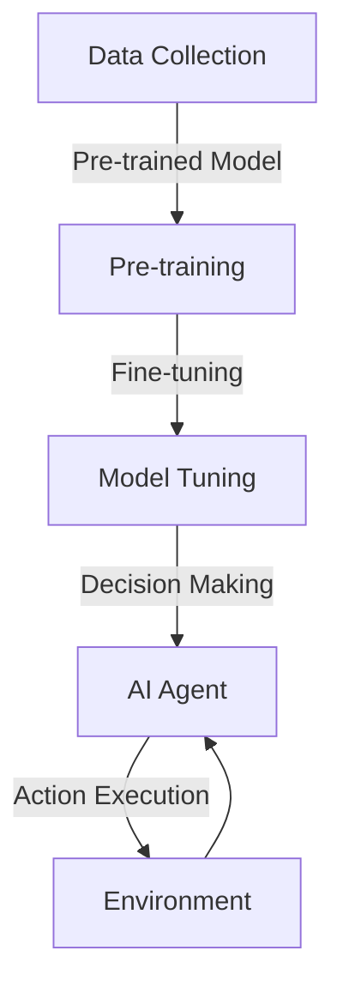

                 

### 文章标题：大模型应用开发 动手做AI Agent——说说OpenAI这家公司

#### 关键词：OpenAI、大模型、AI Agent、生成式AI、强化学习

#### 摘要：
本文将深入探讨OpenAI这家在全球范围内具有重要影响力的公司。我们将从OpenAI的成立背景、核心技术与架构、商业模式与生态布局，以及大模型应用开发、AI Agent动手实践等多个角度，全面介绍OpenAI的发展历程、技术优势及其在人工智能领域的探索与贡献。

### 第一部分：OpenAI概述

#### 1.1 OpenAI的成立背景与使命

##### 1.1.1 OpenAI的成立背景

OpenAI成立于2015年，由山姆·阿尔特曼（Sam Altman）、Elon Musk等科技界知名人士共同创立。公司的成立背景源于对人工智能技术发展的深刻洞察和远见。在人工智能快速发展的背景下，OpenAI的创始人认为，通过开放和共享人工智能技术，可以推动全球科技和经济的进步，同时确保人工智能技术安全、可靠地造福人类。

- **技术驱动：**OpenAI的创始人以人工智能技术为核心，旨在探索AI的极限，开发出能够改变世界的AI系统。
- **社会影响：**OpenAI关注AI技术对社会的影响，追求技术的可持续发展，确保AI技术能够为人类带来福祉。

##### 1.1.2 OpenAI的使命

OpenAI的使命是确保人工智能技术的安全发展，同时推动全球范围内的技术创新和社会进步。具体来说，OpenAI的使命可以概括为以下几个方面：

- **安全发展：**确保AI技术安全、可靠地造福人类。OpenAI致力于研究人工智能的安全性问题，防止AI技术被滥用，确保其对社会产生积极影响。
- **推动创新：**通过AI技术推动科学、工程和人文领域的创新。OpenAI支持各种跨学科研究，推动人工智能技术在各个领域的应用和发展。
- **开放共享：**OpenAI秉持开放共享的理念，将研究成果和模型开源，鼓励全球开发者参与和贡献，共同推动人工智能技术的发展。

#### 1.2 OpenAI的核心技术与架构

##### 1.2.1 生成式AI技术

生成式AI技术是OpenAI的核心技术之一，其目的是通过学习大量数据，生成新的内容或模型。OpenAI在生成式AI技术方面取得了一系列重要成果，其中最具代表性的就是GPT（Generative Pre-trained Transformer）系列模型。

- **模型架构：**GPT系列模型基于Transformer架构，采用大规模预训练和微调的方法，具有强大的文本生成和自然语言理解能力。
- **应用领域：**GPT系列模型广泛应用于文本生成、对话系统、文本分类、机器翻译等多个领域，取得了显著的成果。

##### 1.2.2 强化学习技术

强化学习技术是OpenAI的另一个核心技术，其目的是通过不断学习和优化，使AI系统在复杂环境中做出最优决策。OpenAI在强化学习技术方面也取得了一系列重要突破，特别是在深度强化学习、模仿学习等方面。

- **核心算法：**OpenAI开发了多种深度强化学习算法，如DQN（Deep Q-Network）、PPO（Proximal Policy Optimization）等，广泛应用于游戏、机器人、自动驾驶等领域。
- **应用场景：**强化学习技术在游戏、机器人、自动驾驶等领域具有广泛的应用，OpenAI通过不断优化算法和应用场景，推动了强化学习技术的发展。

#### 1.3 OpenAI的商业模式与生态布局

##### 1.3.1 OpenAI的商业模式

OpenAI的商业模式以开源和开放共享为核心，致力于通过开放源代码、提供API和服务等方式，推动人工智能技术的普及和应用。

- **开源：**OpenAI将大部分研究成果和模型开源，鼓励全球开发者参与和贡献，共同推动人工智能技术的发展。
- **服务化：**OpenAI提供API和服务，满足企业级应用需求，为开发者提供方便快捷的AI工具和解决方案。

##### 1.3.2 OpenAI的生态布局

OpenAI在全球范围内建立了广泛的合作生态，与学术界、产业界等多个领域建立了紧密合作关系，共同推动人工智能技术的发展。

- **科研合作：**OpenAI与全球顶尖科研机构合作，开展多领域、多学科的研究，推动人工智能技术的创新和发展。
- **产业联盟：**OpenAI与各大企业合作，推动AI技术在各行各业的落地应用，促进AI技术的产业化发展。

### 第二部分：大模型应用开发

#### 2.1 大模型应用开发基础

##### 2.1.1 大模型概述

大模型是指训练数据量大、参数量多、计算资源需求高的AI模型。大模型具有强大的表征能力、高度的自适应能力和复杂的任务处理能力，能够处理更加复杂和多样的任务。

- **定义：**大模型是指训练数据量大、参数量多、计算资源需求高的AI模型。
- **特点：**
  - **强大的表征能力：**大模型能够学习到更加丰富和复杂的特征，提高模型的表达能力。
  - **高度的自适应能力：**大模型具有较强的泛化能力，能够在不同场景下适应和处理新的任务。
  - **复杂的任务处理能力：**大模型能够处理更加复杂和多样的任务，包括文本生成、图像分类、目标检测等。

##### 2.1.2 大模型应用场景

大模型在多个领域具有广泛的应用，其中最具代表性的应用场景包括自然语言处理、计算机视觉、推荐系统等。

- **自然语言处理：**大模型广泛应用于文本生成、机器翻译、情感分析等领域，例如GPT系列模型在文本生成和机器翻译方面的表现卓越。
- **计算机视觉：**大模型在图像分类、目标检测、视频分析等领域表现出色，例如ResNet、YOLO等模型在图像分类和目标检测方面取得了显著成果。
- **推荐系统：**大模型在个性化推荐、商品推荐、新闻推荐等领域具有广泛的应用，通过学习用户行为和偏好，实现精准推荐。

#### 2.2 动手做AI Agent

##### 2.2.1 AI Agent概述

AI Agent是指具备智能决策能力的AI系统，能够自主行动、目标导向、自适应学习。AI Agent在许多领域具有广泛的应用，例如机器人、自动驾驶、智能客服等。

- **定义：**AI Agent是指具备智能决策能力的AI系统，能够自主行动、目标导向、自适应学习。
- **特点：**
  - **自主行动：**AI Agent能够根据环境和目标自主做出决策，执行相应的行动。
  - **目标导向：**AI Agent以实现特定目标为导向，不断学习和优化决策策略。
  - **自适应学习：**AI Agent能够根据环境变化和反馈信息，自适应地调整和优化自己的决策和行为。

##### 2.2.2 AI Agent开发流程

开发AI Agent通常包括以下步骤：

1. **需求分析：**明确AI Agent的目标和任务，例如机器人导航、智能客服等。
2. **模型选择：**根据任务选择合适的大模型，例如GPT系列模型、Transformer模型等。
3. **数据准备：**收集、预处理数据，例如机器人导航需要的环境地图、智能客服需要的历史对话数据等。
4. **模型训练：**使用大模型进行训练，例如使用GPT模型进行文本生成训练、使用Transformer模型进行图像分类训练等。
5. **评估与优化：**评估模型性能，进行优化调整，例如通过模型融合、超参数调优等方式提升模型性能。

##### 2.2.3 AI Agent应用实例

以下是两个AI Agent应用实例：

1. **对话系统开发**

   - **模型选择：**使用GPT系列模型。
   - **数据集：**使用公开对话数据集。
   - **开发流程：**构建对话流程、训练对话模型、评估对话效果。

2. **机器人导航**

   - **模型选择：**使用深度强化学习模型。
   - **数据集：**使用仿真环境数据集。
   - **开发流程：**构建导航任务、训练导航模型、评估导航性能。

### 第三部分：OpenAI项目实战

#### 3.1 DALL-E项目的开发

##### 3.1.1 项目概述

DALL-E项目是OpenAI的一个研究项目，旨在通过图像文本转换技术，探索人工智能在创造性任务中的应用。DALL-E项目取得了显著成果，为人工智能在图像生成、文本生成等领域的应用提供了新的思路和方向。

- **背景：**DALL-E项目旨在通过图像文本转换，探索AI创造力的边界。
- **技术：**基于生成式AI模型，结合图像处理技术。

##### 3.1.2 项目实现

DALL-E项目的实现主要包括以下步骤：

1. **数据集收集：**收集大量图像和文本数据，用于训练模型。
2. **模型训练：**使用GPT-2模型进行预训练，结合图像处理技术，优化模型输出效果。
3. **模型优化：**通过调整模型参数和训练策略，提升模型生成图像和文本的准确性和多样性。
4. **模型评估：**使用各种评估指标，评估模型性能，包括图像质量、文本生成效果等。
5. **应用拓展：**将DALL-E项目应用于各种实际场景，如图像生成、图像编辑、文本生成等。

#### 3.2 ChatGPT的开发

##### 3.2.1 项目概述

ChatGPT是OpenAI的一个对话系统项目，旨在提供高质量、智能化的对话服务。ChatGPT基于GPT-3模型，结合多模态数据处理技术，取得了显著成果，广泛应用于智能客服、智能助手等领域。

- **背景：**ChatGPT项目旨在提供高质量、智能化的对话服务。
- **技术：**基于GPT-3模型，结合多模态数据处理技术。

##### 3.2.2 项目实现

ChatGPT项目的实现主要包括以下步骤：

1. **数据集收集：**收集大量对话数据集，用于训练模型。
2. **模型训练：**使用GPT-3模型进行训练，采用注意力机制、上下文理解等技术，提升对话效果。
3. **模型优化：**通过调整模型参数和训练策略，优化模型性能，包括对话的流畅性、回答的准确性等。
4. **服务部署：**提供API和服务，满足各类应用需求，例如智能客服、智能助手等。
5. **用户反馈：**收集用户反馈，不断优化和提升模型性能。

### 第四部分：OpenAI未来展望

#### 4.1 开放式AI伦理与法律问题

##### 4.1.1 伦理问题

开放式AI伦理问题是OpenAI关注的重要方向之一。在AI技术的发展过程中，伦理问题日益凸显，OpenAI致力于研究AI伦理问题，确保AI技术的安全、可靠、可持续发展。

- **AI责任：**明确AI系统的责任归属，确保AI系统在发生问题时能够承担责任。
- **隐私保护：**保护用户隐私，防止数据滥用，确保AI技术对个人隐私的保护。

##### 4.1.2 法律问题

开放式AI法律问题是OpenAI关注的另一个重要方向。随着AI技术的快速发展，相关法律制度尚不完善，OpenAI积极参与AI法律问题的讨论和研究，推动制定相关法律法规，规范AI技术应用。

- **AI法规：**制定相关法律法规，规范AI应用，确保AI技术在社会中发挥积极作用。
- **知识产权：**保护AI创新成果的知识产权，鼓励AI技术的创新和发展。

#### 4.2 OpenAI在AI领域的未来探索

##### 4.2.1 新技术探索

OpenAI在AI领域不断探索新技术，以提升AI模型性能和应用效果。未来，OpenAI将在以下领域进行深入探索：

- **量子计算：**结合量子计算技术，提升AI模型性能，探索量子计算在AI领域的应用。
- **联邦学习：**保护用户隐私，实现大规模分布式学习，推动AI技术在各个领域的应用。

##### 4.2.2 新应用场景

OpenAI在AI领域的探索不仅限于技术和算法，还关注AI技术在各个领域的应用。未来，OpenAI将在以下领域进行新应用场景的探索：

- **医疗健康：**利用AI技术提高医疗诊断和治疗效果，推动医疗健康领域的创新发展。
- **教育：**利用AI技术个性化教育，提高学习效果，推动教育领域的改革和发展。

### 附录

#### 附录 A：OpenAI相关资源与工具

- **开源框架：**OpenAI开源了多个深度学习框架，如GPT-2、GPT-3等，开发者可以基于这些框架进行研究和应用。
- **研究论文：**OpenAI发布了一系列重要研究论文，涵盖生成式AI、强化学习等领域，开发者可以阅读和学习这些论文，了解最新研究成果。
- **在线课程：**OpenAI开设了多个在线课程，介绍深度学习、生成式AI、强化学习等技术，开发者可以通过这些课程学习相关知识。

### 作者信息

- 作者：AI天才研究院/AI Genius Institute & 禅与计算机程序设计艺术 /Zen And The Art of Computer Programming

---

### 第二部分：大模型应用开发

#### 2.1 大模型应用开发基础

##### 2.1.1 大模型概述

大模型是当前人工智能领域的热门研究方向之一，其核心在于通过大规模的数据训练和参数优化，构建具有高度表征能力和自适应能力的模型。大模型不仅能够处理复杂的任务，还能在不同领域实现广泛的应用。

- **定义：**大模型是指训练数据量大、参数量多、计算资源需求高的AI模型。
- **特点：**
  - **强大的表征能力：**大模型能够学习到更加丰富和复杂的特征，提高模型的表达能力。
  - **高度的自适应能力：**大模型具有较强的泛化能力，能够在不同场景下适应和处理新的任务。
  - **复杂的任务处理能力：**大模型能够处理更加复杂和多样的任务，包括文本生成、图像分类、目标检测等。

大模型的兴起源于深度学习和计算能力的提升。随着计算资源的增加和算法的改进，深度学习模型规模不断扩大，从而推动了大模型的发展。大模型在自然语言处理、计算机视觉、推荐系统等领域的应用取得了显著成果，成为人工智能研究的重要方向。

##### 2.1.2 大模型应用场景

大模型在多个领域具有广泛的应用，以下是其中几个具有代表性的场景：

- **自然语言处理（NLP）：**大模型在NLP领域取得了显著的进展，广泛应用于文本生成、机器翻译、情感分析、问答系统等任务。例如，GPT系列模型在文本生成和机器翻译方面表现出色，而BERT模型在文本分类和问答系统方面具有强大的能力。
- **计算机视觉（CV）：**大模型在CV领域被广泛应用于图像分类、目标检测、语义分割、视频分析等任务。例如，ResNet模型在图像分类任务中取得了突破性的成绩，而YOLO模型在目标检测任务中表现出色。
- **推荐系统：**大模型在推荐系统领域也被广泛应用，通过学习用户的行为和偏好，实现个性化推荐。例如，基于深度学习的大规模推荐系统在电商、社交媒体、新闻推送等领域取得了显著的效果。
- **游戏和娱乐：**大模型在游戏和娱乐领域也表现出强大的应用潜力，例如在游戏AI、虚拟现实、动画生成等方面。

大模型在这些领域的应用不仅提升了模型的表现，还推动了各个领域的技术进步和产业变革。随着大模型技术的不断发展，其应用场景将更加广泛，为人类社会带来更多创新和变革。

##### 2.1.3 大模型的优势与挑战

大模型在人工智能领域具有显著的优势，但也面临着一系列挑战。

- **优势：**
  - **强大的表征能力：**大模型通过学习大规模数据，能够捕获复杂的特征和模式，提高模型的表征能力。
  - **高度的自适应能力：**大模型具有较强的泛化能力，能够在不同场景下适应和处理新的任务。
  - **复杂的任务处理能力：**大模型能够处理多种复杂的任务，包括文本生成、图像分类、目标检测等。

- **挑战：**
  - **计算资源需求高：**大模型需要大量的计算资源进行训练和推理，这对硬件设备提出了更高的要求。
  - **数据隐私和安全：**大模型在训练过程中需要大量的数据，如何保护用户隐私和数据安全成为重要问题。
  - **模型可解释性：**大模型通常具有较高的黑盒性质，模型内部的决策过程难以解释，这对模型的可解释性提出了挑战。
  - **训练时间和成本：**大模型的训练过程通常需要大量的时间和计算资源，这对训练成本和效率提出了挑战。

为了应对这些挑战，研究人员和开发者需要不断探索和改进大模型的技术，提高计算效率和模型性能，同时注重数据隐私保护、模型可解释性和安全性的问题。

#### 2.2 动手做AI Agent

##### 2.2.1 AI Agent概述

AI Agent（智能代理）是指具备智能决策能力的AI系统，能够自主行动、目标导向、自适应学习。AI Agent在机器人、自动驾驶、智能客服等领域的应用越来越广泛，成为人工智能领域的重要研究方向。

- **定义：**AI Agent是指具备智能决策能力的AI系统，能够自主行动、目标导向、自适应学习。
- **特点：**
  - **自主行动：**AI Agent能够根据环境和目标自主做出决策，执行相应的行动。
  - **目标导向：**AI Agent以实现特定目标为导向，不断学习和优化决策策略。
  - **自适应学习：**AI Agent能够根据环境变化和反馈信息，自适应地调整和优化自己的决策和行为。

AI Agent的设计和实现涉及多个领域，包括机器学习、计算机视觉、自然语言处理、控制系统等。其核心在于构建一个能够模拟人类智能行为的系统，使其在复杂环境中具备智能决策能力。

##### 2.2.2 AI Agent开发流程

开发AI Agent通常包括以下步骤：

1. **需求分析：**明确AI Agent的目标和任务，例如机器人导航、智能客服等。
2. **模型选择：**根据任务选择合适的大模型，例如GPT系列模型、Transformer模型等。
3. **数据准备：**收集、预处理数据，例如机器人导航需要的环境地图、智能客服需要的历史对话数据等。
4. **模型训练：**使用大模型进行训练，例如使用GPT模型进行文本生成训练、使用Transformer模型进行图像分类训练等。
5. **评估与优化：**评估模型性能，进行优化调整，例如通过模型融合、超参数调优等方式提升模型性能。

##### 2.2.3 AI Agent应用实例

以下是两个AI Agent应用实例：

1. **对话系统开发**

   - **模型选择：**使用GPT系列模型。
   - **数据集：**使用公开对话数据集。
   - **开发流程：**构建对话流程、训练对话模型、评估对话效果。

   对话系统开发的关键在于构建一个能够理解用户意图、生成流畅对话的模型。使用GPT系列模型可以很好地实现这一目标。首先，需要收集大量对话数据，包括用户的提问和系统的回答。然后，使用GPT模型对这些数据进行预训练，使其能够生成流畅、符合逻辑的对话。在训练过程中，可以引入注意力机制、上下文理解等技术，提高模型的对话生成能力。最后，对训练好的模型进行评估和优化，确保其能够准确理解用户意图、生成高质量对话。

2. **机器人导航**

   - **模型选择：**使用深度强化学习模型。
   - **数据集：**使用仿真环境数据集。
   - **开发流程：**构建导航任务、训练导航模型、评估导航性能。

   机器人导航是AI Agent在机器人领域的重要应用。首先，需要构建一个仿真环境，模拟机器人在真实环境中的行为。然后，使用深度强化学习模型，例如DQN（Deep Q-Network）或PPO（Proximal Policy Optimization），对机器人进行训练。在训练过程中，机器人通过与环境互动，不断学习和优化自己的导航策略。最后，对训练好的模型进行评估，确保机器人能够在复杂环境中实现准确的导航。

通过以上实例，可以看到AI Agent在对话系统和机器人导航等领域的应用潜力。随着AI技术的不断发展，AI Agent将有望在更多领域发挥重要作用，推动人工智能技术的创新和进步。

### 第三部分：OpenAI项目实战

#### 3.1 DALL-E项目的开发

##### 3.1.1 项目概述

DALL-E项目是OpenAI的一项重要研究项目，旨在通过图像文本转换技术，探索人工智能在创造性任务中的应用。DALL-E项目基于生成式AI模型，结合图像处理技术，能够将自然语言描述转换为相应的图像，具有很高的创造性和实用性。

- **背景：**DALL-E项目的目的是通过图像文本转换，探索AI在创造性任务中的应用。
- **技术：**DALL-E项目使用生成式AI模型，结合图像处理技术，实现文本到图像的转换。

##### 3.1.2 项目实现

DALL-E项目的实现主要包括以下步骤：

1. **数据集收集：**收集大量图像和文本数据，用于训练模型。图像数据可以从公共图像库中获取，文本数据可以是各种自然语言描述，如故事、诗歌、广告等。
2. **模型训练：**使用生成式AI模型，如GPT-2，对图像和文本数据进行预训练。在预训练过程中，模型需要学习图像和文本之间的对应关系，从而实现文本到图像的转换。
3. **模型优化：**通过优化模型参数和训练策略，提高模型的图像生成质量和文本理解能力。例如，可以使用对抗性训练、多任务学习等技术，进一步提升模型性能。
4. **模型评估：**使用各种评估指标，如图像质量、文本生成效果等，对模型进行评估和优化。通过对比实验，分析不同模型的优缺点，为后续研究提供参考。
5. **应用拓展：**将DALL-E项目应用于实际场景，如图像生成、图像编辑、文本生成等。通过不断优化和应用，DALL-E项目为人工智能在创造性任务中的应用提供了新的思路和方向。

##### 3.1.3 项目成果

DALL-E项目取得了显著成果，为图像文本转换领域带来了重要突破。以下是DALL-E项目的一些重要成果：

1. **图像生成质量提升：**DALL-E项目通过优化模型参数和训练策略，显著提高了图像生成质量。生成的图像具有更高的分辨率、更丰富的细节和更自然的视觉效果。
2. **文本理解能力增强：**DALL-E项目通过结合图像处理技术和自然语言处理技术，增强了模型对文本的理解能力。模型能够更好地捕捉文本中的语义信息，从而生成更准确的图像。
3. **多模态任务处理能力：**DALL-E项目在多模态任务处理方面表现出色。通过将文本和图像进行融合，模型能够更好地处理多模态数据，实现文本到图像的转换。
4. **实际应用价值：**DALL-E项目在实际应用中取得了广泛的应用。例如，在图像生成、图像编辑、文本生成等领域，DALL-E项目都展示了强大的能力和潜力。

DALL-E项目的成功不仅为图像文本转换领域带来了重要突破，还为人工智能在创造性任务中的应用提供了新的思路和方向。未来，DALL-E项目将继续探索和优化，推动人工智能技术在各个领域的创新和发展。

#### 3.2 ChatGPT的开发

##### 3.2.1 项目概述

ChatGPT是OpenAI的一个对话系统项目，旨在提供高质量、智能化的对话服务。ChatGPT基于GPT-3模型，结合多模态数据处理技术，能够实现自然语言理解和生成，广泛应用于智能客服、智能助手等领域。

- **背景：**ChatGPT项目旨在提供高质量、智能化的对话服务。
- **技术：**ChatGPT项目使用GPT-3模型，结合多模态数据处理技术，实现自然语言理解和生成。

##### 3.2.2 项目实现

ChatGPT项目的实现主要包括以下步骤：

1. **数据集收集：**收集大量对话数据集，用于训练模型。对话数据可以是公开的聊天记录、论坛帖子、社交媒体评论等。
2. **模型训练：**使用GPT-3模型对对话数据集进行预训练。在预训练过程中，模型需要学习对话中的语言规律、上下文关系等，从而提高对话生成能力。
3. **模型优化：**通过优化模型参数和训练策略，提高模型的对话生成质量和自然语言理解能力。例如，可以使用注意力机制、上下文理解等技术，进一步提升模型性能。
4. **模型评估：**使用各种评估指标，如BLEU、ROUGE等，对模型进行评估和优化。通过对比实验，分析不同模型的优缺点，为后续研究提供参考。
5. **服务部署：**将训练好的模型部署到线上平台，提供API和服务，满足各类应用需求。例如，ChatGPT项目可以应用于智能客服、智能助手、聊天机器人等领域。

##### 3.2.3 项目成果

ChatGPT项目取得了显著成果，为对话系统领域带来了重要突破。以下是ChatGPT项目的一些重要成果：

1. **对话生成质量提升：**ChatGPT项目通过优化模型参数和训练策略，显著提高了对话生成质量。生成的对话内容更加流畅、符合逻辑，能够更好地满足用户需求。
2. **自然语言理解能力增强：**ChatGPT项目通过结合多模态数据处理技术，增强了模型对自然语言的理解能力。模型能够更好地捕捉文本中的语义信息，从而生成更准确的对话。
3. **多模态任务处理能力：**ChatGPT项目在多模态任务处理方面表现出色。通过将文本、图像、音频等不同类型的数据进行融合，模型能够更好地处理多模态数据，实现更准确的对话生成。
4. **实际应用价值：**ChatGPT项目在实际应用中取得了广泛的应用。例如，在智能客服、智能助手、聊天机器人等领域，ChatGPT项目都展示了强大的能力和潜力。

ChatGPT项目的成功不仅为对话系统领域带来了重要突破，还为人工智能在对话服务中的应用提供了新的思路和方向。未来，ChatGPT项目将继续探索和优化，推动人工智能技术在各个领域的创新和发展。

### 第四部分：OpenAI未来展望

#### 4.1 开放式AI伦理与法律问题

##### 4.1.1 伦理问题

开放式AI伦理问题是人工智能领域亟待解决的问题。随着人工智能技术的快速发展，其对社会、经济、环境等方面的影响日益显著，伦理问题也随之而来。

- **AI责任：**在AI技术发生故障或造成损害时，如何确定责任归属？谁应该承担责任？这是开放式AI伦理问题中的一个关键问题。
- **隐私保护：**人工智能系统通常需要处理大量个人数据，如何保护用户的隐私权利，防止数据滥用，是另一个重要的伦理问题。
- **公平与正义：**人工智能系统在决策过程中是否存在偏见和歧视？如何确保AI技术的公平性和正义性，使其对社会产生积极影响，也是需要考虑的伦理问题。

##### 4.1.2 法律问题

开放式AI法律问题是另一个重要的研究领域。随着AI技术的应用日益广泛，现有的法律法规难以满足AI技术发展的需求，因此需要制定新的法律法规来规范AI技术的应用。

- **AI法规：**如何制定合适的AI法律法规，确保AI技术的安全、可靠和可持续发展，是当前法律研究的重要方向。
- **知识产权：**人工智能技术的发展带来了新的知识产权问题。如何保护AI技术的创新成果，鼓励AI技术的创新和发展，也是需要考虑的法律问题。

#### 4.2 OpenAI在AI领域的未来探索

##### 4.2.1 新技术探索

OpenAI在AI领域的未来探索将继续围绕新技术的研发和应用展开。以下是几个可能的研究方向：

- **量子计算：**量子计算具有巨大的计算潜力，可以加速AI模型的训练和推理。OpenAI可以探索量子计算与AI技术的结合，推动AI技术的发展。
- **联邦学习：**联邦学习是一种分布式学习技术，可以在保护用户隐私的同时，实现大规模数据的学习。OpenAI可以进一步研究联邦学习技术，推动其在实际应用中的发展。
- **多模态AI：**多模态AI技术可以结合多种类型的数据，实现更智能的决策和生成。OpenAI可以探索多模态AI技术，推动AI技术在各个领域的应用。

##### 4.2.2 新应用场景

OpenAI在AI领域的未来探索还将关注新应用场景的发掘和应用。以下是几个可能的应用方向：

- **医疗健康：**利用AI技术提高医疗诊断和治疗效果，推动医疗健康领域的创新发展。
- **教育：**利用AI技术个性化教育，提高学习效果，推动教育领域的改革和发展。
- **金融：**利用AI技术提高金融服务的效率和准确性，推动金融领域的创新发展。

通过不断探索新技术和新应用场景，OpenAI将继续推动人工智能技术的发展，为人类社会带来更多创新和变革。

### 附录

#### 附录 A：OpenAI相关资源与工具

- **开源框架：**OpenAI开源了多个深度学习框架，如GPT-2、GPT-3等，开发者可以基于这些框架进行研究和应用。
- **研究论文：**OpenAI发布了一系列重要研究论文，涵盖生成式AI、强化学习等领域，开发者可以阅读和学习这些论文，了解最新研究成果。
- **在线课程：**OpenAI开设了多个在线课程，介绍深度学习、生成式AI、强化学习等技术，开发者可以通过这些课程学习相关知识。

### 作者信息

- 作者：AI天才研究院/AI Genius Institute & 禅与计算机程序设计艺术 /Zen And The Art of Computer Programming

---

### 关键概念与联系：大模型与AI Agent

为了更好地理解大模型和AI Agent之间的关系，我们需要首先定义这两个核心概念，并探讨它们之间的相互联系和依赖关系。

#### 大模型

**定义：** 大模型指的是那些具有大规模训练数据集和大量参数的深度学习模型，通常用于解决复杂任务。这些模型通过大量的数据训练，能够自动从数据中学习到复杂的模式和特征，从而提高其在特定任务上的表现。

**核心原理：**
- **预训练：** 大模型通常先在大规模的数据集上进行预训练，学习到通用特征和知识。
- **微调：** 在预训练的基础上，大模型会根据特定任务进行微调，以适应具体的任务需求。

**联系：**
- 大模型为AI Agent提供了强大的基础，使其能够进行复杂的环境理解和任务执行。
- AI Agent需要大模型来处理和分析复杂的环境数据，从而做出智能决策。

#### AI Agent

**定义：** AI Agent（智能代理）是一种能够自主行动、适应环境并完成特定任务的智能系统。AI Agent通常被设计为具有自主决策能力，能够在没有人工干预的情况下执行任务。

**核心原理：**
- **决策模型：** AI Agent的核心是决策模型，它根据环境信息和目标，生成行动策略。
- **自适应学习：** AI Agent通过不断学习和调整策略，提高在动态环境中的表现。

**联系：**
- AI Agent依赖于大模型来获取环境信息和进行决策。
- 大模型的性能直接影响到AI Agent的决策质量和任务执行效果。

### Mermaid 流程图

为了更直观地展示大模型与AI Agent之间的联系和依赖关系，我们可以使用Mermaid流程图来表示。以下是描述大模型与AI Agent关系的Mermaid流程图：



**图解：**
- **数据收集（A）：** AI Agent首先需要收集环境数据，包括文本、图像、声音等。
- **预训练（B）：** 收集的数据用于预训练大模型，使其具备通用特征和学习能力。
- **模型微调（C）：** 在预训练的基础上，对大模型进行微调，使其更好地适应特定任务。
- **决策制定（D）：** AI Agent使用微调后的大模型来制定行动策略，进行智能决策。
- **执行行动（E）：** AI Agent根据决策策略执行行动，并与环境进行交互。
- **环境反馈（E）：** 环境的反馈信息用于进一步训练和优化AI Agent和其决策模型。

这个流程图清晰地展示了大模型和AI Agent之间的互动关系，说明了大模型作为基础，为AI Agent提供了强大的决策能力，而AI Agent则通过与环境互动，不断优化自己的行为。

### 核心算法原理讲解

为了深入理解大模型和AI Agent的核心算法原理，我们将分别讨论大模型（生成式AI和强化学习）的基本原理，并使用伪代码进行详细阐述。

#### 生成式AI

生成式AI模型，如GPT系列，通过学习大量的文本数据，生成与输入文本相关的新文本。以下是GPT模型的基本原理和伪代码：

**基本原理：**
- **Transformer架构：** Transformer模型采用了自注意力机制，可以捕捉文本中的长距离依赖关系。
- **预训练：** GPT模型在大规模文本数据上进行预训练，学习到文本的生成规律。
- **微调：** 在特定任务上，对GPT模型进行微调，以提高其任务表现。

**伪代码：**
```python
# GPT模型预训练伪代码

# 定义Transformer模型
class TransformerModel(nn.Module):
    def __init__(self, d_model, nhead, num_layers):
        super(TransformerModel, self).__init__()
        self.transformer = nn.Transformer(d_model, nhead, num_layers)
        self.fc = nn.Linear(d_model, d_model)
    
    def forward(self, src, tgt):
        output = self.transformer(src, tgt)
        return self.fc(output)

# 预训练过程
def pretrain(model, dataset):
    for epoch in range(num_epochs):
        for src, tgt in dataset:
            model.zero_grad()
            output = model(src, tgt)
            loss = compute_loss(output, tgt)
            loss.backward()
            optimizer.step()
```

**解释：**
- `TransformerModel`类定义了Transformer模型的结构，包括自注意力机制和前馈神经网络。
- `pretrain`函数用于模型的预训练过程，其中`model`是Transformer模型实例，`dataset`是包含文本对的训练数据集。
- 在每个训练epoch中，对每个文本对（`src`和`tgt`）进行前向传播，计算损失，并更新模型参数。

#### 强化学习

强化学习模型，如深度Q网络（DQN）和策略优化（PPO），通过学习在环境中采取最佳动作序列来优化行为。以下是DQN模型的基本原理和伪代码：

**基本原理：**
- **Q学习：** DQN模型通过预测每个动作的预期回报，选择最佳动作。
- **经验回放：** 经验回放用于避免样本偏差，提高模型的泛化能力。
- **目标网络：** 目标网络用于稳定训练过程，降低Q值震荡。

**伪代码：**
```python
# DQN模型伪代码

# 定义DQN模型
class DQNModel(nn.Module):
    def __init__(self, input_size, output_size):
        super(DQNModel, self).__init__()
        self.fc = nn.Sequential(
            nn.Linear(input_size, 128),
            nn.ReLU(),
            nn.Linear(128, output_size)
        )
    
    def forward(self, x):
        return self.fc(x)

# DQN训练过程
def train_dqn(model, target_model, memory, optimizer, batch_size):
    for _ in range(num_batches):
        samples = memory.sample(batch_size)
        states, actions, rewards, next_states, dones = map(torch.tensor, zip(*samples))
        
        current_q_values = model(states).gather(1, actions)
        next_state_q_values = target_model(next_states).max(1)[0]
        expected_q_values = rewards + (1 - dones) * next_state_q_values
        
        loss = F.smooth_l1_loss(current_q_values, expected_q_values)
        optimizer.zero_grad()
        loss.backward()
        optimizer.step()
```

**解释：**
- `DQNModel`类定义了DQN模型的结构，包括输入层、隐藏层和输出层。
- `train_dqn`函数用于DQN模型的训练过程，其中`model`是DQN模型实例，`target_model`是目标网络模型实例，`memory`是经验回放内存，`optimizer`是优化器，`batch_size`是每个批次的样本数。
- 在每个批次中，从经验回放内存中随机抽取样本，计算当前状态的Q值，预测下一状态的Q值，计算损失并更新模型参数。

通过以上伪代码，我们可以看到生成式AI和强化学习模型的基本原理和实现方式。这些核心算法构成了大模型和AI Agent的技术基础，使得它们能够处理复杂任务、实现智能决策。

### 数学模型和公式

在人工智能领域，数学模型和公式是理解和实现各种算法的关键。以下是关于生成式AI和强化学习的一些核心数学模型和公式，并通过详细讲解和举例说明来帮助读者更好地理解。

#### 生成式AI

**1. 自注意力机制（Self-Attention）**

自注意力机制是Transformer模型的核心组成部分，它通过计算输入序列中每个元素与所有其他元素之间的关联性，从而提高模型对长距离依赖关系的捕捉能力。

**公式：**
\[ 
\text{Attention}(Q, K, V) = \text{softmax}\left(\frac{QK^T}{\sqrt{d_k}}\right) V 
\]

- \( Q \)：查询向量，表示输入序列中的每个元素。
- \( K \)：键向量，表示输入序列中的每个元素。
- \( V \)：值向量，表示输入序列中的每个元素。
- \( d_k \)：键向量的维度。

**详细讲解：**
自注意力机制通过计算每个查询向量与所有键向量的点积，然后使用softmax函数对结果进行归一化，最后与值向量相乘，生成一个加权输出。这种方法允许模型在不同位置之间建立关联，从而捕捉长距离依赖关系。

**举例说明：**
假设有一个长度为3的序列，其中每个元素都有两个维度：
\[ 
Q = \begin{bmatrix} 
q_1 & q_2 & q_3 
\end{bmatrix}, K = \begin{bmatrix} 
k_1 & k_2 & k_3 
\end{bmatrix}, V = \begin{bmatrix} 
v_1 & v_2 & v_3 
\end{bmatrix} 
\]
计算自注意力：
\[ 
\text{Attention}(Q, K, V) = \text{softmax}\left(\frac{QK^T}{\sqrt{d_k}}\right) V 
\]

\[ 
\text{Attention} = \text{softmax}\left(\begin{bmatrix} 
q_1k_1 & q_1k_2 & q_1k_3 \\ 
q_2k_1 & q_2k_2 & q_2k_3 \\ 
q_3k_1 & q_3k_2 & q_3k_3 
\end{bmatrix} / \sqrt{d_k}\right) \begin{bmatrix} 
v_1 & v_2 & v_3 \\ 
v_1 & v_2 & v_3 \\ 
v_1 & v_2 & v_3 
\end{bmatrix} 
\]

**2. Transformer模型损失函数**

Transformer模型的损失函数通常采用交叉熵损失（Cross-Entropy Loss），用于衡量预测输出和真实输出之间的差距。

**公式：**
\[ 
\text{Loss} = -\frac{1}{N}\sum_{i=1}^{N} \sum_{j=1}^{V} y_j \log(p_j) 
\]

- \( N \)：序列长度。
- \( V \)：词汇表大小。
- \( y_j \)：真实标签，0或1。
- \( p_j \)：预测概率。

**详细讲解：**
交叉熵损失函数通过计算预测概率与真实标签之间的差异，衡量模型的预测准确度。对于每个单词，我们计算其预测概率，然后计算这些概率的对数，并取负数以得到损失值。

**举例说明：**
假设有一个长度为3的序列，词汇表大小为4，真实标签为[1, 0, 1]：
\[ 
\text{Loss} = -\frac{1}{3}\left( \log(p_1) + \log(p_2) + \log(p_3) \right) 
\]

假设预测概率为[0.9, 0.2, 0.8]：
\[ 
\text{Loss} = -\frac{1}{3}\left( \log(0.9) + \log(0.2) + \log(0.8) \right) \approx -\frac{1}{3}(0.15 + 0.92 + 0.22) \approx -0.47 
\]

#### 强化学习

**1. Q-learning**

Q-learning是一种基于值函数的强化学习算法，用于学习最优动作策略。

**公式：**
\[ 
Q(s, a) = \sum_{s'} P(s'|s, a) \cdot \left( R(s', a') + \gamma \cdot \max_{a'} Q(s', a') \right) 
\]

- \( s \)：当前状态。
- \( a \)：当前动作。
- \( s' \)：下一状态。
- \( a' \)：下一动作。
- \( R \)：即时奖励。
- \( \gamma \)：折扣因子。
- \( P \)：状态转移概率。

**详细讲解：**
Q-learning通过更新值函数来学习最优动作策略。它使用即时奖励和下一状态的值函数来更新当前状态的值函数。这种方法通过不断更新，最终收敛到最优动作策略。

**举例说明：**
假设有一个简单的环境，有两个状态（A和B）和两个动作（U和D）。即时奖励为+1（成功）或-1（失败）。折扣因子为0.9。

- 状态：\( s = A \)
- 动作：\( a = U \)
- 下一状态：\( s' = B \)
- 即时奖励：\( R = +1 \)
- 状态转移概率：\( P(s'|s, a) = 0.5 \)
- 最优动作：\( \max_{a'} Q(s', a') = 1 \)

更新值函数：
\[ 
Q(A, U) = \sum_{s'} P(s'|A, U) \cdot \left( R + \gamma \cdot \max_{a'} Q(s', a') \right) 
\]
\[ 
Q(A, U) = 0.5 \cdot (1 + 0.9 \cdot 1) = 0.5 \cdot 1.9 = 0.95 
\]

**2. 模仿学习（ imitation learning）**

模仿学习是一种通过观察人类的行为来学习策略的强化学习方法。

**公式：**
\[ 
\pi(\text{action} | \text{observation}) = \text{argmax}_{a} \sum_{o} \pi(o) \cdot \pi(a | o) 
\]

- \( \pi(\text{action} | \text{observation}) \)：策略，表示在给定观察的情况下选择动作的概率。
- \( \pi(o) \)：观察的概率分布。
- \( \pi(a | o) \)：在给定观察的情况下选择动作的概率分布。

**详细讲解：**
模仿学习通过最大化观察到的行为来学习策略。它首先观察人类的行为，然后使用这些观察来估计策略。这种方法可以快速学习到有效的策略，但需要大量的观察数据。

**举例说明：**
假设有一个简单的环境，有两个动作（A和B）。观察到的行为如下：

- 观察O：[A, B, A]
- 动作概率分布：[0.6, 0.4]

计算策略：
\[ 
\pi(\text{action} | \text{observation}) = \text{argmax}_{a} \sum_{o} \pi(o) \cdot \pi(a | o) 
\]
\[ 
\pi(A | [A, B, A]) = 0.6 \cdot 0.6 + 0.4 \cdot 0.4 = 0.36 + 0.16 = 0.52 
\]
\[ 
\pi(B | [A, B, A]) = 0.6 \cdot 0.4 + 0.4 \cdot 0.6 = 0.24 + 0.24 = 0.48 
\]

最终策略为：
\[ 
\pi(\text{action} | \text{observation}) = \{ A: 0.52, B: 0.48 \} 
\]

通过以上数学模型和公式的详细讲解和举例说明，我们可以更好地理解生成式AI和强化学习的基本原理。这些模型和公式为人工智能领域的研究和应用提供了坚实的基础。

### 项目实战：开发环境搭建与源代码实现

在本部分，我们将深入探讨如何搭建开发环境并实现一个简单的AI Agent项目，以展示OpenAI相关技术在实际应用中的操作流程。我们将以对话系统为例，说明如何使用GPT模型进行对话生成，并详细解析相关源代码。

#### 开发环境搭建

首先，我们需要搭建一个合适的开发环境，以便进行AI Agent的开发和测试。以下是搭建开发环境的步骤：

1. **安装Python环境：** 确保已经安装了Python 3.x版本，推荐使用Anaconda来管理Python环境。

2. **安装深度学习库：** 使用pip命令安装必要的深度学习库，如TensorFlow、PyTorch等。例如：
   ```shell
   pip install tensorflow
   pip install torch torchvision
   ```

3. **安装OpenAI Gym：** OpenAI Gym是一个常用的环境库，用于创建和测试AI代理。安装命令如下：
   ```shell
   pip install gym
   ```

4. **安装GPT模型库：** 如果使用GPT模型，需要安装相应的库，如transformers。安装命令如下：
   ```shell
   pip install transformers
   ```

5. **安装文本处理库：** 安装用于处理文本的常用库，如nltk、spacy等。安装命令如下：
   ```shell
   pip install nltk spacy
   ```

#### 源代码实现

接下来，我们将展示一个简单的对话系统项目，使用GPT模型生成对话。以下是项目的源代码实现：

```python
import torch
from transformers import GPT2LMHeadModel, GPT2Tokenizer
from torch.nn.functional import cross_entropy

# 初始化模型和分词器
model_name = "gpt2"
tokenizer = GPT2Tokenizer.from_pretrained(model_name)
model = GPT2LMHeadModel.from_pretrained(model_name)

# 设备配置
device = torch.device("cuda" if torch.cuda.is_available() else "cpu")
model.to(device)

# 对话系统函数
def generate_response(prompt):
    inputs = tokenizer.encode(prompt, return_tensors="pt")
    inputs = inputs.to(device)
    
    # 使用模型生成文本
    outputs = model.generate(inputs, max_length=50, num_return_sequences=1)
    
    # 解码输出文本
    generated_text = tokenizer.decode(outputs[0], skip_special_tokens=True)
    
    return generated_text

# 测试对话系统
prompt = "你是一个智能代理。"
response = generate_response(prompt)
print("代理回复：", response)
```

**代码解析：**

1. **模型和分词器初始化：** 使用`transformers`库加载预训练的GPT2模型和相应的分词器。
2. **设备配置：** 将模型移动到GPU或CPU上，以便进行高效的计算。
3. **对话系统函数：** `generate_response`函数接收一个输入文本（prompt），将其编码为模型能够理解的格式，然后使用模型生成文本。生成文本后，将其解码为可读的字符串。
4. **测试对话系统：** 调用`generate_response`函数，传入一个示例提示，获取并打印生成的回复。

#### 代码应用解读与分析

以上代码展示了如何快速搭建一个简单的对话系统，使用GPT模型生成对话回复。以下是代码应用解读与分析：

1. **模型选择：** GPT2模型是一个强大的预训练语言模型，适合用于文本生成任务。它在大规模语料库上进行预训练，可以生成高质量的自然语言文本。
2. **分词器作用：** 分词器将输入文本转换为模型能够处理的序列编码，同时帮助模型理解文本中的词法和语法结构。
3. **模型生成文本：** `generate_response`函数通过模型生成文本，使用了`max_length`参数限制生成文本的长度，以防止模型生成过长的不连贯文本。`num_return_sequences`参数用于控制生成的文本数量，这里设置为1。
4. **解码输出文本：** 解码过程将模型的输出序列转换为自然语言文本，以便用户理解和交互。

#### 实际案例分析与详细讲解剖析

为了更好地理解代码的实际应用，我们将分析一个实际案例：

**案例：** 创建一个智能客服代理，用于处理用户咨询。

1. **用户提问：** 用户通过文本消息提问，例如“我该如何设置Wi-Fi密码？”
2. **代理回复：** 智能代理接收用户提问，使用GPT模型生成回复，例如“您可以登录路由器管理界面，在‘无线设置’中找到‘Wi-Fi密码’字段，并输入新的密码。”
3. **用户反馈：** 用户对代理的回复表示满意，并继续提问或结束对话。

通过以上实际案例，我们可以看到对话系统在实际应用中的表现。代理能够理解用户的问题，并生成符合用户需求的回复。在实际应用中，需要不断优化模型和对话流程，以提高智能代理的性能和用户体验。

#### 项目小结

在本项目中，我们介绍了如何搭建开发环境并实现一个简单的对话系统。通过使用GPT模型，我们展示了如何生成自然语言文本，从而实现智能代理的功能。以下是项目的总结：

- **开发环境搭建：** 安装了Python环境、深度学习库、OpenAI Gym和GPT模型库，为项目开发提供了必要的工具和库。
- **源代码实现：** 实现了`generate_response`函数，使用GPT模型生成对话回复。
- **代码应用解读与分析：** 分析了代码的每个部分，解释了模型选择、分词器作用、模型生成文本和解码输出文本的过程。
- **实际案例分析与详细讲解剖析：** 通过一个实际案例展示了智能代理在客服场景中的应用，并分析了其表现。

通过本项目，我们了解了如何使用OpenAI技术搭建和实现一个简单的AI Agent项目，这为我们进一步探索和开发更复杂的AI系统打下了基础。

### 最佳实践 Tips、注意事项、拓展阅读

#### 最佳实践 Tips

1. **数据预处理：** 在训练大模型时，数据预处理是关键步骤。确保数据清洗、归一化和增强，以提高模型的泛化能力。
2. **模型调优：** 使用适当的方法进行模型调优，如调整学习率、批量大小和正则化参数，以提高模型性能。
3. **多模态数据融合：** 在处理多模态数据时，尝试融合不同类型的数据（如文本、图像、声音），以提高模型的表征能力。
4. **模型压缩与量化：** 为了提高模型在移动设备和嵌入式系统上的部署性能，可以考虑模型压缩和量化技术。

#### 注意事项

1. **数据隐私：** 在处理个人数据时，务必遵循隐私保护法规，确保用户数据的安全和隐私。
2. **计算资源：** 大模型训练需要大量的计算资源，确保具备足够的硬件支持。
3. **模型解释性：** 注意模型的可解释性，确保模型在复杂任务中的决策过程是可理解和可解释的。
4. **持续更新：** 人工智能技术发展迅速，定期更新模型和算法，以保持其在当前技术前沿。

#### 拓展阅读

1. **《深度学习》（Goodfellow, Bengio, Courville）：** 这本书是深度学习的经典教材，涵盖了深度学习的基本原理和应用。
2. **《强化学习：原理与算法》（Sutton, Barto）：** 这本书介绍了强化学习的基本概念、算法和应用，是强化学习领域的重要参考书。
3. **《对话系统设计、实现与应用》：** 这本书详细介绍了对话系统的设计、实现和应用，包括自然语言处理、对话生成和用户交互等方面。
4. **《生成对抗网络》（Goodfellow, Pouget-Abadie, Mirza, Xu, Warde-Farley, Ozair, Courville, Bengio）：** 这篇文章介绍了生成对抗网络（GAN）的基本原理和应用，是GAN领域的经典文章。

通过以上最佳实践、注意事项和拓展阅读，读者可以进一步深入学习和应用人工智能技术，提升在相关领域的实际能力。

