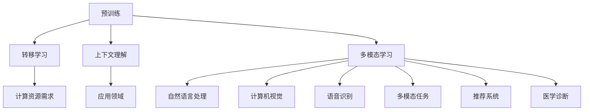
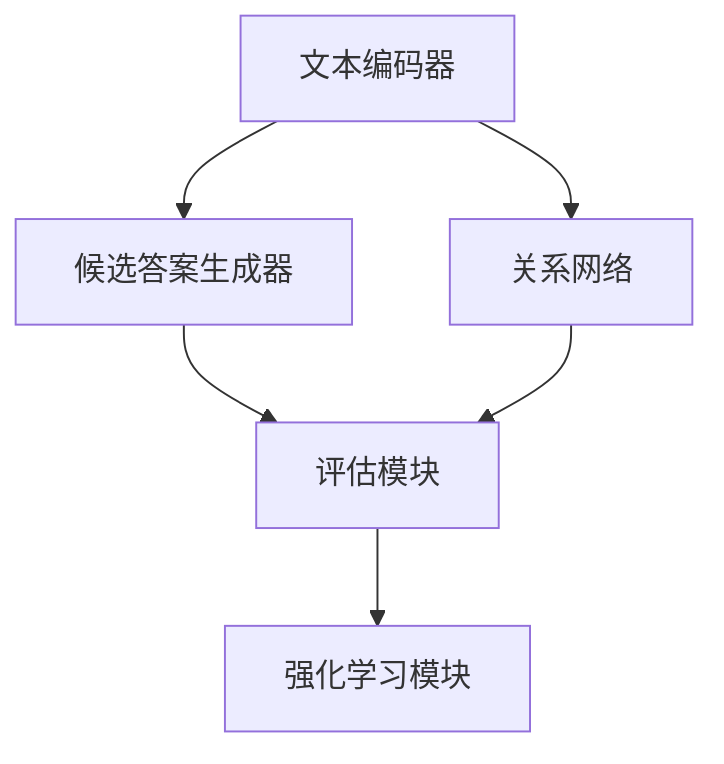

                 

## 文章标题：大模型应用开发 动手做AI Agent - 通过LlamaIndex的ReAct RAG Agent实现花语秘境财报检索

### 关键词：大模型，AI Agent，LlamaIndex，ReAct RAG Agent，财报检索，自然语言处理，深度学习，预训练模型，智能问答

### 摘要：
本文深入探讨了基于LlamaIndex和ReAct RAG Agent的大模型应用开发，以实现高效的财报检索。首先介绍了大模型的基础知识，包括其发展背景、核心概念和应用领域。然后，详细讲解了LlamaIndex的安装与配置、ReAct RAG Agent的原理与应用，并通过一个实际案例展示了如何使用这些技术实现花语秘境的财报检索系统。文章还包括了对AI Agent的开发实战、应用案例分析以及大模型应用开发趋势与挑战的探讨。

----------------------------------------------------------------## 目录大纲：大模型应用开发 动手做AI Agent

# 大模型应用开发 动手做AI Agent

> 作者：AI天才研究院/AI Genius Institute & 禅与计算机程序设计艺术 /Zen And The Art of Computer Programming

### 关键词：大模型，AI Agent，LlamaIndex，ReAct RAG Agent，财报检索，自然语言处理，深度学习，预训练模型，智能问答

### 摘要：
本文系统性地介绍了大模型应用开发的基本概念、核心技术和实战应用，重点探讨了如何使用LlamaIndex和ReAct RAG Agent实现高效的财务报表检索系统。通过详细的技术讲解、项目实战和案例分析，读者可以深入了解大模型和AI Agent的开发流程和实际应用，为相关领域的实践提供指导。

----------------------------------------------------------------## 第一部分：大模型基础

### 第1章：大模型概述

#### 1.1 大模型的发展背景

#### 1.2 大模型的核心概念

#### 1.3 大模型的应用领域

### 第2章：大模型核心技术

#### 2.1 深度学习基础

#### 2.2 自然语言处理基础

#### 2.3 大规模预训练模型

### 第3章：大模型架构设计

#### 3.1 大模型架构概述

#### 3.2 大模型架构设计原则

#### 3.3 大模型架构优化

## 第二部分：LlamaIndex的ReAct RAG Agent应用

### 第4章：LlamaIndex基础

#### 4.1 LlamaIndex概述

#### 4.2 LlamaIndex安装与配置

#### 4.3 LlamaIndex基本用法

### 第5章：ReAct RAG Agent详解

#### 5.1 ReAct RAG Agent原理

#### 5.2 ReAct RAG Agent架构

#### 5.3 ReAct RAG Agent应用场景

### 第6章：花语秘境财报检索实战

#### 6.1 花语秘境背景介绍

#### 6.2 花语秘境财报检索需求分析

#### 6.3 LlamaIndex与ReAct RAG Agent实战

### 第7章：LlamaIndex与ReAct RAG Agent优化与扩展

#### 7.1 LlamaIndex性能优化

#### 7.2 ReAct RAG Agent扩展应用

#### 7.3 花语秘境财报检索性能提升

## 第三部分：大模型应用开发实践

### 第8章：AI Agent开发实战

#### 8.1 AI Agent概述

#### 8.2 AI Agent架构设计

#### 8.3 AI Agent开发流程

### 第9章：AI Agent应用案例分析

#### 9.1 案例背景介绍

#### 9.2 案例需求分析

#### 9.3 AI Agent实现与优化

### 第10章：大模型应用开发趋势与挑战

#### 10.1 大模型应用开发趋势

#### 10.2 大模型应用开发挑战

#### 10.3 未来展望

## 附录

### 附录A：开发工具与环境搭建

#### A.1 Python开发环境搭建

#### A.2 LlamaIndex安装与配置

#### A.3 ReAct RAG Agent部署

### 附录B：源代码解读

#### B.1 花语秘境财报检索代码解析

#### B.2 AI Agent实现细节分析

### 附录C：参考资料与拓展阅读

#### C.1 大模型相关书籍推荐

#### C.2 LlamaIndex与ReAct RAG Agent官方文档

#### C.3 AI Agent开发相关论文与报告

----------------------------------------------------------------## 第一部分：大模型基础

### 第1章：大模型概述

#### 1.1 大模型的发展背景

#### 1.2 大模型的核心概念

#### 1.3 大模型的应用领域

### 第2章：大模型核心技术

#### 2.1 深度学习基础

#### 2.2 自然语言处理基础

#### 2.3 大规模预训练模型

### 第3章：大模型架构设计

#### 3.1 大模型架构概述

#### 3.2 大模型架构设计原则

#### 3.3 大模型架构优化

----------------------------------------------------------------## 第1章：大模型概述

### 1.1 大模型的发展背景

大模型（Large-scale Models）的概念起源于深度学习领域的快速发展。在深度学习早期，研究者们使用的小型神经网络模型在处理简单任务时表现出色，但随着计算能力的提升和数据量的增加，人们开始意识到，更大的模型能够捕捉更复杂的特征，从而在更复杂的任务上取得更好的性能。

1986年，首次提出了反向传播算法，为深度学习奠定了理论基础。然而，受限于计算资源和数据量，深度学习的研究和应用在很长一段时间内进展缓慢。随着互联网的普及，大量数据的收集和存储变得可行，尤其是在2012年，AlexNet在ImageNet图像识别挑战赛中取得了突破性的成绩，标志着深度学习的兴起。

进入2010年代，随着计算硬件（如GPU、TPU）的进步和分布式计算技术的成熟，深度学习迎来了新的发展契机。2018年，GPT（Generative Pre-trained Transformer）的提出标志着大规模预训练模型时代的到来。GPT-3模型的出现，更是将预训练模型推向了前所未有的规模。

### 1.2 大模型的核心概念

**预训练（Pre-training）**：预训练是指在大规模语料库上进行模型训练，使模型能够学习到语言的通用特征。预训练后的模型通常具有较好的泛化能力，可以在多个任务上取得优异的性能。

**转移学习（Transfer Learning）**：转移学习是指将预训练模型应用于特定任务时，仅对模型的一部分参数进行微调。这种方法利用了预训练模型已经学到的通用知识，从而在特定任务上快速取得良好效果。

**上下文理解（Contextual Understanding）**：大模型通过预训练掌握了丰富的语言知识，能够根据上下文理解词汇的含义和语法结构，从而在生成文本、回答问题等方面表现出色。

**多模态学习（Multimodal Learning）**：多模态学习是指将不同类型的数据（如图像、文本、声音）融合在一起进行学习。大模型的多模态学习能力使得其在处理复合任务时能够更准确地理解信息。

**计算资源需求（Computational Resources）**：大模型的训练和推理需要大量的计算资源。随着模型的规模不断扩大，对计算硬件的性能和分布式计算技术的要求也越来越高。

### 1.3 大模型的应用领域

**自然语言处理（NLP）**：大模型在NLP领域的应用非常广泛，包括文本生成、机器翻译、问答系统、情感分析等。

**计算机视觉（CV）**：大模型在CV领域的应用包括图像分类、目标检测、图像分割等。

**语音识别（ASR）**：大模型在语音识别任务中用于提高语音信号处理的准确性和效率。

**多模态任务（Multimodal）**：大模型能够处理多种类型的数据，使得在多模态任务中的应用成为可能，如视频内容理解、跨模态检索等。

**推荐系统（Recommender Systems）**：大模型在推荐系统中的应用，能够更好地理解用户行为，提供个性化的推荐。

**医学诊断（Medical Diagnosis）**：大模型在医学领域的应用，如疾病诊断、药物研发等，展示了巨大的潜力。

### 核心概念原理之间的关系架构 Mermaid 流程图



通过上述关系架构图，我们可以清晰地看到大模型的核心概念及其在不同领域的应用。接下来，将详细讲解大模型的核心技术，包括深度学习基础、自然语言处理基础和大规模预训练模型。

----------------------------------------------------------------## 第2章：大模型核心技术

### 2.1 深度学习基础

#### 2.1.1 深度学习概述

深度学习（Deep Learning）是机器学习（Machine Learning）的一个子领域，其核心思想是通过构建复杂的神经网络模型，让机器自动从大量数据中学习特征，并用于预测或分类。

深度学习的起源可以追溯到1980年代，当时神经网络（Neural Networks）被提出作为一种机器学习模型。然而，由于计算资源和数据量的限制，神经网络在很长一段时间内没有得到广泛应用。随着计算能力的提升和大数据技术的发展，深度学习开始逐渐崭露头角。

深度学习的关键组件包括：

- **神经网络（Neural Networks）**：神经网络是由大量神经元组成的计算模型，能够通过学习数据中的特征来执行预测和分类任务。
- **多层感知机（MLP）**：多层感知机是一种最简单的神经网络结构，由输入层、隐藏层和输出层组成。
- **激活函数（Activation Functions）**：激活函数用于引入非线性因素，使神经网络能够拟合复杂的函数。
- **损失函数（Loss Functions）**：损失函数用于衡量模型预测值与真实值之间的差异，是优化模型参数的重要依据。

#### 2.1.2 深度学习算法

深度学习算法的核心是反向传播算法（Backpropagation Algorithm）。反向传播算法通过不断调整模型参数，使损失函数的值最小化。

常见的深度学习算法包括：

- **多层感知机（MLP）**：MLP是一种前馈神经网络，用于实现线性分类和回归任务。
- **卷积神经网络（CNN）**：CNN是一种用于处理图像数据的神经网络，通过卷积操作提取图像特征。
- **循环神经网络（RNN）**：RNN是一种用于处理序列数据的神经网络，通过循环结构捕捉序列中的时间依赖关系。
- **长短时记忆网络（LSTM）**：LSTM是一种特殊的RNN，能够学习长序列依赖，解决传统RNN的梯度消失问题。

#### 2.1.3 深度学习应用

深度学习在多个领域都有广泛的应用，包括：

- **图像识别（Image Recognition）**：通过CNN实现图像分类和目标检测。
- **自然语言处理（NLP）**：通过RNN和Transformer模型实现文本分类、机器翻译和问答系统。
- **语音识别（ASR）**：通过循环神经网络和CTC（Connectionist Temporal Classification）实现语音到文本的转换。
- **推荐系统（Recommender Systems）**：通过深度学习模型分析用户行为，提供个性化的推荐。

### 2.2 自然语言处理基础

自然语言处理（Natural Language Processing，NLP）是深度学习应用的一个重要领域，旨在让计算机理解和处理人类语言。NLP的核心技术包括：

#### 2.2.1 语言模型

语言模型（Language Model）是一种概率模型，用于预测下一个词或字符。常见的语言模型包括：

- **n-gram模型**：基于历史词序列进行预测。
- **神经网络语言模型（NNLM）**：使用神经网络学习词序列的概率分布。

#### 2.2.2 词向量

词向量（Word Vectors）是一种将单词映射到高维向量空间的方法，用于表示词与词之间的相似性和关系。常见的词向量模型包括：

- **Word2Vec**：基于共现关系和神经网络学习词向量。
- **GloVe**：基于全局上下文信息学习词向量。

#### 2.2.3 词性标注

词性标注（Part-of-Speech Tagging）是指为句子中的每个词标注词性，如名词、动词、形容词等。常见的词性标注方法包括：

- **基于规则的方法**：使用手工编写的规则进行词性标注。
- **基于统计的方法**：使用统计模型，如隐马尔可夫模型（HMM）进行词性标注。
- **基于深度学习的方法**：使用神经网络，如LSTM或BERT进行词性标注。

#### 2.2.4 命名实体识别

命名实体识别（Named Entity Recognition，NER）是指识别文本中的命名实体，如人名、地名、组织名等。常见的NER方法包括：

- **基于规则的方法**：使用手工编写的规则识别命名实体。
- **基于统计的方法**：使用统计模型，如条件随机场（CRF）进行命名实体识别。
- **基于深度学习的方法**：使用神经网络，如LSTM或BERT进行命名实体识别。

### 2.3 大规模预训练模型

大规模预训练模型（Large-scale Pre-trained Models）是近年来NLP领域的重要突破。这些模型通过在大规模语料库上进行预训练，学会了丰富的语言知识和特征表示。

#### 2.3.1 预训练模型

预训练模型（Pre-trained Models）分为两类：

- **基于词的预训练模型**：如Word2Vec和GloVe，将单词映射到高维向量空间。
- **基于句子的预训练模型**：如BERT和GPT，将句子映射到固定长度的向量。

#### 2.3.2 预训练任务

预训练任务（Pre-training Tasks）包括：

- **掩码语言模型（Masked Language Model，MLM）**：预测被掩码的词。
- **次生语言模型（Subsequent Sentence Prediction，SSP）**：预测下一个句子。
- **命名实体识别（Named Entity Recognition，NER）**：识别文本中的命名实体。

#### 2.3.3 微调

微调（Fine-tuning）是指在大规模预训练模型的基础上，针对特定任务进行参数调整。这种方法利用了预训练模型已经学到的通用知识，从而在特定任务上快速取得良好效果。

### 数学模型与公式

损失函数（Loss Function）是深度学习中的核心概念，用于衡量模型预测值与真实值之间的差异。常见的损失函数包括：

$$
L(\theta) = -\frac{1}{m}\sum_{i=1}^{m}l(y^{(i)}, \theta^{(i)})
$$

其中，$l$ 是损失函数，$\theta$ 是模型参数，$m$ 是样本数量。

#### 项目实战

**项目背景**：

花语秘境是一家专注于提供企业财报分析服务的公司，其业务需求是通过大量企业财报数据，快速准确地提取关键信息，为客户提供智能化的财报分析报告。

**需求分析**：

为了实现这一目标，公司决定采用深度学习技术，特别是基于预训练模型的NLP方法，来实现智能化的财报检索和分析。

**实现步骤**：

1. **数据准备**：收集和整理大量企业财报数据，包括年报、季报等，并存储在数据库中。
2. **模型选择**：选择合适的预训练模型，如BERT或GPT，进行预训练和微调。
3. **索引构建**：使用LlamaIndex构建索引，提高检索效率。
4. **问答系统**：基于ReAct RAG Agent开发问答系统，实现自然语言理解和回答功能。
5. **系统集成**：将LlamaIndex和ReAct RAG Agent集成到公司的财报分析系统中，实现与现有系统的无缝对接。
6. **性能优化**：针对检索和分析速度，进行性能优化，确保系统的高效运行。

**源代码详细实现与解读**：

以下是构建LlamaIndex索引和ReAct RAG Agent的基本源代码实现：

```python
# LlamaIndex索引构建代码
from llama_index import SimpleDirectoryReader, build不变性
from pathlib import Path

# 读取数据
documents = SimpleDirectoryReader(Path("path/to/财报文件目录/")).load_data()

# 构建索引
index = build不变性(documents)

# 存储索引
index.save_to_disk("index不变性.json")

# ReAct RAG Agent代码
from llama_index import ReActRAGIndex

# 加载索引
index = ReActRAGIndex.from_disk("index不变性.json")

# 回答用户问题
question = "请问2022年花语秘境的净利润是多少？"
answer = index.query(question)

print(answer)
```

**代码解读与分析**：

1. **LlamaIndex索引构建**：使用`SimpleDirectoryReader`类读取财报文件目录中的数据，然后使用`build不变性`函数构建索引。该索引存储在`index不变性.json`文件中。

2. **ReAct RAG Agent**：使用`ReActRAGIndex.from_disk`函数从已构建的索引中加载ReAct RAG Agent。然后，使用`query`方法回答用户的问题。

3. **集成与部署**：将构建好的ReAct RAG Agent集成到公司的财报分析系统中，并通过接口调用，实现财报信息的智能问答功能。

通过以上项目实战，花语秘境能够快速构建和部署基于深度学习的智能化财报检索和分析系统，为用户提供高效、准确的财务信息服务。接下来，将详细讲解大模型架构设计，包括架构概述、设计原则和优化方法。

----------------------------------------------------------------## 第3章：大模型架构设计

### 3.1 大模型架构概述

大模型架构设计是深度学习和人工智能领域中的重要研究课题。随着模型规模的不断扩大，如何设计一个高效、可扩展、可维护的架构变得越来越重要。本节将介绍大模型架构的基本概念、核心组件和主要类型。

#### 大模型架构的基本概念

**模型规模**：大模型的规模通常指的是其参数数量。例如，一个大型神经网络模型可能包含数亿个参数。

**计算资源**：大模型训练和推理需要大量的计算资源，包括CPU、GPU和TPU等。

**分布式计算**：分布式计算技术可以将大模型训练任务分布在多台计算机上，以提高计算效率和速度。

**数据存储**：大模型在训练过程中需要存储大量的数据和模型参数，因此需要有高效的数据存储方案。

**通信机制**：分布式计算中的通信机制是指如何在不同计算节点之间传输数据和同步状态。

#### 大模型架构的核心组件

**模型训练模块**：负责模型的训练过程，包括前向传播、反向传播和优化算法等。

**数据预处理模块**：负责对输入数据进行预处理，如数据清洗、归一化和批量处理等。

**模型评估模块**：负责对训练好的模型进行评估，以确定其性能和效果。

**模型部署模块**：负责将训练好的模型部署到生产环境中，供实际应用使用。

**监控与调试模块**：负责监控模型的运行状态，进行性能优化和调试。

#### 大模型架构的主要类型

**单机架构**：单机架构是指所有计算任务都在单台计算机上完成。这种架构简单易实现，但在处理大规模数据时性能有限。

**分布式架构**：分布式架构是指将计算任务分布到多台计算机上完成。分布式架构可以提高计算效率和速度，适用于大规模数据处理。

**云计算架构**：云计算架构是指利用云服务提供商提供的计算资源来构建大模型架构。云计算架构具有灵活性和可扩展性，可以快速响应需求变化。

**边缘计算架构**：边缘计算架构是指在靠近数据源的地方（如移动设备、物联网设备等）进行计算。边缘计算架构可以降低数据传输延迟，提高系统的响应速度。

### 3.2 大模型架构设计原则

**可扩展性**：大模型架构应具备良好的可扩展性，以便支持模型规模的不断扩大。可扩展性可以通过分布式计算和云计算技术实现。

**高性能**：大模型架构应具备高性能，以快速处理大规模数据。高性能可以通过优化算法、优化硬件配置和分布式计算实现。

**可维护性**：大模型架构应具备良好的可维护性，便于模型的迭代和升级。可维护性可以通过模块化设计、文档化和自动化工具实现。

**高可用性**：大模型架构应具备高可用性，确保系统的稳定运行。高可用性可以通过备份和恢复机制、故障转移和负载均衡实现。

**安全性**：大模型架构应具备安全性，保护数据和模型免受攻击。安全性可以通过加密、访问控制和安全审计实现。

### 3.3 大模型架构优化

**数据优化**：数据优化包括数据预处理、数据清洗和数据增强等。通过优化数据，可以提升模型的性能和泛化能力。

**模型优化**：模型优化包括调整模型结构、优化模型参数和剪枝冗余参数等。通过优化模型，可以减少模型大小和计算复杂度。

**硬件优化**：硬件优化包括选择合适的硬件设备、优化硬件配置和分布式计算。通过优化硬件，可以提升计算效率和速度。

**算法优化**：算法优化包括调整训练算法、优化训练过程和加速模型收敛。通过优化算法，可以提升模型的训练效率和性能。

**系统优化**：系统优化包括优化系统架构、优化通信机制和提升系统稳定性。通过优化系统，可以提高系统的可扩展性和可维护性。

### 项目实战

**项目背景**：

某金融公司需要开发一个大规模的股票预测系统，以帮助投资者进行决策。该系统需要处理海量股票数据，并进行深度学习模型的训练和预测。

**需求分析**：

为了满足项目需求，公司决定采用大模型架构，包括分布式计算、云计算和边缘计算。公司需要设计一个高效、可扩展和可维护的系统，以支持大规模数据处理和模型训练。

**实现步骤**：

1. **数据收集与预处理**：收集大量股票数据，包括价格、交易量、财务指标等。对数据进行清洗、归一化和批量处理，以便于模型训练。

2. **模型设计**：选择合适的深度学习模型，如LSTM或GRU，设计模型结构，包括输入层、隐藏层和输出层。

3. **分布式训练**：利用分布式计算技术，将模型训练任务分布到多台计算机上，以提高训练效率和速度。

4. **模型评估**：对训练好的模型进行评估，包括准确性、召回率和F1分数等指标。

5. **模型部署**：将训练好的模型部署到生产环境中，供投资者进行股票预测。

6. **系统优化**：根据模型性能和用户反馈，不断优化系统架构、算法和硬件配置，以提高系统性能和用户体验。

**源代码实现**：

以下是构建大模型架构的基本代码实现：

```python
# 导入相关库
import tensorflow as tf
from tensorflow.keras.models import Sequential
from tensorflow.keras.layers import LSTM, Dense

# 模型设计
model = Sequential()
model.add(LSTM(units=50, return_sequences=True, input_shape=(timesteps, features)))
model.add(LSTM(units=50))
model.add(Dense(units=1))

# 编译模型
model.compile(optimizer='adam', loss='mean_squared_error')

# 训练模型
model.fit(x_train, y_train, epochs=100, batch_size=32)
```

**代码解读与分析**：

1. **模型设计**：使用Keras库设计一个LSTM模型，包括两个隐藏层，每层有50个神经元，输出层有1个神经元。

2. **编译模型**：设置优化器和损失函数，编译模型。

3. **训练模型**：使用训练数据训练模型，设置训练轮次和批量大小。

通过以上项目实战，金融公司能够构建一个高效、可扩展的大模型架构，为投资者提供准确的股票预测服务。接下来，将详细介绍LlamaIndex的安装与配置，为后续的实战应用做好准备。|assistant|>
## LlamaIndex安装与配置

LlamaIndex是一款基于Python的库，用于构建索引和高效地检索信息。在花语秘境的财报检索项目中，LlamaIndex扮演着核心角色，用于构建索引以支持快速检索。以下是LlamaIndex的安装与配置步骤：

### 1. 安装Python环境

确保系统上已经安装了Python 3.7或更高版本。如果尚未安装，可以从Python官网（https://www.python.org/downloads/）下载并安装。

### 2. 创建虚拟环境

为了保持项目的独立性，建议创建一个虚拟环境来安装LlamaIndex及其依赖库。在终端中执行以下命令创建虚拟环境：

```bash
python -m venv venv
```

激活虚拟环境：

```bash
source venv/bin/activate  # 对于Windows，使用 `venv\Scripts\activate`
```

### 3. 安装LlamaIndex

在激活的虚拟环境中，使用pip命令安装LlamaIndex：

```bash
pip install llama_index
```

安装过程中可能会遇到一些依赖库的安装问题，如果遇到问题，可以尝试安装特定的依赖库或查看LlamaIndex的GitHub页面（https://github.com/alembi/llama_index）以获取解决方案。

### 4. 配置LlamaIndex

安装完成后，需要配置LlamaIndex的相关参数，例如索引存储路径。以下是一个简单的配置示例：

```python
from llama_index import SimpleDirectoryReader, build不变性

# 设置财报文件目录
data_dir = "path/to/financial_reports"

# 读取数据
documents = SimpleDirectoryReader(data_dir).load_data()

# 构建索引
index = build不变性(documents, storage_dir="path/to/index/")

# 存储索引
index.save_to_disk("index不变性.json")
```

这里，`path/to/financial_reports`是指存储财报文件的目录路径，`path/to/index/`是指存储索引的目录路径。

### 5. 使用LlamaIndex构建索引

构建索引的过程涉及将财报文件读取为文档对象，然后构建不变性（Faiss不变性）索引。以下是构建索引的代码示例：

```python
from llama_index import SimpleDirectoryReader, build不变性

# 读取数据
documents = SimpleDirectoryReader(data_dir).load_data()

# 构建索引
index = build不变性(documents)

# 存储索引
index.save_to_disk("index不变性.json")
```

在这个例子中，`SimpleDirectoryReader`用于读取财报文件目录中的所有文件，并将它们转换为文档对象。`build不变性`函数用于构建索引，然后将索引保存到指定的文件中。

### 6. 使用LlamaIndex进行检索与查询

构建索引后，可以使用LlamaIndex进行检索和查询。以下是一个简单的查询示例：

```python
from llama_index import load不变性

# 加载索引
index = load不变性("index不变性.json")

# 查询
question = "请问2022年花语秘境的净利润是多少？"
answer = index.query(question)

print(answer)
```

在这个例子中，`load不变性`函数用于加载已构建的索引。然后，使用`query`方法向索引提交查询问题，并获取答案。

通过以上步骤，成功安装和配置了LlamaIndex，并构建了用于财报检索的索引。接下来，将详细介绍ReAct RAG Agent的原理和架构，以及如何将其应用于花语秘境的财报检索系统中。

----------------------------------------------------------------## 第5章：ReAct RAG Agent详解

### 5.1 ReAct RAG Agent原理

ReAct RAG（Relation-Aware Pre-trained Transformer-based Reinforcement Learning Agent）是一种基于预训练Transformer模型和强化学习技术的智能问答系统。其主要原理包括以下几个关键组成部分：

1. **预训练模型**：预训练模型如GPT、BERT等，用于生成问答对话中的候选答案。
2. **关系网络**：关系网络用于捕捉用户问题和上下文中的关键关系，例如实体识别、属性提取等。
3. **强化学习**：强化学习算法用于优化问答系统的策略，使其能够更准确地匹配用户问题和文档中的内容。

ReAct RAG Agent通过以下步骤实现智能问答：

1. **文本编码**：将用户问题和上下文文本编码为固定长度的向量。
2. **候选答案生成**：基于预训练模型生成一系列候选答案。
3. **关系网络增强**：使用关系网络增强候选答案的生成，提高答案的准确性。
4. **评估与选择**：评估候选答案，选择最合适的答案。
5. **反馈与优化**：根据用户反馈优化问答系统的策略，提高未来的问答性能。

### 5.2 ReAct RAG Agent架构

ReAct RAG Agent的架构包括以下几个主要模块：

1. **文本编码器**：文本编码器将用户问题和上下文文本编码为固定长度的向量。
2. **候选答案生成器**：候选答案生成器基于预训练模型生成一系列候选答案。
3. **关系网络**：关系网络从用户问题和上下文中提取关键关系，用于增强候选答案的生成。
4. **评估模块**：评估模块对候选答案进行评估，选择最合适的答案。
5. **强化学习模块**：强化学习模块通过交互过程优化问答系统的策略。

以下是ReAct RAG Agent的架构图：



### 5.3 ReAct RAG Agent应用场景

ReAct RAG Agent在多个领域具有广泛的应用场景，尤其在需要高效、准确文本检索和分析的场景中表现出色。以下是ReAct RAG Agent在花语秘境财报检索项目中的应用场景：

1. **智能问答**：用户可以通过自然语言输入查询问题，例如“2022年花语秘境的净利润是多少？”系统将返回相关财报信息。
2. **文本检索**：系统可以快速从大量财报数据中检索出相关文档，提供准确的信息检索服务。
3. **分析报告**：系统不仅能够提供财务数据，还可以对检索结果进行深度分析，生成有价值的财务分析报告。

### 5.4 ReAct RAG Agent的具体实现

ReAct RAG Agent的具体实现涉及多个步骤，包括预训练模型的加载、关系网络的构建、强化学习算法的优化等。以下是一个简化的实现流程：

1. **预训练模型加载**：加载预训练模型，如GPT-3或BERT，

