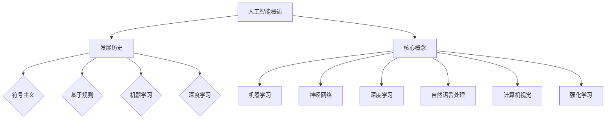

                 

### 文章标题

《一切皆是映射：AI人工智能原理与应用实战简介》

### 关键词

人工智能（AI）、机器学习、深度学习、神经网络、应用实战、自然语言处理、计算机视觉、强化学习、智能助手、智能驾驶、智能医疗、智能安防

### 摘要

本文以“一切皆是映射”为核心思想，深入浅出地介绍了人工智能（AI）的基本原理和应用实战。文章分为两个主要部分：第一部分详细阐述了AI的核心概念、机器学习基础、神经网络以及深度学习框架；第二部分则聚焦于AI在自然语言处理、计算机视觉、强化学习等领域的应用，并通过实际案例展示了AI技术在智能助手、智能驾驶、智能医疗和智能安防等场景中的实现与应用。此外，文章还探讨了AI安全与伦理问题，为读者提供了全面的AI技术知识体系。

## 第一部分 AI人工智能原理

### 第1章 引言

#### 1.1 AI概述

人工智能（Artificial Intelligence，简称AI）是计算机科学的一个分支，旨在通过模拟、延伸和扩展人类智能，使计算机能够执行复杂任务，如学习、推理、解决问题、自然语言理解和图像识别等。AI的概念最早可追溯到20世纪50年代，随着计算能力的提升和算法的进步，AI技术逐渐从理论走向应用，成为当前科技领域的热点之一。

#### 1.2 AI的发展历史

AI的发展经历了多个阶段，从最初的符号主义、知识表示与推理，到基于规则的专家系统，再到基于数据的机器学习和深度学习，每个阶段都有其代表性的突破和成就。

- **符号主义和知识表示（1950s-1970s）**：这一阶段主要关注如何通过符号表示和逻辑推理来实现人工智能。代表性工作包括逻辑程序设计、语义网络等。

- **基于规则的专家系统（1970s-1980s）**：专家系统通过定义一系列规则，模拟人类专家的决策过程。这一阶段出现了许多成功的应用，如医疗诊断系统。

- **机器学习（1980s-2000s）**：随着计算能力的提升和数据量的增加，机器学习成为AI研究的重要方向。机器学习通过从数据中学习规律，实现预测和分类等任务。

- **深度学习（2006年至今）**：深度学习是机器学习的一个分支，通过模拟人脑神经网络结构，实现更复杂和更高效的学习。深度学习在图像识别、语音识别等领域取得了显著突破。

#### 1.3 AI的核心概念

AI的核心概念包括：

- **机器学习**：一种从数据中自动学习规律和模式的技术，分为监督学习、无监督学习和强化学习。

- **神经网络**：一种模拟人脑神经元连接的模型，能够通过学习实现复杂的非线性映射。

- **深度学习**：一种基于多层神经网络的学习方法，通过逐层提取特征，实现高度抽象的模型。

- **自然语言处理**：研究如何使计算机理解和生成自然语言。

- **计算机视觉**：研究如何使计算机理解和解释视觉信息。

- **强化学习**：一种通过试错和奖励机制进行学习的机器学习技术。

### Mermaid 流程图

### 核心概念与联系

- **机器学习与神经网络**：机器学习是AI的核心技术之一，而神经网络是实现机器学习的一种模型。神经网络通过多层结构，逐层提取特征，实现复杂的学习任务。

- **深度学习与神经网络**：深度学习是基于多层神经网络的学习方法，其关键在于网络结构的复杂性和深度，这使得模型能够学习更高层次的特征表示。

- **自然语言处理与计算机视觉**：自然语言处理和计算机视觉都是AI的重要应用领域，自然语言处理关注文本的理解和生成，计算机视觉关注图像和视频的分析和理解。

- **强化学习与其他学习方式**：强化学习是一种基于试错和奖励的学习方式，与其他学习方式相比，它更关注决策过程和长期奖励。

### 数学模型和公式

- **线性回归**：预测目标变量的线性模型，公式为：
  $$
  y = \beta_0 + \beta_1x
  $$

- **逻辑回归**：用于分类的模型，通过 logistic 函数将线性模型映射到概率空间，公式为：
  $$
  P(y=1) = \frac{1}{1 + e^{-(\beta_0 + \beta_1x})}
  $$

- **神经网络**：通过前向传播和反向传播算法进行训练的模型，其基本单元是神经元，公式为：
  $$
  z = \sum_{i=1}^{n} w_{ij}x_{j} + b
  $$
  $$
  a = \sigma(z)
  $$

- **卷积神经网络**（CNN）：通过卷积层、池化层和全连接层进行图像分析的模型，其关键在于卷积操作和池化操作，公式为：
  $$
  f(x) = \sum_{i=1}^{k} w_{i} \cdot \sigma(\sum_{j=1}^{n} x_{j} \cdot w_{ji}) + b
  $$

- **循环神经网络**（RNN）：处理序列数据的模型，通过隐藏状态和循环连接实现序列信息的记忆，公式为：
  $$
  h_t = \sigma(W_h \cdot [h_{t-1}, x_t] + b_h)
  $$

- **强化学习**：通过奖励机制和策略迭代进行学习的模型，公式为：
  $$
  Q(s, a) = r + \gamma \max_{a'} Q(s', a')
  $$

### 详细讲解与举例说明

- **线性回归**：假设我们有一个简单的线性回归模型，预测房屋价格，特征是房屋面积。我们通过收集数据，拟合出一个线性模型：
  $$
  y = \beta_0 + \beta_1x
  $$
  其中，$y$ 是房屋价格，$x$ 是房屋面积，$\beta_0$ 和 $\beta_1$ 是模型的参数。

- **逻辑回归**：假设我们有一个分类任务，预测一个邮件是否为垃圾邮件，特征是邮件内容。我们通过逻辑回归模型，拟合出一个分类模型：
  $$
  P(y=1) = \frac{1}{1 + e^{-(\beta_0 + \beta_1x)}}
  $$
  其中，$y$ 是邮件是否为垃圾邮件的标签，$x$ 是邮件内容的特征，$\beta_0$ 和 $\beta_1$ 是模型的参数。

- **神经网络**：假设我们有一个神经网络模型，用于识别手写数字。通过多层神经网络，我们能够将手写数字的图像映射为数字的类别。神经网络的训练过程包括前向传播和反向传播：

  - **前向传播**：输入手写数字图像，通过多层神经网络，输出数字的预测类别。
  - **反向传播**：计算预测误差，通过梯度下降法更新网络参数。

- **卷积神经网络**：假设我们有一个卷积神经网络模型，用于图像分类。卷积神经网络通过卷积操作提取图像的特征，然后通过全连接层分类。卷积操作和池化操作能够有效地降低数据的维度，提取关键特征。

  - **卷积操作**：通过卷积核与图像的局部区域进行卷积，提取特征。
  - **池化操作**：通过最大池化或平均池化操作，降低数据的维度。

- **循环神经网络**：假设我们有一个循环神经网络模型，用于语音识别。循环神经网络能够处理变长的序列数据，通过隐藏状态和循环连接，实现序列信息的记忆。通过训练，循环神经网络能够将语音信号映射为文本。

  - **隐藏状态**：通过循环连接，将前一个时间步的隐藏状态传递到下一个时间步。
  - **梯度消失/爆炸**：循环神经网络的一个挑战是梯度消失或爆炸问题，这可能导致训练过程的失败。为了解决这个问题，可以采用长短时记忆（LSTM）或门控循环单元（GRU）等改进的循环神经网络。

- **强化学习**：假设我们有一个强化学习模型，用于自动驾驶。通过试错和奖励机制，强化学习模型能够学习在复杂环境中做出最优决策。强化学习的过程包括：

  - **状态-动作空间**：定义状态和动作空间，确定智能体在环境中的行为。
  - **奖励函数**：定义奖励函数，激励智能体做出有利于目标的决策。
  - **策略迭代**：通过策略迭代，智能体逐渐学习到最优策略。

### 结论

本章介绍了AI的核心概念、发展历史和机器学习、神经网络、深度学习等基础理论。通过Mermaid流程图和数学模型，我们对AI的核心概念有了更深入的理解。同时，通过举例说明，我们能够更好地掌握这些理论在实际应用中的运用。

## 第二部分 AI人工智能应用

### 第5章 自然语言处理

#### 5.1 词嵌入

词嵌入（Word Embedding）是自然语言处理（Natural Language Processing，NLP）中的一项关键技术，它将单词映射到高维向量空间中，使得单词在向量空间中的距离反映了单词在语义上的相似度。词嵌入技术的核心思想是将语义和语法信息通过向量形式进行编码，从而为NLP任务提供有效的特征表示。

#### 5.2 文本分类

文本分类（Text Classification）是一种常见的信息处理任务，旨在将文本数据划分为预定义的类别。文本分类广泛应用于舆情分析、新闻推荐、垃圾邮件检测等领域。其基本流程包括数据预处理、特征提取和分类模型训练。

#### 5.3 机器翻译

机器翻译（Machine Translation）是NLP的另一个重要任务，旨在将一种语言的文本自动翻译成另一种语言的文本。传统的机器翻译方法基于规则和统计模型，而近年来，基于神经网络的机器翻译（Neural Machine Translation，NMT）方法取得了显著进展，成为机器翻译领域的热点。

#### 5.4 问答系统

问答系统（Question Answering System）是一种能够自动回答用户问题的系统。问答系统包括问题理解、答案检索和答案生成三个主要环节。近年来，基于深度学习的问答系统在理解和生成高质量答案方面取得了显著成果。

### 第6章 计算机视觉

#### 6.1 图像分类

图像分类（Image Classification）是计算机视觉（Computer Vision）中的基本任务之一，旨在将图像数据划分为预定义的类别。图像分类广泛应用于图像识别、物体检测、人脸识别等领域。卷积神经网络（Convolutional Neural Networks，CNN）是图像分类任务中最常用的模型。

#### 6.2 目标检测

目标检测（Object Detection）是一种更为复杂的计算机视觉任务，旨在从图像中识别出多个目标的位置和类别。目标检测广泛应用于自动驾驶、视频监控、图像分割等领域。卷积神经网络结合区域建议网络（Region Proposal Networks，RPN）和分类网络（分类层、回归层）是目标检测的主要模型。

#### 6.3 图像生成

图像生成（Image Generation）是一种利用人工智能技术生成新的图像数据的方法。生成对抗网络（Generative Adversarial Networks，GAN）是图像生成任务中最常用的模型。GAN由生成器和判别器组成，通过对抗训练生成逼真的图像。

#### 6.4 人脸识别

人脸识别（Face Recognition）是计算机视觉中的一项重要应用，旨在通过人脸图像识别个体的身份。人脸识别广泛应用于安全监控、身份验证、人机交互等领域。深度学习模型，如卷积神经网络和循环神经网络，是人脸识别任务中的核心算法。

### 第7章 强化学习

#### 7.1 强化学习概述

强化学习（Reinforcement Learning，RL）是一种基于试错和奖励机制进行学习的机器学习技术。强化学习通过智能体（Agent）与环境的交互，不断优化策略，以实现长期奖励最大化。强化学习广泛应用于自动驾驶、游戏、机器人控制等领域。

#### 7.2 Q-learning

Q-learning是一种基于值函数的强化学习算法，通过学习状态-动作值函数（Q-function）来优化策略。Q-learning的基本思想是通过试错和奖励更新Q值，直到找到最优策略。Q-learning算法的关键在于选择适当的探索策略，以平衡探索和利用。

#### 7.3 DQN

深度Q网络（Deep Q-Network，DQN）是一种基于深度学习的强化学习算法，旨在解决传统Q-learning算法中值函数近似的问题。DQN通过神经网络近似Q函数，提高了算法的收敛速度和效果。DQN的关键在于经验回放（Experience Replay）和目标网络（Target Network）的使用，以减少样本偏差和计算复杂度。

#### 7.4 Policy Gradient

策略梯度（Policy Gradient）是一种基于策略的强化学习算法，直接优化策略函数，以最大化期望奖励。策略梯度算法的关键在于选择适当的策略表示和梯度估计方法，以避免梯度消失和爆炸问题。策略梯度算法在连续动作空间和复杂环境中表现出色。

### 第8章 AI应用案例

#### 8.1 智能助手

智能助手（Smart Assistant）是一种基于AI技术的虚拟助手，旨在帮助用户解决日常问题和提供个性化服务。智能助手通常采用自然语言处理、语音识别和语音合成技术，与用户进行交互。智能助手广泛应用于智能家居、智能客服、智能医疗等领域。

#### 8.2 智能驾驶

智能驾驶（Smart Driving）是一种基于AI技术的自动驾驶技术，旨在通过计算机视觉、传感器和强化学习等算法实现车辆自主驾驶。智能驾驶技术能够提高交通安全、减少交通事故和缓解交通拥堵。智能驾驶广泛应用于自动驾驶汽车、无人机和机器人等领域。

#### 8.3 智能医疗

智能医疗（Smart Healthcare）是一种基于AI技术的医疗模式，旨在通过数据分析和机器学习技术提高医疗服务的质量和效率。智能医疗包括疾病预测、诊断、治疗方案推荐和健康管理等方面。智能医疗技术能够提高诊断准确率、优化治疗方案和降低医疗成本。

#### 8.4 智能安防

智能安防（Smart Security）是一种基于AI技术的安全防范系统，旨在通过图像识别、视频分析和智能算法实现安全监控和预警。智能安防技术能够提高安全防范能力、减少人力成本和提升应急响应速度。智能安防广泛应用于公共场所、企业和家庭等领域。

### 第9章 AI安全与伦理

#### 9.1 AI安全挑战

AI安全（AI Security）是确保AI系统在设计和部署过程中不受恶意攻击和错误影响的关键。AI安全挑战包括数据安全、模型攻击、算法透明性和隐私保护等方面。为了确保AI系统的安全性，需要采用防御性设计、安全测试和持续监控等技术。

#### 9.2 AI伦理问题

AI伦理（AI Ethics）是确保AI技术在应用过程中符合道德和社会价值的关键。AI伦理问题包括算法歧视、隐私侵犯、公平性和责任归属等方面。为了解决AI伦理问题，需要制定伦理准则、法律法规和道德标准，以确保AI技术的健康发展。

#### 9.3 AI监管框架

AI监管框架（AI Regulatory Framework）是确保AI技术合规和可信的重要手段。监管框架包括政策制定、标准制定、行业自律和国际合作等方面。通过建立完善的AI监管框架，可以促进AI技术的创新和发展，同时保障公众利益和社会稳定。

### 附录

#### 附录A AI工具和库

- **Python库**：NumPy、Pandas、Scikit-learn、Matplotlib、Seaborn等。
- **深度学习框架**：TensorFlow、PyTorch、Keras、Theano等。
- **计算机视觉库**：OpenCV、TensorFlow Object Detection API、PyTorch Video等。

#### 附录B 实战项目指南

- **项目选择与规划**：根据应用场景和需求选择合适的项目，制定项目计划和时间表。
- **数据集获取与处理**：收集和处理数据，包括数据清洗、数据预处理和特征提取。
- **模型选择与训练**：选择合适的模型架构，进行模型训练和调优。
- **模型评估与优化**：评估模型性能，通过超参数调整和模型集成等方法优化模型。
- **部署与维护**：将模型部署到生产环境，进行实时监控和更新。

#### 附录C 经典算法详解

- **线性回归**：介绍线性回归的数学模型、算法原理和实现方法。
- **逻辑回归**：介绍逻辑回归的数学模型、算法原理和实现方法。
- **决策树**：介绍决策树的数学模型、算法原理和实现方法。
- **神经网络**：介绍神经网络的基本结构、算法原理和实现方法。
- **卷积神经网络**（CNN）：介绍卷积神经网络的数学模型、算法原理和实现方法。
- **循环神经网络**（RNN）：介绍循环神经网络的数学模型、算法原理和实现方法。
- **强化学习算法**：介绍强化学习的数学模型、算法原理和实现方法。

### 作者信息

作者：AI天才研究院/AI Genius Institute & 禅与计算机程序设计艺术 /Zen And The Art of Computer Programming

### 最佳实践 tips

1. **数据质量和预处理**：确保数据质量和预处理是模型成功的关键。数据清洗、归一化和特征工程等步骤都需要精心设计。

2. **模型选择与调优**：选择合适的模型架构并进行调优是提高模型性能的关键。可以尝试多种模型和超参数，使用交叉验证等方法评估模型性能。

3. **模型部署与监控**：将模型部署到生产环境并进行实时监控是确保系统稳定运行的关键。使用容器化技术、自动化部署和监控系统可以提高系统的可靠性和可维护性。

4. **数据隐私与安全**：在处理和存储数据时，确保数据隐私和安全是至关重要的。使用加密技术、访问控制和数据匿名化等方法保护用户数据。

5. **持续学习与迭代**：AI技术的发展日新月异，持续学习和迭代是保持技术领先的关键。关注最新研究成果和技术动态，不断优化和改进模型和应用。

### 小结

本文从AI的基本原理到应用实战，系统性地介绍了人工智能的核心概念和技术。通过自然语言处理、计算机视觉、强化学习等领域的实际应用案例，展示了AI技术的广泛应用和潜力。同时，文章还探讨了AI安全与伦理问题，为AI技术的发展提供了指导和思考。希望本文能够为读者提供全面、深入的AI技术知识体系，助力读者在AI领域取得突破和进步。

### 注意事项

1. **数据隐私**：在处理用户数据时，务必遵循数据隐私保护法规，确保用户数据的安全和隐私。

2. **算法公平性**：在设计和应用AI算法时，关注算法的公平性和透明性，避免算法偏见和歧视。

3. **系统稳定性**：在部署AI系统时，确保系统的稳定性和可靠性，进行充分的测试和监控。

4. **持续学习**：AI技术不断发展，持续学习和关注最新研究成果是保持竞争力的关键。

### 拓展阅读

- 《深度学习》（Deep Learning，Ian Goodfellow、Yoshua Bengio、Aaron Courville 著）
- 《Python机器学习》（Python Machine Learning，Sebastian Raschka 著）
- 《强化学习实战》（Reinforcement Learning for Spiking Neural Networks，Giulio Tononi 著）
- 《自然语言处理实战》（Natural Language Processing with Python，Steven L. Lott 著）
- 《计算机视觉：算法与应用》（Computer Vision: Algorithms and Applications，Richard Szeliski 著）

以上书籍和资源将有助于读者进一步深入了解AI技术及其应用。

### 结语

本文以“一切皆是映射”为核心思想，深入浅出地介绍了人工智能的基本原理和应用实战。通过自然语言处理、计算机视觉、强化学习等领域的实际应用案例，展示了AI技术的广泛应用和潜力。同时，文章还探讨了AI安全与伦理问题，为AI技术的发展提供了指导和思考。希望本文能够为读者提供全面、深入的AI技术知识体系，助力读者在AI领域取得突破和进步。在未来的发展中，AI技术将继续深化，为社会带来更多创新和变革。让我们一起探索AI的无限可能，共创美好未来！

