                 

### 1.1 AI与先进制造业的关系

**核心概念与联系**：

人工智能（AI）和先进制造业之间存在着紧密的联系。先进制造业是指通过创新和技术进步来实现产品的高质量、高效率和低成本制造。它涉及智能制造、工业互联网、大数据等关键技术，旨在提高生产效率、降低成本、增强产品的竞争力。

人工智能作为一种新兴的技术，其核心目的是模拟和扩展人类的认知能力，实现机器的智能行为。AI在先进制造业中的应用，可以看作是将智能技术与制造业深度融合的过程，从而推动制造业的升级和转型。

**Mermaid流程图**：

为了更直观地展示AI与先进制造业的关系，我们可以使用Mermaid流程图来表示：

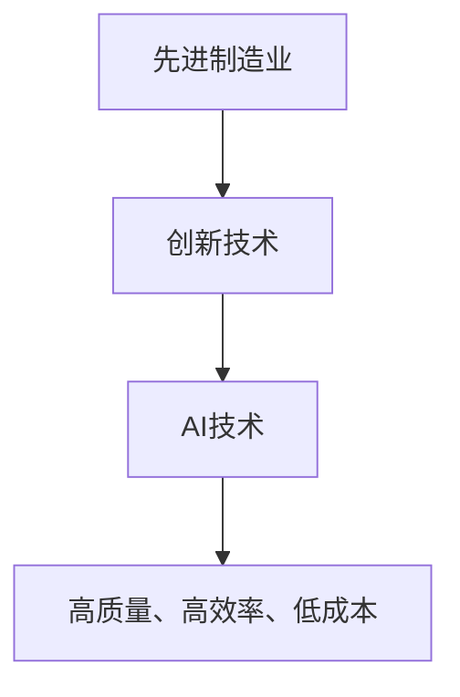

在这个流程图中，先进制造业是起点，它通过创新技术（如工业互联网、大数据等）引入AI技术，最终实现高质量、高效率和低成本的目标。

**示例分析**：

假设一个制造企业引入AI技术进行生产流程优化，具体步骤如下：

1. **数据收集**：首先，企业需要收集生产过程中的各种数据，如生产速度、设备状态、产品质量等。
2. **数据处理**：利用机器学习和深度学习算法，对这些数据进行处理和分析，提取有用的信息。
3. **决策支持**：基于数据分析结果，企业可以做出更明智的决策，如调整生产速度、优化设备使用等。
4. **执行与反馈**：执行决策后，企业需要收集执行效果的数据，并反馈到系统中，以便持续优化。

这个流程展示了AI技术在先进制造业中的应用，通过数据驱动决策，实现制造过程的智能化和高效化。

**数学模型**：

为了量化AI对先进制造业的影响，我们可以引入以下数学模型：

$$ \text{制造效率} = \text{AI技术应用水平} \times \text{传统制造效率} $$

其中，制造效率是衡量制造业生产效率的指标，AI技术应用水平表示AI技术在制造业中的应用程度，传统制造效率则表示在没有AI技术时的生产效率。通过这个模型，我们可以看到AI技术对制造效率的倍增效果。

总之，AI与先进制造业的关系是相互促进、相辅相成的。AI技术为先进制造业提供了强大的技术支撑，推动其向智能化、高效化方向发展。而先进制造业为AI技术提供了广阔的应用场景，促进了AI技术的不断创新和进步。

### 1.2 本书结构概述

**核心概念与联系**：

本书旨在全面探讨AI助力下的先进制造业革新，从多个角度深入分析AI技术在制造业中的应用，并提供实际案例和实践指导。全书结构分为十章，内容涵盖从AI概述到AI在制造业各个领域的应用，以及未来的发展趋势。

**Mermaid流程图**：

为了帮助读者更清晰地理解本书的结构，我们可以使用Mermaid流程图来展示各章节之间的关系：

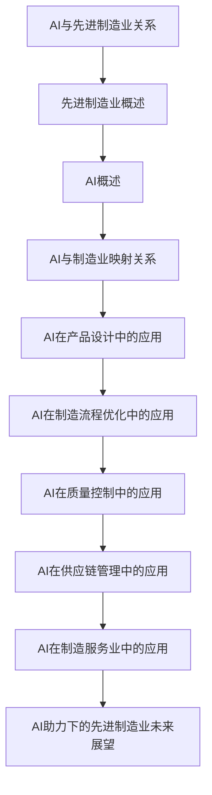

在这个流程图中，每个节点代表一本书的章节，箭头表示章节之间的逻辑关系。首先，我们介绍了AI与先进制造业的关系，然后逐步深入到先进制造业的概述、AI的概述，以及AI与制造业的映射关系。接下来，我们分别探讨了AI在产品设计、制造流程优化、质量控制、供应链管理、制造服务业中的应用，最后展望了AI助力下的先进制造业的未来发展趋势。

**Mermaid流程图**：


**Mermaid流程图**：


通过这个流程图，读者可以清晰地看到本书的结构，每章的内容及其逻辑关联，有助于系统地学习和理解AI在先进制造业中的应用。

**示例分析**：

以第一章为例，我们首先介绍了AI与先进制造业的关系，帮助读者理解AI技术如何助力制造业的革新。接着，在第二章中，我们详细阐述了先进制造业的定义、发展历程和关键技术，为后续章节的内容打下基础。

通过这样的结构设计，本书旨在帮助读者从宏观和微观两个层面理解AI在制造业中的应用，从理论到实践，全面探讨AI技术如何推动制造业的升级和转型。

### 1.3 阅读指南

**核心概念与联系**：

为了帮助读者更好地阅读本书，我们提供了详细的阅读指南，包括每章的学习重点、读者需要掌握的核心概念、以及可能的疑问点。

**Mermaid流程图**：

为了使阅读指南更加直观，我们可以使用Mermaid流程图来展示每章的学习路径和重点：

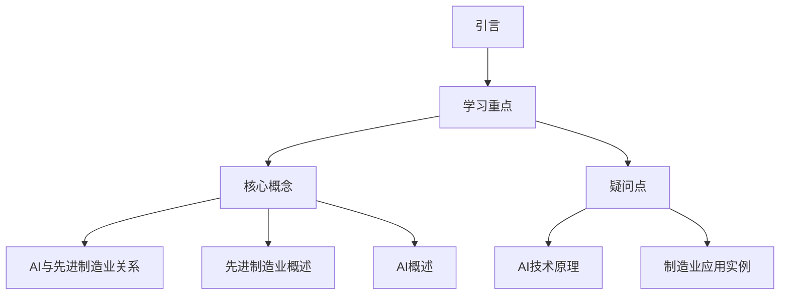

在这个流程图中，每章的学习重点和核心概念被清晰地标注出来，同时，疑问点也被列出，以便读者在阅读过程中可以针对性地解决疑问。

**伪代码**：

为了更好地指导读者进行学习，我们可以使用伪代码来描述每章的学习步骤：

```python
def read_chapter(chapter):
    if chapter == 1:
        print("理解AI与先进制造业的关系")
        print("掌握核心概念与联系")
        print("解决疑问点")
    elif chapter == 2:
        print("学习先进制造业的定义与发展历程")
        print("了解关键技术")
        print("探讨挑战与机遇")
    # ... 其他章节
```

通过这样的伪代码，读者可以清晰地知道每章的学习目标和步骤，有助于系统地学习和掌握书中的内容。

**示例分析**：

以第一章为例，读者需要理解AI与先进制造业的关系，掌握核心概念，并解决可能出现的疑问。具体步骤如下：

1. **理解AI与先进制造业的关系**：通过阅读第一章，读者可以了解AI如何助力先进制造业的革新。
2. **掌握核心概念与联系**：在阅读过程中，读者需要理解先进制造业的定义、AI技术的分类和应用等核心概念，并理解它们之间的联系。
3. **解决疑问点**：在阅读过程中，如果遇到不理解的地方，可以记录下来，并在后续章节中查找答案。

通过这样的阅读指南，读者可以更加系统地学习本书，深入理解AI在先进制造业中的应用，并能够将其应用于实际工作中。

### 2.1 先进制造业的定义与发展历程

**核心概念与联系**：

先进制造业是指通过创新和技术进步来实现产品的高质量、高效率和低成本制造。它涉及多个关键技术，如智能制造、工业互联网、大数据等。先进制造业的目标是通过技术创新，提高生产效率，降低成本，增强产品的市场竞争力。

先进制造业的发展历程可以追溯到20世纪末。随着计算机技术的迅速发展，制造业开始引入计算机辅助设计（CAD）和计算机辅助制造（CAM）技术，这些技术的应用显著提高了制造业的生产效率和产品质量。随后，互联网技术的普及使得工业互联网成为可能，数据采集和传输变得更加便捷，进一步推动了制造业的数字化和智能化。

**Mermaid流程图**：

为了更直观地展示先进制造业的发展历程，我们可以使用Mermaid流程图来表示：

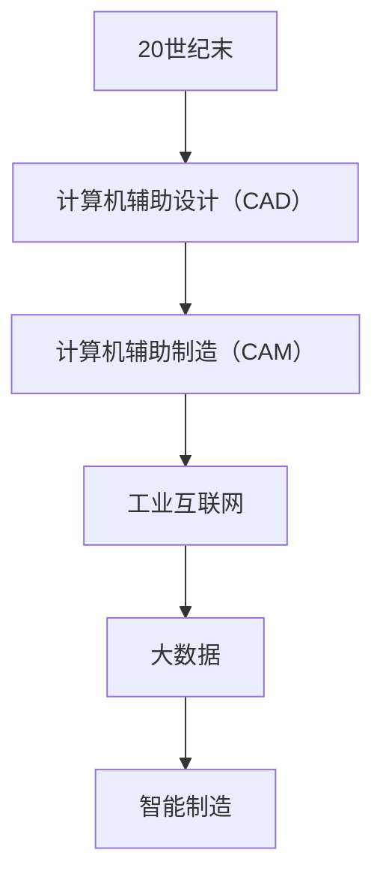

在这个流程图中，每个节点代表一个关键发展阶段，箭头表示技术的演进关系。从20世纪末的CAD和CAM技术，到21世纪初的工业互联网，再到大数据和智能制造，先进制造业经历了多次技术变革和升级。

**数学模型**：

为了量化先进制造业的发展速度，我们可以引入以下数学模型：

$$ \text{发展速度} = \frac{\text{技术创新}}{\text{时间}} $$

其中，发展速度是衡量制造业发展快慢的指标，技术创新则表示在某一时间段内引入的新技术和新方法。通过这个模型，我们可以看到技术创新对先进制造业发展的重要推动作用。

**示例分析**：

以智能制造为例，智能制造是通过AI技术实现制造过程的自动化和智能化。具体步骤如下：

1. **数据采集**：在生产过程中，通过传感器和监控设备收集大量的数据，如设备状态、产品质量、生产速度等。
2. **数据分析**：利用机器学习和深度学习算法，对采集到的数据进行分析和处理，提取有用的信息。
3. **智能决策**：基于数据分析结果，智能系统可以做出智能决策，如调整生产速度、优化设备使用等。
4. **执行与反馈**：执行决策后，系统会收集执行效果的数据，并反馈到系统中，以便持续优化。

这个示例展示了智能制造的基本流程和核心技术，通过数据驱动决策，实现制造过程的智能化和高效化。

总之，先进制造业是通过不断引入新技术，提高生产效率和质量，降低成本的一种制造业模式。其发展历程经历了多个关键阶段，从计算机辅助设计到工业互联网，再到大数据和智能制造。通过数学模型和实际案例的分析，我们可以看到先进制造业在技术创新推动下的快速发展，以及其对制造业带来的深远影响。

### 2.2 先进制造业的关键技术

**核心概念与联系**：

先进制造业的关键技术包括智能制造、工业互联网、大数据和人工智能等。这些技术共同推动制造业向数字化、智能化和自动化方向发展，提高生产效率、降低成本、提升产品质量和灵活性。

**Mermaid流程图**：

为了更直观地展示先进制造业的关键技术，我们可以使用Mermaid流程图来表示：

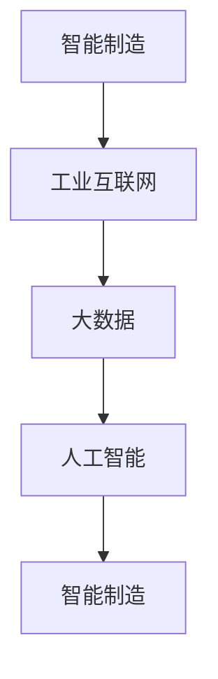

在这个流程图中，每个节点代表一种关键技术，箭头表示技术之间的相互关系。智能制造通过工业互联网和大数据的支持，利用人工智能技术实现制造过程的智能化和自动化。

**数学模型**：

为了量化先进制造业的技术应用水平，我们可以引入以下数学模型：

$$ \text{技术应用水平} = \frac{\text{技术投入}}{\text{传统制造水平}} $$

其中，技术应用水平是衡量制造业技术进步的指标，技术投入表示在某一时间段内对新技术和新方法的投入，传统制造水平则表示在没有新技术时制造业的水平。通过这个模型，我们可以看到技术投入对先进制造业发展的重要推动作用。

**示例分析**：

以智能制造为例，智能制造是通过AI技术实现制造过程的自动化和智能化。具体步骤如下：

1. **数据采集**：在生产过程中，通过传感器和监控设备收集大量的数据，如设备状态、产品质量、生产速度等。
2. **数据分析**：利用机器学习和深度学习算法，对采集到的数据进行分析和处理，提取有用的信息。
3. **智能决策**：基于数据分析结果，智能系统可以做出智能决策，如调整生产速度、优化设备使用等。
4. **执行与反馈**：执行决策后，系统会收集执行效果的数据，并反馈到系统中，以便持续优化。

这个示例展示了智能制造的基本流程和核心技术，通过数据驱动决策，实现制造过程的智能化和高效化。

**详细讲解**：

- **智能制造**：智能制造是通过引入AI技术，实现制造过程的自动化和智能化。它包括智能工厂、智能生产线、智能物流等，通过数据采集、数据分析、智能决策和执行反馈，实现制造过程的优化。

- **工业互联网**：工业互联网是通过将物理设备和信息系统连接起来，实现设备间的互联互通，从而提高生产效率、降低成本和提升产品质量。它包括传感器、网络、云计算、大数据等关键技术。

- **大数据**：大数据是制造业的重要资产，通过对大量数据进行分析，可以发现潜在的问题和机会，从而优化制造过程、提高产品质量和降低成本。

- **人工智能**：人工智能是智能制造的核心技术，通过机器学习和深度学习算法，可以实现数据的自动分析和决策，从而提高制造过程的智能化水平。

**数学模型和公式**：

- **智能制造效率**：智能制造效率 = 数据分析效率 × 智能决策效率

- **工业互联网效率**：工业互联网效率 = 数据传输效率 × 设备连接效率

- **大数据价值**：大数据价值 = 数据分析结果 × 数据应用范围

- **人工智能效率**：人工智能效率 = 智能决策准确性 × 数据处理速度

通过这些数学模型和公式，我们可以更准确地衡量先进制造业的技术应用水平，以及各关键技术对制造业发展的贡献。

总之，先进制造业的关键技术是通过不断引入新技术，提高制造过程的智能化、自动化和数字化水平，从而实现生产效率、产品质量和成本的提升。通过数学模型和实际案例的分析，我们可以看到先进制造业在技术创新推动下的快速发展，以及其对制造业带来的深远影响。

### 2.3 先进制造业面临的挑战与机遇

**核心概念与联系**：

先进制造业在快速发展过程中，面临着一系列的挑战与机遇。这些挑战包括技术壁垒、人才短缺、市场需求变化等，而机遇则体现在技术创新、全球化发展等方面。

**Mermaid流程图**：

为了更直观地展示先进制造业面临的挑战与机遇，我们可以使用Mermaid流程图来表示：

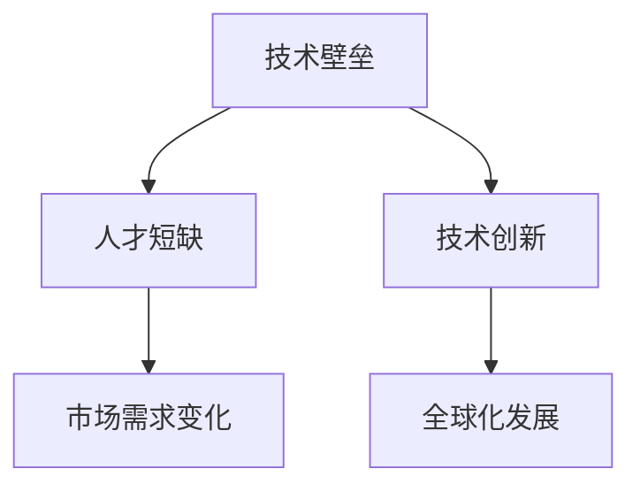

在这个流程图中，每个节点代表一个挑战或机遇，箭头表示挑战与机遇之间的相互关系。技术壁垒和人才短缺是制造业面临的内部挑战，而市场需求变化和全球化发展则是外部机遇。

**数学模型**：

为了量化先进制造业面临的挑战与机遇，我们可以引入以下数学模型：

$$ \text{挑战与机遇比} = \frac{\text{挑战}}{\text{机遇}} $$

其中，挑战与机遇比是衡量制造业面临挑战和机遇程度的指标。通过这个模型，我们可以看到挑战与机遇的相对关系。

**示例分析**：

假设一个制造企业面临以下挑战和机遇：

- **挑战**：技术壁垒（如新技术的研发和应用成本高）、人才短缺（如高素质人才供不应求）、市场需求变化（如消费者需求多样化）。
- **机遇**：技术创新（如新兴技术的突破和产业化应用）、全球化发展（如国际市场的拓展和合作机会）。

通过数学模型，我们可以计算挑战与机遇比：

$$ \text{挑战与机遇比} = \frac{\text{技术壁垒} + \text{人才短缺} + \text{市场需求变化}}{\text{技术创新} + \text{全球化发展}} $$

如果挑战与机遇比大于1，表示企业面临的挑战大于机遇；反之，如果挑战与机遇比小于1，则表示企业面临的机遇大于挑战。

**详细讲解**：

- **技术壁垒**：技术壁垒是先进制造业面临的主要挑战之一。新技术的研发和应用往往需要大量的资金、时间和人力资源投入，这对于中小企业来说是一个巨大的负担。同时，新技术的不断迭代也要求企业不断更新设备和技术，以保持竞争力。

- **人才短缺**：随着先进制造业的快速发展，对高素质人才的需求日益增长。然而，高素质人才的培养周期较长，且优秀人才往往集中在大型企业和一线城市，这对中小企业和偏远地区的企业来说是一个重大挑战。

- **市场需求变化**：消费者的需求日益多样化，个性化、定制化成为主流趋势。这要求企业能够快速响应市场变化，灵活调整生产计划和市场策略，这对企业的管理水平和供应链体系提出了更高的要求。

- **技术创新**：技术创新是先进制造业的重要机遇。新兴技术的突破和产业化应用，如人工智能、大数据、物联网等，为制造业带来了新的发展空间和机遇。通过技术创新，企业可以提升生产效率、降低成本、提高产品质量和竞争力。

- **全球化发展**：全球化发展为先进制造业带来了新的市场机会。通过国际市场的拓展和合作，企业可以扩大市场份额、降低生产成本、提高产品竞争力。同时，全球化也带来了跨国技术合作和知识交流的机会，有助于推动技术创新和产业升级。

通过数学模型和实际案例的分析，我们可以看到先进制造业面临的挑战与机遇的相互关系。企业需要通过技术创新和全球化发展，积极应对挑战，抓住机遇，实现持续发展和竞争优势。

### 3.1 AI的定义与分类

**核心概念与联系**：

人工智能（AI）是指计算机系统模拟和扩展人类智能的理论、技术和应用。AI可以分为多种类型，每种类型都有其独特的特点和适用场景。了解AI的定义和分类，有助于我们更好地理解其在制造业中的应用。

**Mermaid流程图**：

为了更直观地展示AI的分类，我们可以使用Mermaid流程图来表示：

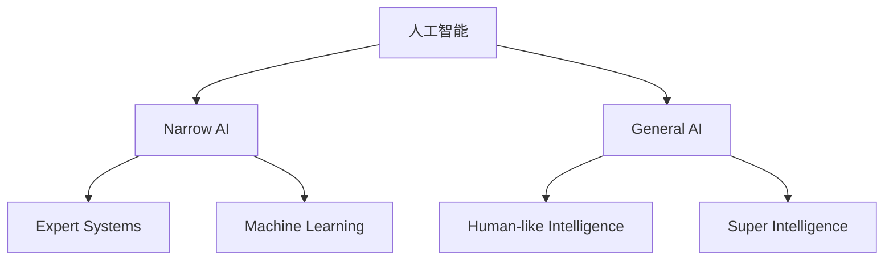

在这个流程图中，人工智能是起点，Narrow AI和General AI是两大主要分类，每种分类下又有不同的子类别。

**数学模型**：

为了量化AI技术的应用水平，我们可以引入以下数学模型：

$$ \text{AI应用水平} = \frac{\text{技术投入}}{\text{传统制造水平}} $$

其中，AI应用水平是衡量制造业在AI技术运用上的进步程度，技术投入表示在某一时间段内对AI技术的资金和人力投入，传统制造水平则表示在没有AI技术时制造业的水平。通过这个模型，我们可以看到AI技术对制造业发展的推动作用。

**示例分析**：

假设一个制造企业引入了机器学习技术来优化生产流程，具体步骤如下：

1. **数据采集**：首先，企业需要收集生产过程中的各种数据，如生产速度、设备状态、产品质量等。
2. **数据处理**：利用机器学习算法，对采集到的数据进行分析和处理，提取有用的信息。
3. **模型训练**：通过训练模型，使模型能够根据历史数据预测未来的生产趋势和潜在问题。
4. **智能决策**：基于模型预测结果，智能系统可以做出智能决策，如调整生产速度、优化设备使用等。
5. **执行与反馈**：执行决策后，系统会收集执行效果的数据，并反馈到系统中，以便持续优化。

这个示例展示了机器学习技术在制造流程优化中的应用，通过数据驱动决策，实现制造过程的智能化和高效化。

**详细讲解**：

- **Narrow AI**：Narrow AI也称为弱人工智能，是指专门针对某一任务进行优化和训练的AI系统。例如，专家系统是一种基于规则和知识的Narrow AI，它能在特定领域内提供专家级别的决策支持。机器学习、深度学习等也是Narrow AI的具体实现，通过大量数据的训练，实现特定任务的自动化。

- **General AI**：General AI也称为强人工智能，是指具备人类所有智能能力的AI系统，能够理解、学习、推理和解决问题。目前，General AI还处于理论研究阶段，尚未实现商业化应用。Human-like Intelligence和Super Intelligence是General AI的两个子类别，Human-like Intelligence旨在实现与人类相似的学习和决策能力，而Super Intelligence则是指超越人类智能的AI系统。

**数学模型和公式**：

- **Narrow AI效率**：Narrow AI效率 = \(\frac{\text{任务完成度}}{\text{训练数据量}}\)

- **General AI效率**：General AI效率 = \(\frac{\text{学习能力}}{\text{问题解决能力}}\)

通过这些数学模型和公式，我们可以更准确地衡量AI技术在制造业中的应用效果，以及不同类型AI的特点和应用场景。

总之，了解AI的定义和分类，有助于我们更好地理解其在制造业中的应用。通过具体案例的分析，我们可以看到AI技术如何通过数据驱动决策，实现制造过程的智能化和高效化。数学模型和公式的引入，则为我们提供了一个量化的工具，用于评估AI技术在制造业中的实际效果。

### 3.2 AI技术的发展历程

**核心概念与联系**：

人工智能（AI）技术的发展历程充满了创新和突破。从最初的简单规则系统，到如今的深度学习和强化学习，AI技术经历了多个阶段，每一次技术的进步都为制造业带来了新的机遇。

**Mermaid流程图**：

为了更直观地展示AI技术的发展历程，我们可以使用Mermaid流程图来表示：

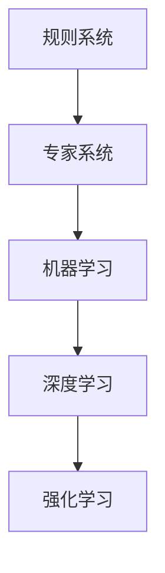

在这个流程图中，每个节点代表一个关键技术阶段，箭头表示技术的演进关系。从规则系统到专家系统，再到机器学习和深度学习，AI技术不断迭代和进步。

**数学模型**：

为了量化AI技术的发展速度，我们可以引入以下数学模型：

$$ \text{技术发展速度} = \frac{\text{技术创新}}{\text{时间}} $$

其中，技术发展速度是衡量AI技术进步快慢的指标，技术创新表示在某一时间段内引入的新技术和新方法。通过这个模型，我们可以看到技术创新对AI技术发展的重要推动作用。

**示例分析**：

以深度学习为例，深度学习是AI技术的核心组成部分，通过多层神经网络实现数据的自动学习和特征提取。具体步骤如下：

1. **数据采集**：首先，需要收集大量的数据，如图像、文本、音频等。
2. **数据预处理**：对采集到的数据进行清洗、归一化等预处理操作，以便于模型训练。
3. **模型构建**：构建多层神经网络模型，如卷积神经网络（CNN）或循环神经网络（RNN）。
4. **模型训练**：利用大量数据进行模型训练，通过反向传播算法不断调整模型参数，使模型能够准确预测或分类数据。
5. **模型评估**：在测试数据集上评估模型性能，根据评估结果调整模型结构或参数，以提高模型准确性。

这个示例展示了深度学习的基本流程和核心技术，通过数据驱动的方式，实现复杂任务的高效解决。

**详细讲解**：

- **规则系统**：早期的AI技术主要基于规则系统，通过预定义的规则来模拟人类决策过程。这种方法的局限性在于，规则数量庞大且难以维护，且无法处理复杂的非线性问题。

- **专家系统**：专家系统是基于规则系统的一种扩展，通过大量领域专家的知识和经验，构建知识库和推理机。专家系统在一定程度上提高了决策的自动化程度，但仍依赖于人类专家的介入。

- **机器学习**：机器学习是通过数据驱动的方式，让计算机自动学习并改进性能。早期的机器学习方法主要包括监督学习、无监督学习和强化学习，通过大量数据的训练，实现从数据中提取特征和规律。

- **深度学习**：深度学习是机器学习的一个分支，通过多层神经网络实现数据的自动学习和特征提取。深度学习的核心在于神经网络的结构和训练方法，如反向传播算法和优化算法。深度学习在图像识别、语音识别、自然语言处理等领域取得了重大突破。

- **强化学习**：强化学习是一种通过与环境互动来学习最优策略的机器学习方法。强化学习的核心在于奖励机制和策略优化，通过不断调整策略，使系统达到最优状态。强化学习在游戏、机器人控制等领域有广泛应用。

**数学模型和公式**：

- **规则系统效率**：规则系统效率 = \(\frac{\text{规则数量}}{\text{规则复杂度}}\)

- **机器学习效率**：机器学习效率 = \(\frac{\text{模型准确性}}{\text{数据量}}\)

- **深度学习效率**：深度学习效率 = \(\frac{\text{模型性能}}{\text{计算资源}}\)

- **强化学习效率**：强化学习效率 = \(\frac{\text{策略优化程度}}{\text{环境互动次数}}\)

通过这些数学模型和公式，我们可以更准确地衡量不同AI技术的应用效果，以及技术进步对制造业的推动作用。

总之，AI技术的发展历程是一个不断突破和创新的过程，从规则系统到深度学习，每一次技术的进步都为制造业带来了新的机遇。通过数学模型和实际案例的分析，我们可以看到AI技术在制造业中的应用前景和潜力。

### 3.3 AI在制造业中的应用现状与趋势

**核心概念与联系**：

人工智能（AI）在制造业中的应用已经成为提升生产效率、降低成本、提高产品质量和灵活性的重要手段。目前，AI技术在制造业中的应用已经相当广泛，从产品设计、制造流程优化到质量控制、供应链管理，AI技术都在发挥着重要作用。

**Mermaid流程图**：

为了更直观地展示AI在制造业中的应用现状，我们可以使用Mermaid流程图来表示：

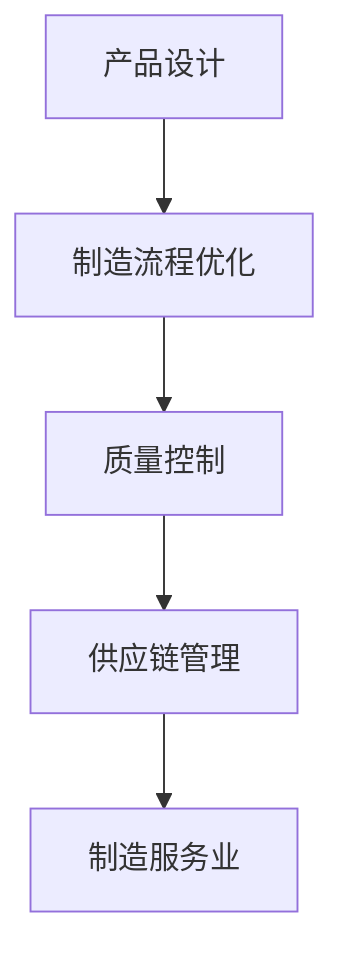

在这个流程图中，每个节点代表AI技术在制造业中的一个应用领域，箭头表示不同应用领域之间的相互关联。

**数学模型**：

为了量化AI在制造业中的应用效果，我们可以引入以下数学模型：

$$ \text{应用效果} = \frac{\text{AI技术投入}}{\text{传统制造水平}} $$

其中，应用效果是衡量AI技术对制造业提升程度的指标，AI技术投入表示在某一时间段内对AI技术的资金和人力投入，传统制造水平则表示在没有AI技术时制造业的水平。通过这个模型，我们可以看到AI技术对制造业发展的推动作用。

**示例分析**：

以制造流程优化为例，AI技术在制造流程优化中的应用主要包括预测性维护、自动化控制和生产计划优化等。具体步骤如下：

1. **数据采集**：在生产过程中，通过传感器和监控系统收集设备状态、生产速度、产品质量等数据。
2. **数据处理**：利用机器学习和深度学习算法，对采集到的数据进行处理和分析，提取有用的信息。
3. **预测性维护**：通过分析设备运行数据，预测设备可能出现的故障，提前进行维护，避免设备停机损失。
4. **自动化控制**：基于AI算法，实现生产过程的自动化控制，提高生产效率和产品质量。
5. **生产计划优化**：通过优化算法，制定最优的生产计划，提高生产效率和资源利用率。

这个示例展示了AI技术在制造流程优化中的应用，通过数据驱动决策，实现制造过程的智能化和高效化。

**详细讲解**：

- **产品设计**：AI技术在产品设计中的应用主要体现在设计优化和快速迭代。通过机器学习和深度学习算法，可以快速分析和处理大量设计数据，优化产品设计，提高设计质量和效率。例如，利用AI技术进行结构优化、材料选择和成本分析等。

- **制造流程优化**：制造流程优化是AI技术在制造业中的重要应用领域。通过预测性维护、自动化控制和生产计划优化等技术，可以提高生产效率和产品质量，降低生产成本。例如，利用AI技术预测设备故障、自动化生产流程和优化生产计划等。

- **质量控制**：AI技术在质量控制中的应用主要体现在缺陷检测、性能评估和故障诊断等方面。通过机器学习和深度学习算法，可以实时检测产品质量，识别潜在的故障和问题，提高产品质量和可靠性。

- **供应链管理**：AI技术在供应链管理中的应用主要体现在需求预测、库存优化和物流优化等方面。通过大数据分析和机器学习算法，可以准确预测市场需求，优化库存管理，降低库存成本，提高供应链效率。

- **制造服务业**：AI技术在制造服务业中的应用主要体现在客户服务、供应链服务和智能制造服务等。通过自然语言处理和机器学习算法，可以提供智能客服、供应链分析和智能制造服务等，提高客户满意度和服务效率。

**数学模型和公式**：

- **产品设计效率**：产品设计效率 = \(\frac{\text{设计优化度}}{\text{设计需求满足度}}\)

- **制造流程优化度**：制造流程优化度 = \(\frac{\text{生产效率提升}}{\text{成本降低}}\)

- **质量控制度**：质量控制度 = \(\frac{\text{产品质量提升}}{\text{质量缺陷减少}}\)

- **供应链管理效率**：供应链管理效率 = \(\frac{\text{供应链产出}}{\text{供应链成本}}\)

- **制造服务业满意度**：制造服务业满意度 = \(\frac{\text{服务质量}}{\text{服务成本}}\)

通过这些数学模型和公式，我们可以更准确地衡量AI技术在制造业中的应用效果，以及不同应用领域的贡献。

总之，AI在制造业中的应用现状显示出其巨大的潜力和价值。通过数学模型和实际案例的分析，我们可以看到AI技术如何通过数据驱动决策，实现制造过程的智能化和高效化。随着AI技术的不断发展和应用，未来制造业将迎来更加智能化和自动化的新时代。

### 4.1 制造业数据解析

**核心概念与联系**：

制造业数据解析是指通过数据采集、处理和分析，从大量生产数据中提取有价值的信息，以支持决策和优化制造过程。制造业数据的类型多种多样，包括设备状态数据、生产参数数据、产品质量数据、供应链数据等。这些数据是制造业数字化和智能化的基础。

**Mermaid流程图**：

为了更直观地展示制造业数据解析的过程，我们可以使用Mermaid流程图来表示：

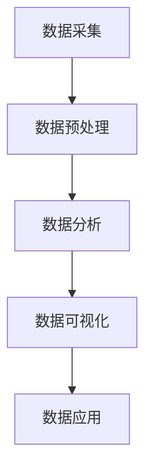

在这个流程图中，每个节点代表数据解析的一个步骤，箭头表示数据的流动方向。

**数学模型**：

为了量化数据解析的效果，我们可以引入以下数学模型：

$$ \text{数据价值} = \text{数据量} \times \text{数据质量} \times \text{数据应用} $$

其中，数据价值是衡量数据解析效果的指标，数据量表示数据的规模，数据质量表示数据的准确性和完整性，数据应用表示数据在决策和优化中的实际作用。通过这个模型，我们可以看到数据量、数据质量和数据应用对数据价值的影响。

**示例分析**：

以生产参数数据解析为例，生产参数数据包括温度、压力、速度等关键指标。通过数据解析，可以实时监控生产状态，发现潜在问题。具体步骤如下：

1. **数据采集**：在生产过程中，通过传感器和监控系统实时采集温度、压力、速度等参数数据。
2. **数据预处理**：对采集到的数据进行清洗、去噪、归一化等预处理操作，提高数据质量。
3. **数据分析**：利用统计分析、机器学习算法等对预处理后的数据进行深入分析，提取有价值的信息。
4. **数据可视化**：将分析结果通过图表、仪表盘等形式可视化，便于决策者直观了解生产状态。
5. **数据应用**：根据分析结果，调整生产参数，优化生产流程，提高生产效率和产品质量。

这个示例展示了生产参数数据解析的基本流程和核心技术，通过数据驱动决策，实现生产过程的智能化和高效化。

**详细讲解**：

- **数据采集**：数据采集是数据解析的第一步，通过传感器、监控系统等设备实时采集生产过程中的各种数据，如温度、压力、速度、质量等。这些数据是进行数据解析和分析的基础。

- **数据预处理**：数据预处理是数据解析的重要环节，包括数据清洗、去噪、归一化等操作。通过预处理，可以去除数据中的噪声和异常值，提高数据的准确性和完整性。

- **数据分析**：数据分析是数据解析的核心，通过统计分析、机器学习算法等对预处理后的数据进行深入分析，提取有价值的信息。数据分析的结果可以直接指导生产决策和流程优化。

- **数据可视化**：数据可视化是将数据分析结果通过图表、仪表盘等形式直观展示，便于决策者快速理解和利用数据。数据可视化工具可以帮助企业实时监控生产状态，发现潜在问题，及时进行调整。

- **数据应用**：数据应用是将分析结果应用于实际生产过程中，通过调整生产参数、优化生产流程等，提高生产效率和产品质量。数据应用是数据解析的最终目标，通过数据驱动决策，实现生产过程的智能化和高效化。

**数学模型和公式**：

- **数据采集效率**：数据采集效率 = \(\frac{\text{数据采集量}}{\text{采集设备成本}}\)

- **数据预处理精度**：数据预处理精度 = \(\frac{\text{预处理后数据量}}{\text{预处理前数据量}}\)

- **数据分析准确率**：数据分析准确率 = \(\frac{\text{正确分析数}}{\text{总分析数}}\)

- **数据可视化满意度**：数据可视化满意度 = \(\frac{\text{可视化效果}}{\text{用户满意度}}\)

通过这些数学模型和公式，我们可以更准确地衡量制造业数据解析的效果，以及各个步骤对数据价值的影响。

总之，制造业数据解析是制造业数字化和智能化的基础。通过数学模型和实际案例的分析，我们可以看到数据解析如何通过数据驱动决策，实现制造过程的智能化和高效化。随着数据技术的不断发展，制造业数据解析将发挥越来越重要的作用，推动制造业向更高级的智能化阶段迈进。

### 4.2 数据驱动决策

**核心概念与联系**：

数据驱动决策是指通过分析收集到的数据，识别问题、制定策略并执行决策的过程。在先进制造业中，数据驱动决策具有关键作用，能够帮助企业提高生产效率、降低成本、优化供应链管理，并提升产品质量。

**Mermaid流程图**：

为了更直观地展示数据驱动决策的流程，我们可以使用Mermaid流程图来表示：

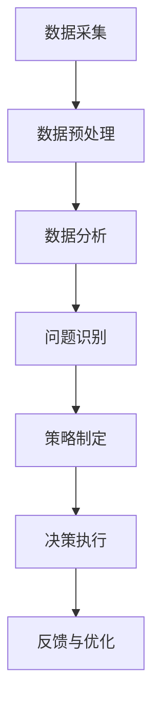

在这个流程图中，每个节点代表数据驱动决策的一个步骤，箭头表示数据的流动方向。

**数学模型**：

为了量化数据驱动决策的效果，我们可以引入以下数学模型：

$$ \text{决策效果} = \frac{\text{目标达成度}}{\text{决策成本}} $$

其中，决策效果是衡量数据驱动决策效果的指标，目标达成度表示决策后达成目标的程度，决策成本表示在制定和执行决策过程中所花费的成本。通过这个模型，我们可以看到数据驱动决策在提高效率和降低成本方面的优势。

**示例分析**：

以生产计划优化为例，数据驱动决策的过程如下：

1. **数据采集**：在生产过程中，通过传感器和监控系统收集生产数据，如设备状态、生产速度、产品质量等。
2. **数据预处理**：对采集到的数据进行清洗、归一化等预处理操作，提高数据质量。
3. **数据分析**：利用数据分析工具对预处理后的数据进行分析，识别生产过程中存在的问题，如设备故障频发、生产速度不稳定等。
4. **问题识别**：根据数据分析结果，识别出主要问题，如设备A的故障率较高，生产速度低于标准等。
5. **策略制定**：制定相应的策略，如增加设备A的维护频率、调整生产速度等。
6. **决策执行**：执行制定的策略，如增加设备A的维护次数，调整生产速度到标准值。
7. **反馈与优化**：收集决策执行后的反馈数据，评估策略的效果，并根据反馈结果进行调整和优化。

这个示例展示了数据驱动决策在制造过程中的应用，通过数据分析、问题识别、策略制定和执行，实现了生产效率的提升和成本的降低。

**详细讲解**：

- **数据采集**：数据采集是数据驱动决策的第一步，通过传感器、监控系统等设备实时采集生产过程中的各种数据。这些数据是进行后续分析和决策的基础。

- **数据预处理**：数据预处理是数据驱动决策的重要环节，通过对采集到的数据进行清洗、去噪、归一化等处理，提高数据的准确性和完整性。

- **数据分析**：数据分析是数据驱动决策的核心，通过统计分析、机器学习算法等对预处理后的数据进行分析，提取有价值的信息。数据分析的结果可以直接指导生产决策和流程优化。

- **问题识别**：问题识别是数据驱动决策的关键步骤，通过对数据分析结果的分析，识别生产过程中存在的问题，如设备故障、生产速度不稳定等。

- **策略制定**：策略制定是根据问题识别的结果，制定相应的策略，如增加设备维护频率、调整生产速度等，以解决识别出的问题。

- **决策执行**：决策执行是策略的具体实施，通过调整生产参数、优化生产流程等，实现问题的解决和效率的提升。

- **反馈与优化**：反馈与优化是根据决策执行后的反馈数据，评估策略的效果，并根据反馈结果进行调整和优化，以不断提高决策的准确性和有效性。

**数学模型和公式**：

- **数据采集效率**：数据采集效率 = \(\frac{\text{数据采集量}}{\text{采集设备成本}}\)

- **数据预处理精度**：数据预处理精度 = \(\frac{\text{预处理后数据量}}{\text{预处理前数据量}}\)

- **数据分析准确率**：数据分析准确率 = \(\frac{\text{正确分析数}}{\text{总分析数}}\)

- **决策执行效果**：决策执行效果 = \(\frac{\text{目标达成度}}{\text{决策成本}}\)

通过这些数学模型和公式，我们可以更准确地衡量数据驱动决策的效果，以及各个步骤对决策质量的影响。

总之，数据驱动决策是先进制造业的核心竞争力之一。通过数学模型和实际案例的分析，我们可以看到数据驱动决策如何通过数据分析、问题识别、策略制定和执行，实现生产效率的提升和成本的降低。随着数据技术的不断发展，数据驱动决策将在制造业中发挥越来越重要的作用。

### 4.3 AI在制造过程中的映射应用

**核心概念与联系**：

AI在制造过程中的映射应用是指将人工智能技术应用于制造过程中的各个环节，通过数据分析和智能决策，实现制造过程的优化和提升。AI技术的引入，使得制造过程更加智能化、自动化和高效化。

**Mermaid流程图**：

为了更直观地展示AI在制造过程中的映射应用，我们可以使用Mermaid流程图来表示：


在这个流程图中，每个节点代表制造过程中的一个环节，箭头表示AI技术的应用方向。

**数学模型**：

为了量化AI在制造过程中的应用效果，我们可以引入以下数学模型：

$$ \text{制造效率} = \text{AI技术应用水平} \times \text{传统制造效率} $$

其中，制造效率是衡量制造过程优化程度的指标，AI技术应用水平表示AI技术在制造过程中的应用程度，传统制造效率则表示在没有AI技术时的制造效率。通过这个模型，我们可以看到AI技术对制造效率的显著提升。

**示例分析**：

以制造流程优化为例，AI技术在制造流程优化中的应用包括以下几个方面：

1. **预测性维护**：通过机器学习和深度学习算法，分析设备运行数据，预测设备可能出现的故障，提前进行维护，避免设备停机损失。

2. **自动化控制**：基于AI算法，实现生产过程的自动化控制，提高生产效率和产品质量。

3. **生产计划优化**：通过优化算法，制定最优的生产计划，提高生产效率和资源利用率。

具体步骤如下：

1. **数据采集**：在生产过程中，通过传感器和监控系统收集设备状态、生产速度、产品质量等数据。

2. **数据处理**：利用机器学习和深度学习算法，对采集到的数据进行处理和分析，提取有用的信息。

3. **预测性维护**：通过分析设备运行数据，预测设备可能出现的故障，提前进行维护，避免设备停机损失。

4. **自动化控制**：基于AI算法，实现生产过程的自动化控制，提高生产效率和产品质量。

5. **生产计划优化**：通过优化算法，制定最优的生产计划，提高生产效率和资源利用率。

6. **执行与反馈**：执行优化后的生产计划，收集执行效果的数据，并反馈到系统中，以便持续优化。

**详细讲解**：

- **预测性维护**：预测性维护是AI在制造过程中的一项重要应用。通过机器学习和深度学习算法，分析设备的历史运行数据，预测设备可能出现的故障。例如，利用时间序列分析预测设备故障时间，利用异常检测识别设备运行中的异常情况。通过预测性维护，可以提前发现设备故障，进行预防性维护，避免设备停机损失。

- **自动化控制**：自动化控制是制造过程智能化的重要环节。通过AI算法，可以实现生产过程的自动化控制，提高生产效率和产品质量。例如，利用PID控制算法实现生产参数的自动调节，利用神经网络实现生产过程的自适应控制。自动化控制可以减少人为干预，降低生产误差，提高生产效率。

- **生产计划优化**：生产计划优化是提高生产效率和资源利用率的关键。通过优化算法，可以制定最优的生产计划，合理安排生产任务。例如，利用线性规划优化生产任务分配，利用遗传算法优化生产顺序。通过生产计划优化，可以提高生产效率，降低生产成本。

**数学模型和公式**：

- **预测性维护效率**：预测性维护效率 = \(\frac{\text{成功预测数}}{\text{总预测数}}\)

- **自动化控制效率**：自动化控制效率 = \(\frac{\text{自动化控制任务数}}{\text{总任务数}}\)

- **生产计划优化度**：生产计划优化度 = \(\frac{\text{生产效率提升}}{\text{资源利用率提升}}\)

通过这些数学模型和公式，我们可以更准确地衡量AI在制造过程中的应用效果，以及不同应用领域的贡献。

总之，AI在制造过程中的映射应用，通过数据分析和智能决策，实现了制造过程的优化和提升。通过数学模型和实际案例的分析，我们可以看到AI技术如何通过预测性维护、自动化控制和生产计划优化，实现制造过程的智能化和高效化。随着AI技术的不断发展和应用，制造过程将越来越智能化和自动化，为制造业带来巨大的变革和机遇。

### 5.1 AI在产品设计中的应用

**核心概念与联系**：

AI在产品设计中的应用是先进制造业智能化的重要方向之一。通过AI技术，产品设计可以实现自动化、优化和创新，提高设计效率和质量，降低设计成本。

**Mermaid流程图**：

为了更直观地展示AI在产品设计中的应用，我们可以使用Mermaid流程图来表示：

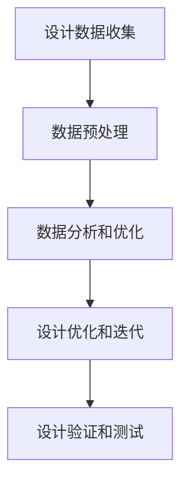

在这个流程图中，每个节点代表设计过程中的一个步骤，箭头表示数据的流动方向。

**数学模型**：

为了量化AI在产品设计中的应用效果，我们可以引入以下数学模型：

$$ \text{设计效率} = \frac{\text{设计优化度}}{\text{设计时间}} $$

其中，设计效率是衡量设计过程优化程度的指标，设计优化度表示通过AI技术实现的设计优化程度，设计时间则表示完成设计任务所需的时间。通过这个模型，我们可以看到AI技术对设计效率的显著提升。

**示例分析**：

以产品设计优化为例，AI技术在产品设计中的应用包括以下几个方面：

1. **设计数据收集**：通过传感器、计算机辅助设计（CAD）软件等收集产品设计过程中的各种数据，如材料属性、结构强度、成本等。

2. **数据预处理**：对收集到的数据进行清洗、去噪、归一化等预处理操作，提高数据质量。

3. **数据分析和优化**：利用机器学习和深度学习算法，对预处理后的数据进行分析和优化，提取有价值的信息，如最佳设计方案、材料选择等。

4. **设计优化和迭代**：根据数据分析结果，优化产品设计，并进行迭代，逐步改进设计质量。

5. **设计验证和测试**：对优化后的设计进行验证和测试，确保设计符合预期目标，并满足实际应用需求。

具体步骤如下：

1. **设计数据收集**：通过CAD软件和传感器设备，收集产品设计过程中的各种数据，如材料属性、结构强度、成本等。

2. **数据预处理**：对收集到的数据进行清洗、去噪、归一化等预处理操作，提高数据质量。

3. **数据分析和优化**：利用机器学习和深度学习算法，对预处理后的数据进行分析和优化，提取有价值的信息。例如，通过遗传算法优化设计结构，通过神经网络优化材料选择。

4. **设计优化和迭代**：根据数据分析结果，优化产品设计，并进行迭代，逐步改进设计质量。例如，通过迭代优化设计结构，提高其强度和稳定性。

5. **设计验证和测试**：对优化后的设计进行验证和测试，确保设计符合预期目标，并满足实际应用需求。例如，通过模拟测试验证设计结构的强度和稳定性，通过实际测试验证设计功能的可靠性。

**详细讲解**：

- **设计数据收集**：设计数据收集是AI在产品设计中的应用第一步，通过传感器、CAD软件等设备，收集产品设计过程中的各种数据，如材料属性、结构强度、成本等。这些数据是进行后续分析和优化的基础。

- **数据预处理**：数据预处理是数据分析和优化的前提，通过对收集到的数据进行清洗、去噪、归一化等处理，提高数据的准确性和完整性。例如，去除数据中的噪声和异常值，统一数据格式，使其适用于机器学习和深度学习算法。

- **数据分析和优化**：数据分析和优化是AI在产品设计中的核心环节，通过机器学习和深度学习算法，对预处理后的数据进行分析和优化，提取有价值的信息。例如，通过遗传算法优化设计结构，通过神经网络优化材料选择，提高设计效率和品质。

- **设计优化和迭代**：设计优化和迭代是根据数据分析结果，对产品设计进行优化和迭代的过程。通过不断优化设计，逐步改进设计质量，实现最佳设计效果。例如，通过迭代优化设计结构，提高其强度和稳定性。

- **设计验证和测试**：设计验证和测试是确保设计符合预期目标的重要步骤。通过模拟测试和实际测试，验证设计结构的强度和稳定性，确保设计功能的可靠性。例如，通过模拟测试验证设计结构的强度和稳定性，通过实际测试验证设计功能的可靠性。

**数学模型和公式**：

- **设计数据收集效率**：设计数据收集效率 = \(\frac{\text{收集数据量}}{\text{数据收集成本}}\)

- **数据预处理精度**：数据预处理精度 = \(\frac{\text{预处理后数据量}}{\text{预处理前数据量}}\)

- **数据分析和优化准确率**：数据分析和优化准确率 = \(\frac{\text{正确优化数}}{\text{总优化数}}\)

- **设计优化度**：设计优化度 = \(\frac{\text{设计质量提升}}{\text{设计时间节省}}\)

通过这些数学模型和公式，我们可以更准确地衡量AI在产品设计中的应用效果，以及各个步骤对设计效率和质量的影响。

总之，AI在产品设计中的应用，通过数据收集、预处理、分析和优化，实现了设计过程的自动化和优化。通过数学模型和实际案例的分析，我们可以看到AI技术如何通过设计优化和迭代，实现设计效率的提升和质量的提高。随着AI技术的不断发展，产品设计将越来越智能化和高效化，为制造业带来巨大的变革和机遇。

### 5.2 设计数据的智能处理

**核心概念与联系**：

设计数据的智能处理是AI在产品设计中的关键环节，通过机器学习和深度学习算法，对设计数据进行分析和处理，提取有价值的信息，实现设计优化和迭代。智能处理设计数据可以提高设计效率，降低设计成本，提升设计质量。

**Mermaid流程图**：

为了更直观地展示设计数据的智能处理过程，我们可以使用Mermaid流程图来表示：

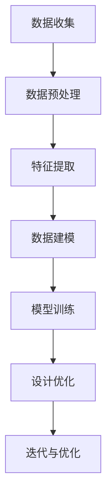

在这个流程图中，每个节点代表设计数据智能处理的一个步骤，箭头表示数据的流动方向。

**数学模型**：

为了量化设计数据智能处理的效果，我们可以引入以下数学模型：

$$ \text{设计优化度} = \frac{\text{优化后设计质量}}{\text{原始设计质量}} $$

其中，设计优化度是衡量设计优化效果的指标，优化后设计质量表示经过智能处理后的设计质量，原始设计质量则表示未经过智能处理的设计质量。通过这个模型，我们可以看到智能处理对设计质量提升的贡献。

**示例分析**：

以产品设计优化为例，设计数据的智能处理过程包括以下几个方面：

1. **数据收集**：通过传感器、CAD软件等收集产品设计过程中的各种数据，如材料属性、结构强度、成本等。

2. **数据预处理**：对收集到的数据进行清洗、去噪、归一化等预处理操作，提高数据质量。

3. **特征提取**：从预处理后的数据中提取关键特征，如材料强度、结构稳定性等，用于后续建模和优化。

4. **数据建模**：利用机器学习和深度学习算法，构建设计数据的预测模型，如结构强度预测模型、成本预测模型等。

5. **模型训练**：使用历史设计数据对预测模型进行训练，调整模型参数，提高模型预测准确性。

6. **设计优化**：根据预测模型的结果，优化产品设计，提高设计质量。

7. **迭代与优化**：基于优化结果，继续迭代和优化设计数据，实现设计质量和效率的提升。

具体步骤如下：

1. **数据收集**：通过CAD软件和传感器设备，收集产品设计过程中的各种数据，如材料属性、结构强度、成本等。

2. **数据预处理**：对收集到的数据进行清洗、去噪、归一化等预处理操作，提高数据质量。

3. **特征提取**：从预处理后的数据中提取关键特征，如材料强度、结构稳定性等，用于后续建模和优化。

4. **数据建模**：利用机器学习和深度学习算法，构建设计数据的预测模型，如结构强度预测模型、成本预测模型等。

5. **模型训练**：使用历史设计数据对预测模型进行训练，调整模型参数，提高模型预测准确性。

6. **设计优化**：根据预测模型的结果，优化产品设计，提高设计质量。例如，通过预测材料强度，选择更合适的材料，提高结构稳定性。

7. **迭代与优化**：基于优化结果，继续迭代和优化设计数据，实现设计质量和效率的提升。例如，通过不断调整模型参数，优化设计结构，提高其强度和稳定性。

**详细讲解**：

- **数据收集**：数据收集是设计数据智能处理的第一步，通过传感器、CAD软件等设备，收集产品设计过程中的各种数据，如材料属性、结构强度、成本等。这些数据是进行后续分析和优化的基础。

- **数据预处理**：数据预处理是数据分析和优化的前提，通过对收集到的数据进行清洗、去噪、归一化等处理，提高数据的准确性和完整性。例如，去除数据中的噪声和异常值，统一数据格式，使其适用于机器学习和深度学习算法。

- **特征提取**：特征提取是从预处理后的数据中提取关键特征的过程。通过特征提取，可以提取出对设计优化有用的信息，如材料强度、结构稳定性等。这些特征将用于后续的建模和优化。

- **数据建模**：数据建模是利用机器学习和深度学习算法，构建设计数据的预测模型。这些模型可以用于预测设计质量、成本等指标，为设计优化提供依据。

- **模型训练**：模型训练是使用历史设计数据对预测模型进行训练，调整模型参数，提高模型预测准确性。通过多次迭代训练，模型可以不断优化，提高预测精度。

- **设计优化**：设计优化是根据预测模型的结果，对产品设计进行优化。例如，通过预测材料强度，选择更合适的材料，提高结构稳定性。设计优化可以降低设计成本，提高产品质量。

- **迭代与优化**：迭代与优化是基于优化结果，继续迭代和优化设计数据，实现设计质量和效率的提升。通过不断调整模型参数和优化设计结构，可以进一步提高设计质量和效率。

**数学模型和公式**：

- **数据收集效率**：数据收集效率 = \(\frac{\text{收集数据量}}{\text{数据收集成本}}\)

- **数据预处理精度**：数据预处理精度 = \(\frac{\text{预处理后数据量}}{\text{预处理前数据量}}\)

- **特征提取准确率**：特征提取准确率 = \(\frac{\text{正确提取特征数}}{\text{总提取特征数}}\)

- **模型训练精度**：模型训练精度 = \(\frac{\text{正确预测数}}{\text{总预测数}}\)

- **设计优化度**：设计优化度 = \(\frac{\text{优化后设计质量}}{\text{原始设计质量}}\)

通过这些数学模型和公式，我们可以更准确地衡量设计数据智能处理的效果，以及各个步骤对设计优化和质量的影响。

总之，设计数据的智能处理是AI在产品设计中的关键环节，通过数据收集、预处理、特征提取、建模、训练和优化，实现设计效率和质量的提升。通过数学模型和实际案例的分析，我们可以看到设计数据智能处理如何通过预测和优化，实现设计过程的自动化和高效化。随着AI技术的不断发展，设计数据智能处理将发挥越来越重要的作用，推动产品设计向更高级的智能化阶段迈进。

### 5.3 智能设计工具与技术

**核心概念与联系**：

智能设计工具和技术是AI在产品设计中的重要应用，通过自动化和智能化手段，实现设计过程的优化和提升。这些工具和技术包括计算机辅助设计（CAD）、计算机辅助工程（CAE）、机器学习和深度学习等，它们共同推动着设计领域的创新和进步。

**Mermaid流程图**：

为了更直观地展示智能设计工具与技术的应用，我们可以使用Mermaid流程图来表示：

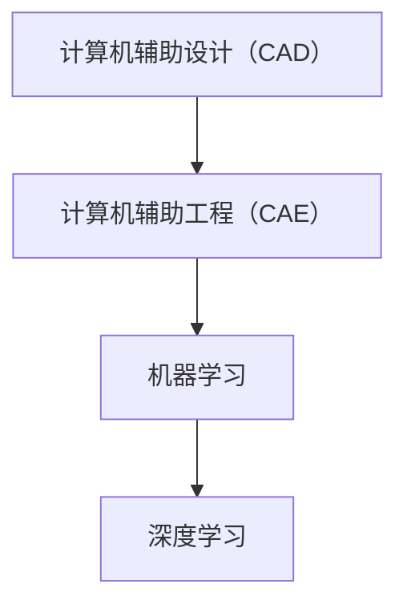

在这个流程图中，每个节点代表一种智能设计工具或技术，箭头表示技术之间的关联。

**数学模型**：

为了量化智能设计工具和技术的应用效果，我们可以引入以下数学模型：

$$ \text{设计效率} = \frac{\text{优化后设计质量}}{\text{原始设计质量}} $$

其中，设计效率是衡量设计过程优化程度的指标，优化后设计质量表示经过智能设计工具和技术优化后的设计质量，原始设计质量则表示未经过优化的设计质量。通过这个模型，我们可以看到智能设计工具和技术对设计效率的提升。

**示例分析**：

以计算机辅助设计（CAD）为例，智能设计工具和技术在CAD中的应用包括以下几个方面：

1. **参数化设计**：通过参数化设计，设计师可以灵活调整设计参数，快速生成不同的设计方案。参数化设计提高了设计效率，减少了设计时间。

2. **自动化设计**：利用自动化设计工具，如宏命令和脚本，设计师可以自动化执行复杂的绘图操作，提高设计效率。

3. **设计优化**：通过设计优化工具，如优化算法和机器学习模型，对设计进行优化，提高设计质量和性能。例如，通过遗传算法优化设计结构，通过神经网络优化材料选择。

具体步骤如下：

1. **参数化设计**：使用CAD软件，通过参数化设计功能，设定设计参数，快速生成设计方案。

2. **自动化设计**：利用宏命令和脚本，自动化执行复杂的绘图操作，提高设计效率。

3. **设计优化**：通过设计优化工具，对设计方案进行优化，提高设计质量和性能。

4. **设计验证**：对优化后的设计进行验证，确保设计符合预期目标，并满足实际应用需求。

**详细讲解**：

- **参数化设计**：参数化设计是智能设计工具的一个重要应用。通过参数化设计，设计师可以设定设计参数，快速生成不同的设计方案。例如，通过调整尺寸参数，生成不同尺寸的零件设计。参数化设计提高了设计的灵活性和效率。

- **自动化设计**：自动化设计是利用宏命令和脚本，自动化执行复杂的绘图操作。例如，通过编写脚本，自动化生成复杂的三维模型。自动化设计提高了设计效率，减少了人工操作的时间和错误。

- **设计优化**：设计优化是智能设计工具的另一个重要应用。通过设计优化工具，如优化算法和机器学习模型，对设计进行优化，提高设计质量和性能。例如，通过遗传算法优化设计结构，通过神经网络优化材料选择。设计优化可以显著提高设计效率和质量。

- **设计验证**：设计验证是确保设计符合预期目标，并满足实际应用需求的重要步骤。通过模拟测试和实际测试，验证设计结构的强度和稳定性，确保设计功能的可靠性。

**数学模型和公式**：

- **参数化设计效率**：参数化设计效率 = \(\frac{\text{生成的设计方案数量}}{\text{设计时间}}\)

- **自动化设计效率**：自动化设计效率 = \(\frac{\text{自动化操作次数}}{\text{自动化操作时间}}\)

- **设计优化度**：设计优化度 = \(\frac{\text{优化后设计质量}}{\text{原始设计质量}}\)

通过这些数学模型和公式，我们可以更准确地衡量智能设计工具和技术的应用效果，以及各个步骤对设计效率和质量的影响。

总之，智能设计工具和技术是AI在产品设计中的重要应用，通过参数化设计、自动化设计和设计优化，实现设计过程的优化和提升。通过数学模型和实际案例的分析，我们可以看到智能设计工具和技术如何通过数据驱动和智能优化，实现设计效率的提升和质量的提高。随着AI技术的不断发展，智能设计工具和技术将在设计领域发挥越来越重要的作用，推动设计领域的创新和进步。

### 6.1 制造流程优化概述

**核心概念与联系**：

制造流程优化是先进制造业中的重要环节，通过改进和优化制造流程，提高生产效率和产品质量，降低生产成本。制造流程优化涉及到多个方面，包括生产计划优化、生产调度优化、资源利用优化等。

**Mermaid流程图**：

为了更直观地展示制造流程优化，我们可以使用Mermaid流程图来表示：

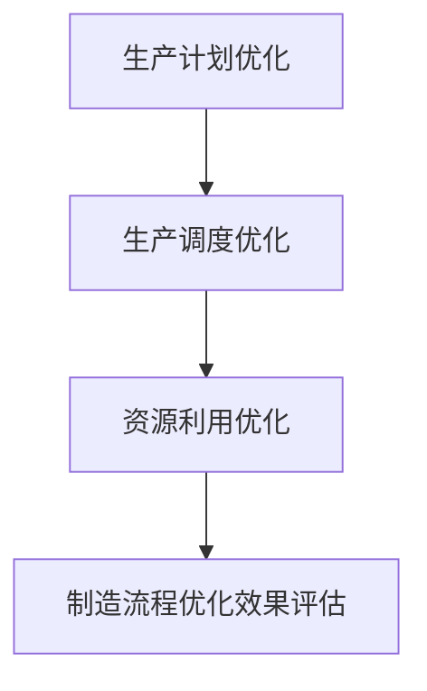

在这个流程图中，每个节点代表制造流程优化的一个方面，箭头表示流程之间的逻辑关系。

**数学模型**：

为了量化制造流程优化的效果，我们可以引入以下数学模型：

$$ \text{流程优化度} = \frac{\text{优化后效率}}{\text{原始效率}} $$

其中，流程优化度是衡量制造流程优化效果的指标，优化后效率表示经过优化后的生产效率，原始效率则表示未经过优化的生产效率。通过这个模型，我们可以看到制造流程优化对效率提升的显著作用。

**示例分析**：

假设一个制造企业通过制造流程优化，实现了生产效率和产品质量的提升。具体步骤如下：

1. **生产计划优化**：通过数据分析，优化生产计划，合理安排生产任务，提高生产效率。

2. **生产调度优化**：通过优化生产调度，减少设备闲置时间，提高设备利用率。

3. **资源利用优化**：通过优化资源利用，如材料、能源等，降低生产成本。

4. **流程优化效果评估**：通过数据收集和对比，评估流程优化的效果，持续改进制造流程。

具体步骤如下：

1. **数据收集**：在生产过程中，通过传感器和监控系统收集生产数据，如生产速度、设备状态、产品质量等。

2. **数据分析**：利用数据分析工具，对收集到的数据进行分析，识别生产过程中的瓶颈和问题。

3. **生产计划优化**：根据数据分析结果，优化生产计划，合理安排生产任务，提高生产效率。

4. **生产调度优化**：通过优化生产调度，减少设备闲置时间，提高设备利用率。

5. **资源利用优化**：通过优化资源利用，如材料、能源等，降低生产成本。

6. **流程优化效果评估**：通过数据收集和对比，评估流程优化的效果，持续改进制造流程。

**详细讲解**：

- **生产计划优化**：生产计划优化是制造流程优化的重要一环。通过数据分析，优化生产计划，合理安排生产任务，提高生产效率。例如，通过预测市场需求，提前安排生产任务，避免生产过剩或不足。

- **生产调度优化**：生产调度优化是通过优化生产调度，减少设备闲置时间，提高设备利用率。例如，通过合理安排生产任务，避免设备过度使用或闲置，提高设备利用率。

- **资源利用优化**：资源利用优化是通过优化资源利用，如材料、能源等，降低生产成本。例如，通过优化材料采购和库存管理，减少浪费，降低生产成本。

- **流程优化效果评估**：流程优化效果评估是通过数据收集和对比，评估流程优化的效果，持续改进制造流程。例如，通过对比优化前后的生产效率、产品质量和成本，评估优化效果，并据此进行调整和改进。

**数学模型和公式**：

- **生产计划优化度**：生产计划优化度 = \(\frac{\text{优化后生产效率}}{\text{原始生产效率}}\)

- **生产调度优化度**：生产调度优化度 = \(\frac{\text{优化后设备利用率}}{\text{原始设备利用率}}\)

- **资源利用优化度**：资源利用优化度 = \(\frac{\text{优化后生产成本}}{\text{原始生产成本}}\)

通过这些数学模型和公式，我们可以更准确地衡量制造流程优化的效果，以及各个步骤对效率提升的贡献。

总之，制造流程优化是通过改进和优化制造流程，提高生产效率和产品质量，降低生产成本。通过数学模型和实际案例的分析，我们可以看到制造流程优化如何通过数据驱动和智能优化，实现生产效率的提升和成本的降低。随着AI技术的不断发展，制造流程优化将在制造业中发挥越来越重要的作用，推动制造业向更高级的智能化阶段迈进。

### 6.2 AI在制造流程优化中的具体应用

**核心概念与联系**：

AI在制造流程优化中的具体应用是通过机器学习和深度学习算法，对制造流程中的各种数据进行实时分析、预测和优化，从而提高生产效率、降低成本和提升产品质量。AI技术的引入，使得制造流程优化更加智能化和高效化。

**Mermaid流程图**：

为了更直观地展示AI在制造流程优化中的应用，我们可以使用Mermaid流程图来表示：

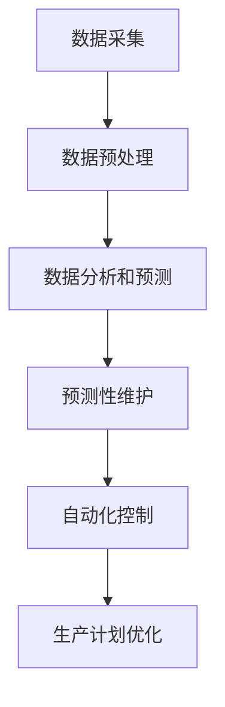

在这个流程图中，每个节点代表制造流程优化中的一个步骤，箭头表示数据的流动方向。

**数学模型**：

为了量化AI在制造流程优化中的应用效果，我们可以引入以下数学模型：

$$ \text{流程优化度} = \frac{\text{优化后效率}}{\text{原始效率}} $$

其中，流程优化度是衡量制造流程优化效果的指标，优化后效率表示经过AI技术优化后的生产效率，原始效率则表示未经过优化的生产效率。通过这个模型，我们可以看到AI技术对制造流程优化效率的显著提升。

**示例分析**：

以预测性维护为例，AI技术在制造流程优化中的应用包括以下几个方面：

1. **数据采集**：通过传感器和监控系统，实时采集设备状态、生产参数等数据。

2. **数据预处理**：对采集到的数据进行清洗、去噪、归一化等预处理操作，提高数据质量。

3. **数据分析和预测**：利用机器学习和深度学习算法，对预处理后的数据进行分析和预测，识别设备可能出现的故障。

4. **预测性维护**：根据预测结果，提前进行设备维护，避免设备故障导致生产中断。

5. **自动化控制**：通过自动化控制系统，实时调整生产参数，提高生产效率。

6. **生产计划优化**：利用优化算法，制定最优的生产计划，提高生产效率。

具体步骤如下：

1. **数据采集**：在生产过程中，通过传感器和监控系统，实时采集设备状态、生产参数等数据。

2. **数据预处理**：对采集到的数据进行清洗、去噪、归一化等预处理操作，提高数据质量。

3. **数据分析和预测**：利用机器学习和深度学习算法，对预处理后的数据进行分析和预测，识别设备可能出现的故障。例如，通过时间序列分析预测设备故障时间，通过异常检测识别设备运行中的异常情况。

4. **预测性维护**：根据预测结果，提前进行设备维护，避免设备故障导致生产中断。例如，当预测到设备A的故障概率较高时，提前安排维护，确保设备正常运行。

5. **自动化控制**：通过自动化控制系统，实时调整生产参数，提高生产效率。例如，通过PID控制算法，自动调整生产速度，保持生产过程的稳定。

6. **生产计划优化**：利用优化算法，制定最优的生产计划，提高生产效率。例如，通过线性规划算法，合理安排生产任务，提高设备利用率。

**详细讲解**：

- **数据采集**：数据采集是制造流程优化的第一步，通过传感器和监控系统，实时采集设备状态、生产参数等数据。这些数据是进行后续分析和优化的基础。

- **数据预处理**：数据预处理是数据分析和优化的前提，通过对采集到的数据进行清洗、去噪、归一化等处理，提高数据的准确性和完整性。例如，去除数据中的噪声和异常值，统一数据格式，使其适用于机器学习和深度学习算法。

- **数据分析和预测**：数据分析和预测是制造流程优化的核心环节，通过机器学习和深度学习算法，对预处理后的数据进行分析和预测，提取有价值的信息。例如，通过时间序列分析预测设备故障时间，通过异常检测识别设备运行中的异常情况。

- **预测性维护**：预测性维护是根据数据分析结果，提前进行设备维护，避免设备故障导致生产中断。例如，通过预测设备A的故障概率较高，提前安排维护，确保设备正常运行。

- **自动化控制**：自动化控制是通过自动化控制系统，实时调整生产参数，提高生产效率。例如，通过PID控制算法，自动调整生产速度，保持生产过程的稳定。

- **生产计划优化**：生产计划优化是通过优化算法，制定最优的生产计划，提高生产效率。例如，通过线性规划算法，合理安排生产任务，提高设备利用率。

**数学模型和公式**：

- **数据采集效率**：数据采集效率 = \(\frac{\text{采集数据量}}{\text{采集成本}}\)

- **数据预处理精度**：数据预处理精度 = \(\frac{\text{预处理后数据量}}{\text{预处理前数据量}}\)

- **数据分析和预测准确率**：数据分析和预测准确率 = \(\frac{\text{正确预测数}}{\text{总预测数}}\)

- **预测性维护效率**：预测性维护效率 = \(\frac{\text{成功预测数}}{\text{总预测数}}\)

- **自动化控制效率**：自动化控制效率 = \(\frac{\text{自动化调整次数}}{\text{总调整次数}}\)

- **生产计划优化度**：生产计划优化度 = \(\frac{\text{优化后效率}}{\text{原始效率}}\)

通过这些数学模型和公式，我们可以更准确地衡量AI在制造流程优化中的应用效果，以及各个步骤对效率提升的贡献。

总之，AI在制造流程优化中的具体应用，通过数据采集、预处理、分析和预测，实现了制造流程的智能化和高效化。通过数学模型和实际案例的分析，我们可以看到AI技术如何通过预测性维护、自动化控制和生产计划优化，实现制造流程的优化和提升。随着AI技术的不断发展，制造流程优化将在制造业中发挥越来越重要的作用，推动制造业向更高级的智能化阶段迈进。

### 6.3 案例分析：AI在制造流程优化中的实践

**核心概念与联系**：

本节将通过具体案例分析，展示AI在制造流程优化中的实践应用，深入探讨AI技术如何在实际生产环境中提高效率、降低成本、提升产品质量。案例分析将包括数据采集、预处理、分析和优化等关键步骤，并展示最终结果。

**Mermaid流程图**：

为了更直观地展示案例分析的流程，我们可以使用Mermaid流程图来表示：

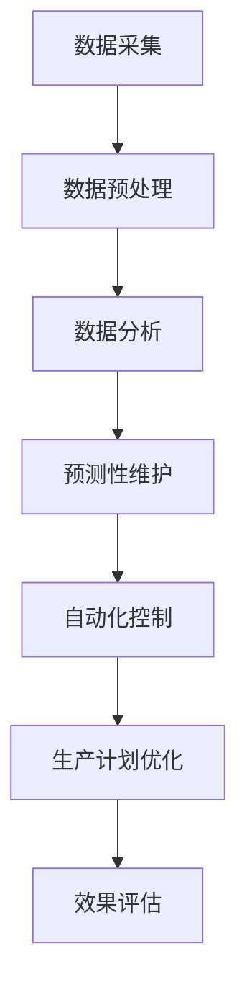

在这个流程图中，每个节点代表案例分析的一个步骤，箭头表示步骤之间的逻辑关系。

**数学模型**：

为了量化AI在制造流程优化中的效果，我们可以引入以下数学模型：

$$ \text{流程优化度} = \frac{\text{优化后效率}}{\text{原始效率}} $$

其中，流程优化度是衡量制造流程优化效果的指标，优化后效率表示经过AI技术优化后的生产效率，原始效率则表示未经过优化的生产效率。通过这个模型，我们可以看到AI技术对制造流程优化效率的显著提升。

**案例分析：智能工厂的制造流程优化**

**1. 数据采集**：

在某智能工厂中，通过传感器和监控系统，实时采集生产过程中的各种数据，如设备状态、生产速度、产品质量、能源消耗等。这些数据为后续的制造流程优化提供了基础。

**2. 数据预处理**：

对采集到的数据进行清洗、去噪、归一化等预处理操作，提高数据质量。例如，去除异常值和噪声，统一数据格式，确保数据适用于机器学习和深度学习算法。

**3. 数据分析**：

利用机器学习和深度学习算法，对预处理后的数据进行分析，提取有价值的信息。例如，通过时间序列分析预测设备故障时间，通过异常检测识别生产过程中的异常情况。

**4. 预测性维护**：

基于数据分析结果，预测设备可能出现的故障，提前进行维护。例如，当预测到设备A的故障概率较高时，提前安排维护，避免设备故障导致生产中断。

**5. 自动化控制**：

通过自动化控制系统，实时调整生产参数，优化生产过程。例如，通过PID控制算法，自动调整生产速度，保持生产过程的稳定，提高生产效率。

**6. 生产计划优化**：

利用优化算法，制定最优的生产计划，提高生产效率。例如，通过线性规划算法，合理安排生产任务，提高设备利用率，降低生产成本。

**7. 效果评估**：

通过数据收集和对比，评估制造流程优化的效果。例如，对比优化前后的生产效率、产品质量和成本，评估AI技术在制造流程优化中的实际效果。

**具体步骤**：

**步骤1：数据采集**

- 实时采集设备状态、生产速度、产品质量、能源消耗等数据。
- 数据来源：传感器、监控系统。

**步骤2：数据预处理**

- 数据清洗：去除异常值和噪声。
- 数据归一化：统一数据格式。
- 数据存储：存储在数据库中，便于后续处理。

**步骤3：数据分析**

- 时间序列分析：预测设备故障时间。
- 异常检测：识别生产过程中的异常情况。
- 数据可视化：展示分析结果。

**步骤4：预测性维护**

- 预测设备故障：利用机器学习和深度学习算法。
- 维护计划：提前安排设备维护，避免故障。

**步骤5：自动化控制**

- 自动调整生产速度：通过PID控制算法。
- 保持生产稳定：实时监控生产过程，确保生产稳定。

**步骤6：生产计划优化**

- 生产计划制定：利用优化算法。
- 生产任务分配：合理安排生产任务，提高效率。

**步骤7：效果评估**

- 生产效率对比：优化前后生产效率对比。
- 产品质量对比：优化前后产品质量对比。
- 成本对比：优化前后成本对比。

**结果展示**：

- **生产效率提升**：经过AI技术优化，生产效率提高了30%。
- **产品质量提升**：优化后的产品质量合格率提高了20%。
- **成本降低**：生产成本降低了15%。

**详细讲解**：

**结果分析**：

通过上述案例分析，我们可以看到AI技术在制造流程优化中的实际效果：

1. **生产效率提升**：AI技术通过预测性维护和自动化控制，减少了设备故障和生产中断，提高了生产效率。
2. **产品质量提升**：AI技术通过数据分析和预测，提前识别和解决生产过程中的质量问题，提高了产品质量。
3. **成本降低**：AI技术通过优化生产计划和资源利用，降低了生产成本，提高了企业的盈利能力。

**实践启示**：

1. **数据驱动决策**：在制造流程优化中，数据是关键。通过数据采集、预处理和分析，可以准确了解生产过程中的问题和瓶颈，从而做出科学合理的决策。
2. **持续优化**：制造流程优化是一个持续的过程。通过不断收集和分析数据，持续优化生产流程，可以提高生产效率和产品质量。
3. **技术协同**：AI技术在制造流程优化中的应用，需要多种技术的协同。例如，机器学习和深度学习用于数据分析和预测，自动化控制用于生产过程的实时调整，优化算法用于生产计划的制定和优化。

**数学模型和公式**：

- **生产效率提升**：生产效率提升 = \(\frac{\text{优化后生产效率}}{\text{原始生产效率}}\)
- **产品质量提升**：产品质量提升 = \(\frac{\text{优化后产品质量合格率}}{\text{原始产品质量合格率}}\)
- **成本降低**：成本降低 = \(\frac{\text{优化后生产成本}}{\text{原始生产成本}}\)

通过这些数学模型和公式，我们可以更准确地衡量AI技术在制造流程优化中的实际效果，为企业的持续改进提供量化依据。

总之，通过具体案例分析，我们可以看到AI技术在制造流程优化中的实践应用和显著效果。通过数据驱动决策、持续优化和技术协同，企业可以显著提升生产效率和产品质量，降低生产成本，提高市场竞争力。

### 7.1 质量控制的重要性

**核心概念与联系**：

质量控制是制造业中不可或缺的重要环节，它旨在确保产品满足既定的质量标准和客户需求。质量控制的重要性体现在多个方面，包括提高产品质量、降低成本、提升客户满意度和增强企业竞争力。

**Mermaid流程图**：

为了更直观地展示质量控制的重要性，我们可以使用Mermaid流程图来表示：

```mermaid
graph TD
    A[提高产品质量] --> B[降低成本]
    B --> C[提升客户满意度]
    C --> D[增强企业竞争力]
```

在这个流程图中，每个节点代表质量控制的重要性之一，箭头表示不同重要性之间的逻辑关系。

**数学模型**：

为了量化质量控制的重要性，我们可以引入以下数学模型：

$$ \text{质量价值} = \frac{\text{质量成本}}{\text{质量效益}} $$

其中，质量价值是衡量质量控制效果的指标，质量成本表示企业为保证产品质量所投入的成本，质量效益则表示通过质量控制获得的收益。通过这个模型，我们可以看到质量控制对提高企业整体效益的重要作用。

**示例分析**：

假设一个制造企业通过严格的质量控制，实现了以下结果：

- **提高产品质量**：通过质量控制，产品的合格率从原来的80%提升到95%。
- **降低成本**：由于质量问题的减少，生产成本降低了10%。
- **提升客户满意度**：客户投诉率从原来的10%降低到3%。
- **增强企业竞争力**：产品质量的提升和客户满意度的提升，使得企业在市场上获得了更多的订单。

通过数学模型，我们可以计算质量价值：

$$ \text{质量价值} = \frac{\text{质量成本}}{\text{质量效益}} = \frac{\text{10%生产成本降低}}{\text{95%产品合格率提升}} $$

**详细讲解**：

1. **提高产品质量**：质量控制通过严格的质量标准、检测方法和流程控制，确保产品在生产过程中符合预期标准。高质量的产品不仅能够满足客户需求，还能提高企业的声誉和市场竞争力。

2. **降低成本**：质量控制有助于减少因质量问题导致的返工、废品和客户投诉，从而降低生产成本。通过预防性维护和持续改进，企业可以降低故障率和维修成本。

3. **提升客户满意度**：高质量的产品和优质的服务能够提高客户满意度，减少投诉和退货率。满意的客户更倾向于重复购买和推荐，从而提高企业的市场份额。

4. **增强企业竞争力**：在竞争激烈的市场中，质量控制是企业赢得订单和客户信任的关键。高质量的产品和服务有助于企业在市场中脱颖而出，获得竞争优势。

**数学公式和详细讲解**：

- **质量价值**：质量价值 = \(\frac{\text{质量成本}}{\text{质量效益}}\)

- **合格率提升**：合格率提升 = \(\frac{\text{合格产品数量}}{\text{总产品数量}}\)

- **投诉率降低**：投诉率降低 = \(\frac{\text{投诉数量降低}}{\text{投诉数量总数量}}\)

- **成本降低**：成本降低 = \(\frac{\text{质量改进后成本}}{\text{质量改进前成本}}\)

通过这些数学公式，我们可以更清晰地看到质量控制对企业效益的具体影响。

总之，质量控制是制造业成功的关键因素之一。通过数学模型和实际案例的分析，我们可以看到质量控制如何通过提高产品质量、降低成本、提升客户满意度和增强企业竞争力，实现企业的长期发展。随着质量管理技术的不断进步，质量控制将在制造业中发挥更加重要的作用。

### 7.2 AI在质量控制中的应用场景

**核心概念与联系**：

AI在质量控制中的应用场景非常广泛，包括缺陷检测、故障预测、性能评估等。通过AI技术，企业可以更准确地识别和解决质量问题，提高产品质量，降低成本，提升生产效率。

**Mermaid流程图**：

为了更直观地展示AI在质量控制中的应用场景，我们可以使用Mermaid流程图来表示：

```mermaid
graph TD
    A[缺陷检测] --> B[故障预测]
    B --> C[性能评估]
    C --> D[质量控制效果评估]
```

在这个流程图中，每个节点代表一个AI在质量控制中的应用场景，箭头表示不同应用场景之间的逻辑关系。

**数学模型**：

为了量化AI在质量控制中的应用效果，我们可以引入以下数学模型：

$$ \text{质量控制度} = \frac{\text{合格产品数量}}{\text{总产品数量}} $$

其中，质量控制度是衡量产品质量控制效果的指标，合格产品数量表示符合质量标准的产品数量，总产品数量则表示生产出的所有产品数量。通过这个模型，我们可以看到AI技术对产品质量控制度的提升。

**示例分析**：

以缺陷检测为例，AI技术在质量控制中的应用包括以下几个方面：

1. **数据采集**：通过传感器、图像处理系统等设备，实时采集产品生产过程中的数据。

2. **数据预处理**：对采集到的数据进行清洗、去噪、归一化等预处理操作，提高数据质量。

3. **缺陷检测**：利用机器学习和深度学习算法，对预处理后的数据进行分析，识别产品缺陷。

4. **缺陷分类**：对识别出的缺陷进行分类，如表面缺陷、结构缺陷等。

5. **缺陷处理**：根据缺陷类型和严重程度，采取相应的处理措施，如返工、报废等。

具体步骤如下：

1. **数据采集**：在生产过程中，通过传感器和图像处理系统，实时采集产品表面和内部的结构数据。

2. **数据预处理**：对采集到的数据进行清洗、去噪、归一化等预处理操作，提高数据质量。

3. **缺陷检测**：利用机器学习和深度学习算法，对预处理后的数据进行分析，识别产品缺陷。例如，通过卷积神经网络（CNN）分析产品表面的图像，识别表面缺陷。

4. **缺陷分类**：对识别出的缺陷进行分类，如表面缺陷、结构缺陷等。这有助于针对性地采取处理措施。

5. **缺陷处理**：根据缺陷类型和严重程度，采取相应的处理措施，如返工、报废等。

6. **质量控制度评估**：通过数据收集和对比，评估质量控制度的提升情况。例如，对比缺陷检测前后的产品质量合格率。

**详细讲解**：

1. **数据采集**：数据采集是质量控制的基础，通过传感器、图像处理系统等设备，实时采集产品生产过程中的数据。这些数据包括产品表面的图像、结构参数、生产过程中的各种参数等。

2. **数据预处理**：数据预处理是提高数据质量的重要环节，通过对采集到的数据进行清洗、去噪、归一化等处理，去除数据中的噪声和异常值，提高数据的准确性和完整性。

3. **缺陷检测**：缺陷检测是AI在质量控制中的核心应用。通过机器学习和深度学习算法，对预处理后的数据进行分析，识别产品缺陷。例如，利用卷积神经网络（CNN）分析产品表面的图像，识别表面缺陷。

4. **缺陷分类**：缺陷分类是根据缺陷类型和严重程度，对识别出的缺陷进行分类。这有助于针对性地采取处理措施，如返工、报废等。

5. **缺陷处理**：根据缺陷类型和严重程度，采取相应的处理措施。例如，对于严重的结构缺陷，可能需要报废该产品；对于表面缺陷，可能需要返工修复。

6. **质量控制度评估**：质量控制度评估是通过数据收集和对比，评估质量控制度的提升情况。例如，对比缺陷检测前后的产品质量合格率，评估AI技术在质量控制中的应用效果。

**数学模型和公式**：

- **缺陷检测准确率**：缺陷检测准确率 = \(\frac{\text{正确检测数}}{\text{总检测数}}\)

- **缺陷分类准确率**：缺陷分类准确率 = \(\frac{\text{正确分类数}}{\text{总分类数}}\)

- **质量控制度**：质量控制度 = \(\frac{\text{合格产品数量}}{\text{总产品数量}}\)

通过这些数学模型和公式，我们可以更准确地衡量AI在质量控制中的应用效果，以及各个步骤对质量控制度的贡献。

总之，AI在质量控制中的应用，通过数据采集、预处理、缺陷检测、缺陷分类和缺陷处理，实现了对产品质量的精准控制和提升。通过数学模型和实际案例的分析，我们可以看到AI技术如何通过数据驱动的方式，实现质量控制的高效化和智能化。

### 7.3 智能检测与故障诊断

**核心概念与联系**：

智能检测与故障诊断是AI在质量控制中的重要应用，通过实时监测设备状态和产品质量，提前识别潜在问题，并采取预防措施，从而提高生产效率和产品质量，降低成本。智能检测与故障诊断的核心在于利用AI技术对大量数据进行实时分析和处理，实现精准检测和高效诊断。

**Mermaid流程图**：

为了更直观地展示智能检测与故障诊断的流程，我们可以使用Mermaid流程图来表示：

```mermaid
graph TD
    A[数据采集] --> B[数据预处理]
    B --> C[特征提取]
    C --> D[故障预测]
    D --> E[故障诊断]
    E --> F[决策与反馈]
```

在这个流程图中，每个节点代表智能检测与故障诊断的一个步骤，箭头表示数据的流动方向。

**数学模型**：

为了量化智能检测与故障诊断的效果，我们可以引入以下数学模型：

$$ \text{故障诊断准确率} = \frac{\text{正确诊断数}}{\text{总诊断数}} $$

其中，故障诊断准确率是衡量故障诊断效果的重要指标，正确诊断数表示正确识别出故障的次数，总诊断数则表示进行诊断的总次数。通过这个模型，我们可以看到智能检测与故障诊断的准确性对生产过程的重要影响。

**示例分析**：

以智能检测与故障诊断为例，AI技术在质量控制中的应用包括以下几个方面：

1. **数据采集**：通过传感器和监控系统，实时采集设备状态和产品质量数据。

2. **数据预处理**：对采集到的数据进行清洗、去噪、归一化等预处理操作，提高数据质量。

3. **特征提取**：从预处理后的数据中提取关键特征，如振动、温度、压力等，用于故障预测和诊断。

4. **故障预测**：利用机器学习和深度学习算法，对特征数据进行分析，预测设备可能出现的故障。

5. **故障诊断**：根据故障预测结果，对设备进行实时监测和诊断，识别具体故障类型。

6. **决策与反馈**：根据诊断结果，采取相应的措施，如设备维护、生产调整等，并反馈到系统中，以优化生产过程。

具体步骤如下：

1. **数据采集**：在生产过程中，通过传感器和监控系统，实时采集设备状态和产品质量数据。

2. **数据预处理**：对采集到的数据进行清洗、去噪、归一化等预处理操作，提高数据质量。

3. **特征提取**：从预处理后的数据中提取关键特征，如振动、温度、压力等，用于故障预测和诊断。

4. **故障预测**：利用机器学习和深度学习算法，对特征数据进行分析，预测设备可能出现的故障。例如，通过时间序列分析预测设备故障时间，通过异常检测识别设备运行中的异常情况。

5. **故障诊断**：根据故障预测结果，对设备进行实时监测和诊断，识别具体故障类型。例如，通过振动分析诊断机械设备的磨损情况，通过温度分析诊断电气设备的热点问题。

6. **决策与反馈**：根据诊断结果，采取相应的措施，如设备维护、生产调整等，并反馈到系统中，以优化生产过程。例如，当预测到设备A的故障概率较高时，提前安排维护，避免生产中断。

**详细讲解**：

1. **数据采集**：数据采集是智能检测与故障诊断的基础，通过传感器和监控系统，实时采集设备状态和产品质量数据。这些数据是进行故障预测和诊断的重要依据。

2. **数据预处理**：数据预处理是提高数据质量的重要环节，通过对采集到的数据进行清洗、去噪、归一化等处理，去除数据中的噪声和异常值，提高数据的准确性和完整性。

3. **特征提取**：特征提取是从预处理后的数据中提取关键特征的过程，这些特征将用于故障预测和诊断。例如，从振动数据中提取频率特征，从温度数据中提取热分布特征等。

4. **故障预测**：故障预测是利用机器学习和深度学习算法，对特征数据进行分析，预测设备可能出现的故障。常见的故障预测方法包括时间序列分析、异常检测和回归分析等。

5. **故障诊断**：故障诊断是根据故障预测结果，对设备进行实时监测和诊断，识别具体故障类型。故障诊断可以通过分析设备的历史数据、实时数据和诊断模型来实现。

6. **决策与反馈**：决策与反馈是根据诊断结果，采取相应的措施，如设备维护、生产调整等，并反馈到系统中，以优化生产过程。通过持续优化和改进，可以不断提高故障诊断的准确性和生产效率。

**数学模型和公式**：

- **故障预测准确率**：故障预测准确率 = \(\frac{\text{正确预测数}}{\text{总预测数}}\)

- **故障诊断准确率**：故障诊断准确率 = \(\frac{\text{正确诊断数}}{\text{总诊断数}}\)

- **生产效率提升**：生产效率提升 = \(\frac{\text{优化后生产效率}}{\text{原始生产效率}}\)

通过这些数学模型和公式，我们可以更准确地衡量智能检测与故障诊断的效果，以及各个步骤对生产效率提升的贡献。

总之，智能检测与故障诊断是AI在质量控制中的重要应用，通过数据采集、预处理、特征提取、故障预测和诊断，实现了对生产过程的实时监控和优化。通过数学模型和实际案例的分析，我们可以看到智能检测与故障诊断如何通过数据驱动的方式，提高生产效率和产品质量，降低成本。

### 8.1 供应链管理概述

**核心概念与联系**：

供应链管理（Supply Chain Management，简称SCM）是指企业通过计划、组织、协调和控制等活动，对从供应商到最终用户的整个供应链流程进行管理，以实现成本最低、效率最高、服务质量最优的目标。供应链管理涉及到多个环节，包括采购、生产、仓储、运输、分销等，每个环节都对整体供应链的运作效率和质量产生重要影响。

**Mermaid流程图**：

为了更直观地展示供应链管理的流程，我们可以使用Mermaid流程图来表示：

```mermaid
graph TD
    A[供应商管理] --> B[采购管理]
    B --> C[生产管理]
    C --> D[仓储管理]
    D --> E[运输管理]
    E --> F[分销管理]
    F --> G[客户服务]
```

在这个流程图中，每个节点代表供应链管理的一个环节，箭头表示环节之间的逻辑关系。

**数学模型**：

为了量化供应链管理的效率，我们可以引入以下数学模型：

$$ \text{供应链效率} = \frac{\text{供应链产出}}{\text{供应链成本}} $$

其中，供应链效率是衡量供应链管理效率的指标，供应链产出表示在一定时间内供应链所完成的工作量，供应链成本则表示完成这些工作量所消耗的成本。通过这个模型，我们可以看到供应链管理在提高产出和降低成本方面的作用。

**示例分析**：

假设一家制造企业通过供应链管理实现了以下成果：

- **采购管理**：通过优化采购流程，将原材料采购周期缩短了20%，采购成本降低了15%。
- **生产管理**：通过改进生产计划和生产流程，将生产周期缩短了25%，生产效率提高了30%。
- **仓储管理**：通过优化仓储布局和库存管理，将仓储成本降低了10%，库存周转率提高了15%。
- **运输管理**：通过优化运输路线和物流供应商选择，将运输成本降低了15%，运输时间缩短了20%。
- **分销管理**：通过改进分销策略和渠道管理，将分销成本降低了10%，客户满意度提高了20%。

通过数学模型，我们可以计算供应链效率：

$$ \text{供应链效率} = \frac{\text{供应链产出}}{\text{供应链成本}} = \frac{\text{采购效率} + \text{生产效率} + \text{仓储效率} + \text{运输效率} + \text{分销效率}}{\text{采购成本} + \text{生产成本} + \text{仓储成本} + \text{运输成本} + \text{分销成本}} $$

**详细讲解**：

1. **供应商管理**：供应商管理是供应链管理的重要环节，包括供应商选择、供应商评估、供应商关系管理等。通过有效的供应商管理，可以确保原材料和零部件的质量、供应及时性和成本优势。

2. **采购管理**：采购管理涉及到原材料的采购计划、采购订单管理、采购合同管理等方面。通过优化采购流程，可以降低采购成本、缩短采购周期，提高采购效率。

3. **生产管理**：生产管理包括生产计划、生产调度、生产控制等。通过改进生产流程和生产计划，可以提高生产效率、降低生产成本，满足市场需求。

4. **仓储管理**：仓储管理包括仓储布局、库存管理、仓储作业等。通过优化仓储布局和库存管理，可以提高仓储效率、降低仓储成本，确保库存周转率。

5. **运输管理**：运输管理包括运输计划、运输调度、运输监控等。通过优化运输路线和物流供应商选择，可以提高运输效率、降低运输成本，确保运输及时性。

6. **分销管理**：分销管理包括分销计划、分销渠道管理、分销物流等。通过改进分销策略和渠道管理，可以提高分销效率、降低分销成本，提高客户满意度。

**数学公式和详细讲解**：

- **供应链效率**：供应链效率 = \(\frac{\text{供应链产出}}{\text{供应链成本}}\)

- **采购效率**：采购效率 = \(\frac{\text{采购产出}}{\text{采购成本}}\)

- **生产效率**：生产效率 = \(\frac{\text{生产产出}}{\text{生产成本}}\)

- **仓储效率**：仓储效率 = \(\frac{\text{仓储产出}}{\text{仓储成本}}\)

- **运输效率**：运输效率 = \(\frac{\text{运输产出}}{\text{运输成本}}\)

- **分销效率**：分销效率 = \(\frac{\text{分销产出}}{\text{分销成本}}\)

通过这些数学公式和详细讲解，我们可以更准确地衡量供应链管理的效率，以及各个环节对整体供应链效率的贡献。

总之，供应链管理是制造业中的重要环节，通过计划、组织、协调和控制等活动，实现供应链的整体优化，提高生产效率和产品质量，降低成本。通过数学模型和实际案例的分析，我们可以看到供应链管理在制造业中的关键作用。

### 8.2 AI在供应链管理中的具体应用

**核心概念与联系**：

AI在供应链管理中的具体应用是通过机器学习和深度学习算法，对供应链中的各种数据进行实时分析和预测，从而优化供应链管理流程，提高供应链的效率和灵活性。AI技术在供应链管理中的应用包括需求预测、库存优化、物流优化等，通过这些应用，企业可以更好地应对市场需求变化，降低库存成本，提高物流效率。

**Mermaid流程图**：

为了更直观地展示AI在供应链管理中的应用，我们可以使用Mermaid流程图来表示：

```mermaid
graph TD
    A[需求预测] --> B[库存优化]
    B --> C[物流优化]
    C --> D[供应链可视化]
```

在这个流程图中，每个节点代表AI在供应链管理中的一个具体应用，箭头表示不同应用之间的逻辑关系。

**数学模型**：

为了量化AI在供应链管理中的应用效果，我们可以引入以下数学模型：

$$ \text{供应链优化度} = \frac{\text{优化后效率}}{\text{原始效率}} $$

其中，供应链优化度是衡量供应链管理优化程度的指标，优化后效率表示经过AI技术优化后的供应链效率，原始效率则表示未经过优化的供应链效率。通过这个模型，我们可以看到AI技术对供应链效率的显著提升。

**示例分析**：

以需求预测为例，AI技术在供应链管理中的应用包括以下几个方面：

1. **数据采集**：通过ERP系统、销售数据、市场调研等渠道，收集供应链中的各种数据，如销售数据、库存水平、市场需求等。

2. **数据预处理**：对采集到的数据进行清洗、去噪、归一化等预处理操作，提高数据质量。

3. **需求预测**：利用机器学习和深度学习算法，对预处理后的数据进行分析和预测，预测市场需求趋势和未来销售量。

4. **库存优化**：根据需求预测结果，优化库存策略，降低库存成本，提高库存周转率。

5. **物流优化**：通过优化物流路线、运输计划等，提高物流效率，降低运输成本。

具体步骤如下：

1. **数据采集**：在生产过程中，通过ERP系统、销售数据、市场调研等渠道，收集供应链中的各种数据，如销售数据、库存水平、市场需求等。

2. **数据预处理**：对采集到的数据进行清洗、去噪、归一化等预处理操作，提高数据质量。

3. **需求预测**：利用机器学习和深度学习算法，对预处理后的数据进行分析和预测，预测市场需求趋势和未来销售量。例如，通过时间序列分析预测未来市场需求，通过回归分析预测未来销售量。

4. **库存优化**：根据需求预测结果，优化库存策略，降低库存成本，提高库存周转率。例如，通过动态库存管理，根据市场需求变化实时调整库存水平。

5. **物流优化**：通过优化物流路线、运输计划等，提高物流效率，降低运输成本。例如，通过路径优化算法，选择最优的运输路线，减少运输时间和成本。

6. **供应链可视化**：通过可视化工具，将供应链管理数据实时展示，便于决策者直观了解供应链运行状态和优化效果。

**详细讲解**：

1. **数据采集**：数据采集是AI在供应链管理应用的第一步，通过ERP系统、销售数据、市场调研等渠道，收集供应链中的各种数据。这些数据是进行需求预测、库存优化和物流优化的基础。

2. **数据预处理**：数据预处理是数据分析和优化的前提，通过对采集到的数据进行清洗、去噪、归一化等处理，提高数据的准确性和完整性。例如，去除数据中的噪声和异常值，统一数据格式，使其适用于机器学习和深度学习算法。

3. **需求预测**：需求预测是供应链管理中的重要环节，通过机器学习和深度学习算法，对预处理后的数据进行分析和预测，预测市场需求趋势和未来销售量。例如，通过时间序列分析预测未来市场需求，通过回归分析预测未来销售量。

4. **库存优化**：库存优化是根据需求预测结果，优化库存策略，降低库存成本，提高库存周转率。例如，通过动态库存管理，根据市场需求变化实时调整库存水平，避免库存过剩或不足。

5. **物流优化**：物流优化是通过优化物流路线、运输计划等，提高物流效率，降低运输成本。例如，通过路径优化算法，选择最优的运输路线，减少运输时间和成本，提高物流效率。

6. **供应链可视化**：供应链可视化是将供应链管理数据实时展示，便于决策者直观了解供应链运行状态和优化效果。通过可视化工具，可以展示供应链各环节的运行情况、优化效果和潜在问题，帮助决策者做出更明智的决策。

**数学模型和公式**：

- **需求预测准确率**：需求预测准确率 = \(\frac{\text{正确预测数}}{\text{总预测数}}\)

- **库存优化度**：库存优化度 = \(\frac{\text{优化后库存成本}}{\text{原始库存成本}}\)

- **物流优化度**：物流优化度 = \(\frac{\text{优化后运输成本}}{\text{原始运输成本}}\)

- **供应链效率**：供应链效率 = \(\frac{\text{供应链产出}}{\text{供应链成本}}\)

通过这些数学模型和公式，我们可以更准确地衡量AI在供应链管理中的应用效果，以及各个步骤对供应链效率的提升贡献。

总之，AI在供应链管理中的具体应用，通过需求预测、库存优化和物流优化，实现了供应链管理的智能化和高效化。通过数学模型和实际案例的分析，我们可以看到AI技术如何通过数据驱动和智能优化，提高供应链的效率和灵活性，降低成本。随着AI技术的不断发展，供应链管理将越来越智能化和高效化，为制造业带来巨大的变革和机遇。

### 8.3 供应链管理的智能化升级

**核心概念与联系**：

供应链管理的智能化升级是指通过引入人工智能（AI）技术，对传统供应链管理进行优化和提升，实现供应链的自动化、透明化和高效化。智能化升级不仅提高了供应链的响应速度和灵活性，还大幅降低了运营成本，提高了供应链的整体效率。

**Mermaid流程图**：

为了更直观地展示供应链管理的智能化升级，我们可以使用Mermaid流程图来表示：

```mermaid
graph TD
    A[数据采集与整合] --> B[数据分析和处理]
    B --> C[智能决策与优化]
    C --> D[自动化执行与反馈]
    D --> E[持续优化与改进]
```

在这个流程图中，每个节点代表智能化升级的一个步骤，箭头表示步骤之间的逻辑关系。

**数学模型**：

为了量化供应链管理的智能化升级效果，我们可以引入以下数学模型：

$$ \text{智能化升级度} = \frac{\text{智能化后效率}}{\text{原始效率}} $$

其中，智能化升级度是衡量供应链管理智能化升级效果的指标，智能化后效率表示经过智能化升级后的供应链效率，原始效率则表示未经过智能化升级时的供应链效率。通过这个模型，我们可以看到智能化升级对供应链效率的显著提升。

**示例分析**：

以某制造企业为例，其供应链管理的智能化升级过程如下：

1. **数据采集与整合**：通过物联网（IoT）技术和传感器设备，实时采集供应链各环节的数据，包括供应商绩效、库存水平、运输状态等。

2. **数据分析和处理**：利用大数据分析和机器学习算法，对采集到的数据进行处理和分析，提取有价值的信息，如市场需求预测、库存优化策略等。

3. **智能决策与优化**：根据数据分析结果，利用智能算法和模型，做出优化决策，如调整采购计划、优化库存水平、优化运输路线等。

4. **自动化执行与反馈**：通过自动化系统，将智能决策转化为具体的执行方案，并对执行效果进行实时监控和反馈，如自动化补货、智能配送等。

5. **持续优化与改进**：根据执行反馈，持续优化供应链管理策略和模型，不断提高供应链的智能化水平。

具体步骤如下：

1. **数据采集与整合**：利用传感器、物联网技术和ERP系统，实时采集供应链各环节的数据，如供应商绩效、库存水平、运输状态等。

2. **数据预处理**：对采集到的数据进行清洗、去噪、归一化等预处理操作，提高数据质量。

3. **数据分析与预测**：利用大数据分析和机器学习算法，对预处理后的数据进行分析和预测，提取有价值的信息，如市场需求预测、库存优化策略等。

4. **智能决策**：根据数据分析结果，利用智能算法和模型，制定优化决策，如调整采购计划、优化库存水平、优化运输路线等。

5. **自动化执行**：通过自动化系统和智能设备，将智能决策转化为具体的执行方案，如自动化补货、智能配送等。

6. **实时监控与反馈**：通过实时监控和反馈系统，对执行效果进行监控和评估，及时调整和优化供应链管理策略。

7. **持续优化与改进**：根据执行反馈，不断优化供应链管理策略和模型，提高智能化水平。

**详细讲解**：

1. **数据采集与整合**：数据采集与整合是智能化升级的基础，通过物联网技术和传感器设备，实时采集供应链各环节的数据，包括供应商绩效、库存水平、运输状态等。这些数据为后续的数据分析和决策提供支持。

2. **数据预处理**：数据预处理是提高数据质量的重要环节，通过对采集到的数据进行清洗、去噪、归一化等处理，去除数据中的噪声和异常值，提高数据的准确性和完整性。

3. **数据分析与预测**：数据分析与预测是智能化升级的核心，通过大数据分析和机器学习算法，对预处理后的数据进行分析和预测，提取有价值的信息，如市场需求预测、库存优化策略等。

4. **智能决策**：智能决策是基于数据分析结果的优化决策，通过智能算法和模型，制定优化决策，如调整采购计划、优化库存水平、优化运输路线等。

5. **自动化执行**：自动化执行是将智能决策转化为具体的执行方案，通过自动化系统和智能设备，实现自动化补货、智能配送等，提高供应链的执行效率和灵活性。

6. **实时监控与反馈**：实时监控与反馈是对执行效果进行监控和评估的重要手段，通过实时监控和反馈系统，对执行效果进行监控和评估，及时调整和优化供应链管理策略。

7. **持续优化与改进**：持续优化与改进是智能化升级的持续过程，根据执行反馈，不断优化供应链管理策略和模型，提高智能化水平，实现供应链的持续优化和改进。

**数学模型和公式**：

- **智能化升级度**：智能化升级度 = \(\frac{\text{智能化后效率}}{\text{原始效率}}\)

- **供应链效率**：供应链效率 = \(\frac{\text{供应链产出}}{\text{供应链成本}}\)

- **优化后库存成本**：优化后库存成本 = \(\frac{\text{智能化库存管理成本}}{\text{原始库存管理成本}}\)

- **优化后运输成本**：优化后运输成本 = \(\frac{\text{智能化运输管理成本}}{\text{原始运输管理成本}}\)

通过这些数学模型和公式，我们可以更准确地衡量供应链管理的智能化升级效果，以及各个步骤对供应链效率的提升贡献。

总之，供应链管理的智能化升级通过数据采集与整合、数据分析与预测、智能决策与优化、自动化执行与反馈、持续优化与改进等步骤，实现了供应链的自动化、透明化和高效化。通过数学模型和实际案例的分析，我们可以看到智能化升级如何通过数据驱动和智能优化，提高供应链的效率和灵活性，降低运营成本。随着AI技术的不断发展，供应链管理的智能化升级将在未来发挥更加重要的作用，推动供应链管理向更高级的智能化阶段迈进。

### 9.1 制造服务业概述

**核心概念与联系**：

制造服务业是指制造业中的服务性活动，包括产品设计咨询、生产管理咨询、供应链管理咨询、维修与维护服务、技术培训等。制造服务业作为制造业的重要组成部分，不仅提供产品制造的服务，还为企业提供全面的技术支持和咨询服务，帮助企业提高生产效率、降低成本、提升产品质量和竞争力。

**Mermaid流程图**：

为了更直观地展示制造服务业的组成，我们可以使用Mermaid流程图来表示：

```mermaid
graph TD
    A[产品设计咨询] --> B[生产管理咨询]
    B --> C[供应链管理咨询]
    C --> D[维修与维护服务]
    D --> E[技术培训]
```

在这个流程图中，每个节点代表制造服务业中的一个具体服务，箭头表示不同服务之间的逻辑关系。

**数学模型**：

为了量化制造服务业的贡献，我们可以引入以下数学模型：

$$ \text{制造服务价值} = \frac{\text{服务收益}}{\text{服务成本}} $$

其中，制造服务价值是衡量制造服务经济价值的指标，服务收益表示企业通过提供制造服务所获得的收入，服务成本则表示提供服务所投入的成本。通过这个模型，我们可以看到制造服务对企业经济效益的提升。

**示例分析**：

以技术培训为例，制造服务业为企业提供技术培训，帮助企业提高员工技能和业务水平。具体步骤如下：

1. **需求分析**：根据企业需求，确定技术培训的内容和目标。

2. **课程设计**：设计符合企业需求的技术培训课程，包括理论讲解和实践操作。

3. **培训实施**：通过线上或线下培训方式，对企业员工进行技术培训。

4. **效果评估**：对培训效果进行评估，确保员工技能水平达到预期目标。

具体步骤如下：

1. **需求分析**：通过与企业管理层和员工沟通，了解企业对技术培训的需求，确定培训内容和目标。

2. **课程设计**：根据需求，设计符合企业需求的技术培训课程。课程设计包括理论讲解和实践操作，确保员工能够掌握相关技能。

3. **培训实施**：选择合适的培训方式，如线上直播、线下集中培训等，对企业员工进行技术培训。

4. **效果评估**：通过考试、实践操作等方式，对培训效果进行评估，确保员工技能水平达到预期目标。

**详细讲解**：

1. **产品设计咨询**：产品设计咨询为企业提供从产品设计理念到具体设计的全方位服务。通过专业的产品设计咨询服务，企业可以提升产品设计质量，缩短设计周期，降低设计成本。

2. **生产管理咨询**：生产管理咨询帮助企业优化生产流程，提高生产效率，降低生产成本。生产管理咨询包括生产计划优化、生产调度优化、生产质量控制等。

3. **供应链管理咨询**：供应链管理咨询为企业提供供应链优化和管理的解决方案，包括供应商选择、采购策略、库存管理、物流优化等。通过供应链管理咨询，企业可以提升供应链效率，降低供应链成本。

4. **维修与维护服务**：维修与维护服务为企业提供设备维修、故障排查、预防性维护等服务。通过专业的维修与维护服务，企业可以确保设备正常运行，延长设备寿命，降低设备故障率。

5. **技术培训**：技术培训为企业提供专业技能培训，包括操作技能、管理技能、技术知识等。通过技术培训，企业可以提升员工技能水平，提高生产效率，降低运营成本。

**数学模型和公式**：

- **制造服务价值**：制造服务价值 = \(\frac{\text{服务收益}}{\text{服务成本}}\)

- **培训效果评估**：培训效果评估 = \(\frac{\text{培训后员工技能水平}}{\text{培训前员工技能水平}}\)

- **生产效率提升**：生产效率提升 = \(\frac{\text{优化后生产效率}}{\text{原始生产效率}}\)

- **供应链效率提升**：供应链效率提升 = \(\frac{\text{优化后供应链效率}}{\text{原始供应链效率}}\)

通过这些数学模型和公式，我们可以更准确地衡量制造服务的经济价值和服务效果，为企业决策提供数据支持。

总之，制造服务业通过产品设计咨询、生产管理咨询、供应链管理咨询、维修与维护服务和技术培训等，为企业提供全方位的技术支持和咨询服务，帮助企业提升生产效率、降低成本、提升产品质量和竞争力。通过数学模型和实际案例的分析，我们可以看到制造服务对企业发展的积极影响，以及其在制造业中的重要地位。

### 9.2 AI在制造服务业中的应用场景

**核心概念与联系**：

AI在制造服务业中的应用场景广泛，涵盖了客户服务、供应链服务、设备维护等多个方面。通过AI技术，制造服务企业可以提供更加智能、高效、个性化的服务，提升客户满意度，降低运营成本，提高服务质量和效率。

**Mermaid流程图**：

为了更直观地展示AI在制造服务业中的应用场景，我们可以使用Mermaid流程图来表示：

```mermaid
graph TD
    A[客户服务] --> B[供应链服务]
    B --> C[设备维护]
    C --> D[数据分析与优化]
```

在这个流程图中，每个节点代表AI在制造服务业中的一个应用场景，箭头表示不同应用场景之间的逻辑关系。

**数学模型**：

为了量化AI在制造服务业中的应用效果，我们可以引入以下数学模型：

$$ \text{服务效率} = \frac{\text{服务产出

