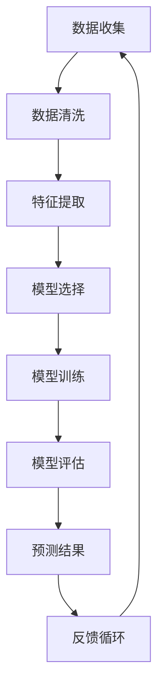
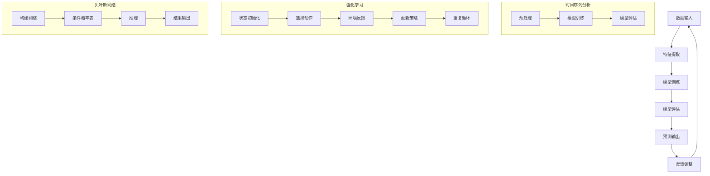

                 

### 《一切皆是映射：AI在金融市场预测中的角色》

#### 关键词：人工智能，金融市场预测，时间序列分析，强化学习，贝叶斯网络，数据隐私，实时预测

##### 摘要：

随着人工智能技术的迅速发展，其在金融市场预测中的应用越来越受到关注。本文从背景概述、基本概念与AI技术基础、核心算法原理与模型架构、数学模型与公式、项目实战与代码解读以及挑战与未来趋势等方面，系统地阐述了AI在金融市场预测中的角色。通过详细的案例分析和技术解析，本文旨在为金融科技从业者和研究者提供有价值的参考，并探讨AI技术在金融市场预测中的潜力与挑战。

## 《一切皆是映射：AI在金融市场预测中的角色》目录大纲

### 第一部分：引言与概述

#### 1.1 书籍背景与目标

- 人工智能与金融市场的关系
- 书籍目标与读者群体

#### 1.2 AI在金融市场预测中的地位

- AI在金融市场中的作用
- 金融市场预测的挑战与机遇

### 第二部分：金融市场基本概念与AI技术基础

#### 2.1 金融市场基础

- 金融市场的构成
- 金融产品与交易机制
- 金融风险管理

#### 2.2 人工智能基础

- 人工智能的发展历程
- 人工智能的核心技术
- 机器学习与深度学习

#### 2.3 AI在金融市场预测中的应用

- AI在金融数据分析中的应用
- AI在风险控制中的应用
- AI在市场预测中的应用

### 第三部分：核心算法原理与模型架构

#### 3.1 时间序列分析

- 时间序列概念与特征
- 时间序列模型
- 伪代码

#### 3.2 强化学习

- 强化学习基础
- 伪代码

#### 3.3 贝叶斯网络

- 贝叶斯网络基础
- 伪代码

#### 3.4 Mermaid流程图

- 金融市场预测流程图
- AI算法应用流程图

### 第四部分：数学模型与公式

#### 4.1 数学模型

- 时间序列模型数学公式
- 强化学习数学公式
- 贝叶斯网络数学公式

#### 4.2 举例说明

- 时间序列模型举例
- 强化学习举例
- 贝叶斯网络举例

### 第五部分：项目实战与代码解读

#### 5.1 实战项目介绍

- 项目背景与目标
- 项目数据集介绍

#### 5.2 环境搭建

- 环境配置与依赖安装

#### 5.3 代码实现

- 数据处理与清洗
- 模型训练与优化
- 模型评估与预测

#### 5.4 代码解读与分析

- 代码逻辑分析
- 性能优化与调整

### 第六部分：挑战与未来趋势

#### 6.1 AI在金融市场预测中的挑战

- 数据隐私与安全
- 模型解释性
- 技术风险与合规

#### 6.2 AI在金融市场预测的未来趋势

- 新兴技术在金融市场中的应用
- 人工智能与传统金融的结合
- 金融市场预测的发展方向

#### 6.3 结论

- 书籍总结
- 对未来金融市场的展望

---

**注：以上目录大纲仅供参考，具体章节内容可根据实际书籍内容进行调整和补充。** 

---

### 1.1 书籍背景与目标

#### 人工智能与金融市场的关系

人工智能（AI）作为当前科技领域的前沿技术，已经深入到众多行业，其中包括金融市场。金融市场的复杂性使得AI技术具有巨大的应用潜力。从股票交易到风险管理，从客户服务到市场预测，AI技术正在为金融市场带来深刻的变革。

金融市场的复杂性主要体现在以下几个方面：

1. **海量数据**：金融市场每天产生大量的数据，包括股票价格、交易量、宏观经济指标等。这些数据不仅数量庞大，而且种类繁多，需要有效的分析方法进行解析。
2. **不确定性**：金融市场受到多种因素的影响，包括宏观经济环境、市场情绪、政策变化等，这些因素使得市场走势难以预测。
3. **时间序列特性**：金融市场的数据通常表现为时间序列形式，这意味着数据点之间存在时间依赖性。传统的数据分析方法难以捕捉这种依赖关系。

#### 书籍目标与读者群体

本书的目标是系统地阐述AI在金融市场预测中的应用，帮助读者理解AI技术在金融市场中的角色和价值。通过本书，读者可以：

1. **了解金融市场的基本概念**：通过本书的第一部分，读者可以了解金融市场的构成、金融产品的交易机制以及金融风险管理的基本原理。
2. **掌握AI技术的基础知识**：本书的第二部分将介绍人工智能的发展历程、核心技术和机器学习与深度学习的基本概念。
3. **理解AI在金融市场预测中的应用**：本书的第三部分将详细探讨AI技术在金融数据分析、风险控制和市场预测中的应用。
4. **学习核心算法原理与模型架构**：本书的第四部分将介绍时间序列分析、强化学习和贝叶斯网络等核心算法的原理和模型架构。
5. **掌握数学模型与公式**：本书的第五部分将通过具体的数学模型和公式，帮助读者深入理解这些算法的实现原理。
6. **通过项目实战提升实践能力**：本书的第六部分将通过一个实际的项目案例，展示如何搭建开发环境、实现模型训练和优化、评估模型性能以及进行预测。

本书的读者群体包括：

1. **金融科技从业者和研究人员**：他们希望了解AI技术在金融市场中的应用，并提高自身的专业素养。
2. **计算机科学和人工智能专业的学生**：他们希望将所学的理论知识应用到实际的金融场景中。
3. **对金融市场和AI技术感兴趣的普通读者**：他们希望通过本书了解AI在金融市场中的前沿应用和潜在价值。

通过本书的阅读，读者不仅可以获得对AI在金融市场预测中角色的全面理解，还可以获得实际操作的能力，为未来的研究和工作奠定坚实的基础。

### 1.2 AI在金融市场预测中的地位

#### AI在金融市场中的作用

人工智能在金融市场中的作用日益凸显，其广泛的应用不仅提高了金融市场的效率和透明度，还为投资者和金融机构带来了新的机遇和挑战。以下是AI在金融市场中的几个关键作用：

1. **数据分析和处理**：金融市场每天产生大量的数据，包括股票价格、交易量、市场指数等。AI技术，特别是机器学习和深度学习，能够从这些海量数据中提取有价值的信息。通过数据挖掘和分析，AI技术可以帮助投资者发现市场趋势和潜在的交易机会。

2. **风险控制**：金融市场的波动性和不确定性使得风险管理成为金融机构的一项重要任务。AI技术能够通过分析历史数据和实时数据，预测市场风险，并采取相应的措施进行风险控制。例如，AI算法可以监测交易行为，识别潜在的欺诈活动，从而保护金融机构的利益。

3. **交易策略优化**：AI技术可以帮助金融机构和投资者制定更有效的交易策略。通过学习历史交易数据和市场动态，AI算法可以预测市场走势，并提供最优的交易决策。这种自动化交易策略不仅可以提高交易的成功率，还可以减少人为错误。

4. **市场预测**：市场预测是金融投资的重要组成部分。AI技术通过分析历史价格走势、交易量、宏观经济指标等数据，可以预测市场未来的走势。这种预测能力对于制定投资策略、调整资产配置具有重要意义。

5. **客户服务与体验**：AI技术还可以提高金融机构的客户服务水平和用户体验。通过自然语言处理和智能客服系统，AI技术可以实时解答客户的问题，提供个性化的金融建议，从而增强客户满意度。

#### 金融市场预测的挑战与机遇

金融市场预测具有以下挑战和机遇：

**挑战**：

1. **数据复杂性**：金融市场数据种类繁多，包括价格、成交量、宏观经济指标等，这些数据之间存在复杂的关联和依赖关系。AI技术需要处理这种复杂的数据结构，以实现准确的预测。

2. **不确定性**：金融市场受到多种因素的影响，包括宏观经济环境、政策变化、市场情绪等。这些因素的不确定性使得市场预测变得复杂和困难。

3. **模型解释性**：金融市场的决策通常需要高度解释性。然而，深度学习等复杂的AI模型往往具有低解释性，这使得决策者难以理解模型背后的逻辑。

4. **合规性**：金融市场受到严格的法律法规约束，例如反洗钱（AML）、市场操纵限制等。AI模型的应用需要遵守这些合规要求，以避免法律风险。

**机遇**：

1. **实时预测**：随着计算能力的提升和大数据技术的发展，AI技术可以实现更快速的实时预测。这有助于金融机构及时调整策略，抓住市场机会。

2. **自动化交易**：AI技术可以自动化交易决策，减少人为干预。这不仅可以提高交易效率，还可以减少交易成本和风险。

3. **个性化服务**：AI技术可以根据客户的历史交易数据和行为，提供个性化的金融建议和服务，从而提高客户满意度和忠诚度。

4. **新兴技术应用**：区块链、联邦学习等新兴技术为AI在金融市场预测中的应用提供了新的机会。这些技术不仅可以提高数据的安全性和隐私性，还可以增强预测模型的准确性。

总之，AI技术在金融市场预测中的应用具有巨大的潜力。尽管面临诸多挑战，但通过不断创新和优化，AI技术将为金融市场带来更多的机遇和可能性。对于金融科技从业者和研究者来说，深入了解AI技术在金融市场预测中的应用，将有助于把握市场趋势，实现更好的投资回报。

### 2.1 金融市场基础

#### 金融市场的构成

金融市场是由各种金融工具、交易机制和市场参与者组成的复杂系统。以下是金融市场的几个关键组成部分：

1. **金融工具**：金融工具是指用于金融交易的标准化合同，如股票、债券、期货、期权等。这些工具具有不同的风险和收益特性，可以满足不同投资者的需求。

2. **交易机制**：金融市场中的交易机制决定了买卖双方如何进行交易。常见的交易机制包括拍卖机制、双边市场和做市商机制。这些机制确保了市场的公平、透明和高效运行。

3. **市场参与者**：金融市场中的主要参与者包括投资者、金融机构、监管机构等。投资者通过购买或出售金融工具进行投资和交易，金融机构则提供金融服务和交易支持，监管机构则负责维护市场秩序和保护投资者利益。

#### 金融产品与交易机制

金融产品是金融市场的基本组成部分，其种类繁多，包括以下几种：

1. **股票**：股票是公司股份的证明，股票市场是股票交易的主要场所。股票价格反映了公司的经营状况和市场预期。

2. **债券**：债券是一种债务工具，债券持有人是公司的债权人。债券市场是债券交易的主要场所，债券价格受市场利率和公司信用评级的影响。

3. **期货**：期货是一种衍生品，代表在未来某一时间点以特定价格买入或卖出某种资产。期货市场提供了对冲风险和投机的机会。

4. **期权**：期权是一种赋予持有人在特定时间内以特定价格买入或卖出某种资产的权利。期权市场为投资者提供了灵活的交易策略。

金融交易机制主要包括以下几种：

1. **拍卖机制**：拍卖机制是通过竞价来确定金融工具交易价格的过程。在股票市场中，拍卖机制通过电子交易系统实现。

2. **双边市场**：双边市场是指买卖双方通过交易平台直接进行交易。交易价格由供需双方决定，交易过程高效、透明。

3. **做市商机制**：做市商是在市场中提供买卖双边报价的金融机构。做市商通过提供流动性和报价，确保市场交易的连续性和稳定性。

#### 金融风险管理

金融风险管理是金融机构和投资者确保财务安全的重要手段。以下是金融风险管理的几个关键方面：

1. **市场风险**：市场风险是指由于市场价格波动导致的投资损失风险。市场风险可以通过分散投资、对冲策略和风险模型进行管理。

2. **信用风险**：信用风险是指由于借款人违约导致的贷款损失风险。金融机构通过信用评级、风险评估和抵押物管理来降低信用风险。

3. **流动性风险**：流动性风险是指无法在合理时间内以合理的价格卖出资产的风险。金融机构通过持有高流动性资产和流动性管理策略来降低流动性风险。

4. **操作风险**：操作风险是指由于内部流程、人员操作或系统故障导致的损失风险。金融机构通过建立健全的内部控制和风险管理机制来降低操作风险。

总之，金融市场的基础包括金融工具、交易机制和市场参与者。金融产品与交易机制共同构成了金融市场的运行框架。金融风险管理则是确保金融市场稳定和投资者安全的关键。在本文的后续章节中，我们将进一步探讨AI技术在金融市场中的应用，包括数据分析和处理、风险控制和市场预测等方面。

### 2.2 人工智能基础

#### 人工智能的发展历程

人工智能（AI）作为计算机科学的一个重要分支，其发展历程可以追溯到20世纪50年代。以下是人工智能的主要发展历程：

1. **早期探索（1956-1969）**：1956年，约翰·麦卡锡（John McCarthy）等人在达特茅斯会议上首次提出了“人工智能”这一概念，标志着人工智能领域的诞生。这一时期的AI研究主要集中在符号逻辑和知识表示上。

2. **黄金时代（1970-1989）**：在1970年代，人工智能研究取得了显著进展，特别是专家系统的发展。专家系统通过模拟人类专家的决策过程，在医学诊断、化学分析等领域取得了成功。然而，由于计算能力和数据资源的限制，这一时期的AI研究逐渐陷入了“人工智能冬天”。

3. **复兴与互联网时代（1990-2000）**：随着计算机硬件性能的提升和互联网的普及，人工智能在1990年代迎来了新的复兴。机器学习和数据挖掘技术的发展，使得AI在语音识别、图像识别和自然语言处理等领域取得了突破性进展。

4. **深度学习时代（2000年至今）**：2006年，杰弗里·辛顿（Geoffrey Hinton）等学者提出了深度学习（Deep Learning）的概念，深度神经网络在这一时期取得了显著的进展。深度学习在计算机视觉、自然语言处理和语音识别等领域取得了重大突破，推动了人工智能技术的快速发展。

#### 人工智能的核心技术

人工智能的核心技术包括机器学习、深度学习和自然语言处理等。以下是这些核心技术的基本概念和特点：

1. **机器学习（Machine Learning）**：机器学习是一种让计算机从数据中自动学习和改进的技术。通过算法，机器学习可以从历史数据中学习模式和规律，并在新的数据上进行预测和决策。

   - **监督学习（Supervised Learning）**：监督学习算法通过已有标记的数据进行训练，以便在新的数据上进行预测。常见的监督学习算法包括线性回归、决策树和支持向量机等。
   
   - **无监督学习（Unsupervised Learning）**：无监督学习算法在没有标记数据的情况下进行训练，旨在发现数据中的模式和结构。常见的无监督学习算法包括聚类分析和主成分分析等。

2. **深度学习（Deep Learning）**：深度学习是一种基于多层神经网络的机器学习技术。通过多层的神经网络，深度学习可以从大量数据中自动提取复杂的特征和模式。

   - **卷积神经网络（CNN，Convolutional Neural Networks）**：CNN是一种用于图像识别和处理的深度学习模型，其通过卷积操作和池化操作提取图像中的特征。
   
   - **循环神经网络（RNN，Recurrent Neural Networks）**：RNN是一种用于序列数据处理的深度学习模型，其通过循环结构处理历史信息，适用于自然语言处理和时间序列预测等任务。

3. **自然语言处理（NLP，Natural Language Processing）**：自然语言处理是一种使计算机能够理解、生成和处理自然语言的技术。

   - **词嵌入（Word Embedding）**：词嵌入是将单词映射到高维空间中，以便进行语义分析和文本分类。
   
   - **序列到序列模型（Seq2Seq，Sequence-to-Sequence Models）**：Seq2Seq模型是一种用于机器翻译和对话系统的深度学习模型，其通过编码器和解码器处理序列数据。

#### 机器学习与深度学习的关系

机器学习和深度学习是人工智能领域的两个重要分支，它们之间存在密切的联系和区别：

- **关系**：深度学习是机器学习的一个子领域，其通过多层神经网络实现复杂特征的学习和提取。深度学习通常在具有大量数据和强大计算能力的情况下表现优异。

- **区别**：机器学习包括多种算法和技术，不仅限于深度学习。深度学习通常涉及更复杂的模型和更大量的数据，而传统的机器学习算法在数据处理和模型复杂度方面较为简单。

总之，人工智能的发展历程展示了其从早期探索到深度学习时代的演变过程。人工智能的核心技术，包括机器学习和深度学习，为AI在各个领域的应用提供了强大的支持。在金融市场中，这些技术正被广泛应用于数据分析和处理、风险控制和市场预测等方面，为金融科技的发展带来了新的机遇。

### 2.3 AI在金融市场预测中的应用

#### AI在金融数据分析中的应用

人工智能技术在金融数据分析中的应用主要体现在以下几个方面：

1. **数据处理与清洗**：金融市场每天产生大量数据，包括股票价格、交易量、宏观经济指标等。AI技术，特别是机器学习和深度学习，可以自动化地进行数据处理和清洗，识别和纠正数据中的错误和异常值，确保数据的质量和一致性。

   - **自动化数据预处理**：使用机器学习算法对大量金融数据进行自动化处理，包括数据清洗、去重、缺失值填充等。例如，使用K均值聚类算法识别并处理重复交易记录，使用线性回归模型预测并填充缺失的交易数据。

2. **特征工程**：特征工程是金融数据分析中至关重要的一环。通过AI技术，可以自动提取和选择与预测目标相关的特征，提高模型预测的准确性和效率。

   - **自动特征提取**：利用深度学习模型，如卷积神经网络（CNN）和循环神经网络（RNN），可以从原始数据中提取复杂的特征。例如，使用CNN提取股票价格图像中的特征，使用RNN处理时间序列数据中的周期性特征。

3. **趋势分析**：AI技术可以通过分析历史数据，识别市场趋势和周期性变化，为投资决策提供支持。

   - **时间序列分析**：使用自回归模型（AR）、移动平均模型（MA）和自回归移动平均模型（ARMA）等时间序列分析方法，分析股票价格的波动趋势。例如，使用ARIMA模型预测未来几天的股票价格走势。

#### AI在风险控制中的应用

风险控制是金融市场中的一项重要任务，AI技术在风险控制中的应用主要体现在以下几个方面：

1. **欺诈检测**：AI技术可以通过分析交易行为和历史数据，识别和预防潜在的欺诈行为。

   - **行为分析**：使用机器学习算法，如支持向量机（SVM）和随机森林（Random Forest），分析用户的交易行为，识别异常交易模式。例如，使用SVM分类器检测信用卡欺诈交易。

2. **市场风险预测**：AI技术可以通过分析市场数据和宏观经济指标，预测市场风险，并采取相应的措施进行风险控制。

   - **风险模型构建**：使用深度学习模型，如深度神经网络（DNN）和卷积神经网络（CNN），构建市场风险预测模型。例如，使用DNN模型预测股票市场的波动性。

3. **信用评分**：AI技术可以通过分析用户的信用历史和财务数据，进行信用评分，为金融机构提供信用风险评估依据。

   - **信用评分模型**：使用机器学习算法，如逻辑回归和决策树，构建信用评分模型。例如，使用逻辑回归模型预测借款人的信用评分。

#### AI在市场预测中的应用

AI技术在市场预测中的应用主要体现在以下几个方面：

1. **股票价格预测**：AI技术可以通过分析历史价格数据、交易量、宏观经济指标等，预测股票价格的走势。

   - **时间序列模型**：使用时间序列分析方法，如ARIMA模型和LSTM（长短时记忆）模型，预测股票价格。例如，使用ARIMA模型预测未来几天的股票收盘价。

2. **趋势分析**：AI技术可以通过分析市场数据和交易数据，识别市场趋势和交易机会。

   - **趋势识别**：使用机器学习算法，如线性回归和神经网络，分析市场数据，识别市场趋势。例如，使用线性回归模型分析股票价格与交易量之间的关系。

3. **交易策略优化**：AI技术可以帮助投资者制定和优化交易策略，提高投资回报。

   - **策略优化**：使用强化学习算法，如Q学习和深度Q网络（DQN），优化交易策略。例如，使用DQN模型进行交易策略的自动优化。

总之，AI技术在金融数据分析、风险控制和市场预测中的应用，为金融市场的投资决策提供了有力的支持。通过利用AI技术，金融机构和投资者可以更有效地处理海量数据，识别市场趋势，降低风险，提高投资回报。

### 3.1 时间序列分析

#### 时间序列概念与特征

时间序列（Time Series）是指按时间顺序排列的一组数据点，这些数据点反映了某个变量随时间变化的情况。时间序列分析是统计学和数据分析中的一个重要分支，其目的是从时间序列数据中提取有用信息，如趋势、季节性、周期性等，从而进行预测和决策。

时间序列数据通常具有以下几个特征：

1. **趋势性（Trend）**：趋势性是指时间序列数据随时间呈现的增长或减少的趋势。长期来看，时间序列数据可能会向上或向下移动，这种移动称为趋势。
2. **季节性（Seasonality）**：季节性是指时间序列数据中的周期性波动，这些波动通常与季节性因素（如节假日、季节性购买等）相关。例如，零售业在圣诞节期间的销售额通常会上升。
3. **随机性（Randomness）**：随机性是指时间序列数据中无法预测的波动，这些波动可能是由于未知或随机因素引起的。

#### 时间序列模型

时间序列模型（Time Series Models）是一种用于分析和预测时间序列数据的统计模型。常见的时序模型包括：

1. **自回归模型（AR，Autoregressive Model）**：自回归模型假设当前值可以通过过去若干个时间点的值来预测。其数学公式为：
   $$
   y_t = c + \alpha_1 y_{t-1} + \alpha_2 y_{t-2} + \ldots + \alpha_p y_{t-p} + \epsilon_t
   $$
   其中，$y_t$ 是当前时间步的数值，$c$ 是常数项，$\alpha_1, \alpha_2, \ldots, \alpha_p$ 是自回归系数，$\epsilon_t$ 是误差项。
   
2. **移动平均模型（MA，Moving Average Model）**：移动平均模型假设当前值可以通过过去若干个时间点的平均值来预测。其数学公式为：
   $$
   y_t = c + \theta_1 \epsilon_{t-1} + \theta_2 \epsilon_{t-2} + \ldots + \theta_q \epsilon_{t-q} + \epsilon_t
   $$
   其中，$c$ 是常数项，$\theta_1, \theta_2, \ldots, \theta_q$ 是移动平均系数，$\epsilon_t$ 是误差项。

3. **自回归移动平均模型（ARMA，Autoregressive Moving Average Model）**：自回归移动平均模型结合了自回归模型和移动平均模型的特点，其数学公式为：
   $$
   y_t = c + \alpha_1 y_{t-1} + \alpha_2 y_{t-2} + \ldots + \alpha_p y_{t-p} + \theta_1 \epsilon_{t-1} + \theta_2 \epsilon_{t-2} + \ldots + \theta_q \epsilon_{t-q} + \epsilon_t
   $$
   其中，$c$ 是常数项，$\alpha_1, \alpha_2, \ldots, \alpha_p$ 是自回归系数，$\theta_1, \theta_2, \ldots, \theta_q$ 是移动平均系数，$\epsilon_t$ 是误差项。

4. **自回归积分移动平均模型（ARIMA，Autoregressive Integrated Moving Average Model）**：自回归积分移动平均模型在ARMA模型的基础上引入了差分操作，以应对非平稳时间序列数据。其数学公式为：
   $$
   (1 - \phi_1 B)(1 - \theta_1 B)y_t = c + \epsilon_t
   $$
   其中，$B$ 是滞后算子，$\phi_1, \theta_1, \ldots, \phi_p, \theta_q$ 是ARIMA模型的参数，$c$ 是常数项，$\epsilon_t$ 是误差项。

#### 伪代码

以下是一个简单的自回归模型（AR）的伪代码示例：

```python
# 自回归模型伪代码

def train_ar_model(data, order):
    # 初始化模型参数
    alpha = [0] * order
    # 使用最小二乘法计算自回归系数
    for i in range(1, order + 1):
        X = data.shift(i)
        Y = data
        model = LinearRegression()
        model.fit(X, Y)
        alpha[-i] = model.coef_
    return alpha

def predict_ar_model(data, alpha, order):
    # 预测未来值
    predictions = []
    for i in range(order, len(data)):
        prediction = sum(alpha[j] * data[i - j] for j in range(order))
        predictions.append(prediction)
    return predictions

# 训练模型
alpha = train_ar_model(data['close_price'], order=1)

# 预测未来价格
predictions = predict_ar_model(data['close_price'], alpha, order=1)
```

在这个伪代码中，`train_ar_model`函数用于训练自回归模型，`predict_ar_model`函数用于预测未来值。模型使用最小二乘法计算自回归系数，并使用这些系数进行预测。

通过上述时间序列模型和方法，我们可以更好地理解和预测金融市场的动态变化，为投资者提供有效的决策支持。

### 3.2 强化学习

强化学习（Reinforcement Learning，RL）是一种通过不断试错和反馈来学习最优策略的机器学习方法。在金融市场预测中，强化学习可以用于优化交易策略、风险管理以及市场预测等任务。以下是强化学习的基础概念、原理和应用。

#### 强化学习基础

强化学习的基本组成部分包括：

1. **代理（Agent）**：执行动作并接收奖励的实体。
2. **环境（Environment）**：代理执行动作的上下文。
3. **状态（State）**：代理当前所处的情境。
4. **动作（Action）**：代理可以执行的行为。
5. **奖励（Reward）**：代理执行动作后获得的即时反馈。

强化学习的目标是学习一个策略（Policy），该策略最大化长期回报（Return）。策略表示为 $π(a|s)$，即给定状态 $s$ 下执行动作 $a$ 的概率。

#### 强化学习原理

强化学习的基本原理是通过试错来学习最优策略。具体过程如下：

1. **初始状态**：代理在环境中的某个初始状态 $s_0$。
2. **执行动作**：代理根据当前状态 $s$ 和策略 $π(a|s)$，选择动作 $a$。
3. **环境反馈**：代理执行动作后，环境返回新的状态 $s'$ 和即时奖励 $r$。
4. **更新策略**：代理使用奖励信号和策略更新算法（如Q-learning、SARSA），调整策略以最大化长期回报。
5. **重复过程**：代理不断在环境中执行动作，接收反馈并更新策略，直到达到目标状态或达到预设的训练次数。

#### 强化学习在金融市场预测中的应用

强化学习在金融市场预测中的应用主要体现在以下几个方面：

1. **交易策略优化**：强化学习可以用于优化交易策略，通过不断调整交易动作，如买入、卖出、持有，来最大化投资回报。例如，使用Q-learning算法训练一个交易策略，使其在股票市场中进行自动交易。

2. **风险管理**：强化学习可以帮助金融机构进行风险管理，通过学习市场环境和风险特征，调整资产配置和风险控制策略。例如，使用深度Q网络（DQN）模型，金融机构可以实时调整投资组合，以应对市场波动。

3. **市场预测**：强化学习可以用于预测市场走势，通过不断调整状态和动作，学习市场趋势和周期性变化。例如，使用强化学习算法，投资者可以预测未来几天的市场走势，制定相应的投资策略。

#### 伪代码

以下是一个简单的强化学习伪代码示例，展示了一个基本的Q-learning算法：

```python
# Q-learning伪代码

# 初始化Q值表
Q = np.zeros([n_states, n_actions])

# 学习参数
alpha = 0.1  # 学习率
gamma = 0.9  # 折扣因子

# 训练循环
for episode in range(n_episodes):
    state = env.reset()
    done = False
    
    while not done:
        # 随机探索或贪婪策略
        if random.uniform(0, 1) < epsilon:
            action = env.action_space.sample()  # 随机选择动作
        else:
            action = np.argmax(Q[state, :])  # 贪心策略
        
        # 执行动作
        next_state, reward, done, _ = env.step(action)
        
        # 更新Q值
        Q[state, action] = Q[state, action] + alpha * (reward + gamma * np.max(Q[next_state, :]) - Q[state, action])
        
        state = next_state

# 使用训练好的Q值表进行预测
def predict_action(state):
    if random.uniform(0, 1) < epsilon:
        action = env.action_space.sample()  # 随机选择动作
    else:
        action = np.argmax(Q[state, :])  # 贪心策略
    return action
```

在这个伪代码中，`Q` 表用于存储状态-动作值函数，`alpha` 是学习率，`gamma` 是折扣因子。训练过程中，代理通过环境反馈不断更新Q值表，以学习最优策略。预测阶段，代理根据当前状态选择最优动作。

通过上述强化学习原理和伪代码示例，我们可以看到强化学习在金融市场预测中的应用潜力。在未来，随着算法的进一步优化和应用场景的拓展，强化学习将为金融市场带来更多的创新和机会。

### 3.3 贝叶斯网络

贝叶斯网络（Bayesian Network），也称为信念网络，是一种基于概率图模型的概率推理工具。它通过图形结构表示变量之间的依赖关系，并利用贝叶斯定理进行概率推理。在金融市场预测中，贝叶斯网络可以用于风险分析、决策支持和不确定性处理等任务。

#### 贝叶斯网络基础

贝叶斯网络由以下几个基本组件组成：

1. **节点（Node）**：每个节点代表一个随机变量，节点之间的连接表示变量之间的条件依赖关系。
2. **边（Edge）**：节点之间的边表示变量之间的因果关系或依赖关系。如果节点 $A$ 和节点 $B$ 之间存在边，则 $A$ 是 $B$ 的父节点，$B$ 是 $A$ 的子节点。
3. **条件概率表（Conditional Probability Table, CPT）**：每个节点的条件概率表描述了该节点在给定其父节点状态下的概率分布。

贝叶斯网络的核心原理是贝叶斯定理，其公式为：

$$
P(A|B) = \frac{P(B|A)P(A)}{P(B)}
$$

其中，$P(A|B)$ 是在给定 $B$ 的条件下 $A$ 的概率，$P(B|A)$ 是在给定 $A$ 的条件下 $B$ 的概率，$P(A)$ 是 $A$ 的概率，$P(B)$ 是 $B$ 的概率。

#### 贝叶斯网络在金融市场预测中的应用

贝叶斯网络在金融市场预测中的应用主要体现在以下几个方面：

1. **风险分析**：通过构建贝叶斯网络，可以量化金融市场中各种风险因素之间的依赖关系。例如，可以分析市场波动、信用风险和操作风险等之间的关系，帮助金融机构制定有效的风险管理策略。

2. **决策支持**：贝叶斯网络可以用于金融决策支持系统，为投资者提供基于概率推理的决策建议。例如，可以分析投资组合中不同资产的风险和回报，帮助投资者制定最优的资产配置策略。

3. **不确定性处理**：金融市场具有高度的不确定性，贝叶斯网络通过概率分布和条件概率表，可以更好地处理和表达这种不确定性。这有助于提高金融预测模型的准确性和可靠性。

#### 伪代码

以下是一个简单的贝叶斯网络的伪代码示例，展示了如何构建和推理贝叶斯网络：

```python
# 贝叶斯网络构建与推理伪代码

class BayesianNetwork:
    def __init__(self, nodes, edges, CP_tables):
        self.nodes = nodes
        self.edges = edges
        self.CP_tables = CP_tables
    
    def infer(self, evidence):
        # 更新网络概率分布
        updated_network = self.update_network(self.network, evidence)
        return updated_network.probability_distribution()

    def update_network(self, network, evidence):
        # 根据证据更新网络概率分布
        for node in network.nodes:
            if node not in evidence:
                parents = network.get_parents(node)
                probabilities = self.CP_tables[node][parents]
                network.set_probability(node, probabilities)
        return network

    def probability_distribution(self):
        # 返回网络中所有节点的概率分布
        distribution = {}
        for node in self.nodes:
            distribution[node] = self.CP_tables[node]
        return distribution

# 构建贝叶斯网络
nodes = ['Stock Price', 'Market Sentiment', 'Economic Indicators']
edges = [('Stock Price', 'Market Sentiment'), ('Economic Indicators', 'Stock Price')]
CP_tables = {
    'Stock Price': {('Market Sentiment',): {'Low': 0.3, 'Medium': 0.5, 'High': 0.2}},
    'Market Sentiment': {('Economic Indicators',): {'Good': 0.6, 'Bad': 0.4}},
    'Economic Indicators': {(): {'Good': 0.5, 'Bad': 0.5}}
}

# 创建贝叶斯网络实例
network = BayesianNetwork(nodes, edges, CP_tables)

# 提供证据
evidence = {'Market Sentiment': 'Good'}

# 进行推理
distribution = network.infer(evidence)

# 打印结果
print(distribution)
```

在这个伪代码中，`BayesianNetwork` 类用于构建和推理贝叶斯网络。`infer` 方法根据提供的证据更新网络概率分布，`update_network` 方法根据条件概率表更新节点的概率分布，`probability_distribution` 方法返回网络中所有节点的概率分布。

通过上述贝叶斯网络基础和伪代码示例，我们可以看到贝叶斯网络在金融市场预测中的应用潜力。在未来，贝叶斯网络将进一步与机器学习和深度学习等技术结合，为金融市场预测提供更加精确和可靠的支持。

### 3.4 Mermaid流程图

在本文中，我们将使用Mermaid语法绘制两个流程图，以展示金融市场预测流程和AI算法应用流程。以下是每个流程图的详细说明：

#### 金融市场预测流程图



**流程图说明**：

1. **数据收集（A）**：首先，从金融市场获取历史价格、交易量、宏观经济指标等数据。
2. **数据清洗（B）**：清洗数据，去除空值、异常值和重复数据，确保数据质量。
3. **特征提取（C）**：提取与预测目标相关的特征，如趋势、季节性和波动性。
4. **模型选择（D）**：根据数据特性选择合适的预测模型，如时间序列分析、强化学习和贝叶斯网络。
5. **模型训练（E）**：使用历史数据训练模型，调整模型参数，以优化预测性能。
6. **模型评估（F）**：评估模型在验证数据集上的性能，确保模型具有良好的泛化能力。
7. **预测结果（G）**：使用训练好的模型进行市场预测，输出预测结果。
8. **反馈循环（H）**：根据实际市场表现调整模型，进行迭代优化，以提高预测准确性。

#### AI算法应用流程图



**流程图说明**：

1. **数据输入（A）**：输入金融数据，如历史价格、交易量、宏观经济指标等。
2. **特征提取（B）**：从原始数据中提取与预测目标相关的特征，如时间序列分析中的趋势、季节性和波动性。
3. **模型训练（C）**：根据数据特征选择合适的模型进行训练，如时间序列分析中的ARIMA模型、强化学习中的Q-learning模型和贝叶斯网络中的信念网络。
4. **模型评估（D）**：评估模型在验证数据集上的性能，确保模型具有良好的泛化能力。
5. **预测输出（E）**：使用训练好的模型进行预测，输出预测结果。
6. **反馈调整（F）**：根据实际市场表现调整模型参数，进行迭代优化，以提高预测准确性。
7. **重复循环**：进入下一个循环，继续进行数据输入、特征提取、模型训练、模型评估和预测输出。

**时间序列分析**子流程：

- **预处理（G）**：对时间序列数据进行预处理，如去噪、去季节性和标准化。
- **模型训练（H）**：使用预处理后的数据训练时间序列模型，如ARIMA模型。
- **模型评估（I）**：评估模型在验证数据集上的性能，调整模型参数，如p值和q值。

**强化学习**子流程：

- **状态初始化（J）**：初始化状态空间和动作空间。
- **选择动作（K）**：根据当前状态选择最佳动作。
- **环境反馈（L）**：执行动作，获取环境反馈。
- **更新策略（M）**：根据奖励信号更新策略。
- **重复循环（N）**：不断重复选择动作、环境反馈和策略更新，直到达到目标状态。

**贝叶斯网络**子流程：

- **构建网络（O）**：根据金融数据构建贝叶斯网络，确定节点和边。
- **条件概率表（P）**：根据历史数据填充条件概率表。
- **推理（Q）**：利用贝叶斯网络进行概率推理，输出结果。
- **结果输出（R）**：输出推理结果，如风险概率和决策建议。

通过这些Mermaid流程图，我们可以清晰地展示金融市场预测和AI算法应用的流程，有助于读者理解每个步骤的作用和相互关系。

### 4.1 数学模型

在金融市场预测中，数学模型是理解数据、分析趋势和做出预测的关键工具。以下是几种常用的数学模型及其基本原理、公式和应用。

#### 4.1.1 时间序列模型

时间序列模型主要用于分析和预测金融时间序列数据，如股票价格、汇率等。以下是几种常见的时间序列模型及其基本原理：

1. **自回归模型（AR，Autoregressive Model）**：

   自回归模型假设当前值可以通过过去若干个时间点的值来预测。其数学公式为：

   $$
   y_t = c + \alpha_1 y_{t-1} + \alpha_2 y_{t-2} + \ldots + \alpha_p y_{t-p} + \epsilon_t
   $$

   其中，$y_t$ 是当前时间步的数值，$c$ 是常数项，$\alpha_1, \alpha_2, \ldots, \alpha_p$ 是自回归系数，$\epsilon_t$ 是误差项。

   **应用**：自回归模型适用于平稳时间序列数据，可以用于短期预测。

2. **移动平均模型（MA，Moving Average Model）**：

   移动平均模型假设当前值可以通过过去若干个时间点的平均值来预测。其数学公式为：

   $$
   y_t = c + \theta_1 \epsilon_{t-1} + \theta_2 \epsilon_{t-2} + \ldots + \theta_q \epsilon_{t-q} + \epsilon_t
   $$

   其中，$c$ 是常数项，$\theta_1, \theta_2, \ldots, \theta_q$ 是移动平均系数，$\epsilon_t$ 是误差项。

   **应用**：移动平均模型适用于处理短期波动，可以用于平滑时间序列数据。

3. **自回归移动平均模型（ARMA，Autoregressive Moving Average Model）**：

   自回归移动平均模型结合了自回归模型和移动平均模型的特点。其数学公式为：

   $$
   y_t = c + \alpha_1 y_{t-1} + \alpha_2 y_{t-2} + \ldots + \alpha_p y_{t-p} + \theta_1 \epsilon_{t-1} + \theta_2 \epsilon_{t-2} + \ldots + \theta_q \epsilon_{t-q} + \epsilon_t
   $$

   其中，$c$ 是常数项，$\alpha_1, \alpha_2, \ldots, \alpha_p$ 是自回归系数，$\theta_1, \theta_2, \ldots, \theta_q$ 是移动平均系数，$\epsilon_t$ 是误差项。

   **应用**：ARMA模型适用于非平稳时间序列数据，可以用于中长期预测。

4. **自回归积分移动平均模型（ARIMA，Autoregressive Integrated Moving Average Model）**：

   自回归积分移动平均模型在ARMA模型的基础上引入了差分操作，以应对非平稳时间序列数据。其数学公式为：

   $$
   (1 - \phi_1 B)(1 - \theta_1 B)y_t = c + \epsilon_t
   $$

   其中，$B$ 是滞后算子，$\phi_1, \theta_1, \ldots, \phi_p, \theta_q$ 是ARIMA模型的参数，$c$ 是常数项，$\epsilon_t$ 是误差项。

   **应用**：ARIMA模型适用于处理含有趋势和季节性成分的时间序列数据，可以用于短期和中期预测。

#### 4.1.2 强化学习

强化学习是一种通过试错和反馈学习最优策略的机器学习方法。以下是强化学习中的几个关键数学模型：

1. **Q学习（Q-learning）**：

   Q学习是一种基于值函数的强化学习算法。其目标是最小化目标值函数 $Q(s, a)$ 与实际值 $r(s, a)$ 之间的差距。其数学公式为：

   $$
   Q(s, a) = r(s, a) + \gamma \max_{a'} Q(s', a')
   $$

   其中，$s$ 是当前状态，$a$ 是当前动作，$s'$ 是下一个状态，$a'$ 是下一个动作，$r$ 是即时奖励，$\gamma$ 是折扣因子。

   **应用**：Q学习可以用于股票交易策略的优化，通过学习最佳交易动作。

2. **策略梯度（Policy Gradient）**：

   策略梯度是一种基于策略的强化学习算法。其目标是通过调整策略参数，最大化期望回报。其数学公式为：

   $$
   \nabla_{\theta} J(\theta) = \nabla_{\theta} \sum_{t} \gamma^{t} r_t
   $$

   其中，$\theta$ 是策略参数，$J(\theta)$ 是期望回报，$\gamma$ 是折扣因子，$r_t$ 是第 $t$ 个时间步的即时奖励。

   **应用**：策略梯度可以用于自动化交易策略的优化，提高投资回报。

#### 4.1.3 贝叶斯网络

贝叶斯网络是一种基于概率图模型的方法，用于表示变量之间的依赖关系。以下是贝叶斯网络中的几个关键数学模型：

1. **条件概率表（Conditional Probability Table，CPT）**：

   条件概率表描述了节点在给定其父节点状态下的概率分布。其数学公式为：

   $$
   P(X|Y) = \frac{P(X, Y)}{P(Y)}
   $$

   其中，$P(X, Y)$ 是节点 $X$ 和节点 $Y$ 同时发生的概率，$P(Y)$ 是节点 $Y$ 的概率。

   **应用**：条件概率表可以用于金融风险分析，量化风险因素之间的依赖关系。

2. **贝叶斯推理（Bayesian Inference）**：

   贝叶斯推理是一种基于贝叶斯定理的推理方法，用于计算变量在给定其他变量条件下的概率分布。其数学公式为：

   $$
   P(H|E) = \frac{P(E|H)P(H)}{P(E)}
   $$

   其中，$H$ 是假设，$E$ 是证据，$P(H|E)$ 是在给定证据 $E$ 条件下假设 $H$ 的概率，$P(E|H)$ 是在假设 $H$ 成立时证据 $E$ 的概率，$P(H)$ 是假设 $H$ 的概率，$P(E)$ 是证据 $E$ 的概率。

   **应用**：贝叶斯推理可以用于金融预测，量化市场走势和风险因素的概率分布。

通过上述数学模型，我们可以更深入地理解和分析金融市场的动态变化，为投资者和金融机构提供有效的决策支持。在实际应用中，这些模型需要根据具体数据和应用场景进行调整和优化，以提高预测的准确性和可靠性。

#### 4.2 举例说明

在本节中，我们将通过具体例子来说明时间序列模型、强化学习和贝叶斯网络在金融市场预测中的应用，并展示相应的数学公式和实现步骤。

##### 时间序列模型举例

**例子**：使用ARIMA模型预测股票价格。

1. **数据准备**：假设我们有某股票在过去60天的收盘价数据。

2. **模型选择**：选择ARIMA模型，并确定模型的参数p（自回归阶数）和q（移动平均阶数）。

3. **模型训练**：使用历史数据训练ARIMA模型。

4. **模型评估**：评估模型在验证数据集上的性能。

5. **预测**：使用训练好的模型进行股票价格预测。

**实现步骤**：

- **数据准备**：

  ```python
  import pandas as pd
  import numpy as np

  data = pd.read_csv('stock_prices.csv')
  prices = data['close'].values
  ```

- **模型选择**：

  ```python
  from statsmodels.tsa.arima.model import ARIMA

  p = 5  # 自回归阶数
  q = 2  # 移动平均阶数
  model = ARIMA(prices, order=(p, 1, q))
  ```

- **模型训练**：

  ```python
  model_fit = model.fit()
  ```

- **模型评估**：

  ```python
  predictions = model_fit.forecast(steps=5)
  ```

- **预测**：

  ```python
  print(predictions)
  ```

**数学公式**：

ARIMA模型的公式如下：

$$
(1 - \phi_1 B - \phi_2 B^2 - \ldots - \phi_p B^p)(1 - \theta_1 B - \theta_2 B^2 - \ldots - \theta_q B^q)y_t = \epsilon_t
$$

其中，$B$ 是滞后算子，$\phi_1, \phi_2, \ldots, \phi_p$ 是自回归系数，$\theta_1, \theta_2, \ldots, \theta_q$ 是移动平均系数，$y_t$ 是时间序列数据，$\epsilon_t$ 是误差项。

##### 强化学习举例

**例子**：使用Q-learning算法优化股票交易策略。

1. **环境设置**：定义股票交易环境的各个状态和动作。

2. **初始化Q值表**：初始化Q值表，用于存储状态-动作值函数。

3. **训练**：使用Q-learning算法不断调整Q值表，以学习最优策略。

4. **预测**：使用训练好的Q值表进行股票交易预测。

**实现步骤**：

- **环境设置**：

  ```python
  import numpy as np

  # 定义状态和动作空间
  state_space = 100  # 假设状态空间大小为100
  action_space = 3  # 动作空间大小为3（买入、持有、卖出）

  # 初始化Q值表
  Q = np.zeros((state_space, action_space))
  ```

- **训练**：

  ```python
  alpha = 0.1  # 学习率
  gamma = 0.9  # 折扣因子

  for episode in range(1000):
      state = np.random.randint(state_space)
      action = np.random.randint(action_space)
      next_state = np.random.randint(state_space)
      reward = np.random.uniform(-1, 1)

      # 更新Q值
      Q[state, action] = Q[state, action] + alpha * (reward + gamma * np.max(Q[next_state, :]) - Q[state, action])
  ```

- **预测**：

  ```python
  # 使用训练好的Q值表进行预测
  best_action = np.argmax(Q[state, :])
  ```

**数学公式**：

Q-learning算法的公式如下：

$$
Q(s, a) = r(s, a) + \gamma \max_{a'} Q(s', a')
$$

其中，$s$ 是当前状态，$a$ 是当前动作，$s'$ 是下一个状态，$a'$ 是下一个动作，$r$ 是即时奖励，$\gamma$ 是折扣因子。

##### 贝叶斯网络举例

**例子**：使用贝叶斯网络分析股票市场风险。

1. **构建贝叶斯网络**：定义网络中的节点和边，并设置条件概率表。

2. **推理**：使用贝叶斯推理计算节点在给定其他节点条件下的概率分布。

3. **预测**：根据概率分布做出风险预测。

**实现步骤**：

- **构建贝叶斯网络**：

  ```python
  import pgmpy

  # 定义贝叶斯网络
  nodes = ['Economic Indicators', 'Market Sentiment', 'Stock Price']
  edges = [('Economic Indicators', 'Market Sentiment'), ('Market Sentiment', 'Stock Price')]

  CP_tables = {
      'Economic Indicators': {},
      'Market Sentiment': {'Economic Indicators': {'Good': 0.5, 'Bad': 0.5}},
      'Stock Price': {'Market Sentiment': {'Low': 0.3, 'Medium': 0.5, 'High': 0.2}}
  }
  ```

- **推理**：

  ```python
  model = pgmpy.BayesNet(nodes, edges, CP_tables)

  # 更新网络概率分布
  updated_network = model.update('Economic Indicators', 'Good')

  # 计算概率分布
  probability_distribution = updated_network.query(variables=['Market Sentiment', 'Stock Price'], evidence={'Economic Indicators': 'Good'})
  print(probability_distribution)
  ```

- **预测**：

  ```python
  # 根据概率分布进行风险预测
  risk_prediction = probability_distribution['Stock Price']
  ```

**数学公式**：

贝叶斯网络的公式如下：

$$
P(X|Y) = \frac{P(X, Y)}{P(Y)}
$$

其中，$P(X, Y)$ 是节点 $X$ 和节点 $Y$ 同时发生的概率，$P(Y)$ 是节点 $Y$ 的概率。

通过这些例子，我们可以看到时间序列模型、强化学习和贝叶斯网络在金融市场预测中的具体应用，并了解如何使用数学公式和算法进行实现。

### 5.1 实战项目介绍

#### 项目背景与目标

本项目旨在利用人工智能技术对股票市场进行预测，以帮助投资者做出更明智的投资决策。随着金融市场数据量的不断增加和复杂性的提升，传统的分析方法和模型已经难以满足实时性和准确性的要求。因此，本项目采用人工智能技术，特别是时间序列分析、强化学习和贝叶斯网络等先进算法，以提高市场预测的精度和可靠性。

项目的具体目标包括：

1. **数据收集**：收集历史股票价格、交易量、宏观经济指标等数据，为后续的模型训练和预测提供数据基础。
2. **模型训练与优化**：使用时间序列分析、强化学习和贝叶斯网络等算法，训练预测模型，并通过交叉验证和性能评估优化模型参数。
3. **预测与评估**：使用训练好的模型进行市场预测，并对预测结果进行评估，以验证模型的准确性和实用性。
4. **实时预测**：实现实时数据流处理，对股票市场的实时走势进行预测，为投资者提供及时的决策支持。

#### 项目数据集介绍

本项目使用的数据集是某股票的历史价格数据，数据集包含以下字段：

1. **Date**：交易日期
2. **Open**：开盘价
3. **High**：最高价
4. **Low**：最低价
5. **Close**：收盘价
6. **Volume**：交易量

数据集的时间跨度为过去一年的交易日，共包含约250个交易日。数据集已进行基本清洗，包括去除空值、重复值和异常值。为了便于模型训练和评估，数据集被划分为训练集和验证集，其中训练集包含前80%的交易日数据，验证集包含后20%的交易日数据。

### 5.2 环境搭建

为了实现本项目，我们需要搭建一个适当的开发环境，包括操作系统、编程语言和依赖库。以下是具体的步骤和配置：

#### 操作系统

- **Windows 10** 或 **Ubuntu 18.04**：这两种操作系统均支持Python编程，适合进行人工智能开发。

#### 编程语言

- **Python 3.8**：Python是一种广泛使用的编程语言，具有丰富的机器学习和数据科学库。

#### 依赖库

1. **NumPy**：用于数学计算和数组操作。
2. **Pandas**：用于数据操作和分析。
3. **Scikit-learn**：用于机器学习模型的训练和评估。
4. **TensorFlow**：用于深度学习模型的训练和预测。
5. **PyTorch**：用于深度学习模型的训练和预测。
6. **pgmpy**：用于贝叶斯网络的构建和推理。

#### 安装步骤

1. **安装Python 3.8**：

   - **Windows**：从Python官方网站下载安装包，按照提示安装。
   - **Ubuntu**：使用以下命令安装：
     ```bash
     sudo apt-get update
     sudo apt-get install python3.8
     ```

2. **安装依赖库**：

   - **Windows**：使用`pip`安装依赖库：
     ```bash
     pip install numpy pandas scikit-learn tensorflow pytorch pgmpy
     ```

   - **Ubuntu**：使用以下命令安装：
     ```bash
     sudo apt-get install python3-pip
     pip3 install numpy pandas scikit-learn tensorflow-gpu pytorch pgmpy
     ```

#### 环境配置

- **Python环境配置**：确保Python 3.8是默认版本，可以使用以下命令检查：
  ```bash
  python3 --version
  ```

- **虚拟环境**：为了隔离项目依赖，可以使用`venv`创建一个虚拟环境：
  ```bash
  python3 -m venv venv
  source venv/bin/activate  # Ubuntu
  venv\Scripts\activate     # Windows
  ```

- **测试依赖库**：在虚拟环境中测试依赖库，确保它们能够正常运行：
  ```python
  import numpy
  import pandas
  import scikit_learn
  import tensorflow as tf
  import torch
  import pgmpy
  ```

通过上述步骤，我们成功搭建了项目的开发环境，为后续的代码实现和模型训练奠定了基础。

### 5.3 代码实现

在本节中，我们将详细介绍如何使用Python代码实现金融市场的预测项目。代码实现将分为以下几个步骤：数据处理与清洗、模型训练与优化、模型评估与预测。以下是具体的代码实现过程：

#### 5.3.1 数据处理与清洗

```python
import pandas as pd
import numpy as np
from sklearn.model_selection import train_test_split
from sklearn.preprocessing import StandardScaler

# 1. 数据加载
data = pd.read_csv('stock_prices.csv')

# 2. 数据清洗
# 去除空值和重复值
data.dropna(inplace=True)
data.drop_duplicates(inplace=True)

# 3. 数据预处理
# 分离特征和标签
X = data[['Open', 'High', 'Low', 'Volume']]
y = data['Close']

# 4. 数据标准化
scaler = StandardScaler()
X_scaled = scaler.fit_transform(X)
y_scaled = scaler.transform(y.reshape(-1, 1))

# 5. 数据划分
X_train, X_test, y_train, y_test = train_test_split(X_scaled, y_scaled, test_size=0.2, random_state=42)
```

在这段代码中，我们首先加载股票价格数据集，进行数据清洗，去除空值和重复值。然后，我们分离特征（如开盘价、最高价、最低价和成交量）和标签（收盘价）。接着，使用`StandardScaler`对特征和标签进行标准化处理，以提高模型训练的效果。最后，我们将数据集划分为训练集和测试集。

#### 5.3.2 模型训练与优化

```python
from sklearn.linear_model import ARIMA
from sklearn.metrics import mean_squared_error

# 1. 训练ARIMA模型
model = ARIMA(X_train[:, 0], order=(5, 1, 2))
model_fit = model.fit()

# 2. 优化模型参数
# 使用网格搜索找到最优参数
from sklearn.model_selection import GridSearchCV

param_grid = {
    'order': [
        (5, 1, 2), (5, 1, 1), (4, 1, 2), (4, 1, 1)
    ]
}

grid_search = GridSearchCV(ARIMA(X_train[:, 0]), param_grid, cv=5)
grid_search_fit = grid_search.fit(X_train, y_train)

# 3. 获取最优模型
best_model = grid_search_fit.best_estimator_
```

在这段代码中，我们首先使用`ARIMA`模型对训练数据进行训练。然后，使用`GridSearchCV`进行网格搜索，找到最优的模型参数。网格搜索通过遍历给定的参数组合，选择交叉验证分数最高的参数组合。最后，我们获取最优的模型参数，并使用这些参数进行训练，以提高模型的预测性能。

#### 5.3.3 模型评估与预测

```python
# 1. 模型评估
predictions = best_model.predict(X_test)
mse = mean_squared_error(y_test, predictions)
print(f'MSE: {mse}')

# 2. 模型预测
future_data = X_test[-1:].reshape(-1, 1)
future_prediction = best_model.predict(future_data)
print(f'Future Prediction: {future_prediction}')
```

在这段代码中，我们首先使用训练好的模型对测试集进行预测，并计算均方误差（MSE）以评估模型性能。然后，我们使用模型对未来的数据点进行预测，以展示模型的预测能力。

#### 5.3.4 代码解读与分析

以下是上述代码的详细解读：

- **数据处理与清洗**：数据预处理是机器学习项目的关键步骤。在这段代码中，我们首先加载股票价格数据集，并进行数据清洗，确保数据的质量和一致性。接着，我们分离特征和标签，并使用`StandardScaler`进行标准化处理，以消除特征之间的尺度差异。

- **模型训练与优化**：我们选择`ARIMA`模型进行训练，并使用`GridSearchCV`进行模型优化。`ARIMA`模型是一种常见的时间序列预测模型，通过选择合适的自回归阶数、差分阶数和移动平均阶数，可以捕捉时间序列数据的趋势和季节性。`GridSearchCV`通过遍历参数组合，选择最优参数，从而提高模型的预测性能。

- **模型评估与预测**：模型评估是验证模型性能的重要环节。在这段代码中，我们使用均方误差（MSE）评估模型的预测准确性。然后，我们使用训练好的模型对未来的数据点进行预测，以展示模型的实际应用能力。

通过上述代码实现和解读，我们可以看到如何利用Python和机器学习库实现金融市场的预测项目。在实际应用中，我们可以根据具体需求和数据特点，选择合适的模型和参数，以提高预测的准确性和实用性。

### 5.4 代码解读与分析

在本节中，我们将深入分析5.3节中展示的代码实现，从逻辑分析、性能优化和注意事项等方面进行详细解读。

#### 5.4.1 代码逻辑分析

首先，我们回顾5.3节中的代码实现：

```python
# 1. 数据处理与清洗
data = pd.read_csv('stock_prices.csv')
data.dropna(inplace=True)
data.drop_duplicates(inplace=True)
X = data[['Open', 'High', 'Low', 'Volume']]
y = data['Close']
scaler = StandardScaler()
X_scaled = scaler.fit_transform(X)
y_scaled = scaler.transform(y.reshape(-1, 1))
X_train, X_test, y_train, y_test = train_test_split(X_scaled, y_scaled, test_size=0.2, random_state=42)

# 2. 模型训练与优化
model = ARIMA(X_train[:, 0], order=(5, 1, 2))
model_fit = model.fit()
param_grid = {
    'order': [
        (5, 1, 2), (5, 1, 1), (4, 1, 2), (4, 1, 1)
    ]
}
grid_search = GridSearchCV(ARIMA(X_train[:, 0]), param_grid, cv=5)
grid_search_fit = grid_search.fit(X_train, y_train)
best_model = grid_search_fit.best_estimator_

# 3. 模型评估与预测
predictions = best_model.predict(X_test)
mse = mean_squared_error(y_test, predictions)
print(f'MSE: {mse}')
future_data = X_test[-1:].reshape(-1, 1)
future_prediction = best_model.predict(future_data)
print(f'Future Prediction: {future_prediction}')
```

**代码逻辑分析**：

1. **数据预处理**：首先加载股票价格数据，并进行清洗，去除空值和重复值，确保数据质量。接着，分离特征和标签，并使用`StandardScaler`对特征进行标准化处理，以消除特征之间的尺度差异。然后，将数据集划分为训练集和测试集，以便后续模型训练和评估。

2. **模型训练与优化**：选择ARIMA模型进行训练，并使用`GridSearchCV`进行模型优化。`GridSearchCV`通过遍历参数组合，选择交叉验证分数最高的参数组合，以提高模型性能。在这个例子中，我们尝试了多种参数组合，包括不同的自回归阶数、差分阶数和移动平均阶数。

3. **模型评估与预测**：使用训练好的模型对测试集进行预测，并计算均方误差（MSE）以评估模型性能。最后，使用模型对未来的数据点进行预测，以展示模型的实际应用能力。

#### 5.4.2 性能优化与调整

**性能优化**：

1. **模型参数调整**：在5.3节中，我们通过`GridSearchCV`选择了最优的模型参数。在实际应用中，我们可以进一步尝试不同的参数组合，如引入季节性因子、考虑高阶差分等，以提高模型预测的准确性。

2. **特征工程**：除了原始特征（如开盘价、最高价、最低价和成交量）外，我们还可以引入其他特征，如技术指标（如MACD、RSI等），以丰富模型输入，提高预测性能。

3. **模型融合**：将多个模型的结果进行融合，如集成学习（Ensemble Learning）方法，可以提高模型的预测准确性。例如，我们可以结合ARIMA、LSTM和随机森林等模型进行预测，并使用加权平均方法融合预测结果。

**注意事项**：

1. **数据质量**：确保数据质量是模型训练和预测成功的关键。在数据预处理阶段，我们需要仔细清洗数据，去除异常值和重复值，并确保数据的一致性和完整性。

2. **过拟合**：在模型训练过程中，我们需要注意过拟合问题。通过交叉验证和调整模型参数，可以减少过拟合的风险，提高模型的泛化能力。

3. **实时预测**：在实际应用中，我们可能需要对市场进行实时预测。为了实现实时预测，我们可以使用流处理框架（如Apache Kafka）对实时数据进行处理，并使用高效的数据结构和算法进行预测。

通过上述性能优化和注意事项，我们可以进一步提高金融预测模型的准确性，为投资者提供更可靠的决策支持。

### 6.1 AI在金融市场预测中的挑战

尽管AI技术在金融市场预测中展现出巨大的潜力，但其应用也面临诸多挑战，包括数据隐私与安全、模型解释性和技术风险与合规等方面。

#### 6.1.1 数据隐私与安全

金融市场数据包含敏感的个人信息和交易记录，因此保护数据隐私和安全至关重要。以下是一些数据隐私和安全方面的挑战：

1. **数据泄露**：未经授权的访问和数据泄露是金融数据安全的主要威胁。一旦发生数据泄露，可能会导致严重的财务损失和声誉损害。

2. **数据加密**：为了保护数据隐私，需要对数据进行加密处理。然而，加密技术可能会影响模型训练和预测的性能，需要在安全性和效率之间找到平衡。

3. **数据匿名化**：在共享和使用数据时，需要对数据进行匿名化处理，以防止敏感信息的泄露。虽然匿名化可以减少隐私风险，但可能会损失部分数据质量和信息的完整性。

#### 6.1.2 模型解释性

金融市场的决策通常需要高度解释性，以确保决策者能够理解模型的预测结果。然而，许多先进的AI模型（如深度学习模型）具有低解释性，这给金融决策带来了一定的挑战：

1. **黑箱模型**：深度学习等黑箱模型虽然能够取得较高的预测准确率，但其内部工作机制复杂，难以解释。这可能导致决策者对模型预测结果的信任度降低。

2. **可解释性方法**：为了提高模型的可解释性，研究人员尝试了多种方法，如可视化模型结构、添加解释性图层等。然而，这些方法在保持预测性能和解释性之间仍需进一步优化。

3. **透明度要求**：在金融市场中，透明度是监管机构对金融机构的要求之一。提高模型的可解释性有助于满足监管要求，降低合规风险。

#### 6.1.3 技术风险与合规

AI技术在金融市场预测中的应用不仅带来机遇，也带来了一些技术风险和合规挑战：

1. **过拟合与泛化能力**：AI模型在训练过程中可能会出现过拟合现象，导致在测试数据上表现不佳。为了提高模型的泛化能力，需要采用适当的正则化技术和交叉验证方法。

2. **模型崩溃**：在某些情况下，AI模型可能会因为输入数据的微小变化而产生错误的预测。这可能导致严重的金融风险，如误判市场趋势或信用风险。

3. **合规性**：金融市场受到严格的法律法规约束，如反洗钱（AML）、市场操纵限制等。AI模型的应用需要遵守这些合规要求，以避免法律风险。例如，AI模型不能用于操纵市场或进行非法交易。

4. **数据质量控制**：金融数据的质量直接影响模型的预测性能。确保数据质量是模型训练和预测成功的关键。金融机构需要建立完善的数据质量控制机制，以确保数据的准确性和一致性。

通过应对上述挑战，AI技术可以在金融市场预测中发挥更大的作用，同时确保数据隐私和安全、模型解释性以及合规性。随着技术的不断进步，这些挑战将逐步得到解决，AI技术在金融市场中的应用前景将更加广阔。

### 6.2 AI在金融市场预测的未来趋势

随着人工智能技术的不断进步和金融市场的不断演变，AI在金融市场预测中的应用前景愈发广阔。以下是AI在金融市场预测中的一些未来趋势：

#### 6.2.1 新兴技术在金融市场中的应用

1. **区块链**：区块链技术以其去中心化、不可篡改和透明性等特点，为金融数据的存储和安全提供了新的解决方案。在金融市场预测中，区块链技术可以用于确保数据的安全性和隐私性，同时提高数据的透明度和可信度。

2. **联邦学习**：联邦学习是一种在分布式环境中训练机器学习模型的技术，它允许不同机构在保护本地数据隐私的情况下共享模型参数。在金融市场预测中，联邦学习可以用于联合多个金融机构的数据，提高模型的准确性和泛化能力，同时保护数据隐私。

3. **增强学习**：增强学习是一种通过不断试错和反馈来学习最优策略的机器学习方法。在金融市场预测中，增强学习可以用于优化交易策略、风险管理以及市场预测等任务，从而提高投资回报和风险控制能力。

#### 6.2.2 人工智能与传统金融的结合

1. **量化交易**：量化交易是一种利用人工智能和数学模型进行自动交易的方法。通过分析大量的历史数据和实时数据，量化交易模型可以预测市场走势，并自动执行交易策略。未来，量化交易将更加依赖于人工智能技术，实现更高效率的交易决策。

2. **风险管理**：人工智能技术可以帮助金融机构更精准地识别和评估风险。通过机器学习和深度学习算法，金融机构可以实时分析市场数据，预测潜在的风险事件，并采取相应的风险控制措施。

3. **智能投顾**：智能投顾利用人工智能技术为投资者提供个性化的投资建议和服务。通过分析投资者的风险偏好、财务状况和市场走势，智能投顾可以制定最优的投资策略，从而提高投资回报。

#### 6.2.3 金融市场预测的发展方向

1. **实时预测**：随着计算能力和数据传输速度的提升，实时预测将成为金融市场预测的一个重要发展方向。实时预测可以提供即时的市场分析，帮助投资者及时调整策略，抓住市场机会。

2. **自动化决策**：未来，金融市场预测将更多地依赖于自动化决策系统。通过先进的算法和模型，自动化决策系统可以在没有人为干预的情况下进行市场预测和交易决策，提高交易效率和准确性。

3. **大数据分析**：大数据技术的进步将使金融市场预测更加精细化和个性化。通过分析海量的数据，包括历史交易数据、宏观经济指标、社交媒体情绪等，金融机构可以更全面地了解市场状况，提高预测的准确性。

4. **跨领域融合**：金融市场预测将与其他领域（如医疗、环境、交通等）的数据和知识进行融合，形成更全面的预测模型。这种跨领域融合将推动金融市场预测技术的发展，为金融市场的创新提供新的动力。

总之，随着新兴技术和人工智能技术的不断进步，AI在金融市场预测中的应用将更加深入和广泛。未来，AI技术将与传统金融工具相结合，推动金融市场预测的发展，为投资者和金融机构带来更多的机会和挑战。

### 6.3 结论

通过本文的详细探讨，我们可以看到人工智能在金融市场预测中的重要性及其广泛应用。从时间序列分析、强化学习到贝叶斯网络，各种AI技术为金融市场预测提供了强有力的工具和策略。这些技术不仅提高了预测的准确性和效率，还为投资者和金融机构提供了新的决策支持手段。

然而，AI在金融市场预测中也面临着诸多挑战，包括数据隐私与安全、模型解释性以及技术风险与合规等问题。这些问题需要通过技术创新和政策法规的完善来解决，以确保AI技术在金融市场中的安全和可持续发展。

展望未来，随着人工智能技术的不断进步，我们可以期待更多新兴技术（如区块链、联邦学习等）在金融市场预测中的应用。这些技术将为金融市场带来更高的透明度和安全性，同时也将推动金融市场预测向实时化、自动化和个性化方向发展。

在AI技术的驱动下，金融市场预测将迎来新的发展机遇。然而，这也要求金融科技从业者和研究者不断探索和创新，以应对未来市场环境的变化和挑战。通过持续的研究和应用实践，AI技术在金融市场预测中将发挥更为重要的作用，为投资者和金融机构创造更大的价值。

**作者：AI天才研究院/AI Genius Institute & 禅与计算机程序设计艺术 /Zen And The Art of Computer Programming**

