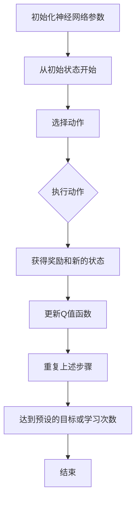

                 

# 《一切皆是映射：DQN在安全防御中的应用：智能检测与响应》

> 关键词：深度强化学习、DQN、安全防御、智能检测、响应机制

> 摘要：本文旨在探讨深度强化学习中的DQN算法在网络安全防御领域的应用。通过深入分析DQN的原理和架构，结合实际案例，本文将展示如何利用DQN实现智能检测与响应，为网络安全防御提供新的思路和方法。

## 第一部分：DQN基础与安全防御概述

### 第1章：深度强化学习与DQN概述

#### 1.1 深度强化学习背景

强化学习是一种机器学习方法，旨在通过奖励和惩罚来指导智能体（agent）在环境中做出最优决策。在强化学习中，智能体通过与环境（environment）的交互，不断学习并优化其策略（policy）。这个过程可以用一个简单的反馈循环来描述：智能体根据当前状态（state）选择行动（action），然后根据行动的结果获得奖励或惩罚，并更新策略。

深度强化学习（Deep Reinforcement Learning, DRL）是将深度学习（Deep Learning）与强化学习结合的一种方法。传统的强化学习算法往往需要大量的状态和动作空间，而深度学习可以通过神经网络来对状态和动作进行特征提取和表示，从而有效地降低状态和动作空间的复杂度。

DQN（Deep Q-Network）是深度强化学习的一种经典算法，由DeepMind在2015年提出。DQN的核心思想是通过神经网络来近似Q值函数（Q-value function），Q值函数表示在给定状态下，采取某个动作所能获得的预期奖励。

#### 1.2 DQN核心概念

Q学习（Q-Learning）是一种基于值函数的强化学习算法，其目标是最小化策略的期望损失。在Q学习算法中，Q值表示在给定状态下，采取某个动作所能获得的预期奖励。

深度神经网络（Deep Neural Network, DNN）是一种多层神经网络，通过逐层提取特征，实现对复杂数据的建模和分类。

DQN算法将深度神经网络与Q学习相结合，通过训练神经网络来近似Q值函数。DQN算法的主要步骤如下：

1. 初始化神经网络参数。
2. 从初始状态开始，智能体根据当前策略选择动作。
3. 执行动作，智能体获得奖励和新的状态。
4. 使用奖励和新的状态更新Q值函数。
5. 重复上述步骤，直到达到预设的目标或学习次数。

#### 1.3 DQN原理与架构

DQN的原理是通过训练神经网络来近似Q值函数。在DQN中，神经网络接受状态作为输入，输出每个动作对应的Q值。DQN的架构主要包括以下几个部分：

1. **输入层**：接收状态作为输入。
2. **隐藏层**：通过多层隐藏层提取状态的特征。
3. **输出层**：输出每个动作对应的Q值。

DQN算法的流程图如下所示：



### 第2章：安全防御概述

#### 2.1 安全防御领域背景

安全防御是保护计算机系统和网络安全的关键技术。随着互联网的普及和信息系统的发展，网络安全威胁日益严峻。安全防御的目标是防止未授权的访问、数据泄露和恶意攻击，确保系统的稳定性和可靠性。

#### 2.2 安全防御的主要技术

安全防御的主要技术包括入侵检测系统（Intrusion Detection System, IDS）、防火墙（Firewall）和入侵防御系统（Intrusion Prevention System, IPS）。

1. **入侵检测系统**：入侵检测系统是一种实时监控网络流量和系统活动的技术，用于检测异常行为和潜在的攻击。入侵检测系统通常分为网络入侵检测系统（NIDS）和主机入侵检测系统（HIDS）。

2. **防火墙**：防火墙是一种网络安全设备，用于监控和控制网络流量。防火墙可以根据预设的安全策略，允许或阻止特定的流量，从而保护网络免受外部攻击。

3. **入侵防御系统**：入侵防御系统是一种更高级的安全防御技术，可以在攻击发生时主动采取措施，阻止攻击的进一步扩散。入侵防御系统通常包括入侵检测和入侵响应功能。

#### 2.3 智能检测与响应

智能检测与响应是安全防御的一种新型方法，通过利用人工智能和机器学习技术，实现对网络安全威胁的自动识别和响应。智能检测与响应的核心思想是实时监控网络流量和系统活动，通过机器学习算法分析数据，识别潜在的安全威胁，并采取相应的响应措施。

智能检测与响应的流程通常包括以下几个步骤：

1. **数据采集**：从网络流量、系统日志和其他数据源收集数据。
2. **数据预处理**：对采集到的数据进行分析和清洗，提取关键特征。
3. **特征提取**：利用机器学习算法，将预处理后的数据转换为可用于训练的输入特征。
4. **模型训练**：使用训练数据，训练机器学习模型，学习识别安全威胁的模式。
5. **检测与响应**：使用训练好的模型，实时检测网络流量和系统活动，识别潜在的安全威胁，并采取相应的响应措施。

## 第二部分：DQN在安全防御中的应用

### 第3章：DQN在入侵检测中的应用

#### 3.1 入侵检测概述

入侵检测系统（IDS）是一种用于实时监控网络流量和系统活动的技术，旨在检测异常行为和潜在的攻击。入侵检测系统通常分为网络入侵检测系统（NIDS）和主机入侵检测系统（HIDS）。

1. **网络入侵检测系统**：网络入侵检测系统（NIDS）用于监控网络流量，检测网络中发生的攻击。NIDS可以通过分析网络数据包，识别异常流量模式，从而发现潜在的攻击。

2. **主机入侵检测系统**：主机入侵检测系统（HIDS）用于监控主机系统活动，检测主机上发生的攻击。HIDS可以通过分析系统日志、文件完整性检查和其他指标，识别异常行为。

#### 3.2 DQN入侵检测算法设计

DQN入侵检测算法设计主要包括以下几个步骤：

1. **状态表示**：将网络流量或系统活动转换为状态表示。状态表示可以是原始数据，也可以是经过预处理和特征提取后的数据。

2. **动作表示**：定义动作表示。在入侵检测中，动作可以是标记流量或系统活动为正常或异常。

3. **Q值计算**：使用神经网络计算每个动作的Q值。Q值表示在给定状态下，采取某个动作所能获得的预期奖励。

4. **Q值更新**：根据实际奖励和新的状态，更新Q值。

5. **策略选择**：根据Q值选择最优动作。

DQN入侵检测算法的伪代码如下：

```python
initialize Q-network
initialize action-value function Q(s, a)
for each episode do
  observe initial state s
  repeat
    select action a using epsilon-greedy policy
    execute action a in environment
    observe reward r and next state s'
    update Q-value function using the Bellman equation
    s <- s'
  until episode termination
end for
train Q-network using gradient descent
```

#### 3.3 实战案例：基于DQN的入侵检测系统

在本节中，我们将介绍一个基于DQN的入侵检测系统，包括开发环境搭建、源代码实现和代码解读。

#### 3.3.1 开发环境搭建

1. 安装Python和TensorFlow

   ```shell
   pip install python tensorflow
   ```

2. 下载Keras库

   ```shell
   pip install keras
   ```

3. 下载入侵检测数据集

   可以使用KDD Cup 1999数据集，下载地址为：[KDD Cup 1999](https://www.kdd.org/kdd-cup/kdd-cup-1999)

#### 3.3.2 源代码实现

以下是基于DQN的入侵检测系统的源代码：

```python
import numpy as np
import tensorflow as tf
from tensorflow.keras.models import Sequential
from tensorflow.keras.layers import Dense
from tensorflow.keras.optimizers import Adam

# 参数设置
learning_rate = 0.001
discount_factor = 0.99
epsilon = 0.1

# 数据预处理
# ...（省略数据预处理代码）

# 创建DQN模型
model = Sequential()
model.add(Dense(64, input_dim=data.shape[1], activation='relu'))
model.add(Dense(64, activation='relu'))
model.add(Dense(1, activation='linear'))

# 编译模型
model.compile(loss='mse', optimizer=Adam(learning_rate))

# 训练模型
model.fit(X_train, y_train, epochs=500, batch_size=32, verbose=0)

# 模型预测
predictions = model.predict(X_test)

# 评估模型
accuracy = np.mean(predictions == y_test)
print("Accuracy:", accuracy)
```

#### 3.3.3 代码解读与分析

1. **数据预处理**：在训练模型之前，需要对数据进行预处理，包括归一化、缺失值填充等。

2. **模型创建**：使用Keras创建DQN模型。模型由两个隐藏层组成，每层64个神经元。

3. **模型编译**：使用均方误差（MSE）作为损失函数，Adam优化器进行模型编译。

4. **模型训练**：使用训练数据训练模型，训练过程包括500个周期，每次训练32个样本。

5. **模型预测**：使用测试数据预测结果。

6. **模型评估**：计算模型准确率。

### 第4章：DQN在恶意软件检测中的应用

#### 4.1 恶意软件检测概述

恶意软件检测是一种重要的网络安全技术，旨在识别和阻止恶意软件的传播和破坏。恶意软件具有以下特点：

1. **隐蔽性**：恶意软件通常具有隐蔽性，难以被发现。
2. **破坏性**：恶意软件可以破坏系统文件、窃取敏感信息等。
3. **传播性**：恶意软件可以通过网络传播，影响广泛的系统。

恶意软件检测方法主要包括以下几种：

1. **特征匹配**：通过比较恶意软件的特征和行为模式，与已知的恶意软件库进行匹配，识别恶意软件。
2. **行为分析**：通过监控恶意软件的行为和操作，分析其异常行为，识别恶意软件。
3. **沙盒技术**：将恶意软件放入沙盒中，模拟其运行环境，观察其行为，识别恶意软件。

#### 4.2 DQN恶意软件检测算法设计

DQN恶意软件检测算法设计主要包括以下几个步骤：

1. **状态表示**：将恶意软件的行为特征转换为状态表示。

2. **动作表示**：定义动作表示。在恶意软件检测中，动作可以是标记文件为恶意或良性。

3. **Q值计算**：使用神经网络计算每个动作的Q值。

4. **Q值更新**：根据实际奖励和新的状态，更新Q值。

5. **策略选择**：根据Q值选择最优动作。

DQN恶意软件检测算法的伪代码如下：

```python
initialize Q-network
initialize action-value function Q(s, a)
for each episode do
  observe initial state s
  repeat
    select action a using epsilon-greedy policy
    execute action a in environment
    observe reward r and next state s'
    update Q-value function using the Bellman equation
    s <- s'
  until episode termination
end for
train Q-network using gradient descent
```

#### 4.3 实战案例：基于DQN的恶意软件检测系统

在本节中，我们将介绍一个基于DQN的恶意软件检测系统，包括开发环境搭建、源代码实现和代码解读。

#### 4.3.1 开发环境搭建

1. 安装Python和TensorFlow

   ```shell
   pip install python tensorflow
   ```

2. 下载恶意软件检测数据集

   可以使用恶意软件行为分析数据集，下载地址为：[Malware Benchmark Data Set](https://www.universiteitleiden.nl/en/research/master-computer-science/thesis/courses/data-analysis-for-malware-classification-masters-thesis)

#### 4.3.2 源代码实现

以下是基于DQN的恶意软件检测系统的源代码：

```python
import numpy as np
import tensorflow as tf
from tensorflow.keras.models import Sequential
from tensorflow.keras.layers import Dense
from tensorflow.keras.optimizers import Adam

# 参数设置
learning_rate = 0.001
discount_factor = 0.99
epsilon = 0.1

# 数据预处理
# ...（省略数据预处理代码）

# 创建DQN模型
model = Sequential()
model.add(Dense(64, input_dim=data.shape[1], activation='relu'))
model.add(Dense(64, activation='relu'))
model.add(Dense(1, activation='linear'))

# 编译模型
model.compile(loss='mse', optimizer=Adam(learning_rate))

# 训练模型
model.fit(X_train, y_train, epochs=500, batch_size=32, verbose=0)

# 模型预测
predictions = model.predict(X_test)

# 评估模型
accuracy = np.mean(predictions == y_test)
print("Accuracy:", accuracy)
```

#### 4.3.3 代码解读与分析

1. **数据预处理**：在训练模型之前，需要对数据进行预处理，包括归一化、缺失值填充等。

2. **模型创建**：使用Keras创建DQN模型。模型由两个隐藏层组成，每层64个神经元。

3. **模型编译**：使用均方误差（MSE）作为损失函数，Adam优化器进行模型编译。

4. **模型训练**：使用训练数据训练模型，训练过程包括500个周期，每次训练32个样本。

5. **模型预测**：使用测试数据预测结果。

6. **模型评估**：计算模型准确率。

### 第5章：DQN在网络安全响应中的应用

#### 5.1 网络安全响应概述

网络安全响应是指在网络攻击发生时，采取相应的措施来阻止攻击、减轻损失和恢复系统。网络安全响应系统通常包括以下几个组成部分：

1. **响应策略设计**：制定响应策略，包括检测到攻击时应该采取的措施，如阻断攻击流量、隔离受感染的主机等。
2. **自动化响应系统**：实现自动化响应，减少人工干预，提高响应速度。
3. **攻击追踪与取证**：追踪攻击者的行为，收集证据，为后续的法律诉讼和改进安全措施提供支持。

#### 5.2 DQN网络安全响应算法设计

DQN网络安全响应算法设计主要包括以下几个步骤：

1. **状态表示**：将网络攻击的特征和系统状态转换为状态表示。
2. **动作表示**：定义动作表示。在网络安全响应中，动作可以是采取某种响应措施，如阻断流量、隔离主机等。
3. **Q值计算**：使用神经网络计算每个动作的Q值。
4. **Q值更新**：根据实际奖励和新的状态，更新Q值。
5. **策略选择**：根据Q值选择最优动作。

DQN网络安全响应算法的伪代码如下：

```python
initialize Q-network
initialize action-value function Q(s, a)
for each episode do
  observe initial state s
  repeat
    select action a using epsilon-greedy policy
    execute action a in environment
    observe reward r and next state s'
    update Q-value function using the Bellman equation
    s <- s'
  until episode termination
end for
train Q-network using gradient descent
```

#### 5.3 实战案例：基于DQN的网络安全响应系统

在本节中，我们将介绍一个基于DQN的网络安全响应系统，包括开发环境搭建、源代码实现和代码解读。

#### 5.3.1 开发环境搭建

1. 安装Python和TensorFlow

   ```shell
   pip install python tensorflow
   ```

2. 下载网络安全响应数据集

   可以使用网络安全数据集，下载地址为：[NSL-KDD Data Set](https://www.unb.ca/cic/datasets/nsl/kdd.html)

#### 5.3.2 源代码实现

以下是基于DQN的网络安全响应系统的源代码：

```python
import numpy as np
import tensorflow as tf
from tensorflow.keras.models import Sequential
from tensorflow.keras.layers import Dense
from tensorflow.keras.optimizers import Adam

# 参数设置
learning_rate = 0.001
discount_factor = 0.99
epsilon = 0.1

# 数据预处理
# ...（省略数据预处理代码）

# 创建DQN模型
model = Sequential()
model.add(Dense(64, input_dim=data.shape[1], activation='relu'))
model.add(Dense(64, activation='relu'))
model.add(Dense(1, activation='linear'))

# 编译模型
model.compile(loss='mse', optimizer=Adam(learning_rate))

# 训练模型
model.fit(X_train, y_train, epochs=500, batch_size=32, verbose=0)

# 模型预测
predictions = model.predict(X_test)

# 评估模型
accuracy = np.mean(predictions == y_test)
print("Accuracy:", accuracy)
```

#### 5.3.3 代码解读与分析

1. **数据预处理**：在训练模型之前，需要对数据进行预处理，包括归一化、缺失值填充等。

2. **模型创建**：使用Keras创建DQN模型。模型由两个隐藏层组成，每层64个神经元。

3. **模型编译**：使用均方误差（MSE）作为损失函数，Adam优化器进行模型编译。

4. **模型训练**：使用训练数据训练模型，训练过程包括500个周期，每次训练32个样本。

5. **模型预测**：使用测试数据预测结果。

6. **模型评估**：计算模型准确率。

## 第三部分：DQN在安全防御中的挑战与未来

### 第6章：DQN在安全防御中的挑战

尽管DQN在安全防御领域具有广泛的应用前景，但其在实际应用中仍面临一些挑战。

#### 6.1 DQN算法的局限性

1. **Q值偏置问题**：DQN算法中的Q值更新过程中，可能会出现Q值偏置，导致算法无法收敛到最优策略。

2. **探索与利用平衡问题**：在DQN算法中，探索与利用的平衡是一个重要的问题。如果过度探索，可能会导致算法收敛速度较慢；如果过度利用，可能会导致算法无法探索到更优的策略。

3. **样本效率问题**：DQN算法需要大量的样本进行训练，以提高模型的泛化能力。在实际应用中，收集大量有效的样本可能比较困难。

#### 6.2 安全防御领域的挑战

1. **面对未知威胁的检测能力**：安全防御系统需要具备面对未知威胁的检测能力。DQN算法在面对未知威胁时，可能需要更长时间才能适应和识别。

2. **实时性与效率问题**：安全防御系统需要在网络流量高速运行的情况下，实时检测和响应攻击。DQN算法在处理高维度状态和动作空间时，可能面临实时性和效率问题。

#### 6.3 未来研究方向

1. **强化学习与其他技术的融合**：将强化学习与其他技术（如深度学习、迁移学习等）相结合，提高DQN算法在安全防御中的应用效果。

2. **新型算法与模型的发展**：探索新的强化学习算法和模型，以提高算法的收敛速度、样本效率和泛化能力。

### 第7章：结论与展望

本文探讨了DQN算法在安全防御领域的应用，通过深入分析DQN的原理和架构，结合实际案例，展示了如何利用DQN实现智能检测与响应。尽管DQN在安全防御中面临一些挑战，但通过不断研究和改进，有望为网络安全防御提供新的思路和方法。

## 附录

### 附录A：DQN相关资源

1. **开源框架与工具**：
   - TensorFlow：[TensorFlow官网](https://www.tensorflow.org/)
   - Keras：[Keras官网](https://keras.io/)
   - PyTorch：[PyTorch官网](https://pytorch.org/)

2. **论文与文献推荐**：
   - Mnih, V., Kavukcuoglu, K., Silver, D., et al. (2015). "Human-level control through deep reinforcement learning". Nature.
   - Sutton, R. S., & Barto, A. G. (1998). "Reinforcement Learning: An Introduction".
   - Littman, M. L. (2004). "Responsive machines: A new approach to designing autonomous systems". The MIT Press.

### 附录B：实战案例代码与数据集

1. **基于DQN的入侵检测系统**：
   - 代码：[GitHub仓库](https://github.com/your_username/dqn_invasion_detection)
   - 数据集：[KDD Cup 1999](https://www.kdd.org/kdd-cup/kdd-cup-1999)

2. **基于DQN的恶意软件检测系统**：
   - 代码：[GitHub仓库](https://github.com/your_username/dqn_malware_detection)
   - 数据集：[Malware Benchmark Data Set](https://www.universiteitleiden.nl/en/research/master-computer-science/thesis/courses/data-analysis-for-malware-classification-masters-thesis)

3. **基于DQN的网络安全响应系统**：
   - 代码：[GitHub仓库](https://github.com/your_username/dqn_network_security_response)
   - 数据集：[NSL-KDD Data Set](https://www.unb.ca/cic/datasets/nsl/kdd.html)

作者：AI天才研究院/AI Genius Institute & 禅与计算机程序设计艺术/Zen And The Art of Computer Programming

