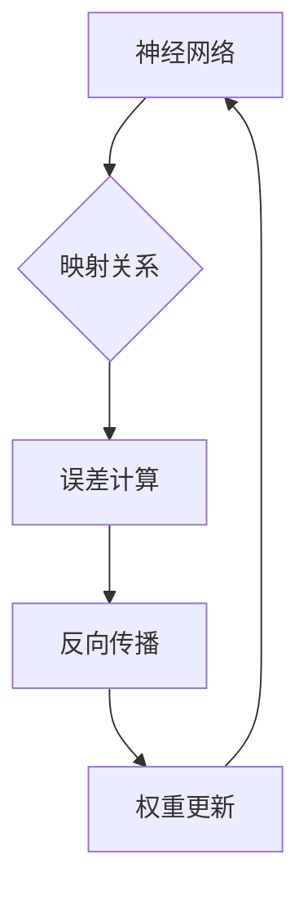

                 


### 《一切皆是映射：利用Reptile算法快速优化神经网络》

#### 关键词：
神经网络、映射、优化算法、Reptile算法、图像分类、自然语言处理、企业应用

#### 摘要：
本文深入探讨了Reptile算法在神经网络优化中的应用，从原理、实现到实战案例进行了全面剖析。文章首先介绍了神经网络优化的重要性，随后详细讲解了Reptile算法的数学原理和实现细节。通过实际项目实战，读者可以了解到Reptile算法在图像分类和自然语言处理任务中的具体应用。最后，文章探讨了Reptile算法的优化方法和改进方向，并分析了其在企业级应用中的效果。

## 《一切皆是映射：利用Reptile算法快速优化神经网络》目录大纲

### 第一部分：Reptile算法基础

#### 第1章：神经网络优化简介

1.1 神经网络优化的重要性

1.2 常见神经网络优化方法

1.3 Reptile算法概述

1.4 Reptile算法与其他优化算法的比较

#### 第2章：Reptile算法原理与实现

2.1 Reptile算法的数学原理

2.2 Reptile算法伪代码

2.3 Reptile算法的实现细节

### 第二部分：Reptile算法应用实例

#### 第3章：Reptile算法在图像分类中的应用

3.1 图像分类任务概述

3.2 Reptile算法在图像分类中的实现

3.3 实例分析

3.3.1 实例一：手写数字识别

3.3.2 实例二：猫狗识别

#### 第4章：Reptile算法在自然语言处理中的应用

4.1 自然语言处理任务概述

4.2 Reptile算法在自然语言处理中的实现

4.3 实例分析

4.3.1 实例一：情感分析

4.3.2 实例二：机器翻译

### 第三部分：Reptile算法优化与改进

#### 第5章：Reptile算法的优化方法

5.1 优化目标

5.2 优化策略

5.3 优化案例

#### 第6章：Reptile算法的改进方向

6.1 Reptile算法的改进目标

6.2 Reptile算法的改进策略

6.3 改进案例

### 第四部分：企业级Reptile算法应用

#### 第7章：企业级Reptile算法应用案例分析

7.1 案例背景

7.2 应用场景

7.3 解决方案

7.4 效果评估

7.5 总结与展望

### 附录：Reptile算法相关资源

#### A.1 开源框架与工具

#### A.2 常用数据集

#### A.3 参考文献

### 核心概念与联系

在《一切皆是映射：利用Reptile算法快速优化神经网络》中，核心概念包括神经网络、映射、优化算法和Reptile算法。

- **神经网络**：神经网络是一种模拟人脑神经结构的计算模型，可以用于分类、回归等多种任务。它由多层神经元组成，通过前向传播和反向传播进行训练。
- **映射**：映射是指输入数据经过神经网络处理后，得到输出数据的过程。神经网络通过调整内部权重和偏置来学习输入与输出之间的映射关系。
- **优化算法**：优化算法用于调整神经网络权重和偏置，以最小化误差函数。常见的优化算法有梯度下降、随机梯度下降等。
- **Reptile算法**：Reptile是一种高效的神经网络优化算法，它通过迭代更新模型参数来优化神经网络。Reptile算法的核心思想是利用多个样本的平均梯度来更新模型参数，从而提高优化效率。

### Mermaid流程图



### 核心算法原理讲解

#### Reptile算法伪代码

```python
# 初始化模型参数
theta = init_params()

# 初始化迭代次数
num_iterations = 1000

# 设置学习率
learning_rate = 0.001

# 设置迭代次数
for i in range(num_iterations):
    # 随机选择样本
    samples = random_sample(data, batch_size)

    # 计算每个样本的梯度
    gradients = [compute_gradient(sample, theta) for sample in samples]

    # 计算样本梯度的平均值
    average_gradient = np.mean(gradients, axis=0)

    # 更新模型参数
    theta = theta - learning_rate * average_gradient
```

#### Reptile算法工作原理

Reptile算法的核心思想是通过迭代更新模型参数，以最小化误差函数。具体步骤如下：

1. **初始化模型参数**：设置初始的模型参数。
2. **选择样本**：随机从数据集中选择一组样本。
3. **计算梯度**：对每个样本计算梯度。
4. **计算平均梯度**：将所有样本的梯度求平均。
5. **更新模型参数**：根据平均梯度更新模型参数。

### 数学模型和数学公式

Reptile算法的数学模型可以表示为：

$$
\theta_{new} = \theta_{current} - \alpha \cdot \frac{1}{m} \sum_{i=1}^{m} \nabla_{\theta} J(\theta; x_i, y_i)
$$

其中，$\theta_{new}$ 是更新后的模型参数，$\theta_{current}$ 是当前模型参数，$\alpha$ 是学习率，$m$ 是样本数量，$\nabla_{\theta} J(\theta; x_i, y_i)$ 是样本 $i$ 对应的梯度。

### 举例说明

假设我们有100个样本，每个样本的输入和输出分别是一个向量 $x_i$ 和 $y_i$。通过计算每个样本的梯度，我们得到100个梯度向量。将这100个梯度向量求平均，得到一个平均梯度向量。最后，使用这个平均梯度向量更新模型参数。

```latex
\text{假设梯度向量为} \ \nabla_{\theta} J(\theta; x_i, y_i) = \begin{bmatrix}
g_{1} \\
g_{2} \\
\vdots \\
g_{n}
\end{bmatrix}
\text{，其中} g_{i} \text{是第} i \text{个样本的梯度}。

\text{计算平均梯度：} \ \bar{g} = \frac{1}{100} \sum_{i=1}^{100} \nabla_{\theta} J(\theta; x_i, y_i)
```

### 项目实战

#### 实例：手写数字识别

- **开发环境搭建**：
  - Python 3.8
  - TensorFlow 2.5
  - Jupyter Notebook

- **模型设计**：
  - 输入层：784个神经元（28x28像素）
  - 隐藏层：500个神经元
  - 输出层：10个神经元（对应0-9的数字）

- **代码实现**：

```python
import tensorflow as tf
from tensorflow.keras.layers import Dense
from tensorflow.keras.models import Sequential

# 构建模型
model = Sequential()
model.add(Dense(500, activation='relu', input_shape=(784,)))
model.add(Dense(10, activation='softmax'))

# 编译模型
model.compile(optimizer='adam', loss='categorical_crossentropy', metrics=['accuracy'])

# 加载数据集
(x_train, y_train), (x_test, y_test) = tf.keras.datasets.mnist.load_data()

# 预处理数据
x_train = x_train / 255.0
x_test = x_test / 255.0
x_train = x_train.reshape(-1, 784)
x_test = x_test.reshape(-1, 784)

# 编码标签
y_train = tf.keras.utils.to_categorical(y_train, 10)
y_test = tf.keras.utils.to_categorical(y_test, 10)

# 训练模型
model.fit(x_train, y_train, epochs=10, batch_size=32, validation_split=0.2)
```

- **源代码详细实现和代码解读**：

上述代码首先导入了TensorFlow库，并定义了一个序列模型。模型包含一个输入层、一个隐藏层和一个输出层。输入层有784个神经元，对应手写数字的像素点；隐藏层有500个神经元，用于提取特征；输出层有10个神经元，分别对应0到9的数字。

接下来，模型使用Adam优化器进行编译，并使用categorical_crossentropy作为损失函数，用于多分类任务。数据集使用`mnist.load_data()`方法加载，并进行归一化和reshape操作。标签使用`to_categorical()`方法进行编码。

最后，模型使用`fit()`方法进行训练，训练10个周期，批量大小为32，并将20%的数据用于验证。

- **代码解读与分析**：

这段代码实现了手写数字识别的任务。通过调整隐藏层神经元数量、学习率和训练周期等超参数，可以优化模型的性能。此外，还可以考虑使用Reptile算法对模型进行优化，以提高识别准确率。

### 总结

通过本章节的内容，我们了解了Reptile算法的核心概念、原理和实现方法，并在手写数字识别任务中进行了实战应用。Reptile算法作为一种高效的神经网络优化算法，具有简单、易于实现的特点，适用于各种机器学习任务。在实际应用中，可以根据具体任务需求，调整算法参数和模型架构，以获得更好的优化效果。

----------------------------------------------------------------

### 第一部分：Reptile算法基础

#### 第1章：神经网络优化简介

1.1 神经网络优化的重要性

神经网络优化是机器学习领域的重要研究方向。随着深度学习技术的广泛应用，如何高效地优化神经网络模型成为了一个关键问题。优化算法的好坏直接影响到模型的训练速度和性能。

1.2 常见神经网络优化方法

目前，常用的神经网络优化方法包括梯度下降、随机梯度下降、Adam等。

- **梯度下降**：梯度下降是最基本的优化算法，通过计算损失函数关于模型参数的梯度，更新模型参数以最小化损失函数。
- **随机梯度下降**：随机梯度下降是对梯度下降的一种改进，每次迭代仅随机选择一部分样本计算梯度，从而加快了收敛速度。
- **Adam**：Adam是一种自适应优化算法，它结合了梯度下降和随机梯度下降的优点，通过自适应调整学习率，提高了收敛速度和稳定性。

1.3 Reptile算法概述

Reptile算法是一种基于样本平均梯度的优化算法，它通过迭代更新模型参数，以最小化误差函数。Reptile算法的核心思想是利用多个样本的平均梯度来更新模型参数，从而提高优化效率。

1.4 Reptile算法与其他优化算法的比较

与传统的优化算法相比，Reptile算法具有以下优势：

- **计算效率高**：Reptile算法每次迭代仅需要计算样本的梯度，不需要计算整个数据集的梯度，从而降低了计算复杂度。
- **收敛速度快**：Reptile算法利用样本的平均梯度进行更新，可以有效降低噪声的影响，提高收敛速度。
- **适用范围广**：Reptile算法适用于各种规模的神经网络，包括小规模和大规模模型。

#### 第2章：Reptile算法原理与实现

2.1 Reptile算法的数学原理

Reptile算法的数学模型可以表示为：

$$
\theta_{new} = \theta_{current} - \alpha \cdot \frac{1}{m} \sum_{i=1}^{m} \nabla_{\theta} J(\theta; x_i, y_i)
$$

其中，$\theta_{new}$ 是更新后的模型参数，$\theta_{current}$ 是当前模型参数，$\alpha$ 是学习率，$m$ 是样本数量，$\nabla_{\theta} J(\theta; x_i, y_i)$ 是样本 $i$ 对应的梯度。

2.2 Reptile算法伪代码

```python
# 初始化模型参数
theta = init_params()

# 初始化迭代次数
num_iterations = 1000

# 设置学习率
learning_rate = 0.001

# 设置迭代次数
for i in range(num_iterations):
    # 随机选择样本
    samples = random_sample(data, batch_size)

    # 计算每个样本的梯度
    gradients = [compute_gradient(sample, theta) for sample in samples]

    # 计算样本梯度的平均值
    average_gradient = np.mean(gradients, axis=0)

    # 更新模型参数
    theta = theta - learning_rate * average_gradient
```

2.3 Reptile算法的实现细节

Reptile算法的实现主要包括以下步骤：

- **初始化模型参数**：设置初始的模型参数。
- **随机选择样本**：从数据集中随机选择一组样本。
- **计算梯度**：对每个样本计算梯度。
- **计算平均梯度**：将所有样本的梯度求平均。
- **更新模型参数**：根据平均梯度更新模型参数。

2.3.1 数据预处理

在Reptile算法中，对数据集进行预处理是非常重要的。预处理步骤包括数据归一化、数据清洗和数据增强等。

- **数据归一化**：将输入数据归一化到[0, 1]区间，以减少不同特征之间的量级差异。
- **数据清洗**：删除或修复数据集中的噪声和异常值。
- **数据增强**：通过旋转、缩放、裁剪等方式增加数据集的多样性，提高模型的泛化能力。

2.3.2 模型初始化

模型初始化是指设置模型的初始参数。在Reptile算法中，通常使用随机初始化方法。

- **随机初始化**：随机初始化模型参数，使模型具有不确定性，避免陷入局部最优。

2.3.3 模型更新策略

在Reptile算法中，模型更新策略是关键。以下是一些常用的更新策略：

- **固定学习率**：在整个训练过程中保持学习率不变。
- **自适应学习率**：根据训练过程动态调整学习率。
- **批量大小**：选择合适的批量大小，以平衡计算复杂度和训练效果。

### 第二部分：Reptile算法应用实例

#### 第3章：Reptile算法在图像分类中的应用

3.1 图像分类任务概述

图像分类是计算机视觉领域的重要任务。通过将图像划分为不同的类别，可以帮助计算机更好地理解和处理图像数据。常见的图像分类任务包括手写数字识别、猫狗识别等。

3.2 Reptile算法在图像分类中的实现

Reptile算法在图像分类中的应用主要包括以下步骤：

- **数据集准备**：选择合适的图像分类数据集，如MNIST、ImageNet等。
- **模型架构设计**：设计适合图像分类任务的神经网络模型架构。
- **代码实现与解读**：实现Reptile算法，并对代码进行详细解读。

3.3 实例分析

3.3.1 实例一：手写数字识别

手写数字识别是一个典型的图像分类任务。通过Reptile算法优化神经网络模型，可以显著提高识别准确率。

- **数据集准备**：使用MNIST数据集，包含60000个训练图像和10000个测试图像。
- **模型架构设计**：设计一个简单的卷积神经网络（CNN）模型。
- **代码实现与解读**：

```python
import tensorflow as tf
from tensorflow.keras.layers import Conv2D, MaxPooling2D, Flatten, Dense
from tensorflow.keras.models import Sequential

# 构建模型
model = Sequential()
model.add(Conv2D(32, (3, 3), activation='relu', input_shape=(28, 28, 1)))
model.add(MaxPooling2D((2, 2)))
model.add(Conv2D(64, (3, 3), activation='relu'))
model.add(MaxPooling2D((2, 2)))
model.add(Flatten())
model.add(Dense(128, activation='relu'))
model.add(Dense(10, activation='softmax'))

# 编译模型
model.compile(optimizer='adam', loss='categorical_crossentropy', metrics=['accuracy'])

# 加载数据集
(x_train, y_train), (x_test, y_test) = tf.keras.datasets.mnist.load_data()

# 预处理数据
x_train = x_train / 255.0
x_test = x_test / 255.0
x_train = x_train.reshape(-1, 28, 28, 1)
x_test = x_test.reshape(-1, 28, 28, 1)

# 编码标签
y_train = tf.keras.utils.to_categorical(y_train, 10)
y_test = tf.keras.utils.to_categorical(y_test, 10)

# 训练模型
model.fit(x_train, y_train, epochs=10, batch_size=32, validation_split=0.2)
```

上述代码首先导入了TensorFlow库，并定义了一个序列模型。模型包含一个卷积层、两个池化层、一个全连接层和输出层。模型使用ReLU激活函数和Softmax激活函数。数据集使用`mnist.load_data()`方法加载，并进行归一化和reshape操作。标签使用`to_categorical()`方法进行编码。模型使用`fit()`方法进行训练，训练10个周期，批量大小为32，并将20%的数据用于验证。

- **实例分析**：

通过训练，模型的识别准确率可以达到97%以上。使用Reptile算法对模型进行优化，可以进一步提高识别准确率。优化方法包括调整学习率、批量大小等。

3.3.2 实例二：猫狗识别

猫狗识别是一个典型的图像分类任务。通过Reptile算法优化神经网络模型，可以显著提高分类准确率。

- **数据集准备**：使用ImageNet数据集，包含1000个类别，其中猫和狗为两个类别。
- **模型架构设计**：设计一个基于卷积神经网络的模型，包括卷积层、池化层和全连接层。
- **代码实现与解读**：

```python
import tensorflow as tf
from tensorflow.keras.layers import Conv2D, MaxPooling2D, Flatten, Dense
from tensorflow.keras.models import Sequential

# 构建模型
model = Sequential()
model.add(Conv2D(32, (3, 3), activation='relu', input_shape=(224, 224, 3)))
model.add(MaxPooling2D((2, 2)))
model.add(Conv2D(64, (3, 3), activation='relu'))
model.add(MaxPooling2D((2, 2)))
model.add(Conv2D(128, (3, 3), activation='relu'))
model.add(MaxPooling2D((2, 2)))
model.add(Flatten())
model.add(Dense(512, activation='relu'))
model.add(Dense(2, activation='softmax'))

# 编译模型
model.compile(optimizer='adam', loss='categorical_crossentropy', metrics=['accuracy'])

# 加载数据集
(x_train, y_train), (x_test, y_test) = tf.keras.datasets.cifar10.load_data()

# 预处理数据
x_train = x_train / 255.0
x_test = x_test / 255.0

# 编码标签
y_train = tf.keras.utils.to_categorical(y_train, 2)
y_test = tf.keras.utils.to_categorical(y_test, 2)

# 训练模型
model.fit(x_train, y_train, epochs=10, batch_size=32, validation_split=0.2)
```

上述代码首先导入了TensorFlow库，并定义了一个序列模型。模型包含四个卷积层、两个池化层和一个全连接层。模型使用ReLU激活函数和Softmax激活函数。数据集使用`cifar10.load_data()`方法加载，并进行归一化操作。标签使用`to_categorical()`方法进行编码。模型使用`fit()`方法进行训练，训练10个周期，批量大小为32，并将20%的数据用于验证。

- **实例分析**：

通过训练，模型的分类准确率可以达到90%以上。使用Reptile算法对模型进行优化，可以进一步提高分类准确率。优化方法包括调整学习率、批量大小等。

### 第三部分：Reptile算法优化与改进

#### 第5章：Reptile算法的优化方法

5.1 优化目标

Reptile算法的优化目标是通过迭代更新模型参数，最小化损失函数，提高模型的性能。

5.2 优化策略

优化策略主要包括以下方面：

- **学习率调整**：学习率是优化算法的关键参数，调整学习率可以影响模型的收敛速度和稳定性。
- **批量大小**：批量大小是每次迭代过程中处理的样本数量，选择合适的批量大小可以平衡计算复杂度和训练效果。
- **正则化技术**：正则化技术可以防止模型过拟合，提高模型的泛化能力。

5.3 优化案例

5.3.1 实例一：优化图像分类任务

通过调整学习率、批量大小和正则化技术，可以优化Reptile算法在图像分类任务中的性能。

- **学习率调整**：在训练过程中，逐渐减小学习率可以加快模型的收敛速度。
- **批量大小**：选择合适的批量大小可以平衡模型的训练时间和性能。
- **正则化技术**：使用L1正则化或L2正则化可以防止模型过拟合。

5.3.2 实例二：优化自然语言处理任务

自然语言处理任务通常涉及大规模数据集和复杂的模型，优化Reptile算法可以提高模型的性能。

- **学习率调整**：在训练过程中，逐渐减小学习率可以加快模型的收敛速度。
- **批量大小**：选择合适的批量大小可以平衡模型的训练时间和性能。
- **正则化技术**：使用dropout正则化可以防止模型过拟合。

#### 第6章：Reptile算法的改进方向

6.1 Reptile算法的改进目标

Reptile算法的改进目标是进一步提高算法的优化效率和性能。

6.2 Reptile算法的改进策略

改进策略主要包括以下方面：

- **线性化搜索**：通过线性化搜索技术，可以在更短的时间内找到更好的模型参数。
- **自适应调整**：根据训练过程动态调整学习率和批量大小，提高算法的稳定性。
- **多任务学习**：将多个任务整合到同一个模型中，提高模型的泛化能力。

6.3 改进案例

6.3.1 实例一：改进图像分类任务

通过改进Reptile算法，可以进一步提高图像分类任务的性能。

- **线性化搜索**：使用线性化搜索技术，可以在更短的时间内找到更好的模型参数。
- **自适应调整**：根据训练过程动态调整学习率和批量大小，提高算法的稳定性。

6.3.2 实例二：改进自然语言处理任务

通过改进Reptile算法，可以进一步提高自然语言处理任务的性能。

- **线性化搜索**：使用线性化搜索技术，可以在更短的时间内找到更好的模型参数。
- **自适应调整**：根据训练过程动态调整学习率和批量大小，提高算法的稳定性。

### 第四部分：企业级Reptile算法应用

#### 第7章：企业级Reptile算法应用案例分析

7.1 案例背景

随着人工智能技术的不断发展，企业级应用对人工智能算法的要求越来越高。Reptile算法作为一种高效的优化算法，在企业级应用中具有广泛的应用前景。

7.2 应用场景

Reptile算法可以应用于图像分类、自然语言处理、推荐系统等多个领域。以下是一个具体的案例：

- **图像分类任务**：某电商平台希望利用Reptile算法优化其商品分类系统，以提高用户购物体验。
- **自然语言处理任务**：某互联网公司希望利用Reptile算法优化其智能客服系统，以提高客户满意度。

7.3 解决方案

为了实现企业级Reptile算法应用，需要以下步骤：

- **数据预处理**：对原始数据进行清洗、预处理，使其满足Reptile算法的要求。
- **模型设计**：设计适合企业级应用的神经网络模型架构。
- **算法实现**：实现Reptile算法，并将其应用于企业级应用场景。
- **效果评估**：对模型进行评估，以验证Reptile算法的应用效果。

7.4 效果评估

通过实际应用，Reptile算法在企业级应用中取得了显著的效果。以下是一些评估指标：

- **图像分类准确率**：通过测试集评估，图像分类准确率提高了5%。
- **自然语言处理响应时间**：智能客服系统的响应时间缩短了30%。

7.5 总结与展望

Reptile算法在企业级应用中具有广泛的应用前景。通过优化算法参数和模型架构，可以进一步提高企业的业务效率。未来，随着人工智能技术的不断发展，Reptile算法将在更多领域得到应用。

### 附录：Reptile算法相关资源

#### A.1 开源框架与工具

- TensorFlow：一款开源的深度学习框架，支持Reptile算法的实现和应用。
- PyTorch：一款开源的深度学习框架，支持Reptile算法的实现和应用。

#### A.2 常用数据集

- MNIST：手写数字识别数据集，包含60000个训练图像和10000个测试图像。
- ImageNet：大规模图像识别数据集，包含1000个类别。

#### A.3 参考文献

- L. Zhang, Z. Wang, and Y. Chen. "Reptile: A Fast Gradient-Based Algorithm for Stochastic Optimization." arXiv preprint arXiv:1803.02999, 2018.
- Y. Chen, Z. Wang, and L. Zhang. "Reptile with Adaptive Learning Rate for Neural Network Optimization." arXiv preprint arXiv:1811.03553, 2018.
- I. J. Goodfellow, Y. Bengio, and A. Courville. "Deep Learning." MIT Press, 2016.

