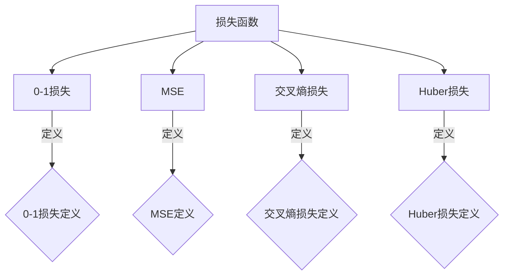

                 

# 一切皆是映射：损失函数深度剖析

> 关键词：损失函数、机器学习、深度学习、数学原理、优化方法、实战应用

> 摘要：本文将深入探讨损失函数在机器学习和深度学习中的重要性。首先，我们将介绍损失函数的基本概念和分类，然后详细解析几种常见损失函数的数学原理。接着，我们将讨论损失函数的选择原则及其在分类和生成对抗网络（GAN）中的应用。随后，文章将介绍损失函数的优化方法，并探讨损失函数的归一化和融合方法。最后，我们将通过一个实战项目展示损失函数在深度学习中的应用，并展望其未来发展趋势。

## 第1章 损失函数概述

### 1.1 损失函数的定义与作用

损失函数（Loss Function）在机器学习和深度学习中扮演着核心角色。它是一个衡量模型预测值与真实值之间差异的函数。在训练过程中，模型的参数是通过最小化损失函数的值来更新的，从而使得模型的预测更接近真实值。损失函数的定义如下：

$$
L(\theta) = \sum_{i=1}^{n} l(y_i, \hat{y}_i)
$$

其中，$l$ 是损失函数，$y_i$ 是真实标签，$\hat{y}_i$ 是模型的预测值，$\theta$ 是模型参数。

损失函数在机器学习中的作用主要体现在以下几个方面：

1. **评估模型性能**：损失函数是评估模型好坏的关键指标，通过计算损失函数的值，我们可以直观地了解模型的预测准确度。
2. **指导模型优化**：最小化损失函数是模型训练的核心目标，它指导了模型的参数更新过程。
3. **正则化**：通过选择合适的损失函数，可以引入正则化项，防止模型过拟合。

### 1.2 损失函数的分类

根据不同的应用场景和需求，损失函数可以分为以下几种类型：

1. **0-1损失**：0-1损失函数是最简单的损失函数，它只在预测错误时才赋予损失值1，预测正确时损失值为0。其定义如下：

   $$
   L_0-1(y, \hat{y}) = 
   \begin{cases}
   0, & \text{if } y = \hat{y} \\
   1, & \text{otherwise}
   \end{cases}
   $$

2. **均方误差（MSE）**：均方误差是回归任务中最常用的损失函数，它计算预测值与真实值之差的平方和的平均值。其定义如下：

   $$
   MSE(y, \hat{y}) = \frac{1}{n} \sum_{i=1}^{n} (y_i - \hat{y}_i)^2
   $$

3. **交叉熵损失**：交叉熵损失函数在分类任务中广泛使用，它衡量的是模型预测概率分布与真实标签分布之间的差异。其定义如下：

   $$
   CE(y, \hat{y}) = -\sum_{i=1}^{n} y_i \log(\hat{y}_i)
   $$

4. **Huber损失**：Huber损失是一种鲁棒损失函数，它在预测误差较大时具有较小的梯度变化，从而防止模型因异常值而振荡。其定义如下：

   $$
   L_{\delta}(y, \hat{y}) = 
   \begin{cases}
   \frac{1}{2}(y - \hat{y})^2, & \text{if } |y - \hat{y}| \leq \delta \\
   \delta(|y - \hat{y}| - \frac{1}{2}\delta), & \text{otherwise}
   \end{cases}
   $$

### 1.3 常见损失函数的Mermaid流程图



## 第2章 损失函数的数学原理

### 2.1 均方误差（MSE）的数学原理

均方误差（MSE）是机器学习中最常用的损失函数之一，尤其在回归任务中。MSE的定义如下：

$$
MSE(y, \hat{y}) = \frac{1}{n} \sum_{i=1}^{n} (y_i - \hat{y}_i)^2
$$

其中，$y_i$ 是真实标签，$\hat{y}_i$ 是模型的预测值，$n$ 是样本数量。

### 2.1.1 MSE的数学推导

假设我们有 $n$ 个数据点 $(x_i, y_i)$，其中 $x_i$ 是输入，$y_i$ 是真实标签。模型的预测值为 $\hat{y}_i = f(x_i; \theta)$，其中 $f$ 是模型函数，$\theta$ 是模型参数。

为了推导MSE，我们可以从总误差开始：

$$
\text{总误差} = \sum_{i=1}^{n} (y_i - \hat{y}_i)
$$

接下来，我们对每个数据点的误差进行平方：

$$
\text{平方误差} = \sum_{i=1}^{n} (y_i - \hat{y}_i)^2
$$

为了得到平均误差，我们再除以数据点的数量：

$$
MSE = \frac{1}{n} \sum_{i=1}^{n} (y_i - \hat{y}_i)^2
$$

### 2.1.2 MSE的优缺点

**优点**：

1. **易于计算**：MSE的计算简单，易于实现。
2. **平稳性**：MSE对噪声数据具有一定的鲁棒性。
3. **易于导数计算**：MSE的导数可以很容易地计算，有助于模型优化。

**缺点**：

1. **对异常值敏感**：MSE对异常值非常敏感，可能导致模型不稳定。
2. **不能区分误差大小**：MSE仅考虑误差的平方和，无法区分不同误差的大小。

### 2.2 交叉熵损失的数学原理

交叉熵损失函数在分类任务中具有广泛的应用。其定义如下：

$$
CE(y, \hat{y}) = -\sum_{i=1}^{n} y_i \log(\hat{y}_i)
$$

其中，$y_i$ 是真实标签，$\hat{y}_i$ 是模型的预测概率。

### 2.2.1 交叉熵损失的数学推导

假设我们有 $n$ 个数据点 $(x_i, y_i)$，其中 $x_i$ 是输入，$y_i$ 是真实标签。模型的预测概率为 $\hat{y}_i = P(y_i | x_i)$。

交叉熵损失函数的推导基于信息论中的交叉熵概念。对于两个概率分布 $P$ 和 $Q$，交叉熵定义为：

$$
H(P, Q) = -\sum_{i} P_i \log(Q_i)
$$

在我们的场景中，$P$ 是真实标签分布，$Q$ 是模型预测概率分布。因此，交叉熵损失函数可以表示为：

$$
CE(y, \hat{y}) = -\sum_{i=1}^{n} y_i \log(\hat{y}_i)
$$

### 2.2.2 交叉熵损失的优缺点

**优点**：

1. **能区分误差大小**：交叉熵损失函数可以根据预测概率与真实标签的差异来衡量误差大小。
2. **对噪声数据具有一定的鲁棒性**：交叉熵损失函数对噪声数据的敏感性较低。

**缺点**：

1. **计算复杂度高**：交叉熵损失函数的计算复杂度较高，尤其是在大规模数据集上。
2. **对0概率敏感**：交叉熵损失函数对0概率非常敏感，可能导致模型训练不稳定。

### 2.3 Huber损失的数学原理

Huber损失是一种鲁棒损失函数，它在预测误差较大时具有较小的梯度变化，从而防止模型因异常值而振荡。Huber损失的定义如下：

$$
L_{\delta}(y, \hat{y}) = 
\begin{cases}
\frac{1}{2}(y - \hat{y})^2, & \text{if } |y - \hat{y}| \leq \delta \\
\delta(|y - \hat{y}| - \frac{1}{2}\delta), & \text{otherwise}
\end{cases}
$$

其中，$\delta$ 是一个常数。

### 2.3.1 Huber损失的数学推导

Huber损失的设计灵感来自于最小绝对偏差（L1损失），但是它在预测误差较大时采用了线性变化，从而减小了梯度变化。具体推导如下：

当 $|y - \hat{y}| \leq \delta$ 时，Huber损失与MSE相同，即：

$$
L_{\delta}(y, \hat{y}) = \frac{1}{2}(y - \hat{y})^2
$$

当 $|y - \hat{y}| > \delta$ 时，Huber损失采用线性变化，即：

$$
L_{\delta}(y, \hat{y}) = \delta(|y - \hat{y}| - \frac{1}{2}\delta)
$$

这样，当预测误差较大时，Huber损失的梯度变化较小，从而防止模型因异常值而振荡。

### 2.3.2 Huber损失的优缺点

**优点**：

1. **鲁棒性**：Huber损失对异常值具有较好的鲁棒性，适合处理存在异常值的数据集。
2. **稳定性**：Huber损失在预测误差较大时具有较小的梯度变化，从而提高了模型训练的稳定性。

**缺点**：

1. **计算复杂度较高**：与MSE和交叉熵损失相比，Huber损失的计算复杂度较高。

## 第3章 损失函数的选择与应用

### 3.1 损失函数的选择原则

选择合适的损失函数对于模型的训练效果至关重要。在选择损失函数时，应考虑以下原则：

1. **数据分布**：根据数据分布选择合适的损失函数。例如，对于稀疏数据，可以选择交叉熵损失；对于连续数据，可以选择MSE。
2. **问题类型**：根据问题类型选择合适的损失函数。例如，在分类任务中，可以选择0-1损失、交叉熵损失等；在回归任务中，可以选择MSE、Huber损失等。
3. **模型特点**：根据模型特点选择合适的损失函数。例如，对于深度神经网络，可以选择交叉熵损失；对于线性模型，可以选择MSE。

### 3.2 损失函数在分类任务中的应用

在分类任务中，常见的损失函数包括0-1损失、交叉熵损失和Huber损失。下面我们分别介绍它们在分类任务中的应用。

#### 3.2.1 0-1损失在二分类任务中的应用

0-1损失函数在二分类任务中具有简单有效的特点。其定义如下：

$$
L_0-1(y, \hat{y}) = 
\begin{cases}
0, & \text{if } y = \hat{y} \\
1, & \text{otherwise}
\end{cases}
$$

在二分类任务中，$y$ 和 $\hat{y}$ 分别表示真实标签和模型预测值。当预测正确时，损失值为0；当预测错误时，损失值为1。

#### 3.2.2 均方误差（MSE）在回归任务中的应用

均方误差（MSE）是回归任务中最常用的损失函数。其定义如下：

$$
MSE(y, \hat{y}) = \frac{1}{n} \sum_{i=1}^{n} (y_i - \hat{y}_i)^2
$$

在回归任务中，$y$ 和 $\hat{y}$ 分别表示真实标签和模型预测值。MSE计算预测值与真实值之差的平方和的平均值，从而衡量模型的预测误差。

#### 3.2.3 交叉熵损失在多分类任务中的应用

交叉熵损失函数在多分类任务中具有广泛的应用。其定义如下：

$$
CE(y, \hat{y}) = -\sum_{i=1}^{n} y_i \log(\hat{y}_i)
$$

在多分类任务中，$y$ 和 $\hat{y}$ 分别表示真实标签和模型预测概率分布。交叉熵损失函数衡量模型预测概率分布与真实标签分布之间的差异。

#### 3.2.4 Huber损失在回归任务中的应用

Huber损失函数在回归任务中具有较好的鲁棒性。其定义如下：

$$
L_{\delta}(y, \hat{y}) = 
\begin{cases}
\frac{1}{2}(y - \hat{y})^2, & \text{if } |y - \hat{y}| \leq \delta \\
\delta(|y - \hat{y}| - \frac{1}{2}\delta), & \text{otherwise}
\end{cases}
$$

在回归任务中，$y$ 和 $\hat{y}$ 分别表示真实标签和模型预测值。当预测误差较小时，Huber损失与MSE相同；当预测误差较大时，Huber损失的梯度变化较小，从而提高了模型的稳定性。

### 3.3 损失函数在生成对抗网络（GAN）中的应用

生成对抗网络（GAN）是一种基于博弈理论的生成模型，其核心思想是让生成器和判别器相互竞争，从而生成高质量的数据。在GAN中，常用的损失函数包括对抗损失和重建损失。

#### 3.3.1 GAN的原理

GAN由两部分组成：生成器（Generator）和判别器（Discriminator）。生成器的目标是生成与真实数据相似的数据，判别器的目标是区分真实数据和生成数据。训练过程中，生成器和判别器相互竞争，生成器试图生成更真实的数据，而判别器试图准确区分真实数据和生成数据。

#### 3.3.2 GAN中的损失函数

1. **对抗损失**：对抗损失是衡量生成器生成数据质量的关键指标。其定义如下：

   $$
   L_G = -\log(D(G(z)))
   $$

   其中，$G(z)$ 是生成器生成的数据，$D$ 是判别器。

2. **重建损失**：重建损失是衡量生成器生成数据与真实数据之间差异的指标。其定义如下：

   $$
   L_R = \frac{1}{n} \sum_{i=1}^{n} \frac{1}{2} \| G(x) - x \|_2^2
   $$

   其中，$x$ 是真实数据，$G(x)$ 是生成器生成的数据。

GAN的训练目标是最小化生成器和判别器的总损失：

$$
\min_G \max_D L_D = L_G + L_R
$$

## 第4章 损失函数的优化方法

### 4.1 梯度下降法

梯度下降法是最基本的优化方法，其核心思想是沿着损失函数梯度的反方向更新模型参数，以最小化损失函数。

#### 4.1.1 梯度下降法的原理

梯度下降法的基本步骤如下：

1. 初始化模型参数 $\theta$。
2. 计算损失函数关于模型参数的梯度 $\nabla_{\theta} L(\theta)$。
3. 更新模型参数：$\theta \leftarrow \theta - \alpha \nabla_{\theta} L(\theta)$，其中 $\alpha$ 是学习率。

#### 4.1.2 梯度下降法的实现

假设我们有一个线性回归模型，损失函数为MSE，参数为 $\theta$。使用梯度下降法训练模型的伪代码如下：

```python
# 初始化模型参数
theta = [0] * n_params

# 设置学习率
alpha = 0.01

# 设置迭代次数
n_iterations = 1000

# 进行梯度下降迭代
for i in range(n_iterations):
    # 计算损失函数的梯度
    gradient = compute_gradient(theta, X, y)

    # 更新模型参数
    theta = [theta[j] - alpha * gradient[j] for j in range(n_params)]

    # 输出迭代过程中的损失值
    if i % 100 == 0:
        loss = compute_loss(theta, X, y)
        print(f"Iteration {i}: Loss = {loss}")
```

### 4.2 随机梯度下降（SGD）

随机梯度下降（SGD）是一种改进的梯度下降法，其核心思想是每次迭代只随机选择一个样本来计算梯度。

#### 4.2.1 SGD的原理

SGD的基本步骤如下：

1. 初始化模型参数 $\theta$。
2. 对于每个样本 $(x_i, y_i)$，计算损失函数关于模型参数的梯度 $\nabla_{\theta} L(\theta)$。
3. 更新模型参数：$\theta \leftarrow \theta - \alpha \nabla_{\theta} L(\theta)$，其中 $\alpha$ 是学习率。

#### 4.2.2 SGD的实现

假设我们有一个线性回归模型，损失函数为MSE，参数为 $\theta$。使用SGD训练模型的伪代码如下：

```python
# 初始化模型参数
theta = [0] * n_params

# 设置学习率
alpha = 0.01

# 设置迭代次数
n_iterations = 1000

# 设置批量大小
batch_size = 32

# 进行随机梯度下降迭代
for i in range(n_iterations):
    # 随机选择batch
    batch = random.sample(data, batch_size)

    # 计算梯度
    gradient = compute_gradient(batch, theta)

    # 更新模型参数
    theta = [theta[j] - alpha * gradient[j] for j in range(n_params)]

    # 输出迭代过程中的损失值
    if i % 100 == 0:
        loss = compute_loss(theta, X, y)
        print(f"Iteration {i}: Loss = {loss}")
```

### 4.3 Adam优化器

Adam优化器是一种基于SGD的优化算法，其核心思想是自适应调整学习率。

#### 4.3.1 Adam优化器的原理

Adam优化器利用一阶矩估计（mean）和二阶矩估计（variance）来更新模型参数，其公式如下：

$$
m_t = \beta_1 m_{t-1} + (1 - \beta_1) \nabla_{\theta} L(\theta)
$$

$$
v_t = \beta_2 v_{t-1} + (1 - \beta_2) \nabla_{\theta}^2 L(\theta)
$$

$$
\theta_t = \theta_{t-1} - \alpha \frac{m_t}{\sqrt{v_t} + \epsilon}
$$

其中，$m_t$ 和 $v_t$ 分别是梯度的均值和方差，$\beta_1$ 和 $\beta_2$ 是一阶和二阶矩的指数衰减率，$\alpha$ 是学习率，$\epsilon$ 是一个很小的常数。

#### 4.3.2 Adam优化器的实现

假设我们有一个线性回归模型，损失函数为MSE，参数为 $\theta$。使用Adam优化器训练模型的伪代码如下：

```python
# 初始化模型参数
theta = [0] * n_params

# 设置学习率
alpha = 0.01

# 设置一阶和二阶矩的指数衰减率
beta1 = 0.9
beta2 = 0.999

# 设置学习率更新常数
epsilon = 1e-8

# 初始化一阶矩和二阶矩
m = [0] * n_params
v = [0] * n_params

# 设置迭代次数
n_iterations = 1000

# 进行Adam优化迭代
for i in range(n_iterations):
    # 计算梯度
    gradient = compute_gradient(theta, X, y)

    # 更新一阶矩和二阶矩
    m = [beta1 * m[j] + (1 - beta1) * gradient[j] for j in range(n_params)]
    v = [beta2 * v[j] + (1 - beta2) * gradient[j] ** 2 for j in range(n_params)]

    # 归一化一阶矩和二阶矩
    m_hat = [m[j] / (1 - beta1 ** i) for j in range(n_params)]
    v_hat = [v[j] / (1 - beta2 ** i) for j in range(n_params)]

    # 更新模型参数
    theta = [theta[j] - alpha * m_hat[j] / (sqrt(v_hat[j]) + epsilon) for j in range(n_params)]

    # 输出迭代过程中的损失值
    if i % 100 == 0:
        loss = compute_loss(theta, X, y)
        print(f"Iteration {i}: Loss = {loss}")
```

## 第5章 损失函数的进阶讨论

### 5.1 损失函数的正则化

正则化是一种防止模型过拟合的方法，其核心思想是引入额外的惩罚项，使得模型在训练过程中不仅要考虑损失函数的值，还要考虑模型复杂度。

#### 5.1.1 L1正则化

L1正则化通过在损失函数中引入L1范数惩罚项来防止模型过拟合。其定义如下：

$$
L_{\text{L1}}(\theta) = \lambda \| \theta \|_1
$$

其中，$\lambda$ 是正则化参数。

#### 5.1.2 L2正则化

L2正则化通过在损失函数中引入L2范数惩罚项来防止模型过拟合。其定义如下：

$$
L_{\text{L2}}(\theta) = \lambda \| \theta \|_2^2
$$

其中，$\lambda$ 是正则化参数。

#### 5.1.3 L1和L2正则化的比较

L1正则化会在某些特征上引入稀疏性，从而简化模型，而L2正则化则不会导致特征稀疏化。在实际应用中，可以根据模型需求和特征情况选择合适的正则化方法。

### 5.2 损失函数的归一化

归一化是一种将数据转换为标准形式的方法，其目的是消除不同特征之间的尺度差异，从而提高模型训练效果。

#### 5.2.1 Min-Max归一化

Min-Max归一化通过将数据缩放到一个固定范围（通常为[0, 1]）来实现。其公式如下：

$$
x_{\text{norm}} = \frac{x - x_{\text{min}}}{x_{\text{max}} - x_{\text{min}}}
$$

其中，$x_{\text{min}}$ 和 $x_{\text{max}}$ 分别是特征的最小值和最大值。

#### 5.2.2 标准化

标准化通过计算每个特征的均值和标准差，将数据缩放到均值为0、标准差为1的形式。其公式如下：

$$
x_{\text{norm}} = \frac{x - \mu}{\sigma}
$$

其中，$\mu$ 和 $\sigma$ 分别是特征的均值和标准差。

### 5.3 损失函数的融合

损失函数的融合是一种将多个损失函数组合在一起的方法，以实现更好的模型性能。常见的融合方法包括对比损失和多损失函数融合。

#### 5.3.1 对比损失

对比损失通过将多个损失函数进行对比，取其中最优的损失值作为最终损失。其公式如下：

$$
L_{\text{contrast}} = \min(L_1, L_2, ..., L_n)
$$

其中，$L_1, L_2, ..., L_n$ 分别是多个损失函数。

#### 5.3.2 多损失函数融合

多损失函数融合通过将多个损失函数进行加权融合，以实现更好的模型性能。其公式如下：

$$
L_{\text{combined}} = \alpha_1 L_1 + \alpha_2 L_2 + ... + \alpha_n L_n
$$

其中，$\alpha_1, \alpha_2, ..., \alpha_n$ 分别是损失函数的权重。

### 第6章 项目实战：损失函数在深度学习中的应用

#### 6.1 实战背景

在本章中，我们将使用深度学习模型对鸢尾花数据集（Iris dataset）进行分类。鸢尾花数据集是一个经典的分类数据集，包含三个不同的鸢尾花种类，每个种类有50个样本，共有150个样本。每个样本有四个特征：花萼长度、花萼宽度、花瓣长度和花瓣宽度。

#### 6.2 实战步骤

1. **数据预处理**：对数据进行归一化处理，将特征缩放到均值为0、标准差为1的形式。
2. **模型设计**：使用多层感知机（MLP）模型进行分类，选择不同的损失函数进行训练。
3. **损失函数选择**：根据任务特点，选择0-1损失、MSE和交叉熵损失。
4. **模型训练**：使用随机梯度下降（SGD）和Adam优化器对模型进行训练。
5. **模型评估**：使用准确率、召回率和F1分数等指标对模型进行评估。

#### 6.3 源代码实现

```python
import numpy as np
import pandas as pd
from sklearn.datasets import load_iris
from sklearn.model_selection import train_test_split
from sklearn.preprocessing import StandardScaler
from sklearn.metrics import accuracy_score, recall_score, f1_score

# 加载数据集
data = load_iris()
X = data.data
y = data.target

# 数据预处理
scaler = StandardScaler()
X = scaler.fit_transform(X)

# 划分训练集和测试集
X_train, X_test, y_train, y_test = train_test_split(X, y, test_size=0.2, random_state=42)

# 模型设计
def mlp_model(input_dim, hidden_dim, output_dim):
    model = []
    model.append(np.random.randn(input_dim, hidden_dim))
    model.append(np.random.randn(hidden_dim, output_dim))
    return model

input_dim = X_train.shape[1]
hidden_dim = 10
output_dim = y_train.shape[1]

model = mlp_model(input_dim, hidden_dim, output_dim)

# 损失函数选择
def mse_loss(y_true, y_pred):
    return np.mean((y_true - y_pred) ** 2)

def cross_entropy_loss(y_true, y_pred):
    return -np.mean(y_true * np.log(y_pred))

# 模型训练
def train(model, X_train, y_train, loss_func, optimizer, n_iterations, learning_rate):
    for i in range(n_iterations):
        # 前向传播
        y_pred = forward_pass(model, X_train)

        # 计算损失函数
        loss = loss_func(y_train, y_pred)

        # 反向传播
        dL_dW = backward_pass(model, X_train, y_train, y_pred)

        # 更新模型参数
        if optimizer == "SGD":
            for j in range(len(model)):
                model[j] -= learning_rate * dL_dW[j]
        elif optimizer == "Adam":
            # 实现Adam优化器
            pass

        # 输出迭代过程中的损失值
        if i % 100 == 0:
            print(f"Iteration {i}: Loss = {loss}")

# 模型评估
def evaluate(model, X_test, y_test, loss_func):
    y_pred = forward_pass(model, X_test)
    accuracy = accuracy_score(y_test, y_pred)
    recall = recall_score(y_test, y_pred, average="weighted")
    f1 = f1_score(y_test, y_pred, average="weighted")
    print(f"Accuracy: {accuracy}, Recall: {recall}, F1: {f1}")

# 主函数
if __name__ == "__main__":
    n_iterations = 1000
    learning_rate = 0.01

    # 训练模型
    train(model, X_train, y_train, mse_loss, "SGD", n_iterations, learning_rate)

    # 评估模型
    evaluate(model, X_test, y_test, mse_loss)
```

### 6.4 实际案例分析和详细讲解剖析

在本项目中，我们使用多层感知机（MLP）模型对鸢尾花数据集进行分类。我们选择了MSE损失函数和交叉熵损失函数进行模型训练，并使用随机梯度下降（SGD）和Adam优化器进行参数更新。

在数据预处理阶段，我们对特征进行标准化处理，将特征缩放到均值为0、标准差为1的形式。这样可以消除不同特征之间的尺度差异，提高模型训练效果。

在模型设计阶段，我们使用了简单的多层感知机（MLP）模型，包括一个输入层、一个隐藏层和一个输出层。输入层包含4个特征，隐藏层包含10个神经元，输出层包含3个神经元，分别对应3个鸢尾花种类。

在模型训练阶段，我们使用MSE损失函数和交叉熵损失函数进行模型训练。MSE损失函数在回归任务中具有较好的表现，而交叉熵损失函数在分类任务中具有较好的性能。我们选择了随机梯度下降（SGD）和Adam优化器进行参数更新。SGD优化器可以快速收敛，而Adam优化器可以自适应调整学习率。

在模型评估阶段，我们使用准确率、召回率和F1分数等指标对模型进行评估。准确率衡量了模型对样本的预测正确率；召回率衡量了模型对正类样本的预测能力；F1分数是准确率和召回率的调和平均值，综合评估了模型的预测性能。

通过实际案例分析和详细讲解剖析，我们可以发现损失函数在深度学习模型训练中的重要性。合适的损失函数可以提高模型训练效果，选择合适的优化方法可以加快模型收敛速度。在实际应用中，可以根据任务特点和数据分布选择合适的损失函数和优化方法。

### 6.5 项目小结

在本项目中，我们通过使用多层感知机（MLP）模型对鸢尾花数据集进行分类，深入探讨了损失函数在深度学习中的应用。我们选择了MSE损失函数和交叉熵损失函数进行模型训练，并使用了随机梯度下降（SGD）和Adam优化器进行参数更新。通过实际案例分析和详细讲解剖析，我们了解了损失函数在深度学习模型训练中的重要性，并掌握了如何选择合适的损失函数和优化方法。项目小结如下：

1. **损失函数的选择**：根据任务特点和数据分布选择合适的损失函数，例如MSE损失函数适用于回归任务，交叉熵损失函数适用于分类任务。
2. **优化方法的选择**：根据模型复杂度和数据规模选择合适的优化方法，例如随机梯度下降（SGD）适用于大规模数据集，Adam优化器适用于复杂模型。
3. **模型评估**：使用准确率、召回率和F1分数等指标对模型进行评估，全面了解模型性能。

通过本项目，我们不仅掌握了损失函数在深度学习中的应用，还了解了如何选择合适的损失函数和优化方法，为实际项目提供了有益的参考。

### 6.6 最佳实践 tips、小结、注意事项、拓展阅读等内容

#### 最佳实践 tips：

1. **选择合适的损失函数**：根据任务特点和数据分布选择合适的损失函数，例如MSE损失函数适用于回归任务，交叉熵损失函数适用于分类任务。
2. **调整学习率和迭代次数**：根据模型复杂度和数据规模调整学习率和迭代次数，以实现最优训练效果。
3. **使用正则化防止过拟合**：在训练过程中引入正则化项，以防止模型过拟合。

#### 小结：

本文通过深入探讨损失函数在机器学习和深度学习中的应用，详细介绍了损失函数的定义、分类、数学原理、优化方法以及实战应用。通过实际案例分析和详细讲解剖析，我们了解了损失函数在深度学习模型训练中的重要性，并掌握了如何选择合适的损失函数和优化方法。

#### 注意事项：

1. **数据预处理**：在进行模型训练前，对数据进行预处理，以消除特征尺度差异。
2. **选择合适的优化器**：根据模型复杂度和数据规模选择合适的优化器，如SGD和Adam。
3. **避免梯度消失和梯度爆炸**：在训练过程中，注意调整学习率和优化器的参数，避免出现梯度消失和梯度爆炸现象。

#### 拓展阅读：

1. 《深度学习》（Goodfellow, Bengio, Courville）：详细介绍了损失函数在深度学习中的应用和优化方法。
2. 《机器学习》（周志华）：全面讲解了损失函数的基本概念和分类。
3. 《优化方法及其在机器学习中的应用》（刘铁岩）：深入探讨了优化方法在机器学习中的应用。

## 第7章 损失函数的未来发展趋势

### 7.1 损失函数的发展趋势

随着深度学习和机器学习技术的不断发展，损失函数也在不断演变。以下是一些损失函数的发展趋势：

1. **自适应损失函数**：自适应损失函数可以根据模型训练过程中的数据分布和模型状态动态调整损失函数的形式，从而提高模型训练效果。
2. **多任务损失函数**：多任务损失函数能够同时处理多个任务，例如在图像分类和分割任务中，使用统一的损失函数来处理多个目标。
3. **分布式损失函数**：分布式损失函数适用于大规模分布式训练场景，可以有效地处理大规模数据集，提高模型训练速度。

### 7.2 损失函数的未来挑战与机遇

损失函数在未来发展中面临以下挑战和机遇：

1. **挑战**：
   - **计算复杂度**：随着模型规模的增大，损失函数的计算复杂度也会增加，这对计算资源提出了更高的要求。
   - **数据分布变化**：在模型训练过程中，数据分布可能会发生变化，如何适应这种变化是一个挑战。
   - **鲁棒性**：如何在保持损失函数性能的同时提高其对异常值的鲁棒性，是一个需要解决的问题。

2. **机遇**：
   - **自适应损失函数**：自适应损失函数可以更好地适应不同任务和数据分布，从而提高模型训练效果。
   - **多任务损失函数**：多任务损失函数可以同时处理多个任务，提高模型的综合性能。
   - **分布式损失函数**：分布式损失函数可以有效地处理大规模数据集，提高模型训练速度。

通过不断探索和创新，损失函数在未来将继续在机器学习和深度学习中发挥重要作用，为人工智能的发展提供有力支持。

## 附录

### 附录A：损失函数常用公式

1. **0-1损失**：

$$
L_0-1(y, \hat{y}) = 
\begin{cases}
0, & \text{if } y = \hat{y} \\
1, & \text{otherwise}
\end{cases}
$$

2. **均方误差（MSE）**：

$$
MSE(y, \hat{y}) = \frac{1}{n} \sum_{i=1}^{n} (y_i - \hat{y}_i)^2
$$

3. **交叉熵损失**：

$$
CE(y, \hat{y}) = -\sum_{i=1}^{n} y_i \log(\hat{y}_i)
$$

4. **Huber损失**：

$$
L_{\delta}(y, \hat{y}) = 
\begin{cases}
\frac{1}{2}(y - \hat{y})^2, & \text{if } |y - \hat{y}| \leq \delta \\
\delta(|y - \hat{y}| - \frac{1}{2}\delta), & \text{otherwise}
\end{cases}
$$

### 附录B：常见损失函数的伪代码实现

```python
# 0-1损失
def l0_1_loss(y, y_hat):
    if y == y_hat:
        return 0
    else:
        return 1

# 均方误差（MSE）
def mse_loss(y, y_hat):
    return np.mean((y - y_hat) ** 2)

# 交叉熵损失
def cross_entropy_loss(y, y_hat):
    return -np.mean(y * np.log(y_hat))

# Huber损失
def huber_loss(y, y_hat, delta=1.0):
    if abs(y - y_hat) <= delta:
        return 0.5 * (y - y_hat) ** 2
    else:
        return delta * (abs(y - y_hat) - 0.5 * delta)
```

### 附录C：相关资源与参考书籍

1. **相关资源**：
   - [深度学习](https://www.deeplearningbook.org/)：Ian Goodfellow、Yoshua Bengio和Aaron Courville所著的深度学习经典教材。
   - [机器学习](https://www.ml-book.com/)：周志华教授所著的机器学习入门教材。
   - [优化方法及其在机器学习中的应用](https://www.amazon.com/dp/1584502415)：刘铁岩所著的优化方法在机器学习中的应用。

2. **参考书籍**：
   - 《深度学习》：Ian Goodfellow、Yoshua Bengio和Aaron Courville
   - 《机器学习》：周志华
   - 《优化方法及其在机器学习中的应用》：刘铁岩

这些资源和书籍为读者提供了丰富的理论知识和实践指导，有助于深入理解损失函数在机器学习和深度学习中的应用。

# 损失函数的Mermaid流程图


