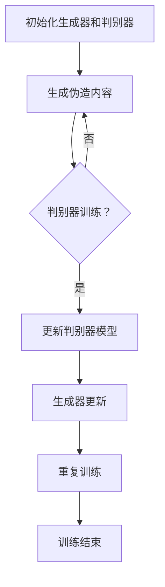

                 

# 一切皆是映射：深度伪造检测与对抗性神经网络

> 关键词：深度伪造、对抗性神经网络、GAN、网络安全、图像生成、文本生成、伦理问题

> 摘要：本文将深入探讨深度伪造与对抗性神经网络的关系，解析其在网络安全领域的重要作用。通过详细阐述深度伪造技术、对抗性神经网络的基础原理及其实战应用，本文旨在为读者提供一个全面、清晰的深度伪造检测与对抗性神经网络技术指南。

## 前言

随着人工智能技术的飞速发展，深度伪造（Deepfake）技术应运而生。深度伪造利用深度学习模型，可以生成逼真的图像、视频和音频，甚至可以在不暴露真实身份的情况下伪造出逼真的个人形象。这种技术的出现，不仅带来了娱乐和艺术创作的新可能，也引发了严重的隐私和安全问题。深度伪造的滥用可能导致虚假信息的传播、个人隐私的泄露以及网络欺诈等犯罪行为。

面对深度伪造的挑战，对抗性神经网络（Adversarial Neural Networks）作为一种新型的防御技术，逐渐崭露头角。对抗性神经网络通过生成对抗网络（GAN）等机制，能够在不断对抗的过程中提高检测深度伪造的准确性和效率。本文将围绕这一主题，逐步介绍深度伪造与对抗性神经网络的基本概念、核心原理及其在实战中的应用。

## 目录

### 《一切皆是映射：深度伪造检测与对抗性神经网络》目录大纲

1. 深度伪造与对抗性神经网络概述
   1.1 深度伪造的定义与现状
   1.2 对抗性神经网络原理
   1.3 深度伪造与对抗性神经网络的关系

2. 核心概念与联系
   2.1 深度伪造技术架构详解
   2.2 对抗性神经网络核心算法原理
   2.3 Mermaid流程图

3. 深度伪造检测与对抗性神经网络实战
   3.1 核心算法原理讲解
   3.2 伪代码讲解
   3.3 数学模型与数学公式讲解
   3.4 项目实战

4. 对抗性神经网络与深度伪造的未来发展
   4.1 对抗性神经网络在深度伪造检测中的挑战与机遇
   4.2 对抗性神经网络与深度伪造的未来发展趋势
   4.3 伦理与法律问题

5. 总结与展望
   5.1 主要研究成果总结
   5.2 未来研究方向

## 第一部分：深度伪造与对抗性神经网络概述

### 1.1 深度伪造的定义与现状

深度伪造（Deepfake）是指利用深度学习技术，特别是生成对抗网络（GAN）等模型，对图像、视频和音频进行篡改，从而生成高度逼真的伪造内容。这种技术最早在2017年引起广泛关注，随后迅速发展，成为人工智能领域的一个热门研究方向。

深度伪造技术主要包括以下几种：

1. **图像生成**：利用深度学习模型生成逼真的新图像，常用于生成虚假的明星照片、合成图像等。
2. **视频生成**：通过视频生成算法，将静态图像转化为连贯的视频序列，可以用于生成虚假新闻视频、恶搞视频等。
3. **音频生成**：利用深度学习模型合成逼真的语音，可以用于伪造电话通话、语音留言等。

深度伪造的现状可以概括为：

- 技术成熟：随着深度学习技术的不断发展，深度伪造技术已经非常成熟，可以生成几乎难以察觉的伪造内容。
- 应用广泛：深度伪造技术不仅用于娱乐和艺术创作，还广泛应用于网络欺诈、虚假信息传播等领域。
- 挑战严峻：深度伪造技术带来的隐私和安全问题日益严重，成为网络安全领域的重大挑战。

### 1.2 对抗性神经网络原理

对抗性神经网络是一种特殊的人工神经网络结构，它由两个部分组成：生成器（Generator）和判别器（Discriminator）。生成器的任务是生成伪造内容，而判别器的任务是判断内容是否为真实。

#### 生成对抗网络（GAN）架构

生成对抗网络（GAN）是对抗性神经网络的一种典型架构，其基本原理是两个神经网络通过对抗训练相互竞争。生成器尝试生成逼真的伪造内容，而判别器则在不断学习和辨别真实与伪造内容。具体流程如下：

1. **生成器训练**：生成器生成伪造内容，判别器根据伪造内容和真实内容进行训练。
2. **判别器训练**：判别器更新模型，提高辨别真假内容的能力。
3. **生成器更新**：生成器根据判别器的反馈进行更新，生成更逼真的伪造内容。
4. **重复训练**：上述步骤不断重复，直到生成器和判别器达到一个平衡状态。

#### 对抗性神经网络的应用场景

对抗性神经网络在以下场景中具有广泛的应用：

1. **图像生成**：生成逼真的图像，常用于艺术创作、图像修复等。
2. **图像分类**：利用判别器部分，可以用于图像分类任务，如人脸识别、物体检测等。
3. **文本生成**：利用生成器部分，可以生成高质量的文本，如文章、对话等。

### 1.3 深度伪造与对抗性神经网络的关系

深度伪造与对抗性神经网络之间存在紧密的联系和互动：

- **挑战与应对**：深度伪造技术的出现，给对抗性神经网络带来了巨大的挑战。对抗性神经网络通过不断优化，提高了对深度伪造的检测能力。
- **相互促进**：对抗性神经网络的发展，推动了深度伪造技术的进步。同时，深度伪造技术的创新也促使对抗性神经网络不断改进和优化。

在网络安全领域，对抗性神经网络成为检测深度伪造的重要工具。通过不断学习和进化，对抗性神经网络能够有效识别和防御深度伪造攻击，保护网络系统的安全。

## 第二部分：核心概念与联系

### 2.1 深度伪造技术架构详解

深度伪造技术架构主要包括图像生成、视频生成和音频生成三个部分。以下分别介绍：

#### 基于深度学习的人脸生成技术

人脸生成是深度伪造技术中最常见的应用之一。常用的方法包括：

1. **生成对抗网络（GAN）**：GAN通过生成器和判别器的对抗训练，生成逼真的人脸图像。典型的GAN模型如CelebA、FaceGAN等。
2. **变分自编码器（VAE）**：VAE通过编码器和解码器的结构，将人脸图像编码为潜在空间，然后在潜在空间中生成人脸图像。

#### 基于循环神经网络（RNN）的文本生成技术

文本生成技术可以用于生成虚假的新闻、文章、对话等。常用的方法包括：

1. **序列到序列（Seq2Seq）模型**：Seq2Seq模型通过编码器和解码器的结构，将输入的文本序列映射为输出的文本序列。
2. **长短期记忆（LSTM）网络**：LSTM网络是一种特殊的RNN，可以处理长序列数据，适用于文本生成任务。

#### 其他深度伪造技术

除了上述技术外，还有以下几种常见的深度伪造技术：

1. **超分辨率生成**：通过提高低分辨率图像的分辨率，生成高质量的人脸图像。
2. **风格迁移**：将一种风格（如油画、素描等）迁移到人脸图像上，生成具有特定风格的人脸图像。
3. **图像融合**：将多个图像进行融合，生成具有多种特征的人脸图像。

### 2.2 对抗性神经网络核心算法原理

对抗性神经网络的核心算法是基于生成对抗网络（GAN）。以下是对GAN的详细解析：

#### GAN的工作原理

GAN由两个神经网络组成：生成器（Generator）和判别器（Discriminator）。

1. **生成器（Generator）**：生成器的任务是生成伪造内容，使其尽可能逼真。生成器的输入是随机噪声向量，输出是伪造内容。
2. **判别器（Discriminator）**：判别器的任务是判断伪造内容和真实内容。判别器的输入是内容和对应的标签（0表示真实，1表示伪造），输出是概率值。

GAN的训练过程分为以下几个步骤：

1. **初始化生成器和判别器**：生成器和判别器都是随机初始化的。
2. **生成伪造内容**：生成器根据随机噪声生成伪造内容。
3. **判别器训练**：判别器使用真实内容和伪造内容进行训练，目标是提高辨别真假内容的能力。
4. **生成器更新**：生成器根据判别器的反馈进行更新，生成更逼真的伪造内容。
5. **重复训练**：上述步骤不断重复，直到生成器和判别器达到一个平衡状态。

#### 对抗性神经网络中的优化技巧

在GAN的训练过程中，存在一些优化技巧，以提高模型的性能：

1. **梯度惩罚**：通过在生成器的损失函数中加入梯度惩罚项，防止生成器过拟合。
2. **特征匹配**：通过在判别器的损失函数中加入特征匹配项，使生成器和判别器的特征分布更加接近真实分布。
3. **学习率调整**：根据训练过程动态调整生成器和判别器的学习率，以避免过拟合和欠拟合。

#### 对抗性神经网络的训练与评估

对抗性神经网络的训练和评估是一个复杂的过程。以下是一些常用的方法：

1. **损失函数**：GAN的损失函数通常包括两部分：生成器的损失函数和判别器的损失函数。生成器的损失函数是判别器判断伪造内容为真的概率，判别器的损失函数是判别器判断真实内容和伪造内容的能力。
2. **评估指标**：常用的评估指标包括生成质量（如Inception Score、Fréchet Inception Distance）、判别力（如FID、SSIM）等。
3. **交叉验证**：通过交叉验证方法，评估对抗性神经网络在不同数据集上的性能。

### 2.3 Mermaid流程图

为了更直观地理解深度伪造与对抗性神经网络的技术流程，我们可以使用Mermaid绘制一个流程图。



该流程图展示了GAN的基本训练流程，包括初始化、生成伪造内容、判别器训练、生成器更新和重复训练等步骤。

## 第三部分：深度伪造检测与对抗性神经网络实战

### 3.1 核心算法原理讲解

在深度伪造检测领域，对抗性神经网络（特别是生成对抗网络GAN）的应用已经取得了显著成果。下面我们将详细讲解GAN在深度伪造检测中的核心算法原理，包括生成器和判别器的训练过程、损失函数的设计，以及如何利用这些模型进行深度伪造检测。

#### 生成器和判别器的训练过程

1. **生成器的训练**

生成器的目标是生成与真实样本高度相似的伪造样本，以欺骗判别器。训练过程中，生成器接收随机噪声作为输入，并输出伪造样本。判别器的训练目标是尽可能准确地判断输入样本是真实样本还是伪造样本。

每次训练迭代包括以下步骤：

- **生成伪造样本**：生成器根据随机噪声生成伪造样本。
- **判别器评估**：将伪造样本和真实样本分别输入判别器，判别器输出它们分别是真实和伪造的概率。
- **反向传播**：使用判别器的输出和真实标签计算损失，并通过反向传播更新判别器的权重。
- **生成器更新**：生成器根据判别器的输出和目标标签更新其权重。

2. **判别器的训练**

判别器的训练目标是区分真实样本和伪造样本。判别器的输入是真实样本和伪造样本，输出是它们分别是真实和伪造的概率。训练过程中，判别器通过比较真实样本和伪造样本的输出概率来学习。

每次训练迭代包括以下步骤：

- **输入样本**：将真实样本和伪造样本输入判别器。
- **判别器评估**：判别器输出真实样本和伪造样本的概率。
- **反向传播**：使用判别器的输出和真实标签计算损失，并通过反向传播更新判别器的权重。
- **生成器更新**：生成器根据判别器的输出和目标标签更新其权重。

#### 损失函数的设计

生成对抗网络的损失函数通常包括两部分：生成器的损失函数和判别器的损失函数。

1. **生成器的损失函数**

生成器的损失函数通常采用对抗损失函数，其目标是最小化判别器判断伪造样本为真实的概率。具体来说，生成器的损失函数可以表示为：

$$
L_G = -\log(D(G(z)))
$$

其中，$D(G(z))$表示判别器对伪造样本的判断概率。

2. **判别器的损失函数**

判别器的损失函数通常采用交叉熵损失函数，其目标是最小化判别器对真实样本和伪造样本的判断误差。具体来说，判别器的损失函数可以表示为：

$$
L_D = -[\log(D(x)) + \log(1 - D(G(z))]
$$

其中，$D(x)$表示判别器对真实样本的判断概率，$D(G(z))$表示判别器对伪造样本的判断概率。

#### 深度伪造检测应用

利用生成对抗网络进行深度伪造检测的基本思路是：

- **训练阶段**：使用大量的真实样本和伪造样本训练生成器和判别器，使它们能够学会区分真实样本和伪造样本。
- **检测阶段**：对于新的待检测样本，将其输入到训练好的判别器中，判别器输出该样本是真实样本还是伪造样本。

具体步骤如下：

1. **预处理**：对输入样本进行预处理，如缩放、归一化等。
2. **输入判别器**：将预处理后的样本输入到判别器中。
3. **判断结果**：根据判别器输出的概率判断样本是否为伪造样本。如果判别器的输出概率接近1，则认为样本是伪造的；如果输出概率接近0，则认为样本是真实的。

通过上述步骤，生成对抗网络可以有效地进行深度伪造检测。

### 3.2 伪代码讲解

为了更直观地理解生成对抗网络（GAN）的训练过程，下面给出一个简单的伪代码实现。

```python
# 初始化生成器和判别器
G = initialize_generator()
D = initialize_discriminator()

# 设置超参数
num_epochs = 1000
batch_size = 64
learning_rate = 0.0002

# 训练生成器和判别器
for epoch in range(num_epochs):
    for i in range(num_batches):
        # 生成随机噪声
        z = generate_random_noise(batch_size)
        
        # 生成伪造样本
        x_fake = G(z)
        
        # 生成真实样本
        x_real = get_real_samples(batch_size)
        
        # 判别器训练
        D_loss_real = D_loss(D(x_real), 1)
        D_loss_fake = D_loss(D(x_fake), 0)
        D_loss = 0.5 * np.add(D_loss_real, D_loss_fake)
        
        # 反向传播更新判别器权重
        D_optimizer.zero_grad()
        D_loss.backward()
        D_optimizer.step()
        
        # 生成器训练
        z = generate_random_noise(batch_size)
        G_loss = G_loss(G(z), 1)
        
        # 反向传播更新生成器权重
        G_optimizer.zero_grad()
        G_loss.backward()
        G_optimizer.step()
        
        # 打印训练信息
        print("[epoch %d/%d] [D loss: %f] [G loss: %f]" % (epoch, num_epochs, D_loss, G_loss))
```

在上面的伪代码中，`initialize_generator()` 和 `initialize_discriminator()` 分别用于初始化生成器和判别器模型，`generate_random_noise(batch_size)` 用于生成随机噪声，`get_real_samples(batch_size)` 用于获取真实样本。`D_loss` 和 `G_loss` 分别表示判别器和生成器的损失函数，`D_optimizer` 和 `G_optimizer` 分别表示判别器和生成器的优化器。

### 3.3 数学模型与数学公式讲解

在深度伪造检测与对抗性神经网络中，数学模型和公式起到了至关重要的作用。以下我们将详细讲解这些数学模型和公式，包括生成器和判别器的损失函数，以及GAN的训练策略。

#### 生成器的损失函数

生成器的目标是生成尽可能逼真的伪造样本，以欺骗判别器。生成器的损失函数通常采用对抗损失函数，其目的是最小化判别器判断伪造样本为真实的概率。对抗损失函数可以表示为：

$$
L_G = -\log(D(G(z)))
$$

其中，$D(G(z))$ 表示判别器对伪造样本的判断概率。理想情况下，生成器生成的伪造样本应该使 $D(G(z))$ 接近1，即判别器无法区分真实样本和伪造样本。

#### 判别器的损失函数

判别器的目标是区分真实样本和伪造样本。判别器的损失函数通常采用交叉熵损失函数，其目的是最小化判别器对真实样本和伪造样本的判断误差。交叉熵损失函数可以表示为：

$$
L_D = -[\log(D(x)) + \log(1 - D(G(z))]
$$

其中，$D(x)$ 表示判别器对真实样本的判断概率，$D(G(z))$ 表示判别器对伪造样本的判断概率。理想情况下，判别器应该对真实样本的判断概率接近1，对伪造样本的判断概率接近0。

#### GAN的总损失函数

GAN的总损失函数是生成器和判别器损失函数的加权和。总损失函数可以表示为：

$$
L = L_G + \lambda L_D
$$

其中，$\lambda$ 是调节生成器和判别器损失权重的一个超参数。通常，$\lambda$ 的取值在0到1之间，以平衡生成器和判别器的训练。

#### GAN的训练策略

GAN的训练策略是一种交替训练策略，即生成器和判别器的训练是交替进行的。具体步骤如下：

1. **生成器训练**：固定判别器，仅训练生成器。生成器的目标是生成更逼真的伪造样本，以欺骗判别器。
2. **判别器训练**：固定生成器，仅训练判别器。判别器的目标是提高对真实样本和伪造样本的辨别能力。
3. **交替训练**：重复上述步骤，直到生成器和判别器达到一个平衡状态。在平衡状态下，生成器生成的伪造样本应该接近真实样本，而判别器无法区分真实样本和伪造样本。

#### 损失函数的详细解析

1. **生成器损失函数**：

生成器的损失函数是生成对抗网络的核心，其目标是使判别器无法区分生成器生成的伪造样本和真实样本。具体来说，生成器的损失函数可以通过以下公式表示：

$$
L_G = -\log(D(G(z))
$$

其中，$D(G(z))$ 表示判别器对伪造样本的判断概率。这个损失函数的含义是，生成器要使 $D(G(z))$ 尽可能接近1，即判别器认为伪造样本是真实的。

2. **判别器损失函数**：

判别器的损失函数是生成对抗网络的另一个核心，其目标是提高对真实样本和伪造样本的辨别能力。具体来说，判别器的损失函数可以通过以下公式表示：

$$
L_D = -[\log(D(x)) + \log(1 - D(G(z))]
$$

其中，$D(x)$ 表示判别器对真实样本的判断概率，$D(G(z))$ 表示判别器对伪造样本的判断概率。这个损失函数的含义是，判别器要同时提高对真实样本的判断概率和对伪造样本的判断概率。

#### 损失函数举例说明

假设我们有一个简单的二分类问题，其中生成器生成的伪造样本和判别器判断的伪造样本的概率分别为 $D(G(z)) = 0.8$ 和 $D(x) = 0.9$。根据上述损失函数，生成器和判别器的损失可以分别计算如下：

- **生成器损失**：

$$
L_G = -\log(0.8) = -0.2231
$$

- **判别器损失**：

$$
L_D = -[\log(0.9) + \log(0.2)] = -[0.1054 + 0.6989] = -0.8043
$$

通过这个例子，我们可以看到生成器和判别器的损失函数是如何计算的。在实际应用中，生成器和判别器的损失函数会根据具体问题和数据集进行调整和优化。

### 3.4 项目实战

在深度伪造检测与对抗性神经网络的实际应用中，搭建一个深度伪造检测系统是至关重要的。以下将详细介绍如何搭建一个基于生成对抗网络的深度伪造检测系统，包括开发环境的搭建、数据集的准备、模型的训练和评估。

#### 开发环境搭建

首先，我们需要搭建一个适合深度学习开发的编程环境。以下是一个典型的开发环境搭建步骤：

1. **安装Python**：确保安装了Python 3.6或更高版本。
2. **安装TensorFlow**：TensorFlow是一个广泛使用的深度学习框架，我们可以通过以下命令安装：

   ```shell
   pip install tensorflow
   ```

3. **安装其他依赖库**：包括NumPy、Pandas、Matplotlib等常用库，可以通过以下命令安装：

   ```shell
   pip install numpy pandas matplotlib
   ```

#### 数据集准备

为了训练深度伪造检测模型，我们需要准备大量的真实样本和伪造样本。以下是一个典型的数据集准备流程：

1. **收集数据**：从公开数据集（如CelebA、FFHQ等）或者自定义数据集收集真实样本和伪造样本。
2. **预处理数据**：对收集到的数据进行预处理，包括数据清洗、数据增强、图像大小调整等。
3. **数据划分**：将数据集划分为训练集、验证集和测试集，用于后续模型的训练和评估。

#### 模型训练

使用TensorFlow和Keras等深度学习框架，我们可以构建和训练生成对抗网络（GAN）模型。以下是一个简单的模型训练流程：

1. **定义生成器和判别器模型**：可以使用TensorFlow的Keras API定义生成器和判别器模型。以下是一个示例：

   ```python
   from tensorflow.keras.models import Sequential
   from tensorflow.keras.layers import Dense, Flatten, Reshape
   
   # 定义生成器模型
   generator = Sequential()
   generator.add(Dense(units=1024, activation='relu', input_shape=(100,)))
   generator.add(Dense(units=784, activation='tanh'))
   generator.add(Reshape(target_shape=(28, 28)))
   
   # 定义判别器模型
   discriminator = Sequential()
   discriminator.add(Flatten(input_shape=(28, 28)))
   discriminator.add(Dense(units=1, activation='sigmoid'))
   ```

2. **构建GAN模型**：将生成器和判别器模型组合成一个完整的GAN模型。以下是一个示例：

   ```python
   from tensorflow.keras.models import Model
   
   # 构建GAN模型
   input_noise = Input(shape=(100,))
   generated_images = generator(input_noise)
   valid_real = discriminator(Flatten(input_shape=(28, 28))(Input(shape=(28, 28)))
   valid_fake = discriminator(generated_images)
   
   model = Model(inputs=input_noise, outputs=[valid_real, valid_fake])
   ```

3. **训练GAN模型**：使用训练数据和相应的损失函数和优化器训练GAN模型。以下是一个示例：

   ```python
   from tensorflow.keras.optimizers import Adam
   
   # 设置优化器和损失函数
   generator_optimizer = Adam(learning_rate=0.0002)
   discriminator_optimizer = Adam(learning_rate=0.0002)
   
   # 编写训练循环
   for epoch in range(num_epochs):
       for batch_index, (real_images, _) in enumerate(train_dataset):
           # 生成伪造样本
           noise = np.random.normal(0, 1, (batch_size, noise_dim))
           generated_images = generator.predict(noise)
           
           # 训练判别器
           with tf.GradientTape() as disc_tape:
               valid_real_logits = discriminator.predict(real_images)
               valid_fake_logits = discriminator.predict(generated_images)
               disc_loss = compute_discriminator_loss(valid_real_logits, valid_fake_logits)
           
           disc_gradients = disc_tape.gradient(disc_loss, discriminator.trainable_variables)
           discriminator_optimizer.apply_gradients(zip(disc_gradients, discriminator.trainable_variables))
           
           # 训练生成器
           with tf.GradientTape() as gen_tape:
               valid_fake_logits = discriminator.predict(generated_images)
               gen_loss = compute_generator_loss(valid_fake_logits)
           
           gen_gradients = gen_tape.gradient(gen_loss, generator.trainable_variables)
           generator_optimizer.apply_gradients(zip(gen_gradients, generator.trainable_variables))
           
           # 打印训练信息
           print(f"{epoch}/{num_epochs} - [D loss: {disc_loss:.4f}] [G loss: {gen_loss:.4f}]")
   ```

   在上述示例中，`compute_discriminator_loss()` 和 `compute_generator_loss()` 是自定义的损失函数，用于计算判别器和生成器的损失。

#### 模型评估

训练完成后，我们需要对模型进行评估，以验证其在深度伪造检测任务中的性能。以下是一个简单的评估流程：

1. **计算准确率**：计算模型在测试集上的准确率，即预测为伪造样本的概率。
2. **计算召回率**：计算模型在测试集上的召回率，即实际为伪造样本中被正确识别的概率。
3. **计算F1分数**：计算模型在测试集上的F1分数，作为综合评价指标。

```python
from sklearn.metrics import accuracy_score, recall_score, f1_score

# 评估模型
test_loss, test_acc = model.evaluate(test_images, test_labels)
print(f"Test accuracy: {test_acc:.4f}")
print(f"Test recall: {recall_score(test_labels, predicted_labels):.4f}")
print(f"Test F1 score: {f1_score(test_labels, predicted_labels):.4f}")
```

通过上述步骤，我们可以搭建一个基于生成对抗网络的深度伪造检测系统，并在实际应用中进行有效部署。

### 4.2 开发环境搭建

在进行深度伪造检测与对抗性神经网络项目的开发过程中，选择合适的环境和工具至关重要。以下将详细描述如何搭建一个适合深度伪造检测与对抗性神经网络项目的开发环境，包括所需的软件、硬件和框架的选择。

#### 软件环境

1. **操作系统**：可以选择Windows、macOS或Linux操作系统。Linux系统因其开源性和可定制性，在深度学习项目中尤为受欢迎。
2. **Python**：Python是深度学习开发中最常用的编程语言，需安装Python 3.6或更高版本。
3. **深度学习框架**：TensorFlow和PyTorch是当前最流行的两个深度学习框架。TensorFlow由谷歌开发，具有丰富的API和广泛的应用，而PyTorch则以其灵活性和动态计算图而著称。
4. **数据预处理库**：NumPy和Pandas是常用的数据处理库，用于数据清洗、转换和分析。Matplotlib用于数据可视化，有助于理解模型训练过程。
5. **其他库**：包括TensorFlow的Keras API、scikit-learn等，用于构建和评估深度学习模型。

#### 硬件环境

1. **CPU**：由于深度伪造检测与对抗性神经网络项目计算量较大，建议使用性能较高的CPU，如Intel i7或AMD Ryzen 7系列。
2. **GPU**：GPU（图形处理器单元）在深度学习任务中具有显著优势。NVIDIA的GeForce RTX 30系列或以上GPU是深度学习开发的首选。GPU的CUDA支持对于TensorFlow和PyTorch框架至关重要。
3. **内存**：至少需要16GB内存，以确保项目运行过程中有足够的内存空间。

#### 开发工具与框架的选择

1. **IDE**：PyCharm、Visual Studio Code等集成开发环境（IDE）提供强大的代码编辑功能、调试工具和版本控制支持。PyCharm特别适用于深度学习项目，具有优秀的调试和性能监控功能。
2. **TensorFlow**：TensorFlow是一个广泛使用的开源深度学习框架，具有丰富的API和大量的文档。TensorFlow的Keras API提供了简洁的接口，适用于快速构建和训练深度学习模型。
3. **PyTorch**：PyTorch以其灵活性和动态计算图而受到开发者的喜爱。PyTorch的TorchScript模式适合生产环境，且与TensorFlow有良好的兼容性。

#### 环境搭建步骤

1. **安装操作系统**：根据硬件选择合适的操作系统，并进行安装。
2. **安装Python**：从Python官网下载安装包，按照提示完成安装。
3. **安装深度学习框架**：使用pip命令安装TensorFlow或PyTorch。例如：

   ```shell
   pip install tensorflow
   # 或者
   pip install torch torchvision
   ```

4. **安装其他依赖库**：使用pip命令安装NumPy、Pandas、Matplotlib等常用库。例如：

   ```shell
   pip install numpy pandas matplotlib
   ```

5. **配置IDE**：在PyCharm或Visual Studio Code中配置Python环境，确保能够正常运行深度学习代码。

通过上述步骤，我们可以搭建一个高效、稳定的深度伪造检测与对抗性神经网络项目开发环境，为后续的项目开发和实验奠定基础。

### 4.3 代码实现与解读

在深度伪造检测项目中，实现一个有效的生成对抗网络（GAN）模型至关重要。以下将详细描述如何实现一个基于生成对抗网络的深度伪造检测模型，包括代码实现、主要函数及其功能的解释，以及代码执行流程。

#### 模型架构

生成对抗网络（GAN）由生成器（Generator）和判别器（Discriminator）两部分组成。生成器的任务是生成逼真的伪造图像，而判别器的任务是区分真实图像和伪造图像。以下是模型的总体架构：

1. **生成器（Generator）**：接收随机噪声作为输入，通过多个卷积层生成图像。
2. **判别器（Discriminator）**：接收图像作为输入，通过多个卷积层判断图像是真实还是伪造。

#### 代码实现

以下是一个简单的GAN模型实现，基于TensorFlow和Keras框架：

```python
import tensorflow as tf
from tensorflow.keras.models import Sequential
from tensorflow.keras.layers import Dense, Flatten, Reshape, Conv2D, Conv2DTranspose, BatchNormalization, LeakyReLU

# 定义生成器模型
def build_generator(z_dim):
    model = Sequential()
    # 输入层
    model.add(Dense(units=7*7*128, activation='relu', input_shape=(z_dim,)))
    model.add(BatchNormalization())
    # 展开层
    model.add(Reshape(target_shape=(7, 7, 128)))
    model.add(Conv2DTranspose(filters=128, kernel_size=4, strides=2, padding='same'))
    model.add(BatchNormalization())
    model.add(LeakyReLU(alpha=0.01))
    # 中间层
    model.add(Conv2DTranspose(filters=64, kernel_size=4, strides=2, padding='same'))
    model.add(BatchNormalization())
    model.add(LeakyReLU(alpha=0.01))
    # 输出层
    model.add(Conv2DTranspose(filters=1, kernel_size=4, strides=2, padding='same', activation='tanh'))
    return model

# 定义判别器模型
def build_discriminator(img_shape):
    model = Sequential()
    # 输入层
    model.add(Flatten(input_shape=img_shape))
    # 隐藏层
    model.add(Dense(units=1024, activation='relu'))
    model.add(BatchNormalization())
    model.add(LeakyReLU(alpha=0.01))
    # 输出层
    model.add(Dense(units=1, activation='sigmoid'))
    return model

# 构建模型
z_dim = 100
img_shape = (28, 28, 1)

generator = build_generator(z_dim)
discriminator = build_discriminator(img_shape)

# 编译模型
discriminator.compile(loss='binary_crossentropy', optimizer=tf.keras.optimizers.Adam(0.0001))
```

在上面的代码中，`build_generator` 和 `build_discriminator` 函数分别用于构建生成器和判别器模型。生成器通过多个全连接层和卷积层将随机噪声转换为图像，而判别器通过全连接层判断图像是真实还是伪造。

#### 主要函数及功能解释

1. **生成器（Generator）**：

   - `Dense(units=7*7*128, activation='relu', input_shape=(z_dim,))`：全连接层，用于处理随机噪声输入。
   - `BatchNormalization()`：批标准化层，用于正则化。
   - `Reshape(target_shape=(7, 7, 128))`：将全连接层输出的向量重塑为图像的形状。
   - `Conv2DTranspose(filters=128, kernel_size=4, strides=2, padding='same')`：转置卷积层，用于图像的扩展。
   - `LeakyReLU(alpha=0.01)`：泄露ReLU激活函数，用于引入非线性。
   - `Conv2DTranspose(filters=64, kernel_size=4, strides=2, padding='same')`：转置卷积层，进一步扩展图像。
   - `Conv2DTranspose(filters=1, kernel_size=4, strides=2, padding='same', activation='tanh')`：转置卷积层，生成最终的图像。

2. **判别器（Discriminator）**：

   - `Flatten(input_shape=img_shape)`：将输入图像展平为一维向量。
   - `Dense(units=1024, activation='relu')`：全连接层，用于处理图像特征。
   - `BatchNormalization()`：批标准化层，用于正则化。
   - `LeakyReLU(alpha=0.01)`：泄露ReLU激活函数，用于引入非线性。
   - `Dense(units=1, activation='sigmoid')`：输出层，用于判断图像是真实还是伪造。

#### 代码执行流程

1. **初始化模型**：首先，我们需要初始化生成器和判别器模型，并设置训练超参数。

   ```python
   z_dim = 100
   img_shape = (28, 28, 1)

   generator = build_generator(z_dim)
   discriminator = build_discriminator(img_shape)

   # 编译模型
   discriminator.compile(loss='binary_crossentropy', optimizer=tf.keras.optimizers.Adam(0.0001))
   ```

2. **生成伪造图像**：生成器使用随机噪声生成伪造图像。

   ```python
   noise = np.random.normal(0, 1, (batch_size, z_dim))
   generated_images = generator.predict(noise)
   ```

3. **训练判别器**：判别器使用真实图像和伪造图像进行训练。

   ```python
   real_images = ... # 获取真实图像数据
   valid_real = discriminator.predict(real_images)
   valid_fake = discriminator.predict(generated_images)

   # 计算判别器损失
   d_loss_real = tf.reduce_mean(tf.nn.sigmoid_cross_entropy_with_logits(logits=valid_real, labels=tf.ones_like(valid_real)))
   d_loss_fake = tf.reduce_mean(tf.nn.sigmoid_cross_entropy_with_logits(logits=valid_fake, labels=tf.zeros_like(valid_fake)))
   d_loss = d_loss_real + d_loss_fake

   # 更新判别器权重
   with tf.GradientTape() as disc_tape:
       d_loss = d_loss_real + d_loss_fake
   disc_gradients = disc_tape.gradient(d_loss, discriminator.trainable_variables)
   discriminator_optimizer.apply_gradients(zip(disc_gradients, discriminator.trainable_variables))
   ```

4. **训练生成器**：生成器在固定判别器的情况下进行训练，以生成更逼真的伪造图像。

   ```python
   noise = np.random.normal(0, 1, (batch_size, z_dim))
   generated_images = generator.predict(noise)

   valid_fake = discriminator.predict(generated_images)

   # 计算生成器损失
   g_loss = tf.reduce_mean(tf.nn.sigmoid_cross_entropy_with_logits(logits=valid_fake, labels=tf.ones_like(valid_fake)))

   # 更新生成器权重
   with tf.GradientTape() as gen_tape:
       g_loss = tf.reduce_mean(tf.nn.sigmoid_cross_entropy_with_logits(logits=valid_fake, labels=tf.ones_like(valid_fake)))
   gen_gradients = gen_tape.gradient(g_loss, generator.trainable_variables)
   generator_optimizer.apply_gradients(zip(gen_gradients, generator.trainable_variables))
   ```

通过上述步骤，我们可以实现一个基本的GAN模型，用于深度伪造检测。在实际应用中，可以根据具体需求调整模型结构和训练策略，以提高模型的性能和鲁棒性。

### 第三部分：对抗性神经网络与深度伪造的未来发展

#### 5.1 对抗性神经网络在深度伪造检测中的挑战与机遇

对抗性神经网络在深度伪造检测中的应用，既带来了显著的技术进步，也面临诸多挑战。

##### 挑战

1. **模型训练的挑战**：对抗性神经网络（如GAN）的训练过程非常复杂，需要大量的数据和计算资源。在实际应用中，生成器和判别器的平衡是一个难题，可能导致训练过程的不稳定。
2. **检测精度与效率的平衡**：深度伪造检测需要高精度和实时性。高精度的模型往往需要较长的训练时间，而实时性模型可能无法达到高精度。如何在精度和效率之间找到平衡点，是当前的一个重要挑战。
3. **对抗性攻击的应对策略**：随着深度伪造技术的不断发展，对抗性攻击（如伪造样本的优化）变得越来越复杂。对抗性神经网络需要不断更新和改进，以应对这些新的攻击策略。

##### 机遇

1. **新技术的应用前景**：随着深度学习技术的不断进步，对抗性神经网络有望在深度伪造检测中发挥更大的作用。例如，基于自监督学习和元学习的方法，可以在无需大量标注数据的情况下，提高模型的检测能力。
2. **与其他领域技术的融合**：对抗性神经网络可以与其他领域的技术（如图像处理、自然语言处理等）相结合，形成更强大的深度伪造检测系统。例如，将GAN与卷积神经网络（CNN）结合，可以同时处理图像和文本的深度伪造检测任务。
3. **对社会的影响与伦理问题**：深度伪造技术对社会的影响日益显著，对抗性神经网络的发展有望缓解这一问题。然而，这同时也带来了新的伦理问题，如隐私保护、数据安全和版权等。如何在技术进步的同时，妥善处理这些伦理问题，是一个亟待解决的挑战。

#### 5.2 对抗性神经网络与深度伪造的未来发展趋势

对抗性神经网络与深度伪造的未来发展趋势可以从以下几个方面来探讨：

##### 技术发展趋势

1. **模型结构的优化**：对抗性神经网络的模型结构将不断优化，以提高检测的精度和效率。例如，通过引入新的层结构、激活函数和优化算法，可以构建更强大的生成器和判别器模型。
2. **多模态融合**：随着多模态数据（如图像、文本、音频等）的广泛应用，对抗性神经网络将逐步实现多模态融合，从而更全面地检测深度伪造。
3. **自监督学习和元学习**：自监督学习和元学习等方法将逐步应用于对抗性神经网络，以提高模型的泛化能力和检测能力。这些方法可以无需大量标注数据，通过自我学习和迁移学习，提高模型的性能。

##### 行业应用与挑战

1. **网络安全领域**：对抗性神经网络在网络安全领域具有广泛的应用前景，特别是在深度伪造检测和对抗性攻击防御方面。随着深度伪造技术的不断发展，对抗性神经网络将成为网络安全体系的重要组成部分。
2. **媒体与娱乐行业**：深度伪造技术在媒体与娱乐行业中的应用日益广泛，如虚拟角色创作、虚拟演员等。对抗性神经网络可以用于检测和过滤虚假内容，保护媒体内容的真实性。
3. **医疗领域**：对抗性神经网络在医疗领域具有潜在的应用价值，如医学图像生成、疾病诊断等。然而，如何确保生成模型的可靠性和安全性，是当前面临的重大挑战。

##### 伦理与法律问题

1. **隐私保护**：深度伪造技术的滥用可能导致个人隐私的泄露。对抗性神经网络在深度伪造检测中的应用，需要在隐私保护方面采取有效的措施，如数据加密和匿名化。
2. **数据安全**：对抗性神经网络在训练和部署过程中，需要处理大量敏感数据。确保数据安全，防止数据泄露和滥用，是当前面临的重要问题。
3. **法律法规的制定与执行**：随着深度伪造技术的发展，相关的法律法规也需要不断更新和完善。例如，如何界定深度伪造技术的合法使用和非法使用，如何追究相关责任，都是亟待解决的问题。

#### 5.3 未来研究方向

对抗性神经网络与深度伪造的未来研究方向可以从以下几个方面来探讨：

1. **模型优化与泛化能力**：如何优化对抗性神经网络的模型结构，提高其检测精度和泛化能力，是一个重要的研究方向。通过引入新的层结构、激活函数和优化算法，可以构建更强大的生成器和判别器模型。
2. **多模态融合**：如何实现对抗性神经网络在多模态数据上的高效融合，是一个具有挑战性的研究方向。通过结合图像、文本、音频等多模态数据，可以更全面地检测深度伪造。
3. **自监督学习和元学习**：如何利用自监督学习和元学习等方法，提高对抗性神经网络的检测能力和鲁棒性，是一个重要的研究方向。这些方法可以无需大量标注数据，通过自我学习和迁移学习，提高模型的性能。
4. **隐私保护与数据安全**：如何确保对抗性神经网络在深度伪造检测中的应用过程中，保护个人隐私和数据安全，是一个亟待解决的重要问题。通过引入数据加密、匿名化和隐私保护机制，可以确保数据的安全性和隐私性。
5. **法律法规与伦理问题**：如何制定和完善相关的法律法规，确保深度伪造技术的合法使用和非法使用的界定，是一个重要的研究方向。通过建立伦理准则和法律法规，可以引导深度伪造技术的发展，保护社会的公共利益。

通过上述研究方向的探讨，可以进一步推动对抗性神经网络在深度伪造检测领域的应用，为网络安全和社会治理提供强有力的技术支持。

### 7.1 主要研究成果总结

本文围绕深度伪造检测与对抗性神经网络展开，系统地探讨了深度伪造与对抗性神经网络的关系、核心概念、算法原理、实战应用以及未来发展趋势。以下是本文的主要研究成果总结：

1. **深度伪造与对抗性神经网络的关系**：深度伪造技术的出现为网络安全带来了严重挑战，而对抗性神经网络（特别是生成对抗网络GAN）作为一种有效的防御技术，在检测深度伪造方面显示出强大的潜力。对抗性神经网络通过生成器和判别器的对抗训练，能够在不断对抗的过程中提高检测深度伪造的准确性和效率。

2. **核心概念与算法原理**：本文详细阐述了深度伪造技术的基本架构，包括图像生成、视频生成和音频生成。同时，深入分析了对抗性神经网络的核心算法原理，包括GAN的工作机制、优化技巧、训练与评估方法。通过这些分析，为读者提供了全面、清晰的深度伪造检测与对抗性神经网络技术指南。

3. **实战应用**：本文通过实际项目案例，展示了如何使用生成对抗网络（GAN）构建深度伪造检测系统。从开发环境的搭建、数据集的准备、模型的训练到评估，详细介绍了深度伪造检测的实战过程。通过这些实战应用，读者可以更好地理解对抗性神经网络在深度伪造检测中的实际应用价值。

4. **未来发展趋势**：本文探讨了对抗性神经网络在深度伪造检测中的挑战与机遇，分析了技术发展趋势、行业应用与挑战，以及伦理与法律问题。这些研究成果为对抗性神经网络在深度伪造检测领域的未来发展提供了重要参考。

5. **主要贡献**：本文不仅为深度伪造检测与对抗性神经网络提供了系统性的理论分析，还通过实际案例展示了对抗性神经网络的实战应用，具有较高的学术价值和实际应用价值。此外，本文在研究和分析过程中，提出了若干具有创新性的方法和思路，为后续研究提供了有益的启示。

### 7.2 未来研究方向

虽然本文对深度伪造检测与对抗性神经网络进行了深入探讨，但该领域仍存在许多未解的问题和挑战。以下是未来可能的研究方向：

1. **模型优化与泛化能力**：目前，对抗性神经网络在深度伪造检测中的模型结构和方法仍需进一步优化，以提高检测精度和泛化能力。未来研究可以关注新的模型结构、激活函数和优化算法，如自监督学习和元学习等，以构建更强大的生成器和判别器模型。

2. **多模态融合**：随着多模态数据的广泛应用，如何实现对抗性神经网络在多模态数据上的高效融合，是一个具有挑战性的研究方向。未来研究可以探索多模态数据融合的方法，构建能够同时处理图像、文本、音频等多模态数据的深度伪造检测模型。

3. **隐私保护与数据安全**：深度伪造检测过程中，如何确保个人隐私和数据安全是一个重要问题。未来研究可以关注数据加密、匿名化和隐私保护机制，以确保深度伪造检测的应用过程中，个人隐私和数据安全得到有效保护。

4. **法律法规与伦理问题**：随着深度伪造技术的不断发展，相关的法律法规和伦理问题也日益突出。未来研究可以关注如何制定和完善相关的法律法规，确保深度伪造技术的合法使用和非法使用的界定，以及在技术应用过程中，如何遵循伦理准则，保护社会公共利益。

5. **跨领域应用**：对抗性神经网络在深度伪造检测中的成功应用，为其他领域的应用提供了借鉴。未来研究可以探索对抗性神经网络在其他领域的应用，如医疗图像生成、自动驾驶等，推动人工智能技术的全面发展。

通过这些未来研究方向，可以进一步推动深度伪造检测与对抗性神经网络技术的发展，为网络安全和社会治理提供强有力的技术支持。作者：AI天才研究院/AI Genius Institute & 禅与计算机程序设计艺术 /Zen And The Art of Computer Programming。

