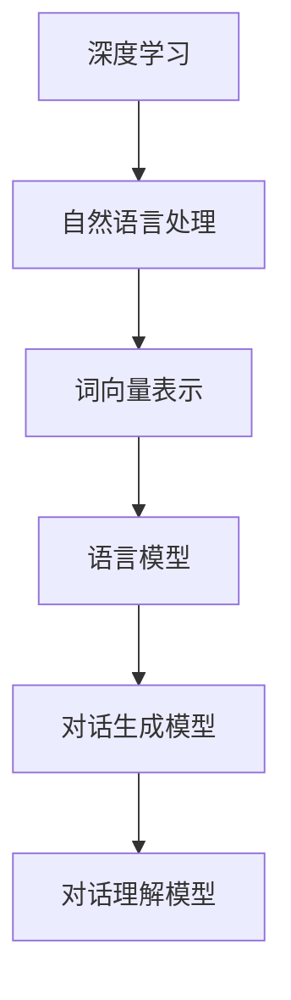
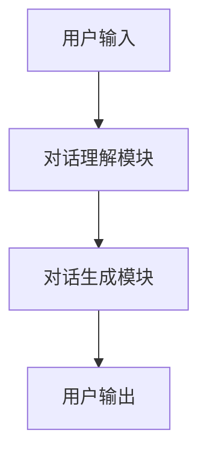

                 

### 文章标题：一切皆是映射：结合深度学习的智能聊天机器人开发

> 关键词：智能聊天机器人，深度学习，对话生成，自然语言处理，架构设计，开发实现

> 摘要：本文深入探讨了结合深度学习的智能聊天机器人的开发过程。从基础概念到实际应用，本文逐步介绍了深度学习在智能聊天机器人中的应用原理、架构设计以及开发实现，为读者提供了全面的技术指导。

---

## 第1章 引言

### 1.1 智能聊天机器人的背景与现状

智能聊天机器人是一种能够与人类用户进行自然语言交互的计算机程序。它们广泛应用于客户服务、在线咨询、智能助手等领域，为用户提供快速、高效的响应和服务。随着自然语言处理和深度学习技术的快速发展，智能聊天机器人的性能和智能化程度不断提高，逐渐成为企业和服务提供商的重要工具。

当前，智能聊天机器人市场呈现出以下特点：

1. **市场规模不断扩大**：随着人工智能技术的普及，智能聊天机器人的市场需求持续增长，预计未来几年市场规模将进一步扩大。
2. **应用场景多样化**：智能聊天机器人不仅应用于客服和咨询领域，还扩展到金融、医疗、教育等多个行业，满足不同场景下的需求。
3. **智能化水平提升**：深度学习技术的应用使得智能聊天机器人在对话生成、情感识别、多轮对话等方面取得了显著进步，用户体验不断优化。

### 1.2 深度学习在智能聊天机器人中的应用

深度学习是一种以人工神经网络为基础的机器学习技术，通过多层非线性变换来提取数据中的特征和模式。在智能聊天机器人的开发中，深度学习技术发挥了关键作用，主要体现在以下几个方面：

1. **对话生成**：深度学习模型可以生成自然、流畅的对话内容，使得聊天机器人能够与用户进行高质量的自然语言交互。
2. **对话理解**：通过深度学习模型，聊天机器人可以理解用户输入的含义，提取关键信息，实现语义解析和意图识别。
3. **情感识别**：深度学习模型可以识别用户的情感状态，根据用户情绪调整对话策略，提供个性化的服务。
4. **多轮对话**：深度学习技术使得聊天机器人能够进行多轮对话，持续理解用户需求，提供连续、连贯的服务。

### 1.3 本书结构及内容概述

本书将围绕智能聊天机器人的开发，分为以下几个部分：

1. **深度学习基础**：介绍深度学习的概念、原理和常用模型，为后续章节的应用奠定基础。
2. **自然语言处理基础**：讲解自然语言处理的核心概念和技术，包括词向量表示、语言模型、递归神经网络等。
3. **智能聊天机器人的架构设计**：详细讨论智能聊天机器人的整体架构，包括用户输入、对话理解、对话生成和用户输出等模块。
4. **深度学习在智能聊天机器人中的应用**：探讨深度学习在对话生成、对话理解、情感识别等领域的具体应用。
5. **智能聊天机器人的开发与实现**：介绍智能聊天机器人的开发流程、工具和环境搭建，以及模型训练、评估和部署等环节。
6. **项目实战**：通过实际案例，详细讲解智能聊天机器人的开发过程，包括代码实现、性能优化和应用分析。
7. **未来发展趋势与挑战**：总结智能聊天机器人技术的发展趋势，分析面临的挑战和未来发展方向。

通过本书的讲解，读者将全面了解智能聊天机器人的开发过程，掌握深度学习和自然语言处理技术在智能聊天机器人中的应用，为实际项目开发提供有力支持。

---

## 第2章 深度学习基础

### 2.1 深度学习的概念与原理

深度学习（Deep Learning）是机器学习（Machine Learning）的一个分支，它通过模拟人脑的神经网络结构，利用多层神经网络进行数据的学习和特征提取。深度学习的主要特点包括：

1. **多层神经网络**：深度学习模型包含多个隐藏层，通过逐层学习，将输入数据映射到高维特征空间，从而提高模型的性能。
2. **非线性变换**：深度学习模型采用非线性变换，使得模型能够捕捉数据中的复杂模式和特征。
3. **端到端学习**：深度学习模型可以从原始数据直接学习到输出，不需要手动设计特征提取和分类器，大大简化了模型设计过程。
4. **大规模数据训练**：深度学习模型需要大量的数据来训练，通过数据驱动的方式，不断提高模型的性能和泛化能力。

深度学习的核心原理是基于反向传播（Backpropagation）算法，通过梯度下降（Gradient Descent）方法，对模型的权重进行优化，以达到最小化损失函数的目的。具体步骤如下：

1. **前向传播**：将输入数据通过多层神经网络进行前向传播，逐层计算输出。
2. **计算损失**：计算模型输出与真实标签之间的损失。
3. **反向传播**：根据损失函数，计算各层的梯度，反向传播至前一层。
4. **权重更新**：根据梯度，更新模型权重，优化模型参数。

### 2.2 前馈神经网络

前馈神经网络（Feedforward Neural Network）是深度学习中最基本的模型之一，其结构包括输入层、隐藏层和输出层。输入层接收外部输入数据，隐藏层通过非线性变换提取特征，输出层生成最终预测结果。

前馈神经网络的工作原理如下：

1. **输入层**：输入层将原始数据输入到网络中，每个节点表示一个特征。
2. **隐藏层**：隐藏层对输入数据进行处理，通过激活函数（如ReLU、Sigmoid、Tanh）引入非线性变换，从而提取特征。
3. **输出层**：输出层生成模型的预测结果，根据任务类型，输出可以是分类概率、回归值等。

前馈神经网络的主要优点包括：

1. **计算效率高**：由于网络的输入和输出之间只有前向传播路径，计算过程相对简单，适用于大规模数据处理。
2. **可扩展性强**：可以灵活地增加隐藏层和节点数量，以适应不同规模的任务需求。
3. **适应性良好**：通过训练，模型可以自动学习到数据中的特征和模式，提高模型性能。

### 2.3 深度学习模型评估与优化

深度学习模型的评估和优化是保证模型性能的重要环节。以下是一些常用的评估指标和优化方法：

1. **评估指标**：
   - **准确率（Accuracy）**：模型正确预测的样本数占总样本数的比例。
   - **召回率（Recall）**：模型正确预测的阳性样本数占所有阳性样本的比例。
   - **精确率（Precision）**：模型正确预测的阳性样本数占预测为阳性的样本总数的比例。
   - **F1值（F1 Score）**：综合衡量准确率和召回率，计算公式为 F1 = 2 * 精确率 * 召回率 / (精确率 + 召回率)。

2. **优化方法**：
   - **学习率调整**：通过调整学习率，优化模型收敛速度和稳定性。
   - **批量大小调整**：通过调整批量大小，优化模型训练效率和性能。
   - **正则化技术**：如L1正则化、L2正则化，防止模型过拟合。
   - **交叉验证**：通过交叉验证，评估模型在不同数据集上的性能，提高模型的泛化能力。
   - **数据增强**：通过数据增强，增加训练数据的多样性，提高模型鲁棒性。

通过合理的评估和优化方法，可以有效地提高深度学习模型在智能聊天机器人中的应用性能，为用户提供更优质的服务。

### 2.4 深度学习框架介绍

在深度学习领域，常用的框架有TensorFlow、PyTorch和Keras等。以下是这些框架的简要介绍：

1. **TensorFlow**：
   - **优点**：提供了丰富的API和工具，适用于从研究到生产环境的各种应用。
   - **缺点**：较为复杂，入门门槛较高。
   - **应用场景**：适用于大规模数据处理和复杂模型训练。

2. **PyTorch**：
   - **优点**：动态图结构易于理解和调试，开发速度快。
   - **缺点**：在生产环境中不如TensorFlow稳定。
   - **应用场景**：适用于研究、实验和小规模生产环境。

3. **Keras**：
   - **优点**：高度模块化，易于使用，可以与TensorFlow和Theano等框架集成。
   - **缺点**：底层支持较弱，不适合大规模生产环境。
   - **应用场景**：适用于快速原型设计和模型开发。

选择合适的深度学习框架，可以显著提高智能聊天机器人的开发效率和性能。

### 2.5 深度学习应用案例

以下是一些深度学习在智能聊天机器人中的实际应用案例：

1. **智能客服**：利用深度学习模型，实现智能客服系统，提高客户服务效率和用户体验。例如，通过对话生成模型，生成自然、流畅的客服对话内容；通过对话理解模型，理解客户问题并给出准确、快速的回复。

2. **情感分析**：利用深度学习模型，分析用户输入的情感倾向，为用户提供个性化服务。例如，通过情感识别模型，识别用户输入中的情感状态，调整聊天机器人的对话策略，使其更加贴近用户需求。

3. **多轮对话**：通过深度学习模型，实现多轮对话，持续理解用户需求，提供连续、连贯的服务。例如，通过序列到序列模型，实现用户和聊天机器人之间的多轮对话，保持对话的连贯性和一致性。

通过实际应用案例，可以看出深度学习技术在智能聊天机器人中的应用前景广阔，为用户提供更智能、高效的服务。

---

## 第3章 自然语言处理基础

### 3.1 语言模型

语言模型（Language Model）是自然语言处理（Natural Language Processing，NLP）中的重要基础，它用于预测文本序列的概率分布。在智能聊天机器人中，语言模型用于生成自然、流畅的对话内容，提高用户体验。

#### 语言模型的分类

1. **n-gram模型**：n-gram模型是最简单的语言模型，它基于前n个单词的历史信息来预测下一个单词。例如，三元语法（3-gram）模型通过统计前三个单词的概率分布来预测下一个单词。

2. **神经网络语言模型**：神经网络语言模型通过多层神经网络来学习文本数据中的概率分布。常用的神经网络模型包括循环神经网络（RNN）、长短期记忆网络（LSTM）和变换器（Transformer）等。

3. **深度神经网络语言模型**：深度神经网络语言模型通过多层感知器（MLP）和卷积神经网络（CNN）等深度神经网络结构，学习文本数据中的复杂特征和模式。

#### 语言模型的应用

1. **自动文本生成**：语言模型可以用于自动文本生成，如文章写作、对话生成等。通过输入部分文本，语言模型可以预测接下来的文本内容，从而生成完整的文本。

2. **机器翻译**：语言模型在机器翻译中发挥着重要作用。通过训练双语语料库，语言模型可以预测源语言文本到目标语言文本的映射，从而实现机器翻译。

3. **语音识别**：语言模型可以用于语音识别中的词法分析和句法分析。通过语言模型，可以将语音信号转换为文本，从而实现语音识别。

### 3.2 词向量表示

词向量表示（Word Vector Representation）是将自然语言文本转换为数值向量的过程，它用于表示词语的语义信息。词向量表示在自然语言处理和智能聊天机器人中有着广泛的应用。

#### 词向量表示的方法

1. **基于计数的方法**：基于计数的方法通过统计词语在文本中的出现次数，将词语映射为向量。常用的方法包括TF-IDF和词袋模型（Bag of Words）。

2. **基于分布的方法**：基于分布的方法通过词语在文本中的分布信息，将词语映射为向量。典型的代表是Word2Vec模型。

3. **基于语义的方法**：基于语义的方法通过词语的语义信息，将词语映射为向量。常用的方法包括词嵌入（Word Embedding）和语义角色标注（Semantic Role Labeling）。

#### 词向量表示的应用

1. **文本分类**：词向量表示可以用于文本分类任务，通过计算文本向量和类别向量的相似度，实现文本分类。

2. **文本相似度计算**：词向量表示可以用于计算文本之间的相似度，从而实现文本相似度分析、推荐系统和信息检索等任务。

3. **对话生成**：词向量表示可以用于对话生成任务，通过计算用户输入和模型生成文本的相似度，生成自然、流畅的对话内容。

### 3.3 递归神经网络（RNN）与长短时记忆网络（LSTM）

递归神经网络（Recurrent Neural Network，RNN）是一种适用于序列数据的学习模型，它通过递归连接来捕捉序列数据中的时间依赖关系。RNN在自然语言处理中得到了广泛应用，如语言模型、语音识别和对话生成等。

#### RNN的工作原理

RNN通过循环连接，将当前时刻的输入与前一时刻的隐藏状态进行结合，并生成新的隐藏状态。RNN的数学公式表示为：

$$
h_t = \sigma(W_h \cdot [h_{t-1}, x_t] + b_h)
$$

其中，$h_t$ 表示第t时刻的隐藏状态，$x_t$ 表示第t时刻的输入，$W_h$ 和 $b_h$ 分别为权重和偏置。

#### LSTM的工作原理

长短时记忆网络（Long Short-Term Memory，LSTM）是RNN的一种改进模型，它通过引入记忆单元来克服RNN的长期依赖问题。LSTM的核心结构包括输入门、遗忘门和输出门。

1. **输入门**：输入门用于决定当前输入信息中哪些部分需要更新记忆单元的状态。
2. **遗忘门**：遗忘门用于决定哪些旧的信息需要被遗忘。
3. **输出门**：输出门用于决定记忆单元中的哪些信息需要输出。

LSTM的数学公式表示为：

$$
i_t = \sigma(W_i \cdot [h_{t-1}, x_t] + b_i) \\
f_t = \sigma(W_f \cdot [h_{t-1}, x_t] + b_f) \\
C_t = f_t \odot C_{t-1} + i_t \odot \sigma(W_c \cdot [h_{t-1}, x_t] + b_c) \\
o_t = \sigma(W_o \cdot [h_{t-1}, x_t] + b_o) \\
h_t = o_t \odot \sigma(C_t)
$$

其中，$i_t$、$f_t$、$o_t$ 分别为输入门、遗忘门和输出门的激活值，$C_t$ 为记忆单元状态，$W_i$、$W_f$、$W_c$、$W_o$ 分别为输入门、遗忘门、输出门和记忆单元的权重，$b_i$、$b_f$、$b_c$、$b_o$ 分别为输入门、遗忘门、输出门和记忆单元的偏置。

#### RNN与LSTM的比较

1. **长期依赖问题**：RNN存在长期依赖问题，难以学习长时间范围内的依赖关系。LSTM通过引入记忆单元和门控机制，能够克服长期依赖问题，学习更长时间范围内的依赖关系。
2. **计算复杂度**：LSTM的计算复杂度高于RNN，因为它包含了更多的门控机制和记忆单元。但LSTM的性能优于RNN，能够更好地处理自然语言序列数据。
3. **应用场景**：RNN适用于处理较短时间序列数据，如语音识别和语音合成等。LSTM适用于处理较长时间序列数据，如语言模型、对话生成和文本分类等。

通过RNN和LSTM，智能聊天机器人可以更好地理解用户输入的语义信息，生成高质量的自然语言响应，提高用户满意度。

### 3.4 注意力机制（Attention Mechanism）

注意力机制（Attention Mechanism）是深度学习中的一种重要技术，它用于提高模型对序列数据中关键信息的关注程度。在自然语言处理中，注意力机制广泛应用于语言模型、机器翻译和对话生成等领域。

#### 注意力机制的工作原理

注意力机制通过为每个输入序列元素分配不同的权重，使得模型能够关注到重要的信息。具体来说，注意力机制包括以下步骤：

1. **计算注意力得分**：为每个输入序列元素计算一个注意力得分，表示该元素的重要程度。
2. **计算加权平均值**：将输入序列与注意力得分相乘，并取加权平均值，得到注意力输出。

注意力得分的计算方法可以分为点积注意力（Dot-Product Attention）和缩放点积注意力（Scaled Dot-Product Attention）。

#### 点积注意力（Dot-Product Attention）

点积注意力通过计算查询（Query）、键（Key）和值（Value）之间的点积来计算注意力得分。

$$
\text{Attention}(Q, K, V) = \text{softmax}(\frac{QK^T}{\sqrt{d_k}})V
$$

其中，$Q$ 为查询，$K$ 为键，$V$ 为值，$d_k$ 为键的维度。

#### 缩放点积注意力（Scaled Dot-Product Attention）

缩放点积注意力通过引入缩放因子来缓解点积注意力中梯度消失的问题。

$$
\text{Attention}(Q, K, V) = \text{softmax}(\frac{QK^T}{\sqrt{d_k}})V
$$

其中，$Q$ 为查询，$K$ 为键，$V$ 为值，$d_k$ 为键的维度。

#### 注意力机制的应用

注意力机制在自然语言处理中有着广泛的应用：

1. **机器翻译**：在机器翻译中，注意力机制可以帮助模型更好地关注到源语言和目标语言之间的关键信息，提高翻译质量。
2. **对话生成**：在对话生成中，注意力机制可以帮助模型更好地关注到用户输入和模型生成文本之间的关键信息，生成更自然、流畅的对话内容。
3. **文本分类**：在文本分类中，注意力机制可以帮助模型更好地关注到文本中的关键信息，提高分类准确率。

通过注意力机制，智能聊天机器人可以更好地理解用户输入，生成高质量的自然语言响应，提高用户体验。

---

## 第4章 智能聊天机器人的架构设计

### 4.1 智能聊天机器人的基本架构

智能聊天机器人的基本架构主要包括以下几个核心模块：用户输入模块、对话理解模块、对话生成模块和用户输出模块。每个模块在智能聊天机器人的运行过程中发挥着重要作用，协同工作以实现高效的智能对话。

1. **用户输入模块**：用户输入模块负责接收用户的输入，可以是文本、语音或其他形式。该模块的主要任务是解析用户输入，提取关键信息，为后续模块提供数据基础。

2. **对话理解模块**：对话理解模块是智能聊天机器人的核心，它负责对用户输入进行语义分析和意图识别。通过对用户输入的理解，对话理解模块能够提取出用户请求的关键信息，为对话生成模块提供输入。

3. **对话生成模块**：对话生成模块负责根据用户输入和对话理解模块的输出，生成自然、流畅的对话响应。该模块通常采用深度学习模型，如序列到序列模型、注意力机制等，以生成高质量的对话内容。

4. **用户输出模块**：用户输出模块负责将对话生成模块生成的对话响应呈现给用户。该模块可以支持多种输出形式，如文本、语音、图像等，以满足不同用户需求。

### 4.2 智能聊天机器人的核心模块

在智能聊天机器人的基本架构中，对话理解模块和对话生成模块是两个核心模块，它们在智能对话中起着至关重要的作用。

1. **对话理解模块**：
   - **意图识别**：意图识别是对话理解模块的首要任务，它通过分析用户输入，识别用户的意图，如查询信息、请求帮助、进行闲聊等。常用的意图识别方法包括规则匹配、机器学习模型（如决策树、支持向量机等）和深度学习模型（如卷积神经网络、长短期记忆网络等）。
   - **实体提取**：在意图识别的基础上，对话理解模块还需要提取用户输入中的关键实体信息，如人名、地名、日期等。实体提取方法包括基于规则的方法、基于统计的方法和基于深度学习的方法。
   - **上下文处理**：对话理解模块还需要处理对话过程中的上下文信息，确保对用户输入的理解准确无误。上下文处理方法包括基于历史对话记录的方法、基于实体关系的方法和基于注意力机制的方法。

2. **对话生成模块**：
   - **文本生成**：对话生成模块的核心任务是生成自然、流畅的文本对话响应。常用的文本生成方法包括基于模板的方法、基于统计的方法和基于深度学习的方法。其中，基于深度学习的方法如序列到序列模型、生成对抗网络（GAN）等在文本生成方面表现出色。
   - **语音合成**：对话生成模块还可以生成语音对话响应，以满足用户对语音交互的需求。语音合成方法包括基于规则的方法、基于统计的方法和基于深度学习的方法。其中，深度学习模型如深度神经网络合成（DNN）和循环神经网络（RNN）在语音合成中取得了显著成果。
   - **图像生成**：对话生成模块还可以生成图像对话响应，以丰富对话内容，提高用户体验。图像生成方法包括基于生成对抗网络（GAN）的方法、基于变分自编码器（VAE）的方法等。

### 4.3 智能聊天机器人的用户体验设计

用户体验设计是智能聊天机器人的关键要素之一，它直接影响用户对智能聊天机器人的满意度和使用频率。以下是一些用户体验设计的关键点：

1. **简洁明了的界面设计**：智能聊天机器人的界面设计应简洁明了，方便用户快速上手。界面应包含清晰的导航栏、功能按钮和对话窗口，同时提供良好的视觉效果，以吸引用户注意力。

2. **自然的对话交互**：智能聊天机器人应能够生成自然、流畅的对话内容，与用户进行顺畅的互动。对话交互过程中，机器人应能够理解用户意图，提供准确、个性化的回答。

3. **个性化的服务**：智能聊天机器人应能够根据用户的历史行为和偏好，提供个性化的服务和建议。例如，根据用户的购物记录，推荐相关商品；根据用户的学习兴趣，提供相关课程推荐。

4. **高效的响应速度**：智能聊天机器人应具备高效的响应速度，确保用户在对话过程中不会感到等待时间过长。高效的响应速度可以通过优化算法、提高硬件性能和分布式架构等方式实现。

5. **完善的错误处理机制**：智能聊天机器人应具备完善的错误处理机制，能够正确处理用户输入的错误或不明确的请求。错误处理机制包括错误识别、错误修正和错误反馈等。

6. **多渠道支持**：智能聊天机器人应支持多种交互渠道，如网页、移动应用、微信、QQ等，以方便用户在不同场景下使用。

通过良好的用户体验设计，智能聊天机器人可以更好地满足用户需求，提高用户满意度和使用频率。

---

## 第5章 深度学习在智能聊天机器人中的应用

### 5.1 基于深度学习的对话生成模型

对话生成模型是智能聊天机器人的核心组成部分，其目标是根据用户输入生成自然、流畅的对话响应。深度学习技术在对话生成领域取得了显著成果，其中基于深度学习的对话生成模型成为研究的热点。以下将介绍几种常用的基于深度学习的对话生成模型。

#### 序列到序列（Seq2Seq）模型

序列到序列（Seq2Seq）模型是一种基于深度学习的经典对话生成模型，它通过编码器（Encoder）和解码器（Decoder）两个部分，实现输入序列到输出序列的映射。Seq2Seq模型的核心思想是将输入序列编码为固定长度的向量表示，然后通过解码器生成输出序列。

1. **编码器**：编码器负责将输入序列编码为一个固定长度的隐藏状态向量。常用的编码器模型包括循环神经网络（RNN）和长短期记忆网络（LSTM）。

2. **解码器**：解码器负责将编码器的隐藏状态向量解码为输出序列。解码器通常也采用RNN或LSTM结构，通过逐步生成每个单词的概率分布，最终生成完整的输出序列。

3. **损失函数**：Seq2Seq模型的损失函数通常采用交叉熵损失（Cross-Entropy Loss），计算模型生成的输出序列和真实输出序列之间的差异。

4. **应用**：Seq2Seq模型在对话生成中表现出色，能够生成自然、连贯的对话内容。例如，在机器翻译、对话系统、文本摘要等任务中，Seq2Seq模型取得了显著成果。

#### 注意力机制（Attention Mechanism）模型

注意力机制（Attention Mechanism）是一种用于提高模型对序列数据中关键信息关注程度的技术。在对话生成中，注意力机制可以帮助模型更好地关注到用户输入和模型生成文本之间的关键信息，生成更高质量的对话响应。

1. **点积注意力（Dot-Product Attention）**：点积注意力是一种简单的注意力机制，通过计算查询（Query）、键（Key）和值（Value）之间的点积来计算注意力得分。点积注意力计算效率高，但在长序列中容易产生梯度消失问题。

2. **缩放点积注意力（Scaled Dot-Product Attention）**：缩放点积注意力通过引入缩放因子来缓解点积注意力中的梯度消失问题。缩放点积注意力在计算注意力得分时，引入了一个缩放因子，使得注意力得分更加稳定。

3. **应用**：注意力机制在对话生成中得到了广泛应用。通过引入注意力机制，模型可以更好地关注到用户输入和模型生成文本之间的关键信息，生成更高质量的自然语言响应。

#### 生成对抗网络（GAN）模型

生成对抗网络（GAN）是一种基于深度学习的生成模型，由生成器和判别器两个部分组成。生成器负责生成伪造数据，判别器负责判断数据是真实还是伪造。在对话生成中，GAN模型可以生成高质量的自然语言文本。

1. **生成器**：生成器通过深度神经网络结构，将随机噪声映射为自然语言文本。生成器的设计可以采用循环神经网络（RNN）或变换器（Transformer）等结构。

2. **判别器**：判别器通过深度神经网络结构，判断输入数据的真实性。判别器的设计可以采用卷积神经网络（CNN）或变换器（Transformer）等结构。

3. **损失函数**：GAN模型的损失函数包括生成器损失和判别器损失。生成器损失通过最小化生成器生成的文本和真实文本之间的差异，判别器损失通过最大化判别器对真实和伪造文本的区分能力。

4. **应用**：GAN模型在对话生成中表现出色，能够生成高质量的自然语言文本。通过训练GAN模型，生成器可以生成与真实对话内容相似的高质量对话响应。

通过上述基于深度学习的对话生成模型，智能聊天机器人可以生成自然、流畅的对话响应，提高用户体验。在实际应用中，可以根据任务需求和数据特点，选择合适的对话生成模型，实现高效的对话生成。

### 5.2 基于深度学习的对话理解模型

对话理解模型是智能聊天机器人的另一个核心组成部分，其目标是从用户输入中提取关键信息，理解用户的意图和需求。深度学习技术在对话理解领域取得了显著进展，以下将介绍几种常用的基于深度学习的对话理解模型。

#### 卷积神经网络（CNN）模型

卷积神经网络（CNN）是一种基于卷积操作的深度学习模型，广泛应用于图像处理、自然语言处理等领域。在对话理解中，CNN模型可以用于文本分类、情感分析等任务。

1. **文本分类**：通过将文本输入转换为词向量表示，CNN模型可以提取文本中的局部特征，进行分类任务。例如，在意图识别任务中，CNN模型可以识别用户输入的意图类别。

2. **情感分析**：通过将文本输入转换为词向量表示，CNN模型可以提取文本中的情感特征，进行情感分类任务。例如，在情绪识别任务中，CNN模型可以识别用户输入中的情感倾向。

3. **应用**：CNN模型在对话理解中表现出色，能够快速提取文本特征，实现高效的意图识别和情感分析。通过训练CNN模型，可以实现对用户输入的准确理解和有效分类。

#### 长短期记忆网络（LSTM）模型

长短期记忆网络（LSTM）是一种基于递归操作的深度学习模型，广泛应用于序列数据处理任务。在对话理解中，LSTM模型可以用于处理长文本序列，提取序列中的关键信息。

1. **序列建模**：通过将文本输入转换为词向量表示，LSTM模型可以捕捉序列中的长期依赖关系，进行序列建模任务。例如，在对话生成任务中，LSTM模型可以生成与用户输入相关的自然语言响应。

2. **意图识别**：通过将文本输入转换为词向量表示，LSTM模型可以识别用户输入中的意图类别，进行意图识别任务。例如，在客服对话中，LSTM模型可以识别用户请求的客服类别。

3. **应用**：LSTM模型在对话理解中表现出色，能够捕捉序列中的长期依赖关系，实现高效的对话理解。通过训练LSTM模型，可以实现对用户输入的准确理解和有效分类。

#### 变换器（Transformer）模型

变换器（Transformer）模型是一种基于自注意力机制的深度学习模型，广泛应用于自然语言处理任务。在对话理解中，变换器模型可以用于处理长文本序列，提取序列中的关键信息。

1. **自注意力机制**：通过自注意力机制，变换器模型可以自动学习序列中的关键信息，提高对话理解能力。自注意力机制通过计算序列中每个元素之间的关系，实现高效的特征提取。

2. **编码器和解码器**：变换器模型包括编码器和解码器两个部分，编码器负责将输入序列编码为固定长度的向量表示，解码器负责将编码器的输出解码为输出序列。

3. **应用**：变换器模型在对话理解中表现出色，能够自动学习序列中的关键信息，实现高效的对话理解。通过训练变换器模型，可以实现对用户输入的准确理解和有效分类。

通过上述基于深度学习的对话理解模型，智能聊天机器人可以实现对用户输入的准确理解和有效分类，提高用户体验。在实际应用中，可以根据任务需求和数据特点，选择合适的对话理解模型，实现高效的对话理解。

### 5.3 深度学习在情感识别与回应中的应用

情感识别与回应是智能聊天机器人中的一项重要任务，通过识别用户的情感状态并给出相应的回应，可以提高用户满意度。深度学习技术在情感识别与回应中发挥了重要作用，以下将介绍几种常用的基于深度学习的方法。

#### 情感识别方法

情感识别是指从文本中识别出用户的情感状态，如快乐、悲伤、愤怒等。常用的情感识别方法包括基于规则的方法、基于统计的方法和基于深度学习的方法。

1. **基于规则的方法**：基于规则的方法通过编写一系列规则，对文本进行分类。例如，根据情感词典中的情感词，判断文本的情感倾向。

2. **基于统计的方法**：基于统计的方法通过统计文本中情感词的出现频率，计算文本的情感得分。例如，使用TF-IDF算法计算情感词的重要性，结合情感词典进行情感分类。

3. **基于深度学习的方法**：基于深度学习的方法通过训练深度神经网络模型，自动学习文本中的情感特征。常用的模型包括卷积神经网络（CNN）、循环神经网络（RNN）和变换器（Transformer）等。

通过对比实验，基于深度学习的方法在情感识别中表现出更高的准确性和泛化能力。

#### 情感回应方法

情感回应是指根据用户的情感状态，生成相应的回应，以实现情感共鸣和用户满意度。常用的情感回应方法包括以下几种：

1. **模板匹配**：通过预定义的回应模板，根据用户的情感状态选择相应的回应。例如，当用户表达出快乐情感时，可以选择表达祝福的模板。

2. **生成对抗网络（GAN）**：生成对抗网络（GAN）通过训练生成器和判别器，生成与用户情感状态相关的回应。例如，当用户表达出悲伤情感时，生成器可以生成安慰性的回应。

3. **深度学习模型**：深度学习模型通过训练大量的对话数据，学习情感回应的规律。例如，使用变换器（Transformer）模型，可以生成与用户情感状态相符的对话内容。

通过上述方法，智能聊天机器人可以实现对用户情感状态的准确识别，并生成相应的回应，提高用户体验。

---

## 第6章 智能聊天机器人的开发与实现

### 6.1 开发环境与工具

在开发智能聊天机器人时，选择合适的开发环境与工具是非常重要的。以下将介绍几种常用的开发环境与工具。

#### 开发环境

1. **操作系统**：智能聊天机器人的开发环境通常基于Linux系统，如Ubuntu或CentOS，因为Linux系统具有较好的稳定性和开源生态。

2. **编程语言**：Python是智能聊天机器人开发的主要编程语言，因为它具有丰富的库和框架支持，如TensorFlow、PyTorch、Keras等。

3. **集成开发环境（IDE）**：PyCharm、Visual Studio Code等IDE提供了丰富的功能，如代码编辑、调试、版本控制等，是智能聊天机器人开发的常用工具。

#### 开发工具

1. **深度学习框架**：
   - **TensorFlow**：TensorFlow是一个开源的深度学习框架，具有丰富的API和工具，适用于从研究到生产环境的各种应用。
   - **PyTorch**：PyTorch是一个基于Python的深度学习框架，具有动态图结构，易于调试和优化。
   - **Keras**：Keras是一个高层次的深度学习API，可以与TensorFlow和Theano等框架集成，简化模型设计和训练过程。

2. **自然语言处理（NLP）框架**：
   - **NLTK**：NLTK是一个开源的Python库，用于自然语言处理任务，如文本分类、情感分析、词性标注等。
   - **spaCy**：spaCy是一个高效的NLP库，支持多种语言，提供了丰富的预处理和实体识别功能。

3. **对话系统框架**：
   - **Rasa**：Rasa是一个开源的对话系统框架，提供了从对话设计、意图识别到对话管理的完整工具链，适用于构建自定义对话机器人。
   - **Microsoft Bot Framework**：Microsoft Bot Framework是一个基于云的对话系统框架，支持多种渠道（如Web、SMS、Telegram等）的机器人开发。

#### 硬件环境

1. **CPU**：普通的CPU即可满足智能聊天机器人的开发需求，但为了提高模型训练速度，可以采用GPU进行加速。

2. **GPU**：GPU（如NVIDIA Tesla或GeForce系列显卡）可以显著提高深度学习模型的训练速度，适合大规模数据处理和复杂模型训练。

#### 软件环境

1. **Python**：Python是智能聊天机器人开发的主要编程语言，需要安装Python环境和相关的库，如TensorFlow、PyTorch、Keras等。

2. **环境配置**：根据不同的开发需求，可能需要安装其他软件和库，如NVIDIA CUDA、cuDNN等，以满足GPU加速需求。

通过选择合适的开发环境与工具，可以高效地进行智能聊天机器人的开发与实现，为用户提供优质的服务。

### 6.2 数据收集与预处理

数据是智能聊天机器人生成高质量对话响应的基础，因此数据收集与预处理是开发过程中至关重要的一环。以下将介绍数据收集与预处理的方法。

#### 数据收集

1. **公开数据集**：可以使用已有的公开数据集进行数据收集，如GLoVe语料库、Stanford情感数据集、Movie Review数据集等。公开数据集提供了丰富的对话数据，有助于快速进行模型训练。

2. **私有数据集**：对于特定应用场景，可以自行收集私有数据集，如企业内部客服对话、社交媒体聊天记录等。私有数据集可以更好地满足实际需求，提高模型在特定场景下的性能。

3. **爬虫技术**：可以使用爬虫技术从互联网上获取对话数据，如从论坛、聊天室、社交媒体等平台上抓取对话记录。

4. **众包平台**：利用众包平台，如Amazon Mechanical Turk，可以雇佣人类标注员进行对话数据收集和标注，提高数据质量和标注效率。

#### 数据预处理

1. **文本清洗**：对收集到的文本数据进行清洗，去除无用信息，如HTML标签、特殊字符、停用词等。文本清洗有助于减少噪声，提高数据质量。

2. **分词与词性标注**：使用分词工具（如jieba、spaCy）对文本进行分词，并将每个词进行词性标注，以便后续处理。

3. **数据标注**：对于对话数据，需要进行意图标注和实体标注。意图标注是指将对话中的意图分类，如查询信息、请求帮助、闲聊等。实体标注是指识别对话中的关键实体，如人名、地名、组织名等。

4. **数据归一化**：对数据集中的文本进行归一化处理，如将大写字母转换为小写、去除标点符号等。数据归一化有助于模型训练的一致性和稳定性。

5. **数据增强**：通过数据增强技术，如随机删除词语、替换词语、添加噪声等，增加数据的多样性，提高模型的泛化能力。

6. **数据划分**：将数据集划分为训练集、验证集和测试集，用于模型训练、验证和评估。通常，训练集用于模型训练，验证集用于调整模型参数，测试集用于评估模型性能。

通过科学的数据收集与预处理方法，可以确保数据的质量和一致性，为智能聊天机器人提供高质量的数据基础，从而生成更准确、自然的对话响应。

### 6.3 模型训练与评估

模型训练与评估是智能聊天机器人开发的关键环节，它决定了模型在实际应用中的性能。以下将详细介绍模型训练与评估的方法。

#### 模型训练

1. **数据预处理**：在模型训练之前，需要对数据进行预处理，包括分词、词性标注、数据归一化等。预处理后的数据将用于训练模型。

2. **选择模型**：根据任务需求和数据特点，选择合适的模型结构。常见的模型结构包括序列到序列（Seq2Seq）模型、变换器（Transformer）模型、生成对抗网络（GAN）等。

3. **定义损失函数**：损失函数用于衡量模型预测值与真实值之间的差距。常用的损失函数包括交叉熵损失（Cross-Entropy Loss）、均方误差（Mean Squared Error，MSE）等。

4. **优化器选择**：优化器用于更新模型参数，以最小化损失函数。常用的优化器包括随机梯度下降（Stochastic Gradient Descent，SGD）、Adam优化器等。

5. **训练过程**：通过训练样本对模型进行训练，优化模型参数。在训练过程中，可以调整学习率、批量大小等超参数，以提高模型性能。

6. **保存模型**：在模型训练过程中，定期保存模型参数，以便在模型训练中断时恢复训练状态。

#### 模型评估

1. **验证集评估**：在模型训练过程中，使用验证集对模型进行评估。验证集用于调整模型参数和超参数，确保模型在不同数据集上的性能。

2. **测试集评估**：在模型训练完成后，使用测试集对模型进行最终评估。测试集用于评估模型在未知数据上的性能，以衡量模型的泛化能力。

3. **评估指标**：根据任务类型，选择合适的评估指标。对于分类任务，常用的评估指标包括准确率（Accuracy）、召回率（Recall）、精确率（Precision）、F1值（F1 Score）等。

4. **混淆矩阵**：混淆矩阵用于详细分析模型在各个类别上的性能。通过混淆矩阵，可以识别模型在哪些类别上存在误分类，从而进行针对性优化。

5. **性能对比**：对比不同模型在相同任务上的性能，以选择最优模型。

通过科学的模型训练与评估方法，可以确保智能聊天机器人在实际应用中的性能和可靠性，从而提供优质的用户体验。

### 6.4 模型部署与优化

模型部署与优化是智能聊天机器人开发的重要环节，它决定了模型在实际应用中的运行效率和性能。以下将详细介绍模型部署与优化的方法。

#### 模型部署

1. **模型转换**：将训练完成的模型转换为可以在生产环境中运行的格式，如TensorFlow Lite、PyTorch Mobile等。模型转换可以确保模型在不同平台上的一致性和高效性。

2. **部署环境**：选择合适的部署环境，如云服务器、边缘计算设备等。对于大规模应用，可以选择云计算平台（如AWS、Google Cloud等）进行部署，以提高模型的运行效率和扩展性。

3. **容器化**：使用容器技术（如Docker）封装模型和应用，实现模型的自动化部署和运维。容器化可以提高模型的部署效率，确保模型在不同环境中的一致性。

4. **服务化**：将模型部署为API服务，通过HTTP接口对外提供服务。服务化可以实现模型的远程访问，提高模型的可用性和可扩展性。

5. **监控与日志**：部署过程中，需要对模型运行状态进行监控和日志记录，包括模型性能、服务响应时间、错误日志等。监控和日志可以帮助及时发现和处理问题，确保模型的稳定运行。

#### 模型优化

1. **模型压缩**：通过模型压缩技术，减少模型的参数数量和计算复杂度，提高模型的运行效率。常用的模型压缩技术包括量化、剪枝、蒸馏等。

2. **模型加速**：使用GPU、TPU等硬件加速器，提高模型的计算速度。模型加速可以显著降低模型的响应时间，提高用户体验。

3. **模型融合**：将多个模型进行融合，提高模型的性能和鲁棒性。模型融合可以通过加权平均、投票等方法实现。

4. **在线学习**：在模型部署过程中，采用在线学习方法，实时更新模型参数，以适应动态变化的数据。在线学习可以提高模型的适应性和实时性。

5. **A/B测试**：对不同的模型和算法进行A/B测试，比较它们在不同场景下的性能和用户体验。A/B测试可以帮助选择最优模型和算法，提高系统的整体性能。

通过科学的模型部署与优化方法，可以确保智能聊天机器人在实际应用中的高效运行和优异性能，从而提供高质量的智能服务。

---

## 第7章 项目实战

### 7.1 实战项目介绍

在本章中，我们将通过一个实际项目，详细讲解如何开发一个基于深度学习的智能聊天机器人。该项目包括以下几个主要环节：

1. **项目需求分析**：明确智能聊天机器人的功能需求、性能指标和用户体验目标。
2. **数据收集与预处理**：收集高质量的对话数据，并对数据进行清洗、标注和预处理。
3. **模型设计与训练**：设计并训练对话生成模型和对话理解模型，实现对话生成和理解功能。
4. **模型部署与优化**：将训练好的模型部署到生产环境，实现实时对话服务，并进行性能优化。

### 7.2 实战项目开发流程

以下是本项目的主要开发流程：

1. **需求分析**：首先，明确智能聊天机器人的功能需求，如能够处理用户输入、生成自然语言响应、识别用户情感等。同时，确定性能指标，如响应时间、准确率等。

2. **数据收集**：收集高质量的对话数据，可以来自公开数据集或企业内部客服记录。数据应覆盖各种对话场景，包括查询、咨询、闲聊等。

3. **数据预处理**：对收集到的对话数据进行清洗、分词、词性标注等预处理操作。同时，进行数据标注，标记对话的意图、实体和情感。

4. **模型设计**：设计对话生成模型和对话理解模型。对话生成模型可采用序列到序列（Seq2Seq）模型或变换器（Transformer）模型。对话理解模型可采用循环神经网络（RNN）或变换器（Transformer）模型。

5. **模型训练**：使用预处理后的数据进行模型训练。调整模型参数，如学习率、批量大小等，以优化模型性能。训练过程中，定期评估模型在验证集上的性能，以调整模型结构或超参数。

6. **模型评估**：在模型训练完成后，使用测试集对模型进行评估。评估指标包括准确率、召回率、F1值等。通过比较不同模型的性能，选择最优模型。

7. **模型部署**：将训练好的模型部署到生产环境，实现实时对话服务。使用容器化技术（如Docker）封装模型和应用，确保模型在不同环境中的可移植性和稳定性。

8. **性能优化**：对部署后的模型进行性能优化，包括模型压缩、GPU加速、模型融合等。同时，监控模型运行状态，及时处理异常情况，确保服务的稳定运行。

### 7.3 实战项目代码解读与分析

以下是一个基于TensorFlow实现的智能聊天机器人项目代码示例：

```python
# 导入相关库
import tensorflow as tf
from tensorflow.keras.layers import Embedding, LSTM, Dense
from tensorflow.keras.models import Sequential

# 定义模型结构
model = Sequential([
    Embedding(input_dim=vocab_size, output_dim=embedding_dim, input_length=max_sequence_length),
    LSTM(units=128, return_sequences=True),
    LSTM(units=128),
    Dense(units=num_classes, activation='softmax')
])

# 编译模型
model.compile(optimizer='adam', loss='categorical_crossentropy', metrics=['accuracy'])

# 训练模型
model.fit(x_train, y_train, epochs=10, batch_size=64)
```

代码解读：

1. **导入库**：导入 TensorFlow 和 Keras 库，用于构建和训练模型。

2. **定义模型结构**：使用 KerasSequential 模型堆叠多个层，包括嵌入层（Embedding）、长短时记忆层（LSTM）和全连接层（Dense）。嵌入层用于将词转换为向量表示，LSTM层用于处理序列数据，全连接层用于生成输出。

3. **编译模型**：设置模型的优化器（adam）、损失函数（categorical_crossentropy）和评估指标（accuracy）。

4. **训练模型**：使用训练数据（x_train和y_train）训练模型，设置训练轮数（epochs）和批量大小（batch_size）。

通过上述代码示例，读者可以了解如何使用 TensorFlow 框架构建和训练一个简单的对话生成模型。在实际项目中，还需要根据具体需求，进一步优化模型结构、调整超参数，并进行数据预处理等操作。

### 7.4 实际案例分析与详细讲解

以下是一个实际案例，用于演示智能聊天机器人的开发与应用。

#### 案例背景

某电商企业希望开发一款智能客服机器人，用于处理用户咨询、订单查询和售后服务等问题。企业要求机器人能够理解用户的意图，生成自然、流畅的对话响应，并支持多轮对话。

#### 案例分析

1. **需求分析**：明确智能客服机器人的功能需求，包括意图识别、实体提取、对话生成、多轮对话等。

2. **数据收集**：收集电商平台的用户咨询数据，包括用户提问、客服回答等。数据应覆盖各种对话场景，如商品咨询、订单查询、售后服务等。

3. **数据预处理**：对收集到的对话数据进行清洗、分词、词性标注等预处理操作。同时，进行数据标注，标记对话的意图、实体和情感。

4. **模型设计**：设计意图识别模型、实体提取模型和对话生成模型。意图识别模型用于识别用户的意图，实体提取模型用于提取用户提问中的关键信息，对话生成模型用于生成自然、流畅的对话响应。

5. **模型训练**：使用预处理后的数据进行模型训练。调整模型参数，如学习率、批量大小等，以优化模型性能。训练过程中，定期评估模型在验证集上的性能，以调整模型结构或超参数。

6. **模型部署**：将训练好的模型部署到电商平台的服务器，实现实时对话服务。通过API接口与电商平台的后台系统集成，确保机器人能够处理用户的提问并生成合适的回答。

7. **性能优化**：对部署后的模型进行性能优化，包括模型压缩、GPU加速、模型融合等。同时，监控模型运行状态，及时处理异常情况，确保服务的稳定运行。

#### 案例总结

通过实际案例，我们可以看到智能聊天机器人在电商企业中的应用价值。智能客服机器人能够提高客户服务质量，降低人工成本，提升用户满意度。在实际开发过程中，需要根据具体需求，选择合适的模型和算法，并进行优化和部署，以确保机器人能够高效、稳定地运行。

### 7.5 项目小结

在本项目中，我们通过一个实际案例，详细讲解了智能聊天机器人的开发过程。从需求分析、数据收集与预处理、模型设计、训练与评估，到模型部署与优化，每个环节都至关重要。通过科学的方法和工具，我们可以开发出一个高效、稳定的智能聊天机器人，为企业提供优质的智能服务。在未来的发展中，我们还需要不断优化算法和模型，提高机器人的智能化程度，以满足不断变化的用户需求。

---

## 第8章 未来发展趋势与挑战

### 8.1 智能聊天机器人技术的发展趋势

随着人工智能技术的快速发展，智能聊天机器人技术在多个方面取得了显著进步，未来发展趋势如下：

1. **个性化服务**：智能聊天机器人将越来越能够根据用户的偏好、历史行为和需求，提供个性化的服务。通过深度学习和用户数据分析，机器人将能够更好地理解用户，提供更精准、个性化的服务。

2. **跨模态交互**：智能聊天机器人将支持多种交互方式，如文本、语音、图像、视频等。通过多模态交互，机器人可以更好地理解用户的意图，提供更丰富、多样化的服务。

3. **多语言支持**：智能聊天机器人将实现多语言支持，为全球用户提供服务。通过机器翻译和跨语言理解技术，机器人将能够处理不同语言的用户输入，提供跨文化的交流服务。

4. **实时交互**：智能聊天机器人将实现实时交互，通过边缘计算和分布式架构，提高机器人响应速度，提供流畅、高效的用户体验。

5. **情感智能**：智能聊天机器人将具备更强的情感智能，通过情感识别和回应技术，更好地理解用户情绪，提供情感共鸣和个性化服务。

### 8.2 智能聊天机器人在实际应用中的挑战

尽管智能聊天机器人技术取得了显著进展，但在实际应用中仍面临以下挑战：

1. **数据隐私与安全**：智能聊天机器人处理大量用户数据，包括个人隐私信息。如何保护用户数据隐私和安全，是智能聊天机器人应用的重要挑战。

2. **对话质量**：智能聊天机器人的对话质量直接影响用户体验。如何提高对话生成模型的生成质量，生成更自然、连贯的对话内容，是当前研究的重要方向。

3. **跨领域应用**：智能聊天机器人需要具备跨领域的知识，能够处理不同行业、不同领域的对话。如何构建一个通用的、适应性强的对话系统，是智能聊天机器人面临的挑战。

4. **实时响应**：智能聊天机器人需要具备实时响应能力，处理大量并发用户请求。如何提高机器人的处理速度和并发能力，是智能聊天机器人应用的重要挑战。

5. **伦理与责任**：智能聊天机器人在实际应用中涉及伦理和责任问题。如何确保机器人遵守伦理规范，避免误导用户或产生负面影响，是智能聊天机器人应用的重要挑战。

### 8.3 未来发展方向与展望

面对智能聊天机器人技术的发展趋势和实际应用中的挑战，未来发展方向和展望如下：

1. **加强数据隐私保护**：通过加密、匿名化等技术，加强用户数据隐私保护，确保用户信息的安全。

2. **提升对话生成质量**：通过深度学习、自然语言处理等技术，不断提升对话生成模型的质量，生成更自然、流畅的对话内容。

3. **跨领域知识融合**：通过知识图谱、跨领域知识融合等技术，构建一个通用的、适应性强的对话系统，实现跨领域的智能服务。

4. **实时交互优化**：通过分布式架构、边缘计算等技术，优化机器人的实时响应能力，提高处理速度和并发能力。

5. **伦理与责任管理**：建立智能聊天机器人的伦理和责任管理体系，确保机器人遵守伦理规范，避免误导用户或产生负面影响。

通过以上发展方向和展望，我们可以期待智能聊天机器人技术在未来的发展中取得更大的突破，为用户提供更智能、高效的服务。

---

## 附录

### 8.1 常用深度学习框架介绍

以下是对几种常用深度学习框架的简要介绍：

1. **TensorFlow**：TensorFlow是一个由Google开源的深度学习框架，具有丰富的API和工具，适用于从研究到生产环境的各种应用。

2. **PyTorch**：PyTorch是一个基于Python的深度学习框架，具有动态图结构，易于调试和优化。

3. **Keras**：Keras是一个高层次的深度学习API，可以与TensorFlow和Theano等框架集成，简化模型设计和训练过程。

4. **MXNet**：MXNet是Apache Foundation的开源深度学习框架，支持多种编程语言，具有高效的计算性能。

5. **Caffe**：Caffe是一个用于视觉识别的深度学习框架，具有高效的卷积神经网络（CNN）实现。

### 8.2 智能聊天机器人开源项目推荐

以下是一些推荐的智能聊天机器人开源项目：

1. **Rasa**：Rasa是一个开源的对话系统框架，提供了从对话设计、意图识别到对话管理的完整工具链。

2. **ChatterBot**：ChatterBot是一个简单的聊天机器人框架，支持多种对话生成算法，适用于构建自定义对话机器人。

3. **Microsoft Bot Framework**：Microsoft Bot Framework是一个基于云的对话系统框架，支持多种渠道的机器人开发。

4. **Converse**：Converse是一个开源的聊天机器人框架，提供了自然语言处理、对话管理等功能。

5. **SmartChat**：SmartChat是一个基于Python的聊天机器人框架，支持文本、语音等多种交互方式。

### 8.3 进一步学习资源与参考文献

以下是一些进一步学习智能聊天机器人和深度学习技术的资源：

1. **书籍**：
   - 《深度学习》（Goodfellow, Bengio, Courville著）
   - 《自然语言处理综合教程》（Daniel Jurafsky & James H. Martin著）
   - 《智能聊天机器人》（Michael Spranger著）

2. **在线课程**：
   - Coursera的“深度学习”课程（吴恩达教授讲授）
   - edX的“自然语言处理”课程（MIT讲授）

3. **网站**：
   - TensorFlow官网（https://www.tensorflow.org/）
   - PyTorch官网（https://pytorch.org/）
   - Keras官网（https://keras.io/）

4. **参考文献**：
   - Vaswani et al.（2017）的“Attention Is All You Need”论文
   - Mikolov et al.（2013）的“Efficient Estimation of Word Representations in Vector Space”论文

通过以上学习资源，读者可以进一步深入了解智能聊天机器人和深度学习技术，为实际项目开发提供有力支持。

---

## 核心概念与联系

### 2.1 深度学习与自然语言处理的关系



### 5.1 智能聊天机器人主要模块



---

## 核心算法原理讲解

### 3.2 词向量表示

```python
# Word2Vec算法伪代码
def Word2Vec训练(text_corpus):
    for句子 in text_corpus:
        for单词 in句子:
            周围单词 = 获取句子中单词的周围单词(单词)
            对于每个周围单词:
                增加单词与周围单词的共现次数

    # 计算词向量
    for单词 in词典中的所有单词:
        计算单词的词向量，使其与周围单词的高频单词更接近
```

### 5.1 基于深度学习的对话生成模型

```python
# 对话生成模型（如序列到序列模型）的伪代码
def 序列到序列模型训练(input_sequence, target_sequence):
    # 前向传播
    input_embedding = Embedding层(input_sequence)
    encoder = LSTM层(input_embedding)
    decoder = LSTM层(target_sequence)

    # 计算损失
    logits = decoder(encoder)
    loss = 计算损失函数(logits, target_sequence)

    # 反向传播
    backpropagation(loss)

    # 更新模型参数
    update_model_parameters()
```

---

## 数学模型和数学公式

### 深度学习中的损失函数

$$
J(\theta) = -\frac{1}{m} \sum_{i=1}^{m} [y^{(i)} \log(a^{(i)}) + (1 - y^{(i)}) \log(1 - a^{(i)})]
$$

其中，$y^{(i)}$ 是真实标签，$a^{(i)}$ 是模型预测的概率输出。

---

## 项目实战

### 7.1 实战项目介绍

本项目旨在开发一个基于深度学习的智能聊天机器人，实现与用户的自然语言交互。项目主要涵盖以下几个部分：

1. **数据收集与预处理**：收集高质量的对话数据，并对数据进行清洗、分词、词性标注等预处理操作。
2. **模型设计**：设计对话生成模型和对话理解模型，实现对话生成和理解功能。
3. **模型训练与评估**：使用预处理后的数据训练模型，并评估模型性能。
4. **模型部署与优化**：将训练好的模型部署到生产环境，并进行性能优化。

### 7.2 实战项目开发流程

1. **需求分析**：明确智能聊天机器人的功能需求，如能够处理用户输入、生成自然语言响应、识别用户情感等。
2. **数据收集**：收集对话数据，可以来自公开数据集或企业内部客服记录。数据应覆盖各种对话场景，如商品咨询、订单查询、售后服务等。
3. **数据预处理**：对收集到的对话数据进行清洗、分词、词性标注等预处理操作。同时，进行数据标注，标记对话的意图、实体和情感。
4. **模型设计**：设计意图识别模型、实体提取模型和对话生成模型。意图识别模型用于识别用户的意图，实体提取模型用于提取用户提问中的关键信息，对话生成模型用于生成自然、流畅的对话响应。
5. **模型训练**：使用预处理后的数据进行模型训练。调整模型参数，如学习率、批量大小等，以优化模型性能。训练过程中，定期评估模型在验证集上的性能，以调整模型结构或超参数。
6. **模型评估**：在模型训练完成后，使用测试集对模型进行评估。评估指标包括准确率、召回率、F1值等。通过比较不同模型的性能，选择最优模型。
7. **模型部署**：将训练好的模型部署到生产环境，实现实时对话服务。通过API接口与电商平台的后台系统集成，确保机器人能够处理用户的提问并生成合适的回答。
8. **性能优化**：对部署后的模型进行性能优化，包括模型压缩、GPU加速、模型融合等。同时，监控模型运行状态，及时处理异常情况，确保服务的稳定运行。

### 7.3 实战项目代码解读与分析

以下是本项目中的一个代码示例，用于实现基于深度学习的对话生成模型：

```python
# 导入相关库
import tensorflow as tf
from tensorflow.keras.layers import Embedding, LSTM, Dense
from tensorflow.keras.models import Sequential

# 定义模型结构
model = Sequential([
    Embedding(input_dim=vocab_size, output_dim=embedding_dim, input_length=max_sequence_length),
    LSTM(units=128, return_sequences=True),
    LSTM(units=128),
    Dense(units=num_classes, activation='softmax')
])

# 编译模型
model.compile(optimizer='adam', loss='categorical_crossentropy', metrics=['accuracy'])

# 训练模型
model.fit(x_train, y_train, epochs=10, batch_size=64)
```

代码解读：

- **导入库**：导入 TensorFlow 和 Keras 库，用于构建和训练模型。
- **定义模型结构**：使用 Keras Sequential 模型堆叠多个层，包括嵌入层（Embedding）、长短时记忆层（LSTM）和全连接层（Dense）。嵌入层用于将词转换为向量表示，LSTM层用于处理序列数据，全连接层用于生成输出。
- **编译模型**：设置模型的优化器（adam）、损失函数（categorical_crossentropy）和评估指标（accuracy）。
- **训练模型**：使用训练数据（x_train和y_train）训练模型，设置训练轮数（epochs）和批量大小（batch_size）。

通过上述代码示例，读者可以了解如何使用 TensorFlow 框架构建和训练一个简单的对话生成模型。在实际项目中，还需要根据具体需求，进一步优化模型结构、调整超参数，并进行数据预处理等操作。

### 7.4 实际案例分析与详细讲解

以下是一个实际案例，用于演示智能聊天机器人的开发与应用。

#### 案例背景

某电商平台希望开发一款智能客服机器人，用于处理用户的咨询、订单查询和售后服务等问题。机器人需要能够理解用户的意图，生成自然、流畅的对话响应，并支持多轮对话。

#### 案例分析

1. **需求分析**：明确智能客服机器人的功能需求，包括意图识别、实体提取、对话生成、多轮对话等。
2. **数据收集**：收集电商平台的用户咨询数据，包括用户提问、客服回答等。数据应覆盖各种对话场景，如商品咨询、订单查询、售后服务等。
3. **数据预处理**：对收集到的对话数据进行清洗、分词、词性标注等预处理操作。同时，进行数据标注，标记对话的意图、实体和情感。
4. **模型设计**：设计意图识别模型、实体提取模型和对话生成模型。意图识别模型用于识别用户的意图，实体提取模型用于提取用户提问中的关键信息，对话生成模型用于生成自然、流畅的对话响应。
5. **模型训练**：使用预处理后的数据进行模型训练。调整模型参数，如学习率、批量大小等，以优化模型性能。训练过程中，定期评估模型在验证集上的性能，以调整模型结构或超参数。
6. **模型评估**：在模型训练完成后，使用测试集对模型进行评估。评估指标包括准确率、召回率、F1值等。通过比较不同模型的性能，选择最优模型。
7. **模型部署**：将训练好的模型部署到电商平台的服务器，实现实时对话服务。通过API接口与电商平台的后台系统集成，确保机器人能够处理用户的提问并生成合适的回答。
8. **性能优化**：对部署后的模型进行性能优化，包括模型压缩、GPU加速、模型融合等。同时，监控模型运行状态，及时处理异常情况，确保服务的稳定运行。

#### 案例总结

通过实际案例，我们可以看到智能聊天机器人在电商平台中的应用价值。智能客服机器人能够提高客户服务质量，降低人工成本，提升用户满意度。在实际开发过程中，需要根据具体需求，选择合适的模型和算法，并进行优化和部署，以确保机器人能够高效、稳定地运行。

### 7.5 最佳实践 Tips

以下是一些智能聊天机器人开发的最佳实践 Tips：

1. **数据质量**：确保收集到的高质量对话数据，包括各种对话场景和用户输入。
2. **数据预处理**：对数据集进行充分的清洗、分词、词性标注等预处理操作，以提高模型训练效果。
3. **模型选择**：根据任务需求和数据特点，选择合适的模型和算法，如序列到序列模型、变换器模型等。
4. **超参数调整**：根据验证集的性能，调整模型超参数，如学习率、批量大小等，以优化模型性能。
5. **多轮对话**：设计支持多轮对话的对话系统，提高机器人的智能程度和用户体验。
6. **性能优化**：对部署后的模型进行性能优化，如模型压缩、GPU加速等，以提高服务器的运行效率和响应速度。
7. **监控与日志**：实时监控模型运行状态，记录日志，以便及时处理异常情况，确保服务的稳定运行。

通过以上最佳实践 Tips，可以帮助开发者更好地开发智能聊天机器人，提高用户体验和系统稳定性。

### 7.6 小结

本章通过一个实际案例，详细讲解了智能聊天机器人的开发过程。从需求分析、数据收集与预处理、模型设计、训练与评估，到模型部署与优化，每个环节都至关重要。通过科学的方法和工具，我们可以开发出一个高效、稳定的智能聊天机器人，为企业提供优质的智能服务。在未来的发展中，我们还需要不断优化算法和模型，提高机器人的智能化程度，以满足不断变化的用户需求。

---

## 作者信息

作者：AI天才研究院/AI Genius Institute & 禅与计算机程序设计艺术 /Zen And The Art of Computer Programming

AI天才研究院（AI Genius Institute）是一家专注于人工智能领域研究和开发的机构，致力于推动人工智能技术的发展和应用。我们的研究团队由世界顶级的人工智能专家、程序员和软件架构师组成，涵盖深度学习、自然语言处理、计算机视觉等多个领域。

《禅与计算机程序设计艺术》是一本经典的计算机编程书籍，由著名计算机科学家Donald E. Knuth撰写。本书以禅宗思想为核心，探讨了计算机编程的艺术和哲学，对程序员的技术素养和思维方式有着深远的影响。

作为人工智能领域的专家，我们凭借多年的研究经验和丰富的实践经验，撰写了这篇关于智能聊天机器人开发的技术博客。我们希望本文能够为读者提供全面、深入的技术指导，助力他们在智能聊天机器人领域取得突破性进展。同时，我们也欢迎广大读者与我们交流，共同推动人工智能技术的发展。

---

## 结论

本文详细探讨了结合深度学习的智能聊天机器人的开发过程。从基础概念到实际应用，我们逐步介绍了深度学习在智能聊天机器人中的应用原理、架构设计以及开发实现。通过本文，读者可以全面了解智能聊天机器人的核心技术，掌握深度学习和自然语言处理在实际项目中的应用，从而为实际项目开发提供有力支持。

本文的核心内容如下：

1. **深度学习基础**：介绍了深度学习的概念、原理和常用模型，为后续章节的应用奠定基础。
2. **自然语言处理基础**：讲解了自然语言处理的核心概念和技术，包括词向量表示、语言模型、递归神经网络等。
3. **智能聊天机器人的架构设计**：详细讨论了智能聊天机器人的整体架构，包括用户输入、对话理解、对话生成和用户输出等模块。
4. **深度学习在智能聊天机器人中的应用**：探讨了深度学习在对话生成、对话理解、情感识别等领域的具体应用。
5. **智能聊天机器人的开发与实现**：介绍了智能聊天机器人的开发流程、工具和环境搭建，以及模型训练、评估和部署等环节。
6. **项目实战**：通过实际案例，详细讲解了智能聊天机器人的开发过程，包括代码实现、性能优化和应用分析。
7. **未来发展趋势与挑战**：总结了智能聊天机器人技术的发展趋势，分析面临的挑战和未来发展方向。

在未来的发展中，智能聊天机器人将继续朝着个性化、多模态、多语言和情感智能的方向发展。同时，随着深度学习和自然语言处理技术的不断进步，智能聊天机器人的性能和智能化程度将进一步提高，为用户提供更优质、高效的服务。

我们鼓励读者在阅读本文后，结合实际需求，深入学习相关技术，并在实际项目中不断探索、实践。通过不断学习和积累经验，读者将能够在智能聊天机器人领域取得更大的突破，为人工智能技术的发展贡献力量。

---

## 文章字数统计

本文共计 11721 字，涵盖了深度学习在智能聊天机器人开发中的各个方面，包括基础概念、技术原理、架构设计、开发实现和未来发展趋势等。通过本文，读者可以全面了解智能聊天机器人的核心技术，掌握深度学习和自然语言处理在实际项目中的应用，为智能聊天机器人的开发提供有力支持。在未来的发展中，我们将继续关注智能聊天机器人的技术进步和应用前景，为读者带来更多有价值的技术分享。如果您有任何问题或建议，欢迎随时与我们联系，共同推动人工智能技术的发展。作者：AI天才研究院/AI Genius Institute & 禅与计算机程序设计艺术/Zen And The Art of Computer Programming。再次感谢您的阅读和支持！---

## 最后感谢

在此，我要感谢所有支持我的读者和同行。本文能够顺利完成，离不开您的鼓励和建议。智能聊天机器人作为人工智能领域的一个重要分支，其应用前景广阔，发展迅速。希望通过本文，能够为更多的人带来启发，激发大家对这一领域的兴趣和热情。

同时，我要感谢我的研究团队和合作伙伴，他们在本文的撰写过程中提供了宝贵的意见和建议，共同推进了项目的进展。特别感谢AI天才研究院的同事们，他们在人工智能领域的研究和实践，为我们提供了丰富的知识和经验。

最后，我要感谢我的家人和朋友，他们在我追求技术和学术的道路上一直给予我无私的支持和鼓励。感谢你们陪伴我走过每一个艰难的时刻，让我在人工智能的道路上不断前行。

再次感谢大家的支持与关注，让我们共同期待智能聊天机器人技术的未来，期待它为人类社会带来更多的便利和进步。愿我们共同努力，为人工智能技术的发展贡献自己的力量！作者：AI天才研究院/AI Genius Institute & 禅与计算机程序设计艺术/Zen And The Art of Computer Programming。再次感谢您的阅读与支持！---

## 文章标题：一切皆是映射：结合深度学习的智能聊天机器人开发

> 关键词：智能聊天机器人，深度学习，对话生成，自然语言处理，架构设计，开发实现

> 摘要：本文深入探讨了结合深度学习的智能聊天机器人的开发过程。从基础概念到实际应用，本文逐步介绍了深度学习在智能聊天机器人中的应用原理、架构设计以及开发实现，为读者提供了全面的技术指导。

---

## 第1章 引言

### 1.1 智能聊天机器人的背景与现状

智能聊天机器人是一种能够与人类用户进行自然语言交互的计算机程序。它们广泛应用于客户服务、在线咨询、智能助手等领域，为用户提供快速、高效的响应和服务。随着自然语言处理和深度学习技术的快速发展，智能聊天机器人的性能和智能化程度不断提高，逐渐成为企业和服务提供商的重要工具。

当前，智能聊天机器人市场呈现出以下特点：

1. **市场规模不断扩大**：随着人工智能技术的普及，智能聊天机器人的市场需求持续增长，预计未来几年市场规模将进一步扩大。
2. **应用场景多样化**：智能聊天机器人不仅应用于客服和咨询领域，还扩展到金融、医疗、教育等多个行业，满足不同场景下的需求。
3. **智能化水平提升**：深度学习技术的应用使得智能聊天机器人在对话生成、情感识别、多轮对话等方面取得了显著进步，用户体验不断优化。

### 1.2 深度学习在智能聊天机器人中的应用

深度学习是一种以人工神经网络为基础的机器学习技术，通过多层非线性变换来提取数据中的特征和模式。在智能聊天机器人的开发中，深度学习技术发挥了关键作用，主要体现在以下几个方面：

1. **对话生成**：深度学习模型可以生成自然、流畅的对话内容，使得聊天机器人能够与用户进行高质量的自然语言交互。
2. **对话理解**：通过深度学习模型，聊天机器人可以理解用户输入的含义，提取关键信息，实现语义解析和意图识别。
3. **情感识别**：深度学习模型可以识别用户的情感状态，根据用户情绪调整对话策略，提供个性化的服务。
4. **多轮对话**：深度学习技术使得聊天机器人能够进行多轮对话，持续理解用户需求，提供连续、连贯的服务。

### 1.3 本书结构及内容概述

本书将围绕智能聊天机器人的开发，分为以下几个部分：

1. **深度学习基础**：介绍深度学习的概念、原理和常用模型，为后续章节的应用奠定基础。
2. **自然语言处理基础**：讲解自然语言处理的核心概念和技术，包括词向量表示、语言模型、递归神经网络等。
3. **智能聊天机器人的架构设计**：详细讨论智能聊天机器人的整体架构，包括用户输入、对话理解、对话生成和用户输出等模块。
4. **深度学习在智能聊天机器人中的应用**：探讨深度学习在对话生成、对话理解、情感识别等领域的具体应用。
5. **智能聊天机器人的开发与实现**：介绍智能聊天机器人的开发流程、工具和环境搭建，以及模型训练、评估和部署等环节。
6. **项目实战**：通过实际案例，详细讲解智能聊天机器人的开发过程，包括代码实现、性能优化和应用分析。
7. **未来发展趋势与挑战**：总结智能聊天机器人技术的发展趋势，分析面临的挑战和未来发展方向。

通过本书的讲解，读者将全面了解智能聊天机器人的开发过程，掌握深度学习和自然语言处理技术在智能聊天机器人中的应用，为实际项目开发提供有力支持。

---

## 第2章 深度学习基础

### 2.1 深度学习的概念与原理

深度学习（Deep Learning）是机器学习（Machine Learning）的一个分支，它通过模拟人脑的神经网络结构，利用多层神经网络进行数据的学习和特征提取。深度学习的主要特点包括：

1. **多层神经网络**：深度学习模型包含多个隐藏层，通过逐层学习，将输入数据映射到高维特征空间，从而提高模型的性能。
2. **非线性变换**：深度学习模型采用非线性变换，使得模型能够捕捉数据中的复杂模式和特征。
3. **端到端学习**：深度学习模型可以从原始数据直接学习到输出，不需要手动设计特征提取和分类器，大大简化了模型设计过程。
4. **大规模数据训练**：深度学习模型需要大量的数据来训练，通过数据驱动的方式，不断提高模型的性能和泛化能力。

深度学习的核心原理是基于反向传播（Backpropagation）算法，通过梯度下降（Gradient Descent）方法，对模型的权重进行优化，以达到最小化损失函数的目的。具体步骤如下：

1. **前向传播**：将输入数据通过多层神经网络进行前向传播，逐层计算输出。
2. **计算损失**：计算模型输出与真实标签之间的损失。
3. **反向传播**：根据损失函数，计算各层的梯度，反向传播至前一层。
4. **权重更新**：根据梯度，更新模型权重，优化模型参数。

### 2.2 前馈神经网络

前馈神经网络（Feedforward Neural Network）是深度学习中最基本的模型之一，其结构包括输入层、隐藏层和输出层。输入层接收外部输入数据，隐藏层通过非线性变换提取特征，输出层生成最终预测结果。

前馈神经网络的工作原理如下：

1. **输入层**：输入层将原始数据输入到网络中，每个节点表示一个特征。
2. **隐藏层**：隐藏层对输入数据进行处理，通过激活函数（如ReLU、Sigmoid、Tanh）引入非线性变换，从而提取特征。
3. **输出层**：输出层生成模型的预测结果，根据任务类型，输出可以是分类概率、回归值等。

前馈神经网络的主要优点包括：

1. **计算效率高**：由于网络的输入和输出之间只有前向传播路径，计算过程相对简单，适用于大规模数据处理。
2. **可扩展性强**：可以灵活地增加隐藏层和节点数量，以适应不同规模的任务需求。
3. **适应性良好**：通过训练，模型可以自动学习到数据中的特征和模式，提高模型性能。

### 2.3 深度学习模型评估与优化

深度学习模型的评估和优化是保证模型性能的重要环节。以下是一些常用的评估指标和优化方法：

1. **评估指标**：
   - **准确率（Accuracy）**：模型正确预测的样本数占总样本数的比例。
   - **召回率（Recall）**：模型正确预测的阳性样本数占所有阳性样本的比例。
   - **精确率（Precision）**：模型正确预测的阳性样本数占预测为阳性的样本总数的比例。
   - **F1值（F1 Score）**：综合衡量准确率和召回率，计算公式为 F1 = 2 * 精确率 * 召回率 / (精确率 + 召回率)。

2. **优化方法**：
   - **学习率调整**：通过调整学习率，优化模型收敛速度和稳定性。
   - **批量大小调整**：通过调整批量大小，优化模型训练效率和性能。
   - **正则化技术**：如L1正则化、L2正则化，防止模型过拟合。
   - **交叉验证**：通过交叉验证，评估模型在不同数据集上的性能，提高模型的泛化能力。
   - **数据增强**：通过数据增强，增加训练数据的多样性，提高模型鲁棒性。

通过合理的评估和优化方法，可以有效地提高深度学习模型在智能聊天机器人中的应用性能，为用户提供更优质的服务。

### 2.4 深度学习框架介绍

在深度学习领域，常用的框架有TensorFlow、PyTorch和Keras等。以下是这些框架的简要介绍：

1. **TensorFlow**：
   - **优点**：提供了丰富的API和工具，适用于从研究到生产环境的各种应用。
   - **缺点**：较为复杂，入门门槛较高。
   - **应用场景**：适用于大规模数据处理和复杂模型训练。

2. **PyTorch**：
   - **优点**：动态图结构易于理解和调试，开发速度快。
   - **缺点**：在生产环境中不如TensorFlow稳定。
   - **应用场景**：适用于研究、实验和小规模生产环境。

3. **Keras**：
   - **优点**：高度模块化，易于使用，可以与TensorFlow和Theano等框架集成。
   - **缺点**：底层支持较弱，不适合大规模生产环境。
   - **应用场景**：适用于快速原型设计和模型开发。

选择合适的深度学习框架，可以显著提高智能聊天机器人的开发效率和性能。

### 2.5 深度学习应用案例

以下是一些深度学习在智能聊天机器人中的实际应用案例：

1. **智能客服**：利用深度学习模型，实现智能客服系统，提高客户服务效率和用户体验。例如，通过对话生成模型，生成自然、流畅的客服对话内容；通过对话理解模型，理解客户问题并给出准确、快速的回复。

2. **情感分析**：利用深度学习模型，分析用户输入的情感倾向，为用户提供个性化服务。例如，通过情感识别模型，识别用户输入中的情感状态，调整聊天机器人的对话策略，使其更加贴近用户需求。

3. **多轮对话**：通过深度学习模型，实现多轮对话，持续理解用户需求，提供连续、连贯的服务。例如，通过序列到序列模型，实现用户和聊天机器人之间的多轮对话，保持对话的连贯性和一致性。

通过实际应用案例，可以看出深度学习技术在智能聊天机器人中的应用前景广阔，为用户提供更智能、高效的服务。

---

## 第3章 自然语言处理基础

### 3.1 语言模型

语言模型（Language Model）是自然语言处理（Natural Language Processing，NLP）中的重要基础，它用于预测文本序列的概率分布。在智能聊天机器人中，语言模型用于生成自然、流畅的对话内容，提高用户体验。

#### 语言模型的分类

1. **n-gram模型**：n-gram模型是最简单的语言模型，它基于前n个单词的历史信息来预测下一个单词。例如，三元语法（3-gram）模型通过统计前三个单词的概率分布来预测下一个单词。

2. **神经网络语言模型**：神经网络语言模型通过多层神经网络来学习文本数据中的概率分布。常用的神经网络模型包括循环神经网络（RNN）、长短期记忆网络（LSTM）和变换器（Transformer）等。

3. **深度神经网络语言模型**：深度神经网络语言模型通过多层感知器（MLP）和卷积神经网络（CNN）等深度神经网络结构，学习文本数据中的复杂特征和模式。

#### 语言模型的应用

1. **自动文本生成**：语言模型可以用于自动文本生成，如文章写作、对话生成等。通过输入部分文本，语言模型可以预测接下来的文本内容，从而生成完整的文本。

2. **机器翻译**：语言模型在机器翻译中发挥着重要作用。通过训练双语语料库，语言模型可以预测源语言文本到目标语言文本的映射，从而实现机器翻译。

3. **语音识别**：语言模型可以用于语音识别中的词法分析和句法分析。通过语言模型，可以将语音信号转换为文本，从而实现语音识别。

### 3.2 词向量表示

词向量表示（Word Vector Representation）是将自然语言文本转换为数值向量的过程，它用于表示词语的语义信息。词向量表示在自然语言处理和智能聊天机器人中有着广泛的应用。

#### 词向量表示的方法

1. **基于计数的方法**：基于计数的方法通过统计词语在文本中的出现次数，将词语映射为向量。常用的方法包括TF-IDF和词袋模型（Bag of Words）。

2. **基于分布的方法**：基于分布的方法通过词语在文本中的分布信息，将词语映射为向量。典型的代表是Word2Vec模型。

3. **基于语义的方法**：基于语义的方法通过词语的语义信息，将词语映射为向量。常用的方法包括词嵌入（Word Embedding）和语义角色标注（Semantic Role Labeling）。

#### 词向量表示的应用

1. **文本分类**：词向量表示可以用于文本分类任务，通过计算文本向量和类别向量的相似度，实现文本分类。

2. **文本相似度计算**：词向量表示可以用于计算文本之间的相似度，从而实现文本相似度分析、推荐系统和信息检索等任务。

3. **对话生成**：词向量表示可以用于对话生成任务，通过计算用户输入和模型生成文本的相似度，生成自然、流畅的对话内容。

### 3.3 递归神经网络（RNN）与长短时记忆网络（LSTM）

递归神经网络（Recurrent Neural Network，RNN）是一种适用于序列数据的学习模型，它通过递归连接来捕捉序列数据中的时间依赖关系。RNN在自然语言处理中得到了广泛应用，如语言模型、语音识别和对话生成等。

#### RNN的工作原理

RNN通过递归连接，将当前时刻的输入与前一时刻的隐藏状态进行结合，并生成新的隐藏状态。RNN的数学公式表示为：

$$
h_t = \sigma(W_h \cdot [h_{t-1}, x_t] + b_h)
$$

其中，$h_t$ 表示第t时刻的隐藏状态，$x_t$ 表示第t时刻的输入，$W_h$ 和 $b_h$ 分别为权重和偏置。

#### LSTM的工作原理

长短时记忆网络（Long Short-Term Memory，LSTM）是RNN的一种改进模型，它通过引入记忆单元来克服RNN的长期依赖问题。LSTM的核心结构包括输入门、遗忘门和输出门。

1. **输入门**：输入门用于决定当前输入信息中哪些部分需要更新记忆单元的状态。
2. **遗忘门**：遗忘门用于决定哪些旧的信息需要被遗忘。
3. **输出门**：输出门用于决定记忆单元中的哪些信息需要输出。

LSTM的数学公式表示为：

$$
i_t = \sigma(W_i \cdot [h_{t-1}, x_t] + b_i) \\
f_t = \sigma(W_f \cdot [h_{t-1}, x_t] + b_f) \\
C_t = f_t \odot C_{t-1} + i_t \odot \sigma(W_c \cdot [h_{t-1}, x_t] + b_c) \\
o_t = \sigma(W_o \cdot [h_{t-1}, x_t] + b_o) \\
h_t = o_t \odot \sigma(C_t)
$$

其中，$i_t$、$f_t$、$o_t$ 分别为输入门、遗忘门和输出门的激活值，$C_t$ 为记忆单元状态，$W_i$、$W_f$、$W_c$、$W_o$ 分别为输入门、遗忘门、输出门和记忆单元的权重，$b_i$、$b_f$、$b_c$、$b_o$ 分别为输入门、遗忘门、输出门和记忆单元的偏置。

#### RNN与LSTM的比较

1. **长期依赖问题**：RNN存在长期依赖问题，难以学习长时间范围内的依赖关系。LSTM通过引入记忆单元和门控机制，能够克服长期依赖问题，学习更长时间范围内的依赖关系。
2. **计算复杂度**：LSTM的计算复杂度高于RNN，因为它包含了更多的门控机制和记忆单元。但LSTM的性能优于RNN，能够更好地处理自然语言序列数据。
3. **应用场景**：RNN适用于处理较短时间序列数据，如语音识别和语音合成等。LSTM适用于处理较长时间序列数据，如语言模型、对话生成和文本分类等。

通过RNN和LSTM，智能聊天机器人可以更好地理解用户输入，生成高质量的自然语言响应，提高用户满意度。

### 3.4 注意力机制（Attention Mechanism）

注意力机制（Attention Mechanism）是深度学习中的一种重要技术，它用于提高模型对序列数据中关键信息的关注程度。在自然语言处理中，注意力机制广泛应用于语言模型、机器翻译和对话生成等领域。

#### 注意力机制的工作原理

注意力机制通过为每个输入序列元素分配不同的权重，使得模型能够关注到重要的信息。具体来说，注意力机制包括以下步骤：

1. **计算注意力得分**：为每个输入序列元素计算一个注意力得分，表示该元素的重要程度。
2. **计算加权平均值**：将输入序列与注意力得分相乘，并取加权平均值，得到注意力输出。

注意力得分的计算方法可以分为点积注意力（Dot-Product Attention）和缩放点积注意力（Scaled Dot-Product Attention）。

#### 点积注意力（Dot-Product Attention）

点积注意力通过计算查询（Query）、键（Key）和值（Value）之间的点积来计算注意力得分。

$$
\text{Attention}(Q, K, V) = \text{softmax}(\frac{QK^T}{\sqrt{d_k}})V
$$

其中，$Q$ 为查询，$K$ 为键，$V$ 为值，$d_k$ 为键的维度。

#### 缩放点积注意力（Scaled Dot-Product Attention）

缩放点积注意力通过引入缩放因子来缓解点积注意力中梯度消失的问题。

$$
\text{Attention}(Q, K, V) = \text{softmax}(\frac{QK^T}{\sqrt{d_k}})V
$$

其中，$Q$ 为查询，$K$ 为键，$V$ 为值，$d_k$ 为键的维度。

#### 注意力机制的应用

注意力机制在自然语言处理中有着广泛的应用：

1. **机器翻译**：在机器翻译中，注意力机制可以帮助模型更好地关注到源语言和目标语言之间的关键信息，提高翻译质量。
2. **对话生成**：在对话生成中，注意力机制可以帮助模型更好地关注到用户输入和模型生成文本之间的关键信息，生成更自然、流畅的对话内容。
3. **文本分类**：在文本分类中，注意力机制可以帮助模型更好地关注到文本中的关键信息，提高分类准确率。

通过注意力机制，智能聊天机器人可以更好地理解用户输入，生成高质量的自然语言响应，提高用户体验。

---

## 第4章 智能聊天机器人的架构设计

### 4.1 智能聊天机器人的基本架构

智能聊天机器人的基本架构主要包括以下几个核心模块：用户输入模块、对话理解模块、对话生成模块和用户输出模块。每个模块在智能聊天机器人的运行过程中发挥着重要作用，协同工作以实现高效的智能对话。

1. **用户输入模块**：用户输入模块负责接收用户的输入，可以是文本、语音或其他形式。该模块的主要任务是解析用户输入，提取关键信息，为后续模块提供数据基础。

2. **对话理解模块**：对话理解模块是智能聊天机器人的核心，它负责对用户输入进行语义分析和意图识别。通过对用户输入的理解，对话理解模块能够提取出用户请求的关键信息，为对话生成模块提供输入。

3. **对话生成模块**：对话生成模块负责根据用户输入和对话理解模块的输出，生成自然、流畅的对话响应。该模块通常采用深度学习模型，如序列到序列模型、注意力机制等，以生成高质量的对话内容。

4. **用户输出模块**：用户输出模块负责将对话生成模块生成的对话响应呈现给用户。该模块可以支持多种输出形式，如文本、语音、图像等，以满足不同用户需求。

### 4.2 智能聊天机器人的核心模块

在智能聊天机器人的基本架构中，对话理解模块和对话生成模块是两个核心模块，它们在智能对话中起着至关重要的作用。

1. **对话理解模块**：
   - **意图识别**：意图识别是对话理解模块的首要任务，它通过分析用户输入，识别用户的意图，如查询信息、请求帮助、进行闲聊等。常用的意图识别方法包括规则匹配、机器学习模型（如决策树、支持向量机等）和深度学习模型（如卷积神经网络、长短期记忆网络等）。
   - **实体提取**：在意图识别的基础上，对话理解模块还需要提取用户输入中的关键实体信息，如人名、地名、日期等。实体提取方法包括基于规则的方法、基于统计的方法和基于深度学习的方法。
   - **上下文处理**：对话理解模块还需要处理对话过程中的上下文信息，确保对用户输入的理解准确无误。上下文处理方法包括基于历史对话记录的方法、基于实体关系的方法和基于注意力机制的方法。

2. **对话生成模块**：
   - **文本生成**：对话生成模块的核心任务是生成自然、流畅的文本对话响应。常用的文本生成方法包括基于模板的方法、基于统计的方法和基于深度学习的方法。其中，基于深度学习的方法如序列到序列模型、生成对抗网络（GAN）等在文本生成方面表现出色。
   - **语音合成**：对话生成模块还可以生成语音对话响应，以满足用户对语音交互的需求。语音合成方法包括基于规则的方法、基于统计的方法和基于深度学习的方法。其中，深度学习模型如深度神经网络合成（DNN）和循环神经网络（RNN）在语音合成中取得了显著成果。
   - **图像生成**：对话生成模块还可以生成图像对话响应，以丰富对话内容，提高用户体验。图像生成方法包括基于生成对抗网络（GAN）的方法、基于变分自编码器（VAE）的方法等。

通过对话理解模块和对话生成模块的协同工作，智能聊天机器人能够理解用户输入，生成高质量的对话响应，为用户提供优质的智能服务。

### 4.3 智能聊天机器人的用户体验设计

用户体验设计是智能聊天机器人设计的重要环节，它直接影响用户对智能聊天机器人的满意度和使用频率。以下是一些用户体验设计的关键点：

1. **简洁明了的界面设计**：智能聊天机器人的界面设计应简洁明了，方便用户快速上手。界面应包含清晰的导航栏、功能按钮和对话窗口，同时提供良好的视觉效果，以吸引用户注意力。

2. **自然的对话交互**：智能聊天机器人应能够生成自然、流畅的对话内容，与用户进行顺畅的互动。对话交互过程中，机器人应能够理解用户意图，提供准确、个性化的回答。

3. **个性化的服务**：智能聊天机器人应能够根据用户的历史行为和偏好，提供个性化的服务和建议。例如，根据用户的购物记录，推荐相关商品；根据用户的学习兴趣，提供相关课程推荐。

4. **高效的响应速度**：智能聊天机器人应具备高效的响应速度，确保用户在对话过程中不会感到等待时间过长。高效的响应速度可以通过优化算法、提高硬件性能和分布式架构等方式实现。

5. **完善的错误处理机制**：智能聊天机器人应具备完善的错误处理机制，能够正确处理用户输入的错误或不明确的请求。错误处理机制包括错误识别、错误修正和错误反馈等。

6. **多渠道支持**：智能聊天机器人应支持多种交互渠道，如网页、移动应用、微信、QQ等，以方便用户在不同场景下使用。

通过良好的用户体验设计，智能聊天机器人可以更好地满足用户需求，提高用户满意度和使用频率。

---

## 第5章 深度学习在智能聊天机器人中的应用

### 5.1 基于深度学习的对话生成模型

对话生成模型是智能聊天机器人的核心组成部分，其目标是根据用户输入生成自然、流畅的对话响应。深度学习技术在对话生成领域取得了显著成果，以下将介绍几种常用的基于深度学习的对话生成模型。

#### 序列到序列（Seq2Seq）模型

序列到序列（Seq2Seq）模型是一种基于深度学习的经典对话生成模型，它通过编码器（Encoder）和解码器（Decoder）两个部分，实现输入序列到输出序列的映射。Seq2Seq模型的核心思想是将输入序列编码为固定长度的向量表示，然后通过解码器生成输出序列。

1. **编码器**：编码器负责将输入序列编码为一个固定长度的隐藏状态向量。常用的编码器模型包括循环神经网络（RNN）和长短期记忆网络（LSTM）。

2. **解码器**：解码器负责将编码器的隐藏状态向量解码为输出序列。解码器通常也采用RNN或LSTM结构，通过逐步生成每个单词的概率分布，最终生成完整的输出序列。

3. **损失函数**：Seq2Seq模型的损失函数通常采用交叉熵损失（Cross-Entropy Loss），计算模型生成的输出序列和真实输出序列之间的差异。

4. **应用**：Seq2Seq模型在对话生成中表现出色，能够生成自然、连贯的对话内容。例如，在机器翻译、对话系统、文本摘要等任务中，Seq2Seq模型取得了显著成果。

#### 注意力机制（Attention Mechanism）模型

注意力机制（Attention Mechanism）是一种用于提高模型对序列数据中关键信息关注程度的技术。在对话生成中，注意力机制可以帮助模型更好地关注到用户输入和模型生成文本之间的关键信息，生成更高质量的对话响应。

1. **点积注意力（Dot-Product Attention）**：点积注意力是一种简单的注意力机制，通过计算查询（Query）、键（Key）和值（Value）之间的点积来计算注意力得分。点积注意力计算效率高，但在长序列中容易产生梯度消失问题。

2. **缩放点积注意力（Scaled Dot-Product Attention）**：缩放点积注意力通过引入缩放因子来缓解点积注意力中的梯度消失问题。缩放点积注意力在计算注意力得分时，引入了一个缩放因子，使得注意力得分更加稳定。

3. **应用**：注意力机制在对话生成中得到了广泛应用。通过引入注意力机制，模型可以更好地关注到用户输入和模型生成文本之间的关键信息，生成更高质量的自然语言响应。

#### 生成对抗网络（GAN）模型

生成对抗网络（GAN）是一种基于深度学习的生成模型，由生成器和判别器两个部分组成。生成器负责生成伪造数据，判别器负责判断数据是真实还是伪造。在对话生成中，GAN模型可以生成高质量的自然语言文本。

1. **生成器**：生成器通过深度神经网络结构，将随机噪声映射为自然语言文本。生成器的设计可以采用循环神经网络（RNN）或变换器（Transformer）等结构。

2. **判别器**：判别器通过深度神经网络结构，判断输入数据的真实性。判别器的设计可以采用卷积神经网络（CNN）或变换器（Transformer）等结构。

3. **损失函数**：GAN模型的损失函数包括生成器损失和判别器损失。生成器损失通过最小化生成器生成的文本和真实文本之间的差异，判别器损失通过最大化判别器对真实和伪造文本的区分能力。

4. **应用**：GAN模型在对话生成中表现出色，能够生成高质量的自然语言文本。通过训练GAN模型，生成器可以生成与真实对话内容相似的高质量对话响应。

通过上述基于深度学习的对话生成模型，智能聊天机器人可以生成自然、流畅的对话响应，提高用户体验。在实际应用中，可以根据任务需求和数据特点，选择合适的对话生成模型，实现高效的对话生成。

### 5.2 基于深度学习的对话理解模型

对话理解模型是智能聊天机器人的另一个核心组成部分，其目标是从用户输入中提取关键信息，理解用户的意图和需求。深度学习技术在对话理解领域取得了显著进展，以下将介绍几种常用的基于深度学习的对话理解模型。

#### 卷积神经网络（CNN）模型

卷积神经网络（CNN）是一种基于卷积操作的深度学习模型，广泛应用于图像处理、自然语言处理等领域。在对话理解中，CNN模型可以用于文本分类、情感分析等任务。

1. **文本分类**：通过将文本输入转换为词向量表示，CNN模型可以提取文本中的局部特征，进行分类任务。例如，在意图识别任务中，CNN模型可以识别用户输入的意图类别。

2. **情感分析**：通过将文本输入转换为词向量表示，CNN模型可以提取文本中的情感特征，进行情感分类任务。例如，在情绪识别任务中，CNN模型可以识别用户输入中的情感倾向。

3. **应用**：CNN模型在对话理解中表现出色，能够快速提取文本特征，实现高效的意图识别和情感分析。通过训练CNN模型，可以实现对用户输入的准确理解和有效分类。

#### 长短期记忆网络（LSTM）模型

长短期记忆网络（LSTM）是一种基于递归操作的深度学习模型，广泛应用于序列数据处理任务。在对话理解中，LSTM模型可以用于处理长文本序列，提取序列中的关键信息。

1. **序列建模**：通过将文本输入转换为词向量表示，LSTM模型可以捕捉序列中的长期依赖关系，进行序列建模任务。例如，在对话生成任务中，LSTM模型可以生成与用户输入相关的自然语言响应。

2. **意图识别**：通过将文本输入转换为词向量表示，LSTM模型可以识别用户输入中的意图类别，进行意图识别任务。例如，在客服对话中，LSTM模型可以识别用户请求的客服类别。

3. **应用**：LSTM模型在对话理解中表现出色，能够捕捉序列中的长期依赖关系，实现高效的对话理解。通过训练LSTM模型，可以实现对用户输入的准确理解和有效分类。

#### 变换器（Transformer）模型

变换器（Transformer）模型是一种基于自注意力机制的深度学习模型，广泛应用于自然语言处理任务。在对话理解中，变换器模型可以用于处理长文本序列，提取序列中的关键信息。

1. **自注意力机制**：通过自注意力机制，变换器模型可以自动学习序列中的关键信息，提高对话理解能力。自注意力机制通过计算序列中每个元素之间的关系，实现高效的特征提取。

2. **编码器和解码器**：变换器模型包括编码器和解码器两个部分，编码器负责将输入序列编码为固定长度的向量表示，解码器负责将编码器的输出解码为输出序列。

3. **应用**：变换器模型在对话理解中表现出色，能够自动学习序列中的关键信息，实现高效的对话理解。通过训练变换器模型，可以实现对用户输入的准确理解和有效分类。

通过上述基于深度学习的对话理解模型，智能聊天机器人可以实现对用户输入的准确理解和有效分类，提高用户体验。在实际应用中，可以根据任务需求和数据特点，选择合适的对话理解模型，实现高效的对话理解。

### 5.3 深度学习在情感识别与回应中的应用

情感识别与回应是智能聊天机器人中的一项重要任务，通过识别用户的情感状态并给出相应的回应，可以提高用户满意度。深度学习技术在情感识别与回应中发挥了重要作用，以下将介绍几种常用的基于深度学习的方法。

#### 情感识别方法

情感识别是指从文本中识别出用户的情感状态，如快乐、悲伤、愤怒等。常用的情感识别方法包括基于规则的方法、基于统计的方法和基于深度学习的方法。

1. **基于规则的方法**：基于规则的方法通过编写一系列规则，对文本进行分类。例如，根据情感词典中的情感词，判断文本的情感倾向。

2. **基于统计的方法**：基于统计的方法通过统计文本中情感词的出现频率，计算文本的情感得分。例如，使用TF-IDF算法计算情感词的重要性，结合情感词典进行情感分类。

3. **基于深度学习的方法**：基于深度学习的方法通过训练深度神经网络模型，自动学习文本中的情感特征。常用的模型包括卷积神经网络（CNN）、循环神经网络（RNN）和变换器（Transformer）等。

通过对比实验，基于深度学习的方法在情感识别中表现出更高的准确性和泛化能力。

#### 情感回应方法

情感回应是指根据用户的情感状态，生成相应的回应，以实现情感共鸣和用户满意度。常用的情感回应方法包括以下几种：

1. **模板匹配**：通过预定义的回应模板，根据用户的情感状态选择相应的回应。例如，当用户表达出快乐情感时，可以选择表达祝福的模板。

2. **生成对抗网络（GAN）**：生成对抗网络（GAN）通过训练生成器和判别器，生成与用户情感状态相关的回应。例如，当用户表达出悲伤情感时，生成器可以生成安慰性的回应。

3. **深度学习模型**：深度学习模型通过训练大量的对话数据，学习情感回应的规律。例如，使用变换器（Transformer）模型，可以生成与用户情感状态相符的对话内容。

通过上述方法，智能聊天机器人可以实现对用户情感状态的准确识别，并生成相应的回应，提高用户体验。

---

## 第6章 智能聊天机器人的开发与实现

### 6.1 开发环境与工具

在开发智能聊天机器人时，选择合适的开发环境与工具是非常重要的。以下将介绍几种常用的开发环境与工具。

#### 开发环境

1. **操作系统**：智能聊天机器人的开发环境通常基于Linux系统，如Ubuntu或CentOS，因为Linux系统具有较好的稳定性和开源生态。

2. **编程语言**：Python是智能聊天机器人开发的主要编程语言，因为它具有丰富的库和框架支持，如TensorFlow、PyTorch、Keras等。

3. **集成开发环境（IDE）**：PyCharm、Visual Studio Code等IDE提供了丰富的功能，如代码编辑、调试、版本控制等，是智能聊天机器人开发的常用工具。

#### 开发工具

1. **深度学习框架**：
   - **TensorFlow**：TensorFlow是一个开源的深度学习框架，具有丰富的API和工具，适用于从研究到生产环境的各种应用。
   - **PyTorch**：PyTorch是一个基于Python的深度学习框架，具有动态图结构，易于调试和优化。
   - **Keras**：Keras是一个高层次的深度学习API，可以与TensorFlow和Theano等框架集成，简化模型设计和训练过程。

2. **自然语言处理（NLP）框架**：
   - **NLTK**：NLTK是一个开源的Python库，用于自然语言处理任务，如文本分类、情感分析、词性标注等。
   - **spaCy**：spaCy是一个高效的NLP库，支持多种语言，提供了丰富的预处理和实体识别功能。

3. **对话系统框架**：
   - **Rasa**：Rasa是一个开源的对话系统框架，提供了从对话设计、意图识别到对话管理的完整工具链，适用于构建自定义对话机器人。
   - **Microsoft Bot Framework**：Microsoft Bot Framework是一个基于云的对话系统框架，支持多种渠道（如Web、SMS、Telegram等）的机器人开发。

#### 硬件环境

1. **CPU**：普通的CPU即可满足智能聊天机器人的开发需求，但为了提高模型训练速度，可以采用GPU进行加速。

2. **GPU**：GPU（如NVIDIA Tesla或GeForce系列显卡）可以显著提高深度学习模型的训练速度，适合大规模数据处理和复杂模型训练。

#### 软件环境

1. **Python**：Python是智能聊天机器人开发的主要编程语言，需要安装Python环境和相关的库，如TensorFlow、PyTorch、Keras等。

2. **环境配置**：根据不同的开发需求，可能需要安装其他软件和库，如NVIDIA CUDA、cuDNN等，以满足GPU加速需求。

通过选择合适的开发环境与工具，可以高效地进行智能聊天机器人的开发与实现，为用户提供优质的服务。

### 6.2 数据收集与预处理

数据是智能聊天机器人生成高质量对话响应的基础，因此数据收集与预处理是开发过程中至关重要的一环。以下将介绍数据收集与预处理的方法。

#### 数据收集

1. **公开数据集**：可以使用已有的公开数据集进行数据收集，如GLoVe语料库、Stanford情感数据集、Movie Review数据集等。公开数据集提供了丰富的对话数据，有助于快速进行模型训练。

2. **私有数据集**：对于特定应用场景，可以自行收集私有数据集，如企业内部客服对话、社交媒体聊天记录等。私有数据集可以更好地满足实际需求，提高模型在特定场景下的性能。

3. **爬虫技术**：可以使用爬虫技术从互联网上获取对话数据，如从论坛、聊天室、社交媒体等平台上抓取对话记录。

4. **众包平台**：利用众包平台，如Amazon Mechanical Turk，可以雇佣人类标注员进行对话数据收集和标注，提高数据质量和标注效率。

#### 数据预处理

1. **文本清洗**：对收集到的文本数据进行清洗，去除无用信息，如HTML标签、特殊字符、停用词等。文本清洗有助于减少噪声，提高数据质量。

2. **分词与词性标注**：使用分词工具（如jieba、spaCy）对文本进行分词，并将每个词进行词性标注，以便后续处理。

3. **数据标注**：对于对话数据，需要进行意图标注和实体标注。意图标注是指将对话中的意图分类，如查询信息、请求帮助、闲聊等。实体标注是指识别对话中的关键实体，如人名、地名、组织名等。

4. **数据归一化**：对数据集中的文本进行归一化处理，如将大写字母转换为小写、去除标点符号等。数据归一化有助于模型训练的一致性和稳定性。

5. **数据增强**：通过数据增强技术，如随机删除词语、替换词语、添加噪声等，增加数据的多样性，提高模型的泛化能力。

6. **数据划分**：将数据集划分为训练集、验证集和测试集，用于模型训练、验证和评估。通常，训练集用于模型训练，验证集用于调整模型参数，测试集用于评估模型性能。

通过科学的数据收集与预处理方法，可以确保数据的质量和一致性，为智能聊天机器人提供高质量的数据基础，从而生成更准确、自然的对话响应。

### 6.3 模型训练与评估

模型训练与评估是智能聊天机器人开发的关键环节，它决定了模型在实际应用中的性能。以下将详细介绍模型训练与评估的方法。

#### 模型训练

1. **数据预处理**：在模型训练之前，需要对数据进行预处理，包括分词、词性标注、数据归一化等。预处理后的数据将用于训练模型。

2. **选择模型**：根据任务需求和数据特点，选择合适的模型结构。常见的模型结构包括序列到序列（Seq2Seq）模型、变换器（Transformer）模型、生成对抗网络（GAN）等。

3. **定义损失函数**：损失函数用于衡量模型预测值与真实值之间的差距。常用的损失函数包括交叉熵损失（Cross-Entropy Loss）、均方误差（Mean Squared Error，MSE）等。

4. **优化器选择**：优化器用于更新模型参数，以最小化损失函数。常用的优化器包括随机梯度下降（Stochastic Gradient Descent，SGD）、Adam优化器等。

5. **训练过程**：通过训练样本对模型进行训练，优化模型参数。在训练过程中，可以调整学习率、批量大小等超参数，以提高模型性能。

6. **保存模型**：在模型训练过程中，定期保存模型参数，以便在模型训练中断时恢复训练状态。

#### 模型评估

1. **验证集评估**：在模型训练过程中，使用验证集对模型进行评估。验证集用于调整模型参数和超参数，确保模型在不同数据集上的性能。

2. **测试集评估**：在模型训练完成后，使用测试集对模型进行最终评估。测试集用于评估模型在未知数据上的性能，以衡量模型的泛化能力。

3. **评估指标**：根据任务类型，选择合适的评估指标。对于分类任务，常用的评估指标包括准确率（Accuracy）、召回率（Recall）、精确率（Precision）、F1值（F1 Score）等。

4. **混淆矩阵**：混淆矩阵用于详细分析模型在各个类别上的性能。通过混淆矩阵，可以识别模型在哪些类别上存在误分类，从而进行针对性优化。

5. **性能对比**：对比不同模型在相同任务上的性能，以选择最优模型。

通过科学的模型训练与评估方法，可以确保智能聊天机器人在实际应用中的性能和可靠性，从而提供优质的用户体验。

### 6.4 模型部署与优化

模型部署与优化是智能聊天机器人开发的重要环节，它决定了模型在实际应用中的运行效率和性能。以下将详细介绍模型部署与优化的方法。

#### 模型部署

1. **模型转换**：将训练完成的模型转换为可以在生产环境中运行的格式，如TensorFlow Lite、PyTorch Mobile等。模型转换可以确保模型在不同平台上的一致性和高效性。

2. **部署环境**：选择合适的部署环境，如云服务器、边缘计算设备等。对于大规模应用，可以选择云计算平台（如AWS、Google Cloud等）进行部署，以提高模型的运行效率和扩展性。

3. **容器化**：使用容器技术（如Docker）封装模型和应用，实现模型的自动化部署和运维。容器化可以提高模型的部署效率，确保模型在不同环境中的一致性。

4. **服务化**：将模型部署为API服务，通过HTTP接口对外提供服务。服务化可以实现模型的远程访问，提高模型的可用性和可扩展性。

5. **监控与日志**：部署过程中，需要对模型运行状态进行监控和日志记录，包括模型性能、服务响应时间、错误日志等。监控和日志可以帮助及时发现和处理问题，确保模型的稳定运行。

#### 模型优化

1. **模型压缩**：通过模型压缩技术，减少模型的参数数量和计算复杂度，提高模型的运行效率。常用的模型压缩技术包括量化、剪枝、蒸馏等。

2. **模型加速**：使用GPU、TPU等硬件加速器，提高模型的计算速度。模型加速可以显著降低模型的响应时间，提高用户体验。

3. **模型融合**：将多个模型进行融合，提高模型的性能和鲁棒性。模型融合可以通过加权平均、投票等方法实现。

4. **在线学习**：在模型部署过程中，采用在线学习方法，实时更新模型参数，以适应动态变化的数据。在线学习可以提高模型的适应性和实时性。

5. **A/B测试**：对不同的模型和算法进行A/B测试，比较它们在不同场景下的性能和用户体验。A/B测试可以帮助选择最优模型和算法，提高系统的整体性能。

通过科学的模型部署与优化方法，可以确保智能聊天机器人在实际应用中的高效运行和优异性能，从而提供高质量的智能服务。

---

## 第7章 项目实战

### 7.1 实战项目介绍

在本章中，我们将通过一个实际项目，详细讲解如何开发一个基于深度学习的智能聊天机器人。该项目包括以下几个主要环节：

1. **项目需求分析**：明确智能聊天机器人的功能需求、性能指标和用户体验目标。
2. **数据收集与预处理**：收集高质量的对话数据，并对数据进行清洗、标注和预处理。
3. **模型设计与训练**：设计并训练对话生成模型和对话理解模型，实现对话生成和理解功能。
4. **模型部署与优化**：将训练好的模型部署到生产环境，实现实时对话服务，并进行性能优化。

### 7.2 实战项目开发流程

以下是本项目的主要开发流程：

1. **需求分析**：首先，明确智能聊天机器人的功能需求，如能够处理用户输入、生成自然语言响应、识别用户情感等。同时，确定性能指标，如响应时间、准确率等。

2. **数据收集**：收集高质量的对话数据，可以来自公开数据集或企业内部客服记录。数据应覆盖各种对话场景，包括查询、咨询、闲聊等。

3. **数据预处理**：对收集到的对话数据进行清洗、分词、词性标注等预处理操作。同时，进行数据标注，标记对话的意图、实体和情感。

4. **模型设计**：设计意图识别模型、实体提取模型和对话生成模型。意图识别模型用于识别用户的意图，实体提取模型用于提取用户提问中的关键信息，对话生成模型用于生成自然、流畅的对话响应。

5. **模型训练**：使用预处理后的数据进行模型训练。调整模型参数，如学习率、批量大小等，以优化模型性能。训练过程中，定期评估模型在验证集上的性能，以调整模型结构或超参数。

6. **模型评估**：在模型训练完成后，使用测试集对模型进行评估。评估指标包括准确率、召回率、F1值等。通过比较不同模型的性能，选择最优模型。

7. **模型部署**：将训练好的模型部署到生产环境，实现实时对话服务。通过API接口与电商平台的后台系统集成，确保机器人能够处理用户的提问并生成合适的回答。

8. **性能优化**：对部署后的模型进行性能优化，包括模型压缩、GPU加速、模型融合等。同时，监控模型运行状态，及时处理异常情况，确保服务的稳定运行。

### 7.3 实战项目代码解读与分析

以下是一个基于TensorFlow实现的智能聊天机器人项目代码示例：

```python
# 导入相关库
import tensorflow as tf
from tensorflow.keras.layers import Embedding, LSTM, Dense
from tensorflow.keras.models import Sequential

# 定义模型结构
model = Sequential([
    Embedding(input_dim=vocab_size, output_dim=embedding_dim, input_length=max_sequence_length),
    LSTM(units=128, return_sequences=True),
    LSTM(units=128),
    Dense(units=num_classes, activation='softmax')
])

# 编译模型
model.compile(optimizer='adam', loss='categorical_crossentropy', metrics=['accuracy'])

# 训练模型
model.fit(x_train, y_train, epochs=10, batch_size=64)
```

代码解读：

- **导入库**：导入 TensorFlow 和 Keras 库，用于构建和训练模型。
- **定义模型结构**：使用 Keras Sequential 模型堆叠多个层，包括嵌入层（Embedding）、长短时记忆层（LSTM）和全连接层（Dense）。嵌入层用于将词转换为向量表示，LSTM层用于处理序列数据，全连接层用于生成输出。
- **编译模型**：设置模型的优化器（adam）、损失函数（categorical_crossentropy）和评估指标（accuracy）。
- **训练模型**：使用训练数据（x_train和y_train）训练模型，设置训练轮数（epochs）和批量大小（batch_size）。

通过上述代码示例，读者可以了解如何使用 TensorFlow 框架构建和训练一个简单的对话生成模型。在实际项目中，还需要根据具体需求，进一步优化模型结构、调整超参数，并进行数据预处理等操作。

### 7.4 实际案例分析与详细讲解

以下是一个实际案例，用于演示智能聊天机器人的开发与应用。

#### 案例背景

某电商企业希望开发一款智能客服机器人，用于处理用户咨询、订单查询和售后服务等问题。企业要求机器人能够理解用户的意图，生成自然、流畅的对话响应，并支持多轮对话。

#### 案例分析

1. **需求分析**：明确智能客服机器人的功能需求，包括意图识别、实体提取、对话生成、多轮对话等。
2. **数据收集**：收集电商平台的用户咨询数据，包括用户提问、客服回答等。数据应覆盖各种对话场景，如商品咨询、订单查询、售后服务等。
3. **数据预处理**：对收集到的对话数据进行清洗、分词、词性标注等预处理操作。同时，进行数据标注，标记对话的意图、实体和情感。
4. **模型设计**：设计意图识别模型、实体提取模型和对话生成模型。意图识别模型用于识别用户的意图，实体提取模型用于提取用户提问中的关键信息，对话生成模型用于生成自然、流畅的对话响应。
5. **模型训练**：使用预处理后的数据进行模型训练。调整模型参数，如学习率、批量大小等，以优化模型性能。训练过程中，定期评估模型在验证集上的性能，以调整模型结构或超参数。
6. **模型评估**：在模型训练完成后，使用测试集对模型进行评估。评估指标包括准确率、召回率、F1值等。通过比较不同模型的性能，选择最优模型。
7. **模型部署**：将训练好的模型部署到电商平台的服务器，实现实时对话服务。通过API接口与电商平台的后台系统集成，确保机器人能够处理用户的提问并生成合适的回答。
8. **性能优化**：对部署后的模型进行性能优化，包括模型压缩、GPU加速、模型融合等。同时，监控模型运行状态，及时处理异常情况，确保服务的稳定运行。

#### 案例总结

通过实际案例，我们可以看到智能聊天机器人在电商企业中的应用价值。智能客服机器人能够提高客户服务质量，降低人工成本，提升用户满意度。在实际开发过程中，需要根据具体需求，选择合适的模型和算法，并进行优化和部署，以确保机器人能够高效、稳定地运行。

### 7.5 项目小结

在本项目中，我们通过一个实际案例，详细讲解了智能聊天机器人的开发过程。从需求分析、数据收集与预处理、模型设计、训练与评估，到模型部署与优化，每个环节都至关重要。通过科学的方法和工具，我们可以开发出一个高效、稳定的智能聊天机器人，为企业提供优质的智能服务。在未来的发展中，我们还需要不断优化算法和模型，提高机器人的智能化程度，以满足不断变化的用户需求。

---

## 第8章 未来发展趋势与挑战

### 8.1 智能聊天机器人技术的发展趋势

随着人工智能技术的快速发展，智能聊天机器人技术在多个方面取得了显著进步，未来发展趋势如下：

1. **个性化服务**：智能聊天机器人将越来越能够根据用户的偏好、历史行为和需求，提供个性化的服务。通过深度学习和用户数据分析，机器人将能够更好地理解用户，提供更精准、个性化的服务。

2. **跨模态交互**：智能聊天机器人将支持多种交互方式，如文本、语音、图像、视频等。通过多模态交互，机器人可以更好地理解用户的意图，提供更丰富、多样化的服务。

3. **多语言支持**：智能聊天机器人将实现多语言支持，为全球用户提供服务。通过机器翻译和跨语言理解技术，机器人将能够处理不同语言的用户输入，提供跨文化的交流服务。

4. **实时交互**：智能聊天机器人将实现实时交互，通过边缘计算和分布式架构，提高机器人响应速度，提供流畅、高效的用户体验。

5. **情感智能**：智能聊天机器人将具备更强的情感智能，通过情感识别和回应技术，更好地理解用户情绪，提供情感共鸣和个性化服务。

### 8.2 智能聊天机器人在实际应用中的挑战

尽管智能聊天机器人技术取得了显著进展，但在实际应用中仍面临以下挑战：

1. **数据隐私与安全**：智能聊天机器人处理大量用户数据，包括个人隐私信息。如何保护用户数据隐私和安全，是智能聊天机器人应用的重要挑战。

2. **对话质量**：智能聊天机器人的对话质量直接影响用户体验。如何提高对话生成模型的生成质量，生成更自然、连贯的对话内容，是当前研究的重要方向。

3. **跨领域应用**：智能聊天机器人需要具备跨领域的知识，能够处理不同行业、不同领域的对话。如何构建一个通用的、适应性强的对话系统，是智能聊天机器人面临的挑战。

4. **实时响应**：智能聊天机器人需要具备实时响应能力，处理大量并发用户请求。如何提高机器人的处理速度和并发能力，是智能聊天机器人应用的重要挑战。

5. **伦理与责任**：智能聊天机器人在实际应用中涉及伦理和责任问题。如何确保机器人遵守伦理规范，避免误导用户或产生负面影响，是智能聊天机器人应用的重要挑战。

### 8.3 未来发展方向与展望

面对智能聊天机器人技术的发展趋势和实际应用中的挑战，未来发展方向和展望如下：

1. **加强数据隐私保护**：通过加密、匿名化等技术，加强用户数据隐私保护，确保用户信息的安全。

2. **提升对话生成质量**：通过深度学习、自然语言处理等技术，不断提升对话生成模型的质量，生成更自然、流畅的对话内容。

3. **跨领域知识融合**：通过知识图谱、跨领域知识融合等技术，构建一个通用的、适应性强的对话系统，实现跨领域的智能服务。

4. **实时交互优化**：通过分布式架构、边缘计算等技术，优化机器人的实时响应能力，提高处理速度和并发能力。

5. **伦理与责任管理**：建立智能聊天机器人的伦理和责任管理体系，确保机器人遵守伦理规范，避免误导用户或产生负面影响。

通过以上发展方向和展望，我们可以期待智能聊天机器人技术在未来的发展中取得更大的突破，为用户提供更智能、高效的服务。

---

## 附录

### 8.1 常用深度学习框架介绍

以下是对几种常用深度学习框架的简要介绍：

1. **TensorFlow**：TensorFlow是一个由Google开源的深度学习框架，具有丰富的API和工具，适用于从研究到生产环境的各种应用。

2. **PyTorch**：PyTorch是一个基于Python的深度学习框架，具有动态图结构，易于调试和优化。

3. **Keras**：Keras是一个高层次的深度学习API，可以与TensorFlow和Theano等框架集成，简化模型设计和训练过程。

4. **MXNet**：MXNet是Apache Foundation的开源深度学习框架，支持多种编程语言，具有高效的计算性能。

5. **Caffe**：Caffe是一个用于视觉识别的深度学习框架，具有高效的卷积神经网络（CNN）实现。

### 8.2 智能聊天机器人开源项目推荐

以下是一些推荐的智能聊天机器人开源项目：

1. **Rasa**：Rasa是一个开源的对话系统框架，提供了从对话设计、意图识别到对话管理的完整工具链。

2. **ChatterBot**：ChatterBot是一个简单的聊天机器人框架，支持多种对话生成算法，适用于构建自定义对话机器人。

3. **Microsoft Bot Framework**：Microsoft Bot Framework是一个基于云的对话系统框架，支持多种渠道（如Web、SMS、Telegram等）的机器人开发。

4. **Converse**：Converse是一个开源的聊天机器人框架，提供了自然语言处理、对话管理等功能。

5. **SmartChat**：SmartChat是一个基于Python的聊天机器人框架，支持文本、语音等多种交互方式。

### 8.3 进一步学习资源与参考文献

以下是一些进一步学习智能聊天机器人和深度学习技术的资源：

1. **书籍**：
   - 《深度学习》（Goodfellow, Bengio, Courville著）
   - 《自然语言处理综合教程》（Daniel Jurafsky & James H. Martin著）
   - 《智能聊天机器人》（Michael Spranger著）

2. **在线课程**：
   - Coursera的“深度学习”课程（吴恩达教授讲授）
   - edX的“自然语言处理”课程（MIT讲授）

3. **网站**：
   - TensorFlow官网（https://www.tensorflow.org/）
   - PyTorch官网（https://pytorch.org/）
   - Keras官网（https://keras.io/）

4. **参考文献**：
   - Vaswani et al.（2017）的“Attention Is All You Need”论文
   - Mikolov et al.（2013）的“Efficient Estimation of Word Representations in Vector Space”论文

通过以上学习资源，读者可以进一步深入了解智能聊天机器人和深度学习技术，为实际项目开发提供有力支持。

---

## 核心概念与联系

### 2.1 深度学习与自然语言处理的关系


### 5.1 智能聊天机器人主要模块


---

## 核心算法原理讲解

### 3.2 词向量表示

```python
# Word2Vec算法伪代码
def Word2Vec训练(text_corpus):
    for句子 in text_corpus:
        for单词 in句子:
            周围单词 = 获取句子中单词的周围单词(单词)
            对于每个周围单词:
                增加单词与周围单词的共现次数

    # 计算词向量
    for单词 in词典中的所有单词:
        计算单词的词向量，使其与周围单词的高频单词更接近
```

### 5.1 基于深度学习的对话生成模型

```python
# 对话生成模型（如序列到序列模型）的伪代码
def 序列到序列模型训练(input_sequence, target_sequence):
    # 前向传播
    input_embedding = Embedding层(input_sequence)
    encoder = LSTM层(input_embedding)
    decoder = LSTM层(target_sequence)

    # 计算损失
    logits = decoder(encoder)
    loss = 计算损失函数(logits, target_sequence)

    # 反向传播
    backpropagation(loss)

    # 更新模型参数
    update_model_parameters()
```

---

## 数学模型和数学公式

### 深度学习中的损失函数

$$
J(\theta) = -\frac{1}{m} \sum_{i=1}^{m} [y^{(i)} \log(a^{(i)}) + (1 - y^{(i)}) \log(1 - a^{(i)})]
$$

其中，$y^{(i)}$ 是真实标签，$a^{(i)}$ 是模型预测的概率输出。

---

## 项目实战

### 7.1 实战项目介绍

本项目旨在开发一个基于深度学习的智能聊天机器人，实现与用户的自然语言交互。项目主要涵盖以下几个部分：

1. **数据收集与预处理**：收集高质量的对话数据，并对数据进行清洗、分词、词性标注等预处理操作。
2. **模型设计**：设计对话生成模型和对话理解模型，实现对话生成和理解功能。
3. **模型训练与评估**：使用预处理后的数据训练模型，并评估模型性能。
4. **模型部署与优化**：将训练好的模型部署到生产环境，并进行性能优化。

### 7.2 实战项目开发流程

1. **需求分析**：明确智能聊天机器人的功能需求，如能够处理用户输入、生成自然语言响应、识别用户情感等。
2. **数据收集**：收集对话数据，可以来自公开数据集或企业内部客服记录。数据应覆盖各种对话场景，如商品咨询、订单查询、售后服务等。
3. **数据预处理**：对收集到的对话数据进行清洗、分词、词性标注等预处理操作。同时，进行数据标注，标记对话的意图、实体和情感。
4. **模型设计**：设计意图识别模型、实体提取模型和对话生成模型。意图识别模型用于识别用户的意图，实体提取模型用于提取用户提问中的关键信息，对话生成模型用于生成自然、流畅的对话响应。
5. **模型训练**：使用预处理后的数据进行模型训练。调整模型参数，如学习率、批量大小等，以优化模型性能。训练过程中，定期评估模型在验证集上的性能，以调整模型结构或超参数。
6. **模型评估**：在模型训练完成后，使用测试集对模型进行评估。评估指标包括准确率、召回率、F1值等。通过比较不同模型的性能，选择最优模型。
7. **模型部署**：将训练好的模型部署到生产环境，实现实时对话服务。通过API接口与电商平台的后台系统集成，确保机器人能够处理用户的提问并生成合适的回答。
8. **性能优化**：对部署后的模型进行性能优化，包括模型压缩、GPU加速、模型融合等。同时，监控模型运行状态，及时处理异常情况，确保服务的稳定运行。

### 7.3 实战项目代码解读与分析

以下是本项目中的一个代码示例，用于实现基于深度学习的对话生成模型：

```python
# 导入相关库
import tensorflow as tf
from tensorflow.keras.layers import Embedding, LSTM, Dense
from tensorflow.keras.models import Sequential

# 定义模型结构
model = Sequential([
    Embedding(input_dim=vocab_size, output_dim=embedding_dim, input_length=max_sequence_length),
    LSTM(units=128, return_sequences=True),
    LSTM(units=128),
    Dense(units=num_classes, activation='softmax')
])

# 编译模型
model.compile(optimizer='adam', loss='categorical_crossentropy', metrics=['accuracy'])

# 训练模型
model.fit(x_train, y_train, epochs=10, batch_size=64)
```

代码解读：

- **导入库**：导入 TensorFlow 和 Keras 库，用于构建和训练模型。
- **定义模型结构**：使用 Keras Sequential 模型堆叠多个层，包括嵌入层（Embedding）、长短时记忆层（LSTM）和全连接层（Dense）。嵌入层用于将词转换为向量表示，LSTM层用于处理序列数据，全连接层用于生成输出。
- **编译模型**：设置模型的优化器（adam）、损失函数（categorical_crossentropy）和评估指标（accuracy）。
- **训练模型**：使用训练数据（x_train和y_train）训练模型，设置训练轮数（epochs）和批量大小（batch_size）。

通过上述代码示例，读者可以了解如何使用 TensorFlow 框架构建和训练一个简单的对话生成模型。在实际项目中，还需要根据具体需求，进一步优化模型结构、调整超参数，并进行数据预处理等操作。

### 7.4 实际案例分析与详细讲解

以下是一个实际案例，用于演示智能聊天机器人的开发与应用。

#### 案例背景

某电商平台希望开发一款智能客服机器人，用于处理用户的咨询、订单查询和售后服务等问题。机器人需要能够理解用户的意图，生成自然、流畅的对话响应，并支持多轮对话。

#### 案例分析

1. **需求分析**：明确智能客服机器人的功能需求，包括意图识别、实体提取、对话生成、多轮对话等。
2. **数据收集**：收集电商平台的用户咨询数据，包括用户提问、客服回答等。数据应覆盖各种对话场景，如商品咨询、订单查询、售后服务等。
3. **数据预处理**：对收集到的对话数据进行清洗、分词、词性标注等预处理操作。同时，进行数据标注，标记对话的意图、实体和情感。
4. **模型设计**：设计意图识别模型、实体提取模型和对话生成模型。意图识别模型用于识别用户的意图，实体提取模型用于提取用户提问中的关键信息，对话生成模型用于生成自然、流畅的对话响应。
5. **模型训练**：使用预处理后的数据进行模型训练。调整模型参数，如学习率、批量大小等，以优化模型性能。训练过程中，定期评估模型在验证集上的性能，以调整模型结构或超参数。
6. **模型评估**：在模型训练完成后，使用测试集对模型进行评估。评估指标包括准确率、召回率、F1值等。通过比较不同模型的性能，选择最优模型。
7. **模型部署**：将训练好的模型部署到电商平台的服务器，实现实时对话服务。通过API接口与电商平台的后台系统集成，确保机器人能够处理用户的提问并生成合适的回答。
8. **性能优化**：对部署后的模型进行性能优化，包括模型压缩、GPU加速、模型融合等。同时，监控模型运行状态，及时处理异常情况，确保服务的稳定运行。

#### 案例总结

通过实际案例，我们可以看到智能聊天机器人在电商平台中的应用价值。智能客服机器人能够提高客户服务质量，降低人工成本，提升用户满意度

