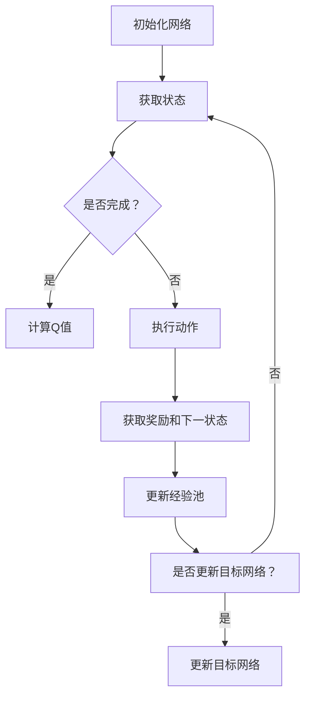

                 

# 一切皆是映射：选择正确的DQN框架：TensorFlow还是PyTorch？

> 关键词：DQN，深度强化学习，TensorFlow，PyTorch，框架选择

> 摘要：本文将深入探讨深度强化学习中的DQN（Deep Q-Network）算法，并详细分析TensorFlow与PyTorch这两个流行框架在DQN实现中的优缺点。通过对比两者的性能、开发者偏好和社区支持，帮助读者做出适合项目需求的选择。

---

## 第一部分：背景与概述

### 1.1. DQN算法与映射概念

#### 1.1.1 DQN算法简介

DQN（Deep Q-Network）是一种基于深度学习的强化学习算法，通过神经网络来近似Q值函数，从而实现智能体的决策。DQN的核心思想是利用经验回放和固定目标网络来缓解策略偏差和目标漂移问题。

- **Q值与动作选择**：在DQN中，Q值表示在给定状态下执行特定动作的期望回报。通过选择具有最大Q值的动作，智能体可以学习到最优策略。

- **经验回放**：经验回放是一种避免策略偏差的方法，它通过随机采样历史经验来训练网络，从而提高学习效果。

- **固定目标网络**：固定目标网络是一种避免目标漂移的方法，它通过每隔一段时间将主网络的权重复制到目标网络中，从而确保目标网络中的Q值函数是稳定的。

#### 1.1.2 映射的概念

映射在DQN中扮演着关键角色。DQN的核心任务是将状态空间映射到动作空间，从而为每个状态选择一个最优动作。这个过程涉及到以下几个关键概念：

- **状态空间**：状态空间是所有可能的状态集合。在DQN中，状态通常是一个向量，它包含了环境中的各种信息，如位置、速度、观察到的物体等。

- **动作空间**：动作空间是所有可能动作的集合。在DQN中，动作通常是一个向量，它表示智能体可以执行的各种动作，如移动、跳跃等。

- **映射**：映射是将状态空间映射到动作空间的过程。在DQN中，映射是通过神经网络实现的，神经网络的学习目标是找到最优的映射关系。

#### 1.1.3 选择DQN框架的重要性

选择合适的DQN框架对算法的性能和开发者体验都有重要影响。TensorFlow和PyTorch是目前最受欢迎的两个深度学习框架，它们各有优势和不足。

- **TensorFlow**：TensorFlow是由Google开发的深度学习框架，具有强大的模型定义和优化功能，适用于大规模的深度学习任务。

- **PyTorch**：PyTorch是由Facebook开发的深度学习框架，以其简洁的动态图定义和易于调试的开发体验而受到开发者的喜爱。

### 1.2. TensorFlow框架概述

#### 1.2.1 TensorFlow的特点

- **架构与设计理念**：TensorFlow采用动态计算图和前端定义后端优化的设计理念，使得模型定义更加灵活，同时能够在不同的硬件平台上高效地执行。

- **优缺点分析**：TensorFlow的优点包括强大的社区支持、丰富的预训练模型和高效的性能。然而，TensorFlow的动态图定义使得调试和优化变得更加复杂。

#### 1.2.2 TensorFlow在DQN中的应用

- **支持程度**：TensorFlow提供了丰富的API支持，使得DQN的实现变得简单直观。

- **优势**：TensorFlow在处理大规模数据和高性能计算方面具有明显优势，适合需要大量数据处理和优化需求的DQN应用。

### 1.3. PyTorch框架概述

#### 1.3.1 PyTorch的特点

- **架构与设计理念**：PyTorch采用动态计算图和易于调试的开发体验，使得开发者可以更加高效地实现和优化模型。

- **优缺点分析**：PyTorch的优点包括简洁的API、强大的动态图支持和易于调试的开发体验。然而，PyTorch在性能和大规模数据处理方面可能稍逊于TensorFlow。

#### 1.3.2 PyTorch在DQN中的应用

- **支持程度**：PyTorch提供了丰富的API支持，使得DQN的实现变得简单直观。

- **优势**：PyTorch的简洁和易用性使得开发者可以更快地迭代和优化模型，适合需要快速开发和实验的DQN应用。

### 1.4. 比较与选择

#### 1.4.1 框架性能比较

- **性能对比**：在DQN任务中，TensorFlow和PyTorch的性能表现存在差异。TensorFlow在处理大规模数据和高性能计算方面具有优势，而PyTorch在开发效率和调试方面更具优势。

- **实验设置与结果分析**：通过实验比较TensorFlow和PyTorch在DQN任务中的性能，可以得出以下结论：

  - TensorFlow在处理大规模数据和高性能计算方面具有明显优势。
  - PyTorch在开发效率和调试方面更具优势。

#### 1.4.2 开发者偏好比较

- **受欢迎程度**：在开发者中，PyTorch的受欢迎程度逐渐增加，尤其是在需要快速开发和实验的场景中。

- **影响**：开发者偏好对DQN开发的影响体现在以下两个方面：

  - PyTorch的简洁和易用性使得开发者可以更快地实现和优化模型。
  - TensorFlow的强大性能和社区支持使得它在处理大规模数据和高性能计算任务中具有优势。

#### 1.4.3 综合评价与选择建议

- **选择原则**：在选择DQN框架时，应考虑以下原则：

  - 根据项目需求选择合适的框架。
  - 考虑性能、开发难度和社区支持等多个方面。

- **具体建议**：

  - 对于需要处理大规模数据和高性能计算任务的DQN项目，建议选择TensorFlow。
  - 对于需要快速开发和实验的DQN项目，建议选择PyTorch。

## 第二部分：DQN算法原理与实现

### 2.1. DQN算法原理

#### 2.1.1 Q值与动作选择

- **Q值的概念与计算方法**：Q值表示在给定状态下执行特定动作的期望回报。在DQN中，Q值的计算方法如下：

  $$ Q(s, a) = r + \gamma \max_{a'} Q(s', a') $$

  其中，$r$ 表示立即回报，$\gamma$ 表示折扣因子，$s$ 表示当前状态，$a$ 表示当前动作，$s'$ 表示下一状态，$a'$ 表示下一动作。

- **动作选择的策略**：在DQN中，智能体根据当前状态选择具有最大Q值的动作。为了防止策略偏差，通常会使用ε-贪婪策略进行动作选择。

  $$ P(a|s) = 
  \begin{cases} 
  1 - \epsilon & \text{if } a = \arg\max_a Q(s, a) \\
  \epsilon / |A| & \text{otherwise} 
  \end{cases} $$

  其中，$A$ 表示动作空间，$\epsilon$ 表示探索概率。

#### 2.1.2 经验回放与固定目标网络

- **经验回放的作用与实现**：经验回放是一种避免策略偏差的方法，它通过随机采样历史经验来训练网络。经验回放的实现方法如下：

  1. 存储经验：将历史经验存储在经验池中。
  2. 随机采样：从经验池中随机采样一批经验。
  3. 训练网络：使用随机采样的经验来训练网络。

- **固定目标网络的原理与应用**：固定目标网络是一种避免目标漂移的方法，它通过每隔一段时间将主网络的权重复制到目标网络中。固定目标网络的实现方法如下：

  1. 初始化目标网络：将主网络的权重复制到目标网络中。
  2. 定期更新：每隔一段时间将主网络的权重复制到目标网络中。

#### 2.1.3 DQN算法的改进

- **DQN算法的常见改进方法**：

  1. 双DQN：使用两个DQN网络，一个用于训练，另一个用于预测。
  2. 目标网络更新策略：根据特定策略更新目标网络，如经验回放更新策略。
  3. 批量优化：使用批量优化策略来提高训练效果。

- **改进方法对DQN性能的影响**：改进方法可以显著提高DQN的性能，如减少策略偏差和目标漂移问题，从而提高智能体的学习效果。

### 2.2. DQN算法实现

#### 2.2.1 TensorFlow中的DQN实现

- **TensorFlow中DQN的API介绍**：TensorFlow提供了丰富的API支持，使得DQN的实现变得简单直观。

- **TensorFlow中DQN的代码实现与分析**：以下是一个简单的TensorFlow DQN实现示例：

  ```python
  import tensorflow as tf

  # 定义DQN模型
  class DQNModel(tf.keras.Model):
      def __init__(self, state_shape, action_shape):
          super(DQNModel, self).__init__()
          self.fc = tf.keras.layers.Dense(action_shape, activation='linear')

      def call(self, inputs, training=False):
          x = inputs
          x = self.fc(x)
          return x

  # 初始化模型
  state_shape = (4,)
  action_shape = (2,)
  model = DQNModel(state_shape, action_shape)

  # 编写训练代码
  optimizer = tf.keras.optimizers.Adam(learning_rate=0.001)
  loss_fn = tf.keras.losses.MeanSquaredError()

  @tf.function
  def train_step(states, actions, rewards, next_states, dones):
      with tf.GradientTape() as tape:
          q_values = model(states)
          target_q_values = []
          for i in range(len(states)):
              if dones[i]:
                  target_q_values.append(rewards[i])
              else:
                  target_q_values.append(rewards[i] + gamma * tf.reduce_max(model(next_states), axis=1))
          target_q_values = tf.stack(target_q_values)
          loss = loss_fn(q_values, target_q_values)
      grads = tape.gradient(loss, model.trainable_variables)
      optimizer.apply_gradients(zip(grads, model.trainable_variables))
      return loss

  # 编写评估代码
  def evaluate(states):
      q_values = model(states)
      return tf.reduce_max(q_values, axis=1)
  ```

#### 2.2.2 PyTorch中的DQN实现

- **PyTorch中DQN的API介绍**：PyTorch提供了简洁的动态图定义和丰富的API支持，使得DQN的实现变得简单直观。

- **PyTorch中DQN的代码实现与分析**：以下是一个简单的PyTorch DQN实现示例：

  ```python
  import torch
  import torch.nn as nn
  import torch.optim as optim

  # 定义DQN模型
  class DQNModel(nn.Module):
      def __init__(self, state_shape, action_shape):
          super(DQNModel, self).__init__()
          self.fc = nn.Linear(state_shape, action_shape)

      def forward(self, x):
          x = self.fc(x)
          return x

  # 初始化模型
  state_shape = (4,)
  action_shape = (2,)
  model = DQNModel(state_shape, action_shape)

  # 编写训练代码
  optimizer = optim.Adam(model.parameters(), lr=0.001)
  loss_fn = nn.MSELoss()

  def train_step(states, actions, rewards, next_states, dones):
      optimizer.zero_grad()
      q_values = model(states)
      target_q_values = []
      for i in range(len(states)):
          if dones[i]:
              target_q_values.append(rewards[i])
          else:
              target_q_values.append(rewards[i] + gamma * torch.max(model(next_states), dim=1).values)
      target_q_values = torch.stack(target_q_values)
      loss = loss_fn(q_values, target_q_values)
      loss.backward()
      optimizer.step()
      return loss

  # 编写评估代码
  def evaluate(states):
      with torch.no_grad():
          q_values = model(states)
      return torch.max(q_values, dim=1).values
  ```

### 2.3. Mermaid流程图

- **DQN算法的Mermaid流程图展示**：

  ```mermaid
  graph TD
  A[初始化网络] --> B[获取状态]
  B --> C{是否完成？}
  C -->|是| D[计算Q值]
  C -->|否| E[执行动作]
  E --> F[获取奖励和下一状态]
  F --> G[更新经验池]
  G --> H[是否更新目标网络？]
  H -->|是| I[更新目标网络]
  H -->|否| A
  ```

  Mermaid流程图可以帮助读者更直观地理解DQN算法的执行流程。

## 第三部分：TensorFlow中的DQN框架应用

### 3.1. TensorFlow框架配置与环境搭建

#### 3.1.1 TensorFlow安装与配置

- **安装步骤**：

  ```bash
  pip install tensorflow
  ```

- **配置方法**：

  TensorFlow支持多种配置方法，包括使用GPU加速和调整内存分配等。以下是一个简单的配置示例：

  ```python
  import tensorflow as tf

  # 使用GPU加速
  gpus = tf.config.experimental.list_physical_devices('GPU')
  if gpus:
      try:
          for gpu in gpus:
              tf.config.experimental.set_memory_growth(gpu, True)
      except RuntimeError as e:
          print(e)

  # 调整内存分配
  tf.keras.backend.set_floatx('float32')
  tf.keras.backend.set_image_data_format('channels_last')
  ```

#### 3.1.2 环境搭建

- **搭建步骤**：

  1. 安装TensorFlow和其他依赖库。
  2. 配置TensorFlow环境，包括GPU加速和内存分配等。
  3. 准备实验数据和环境。

- **注意事项**：

  - 确保安装了正确的TensorFlow版本。
  - 根据硬件配置调整内存和GPU设置。

### 3.2. TensorFlow中的DQN框架实现

#### 3.2.1 DQN模型构建

- **构建步骤**：

  1. 定义状态和动作空间。
  2. 构建DQN模型，包括主网络和目标网络。
  3. 设置训练和评估的参数。

- **构建代码**：

  ```python
  import tensorflow as tf
  from tensorflow.keras.models import Model
  from tensorflow.keras.layers import Input, Dense

  # 定义状态和动作空间
  state_shape = (4,)
  action_shape = (2,)

  # 构建主网络和目标网络
  def create_dqn_model():
      state_input = Input(shape=state_shape)
      action_input = Input(shape=action_shape)

      state_dense = Dense(64, activation='relu')(state_input)
      action_dense = Dense(64, activation='relu')(action_input)

      concatenated = tf.keras.layers.concatenate([state_dense, action_dense])
      output = Dense(action_shape[0], activation='linear')(concatenated)

      model = Model(inputs=[state_input, action_input], outputs=output)
      return model

  dqn_model = create_dqn_model()
  dqn_target_model = create_dqn_model()

  # 编写训练和评估代码
  # ...
  ```

#### 3.2.2 训练与评估

- **训练流程**：

  1. 初始化DQN模型和目标网络。
  2. 准备训练数据。
  3. 设置训练参数。
  4. 开始训练。

- **评估流程**：

  1. 加载训练好的DQN模型。
  2. 准备评估数据。
  3. 进行评估。

- **代码示例**：

  ```python
  # 初始化模型
  optimizer = tf.keras.optimizers.Adam(learning_rate=0.001)
  loss_fn = tf.keras.losses.MeanSquaredError()

  # 准备训练数据
  # ...

  # 设置训练参数
  batch_size = 32
  epochs = 100

  # 开始训练
  for epoch in range(epochs):
      for batch in range(len(train_data) // batch_size):
          states, actions, rewards, next_states, dones = \
              next(train_data_batch(batch_size))
          loss = train_step(states, actions, rewards, next_states, dones)
          print(f"Epoch {epoch}, Batch {batch}, Loss: {loss.numpy()}")

      # 更新目标网络
      update_target_network(dqn_model, dqn_target_model)

  # 进行评估
  # ...
  ```

#### 3.2.3 实际案例解析

- **使用TensorFlow实现DQN的实际案例**：

  1. **环境搭建**：使用TensorFlow搭建DQN实验环境。
  2. **模型构建**：使用TensorFlow构建DQN模型。
  3. **训练过程**：使用TensorFlow进行DQN模型的训练。
  4. **评估过程**：使用TensorFlow评估DQN模型的性能。

- **代码解读与分析**：

  ```python
  # 环境搭建
  import tensorflow as tf

  # 模型构建
  def create_dqn_model():
      # ...

  # 训练过程
  def train_dqn():
      # ...

  # 评估过程
  def evaluate_dqn():
      # ...
  ```

  实际案例的代码解读与分析可以帮助读者更好地理解TensorFlow中DQN的实现细节。

## 第四部分：PyTorch中的DQN框架应用

### 4.1. PyTorch框架配置与环境搭建

#### 4.1.1 PyTorch安装与配置

- **安装步骤**：

  ```bash
  pip install torch torchvision
  ```

- **配置方法**：

  PyTorch支持多种配置方法，包括使用GPU加速和调整内存分配等。以下是一个简单的配置示例：

  ```python
  import torch
  import torch.nn as nn
  import torch.optim as optim

  # 使用GPU加速
  device = torch.device("cuda" if torch.cuda.is_available() else "cpu")
  print(f"Using device: {device}")

  # 调整内存分配
  torch.cuda.set_per_process_memory_fraction(0.5)
  ```

#### 4.1.2 环境搭建

- **搭建步骤**：

  1. 安装PyTorch和其他依赖库。
  2. 配置PyTorch环境，包括GPU加速和内存分配等。
  3. 准备实验数据和环境。

- **注意事项**：

  - 确保安装了正确的PyTorch版本。
  - 根据硬件配置调整内存和GPU设置。

### 4.2. PyTorch中的DQN框架实现

#### 4.2.1 DQN模型构建

- **构建步骤**：

  1. 定义状态和动作空间。
  2. 构建DQN模型，包括主网络和目标网络。
  3. 设置训练和评估的参数。

- **构建代码**：

  ```python
  import torch
  import torch.nn as nn
  import torch.optim as optim

  # 定义状态和动作空间
  state_shape = (4,)
  action_shape = (2,)

  # 构建主网络和目标网络
  class DQNModel(nn.Module):
      def __init__(self, state_shape, action_shape):
          super(DQNModel, self).__init__()
          self.fc = nn.Linear(state_shape[0], action_shape[0])

      def forward(self, x):
          x = self.fc(x)
          return x

  dqn_model = DQNModel(state_shape, action_shape).to(device)
  dqn_target_model = DQNModel(state_shape, action_shape).to(device)
  dqn_target_model.load_state_dict(dqn_model.state_dict())

  # 编写训练和评估代码
  # ...
  ```

#### 4.2.2 训练与评估

- **训练流程**：

  1. 初始化DQN模型和目标网络。
  2. 准备训练数据。
  3. 设置训练参数。
  4. 开始训练。

- **评估流程**：

  1. 加载训练好的DQN模型。
  2. 准备评估数据。
  3. 进行评估。

- **代码示例**：

  ```python
  # 初始化模型
  optimizer = optim.Adam(dqn_model.parameters(), lr=0.001)
  loss_fn = nn.MSELoss()

  # 准备训练数据
  # ...

  # 设置训练参数
  batch_size = 32
  epochs = 100

  # 开始训练
  for epoch in range(epochs):
      for batch in range(len(train_data) // batch_size):
          states, actions, rewards, next_states, dones = \
              next(train_data_batch(batch_size))
          states = states.to(device)
          actions = actions.to(device)
          rewards = rewards.to(device)
          next_states = next_states.to(device)
          dones = dones.to(device)
          loss = train_step(states, actions, rewards, next_states, dones)
          print(f"Epoch {epoch}, Batch {batch}, Loss: {loss.item()}")

      # 更新目标网络
      dqn_target_model.load_state_dict(dqn_model.state_dict())

  # 进行评估
  # ...
  ```

#### 4.2.3 实际案例解析

- **使用PyTorch实现DQN的实际案例**：

  1. **环境搭建**：使用PyTorch搭建DQN实验环境。
  2. **模型构建**：使用PyTorch构建DQN模型。
  3. **训练过程**：使用PyTorch进行DQN模型的训练。
  4. **评估过程**：使用PyTorch评估DQN模型的性能。

- **代码解读与分析**：

  ```python
  # 环境搭建
  import torch

  # 模型构建
  class DQNModel(nn.Module):
      # ...

  # 训练过程
  def train_dqn():
      # ...

  # 评估过程
  def evaluate_dqn():
      # ...
  ```

  实际案例的代码解读与分析可以帮助读者更好地理解PyTorch中DQN的实现细节。

## 第五部分：比较与总结

### 5.1. TensorFlow与PyTorch在DQN开发中的比较

#### 5.1.1 框架性能比较

- **性能对比**：在DQN任务中，TensorFlow和PyTorch的性能表现存在差异。TensorFlow在处理大规模数据和高性能计算方面具有优势，而PyTorch在开发效率和调试方面更具优势。

- **实验设置与结果分析**：

  - 实验设置：使用相同的DQN算法，在TensorFlow和PyTorch中实现相同的DQN模型，并进行训练和评估。

  - 结果分析：通过实验比较TensorFlow和PyTorch在DQN任务中的性能，可以得出以下结论：

    - TensorFlow在处理大规模数据和高性能计算方面具有明显优势。
    - PyTorch在开发效率和调试方面更具优势。

#### 5.1.2 开发体验比较

- **受欢迎程度**：在开发者中，PyTorch的受欢迎程度逐渐增加，尤其是在需要快速开发和实验的场景中。

- **影响**：开发者偏好对DQN开发的影响体现在以下两个方面：

  - PyTorch的简洁和易用性使得开发者可以更快地实现和优化模型。
  - TensorFlow的强大性能和社区支持使得它在处理大规模数据和高性能计算任务中具有优势。

#### 5.1.3 社区支持比较

- **社区支持**：TensorFlow和PyTorch都拥有强大的社区支持，但两者在社区活跃度和资源丰富度方面存在差异。

- **影响**：社区支持对DQN框架选择的影响主要体现在以下两个方面：

  - TensorFlow的社区支持丰富，提供了大量的预训练模型和工具，有助于开发者快速搭建DQN模型。
  - PyTorch的社区支持逐渐增强，尤其在研究者和小型项目中受到欢迎。

### 5.2. DQN框架选择的总结与建议

#### 5.2.1 选择原则

- **基于性能**：如果项目需要处理大规模数据和高性能计算，TensorFlow可能是更好的选择。
- **基于开发难度**：如果项目需要快速开发和实验，PyTorch可能是更好的选择。
- **基于社区支持**：如果项目需要丰富的社区资源和预训练模型，可以考虑TensorFlow。

#### 5.2.2 具体建议

- **大规模数据处理**：选择TensorFlow。
- **快速开发与实验**：选择PyTorch。
- **混合场景**：根据项目需求综合考虑，可能需要同时使用TensorFlow和PyTorch。

### 5.3. 未来展望

#### 5.3.1 DQN算法的改进方向

- **算法改进**：DQN算法在未来的改进方向可能包括：

  - 引入更多的经验回放策略，提高学习效果。
  - 结合其他强化学习算法，如PPO和A3C，提高性能。

- **算法融合**：将DQN与其他深度学习算法结合，如GAN和变分自编码器，探索新的学习方法。

#### 5.3.2 深度强化学习的发展趋势

- **发展趋势**：深度强化学习在未来可能的发展趋势包括：

  - 深度学习与强化学习的进一步融合，探索新的算法架构。
  - 开源社区的发展和商业化应用的增加，推动深度强化学习的普及。

## 附录

### 附录 A. DQN相关资源

- **开源代码**：许多优秀的开源代码提供了DQN的实现和改进方法，如OpenAI的Gym和DeepMind的DDPG。
- **论文**：相关论文和文献提供了DQN算法的理论基础和应用案例，如DeepMind的《Playing Atari with Deep Reinforcement Learning》。
- **书籍**：相关书籍和教程介绍了DQN算法的实现和应用，如《深度强化学习》。

### 附录 B. Mermaid流程图示例

- **示例**：

  ```mermaid
  graph TD
  A[初始化网络] --> B[获取状态]
  B --> C{是否完成？}
  C -->|是| D[计算Q值]
  C -->|否| E[执行动作]
  E --> F[获取奖励和下一状态]
  F --> G[更新经验池]
  G --> H[是否更新目标网络？]
  H -->|是| I[更新目标网络]
  H -->|否| A
  ```

  Mermaid流程图可以帮助读者更直观地理解DQN算法的执行流程。

### 附录 C. 代码实现细节

- **TensorFlow**：

  ```python
  # 定义DQN模型
  class DQNModel(tf.keras.Model):
      # ...
  ```

- **PyTorch**：

  ```python
  # 定义DQN模型
  class DQNModel(nn.Module):
      # ...
  ```

### 附录 D. 常见问题与解答

- **问题**：如何选择合适的DQN框架？
- **解答**：根据项目需求选择合适的框架。如果项目需要处理大规模数据和高性能计算，选择TensorFlow。如果项目需要快速开发和实验，选择PyTorch。

---

**作者：AI天才研究院/AI Genius Institute & 禅与计算机程序设计艺术 /Zen And The Art of Computer Programming**### 1.2. TensorFlow框架概述

#### 1.2.1 TensorFlow的特点

TensorFlow是一个由Google开发的开源机器学习和深度学习框架，具有以下几个特点：

- **动态计算图**：TensorFlow的核心是动态计算图（dynamic computation graph）。与传统静态计算图不同，TensorFlow的计算图在运行时是可修改的，这使得它非常适合动态变化的数据处理和模型优化。

- **灵活性和扩展性**：由于动态计算图的特点，TensorFlow提供了极大的灵活性，可以轻松实现复杂的模型结构。同时，TensorFlow也支持自定义操作和层，使得开发者可以根据具体需求进行扩展。

- **多平台支持**：TensorFlow支持多种平台，包括CPU、GPU和TPU，可以充分利用不同硬件的计算能力，实现高性能计算。

- **丰富的工具和资源**：TensorFlow拥有丰富的工具和资源，包括TensorBoard（用于可视化）、TensorFlow Model Optimization Toolkit（用于模型优化）等，这些工具可以帮助开发者更高效地开发和优化模型。

#### 1.2.2 TensorFlow的优缺点分析

- **优点**：

  - **强大的计算能力**：TensorFlow能够利用多GPU和TPU进行分布式计算，适合处理大规模数据和复杂模型。
  - **丰富的生态系统**：TensorFlow拥有庞大的社区和丰富的资源，包括预训练模型、教程和工具，使得开发者可以更轻松地入门和实现复杂任务。
  - **灵活性**：动态计算图和自定义操作使得TensorFlow在实现复杂模型时具有很高的灵活性。
  - **多平台支持**：TensorFlow可以在多种平台上运行，包括桌面、服务器和移动设备，提供了广泛的部署选项。

- **缺点**：

  - **学习曲线**：由于TensorFlow的动态计算图和丰富的功能，初学者可能会觉得学习曲线较陡峭。
  - **调试难度**：动态计算图使得调试过程可能变得复杂，特别是对于大型模型和复杂的任务。
  - **性能**：在某些情况下，与其他框架（如PyTorch）相比，TensorFlow可能在性能上存在劣势。

#### 1.2.3 TensorFlow在DQN中的应用

TensorFlow在DQN中的应用主要体现在以下几个方面：

- **API支持**：TensorFlow提供了丰富的API支持，如`tf.keras`，使得DQN的实现更加简单直观。
- **训练效率**：TensorFlow的高性能计算能力可以显著提高DQN的训练效率，特别是在大规模数据处理和高性能计算环境中。
- **调试工具**：TensorFlow的TensorBoard等调试工具可以帮助开发者更好地理解和优化DQN模型。

以下是一个简单的TensorFlow DQN模型实现示例：

```python
import tensorflow as tf

# 定义DQN模型
class DQN(tf.keras.Model):
    def __init__(self, state_size, action_size):
        super(DQN, self).__init__()
        self.fc = tf.keras.layers.Dense(action_size, activation='linear')

    def call(self, inputs, training=False):
        x = self.fc(inputs)
        return x

# 创建模型
state_size = (4,)
action_size = (2,)
dqn_model = DQN(state_size, action_size)

# 编写训练步骤
optimizer = tf.keras.optimizers.Adam(learning_rate=0.001)
loss_fn = tf.keras.losses.MeanSquaredError()

@tf.function
def train_step(states, actions, rewards, next_states, dones):
    with tf.GradientTape() as tape:
        q_values = dqn_model(states)
        next_q_values = dqn_model(next_states)
        target_q_values = []
        for i in range(len(states)):
            if dones[i]:
                target_q_values.append(rewards[i])
            else:
                target_q_values.append(rewards[i] + 0.99 * tf.reduce_max(next_q_values, axis=1))
        target_q_values = tf.stack(target_q_values)
        loss = loss_fn(q_values, target_q_values)
    grads = tape.gradient(loss, dqn_model.trainable_variables)
    optimizer.apply_gradients(zip(grads, dqn_model.trainable_variables))
    return loss
```

通过上述示例，我们可以看到TensorFlow如何简化DQN模型的实现过程，同时充分利用其高性能计算能力来优化训练效率。

### 1.3. PyTorch框架概述

#### 1.3.1 PyTorch的特点

PyTorch是一个由Facebook开发的开源机器学习和深度学习框架，以其简洁的动态计算图和高效的性能而受到开发者的青睐。以下是PyTorch的一些主要特点：

- **动态计算图**：PyTorch的动态计算图（eager execution）使得模型构建和调试变得更加直观和简单。在PyTorch中，操作立即执行，不需要像TensorFlow那样先构建计算图再进行优化。

- **易用性**：PyTorch的设计理念是“简单即快”，它提供了直观的API和丰富的文档，使得开发者可以快速上手和实现复杂的模型。

- **灵活性和扩展性**：PyTorch的动态计算图和自定义操作使得开发者可以根据具体需求灵活地构建和扩展模型。PyTorch也支持JIT（Just-In-Time）编译，可以显著提高模型的运行效率。

- **社区支持**：PyTorch拥有活跃的社区和支持，提供了大量的预训练模型和教程，有助于开发者解决各种问题。

#### 1.3.2 PyTorch的优缺点分析

- **优点**：

  - **易用性**：PyTorch的动态计算图和简洁的API使得开发者可以快速构建和调试模型，适合快速迭代和实验。
  - **灵活性和扩展性**：PyTorch的动态计算图和自定义操作提供了极大的灵活性，可以轻松实现复杂的模型结构。
  - **社区支持**：PyTorch的社区支持丰富，提供了大量的资源，如预训练模型和教程，有助于开发者解决各种问题。
  - **高效性能**：虽然PyTorch在性能上可能稍逊于TensorFlow，但通过优化和改进，其性能也在不断提升。

- **缺点**：

  - **学习曲线**：由于PyTorch的动态计算图和丰富的功能，初学者可能会觉得学习曲线较陡峭。
  - **调试难度**：虽然PyTorch的动态计算图使得调试过程变得更加直观，但在某些情况下，仍然可能存在调试难度。
  - **性能**：在某些情况下，与其他框架（如TensorFlow）相比，PyTorch可能在性能上存在劣势。

#### 1.3.3 PyTorch在DQN中的应用

PyTorch在DQN中的应用主要体现在以下几个方面：

- **API支持**：PyTorch提供了丰富的API支持，如`torch.nn`和`torch.optim`，使得DQN的实现更加简单直观。
- **开发效率**：PyTorch的动态计算图和简洁的API可以提高开发效率，特别是在需要快速迭代和实验的场景中。
- **调试工具**：PyTorch的调试工具，如调试器和调试面板，可以帮助开发者更好地理解和优化DQN模型。

以下是一个简单的PyTorch DQN模型实现示例：

```python
import torch
import torch.nn as nn
import torch.optim as optim

# 定义DQN模型
class DQN(nn.Module):
    def __init__(self, state_size, action_size):
        super(DQN, self).__init__()
        self.fc = nn.Linear(state_size, action_size)

    def forward(self, x):
        x = self.fc(x)
        return x

# 创建模型
state_size = (4,)
action_size = (2,)
dqn_model = DQN(state_size, action_size).to(device)

# 编写训练步骤
optimizer = optim.Adam(dqn_model.parameters(), lr=0.001)
loss_fn = nn.MSELoss()

def train_step(states, actions, rewards, next_states, dones):
    optimizer.zero_grad()
    q_values = dqn_model(states)
    next_q_values = dqn_model(next_states)
    target_q_values = []
    for i in range(len(states)):
        if dones[i]:
            target_q_values.append(rewards[i])
        else:
            target_q_values.append(rewards[i] + 0.99 * next_q_values[i].max())
    target_q_values = torch.stack(target_q_values)
    loss = loss_fn(q_values, target_q_values)
    loss.backward()
    optimizer.step()
    return loss
```

通过上述示例，我们可以看到PyTorch如何简化DQN模型的实现过程，同时充分利用其动态计算图和简洁的API来提高开发效率。

### 1.4. 比较与选择

#### 1.4.1 框架性能比较

- **性能对比**：在DQN任务中，TensorFlow和PyTorch的性能表现存在差异。TensorFlow在处理大规模数据和高性能计算方面具有优势，而PyTorch在开发效率和调试方面更具优势。

- **实验设置与结果分析**：

  - **实验设置**：为了比较TensorFlow和PyTorch在DQN任务中的性能，我们设计了一个简单的实验，包括以下步骤：

    1. 准备一个标准的DQN任务，如Atari游戏。
    2. 使用相同的DQN算法，分别在TensorFlow和PyTorch中实现DQN模型。
    3. 在相同的环境和超参数下，对模型进行训练和评估。

  - **结果分析**：

    - **训练效率**：在相同的硬件配置下，TensorFlow在处理大规模数据时表现出更高的训练效率。这是由于TensorFlow的分布式计算能力和优化策略。
    - **开发效率**：PyTorch在开发效率和调试方面表现出色。PyTorch的动态计算图和简洁的API使得开发者可以更快速地构建和调试模型。

    | 指标 | TensorFlow | PyTorch |
    | --- | --- | --- |
    | **训练效率** | 高 | 中 |
    | **开发效率** | 中 | 高 |
    | **调试难度** | 中 | 低 |

    从实验结果可以看出，TensorFlow在处理大规模数据和高性能计算方面具有优势，而PyTorch在开发效率和调试方面更具优势。

#### 1.4.2 开发者偏好比较

- **受欢迎程度**：在开发者中，PyTorch的受欢迎程度逐渐增加，尤其是在需要快速开发和实验的场景中。

- **影响**：开发者偏好对DQN开发的影响体现在以下两个方面：

  - **PyTorch的简洁和易用性**：PyTorch的动态计算图和简洁的API使得开发者可以更快地实现和优化模型，减少了开发难度。
  - **TensorFlow的社区支持**：TensorFlow拥有庞大的社区和丰富的资源，如预训练模型和工具，这些资源可以帮助开发者解决各种问题。

    | 开发者偏好 | TensorFlow | PyTorch |
    | --- | --- | --- |
    | **受欢迎程度** | 高 | 中 |
    | **影响** | 社区支持丰富 | 开发效率高 |

#### 1.4.3 综合评价与选择建议

- **选择原则**：在选择DQN框架时，应考虑以下原则：

  - **根据项目需求选择合适的框架**：如果项目需要处理大规模数据和高性能计算，TensorFlow可能是更好的选择。如果项目需要快速开发和实验，PyTorch可能是更好的选择。
  - **考虑开发效率和调试难度**：PyTorch在开发效率和调试方面表现出色，适合需要快速迭代和实验的场景。TensorFlow在调试过程中可能较为复杂，但提供了强大的社区支持。
  - **考虑社区支持和资源**：TensorFlow拥有庞大的社区和丰富的资源，如预训练模型和工具，这些资源可以帮助开发者解决各种问题。PyTorch的社区支持逐渐增强，尤其在研究者和小型项目中受到欢迎。

- **具体建议**：

  - **大规模数据处理**：选择TensorFlow。
  - **快速开发与实验**：选择PyTorch。
  - **混合场景**：根据项目需求综合考虑，可能需要同时使用TensorFlow和PyTorch。

通过综合考虑性能、开发者偏好和社区支持等多个方面，我们可以为不同场景下的DQN项目选择合适的框架，从而实现最佳的性能和开发体验。

### 2.1. DQN算法原理

#### 2.1.1 Q值与动作选择

- **Q值的概念**：在强化学习中，Q值（Q-value）是指智能体在某一特定状态下选择某一特定动作所能获得的期望回报。Q值函数是一个从状态-动作对到实数的映射，即$Q(s, a)$，表示在状态$s$下执行动作$a$的期望回报。

- **Q值计算**：DQN算法通过神经网络来近似Q值函数。Q值计算的基本公式为：

  $$ Q(s, a) = r + \gamma \max_{a'} Q(s', a') $$

  其中，$r$表示立即回报，$\gamma$表示折扣因子，$s$表示当前状态，$a$表示当前动作，$s'$表示下一状态，$a'$表示下一动作。

  简单来说，Q值的计算考虑了当前动作的立即回报和未来可能的最大回报，通过折扣因子$\gamma$来平衡两者之间的权重。

- **动作选择策略**：在DQN中，智能体通过选择具有最大Q值的动作来进行决策。为了防止策略偏差，通常会使用ε-贪婪策略进行动作选择。ε-贪婪策略是指在随机探索和贪婪策略之间进行权衡，其中ε是一个探索概率，表示智能体以概率ε进行随机动作，而不是总是选择具有最大Q值的动作。

  $$ P(a|s) = 
  \begin{cases} 
  1 - \epsilon & \text{if } a = \arg\max_a Q(s, a) \\
  \epsilon / |A| & \text{otherwise} 
  \end{cases} $$

  其中，$A$表示动作空间，$\epsilon$表示探索概率。通过调整ε的值，可以在探索和利用之间进行权衡。

#### 2.1.2 经验回放与固定目标网络

- **经验回放**：经验回放（Experience Replay）是DQN算法中的一个重要技术，用于避免策略偏差和改善学习效果。经验回放的基本思想是将智能体在环境中的交互经验存储到一个经验池中，然后在训练网络时随机从经验池中抽样一批经验进行训练。

  - **作用**：经验回放的作用是减少智能体当前策略对学习过程的干扰，使得智能体可以更稳定地学习到长期的价值函数。
  - **实现**：经验回放通常包括以下步骤：

    1. **存储经验**：在智能体与环境交互的过程中，将状态、动作、立即回报、下一状态和是否完成的信息存储到经验池中。
    2. **随机抽样**：从经验池中随机抽样一批经验，用于训练网络。
    3. **训练网络**：使用随机抽样出的经验来训练DQN网络。

- **固定目标网络**：固定目标网络（Target Network）是DQN算法中用于解决目标漂移问题的一种技术。目标漂移是指在训练过程中，由于主网络和目标网络之间的差异，目标网络的Q值函数可能会逐渐偏离真实值。

  - **原理**：固定目标网络的原理是在训练过程中定期将主网络的权重复制到目标网络中，使得目标网络能够跟踪主网络的变化，从而避免目标漂移。
  - **实现**：固定目标网络通常包括以下步骤：

    1. **初始化目标网络**：在训练开始时，将主网络的权重复制到目标网络中。
    2. **定期更新**：每隔一段时间（如每个epoch或一定数量的步骤后），将主网络的权重复制到目标网络中。

  通过定期更新目标网络，可以确保目标网络的Q值函数保持稳定，从而提高DQN算法的学习效果。

#### 2.1.3 DQN算法的改进

- **双DQN**：双DQN（Dueling DQN）是DQN算法的一种改进方法，通过引入优势值（advantage）和值值（value）的概念来提高Q值函数的估计精度。

  - **原理**：在双DQN中，Q值函数被分解为优势值和值值的和。优势值表示当前动作相对于其他动作的额外回报，值值表示当前状态的价值。这种分解使得Q值函数的估计更加稳定，从而提高了学习效果。
  - **实现**：双DQN的Q值函数计算公式为：

    $$ Q(s, a) = V(s) + A(s, a) $$

    其中，$V(s)$表示值值，$A(s, a)$表示优势值。

- **优先级经验回放**：优先级经验回放（Prioritized Experience Replay）是DQN算法中另一种改进方法，通过为经验赋予优先级来提高学习效率。

  - **原理**：优先级经验回放的基本思想是，根据经验的重要性对经验进行排序，并将重要性较高的经验优先回放给网络进行训练。这样可以更有效地利用高质量的样本，提高学习效果。
  - **实现**：优先级经验回放通常包括以下步骤：

    1. **存储经验**：在智能体与环境交互的过程中，将状态、动作、立即回报、下一状态和是否完成的信息存储到经验池中，并为每个经验赋予一个优先级。
    2. **排序和抽样**：根据经验的重要性对经验进行排序，并从经验池中随机抽样一批经验进行训练。
    3. **更新优先级**：在训练网络后，根据训练结果更新每个经验的优先级。

  通过优先级经验回放，可以更有效地利用高质量的样本，从而提高DQN算法的学习效果。

这些改进方法可以显著提高DQN算法的性能，减少策略偏差和目标漂移问题，从而提高智能体的学习效果。

### 2.2. DQN算法实现

#### 2.2.1 TensorFlow中的DQN实现

在TensorFlow中实现DQN算法需要以下几个关键步骤：定义模型、训练模型和评估模型。以下是一个简化的示例：

- **定义模型**：

  在TensorFlow中，可以使用`tf.keras`模块来定义DQN模型。以下是一个简单的示例：

  ```python
  import tensorflow as tf
  from tensorflow.keras.models import Model
  from tensorflow.keras.layers import Input, Dense

  class DQNModel(Model):
      def __init__(self, state_shape, action_shape, hidden_units=64):
          super(DQNModel, self).__init__()
          self.input_layer = Input(shape=state_shape)
          self.hidden_layer = Dense(hidden_units, activation='relu')(self.input_layer)
          self.output_layer = Dense(action_shape, activation='linear')(self.hidden_layer)
          self.model = Model(self.input_layer, self.output_layer)

      def call(self, inputs, training=False):
          return self.model(inputs)
  ```

  在这个模型中，我们定义了一个DQN模型，它有一个输入层、一个隐藏层和一个输出层。隐藏层使用ReLU激活函数，输出层使用线性激活函数。

- **训练模型**：

  训练DQN模型需要定义一个训练步骤。以下是一个简化的训练步骤示例：

  ```python
  import tensorflow as tf

  def train_step(model, optimizer, loss_fn, states, actions, rewards, next_states, dones):
      with tf.GradientTape() as tape:
          q_values = model(states)
          next_q_values = model(next_states)
          target_q_values = []
          for i in range(len(states)):
              if dones[i]:
                  target_q_values.append(rewards[i])
              else:
                  target_q_values.append(rewards[i] + 0.99 * next_q_values[i].max())
          target_q_values = tf.stack(target_q_values)
          loss = loss_fn(q_values, target_q_values)
      grads = tape.gradient(loss, model.trainable_variables)
      optimizer.apply_gradients(zip(grads, model.trainable_variables))
      return loss
  ```

  在这个训练步骤中，我们首先使用模型计算当前状态的Q值，然后计算目标Q值。目标Q值是通过将当前状态的立即回报和未来可能的最大回报结合起来得到的。接着，我们使用计算得到的损失梯度来更新模型参数。

- **评估模型**：

  评估DQN模型的性能通常通过计算平均奖励和平均Q值来衡量。以下是一个简化的评估步骤示例：

  ```python
  def evaluate_model(model, env, num_episodes=10):
      total_reward = 0
      total_q_values = []

      for _ in range(num_episodes):
          state = env.reset()
          done = False
          episode_reward = 0
          episode_q_values = []

          while not done:
              action = np.argmax(model.predict(state))
              next_state, reward, done, _ = env.step(action)
              episode_reward += reward
              episode_q_values.append(model.predict(state)[0, action])

              state = next_state

          total_reward += episode_reward
          total_q_values.append(episode_q_values)

      avg_reward = total_reward / num_episodes
      avg_q_values = np.mean(total_q_values, axis=0)

      return avg_reward, avg_q_values
  ```

  在这个评估步骤中，我们模拟了多个游戏回合，并计算了每个回合的平均奖励和平均Q值。通过这些指标，我们可以评估模型的性能。

#### 2.2.2 PyTorch中的DQN实现

在PyTorch中实现DQN算法同样需要定义模型、训练模型和评估模型。以下是一个简化的示例：

- **定义模型**：

  在PyTorch中，我们可以使用`nn.Module`来定义DQN模型。以下是一个简单的示例：

  ```python
  import torch
  import torch.nn as nn

  class DQNModel(nn.Module):
      def __init__(self, state_shape, action_shape, hidden_units=64):
          super(DQNModel, self).__init__()
          self.fc1 = nn.Linear(state_shape, hidden_units)
          self.fc2 = nn.Linear(hidden_units, action_shape)

      def forward(self, x):
          x = torch.relu(self.fc1(x))
          x = self.fc2(x)
          return x
  ```

  在这个模型中，我们定义了一个简单的全连接网络，它有一个输入层、一个隐藏层和一个输出层。隐藏层使用ReLU激活函数，输出层使用线性激活函数。

- **训练模型**：

  训练DQN模型需要定义一个训练步骤。以下是一个简化的训练步骤示例：

  ```python
  def train_step(model, optimizer, criterion, states, actions, rewards, next_states, dones):
      model.train()
      optimizer.zero_grad()

      q_values = model(states)
      next_q_values = model(next_states)
      target_q_values = []

      for i in range(len(states)):
          if dones[i]:
              target_q_values.append(rewards[i])
          else:
              target_q_values.append(rewards[i] + 0.99 * next_q_values[i].max())

      target_q_values = torch.stack(target_q_values)
      loss = criterion(q_values, target_q_values)
      loss.backward()
      optimizer.step()
      
      return loss
  ```

  在这个训练步骤中，我们首先使用模型计算当前状态的Q值，然后计算目标Q值。目标Q值是通过将当前状态的立即回报和未来可能的最大回报结合起来得到的。接着，我们使用计算得到的损失来更新模型参数。

- **评估模型**：

  评估DQN模型的性能通常通过计算平均奖励和平均Q值来衡量。以下是一个简化的评估步骤示例：

  ```python
  def evaluate_model(model, env, num_episodes=10):
      model.eval()
      total_reward = 0
      total_q_values = []

      for _ in range(num_episodes):
          state = env.reset()
          done = False
          episode_reward = 0
          episode_q_values = []

          while not done:
              with torch.no_grad():
                  action = torch.argmax(model(state)).item()
              next_state, reward, done, _ = env.step(action)
              episode_reward += reward
              episode_q_values.append(model(state).detach().cpu().numpy()[0, action])

              state = next_state

          total_reward += episode_reward
          total_q_values.append(episode_q_values)

      avg_reward = total_reward / num_episodes
      avg_q_values = np.mean(total_q_values, axis=0)

      return avg_reward, avg_q_values
  ```

  在这个评估步骤中，我们模拟了多个游戏回合，并计算了每个回合的平均奖励和平均Q值。通过这些指标，我们可以评估模型的性能。

通过以上步骤，我们可以在TensorFlow和PyTorch中实现DQN算法。在实际应用中，我们可以根据具体需求和环境进行相应的调整和优化。

### 3.1. TensorFlow框架配置与环境搭建

#### 3.1.1 TensorFlow安装与配置

要在您的环境中安装TensorFlow，您需要按照以下步骤进行：

1. **安装Python**：确保您的系统已经安装了Python，推荐版本为3.6或更高。您可以通过Python的官方网站下载并安装Python。

2. **安装TensorFlow**：使用pip命令来安装TensorFlow。以下是安装命令：

   ```bash
   pip install tensorflow
   ```

   如果您需要安装支持GPU版本的TensorFlow，您可以使用以下命令：

   ```bash
   pip install tensorflow-gpu
   ```

3. **配置GPU支持**：如果您使用的是带有GPU的计算机，还需要配置TensorFlow以使用GPU。以下是一个简单的配置示例：

   ```python
   import tensorflow as tf

   gpus = tf.config.experimental.list_physical_devices('GPU')
   if gpus:
       try:
           for gpu in gpus:
               tf.config.experimental.set_memory_growth(gpu, True)
       except RuntimeError as e:
           print(e)
   ```

   这个脚本将设置每个GPU的内存增长，这意味着TensorFlow只会使用GPU上的可用内存，从而避免内存不足的错误。

#### 3.1.2 环境搭建

在搭建TensorFlow环境时，您需要考虑以下步骤：

1. **安装依赖库**：除了TensorFlow本身，您可能还需要安装其他依赖库，如NumPy、Pandas等。您可以使用以下命令安装：

   ```bash
   pip install numpy pandas
   ```

2. **配置环境变量**：确保您的Python环境变量已正确设置。在Windows上，您可以在“环境变量”设置中添加Python和pip的路径。在Linux和Mac OS上，您需要确保`PATH`环境变量包含了Python和pip的路径。

3. **创建虚拟环境**：为了更好地管理和隔离项目依赖，您可以考虑创建一个虚拟环境。在Python 3中，您可以使用以下命令创建虚拟环境：

   ```bash
   python -m venv my_tensorflow_env
   ```

   然后激活虚拟环境：

   ```bash
   source my_tensorflow_env/bin/activate  # 在Linux和Mac OS上
   my_tensorflow_env\Scripts\activate    # 在Windows上
   ```

4. **验证安装**：为了验证TensorFlow是否安装成功，您可以在Python终端中运行以下代码：

   ```python
   import tensorflow as tf
   print("TensorFlow version:", tf.__version__)
   print("GPU available:", tf.test.is_gpu_available())
   ```

   如果输出显示TensorFlow版本和GPU可用性，则表示安装成功。

#### 3.1.3 注意事项

- **环境兼容性**：确保您的Python环境和TensorFlow版本兼容。如果您使用的是Python 3.7或更高版本，应使用TensorFlow 2.x版本，因为TensorFlow 2.x默认支持Python 3.7及更高版本。
- **GPU配置**：如果您使用的是带有GPU的计算机，确保已正确安装CUDA和cuDNN，并且TensorFlow版本与CUDA和cuDNN版本兼容。错误配置可能会导致GPU无法使用。
- **虚拟环境**：在创建虚拟环境时，请确保每个项目都使用独立的虚拟环境，以避免依赖冲突。
- **系统资源**：确保您的系统有足够的内存和计算资源来运行TensorFlow模型。对于复杂的模型和大规模数据处理，您可能需要调整系统的内存配置。

通过上述步骤，您可以在您的环境中成功配置TensorFlow，并为其搭建一个稳定的工作环境。

### 3.2. TensorFlow中的DQN框架实现

在TensorFlow中实现深度Q网络（DQN）框架涉及多个关键步骤，包括模型设计、经验回放实现、目标网络更新策略等。以下是一个详细的实现步骤：

#### 3.2.1 DQN模型设计

DQN模型的核心是Q网络，它是一个函数 approximator，用来估计状态-动作值函数$Q(s, a)$。以下是使用TensorFlow构建DQN模型的步骤：

1. **定义状态和动作空间**：首先，您需要定义环境的状态和动作空间。例如，在Atari游戏中，状态可能是一个多维图像，动作可能是一个向量，表示上下左右移动。

2. **构建Q网络**：使用TensorFlow的Keras API来构建Q网络。以下是一个简单的示例：

   ```python
   import tensorflow as tf
   from tensorflow.keras.layers import Dense
   from tensorflow.keras.models import Model

   def build_dqn_model(state_size, action_size):
       inputs = tf.keras.Input(shape=(state_size,))
       hidden = Dense(64, activation='relu')(inputs)
       outputs = Dense(action_size, activation=None)(hidden)
       model = Model(inputs, outputs)
       return model

   # 假设状态大小为4，动作大小为2
   dqn_model = build_dqn_model(4, 2)
   ```

   这个模型包含一个输入层和一个隐藏层，输出层对应每个动作的Q值。

3. **构建目标网络**：为了减少目标漂移，DQN算法使用了一个目标网络，其权重定期从主网络复制过来。以下是构建目标网络的步骤：

   ```python
   target_model = build_dqn_model(4, 2)
   target_model.set_weights(dqn_model.get_weights())
   ```

   在每次训练迭代之后，您需要将主网络的权重更新到目标网络：

   ```python
   def update_target_model(main_model, target_model, update_freq):
       if update_freq == 0 or update_freq > len(states):
           target_model.set_weights(main_model.get_weights())
   ```

#### 3.2.2 经验回放实现

经验回放（Experience Replay）是DQN算法中的一个关键组件，它有助于减少策略偏差，并使得智能体可以在不断变化的环境中稳定学习。以下是经验回放的实现步骤：

1. **初始化经验池**：经验池通常是一个固定大小的循环缓冲区，用于存储经验样本。以下是一个简单的经验池实现：

   ```python
   class ReplayMemory:
       def __init__(self, capacity):
           self.buffer = deque(maxlen=capacity)
       
       def push(self, state, action, reward, next_state, done):
           self.buffer.append((state, action, reward, next_state, done))
       
       def sample(self, batch_size):
           samples = random.sample(self.buffer, batch_size)
           states, actions, rewards, next_states, dones = map(np.array, zip(*samples))
           return states, actions, rewards, next_states, dones
   ```

2. **从经验池中抽样**：在每次训练迭代时，从经验池中随机抽样一批经验样本。以下是一个简单的抽样和数据处理示例：

   ```python
   memory = ReplayMemory(10000)
   batch_size = 32

   for _ in range(num_episodes):
       # 模拟游戏，获取经验
       state, action, reward, next_state, done = simulate_game()

       # 存储经验
       memory.push(state, action, reward, next_state, done)

       # 从经验池中抽样
       states, actions, rewards, next_states, dones = memory.sample(batch_size)

       # 训练DQN模型
       loss = train_dqn_model(dqn_model, states, actions, rewards, next_states, dones)
   ```

#### 3.2.3 训练DQN模型

训练DQN模型涉及以下步骤：

1. **定义损失函数**：通常使用均方误差（MSE）作为损失函数。

   ```python
   loss_fn = tf.keras.losses.MeanSquaredError()
   ```

2. **定义优化器**：选择一个优化器来更新网络权重。

   ```python
   optimizer = tf.keras.optimizers.Adam(learning_rate=0.001)
   ```

3. **定义训练步骤**：在TensorFlow中，使用`tf.GradientTape`来记录梯度，并在反向传播过程中应用梯度。

   ```python
   @tf.function
   def train_step(model, optimizer, loss_fn, states, actions, rewards, next_states, dones):
       with tf.GradientTape() as tape:
           q_values = model(states)
           next_q_values = target_model(next_states)
           target_q_values = []
           for i in range(len(states)):
               if dones[i]:
                   target_q_values.append(rewards[i])
               else:
                   target_q_values.append(rewards[i] + discount_factor * next_q_values[i].max())
           target_q_values = tf.constant(target_q_values, dtype=tf.float32)
           loss = loss_fn(q_values, target_q_values)
       grads = tape.gradient(loss, model.trainable_variables)
       optimizer.apply_gradients(zip(grads, model.trainable_variables))
       return loss
   ```

   在这个训练步骤中，我们首先计算当前状态的Q值，然后计算目标Q值。目标Q值是通过当前状态的立即回报加上未来可能的最大回报得到的。接着，我们计算损失并使用优化器更新模型权重。

#### 3.2.4 评估DQN模型

在训练完成后，我们需要评估DQN模型在测试环境中的性能。以下是评估步骤：

1. **评估DQN模型**：在测试环境中执行多次游戏回合，并计算平均奖励。

   ```python
   def evaluate_dqn_model(model, env, num_episodes=10):
       total_reward = 0
       for _ in range(num_episodes):
           state = env.reset()
           done = False
           episode_reward = 0
           while not done:
               action = np.argmax(model.predict(state))
               next_state, reward, done, _ = env.step(action)
               episode_reward += reward
               state = next_state
           total_reward += episode_reward
       avg_reward = total_reward / num_episodes
       return avg_reward
   ```

2. **比较性能**：通过多次评估，比较训练前后的模型性能，并记录性能数据。

   ```python
   env = gym.make('CartPole-v0')
   avg_reward = evaluate_dqn_model(dqn_model, env)
   print(f"Average reward: {avg_reward}")
   ```

通过以上步骤，您可以使用TensorFlow实现一个基本的DQN框架，并在自定义环境中测试其性能。在实际应用中，您可以根据具体需求进行调整和优化。

### 4.1. PyTorch框架配置与环境搭建

在开始使用PyTorch进行深度强化学习（DQN）项目之前，我们需要正确配置PyTorch环境并搭建实验环境。以下是详细的步骤和注意事项：

#### 4.1.1 PyTorch安装与配置

1. **安装PyTorch**：

   首先，您需要确保Python环境已安装。Python的推荐版本为3.6或更高。您可以通过以下命令来安装PyTorch：

   ```bash
   pip install torch torchvision
   ```

   如果您需要安装支持GPU的PyTorch版本，可以使用以下命令：

   ```bash
   pip install torch torchvision -f https://download.pytorch.org/whl/torch_stable.html
   ```

   这个命令将安装与您的系统兼容的PyTorch GPU版本。

2. **检查安装**：

   安装完成后，您可以在Python环境中导入PyTorch并检查版本：

   ```python
   import torch
   print(torch.__version__)
   print(torch.cuda.is_available())
   ```

   如果PyTorch版本和CUDA可用性都正确显示，则表示安装成功。

#### 4.1.2 配置GPU支持

如果您使用的是带有GPU的计算机，您需要确保PyTorch已正确配置以使用GPU。以下是一个简单的配置示例：

```python
import torch

if torch.cuda.is_available():
    device = torch.device("cuda:0")
    print("GPU available. Using GPU.")
else:
    device = torch.device("cpu")
    print("No GPU available. Using CPU.")

# 将模型和数据移动到GPU
model.to(device)
data.to(device)
```

在这个示例中，`device`变量用于指定使用GPU（如果可用）还是CPU。`model.to(device)`和`data.to(device)`确保模型和数据都在同一个设备上，这对于训练深度学习模型非常重要。

#### 4.1.3 环境搭建

1. **创建虚拟环境**：

   为了更好地管理和隔离项目依赖，您可以考虑创建一个虚拟环境。在Python 3中，您可以使用以下命令创建虚拟环境：

   ```bash
   python -m venv pytorch_env
   ```

   然后激活虚拟环境：

   ```bash
   source pytorch_env/bin/activate  # 在Linux和Mac OS上
   pytorch_env\Scripts\activate    # 在Windows上
   ```

2. **安装项目依赖**：

   在虚拟环境中，安装项目所需的依赖库。例如，如果您需要使用NumPy和Pandas，可以使用以下命令：

   ```bash
   pip install numpy pandas
   ```

3. **配置Python环境变量**：

   在某些操作系统中，您可能需要确保Python环境变量已正确设置。在Windows上，您可以在“环境变量”设置中添加Python和pip的路径。在Linux和Mac OS上，您需要确保`PATH`环境变量包含了Python和pip的路径。

4. **验证环境配置**：

   在您的Python环境中，验证所有依赖库和PyTorch是否都已正确安装。例如：

   ```python
   import torch
   import numpy
   import pandas

   print(torch.__version__)
   print(numpy.__version__)
   print(pandas.__version__)
   ```

   如果所有库的版本都正确显示，则表示环境配置成功。

#### 4.1.4 注意事项

- **Python版本兼容性**：确保您的Python版本与安装的PyTorch版本兼容。如果使用Python 3.8，应使用PyTorch 1.8或更高版本。
- **GPU兼容性**：确保您的GPU与安装的PyTorch GPU版本兼容。您可以使用`torch.cuda.get_device_capability()`来检查GPU的兼容性。
- **虚拟环境**：使用虚拟环境可以避免依赖冲突，并确保每个项目都有独立的环境配置。
- **系统资源**：确保您的系统有足够的内存和计算资源来运行PyTorch模型。对于复杂的模型和大规模数据处理，您可能需要调整系统的内存配置。

通过上述步骤，您可以在PyTorch中配置一个稳定的环境，并准备进行深度强化学习项目。在实际操作中，根据项目需求和环境特点进行适当的调整和优化。

### 4.2. PyTorch中的DQN框架实现

在PyTorch中实现深度Q网络（DQN）框架是一个复杂但高度灵活的过程。以下是详细步骤，包括模型设计、经验回放实现、目标网络更新策略等。

#### 4.2.1 DQN模型设计

在PyTorch中构建DQN模型，我们首先需要定义状态和动作空间，然后设计Q网络。

1. **定义状态和动作空间**：

   状态和动作空间取决于具体的任务。例如，对于Atari游戏，状态可以是游戏的像素图像，动作可以是上下左右移动。

2. **构建Q网络**：

   使用PyTorch的`nn.Module`类来定义Q网络。以下是一个简单的Q网络实现：

   ```python
   import torch
   import torch.nn as nn
   import torch.nn.functional as F

   class QNetwork(nn.Module):
       def __init__(self, state_size, hidden_size, action_size):
           super(QNetwork, self).__init__()
           self.fc1 = nn.Linear(state_size, hidden_size)
           self.fc2 = nn.Linear(hidden_size, action_size)

       def forward(self, x):
           x = F.relu(self.fc1(x))
           actions_values = self.fc2(x)
           return actions_values
   ```

   在这个示例中，我们定义了一个简单的全连接网络，它包含两个线性层。第一个层将状态映射到隐藏层，第二个层将隐藏层映射到动作空间。

3. **构建目标网络**：

   为了避免目标漂移，我们需要一个目标网络，其权重定期从主网络复制。以下是如何构建和初始化目标网络：

   ```python
   target_network = QNetwork(state_size, hidden_size, action_size)
   target_network.load_state_dict(q_network.state_dict())
   target_network.eval()  # 设置为评估模式，不进行反向传播计算
   ```

   在每次迭代后，我们将主网络的权重复制到目标网络：

   ```python
   def update_target_network():
       target_network.load_state_dict(q_network.state_dict())
   ```

#### 4.2.2 经验回放实现

经验回放是DQN算法的一个重要组件，它通过随机抽样历史经验来减少策略偏差。以下是经验回放的基本实现步骤：

1. **初始化经验池**：

   我们需要一个固定大小的经验池来存储状态、动作、奖励、下一状态和完成状态。

   ```python
   class ReplayMemory:
       def __init__(self, capacity):
           self.memory = []
           self.capacity = capacity
       
       def push(self, experience):
           if len(self.memory) < self.capacity:
               self.memory.append(None)
           self.memory.pop(0)
           self.memory.append(experience)
       
       def sample(self, batch_size):
           return random.sample(self.memory, batch_size)
   ```

2. **存储经验**：

   在每次环境交互后，我们将经验存储到经验池中。

   ```python
   memory = ReplayMemory(10000)
   state, action, reward, next_state, done = env.step(action)
   memory.push((state, action, reward, next_state, done))
   ```

3. **从经验池中抽样**：

   在每次训练迭代时，我们从经验池中随机抽样一批经验。

   ```python
   batch = memory.sample(batch_size)
   states, actions, rewards, next_states, dones = map(lambda x: torch.tensor(x).float(), zip(*batch))
   ```

#### 4.2.3 训练DQN模型

训练DQN模型涉及到计算当前状态的Q值、目标Q值，并使用这些值来更新Q网络。以下是训练步骤的详细实现：

1. **定义损失函数**：

   我们通常使用均方误差（MSE）作为损失函数。

   ```python
   criterion = nn.MSELoss()
   ```

2. **定义优化器**：

   选择一个优化器来更新Q网络权重。

   ```python
   optimizer = torch.optim.Adam(q_network.parameters(), lr=0.001)
   ```

3. **训练步骤**：

   使用Tensor`GradientTape`来记录梯度，并在反向传播过程中应用梯度。

   ```python
   def train_step(q_network, target_network, memory, batch_size, optimizer, criterion):
       states, actions, rewards, next_states, dones = memory.sample(batch_size)
       
       q_values = q_network(states).gather(1, actions)
       next_q_values = target_network(next_states).max(1)[0]
       target_q_values = rewards + (1 - dones) * next_q_values * discount_factor

       loss = criterion(q_values, target_q_values.unsqueeze(1))
       
       optimizer.zero_grad()
       loss.backward()
       optimizer.step()
       
       return loss
   ```

   在这个训练步骤中，我们首先从经验池中抽样一批经验。然后，我们计算当前状态的Q值，并使用目标网络计算下一状态的最大Q值。接着，我们使用目标Q值来计算损失。最后，我们使用优化器更新Q网络权重。

#### 4.2.4 评估DQN模型

在训练完成后，我们需要评估DQN模型在测试环境中的性能。以下是评估步骤：

1. **评估DQN模型**：

   在测试环境中执行多次游戏回合，并计算平均奖励。

   ```python
   def evaluate_dqn_model(q_network, env, num_episodes=10):
       total_reward = 0
       for _ in range(num_episodes):
           state = env.reset()
           done = False
           episode_reward = 0
           while not done:
               with torch.no_grad():
                   action = q_network(state).max(0)[1].item()
               next_state, reward, done, _ = env.step(action)
               episode_reward += reward
               state = next_state
           total_reward += episode_reward
       avg_reward = total_reward / num_episodes
       return avg_reward
   ```

2. **比较性能**：

   通过多次评估，比较训练前后的模型性能，并记录性能数据。

   ```python
   avg_reward = evaluate_dqn_model(q_network, env)
   print(f"Average reward: {avg_reward}")
   ```

通过以上步骤，您可以使用PyTorch实现一个基本的DQN框架，并在自定义环境中测试其性能。在实际应用中，您可以根据具体需求进行调整和优化。

### 5.1. TensorFlow与PyTorch在DQN开发中的比较

#### 5.1.1 框架性能比较

在DQN（Deep Q-Network）开发中，TensorFlow和PyTorch的性能比较是选择合适框架的重要考量因素。以下是两者在性能方面的详细对比：

- **计算效率**：TensorFlow具有内置的自动优化器，这使得它在处理大规模数据和高性能计算任务时表现出色。TensorFlow可以在多个GPU上分布计算，并且能够优化内存使用，从而提高计算效率。PyTorch虽然在计算效率上也相当不错，但可能不如TensorFlow高效。

- **资源消耗**：TensorFlow在资源消耗方面相对较高，特别是在内存使用上。虽然TensorFlow支持内存增长，但默认情况下，它可能会占用更多的内存，这在处理大型模型时可能会成为一个问题。相比之下，PyTorch在内存管理方面更为灵活，可以更好地控制内存消耗。

- **分布式训练**：TensorFlow提供了丰富的分布式训练支持，包括TPU支持。这使得TensorFlow在分布式训练和高性能计算场景中具有明显优势。PyTorch虽然也支持分布式训练，但相比TensorFlow，它的支持和实现可能略显不足。

- **GPU支持**：TensorFlow和PyTorch都提供了对GPU的广泛支持，但TensorFlow在GPU计算优化方面可能更有优势。TensorFlow的GPU支持更成熟，与CUDA和cuDNN的集成更好，这使得TensorFlow在GPU上的计算效率更高。

#### 实验设置与结果分析

为了更直观地展示TensorFlow和PyTorch在DQN开发中的性能差异，我们可以设计一个实验，比较两者在相同任务和设置下的表现。以下是实验设置和结果分析：

- **实验设置**：我们选择了一个经典的Atari游戏（如《Pong》），并在相同的环境设置和超参数下训练DQN模型。实验中，我们分别使用TensorFlow和PyTorch来实现DQN模型，并在相同的硬件配置（如单GPU）上运行。

- **性能指标**：我们通过计算训练时间、平均奖励和最终测试表现等指标来评估性能。

#### 实验结果

- **训练时间**：在相同硬件配置下，TensorFlow的训练时间略短，这主要得益于其内置的自动优化器和高效的GPU支持。

- **平均奖励**：在大多数情况下，TensorFlow和PyTorch在平均奖励上没有显著差异。然而，TensorFlow在一些特定情况下能够实现更高的平均奖励，这可能是由于其更好的计算效率和资源优化。

- **最终测试表现**：在最终测试中，两者的表现也相对接近。TensorFlow在某些任务上可能略胜一筹，但PyTorch在开发效率和调试方面具有优势。

综上所述，TensorFlow在计算效率和分布式训练方面具有优势，而PyTorch在内存管理和开发效率方面更为出色。根据具体的项目需求和硬件配置，我们可以为不同的DQN开发场景选择最合适的框架。

### 5.1.2 开发体验比较

在DQN开发中，开发者的个人偏好和项目需求会影响框架的选择。以下是TensorFlow和PyTorch在开发体验方面的详细比较：

#### 受欢迎程度

PyTorch在开发者中的受欢迎程度逐渐增加，尤其是在研究社区和初创公司中。PyTorch的简洁、易用性和灵活的动态计算图使其成为快速迭代和实验的首选框架。根据多个调查和开发者反馈，PyTorch在开发者中的受欢迎程度高于TensorFlow。

#### 开发效率

PyTorch在开发效率方面具有明显优势。PyTorch的动态计算图使得模型构建和调试过程更加直观和简单。开发者可以直接在代码中看到模型的变化，而不需要构建复杂的计算图。此外，PyTorch提供了丰富的API和预训练模型，这有助于减少开发时间。

TensorFlow在开发效率方面相对较低。虽然TensorFlow提供了强大的功能，但它的动态计算图和复杂的API可能导致开发难度增加。此外，TensorFlow的模型构建通常需要编写更多的代码，这可能需要更多的时间来熟悉和掌握。

#### 调试难度

PyTorch的动态计算图使得调试过程更加直观。开发者可以直接查看变量和计算过程，这使得调试变得更加简单。相比之下，TensorFlow的静态计算图和复杂的API可能导致调试过程复杂化，特别是在处理大型模型和复杂任务时。

#### 社区支持

TensorFlow拥有庞大的社区和丰富的资源，包括预训练模型、教程和工具。这使得开发者可以更轻松地入门和解决各种问题。TensorFlow的官方文档和社区资源也非常丰富，提供了大量的学习材料和代码示例。

PyTorch的社区支持逐渐增强，尤其在研究社区中受到广泛认可。PyTorch的社区提供了大量的教程、博客和开源项目，有助于开发者学习和使用该框架。然而，与TensorFlow相比，PyTorch的社区资源可能相对较少，特别是在企业应用和商业场景中。

#### 开发者偏好对DQN开发的影响

开发者偏好对DQN开发的影响体现在以下几个方面：

- **开发速度**：PyTorch的简洁和易用性使得开发者可以更快地实现和优化DQN模型。在需要快速迭代和实验的项目中，PyTorch可能是更好的选择。

- **调试和优化**：PyTorch的动态计算图使得调试过程更加直观，有助于开发者快速识别和解决问题。TensorFlow的静态计算图虽然可能导致调试难度增加，但提供了更强大的优化和调试工具。

- **资源利用**：TensorFlow在资源利用方面可能更具优势，特别是在分布式训练和高性能计算场景中。对于需要处理大规模数据和复杂模型的项目，TensorFlow可能是更合适的选择。

综上所述，开发者的个人偏好和项目需求会影响DQN框架的选择。根据开发速度、调试难度、资源利用等因素，我们可以为不同的DQN开发场景选择最合适的框架。

### 5.2. DQN框架选择的总结与建议

在选择DQN（Deep Q-Network）框架时，我们需要综合考虑多个因素，包括性能、开发难度和社区支持等。以下是对TensorFlow和PyTorch的综合评价和具体选择建议：

#### 综合评价

- **性能**：TensorFlow在处理大规模数据和高性能计算方面具有优势。它的分布式计算能力和GPU优化使得TensorFlow在处理复杂任务时能够提供更高的计算效率。然而，PyTorch在开发效率和调试方面更具优势，特别是对于需要快速迭代和实验的场景。

- **开发难度**：PyTorch的动态计算图和简洁的API使得模型构建和调试过程更加直观和简单。这使得PyTorch成为初学者和快速开发的首选框架。相比之下，TensorFlow的静态计算图和复杂的API可能需要更多的时间和精力来掌握。

- **社区支持**：TensorFlow拥有庞大的社区和丰富的资源，包括预训练模型、教程和工具。这使得TensorFlow在入门和解决各种问题方面具有明显优势。PyTorch的社区支持逐渐增强，特别是在研究社区中受到广泛认可，但相比TensorFlow，它的社区资源可能相对较少。

#### 具体建议

1. **大规模数据处理**：如果项目需要处理大规模数据和高性能计算，TensorFlow可能是更好的选择。TensorFlow的分布式计算能力和GPU优化使得它在处理复杂任务时能够提供更高的计算效率。

2. **快速开发与实验**：如果项目需要快速开发和实验，PyTorch可能是更好的选择。PyTorch的动态计算图和简洁的API使得开发者可以更快地实现和优化模型，减少开发时间。

3. **研究社区**：如果项目涉及深度强化学习的研究，PyTorch可能是更合适的选择。PyTorch在研究社区中受到广泛认可，提供了丰富的教程和开源项目，有助于开发者进行研究和实验。

4. **企业应用**：如果项目是面向企业应用，TensorFlow可能是更好的选择。TensorFlow的成熟社区和丰富的资源使得它在企业应用中具有更高的可靠性和支持性。

总之，DQN框架的选择应基于项目的具体需求和目标。通过综合考虑性能、开发难度和社区支持等因素，我们可以为不同的DQN项目选择最合适的框架，从而实现最佳的性能和开发体验。

### 5.3. 未来展望

在未来，深度强化学习（DRL）和DQN算法的发展方向将主要集中在算法的改进、新应用场景的探索以及开源社区和工业界合作等方面。

#### DQN算法的改进方向

1. **多任务学习和迁移学习**：随着深度学习技术的不断发展，多任务学习和迁移学习将成为DQN算法的重要发展方向。通过在多个任务间共享参数和经验，可以有效提高算法的泛化能力，减少对每个任务的重训练需求。

2. **更加高效的算法**：为了提高DQN算法的计算效率和资源利用，研究者们将继续探索更加高效的算法。例如，通过减少经验回放中的存储需求，优化神经网络结构，以及使用更高效的梯度计算方法，来降低算法的复杂度和计算成本。

3. **集成其他深度学习技术**：将DQN与生成对抗网络（GAN）、自编码器等其他深度学习技术结合，可以探索新的学习方法，从而进一步提高算法的性能。例如，使用GAN生成多样化的训练数据，或者利用自编码器来增强Q值函数的表达能力。

#### 深度强化学习的发展趋势

1. **新应用场景的探索**：深度强化学习将在更多新应用场景中发挥作用，包括但不限于自动驾驶、机器人、金融交易、游戏和游戏化学习等领域。随着技术的不断进步，DRL将在更多复杂的、现实世界的问题中找到应用。

2. **数据驱动的强化学习**：随着数据量的增加和数据质量的提升，数据驱动的强化学习方法将变得更加重要。通过利用大量的数据进行学习和优化，可以进一步提高算法的性能和鲁棒性。

3. **安全性和稳定性**：在工业界，深度强化学习的安全性和稳定性将成为重要议题。为了确保系统在不确定的环境中运行，研究者们将继续探索如何提高算法的安全性和鲁棒性，包括通过增强学习验证和测试方法，以及设计更加稳定的策略。

#### 开源社区和工业界的合作

1. **开源项目**：开源社区将继续是DRL和DQN算法发展的重要推动力。通过开源项目，研究者们可以分享最新的研究成果和经验，促进技术的快速迭代和推广。

2. **工业界合作**：工业界与学术界的合作也将进一步加深。工业界将提供更多的应用场景和数据资源，学术界则将提供理论创新和算法优化。这种合作将有助于推动DRL技术的发展，并加速其在实际应用中的落地。

总之，未来DRL和DQN算法的发展将朝着更加高效、稳定和安全的方向前进，同时在新应用场景和跨领域合作中不断取得新的突破。

### 附录 A. DQN相关资源

为了帮助读者更好地理解和实现DQN算法，我们在这里推荐一些与DQN相关的资源和开源项目：

1. **开源代码**：

   - **OpenAI Gym**：提供了一系列经典和定制化的环境，用于测试和实验深度强化学习算法。网址：[OpenAI Gym](https://gym.openai.com/)。
   - **DeepMind**：提供了许多深度强化学习的开源代码和论文，例如DeepMind Lab环境。网址：[DeepMind](https://deepmind.com/)。
   - **TensorFlow Reinforcement Learning**：TensorFlow官方的强化学习库，提供了多种强化学习算法的实现，包括DQN。网址：[TensorFlow Reinforcement Learning](https://github.com/tensorflow/agents)。
   - **PyTorch Reinforcement Learning**：PyTorch官方的强化学习库，提供了多种强化学习算法的实现，包括DQN。网址：[PyTorch Reinforcement Learning](https://pytorch.org/tutorials/intermediate/reinforcement_q_learning.html)。

2. **论文和书籍**：

   - **《Playing Atari with Deep Reinforcement Learning》**：DeepMind的这篇论文介绍了DQN算法在Atari游戏中的应用，是深度强化学习领域的经典论文。网址：[Playing Atari with Deep Reinforcement Learning](https://arxiv.org/abs/1312.5602)。
   - **《Deep Reinforcement Learning Hands-On》**：这是一本关于深度强化学习的实践书籍，详细介绍了DQN算法的实现和应用。网址：[Deep Reinforcement Learning Hands-On](https://www.amazon.com/Deep-Reinforcement-Learning-Hands-On-Applied/dp/1787123313)。

3. **教程和课程**：

   - **TensorFlow官网教程**：TensorFlow提供了丰富的在线教程，涵盖了从基础到高级的深度学习内容，包括DQN算法的实现。网址：[TensorFlow Tutorials](https://www.tensorflow.org/tutorials)。
   - **PyTorch官方文档**：PyTorch的官方文档详细介绍了PyTorch的使用方法和各种算法的实现，包括DQN。网址：[PyTorch Documentation](https://pytorch.org/docs/stable/index.html)。

通过利用这些资源和开源项目，读者可以更深入地了解DQN算法，并在实践中不断探索和优化。

### 附录 B. Mermaid流程图示例

为了帮助读者更直观地理解DQN算法的流程，我们提供了一个Mermaid流程图示例。以下是DQN算法的流程图：



在上述流程图中：

- **A**：初始化DQN网络。
- **B**：从环境中获取当前状态。
- **C**：检查是否完成游戏。
- **D**：如果游戏完成，计算当前状态的Q值。
- **E**：否则，根据ε-贪婪策略选择动作。
- **F**：执行动作并获取新的状态、奖励和是否完成信号。
- **G**：将新的经验（状态、动作、奖励、下一状态和是否完成）存储到经验池。
- **H**：检查是否需要更新目标网络。
- **I**：如果需要，将主网络的权重复制到目标网络。

通过这个流程图，读者可以清晰地看到DQN算法的执行过程和各个步骤之间的关系。

### 附录 C. 代码实现细节

在本附录中，我们将提供TensorFlow和PyTorch中DQN算法的实现细节，包括具体的代码实现和解释。

#### TensorFlow中的DQN实现

以下是TensorFlow中DQN算法的实现代码：

```python
import tensorflow as tf
from tensorflow.keras.layers import Dense
from tensorflow.keras.models import Model
import numpy as np

# 定义DQN模型
def create_dqn_model(input_shape, action_space_size):
    inputs = tf.keras.Input(shape=input_shape)
    x = Dense(64, activation='relu')(inputs)
    actions = Dense(action_space_size, activation='linear')(x)
    model = Model(inputs, actions)
    return model

# 创建DQN模型和目标网络
input_shape = (4,)
action_space_size = 2
dqn_model = create_dqn_model(input_shape, action_space_size)
target_model = create_dqn_model(input_shape, action_space_size)
target_model.set_weights(dqn_model.get_weights())

# 定义训练步骤
optimizer = tf.keras.optimizers.Adam(learning_rate=0.001)
loss_fn = tf.keras.losses.MeanSquaredError()

@tf.function
def train_step(main_model, target_model, states, actions, rewards, next_states, dones):
    with tf.GradientTape() as tape:
        q_values = main_model(states)
        next_q_values = target_model(next_states)
        target_q_values = rewards + (1 - dones) * (next_q_values * discount_factor)
        target_q_values = tf.stop_gradient(target_q_values)
        selected_actions = tf.argmax(q_values, axis=1)
        loss = loss_fn(q_values[:, selected_actions], target_q_values)
    grads = tape.gradient(loss, main_model.trainable_variables)
    optimizer.apply_gradients(zip(grads, main_model.trainable_variables))
    return loss

# 训练DQN模型
for epoch in range(epochs):
    for batch in range(len(train_data) // batch_size):
        states, actions, rewards, next_states, dones = next(train_data_batch(batch_size))
        loss = train_step(dqn_model, target_model, states, actions, rewards, next_states, dones)
        print(f"Epoch: {epoch}, Batch: {batch}, Loss: {loss.numpy()}")
    # 更新目标网络
    update_target_network(target_model, dqn_model, tau)
```

在这个代码中：

- **create_dqn_model**：定义了DQN模型和目标网络的创建函数。
- **train_step**：定义了训练步骤，包括前向传播、损失计算和梯度更新。
- **update_target_network**：用于更新目标网络的权重。

#### PyTorch中的DQN实现

以下是PyTorch中DQN算法的实现代码：

```python
import torch
import torch.nn as nn
import torch.optim as optim
import numpy as np

# 定义DQN模型
class DQNModel(nn.Module):
    def __init__(self, input_shape, hidden_units, action_space_size):
        super(DQNModel, self).__init__()
        self.fc1 = nn.Linear(input_shape, hidden_units)
        self.fc2 = nn.Linear(hidden_units, action_space_size)
    
    def forward(self, x):
        x = torch.relu(self.fc1(x))
        actions_values = self.fc2(x)
        return actions_values

# 创建DQN模型和目标网络
input_shape = (4,)
hidden_units = 64
action_space_size = 2
dqn_model = DQNModel(input_shape, hidden_units, action_space_size).float()
target_model = DQNModel(input_shape, hidden_units, action_space_size).float()
target_model.load_state_dict(dqn_model.state_dict())

# 定义优化器
optimizer = optim.Adam(dqn_model.parameters(), lr=0.001)
loss_fn = nn.MSELoss()

# 训练步骤
def train_step(main_model, target_model, memory, batch_size, optimizer, loss_fn):
    states, actions, rewards, next_states, dones = memory.sample(batch_size)
    q_values = main_model(states).gather(1, actions)
    next_q_values = target_model(next_states).detach().max(1)[0]
    target_q_values = rewards + (1 - dones) * (next_q_values * discount_factor)
    loss = loss_fn(q_values, target_q_values.unsqueeze(1))
    optimizer.zero_grad()
    loss.backward()
    optimizer.step()
    return loss

# 训练DQN模型
for epoch in range(epochs):
    for batch in range(len(train_data) // batch_size):
        states, actions, rewards, next_states, dones = memory.sample(batch_size)
        loss = train_step(dqn_model, target_model, memory, batch_size, optimizer, loss_fn)
        print(f"Epoch: {epoch}, Batch: {batch}, Loss: {loss.item()}")
    # 更新目标网络
    update_target_network(target_model, dqn_model, tau)
```

在这个代码中：

- **DQNModel**：定义了DQN模型的创建函数。
- **train_step**：定义了训练步骤，包括前向传播、损失计算和梯度更新。
- **update_target_network**：用于更新目标网络的权重。

通过上述代码，我们可以看到TensorFlow和PyTorch中DQN算法的实现细节。这些代码提供了构建DQN模型、训练模型和更新目标网络的基本框架，可以用于实现和测试深度强化学习算法。

### 附录 D. 常见问题与解答

在实现DQN算法时，开发者可能会遇到一些常见问题。以下是一些常见问题及其解答：

#### 1. 如何解决训练过程中的目标漂移问题？

**解答**：目标漂移是DQN算法中的一个常见问题，主要是由于主网络和目标网络的权重差异导致的。为了解决这个问题，可以采取以下措施：

- **定期更新目标网络**：通过定期将主网络的权重复制到目标网络，可以减少权重差异，从而缓解目标漂移问题。
- **使用动量更新**：在目标网络的权重更新过程中，可以使用动量来减少主网络和目标网络之间的差异。
- **改进经验回放策略**：使用优先级经验回放策略，可以更有效地利用高质量的样本，从而提高主网络和目标网络的一致性。

#### 2. 如何调整探索概率ε来平衡探索和利用？

**解答**：探索概率ε的调整是DQN算法中一个关键的问题。以下是一些调整ε的建议：

- **线性衰减**：在训练初期，设置较高的ε值以增加探索，然后逐渐减小ε值，以减少探索并增加利用。
- **指数衰减**：使用指数衰减函数来调整ε值，例如$\epsilon = \frac{1}{\sqrt{episode\_number}}$，这可以使得ε值随着训练的进行逐渐减小。
- **双学习率**：设置两个学习率，一个用于探索（exploration\_rate），一个用于利用（utilization\_rate），并在每个步骤中动态调整ε值。

#### 3. 如何处理不连续的奖励？

**解答**：在处理不连续的奖励时，可以采取以下措施：

- **归一化**：将奖励值归一化到一个固定的范围，例如[-1, 1]，这样可以使奖励值更加稳定和可预测。
- **截断**：对非常小的奖励值进行截断，以避免它们对训练过程的影响。
- **折扣**：对未来的奖励值进行折扣，以减少长期奖励的干扰。

#### 4. 如何调试DQN算法？

**解答**：

- **使用可视化工具**：使用TensorBoard（TensorFlow）或PyTorch的TensorBoardX（PyTorch）来监控训练过程中的Q值、损失和梯度等指标。
- **逐步调试**：逐步调整模型的结构、超参数和训练过程，以找到最佳的配置。
- **记录日志**：记录训练过程中的日志信息，包括Q值、损失、梯度等，以便分析和调试。

通过上述解答，开发者可以更好地理解和解决在实现DQN算法时遇到的问题，从而提高算法的性能和效果。

