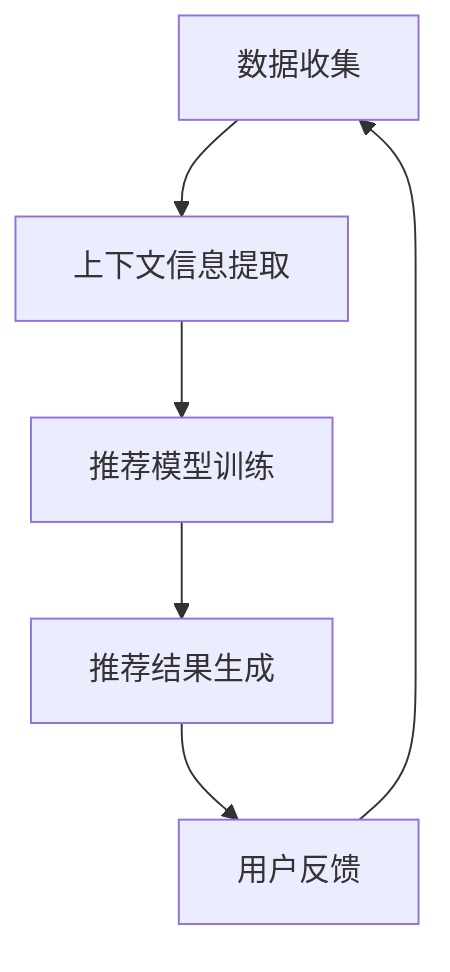
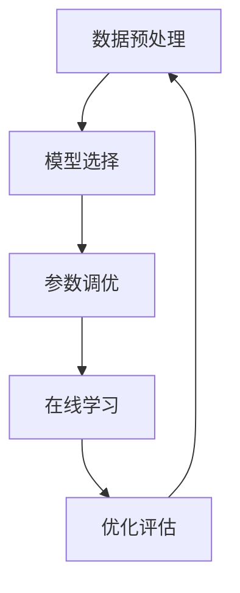

                 


### 文章标题

# 上下文学习(ICL)在推荐中的应用

### 关键词

- 上下文学习
- 推荐系统
- 内容推荐
- 社交推荐
- 协同过滤
- 优化与评估

### 摘要

本文旨在探讨上下文学习（ICL）在推荐系统中的应用。首先，我们概述了上下文学习的基本概念和重要性，随后详细分析了其核心原理和方法。接着，本文深入探讨了ICL在内容推荐、社交推荐和协同过滤推荐中的实际应用，并提出了优化和评估方法。通过案例分析，我们展示了上下文学习在不同推荐场景中的成功应用。最后，我们对ICL的未来发展趋势进行了展望，并提供了相关的资源和工具。

## 第一部分：上下文学习(ICL)概述

### 第1章 上下文学习(ICL)的概念与重要性

#### 1.1 上下文学习的定义

上下文学习（Contextual Learning，简称ICL）是一种基于上下文信息的机器学习方法，它通过利用用户的上下文信息来提升推荐系统的准确性。上下文信息可以是时间、地点、用户行为等与用户兴趣相关的信息。

#### 1.2 上下文学习在推荐系统中的重要性

在推荐系统中，上下文信息对于提高推荐质量至关重要。传统的推荐系统通常仅依赖用户历史行为数据进行推荐，而忽略了用户的当前状态和环境信息。这可能导致推荐结果与用户的实际需求不匹配。上下文学习通过融入上下文信息，可以更准确地捕捉用户的实时需求，从而提高推荐系统的效果。

#### 1.3 ICL与传统推荐系统的区别

传统推荐系统主要依赖于用户的历史行为数据，如评分、浏览记录等，而ICL则引入了上下文信息，如时间、地点、天气等，以更全面地理解用户的需求。此外，ICL还注重动态调整推荐策略，以适应不断变化的上下文环境。

### 第2章 上下文学习(ICL)的原理

#### 2.1 ICL的核心概念

ICL的核心概念是利用上下文信息来调整推荐模型，以生成更符合用户当前需求的推荐结果。上下文信息可以是定量的（如时间、地点）或定性的（如用户情绪、活动类型）。

#### 2.2 ICL的常用方法

ICL常用的方法包括基于规则的推荐、基于模型的推荐和混合方法。基于规则的推荐通过预设规则来匹配上下文信息，而基于模型的推荐则通过机器学习模型来学习上下文信息与推荐结果之间的关系。

#### 2.3 ICL的架构与流程

ICL的架构通常包括数据收集、上下文信息提取、推荐模型训练和推荐结果生成等环节。其流程如下：

1. 数据收集：收集用户的上下文信息和历史行为数据。
2. 上下文信息提取：从原始数据中提取与用户兴趣相关的上下文信息。
3. 推荐模型训练：利用提取的上下文信息训练推荐模型。
4. 推荐结果生成：根据用户的当前上下文信息生成推荐结果。

## 第二部分：ICL在推荐系统中的应用

### 第3章 ICL在内容推荐中的应用

#### 3.1 内容推荐系统概述

内容推荐系统旨在根据用户的历史行为和偏好，推荐用户可能感兴趣的内容。常见的应用场景包括新闻推荐、音乐推荐、电影推荐等。

#### 3.2 ICL在内容推荐中的优势

ICL在内容推荐中的优势主要体现在以下几个方面：

1. 更准确地捕捉用户兴趣：通过融入上下文信息，ICL可以更准确地捕捉用户的实时兴趣，从而提高推荐质量。
2. 动态调整推荐策略：ICL可以根据用户的上下文信息动态调整推荐策略，以适应用户的需求变化。
3. 提高用户参与度：通过提供更符合用户当前需求的推荐内容，ICL可以增加用户的参与度和满意度。

#### 3.3 ICL在内容推荐中的应用案例

以下是一个内容推荐系统应用ICL的案例：

- 场景：一个音乐推荐系统。
- 用户：一位喜欢听电子音乐的年轻用户。
- 上下文信息：用户正在一个夜晚的派对上，地点在城市的音乐俱乐部。
- 推荐策略：基于用户的兴趣（电子音乐）、时间（夜晚）和地点（音乐俱乐部），系统推荐符合派对氛围的电子音乐。

### 第4章 ICL在社交推荐中的应用

#### 4.1 社交推荐系统概述

社交推荐系统旨在根据用户的社会关系和社交行为，推荐用户可能感兴趣的人、内容或活动。常见的应用场景包括朋友推荐、兴趣小组推荐、活动推荐等。

#### 4.2 ICL在社交推荐中的优势

ICL在社交推荐中的优势主要体现在以下几个方面：

1. 提高社交网络的质量：通过融入上下文信息，ICL可以更准确地识别用户感兴趣的人或内容，从而提高社交网络的质量。
2. 促进社交互动：通过提供更符合用户当前社交需求的推荐，ICL可以促进用户之间的互动和交流。
3. 提高用户满意度：通过提供更个性化的社交推荐，ICL可以提高用户的满意度。

#### 4.3 ICL在社交推荐中的应用案例

以下是一个社交推荐系统应用ICL的案例：

- 场景：一个社交媒体平台。
- 用户：一位经常参加户外运动的朋友。
- 上下文信息：用户正在一个户外运动爱好者的小组中，时间是一个周末。
- 推荐策略：基于用户的兴趣（户外运动）、时间和社交关系，系统推荐附近的户外运动活动。

### 第5章 ICL在协同过滤推荐中的应用

#### 5.1 协同过滤推荐系统概述

协同过滤推荐系统是一种基于用户历史行为数据的推荐方法，它通过计算用户之间的相似度来预测用户对未知项目的兴趣。常见的协同过滤方法包括基于用户的协同过滤和基于项目的协同过滤。

#### 5.2 ICL在协同过滤推荐中的优势

ICL在协同过滤推荐中的优势主要体现在以下几个方面：

1. 提高推荐准确性：通过融入上下文信息，ICL可以更准确地预测用户对未知项目的兴趣，从而提高推荐准确性。
2. 适应动态环境：ICL可以动态调整推荐策略，以适应用户需求和环境变化。
3. 提高用户满意度：通过提供更符合用户当前上下文需求的推荐，ICL可以提高用户满意度。

#### 5.3 ICL在协同过滤推荐中的应用案例

以下是一个协同过滤推荐系统应用ICL的案例：

- 场景：一个在线书店。
- 用户：一位喜欢阅读历史小说的用户。
- 上下文信息：用户正在一个书店的线上平台上，时间是一个炎热的夏天。
- 推荐策略：基于用户的历史购买记录、时间（夏天）和地点（线上书店），系统推荐符合季节和用户兴趣的历史小说。

## 第三部分：ICL在推荐系统中的优化与评估

### 第6章 ICL在推荐系统中的优化方法

#### 6.1 ICL优化的目标

ICL优化的目标主要包括提高推荐准确性、降低计算复杂度和提高用户体验。

#### 6.2 常见的ICL优化方法

常见的ICL优化方法包括数据预处理、模型选择、参数调优和在线学习等。

1. 数据预处理：通过数据清洗、归一化和特征提取等预处理方法，提高数据质量。
2. 模型选择：选择适合上下文信息的模型，如决策树、支持向量机和神经网络等。
3. 参数调优：通过交叉验证和网格搜索等方法，选择最优参数。
4. 在线学习：利用用户的实时上下文信息，动态调整推荐模型。

#### 6.3 ICL优化的挑战与解决方案

ICL优化面临的挑战包括数据稀疏、冷启动问题和计算复杂度等。

1. 数据稀疏：通过引入外部知识和迁移学习等方法，缓解数据稀疏问题。
2. 冷启动问题：通过探索推荐系统、基于内容的推荐和社交网络等方法，解决冷启动问题。
3. 计算复杂度：通过分布式计算和模型压缩等方法，降低计算复杂度。

### 第7章 ICL在推荐系统中的评估方法

#### 7.1 ICL评估的目标

ICL评估的目标主要包括评估推荐准确性、用户体验和系统性能等。

#### 7.2 常见的ICL评估指标

常见的ICL评估指标包括准确率、召回率、F1值和用户满意度等。

1. 准确率：预测正确的用户兴趣占比。
2. 召回率：能够召回用户实际感兴趣的项目的占比。
3. F1值：准确率和召回率的调和平均值。
4. 用户满意度：用户对推荐结果的满意度评分。

#### 7.3 ICL评估的实际应用

在实际应用中，可以通过A/B测试、用户调查和系统日志分析等方法，对ICL推荐系统进行评估。

1. A/B测试：通过将用户随机分为两组，一组使用ICL推荐，另一组使用传统推荐，比较两组用户的反馈。
2. 用户调查：通过问卷调查，收集用户对推荐系统的满意度评价。
3. 系统日志分析：通过分析系统日志，评估推荐系统的实际效果和性能。

## 第四部分：案例分析

### 第8章 ICL在电子商务推荐系统中的应用

#### 8.1 电子商务推荐系统概述

电子商务推荐系统旨在根据用户的历史购买记录和浏览行为，推荐用户可能感兴趣的商品。常见的应用场景包括商品推荐、购物车推荐和搜索推荐等。

#### 8.2 ICL在电子商务推荐系统中的应用

ICL在电子商务推荐系统中的应用主要包括以下几个方面：

1. 商品推荐：通过融入用户的上下文信息（如购物时间、购物地点、用户浏览历史等），推荐用户可能感兴趣的商品。
2. 购物车推荐：根据用户购物车中的商品和上下文信息，推荐用户可能需要搭配的商品。
3. 搜索推荐：根据用户搜索关键词和上下文信息，推荐用户可能感兴趣的商品或内容。

#### 8.3 案例分析

以下是一个电子商务推荐系统应用ICL的案例：

- 场景：一个在线购物平台。
- 用户：一位喜欢购买时尚服饰的用户。
- 上下文信息：用户正在一个周末的下午，地点在城市的购物区。
- 推荐策略：基于用户的历史购买记录、时间（周末下午）、地点（购物区）和用户兴趣（时尚服饰），系统推荐最新上架的时尚服饰。

### 第9章 ICL在线上视频推荐系统中的应用

#### 9.1 在线视频推荐系统概述

在线视频推荐系统旨在根据用户的历史观看记录和偏好，推荐用户可能感兴趣的视频。常见的应用场景包括视频推荐、播放列表推荐和搜索推荐等。

#### 9.2 ICL在线上视频推荐系统中的应用

ICL在线上视频推荐系统中的应用主要包括以下几个方面：

1. 视频推荐：通过融入用户的上下文信息（如观看时间、观看地点、用户浏览历史等），推荐用户可能感兴趣的视频。
2. 播放列表推荐：根据用户观看历史和上下文信息，推荐用户可能喜欢的视频播放列表。
3. 搜索推荐：根据用户搜索关键词和上下文信息，推荐用户可能感兴趣的视频。

#### 9.3 案例分析

以下是一个在线视频推荐系统应用ICL的案例：

- 场景：一个视频流媒体平台。
- 用户：一位喜欢观看科幻电影的年轻用户。
- 上下文信息：用户正在一个夜晚，地点在自己的卧室。
- 推荐策略：基于用户的历史观看记录、时间（夜晚）、地点（卧室）和用户兴趣（科幻电影），系统推荐最新上映的科幻电影。

## 第五部分：未来展望

### 第10章 上下文学习(ICL)的未来发展趋势

#### 10.1 ICL在推荐系统中的未来应用前景

随着人工智能和大数据技术的发展，ICL在推荐系统中的应用前景十分广阔。未来，ICL将更加注重跨领域的融合，如结合自然语言处理、计算机视觉等，实现更智能、更精准的推荐。

#### 10.2 ICL在人工智能领域的发展趋势

ICL作为一种基于上下文的机器学习方法，将在人工智能领域发挥重要作用。未来，ICL将与其他人工智能技术相结合，如深度学习、强化学习等，推动人工智能技术的进步。

#### 10.3 ICL面临的挑战与机遇

ICL面临的挑战包括数据隐私、计算复杂度和模型可解释性等。未来，ICL将需要解决这些问题，以实现更广泛的应用。同时，ICL也将带来巨大的机遇，如提高推荐系统的准确性、用户体验和商业价值等。

## 附录

### 附录A ICL相关资源与工具

#### A.1 ICL常用算法与模型

- collaborative filtering（协同过滤）
- matrix factorization（矩阵分解）
- deep learning（深度学习）
- reinforcement learning（强化学习）

#### A.2 ICL开源工具与库

- TensorFlow
- PyTorch
- Scikit-learn
- LightGBM

#### A.3 ICL研究论文与报告

- "Contextual Bandits with side Information"（2013）
- "Contextual Recommendations without Contextual Models"（2015）
- "Deep Contextual Bandits"（2017）
- "Contextual Representation Learning for Online Advertising"（2018）

### 附录B Mermaid流程图示例

#### B.1 ICL架构流程图



#### B.2 ICL优化方法流程图



### 附录C 伪代码与数学公式

#### C.1 ICL核心算法伪代码

```python
# 数据预处理
def preprocess_data(data):
    # 数据清洗、归一化和特征提取
    # ...

# 上下文信息提取
def extract_context(data, context):
    # 提取与用户兴趣相关的上下文信息
    # ...

# 推荐模型训练
def train_model(data, context):
    # 利用提取的上下文信息训练推荐模型
    # ...

# 推荐结果生成
def generate_recommendations(model, context):
    # 根据用户的当前上下文信息生成推荐结果
    # ...

# 用户反馈
def get_user_feedback(recommendations, user):
    # 收集用户对推荐结果的反馈
    # ...
```

#### C.2 ICL数学模型与公式

$$
R(U, I) = f(\text{user features}, \text{item features}, \text{contextual features})
$$

其中，$R(U, I)$表示用户$U$对项目$I$的兴趣度评分，$f$表示推荐函数，包含用户特征、项目特征和上下文特征。

#### C.3 ICL应用案例中的数学计算示例

$$
\text{User Interest} = \text{w1} \cdot \text{User Behavior} + \text{w2} \cdot \text{Context Information}
$$

其中，$\text{User Interest}$表示用户兴趣度评分，$\text{w1}$和$\text{w2}$分别表示用户行为特征和上下文特征的权重。

