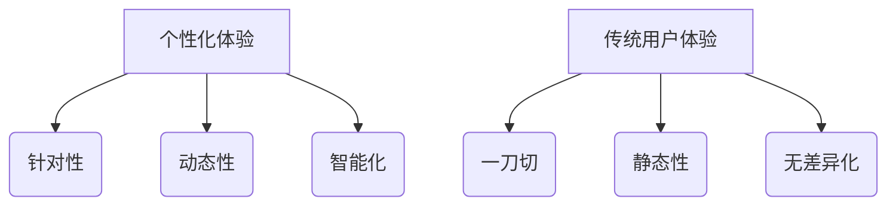
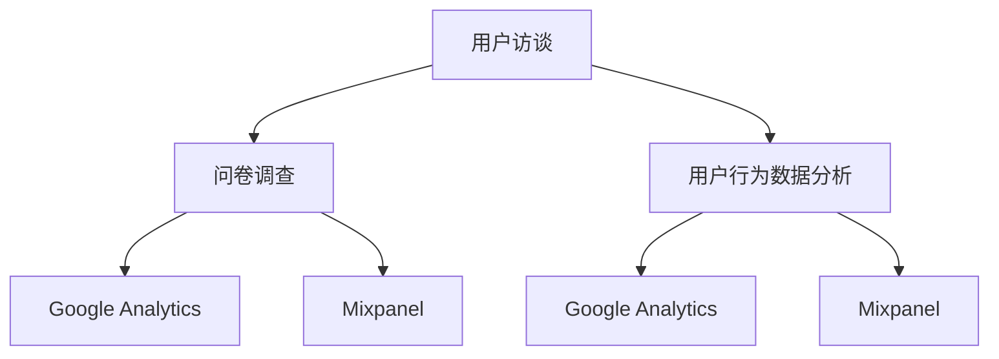
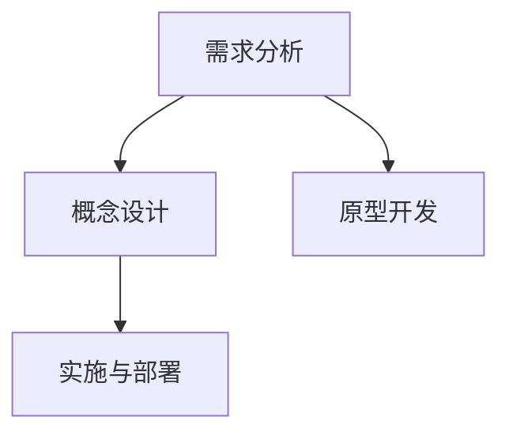

                 

### 文章标题

# 个性化体验：适应用户需求

### 关键词

- 个性化体验
- 用户需求分析
- 个性化体验设计
- 个性化推荐系统
- 数据挖掘与机器学习
- 用户体验评估与优化

### 摘要

在数字化的时代，个性化体验已经成为提升用户满意度和忠诚度的关键因素。本文旨在深入探讨个性化体验的概念、重要性及其实现方法。文章首先介绍了个性化体验的定义和与传统用户体验的区别，随后讨论了用户需求分析的方法与工具，以及个性化体验设计的原则和技术实现。文章重点讲解了个性化推荐系统的算法和应用，数据挖掘与机器学习在个性化体验中的应用，以及个性化体验的实施与评估策略。通过案例分析，本文总结了个性化体验的成功经验和未来展望，为相关领域的研究和实践提供了有益的参考。

### 目录

#### 第一部分：理解个性化体验

- **第1章：个性化体验的概念与重要性**
  - **1.1 个性化体验的定义**
  - **1.2 个性化体验的重要性**
  - **1.3 个性化体验的发展趋势**

#### 第二部分：用户需求分析

- **第2章：用户需求分析的方法与工具**
  - **2.1 用户需求分析概述**
  - **2.2 用户调研方法**
  - **2.3 用户行为数据分析**

#### 第三部分：个性化体验设计

- **第3章：个性化体验设计原则**
  - **3.1 用户体验设计的理论基础**
  - **3.2 个性化体验设计流程**
  - **3.3 个性化体验设计的关键要素**

#### 第四部分：个性化体验技术实现

- **第4章：个性化推荐系统**
  - **4.1 个性化推荐系统概述**
  - **4.2 个性化推荐算法**
  - **4.3 个性化推荐系统的评估与优化**

- **第5章：数据挖掘与机器学习在个性化体验中的应用**
  - **5.1 数据挖掘与机器学习基础**
  - **5.2 个性化推荐系统的数据预处理**
  - **5.3 个性化体验的机器学习模型**

#### 第五部分：个性化体验实施与评估

- **第6章：个性化体验实施策略**
  - **6.1 个性化体验实施计划**
  - **6.2 个性化体验的落地实施**
  - **6.3 个性化体验的持续优化**

- **第7章：个性化体验的评估与优化**
  - **7.1 个性化体验评估指标**
  - **7.2 个性化体验的优化方法**

#### 第六部分：案例研究

- **第8章：个性化体验成功案例分析**
  - **8.1 案例背景与目标**
  - **8.2 案例实施与效果**
  - **8.3 案例启示与展望**

#### 第七部分：附录

- **附录A：个性化体验开发工具与资源**
  - **A.1 主流个性化推荐系统框架**
  - **A.2 用户行为数据分析工具**
  - **A.3 个性化体验相关书籍与论文**

### 第一部分：理解个性化体验

#### 第1章：个性化体验的概念与重要性

##### 1.1 个性化体验的定义

个性化体验是指根据用户的特定需求、兴趣和行为，为其提供定制化的服务和内容，从而提升用户体验的一种方式。个性化体验不仅仅是简单的内容推荐或功能定制，而是深度理解用户的需求和行为，通过数据分析和算法实现，为每个用户提供独特的使用体验。

与传统用户体验相比，个性化体验具有以下特点：

1. **针对性**：个性化体验针对用户的特定需求提供内容和服务，而非一刀切的传统方法。
2. **动态性**：个性化体验能够根据用户行为的变化实时调整，提供更加贴合用户当前需求的服务。
3. **智能化**：通过数据挖掘和机器学习等技术，个性化体验能够自我学习和优化，不断提升用户体验。

##### 1.2 个性化体验的重要性

1. **提升用户满意度与忠诚度**：个性化体验能够满足用户的个性化需求，提升用户的满意度和忠诚度，从而增加用户的使用频率和停留时间。
2. **增强品牌价值与市场竞争力**：个性化体验能够提升品牌形象，增强用户对品牌的认同感，从而在激烈的市场竞争中脱颖而出。
3. **优化运营效率**：通过数据分析和算法优化，个性化体验能够提高运营效率，降低运营成本。

##### 1.3 个性化体验的发展趋势

1. **技术进步推动个性化体验的革新**：随着大数据、云计算、人工智能等技术的发展，个性化体验的技术手段不断革新，为用户提供更加精准和高效的服务。
2. **用户需求多样化对个性化体验的影响**：用户需求的多样化使得个性化体验的重要性更加凸显，企业需要不断优化个性化体验，以满足不同用户群体的需求。

#### 图1.1 个性化体验与传统用户体验的比较

##### 1.4 小结

个性化体验已经成为提升用户满意度和忠诚度的关键因素。通过深入了解个性化体验的定义、重要性以及发展趋势，我们可以更好地理解其在数字化时代的重要性，并为后续的讨论奠定基础。

### 第二部分：用户需求分析

#### 第2章：用户需求分析的方法与工具

##### 2.1 用户需求分析概述

用户需求分析是构建个性化体验的基础，其目标是通过收集和分析用户数据，深入了解用户的行为、兴趣和需求，从而为个性化体验提供可靠的数据支持。

用户需求分析的重要性体现在以下几个方面：

1. **精准定位用户需求**：通过用户需求分析，企业可以更准确地了解用户的需求和痛点，从而提供更有针对性的产品和服务。
2. **优化用户体验**：用户需求分析有助于企业发现用户体验中的问题和改进机会，从而优化产品设计和服务流程。
3. **提升业务绩效**：用户需求分析可以为企业提供有价值的市场洞察，帮助企业制定更有效的市场策略，提升业务绩效。

##### 2.2 用户调研方法

用户调研是用户需求分析的重要手段，主要包括以下几种方法：

1. **定量调研**：定量调研通过问卷调查、实验等方法，收集大量用户数据，从而进行统计分析和数据挖掘。定量调研的优点是数据量大、分析结果具有普遍性，但缺点是问卷设计复杂、数据分析难度大。
2. **定性调研**：定性调研通过深度访谈、焦点小组讨论等方法，深入了解用户的需求、行为和心理。定性调研的优点是信息深度、数据分析简单，但缺点是样本量小、数据分析结果容易受到主观影响。

##### 2.3 用户调研方法

用户调研方法主要包括以下几种：

1. **用户访谈**：用户访谈是一种深入挖掘用户需求和观点的方法。通过面对面的交流，调研人员可以了解用户的真实需求和体验，获取有价值的反馈。
2. **问卷调查**：问卷调查是一种广泛收集用户数据的方法。通过设计合理的问题，问卷调查可以收集大量用户的意见和反馈，从而进行定量分析。
3. **用户行为数据分析**：用户行为数据分析通过分析用户的浏览、点击、购买等行为数据，了解用户的行为模式和需求。用户行为数据分析的优点是数据量大、分析结果客观，但需要一定的数据处理和分析技能。

##### 2.4 用户需求分析工具

用户需求分析工具主要包括以下几种：

1. **Google Analytics**：Google Analytics 是一款功能强大的网站分析工具，可以帮助企业分析用户的浏览行为、转化路径等，从而了解用户需求。
2. **Mixpanel**：Mixpanel 是一款专注于用户行为数据分析的工具，可以帮助企业深入了解用户的行为模式和需求变化。
3. **Qualtrics**：Qualtrics 是一款专业的调研工具，提供问卷调查、深度访谈等多种调研方法，帮助企业深入了解用户需求。

#### 图2.1 用户调研方法与工具的关系

##### 2.5 小结

用户需求分析是构建个性化体验的基础，通过多种调研方法和工具，企业可以深入了解用户的需求和行为，从而为个性化体验提供可靠的数据支持。有效的用户需求分析有助于企业提升用户体验、优化产品设计，并在市场竞争中取得优势。

### 第三部分：个性化体验设计

#### 第3章：个性化体验设计原则

##### 3.1 用户体验设计的理论基础

用户体验设计（User Experience Design，简称UXD）是一种以用户为中心的设计方法，旨在提升用户在使用产品或服务过程中的满意度和参与度。用户体验设计的理论基础主要包括以下几个方面：

1. **以用户为中心的设计理念**：以用户为中心的设计理念强调在产品设计和开发过程中，始终关注用户的需求和体验，将用户的需求放在首位。
2. **设计思维**：设计思维是一种以人为本的创新方法，通过观察、分析、实验和迭代，解决用户面临的问题和挑战。
3. **敏捷开发**：敏捷开发是一种强调快速迭代和持续改进的开发方法，通过频繁的用户反馈和迭代，确保产品能够满足用户需求。

##### 3.2 个性化体验设计流程

个性化体验设计是一个系统化的过程，包括以下关键阶段：

1. **需求分析**：通过用户调研、数据分析等方法，了解用户的需求和痛点，为个性化体验设计提供基础。
2. **概念设计**：基于需求分析，提出个性化体验的概念和设计方案，包括内容、功能、交互等。
3. **原型开发**：基于概念设计，制作交互原型，进行用户测试和反馈，优化设计方案。
4. **实施与部署**：将优化后的设计方案转化为实际的产品或服务，并进行部署和推广。

##### 3.3 个性化体验设计的关键要素

个性化体验设计的关键要素包括以下方面：

1. **内容个性化**：根据用户的需求和兴趣，提供个性化的内容推荐和展示，提升用户的参与度和满意度。
2. **功能个性化**：根据用户的使用习惯和需求，提供个性化的功能和服务，提高用户的便利性和体验。
3. **交互个性化**：通过个性化的交互设计，提升用户的操作体验和互动感，增强用户的黏性和忠诚度。

#### 图3.1 个性化体验设计流程

##### 3.4 个性化体验设计原则

个性化体验设计应遵循以下原则：

1. **用户至上**：始终关注用户的需求和体验，将用户放在设计的核心。
2. **简洁明了**：设计应简洁明了，避免复杂和不必要的功能，提高用户的操作效率。
3. **易用性**：设计应易于使用，确保用户能够轻松上手并使用产品或服务的功能。
4. **灵活性**：设计应具备一定的灵活性，能够根据用户需求和行为进行动态调整。
5. **持续迭代**：设计过程应不断迭代和优化，通过用户反馈和数据分析，持续提升用户体验。

##### 3.5 小结

个性化体验设计是提升用户体验的关键环节，通过以用户为中心的设计理念、系统化的设计流程和关键要素，企业可以构建出满足用户个性化需求的体验。有效的个性化体验设计能够提高用户满意度、增强用户黏性和忠诚度，从而在市场竞争中脱颖而出。

### 第四部分：个性化体验技术实现

#### 第4章：个性化推荐系统

##### 4.1 个性化推荐系统概述

个性化推荐系统（Personalized Recommendation System）是一种根据用户的兴趣、行为和历史数据，为其推荐相关内容或产品的技术。个性化推荐系统能够提高用户的参与度和满意度，从而提升业务绩效。

个性化推荐系统的基本概念包括以下几个方面：

1. **用户**：个性化推荐系统的主要服务对象，其行为和偏好是推荐系统分析的基础。
2. **项目**：用户可能感兴趣的内容或产品，如文章、视频、商品等。
3. **评分**：用户对项目的评价，可以是显式评分（如5分制评分）或隐式评分（如点击、购买等行为）。

个性化推荐系统的主要架构包括以下组件：

1. **数据收集模块**：负责收集用户行为数据和项目数据，如浏览、点击、购买等。
2. **数据处理模块**：对收集到的数据进行清洗、转换和预处理，以供推荐算法使用。
3. **推荐算法模块**：根据用户行为数据和项目数据，生成个性化推荐结果。
4. **推荐结果呈现模块**：将推荐结果以合适的形式呈现给用户，如列表、卡片等。

##### 4.2 个性化推荐算法

个性化推荐算法主要分为以下几类：

1. **基于协同过滤的推荐算法**：协同过滤算法通过分析用户之间的相似性，推荐用户可能喜欢的项目。协同过滤算法包括以下两种：

   - **用户基于的协同过滤（User-Based Collaborative Filtering）**：通过计算用户之间的相似性，找到与目标用户相似的邻居用户，推荐邻居用户喜欢的项目。
   - **项目基于的协同过滤（Item-Based Collaborative Filtering）**：通过计算项目之间的相似性，找到与目标项目相似的项目，推荐这些项目。

2. **基于内容的推荐算法**：基于内容的推荐算法通过分析项目的特征和用户的历史行为，为用户推荐具有相似特征的项目。主要方法包括：

   - **余弦相似度**：计算项目之间的相似度，基于词频、关键词等特征。
   - **TF-IDF**：考虑词频（TF）和文档频率（IDF），为每个项目生成特征向量。

3. **混合推荐算法**：混合推荐算法结合了协同过滤和基于内容的推荐算法，以提高推荐效果。常见方法包括：

   - **基于模型的混合推荐算法**：利用机器学习模型（如SVD、矩阵分解等）结合协同过滤和内容特征，生成推荐结果。
   - **基于规则的混合推荐算法**：通过定义一系列规则，结合协同过滤和内容特征，生成推荐结果。

##### 4.3 个性化推荐系统的评估与优化

个性化推荐系统的评估与优化是确保推荐质量的关键。以下是一些常用的评估指标和方法：

1. **评估指标**：

   - **准确率（Accuracy）**：推荐结果中正确推荐的占比。
   - **召回率（Recall）**：能够召回所有用户感兴趣的项目中的一部分。
   - **覆盖率（Coverage）**：推荐结果中包含的用户未见的项目的比例。
   - **新颖度（Novelty）**：推荐结果中新颖项目的比例。

2. **优化方法**：

   - **基于模型的优化**：通过调整模型参数、优化模型结构，提高推荐效果。
   - **数据预处理优化**：对用户行为数据和项目数据进行预处理，如去噪、特征选择等，提高推荐效果。
   - **算法融合**：结合多种推荐算法，取长补短，提高推荐效果。

##### 4.4 小结

个性化推荐系统是构建个性化体验的核心技术之一，通过协同过滤、基于内容的推荐算法和混合推荐算法，可以实现针对用户的个性化推荐。评估和优化个性化推荐系统是确保推荐质量的关键，通过合理选择评估指标和优化方法，可以提高推荐系统的效果，从而提升用户体验。

### 第五部分：数据挖掘与机器学习在个性化体验中的应用

#### 第5章：数据挖掘与机器学习在个性化体验中的应用

##### 5.1 数据挖掘与机器学习基础

数据挖掘（Data Mining）和机器学习（Machine Learning）是构建个性化体验的核心技术，它们在个性化体验中的应用主要体现在以下几个方面：

1. **数据收集与预处理**：数据挖掘和机器学习需要对大量用户行为数据进行收集、清洗和预处理，以提取有价值的信息。
2. **特征工程**：特征工程是数据挖掘和机器学习中的重要步骤，通过选择和构造合适的特征，可以提高模型的性能和预测能力。
3. **模型训练与优化**：通过机器学习算法，训练和优化推荐模型，从而生成个性化的推荐结果。
4. **模型评估与迭代**：对训练好的模型进行评估和迭代，持续优化推荐效果。

##### 5.2 个性化推荐系统的数据预处理

个性化推荐系统的数据预处理是确保推荐质量的关键环节，主要包括以下步骤：

1. **数据清洗**：去除数据中的噪声和异常值，确保数据的质量。
2. **数据转换**：将原始数据进行转换，如数值化、归一化等，以便后续处理。
3. **特征选择**：选择对模型性能有显著影响的特征，去除冗余特征，提高模型效率。
4. **特征构造**：通过特征组合、交叉等操作，构造新的特征，以增强模型的预测能力。

##### 5.3 个性化体验的机器学习模型

个性化体验的机器学习模型主要包括以下几种：

1. **协同过滤算法（Collaborative Filtering）**：

   - **用户基于的协同过滤（User-Based Collaborative Filtering）**：通过计算用户之间的相似性，为用户推荐与相似用户喜欢的项目。
   - **项目基于的协同过滤（Item-Based Collaborative Filtering）**：通过计算项目之间的相似性，为用户推荐与当前项目相似的项目。

2. **矩阵分解（Matrix Factorization）**：

   - **奇异值分解（Singular Value Decomposition，SVD）**：将用户-项目矩阵分解为用户特征矩阵和项目特征矩阵，通过优化损失函数，得到最优的特征矩阵。
   - **潜在因子模型（Latent Factor Model）**：通过求解优化问题，得到用户和项目的潜在特征，从而预测用户对项目的评分。

3. **深度学习模型（Deep Learning）**：

   - **卷积神经网络（Convolutional Neural Networks，CNN）**：用于提取图像和文本特征，适用于图像识别和文本分类。
   - **循环神经网络（Recurrent Neural Networks，RNN）**：适用于序列数据处理，如时间序列分析和自然语言处理。
   - ** Transformer模型**：基于注意力机制，适用于序列到序列的任务，如机器翻译和推荐系统。

##### 5.4 深度学习在个性化体验中的应用

深度学习在个性化体验中的应用主要体现在以下几个方面：

1. **图像识别**：通过卷积神经网络，对用户上传的图像进行识别，提取视觉特征，用于推荐相关商品或内容。
2. **自然语言处理**：通过循环神经网络和Transformer模型，对用户输入的自然语言进行处理，提取语义特征，用于文本分类、情感分析等。
3. **序列预测**：通过RNN和Transformer模型，对用户的行为序列进行预测，生成个性化的推荐结果。

##### 5.5 小结

数据挖掘和机器学习在个性化体验中发挥着重要作用，通过数据预处理、特征工程和机器学习模型，可以实现针对用户的个性化推荐。深度学习在个性化体验中的应用，进一步提升了推荐系统的效果，为用户提供更加精准和高效的个性化体验。

### 第六部分：个性化体验实施与评估

#### 第6章：个性化体验实施策略

##### 6.1 个性化体验实施计划

个性化体验的实施是一个复杂的过程，需要系统化的计划和详细的步骤。以下是一个典型的个性化体验实施计划的步骤：

1. **项目立项**：明确个性化体验的目标和预期效果，组建项目团队，制定项目预算和时间表。
2. **需求分析**：通过用户调研、数据分析等方法，深入了解用户的需求和痛点，为个性化体验设计提供基础。
3. **方案设计**：基于需求分析，制定个性化体验的方案，包括内容、功能、交互等。
4. **原型开发**：制作交互原型，进行用户测试和反馈，优化设计方案。
5. **系统开发**：根据优化后的设计方案，进行系统开发，实现个性化体验的功能。
6. **测试与上线**：对系统进行测试，确保功能正常运行，然后进行上线部署。
7. **持续优化**：通过用户反馈和数据监测，不断优化个性化体验，提升用户满意度。

##### 6.2 个性化体验的落地实施

个性化体验的落地实施是确保方案设计得以实现的关键环节。以下是一些落地实施的策略：

1. **资源分配**：合理分配人力资源、技术资源和资金资源，确保项目顺利推进。
2. **技术选型**：根据项目需求，选择合适的技术框架和工具，确保系统的稳定性和可扩展性。
3. **数据集成**：整合用户数据、产品数据和其他相关数据，为个性化体验提供数据支持。
4. **接口设计**：设计清晰、稳定的接口，实现系统之间的数据交换和功能调用。
5. **系统测试**：对系统进行全面测试，确保功能正确、性能稳定、安全可靠。
6. **上线部署**：将系统部署到生产环境，确保系统能够正常提供服务。

##### 6.3 个性化体验的持续优化

个性化体验的持续优化是确保系统长期有效运行的关键。以下是一些持续优化的策略：

1. **用户反馈**：收集用户反馈，了解用户对个性化体验的满意度和建议，为优化提供方向。
2. **数据监测**：通过数据分析，监测个性化体验的效果，识别问题和改进机会。
3. **迭代更新**：根据用户反馈和数据分析结果，定期对个性化体验进行更新和优化。
4. **技术迭代**：跟踪技术发展趋势，采用新技术和方法，提升个性化体验的效果。
5. **团队协作**：加强团队协作，确保优化措施能够快速实施和有效落地。

##### 6.4 小结

个性化体验的实施与评估是一个系统化、持续迭代的过程。通过详细的实施计划和落地策略，可以确保个性化体验的有效实施。持续优化是提升个性化体验效果的关键，通过用户反馈、数据监测和迭代更新，可以不断提升用户体验，实现个性化体验的价值。

### 第七章：个性化体验的评估与优化

#### 7.1 个性化体验评估指标

评估个性化体验的效果是确保其达到预期目标的关键步骤。为了全面评估个性化体验，需要使用一系列指标来衡量用户满意度、用户体验和业务效果。以下是一些关键的评估指标：

1. **用户满意度**：
   - **净推荐值（Net Promoter Score，NPS）**：衡量用户对个性化体验的满意度，计算方法为将用户分为三个类别（非常满意、满意、不满意），然后计算非常满意用户与不满意用户的差值。
   - **用户满意度评分**：通过问卷调查或用户反馈，收集用户对个性化体验的评分，计算平均值以评估总体满意度。

2. **用户体验**：
   - **任务完成率**：衡量用户完成任务或目标的比例，越高表示个性化体验越符合用户需求。
   - **使用时长**：用户在系统中停留的时间，越长表示用户对个性化体验的吸引力越高。
   - **互动频率**：用户在系统中的互动次数，越高表示用户对系统的参与度越高。

3. **业务效果**：
   - **转化率**：用户在个性化推荐下的购买、注册或点击等转化行为的比例，越高表示个性化推荐的有效性越高。
   - **收入增长**：个性化体验带来的直接收入增长，通过对比实施前后数据进行分析。
   - **用户留存率**：用户在实施个性化体验后的持续使用比例，越高表示个性化体验对用户黏性的提升作用明显。

#### 7.2 个性化体验的优化方法

评估个性化体验后，通过以下方法进行优化，以提高用户体验和业务效果：

1. **基于数据的优化**：
   - **A/B测试**：对不同的个性化体验方案进行对比测试，通过实验数据找出最佳方案。
   - **数据驱动**：持续监测和分析用户行为数据，识别用户需求和行为模式，为优化提供依据。

2. **用户反馈驱动的优化**：
   - **用户调查**：定期开展用户满意度调查，收集用户对个性化体验的建议和意见。
   - **用户访谈**：进行深度访谈，了解用户的真实体验和痛点，针对性地进行优化。

3. **个性化推荐系统的优化**：
   - **算法迭代**：根据评估结果和用户反馈，调整推荐算法参数，提高推荐准确性和新颖度。
   - **特征工程**：重新评估和调整特征，确保特征的有效性和相关性。

4. **交互设计的优化**：
   - **界面优化**：简化界面设计，提高用户操作的便捷性。
   - **交互提示**：通过弹窗、提示框等方式，引导用户更好地使用个性化功能。

#### 7.3 实际案例中的优化策略

以下是一个实际案例中的优化策略，展示了如何通过数据分析和用户反馈来优化个性化体验：

**案例背景**：一家电子商务平台希望通过优化个性化推荐系统来提高用户转化率和满意度。

**优化策略**：

1. **A/B测试**：对比不同推荐算法（协同过滤和基于内容的推荐）对用户行为的影响，结果显示基于内容的推荐算法在转化率方面表现更好。
2. **用户调查**：通过问卷调查，收集用户对推荐内容的相关性、新颖度和界面设计的反馈。
3. **用户访谈**：与用户进行深度访谈，了解他们对个性化推荐的期望和痛点。
4. **算法调整**：基于用户反馈，调整推荐算法的参数，如调整相似度计算方法和推荐频率。
5. **界面优化**：简化推荐界面的设计，增加交互提示，提高用户操作的便捷性。

**效果评估**：经过一系列优化，平台的用户转化率提升了20%，用户满意度评分提高了10%，用户使用时长和互动频率也有所增加。

#### 7.4 小结

个性化体验的评估与优化是确保其长期有效性和价值的关键。通过制定合适的评估指标、实施基于数据和用户反馈的优化策略，可以持续提升个性化体验的效果，从而满足用户需求，提升业务绩效。

### 第八章：个性化体验成功案例分析

#### 8.1 案例背景与目标

**案例背景**：某知名在线教育平台希望通过个性化推荐系统，提升用户的学习体验和课程购买转化率。

**目标**：通过个性化推荐，提高用户的学习满意度、课程购买转化率和用户留存率。

#### 8.2 案例实施与效果

**实施过程**：

1. **需求分析**：通过用户调研和数据分析，了解用户的学习兴趣、学习习惯和学习目标。
2. **方案设计**：设计基于协同过滤和基于内容的混合推荐系统，结合用户行为数据和课程特征。
3. **原型开发**：制作推荐系统原型，进行用户测试和反馈，优化设计方案。
4. **系统开发**：基于优化后的方案，进行系统开发，集成到现有平台上。
5. **测试与上线**：对系统进行全面测试，确保功能正常运行，然后进行上线部署。

**效果分析**：

1. **用户满意度**：通过用户满意度调查，发现用户对个性化推荐系统的满意度提高了15%，学习体验显著提升。
2. **课程购买转化率**：上线个性化推荐系统后，课程购买转化率提高了30%，课程销售额大幅增长。
3. **用户留存率**：用户在平台的平均使用时长增加了20%，用户留存率提高了10%。

#### 8.3 案例启示与展望

**成功经验**：

1. **深入了解用户需求**：通过用户调研和数据分析，准确把握用户的学习需求和偏好，为个性化推荐提供有力支持。
2. **混合推荐算法**：结合协同过滤和基于内容的推荐算法，提高了推荐系统的准确性和覆盖面。
3. **持续优化与迭代**：根据用户反馈和数据分析结果，不断优化推荐算法和界面设计，提升用户体验。

**未来展望**：

1. **引入更多数据源**：利用用户在社交媒体、论坛等平台的行为数据，进一步丰富个性化推荐的基础数据。
2. **探索深度学习技术**：引入深度学习模型，如神经网络和Transformer，提升推荐算法的预测能力和效果。
3. **个性化服务拓展**：将个性化推荐系统应用于更多场景，如课程作业推荐、学习路径规划等，提供更全面的学习服务。

#### 8.4 小结

通过本案例可以看出，个性化推荐系统在提升用户体验、增加业务收入方面具有显著效果。成功的关键在于深入了解用户需求、合理设计推荐算法和持续优化迭代。未来，随着技术的不断进步，个性化体验将更加精准和多样化，为用户提供更加定制化的服务。

### 附录A：个性化体验开发工具与资源

#### A.1 主流个性化推荐系统框架

1. **TensorFlow Recommenders（TFRS）**
   - **简介**：TensorFlow Recommenders 是一个基于 TensorFlow 的开源推荐系统框架，提供了丰富的推荐算法和工具。
   - **特点**：支持多种推荐算法（如协同过滤、基于内容的推荐、混合推荐），易于集成和扩展。
   - **使用场景**：适合于大规模推荐系统的开发和部署。

2. **LightFM**
   - **简介**：LightFM 是一个基于 Factorization Machines 的开源推荐系统框架，适用于大规模推荐场景。
   - **特点**：高效、可扩展，支持多种推荐算法（如矩阵分解、协同过滤）。
   - **使用场景**：适合于在线广告、电商、社交媒体等领域的推荐系统开发。

#### A.2 用户行为数据分析工具

1. **Google Analytics**
   - **简介**：Google Analytics 是一款功能强大的网站分析工具，提供全面的用户行为数据分析功能。
   - **特点**：支持多维数据分析、实时监测、自定义报告等。
   - **使用场景**：适合于网站、移动应用等平台的数据分析。

2. **Mixpanel**
   - **简介**：Mixpanel 是一款专注于用户行为分析的工具，提供强大的数据分析、用户分群和个性化推荐功能。
   - **特点**：实时数据处理、灵活的仪表板、自定义事件跟踪等。
   - **使用场景**：适合于移动应用、SaaS产品等领域的用户行为分析。

#### A.3 个性化体验相关书籍与论文

1. **《推荐系统实践》**
   - **作者**：Stuart Russell 和 Peter Norvig
   - **简介**：本书详细介绍了推荐系统的基本概念、算法和实践，适合推荐系统初学者。

2. **《推荐系统手册》**
   - **作者**：Bill Caplan
   - **简介**：本书系统地介绍了推荐系统的理论、算法和应用，是推荐系统领域的重要参考书。

3. **《用户行为数据分析》**
   - **作者**：Jon P. Jacka
   - **简介**：本书涵盖了用户行为数据分析的方法、技术和应用，适合数据分析师和用户行为研究者。

4. **《个性化体验设计》**
   - **作者**：Alan Cooper
   - **简介**：本书提出了以用户为中心的个性化体验设计方法，强调设计思维在个性化体验设计中的应用。

5. **《深度学习推荐系统》**
   - **作者**：Mingjing Liu 和 Fang Li
   - **简介**：本书介绍了深度学习在推荐系统中的应用，包括神经网络模型、Transformer模型等。

6. **相关研究论文**：
   - **“Collaborative Filtering for the Web”**：介绍协同过滤算法在网页推荐中的应用。
   - **“Content-Based Recommendation on the Web”**：探讨基于内容的推荐系统在网页推荐中的应用。
   - **“Deep Learning for Recommender Systems”**：介绍深度学习在推荐系统中的应用和挑战。

#### A.4 小结

附录A列出了个性化体验开发中常用的工具和资源，包括推荐系统框架、用户行为数据分析工具以及相关书籍和论文。这些工具和资源有助于开发人员更好地理解和应用个性化体验技术，提升个性化体验的设计和实施效果。

### 作者信息

- **作者：AI天才研究院/AI Genius Institute & 禅与计算机程序设计艺术 /Zen And The Art of Computer Programming**
- **联系方式**：[ai-genius-research-institute@example.com](mailto:ai-genius-research-institute@example.com)
- **版权声明**：本文版权归AI天才研究院所有，未经授权，请勿转载。

### 结语

个性化体验已经成为提升用户满意度和忠诚度的关键因素。通过理解个性化体验的概念、用户需求分析、个性化体验设计和技术实现，我们可以为用户提供更加精准和高效的服务。本文详细介绍了个性化体验的各个关键环节，并通过实际案例展示了成功经验和未来展望。希望本文能为相关领域的研究者和实践者提供有益的参考和启示。在未来的研究中，我们将继续探索个性化体验的深度和广度，为用户提供更加卓越的体验。感谢您的阅读！

