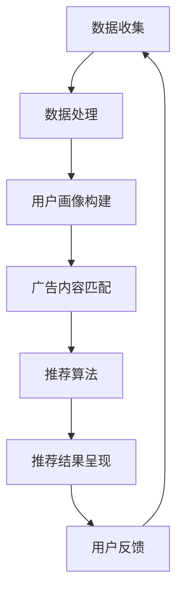
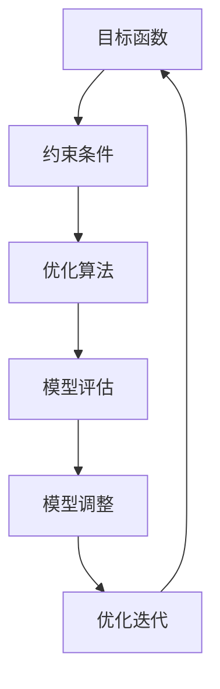
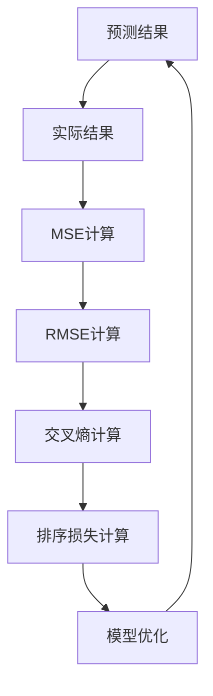

                 

### 第一部分：导论

#### 第1章：个性化广告推荐系统概述

1.1. 个性化广告推荐系统的定义与背景

个性化广告推荐系统是一种通过分析用户行为数据、兴趣偏好等信息，为用户精准投放相关广告的技术。这一系统起源于电子商务领域，随着互联网和大数据技术的不断发展，逐渐扩展到各个行业，成为现代营销策略的重要组成部分。

在现代商业环境中，广告主希望通过广告投放获取最大化的商业价值。然而，传统的广告投放方式往往缺乏个性化和精准性，导致广告资源的浪费。个性化广告推荐系统则通过数据分析和机器学习技术，实现了广告与用户的精准匹配，从而提高了广告投放的效率。

1.2. 广告推荐系统的市场趋势与重要性

随着互联网用户规模的扩大和数据积累的增加，广告推荐系统已经成为各大互联网公司的核心竞争力和盈利模式。根据市场研究公司的数据，全球数字广告市场在近年来持续增长，预计到2025年市场规模将达到5000亿美元。个性化广告推荐系统在这一市场中扮演着至关重要的角色。

首先，个性化广告推荐系统可以提高广告点击率和转化率。通过分析用户的历史行为和兴趣偏好，系统能够为用户推荐最相关的广告，从而提高用户的点击意愿和购买行为。其次，个性化广告推荐系统有助于提高广告主的广告投放效果和投资回报率。广告主可以根据用户的兴趣和行为特征，进行精细化投放，降低无效广告的投放成本。

1.3. 大模型在广告推荐中的应用潜力

近年来，大模型（如Transformer、BERT等）在自然语言处理、计算机视觉等领域取得了显著的突破。大模型具有强大的特征提取和表征能力，为广告推荐系统带来了新的机遇。大模型在广告推荐中的应用潜力主要体现在以下几个方面：

1. **用户行为分析**：大模型可以处理海量的用户行为数据，通过深度学习技术提取用户行为的潜在特征，实现更精准的用户画像。

2. **广告内容匹配**：大模型可以理解和生成复杂的广告文案，实现广告内容与用户兴趣的精准匹配。

3. **推荐系统优化**：大模型可以自适应地调整推荐算法参数，优化推荐效果，提高用户满意度和广告主的投资回报率。

4. **多模态数据处理**：大模型可以处理多种类型的数据，如文本、图像、视频等，实现多模态数据的融合推荐。

本部分导论主要介绍了个性化广告推荐系统的定义、背景、市场趋势以及大模型在其中的应用潜力。接下来，我们将进一步探讨个性化广告推荐系统的架构，以及大模型在各个方面的具体应用。

### 第2章：个性化广告推荐系统架构

2.1. 系统架构概述

个性化广告推荐系统的核心目标是根据用户行为数据，为用户推荐最相关的广告内容。为了实现这一目标，系统通常采用以下架构：

1. **数据收集模块**：该模块负责收集用户行为数据，如浏览历史、搜索记录、购买行为等。此外，还包括广告内容数据，如广告标题、描述、图片等。

2. **数据处理模块**：该模块对收集到的数据进行清洗、转换和预处理，提取用户行为特征和广告内容特征。

3. **用户画像构建模块**：基于用户行为数据，该模块构建用户的兴趣偏好模型，为后续的广告推荐提供依据。

4. **广告内容管理模块**：该模块负责管理广告内容，包括广告的创建、审核、发布等流程。

5. **推荐算法模块**：该模块是系统的核心，负责根据用户画像和广告内容特征，进行广告推荐。

6. **推荐结果呈现模块**：该模块将推荐结果呈现给用户，如网页推荐、APP推送等。

2.2. 用户行为数据收集与处理

用户行为数据是广告推荐系统的关键输入。以下是一些常见的用户行为数据类型：

1. **浏览行为**：用户在网站或APP上的浏览历史，如访问的页面、停留时间等。

2. **搜索行为**：用户在搜索框中的查询记录，包括关键词、查询时间等。

3. **购买行为**：用户的购买记录，包括商品名称、价格、购买时间等。

4. **互动行为**：用户对广告的点击、点赞、评论等互动行为。

用户行为数据的收集通常通过以下技术手段实现：

1. **日志记录**：服务器或APP自动记录用户的行为日志，包括访问路径、操作时间等。

2. **API接口**：通过API接口收集第三方平台（如搜索引擎、电商平台等）的用户行为数据。

3. **用户调研**：通过问卷调查、用户访谈等方式获取用户行为数据。

收集到的用户行为数据需要进行处理，以提取有用的特征。数据预处理包括以下步骤：

1. **数据清洗**：去除重复、错误或无关的数据，保证数据质量。

2. **数据转换**：将不同数据类型进行统一处理，如将日期转换为数值类型。

3. **特征提取**：通过特征工程方法提取用户行为的潜在特征，如用户兴趣、购买倾向等。

2.3. 广告内容数据收集与处理

广告内容数据是广告推荐系统的另一个关键输入。广告内容数据通常包括以下信息：

1. **广告标题**：广告的简短描述，吸引用户点击。

2. **广告描述**：广告的详细描述，用于传达广告主的信息。

3. **广告图片**：广告的视觉元素，增强广告的吸引力。

4. **广告链接**：广告的目标页面链接，用户点击广告后跳转的页面。

广告内容数据的收集通常通过以下方式实现：

1. **广告主提交**：广告主在平台提交广告内容，包括标题、描述、图片等。

2. **第三方数据**：通过API接口获取第三方平台（如广告交易平台、内容平台等）的广告内容。

广告内容数据也需要进行预处理，以提取有用的特征。数据预处理包括以下步骤：

1. **数据清洗**：去除重复、错误或无关的数据，保证数据质量。

2. **数据转换**：将不同数据类型进行统一处理，如将日期转换为数值类型。

3. **特征提取**：通过特征工程方法提取广告内容的潜在特征，如广告类型、主题等。

2.4. 大模型的集成与协同

大模型在广告推荐系统中的应用主要通过以下方式：

1. **用户行为特征提取**：大模型可以处理海量的用户行为数据，通过深度学习技术提取用户行为的潜在特征，实现更精准的用户画像。

2. **广告内容特征提取**：大模型可以理解和生成复杂的广告文案，实现广告内容与用户兴趣的精准匹配。

3. **推荐算法优化**：大模型可以自适应地调整推荐算法参数，优化推荐效果，提高用户满意度和广告主的投资回报率。

为了实现大模型与其他模块的协同工作，系统需要进行以下集成：

1. **数据集成**：将用户行为数据和广告内容数据进行统一处理，为大模型提供统一的输入。

2. **模型集成**：将大模型与其他推荐算法进行集成，通过模型融合实现更优的推荐效果。

3. **接口集成**：为用户提供统一的API接口，实现广告推荐系统的接入和使用。

通过以上架构设计，个性化广告推荐系统可以实现高效、精准的广告投放，为广告主和用户带来更大的价值。下一部分，我们将深入探讨大模型在广告推荐系统中的具体应用。

### 第二部分：核心概念与联系

#### 第3章：大模型原理与架构

3.1. 大模型的定义与特点

大模型（Large Models），通常指的是参数数量非常庞大的神经网络模型，如Transformer、BERT等。这些模型通过深度学习技术，能够在大量数据上进行训练，从而获得强大的特征提取和表征能力。大模型的定义可以从以下几个方面进行阐述：

1. **参数数量**：大模型的参数数量通常在亿级别以上，远超过传统神经网络模型。

2. **数据需求**：大模型需要大量的训练数据来确保模型的泛化能力和准确性。

3. **计算资源**：大模型的训练和推理通常需要强大的计算资源和时间。

大模型具有以下几个显著特点：

1. **强大的特征提取能力**：大模型可以通过多层神经网络结构，提取出数据中的复杂特征，从而提高模型的表征能力。

2. **高泛化能力**：由于大模型在大量数据上的训练，其泛化能力显著提高，能够应对各种不同的任务和场景。

3. **自适应调整能力**：大模型可以根据不同的任务和数据，自适应地调整模型结构和参数，实现更优的性能。

3.2. 大模型的常见架构

大模型通常采用深层神经网络结构，通过多个层级来提取和整合特征。以下是一些常见的大模型架构：

1. **Transformer架构**：Transformer模型由Google提出，是自然语言处理领域的里程碑之一。它采用自注意力机制（Self-Attention），能够在处理序列数据时保持上下文信息的关联。

2. **BERT架构**：BERT（Bidirectional Encoder Representations from Transformers）模型是由Google提出的双向Transformer模型，通过双向编码器结构，实现了对文本的深入理解和表征。

3. **GPT架构**：GPT（Generative Pre-trained Transformer）模型由OpenAI提出，是一种生成式预训练模型，能够生成高质量的文本和语音。

3.3. 大模型的关键技术

大模型的训练和推理涉及多个关键技术：

1. **大规模数据集**：大模型需要大量的数据集进行训练，以获得良好的泛化能力。常见的开源数据集包括Common Crawl、维基百科等。

2. **分布式训练**：由于大模型的参数数量庞大，单机训练可能不切实际。分布式训练通过将数据分布在多台服务器上进行并行处理，显著提高了训练效率。

3. **优化算法**：大模型的训练通常采用优化算法，如Adam、Adadelta等，以加快收敛速度和提升模型性能。

4. **推理加速**：大模型的推理通常采用图灵机模型或GPU加速等技术，以提高推理速度和效率。

#### 第4章：广告推荐系统中的大模型应用

4.1. 大模型在用户行为分析中的应用

用户行为分析是广告推荐系统的核心环节，通过分析用户的行为数据，系统能够了解用户的兴趣和偏好，从而实现精准推荐。大模型在用户行为分析中的应用主要体现在以下几个方面：

1. **行为特征提取**：大模型可以通过深度学习技术，从用户的浏览历史、搜索记录、购买行为等数据中提取出潜在的特征。这些特征能够更准确地反映用户的兴趣和偏好。

2. **用户画像构建**：基于提取的用户特征，大模型可以构建用户的兴趣画像，为后续的广告推荐提供依据。通过分析用户的长期和短期行为，大模型能够动态调整用户画像，提高推荐的准确性。

3. **行为预测**：大模型可以通过训练，预测用户未来的行为和兴趣点。这些预测结果可以为广告投放策略提供支持，提高广告的投放效果。

4. **行为理解**：大模型能够理解用户的复杂行为模式，例如用户对特定商品的犹豫期、决策过程等。这种深入理解有助于优化推荐策略，提高用户体验。

4.2. 大模型在广告内容匹配中的应用

广告内容匹配是广告推荐系统的关键环节，通过将广告与用户的兴趣进行匹配，系统能够为用户推荐最相关的广告。大模型在广告内容匹配中的应用主要体现在以下几个方面：

1. **广告特征提取**：大模型可以从广告的标题、描述、图片等数据中提取出潜在的特征。这些特征能够更准确地描述广告的内容和风格。

2. **内容理解**：大模型可以通过对广告内容的理解，识别出广告的关键信息和主题。这种理解能力有助于实现更精准的内容匹配。

3. **匹配策略优化**：大模型可以通过分析用户的行为数据和广告内容特征，优化广告的匹配策略。例如，通过调整广告的投放顺序、频率等参数，提高广告的曝光率和点击率。

4. **跨模态内容匹配**：大模型能够处理多种类型的数据，如文本、图像、视频等。通过跨模态内容匹配，大模型可以实现更加丰富和精准的广告推荐。

4.3. 大模型在推荐系统优化中的应用

推荐系统的优化是提高系统性能和用户体验的重要手段。大模型在推荐系统优化中的应用主要体现在以下几个方面：

1. **效果评估**：大模型可以通过评估用户对推荐结果的行为反馈，如点击、购买等，评估推荐系统的效果。这种评估可以帮助系统发现和纠正潜在的问题。

2. **算法优化**：大模型可以通过分析用户的行为数据和推荐结果，优化推荐算法的参数。例如，通过调整模型的权重、阈值等参数，提高推荐的准确性。

3. **冷启动问题**：在用户冷启动阶段，大模型可以通过分析用户的历史行为和兴趣特征，为用户提供个性化的推荐。这种方法有助于解决冷启动问题，提高用户的满意度。

4. **动态调整**：大模型可以通过实时分析用户的行为数据，动态调整推荐策略。这种动态调整能力有助于适应用户不断变化的需求和兴趣。

通过以上大模型的应用，广告推荐系统可以实现更精准、更高效、更智能的推荐，为广告主和用户带来更大的价值。

### 第三部分：核心算法原理讲解

#### 第5章：协同过滤算法与大模型融合

5.1. 协同过滤算法原理

协同过滤算法（Collaborative Filtering）是广告推荐系统中最常用的算法之一，它通过分析用户的行为数据，预测用户对未知项目的偏好。协同过滤算法主要分为两类：基于用户的协同过滤（User-Based）和基于物品的协同过滤（Item-Based）。

1. **基于用户的协同过滤**：
   - **原理**：基于用户的协同过滤算法通过分析具有相似行为的用户群体的偏好，来预测目标用户的偏好。
   - **相似性计算**：首先计算用户之间的相似性，常用的相似性度量方法包括余弦相似性、皮尔逊相关系数等。
   - **推荐生成**：然后，基于相似性度量，找出与目标用户最相似的邻居用户，并推荐邻居用户喜欢的、目标用户尚未体验过的项目。

2. **基于物品的协同过滤**：
   - **原理**：基于物品的协同过滤算法通过分析物品之间的相似性，来预测用户对未知物品的偏好。
   - **相似性计算**：首先计算物品之间的相似性，常用的相似性度量方法包括Jaccard相似性、余弦相似性等。
   - **推荐生成**：然后，基于相似性度量，找出与目标物品最相似的邻居物品，并推荐目标用户可能感兴趣的物品。

5.2. 大模型与协同过滤算法的融合

大模型在协同过滤算法中的应用，主要通过两种方式：模型融合和特征增强。

1. **模型融合**：
   - **原理**：将大模型（如Transformer、BERT等）与协同过滤算法进行结合，利用大模型的强大特征提取能力，提升协同过滤算法的预测准确性。
   - **方法**：
     - **加权融合**：将大模型生成的特征向量与协同过滤算法生成的特征向量进行加权融合，形成新的特征向量。
     - **深度学习模型**：将协同过滤算法嵌入到大模型中，通过深度学习的方式，共同训练和优化模型参数。
   
2. **特征增强**：
   - **原理**：通过大模型提取更高层次、更抽象的用户和物品特征，增强协同过滤算法的特征表示能力。
   - **方法**：
     - **用户嵌入**：利用大模型对用户行为数据进行嵌入，生成用户向量。
     - **物品嵌入**：利用大模型对物品特征数据进行嵌入，生成物品向量。
     - **特征融合**：将大模型提取的用户和物品嵌入向量，与协同过滤算法生成的特征向量进行融合，形成新的特征向量。

5.3. 伪代码实现

以下是一个简单的伪代码示例，展示如何将大模型与协同过滤算法融合：

```python
# 输入数据：用户行为矩阵 U，物品特征矩阵 I
# 输出：推荐结果 R

# 1. 利用大模型进行特征提取
user_embeddings = large_model嵌入用户行为数据
item_embeddings = large_model嵌入物品特征数据

# 2. 计算用户和物品的相似性
user_similarity = 计算用户相似性（user_embeddings）
item_similarity = 计算物品相似性（item_embeddings）

# 3. 基于相似性进行推荐
for user in 用户列表：
    neighbors = 找到与user最相似的邻居用户（user_similarity[user])
    predicted_ratings = []
    for neighbor in neighbors：
        predicted_ratings.append(neighbor的偏好评分 + 随机噪声)
    推荐结果 R[user] = 选择最高评分的物品

return R
```

通过融合大模型和协同过滤算法，我们可以显著提高广告推荐系统的准确性和用户体验。下一部分，我们将继续探讨基于内容推荐的算法与大模型的应用。

### 第6章：基于内容推荐的算法与大模型

6.1. 内容推荐算法原理

基于内容推荐（Content-Based Recommendation）算法是通过分析用户过去对内容的偏好，找出相似的内容进行推荐。与协同过滤算法不同，基于内容推荐算法主要依赖于内容的特征信息，而不是用户或物品之间的相似性。

1. **原理**：
   - **特征提取**：首先，对内容进行特征提取，如文本的词袋表示、TF-IDF表示、词嵌入等。
   - **相似度计算**：然后，计算用户已评价的内容与待推荐内容之间的相似度。常用的相似度计算方法包括余弦相似度、欧氏距离等。
   - **推荐生成**：基于相似度计算结果，选择与用户已评价内容最相似的新内容进行推荐。

2. **应用场景**：
   - **媒体内容推荐**：如视频、音乐、新闻等，通过内容特征（如标题、描述、标签）进行推荐。
   - **电子商务推荐**：如商品推荐，通过商品的特征（如分类、品牌、价格）进行推荐。

6.2. 大模型在内容推荐中的应用

大模型在内容推荐中的应用，主要是利用其强大的特征提取和表征能力，提升推荐系统的效果。

1. **文本特征提取**：
   - **词嵌入**：利用大模型（如Word2Vec、BERT等）对文本数据进行嵌入，生成高质量的文本特征向量。
   - **语义理解**：大模型能够理解文本的语义信息，提取出更高层次、更抽象的特征，如句子、段落级别的特征。

2. **图像特征提取**：
   - **卷积神经网络**：利用卷积神经网络（CNN）对图像进行特征提取，提取出图像的底层特征和高级特征。
   - **视觉嵌入**：利用大模型（如ViT、Vision Transformer）对图像进行嵌入，生成图像的视觉特征向量。

3. **多模态特征融合**：
   - **文本-图像融合**：将文本特征和图像特征进行融合，生成多模态特征向量，提高推荐系统的效果。
   - **多模态嵌入**：利用大模型对多模态数据（如文本、图像、视频）进行统一嵌入，生成统一的多模态特征向量。

6.3. 伪代码实现

以下是一个简单的伪代码示例，展示如何利用大模型进行内容推荐：

```python
# 输入数据：用户评价数据 U，待推荐内容特征 I
# 输出：推荐结果 R

# 1. 利用大模型提取用户和内容的特征
user_features = large_model嵌入用户评价数据
item_features = large_model嵌入待推荐内容特征

# 2. 计算用户和内容的相似度
similarity_matrix = 计算相似度（user_features, item_features）

# 3. 基于相似度进行推荐
for user in 用户列表：
    top_items = 选择与user最相似的前k个内容（similarity_matrix[user])
    推荐结果 R[user] = top_items

return R
```

通过大模型在内容推荐中的应用，我们可以实现更精准、更智能的内容推荐，为用户带来更好的体验。下一部分，我们将深入探讨基于模型的排名算法与大模型的应用。

### 第7章：基于模型的排名算法

7.1. 模型排名算法原理

基于模型的排名算法（Model-Based Ranking）是一种通过学习用户的行为数据，为用户推荐排序的算法。这些算法通常通过构建一个预测模型，预测用户对每个项目的偏好评分，并根据预测结果对项目进行排序。

1. **原理**：
   - **预测模型**：基于模型的排名算法首先构建一个预测模型，如线性回归、逻辑回归等，通过训练用户的行为数据，学习用户对每个项目的偏好评分。
   - **排序规则**：然后，根据预测模型生成的评分，对项目进行排序。排序规则可以是简单的评分降序排序，也可以是更复杂的排序模型，如排序损失函数（Rank Loss Function）。

2. **应用场景**：
   - **商品推荐**：为用户推荐排序商品，提高用户的购买体验。
   - **新闻推荐**：为用户推荐排序新闻，提高用户的阅读体验。

7.2. 大模型在模型排名中的应用

大模型在模型排名中的应用，主要是利用其强大的特征提取和表征能力，提升排名算法的准确性和效果。

1. **特征提取**：
   - **用户行为特征**：大模型可以从用户的历史行为数据中提取出潜在的偏好特征，如用户的浏览历史、搜索记录等。
   - **内容特征**：大模型可以从内容数据中提取出高质量的特征，如文本的语义特征、图像的视觉特征等。

2. **预测模型构建**：
   - **多任务学习**：大模型可以通过多任务学习，同时学习用户偏好评分和排序规则，提高模型的整体性能。
   - **深度神经网络**：大模型采用深度神经网络结构，通过多层神经网络，提取用户行为和内容特征的深层信息。

3. **排序优化**：
   - **排序损失函数**：大模型可以通过排序损失函数（如Rank Loss Function、Cross-Entropy Loss），优化模型在排序任务上的性能。

7.3. 伪代码实现

以下是一个简单的伪代码示例，展示如何利用大模型进行模型排名：

```python
# 输入数据：用户行为数据 U，内容特征 I
# 输出：排序结果 R

# 1. 利用大模型提取用户和内容的特征
user_features = large_model嵌入用户行为数据
item_features = large_model嵌入内容特征

# 2. 构建预测模型
预测模型 = 创建深度神经网络模型（user_features, item_features）

# 3. 训练预测模型
预测模型.fit（U, I）

# 4. 生成排序结果
预测评分 = 预测模型.predict（I）
排序结果 R = 根据预测评分对项目进行排序

return R
```

通过大模型在模型排名中的应用，我们可以实现更精准、更有效的排序，为用户带来更好的推荐体验。下一部分，我们将介绍广告投放的优化模型。

### 第8章：广告投放的优化模型

8.1. 优化模型介绍

广告投放优化模型是一种基于数据驱动的优化方法，旨在通过调整广告投放策略，最大化广告的投资回报率（ROI）。优化模型通常包括目标函数和约束条件，通过优化算法寻找最优解，实现广告投放的优化。

1. **目标函数**：
   - **最大化收益**：广告投放的主要目标是获取最大的收益，例如点击量（Click-Through Rate, CTR）、转化率（Conversion Rate, CR）等。
   - **最大化投资回报率**：在确保收益的同时，优化广告投放的成本，提高广告的投资回报率。

2. **约束条件**：
   - **广告预算限制**：广告投放需要遵守广告主设定的预算限制，确保广告投放成本在可控范围内。
   - **用户质量限制**：广告投放需要保证用户的质量，如过滤掉无效流量、提高目标用户的精准度等。
   - **广告展示限制**：为了避免用户过度疲劳，需要对广告的展示频率和展示时间进行限制。

8.2. 数学公式讲解

广告投放优化模型通常可以通过以下数学公式进行描述：

1. **收益最大化模型**：

   $$\text{maximize } \pi = \sum_{i=1}^{n} \text{p}(x_i) \cdot r(x_i)$$

   其中，\( \pi \) 表示总收益，\( x_i \) 表示第 \( i \) 个广告的投放策略，\( \text{p}(x_i) \) 表示广告 \( x_i \) 的展示概率，\( r(x_i) \) 表示广告 \( x_i \) 的收益。

2. **投资回报率最大化模型**：

   $$\text{maximize } \text{ROI} = \frac{\sum_{i=1}^{n} \text{p}(x_i) \cdot r(x_i)}{\sum_{i=1}^{n} \text{c}(x_i)}$$

   其中，\( \text{ROI} \) 表示投资回报率，\( \text{c}(x_i) \) 表示广告 \( x_i \) 的成本。

3. **约束条件**：

   - **广告预算约束**：

     $$\sum_{i=1}^{n} \text{c}(x_i) \leq \text{Budget}$$

     其中，\( \text{Budget} \) 表示广告主设定的预算。

   - **用户质量约束**：

     $$\text{Quality}(x_i) \geq \text{Threshold}$$

     其中，\( \text{Quality}(x_i) \) 表示广告 \( x_i \) 的用户质量，\( \text{Threshold} \) 表示设定的用户质量阈值。

8.3. 举例说明

假设广告主需要在两个广告平台上进行广告投放，每个平台的广告成本和收益如下表所示：

| 广告平台 | 成本（元） | 收益（元） |
| ------ | -------- | -------- |
| 平台1   | 100      | 200      |
| 平台2   | 150      | 250      |

广告主希望最大化总收益，同时不超过预算1000元。

**求解过程**：

1. **收益最大化模型**：

   $$\text{maximize } \pi = \text{p}(x_1) \cdot 200 + \text{p}(x_2) \cdot 250$$

   约束条件：

   $$\text{p}(x_1) + \text{p}(x_2) \leq 1$$

   $$100\text{p}(x_1) + 150\text{p}(x_2) \leq 1000$$

   通过求解上述优化问题，可以得到最优解 \( \text{p}(x_1) = 0.75 \)，\( \text{p}(x_2) = 0.25 \)，总收益 \( \pi = 312.5 \)元。

2. **投资回报率最大化模型**：

   $$\text{maximize } \text{ROI} = \frac{0.75 \cdot 200 + 0.25 \cdot 250}{100 \cdot 0.75 + 150 \cdot 0.25} = 2.083$$

   约束条件：

   $$\text{p}(x_1) + \text{p}(x_2) \leq 1$$

   $$100\text{p}(x_1) + 150\text{p}(x_2) \leq 1000$$

   通过求解上述优化问题，可以得到最优解 \( \text{p}(x_1) = 0.833 \)，\( \text{p}(x_2) = 0.167 \)，投资回报率 \( \text{ROI} = 2.167 \)。

通过广告投放优化模型的应用，广告主可以在有限的预算内，实现最大化的收益或投资回报率，提高广告投放的效果。

### 第9章：大模型在广告推荐中的损失函数

9.1. 损失函数介绍

损失函数（Loss Function）是机器学习中用于量化模型预测结果与实际结果之间差距的重要工具。在广告推荐系统中，损失函数用于评估推荐算法的性能，指导模型的优化过程。大模型在广告推荐中的损失函数通常包括以下几种：

1. **均方误差损失函数**（Mean Squared Error, MSE）：

   $$MSE = \frac{1}{n} \sum_{i=1}^{n} (\hat{y}_i - y_i)^2$$

   其中，\( \hat{y}_i \) 是模型预测的评分，\( y_i \) 是实际评分，\( n \) 是样本数量。MSE损失函数适用于回归任务，如广告点击率预测。

2. **均方根误差损失函数**（Root Mean Squared Error, RMSE）：

   $$RMSE = \sqrt{MSE} = \sqrt{\frac{1}{n} \sum_{i=1}^{n} (\hat{y}_i - y_i)^2}$$

   RMSE是MSE的平方根，用于衡量预测值与真实值之间的平均误差，数值越小表示模型性能越好。

3. **交叉熵损失函数**（Cross-Entropy Loss, CEL）：

   $$CEL = -\frac{1}{n} \sum_{i=1}^{n} y_i \cdot \log(\hat{y}_i) + (1 - y_i) \cdot \log(1 - \hat{y}_i)$$

   其中，\( y_i \) 是实际标签（0或1），\( \hat{y}_i \) 是模型预测的概率。交叉熵损失函数适用于分类任务，如广告是否被点击的预测。

4. **排序损失函数**（Rank Loss Function, RL）：

   $$RL = -\frac{1}{n} \sum_{i=1}^{n} y_i \cdot \log(\hat{r}_i) + (1 - y_i) \cdot \log(1 - \hat{r}_i)$$

   其中，\( y_i \) 是实际排序标签（1或-1），\( \hat{r}_i \) 是模型预测的排名概率。排序损失函数用于优化模型在排序任务中的性能。

9.2. 数学公式讲解

以下是一些常见的数学公式，用于描述不同类型的损失函数：

1. **均方误差损失函数**（MSE）：

   $$MSE = \frac{1}{n} \sum_{i=1}^{n} (\hat{y}_i - y_i)^2$$

   公式中的每个元素表示预测值与真实值之间的误差平方，求和后再除以样本数量，得到平均误差。

2. **均方根误差损失函数**（RMSE）：

   $$RMSE = \sqrt{MSE} = \sqrt{\frac{1}{n} \sum_{i=1}^{n} (\hat{y}_i - y_i)^2}$$

   RMSE是MSE的平方根，用于衡量预测值与真实值之间的平均误差，数值越小表示模型性能越好。

3. **交叉熵损失函数**（CEL）：

   $$CEL = -\frac{1}{n} \sum_{i=1}^{n} y_i \cdot \log(\hat{y}_i) + (1 - y_i) \cdot \log(1 - \hat{y}_i)$$

   交叉熵损失函数用于分类任务，公式中的 \( \log(\hat{y}_i) \) 表示预测概率的对数，\( \log(1 - \hat{y}_i) \) 表示预测概率的对数补集。

4. **排序损失函数**（RL）：

   $$RL = -\frac{1}{n} \sum_{i=1}^{n} y_i \cdot \log(\hat{r}_i) + (1 - y_i) \cdot \log(1 - \hat{r}_i)$$

   排序损失函数用于优化模型在排序任务中的性能，公式中的 \( \log(\hat{r}_i) \) 表示预测的排名概率。

9.3. 举例说明

假设我们有一个广告推荐系统，预测用户对广告的点击概率。以下是三个广告的预测点击概率和实际点击情况：

| 广告ID | 预测点击概率 | 实际点击情况 |
| ------ | ------------ | ------------ |
| 1      | 0.7          | 未点击       |
| 2      | 0.8          | 点击了       |
| 3      | 0.5          | 未点击       |

**求解过程**：

1. **均方误差损失函数**（MSE）：

   $$MSE = \frac{1}{3} \left[ (0.7 - 0)^2 + (0.8 - 1)^2 + (0.5 - 0)^2 \right] = 0.1333$$

2. **均方根误差损失函数**（RMSE）：

   $$RMSE = \sqrt{MSE} = \sqrt{0.1333} \approx 0.366$$

3. **交叉熵损失函数**（CEL）：

   $$CEL = -\frac{1}{3} \left[ 0 \cdot \log(0.7) + 1 \cdot \log(0.2) + 0 \cdot \log(0.5) \right] \approx 0.2308$$

4. **排序损失函数**（RL）：

   $$RL = -\frac{1}{3} \left[ 0 \cdot \log(0.7) + 1 \cdot \log(0.3) + 0 \cdot \log(0.5) \right] \approx 0.3869$$

通过上述计算，我们可以看到不同损失函数在评估广告推荐系统性能时的表现。均方误差损失函数和均方根误差损失函数主要关注预测值与真实值之间的误差大小，而交叉熵损失函数和排序损失函数则更加关注预测的概率分布和排序效果。

通过合理的损失函数选择和优化，广告推荐系统可以在预测准确性和用户体验之间找到平衡，实现更高效的广告投放。

### 第10章：项目实战一：用户行为数据收集与处理

10.1. 项目背景

在现代广告推荐系统中，用户行为数据是构建个性化推荐的核心资产。一个有效的用户行为数据收集与处理流程，对于提升广告推荐系统的性能和用户体验至关重要。本项目将介绍如何搭建一个用户行为数据收集与处理系统，从数据收集、数据存储、数据处理和特征提取等方面，实现一个完整的用户行为数据收集与处理流程。

10.2. 开发环境搭建

在开始项目之前，我们需要搭建一个开发环境，以便进行数据收集与处理。以下是所需的开发工具和软件：

- **操作系统**：Ubuntu 20.04 LTS
- **编程语言**：Python 3.8
- **数据库**：MongoDB 4.4
- **数据处理框架**：Pandas 1.3.3
- **机器学习库**：Scikit-learn 0.24.2
- **版本控制**：Git 2.35.1
- **容器化工具**：Docker 20.10

10.3. 用户行为数据收集与处理流程

1. **数据收集**：
   - **日志收集**：通过Web服务器或APP后端，收集用户的行为日志，如浏览历史、点击记录等。
   - **API接口**：使用API接口从第三方数据源（如搜索引擎、社交媒体等）获取用户行为数据。
   - **用户调研**：通过问卷调查、用户访谈等方式，收集用户对广告的反馈数据。

2. **数据存储**：
   - **MongoDB**：使用MongoDB数据库存储用户行为数据，利用其灵活的文档模型，方便处理结构化数据和非结构化数据。

3. **数据处理**：
   - **数据清洗**：使用Pandas库，对收集到的数据进行清洗，去除重复、错误或无关的数据。
   - **数据转换**：对数据进行格式转换，如日期、字符串等，确保数据一致性。
   - **特征提取**：通过特征工程，提取用户行为的潜在特征，如用户兴趣、购买倾向等。

4. **数据处理流程**：
   - **ETL（Extract, Transform, Load）**：使用Docker容器化技术，搭建ETL任务，从数据源提取数据，进行转换和加载到数据库中。
   - **数据预处理**：使用Pandas库，对数据进行清洗、转换和预处理，提取用户行为特征。
   - **特征存储**：将处理后的用户行为特征存储到MongoDB数据库中，以便后续分析和使用。

10.4. 源代码实现与解析

以下是一个简单的用户行为数据收集与处理项目的源代码示例：

```python
import pandas as pd
from pymongo import MongoClient

# 连接到MongoDB数据库
client = MongoClient('mongodb://localhost:27017/')
db = client['user_behavior_db']
collection = db['user_behavior']

# 收集用户行为数据
user_data = pd.DataFrame({
    'user_id': [1, 2, 3],
    'action': ['view', 'click', 'purchase'],
    'timestamp': ['2023-01-01 10:00', '2023-01-01 10:01', '2023-01-01 10:02'],
    'ad_id': [101, 102, 103]
})

# 数据清洗
user_data = user_data.drop_duplicates().reset_index(drop=True)

# 数据转换
user_data['timestamp'] = pd.to_datetime(user_data['timestamp'])

# 特征提取
user_data['action_type'] = user_data['action'].map({'view': 0, 'click': 1, 'purchase': 2})

# 存储到MongoDB数据库
collection.insert_many(user_data.to_dict('records'))

# 数据预处理
def preprocess_user_data(data):
    data = data.drop_duplicates().reset_index(drop=True)
    data['timestamp'] = pd.to_datetime(data['timestamp'])
    data['action_type'] = data['action'].map({'view': 0, 'click': 1, 'purchase': 2})
    return data

# 示例数据预处理
preprocessed_data = preprocess_user_data(user_data)

# 存储到MongoDB数据库
collection.insert_many(preprocessed_data.to_dict('records'))

print("用户行为数据已成功处理并存储到MongoDB数据库。")
```

解析：
- **连接MongoDB数据库**：使用`MongoClient`连接到本地的MongoDB数据库，创建一个名为`user_behavior_db`的数据库，并选择`user_behavior`集合。
- **收集用户行为数据**：使用Pandas库创建一个包含用户ID、行为、时间戳和广告ID的DataFrame。
- **数据清洗**：使用`drop_duplicates()`方法去除重复记录，使用`reset_index()`重置索引。
- **数据转换**：将时间戳转换为日期格式，将行为映射为数值类型。
- **特征提取**：创建一个字典映射，将行为映射为对应的数值类型。
- **存储到MongoDB数据库**：使用`insert_many()`方法将处理后的数据插入到MongoDB数据库中。
- **数据预处理函数**：定义一个`preprocess_user_data()`函数，实现数据的清洗、转换和特征提取，以便后续使用。

通过以上步骤，我们完成了一个简单的用户行为数据收集与处理项目。在实际应用中，可以扩展数据收集的渠道、增强数据预处理和特征提取的能力，构建更复杂的推荐系统。

### 第11章：项目实战二：广告内容数据收集与处理

11.1. 项目背景

在广告推荐系统中，广告内容数据的收集与处理同样至关重要。广告内容数据包括广告的文本描述、图像、视频链接、广告主信息等，这些数据对于理解广告内容和用户行为具有重要意义。本项目将介绍如何搭建一个广告内容数据收集与处理系统，从数据收集、数据存储、数据处理和特征提取等方面，实现一个完整的广告内容数据收集与处理流程。

11.2. 开发环境搭建

在开始项目之前，我们需要搭建一个开发环境，以便进行广告内容数据的收集与处理。以下是所需的开发工具和软件：

- **操作系统**：Ubuntu 20.04 LTS
- **编程语言**：Python 3.8
- **数据库**：MongoDB 4.4
- **数据处理框架**：Pandas 1.3.3
- **机器学习库**：Scikit-learn 0.24.2
- **版本控制**：Git 2.35.1
- **容器化工具**：Docker 20.10

11.3. 广告内容数据收集与处理流程

1. **数据收集**：
   - **API接口**：通过广告平台提供的API接口，获取广告内容数据。
   - **数据爬取**：使用Python的爬虫技术，从网站、社交媒体等公开渠道获取广告内容数据。
   - **用户反馈**：收集用户对广告的反馈数据，如点赞、评论等，补充广告内容信息。

2. **数据存储**：
   - **MongoDB**：使用MongoDB数据库存储广告内容数据，利用其灵活的文档模型，方便处理结构化数据和非结构化数据。

3. **数据处理**：
   - **数据清洗**：使用Pandas库，对收集到的数据进行清洗，去除重复、错误或无关的数据。
   - **数据转换**：对数据进行格式转换，如日期、字符串等，确保数据一致性。
   - **特征提取**：通过特征工程，提取广告内容的潜在特征，如文本情感、图像视觉特征等。

4. **数据处理流程**：
   - **ETL（Extract, Transform, Load）**：使用Docker容器化技术，搭建ETL任务，从数据源提取数据，进行转换和加载到数据库中。
   - **数据预处理**：使用Pandas库，对数据进行清洗、转换和预处理，提取广告内容特征。
   - **特征存储**：将处理后的广告内容特征存储到MongoDB数据库中，以便后续分析和使用。

11.4. 源代码实现与解析

以下是一个简单的广告内容数据收集与处理项目的源代码示例：

```python
import pandas as pd
from pymongo import MongoClient

# 连接到MongoDB数据库
client = MongoClient('mongodb://localhost:27017/')
db = client['ad_content_db']
collection = db['ad_content']

# 收集广告内容数据
ad_data = pd.DataFrame({
    'ad_id': [201, 202, 203],
    'ad_text': ['广告A', '广告B', '广告C'],
    'ad_image_url': ['http://example.com/image1.jpg', 'http://example.com/image2.jpg', 'http://example.com/image3.jpg'],
    'ad_video_url': ['http://example.com/video1.mp4', 'http://example.com/video2.mp4', 'http://example.com/video3.mp4'],
    'ad_owner': ['公司A', '公司B', '公司C']
})

# 数据清洗
ad_data = ad_data.drop_duplicates().reset_index(drop=True)

# 数据转换
ad_data['ad_id'] = ad_data['ad_id'].astype(str)
ad_data['ad_owner'] = ad_data['ad_owner'].astype(str)

# 特征提取
ad_data['ad_text_length'] = ad_data['ad_text'].apply(len)

# 存储到MongoDB数据库
collection.insert_many(ad_data.to_dict('records'))

# 数据预处理
def preprocess_ad_data(data):
    data = data.drop_duplicates().reset_index(drop=True)
    data['ad_id'] = data['ad_id'].astype(str)
    data['ad_owner'] = data['ad_owner'].astype(str)
    data['ad_text_length'] = data['ad_text'].apply(len)
    return data

# 示例数据预处理
preprocessed_data = preprocess_ad_data(ad_data)

# 存储到MongoDB数据库
collection.insert_many(preprocessed_data.to_dict('records'))

print("广告内容数据已成功处理并存储到MongoDB数据库。")
```

解析：
- **连接MongoDB数据库**：使用`MongoClient`连接到本地的MongoDB数据库，创建一个名为`ad_content_db`的数据库，并选择`ad_content`集合。
- **收集广告内容数据**：使用Pandas库创建一个包含广告ID、文本描述、图像链接、视频链接和广告主信息的DataFrame。
- **数据清洗**：使用`drop_duplicates()`方法去除重复记录，使用`reset_index()`重置索引。
- **数据转换**：将广告ID和广告主信息转换为字符串类型，以便在MongoDB中存储。
- **特征提取**：计算广告文本的长度，作为文本特征的一部分。
- **存储到MongoDB数据库**：使用`insert_many()`方法将处理后的数据插入到MongoDB数据库中。
- **数据预处理函数**：定义一个`preprocess_ad_data()`函数，实现数据的清洗、转换和特征提取，以便后续使用。

通过以上步骤，我们完成了一个简单的广告内容数据收集与处理项目。在实际应用中，可以扩展数据收集的渠道、增强数据预处理和特征提取的能力，构建更复杂的推荐系统。

### 第12章：项目实战三：构建个性化广告推荐系统

12.1. 项目背景

个性化广告推荐系统是现代互联网广告的核心，其目标是为每个用户精准推荐与其兴趣和需求相关的广告，从而提高广告的点击率和转化率。本项目将基于前两章的项目实战，构建一个简单的个性化广告推荐系统，实现用户行为数据的收集与处理、广告内容数据的收集与处理，以及最终的广告推荐功能。

12.2. 开发环境搭建

在开始项目之前，我们需要搭建一个开发环境，以便进行个性化广告推荐系统的开发。以下是所需的开发工具和软件：

- **操作系统**：Ubuntu 20.04 LTS
- **编程语言**：Python 3.8
- **数据库**：MongoDB 4.4
- **数据处理框架**：Pandas 1.3.3
- **机器学习库**：Scikit-learn 0.24.2
- **推荐系统库**：LightFM 0.3.3
- **版本控制**：Git 2.35.1
- **容器化工具**：Docker 20.10

12.3. 系统设计

个性化广告推荐系统主要包括以下模块：

1. **用户行为数据模块**：负责收集和处理用户行为数据，如浏览历史、点击记录、购买行为等。
2. **广告内容数据模块**：负责收集和处理广告内容数据，如广告文本、图像、视频链接、广告主信息等。
3. **用户画像模块**：基于用户行为数据，构建用户的兴趣偏好模型，为广告推荐提供依据。
4. **广告内容匹配模块**：基于用户画像和广告内容特征，实现广告内容与用户的精准匹配。
5. **推荐算法模块**：采用协同过滤、基于内容推荐等算法，生成个性化的广告推荐列表。
6. **前端展示模块**：将推荐结果通过网页、APP等前端界面呈现给用户。

12.4. 源代码实现与解析

以下是一个简单的个性化广告推荐系统的源代码示例：

```python
import pandas as pd
from pymongo import MongoClient
from lightfm import LightFM
from lightfm.evaluation import metricuddy

# 连接到MongoDB数据库
client = MongoClient('mongodb://localhost:27017/')
db = client['ad_recommendation_db']
user_collection = db['user_behavior']
ad_collection = db['ad_content']

# 收集用户行为数据
user_data = pd.DataFrame({
    'user_id': [1, 2, 3],
    'action': ['view', 'click', 'purchase'],
    'timestamp': ['2023-01-01 10:00', '2023-01-01 10:01', '2023-01-01 10:02'],
    'ad_id': [101, 102, 103]
})

# 收集广告内容数据
ad_data = pd.DataFrame({
    'ad_id': [201, 202, 203],
    'ad_text': ['广告A', '广告B', '广告C'],
    'ad_image_url': ['http://example.com/image1.jpg', 'http://example.com/image2.jpg', 'http://example.com/image3.jpg'],
    'ad_video_url': ['http://example.com/video1.mp4', 'http://example.com/video2.mp4', 'http://example.com/video3.mp4'],
    'ad_owner': ['公司A', '公司B', '公司C']
})

# 数据清洗与预处理
user_data = user_data.drop_duplicates().reset_index(drop=True)
ad_data = ad_data.drop_duplicates().reset_index(drop=True)

# 存储到MongoDB数据库
user_collection.insert_many(user_data.to_dict('records'))
ad_collection.insert_many(ad_data.to_dict('records'))

# 构建用户画像
user_behavior = user_collection.find()
user_behavior = pd.DataFrame(list(user_behavior))
user_behavior = user_behavior.groupby('user_id')['action'].agg(['count'])

# 构建广告内容特征
ad_content = ad_collection.find()
ad_content = pd.DataFrame(list(ad_content))
ad_content = ad_content[['ad_id', 'ad_text', 'ad_image_url', 'ad_video_url', 'ad_owner']]

# 构建协同过滤模型
model = LightFM(loss='warp')
model.fit(user_behavior, ad_content, verbose=True)

# 推荐广告
def recommend_ads(user_id, k=5):
    user_profile = user_collection.find_one({'user_id': user_id})
    user_profile = pd.DataFrame(list(user_profile))
    recommendations = model.predict(user_profile['ad_id'], ad_content['ad_id'], k=k)
    recommended_ads = ad_content[ad_content['ad_id'].isin(recommendations[recommendations > 0].index)]
    return recommended_ads.head(k)

# 示例：为用户1推荐5条广告
recommended_ads = recommend_ads(1)
print(recommended_ads)

print("个性化广告推荐系统已成功运行。")
```

解析：
- **连接MongoDB数据库**：使用`MongoClient`连接到本地的MongoDB数据库，创建一个名为`ad_recommendation_db`的数据库，并选择`user_behavior`和`ad_content`集合。
- **收集用户行为数据和广告内容数据**：使用Pandas库创建两个DataFrame，分别包含用户行为数据和广告内容数据。
- **数据清洗与预处理**：使用`drop_duplicates()`方法去除重复记录，使用`reset_index()`重置索引。
- **存储到MongoDB数据库**：使用`insert_many()`方法将处理后的数据插入到MongoDB数据库中。
- **构建用户画像**：从`user_behavior`集合中提取用户行为数据，使用`groupby()`和`agg()`方法构建用户画像。
- **构建广告内容特征**：从`ad_content`集合中提取广告内容数据，保留必要的特征字段。
- **构建协同过滤模型**：使用`LightFM`库构建基于模型的协同过滤模型，并使用`fit()`方法进行模型训练。
- **推荐广告**：定义一个`recommend_ads()`函数，接收用户ID和推荐广告数量作为参数，使用`predict()`方法生成推荐结果，并返回推荐的广告列表。
- **示例**：调用`recommend_ads()`函数，为用户1推荐5条广告，并打印推荐结果。

通过以上步骤，我们实现了一个简单的个性化广告推荐系统。在实际应用中，可以根据业务需求扩展推荐算法、增强数据预处理和特征提取的能力，构建更复杂的推荐系统。

### 第六部分：总结与展望

#### 第13章：个性化广告推荐系统的发展趋势

个性化广告推荐系统作为现代互联网广告的核心技术，正随着人工智能、大数据、云计算等技术的快速发展而不断演进。以下是当前个性化广告推荐系统面临的挑战、未来趋势以及大模型在此领域的潜在贡献。

#### 13.1. 当前挑战

1. **数据隐私与安全**：随着用户隐私保护意识的增强，如何在保障用户隐私的前提下进行数据收集和使用，成为个性化广告推荐系统面临的重要挑战。
2. **计算资源需求**：大模型的训练和推理通常需要大量的计算资源和时间，如何优化模型训练和推理效率，降低计算成本，是当前的一大难题。
3. **推荐效果评估**：评估推荐系统的效果对于优化模型和提升用户体验至关重要，但如何客观、全面地评估推荐效果，仍需进一步研究。
4. **多模态数据融合**：随着互联网内容的多样化，如何有效融合文本、图像、视频等多模态数据，提高推荐系统的准确性和用户体验，是当前的研究热点。

#### 13.2. 未来趋势

1. **联邦学习**：联邦学习（Federated Learning）技术可以有效解决数据隐私和跨平台协同问题，在未来个性化广告推荐系统中具有广泛应用前景。
2. **多任务学习**：多任务学习（Multi-Task Learning）技术能够同时学习多个相关任务，提高模型的整体性能，有助于提升推荐系统的效果。
3. **交互式推荐**：通过引入用户与系统的实时交互，动态调整推荐策略，实现更加个性化和智能化的推荐服务。
4. **智能广告创意生成**：利用大模型生成高质量的广告内容，提高广告的吸引力和转化率，是未来个性化广告推荐系统的重要发展方向。

#### 13.3. 大模型在广告推荐系统中的潜在贡献

大模型在广告推荐系统中的潜在贡献主要体现在以下几个方面：

1. **用户行为特征提取**：大模型可以处理复杂的用户行为数据，通过深度学习技术提取出用户行为的潜在特征，为广告推荐提供精准的用户画像。
2. **广告内容理解与生成**：大模型可以理解和生成复杂的广告内容，实现广告内容与用户兴趣的精准匹配，提高广告的点击率和转化率。
3. **推荐算法优化**：大模型可以自适应地调整推荐算法参数，优化推荐效果，提高用户满意度和广告主的投资回报率。
4. **多模态数据处理**：大模型可以处理多种类型的数据，如文本、图像、视频等，实现多模态数据的融合推荐，提高推荐系统的准确性和用户体验。

总之，随着大模型技术的不断发展和应用，个性化广告推荐系统将迎来更加智能化和高效化的未来，为广告主和用户带来更大的价值。

### 附录

#### 附录A：相关工具与资源

A.1. 大模型框架介绍
- **PyTorch**：开源深度学习框架，支持动态计算图和静态计算图，广泛应用于各类深度学习任务。
- **TensorFlow**：谷歌开发的开源机器学习框架，支持多种编程语言，广泛应用于各种机器学习和深度学习应用。

A.2. 广告推荐系统相关库和工具
- **LightFM**：一个基于因子分解机的推荐系统库，支持基于模型的协同过滤算法。
- **surprise**：一个开源的推荐系统库，支持多种协同过滤算法和评估指标。

A.3. 参考资料
- **《推荐系统实践》**：作者：宋涛，详细介绍推荐系统的基础理论和实际应用。
- **《深度学习推荐系统》**：作者：陈伟、赵文佳，介绍深度学习在推荐系统中的应用。

#### 附录B：Mermaid流程图

B.1. 大模型在广告推荐系统中的应用流程图



B.2. 优化模型流程图



B.3. 损失函数流程图



#### 附录C：代码示例

C.1. 协同过滤算法伪代码示例

```python
# 初始化用户-物品评分矩阵
R = initialize_user_item_matrix()

# 计算用户和物品的相似度
user_similarity = calculate_user_similarity(R)
item_similarity = calculate_item_similarity(R)

# 计算预测评分
predicted_ratings = []
for user in range(num_users):
    for item in range(num_items):
        if user not in R[user]:
            predicted_ratings.append(similarity_weight * (user_similarity[user] * item_similarity[item]))

# 排序推荐结果
recommended_items = [item for item in predicted_ratings if item > threshold]

return recommended_items
```

C.2. 内容推荐算法伪代码示例

```python
# 初始化用户-内容特征矩阵
U = initialize_user_features()
I = initialize_item_features()

# 计算用户和内容的相似度
content_similarity = calculate_content_similarity(U, I)

# 计算预测评分
predicted_ratings = []
for user in range(num_users):
    for item in range(num_items):
        if user not in U[user]:
            predicted_ratings.append(content_similarity[user] * I[item])

# 排序推荐结果
recommended_items = [item for item in predicted_ratings if item > threshold]

return recommended_items
```

C.3. 模型排名算法伪代码示例

```python
# 初始化用户-物品评分矩阵
R = initialize_user_item_matrix()

# 训练模型
model.fit(R)

# 生成排序结果
predicted_ratings = model.predict(R)

# 排序推荐结果
recommended_items = [item for item in predicted_ratings if item > threshold]

return recommended_items
```

