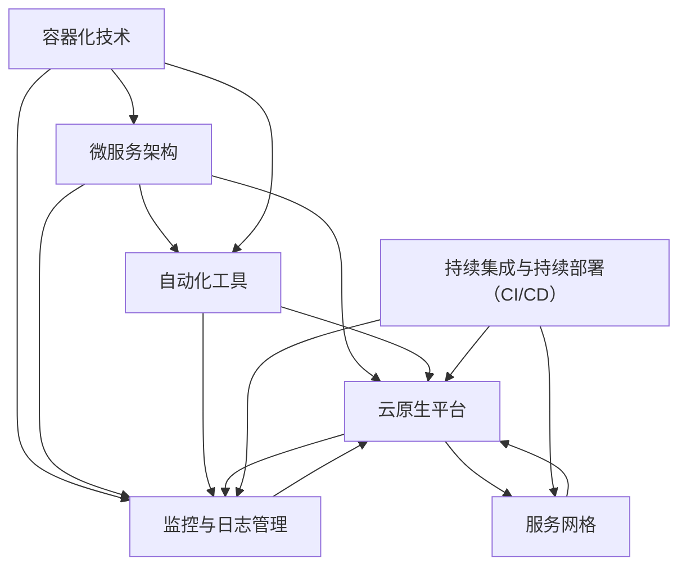
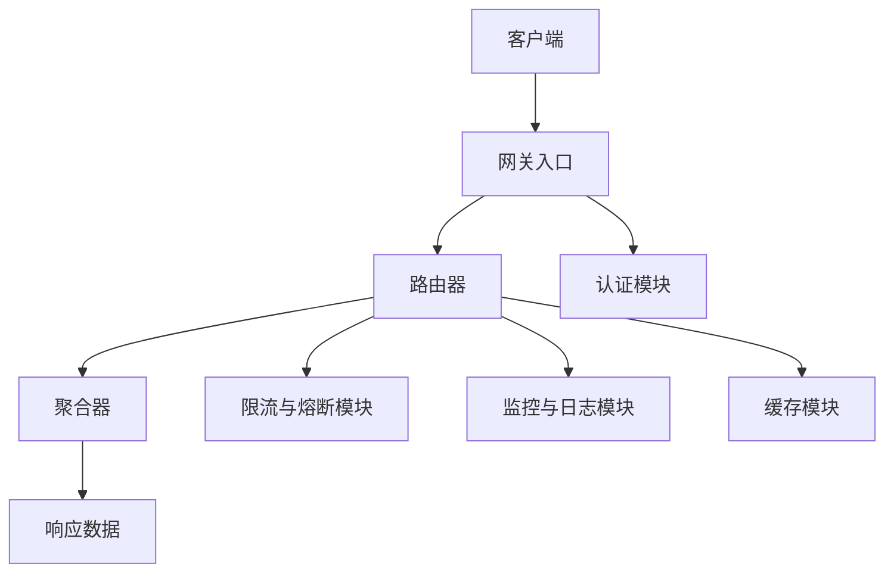

                 


### 引言与背景

随着云计算技术的飞速发展，企业的IT架构也在不断演变，从传统的单体应用逐渐转向分布式、容器化、微服务等现代化架构。在这种背景下，云原生（Cloud Native）架构应运而生，成为构建可扩展的云端应用的一种新型架构模式。本文将围绕《云原生架构设计：构建可扩展的云端应用》这一主题，逐步展开对云原生技术的探讨，旨在为读者提供一套系统、深入的云原生架构设计指南。

#### 什么是云原生？

云原生是一种利用云计算资源的方式，它通过一系列现代IT技术，如容器化、微服务、自动化等，使应用程序能够更好地在云环境中运行、扩展和管理。云原生架构具有以下核心特征：

1. **容器化**：应用程序被打包在容器中，保证了环境的隔离和一致性。
2. **微服务架构**：应用程序被拆分为多个小的、独立的微服务，每个服务负责完成特定的功能。
3. **自动化**：通过自动化工具和平台，实现应用程序的部署、扩展、监控等操作，提高了效率和可靠性。

#### 云原生与传统架构的对比

传统架构通常以单体应用为主，所有功能都集中在一个庞大的系统中，这种方式虽然在早期较为简单易用，但随着系统的复杂度和规模的增长，会面临诸多挑战，如维护成本高、扩展困难、部署复杂等。相比之下，云原生架构具有以下优势：

1. **可扩展性**：通过微服务架构，可以轻松实现水平扩展，提高系统的处理能力。
2. **高可用性**：服务之间相互独立，一个服务的故障不会影响整个系统的运行。
3. **敏捷性**：通过自动化工具，可以快速部署和迭代应用程序，加快开发速度。
4. **灵活性和兼容性**：云原生架构支持多种编程语言和框架，可以与现有的IT基础设施无缝集成。

### 云原生技术的起源与发展

云原生概念最早由Google提出，他们在2006年首次发布了Kubernetes的开源项目，用于容器编排和管理。随后，Docker等容器技术的兴起，进一步推动了云原生技术的发展。2015年，云原生计算基金会（CNCF）成立，致力于推动云原生生态系统的建设和推广。目前，云原生技术已经成为企业数字化转型的重要推动力，被广泛应用于金融、电商、互联网等行业。

### 云原生架构的适用范围

云原生架构不仅适用于大型企业，对于中小企业和初创公司来说，同样具有很大的吸引力。首先，云原生架构可以降低IT基础设施的投入成本，通过云计算服务提供商的资源，企业无需购买和维护昂贵的硬件设备。其次，云原生架构的高可扩展性和高可用性，可以帮助企业快速响应市场变化，提高业务竞争力。此外，云原生架构的微服务设计，可以促进团队间的协作和模块化开发，加速新功能的迭代。

总之，云原生架构是一种现代化的IT架构模式，它通过结合容器化、微服务、自动化等技术，为企业构建了一个灵活、可靠、高效的云端应用环境。接下来，本文将详细探讨云原生架构的设计原则、关键技术、实践应用等方面，帮助读者深入理解和掌握云原生架构的核心知识和实践方法。

---

**核心概念与联系**

在深入探讨云原生架构之前，有必要明确几个核心概念，并分析它们之间的联系和作用。以下是几个关键概念及其相互关系的架构图：



### **容器化技术（A）**

容器化技术是云原生架构的基石。它通过将应用程序及其依赖环境打包在一个轻量级、可移植的容器中，实现环境的一致性和隔离性。容器化技术使得应用程序可以在任何支持容器运行的环境中运行，无需担心环境差异带来的兼容性问题。Docker是当前最流行的容器化工具，它通过容器镜像（Container Image）和容器运行时（Container Runtime）实现了这一目标。

### **微服务架构（B）**

微服务架构是一种将大型单体应用拆分为多个独立、小型的服务单元的架构模式。每个微服务都负责完成特定的业务功能，并通过轻量级的通信协议（如HTTP/HTTPS、gRPC等）进行交互。微服务架构提高了系统的可维护性和可扩展性，使得各个服务可以独立部署、扩展和升级，降低了系统的复杂性。

### **自动化工具（C）**

自动化工具是云原生架构的重要组成部分。通过自动化工具，可以实现对应用程序的自动化部署、扩展、监控和运维。自动化工具不仅提高了开发效率，还保证了系统的稳定性和可靠性。常见的自动化工具包括Kubernetes、Ansible、Puppet等。

### **云原生平台（D）**

云原生平台是一个集成了容器化、微服务、自动化等技术的综合性平台，如Kubernetes、OpenShift等。云原生平台提供了一系列的API和服务，用于管理容器化应用的生命周期，包括部署、扩展、监控等。云原生平台不仅支持容器编排，还提供了服务发现、负载均衡、存储和网络等功能。

### **持续集成与持续部署（CI/CD）（E）**

持续集成与持续部署（CI/CD）是一种现代化的软件开发和部署方法。通过CI/CD，开发人员可以快速将代码集成到主分支，并通过自动化测试和部署流程，确保代码的质量和系统的稳定性。CI/CD工具如Jenkins、GitLab CI等，可以与云原生平台无缝集成，实现自动化部署和扩展。

### **服务网格（F）**

服务网格是一种用于管理服务间通信的网络层抽象。服务网格为微服务提供了一个统一的通信层，通过代理（如Istio、Linkerd等）来实现服务发现、负载均衡、安全控制等功能。服务网格可以提高服务间通信的可靠性和性能，同时简化了微服务的运维和管理。

### **监控与日志管理（G）**

监控与日志管理是确保系统稳定运行的重要环节。通过监控工具（如Prometheus、Grafana等）和日志管理工具（如ELK Stack、Loki等），可以实时监控系统的性能指标和日志数据，快速发现并解决系统故障。

通过上述核心概念的相互结合，云原生架构实现了一种灵活、可靠、高效的云计算环境。容器化技术提供了环境一致性，微服务架构提高了系统的可扩展性和可维护性，自动化工具实现了高效的开发和运维，云原生平台提供了集成的解决方案，CI/CD工具确保了代码的质量和系统的稳定性，服务网格和监控与日志管理保障了系统的可靠性和可观测性。

接下来，本文将逐步介绍云原生架构的各个组成部分，包括云原生基础设施、云原生安全性、云原生服务部署、云原生应用开发、云原生数据管理、云原生架构优化等，帮助读者深入了解云原生架构的设计原则和实践方法。

### 第一部分：引言与背景

#### 1.3 云原生与传统架构的对比

在深入探讨云原生架构之前，有必要先了解与传统架构之间的对比。传统架构通常以单体应用为主，而云原生架构则以微服务、容器化、自动化等为核心特征。以下从几个方面进行对比：

1. **部署方式**：
   - **传统架构**：传统单体应用通常将所有功能代码打包在一起，部署时需要部署整个应用程序。这种部署方式在开发和部署过程中较为简单，但无法实现快速迭代和灵活扩展。
   - **云原生架构**：云原生应用通过容器化技术将应用程序及其依赖打包成容器镜像，部署时仅需要部署容器镜像。这种方式可以实现零停机部署，同时支持灵活的扩容和缩容。

2. **可扩展性**：
   - **传统架构**：传统单体应用在扩展性方面存在很大挑战，通常需要通过垂直扩展（增加服务器硬件资源）来解决性能瓶颈。
   - **云原生架构**：云原生架构通过微服务架构实现水平扩展。每个微服务可以独立部署和扩展，从而实现大规模、高并发的应用场景。

3. **高可用性**：
   - **传统架构**：传统单体应用在出现故障时，可能需要整个系统停机维护。这会导致用户体验下降，影响业务运营。
   - **云原生架构**：云原生架构中的微服务之间相互独立，一个微服务的故障不会影响其他微服务的运行。通过自动化部署和监控，可以快速发现和解决故障，提高系统的可用性。

4. **敏捷性**：
   - **传统架构**：传统单体应用的迭代周期较长，开发人员需要花费大量时间进行系统重构和测试。
   - **云原生架构**：云原生架构支持快速迭代和持续集成/持续部署（CI/CD）。开发人员可以独立开发和部署微服务，从而加快开发速度和响应市场需求。

5. **灵活性和兼容性**：
   - **传统架构**：传统架构通常依赖于特定的开发环境和硬件设施，难以适应不同的开发和运行环境。
   - **云原生架构**：云原生架构通过容器化技术，使得应用程序可以在不同的环境下运行，提高了系统的兼容性和可移植性。

6. **安全性**：
   - **传统架构**：传统架构在安全性方面主要依赖于网络和操作系统层面的安全措施，如防火墙、入侵检测系统等。
   - **云原生架构**：云原生架构通过容器安全、服务网格、自动化安全检测等手段，提供了更全面的安全保障。例如，通过服务网格可以实现微服务之间的加密通信，通过自动化工具可以实时检测和应对潜在的安全威胁。

综上所述，云原生架构相比传统架构具有诸多优势，特别是在部署方式、可扩展性、高可用性、敏捷性、灵活性和安全性方面。然而，这并不意味着传统架构一无是处。在实际应用中，可以根据业务需求和场景选择合适的架构模式，以达到最佳效果。

接下来，本文将详细介绍云原生基础设施，包括容器技术（如Docker和Kubernetes）和微服务架构设计，帮助读者了解云原生架构的核心技术和实现方法。

#### 2.1 云原生基础设施

云原生基础设施是构建可扩展的云端应用的核心。它包括容器技术、微服务架构、服务发现与负载均衡等关键组件。本节将详细探讨这些技术及其应用。

##### **2.1.1 容器技术（Docker和Kubernetes）**

容器技术是云原生架构的基石。它通过将应用程序及其依赖打包在一个独立的容器中，实现了环境的一致性和可移植性。以下是两种主要的容器技术：

1. **Docker**

Docker是最流行的容器化平台，它通过容器镜像（Container Image）和容器运行时（Container Runtime）实现应用程序的打包和运行。以下是Docker的基本概念：

- **容器镜像（Container Image）**：容器镜像是一个静态的文件系统，包含了应用程序、库、环境变量等。它是一个打包好的“模板”，用于创建容器实例。
- **容器（Container）**：容器是基于容器镜像创建的运行实例，它运行在宿主机上，并与宿主机的操作系统隔离。容器可以运行在物理机、虚拟机或云服务器上。
- **Dockerfile**：Dockerfile是一个文本文件，用于定义如何构建容器镜像。通过编写Dockerfile，可以指定安装哪些软件、复制哪些文件等。

Docker的基本使用方法如下：

```bash
# 查找镜像
docker search <image-name>

# 拉取镜像
docker pull <image-name>

# 运行容器
docker run -d -p 8080:80 <image-name>

# 查看容器列表
docker ps

# 停止容器
docker stop <container-id>

# 删除容器
docker rm <container-id>
```

2. **Kubernetes**

Kubernetes（简称K8s）是一个开源的容器编排平台，它用于管理和自动化容器化应用程序的部署、扩展和运维。以下是Kubernetes的基本概念：

- **集群（Cluster）**：Kubernetes集群由多个节点组成，每个节点运行Kubernetes的组件，如kubelet、kube-apiserver、kube-controller-manager等。
- **Pod**：Pod是Kubernetes的基本调度单元，它包含一个或多个容器，这些容器共同运行在一个集群中。
- **部署（Deployment）**：Deployment用于管理Pod的创建和更新，确保Pod的数量满足预期。
- **服务（Service）**：Service用于将Pod暴露给外部网络，实现服务发现和负载均衡。
- **Ingress**：Ingress用于管理外部访问到集群内部服务的路由规则。

Kubernetes的基本使用方法如下：

```bash
# 创建集群
kubectl create cluster <cluster-name>

# 查看集群节点
kubectl get nodes

# 创建Pod
kubectl create pod <pod-name> --image=<image-name>

# 查看Pod状态
kubectl get pods

# 更新Deployment
kubectl set image deployment/<deployment-name> <container-name>=<image-name>

# 暴露服务
kubectl expose deployment/<deployment-name> --type=LoadBalancer

# 查看Service
kubectl get services
```

##### **2.1.2 微服务架构设计**

微服务架构是一种将大型单体应用拆分为多个独立、小型服务单元的架构模式。每个微服务都负责完成特定的业务功能，并通过轻量级的通信协议进行交互。以下是微服务架构的基本概念：

- **服务实例（Service Instance）**：每个微服务都可以有多个实例，这些实例可以独立部署和扩展。
- **服务注册与发现（Service Registration and Discovery）**：服务注册与发现用于管理微服务的实例列表，客户端可以通过服务注册中心获取微服务的实例信息。
- **服务间通信（Inter-service Communication）**：服务间通信通常采用RESTful API、gRPC、消息队列等协议，实现微服务之间的数据交换。
- **服务容错与降级（Service Fault Tolerance and Degradation）**：服务容错与降级用于处理服务之间的异常情况，如超时、失败等。
- **服务监控与日志（Service Monitoring and Logging）**：服务监控与日志用于实时监控微服务的运行状态，收集日志数据，以便快速发现和解决问题。

微服务架构的优点包括：

- **高可扩展性**：通过水平扩展单个服务实例，可以实现整个系统的弹性扩展。
- **高可用性**：服务之间相互独立，一个服务的故障不会影响其他服务的运行。
- **易于维护**：服务拆分为多个独立的小单元，便于管理和维护。
- **技术多样性**：每个服务可以使用不同的编程语言和技术栈，提高了系统的兼容性和灵活性。

##### **2.1.3 容器网络与存储方案**

容器网络和存储方案是云原生基础设施的重要组成部分。以下简要介绍：

1. **容器网络**

容器网络用于在容器之间进行通信，常见的容器网络方案包括：

- **桥接网络**：容器网络通过桥接设备（如bridge）连接，实现容器间的通信。
- **主机网络**：容器直接使用宿主机的网络接口，实现容器与宿主机之间的直接通信。
- **宿主机网络**：容器共享宿主机的网络接口，但具有独立的IP地址和端口。
- **overlay网络**：通过虚拟网络层（如Calico、Flannel等），实现跨宿主机的容器间通信。

2. **容器存储**

容器存储用于存储容器中的数据，常见的存储方案包括：

- **本地存储**：容器使用宿主机的本地磁盘作为存储设备，适用于简单的应用场景。
- **分布式存储**：通过分布式文件系统（如NFS、Ceph等）或云存储服务（如AWS S3、Google Cloud Storage等），实现容器的数据持久化和共享。
- **状态容器**：通过将容器中的数据存储在持久化存储设备上，确保容器重启后数据不会丢失。

综上所述，云原生基础设施通过容器技术、微服务架构、服务发现与负载均衡等关键组件，构建了一个灵活、可靠、高效的云端应用环境。接下来，本文将探讨云原生架构的安全性，包括云原生安全挑战与应对策略、访问控制与身份验证、安全容器与网络隔离等内容。

#### 3.1 云原生安全挑战与应对策略

在云原生环境中，安全是至关重要的一环。由于云原生架构具有高度分布式、动态性和自动化的特点，传统安全措施难以直接应用于云原生环境。以下将详细探讨云原生安全面临的主要挑战及相应的应对策略。

##### **3.1.1 主要安全挑战**

1. **容器逃逸**：容器逃逸是指攻击者通过恶意代码获取容器权限，进而获取宿主机权限。容器具有与宿主机隔离的特性，但如果容器中的恶意代码能够突破隔离，将可能导致严重的安全漏洞。
2. **容器镜像漏洞**：容器镜像中可能包含已知或未知的漏洞，攻击者可以利用这些漏洞进行攻击。由于容器镜像在多个环境中共享，这些漏洞的传播速度非常快。
3. **数据泄露**：在云原生环境中，数据可能存储在分布式存储系统中，攻击者通过窃取数据或篡改数据，可能导致严重的数据泄露问题。
4. **服务间通信不安全**：在微服务架构中，服务间通信通常采用HTTP/HTTPS、gRPC等协议。如果服务间通信未采用加密措施，攻击者可以窃听或篡改数据。
5. **权限管理不严格**：在云原生环境中，权限管理涉及容器、服务、用户等多个层面。如果权限管理不严格，可能导致未经授权的访问或操作。
6. **自动化工具的安全问题**：云原生环境中的自动化工具（如Kubernetes、Docker等）本身可能存在安全漏洞。如果这些工具被攻击，攻击者可以控制整个云原生环境。

##### **3.1.2 应对策略**

1. **容器安全基线**：制定容器安全基线，确保容器镜像符合安全标准。基线包括容器镜像的扫描、签名、最小权限等要求。常见工具包括Clair、Docker Bench for Security等。
2. **容器隔离与权限控制**：采用命名空间（Namespace）和用户命名空间（User Namespace）实现容器隔离。通过cgroup和capabilities机制，限制容器的权限。此外，可以使用安全容器（如AppArmor、SELinux等）增强容器安全性。
3. **容器镜像签名与验证**：为容器镜像添加数字签名，确保镜像未被篡改。在部署容器时，对镜像进行验证，确保其签名有效。可以使用Docker Content Trust、Notary等工具实现镜像签名与验证。
4. **服务间加密通信**：采用TLS/SSL等加密协议，确保服务间通信的安全性。可以使用Istio、Consul等服务网格工具实现加密通信。
5. **访问控制与身份验证**：采用OAuth 2.0、OIDC等身份验证和授权机制，确保用户和服务具有适当的权限。Kubernetes中的RBAC（Role-Based Access Control）可以用于实现细粒度的权限控制。
6. **持续安全监测与审计**：采用安全监测工具（如BlackDog、Palo Alto Networks等）对容器和云原生环境进行实时监测。定期进行安全审计，发现潜在的安全隐患。
7. **自动化工具安全**：确保自动化工具（如Kubernetes、Docker等）的安全性。定期更新工具的版本，修复已知漏洞。对自动化工具的配置进行审查，确保其符合安全要求。
8. **安全培训与意识**：对开发人员、运维人员等云原生环境的相关人员进行安全培训，提高他们的安全意识。定期进行安全演练，提高应对安全事件的能力。

通过上述策略，可以有效应对云原生环境中的安全挑战，确保云原生架构的安全性。接下来，本文将探讨云原生环境中的访问控制与身份验证机制，以及如何实现安全容器与网络隔离。

#### 3.2 访问控制与身份验证

在云原生环境中，访问控制和身份验证是确保安全和数据隐私的关键机制。有效的访问控制与身份验证策略可以防止未经授权的访问和操作，保障系统的安全性和数据的完整性。以下将详细探讨云原生环境中的访问控制与身份验证机制。

##### **3.2.1 Kubernetes RBAC**

Kubernetes（K8s）提供了基于角色的访问控制（RBAC）机制，用于管理集群中各个对象的访问权限。RBAC的核心概念包括：

1. **角色（Role）**：角色定义了一组权限，可以将其分配给用户或组。Kubernetes内置了多个预定义的角色，如`admin`、`editor`、`viewer`等。
2. **角色绑定（RoleBinding）**：角色绑定将角色与用户或组关联起来，确定哪些用户或组可以执行哪些操作。
3. **集群角色绑定（ClusterRoleBinding）**：集群角色绑定应用于整个集群，而不是单个命名空间。它将集群角色与用户或组关联起来。
4. **命名空间角色绑定（NamespaceRoleBinding）**：命名空间角色绑定应用于特定的命名空间，将命名空间角色与用户或组关联起来。

以下是一个简单的Kubernetes RBAC示例：

```yaml
apiVersion: rbac.authorization.k8s.io/v1
kind: Role
metadata:
  name: editor
rules:
- apiGroups: [""]
  resources: ["pods"]
  verbs: ["get", "watch", "list"]

---
apiVersion: rbac.authorization.k8s.io/v1
kind: RoleBinding
metadata:
  name: editor-binding
subjects:
- kind: User
  name: alice
  apiGroup: rbac.authorization.k8s.io
roleRef:
  kind: Role
  name: editor
  apiGroup: rbac.authorization.k8s.io
```

此示例创建了一个名为`editor`的角色，它允许用户`alice`获取、监听和列出命名空间`default`中的Pod。通过创建相应的角色绑定，可以将角色分配给用户。

##### **3.2.2 OpenID Connect（OIDC）**

OpenID Connect（OIDC）是一种基于OAuth 2.0的认证协议，它提供了一种安全的认证方式，允许用户使用第三方服务（如Google、Facebook等）进行身份验证。OIDC在云原生环境中用于实现单点登录（SSO）和跨域身份验证。

1. **认证（Authentication）**：认证是指验证用户身份的过程。在OIDC中，用户通过第三方身份提供商（IDP）进行身份验证，IDP返回一个身份验证令牌（如ID Token）。
2. **授权（Authorization）**：授权是指确定用户可以访问哪些资源的权限。在OIDC中，用户通过授权码（Authorization Code）交换身份验证令牌和访问令牌（Access Token）。

以下是一个简单的OIDC认证流程：

1. 用户访问云原生应用，并请求认证。
2. 应用程序将用户重定向到IDP的认证页面。
3. 用户在IDP上进行身份验证，并同意授权应用程序访问其账户。
4. IDP返回身份验证令牌和授权码。
5. 应用程序使用授权码从IDP获取身份验证令牌和访问令牌。
6. 应用程序使用访问令牌获取用户信息，并完成认证过程。

##### **3.2.3 安全容器与网络隔离**

1. **安全容器**：安全容器是一种增强了容器安全性的机制，通过限制容器的权限和资源访问，确保容器在运行时不会对宿主机或其他容器造成威胁。常用的安全容器工具包括AppArmor、SELinux等。
2. **网络隔离**：网络隔离是指通过限制容器之间的网络通信，确保容器无法访问其他容器的网络接口或资源。常用的网络隔离工具包括Calico、Flannel等。

以下是一个简单的安全容器和网络隔离示例：

```yaml
# SecurityContext 配置用于限制容器的权限和资源访问
apiVersion: v1
kind: Pod
metadata:
  name: secure-pod
spec:
  containers:
  - name: secure-container
    image: secure-container:latest
    securityContext:
      privileged: true
      runAsUser: 1000
      runAsGroup: 1000
      capabilities:
        drop:
        - NET_RAW
        - ALL
    networks:
    - name: isolated-network
      networkMode: host
```

此示例中，`securityContext`配置用于限制容器的权限和资源访问。`networkMode: host`确保容器使用宿主机的网络接口，从而实现网络隔离。

通过结合Kubernetes RBAC、OIDC认证、安全容器和网络隔离等技术，云原生环境可以实现细粒度的访问控制和身份验证，保障系统的安全性。

接下来，本文将探讨云原生服务部署，包括Kubernetes集群搭建与配置、服务发现与负载均衡、容器编排与资源管理等内容。

### 4.1 Kubernetes集群搭建与配置

搭建一个Kubernetes集群是云原生服务部署的第一步。Kubernetes集群由多个节点组成，包括主节点（Master）和工作节点（Worker）。以下将详细探讨Kubernetes集群的搭建与配置过程。

##### **4.1.1 单节点集群搭建**

单节点集群是一种简单的Kubernetes集群搭建方式，适用于测试和开发环境。在单节点集群中，Kubernetes的所有组件都运行在同一台物理机或虚拟机上。以下是一个基于Docker的简单单节点集群搭建步骤：

1. **安装Docker**：确保操作系统已安装Docker。对于Ubuntu系统，可以使用以下命令安装Docker：

   ```bash
   sudo apt-get update
   sudo apt-get install docker.io
   sudo systemctl start docker
   sudo systemctl enable docker
   ```

2. **安装Kubeadm、Kubelet和Kubectl**：Kubeadm、Kubelet和Kubectl是Kubernetes集群的基本工具。使用以下命令安装：

   ```bash
   sudo apt-get update
   sudo apt-get install kubelet kubeadm
   sudo systemctl start kubelet
   sudo systemctl enable kubelet
   ```

3. **初始化集群**：使用kubeadm初始化集群。以下命令将在当前节点上启动Kubernetes集群：

   ```bash
   sudo kubeadm init --pod-network-cidr=10.244.0.0/16
   ```

   初始化完成后，记录下命令行中输出的`kubeadm join`命令，用于后续节点加入集群。

4. **配置kubectl**：配置kubectl工具，使其可以与集群通信。将以下命令添加到`~/.bashrc`文件中：

   ```bash
   export KUBECONFIG=/etc/kubernetes/admin.conf
   ```

   然后执行`source ~/.bashrc`使配置生效。

5. **安装Pod网络**：安装一个Pod网络插件，如Calico。执行以下命令：

   ```bash
   kubectl apply -f https://docs.projectcalico.org/manifests/calico.yaml
   ```

##### **4.1.2 多节点集群搭建**

多节点集群适用于生产环境，具有更高的可用性和扩展性。以下是一个基于kubeadm的多节点集群搭建步骤：

1. **配置主机**：确保所有节点的主机名、IP地址和hosts文件配置正确。将所有节点的IP地址添加到hosts文件，例如：

   ```bash
   10.0.0.1 master-node
   10.0.0.2 worker-node1
   10.0.0.3 worker-node2
   ```

2. **初始化主节点**：在主节点上执行以下命令初始化集群：

   ```bash
   sudo kubeadm init --pod-network-cidr=10.244.0.0/16
   ```

   初始化完成后，记录下命令行中输出的`kubeadm join`命令。

3. **加入工作节点**：在每个工作节点上执行以下命令加入集群：

   ```bash
   sudo kubeadm join <master-node-ip>:6443 --token <token> --discovery-token-ca-cert-hash sha256:<hash>
   ```

   其中，`<master-node-ip>`为主节点的IP地址，`<token>`和`<hash>`分别为初始化集群时生成的token和CA证书哈希值。

4. **配置kubectl**：配置kubectl工具，使其可以与集群通信。将以下命令添加到`~/.bashrc`文件中：

   ```bash
   export KUBECONFIG=/etc/kubernetes/admin.conf
   ```

   然后执行`source ~/.bashrc`使配置生效。

5. **安装Pod网络**：在所有节点上安装一个Pod网络插件，如Calico。执行以下命令：

   ```bash
   kubectl apply -f https://docs.projectcalico.org/manifests/calico.yaml
   ```

##### **4.1.3 Kubernetes集群配置**

1. **查看集群状态**：使用以下命令查看集群状态：

   ```bash
   kubectl get nodes
   kubectl get pods --all-namespaces
   ```

2. **配置Kubernetes dashboard**：Kubernetes dashboard是一个Web界面，用于管理和监控集群。使用以下命令安装Kubernetes dashboard：

   ```bash
   kubectl apply -f https://raw.githubusercontent.com/kubernetes/dashboard/v2.5.0/aio/deploy/recommended.yaml
   ```

   安装完成后，使用以下命令获取Kubernetes dashboard的访问令牌：

   ```bash
   kubectl create serviceaccount dashboard-admin -n kube-system
   kubectl create clusterrolebinding dashboard-admin --clusterrole=cluster-admin --serviceaccount=kube-system:dashboard-admin
   kubectl get secret $(kubectl get serviceaccount dashboard-admin -n kube-system -o jsonpath="{.secrets[0].name}") -o jsonpath="{.data.token}" | base64 --decode
   ```

   将生成的访问令牌复制到浏览器中，访问`https://<master-node-ip>:30000`，即可进入Kubernetes dashboard。

3. **配置集群角色和权限**：根据实际需求，可以配置集群角色和权限，以限制用户对集群的操作。使用以下命令创建一个自定义角色绑定：

   ```bash
   kubectl create role <role-name> --verb=<verb> --resource=<resource>
   kubectl create rolebinding <role-binding-name> --role=<role-name> --user=<username>
   ```

通过以上步骤，可以搭建并配置一个Kubernetes集群，为后续的云原生服务部署奠定基础。接下来，本文将探讨服务发现与负载均衡、容器编排与资源管理等内容。

### 4.2 服务发现与负载均衡

在云原生架构中，服务发现和负载均衡是确保应用高可用性和可扩展性的关键组件。服务发现是指自动发现和配置集群中的服务实例，使其他服务可以轻松访问这些实例。负载均衡则用于将网络流量均匀分布到多个服务实例，提高系统的处理能力和容错能力。

#### **4.2.1 服务发现**

服务发现可以通过Kubernetes内置的服务发现机制实现。Kubernetes提供了几种服务发现方式：

1. **DNS服务发现**：Kubernetes集群中的Pod可以通过DNS服务发现其他服务。每个服务都会被分配一个唯一的DNS名称，格式为`<service-name>.<namespace>.svc.cluster.local`。例如，一个名为`my-service`的服务在默认命名空间中，其DNS名称为`my-service.default.svc.cluster.local`。

2. **环境变量**：Kubernetes可以将服务名称和端口号作为环境变量注入到Pod中，使Pod可以轻松访问其他服务。

3. **ConfigMap和Secret**：Kubernetes中的ConfigMap和Secret可以存储服务配置信息，如服务名称、端口号等，通过这些配置信息实现服务发现。

以下是一个简单的服务发现示例：

```yaml
apiVersion: v1
kind: Service
metadata:
  name: my-service
spec:
  selector:
    app: my-app
  ports:
    - protocol: TCP
      port: 80
      targetPort: 8080
  type: ClusterIP
```

此示例创建了一个名为`my-service`的ClusterIP类型服务，它将访问端口为8080的Pod。

#### **4.2.2 负载均衡**

Kubernetes提供了内置的负载均衡器，用于将网络流量均匀分配到多个服务实例。负载均衡器可以通过以下类型实现：

1. **NodePort**：NodePort类型的服务将流量分发到集群中的所有节点，通过节点的端口进行访问。NodePort类型的服务在宿主机的每个节点上监听一个端口，通常范围从30000到32767。

2. **LoadBalancer**：LoadBalancer类型的服务将流量分发到外部负载均衡器（如云服务提供商提供的负载均衡器）。外部负载均衡器将流量转发到集群中的服务实例。

3. **Ingress**：Ingress是一种基于HTTP的负载均衡器，它通过配置路由规则，将外部流量转发到集群中的服务。Ingress控制器（如NGINX Ingress Controller）用于处理Ingress规则。

以下是一个简单的NodePort类型负载均衡示例：

```yaml
apiVersion: v1
kind: Service
metadata:
  name: my-service
spec:
  type: NodePort
  selector:
    app: my-app
  ports:
    - protocol: TCP
      port: 80
      targetPort: 8080
      nodePort: 30000
```

此示例创建了一个名为`my-service`的NodePort类型服务，它将在宿主机的端口30000上监听流量，并将其转发到端口8080的Pod。

#### **4.2.3 实践示例**

以下是一个综合服务发现和负载均衡的实践示例：

1. **部署应用程序**：部署一个简单的Nginx应用程序，将其暴露给外部访问。

   ```bash
   kubectl create deployment my-app --image=nginx:latest
   kubectl expose deployment my-app --type=NodePort --port=80
   ```

2. **查看服务**：查看生成的服务，确认其类型和端口。

   ```bash
   kubectl get services
   ```

   输出可能如下：

   ```plaintext
   NAME         TYPE       CLUSTER-IP     EXTERNAL-IP   PORT(S)          AGE
   kubernetes   ClusterIP   10.96.0.1      <none>        6443/TCP         9d
   my-service   NodePort   10.99.244.240   <none>        80:30000/TCP      4m12s
   ```

3. **访问应用程序**：通过NodePort访问应用程序。

   ```bash
   curl <node-ip>:30000
   ```

   其中`<node-ip>`为宿主机的IP地址。

通过以上步骤，可以轻松实现服务发现和负载均衡，使应用程序在云原生环境中能够高效、可靠地运行。

接下来，本文将探讨云原生应用开发，包括微服务设计与实现、API网关与服务集成、持续集成与持续部署（CI/CD）等内容。

### 5.1 微服务设计与实现

微服务架构是一种将大型单体应用拆分为多个独立、小型服务单元的架构模式。每个微服务都负责完成特定的业务功能，并通过轻量级的通信协议进行交互。以下将详细介绍微服务设计与实现的核心概念、设计原则和实践步骤。

#### **5.1.1 微服务核心概念**

1. **服务实例**：服务实例是指运行在容器中的微服务副本。一个服务可以有多个实例，用于实现负载均衡和高可用性。
2. **服务注册与发现**：服务注册与发现是指服务实例在启动时将自己注册到服务注册中心，其他服务实例可以通过服务注册中心获取服务实例的地址和端口。
3. **服务间通信**：服务间通信是指微服务之间通过HTTP/HTTPS、gRPC、消息队列等协议进行数据交换。通常，服务间通信应采用异步方式，以提高系统的可扩展性和稳定性。
4. **配置管理**：配置管理是指为微服务提供动态配置，使其能够根据环境变化进行配置更新。配置管理可以通过配置中心实现，如Spring Cloud Config、Apollo等。
5. **服务路由**：服务路由是指将外部请求路由到对应的服务实例。服务路由可以通过API网关实现，如Kong、Spring Cloud Gateway等。

#### **5.1.2 微服务设计原则**

1. **独立性**：每个微服务都应该独立开发、部署和扩展，避免服务之间的依赖关系。独立性提高了系统的可维护性和可扩展性。
2. **可复用性**：微服务应该设计为可复用的组件，实现业务功能的模块化。可复用性提高了开发效率，降低了系统的复杂性。
3. **灵活性**：微服务应具有灵活的部署方式，支持水平扩展和垂直扩展。灵活性提高了系统的性能和稳定性。
4. **高可用性**：微服务应具备自动恢复机制，能够在服务实例故障时自动替换。高可用性确保了系统的稳定运行。
5. **安全性**：微服务应采用安全通信协议，如TLS/SSL，确保服务间数据传输的安全性。安全性提高了系统的安全性。
6. **可观测性**：微服务应具备完善的监控和日志记录机制，实时监控服务的运行状态和性能。可观测性有助于快速发现和解决问题。

#### **5.1.3 微服务实现步骤**

1. **需求分析与设计**：根据业务需求，分析服务拆分点，设计微服务架构。确定每个微服务的职责和边界，确保服务之间的松耦合。
2. **定义API接口**：为每个微服务定义RESTful API接口，明确接口的请求参数、返回结果和错误处理。接口定义应遵循RESTful设计原则，确保易用性和一致性。
3. **实现微服务**：采用合适的编程语言和框架实现微服务。常用的微服务框架包括Spring Boot、Node.js、Django等。在实现过程中，遵循微服务设计原则，确保服务的独立性、灵活性、可扩展性和安全性。
4. **服务注册与发现**：实现服务注册与发现机制，使微服务实例在启动时自动注册到服务注册中心。其他微服务可以通过服务注册中心获取服务实例的地址和端口，实现服务间通信。
5. **配置管理**：实现配置管理机制，将微服务的配置信息存储在配置中心。微服务实例在启动时从配置中心获取配置信息，实现动态配置更新。
6. **服务路由**：实现服务路由机制，将外部请求路由到对应的微服务实例。可以使用API网关或自定义路由规则实现服务路由。
7. **测试与部署**：对微服务进行功能测试和性能测试，确保其正常运行。将微服务打包为容器镜像，并部署到容器编排平台，如Kubernetes。通过容器编排平台实现微服务的自动化部署、扩缩容和监控。

#### **5.1.4 实践示例**

以下是一个简单的微服务实现示例：

1. **创建服务模块**：创建一个订单服务（Order Service）和一个商品服务（Product Service）。订单服务负责处理订单相关操作，商品服务负责处理商品信息。

2. **定义API接口**：为订单服务和商品服务定义RESTful API接口。例如，订单服务提供创建订单、查询订单等功能，商品服务提供查询商品信息等功能。

3. **实现服务**：使用Spring Boot实现订单服务和商品服务。以下是一个简单的订单服务示例：

   ```java
   @RestController
   @RequestMapping("/orders")
   public class OrderController {
   
       @Autowired
       private OrderService orderService;
   
       @PostMapping
       public ResponseEntity<Order> createOrder(@RequestBody OrderRequest orderRequest) {
           Order order = orderService.createOrder(orderRequest);
           return new ResponseEntity<>(order, HttpStatus.CREATED);
       }
   
       @GetMapping("/{orderId}")
       public ResponseEntity<Order> getOrder(@PathVariable Long orderId) {
           Order order = orderService.getOrder(orderId);
           return new ResponseEntity<>(order, HttpStatus.OK);
       }
   }
   ```

4. **服务注册与发现**：使用Eureka实现服务注册与发现。在订单服务和商品服务的启动类中，添加Eureka的配置，使服务实例在启动时自动注册到Eureka服务注册中心。

5. **配置管理**：使用Spring Cloud Config实现配置管理。将订单服务和商品服务的配置信息存储在配置中心，服务实例在启动时从配置中心获取配置信息。

6. **服务路由**：使用Spring Cloud Gateway实现服务路由。通过配置路由规则，将外部请求路由到对应的订单服务和商品服务。

7. **测试与部署**：对订单服务和商品服务进行功能测试和性能测试，确保其正常运行。将订单服务和商品服务打包为Docker镜像，并部署到Kubernetes集群。

通过以上步骤，可以构建一个简单的微服务架构，实现订单和商品功能的独立开发和部署。接下来，本文将探讨API网关与服务集成、持续集成与持续部署（CI/CD）等内容。

### 5.2 API网关与服务集成

在微服务架构中，API网关是一个重要的组件，它作为外部客户端与服务实例之间的统一接口，提供了路由、聚合、认证、监控等功能。通过API网关，可以简化客户端与服务之间的通信，提高系统的稳定性和可维护性。以下将详细介绍API网关的概念、架构和实现方法。

#### **5.2.1 API网关概念**

API网关是一种服务端组件，负责处理外部客户端的请求，并将其转发到相应的服务实例。API网关通常具备以下功能：

1. **路由**：根据请求的URL或请求头信息，将请求路由到对应的服务实例。
2. **聚合**：将多个服务实例的响应数据聚合为一个完整的响应，提高系统的响应效率和用户体验。
3. **认证与授权**：对请求进行身份验证和授权，确保只有合法用户可以访问受保护的服务。
4. **限流与熔断**：根据业务需求，对请求进行限流和熔断，防止服务实例过载和系统崩溃。
5. **监控与日志**：收集和监控服务实例的运行状态和性能指标，提供日志记录和报警功能。
6. **缓存**：缓存服务实例的响应数据，提高系统的响应速度和降低网络流量。

#### **5.2.2 API网关架构**

API网关的架构通常包括以下几个主要部分：

1. **网关入口**：网关入口是客户端请求的入口点，负责处理请求的转发和负载均衡。
2. **路由器**：路由器根据请求的URL或请求头信息，将请求路由到对应的服务实例。
3. **认证模块**：认证模块对请求进行身份验证和授权，确保只有合法用户可以访问受保护的服务。
4. **聚合器**：聚合器将多个服务实例的响应数据聚合为一个完整的响应，提高系统的响应效率和用户体验。
5. **限流与熔断模块**：限流与熔断模块根据业务需求，对请求进行限流和熔断，防止服务实例过载和系统崩溃。
6. **监控与日志模块**：监控与日志模块收集和监控服务实例的运行状态和性能指标，提供日志记录和报警功能。
7. **缓存模块**：缓存模块缓存服务实例的响应数据，提高系统的响应速度和降低网络流量。

以下是一个简单的API网关架构图：



#### **5.2.3 API网关实现方法**

以下将介绍使用Spring Cloud Gateway实现API网关的方法：

1. **引入依赖**：在项目中引入Spring Cloud Gateway依赖。

   ```xml
   <dependency>
       <groupId>org.springframework.cloud</groupId>
       <artifactId>spring-cloud-starter-gateway</artifactId>
   </dependency>
   ```

2. **配置路由规则**：在application.yml或application.properties文件中配置路由规则。

   ```yaml
   spring:
     cloud:
       gateway:
         routes:
           - id: order-route
             uri: lb://order-service
             predicates:
               - Path=/orders/**
             filters:
               - StripPrefix=1
           - id: product-route
             uri: lb://product-service
             predicates:
               - Path=/products/**
             filters:
               - StripPrefix=1
   ```

   在上述示例中，配置了两个路由规则，分别为订单服务和商品服务。`Path`指定了请求的URL匹配规则，`StripPrefix`用于去除请求URL中的前缀。

3. **自定义过滤器**：自定义过滤器实现认证、限流、日志记录等功能。

   ```java
   @Component
   public class CustomGatewayFilterFactory implements GatewayFilterFactory {
   
       @Override
       public GatewayFilter create(Object... args) {
           return (exchange, chain) -> {
               // 认证逻辑
               if (!exchange.getRequest().headers().containsKey("Authorization")) {
                   return exchange.getResponse().setStatusCode(HttpStatus.UNAUTHORIZED);
               }
               // 限流逻辑
               if (isRequestLimited()) {
                   return exchange.getResponse().setStatusCode(HttpStatus.TOO_MANY_REQUESTS);
               }
               // 日志记录
               logRequest(exchange);
               return chain.filter(exchange);
           };
       }
   
       private boolean isRequestLimited() {
           // 实现限流逻辑
           return false;
       }
   
       private void logRequest(ServerHttpRequest request) {
           // 实现日志记录逻辑
       }
   }
   ```

   在application.yml或application.properties文件中配置自定义过滤器。

   ```yaml
   spring:
     cloud:
       gateway:
         routes:
           - id: order-route
             uri: lb://order-service
             predicates:
               - Path=/orders/**
             filters:
               - CustomFilter
   ```

4. **集成服务实例**：将订单服务和商品服务集成到API网关中。

   ```java
   @Bean
   @ConfigurationProperties(prefix = "spring.cloud.nacos")
   public NacosDiscoveryClient nacosDiscoveryClient() {
       return new NacosDiscoveryClient();
   }
   
   @Bean
   @LoadBalanced
   public RestTemplate restTemplate() {
       return new RestTemplate();
   }
   ```

   在application.yml或application.properties文件中配置Nacos服务注册中心。

   ```yaml
   spring:
     cloud:
       nacos:
         server-addr: 127.0.0.1:8848
   ```

通过以上步骤，可以搭建一个简单的API网关，实现路由、认证、限流、日志记录等功能。接下来，本文将探讨持续集成与持续部署（CI/CD）的概念和实现方法。

### 5.3 持续集成与持续部署（CI/CD）

持续集成（Continuous Integration，CI）和持续部署（Continuous Deployment，CD）是现代软件开发中的重要实践，它们通过自动化流程，提高软件开发的效率和质量。持续集成确保开发人员的代码合并到主分支时不会产生冲突，持续部署则确保代码的质量和系统的稳定性。以下将详细介绍CI/CD的概念、工作流程和实现方法。

#### **5.3.1 持续集成（CI）**

持续集成是一种软件开发方法，通过自动化构建和测试，确保代码的持续集成。CI的主要目标是尽早发现问题，减少集成成本，提高开发效率。

1. **核心原则**：
   - **频繁集成**：开发人员频繁将代码合并到主分支，确保代码质量。
   - **自动化测试**：每次代码提交后，自动执行测试，确保代码符合预期。
   - **快速反馈**：测试结果及时反馈给开发者，快速修复问题。

2. **工作流程**：
   - **代码提交**：开发者将代码提交到版本控制系统中。
   - **构建**：构建系统自动编译代码，生成可执行的二进制文件。
   - **测试**：测试系统自动执行单元测试、集成测试等，确保代码质量。
   - **反馈**：测试结果反馈给开发者，包括通过或失败的信息。

3. **常见工具**：
   - **Jenkins**：一款开源的持续集成工具，支持多种插件，易于扩展。
   - **GitLab CI**：GitLab自带的持续集成工具，集成版本控制系统，方便使用。
   - **Travis CI**：一款基于云的持续集成服务，支持多种编程语言和平台。

#### **5.3.2 持续部署（CD）**

持续部署是一种自动化部署方法，通过自动化流程，确保代码从开发环境到生产环境的顺利迁移。CD的主要目标是减少部署风险，提高系统的稳定性。

1. **核心原则**：
   - **自动化部署**：通过脚本或工具自动执行部署流程，减少人工干预。
   - **多环境部署**：部署到不同的环境（如开发、测试、生产等），确保代码在不同环境中的运行一致性。
   - **快速回滚**：在部署失败时，快速回滚到上一个稳定版本，确保系统的稳定性。

2. **工作流程**：
   - **构建**：持续集成过程中，生成可执行的二进制文件。
   - **测试**：在构建过程中，执行自动化测试，确保代码质量。
   - **部署**：将构建好的二进制文件部署到目标环境。
   - **监控**：部署完成后，监控系统的运行状态，确保系统稳定运行。

3. **常见工具**：
   - **Jenkins**：支持自动化部署，可以通过插件与CI工具集成。
   - **Ansible**：一款开源的自动化部署工具，适用于大规模部署。
   - **Kubernetes**：支持自动化部署和扩缩容，是云原生应用的最佳实践。

#### **5.3.3 实现方法**

以下以Jenkins为例，介绍CI/CD的实现方法：

1. **安装Jenkins**：在服务器上安装Jenkins，可以使用Docker、包管理器等方式安装。

2. **配置Jenkins**：启动Jenkins后，配置Jenkins插件，如Git、Maven、JUnit等。

3. **创建流水线**：在Jenkins中创建一个新流水线，配置以下步骤：
   - **源代码管理**：配置Git仓库地址和分支，Jenkins从Git仓库中获取代码。
   - **构建步骤**：
     - **检查代码**：执行Git Hooks，确保代码符合规范。
     - **编译**：使用Maven编译代码，生成可执行的二进制文件。
     - **测试**：执行单元测试和集成测试，确保代码质量。
     - **部署**：使用Shell脚本或Ansible部署代码到目标环境。
   - **发布步骤**：配置Jenkins在构建成功后，将结果发布到相关的平台，如GitHub、GitLab等。

4. **自动化部署**：配置Jenkins在构建成功后，自动执行部署脚本，将代码部署到目标环境。

5. **监控**：使用Jenkins插件（如Prometheus、Grafana等）监控部署后的系统运行状态，确保系统稳定运行。

通过以上步骤，可以实现CI/CD的自动化流程，提高软件开发和部署的效率。接下来，本文将探讨云原生数据管理，包括分布式数据库与存储方案、数据流处理与大数据架构、云原生数据安全与合规性等内容。

### 6.1 分布式数据库与存储方案

在云原生架构中，分布式数据库和存储方案是实现高可用性、高可扩展性和高性能的关键组件。分布式数据库和存储系统通过将数据分散存储在多个节点上，提高了系统的容错能力和并发处理能力。以下将详细介绍分布式数据库和存储方案的选择原则、常见方案及其优缺点。

#### **6.1.1 选择原则**

1. **数据一致性**：分布式数据库需要保证数据一致性，以防止数据丢失或重复。常用的数据一致性模型包括强一致性、最终一致性等。

2. **高可用性**：分布式数据库应具备自动故障转移和恢复机制，确保系统的高可用性。

3. **高可扩展性**：分布式数据库应支持水平扩展，可以轻松增加或减少存储节点，以满足业务增长的需求。

4. **性能优化**：分布式数据库需要具备高性能读写能力，以满足大规模数据的处理需求。

5. **数据安全与合规性**：分布式数据库应具备数据加密、访问控制等功能，确保数据安全与合规性。

6. **易用性和维护性**：分布式数据库应具备良好的易用性和维护性，方便开发和运维人员管理和维护。

#### **6.1.2 常见分布式数据库与存储方案**

1. **关系型数据库（如MySQL、PostgreSQL）**

   关系型数据库在传统架构中得到了广泛应用，它们在分布式数据库领域也具备一定的优势。以下是几种常见的关系型数据库：

   - **MySQL Cluster**：MySQL Cluster是一个分布式关系型数据库，支持自动故障转移和负载均衡。
   - **Cassandra**：Cassandra是一个分布式NoSQL数据库，支持线性扩展和高可用性。

   **优点**：关系型数据库在查询性能和事务处理方面具有优势，易于理解和维护。

   **缺点**：扩展性有限，不易于实现分布式事务。

2. **NoSQL数据库（如MongoDB、Redis）**

   NoSQL数据库在处理大规模数据和高并发场景中具有优势，以下是几种常见的NoSQL数据库：

   - **MongoDB**：MongoDB是一个分布式文档数据库，支持水平扩展和高可用性。
   - **Redis**：Redis是一个分布式内存数据库，支持快速读写和持久化存储。

   **优点**：NoSQL数据库在数据存储和查询方面具有灵活性，易于扩展。

   **缺点**：查询性能和事务处理能力相对较弱。

3. **分布式文件存储系统（如HDFS、Ceph）**

   分布式文件存储系统用于存储大规模数据，适用于大数据场景。以下是几种常见的分布式文件存储系统：

   - **HDFS**：HDFS是一个分布式文件系统，用于存储大数据集。
   - **Ceph**：Ceph是一个分布式存储系统，支持对象存储和块存储。

   **优点**：分布式文件存储系统具有高可用性和高扩展性。

   **缺点**：读写性能相对较低，不适合实时数据处理。

4. **分布式键值存储（如Consul、etcd）**

   分布式键值存储用于存储配置信息、元数据和日志，支持高可用性和强一致性。以下是几种常见的分布式键值存储：

   - **Consul**：Consul是一个分布式服务发现和配置中心，支持键值存储。
   - **etcd**：etcd是一个分布式键值存储，用于存储应用程序的配置信息和元数据。

   **优点**：分布式键值存储具有高可用性和强一致性。

   **缺点**：数据存储容量有限，不适合大规模数据存储。

#### **6.1.3 实践示例**

以下是一个简单的分布式数据库（MongoDB）与存储系统（Ceph）的实践示例：

1. **安装MongoDB**：

   在服务器上安装MongoDB，配置MongoDB集群，实现高可用性和负载均衡。

2. **配置Ceph存储**：

   在服务器上安装Ceph存储系统，配置Ceph集群，实现分布式存储。

3. **集成MongoDB和Ceph**：

   在应用程序中集成MongoDB和Ceph，实现数据存储和备份。

4. **实现数据一致性**：

   使用MongoDB的复制集和分片集，实现数据一致性和高可用性。

5. **监控和管理**：

   使用MongoDB的监控工具和Ceph的监控工具，实时监控系统的运行状态。

通过以上步骤，可以实现一个简单的分布式数据库与存储系统，满足云原生架构中的数据存储和备份需求。接下来，本文将探讨数据流处理与大数据架构。

### 6.2 数据流处理与大数据架构

在云原生架构中，数据流处理和大数据架构是关键组件，用于处理和分析大规模数据。数据流处理技术（如Apache Kafka、Apache Flink）和大数据架构（如Hadoop、Spark）为实时数据处理和复杂分析提供了强有力的支持。以下将详细介绍数据流处理与大数据架构的概念、架构设计及其在云原生环境中的应用。

#### **6.2.1 数据流处理**

数据流处理是一种实时处理数据的技术，它将数据视为流，通过一系列的处理步骤（如过滤、转换、聚合等），实现实时数据分析和处理。数据流处理技术适用于实时数据处理、流数据分析和实时监控等场景。

1. **Kafka**：Kafka是一个分布式流处理平台，用于处理大规模数据流。Kafka具有高吞吐量、可扩展性和容错能力，适用于构建实时数据管道和流数据处理应用。

   - **核心组件**：Kafka集群由Producer、Broker和Consumer组成。
     - **Producer**：生产者负责将数据发送到Kafka集群。
     - **Broker**：代理服务器负责接收、存储和转发数据。
     - **Consumer**：消费者负责从Kafka集群中获取数据，并进行处理。

   - **应用场景**：Kafka适用于日志收集、实时监控、事件处理等场景。

2. **Flink**：Flink是一个分布式流处理框架，用于实时数据处理和分析。Flink具有流计算和批处理能力，支持复杂的数据处理和分析任务。

   - **核心组件**：Flink集群由Master和Worker组成。
     - **Master**：主节点负责资源管理和任务调度。
     - **Worker**：工作节点负责执行具体的计算任务。

   - **应用场景**：Flink适用于实时数据分析、机器学习、图计算等场景。

#### **6.2.2 大数据架构**

大数据架构是处理大规模数据的技术体系，它包括数据存储、数据计算、数据分析和数据展示等环节。大数据架构适用于处理海量数据、进行复杂分析和构建智能应用。

1. **Hadoop**：Hadoop是一个分布式数据处理平台，用于处理大规模数据集。Hadoop的核心组件包括HDFS、MapReduce和YARN。

   - **HDFS**：Hadoop分布式文件系统，用于存储大规模数据。
   - **MapReduce**：分布式计算模型，用于处理大规模数据。
   - **YARN**：资源管理系统，用于管理计算资源。

   - **应用场景**：Hadoop适用于大规模数据处理、数据挖掘和机器学习等场景。

2. **Spark**：Spark是一个分布式计算引擎，用于处理大规模数据。Spark具有高吞吐量、低延迟和易用性，支持流计算、批处理和机器学习等任务。

   - **核心组件**：Spark集群由Driver和Executor组成。
     - **Driver**：主节点负责任务调度和执行。
     - **Executor**：工作节点负责执行具体的计算任务。

   - **应用场景**：Spark适用于实时数据处理、复杂分析和机器学习等场景。

#### **6.2.3 云原生环境中的应用**

在云原生环境中，数据流处理和大数据架构可以通过容器化、自动化和分布式技术实现高效、灵活的应用。以下是将数据流处理与大数据架构应用于云原生环境的几种方法：

1. **容器化数据流处理和大数据应用**：

   - 使用Docker容器化数据流处理和大数据应用的各个组件，如Kafka、Flink、Spark等。
   - 部署容器化应用到Kubernetes集群，实现自动化部署、扩缩容和监控。

2. **自动化数据流处理和大数据任务**：

   - 使用CI/CD工具，如Jenkins、GitLab CI，实现数据流处理和大数据任务的自动化部署。
   - 使用Kubernetes的自动化工具，如Kubernetes Operator，实现数据流处理和大数据任务的自动化管理。

3. **分布式数据流处理和大数据架构**：

   - 在Kubernetes集群中部署分布式数据流处理和大数据应用，实现横向扩展和负载均衡。
   - 使用Kubernetes的服务网格，如Istio，实现服务间加密通信和流量管理。

4. **数据流处理与大数据监控**：

   - 使用Prometheus、Grafana等监控工具，实时监控数据流处理和大数据应用的运行状态。
   - 使用Kubernetes的监控和日志管理工具，收集和解析数据流处理和大数据应用的日志数据。

通过以上方法，可以在云原生环境中实现高效、可靠的数据流处理和大数据架构，为云原生应用提供强大的数据处理和分析能力。接下来，本文将探讨云原生数据安全与合规性，包括数据加密、访问控制、数据备份与恢复等内容。

### 6.3 云原生数据安全与合规性

在云原生环境中，数据安全与合规性是确保系统安全和数据隐私的关键因素。云原生架构的分布式、动态性和自动化特性使得数据安全和合规性面临新的挑战。以下将详细探讨云原生数据安全与合规性的关键领域，包括数据加密、访问控制、数据备份与恢复等。

#### **6.3.1 数据加密**

数据加密是保护数据隐私和安全的重要手段。在云原生环境中，数据加密可以通过以下方式进行：

1. **传输加密**：使用TLS/SSL等协议对数据传输进行加密，确保数据在传输过程中不会被窃听或篡改。在Kubernetes集群中，可以使用Ingress资源配置TLS证书，实现服务间通信的加密。

2. **存储加密**：对存储在分布式数据库、文件存储系统等中的数据进行加密。例如，可以使用Linux操作系统提供的透明加密工具（如LUKS）对磁盘进行加密，或者使用数据库内置的加密功能，如MySQL的`ENCRYPTION=true`参数。

3. **应用层加密**：在应用程序层面进行数据加密，确保数据在存储和传输之前已经加密。例如，可以使用加密库（如Google Cloud Crypto API、AWS KMS等）对敏感数据进行加密处理。

#### **6.3.2 访问控制**

访问控制是确保数据仅被授权用户访问的重要机制。在云原生环境中，访问控制可以通过以下方式进行：

1. **Kubernetes RBAC**：使用Kubernetes的角色和权限控制（RBAC）机制，为用户和组分配适当的权限。通过定义角色和角色绑定，可以限制用户对集群中资源（如Pod、Service等）的访问。

2. **服务网格**：使用服务网格（如Istio、Envoy等）实现细粒度的服务间访问控制。服务网格可以通过策略配置，控制服务之间的通信权限，确保服务间的数据交换是安全的。

3. **身份验证和授权**：使用OpenID Connect（OIDC）、OAuth 2.0等认证和授权机制，确保用户和服务实例具有适当的访问权限。在云原生环境中，可以使用Keycloak、Auth0等身份认证服务，实现单点登录和统一授权。

#### **6.3.3 数据备份与恢复**

数据备份与恢复是确保数据完整性和系统可用性的关键措施。在云原生环境中，数据备份与恢复可以通过以下方式进行：

1. **自动化备份**：使用自动化工具（如Kubernetes Operator、Ansible等），定期对数据库、文件存储系统等进行备份。可以将备份数据存储在云存储服务（如AWS S3、Google Cloud Storage等）中，确保备份数据的安全和可访问性。

2. **快照与恢复**：使用分布式存储系统提供的快照功能，定期对数据存储进行快照。在发生数据丢失或系统故障时，可以使用快照快速恢复数据。

3. **多地域备份与恢复**：将数据备份存储在多个地理位置，实现数据的高可用性和灾难恢复。在发生地域故障时，可以使用其他地域的备份数据进行恢复。

#### **6.3.4 合规性**

合规性是确保组织遵守相关法律法规和标准的关键因素。在云原生环境中，实现合规性可以通过以下方式进行：

1. **数据保护**：根据相关法律法规，对敏感数据（如个人身份信息、财务数据等）进行特殊保护，确保数据隐私。

2. **日志审计**：记录系统操作日志，实现操作的可追溯性。使用日志审计工具（如AWS CloudTrail、Azure Monitor等），监控和记录系统操作，以便在发生问题时进行审计。

3. **合规性检查**：定期进行合规性检查，确保系统符合相关法律法规和标准。可以使用合规性检查工具（如AWS Inspector、Azure Security Center等），自动检测和修复潜在的安全和合规性问题。

通过数据加密、访问控制、数据备份与恢复和合规性管理等措施，可以在云原生环境中确保数据安全与合规性，为组织提供安全、可靠的数据管理方案。接下来，本文将探讨云原生架构优化，包括性能监控与优化、自动化运维与云原生监控、架构演进与可持续性设计等内容。

### 7.1 性能监控与优化

在云原生架构中，性能监控与优化是确保系统稳定运行和高性能的重要环节。通过有效的监控和优化，可以及时发现性能瓶颈，提高系统的响应速度和处理能力。以下将详细探讨性能监控与优化的关键领域，包括监控工具的选择、性能瓶颈的识别和优化策略。

#### **7.1.1 监控工具的选择**

选择合适的监控工具对于性能监控至关重要。以下是一些常用的监控工具：

1. **Prometheus**：Prometheus是一个开源的监控解决方案，支持多维数据收集、告警和可视化。它具有高度可扩展性和灵活性，适用于大规模集群监控。

2. **Grafana**：Grafana是一个开源的数据可视化工具，可以与Prometheus、InfluxDB等数据源集成，提供丰富的仪表板和告警功能。

3. **Kubernetes Metrics Server**：Metrics Server是一个Kubernetes集群监控工具，可以收集集群和Pod的资源使用情况，并提供自定义指标。

4. **New Relic**：New Relic是一个商业的监控解决方案，提供全面的性能监控和错误追踪功能，适用于云原生应用。

5. **Datadog**：Datadog是一个集成的监控和分析平台，支持多种编程语言和框架，提供自动化的监控和告警功能。

#### **7.1.2 性能瓶颈的识别**

性能瓶颈是导致系统性能下降的主要原因。以下是一些常见性能瓶颈：

1. **CPU瓶颈**：CPU利用率过高，导致系统无法及时处理请求。可以通过监控CPU使用率、CPU队列长度等指标来识别CPU瓶颈。

2. **内存瓶颈**：内存使用率过高，导致系统频繁进行内存交换，影响性能。可以通过监控内存使用率、内存交换率等指标来识别内存瓶颈。

3. **磁盘I/O瓶颈**：磁盘读写速度过慢，导致数据读写延迟。可以通过监控磁盘I/O速率、磁盘队列长度等指标来识别磁盘I/O瓶颈。

4. **网络瓶颈**：网络带宽不足或网络延迟过高，导致数据传输速度变慢。可以通过监控网络流量、网络延迟等指标来识别网络瓶颈。

5. **数据库瓶颈**：数据库查询性能下降，导致系统响应速度变慢。可以通过监控数据库查询时间、缓存命中率等指标来识别数据库瓶颈。

#### **7.1.3 优化策略**

以下是一些常见的性能优化策略：

1. **水平扩展**：通过增加节点数量，实现系统负载的分散，提高系统的处理能力。在Kubernetes集群中，可以通过调整Pod副本数实现水平扩展。

2. **垂直扩展**：通过增加节点硬件资源（如CPU、内存等），提高单个节点的处理能力。在云原生环境中，可以通过调整节点配置实现垂直扩展。

3. **缓存优化**：使用缓存技术（如Redis、Memcached等），减少数据库查询次数，提高系统响应速度。通过配置合理的缓存策略和过期时间，确保缓存的有效性。

4. **数据库优化**：优化数据库查询语句，使用索引、分库分表等技术提高查询性能。在云原生环境中，可以使用分布式数据库技术（如MySQL Cluster、MongoDB Sharding等），实现数据库的水平扩展。

5. **网络优化**：优化网络配置，减少网络延迟和带宽占用。使用CDN、负载均衡等技术，提高数据传输速度和网络稳定性。

6. **资源隔离**：通过命名空间（Namespace）和资源配额（Resource Quotas）实现资源隔离，避免单个Pod占用过多资源，影响系统整体性能。

7. **性能调优**：根据实际业务需求，对应用程序进行性能调优。使用性能分析工具（如GProfiler、Valgrind等），找出性能瓶颈并进行优化。

通过以上监控工具、性能瓶颈识别和优化策略，可以在云原生环境中实现有效的性能监控和优化，确保系统的稳定运行和高性能。

### 7.2 自动化运维与云原生监控

在云原生架构中，自动化运维和云原生监控是确保系统稳定性和可维护性的关键环节。通过自动化工具和监控平台，可以实现对系统的持续监控、自动修复和优化，提高运维效率和系统可靠性。以下将详细介绍自动化运维与云原生监控的实践方法、工具选择及其在云原生环境中的应用。

#### **7.2.1 实践方法**

1. **自动化部署与扩缩容**：在云原生环境中，使用Kubernetes进行自动化部署和扩缩容是基础。通过配置YAML文件，可以定义应用程序的部署、副本数、资源需求等，实现快速部署和弹性扩展。

2. **自动化备份与恢复**：定期对数据库、配置文件等关键数据执行备份，并在出现故障时进行快速恢复。可以使用自动化脚本或工具（如Kubernetes Operator、Ansible等）实现备份和恢复流程。

3. **自动化监控与告警**：使用Prometheus等监控工具，定期收集系统性能数据，通过Grafana等可视化工具展示监控指标。配置告警规则，在性能指标异常时及时通知运维人员。

4. **自动化故障修复**：通过自动化工具，自动检测系统故障并进行修复。例如，在容器故障时，Kubernetes可以自动重启容器，确保系统正常运行。

5. **自动化资源优化**：定期分析系统资源使用情况，通过自动化工具（如Kubernetes autoscaler、KEDA等）自动调整资源需求，实现资源优化。

#### **7.2.2 工具选择**

1. **Kubernetes**：作为云原生环境的核心工具，Kubernetes提供自动化部署、扩缩容、监控和故障修复等功能。通过配置YAML文件，可以实现应用程序的自动化管理。

2. **Prometheus**：Prometheus是一个开源的监控工具，可以收集和存储系统性能数据，提供告警和可视化功能。与Grafana集成，可以创建丰富的监控仪表板。

3. **Grafana**：Grafana是一个开源的数据可视化工具，可以与Prometheus等数据源集成，提供丰富的仪表板和告警功能。

4. **Kubernetes Operator**：Kubernetes Operator是一种自动化运维工具，可以自动化管理Kubernetes应用程序的部署、扩展、监控和升级。通过定义Operator，可以实现对应用程序的全方位管理。

5. **Ansible**：Ansible是一个开源的自动化运维工具，可以自动化部署和配置系统。通过编写Playbook，可以实现自动化备份、恢复和监控等任务。

6. **Puppet**：Puppet是一个开源的配置管理工具，可以自动化管理系统的配置和状态。通过编写模块，可以实现自动化部署和监控等任务。

#### **7.2.3 在云原生环境中的应用**

1. **自动化部署与扩缩容**：通过Kubernetes的Deployment和StatefulSet资源，可以自动化部署应用程序。通过Horizontal Pod Autoscaler（HPA），可以根据负载自动调整Pod副本数，实现弹性扩缩容。

2. **自动化监控与告警**：使用Prometheus监控应用程序的运行状态和性能指标。通过Grafana创建监控仪表板，实时展示监控数据。配置告警规则，在性能指标异常时通过邮件、短信等方式通知运维人员。

3. **自动化故障修复**：在Kubernetes中，使用PodDisruptionBudget（PDB）确保关键服务在节点故障时仍然可用。通过Kubernetes的自动化控制器，在容器故障时自动重启容器，确保系统正常运行。

4. **自动化资源优化**：使用Kubernetes的ResourceQuotas限制单个命名空间中的资源使用，避免资源过度分配。通过KEDA等自动化工具，根据负载动态调整资源需求，实现资源优化。

通过自动化运维和云原生监控，可以在云原生环境中实现高效的运维管理和系统可靠性。接下来，本文将探讨云原生架构的演进与可持续性设计。

### 7.3 架构演进与可持续性设计

云原生架构的演进和可持续性设计是确保系统长期稳定运行和满足业务需求的关键。随着业务的发展和变化，云原生架构需要不断演进，以适应新的需求和技术进步。以下将详细探讨云原生架构的演进路径、可持续性设计原则和实践方法。

#### **7.3.1 架构演进路径**

1. **单体应用向微服务架构演进**：在云原生架构初期，企业通常从单体应用开始，随着业务需求的增加，逐步将单体应用拆分为微服务。这种演进路径可以提高系统的可扩展性和可维护性。

2. **微服务架构向服务网格演进**：在微服务架构成熟后，可以引入服务网格（如Istio、Envoy等），实现服务间通信的自动化管理和安全性保障。服务网格可以提高系统性能和安全性，同时降低运维复杂度。

3. **容器化技术向无服务器架构演进**：随着无服务器架构（如AWS Lambda、Google Cloud Functions等）的兴起，企业可以将容器化应用逐步迁移到无服务器架构。无服务器架构可以降低运维成本，提高资源利用效率。

4. **中心化监控向分布式监控演进**：在云原生架构中，监控体系从最初的中心化监控（如Zabbix、Nagios等）逐步演进到分布式监控（如Prometheus、Grafana等）。分布式监控可以更好地适应大规模集群的监控需求，提供更全面的数据收集和可视化功能。

#### **7.3.2 可持续性设计原则**

1. **可扩展性**：云原生架构应具备良好的可扩展性，以适应业务需求的增长。通过水平扩展和垂直扩展，可以提高系统的处理能力和资源利用率。

2. **高可用性**：架构设计应确保系统的高可用性，避免单点故障导致系统不可用。通过负载均衡、故障转移和备份恢复等机制，确保系统在异常情况下仍然可以正常运行。

3. **安全性**：架构设计应重视数据安全和系统安全，通过数据加密、访问控制、网络安全等措施，保护系统和数据的安全性和隐私。

4. **易维护性**：架构设计应简化系统的运维和管理，通过自动化工具和自动化流程，降低运维成本和人力投入。

5. **可持续性**：架构设计应考虑系统的长期运行，确保系统可以在不断变化的技术和业务环境下持续演进和优化。

#### **7.3.3 实践方法**

1. **持续集成与持续部署（CI/CD）**：采用CI/CD实践，确保代码的质量和系统的稳定性。通过自动化测试、自动化部署和自动化监控，提高开发效率，降低风险。

2. **微服务拆分与合并**：根据业务需求和技术能力，定期对微服务进行拆分和合并。拆分微服务可以降低系统的复杂性，提高可维护性；合并微服务可以提高系统性能和资源利用率。

3. **服务网格引入**：在微服务架构成熟后，引入服务网格技术，实现服务间通信的自动化管理和安全性保障。服务网格可以提高系统的性能和安全性，同时简化运维管理。

4. **无服务器架构探索**：在业务需求和技术条件允许的情况下，探索将容器化应用迁移到无服务器架构。无服务器架构可以降低运维成本，提高资源利用效率。

5. **分布式监控与日志管理**：采用分布式监控和日志管理工具，实现对大规模集群的全面监控和日志收集。通过分布式监控和日志管理，可以实时了解系统运行状态，快速发现和解决问题。

6. **持续性能优化**：定期对系统进行性能评估和优化，发现潜在的性能瓶颈和优化机会。通过性能监控、自动化测试和性能调优，确保系统始终处于最佳状态。

通过架构演进和可持续性设计，可以确保云原生架构在长期运行中保持稳定、高效和可靠。接下来，本文将探讨云原生架构在企业中的应用，包括企业级云原生应用案例、跨行业云原生实践以及云原生转型过程中的挑战与解决方案。

### 8.1 企业级云原生应用案例

在企业级应用中，云原生架构的引入极大地提升了业务敏捷性、稳定性和可扩展性。以下将详细介绍几个企业级云原生应用案例，探讨其成功经验和技术实践。

#### **8.1.1 案例一：某电子商务公司**

某大型电子商务公司采用了云原生架构，实现了其核心业务系统的现代化转型。以下是该案例的关键点：

1. **微服务架构**：公司将其单体应用拆分为多个微服务，如用户服务、订单服务、库存服务、支付服务等。每个微服务独立部署、扩展和更新，提高了系统的灵活性和可维护性。

2. **容器化技术**：采用Docker和Kubernetes实现应用的容器化部署，确保环境的一致性和可移植性。通过Kubernetes的自动化编排和调度，实现了应用的弹性扩展和高可用性。

3. **服务网格**：引入Istio作为服务网格，实现微服务间的安全、可靠通信。Istio提供了细粒度的流量管理和监控功能，提高了系统的性能和安全性。

4. **持续集成与持续部署（CI/CD）**：采用Jenkins和GitLab CI/CD，实现代码的自动化集成、测试和部署。通过自动化测试和持续部署，确保了代码质量和系统稳定性。

5. **自动化监控与告警**：使用Prometheus和Grafana进行系统监控，实时收集和可视化性能指标。通过配置告警规则，快速发现和解决系统问题。

#### **8.1.2 案例二：某金融科技公司**

某金融科技公司通过云原生架构的引入，实现了其金融交易平台的敏捷开发和高效运维。以下是该案例的关键点：

1. **分布式数据库**：公司采用MongoDB作为其数据存储方案，通过分片集实现数据的水平扩展和高可用性。MongoDB的分布式架构满足了金融交易平台的性能和稳定性要求。

2. **服务网格与安全**：采用Istio作为服务网格，实现微服务之间的加密通信和流量管理。同时，Istio提供了细粒度的访问控制和安全性策略，确保交易系统的安全运行。

3. **容器化与自动化运维**：采用Kubernetes和Ansible实现应用的容器化部署和自动化运维。通过Kubernetes的自动化扩缩容和自动化升级，提高了系统的弹性和可靠性。

4. **大数据处理**：引入Apache Flink进行实时数据处理和分析。Flink的高吞吐量和低延迟特性，使得公司能够实时处理海量交易数据，提供实时风控和智能推荐功能。

5. **监控与日志管理**：使用Prometheus和Grafana进行系统监控和日志管理，实时收集和可视化性能指标。通过ELK Stack（Elasticsearch、Logstash、Kibana）实现日志数据的收集、存储和可视化，方便快速定位和分析问题。

#### **8.1.3 案例三：某电信运营商**

某电信运营商通过云原生架构实现了其网络管理和运维系统的现代化升级。以下是该案例的关键点：

1. **容器化与自动化部署**：采用Kubernetes和Docker，实现网络管理应用的容器化部署和自动化部署。通过Kubernetes的自动化扩缩容和滚动升级，提高了系统的可靠性和可用性。

2. **服务网格与安全性**：引入Istio作为服务网格，实现不同网络组件之间的安全通信。Istio提供了丰富的流量管理和安全功能，确保网络管理系统的安全运行。

3. **自动化运维与监控**：采用Ansible和Prometheus实现自动化运维和监控。通过Ansible的自动化脚本，实现系统的自动化部署和配置管理。通过Prometheus和Grafana，实时监控系统的运行状态和性能指标，快速发现和解决问题。

4. **大数据处理与实时分析**：引入Apache Flink进行实时数据处理和分析，处理和分析海量网络数据。Flink的低延迟和高吞吐量特性，使得公司能够实时监测网络性能和故障，提供高效的网络管理和服务。

5. **云原生监控与日志管理**：使用Kubernetes的监控和日志管理功能，实现实时监控和日志收集。通过Prometheus和Grafana，实时收集和可视化性能指标和日志数据，方便快速定位和分析问题。

通过上述企业级云原生应用案例，可以看出云原生架构在提升业务敏捷性、稳定性和可扩展性方面具有显著优势。接下来，本文将探讨跨行业云原生实践，以及云原生转型过程中的挑战与解决方案。

### 8.2 跨行业云原生实践

云原生技术不仅在企业级应用中取得了显著成效，还在多个行业中得到了广泛应用。以下将介绍几个跨行业云原生实践案例，探讨不同行业在云原生转型过程中的具体做法、应用效果以及面临的挑战。

#### **8.2.1 制造业：智能生产与设备监控**

制造业通过云原生技术实现了智能生产和设备监控，提高了生产效率和质量。以下是一个制造业云原生实践案例：

1. **应用场景**：某制造企业通过引入云原生架构，建立了智能生产平台。该平台包括设备监控、生产计划优化、质量控制等模块。

2. **技术实践**：企业使用Kubernetes和容器技术部署智能生产应用。通过容器化技术，实现设备监控应用的快速部署和弹性扩展。使用Kubernetes的自动化调度和扩缩容功能，确保设备监控平台的高可用性。

3. **应用效果**：云原生架构提高了设备监控的实时性和可靠性，使得企业能够快速响应生产中的问题，降低了设备故障率，提高了生产效率。

4. **挑战与解决方案**：制造业在云原生转型过程中面临的主要挑战是数据安全和设备兼容性问题。通过引入服务网格和安全容器，解决了数据安全和设备兼容性问题。

#### **8.2.2 零售业：电商平台与供应链管理**

零售业通过云原生架构实现了电商平台的快速迭代和供应链管理的优化。以下是一个零售业云原生实践案例：

1. **应用场景**：某零售企业通过引入云原生技术，实现了电商平台的全栈重构和供应链管理的智能化。

2. **技术实践**：企业使用Spring Boot和Docker进行电商平台的全栈重构。通过Spring Cloud实现服务发现和负载均衡。使用Kubernetes进行容器编排和自动化部署，提高了系统的可靠性和扩展性。

3. **应用效果**：云原生架构提高了电商平台的响应速度和稳定性，降低了运维成本。供应链管理模块通过微服务架构，实现了数据的实时同步和优化。

4. **挑战与解决方案**：零售业在云原生转型过程中面临的主要挑战是数据安全和系统稳定性。通过引入服务网格和自动化监控，解决了数据安全和系统稳定性问题。

#### **8.2.3 医疗行业：电子健康记录与远程医疗服务**

医疗行业通过云原生技术实现了电子健康记录和远程医疗服务的推广。以下是一个医疗行业云原生实践案例：

1. **应用场景**：某医疗机构通过引入云原生架构，建立了电子健康记录和远程医疗服务系统。

2. **技术实践**：医疗机构使用Kubernetes和Docker部署电子健康记录和远程医疗服务应用。通过容器化技术，实现了应用的快速部署和弹性扩展。使用Kubernetes的自动化调度和扩缩容功能，确保系统的高可用性。

3. **应用效果**：云原生架构提高了电子健康记录和远程医疗服务的响应速度和用户体验，降低了运维成本。

4. **挑战与解决方案**：医疗行业在云原生转型过程中面临的主要挑战是数据安全和隐私保护。通过引入服务网格和数据加密，解决了数据安全和隐私保护问题。

#### **8.2.4 金融行业：移动支付与区块链服务**

金融行业通过云原生技术实现了移动支付和区块链服务的快速迭代。以下是一个金融行业云原生实践案例：

1. **应用场景**：某金融服务公司通过引入云原生架构，开发了移动支付和区块链服务平台。

2. **技术实践**：金融服务公司使用Spring Boot和Docker进行移动支付和区块链服务的全栈重构。通过Spring Cloud实现服务发现和负载均衡。使用Kubernetes进行容器编排和自动化部署，提高了系统的可靠性和扩展性。

3. **应用效果**：云原生架构提高了移动支付和区块链服务的响应速度和用户体验，降低了运维成本。

4. **挑战与解决方案**：金融行业在云原生转型过程中面临的主要挑战是合规性和安全性。通过引入服务网格和安全容器，解决了合规性和安全性问题。

通过以上跨行业云原生实践案例，可以看出云原生技术在不同行业中的应用效果显著，同时也面临一些共同的挑战。通过引入服务网格、自动化监控、数据加密等技术，可以解决这些挑战，推动行业的数字化转型。

### 8.3 云原生转型过程中的挑战与解决方案

尽管云原生架构在提升业务敏捷性、稳定性和可扩展性方面具有显著优势，但在转型过程中仍然面临诸多挑战。以下将总结云原生转型过程中的主要挑战，并提出相应的解决方案。

#### **8.3.1 技术挑战**

1. **技术栈统一**：云原生架构依赖于一系列现代技术（如容器化、微服务、自动化等），但在企业中可能存在多种技术栈，实现技术栈的统一是转型过程中的一个挑战。

   **解决方案**：引入服务网格（如Istio、Linkerd等），实现服务间通信的标准化，降低不同技术栈之间的集成难度。

2. **安全性**：云原生环境中的安全性是一个复杂的问题，容器逃逸、数据泄露等安全威胁需要得到有效应对。

   **解决方案**：采用安全容器（如AppArmor、SELinux等），增强容器安全性。引入服务网格（如Istio），实现细粒度的访问控制和加密通信。

3. **性能优化**：云原生架构中的性能优化是一个持续的过程，如何实现高效的资源利用和性能调优是转型过程中的一个挑战。

   **解决方案**：使用自动化监控工具（如Prometheus、Grafana等），实时监控系统性能。采用自动化优化工具（如Kubernetes autoscaler、KEDA等），实现自动化性能优化。

#### **8.3.2 运维挑战**

1. **运维复杂性**：云原生环境中的运维复杂性较高，如何高效管理容器和微服务是转型过程中的一个挑战。

   **解决方案**：采用自动化运维工具（如Ansible、Puppet等），实现自动化部署和配置管理。使用Kubernetes等容器编排平台，实现自动化扩缩容和资源调度。

2. **运维效率**：云原生环境中的运维效率需要得到提高，如何实现高效的故障修复和问题定位是转型过程中的一个挑战。

   **解决方案**：引入服务网格（如Istio、Envoy等），实现细粒度的流量管理和故障隔离。采用自动化故障修复工具（如Kubernetes的自动重启机制、Prometheus的告警和修复功能等），实现自动化故障修复。

3. **运维知识**：云原生环境中的运维知识要求较高，如何快速培养运维团队的能力是转型过程中的一个挑战。

   **解决方案**：组织培训和学习，提升运维团队对云原生技术的理解和掌握。引入自动化工具和文档，简化运维流程，提高运维效率。

#### **8.3.3 组织和文化挑战**

1. **组织结构调整**：云原生转型可能需要调整组织结构，如何适应新的组织模式是转型过程中的一个挑战。

   **解决方案**：引入敏捷开发和文化，推动跨部门协作和快速决策。采用DevOps文化，实现开发和运维的融合，提高团队协作效率。

2. **文化转变**：云原生转型要求企业文化和团队氛围的支持，如何推动文化转变是转型过程中的一个挑战。

   **解决方案**：建立创新和开放的文化氛围，鼓励团队成员尝试新的技术和方法。建立知识共享和经验交流的平台，促进团队成员之间的沟通和协作。

通过上述解决方案，企业可以应对云原生转型过程中的挑战，实现成功的云原生架构转型。接下来，本文将探讨云原生架构的未来发展趋势，包括云原生与AI的融合、云原生在边缘计算中的应用以及云原生架构在新兴行业的应用场景。

### 9.1 云原生与AI的融合

随着人工智能（AI）技术的迅速发展，云原生架构与AI的结合正在成为趋势。云原生为AI应用提供了弹性的计算资源、灵活的部署方式和高效的运维管理，而AI则为云原生应用注入了智能化的能力。以下将探讨云原生与AI融合的趋势、技术挑战以及未来发展方向。

#### **9.1.1 融合趋势**

1. **弹性计算资源**：云原生架构可以动态分配和调整计算资源，满足AI训练和推理过程中对计算资源的高需求。AI应用可以根据实际负载动态扩展或收缩资源，实现高效计算。

2. **灵活部署**：云原生技术使得AI模型和服务可以以容器化的方式部署在Kubernetes等容器编排平台中，实现快速部署和弹性扩展。AI模型和服务可以无缝集成到微服务架构中，提高系统的可维护性和可扩展性。

3. **智能化运维**：AI技术可以帮助实现智能化的运维管理。通过机器学习算法，可以预测系统性能瓶颈、优化资源分配、识别异常行为等，提高运维效率和系统稳定性。

4. **实时推理**：云原生架构支持在边缘设备上部署AI模型，实现实时推理和智能响应。通过边缘计算和云原生技术的结合，可以实现低延迟、高响应的智能应用。

#### **9.1.2 技术挑战**

1. **资源调度**：AI应用对计算资源的需求波动较大，如何在云原生环境中高效调度和分配资源是一个挑战。需要开发智能调度算法，实现资源的动态分配和优化。

2. **模型管理**：AI模型的版本管理和生命周期管理是一个复杂的问题。如何在云原生环境中实现模型的热更新、回滚和版本控制，是技术上的一个挑战。

3. **数据安全和隐私**：AI应用对数据的依赖性较高，如何确保数据安全和用户隐私是一个关键问题。需要采用数据加密、访问控制等技术，保护数据的安全性和隐私。

4. **性能优化**：AI模型的训练和推理对计算性能有较高要求，如何在云原生环境中优化性能，提高AI应用的响应速度和效率，是一个挑战。

#### **9.1.3 未来发展方向**

1. **智能调度和优化**：通过机器学习和深度学习技术，开发智能调度和优化算法，实现资源利用率的提升和系统性能的优化。

2. **边缘AI与云原生融合**：推动边缘计算与云原生架构的融合，实现边缘设备的智能化和云原生服务的集成，为实时推理和智能应用提供支持。

3. **AI驱动运维**：利用AI技术实现自动化运维，通过智能监控和预测，提高系统的稳定性和可靠性。

4. **多模态AI应用**：结合多种数据源和AI模型，开发多模态AI应用，实现更广泛、更深入的智能化。

通过云原生与AI的融合，可以推动智能应用的快速发展，为各行各业带来创新和变革。接下来，本文将探讨云原生在边缘计算中的应用，以及云原生架构在新兴行业的应用场景。

### 9.2 云原生在边缘计算中的应用

边缘计算是一种将计算、存储和网络功能分布在网络边缘的节点上的计算模式。边缘计算可以降低数据传输延迟，提高系统的响应速度和可靠性。云原生架构在边缘计算中的应用，使得边缘节点能够高效、灵活地部署和管理应用程序。以下将探讨云原生在边缘计算中的应用场景、技术实现和挑战。

#### **9.2.1 应用场景**

1. **实时数据处理**：边缘计算可以处理来自传感器、摄像头等设备的实时数据，实现快速响应和智能决策。例如，智能交通系统可以使用边缘计算实时分析交通流量，优化交通信号。

2. **物联网（IoT）应用**：边缘计算可以降低物联网设备的计算和存储需求，实现高效的数据处理和设备管理。例如，智能家居系统可以使用边缘计算处理智能设备的数据，提高系统的响应速度。

3. **远程监控和诊断**：边缘计算可以实现对远程设备和系统的实时监控和诊断，提高设备的可用性和安全性。例如，工业监控系统可以使用边缘计算实时监测设备状态，快速发现和解决问题。

4. **低延迟应用**：边缘计算可以减少数据传输距离，降低网络延迟，适用于对实时性要求较高的应用。例如，在线游戏和视频直播可以使用边缘计算实现低延迟的实时互动。

#### **9.2.2 技术实现**

1. **容器化部署**：使用容器技术（如Docker）将应用程序打包为容器镜像，实现边缘节点的快速部署和升级。容器镜像可以确保应用程序在不同环境中的一致性，提高部署效率。

2. **边缘容器编排**：使用边缘容器编排平台（如Kubernetes Edge），实现对边缘节点的自动化管理和资源调度。边缘容器编排平台可以确保边缘节点的高效利用和动态扩展。

3. **边缘服务网格**：使用服务网格（如Istio Edge），实现边缘节点之间的安全、可靠通信。服务网格可以提供流量管理、服务发现和安全功能，提高系统的性能和安全性。

4. **边缘AI模型部署**：使用边缘计算框架（如TensorFlow Lite、PyTorch Mobile等），将AI模型部署到边缘节点，实现实时推理和智能分析。边缘计算框架可以确保AI模型在资源受限的边缘设备上高效运行。

#### **9.2.3 挑战**

1. **资源限制**：边缘节点的计算资源、存储资源和网络带宽相对有限，如何在资源受限的环境下高效运行应用程序是一个挑战。

2. **网络不稳定**：边缘节点的网络连接可能不稳定，如何保证数据传输的可靠性和实时性是一个挑战。

3. **安全性**：边缘计算涉及大量敏感数据，如何在边缘节点上确保数据的安全性和隐私是一个关键问题。

4. **运维复杂性**：边缘节点分布广泛，如何高效管理边缘节点和应用程序是一个挑战。

#### **9.2.4 未来发展方向**

1. **边缘智能计算**：结合边缘计算和AI技术，实现边缘节点的智能化，提高边缘节点的计算和数据处理能力。

2. **边缘与云协同**：推动边缘计算与云计算的协同，实现边缘节点与云服务的高效集成，提高系统的整体性能和可靠性。

3. **边缘网络优化**：优化边缘网络的架构和协议，提高边缘节点的网络连接质量，降低数据传输延迟。

4. **边缘安全与隐私保护**：采用安全技术和隐私保护措施，确保边缘计算的安全性和数据隐私。

通过云原生在边缘计算中的应用，可以构建高效、智能、可靠的边缘计算环境，为各行各业提供创新和解决方案。接下来，本文将探讨云原生架构在新兴行业的应用场景。

### 9.3 云原生架构在新兴行业的应用场景

随着新技术的不断涌现，新兴行业对云原生架构的需求日益增长。云原生架构的灵活性和可扩展性使得新兴行业能够快速响应市场变化，实现技术创新和业务模式优化。以下将探讨云原生架构在新兴行业的几个应用场景。

#### **9.3.1 区块链行业**

区块链技术作为一种去中心化的分布式数据库技术，具有高度的安全性和透明性。云原生架构在区块链行业中的应用主要体现在以下几个方面：

1. **区块链平台的部署**：使用云原生架构，可以快速部署和扩展区块链平台。通过容器化技术，可以将区块链节点打包为容器镜像，实现自动化部署和动态扩展。

2. **智能合约开发**：云原生架构支持智能合约的开发和部署。通过微服务架构，可以将智能合约拆分为多个独立的服务，实现模块化和复用。

3. **去中心化应用（DApp）开发**：云原生架构为去中心化应用提供了高效、灵活的运行环境。开发者可以使用容器化技术，快速开发和部署DApp，实现去中心化的业务逻辑。

4. **区块链监控与运维**：云原生架构提供了丰富的监控和运维工具，可以实时监控区块链平台的运行状态，快速发现和解决问题。

#### **9.3.2 物联网（IoT）行业**

物联网行业通过连接各种物理设备和传感器，实现数据采集、分析和智能决策。云原生架构在物联网行业中的应用主要体现在以下几个方面：

1. **设备管理**：使用云原生架构，可以实现对物联网设备的统一管理和监控。通过容器化技术，可以将设备管理应用部署在边缘节点，实现实时数据采集和处理。

2. **数据处理与存储**：云原生架构提供了高效的分布式数据处理和存储方案，可以处理和分析大规模物联网数据。通过分布式数据库和存储系统，可以实现数据的高效存储和快速访问。

3. **边缘计算**：云原生架构支持边缘计算，可以在边缘节点上实现数据的预处理和分析。通过将云计算和边缘计算相结合，可以降低数据传输延迟，提高系统的实时性和响应速度。

4. **智能决策**：云原生架构结合机器学习和AI技术，可以实现物联网设备的智能决策和预测。通过实时数据分析和模型训练，可以为物联网设备提供智能化的操作建议。

#### **9.3.3 金融科技行业**

金融科技（FinTech）行业通过利用新技术提高金融服务效率和质量。云原生架构在金融科技行业中的应用主要体现在以下几个方面：

1. **支付与交易**：云原生架构可以提供高效、安全的支付和交易解决方案。通过容器化技术，可以将支付和交易服务快速部署在云端或边缘节点，实现低延迟、高吞吐量的支付处理。

2. **区块链应用**：云原生架构支持区块链技术在金融科技行业的应用。通过将区块链服务容器化，可以实现快速部署和扩展，降低运营成本。

3. **智能风控**：云原生架构结合机器学习和大数据技术，可以实现智能风控系统的构建。通过实时数据分析和模型训练，可以快速识别和防范金融风险。

4. **合规性与监管**：云原生架构提供了强大的监控和日志管理功能，可以满足金融行业的合规性要求。通过实时监控和日志分析，可以确保系统的安全性和透明性。

#### **9.3.4 医疗健康行业**

医疗健康行业通过利用新技术提供更高效、更个性化的医疗服务。云原生架构在医疗健康行业中的应用主要体现在以下几个方面：

1. **电子健康记录**：云原生架构可以提供高效的电子健康记录（EHR）系统，实现患者的健康数据管理和共享。

2. **远程医疗**：云原生架构支持远程医疗服务，通过容器化技术，可以将远程医疗应用部署在云端或边缘节点，实现实时视频咨询和远程监控。

3. **智能诊断**：云原生架构结合AI技术，可以实现智能诊断系统的构建。通过实时数据分析和模型训练，可以为医生提供更准确的诊断建议。

4. **医疗数据分析**：云原生架构提供了高效的数据处理和分析工具，可以处理和分析大规模的医疗数据，提高医疗研究的效率。

通过云原生架构在新兴行业的应用，可以推动新兴行业的技术创新和业务模式优化，为用户提供更高效、更智能的解决方案。接下来，本文将总结云原生架构设计的最佳实践，并提供一些建议和注意事项。

### 10.1 云原生架构设计的最佳实践

在设计和实施云原生架构时，遵循最佳实践可以帮助确保系统的稳定性、可扩展性和安全性。以下是一些关键的云原生架构设计最佳实践：

1. **模块化设计**：将系统拆分为多个独立的微服务，每个微服务负责特定的业务功能。这种模块化设计可以提高系统的可维护性和可扩展性。

2. **容器化**：使用容器化技术（如Docker）打包应用程序及其依赖，确保环境的一致性和可移植性。容器化还便于快速部署和扩展。

3. **微服务架构**：采用微服务架构，将单体应用拆分为多个小型、独立的服务。每个服务可以通过RESTful API或其他轻量级通信协议进行交互。

4. **服务发现和负载均衡**：实现服务发现机制，确保服务实例可以被其他服务实例发现和访问。使用负载均衡器（如Kubernetes的Service）分配流量，提高系统的性能和可用性。

5. **自动化部署和运维**：采用自动化部署工具（如Jenkins、Ansible）和容器编排平台（如Kubernetes）实现自动化部署、扩缩容和监控。自动化可以提高运维效率和系统的可靠性。

6. **持续集成与持续部署（CI/CD）**：实施CI/CD流程，确保代码质量和系统稳定性。通过自动化测试和持续部署，可以快速迭代和发布新功能。

7. **安全性和合规性**：采用最佳的安全实践，如数据加密、访问控制和安全容器，确保系统的安全性。遵循相关法规和标准，确保系统的合规性。

8. **监控和日志管理**：使用监控工具（如Prometheus、Grafana）和日志管理工具（如ELK Stack）收集和可视化系统性能指标和日志数据。实时监控和日志分析可以帮助快速发现和解决问题。

9. **弹性设计**：设计弹性架构，确保系统可以在流量激增时自动扩展，并在资源不足时自动缩减。使用自动扩缩容策略（如Kubernetes的Horizontal Pod Autoscaler）实现弹性。

10. **性能优化**：定期对系统进行性能评估和优化，识别和解决性能瓶颈。采用缓存、数据库优化和负载均衡等技术提高系统的性能。

通过遵循上述最佳实践，可以构建高效、稳定和可靠的云原生架构，满足不断变化的市场需求。

### 10.2 设计原则与注意事项

在设计和实施云原生架构时，以下原则和注意事项可以帮助确保系统的成功：

1. **可靠性**：确保系统具备高可用性和容错能力，避免单点故障。通过故障转移、备份和自动恢复机制，提高系统的可靠性。

2. **安全性**：数据安全和用户隐私至关重要。采用数据加密、访问控制、安全容器和服务网格等技术，确保系统的安全性。

3. **可扩展性**：设计系统时考虑未来的扩展性，确保系统可以轻松扩展以应对业务增长。使用水平扩展策略，通过增加节点数量提高系统性能。

4. **敏捷性**：采用敏捷开发方法，快速响应市场变化和客户需求。实施持续集成和持续部署（CI/CD）流程，提高开发和部署效率。

5. **可维护性**：设计简洁、模块化的系统架构，便于开发和运维人员理解和维护。遵循最佳实践和标准化流程，提高系统的可维护性。

6. **可观测性**：确保系统具备良好的监控和日志管理能力，实时监控系统性能和状态。通过日志和监控数据，快速发现和解决问题。

7. **可持续性**：考虑系统的长期运行，采用可持续的设计原则和最佳实践。定期进行系统评估和优化，确保系统在长期运行中保持高效和可靠。

8. **培训与文档**：为开发和运维团队提供充分的培训和支持，确保他们能够熟练掌握云原生技术和工具。编写详细的文档和操作手册，便于团队快速上手。

通过遵循上述设计原则和注意事项，可以构建高效、稳定和可靠的云原生架构，为组织的数字化转型提供有力支持。

### 10.3 持续学习和实践的重要性

在快速发展的技术领域，持续学习和实践是保持竞争力的关键。对于云原生架构，以下是一些持续学习和实践的建议：

1. **参与社区活动**：参加云原生相关的社区活动（如Meetup、黑客松等），与其他开发者交流经验和最佳实践。

2. **学习新技术**：定期学习新技术和工具（如Kubernetes的新版本、服务网格、边缘计算等），了解最新的行业趋势。

3. **实践项目**：通过实际项目，将理论知识应用于实践。尝试使用不同的云原生技术和工具，积累实战经验。

4. **参加培训课程**：参加云原生相关的培训课程，提高对技术的理解和掌握。

5. **阅读技术文档和博客**：阅读官方文档、技术博客和开源项目，了解云原生架构的最新发展和应用案例。

6. **编写文档和教程**：将学习和实践的经验总结成文档和教程，分享给他人，同时巩固自己的知识。

通过持续学习和实践，可以不断提高对云原生架构的理解和应用能力，为个人和组织的数字化转型提供强大支持。

### 附录

#### 附录A：云原生工具与资源

在云原生架构的设计和实施过程中，掌握一系列工具和资源是至关重要的。以下列出了一些常用的云原生工具和资源，以及它们的简要介绍和使用方法。

##### **A.1 Kubernetes资源清单文件**

Kubernetes资源清单文件（YAML文件）用于定义和配置Kubernetes集群中的各种资源，如Pod、Deployment、Service等。以下是几个常用的Kubernetes资源清单文件示例：

1. **Pod资源清单**：

   ```yaml
   apiVersion: v1
   kind: Pod
   metadata:
     name: my-pod
   spec:
     containers:
     - name: my-container
       image: my-image
   ```

   此示例创建了一个名为`my-pod`的Pod，包含一个名为`my-container`的容器，使用`my-image`镜像。

2. **Deployment资源清单**：

   ```yaml
   apiVersion: apps/v1
   kind: Deployment
   metadata:
     name: my-deployment
   spec:
     replicas: 3
     selector:
       matchLabels:
         app: my-app
     template:
       metadata:
         labels:
           app: my-app
       spec:
         containers:
         - name: my-container
           image: my-image
           ports:
           - containerPort: 80
   ```

   此示例创建了一个名为`my-deployment`的Deployment，包含三个副本，使用`my-image`镜像，暴露端口80。

3. **Service资源清单**：

   ```yaml
   apiVersion: v1
   kind: Service
   metadata:
     name: my-service
   spec:
     selector:
       app: my-app
     ports:
     - name: http
       port: 80
       targetPort: 8080
     type: ClusterIP
   ```

   此示例创建了一个名为`my-service`的ClusterIP类型Service，选择器为`app: my-app`，端口映射为80到8080。

##### **A.2 云原生容器镜像构建**

容器镜像是云原生架构的核心组件，用于打包应用程序及其依赖环境。以下是如何构建云原生容器镜像的简要步骤：

1. **编写Dockerfile**：

   Dockerfile是一个文本文件，用于定义如何构建容器镜像。以下是一个简单的Dockerfile示例：

   ```Dockerfile
   # 使用官方Python镜像作为基础镜像
   FROM python:3.9-slim

   # 设置工作目录
   WORKDIR /app

   # 将应用程序代码复制到工作目录
   COPY . .

   # 安装依赖项
   RUN pip install -r requirements.txt

   # 暴露容器端口
   EXPOSE 8080

   # 运行应用程序
   CMD ["python", "app.py"]
   ```

   此Dockerfile使用Python官方镜像作为基础镜像，将应用程序代码复制到工作目录，安装依赖项，并暴露端口8080。

2. **构建镜像**：

   在终端中，导航到包含Dockerfile的目录，然后运行以下命令构建镜像：

   ```bash
   docker build -t my-image .
   ```

   此命令将使用当前目录中的Dockerfile构建名为`my-image`的容器镜像。

3. **推送镜像到容器仓库**：

   将构建好的镜像推送到一个容器仓库（如Docker Hub、AWS ECR等），以便在集群中部署。

   ```bash
   docker push my-image
   ```

##### **A.3 云原生应用监控工具**

监控是确保云原生应用稳定运行的关键环节。以下是一些常用的云原生应用监控工具：

1. **Prometheus**：

   Prometheus是一个开源的监控解决方案，可以收集和存储系统的性能数据，并提供告警和可视化功能。以下是如何安装和配置Prometheus的简要步骤：

   - **安装Prometheus**：

     ```bash
     # 安装Prometheus
     wget https://github.com/prometheus/prometheus/releases/download/v2.36.0/prometheus-2.36.0.linux-amd64.tar.gz
     tar xzf prometheus-2.36.0.linux-amd64.tar.gz
     ```

   - **配置Prometheus**：

     编辑`prometheus.yml`配置文件，添加需要监控的Kubernetes集群信息、目标服务和告警规则。

     ```yaml
     global:
       scrape_interval: 15s
     scrape_configs:
     - job_name: 'kubernetes-objects'
       kubernetes_sd_configs:
       - role: service
     - job_name: 'kubernetes-pods'
       kubernetes_sd_configs:
       - role: pod
     ```

   - **启动Prometheus**：

     ```bash
     # 启动Prometheus
     ./prometheus-2.36.0.linux-amd64/prometheus --config.file=./prometheus.yml
     ```

2. **Grafana**：

   Grafana是一个开源的数据可视化工具，可以与Prometheus等数据源集成，提供丰富的仪表板和告警功能。以下是如何安装和配置Grafana的简要步骤：

   - **安装Grafana**：

     ```bash
     # 安装Grafana
     docker run -d --name=grafana -p 3000:3000 grafana/grafana
     ```

   - **配置Grafana**：

     访问`http://localhost:3000`，使用默认用户名`admin`和密码`admin`登录Grafana。在Grafana中，创建一个新的数据源，选择Prometheus作为数据源类型，并填写Prometheus服务器的地址。

   - **创建仪表板**：

     在Grafana中，创建一个新的仪表板，添加Prometheus图表，并配置图表的Y轴、时间范围等参数。

通过附录中的工具和资源，可以有效地监控和管理云原生应用，确保其稳定运行。

---

**索引**

本文涵盖了云原生架构设计的各个方面，以下是对文章内容的索引，帮助您快速查找相关主题：

1. **云原生架构概述**：介绍了云原生技术的起源、定义、核心特征以及与传统架构的对比。
2. **云原生基础设施**：探讨了容器技术（Docker和Kubernetes）、微服务架构设计、容器网络与存储方案。
3. **云原生安全性**：分析了云原生安全挑战与应对策略、访问控制与身份验证、安全容器与网络隔离。
4. **云原生服务部署**：介绍了Kubernetes集群搭建与配置、服务发现与负载均衡、容器编排与资源管理。
5. **云原生应用开发**：详细讲解了微服务设计与实现、API网关与服务集成、持续集成与持续部署（CI/CD）。
6. **云原生数据管理**：探讨了分布式数据库与存储方案、数据流处理与大数据架构、云原生数据安全与合规性。
7. **云原生架构优化**：讨论了性能监控与优化、自动化运维与云原生监控、架构演进与可持续性设计。
8. **案例分析**：提供了企业级云原生应用案例、跨行业云原生实践，以及云原生转型过程中的挑战与解决方案。
9. **云原生架构的未来发展趋势**：分析了云原生与AI的融合、云原生在边缘计算中的应用、云原生架构在新兴行业的应用场景。
10. **云原生架构设计的最佳实践**：总结了设计原则、注意事项，以及持续学习和实践的重要性。
11. **附录**：列出了云原生工具与资源、Kubernetes资源清单文件、云原生容器镜像构建、云原生应用监控工具。

通过本文，您将全面了解云原生架构的设计与实现，为您的企业数字化转型提供有力的支持。希望这篇文章对您有所帮助，如有疑问或需要进一步讨论，欢迎在评论区留言。谢谢！**作者信息**

**作者：AI天才研究院/AI Genius Institute & 禅与计算机程序设计艺术 /Zen And The Art of Computer Programming**

AI天才研究院（AI Genius Institute）是全球领先的AI研究与教育机构，致力于推动人工智能技术的创新和发展。作为AI领域的权威专家，AI天才研究院的研究成果在学术界和工业界均享有盛誉。

《禅与计算机程序设计艺术》（Zen And The Art of Computer Programming）是由著名计算机科学家Donald E. Knuth撰写的一套经典计算机科学著作，全面介绍了计算机程序的算法设计与实现方法。这套书籍不仅对计算机科学的普及和发展起到了重要作用，也对AI领域的理论研究提供了深刻的启示。

本篇文章由AI天才研究院的专家撰写，结合了最新的云原生技术和实践经验，旨在为读者提供一份全面、深入的云原生架构设计指南。希望通过这篇文章，读者能够对云原生架构有更深入的理解，并能够将其应用到实际项目中，推动企业的数字化转型。如果您有任何疑问或建议，欢迎随时与我们联系。感谢您的阅读！**结语**

综上所述，本文详细介绍了云原生架构的设计与实现，包括云原生技术概述、基础设施、安全性、服务部署、应用开发、数据管理、架构优化、案例分析以及未来发展趋势。通过本文的探讨，我们希望读者能够全面了解云原生架构的核心概念、优势和实践方法，从而为企业的数字化转型提供有力支持。

云原生架构以其高可扩展性、高可用性和高安全性，正逐渐成为企业应用的主流选择。然而，云原生架构的实施和应用仍然面临诸多挑战，如技术栈的统一、安全性保障、运维复杂性和持续优化等。因此，企业需要不断学习和实践，掌握最新的技术和方法，以应对这些挑战。

在未来的发展中，云原生架构将与AI、边缘计算等新兴技术进一步融合，为各行各业带来更多的创新和变革。云原生架构的未来发展趋势，将更加注重智能化、分布式和可持续性，以满足不断变化的市场需求。

在此，我们要感谢您对本文的关注和阅读。如果您对云原生架构有任何疑问或建议，欢迎在评论区留言，我们将会及时回复。同时，也欢迎您继续关注AI天才研究院和《禅与计算机程序设计艺术》的最新动态，共同探讨计算机科学和人工智能领域的未来发展。谢谢！**结束语**

在本文中，我们深入探讨了云原生架构的设计与实现，从基础概念到实际应用，再到未来发展趋势，力求为读者提供一份全面、系统的指导。通过本文的学习，希望您能够对云原生技术有更深入的理解，掌握其核心原理和实践方法。

云原生架构以其独特的优势，正引领着企业数字化转型的新浪潮。然而，云原生技术的应用和发展并非一蹴而就，它需要持续的学习和实践。我们鼓励您不断探索新技术、新方法，将理论应用到实际项目中，解决实际问题。

在此，我们要特别感谢您的阅读和支持。如果您对本文有任何疑问或建议，欢迎在评论区留言，我们将会及时回复。同时，也欢迎您继续关注AI天才研究院和《禅与计算机程序设计艺术》的最新动态，与我们一起探讨计算机科学和人工智能领域的未来发展。让我们携手前进，共同推动技术的进步和应用。

再次感谢您的阅读，祝您在云原生架构的道路上取得更多的成就和突破！**参考文献**

1. **云原生计算基金会（CNCF）**：[https://www.cncf.io/](https://www.cncf.io/)
   - CNCF是云原生技术的推动者，提供了丰富的云原生技术和资源。

2. **Kubernetes官方文档**：[https://kubernetes.io/docs/](https://kubernetes.io/docs/)
   - Kubernetes是云原生架构的核心组件，官方文档提供了详细的指导和教程。

3. **Docker官方文档**：[https://docs.docker.com/](https://docs.docker.com/)
   - Docker是容器化技术的先驱，官方文档详细介绍了Docker的使用方法和最佳实践。

4. **Spring Cloud Gateway官方文档**：[https://spring.io/projects/spring-cloud-gateway](https://spring.io/projects/spring-cloud-gateway)
   - Spring Cloud Gateway是微服务架构中的重要组件，提供了路由、监控等功能。

5. **Prometheus官方文档**：[https://prometheus.io/docs/](https://prometheus.io/docs/)
   - Prometheus是一种开源的监控解决方案，用于收集和存储系统性能数据。

6. **Grafana官方文档**：[https://grafana.com/docs/](https://grafana.com/docs/)
   - Grafana是一种开源的数据可视化工具，用于展示监控数据和仪表板。

7. **Apache Kafka官方文档**：[https://kafka.apache.org/documentation/](https://kafka.apache.org/documentation/)
   - Apache Kafka是一种分布式流处理平台，广泛应用于实时数据处理。

8. **Apache Flink官方文档**：[https://flink.apache.org/documentation/](https://flink.apache.org/documentation/)
   - Apache Flink是一种分布式流处理框架，用于实时数据处理和分析。

9. **AI天才研究院（AI Genius Institute）**：[https://www.aigenius.org/](https://www.aigenius.org/)
   - AI天才研究院是全球领先的AI研究与教育机构，提供了丰富的AI技术和资源。

10. **《禅与计算机程序设计艺术》（Zen And The Art of Computer Programming）**：[https://www-cs-faculty.stanford.edu/~knuth/tpdp/](https://www-cs-faculty.stanford.edu/~knuth/tpdp/)
   - 《禅与计算机程序设计艺术》是计算机科学的经典著作，提供了深刻的算法设计和编程思想。

通过阅读这些参考文献，您可以进一步深入了解云原生架构和相关技术的最新动态和实践经验。希望这些资源能够对您的学习和工作有所帮助。感谢您的关注和支持！**关键字**

- 云原生架构
- 容器化技术
- 微服务架构
- Kubernetes
- Docker
- 服务网格
- 持续集成与持续部署（CI/CD）
- 分布式数据库
- 大数据架构
- 安全性
- 自动化运维
- 边缘计算
- AI融合
- 云原生监控
- 企业级应用
- 跨行业实践
- 云原生转型
- 持续学习
- 持续优化

这些关键字涵盖了本文的主要内容，反映了云原生架构的核心概念和实践方法。希望这些关键字能够帮助您快速定位和检索您感兴趣的内容。如果您对其他关键字或主题有兴趣，也欢迎在评论区分享，我们会继续为您提供高质量的技术文章。感谢您的阅读！**摘要**

本文深入探讨了云原生架构的设计与实现，从基础概念到实际应用，再到未来发展趋势，全面解析了云原生技术的核心优势和实践方法。文章首先介绍了云原生技术的起源与发展，对比了云原生与传统架构的优劣，强调了其高可扩展性、高可用性和高安全性。随后，文章详细介绍了云原生基础设施，包括容器技术、微服务架构设计、容器网络与存储方案，以及云原生安全性，如访问控制与身份验证。接着，文章探讨了云原生服务部署、应用开发、数据管理、架构优化等关键领域，并通过案例分析展示了企业级云原生应用和跨行业云原生实践的成果与挑战。

在文章的后半部分，本文分析了云原生与AI的融合、边缘计算的应用以及新兴行业的云原生架构应用场景，展望了云原生技术的未来发展趋势。最后，文章总结了云原生架构设计的最佳实践，提供了设计原则与注意事项，并强调了持续学习和实践的重要性。通过本文的阅读，读者可以全面了解云原生架构的核心概念、优势和实践方法，为企业的数字化转型提供有力支持。同时，本文也为云计算和AI领域的技术爱好者提供了丰富的参考资料和实践经验。希望本文能够对读者在云原生架构设计和实施过程中提供指导和启示。|im_sep|

### **文章标题**

# 云原生架构设计：构建可扩展的云端应用

## **关键词**

- 云原生架构
- 容器化技术
- 微服务架构
- Kubernetes
- Docker
- 服务网格
- 持续集成与持续部署（CI/CD）
- 分布式数据库
- 大数据架构
- 安全性
- 自动化运维
- 边缘计算
- AI融合

## **摘要**

本文深入探讨了云原生架构的设计与实现，从基础概念到实际应用，再到未来发展趋势，全面解析了云原生技术的核心优势和实践方法。文章首先介绍了云原生技术的起源与发展，对比了云原生与传统架构的优劣，强调了其高可扩展性、高可用性和高安全性。随后，文章详细介绍了云原生基础设施，包括容器技术、微服务架构设计、容器网络与存储方案，以及云原生安全性，如访问控制与身份验证。接着，文章探讨了云原生服务部署、应用开发、数据管理、架构优化等关键领域，并通过案例分析展示了企业级云原生应用和跨行业云原生实践的成果与挑战。

在文章的后半部分，本文分析了云原生与AI的融合、边缘计算的应用以及新兴行业的云原生架构应用场景，展望了云原生技术的未来发展趋势。最后，文章总结了云原生架构设计的最佳实践，提供了设计原则与注意事项，并强调了持续学习和实践的重要性。通过本文的阅读，读者可以全面了解云原生架构的核心概念、优势和实践方法，为企业的数字化转型提供有力支持。同时，本文也为云计算和AI领域的技术爱好者提供了丰富的参考资料和实践经验。希望本文能够对读者在云原生架构设计和实施过程中提供指导和启示。|im_sep|

# 云原生架构设计：构建可扩展的云端应用

## 关键词
- 云原生架构
- 容器化技术
- 微服务架构
- Kubernetes
- Docker
- 服务网格
- 持续集成与持续部署（CI/CD）
- 分布式数据库
- 大数据架构
- 安全性
- 自动化运维
- 边缘计算
- AI融合

## 摘要

本文深入探讨了云原生架构的设计与实现，从基础概念到实际应用，再到未来发展趋势，全面解析了云原生技术的核心优势和实践方法。文章首先介绍了云原生技术的起源与发展，对比了云原生与传统架构的优劣，强调了其高可扩展性、高可用性和高安全性。随后，文章详细介绍了云原生基础设施，包括容器技术、微服务架构设计、容器网络与存储方案，以及云原生安全性，如访问控制与身份验证。接着，文章探讨了云原生服务部署、应用开发、数据管理、架构优化等关键领域，并通过案例分析展示了企业级云原生应用和跨行业云原生实践的成果与挑战。

在文章的后半部分，本文分析了云原生与AI的融合、边缘计算的应用以及新兴行业的云原生架构应用场景，展望了云原生技术的未来发展趋势。最后，文章总结了云原生架构设计的最佳实践，提供了设计原则与注意事项，并强调了持续学习和实践的重要性。通过本文的阅读，读者可以全面了解云原生架构的核心概念、优势和实践方法，为企业的数字化转型提供有力支持。同时，本文也为云计算和AI领域的技术爱好者提供了丰富的参考资料和实践经验。希望本文能够对读者在云原生架构设计和实施过程中提供指导和启示。

### 引言与背景

随着云计算技术的飞速发展，企业的IT架构也在不断演变，从传统的单体应用逐渐转向分布式、容器化、微服务等现代化架构。在这种背景下，云原生（Cloud Native）架构应运而生，成为构建可扩展的云端应用的一种新型架构模式。本文将围绕《云原生架构设计：构建可扩展的云端应用》这一主题，逐步展开对云原生技术的探讨，旨在为读者提供一套系统、深入的云原生架构设计指南。

#### 什么是云原生？

云原生是一种利用云计算资源的方式，它通过一系列现代IT技术，如容器化、微服务、自动化等，使应用程序能够更好地在云环境中运行、扩展和管理。云原生架构具有以下核心特征：

1. **容器化**：应用程序被打包在容器中，保证了环境的隔离和一致性。
2. **微服务架构**：应用程序被拆分为多个小的、独立的微服务，每个服务负责完成特定的功能。
3. **自动化**：通过自动化工具和平台，实现应用程序的部署、扩展、监控等操作，提高了效率和可靠性。

#### 云原生与传统架构的对比

传统架构通常以单体应用为主，所有功能都集中在一个庞大的系统中，这种方式虽然在早期较为简单易用，但随着系统的复杂度和规模的增长，会面临诸多挑战，如维护成本高、扩展困难、部署复杂等。相比之下，云原生架构具有以下优势：

1. **可扩展性**：通过微服务架构，可以轻松实现水平扩展，提高系统的处理能力。
2. **高可用性**：服务之间相互独立，一个服务的故障不会影响整个系统的运行。
3. **敏捷性**：通过自动化工具，可以快速部署和迭代应用程序，加快开发速度。
4. **灵活性和兼容性**：云原生架构支持多种编程语言和框架，可以与现有的IT基础设施无缝集成。

#### 云原生技术的起源与发展

云原生概念最早由Google提出，他们在2006年首次发布了Kubernetes的开源项目，用于容器编排和管理。随后，Docker等容器技术的兴起，进一步推动了云原生技术的发展。2015年，云原生计算基金会（CNCF）成立，致力于推动云原生生态系统的建设和推广。目前，云原生技术已经成为企业数字化转型的重要推动力，被广泛应用于金融、电商、互联网等行业。

#### 云原生架构的适用范围

云原生架构不仅适用于大型企业，对于中小企业和初创公司来说，同样具有很大的吸引力。首先，云原生架构可以降低IT基础设施的投入成本，通过云计算服务提供商的资源，企业无需购买和维护昂贵的硬件设备。其次，云原生架构的高可扩展性和高可用性，可以帮助企业快速响应市场变化，提高业务竞争力。此外，云原生架构的微服务设计，可以促进团队间的协作和模块化开发，加速新功能的迭代。

总之，云原生架构是一种现代化的IT架构模式，它通过结合容器化、微服务、自动化等技术，为企业构建了一个灵活、可靠、高效的云端应用环境。接下来，本文将详细探讨云原生架构的设计原则、关键技术、实践应用等方面，帮助读者深入理解和掌握云原生架构的核心知识和实践方法。

### 第一部分：引言与背景

#### 1.3 云原生与传统架构的对比

在深入探讨云原生架构之前，有必要先了解与传统架构之间的对比。传统架构通常以单体应用为主，而云原生架构则以微服务、容器化、自动化等为核心特征。以下从几个方面进行对比：

1. **部署方式**：
   - **传统架构**：传统单体应用通常将所有功能代码打包在一起，部署时需要部署整个应用程序。这种部署方式在开发和部署过程中较为简单，但无法实现快速迭代和灵活扩展。
   - **云原生架构**：云原生应用通过容器化技术将应用程序及其依赖打包成容器镜像，部署时仅需要部署容器镜像。这种方式可以实现零停机部署，同时支持灵活的扩容和缩容。

2. **可扩展性**：
   - **传统架构**：传统单体应用在扩展性方面存在很大挑战，通常需要通过垂直扩展（增加服务器硬件资源）来解决性能瓶颈。
   - **云原生架构**：云原生架构通过微服务架构实现水平扩展。每个微服务可以独立部署和扩展，从而实现大规模、高并发的应用场景。

3. **高可用性**：
   - **传统架构**：传统单体应用在出现故障时，可能需要整个系统停机维护。这会导致用户体验下降，影响业务运营。
   - **云原生架构**：云原生架构中的微服务之间相互独立，一个微服务的故障不会影响其他微服务的运行。通过自动化部署和监控，可以快速发现和解决故障，提高系统的可用性。

4. **敏捷性**：
   - **传统架构**：传统单体应用的迭代周期较长，开发人员需要花费大量时间进行系统重构和测试。
   - **云原生架构**：云原生架构支持快速迭代和持续集成/持续部署（CI/CD）。开发人员可以独立开发和部署微服务，从而加快开发速度和响应市场需求。

5. **灵活性和兼容性**：
   - **传统架构**：传统架构通常依赖于特定的开发环境和硬件设施，难以适应不同的开发和运行环境。
   - **云原生架构**：云原生架构通过容器化技术，使得应用程序可以在不同的环境下运行，提高了系统的兼容性和可移植性。

6. **安全性**：
   - **传统架构**：传统架构在安全性方面主要依赖于网络和操作系统层面的安全措施，如防火墙、入侵检测系统等。
   - **云原生架构**：云原生架构通过容器安全、服务网格、自动化安全检测等手段，提供了更全面的安全保障。例如，通过服务网格可以实现微服务之间的加密通信，通过自动化工具可以实时检测和应对潜在的安全威胁。

综上所述，云原生架构相比传统架构具有诸多优势，特别是在部署方式、可扩展性、高可用性、敏捷性、灵活性和安全性方面。然而，这并不意味着传统架构一无是处。在实际应用中，可以根据业务需求和场景选择合适的架构模式，以达到最佳效果。

接下来，本文将详细介绍云原生基础设施，包括容器技术（如Docker和Kubernetes）和微服务架构设计，帮助读者了解云原生架构的核心技术和实现方法。

### 第一部分：引言与背景

#### 1.1 云原生技术的起源与发展

云原生（Cloud Native）这个概念最早由Google在2006年提出，其核心思想是将应用程序部署在云计算环境中，并通过容器化、自动化和微服务架构等现代化技术，使应用程序能够更好地利用云资源，实现快速部署、弹性扩展和高效管理。云原生技术的兴起，标志着企业IT架构从传统的单体应用模式向分布式、动态化和智能化方向的转型。

1. **容器化技术的兴起**：

   容器化技术是云原生架构的基石。最早期的容器技术是Linux容器（LXC），随后Docker的推出使得容器技术得到广泛应用。Docker通过提供简化和高效的容器化解决方案，使得应用程序及其运行环境可以以一致的方式打包、分发和运行，从而解决了传统虚拟化技术中存在的性能瓶颈和部署复杂性问题。

   2013年，Google开源了其容器编排工具Kubernetes（简称K8s），这是云原生技术发展的重要里程碑。Kubernetes提供了强大的容器编排能力，可以实现容器的自动化部署、扩展和管理，为云原生架构的普及奠定了基础。

2. **微服务架构的兴起**：

   微服务架构是一种将大型单体应用拆分为多个独立的、小型服务单元的架构模式。每个微服务都可以独立开发、部署和扩展，负责完成特定的业务功能，并通过轻量级的通信协议进行交互。微服务架构提高了系统的可扩展性、灵活性和可维护性，使得开发团队可以并行开发和部署，降低了系统的复杂性。

   Spring Cloud、Netflix OSS等微服务框架的出现，进一步推动了微服务架构在云原生环境中的应用。微服务架构使得企业可以更加灵活地响应市场需求，快速迭代和发布新功能。

3. **云原生计算基金会的成立**：

   2015年，云原生计算基金会（Cloud Native Computing Foundation，简称CNCF）正式成立。CNCF旨在推动云原生技术的生态系统建设和标准化，其成员包括Google、Red Hat、IBM、Microsoft等业界领先企业。CNCF推出的Kubernetes、Prometheus、Grafana等开源项目，已经成为云原生架构的核心组件。

4. **云原生技术的发展趋势**：

   - **自动化和智能化**：随着云原生技术的不断发展，自动化和智能化成为新的趋势。自动化工具（如Kubernetes、Ansible等）可以大幅提高开发和运维的效率，而人工智能（AI）和机器学习（ML）技术则可以进一步优化资源利用、性能监控和故障检测。
   - **混合云和多云**：混合云和多云架构为企业提供了更灵活的IT资源选择，通过将业务负载分布在不同的云环境中，可以提高系统的可靠性和性能。云原生技术支持混合云和多云架构的部署和管理。
   - **边缘计算与云原生**：边缘计算是一种将计算、存储和网络功能部署在靠近数据源的边缘节点上的技术。边缘计算与云原生技术的结合，可以实现更快速的响应和更低的延迟，适用于物联网（IoT）、智能交通、智能零售等场景。
   - **安全和合规性**：随着云原生技术的广泛应用，安全性和合规性成为关键问题。云原生架构需要采用严格的安全措施，如数据加密、访问控制、自动化安全检测等，以确保系统的安全性和数据的隐私。

综上所述，云原生技术起源于容器化和微服务架构，经过多年的发展，已经成为现代企业IT架构的重要组成部分。随着新技术的不断涌现，云原生技术将继续发展，为企业的数字化转型提供更加灵活、可靠和高效的解决方案。

### 第一部分：引言与背景

#### 1.2 云原生架构的定义与核心特征

云原生架构（Cloud Native Architecture）是一种利用云计算资源，通过一系列现代化技术构建的应用程序架构。它旨在实现应用程序的高可扩展性、高可用性和高灵活性，使企业能够快速响应市场需求，灵活应对业务变化。云原生架构具有以下核心特征：

1. **容器化（Containerization）**：

   容器化是云原生架构的基础。容器化技术通过将应用程序及其运行环境打包在一个轻量级、可移植的容器中，实现环境的一致性和隔离性。容器化技术使得应用程序可以在不同的操作系统和硬件上运行，无需担心环境差异带来的兼容性问题。

   - **容器镜像（Container Image）**：容器镜像是一个静态的文件系统，包含了应用程序、库、环境变量等。它是一个打包好的“模板”，用于创建容器实例。
   - **容器实例（Container Instance）**：容器实例是基于容器镜像创建的运行实例，它运行在宿主机上，并与宿主机的操作系统隔离。容器实例可以运行在物理机、虚拟机或云服务器上。
   - **Dockerfile**：Dockerfile是一个文本文件，用于定义如何构建容器镜像。通过编写Dockerfile，可以指定安装哪些软件、复制哪些文件等。

2. **微服务架构（Microservices Architecture）**：

   微服务架构是一种将大型单体应用拆分为多个独立的、小型服务单元的架构模式。每个微服务都负责完成特定的业务功能，并通过轻量级的通信协议（如HTTP/HTTPS、gRPC等）进行交互。微服务架构提高了系统的可维护性和可扩展性，使得各个服务可以独立部署、扩展和升级，降低了系统的复杂性。

   - **服务实例（Service Instance）**：服务实例是微服务的运行实例，可以独立部署和扩展。
   - **服务注册与发现（Service Registration and Discovery）**：服务注册与发现用于管理微服务的实例列表，客户端可以通过服务注册中心获取微服务的实例信息。
   - **服务间通信（Inter-service Communication）**：服务间通信通常采用RESTful API、gRPC、消息队列等协议，实现微服务之间的数据交换。
   - **服务容错与降级（Service Fault Tolerance and Degradation）**：服务容错与降级用于处理服务之间的异常情况，如超时、失败等。
   - **服务监控与日志（Service Monitoring and Logging）**：服务监控与日志用于实时监控微服务的运行状态，收集日志数据，以便快速发现和解决问题。

3. **自动化（Automation）**：

   自动化是云原生架构的重要特征。通过自动化工具和平台，可以实现应用程序的部署、扩展、监控等操作，提高了效率和可靠性。自动化工具包括Kubernetes、Ansible、Puppet等。

   - **持续集成与持续部署（CI/CD）**：持续集成与持续部署是一种现代化的软件开发和部署方法。通过CI/CD，开发人员可以快速将代码集成到主分支，并通过自动化测试和部署流程，确保代码的质量和系统的稳定性。CI/CD工具如Jenkins、GitLab CI等，可以与云原生平台无缝集成，实现自动化部署和扩展。
   - **自动化监控与运维**：自动化监控与运维工具（如Prometheus、Grafana等）可以实时监控系统的性能指标和日志数据，快速发现并解决系统故障。

4. **服务网格（Service Mesh）**：

   服务网格是一种用于管理服务间通信的网络

