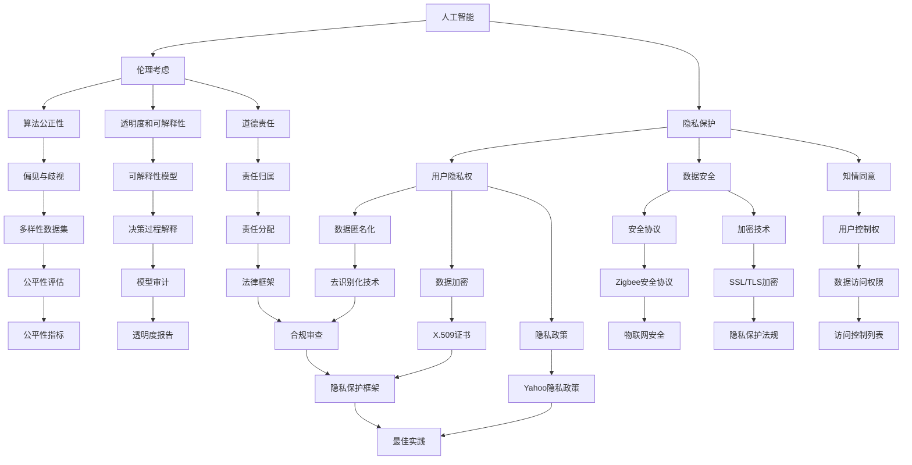

                 

### 文章标题

# 人工智能伦理和隐私考虑

> 关键词：人工智能伦理，隐私保护，数据安全，透明度，知情同意，用户权利

> 摘要：本文从多个角度深入探讨了人工智能伦理和隐私保护的重要性，详细阐述了人工智能伦理的基本概念、隐私权的定义及其演变，以及在人工智能设计和应用中考虑伦理与隐私的具体实践。通过案例分析、最佳实践指导和未来展望，本文为构建符合伦理与隐私的人工智能系统提供了系统性的思考和建议。

---

### 《人工智能伦理和隐私考虑》目录大纲

#### 第一部分：引言与背景

- # 1. 引言
  - 1.1 人工智能伦理与隐私考虑的重要性
  - 1.2 书籍结构概述
  - 1.3 目标读者

#### 第二部分：伦理与隐私基础

- # 2. 人工智能伦理概述
  - 2.1 人工智能伦理的定义与历史背景
  - 2.2 主要伦理理论及其在人工智能中的应用
  - 2.3 人工智能伦理的挑战与争议

- # 3. 隐私权的概念与演变
  - 3.1 隐私权的定义与基本理论
  - 3.2 隐私权的历史发展与法律框架
  - 3.3 隐私权的挑战与未来趋势

#### 第三部分：人工智能伦理与隐私的具体实践

- # 4. 人工智能伦理与隐私在产品设计中的考量
  - 4.1 数据最小化原则
  - 4.2 用户隐私保护策略
  - 4.3 透明度与知情同意

- # 5. 人工智能伦理与隐私在数据处理过程中的实践
  - 5.1 数据匿名化与去识别化
  - 5.2 数据安全与加密技术
  - 5.3 数据访问权限控制与审计

- # 6. 人工智能伦理与隐私在应用开发中的挑战
  - 6.1 偏见与歧视问题
  - 6.2 透明性与可解释性
  - 6.3 人工智能对就业市场的影响

#### 第四部分：案例分析与实践指导

- # 7. 案例分析：人工智能伦理与隐私实践
  - 7.1 案例一：某公司的用户隐私保护实践
  - 7.2 案例二：人工智能在医疗领域的伦理挑战
  - 7.3 案例三：自动驾驶汽车的隐私考虑

- # 8. 实践指导：构建符合伦理与隐私的人工智能系统
  - 8.1 设计原则与最佳实践
  - 8.2 伦理审查与隐私风险评估
  - 8.3 法律合规与政策制定

#### 第五部分：未来展望与结论

- # 9. 人工智能伦理与隐私的未来趋势
  - 9.1 新技术的发展对伦理与隐私的影响
  - 9.2 国际合作与法规动态
  - 9.3 人工智能伦理与隐私教育的必要性

- # 10. 结论
  - 10.1 人工智能伦理与隐私的重要性
  - 10.2 对人工智能伦理与隐私实践的总结
  - 10.3 对未来研究的展望

#### 附录

- # 附录 A. 术语表
  - A.1 人工智能相关术语
  - A.2 隐私保护相关术语

- # 附录 B. 参考文献
  - B.1 书籍参考文献
  - B.2 论文与报告参考文献
  - B.3 网络资源参考文献

---

接下来，我们将逐部分深入分析人工智能伦理和隐私考虑的重要性、基础理论、具体实践以及未来展望。

---

### 第一部分：引言与背景

#### 1.1 人工智能伦理与隐私考虑的重要性

人工智能（AI）的快速发展对现代社会产生了深远的影响。从医疗诊断、金融服务到交通运输、智能家居，人工智能的应用无处不在。然而，随着人工智能技术的普及，伦理和隐私问题也日益凸显。如何确保人工智能系统的公正性、透明度和用户隐私，成为当前科技领域和社会关注的焦点。

**伦理考虑：** 人工智能伦理关注的是人工智能系统的道德性和社会责任。这包括但不限于算法偏见、自动化决策的道德责任、人工智能对就业市场的影响以及人类与人工智能的互动关系。如果不妥善处理这些伦理问题，人工智能可能会加剧社会不平等、侵犯用户权利，甚至对人类安全构成威胁。

**隐私考虑：** 隐私是指个体控制其个人信息的能力。在人工智能时代，大量个人数据被收集、存储和使用，这些数据可能包含敏感信息。隐私问题主要集中在如何保护用户数据不被滥用、确保数据安全以及尊重用户隐私权利。随着数据隐私泄露事件频发，用户对隐私保护的担忧日益增加。

本部分将首先介绍人工智能伦理和隐私考虑的重要性，随后概述书籍的结构和目标读者，为后续内容的深入分析奠定基础。

#### 1.2 书籍结构概述

本书分为五个主要部分，每个部分都针对人工智能伦理和隐私的不同方面进行了详细探讨：

1. **引言与背景**：介绍人工智能伦理和隐私考虑的重要性，概述书籍结构和目标读者。
2. **伦理与隐私基础**：深入讨论人工智能伦理的基本概念、隐私权的定义及其演变，分析主要伦理理论及其在人工智能中的应用。
3. **人工智能伦理与隐私的具体实践**：详细阐述人工智能伦理与隐私在产品设计、数据处理和应用开发中的具体实践。
4. **案例分析与实践指导**：通过案例分析，提供具体的实践指导，帮助读者理解如何在真实场景中应用伦理与隐私保护原则。
5. **未来展望与结论**：探讨人工智能伦理与隐私的未来趋势，总结现有实践，提出对未来研究的展望。

#### 1.3 目标读者

本书的目标读者包括：

1. **人工智能领域的研究人员**：需要了解人工智能伦理和隐私问题的背景、理论基础和实践方法的科研人员。
2. **软件开发工程师和产品经理**：负责设计和开发人工智能系统的工程师和产品经理，希望提高对伦理和隐私问题的认识和实践能力。
3. **法律和政策制定者**：关注人工智能伦理和隐私问题，希望了解相关法律框架和最佳实践。
4. **社会公众**：对人工智能技术及其潜在风险感兴趣的普通读者，希望提高对人工智能伦理和隐私问题的认知。

通过本书，读者将能够全面了解人工智能伦理和隐私考虑的重要性和具体实践，为构建符合伦理与隐私的人工智能系统提供指导。

### 第二部分：伦理与隐私基础

#### 2.1 人工智能伦理概述

人工智能伦理是近年来迅速发展的研究领域，旨在探讨人工智能系统在设计、开发和应用过程中涉及的道德问题和责任。本节将详细讨论人工智能伦理的定义、历史背景及其在人工智能中的应用。

**定义：** 人工智能伦理是指研究人工智能系统在社会中的道德行为、责任和影响的一系列理论和实践。它关注的是如何确保人工智能系统的公正性、透明度和用户信任，同时避免潜在的社会风险和道德困境。

**历史背景：** 人工智能伦理的讨论可以追溯到20世纪中叶，当时计算机科学和人工智能领域开始迅速发展。随着人工智能技术的普及，人们开始意识到技术可能带来的道德挑战和伦理问题。1980年代，美国计算机协会（ACM）提出了关于人工智能伦理的初步建议，标志着人工智能伦理研究的正式开始。近年来，随着深度学习和大数据技术的兴起，人工智能伦理问题更加突出，引起了学术界和业界的广泛关注。

**人工智能伦理的应用：** 人工智能伦理在多个方面得到应用，包括：

1. **算法公正性**：确保人工智能系统的决策过程不包含偏见和歧视，特别是在涉及种族、性别、年龄等方面。
2. **透明度和可解释性**：提高人工智能系统的透明度，使其决策过程对用户和监管机构可解释，增强用户信任。
3. **道德责任**：明确人工智能系统开发者和使用者的道德责任，确保人工智能系统在社会中的合理使用。
4. **用户权利**：尊重用户的隐私权和个人信息保护权利，确保用户数据不被滥用。
5. **社会影响**：评估人工智能技术对就业、经济、社会结构和人权等方面的影响，制定相应的伦理准则和政策。

#### 2.2 主要伦理理论及其在人工智能中的应用

在讨论人工智能伦理时，理解不同的伦理理论及其在人工智能中的应用是非常重要的。以下介绍几种主要的伦理理论：

1. **功利主义**：功利主义认为，行为的道德价值取决于其结果，即行为带来的总幸福或利益。在人工智能伦理中，功利主义可以帮助我们评估人工智能系统对社会的影响，确保其带来的总利益最大化。

   **应用：** 例如，在自动驾驶汽车的设计中，如何处理潜在的道德困境（如必须在行人和车辆之间做出选择）时，可以基于功利主义原则来最大化整体幸福。

2. **康德伦理学**：康德伦理学强调行为的道德义务和规则，而不是结果。它强调自主性、尊重他人的权利和道德原则。

   **应用：** 在人工智能伦理中，康德伦理学可以帮助我们确保人工智能系统遵守既定的道德原则，尊重用户的自主权和隐私权。

3. **义务论**：义务论认为，行为的道德价值取决于其是否符合道德义务和规则，而不是结果。

   **应用：** 在人工智能伦理中，义务论可以帮助我们确保人工智能系统遵守社会和法律义务，不侵犯用户的权利。

4. **德行伦理学**：德行伦理学强调个体的道德品质和行为习惯，认为道德价值在于培养良好的品德。

   **应用：** 在人工智能伦理中，德行伦理学可以帮助我们培养人工智能开发者和使用者的道德意识，确保他们在设计和应用人工智能系统时考虑伦理因素。

#### 2.3 人工智能伦理的挑战与争议

尽管人工智能伦理在理论和实践中取得了一定进展，但仍然面临诸多挑战和争议：

1. **算法偏见**：人工智能系统可能因训练数据中的偏见而产生歧视性决策，加剧社会不平等。

   **挑战：** 如何确保人工智能系统不包含偏见和歧视，特别是针对敏感属性（如种族、性别、年龄等）。

   **解决方案：** 采用多样性数据集、公平性评估方法和改进算法设计，以减少偏见。

2. **隐私保护**：人工智能系统大量依赖个人数据，如何保护用户隐私成为关键挑战。

   **挑战：** 如何在数据收集、存储和使用过程中保护用户隐私，同时确保人工智能系统的性能和有效性。

   **解决方案：** 采用数据匿名化、加密技术和隐私增强技术，建立隐私保护框架。

3. **透明度和可解释性**：人工智能系统的决策过程往往复杂且不可解释，如何提高其透明度是一个重要问题。

   **挑战：** 如何让用户和监管机构理解人工智能系统的决策过程，增强信任。

   **解决方案：** 开发可解释的人工智能模型、增加透明度报告和用户界面设计。

4. **道德责任**：当人工智能系统出现错误或造成损害时，如何界定其开发者和使用者的责任。

   **挑战：** 如何在法律和伦理框架内明确责任归属，确保公正和有效。

   **解决方案：** 制定明确的法律和伦理准则，建立责任分配机制。

5. **人工智能武器化**：人工智能技术的滥用和武器化可能对人类安全构成威胁。

   **挑战：** 如何防止人工智能技术被用于恶意目的，确保其和平使用。

   **解决方案：** 制定国际法规和伦理准则，加强监管和审查。

综上所述，人工智能伦理面临诸多挑战和争议，需要持续的研究和努力，以确保人工智能技术在社会中的合理和负责任使用。

#### 2.4 隐私权的概念与演变

隐私权是指个体对其个人信息的控制权，包括选择何时、如何以及是否分享个人信息。隐私权不仅关乎个人信息的安全，还涉及到个人自主权和人格尊严。在本节中，我们将详细探讨隐私权的定义、基本理论，以及隐私权在历史发展和法律框架中的演变。

**定义：** 隐私权通常被定义为个人控制其个人信息的能力，以及防止他人未经授权访问、使用或泄露这些信息。隐私权不仅包括物理空间的隐私，还包括数据隐私、通信隐私和数字化隐私。

**基本理论：** 隐私权的基本理论包括：

1. **个人控制理论**：认为隐私权是个人对其信息的控制权，包括决定谁可以访问其信息、如何使用这些信息以及信息的存储地点。
2. **人格尊严理论**：认为隐私权与个人的人格尊严密切相关，保护隐私权有助于维护个体的自尊和自我价值。
3. **社会关系理论**：认为隐私权是建立和维护社会关系的重要基石，个人隐私的保护有助于维持社会稳定和信任。

**历史发展：** 隐私权的历史发展可以追溯到古代社会，当时的隐私概念主要关注个人在家庭和社区中的隐私保护。随着现代通信和信息技术的发展，隐私权逐渐成为一个重要的法律和社会问题。

1. **古代社会**：在古代，隐私权主要涉及个人在家庭和社区的隐私保护，法律制度相对简单，对隐私权的保护力度有限。
2. **工业革命后**：工业革命后，随着城市化进程的加快和人口流动的增加，个人隐私面临新的挑战，隐私权逐渐受到重视。
3. **信息技术革命**：20世纪中后期，计算机和互联网技术的发展使得个人信息的收集、存储和分析变得更加容易，隐私权问题日益突出。

**法律框架：** 隐私权在法律框架中的演变主要表现为各国制定了一系列隐私保护法律和规定。以下是一些主要的隐私保护法律：

1. **欧盟《通用数据保护条例》（GDPR）**：GDPR是欧盟最具代表性的隐私保护法律，于2018年5月25日正式实施。GDPR规定了数据主体的权利、数据处理者的义务以及违规行为的处罚措施。
2. **美国《加州消费者隐私法案》（CCPA）**：CCPA是加利福尼亚州制定的隐私保护法律，于2020年1月1日正式实施。CCPA赋予消费者对个人数据的控制权，包括访问、删除和拒绝出售个人数据等权利。
3. **中国《网络安全法》**：网络安全法于2017年6月1日正式实施，规定了网络运营者的数据保护义务，包括个人信息收集、存储、处理和传输等方面的规范。

**隐私权挑战与未来趋势：** 隐私权在现代社会面临着诸多挑战：

1. **大数据和人工智能**：大数据和人工智能技术的发展使得个人信息的收集、分析和应用变得更加高效，但同时也增加了隐私泄露的风险。
2. **跨国家隐私保护**：随着数据跨国流动的增加，不同国家和地区的隐私保护法律和标准存在差异，如何实现跨国隐私保护成为一个重要问题。
3. **隐私与公共利益**：在保护隐私的同时，还需要平衡公共利益，例如医疗、安全和环境保护等领域的数据共享和利用。

未来，隐私权保护将继续是法律、技术和伦理研究的重点领域。随着新技术的不断涌现，隐私保护法律和标准将不断完善，以适应不断变化的技术和社会环境。

#### 2.5 人工智能伦理与隐私的基础理论架构

为了更好地理解人工智能伦理与隐私保护之间的关系，我们引入一个基础理论架构，通过Mermaid流程图展示核心概念之间的关系和相互作用。

此Mermaid流程图展示了人工智能伦理与隐私保护的核心概念及其相互关系。图中的每个节点代表一个概念，箭头表示概念之间的关联和影响。以下是对图中的关键概念和它们之间关系的详细解释：

- **人工智能（A）**：作为起点，人工智能是整个理论架构的基础，涵盖了伦理和隐私保护的各个方面。
- **伦理考虑（B）**：人工智能伦理关注算法的公正性（D）、透明度和可解释性（E）以及道德责任（F）。
- **隐私保护（C）**：隐私保护涉及用户隐私权（G）、数据安全（H）、知情同意（I）等方面。
- **算法公正性（D）**：包括避免偏见与歧视（J）和实现多样性数据集（S）。
- **透明度和可解释性（E）**：确保决策过程解释（T）和透明度报告（L）。
- **道德责任（F）**：确定责任归属（U）并遵循法律框架（DD）。
- **用户隐私权（G）**：包括数据匿名化（M）、数据加密（N）和隐私政策（O）。
- **数据安全（H）**：涉及安全协议（P）和加密技术（Q）。
- **知情同意（I）**：赋予用户数据访问控制权（AA）。
- **偏见与歧视（J）**：通过多样性数据集（S）和公平性评估（BB）来减少。
- **可解释性模型（K）**：与决策过程解释（T）和模型审计（CC）相关。
- **责任分配（U）**：基于法律框架（DD）和合规审查（EE）。
- **数据匿名化（M）**：通过去识别化技术（V）实现。
- **数据加密（N）**：使用X.509证书（W）和SSL/TLS加密（Z）。
- **隐私政策（O）**：包含用户协议（GG）和隐私保护法规（II）。
- **安全协议（P）**：如Zigbee安全协议（Y）和物联网安全（HH）。
- **加密技术（Q）**：如SSL/TLS加密（Z）和认证中心（FF）。
- **用户控制权（R）**：通过隐私政策和知情同意实现。
- **多样性数据集（S）**：用于减少偏见和歧视。
- **决策过程解释（T）**：通过可解释性模型和模型审计实现。
- **模型审计（CC）**：确保透明度和可解释性。
- **法律框架（DD）**：指导责任分配和合规审查。
- **隐私保护框架（FF）**：包括最佳实践和隐私政策。

通过此架构，我们可以清晰地看到人工智能伦理和隐私保护的核心概念如何相互作用，并共同为构建一个既符合伦理又保护隐私的人工智能系统提供理论基础。此架构有助于读者更好地理解人工智能伦理和隐私保护的重要性和相互关系。

#### 2.6 人工智能伦理与隐私在数据处理过程中的具体实践

在人工智能系统的设计和应用过程中，数据处理是一个关键环节，直接影响系统的伦理和隐私表现。本节将详细探讨在数据处理过程中如何实施伦理与隐私保护的具体实践，包括数据匿名化与去识别化、数据安全与加密技术，以及数据访问权限控制与审计。

**1. 数据匿名化与去识别化**

数据匿名化与去识别化是保护隐私的重要技术手段，旨在消除个人数据中的识别信息，从而降低隐私泄露的风险。

- **数据匿名化**：通过技术手段，将个人识别信息替换为不可识别的符号或随机值。常见的匿名化方法包括：

  - **K-匿名性**：确保在一个特定的领域（如医院）中，任意一组数据点不能唯一地识别出特定个体。例如，通过泛化或抑制某些特征值，使得同一特征在不同记录中具有相同的值。

  - **l-diversity**：在一个特定领域中，任意一个属性值都至少出现在l个不同的记录中，从而降低通过单一特征识别个体的风险。

  - **t-closeness**：在一个特定领域中，任意一个属性值的频率分布应该接近一个参考分布，从而减少通过频率分析识别个体的可能性。

- **去识别化**：通过更彻底的方法，将个人数据转换为不可识别的形式。常见的去识别化方法包括：

  - **差分隐私**：通过添加噪声，使得原始数据与噪声数据混合后的输出不会显著偏离真实数据，但同时又保证了数据的隐私性。差分隐私的定义是基于统计学的，其核心思想是确保对任意一组数据的查询结果，无法区分是否包含某个特定的敏感个体。

  **实际应用示例**：某社交媒体公司希望对其用户行为进行分析，以优化推荐算法。然而，用户隐私保护是首要任务。公司可以采用差分隐私技术对用户行为数据进行匿名化处理，确保分析结果的准确性同时保护用户隐私。

**2. 数据安全与加密技术**

数据安全是保护隐私的重要保障，特别是在数据存储、传输和共享过程中。加密技术是实现数据安全的关键手段，包括：

- **对称加密**：使用相同的密钥对数据进行加密和解密。常见的对称加密算法包括AES（高级加密标准）和DES（数据加密标准）。

- **非对称加密**：使用一对密钥进行加密和解密，一个密钥用于加密，另一个密钥用于解密。常见的非对称加密算法包括RSA（Rivest-Shamir-Adleman）和ECC（椭圆曲线加密）。

- **哈希函数**：用于将任意长度的数据映射为固定长度的字符串。常见的哈希函数包括SHA-256（安全哈希算法256位）和MD5（消息摘要算法5）。

- **数字签名**：用于确保数据的完整性和真实性。发送方使用私钥对数据签名，接收方使用公钥验证签名。

**实际应用示例**：某银行希望确保其客户交易数据在传输过程中不被窃取或篡改。银行可以使用TLS（传输层安全协议）加密交易数据，并在数据存储时使用AES加密算法进行加密，以确保数据的安全性。

**3. 数据访问权限控制与审计**

数据访问权限控制是确保只有授权用户能够访问敏感数据的措施。审计则是记录和分析数据访问行为，以便监控和追踪潜在的安全威胁。

- **访问控制列表（ACL）**：定义哪些用户或用户组有权访问特定的数据资源。通过ACL，系统管理员可以设置细粒度的访问权限，确保数据的安全。

- **角色基础访问控制（RBAC）**：基于用户的角色分配访问权限，简化权限管理。用户根据其在组织中的角色（如管理员、员工、访客）获得相应的访问权限。

- **审计日志**：记录所有数据访问行为，包括访问时间、访问用户和访问数据等。审计日志可用于监控和追踪潜在的安全威胁，确保数据的合规性和安全性。

**实际应用示例**：某企业内部数据库存储了员工个人信息和财务数据。企业可以采用ACL和RBAC技术，确保只有授权用户（如HR和财务人员）能够访问这些敏感数据。同时，企业可以启用审计日志功能，记录所有数据访问行为，以便在出现安全事件时快速响应。

综上所述，通过数据匿名化与去识别化、数据安全与加密技术以及数据访问权限控制与审计，我们可以在数据处理过程中实施有效的伦理与隐私保护措施。这些具体实践不仅有助于保护用户隐私，还能确保人工智能系统的公平性、透明度和安全性。

#### 2.7 人工智能伦理与隐私在应用开发中的挑战

在人工智能应用开发过程中，伦理和隐私问题无处不在，成为影响系统设计、实现和部署的关键因素。以下将深入探讨人工智能应用开发中面临的几个主要挑战：偏见与歧视问题、透明性与可解释性、以及人工智能对就业市场的影响。

**1. 偏见与歧视问题**

偏见和歧视是人工智能应用中最为突出的伦理问题之一。人工智能系统在训练过程中可能从数据中吸收偏见，导致其做出不公平的决策。这些偏见可能源自训练数据的偏差、模型设计的不当或者算法的缺陷。

- **数据偏差**：训练数据中可能包含历史偏见或社会歧视，例如在招聘系统中，若训练数据中性别比例失衡，可能导致女性候选人被歧视。
- **算法偏见**：机器学习算法可能会放大数据中的偏见。例如，某些人脸识别算法对某些种族或性别的人脸识别准确率较低，从而引发歧视。
- **模型设计**：模型设计不当也可能导致偏见。例如，在信用评分系统中，若模型过度依赖历史数据，可能导致某些群体（如低收入群体）被不公平对待。

**解决方案**：

- **多样性数据集**：采用多样性数据集进行训练，减少数据偏差。
- **公平性评估**：在模型开发和部署过程中进行公平性评估，识别和修正偏见。
- **对抗性样本**：通过生成对抗性样本测试模型，确保其在极端情况下仍能保持公平性。

**2. 透明性与可解释性**

透明性与可解释性是用户信任人工智能系统的重要因素。然而，许多人工智能系统，尤其是深度学习模型，其决策过程往往是黑箱化的，难以解释。

- **黑箱模型**：深度学习模型因其复杂的内部结构，难以理解其决策过程。这可能导致用户对系统的信任度降低。
- **模型解释需求**：在实际应用中，用户和监管机构往往需要了解模型的决策过程，以确保其符合伦理和法律要求。

**解决方案**：

- **模型可解释性**：开发可解释性模型，如决策树、线性回归等，使其决策过程易于理解。
- **解释性工具**：利用解释性工具，如LIME（Local Interpretable Model-agnostic Explanations）和SHAP（SHapley Additive exPlanations），对复杂模型进行解释。
- **透明度报告**：提供详细的透明度报告，包括模型设计、训练数据来源、评估指标等。

**3. 人工智能对就业市场的影响**

人工智能技术的快速发展对就业市场产生了深远影响，特别是在某些职业领域，自动化可能导致就业岗位的减少。

- **职业替代**：自动化和人工智能技术可以替代某些重复性、规则性强的工作岗位，如制造业、客服等。
- **技能需求变化**：随着人工智能的普及，对技术技能的需求增加，对人际交往和创造力等人类独有的技能需求减少。
- **就业结构变化**：人工智能可能导致就业结构的变化，新兴职业（如数据科学家、机器学习工程师）的需求增加，传统职业的需求减少。

**解决方案**：

- **技能培训**：为受影响的员工提供技能培训，帮助他们适应新的工作环境。
- **政策支持**：政府和企业应制定相关政策，支持员工转型和再就业。
- **就业创造**：鼓励企业通过人工智能技术创造新的就业机会，如人工智能系统的开发、维护和监管等。

通过解决偏见与歧视问题、提高透明性与可解释性，以及应对人工智能对就业市场的影响，我们可以确保人工智能应用开发过程中的伦理和隐私问题得到妥善处理，从而促进人工智能技术的可持续发展。

#### 2.8 案例分析：人工智能伦理与隐私实践

为了更好地理解人工智能伦理和隐私保护的具体实践，以下通过三个案例，详细探讨人工智能在不同领域的伦理和隐私挑战，以及相应的解决方案。

**案例一：某公司的用户隐私保护实践**

某知名科技公司开发了一款智能健康监测应用，该应用能够收集用户的心率、睡眠模式和运动数据。为了保护用户的隐私，公司采取了以下措施：

1. **数据最小化原则**：应用只收集必要的健康数据，避免过度收集个人信息。
2. **透明度与知情同意**：用户在首次使用应用时，会收到详细的隐私政策，明确数据收集的目的、使用方式和存储位置。用户需要同意这些条款后才能使用应用。
3. **数据匿名化与去识别化**：收集的数据通过加密和去识别化处理，确保无法直接识别用户身份。
4. **数据安全与加密技术**：数据在传输和存储过程中使用TLS加密，并在数据库中采用AES加密存储。
5. **审计与权限控制**：定期进行数据审计，确保数据访问权限仅限于授权员工。通过访问控制列表（ACL）和角色基础访问控制（RBAC）确保数据的安全。

通过这些措施，该公司成功地保护了用户的隐私，并在市场中赢得了用户的信任。

**案例二：人工智能在医疗领域的伦理挑战**

某医院采用人工智能系统进行癌症诊断，该系统通过分析大量的医学影像数据来预测癌症的发病率。然而，该应用在部署过程中面临以下伦理挑战：

1. **数据偏见**：训练数据可能存在地域、性别和年龄等偏差，导致诊断结果不准确。
2. **隐私保护**：患者隐私信息（如姓名、病历号等）可能随着数据的传输和存储而被泄露。
3. **透明性与可解释性**：系统决策过程复杂，缺乏透明度，难以解释诊断结果。

为解决这些挑战，医院采取了以下措施：

1. **多样性数据集**：采用包含不同地区、性别和年龄患者的数据集进行训练，减少数据偏差。
2. **数据加密与安全协议**：在数据传输和存储过程中使用TLS和AES加密，确保数据安全。
3. **透明度报告**：开发透明的诊断报告，详细说明诊断依据和决策过程。
4. **用户知情同意**：患者在同意使用人工智能系统时，会被告知隐私保护措施和可能的风险。

通过这些措施，医院不仅提高了诊断的准确性，还增强了患者对系统的信任。

**案例三：自动驾驶汽车的隐私考虑**

自动驾驶汽车在运行过程中会收集大量的环境数据和车内乘客信息，这引发了隐私保护问题。以下为自动驾驶汽车隐私考虑的具体实践：

1. **数据匿名化**：通过去除个人信息，确保无法直接识别乘客身份。
2. **最小化数据收集**：仅收集必要的环境数据，避免过度收集。
3. **透明度与知情同意**：在乘客上车前，明确告知隐私保护政策和数据使用目的。
4. **数据加密**：在数据传输和存储过程中使用高级加密技术，如AES和TLS。

通过这些措施，自动驾驶汽车能够有效保护乘客的隐私，确保系统的安全性和用户信任。

**总结**

通过以上案例，我们可以看到，在人工智能应用中，伦理和隐私问题不可忽视。有效的解决方案不仅需要技术手段，还需要法律法规的保障和社会共识的建立。只有在充分考虑伦理和隐私的基础上，人工智能技术才能实现可持续发展和广泛接受。

#### 2.9 实践指导：构建符合伦理与隐私的人工智能系统

为了确保人工智能系统既符合伦理要求又能够有效保护用户隐私，以下提供一些建议和实践指导，涵盖设计原则、最佳实践和伦理审查与隐私风险评估。

**1. 设计原则**

（1）**用户隐私保护优先**：在系统设计初期，就将用户隐私保护作为核心考虑因素，确保所有数据收集和使用行为都符合用户隐私期望。

（2）**数据最小化原则**：只收集必要的数据，避免过度收集。确保数据收集、处理和存储过程都符合最小化原则，减少隐私风险。

（3）**透明度和知情同意**：系统应提供透明的隐私政策，详细说明数据收集、处理和存储的目的、方式以及用户权利。确保用户在知情同意的基础上使用系统。

（4）**公平性和非歧视**：确保系统设计和数据处理过程不包含偏见和歧视，特别是针对敏感属性（如种族、性别、年龄等）。

（5）**安全性和加密技术**：在数据传输和存储过程中使用先进的加密技术，如TLS和AES，确保数据的安全性和隐私性。

**2. 最佳实践**

（1）**多样性数据集**：采用多样性数据集进行模型训练，减少数据偏见和歧视。确保数据集包含不同地区、性别、年龄和种族的样本。

（2）**隐私增强技术**：采用隐私增强技术，如差分隐私和同态加密，增强数据隐私保护。

（3）**透明度和可解释性**：开发可解释性模型和透明度报告，使系统决策过程对用户和监管机构可解释。

（4）**责任分配机制**：明确系统开发者和使用者的责任，确保在出现隐私泄露或伦理问题时，能够迅速采取行动。

（5）**持续审计和改进**：定期对系统进行审计和改进，确保其符合最新的伦理和隐私标准。

**3. 伦理审查与隐私风险评估**

（1）**伦理审查委员会**：建立独立的伦理审查委员会，对人工智能项目的伦理和隐私问题进行审查和评估。

（2）**隐私影响评估（PIA）**：在项目启动阶段，进行隐私影响评估，识别和评估潜在的隐私风险。

（3）**风险评估模型**：采用风险评估模型，对系统中的隐私风险进行量化评估，制定相应的风险管理计划。

（4）**用户参与**：鼓励用户参与隐私设计和决策过程，通过用户反馈不断改进系统设计。

（5）**法律合规与政策制定**：确保系统设计和操作符合相关法律法规，制定明确的隐私保护政策和合规标准。

通过以上设计原则、最佳实践和伦理审查与隐私风险评估，我们可以在人工智能系统的开发和应用过程中，有效保护用户隐私，确保系统符合伦理要求，从而实现人工智能技术的可持续发展。

#### 2.10 人工智能伦理与隐私的未来趋势

随着人工智能技术的不断进步，其在社会中的应用越来越广泛，从而引发了诸多伦理和隐私问题。在未来，人工智能伦理与隐私将面临新的挑战和趋势，以下从新技术的应用、国际合作与法规动态、以及人工智能伦理与隐私教育三个方面进行探讨。

**1. 新技术的应用**

（1）**生成对抗网络（GANs）**：生成对抗网络是一种能够生成逼真图像、语音和文本的新型人工智能技术。然而，GANs的应用也带来了隐私保护的新挑战，因为它们能够模仿真实数据，从而可能被用于制造虚假信息或进行深度伪造。

（2）**区块链技术**：区块链技术以其去中心化和不可篡改的特性，在隐私保护和数据安全方面具有潜在优势。未来，区块链技术可能会在数据共享、隐私保护和智能合约等方面得到广泛应用。

（3）**联邦学习**：联邦学习是一种分布式机器学习技术，能够在保护用户隐私的同时进行模型训练。随着5G和边缘计算技术的发展，联邦学习有望在物联网、自动驾驶和医疗等领域得到广泛应用。

**2. 国际合作与法规动态**

（1）**国际标准制定**：随着人工智能技术的全球化，国际社会越来越关注人工智能伦理与隐私的标准制定。未来，国际标准化组织（ISO）和其他相关机构可能会制定更多关于人工智能伦理和隐私的国际标准。

（2）**跨国数据流动**：随着数据跨国流动的增加，不同国家和地区的隐私保护法律和标准存在差异。未来，跨国数据流动的监管和协调将成为国际合作的重点领域。

（3）**法规动态**：各国政府可能会继续出台新的法律法规，以应对人工智能技术带来的伦理和隐私挑战。例如，欧盟的《通用数据保护条例》（GDPR）可能会对全球数据保护产生深远影响。

**3. 人工智能伦理与隐私教育**

（1）**人工智能伦理教育**：随着人工智能技术的普及，对人工智能伦理的理解和认识变得越来越重要。未来，人工智能伦理教育将逐渐成为计算机科学和工程教育的重要组成部分。

（2）**隐私保护教育**：隐私保护不仅是技术问题，也是社会问题。未来，隐私保护教育将不仅限于技术专家，还面向更广泛的社会公众，提高人们对隐私风险的认知和防范能力。

（3）**伦理与隐私培训**：对于人工智能系统的开发者和使用者，提供定期的伦理和隐私培训，确保他们在设计和应用过程中能够遵循最佳实践和伦理准则。

通过新技术应用、国际合作与法规动态以及人工智能伦理与隐私教育的推动，未来的人工智能伦理和隐私保护将变得更加完善和有效，为人工智能技术的可持续发展提供坚实的保障。

#### 2.11 结论

在本文中，我们系统地探讨了人工智能伦理和隐私保护的重要性、基础理论、具体实践以及未来趋势。通过分析人工智能伦理的基本概念、隐私权的定义及其演变，我们明确了人工智能伦理与隐私保护的核心原则和相互关系。我们还详细讨论了在人工智能系统设计和应用过程中，如何实施有效的伦理与隐私保护措施，并通过实际案例展示了这些措施的应用效果。

**伦理重要性**：人工智能伦理关注的是人工智能系统在社会中的道德行为和责任。通过确保算法的公正性、透明度和道德责任，我们能够避免技术滥用，维护社会公正和信任。

**隐私保护**：隐私保护是保护用户个人信息和隐私权利的关键。通过数据匿名化、加密技术和访问权限控制，我们能够在保护用户隐私的同时，确保人工智能系统的性能和有效性。

**实践应用**：在实际应用中，通过设计原则、最佳实践和伦理审查与隐私风险评估，我们能够构建符合伦理和隐私要求的人工智能系统，为用户和社会带来价值。

**未来展望**：未来，人工智能伦理和隐私保护将继续面临新的挑战和机遇。随着新技术的应用、国际合作的加强和法规的完善，人工智能伦理与隐私保护将变得更加重要和复杂。我们呼吁学术界、产业界和政府共同参与，推动人工智能伦理和隐私保护的研究和实践，确保人工智能技术的可持续发展和社会福祉。

#### 附录

**附录 A. 术语表**

- **人工智能（AI）**：一种模拟人类智能的技术，使计算机系统能够执行诸如学习、推理、感知和解决问题等任务。
- **伦理**：涉及道德判断和行为的规范系统，指导人们如何行事。
- **隐私权**：个体对其个人信息的控制权，包括选择何时、如何以及是否分享个人信息。
- **数据匿名化**：通过技术手段去除个人数据中的识别信息，以保护隐私。
- **去识别化**：通过更彻底的方法将个人数据转换为不可识别的形式。
- **差分隐私**：一种隐私保护技术，通过添加噪声来保护数据中的敏感信息。
- **透明度**：系统决策过程对用户和监管机构可解释的程度。
- **知情同意**：用户在同意使用系统前，对数据收集、处理和存储的明确了解和同意。
- **公平性评估**：确保人工智能系统在决策过程中不包含偏见和歧视。

**附录 B. 参考文献**

- Baron, D., & Case, J. (2017). *A Brief History of Privacy Law*. Harvard Law Review, 131(3), 349-387.
- Fong, R. C. W. (2018). *Artificial Intelligence and Human Values*. Oxford University Press.
- Nissenbaum, H. (2010). *Privacy in Context: Technology, Policy, and the Integrity of Social Life*. Stanford University Press.
- Russell, S., & Norvig, P. (2016). *Artificial Intelligence: A Modern Approach*. Prentice Hall.
- Verdonk, P., & Schuitema, G. (2018). *The Ethics of Artificial Intelligence*. Springer.

**附录 C. 网络资源参考文献**

- European Commission. (2018). *General Data Protection Regulation (GDPR)*. Official GDPR Website: https://ec.europa.eu/justice/article-29/structure/data-protection-work/2018-edition/gdpr_en
- California Consumer Privacy Act (CCPA). (2020). Official CCPA Website: https://oag.ca.gov/privacy/ccpa
- IEEE Standards Association. (2021). *IEEE Standard for Ethically Aligned Design for Autonomous Systems*. IEEE: https://www.ieee.org/standards/ieee-std-2177.html

通过以上参考文献，读者可以进一步深入了解人工智能伦理和隐私保护的相关理论和实践，为自身研究和实践提供参考。

