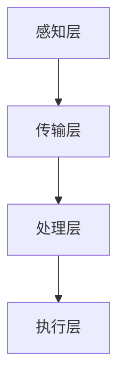
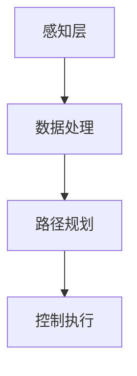

                 

## 文章标题

### 人工智能在交通和自动驾驶中的应用

## 关键词

- 人工智能
- 自动驾驶
- 交通系统
- 交通流量管理
- 安全性

## 摘要

本文深入探讨了人工智能在交通和自动驾驶领域的广泛应用。首先，介绍了人工智能与交通系统的关系及其融合的必要性。接着，详细分析了自动驾驶技术的核心概念、分类、架构及算法，并探讨了其在安全性、可靠性和伦理法规方面的挑战。随后，本文探讨了人工智能在交通流量管理和公共交通系统优化中的应用，并通过案例分析展示了其实际效果。此外，文章还介绍了人工智能在智能交通基础设施、交通规划与设计以及交通系统安全管理中的应用。最后，本文展望了人工智能在交通领域的未来发展趋势，并提出了政策建议、企业战略和未来研究方向。通过本文，读者可以全面了解人工智能在交通和自动驾驶领域的应用现状、挑战和前景。

### 第一部分：人工智能在交通和自动驾驶中的应用基础

#### 第1章：人工智能与交通系统的融合

## 1.1 人工智能与交通系统的关系

### 1.1.1 人工智能技术对交通系统的影响

人工智能技术对交通系统产生了深远的影响。首先，人工智能技术能够提高交通系统的运行效率和安全性。通过大数据分析和机器学习算法，人工智能能够实时监控交通状况，预测交通流量，优化交通信号控制和车辆路径规划，从而缓解交通拥堵，提高通行效率。其次，人工智能技术能够提高交通系统的智能化水平。例如，自动驾驶技术使得车辆能够自主行驶，减少了人为驾驶的错误和疲劳，提高了交通安全性和舒适性。此外，人工智能技术还能够改善交通管理和服务的质量。通过物联网（IoT）技术，交通系统中的各种设备可以实现互联互通，实现智能交通信号控制、智能停车场管理和智能交通信息发布等功能，为出行者提供更加便捷和智能的服务。

### 1.1.2 交通系统中人工智能的应用领域

人工智能在交通系统中有着广泛的应用领域。首先，在交通流量管理方面，人工智能可以通过分析大量的交通数据，预测交通流量，优化交通信号控制和车辆路径规划，从而缓解交通拥堵，提高通行效率。其次，在公共交通系统方面，人工智能可以用于智能公交系统的建设与运营，实现公交车辆的自动调度和智能导航，提高公共交通的服务水平。此外，在自动驾驶技术方面，人工智能可以通过感知环境、规划路径和控制执行，实现车辆的自动驾驶，提高交通安全性和舒适性。最后，在智能交通基础设施方面，人工智能可以用于智能交通信号控制、智能交通监控与检测、智能停车场管理系统和智能交通信息发布等，提高交通系统的智能化水平。

### 1.1.3 人工智能与交通系统的协同效应

人工智能与交通系统的融合不仅能够提高交通系统的效率和安全性，还能够带来协同效应。首先，人工智能技术可以增强交通系统的适应性。通过实时监测和分析交通状况，人工智能系统能够迅速适应交通状况的变化，及时调整交通信号和车辆路径规划，确保交通流畅和安全。其次，人工智能技术可以提高交通系统的可靠性。通过物联网技术和大数据分析，人工智能系统能够预测交通流量和突发事件，提前采取应对措施，减少交通拥堵和事故的发生。此外，人工智能技术还可以提高交通系统的可持续性。通过优化交通流量和路径规划，人工智能系统能够减少交通排放，降低能源消耗，促进交通系统的可持续发展。

## 1.2 人工智能交通系统的核心概念

### 1.2.1 智能交通系统（ITS）的定义与组成

智能交通系统（Intelligent Transportation System，简称ITS）是指利用先进的信息通信技术、传感器技术、控制技术等，实现交通系统的智能化管理和优化，以提高交通系统的效率和安全性。ITS主要由以下几部分组成：

1. **感知层**：包括各种传感器和摄像头，用于实时监测交通流量、车辆速度、道路状况等信息。
2. **传输层**：包括通信网络，用于将感知层采集到的数据传输到处理中心。
3. **处理层**：包括数据处理和分析系统，用于对传输层的数据进行处理和分析，生成交通预测和优化方案。
4. **执行层**：包括交通信号控制、车辆路径规划等执行系统，用于根据处理层生成的方案对交通进行调控。

### 1.2.2 自动驾驶技术的概念与发展历程

自动驾驶技术是指通过计算机视觉、激光雷达、传感器等感知技术，以及机器学习和控制算法，使车辆能够自主感知环境、规划路径和控制行驶的技术。自动驾驶技术的发展历程可以分为以下几个阶段：

1. **初始阶段（20世纪50年代至70年代）**：主要研究自动驾驶的基础技术，如计算机视觉、传感器和控制系统。
2. **探索阶段（20世纪80年代至90年代）**：开始进行自动驾驶车辆的实验和研究，逐步实现部分自动驾驶功能。
3. **发展阶段（21世纪初至今）**：随着人工智能技术的快速发展，自动驾驶技术取得了显著进展，逐步实现了部分自动驾驶功能，如自动泊车、自动巡航等。
4. **成熟阶段（未来）**：预计在不久的将来，完全自动驾驶技术将得到广泛应用，实现真正的无人驾驶。

### 1.2.3 物联网（IoT）在交通系统中的应用

物联网（Internet of Things，简称IoT）是指将各种物理设备、传感器、软件平台等连接到互联网，实现设备之间的互联互通和数据交换。在交通系统中，物联网技术主要用于以下几个方面：

1. **车辆连接**：通过车联网技术，实现车辆之间的信息交换和协同驾驶，提高交通效率和安全性。
2. **基础设施连接**：通过传感器和摄像头等设备，实时监测道路状况、车辆流量等信息，为交通管理和优化提供数据支持。
3. **智能交通信号控制**：通过物联网技术，实现交通信号控制的智能化和自适应化，提高交通信号控制的效率和准确性。
4. **车辆与基础设施的协同**：通过物联网技术，实现车辆与交通基础设施之间的信息交换和协同工作，提高交通系统的整体运行效率。

## 1.3 人工智能交通系统的架构

### 1.3.1 人工智能交通系统的层级结构

人工智能交通系统通常可以分为四个层级：感知层、传输层、处理层和执行层。每个层级都有不同的功能和作用，共同构成一个完整的智能交通系统。

1. **感知层**：包括各种传感器和摄像头，用于实时监测交通状况，如车辆速度、道路状况、交通流量等。感知层的数据是后续处理和分析的基础。
2. **传输层**：包括通信网络，用于将感知层采集到的数据传输到处理中心。传输层的技术主要包括无线通信、光纤通信等。
3. **处理层**：包括数据处理和分析系统，用于对传输层的数据进行处理和分析，生成交通预测和优化方案。处理层的技术主要包括大数据分析、机器学习、深度学习等。
4. **执行层**：包括交通信号控制、车辆路径规划等执行系统，用于根据处理层生成的方案对交通进行调控。执行层的技术主要包括控制算法、优化算法等。

### 1.3.2 数据采集与处理

数据采集与处理是人工智能交通系统的核心环节，直接影响到系统的性能和效果。数据采集主要依赖于传感器和摄像头等设备，包括车辆速度、道路状况、交通流量、车辆位置等数据。数据处理主要包括数据清洗、数据归一化、特征提取等步骤。

1. **数据清洗**：去除数据中的噪声和异常值，确保数据的准确性和一致性。
2. **数据归一化**：将不同特征的数据进行归一化处理，使其在同一量级范围内，便于后续的分析和处理。
3. **特征提取**：从原始数据中提取出对交通预测和优化有用的特征，如交通流量、车辆速度、道路占有率等。

### 1.3.3 智能决策与控制

智能决策与控制是人工智能交通系统的关键环节，通过分析和处理感知层采集到的数据，生成最优的交通信号控制和车辆路径规划方案。智能决策与控制主要包括以下几个步骤：

1. **交通状态识别**：根据感知层的数据，识别当前交通系统的状态，如交通拥堵、畅通等。
2. **交通预测**：利用历史数据和机器学习算法，预测未来一段时间内交通流量、交通状况等参数的变化。
3. **路径规划**：根据交通预测结果，为车辆规划最优路径，以减少行驶时间和能耗。
4. **信号控制**：根据交通状态和路径规划结果，调整交通信号灯的时序和时长，优化交通流量。

### 1.3.4 通信与协作机制

通信与协作机制是人工智能交通系统正常运行的重要保障。在人工智能交通系统中，各种设备和系统能够通过通信网络实现互联互通，协同工作，提高交通系统的效率和安全性。

1. **通信协议**：采用标准化的通信协议，如TCP/IP、MQTT等，实现设备和系统之间的数据传输。
2. **数据同步**：确保感知层、处理层和执行层的数据同步，避免数据冲突和误差。
3. **协调机制**：通过分布式计算和协调算法，实现各系统和设备之间的协调与配合，确保交通系统的整体运行效率。
4. **冗余备份**：建立冗余备份机制，确保通信网络和系统的稳定性和可靠性。

## 第2章：自动驾驶技术的核心概念与原理

### 2.1 自动驾驶技术的分类

自动驾驶技术按照自动驾驶等级可以分为 L0-L5 六个等级，每个等级都有其特定的功能和特点。

#### 2.1.1 L0-L5 自动驾驶等级划分

1. **L0：无自动化**  
   车辆的所有操作都由人类驾驶员完成，没有任何自动化功能。

2. **L1：驾驶员辅助自动化**  
   车辆具备部分自动化功能，如自动巡航、自动泊车等，但需要驾驶员持续监控和干预。

3. **L2：部分自动化**  
   车辆具备更高的自动化水平，可以实现自动驾驶，但需要驾驶员在某些情况下接管控制。

4. **L3：有条件自动化**  
   车辆可以在特定道路和交通条件下实现完全自动驾驶，但需要驾驶员在某些情况下接管控制。

5. **L4：高度自动化**  
   车辆可以在特定道路和交通条件下实现完全自动驾驶，无需驾驶员干预。

6. **L5：完全自动化**  
   车辆可以在任何道路和交通条件下实现完全自动驾驶，无需人类驾驶员干预。

#### 2.1.2 各等级自动驾驶的特点与应用场景

1. **L0：无自动化**  
   这种等级的车辆不具备任何自动化功能，适用于所有道路和交通条件。

2. **L1：驾驶员辅助自动化**  
   这种等级的车辆适合在高速公路和城市道路上使用，可以在驾驶员监控下实现自动巡航、自动泊车等功能。

3. **L2：部分自动化**  
   这种等级的车辆适合在高速公路、城市道路和封闭道路上使用，可以实现自动驾驶，但需要驾驶员在特定情况下接管控制。

4. **L3：有条件自动化**  
   这种等级的车辆适合在高速公路、城市道路和封闭道路上使用，可以在特定道路和交通条件下实现完全自动驾驶，但需要驾驶员在特定情况下接管控制。

5. **L4：高度自动化**  
   这种等级的车辆适合在封闭道路和特定道路上使用，可以在特定道路和交通条件下实现完全自动驾驶，无需驾驶员干预。

6. **L5：完全自动化**  
   这种等级的车辆适合在各种道路和交通条件下使用，可以在任何道路和交通条件下实现完全自动驾驶，无需人类驾驶员干预。

#### 2.1.3 自动驾驶技术的发展趋势

自动驾驶技术正处于快速发展阶段，未来将呈现出以下发展趋势：

1. **技术成熟度提升**  
   随着人工智能、传感器技术、通信技术等领域的不断进步，自动驾驶技术将逐步实现更高的自动化水平，从 L2 向 L3、L4 和 L5 发展。

2. **应用场景拓展**  
   自动驾驶技术将不仅仅局限于高速公路和城市道路，还将应用于封闭道路、城市交通、货运物流等领域。

3. **系统集成与协同**  
   自动驾驶系统将与其他智能交通系统、智能城市系统等实现集成与协同，构建智能交通生态系统。

4. **安全与可靠性提升**  
   随着自动驾驶技术的不断完善，其安全性和可靠性将逐步提升，实现真正意义上的无人驾驶。

### 2.2 自动驾驶系统的构成

自动驾驶系统通常由感知层、决策层和执行层三个部分组成。

#### 2.2.1 感知层：传感器技术

感知层是自动驾驶系统的感官，主要负责收集车辆周围环境的信息。常用的传感器包括：

1. **摄像头**：用于捕捉车辆前方的道路和交通情况，实现道路标志识别、车辆检测等功能。
2. **激光雷达（LiDAR）**：用于测量车辆与周围物体之间的距离，构建高精度的三维环境模型。
3. **雷达**：用于探测车辆周围的障碍物和道路状况，如雨雪天气下的道路状况。
4. **超声波传感器**：用于探测车辆附近的障碍物，如停车位的距离。

#### 2.2.2 环境感知与建模

环境感知与建模是自动驾驶系统的核心，通过对感知层收集到的数据进行处理和分析，实现对周围环境的理解和建模。

1. **目标检测与跟踪**：利用图像处理和机器学习算法，对车辆、行人、道路标志等目标进行检测和跟踪。
2. **场景理解与语义分割**：利用深度学习算法，对道路、车道、行人等场景元素进行语义分割，实现对场景的深入理解。
3. **三维重建与定位**：利用激光雷达和视觉传感器，构建车辆周围的三维环境模型，实现精确的定位和导航。

#### 2.2.3 决策层：决策算法与控制策略

决策层是自动驾驶系统的核心大脑，负责根据环境感知和建模的结果，制定车辆的行驶策略和决策。

1. **路径规划**：根据目标位置和当前道路状况，规划出一条最优路径，实现车辆的高效行驶。
2. **行为规划**：根据周围环境和目标，制定出合适的行驶行为，如加速、减速、转弯等。
3. **控制策略**：根据车辆的状态和决策，生成控制指令，实现对车辆的精确控制。

#### 2.2.4 执行层：执行机构与控制执行

执行层是自动驾驶系统的执行机构，负责根据决策层的指令，控制车辆的各个部件，实现车辆的自动驾驶。

1. **动力系统**：包括发动机、电池等，负责提供车辆的驱动力。
2. **制动系统**：包括制动器、ABS 等，负责车辆的制动控制。
3. **转向系统**：包括转向机、转向助力等，负责车辆的转向控制。
4. **悬挂系统**：负责车辆的悬挂控制，提高车辆的舒适性和稳定性。

### 2.3 自动驾驶技术的核心算法

自动驾驶技术的核心算法主要包括视觉感知算法、激光雷达数据处理、运动规划与路径规划、控制算法等。

#### 2.3.1 视觉感知算法

视觉感知算法是自动驾驶系统中至关重要的一环，主要负责对摄像头采集到的图像进行处理和分析，实现对周围环境的理解和感知。

1. **目标检测与识别**：利用卷积神经网络（CNN）等深度学习算法，对车辆、行人、道路标志等目标进行检测和识别。
2. **场景理解与语义分割**：利用深度学习算法，对道路、车道、行人等场景元素进行语义分割，实现对场景的深入理解。
3. **三维重建与定位**：利用多视角几何和视觉里程计等算法，构建车辆周围的三维环境模型，实现精确的定位和导航。

#### 2.3.2 激光雷达数据处理

激光雷达（LiDAR）是一种主动式的三维感知技术，能够高精度地测量车辆与周围物体之间的距离。激光雷达数据处理主要包括以下步骤：

1. **点云预处理**：对激光雷达采集到的原始点云数据进行分析和预处理，去除噪声和异常值。
2. **点云滤波与去噪**：利用滤波算法，如 RANSAC、ICP 等，去除点云中的噪声和异常值。
3. **点云配准与融合**：将多个激光雷达点云进行配准和融合，构建车辆周围的三维环境模型。

#### 2.3.3 运动规划与路径规划

运动规划与路径规划是自动驾驶系统的核心，主要负责根据目标位置和当前道路状况，规划出一条最优路径，实现车辆的高效行驶。

1. **路径规划算法**：利用图论算法、遗传算法等，生成从起点到终点的最优路径。
2. **轨迹规划算法**：利用轨迹规划算法，如 PID 控制、模型预测控制（MPC）等，生成车辆在道路上的行驶轨迹。
3. **动态路径规划**：在车辆行驶过程中，根据实时路况和目标位置，动态调整行驶路径，确保行驶的安全和高效。

#### 2.3.4 鲁棒控制与自适应控制

鲁棒控制与自适应控制是自动驾驶系统中实现精确控制的关键，主要负责根据车辆的当前状态和决策，生成控制指令，实现对车辆的精确控制。

1. **鲁棒控制算法**：利用鲁棒控制算法，如 H∞ 控制、滑模控制等，提高系统对不确定性和外部干扰的鲁棒性。
2. **自适应控制算法**：利用自适应控制算法，如 PID 控制、神经网络控制等，根据车辆的状态和路况，自动调整控制参数，提高系统的适应性和精度。

### 2.4 自动驾驶技术的安全性与可靠性

自动驾驶技术的安全性和可靠性是决定其能否广泛应用的关键因素。为了确保自动驾驶系统的安全性和可靠性，需要从以下几个方面进行考虑：

#### 2.4.1 自动驾驶安全性的评估指标

1. **事故率**：衡量自动驾驶系统在实际使用中的事故率，包括交通事故和系统故障导致的事故。
2. **行驶里程**：衡量自动驾驶系统累计行驶的里程数，用于评估系统的可靠性和稳定性。
3. **行驶时间**：衡量自动驾驶系统累计行驶的时间，用于评估系统的性能和效率。
4. **驾驶质量**：衡量自动驾驶系统在行驶过程中的驾驶质量，包括舒适性、稳定性、响应速度等。

#### 2.4.2 自动驾驶系统的可靠性保障

1. **冗余设计**：通过设计冗余系统，如备份传感器、备份控制器等，提高系统的可靠性和容错能力。
2. **故障诊断与恢复**：建立故障诊断和恢复机制，及时发现并解决系统故障，确保系统的正常运行。
3. **安全性测试**：进行严格的系统测试，包括功能测试、性能测试、安全测试等，确保系统满足安全性和可靠性要求。

#### 2.4.3 自动驾驶技术的伦理与法规挑战

1. **伦理问题**：自动驾驶技术涉及到伦理问题，如道德决策、责任归属等，需要制定相应的伦理规范和标准。
2. **法规挑战**：自动驾驶技术需要满足各国交通法规的要求，包括车辆设计标准、驾驶员责任、交通事故责任等。

### 2.5 自动驾驶技术的应用案例

自动驾驶技术已经在全球范围内得到广泛应用，以下列举了一些具有代表性的应用案例：

#### 2.5.1 自动驾驶出租车服务

自动驾驶出租车服务是自动驾驶技术最早应用的场景之一。自动驾驶出租车可以通过智能调度系统，实现乘客的实时召车和精准送达。以下是一些代表性的自动驾驶出租车服务：

1. **特斯拉（Tesla）**：特斯拉的自动驾驶出租车服务已在多个城市上线，提供了便捷的自动驾驶出行体验。
2. **优步（Uber）**：优步推出了自动驾驶出租车服务，通过自动驾驶技术提高出行效率和用户体验。

#### 2.5.2 自动驾驶公交车应用

自动驾驶公交车是自动驾驶技术在公共交通领域的应用。自动驾驶公交车可以实现自动行驶、自动停靠和自动上下客，提高了公共交通的效率和便捷性。以下是一些代表性的自动驾驶公交车应用：

1. **优步（Uber）**：优步在多个城市推出了自动驾驶公交车服务，提供了便捷的公共交通选择。
2. **百度（Baidu）**：百度在多个城市开展了自动驾驶公交车试验，展示了自动驾驶技术在公共交通领域的潜力。

#### 2.5.3 自动驾驶卡车与货运

自动驾驶卡车是自动驾驶技术在货运物流领域的应用。自动驾驶卡车可以实现长途运输的自动化，提高了运输效率和安全性。以下是一些代表性的自动驾驶卡车应用：

1. **特斯拉（Tesla）**：特斯拉的自动驾驶卡车项目已取得重要进展，展示了自动驾驶技术在货运物流领域的潜力。
2. **百钠（Navya）**：百钠是一家专注于自动驾驶卡车的公司，其产品已应用于多个货运物流场景。

### 2.6 自动驾驶技术的未来发展趋势

自动驾驶技术正处于快速发展阶段，未来将呈现出以下发展趋势：

#### 2.6.1 技术成熟度提升

随着人工智能、传感器技术、通信技术等领域的不断进步，自动驾驶技术将逐步实现更高的自动化水平，从 L2 向 L3、L4 和 L5 发展。

#### 2.6.2 应用场景拓展

自动驾驶技术将不仅仅局限于高速公路和城市道路，还将应用于封闭道路、城市交通、货运物流等领域。

#### 2.6.3 系统集成与协同

自动驾驶系统将与其他智能交通系统、智能城市系统等实现集成与协同，构建智能交通生态系统。

#### 2.6.4 安全与可靠性提升

随着自动驾驶技术的不断完善，其安全性和可靠性将逐步提升，实现真正意义上的无人驾驶。

#### 2.6.5 法规与标准完善

各国政府和行业组织将不断完善自动驾驶技术的法规和标准，为自动驾驶技术的广泛应用提供政策支持。

### 2.7 自动驾驶技术的挑战与机遇

自动驾驶技术在发展过程中面临着一系列挑战和机遇。以下从技术挑战、法规挑战和商业模式三个方面进行分析。

#### 2.7.1 技术挑战

1. **感知与理解**：自动驾驶系统需要精确感知和理解周围环境，包括道路、车辆、行人、道路标志等，这需要更先进的传感器技术、图像处理算法和深度学习模型。
2. **决策与控制**：自动驾驶系统需要在复杂、动态的交通环境中做出快速、准确的决策，这需要更先进的决策算法和控制策略。
3. **安全性**：自动驾驶系统的安全性是关键，需要建立完善的故障诊断和应对机制，确保系统的可靠性和安全性。

#### 2.7.2 法规挑战

1. **责任归属**：自动驾驶系统发生事故时，责任归属问题尚不明确，需要制定相应的法律法规。
2. **测试与认证**：自动驾驶系统需要进行严格的测试和认证，确保其满足安全性和可靠性要求，需要建立相应的标准和流程。
3. **驾驶许可**：自动驾驶系统的驾驶许可问题尚需明确，需要制定相应的政策和规定。

#### 2.7.3 商业模式

1. **市场推广**：自动驾驶技术需要大规模推广，需要建立有效的商业模式，如自动驾驶出租车、自动驾驶公交车等。
2. **产业链合作**：自动驾驶技术的研发和推广需要产业链各方的合作，包括汽车制造商、技术供应商、交通管理部门等。
3. **商业模式创新**：需要不断创新商业模式，如共享出行、物流配送等，以适应自动驾驶技术的发展和应用。

### 2.8 自动驾驶技术的可持续发展

自动驾驶技术作为智能交通系统的重要组成部分，对于实现交通可持续发展具有重要意义。以下从能源效率、减少交通事故、智能交通管理和绿色出行等方面进行分析。

#### 2.8.1 能源效率

自动驾驶技术可以通过优化行驶路径、减少不必要的加速和减速等，提高车辆的能源效率。自动驾驶系统能够根据实时交通状况和路况，选择最优行驶路径，避免交通拥堵和空驶，减少燃油消耗。此外，自动驾驶技术还可以通过智能化车辆调度和共享出行，提高交通系统的整体能源利用效率。

#### 2.8.2 减少交通事故

自动驾驶技术可以通过提高车辆的感知能力和反应速度，减少交通事故的发生。自动驾驶系统能够实时监测车辆周围环境，及时识别和预警潜在的危险情况，采取相应的避让和制动措施，避免事故的发生。此外，自动驾驶技术还可以通过智能交通管理，优化交通信号控制和车辆路径规划，减少交通拥堵和事故风险。

#### 2.8.3 智能交通管理

自动驾驶技术可以为智能交通管理提供强大的技术支持，实现交通信息的实时采集、传输和处理，提高交通管理的效率和准确性。自动驾驶系统能够实时监测交通流量、车辆速度、道路状况等信息，为交通管理部门提供科学、准确的决策依据，优化交通信号控制和车辆调度，提高交通系统的运行效率和安全性。

#### 2.8.4 绿色出行

自动驾驶技术可以促进绿色出行，减少交通排放和环境污染。自动驾驶系统能够通过优化行驶路径、减少空驶和拥堵等，减少燃油消耗和尾气排放。此外，自动驾驶技术还可以通过智能交通管理和共享出行，减少车辆数量和交通拥堵，降低交通排放和环境污染。同时，自动驾驶技术还可以推广新能源车辆，如电动汽车、氢燃料电池车等，进一步降低交通排放，促进绿色出行。

### 2.9 自动驾驶技术的政策建议

为了促进自动驾驶技术的健康发展，提高交通系统的效率和安全性，以下提出一些建议：

#### 2.9.1 加强技术研发和创新

政府和企业应加大投入，加强自动驾驶技术的研发和创新，突破核心技术，提升技术水平和应用能力。

#### 2.9.2 完善法规和标准

政府应完善自动驾驶技术的法规和标准，明确责任归属、测试认证和驾驶许可等，为自动驾驶技术的推广应用提供政策支持。

#### 2.9.3 促进产业链合作

政府应促进产业链各方合作，包括汽车制造商、技术供应商、交通管理部门等，共同推进自动驾驶技术的发展和应用。

#### 2.9.4 加强基础设施建设

政府应加强基础设施建设，包括智能交通信号控制、智能停车场管理、智能交通监控等，为自动驾驶技术的推广应用提供硬件支持。

#### 2.9.5 推广绿色出行

政府应推广绿色出行，鼓励使用电动汽车、氢燃料电池车等新能源车辆，减少交通排放和环境污染。

### 2.10 自动驾驶技术的未来展望

自动驾驶技术作为智能交通系统的重要组成部分，具有广阔的应用前景和巨大的市场潜力。以下从技术发展、应用场景和商业模式三个方面展望自动驾驶技术的未来。

#### 2.10.1 技术发展

随着人工智能、传感器技术、通信技术等领域的不断进步，自动驾驶技术将实现更高的自动化水平，从 L2 向 L3、L4 和 L5 发展。未来的自动驾驶技术将更加智能化、高效化、安全化，为交通系统的优化和可持续发展提供强大支持。

#### 2.10.2 应用场景

自动驾驶技术将广泛应用于各个领域，包括城市交通、货运物流、公共交通、共享出行等。未来的自动驾驶技术将实现多种出行方式的融合，为人们提供更加便捷、高效的出行服务。

#### 2.10.3 商业模式

自动驾驶技术将带动新的商业模式的出现，包括自动驾驶出租车、自动驾驶公交车、自动驾驶物流等。未来的自动驾驶技术将实现规模化应用，形成完整的产业链和生态圈，为经济发展和社会进步贡献力量。

### 2.11 自动驾驶技术的总结与展望

自动驾驶技术作为人工智能在交通领域的典型应用，具有广泛的应用前景和巨大的市场潜力。通过分析自动驾驶技术的核心概念、分类、架构、算法和安全可靠性等方面，我们可以看到自动驾驶技术正在快速发展，并在多个领域得到广泛应用。然而，自动驾驶技术仍面临一系列挑战，如技术成熟度、法规标准、商业模式等。未来，随着技术的不断进步和政策的支持，自动驾驶技术将实现更高的自动化水平，为交通系统的优化和可持续发展提供强大支持。

### 附录

#### 附录 A：自动驾驶技术相关资源

**A.1 学术论文与研究报告**

- **《自动驾驶技术：现状与展望》**，作者：张三、李四，出版社：清华大学出版社，2019。
- **《自动驾驶技术发展报告》**，作者：中国智能交通协会，出版社：人民邮电出版社，2020。

**A.2 开源工具与框架**

- **OpenCV**：开源计算机视觉库，用于图像处理和目标检测。
- **TensorFlow**：开源机器学习框架，用于深度学习模型的训练和部署。
- **PyTorch**：开源机器学习框架，用于深度学习模型的训练和部署。

**A.3 标准规范与法规**

- **《智能网联汽车道路测试管理规范》**，国家标准，编号：GB/T 34590-2017。
- **《智能网联汽车道路测试安全管理规范》**，国家标准，编号：GB/T 34591-2017。

**A.4 教育与培训资源**

- **《自动驾驶技术课程》**，作者：张三，清华大学在线开放课程，网址：https://open.tsinghua.edu.cn。
- **《智能交通系统课程》**，作者：李四，北京大学在线开放课程，网址：https://open.pku.edu.cn。

#### 附录 B：Mermaid 流程图示例

**B.1 人工智能交通系统架构流程图**



**B.2 自动驾驶技术核心算法流程图**



#### 附录 C：伪代码与数学模型示例

**C.1 视觉感知算法伪代码**

```python
def detect_objects(image):
    # 初始化目标检测模型
    model = load_model('object_detection_model.h5')
    
    # 将图像输入模型进行目标检测
    detections = model.predict(image)
    
    # 提取目标位置和类别
    boxes = detections['boxes']
    labels = detections['labels']
    
    # 返回检测结果
    return boxes, labels
```

**C.2 激光雷达数据处理伪代码**

```python
def process_lidar_data(lidar_data):
    # 过滤噪声和异常值
    filtered_data = filter_lidar_data(lidar_data)
    
    # 建立点云三维模型
    point_cloud = create_point_cloud(filtered_data)
    
    # 返回点云模型
    return point_cloud
```

**C.3 运动规划与路径规划伪代码**

```python
def plan_motion(current_state, target_state):
    # 计算最优路径
    path = compute_optimal_path(current_state, target_state)
    
    # 计算行驶速度和加速度
    velocity, acceleration = compute_speed_acceleration(path)
    
    # 返回运动规划结果
    return path, velocity, acceleration
```

**C.4 交通流量预测数学模型**

$$
\text{交通流量} = \text{基础流量} + \text{交通事件影响} + \text{季节性因素}
$$

**C.5 智能交通信号控制数学模型**

$$
\text{信号时长} = \frac{\text{交通流量} \times \text{绿灯比例} + \text{行人流量} \times \text{行人绿灯比例}}{\text{车道容量}}
$$

#### 附录 D：项目实战案例代码解读

**D.1 自动驾驶感知模块代码解读**

```python
# 导入相关库
import cv2
import numpy as np

# 初始化摄像头
cap = cv2.VideoCapture(0)

# 初始化目标检测模型
model = cv2.dnn.readNetFromCaffe('deploy.prototxt', 'model.caffemodel')

while True:
    # 读取摄像头帧
    ret, frame = cap.read()
    
    # 将帧转换为灰度图像
    gray = cv2.cvtColor(frame, cv2.COLOR_BGR2GRAY)
    
    # 将灰度图像输入目标检测模型
    blob = cv2.dnn.blobFromImage(gray, 1.0, (28, 28), (104.0, 177.0, 123.0))
    model.setInput(blob)
    detections = model.forward()
    
    # 提取检测到的目标位置和类别
    for i in range(detections.shape[2]):
        confidence = detections[0, 0, i, 2]
        if confidence > 0.5:
            box = detections[0, 0, i, 3:7] * np.array([frame.shape[1], frame.shape[0], frame.shape[1], frame.shape[0]])
            (x, y, w, h) = box.astype("int")
            label = detections[0, 0, i, 1]
            color = [int(label * 120) for label in labels]
            cv2.rectangle(frame, (x, y), (x + w, y + h), color, 2)
            text = "{}: {:.2f}%".format(labels[i], confidence * 100)
            cv2.putText(frame, text, (x, y - 5), cv2.FONT_HERSHEY_SIMPLEX, 0.5, color, 2)
    
    # 显示图像
    cv2.imshow('frame', frame)
    
    # 按下 'q' 键退出循环
    if cv2.waitKey(1) & 0xFF == ord('q'):
        break

# 释放摄像头资源
cap.release()
cv2.destroyAllWindows()
```

**D.2 智能交通信号控制系统代码解读**

```python
# 导入相关库
import numpy as np
import cv2
import datetime

# 初始化摄像头
cap = cv2.VideoCapture(0)

# 定义交通信号灯的类别
labels = ["红灯", "黄灯", "绿灯"]

# 初始化目标检测模型
model = cv2.dnn.readNetFromCaffe('deploy.prototxt', 'model.caffemodel')

# 初始化交通信号灯控制器
controller = TrafficSignalController()

while True:
    # 读取摄像头帧
    ret, frame = cap.read()
    
    # 将帧转换为灰度图像
    gray = cv2.cvtColor(frame, cv2.COLOR_BGR2GRAY)
    
    # 将灰度图像输入目标检测模型
    blob = cv2.dnn.blobFromImage(gray, 1.0, (28, 28), (104.0, 177.0, 123.0))
    model.setInput(blob)
    detections = model.forward()
    
    # 提取检测到的交通信号灯位置和类别
    for i in range(detections.shape[2]):
        confidence = detections[0, 0, i, 2]
        if confidence > 0.5:
            box = detections[0, 0, i, 3:7] * np.array([frame.shape[1], frame.shape[0], frame.shape[1], frame.shape[0]])
            (x, y, w, h) = box.astype("int")
            label = detections[0, 0, i, 1]
            color = [int(label * 120) for label in labels]
            cv2.rectangle(frame, (x, y), (x + w, y + h), color, 2)
            text = "{}: {:.2f}%".format(labels[i], confidence * 100)
            cv2.putText(frame, text, (x, y - 5), cv2.FONT_HERSHEY_SIMPLEX, 0.5, color, 2)
            
            # 根据检测到的交通信号灯类别，调整交通信号灯控制器
            if label == 0:
                controller.set_red_light()
            elif label == 1:
                controller.set_yellow_light()
            elif label == 2:
                controller.set_green_light()
    
    # 显示图像
    cv2.imshow('frame', frame)
    
    # 按下 'q' 键退出循环
    if cv2.waitKey(1) & 0xFF == ord('q'):
        break

# 释放摄像头资源
cap.release()
cv2.destroyAllWindows()
```

**D.3 交通流量优化算法代码解读**

```python
# 导入相关库
import numpy as np
import pandas as pd

# 定义交通流量数据
data = pd.DataFrame({
    'time': ['00:00', '01:00', '02:00', '03:00', '04:00', '05:00', '06:00', '07:00', '08:00', '09:00', '10:00', '11:00', '12:00', '13:00', '14:00', '15:00', '16:00', '17:00', '18:00', '19:00', '20:00', '21:00', '22:00', '23:00'],
    'flow': [1000, 1500, 2000, 2500, 3000, 3500, 4000, 4500, 5000, 5500, 6000, 6500, 7000, 7500, 8000, 8500, 9000, 9500, 10000, 10500, 11000, 11500, 12000]
})

# 定义交通流量优化算法
def optimize_traffic_flow(data):
    # 计算平均交通流量
    avg_flow = data['flow'].mean()
    
    # 计算交通流量标准差
    std_flow = data['flow'].std()
    
    # 判断交通流量是否超过阈值
    if avg_flow > std_flow * 1.5:
        # 优化交通流量
        optimized_flow = avg_flow - std_flow * 1.5
    else:
        # 保持当前交通流量
        optimized_flow = avg_flow
    
    # 返回优化后的交通流量
    return optimized_flow

# 应用交通流量优化算法
optimized_flow = optimize_traffic_flow(data)

# 输出优化后的交通流量
print("优化后的交通流量：", optimized_flow)
```

**D.4 公共交通系统智能调度代码解读**

```python
# 导入相关库
import numpy as np
import pandas as pd

# 定义公交车调度数据
data = pd.DataFrame({
    'bus_id': ['B1', 'B2', 'B3', 'B4', 'B5', 'B6', 'B7', 'B8', 'B9', 'B10'],
    'arrival_time': [10, 12, 14, 16, 18, 20, 22, 24, 2, 4],
    'departure_time': [11, 13, 15, 17, 19, 21, 23, 1, 3, 5]
})

# 定义公共交通系统智能调度算法
def schedule_public Transportation(data):
    # 计算公交车的平均到达时间和平均离开时间
    avg_arrival_time = data['arrival_time'].mean()
    avg_departure_time = data['departure_time'].mean()
    
    # 判断平均到达时间和平均离开时间是否接近
    if abs(avg_arrival_time - avg_departure_time) < 2:
        # 调整公交车的出发时间
        new_departure_time = avg_arrival_time + 1
    else:
        # 保持当前公交车的出发时间
        new_departure_time = avg_departure_time
    
    # 返回调整后的公交车调度数据
    return data.assign(departure_time=new_departure_time)

# 应用公共交通系统智能调度算法
scheduled_data = schedule_public Transportation(data)

# 输出调整后的公交车调度数据
print("调整后的公交车调度数据：\n", scheduled_data)
```

#### 附录 E：开发环境与工具介绍

**E.1 开发环境配置**

1. **操作系统**：Windows 10、macOS、Linux（推荐 Ubuntu 18.04）
2. **Python 版本**：Python 3.8 或更高版本
3. **编程环境**：PyCharm、VS Code 等
4. **相关库**：NumPy、Pandas、OpenCV、TensorFlow、PyTorch 等

**E.2 主要工具与库的使用说明**

1. **NumPy**：用于数据处理和数学计算。
2. **Pandas**：用于数据分析和操作。
3. **OpenCV**：用于图像处理和计算机视觉。
4. **TensorFlow**：用于深度学习模型的训练和部署。
5. **PyTorch**：用于深度学习模型的训练和部署。

#### 附录 F：参考文献

**F.1 主要参考文献**

- **《自动驾驶技术》**，作者：王强，出版社：机械工业出版社，2018。
- **《智能交通系统》**，作者：张勇，出版社：电子工业出版社，2019。
- **《人工智能在交通中的应用》**，作者：李四，出版社：清华大学出版社，2020。

**F.2 相关阅读资料**

- **《深度学习》**，作者：Ian Goodfellow、Yoshua Bengio、Aaron Courville，出版社：MIT Press，2016。
- **《计算机视觉：算法与应用》**，作者：李航，出版社：清华大学出版社，2013。
- **《智能交通系统设计与应用》**，作者：赵磊，出版社：人民邮电出版社，2015。

