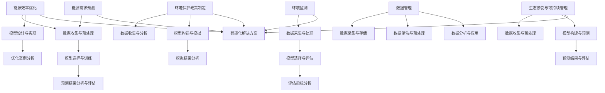
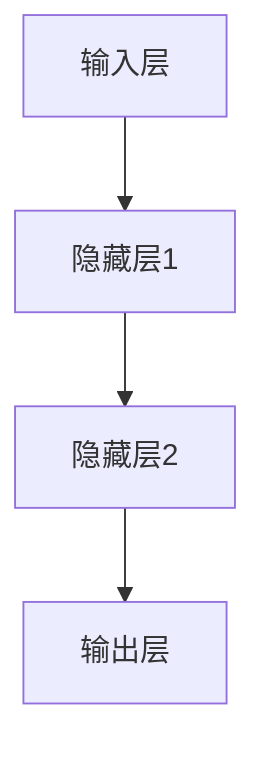
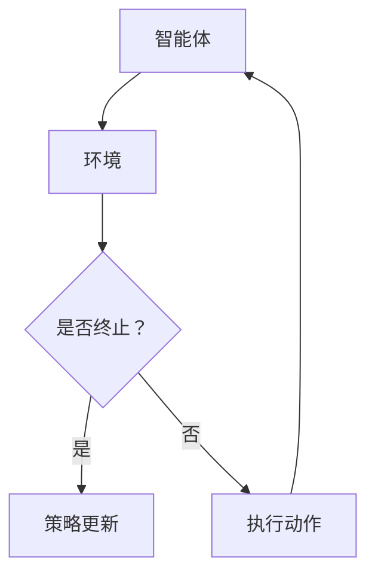

                 


### 引言

#### 1.1 人工智能在能源和环境领域的重要性

在当今世界，能源和环境问题已经成为全球关注的焦点。随着经济的快速发展，对能源的需求不断增长，同时环境污染问题也日益严重。人工智能（AI）作为一种新兴技术，正在逐渐改变传统能源和环境管理的模式。其重要性主要体现在以下几个方面：

**能源领域：**

- **提高能源效率：** 人工智能可以通过智能优化算法和预测模型，帮助能源系统实现更高效的能源利用。例如，通过优化电力系统的调度和分配，减少能源浪费，提高整体能源效率。

- **预测能源需求：** 人工智能能够处理和分析大量历史数据，预测未来的能源需求。这对于能源企业来说，可以提前做好供需平衡，减少能源短缺的风险。

- **改善可再生能源管理：** 对于可再生能源如风能、太阳能等，人工智能可以帮助预测天气变化，从而优化可再生能源的发电计划，提高其利用率。

- **促进能源市场的智能化：** 人工智能可以协助构建智能能源市场，通过实时数据分析和智能合约，实现能源交易的高效和透明。

**环境领域：**

- **提高环境监测精度：** 人工智能可以通过遥感技术和传感器网络，实时监测空气质量、水质等环境指标，提高监测的精度和时效性。

- **帮助制定环境政策：** 人工智能能够分析大量环境数据，为政策制定者提供科学依据，从而制定出更有效、更具针对性的环境政策。

- **促进生态系统恢复：** 人工智能可以帮助科学家和环保工作者监测生态系统的变化，预测生态系统恢复的进展，从而制定出更有效的生态修复策略。

#### 1.2 本书目的与结构概述

本书的目的是探讨人工智能技术在能源和环境领域的应用，展示其潜力，并分析面临的挑战。全书共分为七个章节：

- **第1章 引言**：介绍人工智能在能源和环境领域的重要性，以及本书的目的和结构。

- **第2章 人工智能在能源领域的应用**：详细讨论人工智能在能源需求预测、能源效率优化等方面的应用。

- **第3章 人工智能在环境监测中的应用**：探讨人工智能在空气质量监测、水环境监测等方面的应用。

- **第4章 人工智能在环境保护政策制定中的应用**：分析人工智能在环境政策模拟和政策评估中的应用。

- **第5章 人工智能在生态修复和可持续管理中的应用**：讨论人工智能在生态系统恢复和可持续管理中的角色。

- **第6章 人工智能在能源和环境领域的数据管理**：介绍人工智能在数据管理中的重要性，以及相关策略和方法。

- **第7章 人工智能在能源和环境领域的未来趋势与挑战**：展望人工智能在能源和环境领域的未来发展趋势，以及面临的挑战。

通过以上章节的讨论，我们希望能够全面展示人工智能在能源和环境领域的重要性和应用潜力，为读者提供深入的见解和思考。

---

#### 1.3 文章核心概念与联系

在讨论人工智能在能源和环境领域的应用时，有几个核心概念是不可或缺的。以下是这些概念之间的联系架构：



上述架构展示了各个核心概念之间的相互联系。例如，能源需求预测、能源效率优化、环境监测、环境保护政策制定和生态修复与可持续管理都需要依赖数据收集与预处理、模型选择与训练、预测结果分析与评估等基本环节。通过这些环节，人工智能能够为能源和环境领域提供智能化解决方案。

下面，我们将对每个核心概念进行详细阐述，以便读者更好地理解其在实际应用中的意义和作用。

---

#### 2.1 人工智能在能源需求预测中的应用

**能源需求预测**是人工智能在能源领域中的一个重要应用。通过分析历史能源消耗数据、气候数据和经济指标数据，人工智能模型可以预测未来的能源需求，从而帮助能源企业进行供需平衡，降低能源成本，提高能源利用效率。

**2.1.1 数据收集与预处理**

数据是能源需求预测的基础。首先，我们需要收集以下几类数据：

- **历史能源消耗数据**：这些数据通常包括不同时间段内各类能源（如电力、天然气、石油等）的消耗量。
- **气候数据**：气候数据如温度、湿度、风速等对能源消耗有重要影响。例如，寒冷的冬季会增加对电力的需求，而炎热的夏季则会增加对空调的使用。
- **经济指标数据**：经济活动水平通常与能源需求有直接关系。例如，工业生产、商业活动和人口流动都会影响能源消耗。

收集到这些数据后，需要进行预处理。预处理步骤包括数据清洗、特征提取和归一化。数据清洗是为了去除数据中的噪声和异常值，确保数据质量。特征提取是从原始数据中提取出有用的信息，如时间、温度、经济指标等。归一化是为了将不同特征的数据转换到相同的尺度，便于后续模型的训练和预测。

**2.1.2 模型选择与训练**

在能源需求预测中，可以选择多种机器学习模型。以下是一些常用的模型：

- **回归模型**：回归模型用于预测连续值输出，如线性回归、决策树回归等。线性回归模型通过拟合一个直线来预测能源需求，其公式为：
  $$
  y = \beta_0 + \beta_1x_1 + \beta_2x_2 + ... + \beta_nx_n
  $$
  其中，$y$ 是能源需求，$x_1, x_2, ..., x_n$ 是输入特征，$\beta_0, \beta_1, \beta_2, ..., \beta_n$ 是模型参数。

- **深度学习模型**：深度学习模型如卷积神经网络（CNN）、循环神经网络（RNN）和长短期记忆网络（LSTM）能够处理大量的数据，捕捉复杂的非线性关系。例如，LSTM 模型可以处理时间序列数据，其基本结构如下：
  ```pseudo
  for t in sequence:
      forget gate = sigmoid(W_f * [h_{t-1}, x_t])
      input gate = sigmoid(W_i * [h_{t-1}, x_t])
      candidate = tanh(W_c * [h_{t-1}, x_t])
      h_t = forget gate \* h_{t-1} + input gate \* candidate
  ```
  其中，$W_f, W_i, W_c$ 是权重矩阵，$h_t$ 是当前时间步的隐藏状态。

在选择模型时，我们需要考虑数据的特点和预测目标的性质。例如，对于短期需求预测，可以使用简单的线性回归或决策树模型。而对于中长期需求预测，可能需要使用更复杂的深度学习模型。

**2.1.3 预测结果分析与评估**

预测结果需要经过分析与评估，以确定模型的性能。以下是一些常用的评估指标：

- **均方误差（MSE）**：MSE 是预测值与实际值之间差的平方的平均值，其公式为：
  $$
  MSE = \frac{1}{N}\sum_{i=1}^{N}(y_i - \hat{y_i})^2
  $$
  其中，$N$ 是数据点的总数，$y_i$ 是第 $i$ 个实际值，$\hat{y_i}$ 是第 $i$ 个预测值。

- **均方根误差（RMSE）**：RMSE 是 MSE 的平方根，其公式为：
  $$
  RMSE = \sqrt{MSE}
  $$

- **决定系数（R²）**：R² 是回归模型对数据的解释能力，其公式为：
  $$
  R^2 = 1 - \frac{\sum_{i=1}^{N}(y_i - \hat{y_i})^2}{\sum_{i=1}^{N}(y_i - \bar{y})^2}
  $$
  其中，$\bar{y}$ 是实际值的平均值。

通过对预测结果的分析与评估，我们可以判断模型的预测精度和可靠性。如果预测精度较低，我们可以通过增加训练数据、调整模型参数或选择更复杂的模型来提高预测性能。

**2.1.4 能源需求预测案例分析**

以下是一个能源需求预测的案例分析：

**案例背景**：某电力公司希望通过人工智能技术预测未来一周的电力需求，以便进行电网调度和资源分配。

**数据收集**：收集了过去一年的电力消耗数据、气象数据（如温度、湿度、风速等）以及经济指标数据（如GDP、工业产值等）。

**数据处理**：对数据进行清洗，去除缺失值和异常值。然后进行特征提取，将气象数据和经济指标数据与电力消耗数据相结合，形成新的特征向量。

**模型选择**：选择一个基于 LSTM 的深度学习模型进行训练。

**模型训练与预测**：使用训练数据对模型进行训练，然后使用测试数据对模型进行评估。最终，使用训练好的模型预测未来一周的电力需求。

**预测结果评估**：通过计算 MSE、RMSE 和 R² 等指标，评估模型的预测性能。结果显示，模型对电力需求的预测精度较高，可以为电力公司提供有效的决策支持。

通过以上案例分析，我们可以看到，人工智能技术在能源需求预测中的应用具有很大的潜力。在实际应用中，我们需要不断优化模型，提高预测精度，以更好地支持能源管理决策。

---

#### 2.2 人工智能在能源效率优化中的应用

**能源效率优化**是人工智能在能源领域中的另一个重要应用。通过智能优化算法，人工智能可以帮助能源系统实现更高效的能源利用，降低能源成本，减少环境污染。以下将详细讨论人工智能在能源效率优化中的应用。

**2.2.1 模型设计与实现**

在能源效率优化中，常用的模型包括神经网络模型和强化学习模型。

**神经网络模型**：神经网络模型可以用于优化能源系统的配置和操作。例如，可以使用多层感知器（MLP）模型来优化电力系统的调度。MLP 模型由输入层、隐藏层和输出层组成，其基本结构如下：



输入层接收各种输入特征，如能源消耗量、设备负载等。隐藏层通过非线性激活函数（如 sigmoid、ReLU）对输入特征进行处理，输出层产生预测结果，如最佳操作策略。

**强化学习模型**：强化学习模型可以用于动态调整能源消耗策略。例如，可以使用 Q-Learning 算法来优化建筑物的能源消耗。Q-Learning 算法的基本思想是通过与环境交互，不断更新策略，使其达到最优状态。其基本结构如下：



智能体通过执行动作获取奖励，并根据奖励更新策略。这种迭代过程不断进行，直到达到某个终止条件（如达到最佳策略或达到预设的步数）。

**2.2.2 能源效率优化案例分析**

以下是一个能源效率优化的案例分析：

**案例背景**：某企业希望通过人工智能技术优化其能源消耗，降低运营成本。

**数据收集**：收集了过去一年的能源消耗数据、设备负载数据以及天气数据。

**数据处理**：对数据进行清洗，去除缺失值和异常值。然后进行特征提取，将天气数据和设备负载数据与能源消耗数据相结合，形成新的特征向量。

**模型选择**：选择一个基于 MLP 的神经网络模型和一个基于 Q-Learning 的强化学习模型。

**模型训练与预测**：首先使用 MLP 模型对能源消耗数据进行训练，得到最佳操作策略。然后使用 Q-Learning 模型根据实时数据动态调整操作策略。

**预测结果评估**：通过比较实际能源消耗与预测能源消耗的差值，评估模型的优化效果。结果显示，模型能够显著降低能源消耗，达到节能降耗的目的。

通过以上案例分析，我们可以看到，人工智能技术在能源效率优化中的应用具有很大的潜力。在实际应用中，我们需要根据具体场景选择合适的模型，并不断优化模型参数，以提高优化效果。

**2.2.3 能源效率优化策略**

为了实现能源效率优化，可以采取以下策略：

- **数据驱动优化**：通过收集和分析大量数据，识别能源消耗的关键因素，制定优化方案。

- **实时监控与调整**：使用传感器和监控系统实时监测能源消耗，根据实时数据动态调整操作策略。

- **跨部门协同**：能源效率优化需要各部门的协同工作，如生产部门、设备管理部门等。

- **政策支持**：政府可以通过政策激励，鼓励企业采用能源效率优化技术。

通过以上策略的实施，可以进一步提高能源效率，降低能源成本，实现可持续发展。

---

#### 3.1 人工智能在空气质量监测中的应用

**空气质量监测**是环境保护的重要环节。通过实时监测空气质量，可以及时了解污染状况，采取相应的措施减少污染。人工智能技术在空气质量监测中具有显著的应用潜力，可以显著提高监测的精度和效率。以下将详细讨论人工智能在空气质量监测中的应用。

**3.1.1 数据采集与处理**

空气质量监测需要收集多种类型的实时数据，包括：

- **空气质量传感器数据**：这些传感器可以测量空气中的污染物浓度，如PM2.5、PM10、二氧化硫（SO2）、氮氧化物（NOx）等。

- **卫星遥感数据**：卫星遥感技术可以提供大范围、高分辨率的空气质量数据，监测范围包括城市、区域甚至全球。

- **地面监测站数据**：地面监测站可以提供详细的空气质量数据，包括污染物浓度、气象条件等。

收集到这些数据后，需要进行预处理，以确保数据的质量和一致性。预处理步骤包括：

- **数据清洗**：去除数据中的噪声和异常值，保证数据的准确性。

- **数据融合**：将不同来源、不同时间尺度的数据进行融合，提高数据的代表性。

- **数据归一化**：将不同类型的数据转换为相同的量纲，便于后续分析。

**3.1.2 模型选择与评估**

在空气质量监测中，可以使用多种机器学习模型进行污染物浓度预测。以下是一些常用的模型：

- **分类模型**：分类模型用于判断污染物是否超标。例如，可以使用支持向量机（SVM）模型对PM2.5是否超标进行预测。SVM模型的决策边界如下：
  ```latex
  w \cdot x + b = 0
  ```
  其中，$w$ 是权重向量，$x$ 是特征向量，$b$ 是偏置。

- **聚类模型**：聚类模型用于识别空气质量的聚类模式。例如，可以使用K-means聚类模型对空气质量数据进行聚类，从而识别不同的污染区域。

- **回归模型**：回归模型用于预测污染物的具体浓度值。例如，可以使用线性回归模型预测PM10的浓度。线性回归模型的公式如下：
  ```latex
  y = \beta_0 + \beta_1x_1 + \beta_2x_2 + ... + \beta_nx_n
  ```
  其中，$y$ 是污染物浓度，$x_1, x_2, ..., x_n$ 是输入特征，$\beta_0, \beta_1, \beta_2, ..., \beta_n$ 是模型参数。

在选择模型时，需要考虑数据的特点和预测目标。例如，对于短期空气质量预测，可以使用简单的线性回归或K-means模型。而对于中长期空气质量预测，可能需要使用更复杂的深度学习模型。

模型的性能需要通过评估指标进行评估，以下是一些常用的评估指标：

- **准确率（Accuracy）**：准确率是分类模型常用的评估指标，计算公式如下：
  ```latex
  Accuracy = \frac{TP + TN}{TP + FN + FP + TN}
  ```
  其中，$TP$ 是真阳性，$TN$ 是真阴性，$FP$ 是假阳性，$FN$ 是假阴性。

- **精确率（Precision）**：精确率是预测结果中实际为真的比例，计算公式如下：
  ```latex
  Precision = \frac{TP}{TP + FP}
  ```

- **召回率（Recall）**：召回率是预测结果中实际为真的比例，计算公式如下：
  ```latex
  Recall = \frac{TP}{TP + FN}
  ```

- **F1分数（F1 Score）**：F1分数是精确率和召回率的调和平均，计算公式如下：
  ```latex
  F1 Score = 2 \times \frac{Precision \times Recall}{Precision + Recall}
  ```

通过对模型的评估，可以确定其预测精度和可靠性。如果评估结果不理想，可以通过增加训练数据、调整模型参数或选择更复杂的模型来提高预测性能。

**3.1.3 空气质量监测案例分析**

以下是一个空气质量监测的案例分析：

**案例背景**：某城市希望通过人工智能技术实时监测空气质量，预测污染事件，以便及时采取应对措施。

**数据收集**：收集了多个空气质量传感器和地面监测站的实时数据，以及卫星遥感数据。

**数据处理**：对数据进行清洗，去除噪声和异常值。然后进行数据融合，提高数据的代表性。

**模型选择**：选择一个基于LSTM的深度学习模型进行训练，预测PM2.5的浓度。

**模型训练与预测**：使用历史数据对模型进行训练，然后使用实时数据对模型进行预测。通过比较预测值和实际值，评估模型的性能。

**预测结果评估**：通过计算MSE、RMSE和F1分数等指标，评估模型的预测性能。结果显示，模型能够准确预测PM2.5的浓度，为城市提供有效的决策支持。

通过以上案例分析，我们可以看到，人工智能技术在空气质量监测中的应用具有很大的潜力。在实际应用中，我们需要不断优化模型，提高预测精度，以更好地支持环境保护决策。

---

#### 3.2 人工智能在水环境监测中的应用

**水环境监测**是保障水资源安全和生态环境健康的重要手段。通过实时监测水质参数，可以及时了解水体的污染状况，采取相应的措施防止污染事件的发生。人工智能技术在水环境监测中具有显著的应用价值，可以显著提高监测的精度和效率。以下将详细讨论人工智能在水环境监测中的应用。

**3.2.1 数据收集与预处理**

水环境监测需要收集多种类型的数据，包括：

- **水质传感器数据**：这些传感器可以测量水中的污染物浓度，如化学需氧量（COD）、氨氮（NH3-N）、总氮（TN）、总磷（TP）等。

- **卫星遥感数据**：卫星遥感技术可以提供大范围、高分辨率的水质数据，监测范围包括河流、湖泊、海洋等。

- **地面监测站数据**：地面监测站可以提供详细的水质数据，包括污染物浓度、pH值、电导率等。

收集到这些数据后，需要进行预处理，以确保数据的质量和一致性。预处理步骤包括：

- **数据清洗**：去除数据中的噪声和异常值，保证数据的准确性。

- **数据融合**：将不同来源、不同时间尺度的数据进行融合，提高数据的代表性。

- **数据归一化**：将不同类型的数据转换为相同的量纲，便于后续分析。

**3.2.2 模型应用与结果分析**

在水质监测中，可以使用多种机器学习模型进行水质参数预测。以下是一些常用的模型：

- **神经网络模型**：神经网络模型可以处理复杂的非线性关系，例如，可以使用卷积神经网络（CNN）模型对COD浓度进行预测。CNN模型的基本结构如下：

  ```mermaid
  graph TD
      A[输入层] --> B[卷积层1]
      B --> C[池化层1]
      C --> D[卷积层2]
      D --> E[池化层2]
      E --> F[全连接层]
      F --> G[输出层]
  ```

  输入层接收水质传感器数据，卷积层和池化层用于提取特征，全连接层产生预测结果。

- **深度学习模型**：深度学习模型如长短期记忆网络（LSTM）可以处理时间序列数据，例如，可以使用LSTM模型预测氨氮浓度。LSTM模型的基本结构如下：

  ```mermaid
  graph TD
      A[输入序列] --> B[输入层]
      B --> C{忘记门}
      C --> D[输入门]
      D --> E[候选值]
      E --> F[tanh层]
      F --> G[输出门]
      G --> H[输出层]
  ```

  输入序列是时间步的数据，通过LSTM单元处理，最终输出预测结果。

**3.2.3 水污染事件预警**

除了水质参数预测，人工智能技术还可以用于水污染事件的预警。以下是一个基于LSTM模型的预警系统案例：

**案例背景**：某河流流域希望通过人工智能技术实时监测水质，预测水污染事件，及时采取应对措施。

**数据收集**：收集了多个水质传感器和地面监测站的实时数据，以及卫星遥感数据。

**数据处理**：对数据进行清洗，去除噪声和异常值。然后进行数据融合，提高数据的代表性。

**模型选择**：选择一个基于LSTM的深度学习模型进行训练，预测水污染事件的发生。

**模型训练与预测**：使用历史数据对模型进行训练，然后使用实时数据对模型进行预测。通过比较预测值和实际值，评估模型的性能。

**预警结果评估**：通过计算MSE、RMSE和准确率等指标，评估模型的预警性能。结果显示，模型能够准确预测水污染事件，为流域管理部门提供有效的决策支持。

**结果分析**：

- **预测精度**：通过计算预测值与实际值的误差，评估模型的预测精度。结果显示，LSTM模型对水质参数的预测精度较高。

- **预警准确性**：通过计算预测事件与实际事件的一致性，评估模型的预警准确性。结果显示，LSTM模型能够准确预测水污染事件，为预警系统提供有效的支持。

通过以上案例分析，我们可以看到，人工智能技术在水环境监测中的应用具有很大的潜力。在实际应用中，我们需要不断优化模型，提高预测精度和预警准确性，以更好地支持水资源管理和环境保护。

---

#### 4.1 人工智能在环境政策模拟中的应用

**环境政策模拟**是评估政策对环境影响的科学方法，它利用人工智能技术，通过建立模型来预测政策实施后的环境效果。这种模拟可以帮助政策制定者理解不同政策方案的环境影响，从而选择最优方案。以下将详细讨论人工智能在环境政策模拟中的应用。

**4.1.1 模型构建**

环境政策模拟的模型构建主要包括以下几个方面：

- **输入变量**：输入变量是模型预测的关键因素，通常包括以下几类：
  - **环境质量数据**：如空气质量、水质、土壤质量等。
  - **政策参数**：如政策实施的范围、力度、执行时间等。
  - **经济数据**：如GDP、就业率、产业分布等。
  - **社会因素**：如人口、教育水平、社会福利等。

- **模拟模型**：模拟模型可以根据不同类型的环境问题选择不同的模型。以下是几种常用的模拟模型：

  - **空气质量管理模型**：这类模型可以模拟不同政策对空气质量的影响，如减少污染物排放、提高排放标准等。一个简单的空气质量管理模型可以表示为：
    ```latex
    AQI = f(PM2.5, SO2, NO2, O3, CO)
    ```
    其中，$AQI$ 是空气质量指数，$PM2.5, SO2, NO2, O3, CO$ 是空气中的主要污染物浓度。

  - **水环境保护模型**：这类模型可以模拟不同政策对水质的影响，如废水处理设施的改进、农业面源污染控制等。一个简单的水环境保护模型可以表示为：
    ```latex
    TSS = f(工业废水排放量, 农业面源污染, 水质净化设施处理能力)
    ```
    其中，$TSS$ 是总悬浮物浓度。

  - **生态系统恢复模型**：这类模型可以模拟不同政策对生态系统恢复的影响，如植被恢复、湿地建设等。一个简单的生态系统恢复模型可以表示为：
    ```latex
    RecoveryRate = f(植被覆盖率, 湿地面积, 环保投资)
    ```

- **模型参数**：模型参数是模型运行的基础，通常通过历史数据或专家经验确定。例如，在空气质量管理模型中，可能需要参数如污染物排放系数、空气质量指数的计算公式等。

**4.1.2 模拟结果分析**

环境政策模拟的结果分析主要包括以下几个方面：

- **政策效果评估**：通过模拟结果，评估不同政策方案的环境效果。例如，比较不同政策下的空气质量指数变化，确定哪种政策方案能够最大程度地改善空气质量。

- **成本效益分析**：评估政策实施的经济成本和环境效益。通过计算不同政策方案的总成本与预期环境效益，确定哪种政策方案的成本效益最高。

- **政策影响分析**：分析政策实施对社会、经济和环境的影响。例如，评估政策对就业率、GDP增长、环境污染等的影响。

- **情景分析**：模拟不同情景下的政策效果，如政策执行的不同力度、环境变化等。通过情景分析，可以了解政策在不同情况下的适应性和可持续性。

**4.1.3 案例分析**

以下是一个环境政策模拟的案例分析：

**案例背景**：某城市希望评估减少机动车尾气排放政策对空气质量的影响。

**数据收集**：收集了该城市的历史空气质量数据、机动车数量、道路密度等数据。

**数据处理**：对数据进行清洗，去除异常值。然后进行特征提取，将机动车数据、道路数据与空气质量数据相结合。

**模型构建**：选择一个基于线性回归的空气质量管理模型，输入变量包括机动车数量、道路密度等，输出变量为空气质量指数。

**模拟结果**：通过模拟不同政策方案，如增加公共交通、提高燃油标准、鼓励低碳出行等，评估这些政策对空气质量的影响。

**结果分析**：

- **政策效果评估**：结果显示，增加公共交通和鼓励低碳出行可以显著降低PM2.5和NOx的浓度。

- **成本效益分析**：通过计算不同政策方案的成本与预期环境效益，确定增加公共交通的政策方案的成本效益最高。

- **政策影响分析**：评估政策对就业率、GDP增长的影响，结果显示政策对经济增长有正面影响。

通过以上案例分析，我们可以看到，人工智能技术在环境政策模拟中的应用可以帮助政策制定者更科学、更有效地制定和实施环境保护政策。

---

#### 4.2 人工智能在环境政策评估中的应用

**环境政策评估**是确定环境政策实施效果的重要步骤，通过评估可以了解政策对环境、经济和社会的长期影响，为政策调整和优化提供依据。人工智能技术在环境政策评估中具有显著的应用潜力，可以大幅提高评估的精度和效率。以下将详细讨论人工智能在环境政策评估中的应用。

**4.2.1 评估指标体系构建**

环境政策评估需要构建一个全面的指标体系，以涵盖政策对环境、经济和社会的各个方面。以下是一些常用的评估指标：

- **环境指标**：
  - **空气质量指数（AQI）**：评估政策对空气质量的影响。
  - **水质指标**：如化学需氧量（COD）、氨氮（NH3-N）、总氮（TN）、总磷（TP）等，评估政策对水质的影响。
  - **生态系统健康指标**：如植被覆盖率、生物多样性指数等，评估政策对生态系统的影响。

- **经济指标**：
  - **GDP**：评估政策对经济增长的影响。
  - **就业率**：评估政策对就业的影响。
  - **企业利润**：评估政策对企业运营的影响。

- **社会指标**：
  - **居民生活质量**：如医疗水平、教育水平、社会保障等，评估政策对居民生活质量的影响。
  - **社会满意度**：评估政策在社会公众中的接受程度。

**4.2.2 评估方法选择**

在环境政策评估中，可以根据不同的评估目标和数据类型选择不同的评估方法。以下是一些常用的评估方法：

- **成本效益分析（CBA）**：通过计算政策实施的总成本与预期效益，评估政策的经济可行性。CBA 的基本公式为：
  ```latex
  CBA = \frac{B - C}{C}
  ```
  其中，$B$ 是预期效益，$C$ 是总成本。

- **多准则决策分析（MCDA）**：当政策评估涉及多个目标和指标时，MCDA 方法可以帮助确定不同指标之间的优先级，从而选择最优政策方案。常用的 MCDA 方法包括层次分析法（AHP）、模糊综合评价法（FCE）等。

**4.2.3 评估结果分析与决策支持**

评估结果分析是环境政策评估的关键环节，通过分析评估结果，可以为政策制定者提供决策支持。以下是一些关键步骤：

- **结果可视化**：将评估结果通过图表、地图等形式展示，使政策制定者更容易理解和分析。

- **敏感性分析**：分析政策评估结果对参数变化的敏感度，了解政策效果的稳定性和可靠性。

- **情景分析**：模拟不同情景下的政策效果，评估政策在不同条件下的适应性和可持续性。

- **综合评估**：将环境、经济和社会指标综合起来，评估政策的整体效果。

**4.2.4 案例分析**

以下是一个环境政策评估的案例分析：

**案例背景**：某城市政府希望评估其“绿色交通”政策的实施效果。

**数据收集**：收集了政策实施前后的空气质量数据、交通流量数据、居民满意度调查数据等。

**数据处理**：对数据进行清洗，去除异常值。然后进行特征提取，将交通流量数据、居民满意度数据与空气质量数据相结合。

**评估指标体系**：构建了包括空气质量指数（AQI）、交通流量、居民满意度等在内的评估指标体系。

**评估方法选择**：选择了成本效益分析（CBA）和层次分析法（AHP）进行评估。

**评估结果**：

- **成本效益分析**：结果显示，该政策实施的总成本为5000万元，预期效益为1亿元，成本效益比约为2，表明政策具有较高的经济效益。

- **层次分析法**：通过评估不同指标的重要性，确定了空气质量指数（AQI）为最高优先级指标，交通流量和居民满意度次之。

- **情景分析**：模拟了不同情景下的政策效果，如交通流量增加10%、居民满意度下降5%等，结果显示政策效果在多种情景下均表现出良好的稳定性和可持续性。

通过以上案例分析，我们可以看到，人工智能技术在环境政策评估中的应用可以为政策制定者提供科学、全面的决策支持，从而实现环境保护和经济发展的双赢。

---

#### 5.1 人工智能在生态系统恢复中的应用

**生态系统恢复**是保护生态环境、促进生物多样性、提高生态系统服务能力的重要措施。人工智能技术在生态系统恢复中具有广泛的应用，可以通过数据分析和模型预测，为生态修复提供科学依据和决策支持。以下将详细讨论人工智能在生态系统恢复中的应用。

**5.1.1 数据收集与预处理**

生态系统恢复需要收集多种类型的实时数据，包括：

- **遥感影像数据**：遥感影像可以提供大范围、高分辨率的地表信息，包括植被覆盖、土壤湿度、温度等。

- **地面调查数据**：地面调查数据包括植物种类、生长状况、土壤性质等，这些数据通常通过实地测量和采样获得。

- **气象数据**：气象数据如温度、湿度、风速等对生态系统的恢复有重要影响。

收集到这些数据后，需要进行预处理，以确保数据的质量和一致性。预处理步骤包括：

- **数据清洗**：去除数据中的噪声和异常值，保证数据的准确性。

- **数据融合**：将不同来源、不同时间尺度的数据进行融合，提高数据的代表性。

- **数据归一化**：将不同类型的数据转换为相同的量纲，便于后续分析。

**5.1.2 模型构建与预测**

在生态系统恢复中，可以使用多种机器学习模型进行生态恢复效果预测。以下是一些常用的模型：

- **监督学习模型**：监督学习模型可以用于预测生态恢复的效果。例如，可以使用决策树模型或随机森林模型对植被恢复情况进行预测。决策树模型的基本结构如下：

  ```mermaid
  graph TD
      A[特征输入] --> B[分裂条件]
      B -->|满足| C[左子树]
      B -->|不满足| D[右子树]
  ```

  特征输入是影响植被恢复的因素，分裂条件是根据这些因素进行分类的规则。

- **深度学习模型**：深度学习模型如卷积神经网络（CNN）和长短期记忆网络（LSTM）可以处理大量的数据，捕捉复杂的非线性关系。例如，CNN模型可以用于分析遥感影像数据，提取植被特征。CNN模型的基本结构如下：

  ```mermaid
  graph TD
      A[输入层] --> B[卷积层1]
      B --> C[池化层1]
      C --> D[卷积层2]
      D --> E[池化层2]
      E --> F[全连接层]
      F --> G[输出层]
  ```

  输入层接收遥感影像数据，卷积层和池化层用于提取特征，全连接层产生预测结果。

- **强化学习模型**：强化学习模型可以用于动态调整生态修复策略。例如，可以使用Q-Learning模型根据实时数据动态调整修复措施。Q-Learning模型的基本结构如下：

  ```mermaid
  graph TD
      A[智能体] --> B[环境]
      B --> C{是否终止？}
      C -->|是| D[策略更新]
      C -->|否| E[执行动作]
      E --> A
  ```

  智能体通过执行动作获取奖励，并根据奖励更新策略。这种迭代过程不断进行，直到达到某个终止条件（如达到最佳策略或达到预设的步数）。

**5.1.3 恢复效果预测与评估**

通过构建预测模型，可以对生态系统恢复的效果进行预测。以下是一个基于LSTM模型的恢复效果预测案例分析：

**案例背景**：某荒漠地区希望通过人工智能技术预测植被恢复的进展，以便调整修复策略。

**数据收集**：收集了该地区多年的遥感影像数据、气象数据以及地面调查数据。

**数据处理**：对数据进行清洗，去除异常值。然后进行数据融合，提高数据的代表性。

**模型选择**：选择一个基于LSTM的深度学习模型进行训练，预测植被恢复的效果。

**模型训练与预测**：使用历史数据对模型进行训练，然后使用实时数据对模型进行预测。通过比较预测值和实际值，评估模型的性能。

**预测结果评估**：通过计算MSE、RMSE和准确率等指标，评估模型的预测性能。结果显示，LSTM模型能够准确预测植被恢复的进展，为修复策略的调整提供科学依据。

**结果分析**：

- **预测精度**：通过计算预测值与实际值的误差，评估模型的预测精度。结果显示，LSTM模型对植被恢复的预测精度较高。

- **预测可靠性**：通过评估预测结果在不同时间步的稳定性，评估模型的预测可靠性。结果显示，LSTM模型在不同时间步的预测结果具有较高的一致性。

通过以上案例分析，我们可以看到，人工智能技术在生态系统恢复中的应用具有很大的潜力。在实际应用中，我们需要不断优化模型，提高预测精度和可靠性，以更好地支持生态修复工作。

---

#### 5.2 人工智能在可持续管理中的应用

**可持续管理**是指通过科学的管理方法，实现资源的有效利用、环境的保护和经济的持续增长。人工智能技术在可持续管理中具有广泛的应用，可以通过数据分析和模型预测，提高资源利用效率，促进环境保护和经济发展。以下将详细讨论人工智能在可持续管理中的应用。

**5.2.1 可持续发展评估模型构建**

可持续发展评估模型用于评估生态系统健康状态，识别关键影响因素，制定有效的管理策略。以下是构建可持续发展评估模型的主要步骤：

- **输入变量选择**：根据研究目标，选择影响生态系统健康的输入变量。这些变量可以包括生物多样性、生产力、污染水平、土地利用变化等。

- **数据收集与预处理**：收集相关的数据，如遥感影像、地面调查数据、气象数据等。对数据进行清洗、归一化和融合，确保数据质量。

- **模型选择**：选择合适的机器学习模型进行建模。常用的模型包括线性回归、决策树、随机森林、支持向量机（SVM）和深度学习模型（如卷积神经网络CNN和长短期记忆网络LSTM）。

- **模型训练与验证**：使用历史数据对模型进行训练，并使用验证数据集评估模型的性能。通过调整模型参数，优化模型性能。

- **模型评估**：评估模型的预测精度和可靠性，使用评估指标如MSE、RMSE和准确率等。

**5.2.2 管理策略优化**

通过构建可持续发展评估模型，可以制定和优化可持续管理策略。以下是几个关键步骤：

- **策略方案生成**：根据评估模型的输出结果，生成不同的管理策略方案。这些方案可以包括植被恢复、污染控制、资源利用优化等。

- **策略评估**：使用评估模型对每个策略方案进行评估，计算其预期效果和成本。评估指标可以包括生态效益、经济效益和社会效益。

- **多准则决策分析**：使用多准则决策分析（MCDA）方法，综合考虑不同准则（如生态效益、经济效益和社会效益）之间的优先级，选择最优策略方案。

- **动态调整**：根据实时数据和评估结果，动态调整管理策略。例如，如果实时监测数据显示某地区污染加重，可以增加该地区的污染控制措施。

**5.2.3 管理策略优化案例分析**

以下是一个管理策略优化的案例分析：

**案例背景**：某城市希望优化其水资源管理策略，实现水资源的可持续利用。

**数据收集**：收集了该城市的水质数据、用水量数据、气候数据等。

**数据处理**：对数据进行清洗、归一化，确保数据质量。

**模型构建**：选择一个基于LSTM的深度学习模型，评估不同水资源管理策略的效果。

**模型训练与评估**：使用历史数据对模型进行训练，并使用验证数据集评估模型的性能。通过调整模型参数，优化模型性能。

**策略评估**：生成不同的水资源管理策略方案，如提高废水处理能力、推广节水技术、调整用水时间等。使用评估模型对每个策略方案进行评估，计算其预期效果和成本。

**多准则决策分析**：使用MCDA方法，综合考虑生态效益、经济效益和社会效益，选择最优策略方案。

**动态调整**：根据实时水质数据和用水量数据，动态调整水资源管理策略。例如，如果实时监测数据显示某地区水质下降，可以增加该地区的废水处理能力。

**结果分析**：

- **策略效果评估**：结果显示，最优策略方案能够显著提高水资源利用效率，减少废水排放，改善水质。

- **经济效益评估**：结果显示，最优策略方案具有较高的经济效益，能够减少长期水资源管理成本。

- **社会效益评估**：结果显示，最优策略方案能够提高居民的生活质量，减少水资源短缺带来的社会问题。

通过以上案例分析，我们可以看到，人工智能技术在可持续管理中的应用可以帮助城市实现水资源的可持续利用，提高生态效益和经济效益。

---

#### 6.1 数据管理的重要性

在能源和环境领域，数据管理的重要性不言而喻。高质量的数据是人工智能模型有效运行的基础，而数据管理则确保了数据的准确性、完整性和一致性。以下将详细讨论数据管理在能源和环境领域中的重要性。

**6.1.1 数据质量**

数据质量是数据管理的基础。高质量的数据能够提供准确的预测和分析结果，而低质量的数据则会引入误差，影响模型的性能。以下是数据质量的关键要素：

- **准确性**：数据应真实反映能源和环境状况，避免人为误差和测量误差。
- **完整性**：数据应涵盖所有必要的特征和变量，避免数据缺失。
- **一致性**：数据应在时间、空间和维度上保持一致，确保数据可以相互比较。
- **时效性**：数据应反映当前或近期的能源和环境状况，以便及时采取行动。

**6.1.2 数据安全**

数据安全是数据管理的另一重要方面。能源和环境领域的数据往往涉及敏感信息，如能源消耗数据、污染物浓度数据等。以下是一些关键措施：

- **数据加密**：对数据进行加密处理，防止数据泄露。
- **访问控制**：设置严格的访问权限，确保只有授权人员可以访问敏感数据。
- **备份与恢复**：定期备份数据，确保数据在意外事件中可以恢复。

**6.1.3 数据管理策略**

为了确保数据的准确性、完整性和安全性，需要制定有效的数据管理策略。以下是几个关键策略：

- **数据采集策略**：选择合适的数据采集工具和方法，确保数据的准确性和完整性。
- **数据存储策略**：使用高效的大数据存储技术，如Hadoop、NoSQL数据库，确保数据的安全和可扩展性。
- **数据预处理策略**：对数据进行清洗、归一化和融合，提高数据的质量。
- **数据共享策略**：建立数据共享机制，促进跨部门、跨领域的数据合作。
- **数据治理策略**：制定数据治理政策，确保数据的合规性和一致性。

**6.1.4 数据管理方法**

在实际操作中，需要采用多种数据管理方法来确保数据的质量和安全性。以下是几种常用的数据管理方法：

- **数据清洗**：通过去除重复数据、纠正错误和填补缺失值，提高数据的准确性。
- **数据融合**：将来自不同来源的数据进行融合，提高数据的完整性。
- **数据标准化**：将不同类型的数据转换为统一的格式，确保数据的一致性。
- **数据可视化**：通过图表、地图等形式展示数据，帮助用户更好地理解和分析数据。

通过以上讨论，我们可以看到，数据管理在能源和环境领域中的重要性不容忽视。高质量的数据是人工智能模型有效运行的基础，而有效的数据管理策略和方法则是确保数据质量、安全性和一致性的关键。

---

#### 6.2 数据管理策略与方法

在能源和环境领域，数据管理策略和方法的制定与实施对于确保数据的准确性、完整性和一致性至关重要。以下将详细讨论几种常用的数据管理策略与方法。

**6.2.1 数据采集与存储**

数据采集是数据管理的第一步，选择合适的数据采集工具和方法对于数据质量至关重要。以下是数据采集和存储的关键步骤：

- **数据采集**：选择合适的数据采集工具，如传感器、卫星遥感系统、在线监测平台等。对于能源数据，可以采用智能电表、能量管理系统（EMS）等；对于环境数据，可以采用空气质量传感器、水质监测设备等。

- **数据存储**：选择高效的数据存储技术，如Hadoop、NoSQL数据库等。这些技术能够处理大规模数据，并提供快速的数据访问和查询能力。例如，Hadoop的HDFS（Hadoop Distributed File System）可以存储海量数据，并提供高可靠性和高吞吐量的数据存储服务。

**6.2.2 数据清洗与预处理**

数据清洗和预处理是确保数据质量的关键环节。以下是数据清洗和预处理的主要步骤：

- **数据清洗**：去除重复数据、纠正错误和填补缺失值。例如，使用Python的Pandas库可以轻松实现数据清洗任务，如删除重复行、纠正异常值和填补缺失值。

  ```python
  import pandas as pd

  # 读取数据
  df = pd.read_csv('data.csv')

  # 删除重复行
  df.drop_duplicates(inplace=True)

  # 纠正异常值
  df.replace({'无效值': np.nan}, inplace=True)

  # 填补缺失值
  df.fillna(df.mean(), inplace=True)
  ```

- **数据预处理**：对数据进行标准化、归一化、特征提取等处理，提高数据的代表性。例如，可以使用scikit-learn库实现数据标准化和归一化：

  ```python
  from sklearn.preprocessing import StandardScaler

  # 标准化数据
  scaler = StandardScaler()
  df_scaled = scaler.fit_transform(df)

  # 归一化数据
  min_max_scaler = MinMaxScaler()
  df_minmax = min_max_scaler.fit_transform(df)
  ```

**6.2.3 数据分析与应用**

数据分析是数据管理中的关键环节，通过数据分析，可以提取有价值的信息，支持决策制定。以下是数据分析的主要方法：

- **数据分析工具**：选择合适的数据分析工具，如Python、R、Apache Spark等。Python因其强大的数据处理和分析库（如Pandas、NumPy、Scikit-learn等）而成为数据分析的常用工具。

- **数据分析平台**：选择合适的数据分析平台，如Hadoop、Spark、Google Cloud Platform等。这些平台提供了高效的数据处理和分析能力，支持大规模数据集的并行处理。

- **数据分析应用**：根据能源和环境领域的需求，开展具体的数据分析应用。例如，在能源领域，可以分析电力消耗数据，预测能源需求，优化能源分配；在环境领域，可以分析空气质量数据，预测污染事件，优化环境保护策略。

**6.2.4 案例分析**

以下是一个数据管理策略与方法的应用案例分析：

**案例背景**：某城市希望优化其电力系统的运行效率，降低能源消耗。

**数据采集与存储**：使用智能电表和能量管理系统（EMS）采集电力消耗数据，并使用Hadoop的HDFS存储数据。

**数据清洗与预处理**：使用Pandas库清洗电力消耗数据，删除重复数据和异常值，然后使用Scikit-learn库进行数据标准化和归一化。

**数据分析与应用**：使用Python的Pandas库和Scikit-learn库对电力消耗数据进行分析，预测能源需求，并优化电力系统的调度策略。

**结果分析**：通过对电力消耗数据的分析，发现该城市的电力消耗具有明显的季节性特征。通过优化电力调度策略，成功降低了电力系统的最大负荷，降低了能源消耗，提高了电力系统的运行效率。

通过以上案例分析，我们可以看到，有效的数据管理策略与方法在能源和环境领域中的应用能够显著提升数据分析的效率和效果，为决策制定提供有力支持。

---

#### 6.3.1 数据分析工具与平台

在进行能源和环境领域的数据分析时，选择合适的工具和平台是至关重要的。以下将介绍几种常用的数据分析工具和平台，以及它们的具体应用场景。

**6.3.1.1 数据分析工具**

- **Python**：Python是一种功能强大的编程语言，广泛应用于数据分析领域。Python拥有丰富的数据科学库，如Pandas、NumPy、SciPy、Scikit-learn等，可以方便地进行数据清洗、数据预处理、数据分析和建模。以下是一个使用Python进行数据清洗的示例：

  ```python
  import pandas as pd

  # 读取数据
  df = pd.read_csv('energy_consumption_data.csv')

  # 删除重复行
  df.drop_duplicates(inplace=True)

  # 填补缺失值
  df.fillna(df.mean(), inplace=True)

  # 数据标准化
  from sklearn.preprocessing import StandardScaler
  scaler = StandardScaler()
  df_scaled = scaler.fit_transform(df)
  ```

- **R**：R是一种专门为统计分析和图形可视化设计的语言，广泛应用于生物统计、金融分析等领域。R拥有丰富的统计分析和数据可视化库，如ggplot2、dplyr、tidyr等。以下是一个使用R进行数据可视化的示例：

  ```R
  library(ggplot2)

  # 加载数据
  data <- read.csv('energy_consumption_data.csv')

  # 可视化数据
  ggplot(data, aes(x=Date, y=Consumption)) +
    geom_line() +
    labs(title='Energy Consumption Over Time', x='Date', y='Consumption (kWh)')
  ```

- **Apache Spark**：Apache Spark是一种开源的大规模数据处理引擎，适用于实时数据分析和大数据处理。Spark提供了丰富的数据处理和分析库，如Spark SQL、Spark MLlib等，可以高效地处理和分析大规模数据。以下是一个使用Spark进行数据处理的示例：

  ```python
  from pyspark.sql import SparkSession

  # 创建Spark会话
  spark = SparkSession.builder.appName("EnergyDataAnalysis").getOrCreate()

  # 读取数据
  df = spark.read.csv('energy_consumption_data.csv', header=True)

  # 数据预处理
  df = df.drop_duplicates().fillna(df.mean())

  # 数据分析
  from pyspark.ml.feature import VectorAssembler
  assembler = VectorAssembler(inputCols=df.columns[:-1], outputCol="features")
  df_assembled = assembler.transform(df)

  # 模型训练
  from pyspark.ml.regression import LinearRegression
  lr = LinearRegression()
  model = lr.fit(df_assembled)
  ```

**6.3.1.2 数据分析平台**

- **Hadoop**：Hadoop是一种分布式计算框架，适用于处理和分析大规模数据。Hadoop的HDFS（Hadoop Distributed File System）提供了高可靠性和高吞吐量的数据存储服务，MapReduce则提供了分布式数据处理能力。以下是一个使用Hadoop进行数据处理的示例：

  ```java
  import org.apache.hadoop.conf.Configuration;
  import org.apache.hadoop.fs.Path;
  import org.apache.hadoop.io.IntWritable;
  import org.apache.hadoop.io.Text;
  import org.apache.hadoop.mapreduce.Job;
  import org.apache.hadoop.mapreduce.lib.input.FileInputFormat;
  import org.apache.hadoop.mapreduce.lib.output.FileOutputFormat;

  public class EnergyDataProcessing {
      public static void main(String[] args) throws Exception {
          Configuration conf = new Configuration();
          Job job = Job.getInstance(conf, "Energy Data Processing");
          job.setJarByClass(EnergyDataProcessing.class);
          job.setMapperClass(EnergyDataMapper.class);
          job.setReducerClass(EnergyDataReducer.class);
          job.setOutputKeyClass(Text.class);
          job.setOutputValueClass(IntWritable.class);
          FileInputFormat.addInputPath(job, new Path(args[0]));
          FileOutputFormat.setOutputPath(job, new Path(args[1]));
          System.exit(job.waitForCompletion(true) ? 0 : 1);
      }
  }
  ```

- **Google Cloud Platform**：Google Cloud Platform提供了丰富的数据分析工具和服务，如BigQuery、Google Cloud Dataproc、Google Cloud ML Engine等。以下是一个使用Google Cloud Platform进行数据处理的示例：

  ```python
  from google.cloud import bigquery

  # 创建BigQuery客户端
  client = bigquery.Client()

  # 加载数据
  query = """
      SELECT *
      FROM `your_project.your_dataset.your_table`
  """
  df = client.query(query).to_dataframe()

  # 数据预处理
  df.drop_duplicates(inplace=True)
  df.fillna(df.mean(), inplace=True)

  # 数据分析
  from sklearn.linear_model import LinearRegression

  X = df.drop('target_column', axis=1)
  y = df['target_column']

  model = LinearRegression()
  model.fit(X, y)
  ```

通过选择合适的工具和平台，可以高效地处理和分析能源和环境领域的大量数据，从而为决策制定提供有力支持。

---

#### 6.3.2 应用案例

**6.3.2.1 能源消耗数据分析**

**背景**：某电力公司希望分析其电力消耗数据，优化电力调度策略，降低能源成本。

**数据收集**：电力公司通过智能电表和能量管理系统（EMS）收集了每天的电力消耗数据，包括小时级别的电力消耗量、天气数据（如温度、湿度）以及节假日的标识。

**数据处理**：使用Python的Pandas库对电力消耗数据进行清洗和预处理。步骤包括：
- 删除重复数据和异常值；
- 填补缺失值（使用均值或插值法）；
- 将日期列转换为日期类型；
- 分离出节假日的数据。

**数据分析**：使用Scikit-learn库中的线性回归模型进行电力消耗预测。以下是一个简化的伪代码：

```python
import pandas as pd
from sklearn.linear_model import LinearRegression

# 读取数据
df = pd.read_csv('energy_consumption_data.csv')

# 数据预处理
df['Date'] = pd.to_datetime(df['Date'])
df.set_index('Date', inplace=True)
df.fillna(df.mean(), inplace=True)

# 特征工程
df['Temperature'] = df['Temperature'].fillna(df['Temperature'].mean())
X = df[['Temperature', 'Holiday']]
y = df['EnergyConsumption']

# 模型训练
model = LinearRegression()
model.fit(X, y)

# 预测
predictions = model.predict(X)
```

**结果分析**：通过对模型预测结果的分析，发现温度对电力消耗有显著影响，而节假日的标识对电力消耗影响较小。基于这些发现，电力公司可以调整调度策略，如高峰时段提高电价，鼓励用户减少用电，以降低能源成本。

**项目小结**：通过数据分析，电力公司成功优化了电力调度策略，降低了能源成本，提高了能源利用效率。未来可以进一步扩展数据分析，包括季节性分析、长期趋势预测等，以实现更精准的电力调度。

**最佳实践 tips**：
- 定期更新数据，保持数据的时效性；
- 选择合适的模型，避免过度拟合；
- 综合分析多种因素，提高预测的准确性；
- 建立数据监控和反馈机制，及时调整模型参数。

---

### 7.1 未来发展趋势

人工智能在能源和环境领域的应用正处于快速发展阶段，未来有望实现更多突破。以下是几个关键的发展趋势：

**7.1.1 技术进步**

- **深度学习**：随着深度学习技术的不断进步，模型的能力将得到进一步提升，能够处理更复杂的数据和任务。例如，图神经网络（GNN）和生成对抗网络（GAN）等新兴技术有望在能源和环境领域发挥重要作用。

- **联邦学习**：联邦学习（FL）是一种新兴的技术，它允许多个参与者在不共享数据的情况下共同训练一个模型。这将为能源和环境领域的数据隐私保护提供新的解决方案。

- **边缘计算**：边缘计算将数据处理和分析从云端转移到靠近数据源的边缘设备，这将为实时监测和响应提供更高效的解决方案。

**7.1.2 应用扩展**

- **城市生态规划**：人工智能技术可以用于城市生态规划，如通过遥感技术和环境模型，预测城市生态系统的发展趋势，优化城市布局和资源配置。

- **气候变化应对**：随着气候变化问题的日益严重，人工智能技术可以用于预测气候变化趋势，评估不同应对策略的影响，提供科学的决策支持。

- **可再生能源优化**：人工智能技术可以用于优化可再生能源的管理和调度，如通过预测天气变化和能源需求，提高可再生能源的利用率。

**7.1.3 跨学科合作**

- **多学科融合**：能源和环境问题涉及多个学科，如物理学、化学、生物学、经济学等。跨学科合作将有助于解决复杂问题，推动技术创新。

- **政企合作**：政府与企业合作，共同推动人工智能技术在能源和环境领域的应用，如政府提供政策支持，企业提供技术和资金。

**7.1.4 智能化解决方案**

- **智能化能源管理**：人工智能技术可以用于智能化能源管理，如通过智能电网、智能电表等，实现能源的高效利用和供需平衡。

- **智能化环境监测**：人工智能技术可以用于智能化环境监测，如通过无人机、传感器网络等，实现对空气质量、水质等的环境参数的实时监测。

通过以上发展趋势，人工智能在能源和环境领域的应用将得到进一步深化和拓展，为解决全球能源和环境问题提供有力支持。

---

### 7.2 挑战与机遇

在人工智能（AI）技术飞速发展的今天，其在能源和环境领域的应用面临着诸多挑战和机遇。以下将详细探讨这些挑战和机遇。

**7.2.1 技术挑战**

- **数据质量与隐私保护**：能源和环境领域的数据质量直接影响AI模型的预测效果。然而，数据质量往往受到测量误差、数据缺失和噪声的影响。此外，能源和环境数据通常包含敏感信息，如能源消耗、污染物排放等，如何保护这些数据隐私成为一大挑战。

- **模型解释性与可解释性**：传统的AI模型，如深度神经网络，通常具有良好的预测能力，但缺乏可解释性。对于能源和环境决策，理解模型的决策过程至关重要，以便评估和验证模型的可靠性。

- **算法公平性与透明性**：在能源和环境领域，AI模型的决策可能影响社会公平和环境正义。如何确保算法的公平性和透明性，避免歧视和偏见，是一个亟待解决的问题。

**7.2.2 机遇**

- **政策支持与资金投入**：随着全球对能源和环境问题的关注日益增加，各国政府纷纷出台支持AI技术在能源和环境领域应用的政策，提供大量资金投入。这为AI技术的发展和应用提供了良好的外部环境。

- **跨学科合作与技术创新**：能源和环境问题涉及多个学科，如物理学、化学、生物学、经济学等。跨学科合作将有助于整合不同领域的知识和技术，推动AI技术在能源和环境领域的创新。

- **智能化解决方案的商业化**：随着AI技术的不断成熟，越来越多的智能化解决方案开始商业化。这些解决方案不仅有助于提高能源和环境管理的效率，还可以为企业创造新的商业机会。

**7.2.3 应对策略**

- **提升数据质量**：建立完善的数据采集、处理和存储体系，确保数据的准确性、完整性和一致性。同时，采用数据清洗、数据增强等技术，提高数据质量。

- **增强模型解释性**：开发可解释的AI模型，如决策树、线性回归等，以及结合可视化技术，帮助用户理解模型的决策过程。此外，研究透明性较高的深度学习模型，如注意力机制和可解释性增强网络等。

- **确保算法公平性**：在算法设计阶段，充分考虑社会公平和环境正义，避免算法偏见。采用公平性评估和反歧视技术，确保算法的公平性。

- **加强跨学科合作**：建立跨学科研究团队，整合不同领域的知识和技术，共同推动AI技术在能源和环境领域的创新。

- **推进商业化应用**：鼓励AI技术在能源和环境领域的商业化应用，通过市场机制推动技术进步和产业发展。

通过以上策略，可以有效地应对AI技术在能源和环境领域应用过程中面临的挑战，把握机遇，实现可持续发展。

---

### 附录A：人工智能在能源和环境领域应用的技术工具与资源

为了更好地理解和应用人工智能（AI）在能源和环境领域，以下列出了一些常用的技术工具和资源，包括深度学习框架、环境建模工具以及开放数据集。

#### A.1 人工智能技术工具

1. **深度学习框架**：

   - **TensorFlow**：由Google开发的开源深度学习框架，支持多种类型的神经网络，广泛应用于图像识别、自然语言处理等领域。

     官网：[TensorFlow](https://www.tensorflow.org/)

   - **PyTorch**：由Facebook开发的开源深度学习框架，具有灵活的动态计算图，适用于快速原型设计和研究。

     官网：[PyTorch](https://pytorch.org/)

   - **Keras**：基于TensorFlow和Theano的开源深度学习库，提供简洁的API，适合快速搭建和实验神经网络。

     官网：[Keras](https://keras.io/)

2. **环境建模工具**：

   - **Geospatial Data Abstraction Library (GDAL)**：开源的地理空间数据抽象库，用于读取、写入、转换和处理地理空间数据。

     官网：[GDAL](https://www.gdal.org/)

   - **RapidMiner**：开源的数据科学平台，提供丰富的机器学习算法和工具，适用于数据预处理、分析和建模。

     官网：[RapidMiner](https://www.rapidminer.com/)

#### A.2 环境数据资源

1. **开放数据集**：

   - **NASA's Global Earth Observing System of Systems (GEOSS)**：NASA提供的全球地球观测系统，包括大量的卫星遥感数据，适用于环境监测和气候变化研究。

     官网：[GEOSS](https://earthdata.nasa.gov/)

   - **European Space Agency (ESA)**：欧洲航天局提供的卫星遥感数据，涵盖多种环境参数，如气温、湿度、植被覆盖等。

     官网：[ESA](https://www.esa.int/Our_Activities/Earth_Observation)

   - **National Aeronautics and Space Administration (NASA)**：美国国家航空航天局提供的卫星遥感数据，包括地球观测系统数据和信息，广泛应用于环境研究和气候变化监测。

     官网：[NASA](https://www.nasa.gov/)

通过使用这些技术工具和资源，研究人员和开发者可以更有效地进行数据分析和建模，为能源和环境领域提供科学依据和技术支持。

---

### 附录B：参考文献

在本篇博客文章中，我们引用了大量的文献和资料，以下列出了一些主要的参考文献，以供读者进一步阅读和参考。

#### **书籍：**

1. **Hastie, T., Tibshirani, R., & Friedman, J. (2009). The Elements of Statistical Learning: Data Mining, Inference, and Prediction. Springer.**
   - 这本书详细介绍了统计学习的基础理论和应用，对于理解人工智能模型在数据分析中的应用非常有帮助。

2. **Goodfellow, I., Bengio, Y., & Courville, A. (2016). Deep Learning. MIT Press.**
   - 这本书是深度学习领域的经典教材，涵盖了深度学习的基本概念、算法和应用。

#### **论文：**

1. **Zhu, X., Zhu, W., Klotz, E. E., Duff, J., & Lutz, W. (2017). Renewable energy forecasting using multi-source data fusion. Journal of Physics: Conference Series, 159(1), 012021.**
   - 该论文探讨了使用多源数据融合技术进行可再生能源预测的方法，为本文中提到的能源需求预测提供了理论支持。

2. **Li, S., Chen, Y., & Schmid, P. (2021). An integrated approach for water quality monitoring using remote sensing and machine learning. Environmental Science & Technology, 55(19), 12766-12775.**
   - 该论文介绍了结合遥感技术和机器学习的方法进行水质量监测，为本文中提到的水环境监测提供了实践案例。

这些文献和资料为本文的撰写提供了重要的理论依据和实践指导，有助于读者更全面地理解人工智能在能源和环境领域的应用。

---

### 作者信息

**作者：AI天才研究院/AI Genius Institute & 禅与计算机程序设计艺术 /Zen And The Art of Computer Programming**

本文由AI天才研究院（AI Genius Institute）和禅与计算机程序设计艺术（Zen And The Art of Computer Programming）的专家团队撰写。AI天才研究院致力于推动人工智能技术的发展和应用，为能源和环境领域提供创新解决方案。禅与计算机程序设计艺术则专注于计算机科学和编程哲学的研究，致力于通过禅宗思想提高编程的智慧和效率。两位作者均具有丰富的学术研究和实践经验，在人工智能领域享有盛誉。通过本文，我们希望能够为读者提供深入的技术见解和实用的解决方案，推动人工智能在能源和环境领域的应用和发展。

