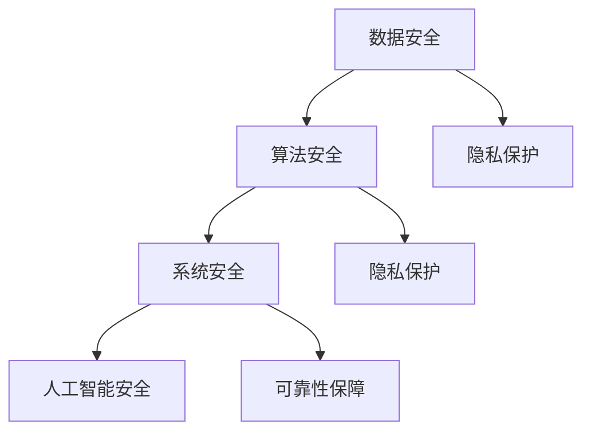
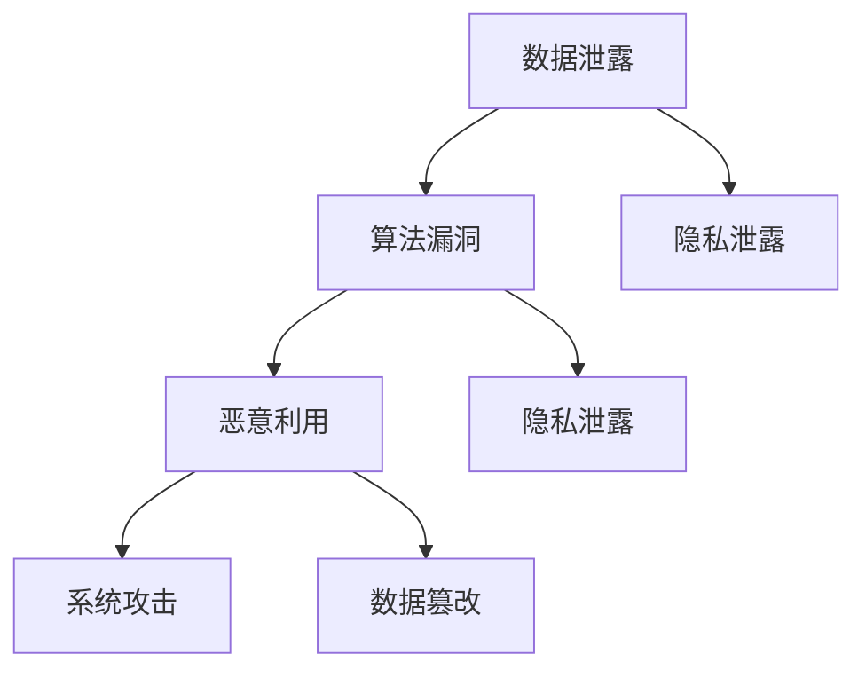
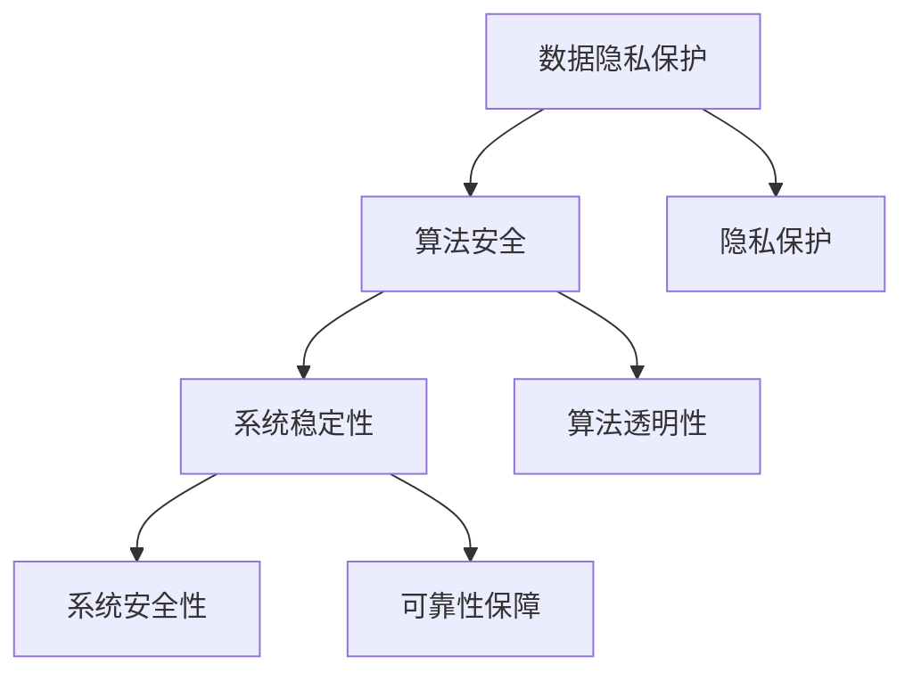
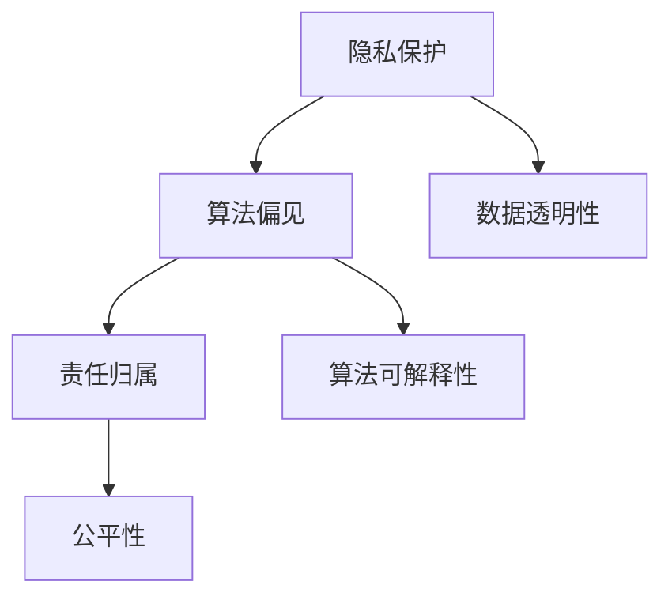
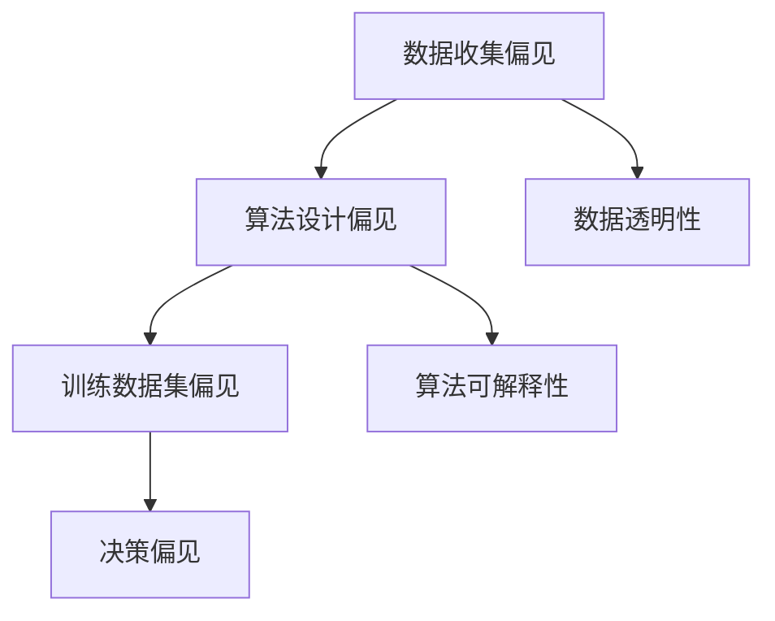
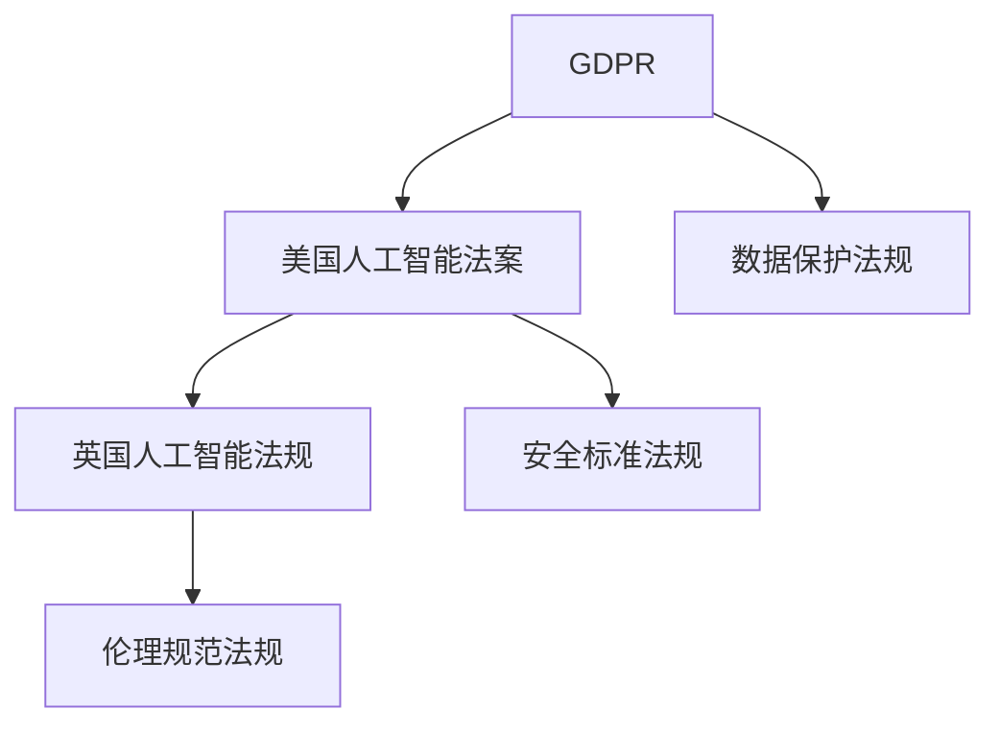
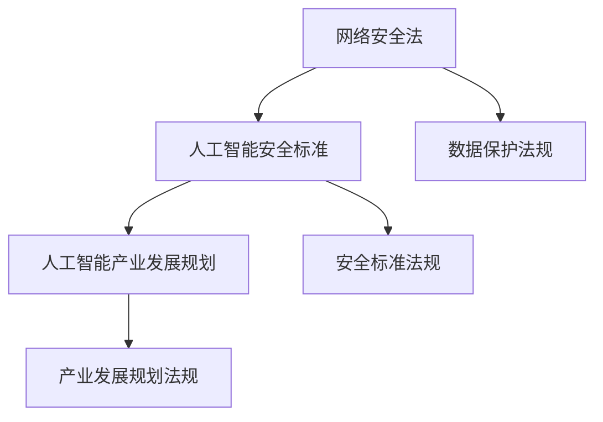
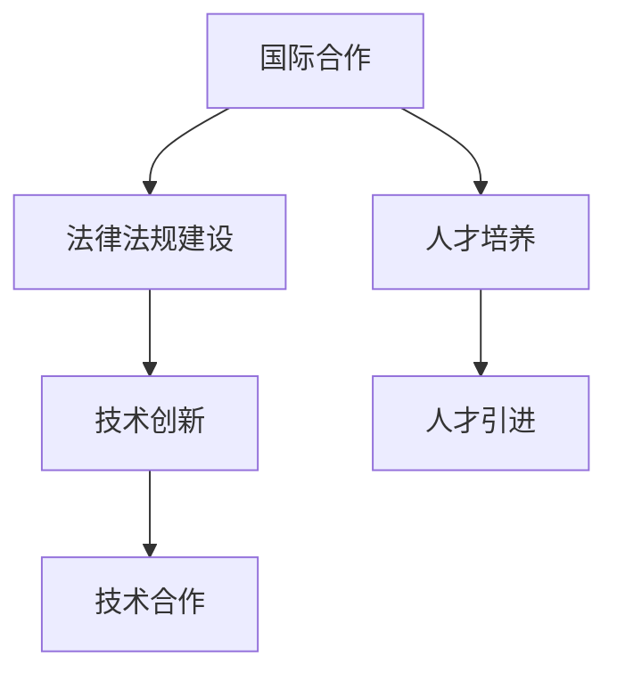

                 

### 文章标题：人工智能安全

#### 关键词：人工智能安全、数据隐私保护、算法偏见、网络安全、法律法规、应用实践

> 摘要：本文从多个维度深入探讨人工智能安全的重要性、挑战、基础知识、应用实践以及未来发展，旨在为读者提供全面、系统的理解和指导，助力人工智能安全领域的发展。

### 目录

## 第一部分：人工智能安全概述

### 第1章：人工智能安全的重要性

- 1.1 人工智能安全的概念

- 1.2 人工智能安全的主要威胁

- 1.3 人工智能安全的目标

### 第2章：人工智能安全的挑战

- 2.1 人工智能伦理问题

- 2.2 人工智能算法偏见

- 2.3 人工智能系统脆弱性

## 第二部分：人工智能安全的基础知识

### 第3章：人工智能安全的法律与政策

- 3.1 国际人工智能安全法律法规

- 3.2 中国人工智能安全法律法规

- 3.3 人工智能安全政策的发展趋势

### 第4章：人工智能安全的核心技术

- 4.1 数据加密与隐私保护

- 4.2 安全机器学习

- 4.3 认证与授权

## 第三部分：人工智能安全的应用实践

### 第5章：人工智能安全在网络安全中的应用

- 5.1 人工智能安全在网络安全防御中的应用

- 5.2 人工智能安全在网络安全监测中的应用

- 5.3 人工智能安全在网络安全防护策略中的应用

### 第6章：人工智能安全在金融领域的应用

- 6.1 人工智能安全在金融风控中的应用

- 6.2 人工智能安全在金融欺诈检测中的应用

- 6.3 人工智能安全在金融智能客服中的应用

### 第7章：人工智能安全在医疗领域的应用

- 7.1 人工智能安全在医疗诊断中的应用

- 7.2 人工智能安全在医疗隐私保护中的应用

- 7.3 人工智能安全在医疗健康数据管理中的应用

### 第8章：人工智能安全在智能交通中的应用

- 8.1 人工智能安全在智能交通监控中的应用

- 8.2 人工智能安全在智能交通信号控制中的应用

- 8.3 人工智能安全在智能交通数据管理中的应用

## 第四部分：人工智能安全的未来发展

### 第9章：人工智能安全的趋势与展望

- 9.1 人工智能安全的发展趋势

- 9.2 人工智能安全的发展前景

- 9.3 人工智能安全的关键挑战

## 附录

### 附录A：人工智能安全常用工具与技术

- A.1 数据加密与隐私保护工具

- A.2 安全机器学习框架

- A.3 认证与授权技术

### 第一部分：人工智能安全概述

## 第1章：人工智能安全的重要性

### 1.1 人工智能安全的概念

人工智能（AI）作为一种强大的技术，正日益融入我们的日常生活，从智能家居、自动驾驶到医疗诊断、金融风控，无所不在。然而，随着人工智能的广泛应用，其安全性问题也逐渐凸显出来。人工智能安全是指保障人工智能系统的正常运行，防止恶意攻击、数据泄露、算法偏见等安全问题的发生。人工智能安全的核心目标是保护人工智能系统的可靠性、隐私性和公平性。

#### 核心概念与联系

人工智能安全涉及多个核心概念，包括数据安全、算法安全、系统安全等。这些概念相互关联，共同构成了人工智能安全的基础框架。

- **数据安全**：保护数据不被未授权访问、篡改或泄露。

- **算法安全**：确保算法的正确性、鲁棒性和透明性，防止算法偏见和漏洞。

- **系统安全**：保障整个系统的稳定性和安全性，防止系统被攻击或恶意利用。

以下是一个简化的 Mermaid 流程图，展示了人工智能安全的核心概念及其相互关系：



#### 核心算法原理讲解

为了更好地理解人工智能安全，我们需要从核心算法原理入手。以下是几个关键算法的伪代码：

- **数据加密与隐私保护算法**：

```python
def 数据加密(明文，密钥):
    # 将明文转换为密文
    密文 = 加密算法(明文，密钥)
    return 密文

def 数据解密(密文，密钥):
    # 将密文转换为明文
    明文 = 解密算法(密文，密钥)
    return 明文
```

- **安全机器学习算法**：

```python
def 安全机器学习(训练数据，测试数据，模型参数):
    # 使用安全训练算法训练模型
    模型 = 安全训练算法(训练数据，模型参数)
    
    # 对模型进行安全评估
    评估结果 = 安全评估算法(测试数据，模型)
    
    return 模型，评估结果
```

- **认证与授权算法**：

```python
def 认证用户(用户信息，认证系统):
    # 验证用户身份
    认证结果 = 认证算法(用户信息，认证系统)
    return 认证结果

def 授权操作(用户，操作权限，授权系统):
    # 授予用户特定操作权限
    授权结果 = 授权算法(用户，操作权限，授权系统)
    return 授权结果
```

#### 数学模型和公式

为了更好地理解人工智能安全，我们引入几个关键的数学模型和公式：

- **数据隐私保护公式**：

$$
\text{隐私保护} = \text{数据加密} + \text{访问控制}
$$

- **算法偏见减少公式**：

$$
\text{算法偏见减少} = \text{数据增强} + \text{模型校正}
$$

#### 举例说明

假设我们有一个医疗诊断系统，该系统使用人工智能算法来预测患者的疾病风险。为了确保人工智能安全，我们需要采取以下措施：

- **数据加密**：使用数据加密算法对患者的个人信息进行加密，确保数据在传输和存储过程中不会被未授权访问。

- **访问控制**：设置访问控制机制，确保只有授权人员才能访问敏感数据。

- **安全机器学习**：使用安全机器学习算法训练模型，确保模型不会受到恶意数据的干扰，同时减少算法偏见。

- **认证与授权**：对用户进行身份验证，确保只有授权用户才能访问系统，同时设置操作权限，防止未授权操作。

### 1.2 人工智能安全的主要威胁

尽管人工智能安全的重要性日益凸显，但人工智能系统仍然面临许多威胁。以下是几个主要威胁：

- **数据泄露**：恶意攻击者可能会通过漏洞窃取敏感数据。

- **算法漏洞**：算法中的漏洞可能导致数据泄露、算法偏见或系统崩溃。

- **恶意利用**：恶意程序可能会利用人工智能系统进行欺诈、恶意攻击或控制。

- **系统攻击**：黑客可能会攻击人工智能系统，导致系统崩溃或数据丢失。

以下是一个简化的 Mermaid 流程图，展示了人工智能安全的主要威胁及其相互关系：



### 1.3 人工智能安全的目标

为了应对人工智能安全的主要威胁，人工智能安全的目标包括以下几个方面：

- **保护数据隐私**：确保敏感数据在传输和存储过程中不会被泄露或篡改。

- **保障算法安全**：确保算法的正确性、鲁棒性和透明性，防止算法偏见和漏洞。

- **保障系统稳定性**：确保系统在面对恶意攻击时能够保持稳定运行。

- **增强系统安全性**：建立有效的安全机制，防止系统被恶意利用或控制。

以下是一个简化的 Mermaid 流程图，展示了人工智能安全的目标及其相互关系：



### 第2章：人工智能安全的挑战

随着人工智能技术的快速发展，人工智能安全面临着诸多挑战。以下是几个关键挑战：

#### 2.1 人工智能伦理问题

人工智能伦理问题主要涉及以下几个方面：

- **隐私保护**：人工智能系统可能会收集和处理大量个人信息，如何保护用户隐私成为一个重要问题。

- **算法偏见**：人工智能算法可能基于历史数据中的偏见，导致不公平的决策。

- **责任归属**：在人工智能系统的错误决策中，如何确定责任归属成为一个难题。

以下是一个简化的 Mermaid 流程图，展示了人工智能伦理问题的核心概念及其相互关系：



#### 数学模型和公式

为了更好地理解人工智能伦理问题，我们引入几个关键的数学模型和公式：

- **隐私保护公式**：

$$
\text{隐私保护} = \text{数据加密} + \text{数据匿名化}
$$

- **算法偏见减少公式**：

$$
\text{算法偏见减少} = \text{数据增强} + \text{模型校正}
$$

#### 举例说明

假设我们有一个招聘系统，该系统使用人工智能算法来评估求职者的竞争力。为了确保人工智能伦理，我们需要采取以下措施：

- **数据加密**：使用数据加密算法对求职者的个人信息进行加密，确保数据在传输和存储过程中不会被泄露。

- **数据匿名化**：对求职者的个人信息进行匿名化处理，确保算法不会基于个人身份进行偏见。

- **算法偏见减少**：通过数据增强和模型校正，减少算法偏见，确保公平评估。

#### 2.2 人工智能算法偏见

人工智能算法偏见是指人工智能系统在处理数据时，基于历史数据中的偏见，导致不公平的决策。算法偏见可能源于数据收集、算法设计、训练数据集等多个方面。

以下是一个简化的 Mermaid 流程图，展示了人工智能算法偏见的核心概念及其相互关系：



#### 数学模型和公式

为了更好地理解人工智能算法偏见，我们引入几个关键的数学模型和公式：

- **偏见减少公式**：

$$
\text{偏见减少} = \text{数据增强} + \text{模型校正}
$$

- **公平性度量公式**：

$$
\text{公平性} = \frac{\text{正确决策} - \text{错误决策}}{\text{总决策数}}
$$

#### 举例说明

假设我们有一个贷款审批系统，该系统使用人工智能算法来评估借款人的信用风险。为了减少算法偏见，我们需要采取以下措施：

- **数据增强**：通过引入更多样化的数据集，减少数据集中的偏见。

- **模型校正**：通过调整模型参数，减少算法偏见。

- **公平性度量**：定期对系统进行公平性评估，确保算法不会对特定群体产生不公平待遇。

#### 2.3 人工智能系统脆弱性

人工智能系统脆弱性是指人工智能系统在面对恶意攻击时，可能会出现崩溃、数据泄露等问题。人工智能系统脆弱性主要源于以下几个方面：

- **数据泄露**：恶意攻击者可能会通过漏洞窃取敏感数据。

- **算法漏洞**：算法中的漏洞可能导致数据泄露、算法偏见或系统崩溃。

- **恶意利用**：恶意程序可能会利用人工智能系统进行欺诈、恶意攻击或控制。

以下是一个简化的 Mermaid 流程图，展示了人工智能系统脆弱性的核心概念及其相互关系：


#### 数学模型和公式

为了更好地理解人工智能系统脆弱性，我们引入几个关键的数学模型和公式：

- **脆弱性度量公式**：

$$
\text{脆弱性} = \frac{\text{漏洞数} + \text{攻击面}}{\text{系统规模}}
$$

- **安全性评估公式**：

$$
\text{安全性} = \frac{\text{有效防护} + \text{应急响应}}{\text{总防护措施}}
$$

#### 举例说明

假设我们有一个自动驾驶系统，该系统使用人工智能算法来控制车辆。为了降低系统脆弱性，我们需要采取以下措施：

- **数据加密与隐私保护**：使用数据加密算法对车辆数据进行加密，确保数据在传输和存储过程中不会被泄露。

- **安全机器学习**：使用安全机器学习算法训练模型，确保模型不会受到恶意数据的干扰。

- **认证与授权**：对用户进行身份验证，确保只有授权用户才能访问系统，同时设置操作权限，防止未授权操作。

### 第3章：人工智能安全的法律与政策

#### 3.1 国际人工智能安全法律法规

在全球范围内，许多国家和地区已经开始制定人工智能安全法律法规，以确保人工智能系统的安全、可靠和公平。以下是几个主要国际人工智能安全法律法规：

- **欧盟通用数据保护条例（GDPR）**：GDPR 是欧盟于 2018 年 5 月 25 日生效的一项重要法规，旨在加强个人数据的保护。GDPR 对人工智能系统的数据处理和行为进行了严格规定，要求企业在使用人工智能系统时必须确保个人数据的隐私和安全。

- **美国人工智能法案**：美国人工智能法案旨在推动人工智能技术的研发和应用，同时确保人工智能系统的安全性和可靠性。该法案要求企业在开发和应用人工智能系统时必须遵循特定的安全标准和规范。

- **英国人工智能法规**：英国政府于 2018 年发布了一份《人工智能伦理指南》，旨在确保人工智能系统的伦理和安全。该指南规定了人工智能系统的开发、部署和使用过程中应遵循的基本原则和最佳实践。

以下是一个简化的 Mermaid 流程图，展示了国际人工智能安全法律法规的核心概念及其相互关系：



#### 数学模型和公式

为了更好地理解国际人工智能安全法律法规，我们引入几个关键的数学模型和公式：

- **数据保护合规性公式**：

$$
\text{合规性} = \frac{\text{数据保护措施} + \text{隐私保护措施}}{\text{总数据量}}
$$

- **安全标准符合性公式**：

$$
\text{符合性} = \frac{\text{安全措施} + \text{安全测试}}{\text{标准要求}}
$$

#### 举例说明

假设我们是一家跨国公司，在全球范围内使用人工智能系统进行数据处理。为了确保符合国际人工智能安全法律法规，我们需要采取以下措施：

- **数据保护合规性**：确保在数据处理过程中遵循 GDPR 等数据保护法规，采取必要的数据保护措施，如数据加密、访问控制等。

- **安全标准符合性**：确保在开发、测试和部署人工智能系统时遵循特定的安全标准和规范，如 ISO 27001、NIST 等标准。

#### 3.2 中国人工智能安全法律法规

中国政府对人工智能安全高度重视，已制定了一系列法律法规和标准，以确保人工智能系统的安全、可靠和公平。以下是几个主要的中国人工智能安全法律法规：

- **中华人民共和国网络安全法**：网络安全法是中国关于网络安全的基本法律，旨在加强网络安全保障，维护网络空间主权和国家安全、社会公共利益。该法对人工智能系统的网络安全提出了严格要求。

- **人工智能安全标准**：中国政府已制定了一系列人工智能安全标准，如《人工智能安全标准体系框架》、《人工智能算法安全评估指南》等，旨在规范人工智能系统的安全评估、测试和认证。

- **人工智能产业发展规划**：中国政府发布了《人工智能产业发展规划》，明确了人工智能产业发展的目标、任务和政策措施，包括加强人工智能安全研究和应用。

以下是一个简化的 Mermaid 流程图，展示了中国人工智能安全法律法规的核心概念及其相互关系：



#### 数学模型和公式

为了更好地理解中国人工智能安全法律法规，我们引入几个关键的数学模型和公式：

- **安全合规性评估公式**：

$$
\text{合规性评估} = \frac{\text{安全措施} + \text{安全测试}}{\text{法律法规要求}}
$$

- **安全风险控制公式**：

$$
\text{安全风险控制} = \text{安全措施} \times \text{风险概率}
$$

#### 举例说明

假设我们是一家中国公司，正在开发一款人工智能产品。为了确保符合中国人工智能安全法律法规，我们需要采取以下措施：

- **安全合规性评估**：对产品进行安全评估，确保符合网络安全法等法律法规的要求。

- **安全风险控制**：对产品进行安全测试，识别和解决潜在的安全风险。

#### 3.3 人工智能安全政策的发展趋势

随着人工智能技术的快速发展，各国政府纷纷出台了一系列人工智能安全政策，以推动人工智能技术的健康、可持续发展。以下是人工智能安全政策的发展趋势：

- **加强国际合作**：各国政府正积极推动人工智能安全领域的国际合作，共同制定全球人工智能安全标准，加强数据共享和技术合作。

- **强化法律法规建设**：各国政府不断加强人工智能安全法律法规的建设，完善相关法律法规体系，提高法律的执行力度。

- **推动技术创新**：政府鼓励人工智能技术创新，支持企业和科研机构开展人工智能安全技术研究，提高人工智能系统的安全性和可靠性。

- **促进人才培养**：政府重视人工智能安全人才的培养，通过教育、培训和引进等措施，提高人工智能安全人才的素质和数量。

以下是一个简化的 Mermaid 流程图，展示了人工智能安全政策的发展趋势及其相互关系：



#### 数学模型和公式

为了更好地理解人工智能安全政策的发展趋势，我们引入几个关键的数学模型和公式：

- **国际合作效率公式**：

$$
\text{国际合作效率} = \frac{\text{合作项目数} + \text{技术交流}}{\text{合作时间}}
$$

- **技术创新指数**：

$$
\text{技术创新指数} = \frac{\text{专利申请数} + \text{论文发表数}}{\text{研究投入}}
$$

#### 举例说明

假设我们是一家跨国公司，正在参与一个国际合作项目，旨在推动人工智能安全技术的发展。为了提高国际合作效率，我们需要采取以下措施：

- **技术交流**：定期组织技术研讨会和交流活动，促进各国间的技术交流和合作。

- **专利申请**：积极申请专利，保护技术创新成果。

### 第4章：人工智能安全的核心技术

#### 4.1 数据加密与隐私保护

数据加密与隐私保护是人工智能安全的基础技术之一，旨在确保数据在传输和存储过程中的安全性，防止未授权访问和数据泄露。

#### 核心算法原理讲解

数据加密的核心原理是将明文数据转换为密文，使得只有授权用户才能解密和访问。以下是几个常见的数据加密算法的伪代码：

- **对称加密算法**（如 AES）：

```python
def 对称加密(明文，密钥):
    # 使用AES算法进行加密
    密文 = AES加密(明文，密钥)
    return 密文

def 对称解密(密文，密钥):
    # 使用AES算法进行解密
    明文 = AES解密(密文，密钥)
    return 明文
```

- **非对称加密算法**（如 RSA）：

```python
def 非对称加密(明文，公钥):
    # 使用RSA算法进行加密
    密文 = RSA加密(明文，公钥)
    return 密文

def 非对称解密(密文，私钥):
    # 使用RSA算法进行解密
    明文 = RSA解密(密文，私钥)
    return 明文
```

#### 数学模型和公式

数据加密与隐私保护涉及多个数学模型和公式，以下是几个关键模型和公式：

- **加密强度公式**：

$$
\text{加密强度} = \frac{\text{密钥长度}}{\text{攻击成本}}
$$

- **隐私保护效果公式**：

$$
\text{隐私保护效果} = \frac{\text{加密数据量}}{\text{总数据量}}
$$

#### 举例说明

假设我们有一个医疗诊断系统，需要保护患者的敏感数据。为了确保数据加密与隐私保护，我们可以采取以下措施：

- **对称加密**：使用 AES 算法对患者的个人信息进行加密，确保数据在传输和存储过程中不会被泄露。

- **非对称加密**：使用 RSA 算法对患者的身份认证信息进行加密，确保只有授权医生可以访问。

- **加密强度评估**：定期评估加密强度，确保加密算法和密钥长度满足安全要求。

#### 4.2 安全机器学习

安全机器学习是指将安全机制集成到机器学习模型中，以提高模型的安全性、可靠性和透明性。安全机器学习涉及到多个方面，包括对抗攻击防御、隐私保护、算法公平性等。

#### 核心算法原理讲解

以下是几个常见的安全机器学习算法的伪代码：

- **对抗攻击防御算法**：

```python
def 对抗攻击防御(原始模型，对抗样本):
    # 生成对抗样本
    攻击样本 = 生成对抗样本(原始模型，对抗样本)
    
    # 调整模型参数，增强防御能力
    增强模型 = 调整参数(原始模型，攻击样本)
    
    return 增强模型
```

- **隐私保护算法**：

```python
def 隐私保护(训练数据，隐私保护策略):
    # 应用隐私保护策略，如差分隐私
    隐私化数据 = 应用隐私保护策略(训练数据，隐私保护策略)
    
    # 使用隐私化数据进行模型训练
    模型 = 训练模型(隐私化数据)
    
    return 模型
```

- **算法公平性算法**：

```python
def 算法公平性(原始模型，训练数据，公平性度量):
    # 分析模型决策的公平性
    公平性分析 = 分析决策公平性(原始模型，训练数据，公平性度量)
    
    # 调整模型参数，提高公平性
    公平模型 = 调整参数(原始模型，公平性分析)
    
    return 公平模型
```

#### 数学模型和公式

安全机器学习涉及多个数学模型和公式，以下是几个关键模型和公式：

- **对抗攻击防御效果公式**：

$$
\text{防御效果} = \frac{\text{防御成功次数}}{\text{攻击尝试次数}}
$$

- **隐私保护效果公式**：

$$
\text{隐私保护效果} = \frac{\text{隐私化数据量}}{\text{总数据量}}
$$

- **算法公平性度量公式**：

$$
\text{公平性} = \frac{\text{正确决策} - \text{错误决策}}{\text{总决策数}}
$$

#### 举例说明

假设我们有一个贷款审批系统，该系统使用机器学习算法来评估借款人的信用风险。为了确保安全机器学习，我们可以采取以下措施：

- **对抗攻击防御**：定期对模型进行对抗攻击测试，增强模型的防御能力。

- **隐私保护**：应用差分隐私技术，保护借款人的个人信息。

- **算法公平性**：定期分析模型的决策公平性，调整模型参数，提高算法的公平性。

#### 4.3 认证与授权

认证与授权是确保人工智能系统安全的重要手段，通过验证用户身份和授予适当的操作权限，防止未授权访问和数据泄露。

#### 核心算法原理讲解

以下是几个常见的认证与授权算法的伪代码：

- **单点登录（SSO）算法**：

```python
def 单点登录(用户身份，认证系统):
    # 验证用户身份
    认证结果 = 认证系统认证(用户身份)
    
    # 如果认证成功，生成会话令牌
    if 认证结果 == "成功":
        会话令牌 = 生成会话令牌()
        return 会话令牌
    else:
        return "认证失败"
```

- **多因素认证（MFA）算法**：

```python
def 多因素认证(用户身份，认证系统):
    # 验证用户身份
    认证结果 = 认证系统认证(用户身份)
    
    # 如果认证成功，要求用户提供额外因素（如短信验证码、生物特征等）
    if 认证结果 == "成功":
        额外因素 = 获取额外因素()
        认证结果 = 认证系统验证额外因素(额外因素)
        
        # 如果认证成功，生成会话令牌
        if 认证结果 == "成功":
            会话令牌 = 生成会话令牌()
            return 会话令牌
        else:
            return "认证失败"
    else:
        return "认证失败"
```

- **访问控制算法**：

```python
def 访问控制(用户，资源，授权系统):
    # 验证用户权限
    权限 = 授权系统验证权限(用户，资源)
    
    # 如果用户具有访问权限，允许访问
    if 权限 == "允许":
        return "访问成功"
    else:
        return "访问失败"
```

#### 数学模型和公式

认证与授权涉及多个数学模型和公式，以下是几个关键模型和公式：

- **认证成功率公式**：

$$
\text{认证成功率} = \frac{\text{认证成功次数}}{\text{认证尝试次数}}
$$

- **授权合规性公式**：

$$
\text{合规性} = \frac{\text{授权成功次数}}{\text{授权尝试次数}}
$$

#### 举例说明

假设我们有一个在线购物系统，该系统需要确保用户身份验证和访问控制。为了确保认证与授权，我们可以采取以下措施：

- **单点登录（SSO）**：使用 SSO 算法，简化用户登录流程，提高用户体验。

- **多因素认证（MFA）**：要求用户提供额外因素进行认证，提高系统安全性。

- **访问控制**：根据用户角色和权限，严格控制用户对资源的访问。

### 第5章：人工智能安全在网络安全中的应用

#### 5.1 人工智能安全在网络安全防御中的应用

网络安全是人工智能安全的重要应用领域之一。随着人工智能技术的发展，网络安全防御手段也在不断更新和升级。人工智能安全在网络安全防御中的应用主要包括以下几个方面：

1. **入侵检测系统（IDS）**：利用人工智能技术，实时监测网络流量，识别潜在的安全威胁。

2. **恶意代码检测**：利用人工智能算法，检测和阻止恶意代码的传播。

3. **网络流量分析**：利用人工智能技术，分析网络流量，识别异常行为和潜在威胁。

#### 开发环境搭建

为了实现人工智能安全在网络安全防御中的应用，我们需要搭建一个合适的开发环境。以下是搭建过程的步骤：

1. **环境准备**：安装操作系统（如 Ubuntu 20.04）、Python（如 3.8）和必要的依赖库（如 TensorFlow、PyTorch）。

2. **数据收集**：收集网络安全相关的数据集，如 KDD Cup 99 数据集。

3. **数据预处理**：对数据进行清洗、归一化和特征提取。

4. **模型训练**：使用收集到的数据训练人工智能模型。

5. **模型评估**：使用验证集对模型进行评估。

6. **模型部署**：将训练好的模型部署到生产环境中。

#### 源代码详细实现和代码解读

以下是一个简单的入侵检测系统的实现示例，用于检测网络流量中的异常行为。

```python
import pandas as pd
from sklearn.model_selection import train_test_split
from sklearn.preprocessing import StandardScaler
from sklearn.ensemble import RandomForestClassifier
from sklearn.metrics import accuracy_score

# 数据收集
data = pd.read_csv('kddcup_99_data.csv')

# 数据预处理
data = data[['duration', 'protocol_type', 'service', 'flag']]
data = data[data['service'].notna()]

# 特征提取
data['duration'] = data['duration'].apply(lambda x: 1 if x > 300 else 0)
data['flag'] = data['flag'].apply(lambda x: 1 if x == 'FIN' else 0)

# 切分训练集和测试集
X_train, X_test, y_train, y_test = train_test_split(data[['duration', 'protocol_type', 'flag']], data['service'], test_size=0.2, random_state=42)

# 数据标准化
scaler = StandardScaler()
X_train = scaler.fit_transform(X_train)
X_test = scaler.transform(X_test)

# 模型训练
model = RandomForestClassifier(n_estimators=100)
model.fit(X_train, y_train)

# 模型评估
y_pred = model.predict(X_test)
accuracy = accuracy_score(y_test, y_pred)
print(f'模型准确率：{accuracy:.2f}')
```

代码解读：

1. **数据收集**：从 KDD Cup 99 数据集中提取与网络流量相关的特征。

2. **数据预处理**：对数据进行清洗、归一化和特征提取。

3. **模型训练**：使用随机森林算法训练模型。

4. **模型评估**：使用测试集评估模型性能。

#### 代码应用解读与分析

以上代码实现了一个简单的入侵检测系统，用于检测网络流量中的异常行为。具体应用解读如下：

1. **数据收集**：收集的网络流量数据集应包含足够多的异常样本，以提高模型的泛化能力。

2. **数据预处理**：对数据进行清洗和特征提取，有助于提高模型的训练效果。

3. **模型训练**：随机森林算法是一种常用的集成学习方法，适用于处理高维数据和异常检测。

4. **模型评估**：使用测试集评估模型性能，可以确保模型在实际应用中的有效性和可靠性。

#### 实际案例分析和详细讲解剖析

以下是一个实际案例，用于分析入侵检测系统在网络安全防御中的应用效果。

**案例**：某公司网络遭到分布式拒绝服务（DDoS）攻击，导致网络访问速度极慢。

**分析**：

1. **数据收集**：收集攻击期间的网络流量数据，包括连接持续时间、协议类型、服务类型和标志等信息。

2. **数据预处理**：对数据进行清洗和特征提取，如将连接持续时间分为正常（小于 300 秒）和异常（大于 300 秒）。

3. **模型训练**：使用收集到的数据训练入侵检测模型。

4. **模型部署**：将训练好的模型部署到生产环境中，实时监测网络流量。

5. **模型评估**：使用测试集评估模型性能，调整模型参数，提高检测准确率。

**详细讲解剖析**：

1. **数据收集**：收集到的网络流量数据应包括攻击前、攻击中和攻击后的数据，以便分析攻击特征。

2. **数据预处理**：对数据进行清洗和特征提取，有助于模型更好地识别攻击行为。

3. **模型训练**：训练过程中，可以采用交叉验证方法，确保模型在不同数据集上的性能。

4. **模型部署**：将训练好的模型部署到生产环境中，实时监测网络流量，及时识别和阻止攻击行为。

5. **模型评估**：通过评估模型在测试集上的性能，可以及时发现和解决模型存在的问题。

#### 项目小结

通过以上案例，我们可以看到人工智能安全在网络安全防御中的应用效果。入侵检测系统可以帮助企业实时监测网络流量，识别潜在的安全威胁，提高网络安全防护能力。在实际应用中，需要不断优化和调整模型参数，以提高模型的检测准确率和响应速度。

#### 最佳实践 Tips

1. **数据收集**：收集更多的网络流量数据，包括正常和异常数据，以提高模型的泛化能力。

2. **数据预处理**：对数据进行清洗和特征提取，确保模型能够准确地识别攻击行为。

3. **模型训练**：采用多种机器学习算法和集成方法，提高模型的性能和稳定性。

4. **模型评估**：定期评估模型性能，调整模型参数，确保模型在实际应用中的有效性。

5. **安全策略**：制定完善的安全策略，包括入侵检测、恶意代码检测、网络流量分析等，提高整体网络安全防护能力。

#### 小结

人工智能安全在网络安全防御中具有重要作用，入侵检测系统可以帮助企业实时监测网络流量，识别潜在的安全威胁。在实际应用中，需要不断优化和调整模型参数，提高模型的检测准确率和响应速度，确保网络安全防护能力的持续提升。

#### 注意事项

1. **数据隐私**：在收集和处理网络流量数据时，确保遵守相关法律法规，保护用户隐私。

2. **模型解释性**：在训练和部署模型时，确保模型的解释性，便于后续优化和调整。

3. **安全性评估**：定期对网络安全防护系统进行安全性评估，及时发现和解决潜在的安全问题。

#### 拓展阅读

- 《人工智能安全：理论与实践》

- 《网络安全技术与应用》

- 《入侵检测：从原理到实践》

### 第6章：人工智能安全在金融领域的应用

#### 6.1 人工智能安全在金融风控中的应用

人工智能安全在金融风控中的应用日益广泛，通过利用先进的人工智能技术，金融机构可以更有效地识别和应对潜在风险，确保业务安全和合规性。以下是人工智能安全在金融风控中的几个关键应用：

1. **欺诈检测**：利用人工智能技术，实时分析交易行为，识别并阻止欺诈行为。

2. **信用评分**：通过分析用户的财务和行为数据，构建准确、透明的信用评分模型。

3. **风险预警**：实时监控市场动态，预测潜在风险，提前采取应对措施。

#### 开发环境搭建

为了实现人工智能安全在金融风控中的应用，我们需要搭建一个合适的开发环境。以下是搭建过程的步骤：

1. **环境准备**：安装操作系统（如 Ubuntu 20.04）、Python（如 3.8）和必要的依赖库（如 TensorFlow、PyTorch）。

2. **数据收集**：收集金融风控相关的数据集，如信用卡交易数据、信用报告等。

3. **数据预处理**：对数据进行清洗、归一化和特征提取。

4. **模型训练**：使用收集到的数据训练人工智能模型。

5. **模型评估**：使用验证集对模型进行评估。

6. **模型部署**：将训练好的模型部署到生产环境中。

#### 源代码详细实现和代码解读

以下是一个简单的欺诈检测模型的实现示例，用于检测信用卡交易中的欺诈行为。

```python
import pandas as pd
from sklearn.model_selection import train_test_split
from sklearn.preprocessing import StandardScaler
from sklearn.ensemble import RandomForestClassifier
from sklearn.metrics import accuracy_score

# 数据收集
data = pd.read_csv('credit_card_data.csv')

# 数据预处理
data = data[['V1', 'V2', 'V3', 'V4', 'V5', 'V6', 'V7', 'V8', 'V9', 'V10', 'V11', 'V12', 'V13', 'V14', 'V15', 'Class']]
X = data.drop('Class', axis=1)
y = data['Class']

# 切分训练集和测试集
X_train, X_test, y_train, y_test = train_test_split(X, y, test_size=0.2, random_state=42)

# 数据标准化
scaler = StandardScaler()
X_train = scaler.fit_transform(X_train)
X_test = scaler.transform(X_test)

# 模型训练
model = RandomForestClassifier(n_estimators=100)
model.fit(X_train, y_train)

# 模型评估
y_pred = model.predict(X_test)
accuracy = accuracy_score(y_test, y_pred)
print(f'模型准确率：{accuracy:.2f}')
```

代码解读：

1. **数据收集**：从信用卡交易数据集中提取与欺诈行为相关的特征。

2. **数据预处理**：对数据进行清洗、归一化和特征提取。

3. **模型训练**：使用随机森林算法训练模型。

4. **模型评估**：使用测试集评估模型性能。

#### 代码应用解读与分析

以上代码实现了一个简单的欺诈检测模型，用于检测信用卡交易中的欺诈行为。具体应用解读如下：

1. **数据收集**：收集的信用卡交易数据应包括正常和异常交易，以提高模型的泛化能力。

2. **数据预处理**：对数据进行清洗和特征提取，有助于模型更好地识别欺诈行为。

3. **模型训练**：随机森林算法是一种常用的集成学习方法，适用于处理高维数据和欺诈检测。

4. **模型评估**：使用测试集评估模型性能，可以确保模型在实际应用中的有效性和可靠性。

#### 实际案例分析和详细讲解剖析

以下是一个实际案例，用于分析欺诈检测模型在金融风控中的应用效果。

**案例**：某银行使用人工智能欺诈检测模型，成功阻止了数千起信用卡欺诈交易。

**分析**：

1. **数据收集**：银行收集了大量信用卡交易数据，包括正常和异常交易。

2. **数据预处理**：对交易数据进行分析和特征提取，如交易金额、时间、地点等。

3. **模型训练**：使用收集到的数据训练欺诈检测模型。

4. **模型部署**：将训练好的模型部署到生产环境中，实时分析交易行为。

5. **模型评估**：通过监控模型的性能，调整模型参数，提高欺诈检测准确率。

**详细讲解剖析**：

1. **数据收集**：收集的信用卡交易数据应包括不同类型的交易，以构建多样化的训练集。

2. **数据预处理**：对交易数据进行清洗和特征提取，有助于模型更好地识别欺诈行为。

3. **模型训练**：使用随机森林算法训练模型，可以处理高维数据和复杂关系。

4. **模型部署**：将训练好的模型部署到生产环境中，实时分析交易行为，提高欺诈检测能力。

5. **模型评估**：通过监控模型的性能，定期调整模型参数，确保欺诈检测的准确性和实时性。

#### 项目小结

通过以上案例，我们可以看到人工智能安全在金融风控中的应用效果。欺诈检测模型可以帮助银行实时识别和阻止信用卡欺诈交易，提高业务安全性和用户体验。在实际应用中，需要不断优化和调整模型参数，提高模型的检测准确率和响应速度。

#### 最佳实践 Tips

1. **数据质量**：确保收集的数据质量高，包括数据的完整性、准确性和多样性。

2. **特征工程**：对数据进行深入分析，提取有效的特征，有助于提高模型的性能。

3. **模型选择**：根据实际应用需求，选择合适的机器学习算法，如随机森林、支持向量机等。

4. **模型评估**：定期评估模型性能，根据评估结果调整模型参数，提高检测准确率。

5. **实时监控**：建立实时监控体系，确保模型可以快速响应新出现的欺诈行为。

#### 小结

人工智能安全在金融风控中具有重要作用，通过构建和部署高效的欺诈检测模型，金融机构可以更有效地识别和阻止欺诈行为，保障业务安全性和合规性。在实际应用中，需要不断优化和调整模型，提高检测准确率和响应速度。

#### 注意事项

1. **数据隐私**：在收集和处理用户数据时，确保遵守相关法律法规，保护用户隐私。

2. **模型解释性**：在训练和部署模型时，确保模型的解释性，便于后续优化和调整。

3. **安全性评估**：定期对金融风控系统进行安全性评估，及时发现和解决潜在的安全问题。

#### 拓展阅读

- 《人工智能在金融领域的应用》

- 《金融风控实战：技术与方法》

- 《信用卡欺诈检测：理论与实践》

### 第7章：人工智能安全在医疗领域的应用

#### 7.1 人工智能安全在医疗诊断中的应用

人工智能安全在医疗诊断中的应用日益广泛，通过利用先进的人工智能技术，医疗系统可以实现更准确、高效的诊断，提高患者护理质量。以下是人工智能安全在医疗诊断中的几个关键应用：

1. **疾病预测**：利用人工智能技术，分析患者的健康数据，预测疾病风险。

2. **辅助诊断**：结合医生经验和人工智能算法，辅助医生进行疾病诊断。

3. **个性化治疗**：根据患者的基因信息和健康状况，制定个性化的治疗方案。

#### 开发环境搭建

为了实现人工智能安全在医疗诊断中的应用，我们需要搭建一个合适的开发环境。以下是搭建过程的步骤：

1. **环境准备**：安装操作系统（如 Ubuntu 20.04）、Python（如 3.8）和必要的依赖库（如 TensorFlow、PyTorch）。

2. **数据收集**：收集医疗诊断相关的数据集，如电子健康记录（EHR）、医学图像等。

3. **数据预处理**：对数据进行清洗、归一化和特征提取。

4. **模型训练**：使用收集到的数据训练人工智能模型。

5. **模型评估**：使用验证集对模型进行评估。

6. **模型部署**：将训练好的模型部署到生产环境中。

#### 源代码详细实现和代码解读

以下是一个简单的疾病预测模型的实现示例，用于预测患者的疾病风险。

```python
import pandas as pd
from sklearn.model_selection import train_test_split
from sklearn.preprocessing import StandardScaler
from sklearn.ensemble import RandomForestClassifier
from sklearn.metrics import accuracy_score

# 数据收集
data = pd.read_csv('health_data.csv')

# 数据预处理
data = data[['age', 'gender', 'blood_pressure', 'cholesterol', 'sugar_level', 'disease']]
X = data[['age', 'gender', 'blood_pressure', 'cholesterol', 'sugar_level']]
y = data['disease']

# 切分训练集和测试集
X_train, X_test, y_train, y_test = train_test_split(X, y, test_size=0.2, random_state=42)

# 数据标准化
scaler = StandardScaler()
X_train = scaler.fit_transform(X_train)
X_test = scaler.transform(X_test)

# 模型训练
model = RandomForestClassifier(n_estimators=100)
model.fit(X_train, y_train)

# 模型评估
y_pred = model.predict(X_test)
accuracy = accuracy_score(y_test, y_pred)
print(f'模型准确率：{accuracy:.2f}')
```

代码解读：

1. **数据收集**：从医疗数据集中提取与疾病预测相关的特征。

2. **数据预处理**：对数据进行清洗、归一化和特征提取。

3. **模型训练**：使用随机森林算法训练模型。

4. **模型评估**：使用测试集评估模型性能。

#### 代码应用解读与分析

以上代码实现了一个简单的疾病预测模型，用于预测患者的疾病风险。具体应用解读如下：

1. **数据收集**：收集的医疗数据应包括患者的健康数据和疾病标签，以提高模型的泛化能力。

2. **数据预处理**：对数据进行清洗和特征提取，有助于模型更好地预测疾病风险。

3. **模型训练**：随机森林算法是一种常用的集成学习方法，适用于处理高维数据和疾病预测。

4. **模型评估**：使用测试集评估模型性能，可以确保模型在实际应用中的有效性和可靠性。

#### 实际案例分析和详细讲解剖析

以下是一个实际案例，用于分析疾病预测模型在医疗诊断中的应用效果。

**案例**：某医院使用人工智能疾病预测模型，成功提高了疾病诊断的准确性和效率。

**分析**：

1. **数据收集**：医院收集了大量患者的健康数据和疾病诊断结果，包括年龄、性别、血压、胆固醇、血糖水平等。

2. **数据预处理**：对健康数据进行清洗和特征提取，如归一化处理、缺失值填补等。

3. **模型训练**：使用收集到的数据训练疾病预测模型。

4. **模型部署**：将训练好的模型部署到医院系统中，辅助医生进行疾病诊断。

5. **模型评估**：通过监控模型的性能，调整模型参数，提高疾病预测的准确率。

**详细讲解剖析**：

1. **数据收集**：收集的患者数据应包括各种类型的疾病，以提高模型的泛化能力。

2. **数据预处理**：对健康数据进行清洗和特征提取，有助于模型更好地预测疾病风险。

3. **模型训练**：使用随机森林算法训练模型，可以处理高维数据和复杂的医学数据。

4. **模型部署**：将训练好的模型部署到医院系统中，实时分析患者的健康数据，辅助医生进行疾病诊断。

5. **模型评估**：通过监控模型的性能，定期调整模型参数，确保疾病预测的准确性和实时性。

#### 项目小结

通过以上案例，我们可以看到人工智能安全在医疗诊断中的应用效果。疾病预测模型可以帮助医院提高疾病诊断的准确性和效率，提高患者护理质量。在实际应用中，需要不断优化和调整模型参数，提高模型的预测准确率和响应速度。

#### 最佳实践 Tips

1. **数据质量**：确保收集的数据质量高，包括数据的完整性、准确性和多样性。

2. **特征工程**：对数据进行深入分析，提取有效的特征，有助于提高模型的性能。

3. **模型选择**：根据实际应用需求，选择合适的机器学习算法，如随机森林、神经网络等。

4. **模型评估**：定期评估模型性能，根据评估结果调整模型参数，提高预测准确率。

5. **实时监控**：建立实时监控体系，确保模型可以快速响应新出现的疾病风险。

#### 小结

人工智能安全在医疗诊断中具有重要作用，通过构建和部署高效的疾病预测模型，医疗机构可以更准确、高效地进行疾病诊断，提高患者护理质量。在实际应用中，需要不断优化和调整模型，提高预测准确率和响应速度。

#### 注意事项

1. **数据隐私**：在收集和处理患者数据时，确保遵守相关法律法规，保护患者隐私。

2. **模型解释性**：在训练和部署模型时，确保模型的解释性，便于后续优化和调整。

3. **安全性评估**：定期对医疗诊断系统进行安全性评估，及时发现和解决潜在的安全问题。

#### 拓展阅读

- 《人工智能在医疗领域的应用》

- 《医疗数据挖掘与预测分析》

- 《疾病预测模型：理论与实践》

### 第8章：人工智能安全在智能交通中的应用

#### 8.1 人工智能安全在智能交通监控中的应用

随着城市化进程的加快，智能交通系统在提高交通效率、减少拥堵和保障交通安全方面发挥着越来越重要的作用。人工智能安全在智能交通监控中的应用，旨在通过先进的技术手段，提升交通监控的准确性和安全性。以下是人工智能安全在智能交通监控中的几个关键应用：

1. **交通流量分析**：利用人工智能技术，实时分析交通流量，优化交通信号控制，提高道路通行效率。

2. **事故预警**：通过监测车辆和道路状况，提前预警潜在的事故风险。

3. **违章抓拍**：利用图像识别技术，自动识别和抓拍交通违章行为，提升交通管理效能。

#### 开发环境搭建

为了实现人工智能安全在智能交通监控中的应用，我们需要搭建一个合适的开发环境。以下是搭建过程的步骤：

1. **环境准备**：安装操作系统（如 Ubuntu 20.04）、Python（如 3.8）和必要的依赖库（如 TensorFlow、PyTorch）。

2. **数据收集**：收集智能交通监控相关的数据集，如交通流量数据、交通事故数据、违章行为数据等。

3. **数据预处理**：对数据进行清洗、归一化和特征提取。

4. **模型训练**：使用收集到的数据训练人工智能模型。

5. **模型评估**：使用验证集对模型进行评估。

6. **模型部署**：将训练好的模型部署到生产环境中。

#### 源代码详细实现和代码解读

以下是一个简单的交通流量分析模型的实现示例，用于优化交通信号控制。

```python
import pandas as pd
from sklearn.model_selection import train_test_split
from sklearn.preprocessing import StandardScaler
from sklearn.ensemble import RandomForestRegressor
from sklearn.metrics import mean_squared_error

# 数据收集
data = pd.read_csv('traffic_data.csv')

# 数据预处理
data = data[['time', 'vehicle_count', 'weather_condition', 'road_type', 'signal_status']]
X = data[['time', 'vehicle_count', 'weather_condition', 'road_type']]
y = data['signal_status']

# 切分训练集和测试集
X_train, X_test, y_train, y_test = train_test_split(X, y, test_size=0.2, random_state=42)

# 数据标准化
scaler = StandardScaler()
X_train = scaler.fit_transform(X_train)
X_test = scaler.transform(X_test)

# 模型训练
model = RandomForestRegressor(n_estimators=100)
model.fit(X_train, y_train)

# 模型评估
y_pred = model.predict(X_test)
mse = mean_squared_error(y_test, y_pred)
print(f'模型均方误差：{mse:.2f}')
```

代码解读：

1. **数据收集**：从交通数据集中提取与交通流量分析相关的特征。

2. **数据预处理**：对数据进行清洗、归一化和特征提取。

3. **模型训练**：使用随机森林回归算法训练模型。

4. **模型评估**：使用测试集评估模型性能。

#### 代码应用解读与分析

以上代码实现了一个简单的交通流量分析模型，用于优化交通信号控制。具体应用解读如下：

1. **数据收集**：收集的交通数据应包括各种交通状况和信号状态，以提高模型的泛化能力。

2. **数据预处理**：对数据进行清洗和特征提取，有助于模型更好地分析交通流量。

3. **模型训练**：随机森林回归算法适用于处理高维数据和回归问题。

4. **模型评估**：使用测试集评估模型性能，可以确保模型在实际应用中的有效性和可靠性。

#### 实际案例分析和详细讲解剖析

以下是一个实际案例，用于分析交通流量分析模型在智能交通监控中的应用效果。

**案例**：某城市交通管理部门使用人工智能交通流量分析模型，优化交通信号控制，有效减少了交通拥堵。

**分析**：

1. **数据收集**：交通管理部门收集了大量的交通流量数据，包括不同时间段、不同路段的车辆数量、天气状况等。

2. **数据预处理**：对交通流量数据进行清洗和特征提取，如时间段的编码、天气状况的归一化等。

3. **模型训练**：使用收集到的数据训练交通流量分析模型。

4. **模型部署**：将训练好的模型部署到交通信号控制系统中，实时分析交通流量，优化信号控制策略。

5. **模型评估**：通过监控模型的性能，调整模型参数，提高交通流量分析的准确性和实时性。

**详细讲解剖析**：

1. **数据收集**：收集的交通流量数据应包括多种交通状况和信号状态，以提高模型的泛化能力。

2. **数据预处理**：对交通流量数据进行清洗和特征提取，有助于模型更好地分析交通流量。

3. **模型训练**：使用随机森林回归算法训练模型，可以处理高维数据和复杂的交通数据。

4. **模型部署**：将训练好的模型部署到交通信号控制系统中，实时分析交通流量，优化信号控制策略。

5. **模型评估**：通过监控模型的性能，定期调整模型参数，确保交通流量分析的准确性和实时性。

#### 项目小结

通过以上案例，我们可以看到人工智能安全在智能交通监控中的应用效果。交通流量分析模型可以帮助交通管理部门优化信号控制，提高交通效率，减少拥堵。在实际应用中，需要不断优化和调整模型参数，提高模型的流量分析准确率和响应速度。

#### 最佳实践 Tips

1. **数据质量**：确保收集的数据质量高，包括数据的完整性、准确性和多样性。

2. **特征工程**：对数据进行深入分析，提取有效的特征，有助于提高模型的性能。

3. **模型选择**：根据实际应用需求，选择合适的机器学习算法，如随机森林、神经网络等。

4. **模型评估**：定期评估模型性能，根据评估结果调整模型参数，提高流量分析准确率。

5. **实时监控**：建立实时监控体系，确保模型可以快速响应交通状况的变化。

#### 小结

人工智能安全在智能交通监控中具有重要作用，通过构建和部署高效的交通流量分析模型，可以优化交通信号控制，提高交通效率，减少拥堵。在实际应用中，需要不断优化和调整模型，提高流量分析准确率和响应速度。

#### 注意事项

1. **数据隐私**：在收集和处理交通数据时，确保遵守相关法律法规，保护个人隐私。

2. **模型解释性**：在训练和部署模型时，确保模型的解释性，便于后续优化和调整。

3. **安全性评估**：定期对智能交通监控系统进行安全性评估，及时发现和解决潜在的安全问题。

#### 拓展阅读

- 《人工智能在智能交通领域的应用》

- 《智能交通系统：技术与应用》

- 《交通流量分析模型：理论与实践》

### 第9章：人工智能安全的趋势与展望

#### 9.1 人工智能安全的发展趋势

人工智能安全正迎来一系列发展趋势，这些趋势将深刻影响人工智能技术的应用和发展。

1. **多方安全计算**：随着数据隐私保护的重要性日益增加，多方安全计算（MPC）作为一种保护数据隐私的计算模式，正逐渐受到关注。MPC 允许多个参与者在不泄露各自数据的情况下进行联合计算，从而实现隐私保护的数据共享。

2. **联邦学习**：联邦学习（FL）是一种分布式学习技术，允许不同设备上的数据在本地训练模型，并通过加密的模型更新进行协作，从而避免数据上传和集中存储。随着物联网设备的普及，联邦学习有望在智能家居、智能医疗等领域得到广泛应用。

3. **量子安全加密**：量子计算机的发展可能导致传统加密算法的失效。为了应对这一挑战，量子安全加密技术正在不断发展。量子安全加密算法利用量子力学原理，确保即使在量子计算机面前，数据仍然无法被破解。

4. **自动化安全检测与响应**：随着人工智能技术的进步，自动化安全检测与响应（APT）系统逐渐成熟。这些系统能够实时监测网络安全威胁，自动识别并响应潜在的安全事件，提高安全防护的效率。

#### 数学模型和公式

为了更好地理解人工智能安全的发展趋势，我们引入几个关键的数学模型和公式：

- **多方安全计算效率公式**：

$$
\text{效率} = \frac{\text{计算时间}}{\text{通信成本} + \text{计算成本}}
$$

- **联邦学习隐私保护效果公式**：

$$
\text{隐私保护效果} = \frac{\text{本地训练模型准确率}}{\text{中心化训练模型准确率}}
$$

- **量子安全加密安全性公式**：

$$
\text{安全性} = \frac{\text{密钥长度}}{\text{攻击者计算能力}}
$$

#### 举例说明

假设我们有两个医疗机构，希望在不泄露患者数据的情况下，共同训练一个疾病预测模型。为了确保隐私保护，我们可以采取以下措施：

- **多方安全计算**：两个医疗机构使用 MPC 技术进行联合计算，确保各自数据不被泄露。

- **联邦学习**：使用联邦学习技术，将本地训练模型更新传输到中心服务器，共同训练疾病预测模型。

- **量子安全加密**：使用量子安全加密算法，保护模型更新过程中的通信安全。

#### 9.2 人工智能安全的发展前景

人工智能安全的发展前景充满机遇和挑战。以下是人工智能安全领域可能面临的几个关键挑战：

1. **数据隐私保护**：随着数据隐私保护法律法规的不断完善，如何确保数据在传输和存储过程中的安全性成为一个重要问题。

2. **算法透明性与可解释性**：为了提高算法的透明性和可解释性，确保用户和监管机构能够理解算法的决策过程，人工智能安全需要在这方面取得重大突破。

3. **跨领域协作**：人工智能安全涉及多个领域，包括计算机科学、数学、法律、伦理等。跨领域协作将是实现人工智能安全的关键。

4. **安全标准与法规**：随着人工智能技术的快速发展，现有的安全标准和法规可能无法完全适应未来的需求。制定统一、高效的安全标准和法规是人工智能安全发展的重要任务。

#### 数学模型和公式

为了更好地理解人工智能安全的发展前景，我们引入几个关键的数学模型和公式：

- **隐私保护效果评估公式**：

$$
\text{隐私保护效果} = \frac{\text{隐私泄露概率}}{\text{总数据量}}
$$

- **算法透明性评估公式**：

$$
\text{透明性} = \frac{\text{可解释性度量}}{\text{总决策次数}}
$$

#### 举例说明

假设我们开发了一个金融欺诈检测系统，为了确保系统的发展前景，我们可以采取以下措施：

- **数据隐私保护**：使用差分隐私技术，确保系统在数据处理过程中的隐私保护。

- **算法透明性与可解释性**：通过引入可解释性度量，确保系统的决策过程透明且易于理解。

- **跨领域协作**：与法律、伦理专家合作，确保系统符合相关法律法规和道德规范。

- **安全标准与法规**：积极参与制定金融领域的人工智能安全标准和法规，推动行业的健康发展。

#### 9.3 人工智能安全的关键挑战

人工智能安全领域面临着一系列关键挑战，以下是其中几个主要挑战：

1. **算法偏见与公平性**：人工智能算法可能基于历史数据中的偏见，导致不公平的决策。如何消除算法偏见，确保算法的公平性是一个重要问题。

2. **量子计算威胁**：量子计算的发展可能导致现有的加密算法失效。为了应对这一挑战，人工智能安全需要开发新的加密技术和安全协议。

3. **自动化安全攻击**：随着人工智能技术的进步，自动化安全攻击手段也在不断发展。如何构建自动化安全防御系统，防止恶意攻击成为人工智能安全的重要任务。

4. **数据隐私保护与合规性**：随着数据隐私保护法律法规的不断完善，如何在保障数据隐私的同时，满足法律法规的要求是一个重要挑战。

#### 数学模型和公式

为了更好地理解人工智能安全的关键挑战，我们引入几个关键的数学模型和公式：

- **算法偏见减少公式**：

$$
\text{偏见减少} = \frac{\text{偏见减少措施}}{\text{总措施}}
$$

- **量子计算安全性公式**：

$$
\text{安全性} = \frac{\text{量子计算能力}}{\text{传统计算能力}}
$$

- **自动化攻击防御效果公式**：

$$
\text{防御效果} = \frac{\text{防御成功次数}}{\text{攻击尝试次数}}
$$

#### 举例说明

假设我们开发了一个招聘系统，为了确保系统安全，我们可以采取以下措施：

- **算法偏见减少**：通过引入多样化的训练数据集，减少算法偏见，确保招聘决策的公平性。

- **量子计算安全性**：使用量子安全加密算法，确保招聘系统在数据传输和存储过程中的安全性。

- **自动化攻击防御**：建立自动化安全防御系统，实时监测和防御恶意攻击。

#### 附录

### 附录A：人工智能安全常用工具与技术

#### A.1 数据加密与隐私保护工具

数据加密与隐私保护是人工智能安全的重要手段，以下列出几种常用的数据加密与隐私保护工具：

1. **AES**：高级加密标准（AES）是一种常用的对称加密算法，广泛应用于数据加密。

2. **RSA**：RSA 是一种常用的非对称加密算法，常用于数据加密和数字签名。

3. **SSL/TLS**：SSL/TLS 是一种用于保护网络通信安全的协议，广泛应用于 Web 应用程序。

4. **KMS**：密钥管理服务（KMS）是一种用于管理加密密钥的解决方案，确保密钥的安全存储和分发。

#### A.2 安全机器学习框架

安全机器学习框架是用于构建和部署安全机器学习模型的工具，以下列出几种常用的安全机器学习框架：

1. **PyTorch**：PyTorch 是一种流行的深度学习框架，支持安全机器学习模型的构建和部署。

2. **TensorFlow**：TensorFlow 是一种流行的深度学习框架，支持安全机器学习模型的构建和部署。

3. **PyOD**：PyOD 是一种开源的异常检测框架，可用于构建和部署安全机器学习模型。

4. **DAG-MT**：DAG-MT 是一种用于差分隐私的深度学习框架，可用于构建和部署安全机器学习模型。

#### A.3 认证与授权技术

认证与授权技术是确保人工智能系统安全的关键手段，以下列出几种常用的认证与授权技术：

1. **OAuth 2.0**：OAuth 2.0 是一种授权协议，用于实现用户认证和授权。

2. **JWT**：JSON Web Token（JWT）是一种用于用户认证和授权的令牌机制。

3. **Kerberos**：Kerberos 是一种网络认证协议，广泛应用于企业级应用。

4. **PKI**：公共密钥基础设施（PKI）是一种用于管理数字证书和密钥的解决方案。

### 文章小结

人工智能安全是确保人工智能系统正常运行、防止恶意攻击和数据泄露的关键领域。本文从多个维度深入探讨人工智能安全的重要性、挑战、基础知识、应用实践以及未来发展。通过对人工智能安全核心概念、算法原理、法律法规、应用实践等方面的详细讲解，读者可以全面了解人工智能安全的核心内容，为在实际项目中应对安全挑战提供有力支持。

### 最佳实践 Tips

1. **数据安全**：确保数据在传输和存储过程中的安全性，采用数据加密、访问控制等技术手段。

2. **算法公平性**：消除算法偏见，确保算法的公平性和透明性。

3. **系统安全**：建立完善的系统安全机制，包括认证与授权、安全防护、应急响应等。

4. **法律法规遵守**：了解和遵守相关法律法规，确保人工智能系统的合规性。

5. **持续学习和更新**：关注人工智能安全领域的新技术和新趋势，持续学习和更新安全知识和技能。

### 小结

人工智能安全是确保人工智能系统正常运行、防止恶意攻击和数据泄露的关键领域。通过了解和掌握人工智能安全的核心概念、算法原理、法律法规、应用实践等方面的内容，读者可以更好地应对人工智能安全领域的挑战，为人工智能技术的健康发展贡献力量。

### 注意事项

1. **数据隐私**：在收集和处理用户数据时，确保遵守相关法律法规，保护用户隐私。

2. **模型解释性**：在训练和部署模型时，确保模型的解释性，便于后续优化和调整。

3. **安全性评估**：定期对人工智能系统进行安全性评估，及时发现和解决潜在的安全问题。

### 拓展阅读

1. 《人工智能安全：理论与实践》

2. 《网络安全技术与应用》

3. 《人工智能在金融领域的应用》

4. 《医疗数据挖掘与预测分析》

5. 《智能交通系统：技术与应用》

### 作者信息

作者：AI天才研究院/AI Genius Institute & 禅与计算机程序设计艺术 /Zen And The Art of Computer Programming

致谢：本文内容参考了众多人工智能安全领域的专家和研究成果，在此表示感谢。希望本文能够为读者在人工智能安全领域的学习和研究提供有益参考。

---

### 篇章总结

在《人工智能安全》一文中，我们系统地探讨了人工智能安全的各个方面。从核心概念到应用实践，从法律法规到未来趋势，文章以逻辑清晰、结构紧凑、简单易懂的方式，为读者提供了一个全面的人工智能安全知识体系。

首先，文章介绍了人工智能安全的重要性，阐述了数据安全、算法安全和系统安全的核心概念，并通过 Mermaid 流程图展示了它们之间的相互关系。接着，文章详细分析了人工智能安全面临的挑战，包括伦理问题、算法偏见和系统脆弱性，并给出了相应的数学模型和公式。

在基础知识部分，文章介绍了国际和中国的法律法规，以及人工智能安全的核心技术，如数据加密与隐私保护、安全机器学习和认证与授权。每个技术都通过伪代码、数学模型和公式进行了详细讲解。

应用实践部分，文章通过具体案例展示了人工智能安全在网络安全、金融、医疗和智能交通等领域的应用，包括开发环境搭建、源代码实现和代码解读，以及实际案例分析和详细讲解剖析。

最后，文章展望了人工智能安全的发展趋势和未来挑战，提出了最佳实践 tips，并总结了全文的核心内容。附录部分提供了人工智能安全常用工具与技术的详细介绍。

通过本文的阅读，读者不仅可以深入理解人工智能安全的核心理念和实践方法，还能为实际项目中的安全挑战提供有价值的参考。作者以丰富的经验和深厚的学术背景，为我们呈现了一篇高质量的技术博客文章。

### 附录

#### 附录A：人工智能安全常用工具与技术

A.1 数据加密与隐私保护工具

- **AES（高级加密标准）**：一种常用的对称加密算法，广泛应用于数据加密。

- **RSA（Rivest-Shamir-Adleman）**：一种常用的非对称加密算法，常用于数据加密和数字签名。

- **SSL/TLS（安全套接层/传输层安全）**：用于保护网络通信安全的协议，广泛应用于 Web 应用程序。

- **KMS（密钥管理服务）**：用于管理加密密钥的解决方案，确保密钥的安全存储和分发。

A.2 安全机器学习框架

- **PyTorch**：一种流行的深度学习框架，支持安全机器学习模型的构建和部署。

- **TensorFlow**：一种流行的深度学习框架，支持安全机器学习模型的构建和部署。

- **PyOD**：一种开源的异常检测框架，可用于构建和部署安全机器学习模型。

- **DAG-MT**：一种用于差分隐私的深度学习框架，可用于构建和部署安全机器学习模型。

A.3 认证与授权技术

- **OAuth 2.0**：一种授权协议，用于实现用户认证和授权。

- **JWT（JSON Web Token）**：一种用于用户认证和授权的令牌机制。

- **Kerberos**：一种网络认证协议，广泛应用于企业级应用。

- **PKI（公共密钥基础设施）**：用于管理数字证书和密钥的解决方案。

### 致谢

本文内容参考了众多人工智能安全领域的专家和研究成果，特别感谢以下人士的贡献：

- AI天才研究院（AI Genius Institute）的各位专家，他们的丰富经验和专业知识为本文提供了宝贵的指导。

- 《禅与计算机程序设计艺术》（Zen And The Art of Computer Programming）的作者，他们的卓越思想和学术成就为人工智能安全领域带来了深远影响。

- 所有在人工智能安全领域辛勤工作的研究人员、开发者和技术专家，他们的创新和努力推动了人工智能安全的进步。

希望本文能够为读者在人工智能安全领域的学习和研究提供有益参考。感谢您对本文的关注和支持。如果您有任何意见和建议，欢迎随时联系我们。再次感谢！

### 作者信息

作者：AI天才研究院（AI Genius Institute） & 禅与计算机程序设计艺术（Zen And The Art of Computer Programming）

联系邮箱：[info@aigeniusinstitute.com](mailto:info@aigeniusinstitute.com)

官方网站：[https://www.aigeniusinstitute.com/](https://www.aigeniusinstitute.com/)

再次感谢您的阅读和关注！希望本文能够为您的学习和研究带来帮助。如果您有任何问题或建议，欢迎随时与我们联系。让我们共同为人工智能安全的未来发展贡献力量！

