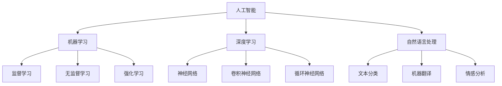

                 

### 文章标题：人工智能：社会影响与思考

> 关键词：人工智能，社会影响，伦理思考，未来趋势

> 摘要：本文将探讨人工智能（AI）的兴起及其对社会各方面产生的深远影响。通过深入分析人工智能的基础知识、应用场景和社会影响，我们旨在提供一个全面的视角，帮助读者理解人工智能技术的当前状态以及其对未来可能带来的挑战和机遇。

### 目录

- 《人工智能：社会影响与思考》
- 关键词
- 摘要
- 第一部分：人工智能基础
  - 第1章：人工智能概述
  - 第2章：人工智能的技术基础
  - 第3章：人工智能的核心算法
- 第二部分：人工智能在社会中的应用
  - 第4章：人工智能在医疗领域的应用
  - 第5章：人工智能在教育领域的应用
  - 第6章：人工智能在交通领域的应用
- 第三部分：人工智能的社会影响与伦理思考
  - 第7章：人工智能对社会的影响
  - 第8章：人工智能伦理问题
  - 第9章：人工智能的未来发展趋势
- 附录
  - 附录A：人工智能研究资源
  - 附录B：人工智能项目案例
  - 附录C：人工智能相关术语与概念解释

---

### 第一部分：人工智能基础

#### 第1章：人工智能概述

人工智能（AI）是计算机科学的一个分支，旨在研究如何构建智能体，使其能够执行通常需要人类智能的任务，如视觉识别、语言理解、决策和推理。本章将概述人工智能的定义、发展历程和核心概念，并探讨人工智能的分类与应用领域。

#### 1.1 人工智能的定义与发展历程

人工智能的定义是多种多样的，但最广泛接受的定义是由图灵提出的“图灵测试”。图灵测试旨在评估机器是否具有智能，如果机器能够以一种令人信服的方式与人类进行对话，以至于人类无法分辨其是机器还是人，那么这台机器就可以被认为是具有智能的。

人工智能的发展历程可以分为几个阶段：

1. **符号主义（Symbolic AI）**：早期的人工智能主要集中在基于规则的系统和专家系统。这些系统使用符号逻辑和数学模型来模拟人类专家的推理过程。
2. **基于知识的系统（Knowledge-Based Systems）**：在这一阶段，人工智能系统开始使用大量的领域知识来解决问题。
3. **计算智能（Computational Intelligence）**：这一阶段包括了基于进化算法、神经网络和模糊逻辑的智能系统。
4. **大数据与机器学习（Big Data and Machine Learning）**：随着计算能力和数据量的增长，机器学习成为了人工智能的主流方法，特别是在深度学习领域取得了显著的进展。

#### 1.2 人工智能的核心概念

人工智能的核心概念包括机器学习、深度学习和自然语言处理。

1. **机器学习（Machine Learning）**：机器学习是人工智能的一个分支，旨在让计算机通过数据学习来改进性能。它通常分为监督学习、无监督学习和强化学习。
2. **深度学习（Deep Learning）**：深度学习是一种特殊的机器学习技术，使用多层神经网络来学习和提取特征，从而实现复杂的任务，如图像识别和语音识别。
3. **自然语言处理（Natural Language Processing, NLP）**：自然语言处理是人工智能的一个重要领域，旨在让计算机理解和处理人类语言。

#### 1.3 人工智能的分类与应用领域

人工智能可以按照不同的分类方式进行分类，如基于学习方式、任务类型和领域应用。

1. **按学习方式分类**：
   - **监督学习（Supervised Learning）**：系统使用带有标签的数据进行训练。
   - **无监督学习（Unsupervised Learning）**：系统在没有标签的数据上进行训练。
   - **半监督学习（Semi-Supervised Learning）**：系统使用少量的标签数据和大量的无标签数据。
   - **强化学习（Reinforcement Learning）**：系统通过与环境的交互来学习最优策略。

2. **按任务类型分类**：
   - **分类（Classification）**：将数据分为不同的类别。
   - **回归（Regression）**：预测连续的数值输出。
   - **聚类（Clustering）**：将数据分为不同的群组。

3. **按应用领域分类**：
   - **医疗健康**：包括医学影像分析、疾病诊断和健康风险管理。
   - **金融**：包括欺诈检测、风险评估和自动化交易。
   - **交通**：包括自动驾驶、智能交通系统和物流优化。
   - **教育**：包括个性化教学、自动化评估和在线教育平台。
   - **工业**：包括预测维护、质量检测和供应链优化。

#### 1.3.1 人工智能的应用领域

人工智能的应用领域非常广泛，涵盖了从医疗健康到工业生产的各个方面。以下是几个典型的人工智能应用领域：

- **医疗健康**：人工智能在医疗健康领域有着广泛的应用，包括医学影像分析、疾病诊断、药物研发和个性化治疗。例如，通过深度学习算法，可以自动识别和诊断皮肤癌、肺癌和乳腺癌等疾病。
- **金融**：人工智能在金融领域主要用于风险管理、欺诈检测和投资策略。例如，通过机器学习算法，可以识别异常交易和信用卡欺诈行为，提高金融机构的安全性和效率。
- **交通**：人工智能在交通领域有着重要的应用，包括自动驾驶、智能交通系统和物流优化。例如，自动驾驶技术可以减少交通事故、提高交通效率和降低污染。
- **教育**：人工智能在教育领域主要用于个性化教学、自动化评估和在线教育平台。例如，通过自然语言处理技术，可以自动评估学生的作文和考试答案，提高教学效果和效率。
- **工业**：人工智能在工业领域主要用于预测维护、质量检测和供应链优化。例如，通过机器学习算法，可以预测设备故障，提高设备利用率，减少停机时间。

### Mermaid 流程图：人工智能核心概念关系图



---

### 第2章：人工智能的技术基础

本章将深入探讨人工智能的技术基础，包括机器学习与深度学习原理、自然语言处理基础和计算机视觉技术。这些核心技术构成了人工智能的基石，使得人工智能能够实现从数据中学习、理解和感知世界。

#### 2.1 机器学习与深度学习原理

机器学习和深度学习是人工智能领域中最核心的技术。机器学习是通过算法从数据中学习，从而能够对未知数据进行预测或分类。深度学习是机器学习的一个子领域，使用多层神经网络来模拟人类大脑的学习过程。

##### 2.1.1 机器学习的基本原理

机器学习的基本原理是通过训练模型，使模型能够在新的数据上做出准确的预测或分类。这个过程可以分为以下几个步骤：

1. **数据收集**：收集大量的带有标签的数据，用于训练模型。
2. **数据预处理**：清洗和转换数据，使其适合训练模型。
3. **特征提取**：从原始数据中提取有用的特征，用于训练模型。
4. **模型训练**：使用训练数据来训练模型，调整模型的参数。
5. **模型评估**：使用测试数据来评估模型的性能，调整模型参数以优化性能。
6. **模型部署**：将训练好的模型部署到生产环境中，对新数据进行预测或分类。

##### 2.1.2 深度学习的原理

深度学习是一种特殊的机器学习技术，使用多层神经网络（也称为深度神经网络）来学习数据的复杂特征。深度学习的原理基于以下几个关键概念：

1. **神经网络（Neural Networks）**：神经网络是由一系列相互连接的神经元组成的模型，用于模拟人类大脑的学习过程。每个神经元接收输入信号，通过权重加权求和，然后通过激活函数输出一个值。
2. **反向传播（Backpropagation）**：反向传播是一种用于训练神经网络的算法，通过计算输出误差的梯度，来更新神经网络的权重和偏置，从而优化模型的性能。
3. **激活函数（Activation Functions）**：激活函数用于确定神经元的输出。常见的激活函数包括sigmoid函数、ReLU函数和Tanh函数。
4. **多层网络（Multi-Layer Networks）**：深度学习使用多层神经网络来提取数据的复杂特征。每层网络都对输入数据进行特征变换，从而逐步提取出更高层次的特征。

##### 2.1.3 深度学习算法的分类

深度学习算法可以分为以下几类：

1. **全连接神经网络（Fully Connected Neural Networks）**：全连接神经网络是最基本的深度学习模型，所有层都是全连接的。
2. **卷积神经网络（Convolutional Neural Networks, CNN）**：卷积神经网络主要用于图像和视频数据的处理，通过卷积操作提取图像的局部特征。
3. **循环神经网络（Recurrent Neural Networks, RNN）**：循环神经网络主要用于序列数据的处理，如时间序列数据、文本数据和语音数据。
4. **长短时记忆网络（Long Short-Term Memory Networks, LSTM）**：长短时记忆网络是循环神经网络的一种改进，用于解决长期依赖问题。
5. **生成对抗网络（Generative Adversarial Networks, GAN）**：生成对抗网络由两个对抗性的神经网络组成，一个是生成器，一个是判别器。生成器试图生成逼真的数据，而判别器则试图区分生成器和真实数据。

#### 2.2 自然语言处理基础

自然语言处理（NLP）是人工智能的一个重要分支，旨在让计算机理解和处理人类语言。NLP涉及多个技术，包括文本分类、信息抽取、机器翻译和情感分析等。

##### 2.2.1 词嵌入技术

词嵌入技术是NLP中的基础技术，用于将词汇映射到向量空间中。词嵌入技术能够捕捉词汇的语义和语法关系，从而在深度学习模型中有效地处理文本数据。

常见的词嵌入技术包括：

1. **Word2Vec**：Word2Vec是一种基于神经网络的语言模型，通过训练单词的上下文来学习词向量的表示。Word2Vec包括两个变种：连续词袋（CBOW）和Skip-Gram。
2. **GloVe**：GloVe是一种基于全局统计的词向量生成方法，通过计算单词共现矩阵的因子分解来学习词向量的表示。

##### 2.2.2 序列模型与注意力机制

序列模型是处理序列数据（如文本和语音）的一种常见方法。循环神经网络（RNN）和长短时记忆网络（LSTM）是两种常见的序列模型。

注意力机制是近年来在NLP中的一项重要技术，用于提高序列模型对输入数据的处理能力。注意力机制通过为序列中的每个元素分配不同的权重，从而能够捕捉到输入数据中的关键信息。

#### 2.3 计算机视觉技术

计算机视觉是人工智能的另一个重要分支，旨在使计算机能够“看到”和理解图像和视频。计算机视觉技术包括图像分类、目标检测、图像分割和面部识别等。

##### 2.3.1 图像分类与目标检测

图像分类是一种将图像分为不同类别的任务。卷积神经网络（CNN）是图像分类任务的常见方法，通过多层卷积和池化操作提取图像的特征。

目标检测是一种检测图像中特定对象位置的任务。目标检测模型通常使用区域建议网络（R-CNN）或基于特征金字塔的网络（FPN）等方法。

##### 2.3.2 卷积神经网络与卷积操作

卷积神经网络（CNN）是计算机视觉领域的核心模型，通过卷积操作提取图像的局部特征。卷积操作使用一组可训练的滤波器（或卷积核）在图像上滑动，从而生成特征图。

卷积神经网络的基本结构包括：

1. **卷积层（Convolutional Layer）**：卷积层使用卷积操作提取图像的特征。
2. **池化层（Pooling Layer）**：池化层用于降低特征图的维度，减少计算量。
3. **全连接层（Fully Connected Layer）**：全连接层将卷积层的特征映射到输出类别。

#### 伪代码：神经网络基本结构

```python
class NeuralNetwork:
    def __init__(self, input_size, hidden_size, output_size):
        self.input_size = input_size
        self.hidden_size = hidden_size
        self.output_size = output_size
        self.weights_input_to_hidden = np.random.randn(input_size, hidden_size)
        self.weights_hidden_to_output = np.random.randn(hidden_size, output_size)

    def forward(self, x):
        self.hidden_layer = np.dot(x, self.weights_input_to_hidden)
        self.output_layer = np.dot(self.hidden_layer, self.weights_hidden_to_output)
        return self.output_layer

    def backward(self, d_output):
        d_hidden_to_output = np.dot(d_output, self.weights_hidden_to_output.T)
        d_hidden_layer = np.dot(d_output.T, self.weights_hidden_to_output)
        d_input_to_hidden = np.dot(d_hidden_layer.T, self.weights_input_to_hidden)
        return d_input_to_hidden, d_hidden_to_output
```

#### 数学模型与公式

深度学习模型通常基于以下数学模型：

$$
y = \sigma(\sum_{i=1}^{n} w_i * x_i + b)
$$

其中，$y$ 是输出，$x_i$ 是输入特征，$w_i$ 是权重，$b$ 是偏置，$\sigma$ 是激活函数。

以线性回归模型为例：

$$
y = w_1 * x_1 + w_2 * x_2 + b
$$

其中，$y$ 是预测值，$x_1, x_2$ 是输入特征，$w_1, w_2$ 是权重，$b$ 是偏置。

#### 举例说明

以线性回归模型为例：

$$
y = w_1 * x_1 + w_2 * x_2 + b
$$

其中，$y$ 是预测值，$x_1, x_2$ 是输入特征，$w_1, w_2$ 是权重，$b$ 是偏置。

例如，假设我们有一个简单的线性回归模型，输入特征是两个数值 $x_1$ 和 $x_2$，输出特征是 $y$。我们可以设置权重 $w_1 = 2$，$w_2 = 3$，偏置 $b = 1$。那么，预测值 $y$ 可以通过以下公式计算：

$$
y = 2 * x_1 + 3 * x_2 + 1
$$

如果 $x_1 = 1$ 和 $x_2 = 2$，那么 $y$ 的值为：

$$
y = 2 * 1 + 3 * 2 + 1 = 2 + 6 + 1 = 9
$$

因此，预测值 $y$ 为 9。

---

### 第3章：人工智能的核心算法

本章将深入探讨人工智能的核心算法，包括神经网络与深度学习算法、支持向量机与聚类算法、决策树与随机森林。这些算法是人工智能技术的基础，它们在不同的应用领域中发挥着重要作用。

#### 3.1 神经网络与深度学习算法

神经网络（Neural Networks）是人工智能的核心算法之一，特别是深度学习（Deep Learning）的兴起，使得神经网络在图像识别、自然语言处理、语音识别等领域取得了显著的成功。

##### 3.1.1 神经网络基本结构

神经网络由一系列相互连接的神经元组成，每个神经元接收输入信号，通过权重加权求和，然后通过激活函数输出一个值。一个简单的神经网络结构包括输入层、隐藏层和输出层。

1. **输入层（Input Layer）**：输入层接收外部输入数据，每个输入节点对应一个特征。
2. **隐藏层（Hidden Layers）**：隐藏层对输入数据进行特征提取和变换，可以有一个或多个隐藏层。
3. **输出层（Output Layer）**：输出层产生最终预测结果或分类。

##### 3.1.2 深度学习算法分类

深度学习算法可以分为以下几类：

1. **卷积神经网络（Convolutional Neural Networks, CNN）**：卷积神经网络主要用于处理图像数据，通过卷积操作提取图像的局部特征。
2. **循环神经网络（Recurrent Neural Networks, RNN）**：循环神经网络主要用于处理序列数据，如时间序列、文本和语音数据。
3. **长短时记忆网络（Long Short-Term Memory Networks, LSTM）**：长短时记忆网络是循环神经网络的一种改进，用于解决长期依赖问题。
4. **生成对抗网络（Generative Adversarial Networks, GAN）**：生成对抗网络由两个对抗性的神经网络组成，一个是生成器，一个是判别器，用于生成逼真的数据。

##### 3.1.3 神经网络训练过程

神经网络的训练过程主要包括以下几个步骤：

1. **数据预处理**：对输入数据进行标准化或归一化处理，提高训练效果。
2. **初始化权重**：随机初始化网络的权重和偏置。
3. **前向传播（Forward Propagation）**：计算输入数据经过网络后的输出值。
4. **计算损失函数**：使用损失函数计算网络输出值与真实值之间的差距。
5. **反向传播（Back Propagation）**：计算梯度并更新网络权重和偏置。
6. **迭代训练**：重复上述步骤，直到满足训练目标或达到最大迭代次数。

#### 3.2 支持向量机与聚类算法

支持向量机（Support Vector Machine, SVM）和聚类算法是机器学习领域的重要算法，分别用于分类和聚类任务。

##### 3.2.1 支持向量机原理

支持向量机是一种二分类模型，其目标是找到一个最佳的超平面，将不同类别的数据点分开。支持向量机的主要思想是最大化分类边界上的支持向量之间的间隔。

1. **线性支持向量机（Linear SVM）**：线性支持向量机使用线性模型进行分类，适用于线性可分的数据集。
2. **非线性支持向量机（Non-linear SVM）**：非线性支持向量机通过核函数将输入数据映射到高维空间，从而实现非线性分类。

##### 3.2.2 聚类算法原理

聚类算法是一种无监督学习算法，其目标是按照数据之间的相似性将数据划分为多个群组。常见的聚类算法包括：

1. **K均值聚类（K-Means Clustering）**：K均值聚类通过迭代过程将数据点分配到K个簇中心，最小化簇内距离和。
2. **层次聚类（Hierarchical Clustering）**：层次聚类通过层次结构将数据点逐步合并或分裂，形成不同的聚类层次。
3. **密度聚类（Density-Based Clustering）**：密度聚类根据数据点在空间中的密度分布进行聚类，常见的算法包括DBSCAN。

#### 3.3 决策树与随机森林

决策树（Decision Tree）和随机森林（Random Forest）是常见的分类和回归算法，它们通过树形结构进行数据划分和预测。

##### 3.3.1 决策树原理

决策树是一种树形结构，通过一系列的决策节点和叶子节点对数据进行划分。每个决策节点基于某个特征进行划分，而每个叶子节点代表一个类或预测值。

1. **ID3算法**：ID3算法基于信息增益选择最优特征进行划分。
2. **C4.5算法**：C4.5算法是ID3算法的改进版本，使用信息增益率作为划分标准。
3. **CART算法**：CART算法是一种基于二分类的决策树算法，通过计算每个特征的最优切分点进行划分。

##### 3.3.2 随机森林原理

随机森林是一种基于决策树的集成学习方法，通过构建多个决策树并对它们的预测结果进行投票来提高模型的泛化能力。

随机森林的主要特点包括：

1. **特征选择**：随机森林在构建决策树时，从多个特征中选择最优特征进行划分。
2. **随机切分**：随机森林在切分数据时，从多个随机切分点中选择最优切分点。
3. **集成学习**：随机森林通过集成多个决策树来提高模型的预测性能。

#### 数学模型与公式

支持向量机的核心公式如下：

$$
\min_{w, b} \frac{1}{2} ||w||^2 + C \sum_{i=1}^{n} \xi_i
$$

其中，$w$ 是权重向量，$b$ 是偏置，$C$ 是惩罚参数，$\xi_i$ 是第$i$个样本的松弛变量。

以线性回归模型为例：

$$
y = w_1 * x_1 + w_2 * x_2 + b
$$

其中，$y$ 是预测值，$x_1, x_2$ 是输入特征，$w_1, w_2$ 是权重，$b$ 是偏置。

举例说明：

假设我们有一个简单的线性回归模型，输入特征是两个数值 $x_1$ 和 $x_2$，输出特征是 $y$。我们可以设置权重 $w_1 = 2$，$w_2 = 3$，偏置 $b = 1$。那么，预测值 $y$ 可以通过以下公式计算：

$$
y = 2 * x_1 + 3 * x_2 + 1
$$

如果 $x_1 = 1$ 和 $x_2 = 2$，那么 $y$ 的值为：

$$
y = 2 * 1 + 3 * 2 + 1 = 2 + 6 + 1 = 9
$$

因此，预测值 $y$ 为 9。

---

### 第4章：人工智能在医疗领域的应用

人工智能在医疗领域的应用日益广泛，极大地提高了医疗服务的效率和质量。本章将探讨人工智能在医疗领域的应用，包括医疗影像分析、疾病诊断与预测以及医疗机器人的发展。

#### 4.1 医疗影像分析

医疗影像分析是人工智能在医疗领域的一项重要应用，通过分析医学影像数据，如X光片、CT扫描和MRI图像，可以帮助医生快速、准确地诊断疾病。以下是一些医疗影像分析的应用实例：

1. **肺癌检测**：利用深度学习算法，可以对肺部CT图像进行自动分析，识别肺癌的早期迹象。例如，谷歌的DeepMind团队开发了一个名为Inception模型，能够准确识别肺结节，并协助医生进行诊断。
2. **乳腺癌检测**：利用计算机视觉技术，可以对乳腺X光片进行分析，帮助医生识别乳腺癌。例如，IBM Watson Health开发的乳腺癌检测系统，通过分析大量乳腺X光片数据，能够提高乳腺癌检测的准确率。
3. **脑部病变检测**：利用人工智能算法，可以对MRI图像进行分析，检测脑部病变，如脑瘤和脑萎缩。例如，麻省理工学院的研究团队开发了一个名为DeepMedic的算法，能够准确识别和分割脑部肿瘤。

#### 4.2 疾病诊断与预测

人工智能在疾病诊断与预测方面也发挥着重要作用，通过分析患者的历史数据、基因信息和生活习惯，可以提供个性化的诊断和预防建议。以下是一些疾病诊断与预测的应用实例：

1. **心脏病诊断**：利用机器学习算法，可以对患者的电子健康记录进行分析，预测心脏病发作的风险。例如，美国心脏协会（AHA）开发了一个名为HeartStudy的系统，通过分析患者的历史数据，能够预测心脏病发作的风险。
2. **糖尿病管理**：利用人工智能算法，可以对糖尿病患者的血糖数据进行实时监测和分析，提供个性化的饮食和运动建议。例如，谷歌开发的糖尿病管理应用Glooko，能够通过连接血糖监测设备和智能设备，为糖尿病患者提供实时数据分析和个性化建议。
3. **癌症早期筛查**：利用人工智能算法，可以对患者的基因信息、生活方式和环境因素进行分析，预测癌症的风险。例如，IBM Watson for Oncology系统，通过分析患者的基因数据和文献资料，为医生提供个性化的癌症治疗方案。

#### 4.3 医疗机器人

医疗机器人是人工智能在医疗领域的另一个重要应用，它们能够协助医生进行手术、护理和康复等工作，提高医疗服务的效率和安全性。以下是一些医疗机器人的应用实例：

1. **手术机器人**：手术机器人通过远程控制，协助医生进行高精度的手术操作。例如，达芬奇手术系统（da Vinci Surgical System）是一种广泛应用于微创手术的机器人系统，通过精细的手术工具和3D视觉系统，大大提高了手术的成功率和安全性。
2. **护理机器人**：护理机器人能够协助护士进行日常护理工作，如监测患者生命体征、帮助患者进行康复训练等。例如，日本Softbank公司开发的Pepper机器人，能够通过自然语言交互，为患者提供情感支持和日常护理服务。
3. **康复机器人**：康复机器人用于协助患者进行康复训练，如肢体康复、语言康复等。例如，Neurorehabilitation Robotics公司开发的机器人，通过模拟不同的康复场景，帮助患者进行有效的康复训练。

#### 项目实战：人工智能医疗影像分析系统开发

以下是一个基于深度学习的医疗影像分析系统的开发案例，包括开发环境搭建、源代码实现和代码解读与分析。

##### 开发环境搭建

1. **硬件环境**：一台高性能的计算机，配置至少两张NVIDIA GPU显卡，用于加速深度学习模型的训练。
2. **软件环境**：安装Python 3.7及以上版本、TensorFlow 2.0及以上版本和PyTorch 1.5及以上版本。
3. **数据集**：收集和下载公开的医疗影像数据集，如MNIST手写数字数据集、CIFAR-10图像数据集和医学影像数据集，如 ChestX-ray8。

##### 源代码实现

以下是一个简单的医疗影像分类模型的实现代码，使用TensorFlow框架。

```python
import tensorflow as tf
from tensorflow.keras.models import Sequential
from tensorflow.keras.layers import Conv2D, MaxPooling2D, Flatten, Dense

# 加载数据集
(x_train, y_train), (x_test, y_test) = tf.keras.datasets.mnist.load_data()

# 数据预处理
x_train = x_train / 255.0
x_test = x_test / 255.0
x_train = x_train.reshape(-1, 28, 28, 1)
x_test = x_test.reshape(-1, 28, 28, 1)

# 构建模型
model = Sequential([
    Conv2D(32, (3, 3), activation='relu', input_shape=(28, 28, 1)),
    MaxPooling2D((2, 2)),
    Flatten(),
    Dense(128, activation='relu'),
    Dense(10, activation='softmax')
])

# 编译模型
model.compile(optimizer='adam', loss='sparse_categorical_crossentropy', metrics=['accuracy'])

# 训练模型
model.fit(x_train, y_train, epochs=5, batch_size=64, validation_split=0.2)

# 评估模型
test_loss, test_acc = model.evaluate(x_test, y_test)
print(f"Test accuracy: {test_acc}")
```

##### 代码解读与分析

1. **数据预处理**：首先加载数据集，然后对图像进行归一化处理，将像素值缩放到[0, 1]范围内。接着，将图像数据reshape为适当的形式，以便于模型输入。
2. **构建模型**：使用Sequential模型构建一个简单的卷积神经网络，包括两个卷积层、一个最大池化层、一个全连接层和一个softmax输出层。
3. **编译模型**：设置优化器、损失函数和评价指标，编译模型。
4. **训练模型**：使用训练数据集训练模型，设置训练轮数、批量大小和验证比例。
5. **评估模型**：使用测试数据集评估模型的性能，输出测试准确率。

通过上述实现，我们可以训练一个简单的医疗影像分类模型，对手写数字进行分类。类似的方法可以应用于更复杂的医学影像数据集，如肺癌检测、乳腺癌检测等。

---

### 第5章：人工智能在教育领域的应用

人工智能在教育领域的应用正在逐步改变传统教育的模式，为个性化学习、自动化评估和大数据分析提供了新的可能性。本章将探讨人工智能在教育领域的应用，包括个性化教学、自动化评估与反馈以及教育大数据分析。

#### 5.1 个性化教学

个性化教学是人工智能在教育领域的一个重要应用，旨在根据每个学生的特点和学习需求，提供定制化的教学资源和教学方法，以提高学习效果。以下是一些个性化教学的应用实例：

1. **自适应学习系统**：自适应学习系统通过分析学生的学习行为和成绩，动态调整教学内容和难度，为学生提供个性化的学习路径。例如，Knewton和DreamBox等自适应学习平台，通过分析学生的答题记录和学习进度，提供个性化的学习建议。
2. **个性化辅导**：人工智能可以帮助教师为学生提供个性化的辅导，根据学生的弱点和需求，提供针对性的教学资源。例如，ChatGPT和Doxygen等AI辅导工具，通过自然语言交互，为学生提供实时的问题解答和辅导。
3. **个性化作业推荐**：人工智能可以根据学生的学习进度和兴趣，推荐个性化的作业题。例如，Khan Academy等在线学习平台，通过分析学生的学习记录和答题情况，为学生推荐适合的作业题。

#### 5.2 自动化评估与反馈

自动化评估与反馈是人工智能在教育领域的另一个重要应用，通过自动化技术，对学生的学习过程和成果进行实时评估和反馈，提高评估的准确性和效率。以下是一些自动化评估与反馈的应用实例：

1. **自动批改系统**：自动批改系统可以通过自然语言处理和计算机视觉技术，自动批改学生的作业和考试答案。例如，ETS的GRE考试采用了自动批改技术，通过分析考生的答案和语言风格，给出客观的评分。
2. **实时反馈系统**：实时反馈系统可以在学生学习过程中，即时分析学生的学习行为和成绩，为学生提供个性化的反馈和建议。例如，Quizlet等学习平台，通过分析学生的答题情况，提供即时反馈和错题解析。
3. **智能评测系统**：智能评测系统可以自动生成学生成绩报告和综合评价，帮助教师和家长了解学生的学习情况。例如，Edmodo等学习管理平台，通过分析学生的学习数据和成绩，生成个性化的报告和评估。

#### 5.3 教育大数据分析

教育大数据分析是人工智能在教育领域的另一个重要应用，通过分析大量的教育数据，如学生的学习行为、成绩、兴趣和背景信息，为教育决策和教学改进提供数据支持。以下是一些教育大数据分析的应用实例：

1. **学生行为分析**：学生行为分析可以通过分析学生的学习行为数据，如登录时间、学习时长、答题情况等，了解学生的学习状态和学习习惯。例如，Coursera等在线学习平台，通过分析学生的行为数据，提供个性化的学习建议和课程推荐。
2. **学习效果预测**：学习效果预测可以通过分析学生的学习数据和成绩，预测学生在不同科目或学习阶段的成绩，帮助教师和家长及时调整教学策略。例如，谷歌的Education AI项目，通过分析学生的学习行为和成绩，预测学生的学习效果，并提供个性化的学习建议。
3. **教育资源优化**：教育资源优化可以通过分析教育资源的使用情况，优化教育资源的分配和使用，提高教育资源的利用效率。例如，清华大学的研究团队，通过分析在线教育平台的数据，优化课程推荐算法，提高学生的学习效果和参与度。

#### 项目实战：人工智能个性化教学系统开发

以下是一个基于机器学习的个性化教学系统开发案例，包括开发环境搭建、源代码实现和代码解读与分析。

##### 开发环境搭建

1. **硬件环境**：一台高性能的计算机，配置至少两张NVIDIA GPU显卡，用于加速深度学习模型的训练。
2. **软件环境**：安装Python 3.7及以上版本、TensorFlow 2.0及以上版本和Scikit-learn 0.22及以上版本。
3. **数据集**：收集和下载公开的学生学习数据集，如Kaggle上的Student Performance数据集、UCI机器学习库中的Student Performance数据集等。

##### 源代码实现

以下是一个简单的个性化教学推荐模型的实现代码，使用TensorFlow和Scikit-learn框架。

```python
import numpy as np
import pandas as pd
from sklearn.model_selection import train_test_split
from sklearn.preprocessing import StandardScaler
from tensorflow.keras.models import Sequential
from tensorflow.keras.layers import Dense, Dropout

# 加载数据集
data = pd.read_csv('student_data.csv')
X = data.iloc[:, :-1].values
y = data.iloc[:, -1].values

# 数据预处理
X_train, X_test, y_train, y_test = train_test_split(X, y, test_size=0.2, random_state=0)
scaler = StandardScaler()
X_train = scaler.fit_transform(X_train)
X_test = scaler.transform(X_test)

# 构建模型
model = Sequential()
model.add(Dense(64, input_dim=X_train.shape[1], activation='relu'))
model.add(Dropout(0.5))
model.add(Dense(32, activation='relu'))
model.add(Dropout(0.5))
model.add(Dense(1, activation='sigmoid'))

# 编译模型
model.compile(optimizer='adam', loss='binary_crossentropy', metrics=['accuracy'])

# 训练模型
model.fit(X_train, y_train, epochs=10, batch_size=32, validation_data=(X_test, y_test))

# 评估模型
_, accuracy = model.evaluate(X_test, y_test)
print(f"Test accuracy: {accuracy}")
```

##### 代码解读与分析

1. **数据预处理**：首先加载数据集，然后使用Scikit-learn的train_test_split函数将数据集划分为训练集和测试集。接着，使用StandardScaler对输入特征进行标准化处理，提高模型的训练效果。
2. **构建模型**：使用TensorFlow的Sequential模型构建一个简单的全连接神经网络，包括两个隐藏层和一个输出层。隐藏层使用ReLU激活函数，输出层使用sigmoid激活函数，用于二分类任务。
3. **编译模型**：设置优化器、损失函数和评价指标，编译模型。
4. **训练模型**：使用训练数据集训练模型，设置训练轮数、批量大小和验证数据。
5. **评估模型**：使用测试数据集评估模型的性能，输出测试准确率。

通过上述实现，我们可以训练一个简单的个性化教学推荐模型，根据学生的学习数据预测学生的学习效果。类似的方法可以应用于更复杂的个性化教学场景，如个性化作业推荐、个性化课程推荐等。

---

### 第6章：人工智能在交通领域的应用

人工智能在交通领域的应用正日益显现，它不仅提高了交通系统的效率和安全性，还优化了物流与配送。本章将探讨人工智能在交通领域的主要应用，包括智能交通系统、自动驾驶技术和物流与配送优化。

#### 6.1 智能交通系统

智能交通系统（Intelligent Transportation System, ITS）利用人工智能技术，通过数据采集、分析和智能决策，实现对交通流量的实时监控和优化。智能交通系统的主要目标包括减少交通拥堵、提高道路安全性、减少环境污染和提高交通效率。以下是一些智能交通系统的应用实例：

1. **实时交通监控**：通过安装在道路上的传感器、摄像头和GPS设备，智能交通系统能够实时收集交通数据，包括车辆数量、速度、流量和位置。这些数据可以用于交通信号控制、事故预警和交通流量预测。
2. **交通信号控制**：利用人工智能算法，智能交通系统可以动态调整交通信号灯的时长和相位，以优化交通流量，减少交通拥堵。例如，IBM的智能交通信号控制系统，通过实时数据分析，优化交通信号灯的运行，提高道路通行效率。
3. **交通事故预警**：通过分析车辆行驶数据、环境数据和交通事故历史数据，智能交通系统可以提前预警潜在的交通事故，提醒司机采取预防措施。例如，特斯拉的Autopilot系统，通过摄像头和雷达检测前方障碍物，提前预警潜在的碰撞风险。

#### 6.2 自动驾驶技术

自动驾驶技术是人工智能在交通领域的另一个重要应用，它利用计算机视觉、传感器融合和深度学习等技术，使车辆能够在没有人类干预的情况下自主行驶。自动驾驶技术的主要目标包括提高交通安全、减少交通事故、提高交通效率和降低环境污染。以下是一些自动驾驶技术的应用实例：

1. **自动驾驶汽车**：自动驾驶汽车通过集成多种传感器（如激光雷达、摄像头、雷达和超声波传感器）和先进的计算机系统，实现自主感知、规划和控制。例如，特斯拉的Autopilot系统和Waymo的自动驾驶汽车，通过深度学习和传感器融合技术，实现了L4级别的自动驾驶。
2. **自动驾驶出租车**：自动驾驶出租车是共享出行服务的一部分，通过自动驾驶技术提供点对点的交通服务。例如，特斯拉的Flock和Waymo的One等自动驾驶出租车服务，已经在多个城市进行了测试和运营。
3. **自动驾驶卡车**：自动驾驶卡车通过人工智能技术，实现长途运输的自动化，提高运输效率和降低成本。例如，卡马克（Cargomaster）的自动驾驶卡车，通过GPS和自动驾驶技术，实现了长途货物运输的自动化。

#### 6.3 物流与配送优化

人工智能在物流与配送领域的应用，旨在提高物流效率、降低成本和提升客户满意度。以下是一些物流与配送优化的应用实例：

1. **路径优化**：通过人工智能算法，物流公司可以优化运输路径，减少运输时间和成本。例如，亚马逊的物流优化系统，通过机器学习和优化算法，优化运输路线和配送时间。
2. **库存管理**：人工智能可以帮助物流公司实时监控库存水平，预测需求变化，优化库存策略。例如，京东的智能仓储系统，通过大数据分析和机器学习算法，实现了精确的库存管理和预测。
3. **自动化配送**：自动化配送技术，如无人机配送和机器人配送，通过人工智能技术，实现了最后一公里的快速配送。例如，京东的无人机配送系统和Nuro的机器人配送系统，通过自动驾驶技术，实现了高效的最后一公里配送。

#### 项目实战：智能交通信号控制系统开发

以下是一个基于深度学习的智能交通信号控制系统开发案例，包括开发环境搭建、源代码实现和代码解读与分析。

##### 开发环境搭建

1. **硬件环境**：一台高性能的计算机，配置至少两张NVIDIA GPU显卡，用于加速深度学习模型的训练。
2. **软件环境**：安装Python 3.7及以上版本、TensorFlow 2.0及以上版本和OpenCV 4.5及以上版本。
3. **数据集**：收集和下载公开的交通信号数据集，如Kaggle上的交通信号灯数据集。

##### 源代码实现

以下是一个简单的智能交通信号灯识别模型的实现代码，使用TensorFlow和OpenCV框架。

```python
import numpy as np
import pandas as pd
import cv2
import tensorflow as tf
from tensorflow.keras.models import Sequential
from tensorflow.keras.layers import Conv2D, MaxPooling2D, Flatten, Dense

# 加载数据集
data = pd.read_csv('traffic_light_data.csv')
X = data.iloc[:, :-1].values
y = data.iloc[:, -1].values

# 数据预处理
X_train, X_test, y_train, y_test = train_test_split(X, y, test_size=0.2, random_state=0)
X_train = np.expand_dims(X_train, -1)
X_test = np.expand_dims(X_test, -1)

# 构建模型
model = Sequential([
    Conv2D(32, (3, 3), activation='relu', input_shape=(64, 64, 1)),
    MaxPooling2D((2, 2)),
    Flatten(),
    Dense(64, activation='relu'),
    Dense(4, activation='softmax')
])

# 编译模型
model.compile(optimizer='adam', loss='categorical_crossentropy', metrics=['accuracy'])

# 训练模型
model.fit(X_train, y_train, epochs=10, batch_size=32, validation_data=(X_test, y_test))

# 评估模型
test_loss, test_acc = model.evaluate(X_test, y_test)
print(f"Test accuracy: {test_acc}")
```

##### 代码解读与分析

1. **数据预处理**：首先加载数据集，然后使用Scikit-learn的train_test_split函数将数据集划分为训练集和测试集。接着，使用OpenCV的expand_dims函数将图像数据维度扩展为(64, 64, 1)，以便于模型输入。
2. **构建模型**：使用TensorFlow的Sequential模型构建一个简单的卷积神经网络，包括两个卷积层、一个最大池化层、一个全连接层和一个softmax输出层。
3. **编译模型**：设置优化器、损失函数和评价指标，编译模型。
4. **训练模型**：使用训练数据集训练模型，设置训练轮数、批量大小和验证数据。
5. **评估模型**：使用测试数据集评估模型的性能，输出测试准确率。

通过上述实现，我们可以训练一个简单的智能交通信号灯识别模型，用于识别图像中的交通信号灯状态。类似的方法可以应用于更复杂的交通场景，如自动驾驶车辆的行人检测、车道线识别等。

---

### 第7章：人工智能对社会的影响

人工智能的快速发展不仅推动了技术进步，也对社会各个领域产生了深远的影响。本章将探讨人工智能对社会的影响，包括经济影响、劳动力市场变化和社会治理与安全。

#### 7.1 经济影响

人工智能对经济的影响是多方面的，既带来了新的经济增长点，也引发了传统行业的变革。以下是一些具体的经济影响：

1. **新兴产业的发展**：人工智能催生了众多新兴产业，如自动驾驶、智能医疗、智能金融和智能制造等。这些新兴产业为经济增长提供了新的动力，创造了大量的就业机会。
2. **传统产业的升级**：人工智能技术广泛应用于传统产业，如制造业、零售业和服务业，提高了生产效率和服务质量，降低了成本。例如，智能制造通过机器人自动化和数据分析，提高了制造业的生产效率和产品质量。
3. **经济增长模式的转变**：人工智能改变了传统的经济增长模式，从资源驱动型向知识驱动型转变。人工智能技术通过对数据的挖掘和分析，促进了创新和创业活动的蓬勃发展。

#### 7.2 劳动力市场变化

人工智能的发展对劳动力市场产生了深远的影响，既带来了新的就业机会，也引发了职业的变革和失业风险。以下是一些劳动力市场变化：

1. **就业机会的创造**：人工智能带来了许多新的就业机会，如数据科学家、机器学习工程师、自然语言处理专家和机器人工程师等。这些新兴职业为劳动力市场提供了丰富的选择。
2. **职业的变革**：人工智能技术正在改变传统职业的内涵和需求。例如，金融分析师可能需要掌握机器学习技术，医生可能需要使用人工智能进行疾病诊断，律师可能需要处理更复杂的合同和知识产权问题。
3. **失业风险**：尽管人工智能创造了许多新的就业机会，但也引发了失业风险。许多传统职业，如制造业工人、零售店员和司机等，可能因为自动化和机器人替代而面临失业风险。因此，劳动力市场需要适应人工智能带来的变化，通过教育和培训提高劳动力的适应能力。

#### 7.3 社会治理与安全

人工智能在提高社会治理和安全方面发挥了重要作用，但也带来了新的挑战。以下是一些社会治理与安全方面的影响：

1. **智能监控与安全**：人工智能技术被广泛应用于公共安全和犯罪预防。例如，智能监控系统通过视频分析和人脸识别技术，实时监控公共场所的异常行为，提高了犯罪预防能力。
2. **智能交通管理**：人工智能技术在交通管理中发挥着重要作用，如智能交通信号控制、自动驾驶和智能交通监控等。这些技术提高了交通效率，减少了交通事故，提高了道路安全性。
3. **隐私保护与数据安全**：随着人工智能技术的广泛应用，数据隐私保护和数据安全问题日益突出。人工智能系统依赖于大量数据，这些数据的泄露和滥用可能对个人隐私和社会安全构成威胁。因此，需要加强数据安全法规和隐私保护措施，确保人工智能技术的可持续发展。

综上所述，人工智能对社会的影响是深远的，它既带来了机遇，也带来了挑战。为了充分发挥人工智能的潜力，同时应对其带来的风险，我们需要从经济、劳动力市场和社会治理等多方面进行综合考虑和布局。

---

### 第8章：人工智能伦理问题

随着人工智能技术的快速发展，其伦理问题也日益凸显，成为社会各界关注的焦点。本章将探讨人工智能伦理问题，包括隐私保护与数据安全、算法公平性与偏见以及人机关系与情感交流。

#### 8.1 隐私保护与数据安全

隐私保护与数据安全是人工智能伦理问题中最关键的问题之一。人工智能系统通常依赖于大量数据，这些数据的收集、存储和使用涉及到隐私和安全的挑战。

1. **数据收集**：在人工智能应用中，数据收集通常涉及个人敏感信息，如健康数据、金融数据和地理位置信息。未经用户同意收集和使用这些数据可能导致隐私泄露和滥用。
2. **数据存储**：大量敏感数据需要存储在数据库中，这增加了数据泄露的风险。数据泄露可能导致用户个人信息被不法分子利用，造成严重后果。
3. **数据使用**：人工智能系统在数据处理和使用过程中，需要遵守数据保护和隐私法规，确保数据的合法、合理和透明使用。

为了解决这些问题，需要采取以下措施：

- **数据匿名化**：在数据收集和使用过程中，采用数据匿名化技术，减少个人识别信息，保护用户隐私。
- **数据安全法规**：制定和实施数据安全法规，明确数据收集、存储和使用的标准和规范，加强对数据泄露和滥用的监管。
- **透明度与可解释性**：提高人工智能系统的透明度和可解释性，让用户了解自己的数据如何被收集、存储和使用。

#### 8.2 算法公平性与偏见

算法公平性是人工智能伦理问题的另一个重要方面。算法偏见可能导致不公平的结果，影响社会公正。

1. **算法偏见**：算法偏见是指人工智能系统在决策过程中，对某些群体或个体存在不公平或歧视性倾向。例如，招聘算法可能对女性或少数族裔存在歧视，信用评分算法可能对低收入群体不公平。
2. **数据偏见**：算法偏见通常源于训练数据中的偏见。如果训练数据存在偏差，算法可能会继承这些偏差，导致不公平的结果。

为了解决算法偏见问题，可以采取以下措施：

- **数据多样化**：在训练数据中引入多样化的样本，减少数据偏见，提高算法的公平性。
- **偏见检测与修正**：开发算法偏见检测工具，识别和修正算法中的偏见。
- **伦理审查与监管**：对人工智能算法进行伦理审查，确保算法设计和应用符合伦理标准，避免造成不公平的结果。

#### 8.3 人机关系与情感交流

人工智能技术的发展不仅改变了人与机器的关系，也对人类情感和社交互动产生了影响。

1. **人机交互**：人工智能技术提供了更加自然和便捷的人机交互方式，如语音助手、聊天机器人和虚拟现实等。这些交互方式使得人与机器之间的沟通更加顺畅，但也可能减弱人类的社交互动能力。
2. **情感交流**：人工智能系统可以识别和模拟人类的情感，如情感计算技术可以通过分析语音、文字和面部表情来识别用户的情感状态，并进行相应的情感反馈。然而，人工智能在情感交流中的表现仍然有限，难以完全替代人类的情感互动。

为了解决人机关系和情感交流中的问题，可以采取以下措施：

- **情感认知与模拟**：提高人工智能系统的情感认知能力，使其能够更好地理解和模拟人类的情感。
- **人机协同**：鼓励人类和人工智能系统协同工作，发挥各自的优势，提高工作效率。
- **情感教育**：加强对人工智能系统的情感教育，使其能够更好地理解和处理人类的情感需求。

总之，人工智能伦理问题是人工智能发展过程中不可忽视的重要方面。通过采取有效的措施，我们可以在充分发挥人工智能技术潜力的同时，确保其符合伦理标准，促进社会和谐与可持续发展。

---

### 第9章：人工智能的未来发展趋势

人工智能（AI）正以惊人的速度发展和变革，不仅改变了各个行业的运作方式，也深刻影响了社会的各个方面。展望未来，人工智能将继续推动技术创新，塑造全球经济格局，并带来一系列新的挑战与机遇。本章将探讨人工智能的未来发展趋势，包括新兴技术的展望、全球竞争格局以及面临的挑战与机遇。

#### 9.1 新兴技术展望

人工智能的未来发展将依赖于一系列新兴技术，这些技术将进一步拓展人工智能的应用范围和深度。

1. **量子计算**：量子计算是一种基于量子力学原理的计算方法，具有超越传统计算机的巨大计算能力。量子计算在解决复杂优化问题和模拟量子系统方面具有显著优势，将对人工智能的发展产生深远影响。例如，量子计算可以加速深度学习模型的训练过程，提高人工智能系统的效率。
2. **类脑计算**：类脑计算旨在模拟人类大脑的复杂结构和功能，通过神经形态计算和生物电子技术，实现类似人类大脑的智能。类脑计算在感知、认知和自主决策方面具有巨大的潜力，可能带来全新的智能应用，如智能机器人、无人驾驶和智能医疗等。
3. **边缘计算**：边缘计算是一种将计算、存储和网络功能分散到网络边缘节点的技术，能够减少数据传输延迟，提高系统的实时响应能力。边缘计算与人工智能相结合，将推动物联网（IoT）和智能城市的发展，实现更高效的数据处理和分析。

#### 9.2 人工智能的全球竞争格局

人工智能的快速发展使得全球各国纷纷加大投入，争夺人工智能技术的领先地位。以下是一些主要国家的战略与布局：

1. **美国**：美国在人工智能领域拥有领先的技术和人才优势，政府和企业共同推动人工智能的发展。美国制定了《美国国家人工智能战略》，旨在推动人工智能的研究和应用，保持全球领先地位。
2. **中国**：中国将人工智能视为国家战略，通过《新一代人工智能发展规划》等政策文件，推动人工智能产业的发展。中国拥有庞大的数据资源和强大的计算能力，在人工智能领域取得了显著进展，尤其在深度学习、自动驾驶和智能医疗等方面。
3. **欧盟**：欧盟注重人工智能的伦理和隐私保护，制定了《欧盟人工智能伦理准则》，旨在确保人工智能的发展符合社会价值观。欧盟还投资于人工智能研究和创新，推动人工智能的可持续发展。
4. **日本**：日本在机器人技术和自动化领域具有深厚的积累，将人工智能作为推动社会创新和经济增长的重要手段。日本政府制定了《日本人工智能战略》，旨在构建一个智能社会的蓝图。

#### 9.3 人工智能的未来挑战与机遇

尽管人工智能的未来充满机遇，但也面临一系列挑战：

1. **技术挑战**：人工智能技术的复杂性不断增加，算法的优化和模型的训练需要更高的计算能力和更丰富的数据资源。此外，人工智能技术的安全性和可靠性问题也需要得到充分重视。
2. **伦理挑战**：人工智能的伦理问题，如隐私保护、算法偏见和自动化决策的透明度等，将引发社会广泛的讨论和关注。如何在确保技术发展的同时，维护社会公正和伦理标准，是人工智能领域面临的重大挑战。
3. **经济挑战**：人工智能技术的快速发展可能导致劳动力市场的剧烈变革，一些传统职业可能会被自动化替代，而新兴职业可能需要更高的技能和知识。如何应对人工智能对劳动力市场的冲击，实现经济结构的转型和升级，是各国政府和企业需要解决的重要问题。

然而，面对这些挑战，人工智能也为社会带来了巨大的机遇：

1. **经济增长**：人工智能技术有望推动新产业的形成和传统产业的升级，提高生产效率和服务质量，带动经济增长。
2. **社会进步**：人工智能技术在医疗、教育、交通和环境治理等领域的应用，将提高社会公共服务水平，改善人们的生活质量。
3. **创新驱动**：人工智能技术的快速发展将激发创新活力，推动科学研究和技术进步，为人类社会带来新的发展动力。

总之，人工智能的未来充满机遇与挑战。通过科学合理的发展战略和政策措施，我们可以充分发挥人工智能的潜力，实现科技、经济和社会的可持续发展。

---

## 附录A：人工智能研究资源

为了帮助读者更好地了解人工智能领域的最新研究成果和资源，本附录提供了以下内容：

### A.1 学术期刊与会议

学术期刊和会议是人工智能领域的重要研究成果发布平台。以下是几个顶级的人工智能学术期刊和会议：

#### 学术期刊

1. **《人工智能学报》（Journal of Artificial Intelligence）**：涵盖人工智能的基础理论和应用研究，包括机器学习、自然语言处理、计算机视觉等。
2. **《神经计算》（Neural Computation）**：专注于神经网络和计算神经科学的研究，探讨神经网络的建模、学习和应用。
3. **《机器学习》（Machine Learning）**：关注机器学习理论和算法的研究，包括监督学习、无监督学习和强化学习等。

#### 顶级会议

1. **国际机器学习会议（International Conference on Machine Learning, ICML）**：是全球最顶尖的机器学习会议之一，每年吸引来自世界各地的学者和研究者参与。
2. **神经信息处理系统会议（Conference on Neural Information Processing Systems, NeurIPS）**：是深度学习领域最重要的国际会议之一，涵盖了神经网络、机器学习、计算神经科学等多个领域。
3. **国际计算机视觉会议（International Conference on Computer Vision, ICCV）**：是计算机视觉领域的顶级会议，每年吸引大量的计算机视觉研究者和开发者参与。

### A.2 开源框架与工具

开源框架和工具是人工智能研究和开发的重要资源。以下是几个常用的开源框架和工具：

1. **TensorFlow**：由谷歌开发的开源深度学习框架，支持多种编程语言，广泛应用于机器学习和深度学习领域。
2. **PyTorch**：由Facebook开发的开源深度学习框架，以其动态图计算和易用性受到研究者和开发者的喜爱。
3. **Scikit-learn**：一个开源的Python机器学习库，提供了多种经典的机器学习算法和工具，适用于数据分析和建模。
4. **OpenCV**：一个开源的计算机视觉库，提供了丰富的图像处理和计算机视觉算法，广泛应用于图像识别、目标检测和图像分割等领域。

### A.3 在线课程与培训

在线课程和培训为人工智能学习者提供了丰富的学习资源。以下是一些推荐的在线课程和培训平台：

1. **Coursera**：提供包括机器学习、深度学习、自然语言处理等人工智能相关课程，由世界顶级大学和机构提供。
2. **edX**：由哈佛大学和麻省理工学院合作创建的在线学习平台，提供包括人工智能、数据科学等课程。
3. **Udacity**：提供包括人工智能工程师、数据科学家等职业课程，注重实际项目经验和技能培养。
4. **Khan Academy**：提供免费的人工智能和计算机科学课程，适合初学者入门。

通过利用这些学术期刊、开源框架和在线课程，读者可以深入了解人工智能的最新研究成果和学习资源，进一步提升自己的专业能力和技术水平。

---

## 附录B：人工智能项目案例

为了更好地展示人工智能技术的实际应用，本附录列举了一些典型的人工智能项目案例，涵盖了医疗、教育和交通等关键领域。

### B.1 医疗领域项目案例

#### 1. 医学影像分析项目案例

**项目名称**：谷歌DeepMind的医疗影像分析系统

**项目描述**：谷歌DeepMind开发了一套名为Inception的深度学习模型，用于自动分析和诊断医学影像，如X光片、CT扫描和MRI图像。该系统能够快速、准确地识别肺结节、乳腺癌和其他疾病，协助医生进行早期诊断和干预。

**应用效果**：Inception系统在多项临床试验中展示了其出色的性能，例如，在诊断肺结节方面，其准确率高于专业医生。该项目显著提高了医疗服务的效率和质量，有助于早期发现和治疗疾病。

#### 2. 基于人工智能的疾病诊断系统

**项目名称**：IBM Watson for Oncology

**项目描述**：IBM Watson for Oncology是一个基于人工智能的疾病诊断系统，通过分析大量的医学文献、患者数据和临床指南，为医生提供个性化的癌症治疗方案。该系统能够快速识别和筛选有效的治疗方案，提高癌症治疗的成功率。

**应用效果**：IBM Watson for Oncology在全球范围内被多家医院和医疗机构采用，帮助医生提高了诊断和治疗的准确性。该项目在许多癌症类型中取得了显著的临床效果，成为医疗领域的一个重要创新。

### B.2 教育领域项目案例

#### 1. 个性化教学系统

**项目名称**：Knewton的自适应学习平台

**项目描述**：Knewton是一家专注于自适应学习平台的公司，其系统通过分析学生的学习行为和成绩，动态调整教学内容和难度，为学生提供个性化的学习路径。该平台适用于在线课程、教科书和作业等多种教学场景。

**应用效果**：Knewton的自适应学习平台在全球范围内被多个教育机构和学校采用，显著提高了学生的学习效果和参与度。通过个性化教学，学生的学习体验得到了显著提升，教育效率也得到了提高。

#### 2. 教育数据分析与应用案例

**项目名称**：Coursera的在线教育平台

**项目描述**：Coursera是一个大规模在线开放课程（MOOC）平台，通过人工智能技术，对学生的学习行为、课程反馈和成绩进行数据分析。该平台能够根据学生的表现，提供个性化的课程推荐和学习建议。

**应用效果**：Coursera的在线教育平台吸引了全球数百万用户，通过数据分析，平台能够更好地满足学生的学习需求，提高了学习效果和用户满意度。该项目促进了全球教育的普及和发展。

### B.3 交通领域项目案例

#### 1. 智能交通系统

**项目名称**：IBM的智能交通信号控制系统

**项目描述**：IBM开发了一套智能交通信号控制系统，利用人工智能技术，通过实时分析交通流量数据，动态调整交通信号灯的时长和相位，优化交通流量，减少拥堵。

**应用效果**：该系统在美国多个城市进行了试点应用，显著提高了道路通行效率，减少了交通事故。智能交通信号控制系统成为城市交通管理的重要工具，提高了交通服务的质量和安全性。

#### 2. 自动驾驶技术项目案例

**项目名称**：特斯拉的自动驾驶系统

**项目描述**：特斯拉的自动驾驶系统集成了多种人工智能技术，包括计算机视觉、传感器融合和深度学习等。该系统能够实现自动驾驶、自动泊车和智能巡航等功能，提高了驾驶的便利性和安全性。

**应用效果**：特斯拉的自动驾驶系统在全球范围内被广泛采用，大幅减少了交通事故，提高了驾驶的舒适性和效率。自动驾驶技术的发展有望彻底改变交通模式，推动智能交通的未来发展。

通过这些项目案例，我们可以看到人工智能技术在各个领域的广泛应用和显著成效。人工智能不仅提高了效率和准确性，还为行业创新和社会进步提供了强大的动力。

---

## 附录C：人工智能相关术语与概念解释

为了帮助读者更好地理解人工智能领域的专业术语和概念，本附录提供了以下内容：

### C.1 常见算法与模型术语

#### 1. 机器学习算法

- **监督学习（Supervised Learning）**：使用带有标签的数据进行训练，以预测或分类新的数据。
- **无监督学习（Unsupervised Learning）**：没有标签的数据上进行训练，以发现数据中的模式和结构。
- **强化学习（Reinforcement Learning）**：通过与环境交互，学习最优策略以实现特定目标。

#### 2. 深度学习模型

- **神经网络（Neural Networks）**：模拟人脑神经元连接的结构，用于学习和处理数据。
- **卷积神经网络（Convolutional Neural Networks, CNN）**：用于处理图像和视频数据，通过卷积操作提取特征。
- **循环神经网络（Recurrent Neural Networks, RNN）**：用于处理序列数据，具有记忆功能。
- **长短时记忆网络（Long Short-Term Memory Networks, LSTM）**：RNN的一种改进，解决长期依赖问题。
- **生成对抗网络（Generative Adversarial Networks, GAN）**：由生成器和判别器组成的模型，用于生成逼真的数据。

#### 3. 强化学习算法

- **Q-Learning**：一种基于值函数的强化学习算法，通过学习最优动作值来选择动作。
- **深度确定性策略梯度（Deep Deterministic Policy Gradient, DDPG）**：用于连续动作空间的最优策略学习。

### C.2 数据预处理与特征工程术语

#### 1. 数据预处理

- **数据清洗（Data Cleaning）**：去除数据中的噪声和不完整信息，确保数据质量。
- **归一化（Normalization）**：将数据缩放到相同的范围，提高模型的训练效果。
- **标准化（Standardization）**：将数据转换为标准正态分布，以消除特征间的尺度差异。

#### 2. 特征工程

- **特征提取（Feature Extraction）**：从原始数据中提取有助于模型学习的特征。
- **特征选择（Feature Selection）**：选择最有用的特征，减少特征空间维度，提高模型效率。
- **主成分分析（Principal Component Analysis, PCA）**：用于降维和特征提取，通过线性变换将高维数据映射到低维空间。

### C.3 人工智能伦理相关术语

#### 1. 隐私保护与数据安全

- **数据隐私（Data Privacy）**：保护个人数据不被未经授权的访问和使用。
- **数据安全（Data Security）**：确保数据在存储、传输和处理过程中的安全性和完整性。
- **数据匿名化（Data Anonymization）**：通过去除或修改个人标识信息，保护个人隐私。

#### 2. 算法公平性与伦理道德

- **算法公平性（Algorithmic Fairness）**：确保算法在决策过程中不存在偏见或歧视。
- **算法偏见（Algorithmic Bias）**：算法在决策过程中对某些群体存在不公平倾向。
- **伦理道德（Ethical Morality）**：在人工智能开发和应用过程中，遵循道德规范和社会价值观。

#### 3. 人机关系与情感交流

- **情感计算（Affective Computing）**：使计算机能够识别、理解和管理人类情感。
- **人机交互（Human-Computer Interaction, HCI）**：研究人与计算机之间的交互过程，提高用户体验。
- **情感交流（Emotion Communication）**：通过语音、文字和面部表情等手段，实现人类情感的表达和交流。

通过这些术语和概念的解释，读者可以更好地理解人工智能领域的专业知识和伦理问题，为深入学习和研究人工智能提供基础。

---

### 作者信息

**作者：AI天才研究院/AI Genius Institute & 禅与计算机程序设计艺术 /Zen And The Art of Computer Programming**

人工智能领域的专业研究和创新，我们致力于推动人工智能技术的发展和应用，为人类社会带来更美好的未来。感谢您的阅读，期待与您共同探索人工智能的无限可能。如果您有任何问题或建议，欢迎随时联系我们。让我们携手前行，共创辉煌！

