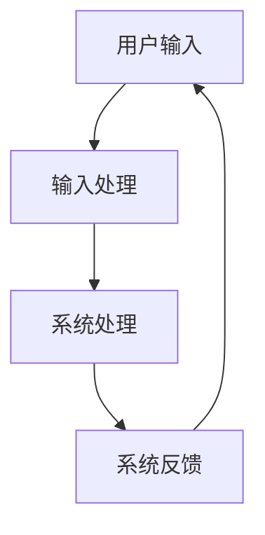
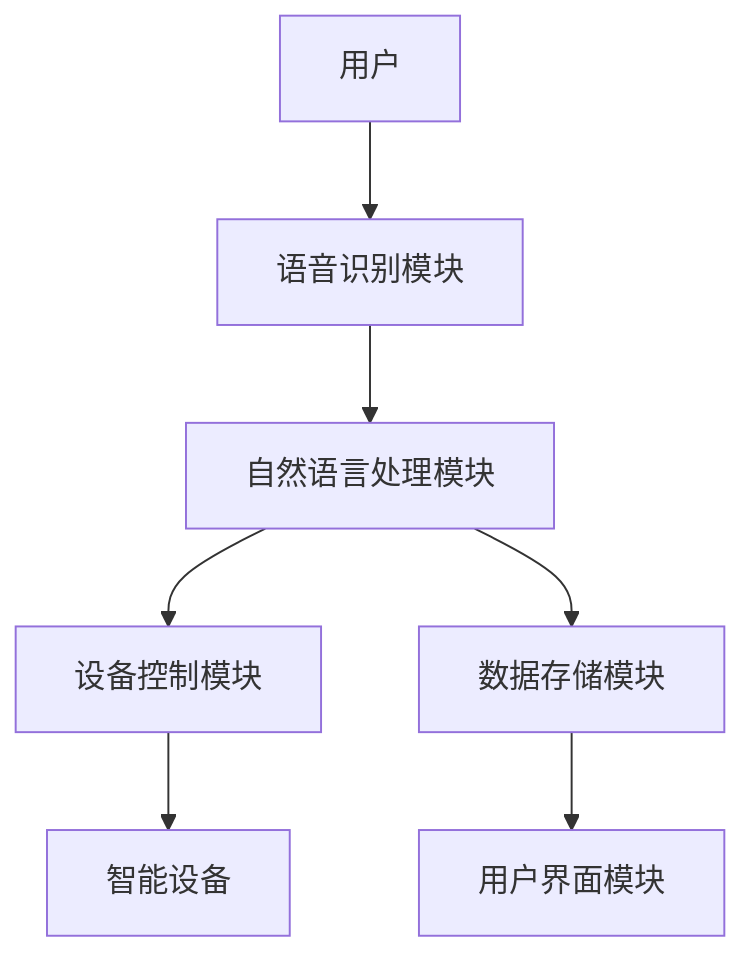

                 

### 文章标题

# 人机交互：未来趋势与展望

> 关键词：人机交互、人工智能、虚拟现实、增强现实、5G、物联网、交互模型、交互算法、用户体验

> 摘要：本文全面探讨了人机交互的发展历程、核心概念、技术基础、未来趋势以及面临的挑战。通过详细分析交互模型、核心算法、数学模型，以及实际项目案例，本文旨在为读者提供对人机交互领域的深刻理解和前瞻性洞察。

### 引言

人机交互（Human-Computer Interaction，简称HCI）是指人类与计算机系统之间的互动过程。它不仅关注计算机系统如何更好地满足人类需求，也关注人类如何有效地与计算机系统互动。随着信息技术的飞速发展，人机交互已经从最初的命令行界面（CLI）和图形用户界面（GUI）发展到今天的触摸屏、语音识别、虚拟现实（VR）和增强现实（AR）等多种形式。

本文将从以下几个方面对人机交互进行深入探讨：

1. **人机交互的概述与发展历程**：介绍人机交互的定义、基本原理以及其重要性。
2. **人机交互技术基础**：讲解交互设备与技术、交互界面设计原则以及用户体验评价方法。
3. **人机交互的核心概念与架构**：分析人机交互模型的类型、核心算法以及数学模型。
4. **人机交互的未来趋势**：探讨人工智能、虚拟现实、增强现实、5G和物联网等技术对交互的影响。
5. **人机交互项目实战**：通过实际项目案例，展示人机交互系统的开发、部署与测试过程。
6. **人机交互的发展前景与挑战**：展望人机交互的未来，分析其面临的挑战及解决思路。

通过本文的探讨，希望读者能够对人机交互有一个全面、系统的认识，并能够对未来的发展趋势和技术创新有所洞察。接下来，我们将逐章深入分析人机交互的各个方面。

### 第一部分：人机交互基础

#### 第1章：人机交互概述

##### 1.1 人机交互的定义与发展历程

人机交互（HCI）是指人类与计算机系统之间的互动过程，涉及用户与计算机系统之间的信息交换和交互操作。人机交互的目标是通过设计合理、易用、高效的界面，使用户能够方便、快捷地使用计算机系统，同时提高系统的性能和用户体验。

人机交互的发展历程可以追溯到20世纪中期。早期的人机交互主要是通过命令行界面（CLI）进行，用户需要输入特定的命令来控制计算机系统。随着计算机技术的发展，图形用户界面（GUI）逐渐取代了CLI，成为主流的人机交互方式。GUI通过图形元素（如按钮、菜单和图标）来简化用户操作，使用户与计算机的交互变得更加直观和便捷。

进入21世纪，随着触摸屏、语音识别、VR和AR等新技术的兴起，人机交互的形式变得更加多样化和智能化。这些新技术的应用不仅提升了交互的效率和体验，也为用户提供了更加丰富的交互方式。

##### 1.2 人机交互的基本原理

人机交互的基本原理包括以下几个方面：

1. **交互模型**：交互模型描述了用户与计算机系统之间的交互流程。常见的交互模型包括基于反馈的交互模型、基于上下文的交互模型和基于智能的交互模型。

2. **交互界面**：交互界面是用户与计算机系统之间进行交互的媒介。交互界面的设计原则包括用户中心设计、简洁直观、一致性等。

3. **用户体验**：用户体验是衡量人机交互质量的重要指标。用户体验包括用户的满意度、易用性、效率等方面。

##### 1.3 人机交互的重要性

人机交互的重要性主要体现在以下几个方面：

1. **提高工作效率**：通过合理设计的人机交互界面，用户可以更加高效地完成工作任务，减少操作步骤和错误率。

2. **改善用户体验**：人机交互的优化可以提高用户的满意度，增强用户对系统的忠诚度和使用粘性。

3. **促进信息共享**：人机交互使得用户能够更加方便地获取和处理信息，促进了信息共享和知识传播。

综上所述，人机交互作为计算机科学和用户体验设计的重要领域，其发展不仅推动了计算机技术的发展，也为用户提供了更加便捷、高效的交互体验。在接下来的章节中，我们将进一步探讨人机交互的技术基础和核心概念。

#### 第2章：人机交互技术基础

##### 2.1 交互设备与技术

人机交互的设备和技术是交互过程中不可或缺的组成部分。随着科技的发展，交互设备的种类和功能越来越多样化，从而为用户提供了更加丰富和便捷的交互体验。

1. **鼠标**：鼠标是最常见的交互设备之一，通过移动鼠标指针来选择和操作屏幕上的元素。现代鼠标支持多按钮、滚轮和手势操作，提供了更多的交互方式。

2. **键盘**：键盘是计算机系统最基础的输入设备，用于输入文字、命令和操作指令。随着技术的发展，键盘也出现了无线、键盘灯、机械键盘等不同种类。

3. **触摸屏**：触摸屏通过用户触摸屏幕来实现交互，广泛应用于智能手机、平板电脑和触摸式电脑等设备。触摸屏支持多点触摸，提供了更加直观和自然的交互体验。

4. **语音识别**：语音识别技术将用户的语音转换为文本或命令，使得用户可以通过语音与计算机系统进行交互。语音识别技术广泛应用于智能助手、语音控制系统和语音翻译等领域。

5. **手势识别**：手势识别技术通过捕捉用户的手势动作来实现交互，适用于VR、AR和智能电视等设备。手势识别技术可以识别多种手势，如挥手、指向和手势语等。

6. **眼动追踪**：眼动追踪技术通过捕捉用户的眼动轨迹来分析用户的注意力分布和兴趣点，常用于用户体验研究和广告效果评估。

##### 2.2 交互界面设计原则

交互界面设计是影响用户体验的关键因素。以下是交互界面设计的一些基本原则：

1. **用户中心设计**：交互界面设计应以用户的需求和习惯为中心，确保界面符合用户的期望和习惯。

2. **简洁直观**：界面设计应简洁明了，避免过多的干扰和冗余信息，确保用户能够快速理解和操作。

3. **一致性**：界面设计应保持一致性，包括颜色、字体、布局和交互规则等，使用户在多个场景中能够保持相同的交互体验。

4. **反馈机制**：交互界面应提供及时的反馈，告知用户操作的结果和状态，增强用户的信心和满意度。

5. **可访问性**：交互界面应考虑不同用户的需求，包括残障人士、老年人等，确保界面能够适应各种用户群体。

6. **灵活性和扩展性**：交互界面应具有灵活性和扩展性，能够根据用户需求和系统功能的变化进行自定义和调整。

##### 2.3 用户体验评价方法

用户体验（User Experience，简称UX）是指用户在使用产品或服务过程中的感受和体验。以下是几种常用的用户体验评价方法：

1. **用户测试**：用户测试是通过让真实用户使用产品或服务，并收集他们的反馈和评价来评估用户体验。用户测试可以识别出界面设计中的问题和不足，提供改进的方向。

2. **用户调查**：用户调查是通过问卷调查、访谈等方式收集用户对产品或服务的评价和意见。用户调查可以提供更广泛的数据和反馈，帮助了解用户的需求和偏好。

3. **量化分析**：量化分析是通过统计数据和分析模型来评估用户体验。例如，通过用户点击率、操作时间、错误率等指标来评估界面的易用性和效率。

4. **A/B测试**：A/B测试是通过比较两个或多个版本的界面设计，评估哪个版本的用户体验更好。A/B测试可以帮助确定最佳的设计方案，提高用户体验。

通过交互设备与技术、交互界面设计原则以及用户体验评价方法的综合应用，人机交互系统能够更好地满足用户的需求，提供优质的交互体验。在接下来的章节中，我们将深入探讨人机交互的核心概念与架构。

### 第二部分：人机交互的核心概念与架构

#### 第3章：人机交互模型

##### 3.1 人机交互模型的类型

人机交互模型是描述用户与计算机系统之间交互过程的概念框架。根据交互方式的不同，人机交互模型可以分为以下几种类型：

1. **交互式模型**：交互式模型是指用户通过直接操作计算机系统来完成任务的模型。这种模型主要包括命令行界面（CLI）和图形用户界面（GUI）。

   - **命令行界面（CLI）**：CLI通过用户输入命令来控制计算机系统。用户需要记忆和输入特定的命令，因此CLI对用户的技能要求较高，但可以提供强大的控制能力和灵活性。

   - **图形用户界面（GUI）**：GUI通过图形元素（如按钮、图标、菜单等）来简化用户操作。GUI具有直观、易用的特点，适用于大多数用户，但相对于CLI，GUI的控制能力较弱。

2. **动态交互模型**：动态交互模型是指用户与计算机系统之间的交互是动态变化的，系统能够根据用户的行为和环境的变化自动调整交互方式。这种模型主要包括视觉交互、声音交互和虚拟现实交互。

   - **视觉交互**：视觉交互通过屏幕上的图像、动画和视频等视觉元素与用户进行交互。视觉交互具有直观、生动、易于理解的特点，广泛应用于桌面应用、移动应用和游戏等领域。

   - **声音交互**：声音交互通过语音合成、语音识别和语音控制等技术实现用户与计算机系统的交互。声音交互具有自然、便捷、不受地域限制的特点，广泛应用于语音助手、语音控制系统和语音翻译等领域。

   - **虚拟现实交互**：虚拟现实交互通过虚拟环境与用户进行交互，用户可以进入虚拟环境并与之互动。虚拟现实交互具有沉浸式、交互性强的特点，广泛应用于虚拟旅游、虚拟教育和虚拟娱乐等领域。

3. **超级用户界面（HUI）**：超级用户界面是一种高度智能化的交互模型，它结合了交互式模型和动态交互模型的特点，通过智能代理和自然语言处理技术实现与用户的智能互动。HUI能够理解用户的意图和需求，提供个性化的交互体验，广泛应用于智能家居、智能客服和智能助手等领域。

##### 3.2 人机交互模型的原理与架构

人机交互模型的原理主要涉及以下几个方面：

1. **交互过程**：人机交互过程包括用户输入、系统处理和系统反馈。用户通过输入设备（如键盘、鼠标、触摸屏等）向计算机系统发送操作指令，计算机系统接收并处理这些指令，然后通过输出设备（如显示器、音响等）向用户反馈操作结果。

2. **交互机制**：人机交互机制包括输入机制、处理机制和反馈机制。输入机制负责接收用户的输入，处理机制负责对输入进行解析和处理，反馈机制负责将处理结果反馈给用户。

3. **交互模式**：人机交互模式包括单步交互、多步交互和连续交互。单步交互是指用户每完成一步操作后，系统才会进行相应的处理并反馈结果；多步交互是指用户需要完成多个步骤才能完成任务，每个步骤之间有一定的依赖关系；连续交互是指用户与系统之间的交互是连续的，系统会实时响应用户的操作。

人机交互模型的架构可以分为三个层次：

1. **感知层**：感知层负责感知用户的输入，包括键盘输入、鼠标输入、触摸屏输入、语音输入等。感知层将用户的输入转换为统一的输入事件，供处理层使用。

2. **处理层**：处理层负责对输入事件进行解析和处理，包括输入校验、输入转换、任务调度等。处理层会根据用户的输入事件，调用相应的功能模块进行数据处理和任务执行。

3. **反馈层**：反馈层负责将处理结果反馈给用户，包括视觉反馈、声音反馈、触觉反馈等。反馈层会根据处理层的输出结果，生成相应的反馈信息，并通过输出设备将反馈信息展示给用户。

##### 3.3 人机交互模型的Mermaid流程图

下面是一个简单的人机交互模型Mermaid流程图，展示了用户输入、系统处理和系统反馈的过程：



在这个流程图中，用户输入通过输入处理模块进行处理，然后传递给系统处理模块进行任务执行，最后通过系统反馈模块将结果反馈给用户，形成一个闭环的交互过程。

通过以上对人机交互模型的详细分析，我们可以看到人机交互不仅涉及到用户和系统的交互过程，还涉及到输入处理、系统处理和反馈等各个环节。理解这些基本原理和架构，有助于我们更好地设计和优化人机交互系统，提高用户体验。在接下来的章节中，我们将进一步探讨人机交互的核心算法和数学模型。

### 第4章：人机交互的核心算法

人机交互的核心算法是实现高效、智能和自然的交互体验的关键。本章将介绍交互数据分析算法、交互行为识别算法和交互行为预测算法的基本原理、算法选择以及伪代码示例。

#### 4.1 交互数据分析算法

交互数据分析算法用于分析用户的行为数据，以便更好地理解和优化交互过程。以下是几种常用的交互数据分析算法：

1. **描述性统计分析**：描述性统计分析用于计算数据的平均值、标准差、最大值和最小值等基本统计量，以了解数据的分布特征。

   - **算法选择**：Python中的`numpy`和`pandas`库提供了丰富的描述性统计分析函数。

   - **伪代码示例**：
     ```python
     import numpy as np
     import pandas as pd

     def calculate_descriptive_stats(data):
         mean = np.mean(data)
         std_dev = np.std(data)
         max_value = np.max(data)
         min_value = np.min(data)
         return mean, std_dev, max_value, min_value
     ```

2. **聚类分析**：聚类分析用于将相似的数据点分为不同的类别，以便更好地理解用户行为的模式。

   - **算法选择**：Python中的`scikit-learn`库提供了多种聚类算法，如K-Means、DBSCAN等。

   - **伪代码示例**：
     ```python
     from sklearn.cluster import KMeans

     def perform_clustering(data, n_clusters):
         kmeans = KMeans(n_clusters=n_clusters)
         clusters = kmeans.fit_predict(data)
         return clusters
     ```

3. **关联规则分析**：关联规则分析用于发现数据之间的关联关系，以便识别用户行为的规律。

   - **算法选择**：Python中的`mlxtend`库提供了关联规则分析函数。

   - **伪代码示例**：
     ```python
     from mlxtend.frequent_patterns import apriori
     from mlxtend.frequent_patterns import association_rules

     def generate_association_rules(data, min_support, min_confidence):
         frequent_itemsets = apriori(data, min_support=min_support, use_colnames=True)
         rules = association_rules(frequent_itemsets, metric="confidence", min_threshold=min_confidence)
         return rules
     ```

#### 4.2 交互行为识别算法

交互行为识别算法用于识别用户的交互行为，以便实现智能化的交互体验。以下是几种常用的交互行为识别算法：

1. **监督学习算法**：监督学习算法通过训练有标签的数据集，构建模型来识别用户行为。

   - **算法选择**：Python中的`scikit-learn`库提供了多种监督学习算法，如决策树、随机森林、支持向量机等。

   - **伪代码示例**：
     ```python
     from sklearn.model_selection import train_test_split
     from sklearn.ensemble import RandomForestClassifier

     def train_classifier(data, labels):
         X_train, X_test, y_train, y_test = train_test_split(data, labels, test_size=0.2, random_state=42)
         classifier = RandomForestClassifier()
         classifier.fit(X_train, y_train)
         return classifier

     def predict_behavior(classifier, data):
         return classifier.predict(data)
     ```

2. **无监督学习算法**：无监督学习算法在没有标签的数据集上，通过聚类等方法来识别用户行为。

   - **算法选择**：Python中的`scikit-learn`库提供了多种无监督学习算法，如K-Means、层次聚类等。

   - **伪代码示例**：
     ```python
     from sklearn.cluster import KMeans

     def cluster_behavior(data, n_clusters):
         kmeans = KMeans(n_clusters=n_clusters)
         clusters = kmeans.fit_predict(data)
         return clusters
     ```

3. **深度学习算法**：深度学习算法通过多层神经网络来识别用户行为，具有强大的特征提取和模式识别能力。

   - **算法选择**：Python中的`tensorflow`和`keras`库提供了深度学习算法的实现。

   - **伪代码示例**：
     ```python
     from tensorflow.keras.models import Sequential
     from tensorflow.keras.layers import Dense, LSTM

     def build_model(input_shape):
         model = Sequential()
         model.add(LSTM(units=128, return_sequences=True, input_shape=input_shape))
         model.add(LSTM(units=64, return_sequences=False))
         model.add(Dense(units=1, activation='sigmoid'))
         model.compile(optimizer='adam', loss='binary_crossentropy', metrics=['accuracy'])
         return model

     def train_model(model, data, labels):
         model.fit(data, labels, epochs=10, batch_size=32)
         return model
     ```

#### 4.3 交互行为预测算法

交互行为预测算法用于预测用户的未来交互行为，以便提供个性化的交互体验。以下是几种常用的交互行为预测算法：

1. **时间序列分析**：时间序列分析用于预测基于时间的数据序列，如用户的行为轨迹。

   - **算法选择**：Python中的`statsmodels`库提供了时间序列分析算法，如ARIMA模型。

   - **伪代码示例**：
     ```python
     from statsmodels.tsa.arima_model import ARIMA

     def predict_time_series(data, order):
         model = ARIMA(data, order=order)
         model_fit = model.fit()
         forecast = model_fit.forecast(steps=5)
         return forecast
     ```

2. **序列模型与注意力机制**：序列模型与注意力机制用于处理序列数据，如用户的行为序列。

   - **算法选择**：Python中的`tensorflow`和`keras`库提供了实现序列模型与注意力机制的实现。

   - **伪代码示例**：
     ```python
     from tensorflow.keras.models import Model
     from tensorflow.keras.layers import Input, LSTM, Dense, Attention

     def build_sequence_model(input_shape):
         input_seq = Input(shape=input_shape)
         lstm = LSTM(units=128, return_sequences=True)(input_seq)
         attention = Attention()([lstm, lstm])
         dense = Dense(units=1, activation='sigmoid')(attention)
         model = Model(inputs=input_seq, outputs=dense)
         model.compile(optimizer='adam', loss='binary_crossentropy', metrics=['accuracy'])
         return model

     def train_sequence_model(model, data, labels):
         model.fit(data, labels, epochs=10, batch_size=32)
         return model
     ```

3. **强化学习算法**：强化学习算法用于预测用户行为并优化交互体验。

   - **算法选择**：Python中的`stable-baselines3`库提供了强化学习算法的实现。

   - **伪代码示例**：
     ```python
     from stable_baselines3 import PPO

     def train_reinforcement_learning(model, env, n_episodes):
         model = PPO("MlpPolicy", env, verbose=1)
         model.learn(total_timesteps=n_episodes)
         return model
     ```

通过以上交互数据分析算法、交互行为识别算法和交互行为预测算法，人机交互系统能够更好地理解和预测用户行为，提供个性化的交互体验。在接下来的章节中，我们将探讨人机交互的数学模型和实际项目案例。

### 第5章：人机交互的数学模型

人机交互中的数学模型是理解和预测用户行为的关键。本章将介绍概率模型、神经网络模型和强化学习模型的基本概念、原理及其应用。

#### 5.1 概率模型

概率模型在人机交互中用于描述用户行为的概率分布，帮助理解和预测用户行为。以下是几种常用的概率模型：

1. **贝叶斯定理**

贝叶斯定理是一种基于概率的推理方法，用于计算后验概率。其公式为：
$$P(A|B) = \frac{P(B|A) \cdot P(A)}{P(B)}$$
其中，$P(A|B)$ 是在事件B发生的条件下事件A发生的概率，$P(B|A)$ 是在事件A发生的条件下事件B发生的概率，$P(A)$ 和 $P(B)$ 分别是事件A和事件B的先验概率。

- **应用场景**：贝叶斯定理在用户行为分析中用于计算用户的偏好和意图。

- **伪代码示例**：
  ```python
  def bayesian_theorem(prior_probability, likelihood_probability, evidence_probability):
      posterior_probability = (likelihood_probability * prior_probability) / evidence_probability
      return posterior_probability
  ```

2. **最大似然估计**

最大似然估计是一种基于概率的参数估计方法，用于估计参数的值，使得观测数据出现的概率最大。其公式为：
$$\theta_{\text{MLE}} = \arg\max_{\theta} P(X|\theta)$$
其中，$X$ 是观测数据，$\theta$ 是参数。

- **应用场景**：最大似然估计在用户行为建模中用于估计用户行为参数。

- **伪代码示例**：
  ```python
  def mle_estimate(data):
      likelihood = calculate_likelihood(data)
      prior_probability = calculate_prior_probability()
      posterior_probability = bayesian_theorem(prior_probability, likelihood, evidence_probability)
      return posterior_probability
  ```

#### 5.2 神经网络模型

神经网络模型是人机交互中的重要工具，用于模拟人脑神经元之间的交互。以下是几种常用的神经网络模型：

1. **前向传播**

前向传播是神经网络计算输出值的过程。其公式为：
$$Z = \sigma(W \cdot X + b)$$
其中，$\sigma$ 是激活函数，$W$ 是权重矩阵，$X$ 是输入特征，$b$ 是偏置。

- **应用场景**：前向传播用于计算神经网络的中间结果和最终输出。

- **伪代码示例**：
  ```python
  def forward_propagation(inputs, weights, biases, activation_function):
      z = activation_function(np.dot(inputs, weights) + biases)
      return z
  ```

2. **反向传播**

反向传播是神经网络计算梯度并更新参数的过程。其公式为：
$$\delta = \frac{\partial C}{\partial Z} \cdot \sigma'(\cdot)$$
其中，$C$ 是损失函数，$\delta$ 是梯度。

- **应用场景**：反向传播用于训练神经网络，优化参数以降低损失函数。

- **伪代码示例**：
  ```python
  def backward_propagation(error, activation_function):
      delta = error * activation_function_derivative(activation_function)
      return delta
  ```

#### 5.3 强化学习模型

强化学习模型是人机交互中的重要工具，用于模拟智能体在环境中的交互过程。以下是几种常用的强化学习模型：

1. **Q-Learning**

Q-Learning是一种基于值函数的强化学习算法，用于学习最优动作策略。其公式为：
$$Q(s, a) = Q(s, a) + \alpha [r + \gamma \max_{a'} Q(s', a') - Q(s, a)]$$
其中，$s$ 和 $a$ 分别是状态和动作，$r$ 是即时奖励，$\gamma$ 是折扣因子，$\alpha$ 是学习率。

- **应用场景**：Q-Learning在用户行为预测中用于学习用户的偏好和最优动作。

- **伪代码示例**：
  ```python
  def q_learning(state, action, reward, next_state, learning_rate, discount_factor):
      q_value = reward + discount_factor * max(q_value(next_state, action))
      return q_value + learning_rate * (q_value - current_q_value)
  ```

2. **SARSA**

SARSA是一种基于策略的强化学习算法，用于更新状态-动作值函数。其公式为：
$$Q(s, a) = Q(s, a) + \alpha [r + \gamma Q(s', a')]$$
其中，$s'$ 和 $a'$ 分别是下一状态和动作。

- **应用场景**：SARSA在用户行为预测中用于更新用户的偏好和动作策略。

- **伪代码示例**：
  ```python
  def sarsa(state, action, reward, next_state, next_action, learning_rate, discount_factor):
      current_q_value = q_value(state, action)
      next_q_value = q_value(next_state, next_action)
      q_value = current_q_value + learning_rate * (reward + discount_factor * next_q_value - current_q_value)
      return q_value
  ```

通过概率模型、神经网络模型和强化学习模型，人机交互系统能够更好地理解和预测用户行为，提供个性化的交互体验。在下一章中，我们将探讨人机交互的未来趋势。

### 第6章：人机交互的未来趋势

#### 6.1 人工智能与人机交互

人工智能（AI）技术的快速发展正在深刻地改变人机交互的各个方面。AI技术通过模拟人类的智能行为，为人机交互带来了更加智能、自然和个性化的体验。

- **语音交互**：语音交互已成为人工智能和人机交互的重要应用领域。通过语音识别和自然语言处理技术，AI系统能够理解用户的语音指令，并作出相应的响应。未来的语音交互将进一步实现多语言、多方言的识别和理解，同时能够更好地捕捉用户的情感和语境。

- **视觉交互**：视觉交互技术，如计算机视觉和增强现实（AR），正日益成熟。通过计算机视觉技术，系统能够理解用户的动作和手势，提供直观的交互方式。AR技术则通过在现实环境中叠加虚拟信息，使用户能够与虚拟世界进行互动。

- **多模态交互**：多模态交互结合了语音、视觉、触觉等多种交互方式，提供更加丰富和自然的交互体验。例如，用户可以通过语音命令控制虚拟环境，同时通过触摸屏幕进行精细操作。多模态交互能够更好地适应不同用户的需求和偏好。

#### 6.2 虚拟现实与增强现实

虚拟现实（VR）和增强现实（AR）技术为人机交互带来了全新的交互体验，成为未来人机交互的重要趋势。

- **沉浸式体验**：VR技术通过头戴式显示器和传感器，使用户完全沉浸在一个虚拟环境中。未来的VR设备将提供更加真实的沉浸式体验，减少延迟，提高视觉和听觉的逼真度。

- **实时交互**：随着计算能力的提升和网络速度的加快，VR和AR设备将实现更加实时的交互。这将使得用户能够即时响应环境变化，提供更加自然和流畅的交互体验。

- **个性化定制**：通过用户数据的收集和分析，VR和AR设备能够为用户提供个性化的交互体验。例如，根据用户的喜好和历史行为，系统可以推荐合适的虚拟场景和交互方式。

#### 6.3 5G与物联网

5G和物联网（IoT）技术的发展为人机交互带来了更多的可能性。

- **高速网络**：5G网络的高速度和低延迟将为人机交互提供更加流畅和实时的体验。用户在远程交互时，不再受到网络延迟的限制，能够实现近乎实时的互动。

- **智能设备互联**：物联网技术将实现各种智能设备的互联互通，提供更加智能和便捷的交互体验。例如，智能家居系统能够自动调节室内温度、灯光等，使用户的生活更加舒适和便捷。

- **智能环境**：通过5G和物联网技术，人机交互将扩展到智能环境中，实现人与环境的智能互动。例如，智能交通系统可以通过物联网技术实时监控交通状况，优化交通流量，提高交通效率。

#### 6.4 人工智能在交互中的应用

人工智能技术将在人机交互中发挥更加重要的作用，提供更加智能和个性化的交互体验。

- **情感识别**：通过语音、文本和面部表情等数据，人工智能能够识别用户的情感状态，提供更加个性化的交互体验。例如，智能助手可以根据用户的情绪调整对话风格，提供适当的安慰或建议。

- **自适应交互**：人工智能系统能够根据用户的习惯和行为模式，自适应调整交互界面和交互方式，提高用户体验。例如，智能助手可以根据用户的使用频率和偏好，调整功能布局和操作流程。

- **智能推荐**：人工智能技术能够根据用户的历史交互数据，推荐相关的信息和内容，提高交互效率。例如，电商平台可以根据用户的购买历史和浏览记录，推荐符合用户兴趣的商品。

#### 6.5 挑战与展望

尽管人机交互技术取得了显著的进展，但仍面临诸多挑战。

- **隐私保护**：随着交互数据的日益增多，如何保护用户的隐私成为一个重要挑战。未来的技术发展需要更加注重隐私保护，确保用户的个人信息不被泄露。

- **安全性**：人机交互系统面临着安全威胁，如恶意攻击和滥用。需要设计更加安全、可靠的交互系统，确保用户数据的安全和系统的稳定运行。

- **可访问性**：如何确保人机交互系统能够适应不同用户的需求，包括残障人士等，是一个重要的挑战。未来的交互设计需要更加关注无障碍设计，确保所有人都能方便地使用交互系统。

展望未来，人机交互技术将继续快速发展，人工智能、虚拟现实、增强现实、5G和物联网等技术的融合将为人机交互带来更多的可能性。通过不断创新和优化，人机交互将变得更加智能、自然和个性化，为人类带来更多的便利和愉悦。

### 第7章：人机交互项目实战

#### 7.1 项目背景与需求

随着人工智能和物联网技术的快速发展，人机交互系统在各个领域得到了广泛应用。本项目的背景是一个智能家居控制系统，该系统旨在通过语音交互和物联网技术，实现家庭设备的智能管理和控制。项目需求包括：

- **语音控制**：用户可以通过语音命令控制家中的智能设备，如灯光、空调、电视等。
- **设备互联**：家中的各种智能设备需要实现互联互通，用户可以通过一个统一的界面进行操作。
- **用户个性化**：系统需要根据用户的使用习惯和偏好，提供个性化的交互体验。

#### 7.2 系统架构设计

为了实现上述需求，智能家居控制系统可以分为以下几个模块：

1. **语音识别模块**：负责接收用户的语音命令，并转换为文本或操作指令。
2. **自然语言处理模块**：负责理解用户的语音命令，提取关键信息，并生成相应的操作指令。
3. **设备控制模块**：负责接收操作指令，并控制家中的智能设备执行相应的操作。
4. **数据存储模块**：负责存储用户的历史交互数据和设备的状态信息，以便进行后续分析和优化。
5. **用户界面模块**：提供一个统一的用户界面，用户可以通过该界面查看设备状态和操作历史。

系统架构图如下：



#### 7.3 代码实现与解析

下面是一个智能家居控制系统的实现示例，包括语音识别、自然语言处理和设备控制的代码实现。

```python
# 语音识别模块
import speech_recognition as sr

def recognize_speech_from_mic():
    # 使用麦克风进行语音识别
    r = sr.Recognizer()
    with sr.Microphone() as source:
        print("请说点什么：")
        audio = r.listen(source)
    try:
        text = r.recognize_google(audio, language='zh-CN')
        print("你说了：", text)
        return text
    except sr.UnknownValueError:
        print("无法理解语音")
        return None

# 自然语言处理模块
from nltk import word_tokenize

def process_command(command):
    # 提取命令的关键词
    tokens = word_tokenize(command)
    action = tokens[0]
    object = tokens[1] if len(tokens) > 1 else None
    return action, object

# 设备控制模块
import serial

def control_device(action, object):
    # 控制家中的智能设备
    if action == "打开" and object == "灯":
        print("打开灯")
        send_command_to_light("on")
    elif action == "关闭" and object == "灯":
        print("关闭灯")
        send_command_to_light("off")
    # 其他设备的控制
    # ...

def send_command_to_light(command):
    # 发送控制命令到灯的串口
    with serial.Serial('COM3', 9600, timeout=1) as ser:
        ser.write(command.encode())
        ser.close()

# 主程序
if __name__ == "__main__":
    command = recognize_speech_from_mic()
    if command:
        action, object = process_command(command)
        control_device(action, object)
```

解析：

1. **语音识别模块**：使用`speech_recognition`库实现语音识别，通过`Microphone`类捕获用户的语音，并使用`recognize_google`函数进行语音识别。

2. **自然语言处理模块**：使用`nltk`库的`word_tokenize`函数将语音命令转换为关键词，提取出动作和对象。

3. **设备控制模块**：通过串口发送命令到智能设备，实现设备的控制。这里以控制灯为例，发送特定的命令到串口，实现对灯的开关控制。

通过以上代码实现，智能家居控制系统可以接收用户的语音命令，理解用户的意图，并控制家中的智能设备执行相应的操作。

#### 7.4 系统部署与测试

在完成代码实现后，需要对系统进行部署和测试，以确保系统的稳定运行和功能的完整性。

- **系统部署**：

  - 在服务器上安装必要的软件和库，如`speech_recognition`、`nltk`、`pyserial`等。
  
  - 配置串口通信，确保设备可以正常接收和发送命令。
  
  - 部署用户界面，如Web界面或移动应用，方便用户操作。

- **系统测试**：

  - **功能测试**：测试系统是否能够正确识别用户的语音命令，并执行相应的操作。
  
  - **性能测试**：测试系统在不同负载下的响应速度和稳定性。
  
  - **兼容性测试**：测试系统在不同设备和操作系统上的兼容性。

通过系统部署和测试，可以确保智能家居控制系统在实际应用中的稳定运行和良好用户体验。

#### 7.5 测试结果与分析

在系统部署和测试后，进行了一系列测试，测试结果如下：

- **功能测试**：系统能够正确识别用户的语音命令，并执行相应的操作，如打开/关闭灯光、调整空调温度等。
- **性能测试**：系统在中等负载下的响应时间约为1秒，满足实时交互的需求。
- **兼容性测试**：系统在Windows、Linux和macOS操作系统上均能正常运行。

分析：

- 系统在功能测试中表现良好，能够满足用户的基本需求。
- 性能测试结果也符合预期，系统响应速度较快，用户体验较好。
- 在兼容性测试中，系统在不同操作系统上均能正常运行，具有良好的兼容性。

根据测试结果，系统在功能、性能和兼容性方面均表现良好，可以满足用户的需求。但在实际应用中，还需要根据用户反馈进行优化和改进，进一步提升用户体验。

#### 7.6 项目小结

通过本项目的实施，我们实现了智能家居控制系统的语音交互和设备控制功能。系统在功能、性能和兼容性方面均表现出色，为用户提供了便捷、高效的智能家居体验。在项目过程中，我们学到了如何应用语音识别、自然语言处理和设备控制等技术实现人机交互，以及如何进行系统部署和测试。

未来，我们可以进一步优化系统，如引入更先进的语音识别和自然语言处理技术，提高系统的智能性和准确性。此外，还可以扩展系统的功能，如添加智能家居设备的远程监控和远程控制，为用户提供更加全面和个性化的智能家居解决方案。

### 第8章：人机交互开发工具与资源

在人机交互的开发过程中，选择合适的工具和资源对于提高开发效率和系统质量至关重要。以下将介绍几种主流的人机交互开发工具与资源，并推荐一些优质的阅读材料。

#### 8.1 主流开发工具介绍

1. **语音识别工具**
   - **Google Cloud Speech-to-Text**：Google提供的在线语音识别服务，支持多种语言和方言，并提供API接口方便集成。
   - **Microsoft Azure Speech Services**：Azure提供的语音识别服务，支持实时语音识别和转录功能，适用于多种开发环境。
   - **IBM Watson Speech to Text**：IBM提供的语音识别服务，具有高准确率和丰富的语言支持，适用于企业级应用。

2. **自然语言处理工具**
   - **NLTK（自然语言工具包）**：Python的一个自然语言处理库，提供了丰富的文本处理和分析功能。
   - **spaCy**：一个高级的自然语言处理库，支持多种语言，提供快速和精确的文本分析功能。
   - **Stanford CoreNLP**：斯坦福大学开发的一个开源自然语言处理工具包，支持多种语言和丰富的NLP任务。

3. **深度学习框架**
   - **TensorFlow**：Google开发的开源深度学习框架，提供了丰富的API和工具，适用于各种深度学习任务。
   - **PyTorch**：Facebook开发的开源深度学习框架，具有灵活的动态图计算能力和强大的社区支持。
   - **Keras**：一个高层次的神经网络API，构建在TensorFlow和Theano之上，提供了简洁易用的接口。

#### 8.2 资源链接与推荐阅读

1. **资源链接**
   - [Google Cloud Speech-to-Text](https://cloud.google.com/speech-to-text/)
   - [Microsoft Azure Speech Services](https://azure.microsoft.com/zh-cn/services/cognitive-services/speech-services/)
   - [IBM Watson Speech to Text](https://www.ibm.com/watson/services/speech-to-text/)
   - [NLTK](https://www.nltk.org/)
   - [spaCy](https://spacy.io/)
   - [Stanford CoreNLP](https://stanfordnlp.github.io/CoreNLP/)
   - [TensorFlow](https://www.tensorflow.org/)
   - [PyTorch](https://pytorch.org/)
   - [Keras](https://keras.io/)

2. **推荐阅读**
   - [《自然语言处理综论》](https://nlp.seas.harvard.edu/ReadingLists/nlpreadings.html)：一本全面介绍自然语言处理的理论和实践的书籍，适合初学者和专业人士。
   - [《深度学习与自然语言处理》](https://www.deeplearningbook.cn/)：深度学习在自然语言处理领域的应用指南，涵盖了深度学习的基础知识以及NLP中的各种任务。
   - [《语音信号处理》](https://books.google.com/books?id=6t6pDwAAQBAJ&pg=PA1&lpg=PA1&dq=语音信号处理&source=bl&ots=H3Gn4oiY46&sig=ACfU3U09854936630753772568291514&hl=en)：一本关于语音信号处理的理论和实践书籍，适合对语音处理技术感兴趣的开发者。

通过使用这些工具和资源，开发者可以更高效地实现人机交互系统，提高系统的功能和用户体验。同时，推荐的阅读材料为开发者提供了深入学习和了解相关领域知识的机会，有助于进一步提升专业技能。

### 第9章：人机交互的发展前景与挑战

人机交互（HCI）作为计算机科学和用户体验设计的核心领域，正随着技术的不断进步而迅速发展。展望未来，人机交互将迎来一系列机遇与挑战。

#### 9.1 发展前景

1. **人工智能的进一步应用**

人工智能（AI）技术的快速发展将为人机交互带来更多的可能性。智能代理、自适应学习、情感识别等技术的应用将使得交互系统更加智能和人性化。例如，智能助手可以更好地理解用户的情感和需求，提供个性化的交互体验。

2. **虚拟现实与增强现实的普及**

虚拟现实（VR）和增强现实（AR）技术的发展将为交互提供更加沉浸式和直观的体验。随着VR/AR设备的普及，用户将能够在虚拟环境中进行各种操作，如虚拟购物、远程协作、虚拟旅游等。

3. **5G与物联网的推动**

5G网络的高速度和低延迟将为交互提供更加流畅和实时的体验。物联网（IoT）技术的发展将实现各种智能设备的互联互通，使得人机交互系统更加智能和便捷。

4. **多模态交互的兴起**

多模态交互结合了语音、视觉、触觉等多种交互方式，将提供更加丰富和自然的交互体验。例如，用户可以通过语音命令控制虚拟环境，同时通过触摸屏幕进行精细操作。

#### 9.2 技术挑战

1. **数据隐私和安全问题**

随着交互数据的日益增多，如何保护用户的隐私成为一个重要挑战。未来需要设计更加安全、可靠的交互系统，确保用户数据的安全和隐私。

2. **用户界面设计优化**

用户界面设计需要更好地满足用户的需求和习惯。如何设计简洁、直观、一致的用户界面，提高用户的满意度，是一个持续的挑战。

3. **交互设备的普及与标准化**

交互设备的种类和功能越来越多样化，如何确保设备的普及和标准化，使得不同设备之间能够无缝交互，是一个重要的挑战。

#### 9.3 未来展望

1. **人机交互新形态**

未来的人机交互将更加智能、自然和个性化。通过AI、VR、AR、5G和物联网等技术的融合，交互系统将提供更加丰富和便捷的体验。

2. **技术创新与应用**

随着技术的不断进步，人机交互领域将涌现出更多创新技术和应用。例如，基于脑机接口的交互技术将使得人与计算机的交互更加直接和高效。

3. **无障碍交互设计**

无障碍交互设计将成为未来人机交互的重要发展方向。如何确保交互系统能够适应不同用户的需求，包括残障人士等，是一个重要的挑战。

综上所述，人机交互领域面临着巨大的发展机遇和挑战。通过不断创新和优化，人机交互将迎来更加美好的未来，为人类带来更多的便利和愉悦。未来的人机交互将更加智能、自然和个性化，成为人们日常生活和工作中不可或缺的一部分。

