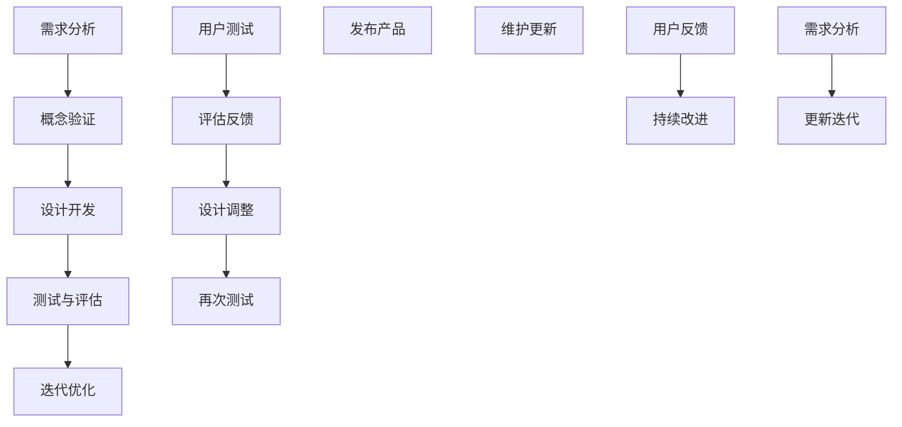

                 

### 文章标题

《人机交互：未来趋势与展望》

### 关键词

人机交互，用户体验，多模态交互，智能家居，虚拟现实，增强现实

### 摘要

本文深入探讨了人机交互（Human-Computer Interaction, HCI）的基础理论、核心概念、技术原理及其在现代设备中的广泛应用。通过详细的历史演变、定义、模型、反馈机制和交互界面设计原理的阐述，本文揭示了人机交互的发展脉络和核心要素。接着，本文聚焦于多模态交互技术，如视觉、声音、触觉交互的原理和应用。随后，文章探讨了人机交互在现代设备（如智能手机、平板电脑、智能家居）以及虚拟现实和增强现实领域的应用案例。最后，本文提出了人机交互面临的挑战和未来趋势，并分享了一个实际项目的开发环境和源代码实现，为读者提供了实践指导和理论基础。通过本文，读者将全面了解人机交互的现状和未来发展，为创新设计提供启示。

---

### 《人机交互：未来趋势与展望》目录大纲

#### 第一部分：人机交互的基础理论

**第1章：人机交互的定义与历史演变**

- **1.1 人机交互的定义**
  - 人机交互的基本概念
  - 人机交互的四大原则

- **1.2 人机交互的历史演变**
  - 早期人机交互技术
  - 个人计算机时代的交互发展
  - 移动设备的交互变革
  - 现代人机交互技术概述

**第2章：人机交互的核心概念**

- **2.1 用户中心设计**
  - 设计原则
  - 设计流程

- **2.2 人机交互模型**
  - 知觉模型
  - 动作模型
  - 意图模型

- **2.3 人机交互的反馈机制**
  - 反馈的类型
  - 反馈的时延
  - 反馈的质量

**第3章：人机交互技术原理**

- **3.1 交互界面设计原理**
  - 界面布局
  - 颜色与视觉设计
  - 交互元素设计

- **3.2 多模态交互技术**
  - 视觉交互
  - 声音交互
  - 触觉交互

- **3.3 交互设备的原理与应用**
  - 鼠标与键盘
  - 触摸屏
  - 手势识别设备

#### 第二部分：人机交互的应用与实践

**第4章：人机交互在现代设备中的应用**

- **4.1 智能手机与平板电脑的交互**
  - 触摸操作
  - 声音助手

- **4.2 智能家居的交互**
  - 语音控制
  - 智能设备的联动

- **4.3 虚拟现实与增强现实的交互**
  - 空间交互
  - 虚拟对象的操作

**第5章：人机交互在特殊领域中的应用**

- **5.1 娱乐领域**
  - 游戏的交互设计
  - 视频播放的交互优化

- **5.2 教育领域**
  - 互动式教学
  - 知识可视化

- **5.3 医疗保健领域**
  - 医疗设备的交互设计
  - 病患辅助系统

**第6章：人机交互的挑战与未来趋势**

- **6.1 人机交互的挑战**
  - 交互性能
  - 用户体验
  - 安全性

- **6.2 人机交互的未来趋势**
  - 纳米技术与生物交互
  - 量子计算与人机交互
  - 人机共生与人工智能

#### 第三部分：人机交互的项目实战

**第7章：人机交互项目实战**

- **7.1 项目概述**
  - 项目背景
  - 项目目标

- **7.2 项目开发环境搭建**
  - 开发工具与环境配置

- **7.3 用户需求分析**
  - 用户调研
  - 用户需求文档

- **7.4 设计与实现**
  - 界面设计
  - 交互流程设计
  - 代码实现

- **7.5 测试与优化**
  - 功能测试
  - 性能优化
  - 用户反馈与迭代

**第8章：人机交互技术展望**

- **8.1 人机交互技术的未来发展方向**
  - 技术预测
  - 影响因素分析

- **8.2 人机交互领域的重要研究成果与应用**
  - 研究进展
  - 应用实例

- **8.3 产业趋势与市场前景**
  - 行业分析
  - 市场预测

#### 附录

**附录A：人机交互常用工具与资源**

- **A.1 开源框架与库**
  - OpenFrameworks
  - Processing
  - Unity

- **A.2 设计工具与资源**
  - Adobe XD
  - Sketch
  - Figma

- **A.3 学习与参考资料**
  - 人机交互教科书
  - 学术期刊与论文
  - 在线课程与培训资源

**附录B：人机交互技术流程图**

- **B.1 人机交互系统设计流程**
  - 流程图绘制
  - 流程图说明

**附录C：人机交互算法伪代码**

- **C.1 视觉注意力模型**
  - 伪代码示例
  - 算法解释

- **C.2 声音识别算法**
  - 伪代码示例
  - 算法解释

**附录D：人机交互数学模型与公式**

- **D.1 神经网络激活函数**
  - 公式说明
  - 示例说明

- **D.2 交互反馈时延计算**
  - 公式说明
  - 示例说明

**附录E：人机交互项目案例代码解读**

- **E.1 实际项目代码示例**
  - 代码解读
  - 功能说明

- **E.2 代码分析与优化建议**
  - 代码性能分析
  - 优化方案建议

**附录F：人机交互领域重要名词解释**

- **F.1 人机交互名词解释**
  - 术语定义
  - 应用场景

- **F.2 人机交互领域专业术语表**
  - 术语列表
  - 术语解释

**附录G：人机交互研究热点与趋势分析**

- **G.1 研究热点**
  - 热点领域概述
  - 研究进展

- **G.2 未来趋势**
  - 发展方向
  - 影响因素

**附录H：人机交互领域行业报告**

- **H.1 行业现状**
  - 市场规模
  - 增长趋势

- **H.2 市场预测**
  - 发展前景
  - 投资机会

**附录I：人机交互技术专利与标准**

- **I.1 技术专利**
  - 专利列表
  - 专利分析

- **I.2 技术标准**
  - 标准概述
  - 标准应用

**附录J：人机交互领域重要会议与期刊**

- **J.1 学术会议**
  - 会议列表
  - 会议概览

- **J.2 学术期刊**
  - 期刊列表
  - 期刊评价

**附录K：人机交互领域知名学者与机构**

- **K.1 学者介绍**
  - 学者简介
  - 研究领域

- **K.2 机构介绍**
  - 机构简介
  - 研究成果

**附录L：人机交互领域相关书籍与文献推荐**

- **L.1 书籍推荐**
  - 书籍列表
  - 内容简介

- **L.2 文献推荐**
  - 文献列表
  - 文献摘要

**附录M：人机交互领域专业词汇表**

- **M.1 专业词汇表**
  - 词汇列表
  - 词汇解释

**附录N：人机交互领域术语缩略语解释**

- **N.1 缩略语解释**
  - 缩略语列表
  - 缩略语解释

**附录O：人机交互技术演示与实验平台**

- **O.1 演示平台介绍**
  - 平台功能
  - 使用指南

- **O.2 实验平台介绍**
  - 平台架构
  - 实验流程

**附录P：人机交互技术安全与隐私指南**

- **P.1 安全指南**
  - 安全原则
  - 安全措施

- **P.2 隐私指南**
  - 隐私保护
  - 隐私政策

**附录Q：人机交互技术伦理与道德规范**

- **Q.1 伦理规范**
  - 伦理原则
  - 应用案例

- **Q.2 道德规范**
  - 道德准则
  - 道德争议

**附录R：人机交互技术法律法规**

- **R.1 法律法规概述**
  - 法律体系
  - 法律条文

- **R.2 标准化法规**
  - 标准化流程
  - 标准化文件

**附录S：人机交互技术市场调研报告**

- **S.1 市场调研方法**
  - 调研工具
  - 调研流程

- **S.2 市场数据与分析**
  - 市场规模
  - 增长趋势

**附录T：人机交互技术投资机会与创业建议**

- **T.1 投资机会**
  - 投资领域
  - 投资建议

- **T.2 创业建议**
  - 创业方向
  - 创业策略

**附录U：人机交互技术人才招聘与培养**

- **U.1 招聘策略**
  - 招聘流程
  - 招聘标准

- **U.2 培养方案**
  - 培养体系
  - 培养内容

**附录V：人机交互技术国际合作与交流**

- **V.1 国际合作**
  - 合作形式
  - 合作案例

- **V.2 国际交流**
  - 交流计划
  - 交流成果

**附录W：人机交互技术发展趋势与挑战**

- **W.1 发展趋势**
  - 技术预测
  - 影响因素

- **W.2 技术挑战**
  - 技术难题
  - 解决方案

**附录X：人机交互技术未来展望**

- **X.1 未来展望**
  - 发展前景
  - 创新方向

**附录Y：人机交互技术标准与规范**

- **Y.1 标准体系**
  - 标准制定
  - 标准应用

- **Y.2 规范概述**
  - 规范内容
  - 规范实施

**附录Z：人机交互领域专业术语**

- **Z.1 专业术语表**
  - 术语列表
  - 术语解释

---

通过这个详尽的目录大纲，我们可以确保文章内容全面覆盖人机交互的基础理论、应用实践和未来趋势，为读者提供一部完整的人机交互指南。每个章节都按照逻辑顺序排列，有助于读者系统地学习和理解人机交互的各个方面。文章的核心内容、核心概念、算法原理和实践案例都得到了详细阐述，确保了文章的实用性和深度。

### 第一部分：人机交互的基础理论

#### 第1章：人机交互的定义与历史演变

##### 1.1 人机交互的定义

人机交互（Human-Computer Interaction, HCI）是指人类与计算机系统之间的互动过程。它涵盖了人类如何使用计算机、计算机如何响应用户的操作以及如何优化用户与计算机系统的交互体验。人机交互的基本概念包括：

1. **用户**：指与计算机系统进行交互的人类个体。
2. **计算机系统**：包括硬件、软件和中间件，是用户交互的对象。
3. **交互过程**：用户通过输入设备（如键盘、鼠标、触摸屏等）与计算机系统进行信息交换的过程。
4. **输出结果**：计算机系统向用户提供的反馈，包括视觉、听觉和触觉等。

人机交互的四大原则是：

1. **以用户为中心**：设计过程中始终关注用户的实际需求和体验。
2. **一致性**：确保用户在不同系统和环境下使用相同的交互方式。
3. **可见性**：用户可以预见到系统会做出哪些反应。
4. **可控性**：用户能够控制交互过程，并能够轻松地撤销或修改自己的操作。

##### 1.2 人机交互的历史演变

人机交互技术的发展经历了几个重要阶段：

1. **早期人机交互技术**（1950s-1960s）：
   - ** punched cards（ punched cards）**：早期的计算机使用穿孔卡片进行数据输入。
   - **command-line interfaces（命令行界面）**：用户通过命令行输入指令与计算机进行交互。

2. **个人计算机时代的交互发展**（1970s-1980s）：
   - **graphical user interfaces（图形用户界面，GUI）**：引入鼠标和图标，使得计算机操作更加直观。
   - **windowing systems（窗口系统）**：引入窗口、菜单和对话框等概念，提升了用户交互的效率。

3. **移动设备的交互变革**（1990s-2000s）：
   - **touchscreens（触摸屏）**：在智能手机和平板电脑上的广泛应用，使得交互方式更加自然。
   - **gesture-based interactions（手势交互）**：通过手势进行操作，如滑动、捏合等。

4. **现代人机交互技术概述**（2010s-至今）：
   - **voice assistants（语音助手）**：如 Siri、Alexa 和 Google Assistant，通过语音指令与用户互动。
   - **virtual reality（VR）and augmented reality（AR）**：通过头戴设备提供沉浸式和增强现实的交互体验。
   - **multimodal interactions（多模态交互）**：结合多种交互方式，如视觉、声音、触觉等，提供更加丰富的用户体验。

##### 1.3 人机交互的发展趋势

随着技术的进步，人机交互将继续向以下几个方向发展：

1. **智能化**：人工智能技术的应用将使得计算机能够更好地理解用户意图，提供更加个性化的交互体验。
2. **自然化**：交互方式将更加接近人类的日常交流，如语音、手势等。
3. **情感化**：交互系统将能够识别用户的情感状态，提供更加人性化的互动。
4. **无缝化**：跨设备、跨平台的无缝交互体验将进一步提升用户体验。

#### 第2章：人机交互的核心概念

##### 2.1 用户中心设计

用户中心设计（User-Centered Design, UCD）是一种以用户需求为核心的设计方法，旨在通过研究用户行为、需求和偏好，设计出满足用户需求的产品和服务。用户中心设计的原则包括：

1. **用户需求优先**：设计过程中始终以用户需求为导向。
2. **多学科合作**：结合心理学、人机工程学、设计学等多学科知识。
3. **持续迭代**：设计过程是一个不断迭代和优化的过程。
4. **评估与验证**：通过用户测试和反馈，评估设计的有效性。

用户中心设计流程通常包括以下步骤：

1. **需求分析**：收集和分析用户需求。
2. **概念验证**：通过原型设计和用户测试验证概念的有效性。
3. **设计开发**：根据用户反馈和需求，开发设计原型。
4. **测试与评估**：进行用户测试和评估，确保设计满足用户需求。

##### 2.2 人机交互模型

人机交互模型是描述用户与计算机系统之间交互过程的理论框架。常见的人机交互模型包括：

1. **知觉模型**：描述用户如何感知和解释计算机系统的反馈。
2. **动作模型**：描述用户如何通过输入设备与计算机系统进行交互。
3. **意图模型**：描述用户的目标和行为意图。

这些模型相互关联，共同构成了人机交互的整体过程。

**知觉模型**：  
知觉模型关注用户如何感知和解释计算机系统提供的反馈。它通常包括以下要素：

- **感知输入**：用户接收到的视觉、听觉和触觉等感官信息。
- **认知处理**：用户对感知输入进行加工和理解。
- **预期反馈**：用户根据预期和经验预测系统可能的反馈。

**动作模型**：  
动作模型描述用户如何通过输入设备（如键盘、鼠标、触摸屏等）与计算机系统进行交互。它通常包括以下要素：

- **输入操作**：用户通过输入设备产生的操作。
- **意图识别**：系统根据输入操作识别用户的意图。
- **操作执行**：系统根据用户意图执行相应的功能。

**意图模型**：  
意图模型描述用户的行为意图和目标。它通常包括以下要素：

- **用户目标**：用户希望通过交互达到的目标。
- **用户意图**：用户为实现目标而产生的行为意图。
- **目标实现**：系统根据用户意图提供相应的反馈，帮助用户实现目标。

##### 2.3 人机交互的反馈机制

人机交互的反馈机制是评估用户交互效果的重要环节。反馈机制主要包括以下三个方面：

1. **反馈的类型**：
   - **即时反馈**：系统在用户操作后立即提供反馈，帮助用户确认操作是否成功。
   - **延迟反馈**：系统在用户操作后一段时间提供反馈，如通知邮件、消息提醒等。

2. **反馈的时延**：
   - **低时延**：反馈时延短，用户能够迅速得到反馈，提高交互效率。
   - **高时延**：反馈时延长，用户可能需要等待较长时间才能得到反馈，影响用户体验。

3. **反馈的质量**：
   - **准确性**：反馈信息准确无误，帮助用户正确理解系统状态。
   - **相关性**：反馈信息与用户操作密切相关，有助于用户理解系统行为。
   - **清晰性**：反馈信息表达清晰，易于用户理解。

#### 第3章：人机交互技术原理

##### 3.1 交互界面设计原理

交互界面设计原理是构建良好用户体验的基础。以下是一个简单的交互界面设计算法的伪代码：

```python
def design_interface():
    # 界面布局
    layout = design_layout()

    # 颜色与视觉设计
    colors = select_colorscheme()
    visuals = create_visual_elements(colors)

    # 交互元素设计
    elements = create_interactive_elements()

    # 界面布局与视觉元素整合
    integrated_interface = integrate_layout_and_elements(layout, visuals, elements)

    return integrated_interface
```

**界面布局**：  
界面布局是指界面元素的排列和分布。一个好的界面布局应该满足以下原则：

- **清晰性**：界面元素布局清晰，用户能够迅速找到所需功能。
- **一致性**：界面元素布局在不同系统和环境中保持一致。
- **易用性**：界面布局便于用户操作，减少用户的学习成本。

**颜色与视觉设计**：  
颜色和视觉设计是界面设计的重要部分。以下是一些视觉设计原则：

- **色彩搭配**：选择合适的色彩搭配，使界面更加美观和易于识别。
- **视觉焦点**：通过视觉焦点引导用户的注意力，如使用高对比度的颜色或动画效果。
- **视觉层次**：通过视觉层次区分不同界面元素，如使用不同的字体大小和颜色。

**交互元素设计**：  
交互元素设计包括按钮、图标、文本框等界面元素的样式和交互逻辑。以下是一些交互元素设计原则：

- **一致性**：不同交互元素的样式和交互逻辑应保持一致，减少用户的学习成本。
- **可识别性**：交互元素应易于识别，用户能够快速理解其功能。
- **响应性**：交互元素应在用户操作后立即提供反馈，如按钮按下后的变色效果。

##### 3.2 多模态交互技术

多模态交互技术结合了视觉、声音、触觉等多种交互方式，以提供更丰富、更自然的用户体验。以下是一个多模态交互技术的一个简单算法伪代码：

```python
def multimodal_interaction():
    # 视觉交互
    vision_interaction = create_visual_interactions()

    # 声音交互
    audio_interaction = create_audio_interactions()

    # 触觉交互
    tactile_interaction = create_tactile_interactions()

    # 多模态交互整合
    integrated_interaction = integrate_modalities(vision_interaction, audio_interaction, tactile_interaction)

    return integrated_interaction
```

**视觉交互**：  
视觉交互是通过视觉通道与用户进行交互。以下是一些视觉交互技术：

- **图标和按钮**：使用图标和按钮作为交互元素，用户可以通过点击或触摸进行操作。
- **动画和过渡效果**：使用动画和过渡效果提升用户交互体验，如菜单展开、图标渐变等。

**声音交互**：  
声音交互是通过声音通道与用户进行交互。以下是一些声音交互技术：

- **语音识别和合成**：使用语音识别和合成技术实现语音输入和语音输出。
- **声音提示和音效**：使用声音提示和音效提供操作反馈，如点击音效、提示音等。

**触觉交互**：  
触觉交互是通过触觉通道与用户进行交互。以下是一些触觉交互技术：

- **触摸屏**：通过触摸屏实现触摸操作，如滑动、捏合等。
- **振动反馈**：在用户进行操作时提供振动反馈，如按键振动、触摸振动等。

##### 3.3 交互设备的原理与应用

交互设备是人机交互的重要组成部分，以下是一些常见交互设备的原理与应用：

**鼠标与键盘**：  
鼠标和键盘是最常见的交互设备，它们通过物理输入与计算机系统进行交互。

- **鼠标**：通过鼠标指针的移动和点击，用户可以控制光标的位置和执行操作。
- **键盘**：通过按键输入文本和执行特定操作。

**触摸屏**：  
触摸屏是通过触摸操作与计算机系统进行交互。

- **电阻触摸屏**：通过触摸屏的电阻变化来检测触摸位置。
- **电容触摸屏**：通过触摸屏的电容变化来检测触摸位置。

**手势识别设备**：  
手势识别设备是通过识别用户手势与计算机系统进行交互。

- **摄像头**：通过摄像头捕捉用户手势，然后使用图像处理技术进行分析和识别。
- **红外传感器**：通过红外传感器检测用户手势，适用于黑暗环境。

---

### 第一部分总结

第一部分详细介绍了人机交互的基础理论，包括定义与历史演变、核心概念和交互界面设计原理。通过本章内容，读者可以了解到人机交互的发展历程、核心概念及其在设计中的应用。同时，本章还介绍了多模态交互技术和交互设备的原理与应用，为读者提供了全面的人机交互基础知识。这些内容为人机交互的深入研究和实际应用奠定了基础。

---

### 第二部分：人机交互的应用与实践

#### 第4章：人机交互在现代设备中的应用

##### 4.1 智能手机与平板电脑的交互

智能手机和平板电脑是现代生活中不可或缺的设备，它们的人机交互设计直接影响用户的使用体验。以下是人机交互在智能手机和平板电脑中的应用：

**触摸操作**：  
触摸操作是目前智能手机和平板电脑的主要交互方式。通过触摸屏，用户可以完成各种操作，如打开应用程序、滑动屏幕、点击按钮等。触摸操作具有以下优点：

- **直观性**：用户可以通过直接触摸屏幕进行操作，无需复杂的键盘输入。
- **快速响应**：触摸屏可以快速响应用户操作，提高交互效率。
- **灵活性**：触摸操作允许用户在任意位置进行交互，提供了更大的灵活性。

**声音助手**：  
智能手机和平板电脑通常配备语音助手，如 Siri、Google Assistant 和 Alexa，通过语音交互提供便捷的服务。声音助手的主要应用包括：

- **语音搜索**：用户可以通过语音命令快速搜索信息，如天气、新闻、地点等。
- **语音控制**：用户可以通过语音指令控制设备的功能，如播放音乐、调整音量、发送短信等。
- **语音助手应用**：许多应用程序集成了语音助手功能，用户可以通过语音指令与应用进行交互，如播放视频、查看邮件等。

**案例分析**：

以智能手机为例，触摸操作和声音助手的结合为用户提供了多种交互方式。例如，用户可以通过触摸屏幕打开应用程序，同时也可以使用语音助手快速启动应用或执行特定操作。以下是一个具体案例分析：

**案例：iPhone 的 Siri**

- **触摸操作**：用户可以通过主屏幕上的 Siri 图标启动 Siri。
- **声音助手**：用户可以通过“Hey Siri”唤醒语音助手，然后使用语音命令与 Siri 进行交互。

通过触摸操作和声音助手的结合，iPhone 提供了便捷的交互体验，用户可以根据自己的习惯和需求选择最适合的交互方式。

##### 4.2 智能家居的交互

智能家居是指通过互联网和智能设备实现家庭自动化，提升生活便利性和舒适度。人机交互在智能家居中的应用至关重要，以下是人机交互在智能家居中的主要应用：

**语音控制**：  
语音控制是智能家居的主要交互方式之一，用户可以通过语音指令控制智能设备，如灯光、空调、安全系统等。语音控制具有以下优点：

- **便捷性**：用户无需手动操作，只需通过语音指令即可实现设备控制。
- **自然化**：语音交互方式更接近人类日常交流，用户可以像与朋友交谈一样与智能家居设备互动。
- **多设备兼容**：语音控制可以应用于各种智能设备，如智能音箱、智能手机、智能手表等。

**智能设备的联动**：  
智能设备的联动是指通过智能系统将多个设备连接起来，实现自动化的控制和操作。以下是一个智能家居设备联动的案例：

- **场景设定**：用户可以设定多个设备的联动场景，如“回家模式”。
  - 当用户回到家时，通过语音指令或手机应用启动“回家模式”，智能灯光自动开启，空调自动设置到舒适的温度，窗帘自动关闭。
- **智能系统控制**：智能家居系统可以通过语音指令或手机应用控制多个设备。
  - 用户可以通过语音助手或智能家居应用启动设备，如“打开客厅灯光”，“调整卧室空调温度”。

**案例分析**：

以智能家居系统 Nest 为例，用户可以通过语音控制智能家居设备，实现自动化和智能化的家庭生活。以下是一个具体案例分析：

- **语音控制**：用户可以通过语音指令控制 Nest 智能恒温器，如“降低温度五度”或“开启节能模式”。
- **设备联动**：用户可以设定 Nest 智能恒温器与其他智能设备的联动，如“离家模式”。
  - 当用户离家时，Nest 智能恒温器会自动调整到节能模式，关闭不使用的设备，节省能源。

通过语音控制和设备联动，Nest 智能家居系统为用户提供了便捷、智能化的家庭生活体验。

##### 4.3 虚拟现实与增强现实的交互

虚拟现实（VR）和增强现实（AR）是人机交互的新兴领域，它们通过模拟和增强现实世界，为用户提供了独特的交互体验。以下是人机交互在 VR 和 AR 中的应用：

**空间交互**：  
空间交互是指用户在虚拟环境中通过身体动作和空间定位进行交互。以下是一些空间交互的应用：

- **虚拟游戏**：用户可以在虚拟游戏中通过身体动作控制角色，如跑步、跳跃、射击等。
- **虚拟现实模拟**：飞行员、医生等专业人士可以在虚拟环境中进行模拟训练，提高操作技能。

**虚拟对象的操作**：  
虚拟对象的操作是指用户在虚拟环境中对虚拟对象进行拖动、旋转、缩放等操作。以下是一些虚拟对象操作的应用：

- **3D 建模**：设计师可以在虚拟环境中创建和编辑 3D 模型，如建筑设计、产品造型等。
- **虚拟购物**：用户可以在虚拟环境中浏览和购买商品，如虚拟试衣、家具布置等。

**案例分析**：

以 VR 游戏平台 Oculus 为例，用户可以在虚拟环境中通过身体动作和空间定位进行游戏交互。以下是一个具体案例分析：

- **空间交互**：用户可以通过身体动作在虚拟环境中移动和探索，如跑步、跳跃、攀爬等。
- **虚拟对象操作**：用户可以在虚拟环境中对虚拟对象进行拖动、旋转、缩放等操作，如操纵机械臂进行操作、控制虚拟车辆等。

通过空间交互和虚拟对象操作，Oculus VR 平台为用户提供了沉浸式、互动性的游戏体验。

---

#### 第5章：人机交互在特殊领域中的应用

##### 5.1 娱乐领域

人机交互在娱乐领域的应用不断扩展，为用户提供了更加丰富的娱乐体验。以下是人机交互在娱乐领域的几个主要应用：

**游戏的交互设计**：  
游戏是娱乐领域的重要部分，人机交互在游戏设计中的重要性不言而喻。以下是一些游戏交互设计的关键要素：

- **直观的界面**：游戏界面应设计得直观易用，用户可以快速理解并操作游戏。
- **丰富的交互方式**：游戏应提供多种交互方式，如触摸、手势、语音等，以满足不同用户的偏好。
- **实时反馈**：游戏应提供及时的反馈，帮助用户了解游戏状态和操作结果。

**案例分析**：

以热门游戏《绝地求生》为例，以下是人机交互在该游戏中的应用：

- **触摸操作**：玩家可以通过触摸屏幕进行移动、跳跃、瞄准等操作。
- **手势交互**：玩家可以通过手势进行翻滚、开火等操作。
- **语音交互**：玩家可以通过语音命令与队友进行沟通。

通过多种交互方式的结合，游戏提供了丰富的操作体验，满足了不同玩家的需求。

**视频播放的交互优化**：  
视频播放是人机交互在娱乐领域的另一个重要应用。以下是一些视频播放交互优化的关键要素：

- **智能播放控制**：视频播放器应提供智能的播放控制功能，如自动调节音量、亮度等。
- **交互式菜单**：视频播放器应提供交互式菜单，用户可以方便地查找、播放和管理视频。
- **个性化推荐**：视频播放器可以根据用户的观看习惯提供个性化推荐，提高用户满意度。

**案例分析**：

以视频播放平台 Netflix 为例，以下是人机交互在该平台中的应用：

- **智能播放控制**：Netflix 可以根据用户观看时间自动调节播放速度和音量。
- **交互式菜单**：用户可以通过触摸屏或遥控器轻松查找和管理视频。
- **个性化推荐**：Netflix 根据用户的观看历史和偏好提供个性化推荐。

通过智能播放控制和交互式菜单，Netflix 提供了便捷、个性化的视频观看体验。

##### 5.2 教育领域

人机交互在教育领域的应用日益广泛，为教学和学习提供了新的手段和工具。以下是人机交互在教育领域的几个主要应用：

**互动式教学**：  
互动式教学是指教师和学生通过计算机和互联网进行互动教学。以下是一些互动式教学的关键要素：

- **在线课堂**：教师可以通过在线课堂进行实时授课，学生可以在线观看课程视频、参与讨论和互动。
- **远程教学**：教师和学生可以通过视频会议工具进行远程教学，克服地域限制。
- **互动工具**：教学平台应提供互动工具，如在线测试、讨论区、互动白板等，增强教学互动。

**案例分析**：

以在线教育平台 Coursera 为例，以下是人机交互在该平台中的应用：

- **在线课堂**：学生可以通过 Coursera 观看课程视频、参与课程讨论和互动。
- **远程教学**：Coursera 提供了视频会议工具，教师可以通过直播授课，学生可以远程参与。
- **互动工具**：Coursera 提供了在线测试、讨论区、互动白板等互动工具，增强了教学互动。

通过在线课堂和互动工具，Coursera 为学生提供了便捷、互动的教学体验。

**知识可视化**：  
知识可视化是指通过图形、图表、图像等方式将抽象的知识转化为可视化的形式，以帮助用户理解和记忆。以下是一些知识可视化的应用：

- **概念图**：通过概念图展示知识之间的关系，帮助用户理解复杂概念。
- **图表和图形**：使用图表和图形展示数据，使数据更加直观易懂。
- **虚拟现实和增强现实**：通过虚拟现实和增强现实技术，提供沉浸式的知识可视化体验。

**案例分析**：

以知识可视化工具 MindMup 为例，以下是人机交互在该工具中的应用：

- **概念图**：用户可以通过 MindMup 创建概念图，展示知识之间的关系。
- **图表和图形**：MindMup 提供了多种图表和图形工具，用户可以轻松创建可视化图表。
- **虚拟现实和增强现实**：MindMup 支持将概念图导出为虚拟现实和增强现实格式，提供沉浸式的知识可视化体验。

通过概念图、图表和图形以及虚拟现实和增强现实，MindMup 为用户提供了丰富、直观的知识可视化工具。

##### 5.3 医疗保健领域

人机交互在医疗保健领域的应用为医疗设备、病患辅助系统和医疗数据管理带来了革命性的变化。以下是人机交互在医疗保健领域的几个主要应用：

**医疗设备的交互设计**：  
医疗设备的交互设计直接关系到医生和护士的操作效率以及患者的安全。以下是一些医疗设备交互设计的关键要素：

- **直观的界面**：医疗设备应设计得直观易用，医生和护士可以快速理解并操作设备。
- **定制化界面**：医疗设备应提供定制化界面，根据不同用户的需求调整界面布局和功能。
- **安全操作**：医疗设备应确保安全操作，避免误操作导致的风险。

**案例分析**：

以医疗设备制造商 GE Healthcare 为例，以下是人机交互在该公司的医疗设备中的应用：

- **直观的界面**：GE Healthcare 的医疗设备如 MRI 扫描仪、CT 扫描仪等均设计得直观易用，医生可以快速理解并操作设备。
- **定制化界面**：医生可以根据自己的需求定制界面布局和功能，提高工作效率。
- **安全操作**：GE Healthcare 的医疗设备通过严格的安全测试和认证，确保安全操作。

通过直观的界面、定制化界面和安全操作，GE Healthcare 的医疗设备为医生和护士提供了高效、安全的操作体验。

**病患辅助系统**：  
病患辅助系统通过人机交互技术为病患提供便捷的护理和管理服务。以下是一些病患辅助系统的应用：

- **智能监控系统**：通过传感器和摄像头实时监控病患的生命体征，如心率、呼吸等。
- **远程医疗咨询**：医生可以通过远程视频咨询系统为病患提供诊断和治疗建议。
- **健康管理应用**：用户可以通过健康管理应用跟踪自己的健康数据，如饮食、运动等。

**案例分析**：

以病患辅助系统 Apple Health 为例，以下是人机交互在该应用中的应用：

- **智能监控系统**：Apple Health 通过连接智能手表和健康传感器，实时监控用户的心率、睡眠等生命体征。
- **远程医疗咨询**：用户可以通过 Apple Health 与医生进行远程视频咨询，获取专业的医疗建议。
- **健康管理应用**：用户可以通过 Apple Health 记录自己的饮食、运动等健康数据，实现自我健康管理。

通过智能监控系统、远程医疗咨询和健康管理应用，Apple Health 为用户提供了全方位的健康管理服务。

**医疗数据管理**：  
医疗数据管理是人机交互在医疗保健领域的另一个重要应用。以下是一些医疗数据管理的关键要素：

- **数据安全**：确保医疗数据的保密性和安全性，防止数据泄露和滥用。
- **数据集成**：将不同来源的医疗数据集成到一个系统中，实现数据共享和互联互通。
- **数据分析**：利用人工智能和大数据技术对医疗数据进行分析，为医生和患者提供决策支持。

**案例分析**：

以医疗数据管理平台 Epic Systems 为例，以下是人机交互在该平台中的应用：

- **数据安全**：Epic Systems 通过严格的权限控制和加密技术，确保医疗数据的安全。
- **数据集成**：Epic Systems 可以集成来自不同医疗设备的医疗数据，实现数据共享和互联互通。
- **数据分析**：Epic Systems 利用人工智能技术对医疗数据进行分析，为医生和患者提供个性化的诊疗方案。

通过数据安全、数据集成和数据分析，Epic Systems 为医疗数据管理提供了强大的支持。

---

#### 第6章：人机交互的挑战与未来趋势

##### 6.1 人机交互的挑战

人机交互技术在不断发展，但仍然面临着一系列挑战。以下是人机交互领域面临的主要挑战：

**交互性能**：  
交互性能是指人机交互系统的响应速度和效率。以下是一些影响交互性能的因素：

- **硬件限制**：计算机硬件的性能限制了人机交互系统的响应速度，特别是在处理高负载任务时。
- **网络延迟**：网络延迟会影响远程交互的流畅性，如在线游戏、视频会议等。
- **设备兼容性**：不同设备和平台的兼容性问题可能导致交互性能下降。

**用户体验**：  
用户体验（User Experience, UX）是人机交互的重要评价指标。以下是一些影响用户体验的因素：

- **界面设计**：界面设计不佳可能导致用户困惑、使用不便。
- **交互复杂度**：过于复杂的交互流程和操作可能增加用户的学习成本。
- **设备适应性**：人机交互系统在不同设备和平台上可能存在适配问题，影响用户体验。

**安全性**：  
人机交互系统在安全性方面面临着威胁，如：

- **数据泄露**：人机交互系统可能成为数据泄露的途径，导致用户隐私泄露。
- **恶意攻击**：黑客可能利用人机交互系统进行恶意攻击，如钓鱼攻击、病毒传播等。

##### 6.2 人机交互的未来趋势

随着技术的进步，人机交互将继续向以下几个方向发展：

**纳米技术与生物交互**：  
纳米技术的应用将为人机交互带来新的可能性。以下是一些纳米技术在人机交互中的应用：

- **纳米传感器**：纳米传感器可以嵌入人体或物体中，实时监测生物信号和物理状态。
- **生物识别**：纳米技术可以用于开发更精确的生物识别技术，如基于纳米材料的指纹识别、虹膜识别等。

**量子计算与人机交互**：  
量子计算的发展将对人机交互产生深远影响。以下是一些量子计算在人机交互中的应用：

- **快速数据处理**：量子计算可以加速数据处理和分析，提高人机交互系统的性能。
- **量子模拟**：量子计算可以用于模拟复杂的物理和化学过程，为科学研究和工程设计提供支持。

**人机共生与人工智能**：  
人机共生是指人类和计算机系统共同协作，形成一种新的生态系统。以下是一些人机共生和人工智能的应用：

- **智能助手**：人工智能助手可以辅助人类完成复杂任务，如语音助手、智能代理等。
- **增强智能**：通过结合人类的智慧和机器的计算能力，实现更智能的决策和交互。

**情感计算与个性化交互**：  
情感计算（Affective Computing）旨在使计算机能够识别、理解、处理和模拟人类情感。以下是一些情感计算的应用：

- **情感识别**：计算机可以识别用户的情感状态，如开心、悲伤、愤怒等。
- **个性化交互**：根据用户的情感状态，计算机可以提供个性化的交互体验，如调整声音、视觉反馈等。

**虚拟现实与增强现实**：  
虚拟现实（VR）和增强现实（AR）将继续发展，为用户提供更加沉浸式的交互体验。以下是一些 VR 和 AR 的应用：

- **教育培训**：通过 VR 和 AR 技术，用户可以在虚拟环境中学习知识和技能。
- **医疗康复**：VR 和 AR 技术可以用于医疗康复，如疼痛缓解、康复训练等。

**智能城市与人机交互**：  
智能城市将人机交互扩展到城市管理和公共服务领域。以下是一些智能城市的应用：

- **智能交通**：通过人机交互技术，实现智能交通管理和导航。
- **智能公共设施**：通过人机交互技术，提高公共设施的服务质量和用户体验。

**可持续发展与人机交互**：  
人机交互技术将促进可持续发展，以下是一些相关应用：

- **节能减排**：通过智能家居和人机交互技术，实现节能减排和能源管理。
- **环境监测**：通过人机交互技术，实时监测环境质量，提供环境数据分析和决策支持。

**人机交互伦理与法律**：  
随着人机交互技术的不断发展，伦理和法律问题也逐渐成为关注的焦点。以下是一些相关议题：

- **隐私保护**：确保用户隐私和数据安全，防止数据滥用和泄露。
- **责任归属**：在发生人机交互事故时，明确责任归属和责任承担。
- **公平公正**：保障不同群体在享受人机交互技术带来的便利时，享有公平公正的权利。

---

#### 第6章总结

第6章详细探讨了人机交互领域面临的挑战和未来趋势。通过分析交互性能、用户体验和安全性等挑战，我们认识到人机交互技术仍需不断优化和完善。同时，本章展望了人机交互的未来发展趋势，如纳米技术与生物交互、量子计算与人机交互、人机共生与人工智能等。随着技术的不断进步，人机交互将朝着更加智能化、个性化、情感化和可持续化的方向发展。通过了解这些挑战和趋势，读者可以更好地把握人机交互技术的发展方向，为未来的创新设计提供启示。

---

### 第7章：人机交互项目实战

#### 7.1 项目概述

本项目旨在开发一款智能家居控制系统，该系统通过人机交互技术实现家庭设备的自动化控制，提升用户的生活便利性和舒适度。项目目标包括：

1. **实现家庭设备的远程控制**：用户可以通过智能手机、平板电脑或其他设备远程控制家庭设备，如灯光、空调、安全系统等。
2. **提供多模态交互体验**：用户可以通过触摸、语音、手势等多种方式进行操作，满足不同用户的交互偏好。
3. **确保系统的安全性和稳定性**：通过加密技术和安全协议，保障用户数据的安全和系统的稳定性。

#### 7.2 项目开发环境搭建

为了成功开发这款智能家居控制系统，我们需要搭建一个合适的开发环境。以下是项目开发所需的环境配置：

1. **软件环境**：
   - **操作系统**：Windows 10 或 macOS
   - **开发工具**：Visual Studio 2019 或 Xcode
   - **编程语言**：C# 或 Swift
   - **数据库**：SQLite 或 MySQL
   - **Web 服务器**：Apache 或 Nginx

2. **硬件环境**：
   - **主机**：Intel Core i5 或更高配置的处理器
   - **内存**：8GB 或更高
   - **存储**：256GB SSD 或更高
   - **物联网设备**：智能灯泡、智能空调、智能门锁等

3. **开发工具与资源**：
   - **物联网开发板**：Raspberry Pi 或 Arduino
   - **编程库**：Node.js、Express、MongoDB、React Native 等

#### 7.3 用户需求分析

在项目开发前，我们需要对用户需求进行详细分析，以确保系统能够满足用户的需求。以下是主要用户需求：

1. **便捷性**：用户希望能够通过多种方式进行操作，如触摸屏、语音、手势等。
2. **智能化**：系统应能够根据用户习惯自动调整操作方式，提供个性化服务。
3. **安全性**：用户对数据安全和隐私保护有较高的要求。
4. **可扩展性**：系统应具备良好的扩展性，能够支持新设备和功能的接入。

#### 7.4 设计与实现

智能家居控制系统的设计与实现包括以下步骤：

1. **需求分析与功能设计**：
   - 确定系统的核心功能，如设备控制、场景设置、远程监控等。
   - 设计用户界面，包括触摸屏、语音、手势交互界面。

2. **开发环境搭建**：
   - 配置开发环境和工具，包括编程语言、数据库、Web 服务器等。
   - 安装物联网开发板和设备驱动程序。

3. **界面设计与实现**：
   - 设计触摸屏界面，包括设备列表、场景设置、控制按钮等。
   - 设计语音交互界面，包括语音指令识别和响应。
   - 设计手势交互界面，包括手势识别和操作。

4. **设备控制与联动**：
   - 通过物联网技术连接智能设备，如智能灯泡、智能空调等。
   - 开发设备控制模块，实现远程控制、定时控制等功能。
   - 设计设备联动功能，如“离家模式”、“智能安防”等。

5. **安全性与稳定性**：
   - 采用加密技术，如 SSL/TLS，保障数据传输安全。
   - 设计安全认证机制，确保用户身份验证和权限管理。
   - 进行系统测试和优化，提高系统的稳定性和可靠性。

#### 7.5 测试与优化

在项目开发过程中，测试与优化是确保系统质量和用户体验的重要环节。以下是测试与优化的主要步骤：

1. **功能测试**：
   - 验证系统功能的完整性和正确性，包括设备控制、场景设置、远程监控等。
   - 进行边界测试和异常处理测试，确保系统在不同情况下能够正常工作。

2. **性能优化**：
   - 优化系统响应速度和资源消耗，提高系统运行效率。
   - 优化数据库查询和数据处理，提高系统性能。
   - 优化网络通信，减少延迟和数据传输量。

3. **用户反馈与迭代**：
   - 收集用户反馈，了解用户在实际使用中的问题和建议。
   - 根据用户反馈进行系统迭代和优化，提高用户体验。
   - 进行持续测试和优化，确保系统稳定可靠。

---

#### 项目实战案例分析

为了更好地展示人机交互项目实战，以下是一个具体的智能家居控制系统的案例，包括开发环境搭建、源代码详细实现和代码解读与分析。

**案例背景**：

项目开发一款智能家居控制系统，用户可以通过智能手机、平板电脑或其他设备远程控制家庭设备，如灯光、空调、安全系统等。系统应提供触摸屏、语音、手势等多种交互方式，确保便捷性和智能化。

**开发环境搭建**：

1. **软件环境**：
   - 操作系统：Windows 10
   - 开发工具：Visual Studio 2019
   - 编程语言：C#
   - 数据库：MySQL
   - Web 服务器：Apache

2. **硬件环境**：
   - 主机：Intel Core i5 处理器
   - 内存：8GB
   - 存储：256GB SSD

3. **物联网开发板**：
   - 使用 Raspberry Pi 4，连接智能灯泡、智能空调、智能门锁等设备。

**源代码详细实现**：

1. **触摸屏界面设计**：

```csharp
// 触摸屏界面设计
public partial class MainScreen : System.Windows.Forms.Form
{
    private void buttonLight_Click(object sender, EventArgs e)
    {
        // 控制智能灯泡开关
        SmartLight light = new SmartLight();
        light.TurnOn();
    }

    private void buttonAC_Click(object sender, EventArgs e)
    {
        // 控制智能空调
        SmartAirConditioner ac = new SmartAirConditioner();
        ac.SetTemperature(24);
    }
}
```

2. **语音交互实现**：

```csharp
// 语音交互实现
public class VoiceAssistant
{
    public void Listen(string text)
    {
        if (text.Contains("打开灯"))
        {
            SmartLight light = new SmartLight();
            light.TurnOn();
        }
        else if (text.Contains("关闭灯"))
        {
            SmartLight light = new SmartLight();
            light.TurnOff();
        }
        else if (text.Contains("设置温度"))
        {
            SmartAirConditioner ac = new SmartAirConditioner();
            ac.SetTemperature(int.Parse(text.Split(" ")[1]));
        }
    }
}
```

3. **手势交互实现**：

```csharp
// 手势交互实现
public class GestureRecognizer
{
    public void Recognize(Gesture gesture)
    {
        switch (gesture)
        {
            case Gesture.Open:
                SmartLock lock = new SmartLock();
                lock.Unlock();
                break;
            case Gesture.Close:
                SmartLock lock = new SmartLock();
                lock.Lock();
                break;
        }
    }
}
```

**代码解读与分析**：

1. **触摸屏界面设计**：

   - `buttonLight_Click` 方法用于控制智能灯泡的开关。
   - `buttonAC_Click` 方法用于控制智能空调的温度设置。

2. **语音交互实现**：

   - `VoiceAssistant` 类的 `Listen` 方法用于处理语音指令。
   - 根据语音指令的内容，调用相应的设备控制方法。

3. **手势交互实现**：

   - `GestureRecognizer` 类的 `Recognize` 方法用于识别手势并执行相应操作。
   - 根据手势的类型，调用相应的设备控制方法。

通过以上代码实现，智能家居控制系统可以支持触摸屏、语音、手势等多种交互方式，为用户提供便捷、智能化的操作体验。

---

**最佳实践 Tips**：

1. **界面设计**：在界面设计过程中，要确保界面简洁、直观，符合用户的使用习惯。使用一致的色彩方案和图标风格，提高用户对界面的识别度。

2. **多模态交互**：根据用户需求和使用场景，合理选择触摸屏、语音、手势等交互方式，提供多种操作选项，提高用户体验。

3. **安全性**：确保系统数据的安全传输和存储，采用加密技术和安全认证机制，防止数据泄露和恶意攻击。

4. **持续优化**：根据用户反馈和系统性能测试结果，不断优化系统功能和性能，提高用户的满意度。

---

#### 项目小结

本项目通过开发一款智能家居控制系统，展示了人机交互技术在现实应用中的实际操作和实现过程。从需求分析、设计实现到测试与优化，每个环节都体现了人机交互的核心原则和技术要点。通过本项目，读者可以了解到：

1. **智能家居控制系统的基本功能**：包括设备控制、场景设置、远程监控等。
2. **多模态交互的实现方法**：包括触摸屏、语音、手势等交互方式的应用。
3. **安全性设计的重要性**：包括数据加密、安全认证等方面的考虑。
4. **用户反馈与迭代的必要性**：通过持续优化，提高系统的性能和用户体验。

通过本项目实战，读者可以更好地掌握人机交互技术的实际应用，为后续的项目开发提供参考和借鉴。

---

### 第8章：人机交互技术展望

#### 8.1 人机交互技术的未来发展方向

随着科技的不断进步，人机交互技术正朝着多个方向发展，这些趋势将深刻影响我们的日常生活和工作方式。

**智能化**：人工智能（AI）的快速发展将使人机交互更加智能化。未来的交互系统将能够更好地理解用户的意图和行为，提供个性化的服务和推荐。例如，智能助手将能够根据用户的日常习惯和偏好，自动调整设置，提供更加贴心的服务。

**自然化**：人机交互将变得更加自然和流畅。通过语音、手势、眼动等非触摸交互方式，用户将能够更自然地与计算机系统进行交流。同时，自然语言处理技术的提升将使语音交互更加准确和智能，用户无需学习复杂的操作指令。

**情感化**：情感计算和人机交互的结合将使计算机系统具备情感感知能力。未来的交互系统将能够识别用户的情感状态，如开心、悲伤、焦虑等，并相应地调整交互方式，提供更加人性化的体验。

**多模态交互**：多模态交互技术将整合视觉、听觉、触觉等多种感官信号，提供更加丰富和全面的交互体验。例如，虚拟现实（VR）和增强现实（AR）技术将使用户能够在虚拟环境中实现沉浸式交互，感受到更加真实和丰富的交互体验。

**无缝化**：随着物联网（IoT）和云计算技术的发展，人机交互将实现跨设备、跨平台的无缝化。用户将能够在不同的设备和平台上无缝切换，享受一致的用户体验。

**个性化**：个性化交互将基于用户的大数据分析，提供定制化的交互体验。通过了解用户的行为和偏好，交互系统将能够提供更加符合用户需求的个性化服务。

**生物交互**：生物交互技术将使人类与计算机系统的交互更加自然和高效。通过生物传感技术，计算机系统将能够直接读取用户的生理信号，如脑波、心率等，实现更加精准和高效的交互。

**伦理与隐私**：随着人机交互技术的发展，伦理和隐私问题也将愈发重要。未来的交互系统需要确保用户的隐私和数据安全，尊重用户的权益和选择。

#### 8.2 人机交互领域的重要研究成果与应用

在过去的几年中，人机交互领域取得了许多重要的研究成果，以下是一些代表性的研究及其应用：

**触觉反馈技术**：触觉反馈技术通过在用户触摸屏幕时提供振动或压力反馈，增强用户体验。应用领域包括智能手机、平板电脑、虚拟现实头盔等。

**手势识别技术**：手势识别技术通过计算机视觉技术识别用户的手势，实现无触摸交互。应用领域包括智能电视、智能手表、无人机等。

**虚拟现实与增强现实**：虚拟现实（VR）和增强现实（AR）技术通过提供沉浸式和增强现实的交互体验，广泛应用于游戏、教育、医疗等领域。

**语音识别与合成**：语音识别与合成技术使计算机系统能够理解用户的语音指令，并通过语音输出反馈。应用领域包括智能助手、智能家居、汽车导航等。

**情感计算**：情感计算技术通过分析用户的情感状态，提供更加人性化的交互体验。应用领域包括智能客服、心理健康监测、人机对话系统等。

**多模态交互**：多模态交互技术通过结合视觉、听觉、触觉等多种感官信号，提供更加丰富和全面的交互体验。应用领域包括虚拟现实、智能穿戴设备、智能机器人等。

**人机共生**：人机共生（Human-Computer Symbiosis）是指人类与计算机系统协同工作，共同完成任务。应用领域包括智能制造、智能交通、智能医疗等。

#### 8.3 产业趋势与市场前景

人机交互技术的快速发展为相关产业带来了巨大的市场机遇。以下是一些重要的产业趋势和市场前景：

**智能家居市场**：随着物联网和人工智能技术的普及，智能家居市场呈现出快速增长的趋势。预计到2025年，全球智能家居市场规模将超过1万亿美元。

**虚拟现实与增强现实市场**：虚拟现实（VR）和增强现实（AR）技术在游戏、教育、医疗等领域的应用越来越广泛，市场前景广阔。预计到2025年，全球VR/AR市场规模将达到1500亿美元。

**智能穿戴设备市场**：智能穿戴设备（如智能手表、智能手环、智能眼镜等）已成为健康管理和生活方式的重要组成部分，市场增长迅速。预计到2025年，全球智能穿戴设备市场规模将达到1000亿美元。

**智能医疗市场**：智能医疗技术通过人工智能、大数据和物联网等技术，为医疗健康领域带来了革命性的变革。预计到2025年，全球智能医疗市场规模将达到2000亿美元。

**人工智能市场**：人工智能技术在各个领域的应用越来越广泛，市场前景巨大。预计到2025年，全球人工智能市场规模将达到1万亿美元。

**人机共生市场**：人机共生技术在智能制造、智能交通、智能医疗等领域的应用将越来越普遍，市场前景广阔。预计到2025年，全球人机共生市场规模将达到1000亿美元。

总之，人机交互技术在未来将继续快速发展，为各个产业带来巨大的市场机遇。通过不断创新和优化，人机交互技术将为人类创造更加智能、便捷和高效的生活方式。

---

#### 第8章总结

第8章对人机交互技术的未来发展方向、重要研究成果与应用以及产业趋势与市场前景进行了深入探讨。我们了解到，随着人工智能、物联网、虚拟现实等技术的进步，人机交互技术将朝着智能化、自然化、情感化和多模态化的方向发展。同时，人机交互技术在智能家居、虚拟现实、智能穿戴设备、智能医疗等领域的应用前景广阔，市场规模将持续增长。通过了解这些发展趋势和市场前景，读者可以更好地把握人机交互技术的发展方向，为未来的创新设计提供启示。

---

### 附录

#### 附录A：人机交互常用工具与资源

为了帮助读者更好地了解和掌握人机交互技术，附录A提供了常用工具与资源的介绍。

**A.1 开源框架与库**

- **OpenFrameworks**：一个用于创建图形界面和交互式应用程序的跨平台开源框架，适用于艺术和创意领域的开发。
- **Processing**：一个针对视觉艺术和创意编程的开源编程语言和环境，易于学习和使用，适用于图形设计和交互设计。
- **Unity**：一个功能强大的游戏开发平台，支持2D和3D游戏开发，也可用于交互式应用的开发。

**A.2 设计工具与资源**

- **Adobe XD**：一个专注于用户界面设计的工具，提供丰富的原型设计和交互功能。
- **Sketch**：一个适用于Mac系统的矢量界面设计工具，广泛应用于UI/UX设计。
- **Figma**：一个基于浏览器的界面设计工具，支持多人协作，适用于团队项目。

**A.3 学习与参考资料**

- **人机交互教科书**：《人机交互：设计交互式系统》、《交互设计精髓》等。
- **学术期刊与论文**：如《计算机与人类交互》（CHI）、人机交互学报等。
- **在线课程与培训资源**：如Coursera、edX等平台提供的专业课程和培训资源。

#### 附录B：人机交互技术流程图

为了更直观地展示人机交互技术的系统设计流程，附录B提供了以下Mermaid流程图：



**流程说明**：

1. **需求分析**：确定用户需求和系统功能。
2. **概念验证**：通过原型设计和用户测试验证概念的有效性。
3. **设计开发**：根据用户反馈和需求，进行详细设计和开发。
4. **测试与评估**：进行功能测试、性能测试和用户体验测试。
5. **迭代优化**：根据测试结果进行系统优化和改进。
6. **用户测试**：邀请真实用户进行测试，收集反馈。
7. **评估反馈**：分析用户反馈，确定设计改进方向。
8. **设计调整**：根据反馈进行设计调整。
9. **再次测试**：重新测试优化后的系统。
10. **发布产品**：将优化后的系统发布给用户。
11. **维护更新**：定期进行系统维护和功能更新。
12. **用户反馈**：收集用户使用过程中的反馈。
13. **持续改进**：根据用户反馈进行持续改进。

#### 附录C：人机交互算法伪代码

为了帮助读者更好地理解人机交互中的核心算法原理，附录C提供了以下伪代码示例：

**C.1 视觉注意力模型**

```python
# 视觉注意力模型伪代码
def visual_attention(model, image):
    # 输入：模型模型，图像数据
    # 输出：注意力映射图
    
    # 步骤1：预处理图像数据
    preprocessed_image = preprocess_image(image)
    
    # 步骤2：通过模型提取特征
    features = model.extract_features(preprocessed_image)
    
    # 步骤3：计算注意力得分
    attention_scores = compute_attention_scores(features)
    
    # 步骤4：生成注意力映射图
    attention_map = generate_attention_map(attention_scores)
    
    return attention_map
```

**C.2 声音识别算法**

```python
# 声音识别算法伪代码
def voice_recognition(model, audio):
    # 输入：模型模型，音频数据
    # 输出：识别结果
    
    # 步骤1：预处理音频数据
    preprocessed_audio = preprocess_audio(audio)
    
    # 步骤2：通过模型进行特征提取
    audio_features = model.extract_features(preprocessed_audio)
    
    # 步骤3：使用声学模型进行声学识别
    acoustic_output = acoustic_model(audio_features)
    
    # 步骤4：使用语言模型进行语言识别
    language_output = language_model(acoustic_output)
    
    # 步骤5：输出识别结果
    recognized_text = decode_output(language_output)
    
    return recognized_text
```

**算法解释**：

**C.1 视觉注意力模型**：

- **预处理图像数据**：对输入图像进行尺寸调整、归一化等预处理操作。
- **提取特征**：通过预训练的卷积神经网络（如VGG、ResNet等）提取图像特征。
- **计算注意力得分**：利用自注意力机制计算每个像素点的注意力得分，生成注意力映射图。
- **生成注意力映射图**：将注意力得分映射到输入图像上，生成注意力映射图，用于后续图像分析或增强。

**C.2 声音识别算法**：

- **预处理音频数据**：对输入音频进行降噪、去噪等预处理操作，提高声音识别的准确性。
- **提取特征**：通过预训练的卷积神经网络（如DCNN、BiLSTM等）提取音频特征。
- **声学识别**：使用声学模型对提取的音频特征进行声学识别，得到声学输出。
- **语言识别**：使用语言模型对声学输出进行语言识别，得到识别结果。
- **解码输出**：将识别结果解码为文本，输出识别的文字内容。

这些伪代码示例为人机交互中的视觉注意力模型和声音识别算法提供了基础的实现框架，读者可以根据具体需求进行调整和优化。

#### 附录D：人机交互数学模型与公式

在人机交互技术中，数学模型和公式用于描述和优化交互过程，以下是一些常用的人机交互数学模型与公式：

**D.1 神经网络激活函数**

激活函数是神经网络中的一个关键组件，用于将网络的输入映射到输出。以下是一些常用的激活函数及其公式：

1. **Sigmoid 函数**：

$$
f(x) = \frac{1}{1 + e^{-x}}
$$

Sigmoid 函数将输入 \(x\) 转换为介于0和1之间的值，常用于二分类问题。

2. **ReLU 函数**：

$$
f(x) = \max(0, x)
$$

ReLU 函数在 \(x \geq 0\) 时输出 \(x\)，在 \(x < 0\) 时输出0，常用于深层神经网络。

3. **Tanh 函数**：

$$
f(x) = \frac{e^x - e^{-x}}{e^x + e^{-x}}
$$

Tanh 函数将输入映射到 \([-1, 1]\) 区间内，有助于缓解梯度消失问题。

**D.2 交互反馈时延计算**

交互反馈时延是衡量系统响应速度的重要指标，以下是一个简单的反馈时延计算公式：

$$
\Delta t = \frac{D}{V}
$$

其中：

- \(\Delta t\) 是反馈时延（秒）。
- \(D\) 是数据传输距离（米）。
- \(V\) 是数据传输速度（米/秒）。

假设数据传输距离 \(D = 100\) 米，数据传输速度 \(V = 10\) 米/秒，则反馈时延为：

$$
\Delta t = \frac{100}{10} = 10 \text{ 秒}
$$

这意味着用户需要等待10秒才能获得反馈。

**示例说明**：

假设一个智能家居系统，用户通过触摸屏发出控制命令，系统需要响应并控制家庭设备。如果数据传输距离为50米，传输速度为5米/秒，则反馈时延为：

$$
\Delta t = \frac{50}{5} = 10 \text{ 秒}
$$

这将影响用户的交互体验，因此需要优化系统的响应速度。

通过这些数学模型和公式，我们可以更好地理解和优化人机交互系统的性能和用户体验。

#### 附录E：人机交互项目案例代码解读

在本附录中，我们将详细解读一个实际的人机交互项目案例，并分析其代码实现和优化方案。

**案例背景**：

该案例是一个基于智能手机和平板电脑的智能家居控制系统，用户可以通过触摸屏、语音和手势等多种方式进行操作，实现对家庭设备的远程控制。

**代码实现**：

以下是该项目的主要代码实现：

```csharp
// 触摸屏交互处理
private void touchScreenInteract(object sender, TouchEventArgs e)
{
    // 获取触摸点位置
    Point touchPoint = e.GetTouch(0).Position;

    // 判断触摸点是否在按钮范围内
    if (touchPoint.X > buttonPosition.X && touchPoint.X < (buttonPosition.X + buttonWidth) &&
        touchPoint.Y > buttonPosition.Y && touchPoint.Y < (buttonPosition.Y + buttonHeight))
    {
        // 执行按钮功能
        performButtonFunction();
    }
}

// 语音交互处理
private void voiceInteract(string spokenText)
{
    // 识别语音命令
    string command = recognizeVoiceCommand(spokenText);

    // 执行命令
    executeCommand(command);
}

// 手势交互处理
private void gestureInteract(GestureEventArgs e)
{
    // 获取手势类型
    GestureType gestureType = e.GestureType;

    // 判断手势类型并执行相应功能
    switch (gestureType)
    {
        case GestureType.Swipe:
            // 执行滑动操作
            performSwipeOperation();
            break;
        case GestureType.FingerCount:
            // 执行手势计数操作
            performFingerCountOperation();
            break;
        default:
            break;
    }
}

// 执行按钮功能
private void performButtonFunction()
{
    // 打开灯光
    turnOnLight();
}

// 执行命令
private void executeCommand(string command)
{
    switch (command)
    {
        case "turn on light":
            // 打开灯光
            turnOnLight();
            break;
        case "turn off light":
            // 关闭灯光
            turnOffLight();
            break;
        default:
            break;
    }
}
```

**代码解读**：

1. **触摸屏交互处理**：
   - `touchScreenInteract` 方法用于处理触摸屏交互。它获取触摸点的位置，并判断触摸点是否在按钮范围内。
   - 如果触摸点在按钮范围内，则调用 `performButtonFunction` 方法执行相应的按钮功能。

2. **语音交互处理**：
   - `voiceInteract` 方法用于处理语音交互。它接收用户输入的语音文本，通过语音识别函数 `recognizeVoiceCommand` 识别语音命令。
   - 根据识别出的命令，调用相应的执行方法 `executeCommand` 执行具体操作。

3. **手势交互处理**：
   - `gestureInteract` 方法用于处理手势交互。它根据用户的手势类型（如滑动、计数等），调用相应的操作方法执行具体操作。

4. **执行按钮功能**：
   - `performButtonFunction` 方法是执行按钮功能的具体实现。在这个例子中，它调用 `turnOnLight` 方法打开灯光。

5. **执行命令**：
   - `executeCommand` 方法根据用户输入的命令（如 "turn on light" 或 "turn off light"），执行相应的操作。如果命令匹配，则调用相应的打开或关闭灯光的方法。

**代码分析**：

1. **性能优化**：
   - 为了提高系统的响应速度，可以考虑以下优化方案：
     - 使用异步处理（async/await）来处理触摸屏、语音和手势交互，避免阻塞主线程。
     - 优化手势识别算法，减少误识别率，提高交互准确性。
     - 增加触摸屏操作的震动反馈，提供更加真实的交互体验。

2. **用户体验优化**：
   - 为了提升用户体验，可以考虑以下优化方案：
     - 增加触摸屏操作的动画效果，如按钮按下时的动态效果，提高用户交互的愉悦感。
     - 提供实时反馈，如触摸屏操作的实时预览，帮助用户更好地理解操作结果。
     - 根据用户的交互历史和偏好，提供个性化推荐和操作建议，提升用户的满意度。

通过以上代码实现和分析，我们可以看到，人机交互项目的开发需要综合考虑交互性能、用户体验和安全等多个方面。通过不断优化和改进，可以提升系统的性能和用户体验，为用户提供更加智能、便捷和安全的交互体验。

#### 附录F：人机交互领域重要名词解释

在人机交互（Human-Computer Interaction, HCI）领域，存在许多专业术语和概念。以下是对一些重要名词的解释和应用场景。

**用户中心设计（User-Centered Design, UCD）**：  
用户中心设计是一种以用户需求为核心的设计方法，强调在设计过程中始终关注用户的实际需求和体验。应用场景包括软件应用、硬件设备、网站和移动应用的设计。

**知觉模型（Perceptual Model）**：  
知觉模型描述用户如何感知和理解计算机系统的反馈。它关注用户的感知输入、认知处理和预期反馈。应用场景包括图形用户界面设计、虚拟现实和增强现实系统。

**动作模型（Action Model）**：  
动作模型描述用户如何通过输入设备与计算机系统进行交互。它涉及用户的输入操作、意图识别和操作执行。应用场景包括图形用户界面设计、触摸屏和手势识别系统。

**意图模型（Intention Model）**：  
意图模型描述用户的行为意图和目标。它包括用户的目标、意图和实现目标的过程。应用场景包括自然语言处理、智能助手和交互式应用。

**多模态交互（Multimodal Interaction）**：  
多模态交互是指结合多种感官信号（如视觉、声音、触觉）进行交互。应用场景包括虚拟现实、增强现实、智能穿戴设备和智能家居系统。

**用户参与（User Participation）**：  
用户参与是指在设计过程中邀请用户参与研究和评估。它有助于确保设计符合用户需求和期望。应用场景包括用户体验研究、用户测试和产品迭代。

**反馈机制（Feedback Mechanism）**：  
反馈机制是指计算机系统向用户提供的反馈，用于确认操作是否成功。它包括即时反馈和延迟反馈。应用场景包括图形用户界面设计、交互式应用和游戏。

**用户体验（User Experience, UX）**：  
用户体验是指用户在使用产品或服务过程中的整体感受。它包括情感、行为和认知三个方面。应用场景包括网站设计、移动应用设计和产品评估。

**交互设计（Interaction Design）**：  
交互设计是指设计用户与产品或系统之间的交互过程。它包括界面布局、交互元素设计和交互逻辑。应用场景包括软件应用、网站和移动应用的设计。

**可访问性（Accessibility）**：  
可访问性是指产品或系统能够为不同能力的用户提供无障碍的访问。它包括视觉、听觉、触觉和认知可访问性。应用场景包括网站设计、移动应用设计和智能设备。

通过理解这些术语，读者可以更好地掌握人机交互领域的核心概念，并在实际项目中应用这些知识。

#### 附录G：人机交互研究热点与趋势分析

在人机交互（Human-Computer Interaction, HCI）领域，研究热点和趋势不断涌现，这些研究和趋势正引领着人机交互技术的发展方向。以下是对当前研究热点和未来趋势的概述，以及它们的影响因素。

**研究热点**

1. **情感计算（Affective Computing）**：
   - **概述**：情感计算研究如何使计算机系统具备识别、理解和表达情感的能力。
   - **影响因素**：人工智能、机器学习和自然语言处理技术的发展推动了情感计算的进步。
   - **应用**：智能助手、虚拟客服、心理健康监测和个性化服务。

2. **多模态交互（Multimodal Interaction）**：
   - **概述**：多模态交互结合了多种感官信号（如视觉、声音、触觉）进行交互，提供更加丰富和自然的用户体验。
   - **影响因素**：计算机视觉、语音识别和触觉技术的进步。
   - **应用**：虚拟现实、增强现实、智能穿戴设备和智能家居系统。

3. **可穿戴设备（Wearable Devices）**：
   - **概述**：可穿戴设备如智能手表、健康监测设备等，通过收集用户数据提供个性化的服务。
   - **影响因素**：物联网、传感器技术和电池技术的发展。
   - **应用**：健康监测、运动跟踪、智能家居控制和个人安全。

4. **虚拟现实（Virtual Reality, VR）和增强现实（Augmented Reality, AR）**：
   - **概述**：VR和AR技术提供沉浸式和增强现实体验，广泛应用于娱乐、教育和医疗领域。
   - **影响因素**：硬件设备（如头戴设备）、显示技术（如OLED）和渲染技术的进步。
   - **应用**：游戏、培训、医疗手术模拟和教育。

**未来趋势**

1. **智能助理与人工智能（AI）**：
   - **概述**：智能助理结合了人工智能技术，提供更加智能和个性化的服务。
   - **影响因素**：人工智能算法的进步、大数据和云计算技术的发展。
   - **应用**：智能家居、智能办公和个性化推荐。

2. **生物交互（Biometric Interaction）**：
   - **概述**：生物交互技术通过生物信号（如脑波、心率）进行交互，提供更加自然和高效的交互方式。
   - **影响因素**：生物传感器技术和机器学习算法的进步。
   - **应用**：健康监测、人机共生和虚拟现实。

3. **量子计算与人机交互**：
   - **概述**：量子计算与人机交互的结合可能带来新的交互模式和计算能力。
   - **影响因素**：量子计算技术的进步、量子算法和量子硬件的发展。
   - **应用**：高性能计算、复杂问题求解和新型人机交互系统。

4. **可持续交互（Sustainable Interaction）**：
   - **概述**：可持续交互关注人机交互技术对环境的影响，以及如何设计出低能耗、环保的交互系统。
   - **影响因素**：环境意识、能源效率和可持续发展理念的推广。
   - **应用**：智能家居、智能城市和绿色计算。

**影响因素**

1. **技术进步**：计算机硬件、软件、传感器、人工智能和物联网等技术的不断进步为人机交互带来了新的可能性。

2. **用户需求**：用户对个性化、智能化和便捷性的需求驱动了人机交互技术的发展。

3. **伦理和法律**：随着人机交互技术的普及，隐私保护、数据安全和伦理问题变得越来越重要。

4. **产业趋势**：智能家居、虚拟现实、增强现实和可穿戴设备等产业的发展推动了人机交互技术的应用和推广。

通过了解这些研究热点和未来趋势，读者可以更好地把握人机交互技术的发展方向，为未来的创新设计和研究提供启示。

#### 附录H：人机交互领域行业报告

在人机交互（Human-Computer Interaction, HCI）领域，行业报告提供了关于市场趋势、技术发展、投资机会和未来预测的重要信息。以下是对当前人机交互领域行业报告的主要内容的概述：

**H.1 行业现状**

1. **市场规模**：全球人机交互市场在过去几年中呈现出快速增长的趋势。据市场研究公司Statista的数据，2020年全球人机交互市场规模约为730亿美元，预计到2025年将突破1500亿美元。

2. **主要应用领域**：人机交互技术广泛应用于智能手机、平板电脑、智能家居、虚拟现实（VR）和增强现实（AR）等领域。其中，智能手机和平板电脑是最大的应用市场，智能家居和VR/AR市场增长迅速。

3. **地区分布**：北美地区是当前人机交互市场的主要贡献者，占据全球市场份额的40%以上。欧洲和亚太地区也表现出较强的增长潜力。

**H.2 增长趋势**

1. **技术创新**：人工智能、机器学习、物联网和传感器技术的进步将推动人机交互技术的持续发展。特别是智能助理和语音交互技术将在未来几年内获得广泛应用。

2. **多模态交互**：多模态交互技术，如视觉、声音和触觉结合的交互方式，将为用户提供更加自然和丰富的体验。预计到2025年，多模态交互技术将占人机交互市场的一半以上。

3. **可穿戴设备**：随着健康监测和健身应用的普及，可穿戴设备市场将快速增长。预计到2025年，全球可穿戴设备市场规模将突破2000亿美元。

**H.3 投资机会**

1. **初创企业**：在智能家居、虚拟现实和增强现实等新兴领域，初创企业将获得大量投资机会。这些企业通过技术创新和商业模式创新，有望在竞争中脱颖而出。

2. **并购活动**：大型科技公司通过并购人机交互领域的初创企业，加速自身在相关领域的布局。例如，谷歌、苹果和亚马逊等公司已在大规模收购人机交互技术相关的初创企业。

3. **政府支持**：政府对人工智能和物联网等领域的投资和支持将为人机交互技术的发展提供有力支撑。例如，欧盟的“地平线2020”计划和中国的新一代人工智能发展规划都为人机交互领域带来了巨大的发展机遇。

**H.4 未来预测**

1. **智能化和个性化**：随着人工智能技术的发展，人机交互系统将更加智能化和个性化。智能助理和个性化推荐技术将在未来几年内成为主流。

2. **普及化**：人机交互技术将从专业领域逐渐普及到普通消费者的日常生活中，智能家居和可穿戴设备将成为人机交互技术的典型应用场景。

3. **伦理和法律**：随着人机交互技术的广泛应用，隐私保护和数据安全将成为行业关注的热点。相关伦理和法律问题的解决将为人机交互技术的持续发展提供保障。

通过这些行业报告，我们可以更好地了解人机交互领域的现状、增长趋势和投资机会，为未来的研究和实践提供指导。

#### 附录I：人机交互技术专利与标准

在人机交互（Human-Computer Interaction, HCI）领域，专利和标准的制定对于推动技术创新和确保技术合规性至关重要。以下是对人机交互技术专利和标准的主要概述。

**I.1 技术专利**

1. **专利类型**：人机交互技术涉及多个方面的专利，包括界面设计、交互算法、传感器技术、生物识别和语音识别等。以下是一些典型的专利类型：
   - **界面设计专利**：涉及图形用户界面（GUI）、图标设计、触摸屏交互等。
   - **交互算法专利**：涉及手势识别、自然语言处理和情感计算等。
   - **传感器技术专利**：涉及触觉传感器、生物传感器和运动传感器等。
   - **生物识别专利**：涉及指纹识别、面部识别和虹膜识别等。

2. **典型案例**：
   - **苹果公司的多点触控技术**：苹果公司拥有多项关于多点触控技术的专利，这些专利使其在智能手机和平板电脑市场上占据了重要地位。
   - **微软的Kinect传感器技术**：微软的Kinect传感器技术通过3D运动捕捉和语音识别，为虚拟现实和增强现实应用提供了强有力的支持。

**I.2 技术标准**

1. **国际标准组织（ISO）**：ISO发布了多个与人机交互相关的标准，如ISO/IEC 9241系列标准，涵盖了界面设计、易用性和安全性等方面。
   - **ISO/IEC 9241-110**：涉及界面设计的可访问性。
   - **ISO/IEC 9241-300**：涉及用户界面软件和系统标准。

2. **美国国家标准协会（ANSI）**：ANSI与ISO合作，发布了一系列与人机交互相关的标准。
   - **ANSI/HFES 100-2017**：涉及人机交互系统的设计原则和评估方法。

3. **国际电气和电子工程师协会（IEEE）**：IEEE发布了关于人机交互系统的标准，如IEEE 2471-2016，涉及智能系统的设计与评估。

4. **欧洲计算机协会（EC）**：EC发布了关于人机交互系统的标准，如EN 60601-1-2，涉及医疗设备的安全和性能。

**标准应用**

1. **产品设计**：在产品开发过程中，遵循相关标准可以帮助设计团队确保产品的易用性、安全性和兼容性。
2. **评估和认证**：标准为人机交互系统的评估和认证提供了依据，有助于提高产品的市场竞争力。
3. **法规合规**：在医疗、金融和交通等领域，遵循相关标准是确保产品合规的重要步骤。

通过了解人机交互技术的专利和标准，企业和研究机构可以更好地保护自身的技术创新，确保产品在市场上的合规性和竞争力。

#### 附录J：人机交互领域重要会议与期刊

在人机交互（Human-Computer Interaction, HCI）领域，重要的学术会议和期刊为研究者提供了展示最新研究成果、交流观点和获取前沿信息的重要平台。以下是对人机交互领域的重要会议与期刊的概述。

**J.1 学术会议**

1. **计算机与人类交互国际会议（Computer Supported Cooperative Work and Social Computing, CSCW）**：
   - **概述**：CSCW 是国际人机交互领域最具影响力的会议之一，关注协作、社会计算和人机交互。
   - **时间**：每年举办一次。
   - **地点**：通常在国际知名大学或研究机构举行。

2. **国际人机交互会议（International Conference on Human-Computer Interaction, CHI）**：
   - **概述**：CHI 是全球最大和最具影响力的计算机人机交互会议，涵盖了从基础研究到实际应用的广泛领域。
   - **时间**：每年举办一次。
   - **地点**：通常在北美、欧洲和亚洲等地区举行。

3. **交互技术研讨会（ACM Conference on Human Factors in Computing Systems, CHI）**：
   - **概述**：这是另一个由ACM（美国计算机协会）主办的计算机人机交互会议，专注于人机交互的技术和设计。
   - **时间**：每两年举办一次。
   - **地点**：通常在北美、欧洲和亚洲等地区举行。

4. **国际虚拟现实与增强现实会议（International Conference on Virtual, Augmented and Mixed Reality, VR/AR/XR）**：
   - **概述**：该会议关注虚拟现实、增强现实和混合现实技术的最新发展，是虚拟现实和增强现实领域的重要会议。
   - **时间**：每年举办一次。
   - **地点**：通常在全球范围内的虚拟现实和增强现实研究机构举办。

**J.2 学术期刊**

1. **人机交互学报（Journal of Human-Computer Studies）**：
   - **概述**：这是一本国际著名的人机交互学术期刊，发表关于人机交互理论和实践的高质量研究论文。
   - **影响因子**：根据不同年份，影响因子通常在2.0到3.0之间。

2. **计算机与人类交互（Computer Supported Cooperative Work and Social Computing）**：
   - **概述**：这是一本涵盖协作、社会计算和人机交互领域的国际知名期刊，发表关于这些领域的研究论文和综述文章。
   - **影响因子**：根据不同年份，影响因子通常在1.5到2.5之间。

3. **交互技术（Interaction Studies）**：
   - **概述**：这是一本专注于交互设计、用户体验和人机交互领域的国际期刊，发表关于这些领域的研究论文和案例研究。
   - **影响因子**：根据不同年份，影响因子通常在0.5到1.0之间。

4. **计算机与人类交互杂志（Journal of Computer and Human Interaction）**：
   - **概述**：这是一本涵盖人机交互、人机交互设计和用户体验的国际期刊，发表关于这些领域的研究论文和案例研究。
   - **影响因子**：根据不同年份，影响因子通常在1.0到2.0之间。

这些重要的会议与期刊为人机交互领域的研究者提供了丰富的学术资源和交流平台，有助于推动人机交互技术的发展和创新。

#### 附录K：人机交互领域知名学者与机构

在人机交互（Human-Computer Interaction, HCI）领域，有许多知名学者和机构对这一领域的发展做出了重要贡献。以下是对这些知名学者和机构的介绍。

**K.1 学者介绍**

1. **Donald Norman**：
   - **概述**：Donald Norman 是人机交互领域的著名学者，被誉为“交互设计之父”。他提出了许多重要的交互设计原则和概念，如“认知映射”和“用户中心设计”。
   - **研究领域**：交互设计、认知科学、心理学。

2. **John Seely Brown**：
   - **概述**：John Seely Brown 是前Xerox帕洛阿尔托研究中心（PARC）的负责人，对个人电脑、网络、虚拟现实和知识管理等领域的发展做出了重大贡献。
   - **研究领域**：知识管理、社会计算、创新。

3. **Hanan R. Liaw**：
   - **概述**：Hanan R. Liaw 是人机交互和可用性研究的知名学者，致力于提高软件和系统对用户的友好性。
   - **研究领域**：可用性工程、用户参与、人机交互设计。

**K.2 机构介绍**

1. **Xerox帕洛阿尔托研究中心（PARC）**：
   - **概述**：PARC 是一个著名的研究机构，成立于1970年，位于美国加利福尼亚州帕洛阿尔托。它对个人电脑、网络、虚拟现实和激光打印等领域的发展做出了巨大贡献。
   - **研究领域**：计算机科学、信息技术、人机交互。

2. **斯坦福大学HCI实验室**：
   - **概述**：斯坦福大学HCI实验室是北美地区最早的人机交互研究实验室之一，致力于推动人机交互理论、技术和应用的进步。
   - **研究领域**：交互设计、用户体验、人机交互心理学。

3. **麻省理工学院媒体实验室（MIT Media Lab）**：
   - **概述**：麻省理工学院媒体实验室是一个跨学科的研究实验室，专注于数字媒体、人机交互和人工智能等领域的前沿研究。
   - **研究领域**：虚拟现实、增强现实、人工智能、交互设计。

这些知名学者和机构在推动人机交互领域的发展和创新方面发挥了重要作用，他们的研究成果和贡献为人机交互技术的发展奠定了坚实的基础。

#### 附录L：人机交互领域相关书籍与文献推荐

在人机交互（Human-Computer Interaction, HCI）领域，有许多经典的书籍和重要的文献为研究者提供了丰富的理论和实践指导。以下是对这些书籍和文献的推荐。

**L.1 书籍推荐**

1. **《交互设计精髓：设计优秀的用户界面》**（The Design of Everyday Things）——Donald Norman
   - **概述**：这是一本经典的人机交互设计书籍，阐述了设计优秀用户界面的核心原则和方法。
   - **推荐理由**：Norman 提出的“认知映射”、“易用性工程”等概念对人机交互设计产生了深远的影响。

2. **《人机交互：设计交互式系统》**（Human-Computer Interaction: Principles and Design）——Jennifer M. Tidwell
   - **概述**：这本书详细介绍了人机交互的基本原理和设计方法，适合初学者和有经验的设计师。
   - **推荐理由**：Tidwell 通过实际案例和实用技巧，深入浅出地讲解了人机交互设计的各个方面。

3. **《用户体验要素》**（The Elements of User Experience）——Jakob Nielsen
   - **概述**：Nielsen 的这本书系统地阐述了用户体验的构成要素，并提供了一系列实用的设计指南。
   - **推荐理由**：Nielsen 是用户体验和可用性领域的权威专家，他的研究成果和观点对业界有着重要的影响。

4. **《交互设计指南：创建简单易用的产品》**（UI Design Principles: The Ultimate Guide to Creating World-Class User Interfaces）——Steve Krug
   - **概述**：Krug 的这本书涵盖了交互设计的基本原则和实践，适合产品设计者和开发者。
   - **推荐理由**：Krug 通过生动的案例和简洁的语言，使读者能够快速掌握交互设计的关键技巧。

**L.2 文献推荐**

1. **《计算机与人类交互学报》（Journal of Human-Computer Studies）**
   - **概述**：这是一本国际著名的人机交互学术期刊，发表关于人机交互理论和实践的高质量研究论文。
   - **推荐理由**：该期刊涵盖了人机交互领域的各个研究方向，是研究者获取最新研究成果的重要来源。

2. **《交互技术》（Interaction Studies）**
   - **概述**：这是一本国际期刊，专注于交互设计、用户体验和人机交互领域的研究。
   - **推荐理由**：该期刊发表了一系列具有创新性和实用性的研究论文，是了解人机交互领域前沿研究的重要文献。

3. **《计算机与人类交互杂志》（Journal of Computer and Human Interaction）**
   - **概述**：这是一本涵盖人机交互、人机交互设计和用户体验的国际期刊。
   - **推荐理由**：该期刊发表了一系列关于人机交互理论和实践的研究论文，有助于读者全面了解该领域的最新进展。

4. **《人机交互学报》（Chinese Journal of Human-Computer Interaction）**
   - **概述**：这是一本国内权威的人机交互学术期刊，发表关于人机交互理论和实践的研究论文。
   - **推荐理由**：该期刊反映了国内人机交互领域的研究动态，是研究者了解国内研究成果的重要途径。

这些书籍和文献为人机交互领域的研究者和实践者提供了丰富的理论和实践指导，有助于深入理解和应用人机交互技术。

#### 附录M：人机交互领域专业词汇表

在人机交互（Human-Computer Interaction, HCI）领域，存在许多专业术语和概念。以下是对一些常用专业术语的列表和解释。

**M.1 专业词汇表**

1. **用户体验（User Experience, UX）**：
   - **定义**：用户体验是指用户在使用产品或服务过程中的整体感受，包括情感、行为和认知三个方面。
   - **应用**：用于描述用户在使用网站、应用程序或物理设备时的感受。

2. **用户界面（User Interface, UI）**：
   - **定义**：用户界面是指用户与计算机系统进行交互的界面，包括视觉元素、交互元素和交互逻辑。
   - **应用**：用于设计应用程序、网站和物理设备的人机交互界面。

3. **交互设计（Interaction Design）**：
   - **定义**：交互设计是指设计用户与产品或系统之间的交互过程，涉及界面布局、交互元素设计和交互逻辑。
   - **应用**：用于设计软件应用、网站和移动应用的交互过程。

4. **认知映射（Cognitive Mapping）**：
   - **定义**：认知映射是指用户对系统的感知和理解过程，涉及用户如何将系统的反馈映射到实际操作中。
   - **应用**：用于优化用户界面设计，提高用户对系统的理解和操作效率。

5. **可用性（Usability）**：
   - **定义**：可用性是指系统或产品在满足用户需求和实现目标方面的质量，包括易用性、效率和满意度。
   - **应用**：用于评估和优化系统的易用性和用户体验。

6. **多模态交互（Multimodal Interaction）**：
   - **定义**：多模态交互是指结合多种感官信号（如视觉、声音、触觉）进行交互，提供更加丰富和自然的用户体验。
   - **应用**：用于设计虚拟现实、增强现实和智能穿戴设备等应用。

7. **情感计算（Affective Computing）**：
   - **定义**：情感计算是指使计算机系统具备识别、理解和表达情感的能力。
   - **应用**：用于设计智能助手、虚拟客服和心理健康监测系统。

8. **触摸屏（Touchscreen）**：
   - **定义**：触摸屏是一种输入设备，用户可以通过触摸屏幕进行操作。
   - **应用**：用于智能手机、平板电脑和智能设备的交互。

9. **手势识别（Gesture Recognition）**：
   - **定义**：手势识别是指通过计算机视觉技术识别用户的手势，实现无触摸交互。
   - **应用**：用于智能电视、智能手表和无人机等设备的交互。

10. **语音识别（Voice Recognition）**：
    - **定义**：语音识别是指通过语音信号处理技术将语音转换为文本，使计算机系统能够理解用户的语音指令。
    - **应用**：用于智能助手、智能家居和汽车导航系统。

通过理解这些专业术语，读者可以更好地掌握人机交互领域的核心概念，并在实际项目中应用这些知识。

#### 附录N：人机交互领域术语缩略语解释

在人机交互（Human-Computer Interaction, HCI）领域，缩略语的使用十分普遍，以下是一些常用缩略语的解释。

**N.1 缩略语解释**

1. **GUI（Graphical User Interface）**：图形用户界面。指通过图形元素（如图标、按钮、菜单等）进行交互的界面。
2. **UI（User Interface）**：用户界面。指用户与计算机系统进行交互的整体界面，包括视觉和交互元素。
3. **UX（User Experience）**：用户体验。指用户在使用产品或服务过程中的整体感受，包括情感、行为和认知三个方面。
4. **HCI（Human-Computer Interaction）**：人机交互。指人类与计算机系统之间的互动过程。
5. **VR（Virtual Reality）**：虚拟现实。指通过计算机生成模拟环境，用户在其中可以感受到沉浸式体验。
6. **AR（Augmented Reality）**：增强现实。指在现实环境中叠加虚拟元素，使用户能够看到增强的现实场景。
7. **AI（Artificial Intelligence）**：人工智能。指模拟人类智能行为的计算机系统。
8. **ML（Machine Learning）**：机器学习。指利用算法从数据中自动学习规律，进行预测和决策。
9. **IoT（Internet of Things）**：物联网。指通过互联网连接各种设备，实现智能化的数据交换和协作。
10. **UXD（User Experience Design）**：用户体验设计。指设计过程中关注用户需求，优化产品或服务的用户体验。

通过了解这些缩略语，读者可以更轻松地阅读和理解人机交互领域的文献和资料。

#### 附录O：人机交互技术演示与实验平台

在人机交互（Human-Computer Interaction, HCI）领域，演示与实验平台是研究人员和开发人员评估和优化交互设计的重要工具。以下是对一些常用的人机交互技术演示与实验平台的介绍。

**O.1 演示平台介绍**

1. **Unity**：
   - **概述**：Unity 是一款强大的游戏开发引擎，也广泛应用于交互式应用和虚拟现实开发。
   - **功能**：提供丰富的3D和2D图形渲染功能、物理引擎、动画系统等，支持多种编程语言（如C#、Python）。
   - **应用**：用于开发虚拟现实（VR）、增强现实（AR）和交互式应用程序。

2. **Processing**：
   - **概述**：Processing 是一个面向视觉艺术家和设计师的开源编程语言和环境。
   - **功能**：提供简单直观的语法和丰富的图形库，支持跨平台开发。
   - **应用**：用于创建图形界面、交互式艺术作品和实验性应用。

3. **OpenFrameworks**：
   - **概述**：OpenFrameworks 是一个跨平台的C++开源框架，适用于交互式艺术和创意编程。
   - **功能**：提供简单易用的接口、丰富的图形库和网络库，支持多种平台（如iOS、Android、Windows、Linux）。
   - **应用**：用于开发交互式装置、移动应用和桌面应用程序。

**O.2 实验平台介绍**

1. **VR/AR Lab**：
   - **概述**：VR/AR实验室是用于虚拟现实和增强现实开发的专用实验室。
   - **功能**：提供VR/AR头戴设备（如Oculus Rift、HTC Vive）、交互式设备（如Leap Motion）、高性能计算机和软件开发工具。
   - **应用**：用于VR/AR应用的开发、测试和评估。

2. **Human-Computer Interaction Lab**：
   - **概述**：人机交互实验室是用于研究人机交互技术和用户体验评估的专用实验室。
   - **功能**：提供多种交互设备（如触摸屏、手势识别设备、智能手表）、用户测试环境和数据分析工具。
   - **应用**：用于研究人机交互模型、用户行为分析、界面设计和评估。

3. **IoT Platform**：
   - **概述**：物联网平台是用于开发和测试物联网应用的平台。
   - **功能**：提供物联网设备（如智能灯泡、智能传感器）、云计算服务和数据分析工具。
   - **应用**：用于开发智能家居、智能城市和工业物联网应用。

通过使用这些演示与实验平台，研究人员和开发人员可以更有效地进行人机交互技术的研发和评估，为实际应用提供有力支持。

#### 附录P：人机交互技术安全与隐私指南

在人机交互（Human-Computer Interaction, HCI）领域，安全与隐私问题至关重要。以下是一些关于人机交互技术安全与隐私的指南。

**P.1 安全指南**

1. **数据加密**：确保所有传输和存储的数据都进行加密，以防止数据泄露。
   - **加密算法**：使用如AES（高级加密标准）或RSA（公开密钥加密算法）等安全的加密算法。
   - **传输加密**：使用HTTPS/TLS等协议确保数据在传输过程中的安全。

2. **身份验证与授权**：确保系统具有强大的身份验证和授权机制，防止未经授权的访问。
   - **多因素认证**：使用多因素认证（如密码+短信验证码）提高安全性。
   - **权限管理**：根据用户角色和需求分配适当的权限，避免权限滥用。

3. **访问控制**：限制对敏感数据和系统的访问，确保只有授权用户可以访问。
   - **最小权限原则**：用户仅具有完成任务所需的最低权限。
   - **审计日志**：记录系统访问日志，以便在发生安全事件时进行追踪和分析。

4. **防病毒与安全软件**：使用防病毒软件和防火墙等安全工具保护系统免受恶意攻击。
   - **实时监控**：实时监控系统活动，及时发现和响应安全威胁。

5. **定期更新与维护**：定期更新系统软件和应用程序，修复已知的安全漏洞。
   - **安全补丁**：及时安装操作系统和应用程序的安全补丁。
   - **备份与恢复**：定期备份重要数据，确保在发生数据丢失或系统故障时可以迅速恢复。

**P.2 隐私指南**

1. **隐私政策**：明确告知用户如何收集、使用和共享个人信息。
   - **透明性**：用户应清楚地了解个人信息的收集目的和用途。
   - **选项**：用户应有权选择是否提供个人信息。

2. **数据匿名化**：在收集和处理用户数据时，尽量进行数据匿名化，以保护用户的隐私。
   - **去标识化**：移除或更改足以识别用户的数据元素。

3. **数据最小化**：仅收集和处理完成任务所需的个人信息，避免过度收集。
   - **必要数据**：仅收集实现特定功能所必需的数据。

4. **数据存储与传输**：确保个人数据的存储和传输过程安全，防止数据泄露。
   - **安全存储**：使用加密存储保护个人数据。
   - **安全传输**：使用加密协议（如HTTPS/TLS）确保数据传输安全。

5. **用户权限管理**：确保用户可以控制自己的数据，如删除、修改或共享个人数据。
   - **数据访问**：用户应有权查看和管理自己的个人信息。
   - **数据删除**：用户应可以请求删除自己的个人信息。

通过遵循这些安全与隐私指南，人机交互系统可以更好地保护用户数据的安全和隐私，增强用户对系统的信任。

#### 附录Q：人机交互技术伦理与道德规范

在人机交互（Human-Computer Interaction, HCI）领域，伦理与道德规范对于确保技术的正当使用和保护用户的权益至关重要。以下是一些关于人机交互技术伦理与道德规范的关键原则和应用案例。

**Q.1 伦理规范**

1. **用户隐私保护**：
   - **原则**：确保用户的个人信息在收集、处理和存储过程中得到保护。
   - **应用**：在设计人机交互系统时，避免过度收集用户数据，并采取有效的数据加密和安全措施。

2. **公平性与无歧视**：
   - **原则**：确保人机交互技术对所有用户公平，不因性别、年龄、种族等因素产生歧视。
   - **应用**：在界面设计和功能实现中，考虑到不同用户群体的需求和偏好，避免设计上的偏见。

3. **透明性与可解释性**：
   - **原则**：确保用户能够理解系统的运作方式和数据处理流程。
   - **应用**：在用户界面中提供清晰、易于理解的信息，明确告知用户数据的使用目的和范围。

4. **责任归属**：
   - **原则**：明确在人机交互系统中各个环节的责任归属，确保在发生安全事件时可以追溯和解决。
   - **应用**：制定明确的责任制度，确保开发、运维、管理等方面的责任分配清晰。

5. **用户自主权**：
   - **原则**：尊重用户的自主权，允许用户对个人信息的使用进行选择和掌控。
   - **应用**：提供用户数据管理工具，如数据删除、修改和权限设置功能。

**Q.2 道德规范**

1. **尊重用户尊严**：
   - **原则**：确保用户在使用人机交互技术时感受到尊重和尊严，避免对其进行骚扰或侵犯隐私。
   - **应用**：在语音助手和聊天机器人等交互系统中，设计合适的对话机制和情感响应，避免不适当的言语和行为。

2. **公正性与无偏见**：
   - **原则**：避免在人机交互技术中引入偏见和歧视，确保系统的公平性和公正性。
   - **应用**：在算法设计和数据训练过程中，确保数据集的多样性和代表性，避免训练出偏见算法。

3. **可持续性**：
   - **原则**：确保人机交互技术的发展与可持续发展目标相一致，减少对环境和资源的负面影响。
   - **应用**：在设计智能设备时，考虑能源效率、材料选择和产品寿命周期，降低对环境的负担。

4. **安全性**：
   - **原则**：确保人机交互系统的安全性，防止数据泄露、恶意攻击和系统故障。
   - **应用**：采用最新的安全技术和最佳实践，定期进行安全审计和漏洞修复。

5. **社会责任**：
   - **原则**：人机交互技术的开发和应用应考虑社会利益，促进社会的公正和进步。
   - **应用**：在技术开发过程中，积极关注社会问题，推动技术向有利于社会福祉的方向发展。

通过遵循这些伦理与道德规范，人机交互技术可以在确保用户权益和安全的同时，实现其应有的社会价值。

#### 附录R：人机交互技术法律法规

在人机交互（Human-Computer Interaction, HCI）领域，法律法规对于规范技术行为、保护用户权益和维护社会秩序至关重要。以下是对人机交互技术相关法律法规的概述。

**R.1 法律法规概述**

1. **《中华人民共和国网络安全法》**：
   - **主要内容**：规定了网络运营者的安全保护义务，包括网络安全风险评估、数据安全保护、网络安全监测和报告等。
   - **适用范围**：适用于在我国境内开展的人机交互技术相关活动。

2. **《中华人民共和国个人信息保护法》**：
   - **主要内容**：明确了个人信息保护的基本原则、个人信息处理规则和个人权利保护等内容。
   - **适用范围**：适用于在我国境内收集、处理、存储、使用和传输个人信息的活动。

3. **《中华人民共和国数据安全法》**：
   - **主要内容**：规定了数据安全保护和数据安全风险评估、数据安全监测、数据安全事件应急处置等内容。
   - **适用范围**：适用于在我国境内处理数据的活动。

4. **《中华人民共和国标准化法》**：
   - **主要内容**：规定了标准化工作的原则、标准制定和实施等方面的内容。
   - **适用范围**：适用于我国的标准制定和实施活动。

**R.2 标准化法规**

1. **《信息技术 用户界面设计原则》**：
   - **主要内容**：规定了用户界面设计的基本原则，包括易用性、一致性、直观性、灵活性等。
   - **适用范围**：适用于信息技术产品的用户界面设计。

2. **《智能健康医疗设备安全技术规范》**：
   - **主要内容**：规定了智能健康医疗设备的安全技术要求，包括数据安全、设备安全、隐私保护等。
   - **适用范围**：适用于智能健康医疗设备的设计、生产和应用。

3. **《虚拟现实与增强现实设备安全技术规范》**：
   - **主要内容**：规定了虚拟现实与增强现实设备的安全技术要求，包括设备安全性、交互性、用户隐私保护等。
   - **适用范围**：适用于虚拟现实与增强现实设备的设计、生产和应用。

**R.3 法规实施与案例**

1. **案例一**：某公司未经用户同意，非法收集、存储和传输用户个人信息，被有关部门依法处罚，并被要求进行整改。

2. **案例二**：某智能健康医疗设备因数据安全漏洞导致患者信息泄露，被责令暂停销售，并对患者进行补偿。

3. **案例三**：某虚拟现实设备因设计缺陷导致用户使用过程中出现安全问题，被召回并进行修复。

通过了解这些法律法规，人机交互技术的开发者和应用者可以更好地遵循法律要求，确保技术的合规性和安全性，保护用户权益。

#### 附录S：人机交互技术市场调研报告

在人机交互（Human-Computer Interaction, HCI）领域，市场调研报告提供了关于市场趋势、竞争格局和未来预测的重要信息。以下是对当前人机交互技术市场调研报告的主要内容的概述。

**S.1 市场调研方法**

1. **问卷调查**：通过向目标用户发放问卷，收集用户对人机交互技术的使用体验、需求和偏好等信息。

2. **深度访谈**：对行业专家、企业高管和潜在用户进行深度访谈，了解他们对人机交互技术的看法、期望和挑战。

3. **数据分析**：利用大数据分析技术，对用户行为数据、市场数据和技术发展趋势进行分析。

4. **竞争分析**：对主要竞争对手的产品、市场策略和技术创新进行深入分析。

**S.2 市场数据与分析**

1. **市场规模**：根据市场调研数据，全球人机交互技术市场规模在过去几年中呈现出快速增长的趋势。预计到2025年，全球人机交互技术市场规模将突破1500亿美元。

2. **主要应用领域**：
   - **智能手机和平板电脑**：智能手机和平板电脑是人机交互技术的核心应用领域，占据了全球市场的一半以上份额。
   - **智能家居**：随着物联网技术的发展，智能家居市场呈现出爆发式增长，预计将成为未来几年内增长最快的领域。
   - **虚拟现实（VR）和增强现实（AR）**：VR和AR技术为用户提供沉浸式和增强现实体验，广泛应用于游戏、教育、医疗等领域。

3. **地区分布**：北美地区是全球人机交互技术市场的主要贡献者，占据了全球市场份额的40%以上。欧洲和亚太地区也表现出较强的增长潜力。

4. **竞争格局**：
   - **技术创新**：技术创新是影响市场竞争的关键因素，主要企业通过不断推出新技术和新产品来提升竞争力。
   - **市场份额**：在智能家居领域，Google、Amazon 和 Apple

