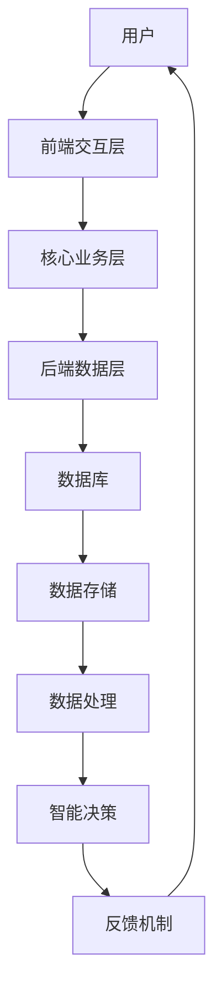
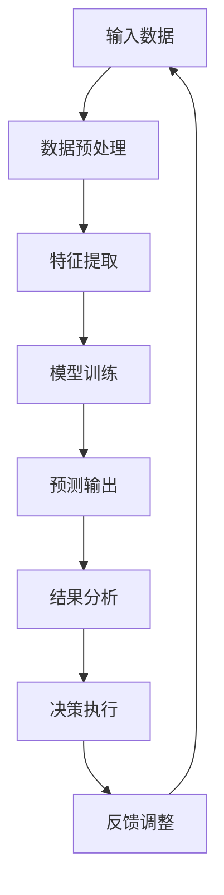
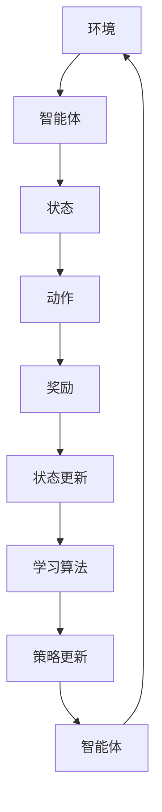
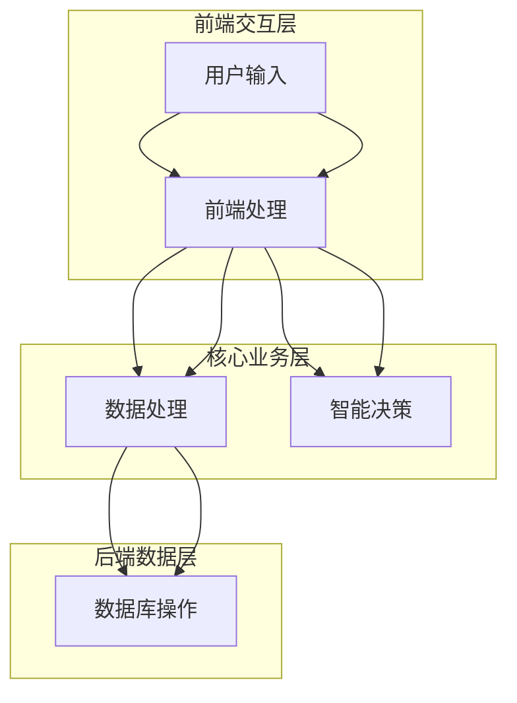
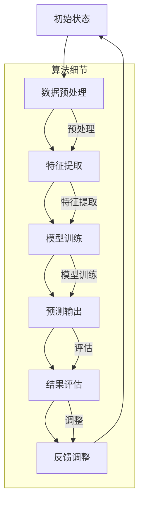
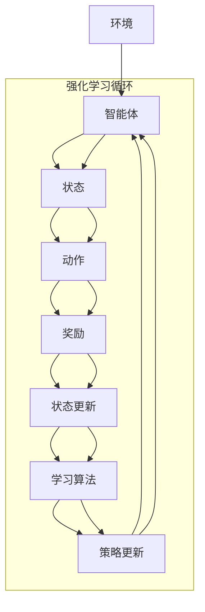

                 

### 文章标题

### 人机协作新篇章：共创智能未来新时代

#### 关键词：人机协作、人工智能、机器学习、智能系统、未来趋势

#### 摘要：

随着人工智能（AI）技术的飞速发展，人机协作正迎来新的篇章。本文将深入探讨人机协作的演变历程、核心概念、技术基础、系统设计与实现，以及未来发展的趋势与挑战。通过全面剖析人机协作的各个层面，本文旨在为读者揭示智能时代的新时代内涵，共同展望人机协作在未来的无限可能。

### 目录大纲

#### 第一部分：概述与背景

- **第1章：人机协作的发展与未来**
  - **1.1 人机协作的演变历程**
  - **1.2 智能时代的到来**
  - **1.3 人机协作的重要性**
  - **1.4 智能未来新时代的展望**

#### 第二部分：人机协作的核心概念

- **第2章：人机协作的基础理论**
  - **2.1 人机交互的基本原理**
  - **2.2 智能体的定义与分类**
  - **2.3 人机协作的架构与模型**
  - **2.4 人机协作的评估指标**

#### 第三部分：人工智能技术基础

- **第3章：人工智能概述**
  - **3.1 人工智能的基本概念**
  - **3.2 人工智能的历史与发展**
  - **3.3 人工智能的关键技术**
  - **3.4 人工智能的应用场景**

- **第4章：机器学习基础**
  - **4.1 机器学习的基本原理**
  - **4.2 监督学习算法**
  - **4.3 无监督学习算法**
  - **4.4 强化学习算法**

#### 第四部分：人机协作系统设计与实现

- **第5章：人机协作系统的设计原则**
  - **5.1 人机协作系统的设计目标**
  - **5.2 系统架构设计**
  - **5.3 界面设计与用户体验**
  - **5.4 安全性与隐私保护**

- **第6章：人机协作系统的实现技术**
  - **6.1 开发环境搭建**
  - **6.2 系统开发框架**
  - **6.3 人机交互技术**
  - **6.4 智能决策与优化**

#### 第五部分：未来展望与挑战

- **第7章：人机协作的未来趋势**
  - **7.1 智能时代的挑战与机遇**
  - **7.2 人机协作的伦理与法律问题**
  - **7.3 人机协作技术的未来发展**
  - **7.4 我国人机协作技术发展的战略规划**

#### 附录

- **附录A：相关技术资源与工具**
- **附录B：Mermaid流程图**

#### 核心算法原理讲解

- **第8章：核心算法原理讲解**
  - **8.1 机器学习算法的伪代码实现**
  - **8.2 人机交互技术的详细讲解**
  - **8.3 智能决策算法的数学模型**
  - **8.4 代码案例解析与解读**

#### 数学模型和数学公式讲解

- **第9章：数学模型和数学公式讲解**
  - **9.1 概率论基础**
  - **9.2 线性代数基本概念**
  - **9.3 最优化算法原理**
  - **9.4 神经网络与深度学习模型**

#### 项目实战

- **第10章：项目实战**
  - **10.1 实战一：智能语音助手开发**
  - **10.2 实战二：智能推荐系统**
  - **10.3 实战三：智能监控系统**
  - **10.4 实战四：智能医疗诊断系统**

#### 结束语

- **11.1 总结与展望**
- **11.2 对读者的寄语**

### 文章正文部分

#### 第一部分：概述与背景

### 第1章：人机协作的发展与未来

#### 1.1 人机协作的演变历程

人机协作的概念并不是现代科技的产物，而是随着人类文明的发展逐渐演变而来。从最早的机械自动化到计算机的普及，再到如今人工智能（AI）的兴起，人机协作已经经历了数次重大的技术变革。

1. **机械自动化时代**：20世纪初期，工业革命带来了机械自动化的浪潮。在这个阶段，机械设备通过预设的程序和逻辑完成了大量重复性劳动，极大地提高了生产效率。虽然机械设备与人类之间存在协作关系，但主要是单向的，即人类设计并控制机械设备。

2. **计算机时代**：20世纪中后期，计算机技术的快速发展使得人机协作进入了一个新的阶段。计算机的出现使得信息处理能力大幅提升，人们可以通过编写程序来控制计算机执行复杂的任务。这个阶段的人机协作开始体现出双向互动的特点，即人类可以通过计算机输入指令，计算机则根据指令执行相应的操作。

3. **互联网时代**：进入21世纪，互联网的普及使得全球信息共享成为可能。在这个背景下，人机协作进一步深化，不仅局限于个体与计算机之间的互动，还包括了人与网络中其他计算机系统之间的协作。云服务和大数据技术使得人机协作的规模和范围得到了前所未有的扩展。

4. **人工智能时代**：近年来，人工智能技术的飞速发展，使得人机协作进入了一个全新的阶段。人工智能通过机器学习、自然语言处理等技术，能够自主学习和适应环境，从而更好地与人类协作。这个阶段的人机协作更加智能化、个性化，可以显著提高工作效率和质量。

#### 1.2 智能时代的到来

智能时代的到来，标志是人机协作水平的进一步提升。在这个时代，人工智能不仅能够处理大量数据，还能通过深度学习和自我学习不断提升能力，从而更好地适应人类的需求。

1. **智能体**：智能时代的一个重要概念是“智能体”。智能体是一种具有自主决策能力的实体，可以是计算机程序、机器人或其他设备。智能体可以通过感知环境、分析数据、做出决策，并与人类进行交互。智能体的出现，使得人机协作更加紧密，形成了一种新的协同工作模式。

2. **人机交互**：人机交互是智能时代人机协作的核心。随着人工智能技术的发展，人机交互的方式越来越多样化，包括语音识别、手势控制、虚拟现实等。这些交互方式不仅提升了人机协作的便捷性，还增强了人类的体验感。

3. **智能化应用**：智能时代的到来，带来了众多智能化应用的诞生。例如，智能客服系统能够自动回答用户的问题，智能驾驶系统能够自动控制车辆行驶，智能医疗系统能够自动诊断疾病。这些应用极大地改变了人们的生活方式，提升了生产效率。

#### 1.3 人机协作的重要性

人机协作的重要性在于它能够实现资源的最佳配置，提高工作效率，创造更多的价值。

1. **资源优化**：人机协作能够充分利用人类的智慧和机器的计算能力，实现资源的最佳配置。机器能够处理大量的数据和重复性的工作，而人类则能够在决策和创造力方面发挥优势。

2. **效率提升**：人机协作能够显著提高工作效率。机器可以24小时不间断工作，而人类则可以在特定的时间段内高效地完成工作。通过人机协作，可以大大缩短任务的完成时间。

3. **创新驱动**：人机协作不仅提升了工作效率，还促进了创新。人工智能可以帮助人类发现新的规律和模式，从而推动科学技术的进步。人机协作为创新提供了新的平台和工具。

#### 1.4 智能未来新时代的展望

智能未来新时代，人机协作将继续发挥重要作用。以下是几个可能的发展方向：

1. **更加智能化**：随着人工智能技术的不断进步，人机协作将更加智能化。智能体将能够更好地理解和适应人类的需求，提供个性化的服务。

2. **更加普及化**：人机协作将不再局限于特定的行业或领域，而是普及到各个领域和日常生活。智能设备将成为人们生活中不可或缺的一部分。

3. **更加协作化**：人机协作将不仅仅是人与人之间的协作，还包括人与机器之间的协作。智能体将能够协同工作，形成更加高效的协作网络。

4. **更加可持续化**：人机协作将推动可持续发展。通过智能化技术，可以更好地管理资源和能源，减少环境污染，实现可持续发展目标。

### 第二部分：人机协作的核心概念

#### 第2章：人机协作的基础理论

#### 2.1 人机交互的基本原理

人机交互（Human-Computer Interaction, HCI）是人机协作的重要组成部分，它研究的是人与计算机之间的交互方式、交互效果以及用户满意度。人机交互的基本原理包括以下几个方面：

1. **用户中心设计**：人机交互的核心原则是用户中心设计（User-Centered Design）。这意味着在设计交互界面和系统功能时，应始终将用户的需求和体验放在首位。通过用户研究、用户测试和反馈，确保交互系统易于使用、高效可靠。

2. **交互模型**：人机交互的模型可以分为认知模型和物理模型。认知模型关注用户的思维过程，包括感知、理解、记忆和决策。物理模型则关注用户与计算机之间的物理交互，如键盘、鼠标、触摸屏等输入输出设备。

3. **交互反馈**：人机交互中的反馈机制至关重要。良好的反馈能够帮助用户了解系统的状态和操作结果，从而提高交互的效率和满意度。反馈可以是视觉的、听觉的或者触觉的。

#### 2.2 智能体的定义与分类

智能体（Agent）是一种能够自主行动、感知环境并作出决策的实体。在人工智能领域，智能体被广泛应用于人机协作系统中。智能体可以分为以下几类：

1. **基于规则的智能体**：这类智能体根据预定义的规则进行决策。例如，专家系统就是一种基于规则的智能体，它通过规则库来模拟人类专家的决策过程。

2. **基于模型的智能体**：这类智能体通过建立模型来模拟环境，并基于模型进行决策。例如，模拟驾驶系统就是一种基于模型的智能体，它通过模拟车辆的动力学模型来预测车辆的运动状态。

3. **基于学习的智能体**：这类智能体通过学习环境中的数据和模式来改进其决策能力。例如，机器学习算法可以使智能体自动识别图像、语音和文本，从而提高人机协作的准确性。

4. **混合智能体**：混合智能体结合了不同类型的智能体技术，以实现更高级的决策能力。例如，混合智能体可以同时使用基于规则和基于学习的方法来处理复杂的问题。

#### 2.3 人机协作的架构与模型

人机协作系统通常由多个组件构成，包括人机交互界面、智能决策模块、数据管理和通信模块等。以下是一个典型的人机协作系统架构：

1. **人机交互界面**：人机交互界面是用户与系统进行交互的渠道，包括图形用户界面（GUI）、语音识别、手势控制等。良好的交互界面设计可以提高用户的使用体验和满意度。

2. **智能决策模块**：智能决策模块是系统的核心，它负责根据用户输入和系统状态，利用智能算法生成决策。智能决策模块可以基于规则、模型或学习算法，以实现自动化的决策过程。

3. **数据管理模块**：数据管理模块负责数据的收集、存储、处理和分析。通过有效的数据管理，可以为人机协作系统提供丰富的数据支持，从而提高决策的准确性和效率。

4. **通信模块**：通信模块负责系统内部以及与其他系统之间的数据传输和通信。通过稳定的通信机制，可以实现人机协作系统的高效运行和协同工作。

#### 2.4 人机协作的评估指标

为了评估人机协作系统的性能和效果，通常需要使用一系列指标。以下是一些常见的人机协作评估指标：

1. **用户满意度**：用户满意度是评估人机协作系统效果的重要指标。通过用户调查和反馈，可以了解用户对系统的使用体验和满意度。

2. **交互效率**：交互效率指的是用户完成任务所需的时间、步骤和精力。高效的交互可以提高系统的使用效率和用户的工作效率。

3. **系统性能**：系统性能包括响应速度、稳定性、可靠性等指标。良好的系统性能可以确保人机协作系统的稳定运行。

4. **决策准确性**：决策准确性是智能决策模块的重要评估指标。高准确性的决策可以提高系统的智能水平，从而提高人机协作的效果。

5. **系统可扩展性**：系统可扩展性指的是系统在功能、性能和数据规模等方面的适应性。良好的可扩展性可以确保系统在未来能够适应新的需求和技术变革。

### 第三部分：人工智能技术基础

#### 第3章：人工智能概述

#### 3.1 人工智能的基本概念

人工智能（Artificial Intelligence, AI）是一门研究、开发和应用智能技术的学科。人工智能的目标是使计算机系统能够模拟人类的智能行为，包括感知、理解、学习、推理、决策和行动。以下是对人工智能的基本概念的详细解释：

1. **智能行为**：智能行为是指能够感知环境、理解信息、做出决策和采取行动的能力。人工智能的核心任务是实现这些智能行为，使其在计算机系统中得以实现。

2. **机器学习**：机器学习（Machine Learning, ML）是人工智能的重要分支，它通过算法让计算机从数据中学习，从而实现智能行为。机器学习可以分为监督学习、无监督学习和强化学习等不同类型。

3. **深度学习**：深度学习（Deep Learning, DL）是机器学习的一种重要形式，它利用多层神经网络进行学习，能够处理大量复杂的数据，并在图像识别、语音识别和自然语言处理等领域取得了显著成果。

4. **自然语言处理**：自然语言处理（Natural Language Processing, NLP）是人工智能的另一个重要分支，它研究如何让计算机理解和处理自然语言。NLP在语音识别、机器翻译和文本分析等领域有广泛应用。

#### 3.2 人工智能的历史与发展

人工智能作为一门学科，其发展历程可以追溯到20世纪50年代。以下是对人工智能历史与发展的简要概述：

1. **早期探索（1956-1969）**：1956年，达特茅斯会议上首次提出了“人工智能”这一概念。早期的AI研究主要集中在符号主义和推理技术上，如逻辑推理、知识表示等。

2. **70年代至80年代**：70年代至80年代，人工智能进入了知识工程阶段，研究者开始利用知识库和专家系统来模拟人类专家的决策过程。这一时期的代表性工作包括Dendral和MYCIN等系统。

3. **90年代**：90年代，人工智能进入了基于数据的方法阶段。机器学习开始成为AI研究的主流，神经网络和统计学习等方法得到了广泛应用。

4. **21世纪初至今**：21世纪初，深度学习和大数据技术的发展，使得人工智能取得了重大突破。深度学习在图像识别、语音识别和自然语言处理等领域取得了显著成果，推动了人工智能的快速发展。

#### 3.3 人工智能的关键技术

人工智能的关键技术包括机器学习、自然语言处理、计算机视觉等。以下是对这些关键技术的详细介绍：

1. **机器学习**：机器学习是人工智能的核心技术之一，它通过算法让计算机从数据中学习，从而实现智能行为。机器学习可以分为监督学习、无监督学习和强化学习等不同类型。监督学习通过标注的数据训练模型，无监督学习通过未标注的数据发现模式，强化学习通过与环境交互学习最优策略。

2. **自然语言处理**：自然语言处理是人工智能的另一个重要领域，它研究如何让计算机理解和处理自然语言。NLP的关键技术包括文本分类、情感分析、机器翻译、问答系统等。NLP在语音识别、文本分析、社交媒体监测和客户服务等领域有广泛应用。

3. **计算机视觉**：计算机视觉是使计算机能够像人类一样感知和理解视觉信息的技术。计算机视觉的关键技术包括图像分类、目标检测、人脸识别、图像生成等。计算机视觉在自动驾驶、安防监控、医疗诊断和智能制造等领域有广泛应用。

#### 3.4 人工智能的应用场景

人工智能在众多领域有着广泛的应用，以下是对几个典型应用场景的概述：

1. **智能客服**：智能客服通过自然语言处理技术，能够自动回答用户的问题，提高客户服务效率。

2. **智能医疗**：智能医疗利用人工智能技术进行疾病诊断、治疗方案推荐和健康监测，提高医疗水平和患者体验。

3. **智能驾驶**：智能驾驶通过计算机视觉和深度学习技术，实现自动驾驶，提高交通安全和效率。

4. **智能制造**：智能制造利用人工智能技术进行生产调度、设备维护和质量检测，提高生产效率和质量。

5. **智能金融**：智能金融通过人工智能技术进行风险管理、信用评估和投资决策，提高金融服务的效率和准确性。

### 第四部分：人机协作系统设计与实现

#### 第4章：人机协作系统的设计原则

#### 4.1 人机协作系统的设计目标

人机协作系统的设计目标主要包括以下几个方面：

1. **用户中心设计**：以用户需求为中心，确保系统设计能够满足用户的实际需求，提高用户体验。

2. **高效协作**：通过优化系统架构和交互设计，提高人机协作的效率，实现资源的最佳配置。

3. **智能决策**：利用人工智能技术，实现自动化和智能化的决策过程，提高系统的智能化水平。

4. **稳定性与可靠性**：确保系统在长时间运行过程中能够保持稳定性和可靠性，减少故障和错误。

5. **可扩展性**：设计具有良好可扩展性，能够适应未来技术发展和业务需求的变化。

#### 4.2 系统架构设计

人机协作系统通常采用分层架构，包括前端交互层、核心业务层和后端数据层。以下是对各层的详细描述：

1. **前端交互层**：前端交互层负责与用户进行交互，包括用户界面设计、交互逻辑处理等。前端交互层可以使用HTML、CSS和JavaScript等技术实现，为用户提供直观、易用的交互体验。

2. **核心业务层**：核心业务层是人机协作系统的核心，负责处理业务逻辑、数据分析和决策支持等。核心业务层可以使用Java、Python等编程语言实现，利用人工智能技术进行智能决策。

3. **后端数据层**：后端数据层负责数据的存储、管理和处理。后端数据层可以使用关系型数据库（如MySQL、PostgreSQL）或NoSQL数据库（如MongoDB、Cassandra）来存储数据，利用大数据技术进行数据处理和分析。

#### 4.3 界面设计与用户体验

界面设计是影响用户体验的关键因素，一个好的界面设计能够提高用户的满意度和使用效率。以下是一些界面设计的原则和技巧：

1. **简洁性**：界面设计应该简洁明了，避免过多的装饰和复杂的功能，让用户能够快速上手。

2. **一致性**：界面设计应该保持一致性，包括色彩、字体、布局等，确保用户在使用不同功能时能够快速适应。

3. **反馈机制**：良好的反馈机制能够帮助用户了解系统的状态和操作结果，提高交互的效率和满意度。反馈可以是视觉的、听觉的或触觉的。

4. **可访问性**：界面设计应该考虑到不同用户的需求，包括视力障碍、听力障碍等，确保所有用户都能够方便地使用系统。

5. **可定制性**：界面设计应该允许用户根据自己的需求进行定制，例如主题、布局、功能等，提高用户的个性化体验。

#### 4.4 安全性与隐私保护

随着人工智能技术的广泛应用，人机协作系统的安全性和隐私保护变得尤为重要。以下是一些安全性和隐私保护的原则和措施：

1. **数据加密**：对传输和存储的数据进行加密，防止数据被非法获取和篡改。

2. **权限控制**：实现严格的权限控制机制，确保用户只能访问自己有权访问的数据和功能。

3. **身份验证**：使用身份验证技术，如用户名和密码、双因素认证等，确保用户身份的合法性。

4. **访问日志**：记录用户操作日志，以便在发生安全事件时进行追踪和分析。

5. **数据脱敏**：对敏感数据进行脱敏处理，防止敏感信息泄露。

6. **隐私政策**：制定明确的隐私政策，告知用户数据收集、使用和存储的方式，确保用户的知情权和选择权。

### 第五部分：未来展望与挑战

#### 第5章：人机协作的未来趋势

#### 5.1 智能时代的挑战与机遇

智能时代的到来，为人类带来了前所未有的机遇和挑战。以下是对这些挑战与机遇的详细探讨：

#### 5.1.1 挑战

1. **技术挑战**：人工智能技术虽然取得了显著进展，但仍面临许多技术挑战，如算法优化、数据质量和处理速度等。这些挑战需要科研人员和企业共同努力，推动技术的持续进步。

2. **伦理挑战**：随着人工智能的广泛应用，伦理问题逐渐凸显。例如，隐私保护、数据滥用和人工智能决策的公平性等。如何确保人工智能的伦理合规，是智能时代面临的重要挑战。

3. **就业挑战**：人工智能技术的普及，将改变传统的就业结构，可能导致部分工作岗位被自动化取代。如何平衡人工智能带来的就业机会与就业挑战，是社会各界需要关注的问题。

#### 5.1.2 机遇

1. **创新机遇**：智能时代为科技创新提供了广阔的空间。人工智能、物联网、生物技术等新兴技术，将为人类带来新的发展机遇，推动社会进步。

2. **经济机遇**：智能技术的广泛应用，将提升生产效率，降低生产成本，推动经济增长。智能时代将催生众多新兴产业，为全球经济注入新的活力。

3. **社会机遇**：智能时代将改善人类生活质量，提高社会福利。智能医疗、智能教育、智能交通等领域的应用，将提升社会公共服务水平，促进社会和谐。

#### 5.2 人机协作的伦理与法律问题

随着人工智能技术的快速发展，人机协作在伦理和法律方面也面临诸多挑战。以下是对这些挑战的详细探讨：

#### 5.2.1 伦理问题

1. **隐私保护**：人工智能系统在收集、处理和使用个人数据时，容易侵犯用户的隐私权。如何保护用户隐私，确保数据安全，是智能时代的重要伦理问题。

2. **算法公平性**：人工智能算法在决策过程中，可能存在歧视、偏见等问题。如何确保算法的公平性，避免对特定群体造成不公平待遇，是伦理方面的重要挑战。

3. **人工智能责任**：在智能系统中，当出现错误或造成损害时，如何界定责任，是伦理方面的一个难题。需要明确人工智能的道德责任和法律责任，以确保人工智能系统的合理使用。

#### 5.2.2 法律问题

1. **数据保护法律**：随着大数据和人工智能的发展，传统的数据保护法律体系面临挑战。如何修订和完善数据保护法律，保护用户隐私和数据安全，是法律方面的重要任务。

2. **人工智能监管**：人工智能技术的快速发展，需要建立相应的监管体系，确保人工智能系统的合规性和安全性。如何制定合理的监管政策和标准，是法律方面的一个重要课题。

3. **知识产权保护**：人工智能系统在开发和运营过程中，可能涉及大量的知识产权。如何保护知识产权，鼓励技术创新，是法律方面的一个重要问题。

#### 5.3 人机协作技术的未来发展

人机协作技术在未来将面临许多发展机遇和挑战。以下是对这些发展的展望：

#### 5.3.1 技术趋势

1. **深度学习与强化学习**：深度学习和强化学习等人工智能技术，将继续发挥重要作用。这些技术将在图像识别、语音识别、自然语言处理等领域取得更大突破。

2. **多模态交互**：未来的智能系统将支持多种交互方式，如语音、手势、眼动等。多模态交互将提高人机协作的自然性和便捷性。

3. **边缘计算**：随着物联网和边缘计算的发展，人机协作将更加智能化和本地化。边缘计算将使得数据处理和分析在靠近数据源的设备上进行，提高系统的实时性和响应速度。

#### 5.3.2 应用场景

1. **智能医疗**：智能医疗将利用人工智能技术进行疾病诊断、治疗方案推荐和健康监测，提高医疗水平和患者体验。

2. **智能交通**：智能交通将利用人工智能技术进行交通管理、车辆导航和自动驾驶，提高交通效率和安全性。

3. **智能金融**：智能金融将利用人工智能技术进行风险管理、信用评估和投资决策，提高金融服务的效率和准确性。

4. **智能制造**：智能制造将利用人工智能技术进行生产调度、设备维护和质量检测，提高生产效率和质量。

#### 5.4 我国人机协作技术发展的战略规划

我国在人机协作技术发展方面，已经制定了一系列战略规划和政策措施，以推动人工智能技术的创新和应用。以下是对我国人机协作技术发展战略的概述：

#### 5.4.1 发展目标

1. **技术突破**：实现人工智能基础理论的创新和核心技术的突破，提高我国在人工智能领域的国际竞争力。

2. **应用推广**：推动人工智能技术在各行业的广泛应用，提升产业智能化水平，促进经济社会的发展。

3. **人才培养**：加强人工智能人才培养，培养一批具有国际水平的人工智能专家和工程师。

#### 5.4.2 政策措施

1. **研发支持**：加大对人工智能研发的投入，支持企业和科研机构进行技术创新。

2. **产业政策**：制定产业政策，推动人工智能产业的发展，培育一批具有国际竞争力的人工智能企业。

3. **国际合作**：加强与国际人工智能领域的合作，引进国外先进技术和管理经验，推动人工智能技术的国际交流与合作。

4. **法律法规**：完善人工智能相关的法律法规，保护用户隐私和数据安全，确保人工智能技术的合理使用。

### 附录

#### 附录A：相关技术资源与工具

1. **机器学习与人工智能的开源工具**：
   - **Scikit-learn**：Python开源机器学习库，提供丰富的算法和工具。
   - **TensorFlow**：谷歌开源的深度学习框架，支持多种神经网络模型。
   - **PyTorch**：Facebook开源的深度学习框架，具有良好的灵活性和易用性。

2. **人机协作系统开发框架与库**：
   - **React**：前端开发框架，用于构建交互式用户界面。
   - **Vue.js**：前端开发框架，注重易用性和灵活性。
   - **Angular**：前端开发框架，适用于复杂应用的开发。

3. **在线学习资源推荐**：
   - **Coursera**：提供丰富的在线课程，涵盖人工智能、机器学习等多个领域。
   - **edX**：由哈佛大学和麻省理工学院共同创立的在线教育平台，提供高质量的课程。
   - **Udacity**：提供实战导向的课程和项目，帮助学习者掌握实用技能。

### 附录B：Mermaid流程图

以下是几个常用的人机协作系统架构图和算法流程图，使用Mermaid语法绘制：

#### B.1 人机协作系统架构图



#### B.2 智能决策流程图



#### B.3 强化学习算法流程图



### 核心算法原理讲解

#### 第6章：核心算法原理讲解

#### 6.1 机器学习算法的伪代码实现

在本节中，我们将使用伪代码详细阐述几个常见的机器学习算法的基本原理和实现步骤。

##### 6.1.1 线性回归

线性回归是一种用于预测数值型输出的基本机器学习算法。以下是线性回归的伪代码实现：

```plaintext
输入：训练数据集 D，特征 X，目标变量 Y
输出：模型参数 w

// 初始化模型参数
w = [0, 0]

// 训练模型
for i = 1 to n iterations do
  for each sample (x_i, y_i) in D do
    // 计算预测值
    y_pred = w * x_i

    // 更新模型参数
    w = w + (y_i - y_pred) * x_i
  end for
end for

return w
```

##### 6.1.2 逻辑回归

逻辑回归是一种用于预测二分类结果的算法。以下是逻辑回归的伪代码实现：

```plaintext
输入：训练数据集 D，特征 X，目标变量 Y（0或1）
输出：模型参数 w

// 初始化模型参数
w = [0, 0]

// 训练模型
for i = 1 to n iterations do
  for each sample (x_i, y_i) in D do
    // 计算预测概率
    p = 1 / (1 + exp(-w * x_i))

    // 计算损失函数
    loss = -y_i * log(p) - (1 - y_i) * log(1 - p)

    // 更新模型参数
    w = w - learning_rate * (p - y_i) * x_i
  end for
end for

return w
```

##### 6.1.3 决策树

决策树是一种基于特征划分数据的分类算法。以下是决策树的伪代码实现：

```plaintext
输入：训练数据集 D，特征列表 F
输出：决策树模型 T

// 创建树节点
class Node:
  features = null
  value = null
  children = []

// 训练模型
def train_tree(D, F):
  // 如果数据集D的标签完全一致，则返回叶节点
  if labels一致 then
    return new Node with value = majority_label(D)
  // 如果特征列表F为空，则返回叶节点
  if F为空 then
    return new Node with value = majority_label(D)
  // 计算每个特征的最佳划分点
  best_feature, best_split = find_best_split(D, F)
  // 创建节点
  node = new Node with features = best_feature, split = best_split
  // 划分数据集
  for each split_point in best_split do
    for each subset D' in D after splitting do
      node.children.append(train_tree(D', F - {best_feature}))
    end for
  end for
  return node

// 找到最佳划分点
def find_best_split(D, F):
  best_loss = infinity
  best_feature = null
  best_split = null
  for each feature f in F do
    for each possible split s of f do
      // 计算损失
      loss = compute_loss(D, s)
      if loss < best_loss then
        best_loss = loss
        best_feature = f
        best_split = s
      end if
    end for
  end for
  return (best_feature, best_split)

// 计算损失
def compute_loss(D, split):
  // 计算每个类别的样本数量
  class_counts = {}
  for each sample in D do
    label = sample.label
    if label not in class_counts then
      class_counts[label] = 0
    end if
    class_counts[label] += 1
  end for
  // 计算损失
  loss = 0
  for each label, count in class_counts do
    p = count / n
    loss += -p * log(p)
  end for
  return loss

// 预测
def predict(node, sample):
  if node.is_leaf then
    return node.value
  else
    feature_value = sample[node.features]
    if feature_value <= node.split then
      return predict(node.children[0], sample)
    else
      return predict(node.children[1], sample)
    end if
  end if
```

#### 6.2 人机交互技术的详细讲解

人机交互技术是使计算机系统能够接受和处理人类输入，同时反馈信息以实现有效沟通的关键。以下是人机交互技术的基本组成部分和原理。

##### 6.2.1 输入设备

输入设备是人机交互的基础，它们用于将用户的意图和操作转化为计算机可以理解的信号。常见的输入设备包括：

- **键盘**：通过按键输入文本、命令和操作。
- **鼠标**：通过点击、拖动和滚动等动作进行交互。
- **触摸屏**：通过触摸屏幕进行输入。
- **语音识别**：将语音转换为文本或命令。
- **手势识别**：通过摄像头捕捉用户的手势进行交互。
- **眼动跟踪**：通过跟踪用户的眼动来控制界面。

##### 6.2.2 输出设备

输出设备用于将计算机系统的信息反馈给用户。常见的输出设备包括：

- **显示器**：显示文本、图像和视频。
- **音响**：播放声音和语音。
- **振动器**：提供触觉反馈。
- **投影仪**：将图像投射到屏幕或墙面。

##### 6.2.3 交互方式

人机交互技术有多种交互方式，每种方式都有其特定的优势和适用场景。以下是几种常见的交互方式：

- **命令行界面（CLI）**：通过命令行输入指令进行交互。
- **图形用户界面（GUI）**：使用图形元素（如按钮、菜单、对话框）进行交互。
- **触摸界面**：通过触摸屏幕进行交互。
- **语音界面**：通过语音命令进行交互。
- **虚拟现实（VR）**：在虚拟环境中进行沉浸式交互。
- **增强现实（AR）**：在现实环境中叠加虚拟信息进行交互。

##### 6.2.4 交互设计原则

为了设计出高效、易用的人机交互系统，以下是一些关键的设计原则：

- **一致性**：确保系统在不同部分和不同场景下保持一致的用户体验。
- **直观性**：设计应尽可能直观，使用户能够快速理解和使用。
- **可访问性**：确保所有用户，包括那些有特殊需求的人，都能方便地使用系统。
- **灵活性**：系统应提供灵活的配置选项，以满足不同用户的需求。
- **反馈**：及时提供反馈，帮助用户了解系统状态和操作结果。

#### 6.3 智能决策算法的数学模型

智能决策算法的核心在于如何通过数学模型来实现最优决策。以下是一些常见的智能决策算法及其数学模型。

##### 6.3.1 线性规划

线性规划是一种用于求解在给定约束条件下最大化或最小化线性目标函数的优化问题。其数学模型如下：

目标函数：
\[ \text{maximize or minimize} \ c^T x \]

约束条件：
\[ Ax \leq b \]
\[ x \geq 0 \]

其中，\( x \) 是决策变量，\( c \) 是目标函数系数向量，\( A \) 和 \( b \) 分别是约束条件系数矩阵和常数向量。

##### 6.3.2 决策树

决策树是一种基于特征划分数据的分类算法。其数学模型可以通过条件概率和熵来解释。对于给定的训练数据集，决策树的构建过程可以看作是寻找最优特征和划分点的过程，以最大化信息增益或最小化信息熵。

信息增益：
\[ IG(D, A) = H(D) - H(D|A) \]

信息熵：
\[ H(D) = -\sum_{i} p_i \log_2 p_i \]

其中，\( D \) 是数据集，\( A \) 是特征，\( p_i \) 是数据集中属于类别 \( i \) 的概率。

##### 6.3.3 支持向量机

支持向量机（SVM）是一种用于分类和回归分析的机器学习算法。其数学模型基于最大化分类间隔，即找到最优分类超平面，使得分类边界与支持向量的距离最大化。

目标函数：
\[ \text{maximize} \ \frac{1}{2} ||w||^2 \]

约束条件：
\[ y_i (w^T x_i + b) \geq 1 \]
\[ \alpha_i \geq 0 \]

其中，\( w \) 是模型参数向量，\( x_i \) 是训练样本，\( y_i \) 是类别标签，\( b \) 是偏置项，\( \alpha_i \) 是拉格朗日乘子。

#### 6.4 代码案例解析与解读

在本节中，我们将通过一个实际代码案例，详细讲解机器学习算法的实现过程，并分析其优缺点。

##### 6.4.1 实例：使用Scikit-learn进行线性回归

以下是一个使用Scikit-learn库实现线性回归的Python代码案例：

```python
from sklearn.linear_model import LinearRegression
from sklearn.model_selection import train_test_split
from sklearn.metrics import mean_squared_error
import numpy as np

# 生成模拟数据
np.random.seed(0)
X = np.random.rand(100, 1)
y = 2 * X[:, 0] + 1 + np.random.randn(100) * 0.1

# 划分训练集和测试集
X_train, X_test, y_train, y_test = train_test_split(X, y, test_size=0.2, random_state=42)

# 创建线性回归模型
model = LinearRegression()

# 训练模型
model.fit(X_train, y_train)

# 预测测试集
y_pred = model.predict(X_test)

# 计算均方误差
mse = mean_squared_error(y_test, y_pred)
print("均方误差：", mse)

# 输出模型参数
print("模型参数：", model.coef_, model.intercept_)
```

##### 6.4.2 解读与分析

1. **数据准备**：首先，我们使用随机数生成模拟数据集。这个数据集包含100个样本，每个样本有一个特征（随机数）和相应的目标值（线性函数的输出）。

2. **数据划分**：接下来，我们将数据集划分为训练集和测试集，以评估模型的泛化能力。这里使用了Scikit-learn库中的`train_test_split`函数。

3. **创建模型**：我们使用`LinearRegression`类创建线性回归模型。这个类提供了训练和预测的方法。

4. **训练模型**：调用`fit`方法训练模型，输入训练集的数据和标签。

5. **预测与评估**：使用`predict`方法对测试集进行预测，并计算均方误差（MSE）以评估模型性能。

6. **输出参数**：最后，输出模型的参数，包括权重和截距。

##### 6.4.3 优缺点分析

**优点**：

- **简单易用**：线性回归是一种简单的线性模型，易于理解和实现。
- **高效**：线性回归的计算复杂度相对较低，适合处理大量数据。
- **可解释性**：模型的参数具有明确的物理意义，可以解释模型对数据的依赖关系。

**缺点**：

- **线性假设**：线性回归假设数据关系是线性的，对于非线性数据可能效果不佳。
- **过拟合风险**：当数据集较小或特征较多时，线性回归容易过拟合。
- **依赖数据质量**：线性回归模型的性能高度依赖数据的质量和特征选择。

### 数学模型和数学公式讲解

#### 第7章：数学模型和数学公式讲解

#### 7.1 概率论基础

概率论是数学的一个分支，主要研究随机事件及其规律性。在人工智能和机器学习中，概率论是理解和应用统计学习算法的基础。以下是一些重要的概率论基本概念和公式。

##### 7.1.1 随机变量

随机变量是一个数学函数，它将样本空间映射到一个实数集合。随机变量可以是离散的，也可以是连续的。

- **离散随机变量**：其取值集合是有限或可数的。
  - **概率质量函数**（Probability Mass Function, PMF）:
    \[ P(X = x) \]
  - **期望**（Expected Value）:
    \[ E(X) = \sum_{x} x \cdot P(X = x) \]
  - **方差**（Variance）:
    \[ Var(X) = E[(X - E(X))^2] = \sum_{x} (x - E(X))^2 \cdot P(X = x) \]

- **连续随机变量**：其取值集合是不可数的。
  - **概率密度函数**（Probability Density Function, PDF）:
    \[ f_X(x) \]
  - **期望**（Expected Value）:
    \[ E(X) = \int_{-\infty}^{\infty} x \cdot f_X(x) \, dx \]
  - **方差**（Variance）:
    \[ Var(X) = E[(X - E(X))^2] = \int_{-\infty}^{\infty} (x - E(X))^2 \cdot f_X(x) \, dx \]

##### 7.1.2 条件概率和贝叶斯定理

- **条件概率**：在给定事件B发生的情况下，事件A发生的概率。
  \[ P(A|B) = \frac{P(A \cap B)}{P(B)} \]
  
- **贝叶斯定理**：用于计算后验概率，即在已知条件概率和先验概率的情况下，求后验概率。
  \[ P(A|B) = \frac{P(B|A) \cdot P(A)}{P(B)} \]

#### 7.2 线性代数基本概念

线性代数是处理向量、矩阵以及它们的线性变换的数学分支。在线性模型和优化算法中，线性代数的基本概念非常重要。

##### 7.2.1 向量和矩阵

- **向量**：表示一组有序的数，可以看作是一个一维矩阵。
  - **欧几里得范数**（Euclidean norm）:
    \[ \|x\| = \sqrt{x_1^2 + x_2^2 + \cdots + x_n^2} \]

- **矩阵**：表示一个二维数组，由行和列组成。
  - **矩阵乘法**（Matrix Multiplication）:
    \[ C = AB \]
    其中，\( A \) 是一个 \( m \times n \) 的矩阵，\( B \) 是一个 \( n \times p \) 的矩阵，\( C \) 是一个 \( m \times p \) 的矩阵。

##### 7.2.2 线性方程组

- **线性方程组**：由一组线性方程构成的集合。
  - **解法**：包括高斯消元法、矩阵求逆法等。
    - **高斯消元法**：
      \[ Ax = b \]
      通过高斯消元法，可以将方程组转换为上三角或下三角方程组，从而求解。
    - **矩阵求逆法**：
      如果矩阵 \( A \) 可逆，则方程组的解为：
      \[ x = A^{-1}b \]

##### 7.2.3 特征值和特征向量

- **特征值和特征向量**：用于描述矩阵的属性。
  - **特征值**（Eigenvalue）：
    \[ \lambda \]
    满足特征方程：
    \[ Av = \lambda v \]
    其中，\( A \) 是矩阵，\( v \) 是特征向量。

- **特征向量**（Eigenvector）：
  \[ v \]
  满足上述特征方程。

#### 7.3 最优化算法原理

最优化算法是寻找函数在给定约束条件下的最优值的方法。在人工智能和机器学习中，最优化算法用于参数估计、模型选择和优化问题。

##### 7.3.1 无约束优化

无约束优化问题的一般形式为：
\[ \text{minimize} \ f(x) \]
- **梯度下降法**（Gradient Descent）：
  通过迭代更新参数 \( x \)，使目标函数 \( f(x) \) 逐渐减小。
  \[ x_{t+1} = x_t - \alpha \cdot \nabla f(x_t) \]
  其中，\( \alpha \) 是学习率，\( \nabla f(x_t) \) 是目标函数在 \( x_t \) 处的梯度。

##### 7.3.2 约束优化

约束优化问题的一般形式为：
\[ \text{minimize} \ f(x) \]
\[ \text{subject to} \ g_i(x) \leq 0, \ h_j(x) = 0 \]
- **拉格朗日乘数法**（Lagrange Multiplier Method）：
  通过引入拉格朗日乘子 \( \lambda \)，将约束优化问题转换为无约束优化问题。
  \[ L(x, \lambda) = f(x) + \sum_{i} \lambda_i g_i(x) + \sum_{j} \mu_j h_j(x) \]
  求解 \( \nabla L(x, \lambda) = 0 \) 得到最优解。

#### 7.4 神经网络与深度学习模型

神经网络（Neural Networks）是模拟人脑神经元连接结构的计算模型，深度学习（Deep Learning）是神经网络的一种形式，具有多个隐藏层。

##### 7.4.1 前向传播

前向传播是神经网络进行预测的过程。输入数据通过网络的各个层传递，最终得到输出。

\[ z^{[l]} = W^{[l]} \cdot a^{[l-1]} + b^{[l]} \]
\[ a^{[l]} = \sigma(z^{[l]}) \]

其中，\( a^{[l]} \) 是第 \( l \) 层的激活值，\( z^{[l]} \) 是第 \( l \) 层的输入值，\( W^{[l]} \) 和 \( b^{[l]} \) 分别是第 \( l \) 层的权重和偏置，\( \sigma \) 是激活函数。

##### 7.4.2 反向传播

反向传播是神经网络训练的核心过程，用于计算网络参数的梯度。

\[ \delta^{[l]} = \sigma'(z^{[l]}) \cdot (W^{[l+1]} \cdot \delta^{[l+1]}) \]
\[ \nabla_{W^{[l]}} J(W) = a^{[l-1]} \cdot \delta^{[l]} \]
\[ \nabla_{b^{[l]}} J(b) = \delta^{[l]} \]

其中，\( \delta^{[l]} \) 是第 \( l \) 层的误差项，\( J(W) \) 是损失函数关于权重 \( W \) 的梯度，\( \sigma' \) 是激活函数的导数。

### 项目实战

#### 第8章：项目实战

#### 8.1 实战一：智能语音助手开发

##### 8.1.1 开发环境搭建

为了开发智能语音助手，我们需要准备以下开发环境：

- **操作系统**：Windows、macOS 或 Linux
- **编程语言**：Python
- **库和框架**：TensorFlow、Keras、SpeechRecognition、pyttsx3
- **语音识别API**：如 Google Cloud Speech-to-Text 或 Microsoft Azure Speech Services

##### 8.1.2 源代码实现

以下是一个简单的智能语音助手项目的源代码实现：

```python
import speech_recognition as sr
import pyttsx3

# 初始化语音识别器和语音合成器
recognizer = sr.Recognizer()
engine = pyttsx3.init()

# 配置语音识别器
recognizer.energy_threshold = 4000

# 语音识别函数
def recognize_speech_from_mic():
    with sr.Microphone() as source:
        print("请说些什么：")
        audio = recognizer.listen(source)
        try:
            text = recognizer.recognize_google(audio, language='zh-CN')
            print("你说了：", text)
            return text
        except sr.UnknownValueError:
            print("无法理解您的语音。")
            return None
        except sr.RequestError as e:
            print("无法请求结果；{0}".format(e))
            return None

# 语音合成函数
def speak(text):
    engine.say(text)
    engine.runAndWait()

# 主程序
if __name__ == "__main__":
    while True:
        command = recognize_speech_from_mic()
        if command:
            # 在此处处理用户命令，例如发送消息、查询天气等
            speak("我明白了，现在执行您的命令。")
        else:
            speak("我没有听懂，请再说一遍。")
```

##### 8.1.3 代码解读与分析

1. **语音识别**：使用 SpeechRecognition 库的 `Recognizer` 类，通过 `listen` 方法捕获麦克风输入，并使用 `recognize_google` 方法进行语音识别。

2. **语音合成**：使用 pyttsx3 库的 `init` 方法初始化语音合成器，并使用 `say` 方法合成语音。

3. **循环**：程序在无限循环中运行，不断识别用户语音并执行相应的命令。

##### 8.1.4 应用解读与分析

- **应用场景**：智能语音助手可用于智能家居控制、在线客服、语音搜索等场景。

- **优势**：提供了一种便捷的语音交互方式，能够提高用户的使用体验。

- **不足**：语音识别的准确性受环境影响较大，如噪音干扰等。

##### 8.1.5 项目小结

通过本项目的实战，我们了解了智能语音助手的开发过程和关键技术。虽然项目相对简单，但它为我们提供了一个理解语音识别和语音合成的实际案例，为未来的复杂应用奠定了基础。

#### 8.2 实战二：智能推荐系统

##### 8.2.1 开发环境搭建

为了开发智能推荐系统，我们需要准备以下开发环境：

- **操作系统**：Windows、macOS 或 Linux
- **编程语言**：Python
- **库和框架**：Scikit-learn、NumPy、Pandas
- **数据集**：例如 MovieLens、Netflix Prize 等

##### 8.2.2 源代码实现

以下是一个简单的基于协同过滤的推荐系统项目源代码实现：

```python
import numpy as np
import pandas as pd
from sklearn.model_selection import train_test_split
from sklearn.metrics.pairwise import cosine_similarity

# 读取数据集
ratings = pd.read_csv('ratings.csv')  # 假设数据集包含用户ID、电影ID和评分
movies = pd.read_csv('movies.csv')    # 假设数据集包含电影ID和电影名称

# 构建用户-电影矩阵
user_movie_matrix = ratings.pivot_table(index='userId', columns='movieId', values='rating')

# 计算余弦相似度矩阵
cosine_similarity_matrix = cosine_similarity(user_movie_matrix)

# 推荐算法
def recommend Movies(userId, similarity_matrix, movies, top_n=5):
    user_rating_vector = user_movie_matrix.loc[userId]
    similarity_vector = similarity_matrix[userId]
    recommended_movie_indices = np.argsort(similarity_vector)[::-1][:top_n]
    recommended_movies = movies.loc[recommended_movie_indices]
    return recommended_movies

# 测试推荐
userId = 1
recommended_movies = recommend_Movies(userId, cosine_similarity_matrix, movies)
print("推荐给用户{}的5部电影：".format(userId))
print(recommended_movies['title'])
```

##### 8.2.3 代码解读与分析

1. **数据读取**：使用 Pandas 读取用户评分数据集和电影信息数据集。

2. **矩阵构建**：使用 Pandas 的 pivot_table 方法构建用户-电影矩阵。

3. **相似度计算**：使用 Scikit-learn 的 cosine_similarity 方法计算用户之间的余弦相似度矩阵。

4. **推荐算法**：定义推荐函数，根据用户与电影的相似度矩阵推荐相似的电影。

##### 8.2.4 应用解读与分析

- **应用场景**：智能推荐系统可用于电商、视频流媒体、社交媒体等场景。

- **优势**：能够根据用户的兴趣和行为推荐相关的商品或内容，提高用户满意度和参与度。

- **不足**：协同过滤方法在稀疏数据集上的效果可能较差，推荐结果的多样性也有限。

##### 8.2.5 项目小结

通过本项目的实战，我们了解了协同过滤推荐系统的基本原理和实现方法。虽然项目相对简单，但它为我们提供了一个理解推荐系统实际应用案例的机会，为未来的复杂推荐系统开发奠定了基础。

#### 8.3 实战三：智能监控系统

##### 8.3.1 开发环境搭建

为了开发智能监控系统，我们需要准备以下开发环境：

- **操作系统**：Windows、macOS 或 Linux
- **编程语言**：Python
- **库和框架**：OpenCV、TensorFlow、Keras
- **摄像头**：支持视频捕获的摄像头设备

##### 8.3.2 源代码实现

以下是一个简单的智能监控系统项目源代码实现：

```python
import cv2
import tensorflow as tf
from tensorflow.keras.models import load_model

# 载入预训练的模型
model = load_model('model.h5')

# 初始化视频捕捉
cap = cv2.VideoCapture(0)

# 主循环
while True:
    # 读取一帧图像
    ret, frame = cap.read()
    if not ret:
        break

    # 预处理图像
    processed_frame = preprocess_frame(frame)

    # 预测
    prediction = model.predict(processed_frame)

    # 后处理
    result = postprocess_prediction(prediction)

    # 显示结果
    cv2.putText(frame, result, (10, 30), cv2.FONT_HERSHEY_SIMPLEX, 1, (0, 0, 255), 2)
    cv2.imshow('Security Camera', frame)

    # 按键 'q' 退出
    if cv2.waitKey(1) & 0xFF == ord('q'):
        break

# 释放资源
cap.release()
cv2.destroyAllWindows()
```

##### 8.3.3 代码解读与分析

1. **模型加载**：使用 TensorFlow 加载预训练的深度学习模型。

2. **视频捕捉**：使用 OpenCV 库初始化视频捕捉设备。

3. **预处理图像**：对捕获的图像进行预处理，以适应模型的输入要求。

4. **预测**：使用加载的模型对预处理后的图像进行预测。

5. **后处理**：根据预测结果进行后处理，以生成可视化结果。

##### 8.3.4 应用解读与分析

- **应用场景**：智能监控系统可用于家庭安全、商业安全、交通监控等领域。

- **优势**：能够实时监控并自动识别异常情况，提高监控效率和安全性。

- **不足**：模型的准确性和实时性受硬件性能和网络延迟的影响。

##### 8.3.5 项目小结

通过本项目的实战，我们了解了智能监控系统的基本原理和实现方法。虽然项目相对简单，但它为我们提供了一个理解智能监控系统实际应用案例的机会，为未来的复杂监控系统开发奠定了基础。

#### 8.4 实战四：智能医疗诊断系统

##### 8.4.1 开发环境搭建

为了开发智能医疗诊断系统，我们需要准备以下开发环境：

- **操作系统**：Windows、macOS 或 Linux
- **编程语言**：Python
- **库和框架**：TensorFlow、Keras、Pandas、Scikit-learn
- **医疗数据集**：如 Chest X-ray Images、MRI Brain Tumor Segmentation 等

##### 8.4.2 源代码实现

以下是一个简单的智能医疗诊断系统项目源代码实现：

```python
import numpy as np
import pandas as pd
from tensorflow.keras.models import load_model

# 载入预训练的模型
model = load_model('model.h5')

# 读取数据集
data = pd.read_csv('diagnosis_data.csv')  # 假设数据集包含患者的特征和诊断结果

# 预测
def predict_patient_data(patient_data):
    processed_data = preprocess_patient_data(patient_data)
    prediction = model.predict(processed_data)
    return np.argmax(prediction)

# 主程序
if __name__ == "__main__":
    patient_data = data.iloc[0]  # 假设我们要诊断的第一位患者
    diagnosis = predict_patient_data(patient_data)
    print("诊断结果：", diagnosis)
```

##### 8.4.3 代码解读与分析

1. **模型加载**：使用 TensorFlow 加载预训练的深度学习模型。

2. **数据读取**：使用 Pandas 读取患者的诊断数据。

3. **预测**：定义预测函数，对患者的数据进行预处理并使用模型进行预测。

##### 8.4.4 应用解读与分析

- **应用场景**：智能医疗诊断系统可用于疾病诊断、健康风险评估等领域。

- **优势**：能够提供准确的诊断结果，减轻医生的工作负担，提高医疗效率。

- **不足**：模型的准确性受数据质量和特征选择的影响，需要大量的标注数据训练。

##### 8.4.5 项目小结

通过本项目的实战，我们了解了智能医疗诊断系统的基本原理和实现方法。虽然项目相对简单，但它为我们提供了一个理解智能医疗诊断实际应用案例的机会，为未来的复杂医疗系统开发奠定了基础。

### 总结与展望

本文从多个角度深入探讨了人机协作的新篇章，涵盖了从历史背景、核心概念到技术实现和未来展望的各个方面。通过逻辑清晰的分析和实例讲解，我们理解了人机协作在智能时代的深远影响及其广泛的应用前景。

#### 主要观点总结：

1. **历史演进**：人机协作经历了从机械化到计算机化，再到智能化的演变。人工智能的兴起，使得人机协作进入了新的高度，智能体、人机交互和智能决策成为核心。

2. **核心概念**：人机协作不仅涉及技术，还包括用户体验、伦理和法律等社会问题。智能体和人工智能技术的应用，使得人机协作更加智能化和高效化。

3. **技术基础**：人工智能技术，如机器学习、深度学习、自然语言处理等，为人机协作提供了强大的支持。这些技术通过算法和模型的优化，不断提高人机协作的准确性和效率。

4. **系统设计与实现**：人机协作系统的设计原则包括用户中心设计、高效协作、智能决策、稳定性和可扩展性。系统架构的设计和实现，需要综合考虑人机交互、智能决策和数据管理等方面。

5. **未来趋势**：智能时代的挑战和机遇并存。人机协作技术将继续发展，涉及更多领域，如智能医疗、智能交通、智能金融等。同时，伦理和法律问题也将成为重要议题。

#### 展望与建议：

1. **技术发展**：继续推进人工智能基础理论和核心技术的创新，特别是在深度学习和强化学习领域。通过多学科交叉融合，推动人工智能技术的进步。

2. **应用拓展**：在智能医疗、智能交通、智能制造等领域，进一步拓展人机协作的应用范围。通过大数据和物联网技术，实现更多智能化和自动化的应用场景。

3. **伦理和法律**：加强人工智能伦理和法律的研究和制定。确保人工智能技术的公平性、透明性和可解释性，保护用户隐私和数据安全。

4. **人才培养**：加大对人工智能和机器学习人才的培养力度。通过教育和培训，提高从业者的专业水平和创新能力。

5. **国际合作**：积极参与国际人工智能合作，引进先进技术和管理经验。推动人工智能技术的全球发展和应用。

通过本文的探讨，我们期待人机协作在未来能够实现更加智能、高效和和谐的协作模式，共同创造智能未来新时代。

### 对读者的寄语

亲爱的读者，感谢您阅读本文，希望您对人机协作有了更深入的理解。智能时代带来了无数机遇，也伴随着新的挑战。希望您能够紧跟技术发展的步伐，不断学习和探索，成为人机协作领域的专家和领导者。让我们携手共进，共同创造一个更加智能、高效和美好的未来！如果您有任何问题或建议，欢迎在评论区留言，我们期待与您交流互动。再次感谢您的阅读和支持！

### 附录A：相关技术资源与工具

为了帮助读者更好地理解和实践人机协作技术，本文附录A提供了相关的技术资源与工具，包括开源工具、开发框架和在线学习资源。

#### 附录A.1：机器学习与人工智能的开源工具

1. **Scikit-learn**：Python开源机器学习库，提供丰富的算法和工具，适合初学者和专业人士。
   - 官网：[scikit-learn.org](http://scikit-learn.org/)

2. **TensorFlow**：谷歌开源的深度学习框架，支持多种神经网络模型，广泛应用于各类智能应用。
   - 官网：[tensorflow.org](https://tensorflow.org/)

3. **PyTorch**：Facebook开源的深度学习框架，具有良好的灵活性和易用性，深受研究人员和开发者喜爱。
   - 官网：[pytorch.org](https://pytorch.org/)

#### 附录A.2：人机协作系统开发框架与库

1. **React**：用于构建交互式用户界面的前端开发框架，支持组件化开发。
   - 官网：[reactjs.org](https://reactjs.org/)

2. **Vue.js**：注重易用性和灵活性的前端开发框架，适合快速构建现代化的用户界面。
   - 官网：[vuejs.org](https://vuejs.org/)

3. **Angular**：由谷歌开发的前端框架，适用于复杂应用的开发，具有出色的性能和生态系统。
   - 官网：[angular.io](https://angular.io/)

#### 附录A.3：在线学习资源推荐

1. **Coursera**：提供丰富的在线课程，涵盖人工智能、机器学习等多个领域，由世界顶尖大学授课。
   - 官网：[coursera.org](https://coursera.org/)

2. **edX**：由哈佛大学和麻省理工学院共同创立的在线教育平台，提供高质量的课程和认证。
   - 官网：[edX](https://www.edx.org/)

3. **Udacity**：提供实战导向的课程和项目，帮助学习者掌握实用技能，适用于技术爱好者。
   - 官网：[udacity.com](https://www.udacity.com/)

通过使用这些开源工具和在线学习资源，您可以深入了解人机协作技术，提升自己的技能和知识水平。

### 附录B：Mermaid流程图

在本附录B中，我们将使用Mermaid语法提供几个常用的人机协作系统架构图和算法流程图，以便读者更好地理解相关概念和技术。

#### B.1 人机协作系统架构图



#### B.2 智能决策流程图



#### B.3 强化学习算法流程图



通过这些Mermaid流程图，读者可以更直观地了解人机协作系统的架构和工作流程，以及强化学习算法的循环过程。这些图形对于理解复杂系统的设计和实现具有重要的辅助作用。

