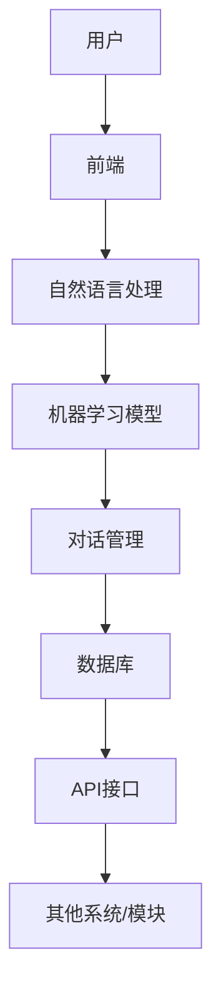
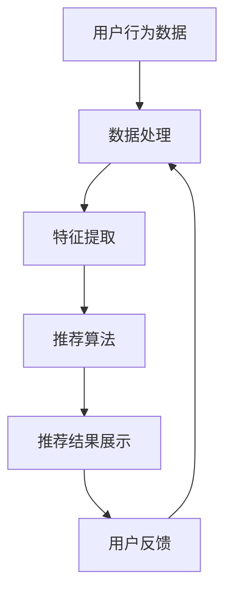

                 

# 《人类-AI协作的未来：增强人类计算》

## 关键词：人工智能，人类协作，增强计算，AI技术应用，未来趋势

### 摘要

随着人工智能技术的快速发展，人类与AI的协作已成为提升计算能力、推动社会进步的重要方式。本文从引言开始，详细探讨了人工智能的核心概念、技术原理及其在智能家居、自动驾驶和医疗等领域的应用。接着，分析了AI与人类协作的原理、工具与应用，并针对隐私、伦理和技术适应性等挑战提出了解决方案。随后，展望了AI技术的未来发展趋势，包括量子计算、脑机接口和AI伦理与法律等方面。最后，通过两个项目实战，展示了智能客服系统和个性化推荐系统的开发与优化过程。本文旨在为读者提供一个全面而深入的关于人类-AI协作与增强人类计算的概述。

---

### 《人类-AI协作的未来：增强人类计算》目录大纲

#### 第一部分：引言

1. 引言  
   - 1.1 AI与人类协作的背景
     - 1.1.1 AI技术的发展历程
     - 1.1.2 增强人类计算的需求与挑战
   - 1.2 本书结构概述
     - 1.2.1 各章节主要内容
     - 1.2.2 阅读建议

#### 第二部分：AI基础

2. AI基础  
   - 2.1 AI核心概念
     - 2.1.1 人工智能的定义
     - 2.1.2 人工智能的分类
     - 2.1.3 人工智能的发展趋势
   - 2.2 AI技术原理
     - 2.2.1 深度学习基础
       - 2.2.1.1 神经网络概述
       - 2.2.1.2 深度学习算法
     - 2.2.2 自然语言处理
       - 2.2.2.1 语言模型
       - 2.2.2.2 对话系统
   - 2.3 AI应用案例
     - 2.3.1 智能家居
     - 2.3.2 自动驾驶
     - 2.3.3 人工智能在医疗领域的应用

#### 第三部分：AI与人类协作

3. AI与人类协作  
   - 3.1 AI增强人类能力的原理
     - 3.1.1 人机协同工作模式
     - 3.1.2 人机交互设计
     - 3.1.3 AI辅助决策
   - 3.2 AI协同工具与应用
     - 3.2.1 智能协作平台
     - 3.2.2 自动化流程
     - 3.2.3 智能助手
   - 3.3 AI与人类协作的挑战与解决方案
     - 3.3.1 隐私与安全
     - 3.3.2 伦理问题
     - 3.3.3 技术适应性

#### 第四部分：AI的未来发展

4. AI的未来发展  
   - 4.1 AI技术的未来趋势
     - 4.1.1 量子计算
     - 4.1.2 脑机接口
     - 4.1.3 AI伦理与法律
   - 4.2 增强人类计算的未来展望
     - 4.2.1 人类与AI融合
     - 4.2.2 智能社会
     - 4.2.3 教育与职业发展

#### 第五部分：项目实战

5. 项目实战  
   - 5.1 实战一：构建智能客服系统
     - 5.1.1 项目背景
     - 5.1.2 技术选型
     - 5.1.3 系统架构设计
     - 5.1.4 实现与优化
   - 5.2 实战二：开发个性化推荐系统
     - 5.2.1 项目背景
     - 5.2.2 技术选型
     - 5.2.3 系统架构设计
     - 5.2.4 实现与优化

#### 第六部分：附录

6. 附录  
   - 6.1 常用工具与资源
     - 6.1.1 开发工具
     - 6.1.2 学习资源
     - 6.1.3 开源框架
   - 6.2 参考文献

---

### 第一部分：引言

#### 1. 引言

**1.1 AI与人类协作的背景**

人工智能（AI）作为现代科技的重要组成部分，已经渗透到我们日常生活的方方面面。从智能家居的语音助手，到自动驾驶汽车，再到医疗诊断辅助系统，AI技术正不断改变我们的生活方式和工作方式。在这个过程中，人类与AI的协作逐渐成为提升计算能力、提高工作效率的关键因素。

**1.1.1 AI技术的发展历程**

人工智能的概念最早可以追溯到20世纪50年代。当时的科学家们提出，通过计算机模拟人类思维过程，可以使机器具备类似于人类的智能。然而，由于计算能力的限制，早期的人工智能研究进展缓慢。随着计算机技术的快速发展，特别是深度学习和大数据技术的出现，人工智能进入了快速发展的阶段。

- **1950年代**：人工智能的概念被提出，最早的AI程序如“逻辑理论家”诞生。
- **1980年代**：专家系统成为AI研究的热点，应用范围广泛。
- **2006年**：深度学习技术的兴起，为人工智能的发展带来了新的契机。
- **2012年**：AlexNet在图像识别比赛中取得突破性成果，标志着深度学习时代的到来。

**1.1.2 增强人类计算的需求与挑战**

随着AI技术的不断进步，增强人类计算能力的需求也越来越强烈。人类在面对日益复杂的问题时，需要更高的计算能力和更智能的决策支持。然而，这也带来了许多挑战：

- **计算能力限制**：虽然计算机性能不断提升，但在处理某些复杂任务时，仍存在性能瓶颈。
- **数据隐私与安全**：AI系统的运作需要大量数据，如何保护用户隐私和数据安全成为关键问题。
- **伦理问题**：随着AI技术的应用范围扩大，如何确保AI系统的公平性、透明性和可解释性也引起了广泛关注。

**1.2 本书结构概述**

本书旨在提供一个全面而深入的关于人类-AI协作与增强人类计算的概述。全文共分为六个部分：

- **第一部分：引言**：介绍AI与人类协作的背景和本书的结构。
- **第二部分：AI基础**：探讨人工智能的核心概念、技术原理和应用案例。
- **第三部分：AI与人类协作**：分析AI与人类协作的原理、工具和应用，以及面临的挑战和解决方案。
- **第四部分：AI的未来发展**：展望AI技术的未来趋势和增强人类计算的未来前景。
- **第五部分：项目实战**：通过实际项目展示AI技术的应用和实践。
- **第六部分：附录**：提供常用工具与资源，以及参考文献。

**1.2.1 各章节主要内容**

- **第二部分：AI基础**：介绍人工智能的定义、分类和主要发展趋势；深度学习、自然语言处理等AI技术原理；以及智能家居、自动驾驶、医疗等AI应用案例。
- **第三部分：AI与人类协作**：分析AI增强人类能力的原理，人机协同工作模式，人机交互设计，AI辅助决策等方面；介绍智能协作平台、自动化流程和智能助手等AI协同工具与应用；探讨AI与人类协作面临的挑战及解决方案。
- **第四部分：AI的未来发展**：探讨量子计算、脑机接口等未来AI技术的发展趋势；展望人类与AI融合、智能社会、教育与职业发展等未来前景。
- **第五部分：项目实战**：通过两个实际项目，展示智能客服系统和个性化推荐系统的开发与优化过程。
- **第六部分：附录**：提供AI开发常用工具与资源，以及参考文献。

**1.2.2 阅读建议**

本书适合对人工智能和AI协作感兴趣的读者阅读。为了更好地理解内容，建议按以下顺序阅读：

- **先阅读第一部分引言**，了解AI与人类协作的背景和本书结构。
- **接着阅读第二部分AI基础**，掌握人工智能的核心概念、技术原理和应用案例。
- **然后阅读第三部分AI与人类协作**，了解AI与人类协作的原理、工具和应用，以及面临的挑战和解决方案。
- **之后阅读第四部分AI的未来发展**，了解AI技术的未来趋势和增强人类计算的未来前景。
- **最后阅读第五部分项目实战**，通过实际项目加深对AI应用的理解。
- **最后查阅第六部分附录**，获取更多AI开发资源。

通过本书的阅读，读者将能够全面了解人类-AI协作的原理、应用和未来发展趋势，为实际应用和研究提供有力支持。

---

### 第二部分：AI基础

#### 2.1 AI核心概念

人工智能（Artificial Intelligence，简称AI）是计算机科学的一个分支，旨在通过模拟人类智能行为，使机器具备感知、学习、推理和决策的能力。AI的核心概念包括以下几个方面：

**2.1.1 人工智能的定义**

人工智能是指使计算机能够执行通常需要人类智能的任务的科学和工程领域。这些任务包括理解自然语言、识别图像、解决问题、学习新知识等。人工智能的目标是创造智能体（agent），这些智能体能够在复杂的、不确定的环境中自主行动并实现特定的目标。

**2.1.2 人工智能的分类**

人工智能可以分为以下几种类型：

1. **弱AI（Weak AI）**：也称为窄AI（Narrow AI），这类AI系统专注于特定任务，如语音识别、图像分类等。弱AI无法进行跨领域的通用推理。

2. **强AI（Strong AI）**：也称为通用AI（AGI，Artificial General Intelligence），这类AI系统具备人类智能的所有方面，能够处理各种复杂问题，并在新环境中进行自我学习和适应。强AI目前仍处于理论研究阶段，尚未实现。

3. **超级智能（Superintelligent AI）**：超级智能是指超出人类智能的AI，能够在所有认知任务上超越人类。这是一个极具争议的话题，目前尚无定论。

**2.1.3 人工智能的发展趋势**

人工智能的发展趋势表现在以下几个方面：

1. **智能化普及**：AI技术正逐渐渗透到各个行业，如金融、医疗、制造等，推动产业升级和数字化转型。

2. **人机协同**：人与AI的协作将成为主流，AI将作为人类的辅助工具，提升工作效率。

3. **自主决策**：随着AI技术的发展，AI将具备更强的自主决策能力，能够在复杂环境中进行实时决策。

4. **跨领域融合**：AI与其他领域的融合，如量子计算、脑机接口等，将为人工智能带来新的突破。

#### 2.2 AI技术原理

AI技术的实现依赖于多种算法和技术，其中最核心的是机器学习和深度学习。

**2.2.1 深度学习基础**

深度学习（Deep Learning）是机器学习的一个分支，基于人工神经网络（Artificial Neural Networks，ANN）的架构，通过多层神经网络对数据进行建模和预测。深度学习在图像识别、语音识别、自然语言处理等领域取得了显著成果。

**2.2.1.1 神经网络概述**

神经网络是由大量简单的处理单元（神经元）组成的网络，通过相互连接实现复杂的计算能力。每个神经元接收输入信号，通过激活函数产生输出信号。神经网络通过不断调整权重和偏置，实现对数据的建模和预测。

**2.2.1.2 深度学习算法**

深度学习算法主要包括：

1. **卷积神经网络（CNN）**：适用于图像处理，通过卷积层、池化层和全连接层对图像数据进行特征提取和分类。

2. **循环神经网络（RNN）**：适用于序列数据，通过隐藏状态和循环结构对时间序列数据进行建模和预测。

3. **生成对抗网络（GAN）**：适用于图像生成和对抗性学习，由生成器和判别器两个网络组成，通过生成器和判别器的对抗训练，实现高质量的数据生成。

**2.2.2 自然语言处理**

自然语言处理（Natural Language Processing，NLP）是AI领域的一个重要分支，旨在使计算机理解和处理人类语言。NLP技术广泛应用于语音识别、机器翻译、文本分类等任务。

**2.2.2.1 语言模型**

语言模型（Language Model）是NLP的基础，用于预测文本的下一个词或短语。最常见的语言模型是循环神经网络（RNN）和变换器（Transformer）模型。

**2.2.2.2 对话系统**

对话系统（Dialogue System）是一种人机交互技术，旨在实现自然、流畅的对话体验。对话系统包括语音识别、自然语言理解和对话生成三个核心模块。

#### 2.3 AI应用案例

AI技术在各个领域得到了广泛应用，以下是一些典型的AI应用案例：

**2.3.1 智能家居**

智能家居通过AI技术实现家电设备的智能联动，提高生活质量。例如，智能音箱可以通过语音指令控制家居设备，智能灯光系统可以根据用户习惯自动调节亮度。

**2.3.2 自动驾驶**

自动驾驶汽车利用AI技术实现自主驾驶，提高交通安全和效率。自动驾驶系统包括感知、规划和控制三个模块，通过深度学习和计算机视觉技术，实现车辆在复杂环境中的自主驾驶。

**2.3.3 人工智能在医疗领域的应用**

人工智能在医疗领域的应用包括疾病诊断、药物研发、手术辅助等。例如，利用深度学习技术，可以对医疗影像进行自动诊断，提高诊断准确率；通过自然语言处理技术，可以自动提取医学文献中的关键信息，加速药物研发。

通过以上内容，我们可以看到，AI技术在各个领域的发展正在不断推动人类生活和工作方式的变革。在接下来的章节中，我们将进一步探讨AI与人类协作的原理、工具和应用。

---

### 第三部分：AI与人类协作

#### 3.1 AI增强人类能力的原理

人工智能（AI）作为现代科技的重要成果，已经逐渐成为增强人类计算能力的重要工具。AI与人类的协作，不仅能够提高工作效率，还能够拓展人类的能力边界。本节将深入探讨AI增强人类能力的原理，包括人机协同工作模式、人机交互设计以及AI辅助决策等方面。

**3.1.1 人机协同工作模式**

人机协同工作模式是指人与AI系统共同完成任务，实现优势互补。这种模式主要分为以下几种：

1. **监督模式**：在这种模式下，AI系统根据人类的指导和反馈，完成特定的任务。例如，在自动驾驶中，驾驶员在必要时可以接管车辆控制权。

2. **协作模式**：在这种模式下，人与AI系统共同参与决策和执行任务。例如，在医疗诊断中，医生和AI系统共同分析病例数据，提高诊断准确性。

3. **自主模式**：在这种模式下，AI系统具备独立完成任务的能力，人类仅进行监督和调整。例如，在股票交易中，AI系统可以根据市场数据自主进行买卖操作。

**3.1.2 人机交互设计**

人机交互设计是AI系统与人类用户之间沟通的桥梁，其核心目标是提高交互效率、用户体验和安全性。以下是几个关键方面：

1. **用户界面（UI）**：设计直观、易用的用户界面，使用户能够方便地与AI系统进行交互。例如，智能音箱的语音界面，以及智能手机的触摸界面。

2. **自然语言处理（NLP）**：通过NLP技术，实现自然、流畅的对话体验。例如，智能客服系统能够理解用户的自然语言提问，并生成恰当的回复。

3. **可视化和反馈**：使用图表、图像和动画等可视化手段，帮助用户更好地理解AI系统的操作和决策过程。同时，提供及时的反馈，增强用户对AI系统的信任感。

**3.1.3 AI辅助决策**

AI辅助决策是指利用AI技术，为人类提供数据分析和预测模型，辅助人类做出更加明智的决策。以下是几个应用场景：

1. **预测分析**：通过机器学习算法，分析历史数据，预测未来趋势。例如，零售商可以使用AI预测销售量，以便优化库存管理。

2. **风险管理**：AI系统可以分析风险数据，识别潜在的风险因素，并提供应对策略。例如，金融机构可以使用AI系统进行信用评分和风险评估。

3. **优化决策**：通过优化算法，为复杂决策提供最佳方案。例如，物流公司可以使用AI优化运输路线，提高运输效率。

**3.1.4 人机协同的挑战与解决方案**

在人机协同过程中，存在一些挑战，如数据隐私、安全性和伦理问题。以下是几个关键挑战及解决方案：

1. **数据隐私**：解决方案包括数据加密、去标识化、数据共享协议等。

2. **安全性**：解决方案包括网络安全、数据安全、AI系统安全性等。

3. **伦理问题**：解决方案包括建立AI伦理准则、加强监管等。

通过上述分析，我们可以看到，AI与人类协作不仅能够提高工作效率，还能够拓展人类的能力边界。在人机协同的过程中，设计良好的交互界面、自然语言处理技术以及AI辅助决策系统，都是实现高效协作的关键。随着AI技术的不断进步，未来人机协同将更加紧密，为人类带来更多的便利和可能性。

---

### 第三部分：AI与人类协作

#### 3.2 AI协同工具与应用

随着人工智能技术的不断发展，AI协同工具在提高工作效率和优化工作流程方面发挥了重要作用。本节将介绍几种常见的AI协同工具与应用，包括智能协作平台、自动化流程和智能助手等。

**3.2.1 智能协作平台**

智能协作平台是一种集成了多种功能的人工智能系统，旨在提高团队协作效率。以下是一些典型的智能协作平台：

1. **企业微信**：企业微信提供了即时通讯、视频会议、文档协作等功能，支持跨部门、跨地域的协作。通过智能协作平台，团队成员可以实时沟通、共享信息和协同完成任务。

2. **钉钉**：钉钉是一款集成了办公协同、智能客服、会议管理和企业服务等功能的企业级平台。通过钉钉，企业可以建立统一的办公入口，实现信息的快速传递和处理。

**3.2.2 自动化流程**

自动化流程通过AI技术，将重复性、繁琐的任务自动化，提高工作效率。以下是一些常见的自动化流程：

1. **机器人流程自动化（RPA）**：RPA通过模拟人类操作，实现业务流程的自动化。例如，企业可以使用RPA机器人自动处理财务报表、发票审核等业务流程，减少人工操作，提高处理速度和准确性。

2. **AI流程优化**：通过数据分析、机器学习等技术，对业务流程进行优化。例如，企业可以使用AI流程优化工具，分析业务流程中的瓶颈和异常，提出优化建议，提高整体流程效率。

**3.2.3 智能助手**

智能助手是利用人工智能技术，为用户提供个性化服务和支持的智能系统。以下是一些常见的智能助手：

1. **语音助手**：如小爱同学、天猫精灵等，可以通过语音交互，为用户提供信息查询、语音控制家电、日程提醒等功能。

2. **文本助手**：如企业微信机器人、智能客服等，可以通过文本交互，为用户提供在线客服、知识问答、订单查询等服务。

**3.2.4 AI协同工具的实际应用**

以下是AI协同工具在实际应用中的几个例子：

1. **智能客服**：通过智能客服系统，企业可以自动处理大量的客户咨询，提高服务效率和客户满意度。例如，银行可以使用智能客服机器人，自动回答客户的常见问题，减轻人工客服的负担。

2. **智能采购**：通过AI协同工具，企业可以实现采购流程的自动化。例如，利用RPA技术，企业可以自动生成采购订单、发送采购请求，并与供应商进行实时沟通，提高采购效率。

3. **智能办公**：通过智能协作平台，企业可以实现办公流程的无缝衔接，提高办公效率。例如，利用企业微信，员工可以实时沟通、共享文档，协同完成工作任务。

通过以上介绍，我们可以看到，AI协同工具在提高工作效率、优化工作流程方面具有巨大潜力。随着AI技术的不断进步，未来AI协同工具将在更多领域得到广泛应用，为人类带来更多的便利。

---

### 第三部分：AI与人类协作

#### 3.3 AI与人类协作的挑战与解决方案

随着人工智能（AI）技术的广泛应用，AI与人类的协作日益成为提升计算能力、提高工作效率的重要途径。然而，这种协作也面临着诸多挑战，包括隐私与安全、伦理问题和技术适应性等方面。本节将探讨这些挑战，并分析可能的解决方案。

**3.3.1 隐私与安全**

隐私和安全是AI与人类协作中最为重要的挑战之一。AI系统通常需要大量的数据来训练和优化模型，这些数据可能包含用户的个人隐私信息。如何保护用户隐私，防止数据泄露成为关键问题。

**挑战：**

1. **数据收集与存储**：AI系统在训练过程中需要大量数据，如何确保数据收集的合法性和合规性？
2. **数据共享**：如何确保在数据共享过程中，用户隐私不被泄露？
3. **数据泄露**：如何防止恶意攻击和数据泄露？

**解决方案：**

1. **数据加密**：使用高级加密技术，确保数据在传输和存储过程中的安全性。
2. **隐私保护算法**：开发和应用隐私保护算法，如差分隐私（Differential Privacy），在保证数据可用性的同时，保护用户隐私。
3. **用户隐私设置**：提供用户隐私设置，让用户可以控制自己的数据共享范围。
4. **数据匿名化**：通过数据去标识化、聚合等技术，降低数据泄露的风险。

**3.3.2 伦理问题**

AI的广泛应用引发了诸多伦理问题，包括算法偏见、透明性、责任归属等。

**挑战：**

1. **算法偏见**：AI系统可能因为数据集的不平衡或训练算法的问题，产生偏见，导致歧视。
2. **透明性**：AI系统的决策过程可能不透明，用户难以理解AI的决策依据。
3. **责任归属**：当AI系统发生错误或导致损失时，如何界定责任归属？

**解决方案：**

1. **算法公平性**：通过设计公平性算法，确保AI系统的决策不会产生歧视。
2. **决策透明性**：提高AI系统的可解释性，使用户能够理解AI的决策过程。
3. **责任保险**：为AI系统提供责任保险，降低因AI错误导致的法律和财务风险。
4. **伦理审查**：建立独立的伦理审查委员会，对AI系统的设计和应用进行监督和评估。

**3.3.3 技术适应性**

AI系统的适应性是另一个挑战。不同的应用场景和行业对AI系统的需求各不相同，如何确保AI系统能够适应这些需求？

**挑战：**

1. **定制化需求**：每个应用场景对AI系统的要求不同，如何快速定制和部署AI系统？
2. **技术更新**：随着技术的不断发展，如何保持AI系统的更新和迭代？
3. **集成与兼容性**：如何确保AI系统能够与其他系统和设备无缝集成？

**解决方案：**

1. **模块化设计**：采用模块化设计，使AI系统易于定制和扩展。
2. **持续学习**：利用持续学习技术，使AI系统能够适应新的数据和场景。
3. **开放接口**：提供开放的API和接口，便于与其他系统和设备的集成。
4. **标准与规范**：制定统一的AI标准和规范，提高系统的兼容性和互操作性。

通过上述分析和解决方案，我们可以看到，AI与人类协作虽然面临诸多挑战，但通过合理的策略和技术手段，这些挑战是可以克服的。随着AI技术的不断进步，AI与人类的协作将会更加紧密，为人类社会带来更多便利和创新。

---

### 第四部分：AI的未来发展

#### 4.1 AI技术的未来趋势

人工智能（AI）技术正处于快速发展的阶段，未来的趋势将更加深入地影响我们的生活和工作的各个方面。以下将探讨几个关键的未来趋势，包括量子计算、脑机接口和AI伦理与法律等方面。

**4.1.1 量子计算**

量子计算是下一代计算技术的代表，其基于量子力学原理，利用量子比特（qubit）的叠加和纠缠特性进行计算。与传统的二进制计算机相比，量子计算机具有超强的计算能力，能够在极短的时间内解决传统计算机难以处理的问题，如复杂优化问题、大规模数据处理和量子模拟等。

**量子计算的基本概念：**

- **量子比特（qubit）**：量子比特是量子计算的基本单位，可以同时表示0和1的状态，这是量子计算并行性的基础。
- **量子门（quantum gate）**：量子门是操作量子比特的基本操作，类似于传统计算机中的逻辑门。

**量子计算的应用：**

- **优化问题**：量子计算在优化问题，如物流调度、金融交易策略和供应链管理中具有巨大潜力。
- **机器学习**：量子计算可以提高机器学习模型的训练速度和效率，尤其是在处理高维数据和复杂模型时。

**4.1.2 脑机接口**

脑机接口（Brain-Computer Interface，BCI）是一种直接连接大脑和计算机的技术，它通过采集大脑信号，将思维转化为计算机指令，实现人脑与机器的直接交互。脑机接口在残疾人辅助、认知增强和医疗康复等领域具有广泛的应用前景。

**脑机接口的工作原理：**

- **神经信号采集**：通过电极或脑成像技术，采集大脑活动产生的电信号。
- **信号处理**：将采集到的神经信号转化为计算机可以处理的数字信号。
- **解码与控制**：通过机器学习算法，解码神经信号，实现对计算机或机器人的控制。

**脑机接口的应用：**

- **残疾人辅助**：脑机接口可以帮助肢体残疾者实现动作控制，如轮椅控制、假肢操作等。
- **认知增强**：脑机接口可以辅助记忆、注意力提升和决策能力增强。
- **医疗康复**：脑机接口在神经康复、康复训练和疾病管理方面具有应用潜力。

**4.1.3 AI伦理与法律**

随着AI技术的快速发展，AI伦理和法律问题日益凸显。AI系统的广泛应用可能带来隐私侵犯、歧视、不可预测性和责任归属等问题，因此需要建立相应的伦理和法律框架来确保AI技术的安全、公正和透明。

**AI伦理：**

- **公平性**：确保AI系统不歧视、不偏见。
- **透明性**：使AI系统的决策过程可解释、可监督。
- **责任**：明确AI系统的责任归属。

**AI法律：**

- **数据保护**：确保用户数据的安全和隐私。
- **责任归属**：明确AI系统引发事故的责任归属。
- **监管**：建立监管机构，确保AI技术的健康发展。

**4.1.4 量子计算与脑机接口的结合**

量子计算和脑机接口的结合，有望带来全新的计算能力和交互模式。例如，通过脑机接口直接输入量子计算任务，利用量子计算机进行计算，然后将结果通过脑机接口反馈给用户。这种结合将极大提升人类在复杂任务中的计算能力和认知水平。

通过以上探讨，我们可以看到，AI技术的未来发展趋势令人兴奋，量子计算、脑机接口和AI伦理与法律等方面的发展将为AI技术带来更多可能性。随着技术的不断进步，AI将更深入地融入我们的生活和工作中，推动社会进步。

---

### 第四部分：AI的未来发展

#### 4.2 增强人类计算的未来展望

随着人工智能（AI）技术的不断进步，增强人类计算的能力已成为未来科技发展的关键方向。在这个部分，我们将探讨人类与AI融合、智能社会和教育与职业发展等领域的未来展望，展示AI技术如何为人类社会带来深刻的变革。

**4.2.1 人类与AI融合**

人类与AI的融合是未来技术发展的重要趋势。通过脑机接口（BCI）和增强现实（AR）技术，人类将能够直接与计算机系统交互，扩展我们的感知和认知能力。这种融合将使人类能够处理更复杂的任务，提高工作效率。

**1. 脑机接口的应用**

脑机接口技术通过采集大脑信号，将思维转化为计算机指令。未来，脑机接口将变得更加精确和高效，能够实现高速数据传输和复杂任务的直接控制。例如，在医疗康复领域，脑机接口可以帮助瘫痪患者恢复运动能力；在工业制造领域，脑机接口可以用于控制复杂机器设备，提高生产效率。

**2. 增强现实与人类融合**

增强现实（AR）技术将人类与虚拟世界相结合，提供全新的交互体验。通过AR眼镜或其他设备，用户可以实时看到叠加在现实世界中的虚拟信息。未来，AR技术将更加普及，不仅用于娱乐和游戏，还可以在教育、医疗和工业等领域发挥重要作用。

**4.2.2 智能社会**

智能社会的概念强调AI技术在社会各个领域的应用，以实现更高效、更智能的社会运行。以下是一些智能社会的典型特征：

**1. 智慧城市**

智慧城市通过AI技术实现城市管理的智能化。例如，智能交通系统可以实时监控道路状况，优化交通流量；智能安防系统可以实时监控公共区域，预防犯罪。智慧城市的目标是提高居民生活质量，降低城市管理成本。

**2. 智能医疗**

智能医疗利用AI技术提供个性化医疗服务。例如，通过分析患者数据，AI系统可以预测疾病风险，提供早期诊断和治疗方案；智能药物研发可以加速新药的研发进程。智能医疗将提高医疗资源的利用效率，降低医疗成本。

**3. 智能经济**

智能经济强调AI技术在商业和经济发展中的应用。例如，AI驱动的营销策略可以精准定位消费者需求，提高销售额；智能供应链管理可以优化库存和物流，降低运营成本。智能经济将推动产业升级和经济增长。

**4.2.3 教育与职业发展**

AI技术对教育和职业发展的影响日益显著。以下是一些关键趋势：

**1. 个性化教育**

个性化教育通过AI技术为每个学生提供定制化的学习方案。例如，智能学习平台可以根据学生的学习进度和兴趣，推荐合适的课程和练习。个性化教育将提高学习效果，满足学生的个性化需求。

**2. 职业培训**

AI技术可以提供实时、个性化的职业培训。例如，通过虚拟现实（VR）技术，学员可以在模拟环境中练习职业技能，提高实际操作能力。职业培训将更加灵活和高效，满足不断变化的劳动力市场需求。

**3. 职业转型**

AI技术的发展将带来职业结构的变化，许多传统职业将逐渐被自动化和智能化替代。同时，新的职业机会也将涌现，如AI工程师、数据科学家和机器人编程师等。职业转型将需要劳动者具备新的技能和知识，以适应科技发展的趋势。

通过以上探讨，我们可以看到，AI技术的发展为增强人类计算能力提供了广阔的前景。人类与AI的融合、智能社会的构建以及教育与职业发展的变革，将共同推动人类社会迈向更加智能和高效的未来。

---

### 第五部分：项目实战

#### 5.1 实战一：构建智能客服系统

**5.1.1 项目背景**

随着互联网的快速发展，企业面临着日益增长的客户服务需求。传统的客服系统往往无法满足快速响应和个性化服务的要求。为了提高客户满意度和运营效率，许多企业开始采用智能客服系统。智能客服系统通过自然语言处理（NLP）、机器学习和语音识别技术，实现自动化的客户服务，提高客服质量和效率。

**5.1.2 技术选型**

在构建智能客服系统的过程中，技术选型至关重要。以下是一些关键技术的选择：

- **自然语言处理（NLP）**：用于理解和生成自然语言，实现语义分析和对话管理。常用的NLP库包括NLTK、spaCy和transformers。
- **机器学习**：用于训练智能客服模型，实现自动化分类、情感分析和意图识别。常用的机器学习框架包括scikit-learn、TensorFlow和PyTorch。
- **语音识别（ASR）**：用于将语音转化为文本，实现语音输入和输出。常用的语音识别库包括pyttsx3、SpeechRecognition和Google Cloud Speech-to-Text。
- **对话系统**：用于实现自然、流畅的对话体验，包括对话管理、意图识别和响应生成。常用的对话系统框架包括Rasa、ChatterBot和Microsoft Bot Framework。

**5.1.3 系统架构设计**

智能客服系统的架构设计需要考虑以下几个关键模块：

1. **前端**：提供用户与智能客服交互的界面，包括文本输入、语音输入和语音输出。
2. **后端**：包括自然语言处理、机器学习模型和对话管理模块，实现对话的解析和生成。
3. **数据库**：存储用户数据、对话历史和模型参数。
4. **API接口**：提供与其他系统和模块的集成接口。

以下是智能客服系统的基本架构：



**5.1.4 实现与优化**

智能客服系统的实现与优化包括以下几个关键步骤：

1. **数据收集与预处理**：收集用户对话数据，包括文本和语音数据。对数据进行分析和预处理，提取关键特征。
2. **模型训练与优化**：使用机器学习算法，训练分类模型、情感分析模型和意图识别模型。通过交叉验证和超参数调优，提高模型的准确性和鲁棒性。
3. **对话管理**：设计对话管理模块，实现对话的解析和生成。使用状态转移图或序列模型，实现对话的连续性和连贯性。
4. **性能优化**：通过优化算法、提高硬件性能和优化网络传输，提升系统的响应速度和用户体验。
5. **测试与部署**：对智能客服系统进行全面的测试，确保系统的稳定性和可靠性。在测试通过后，将系统部署到生产环境中。

**5.1.5 代码示例**

以下是智能客服系统的简单代码示例：

```python
# 导入必要的库
import pyttsx3
import SpeechRecognition as sr

# 初始化语音识别器
recognizer = sr.Recognizer()

# 初始化语音合成器
engine = pyttsx3.init()

# 获取用户输入
user_input = recognizer.listen(sr.Microphone())

# 解析用户输入
text_input = recognizer.recognize_google(user_input)

# 生成回复
response = "你好，我是智能客服，有什么问题我可以帮你解答。"

# 合成语音回复
engine.say(response)
engine.runAndWait()

# 输出文本回复
print(response)
```

通过以上步骤和代码示例，我们可以构建一个简单的智能客服系统。在实际应用中，还需要根据具体需求进行功能扩展和优化。

---

### 第五部分：项目实战

#### 5.2 实战二：开发个性化推荐系统

**5.2.1 项目背景**

个性化推荐系统是现代互联网应用中非常重要的一部分，它通过分析用户行为和兴趣，为用户提供个性化的内容推荐，从而提高用户满意度和粘性。例如，电商平台可以根据用户的购物历史和浏览行为，推荐用户可能感兴趣的商品；社交媒体平台可以根据用户的点赞、评论和分享行为，推荐用户可能感兴趣的内容。

**5.2.2 技术选型**

在开发个性化推荐系统的过程中，技术选型是关键的一步。以下是一些关键技术的选择：

- **用户行为分析**：用于提取用户兴趣和偏好。常用的技术包括点击率分析、浏览时长分析、购买行为分析等。
- **协同过滤**：用于发现用户之间的相似性，并推荐他们共同感兴趣的内容。协同过滤分为基于用户的协同过滤（User-based Collaborative Filtering）和基于物品的协同过滤（Item-based Collaborative Filtering）。
- **内容推荐**：基于用户的历史行为和内容特征，为用户提供个性化的内容推荐。常用的技术包括基于内容的推荐（Content-based Filtering）和混合推荐（Hybrid Recommender Systems）。
- **机器学习算法**：用于训练推荐模型，提高推荐系统的准确性和效率。常用的机器学习算法包括矩阵分解（Matrix Factorization）、决策树（Decision Trees）、随机森林（Random Forests）和神经网络（Neural Networks）。

**5.2.3 系统架构设计**

个性化推荐系统的架构设计需要考虑以下几个关键模块：

1. **数据采集**：收集用户行为数据，包括浏览、点击、购买等行为数据。
2. **数据处理**：对采集到的数据进行清洗、转换和预处理，提取有用的特征。
3. **推荐算法**：实现协同过滤、内容推荐和混合推荐算法，为用户提供个性化的推荐。
4. **推荐结果展示**：将推荐结果以直观的方式展示给用户，如推荐列表、推荐卡片等。
5. **用户反馈**：收集用户对推荐结果的反馈，用于优化推荐算法和模型。

以下是个性化推荐系统的基本架构：



**5.2.4 实现与优化**

个性化推荐系统的实现与优化包括以下几个关键步骤：

1. **数据收集与预处理**：收集用户行为数据，并对数据进行清洗、转换和预处理，提取有用的特征。例如，对用户行为数据进行去重、填充缺失值和归一化处理。
2. **模型训练与优化**：使用机器学习算法，训练推荐模型，包括协同过滤模型和内容推荐模型。通过交叉验证和超参数调优，提高模型的准确性和泛化能力。
3. **推荐结果生成**：根据用户特征和推荐算法，生成个性化的推荐结果。对推荐结果进行排序，确保最感兴趣的内容排在前面。
4. **实时更新**：定期更新用户特征和推荐模型，确保推荐结果的实时性和准确性。
5. **性能优化**：通过优化算法、提高硬件性能和优化网络传输，提升系统的响应速度和用户体验。

**5.2.5 代码示例**

以下是个性化推荐系统的简单代码示例：

```python
# 导入必要的库
import pandas as pd
from sklearn.model_selection import train_test_split
from sklearn.metrics.pairwise import cosine_similarity

# 加载用户行为数据
user行为数据 = pd.read_csv('user行为数据.csv')

# 预处理用户行为数据
user行为数据 = user行为数据[['用户ID', '商品ID', '行为类型', '行为时间']]
user行为数据 = user行为数据.groupby(['用户ID', '商品ID']).count().reset_index()

# 创建用户-商品矩阵
user商品矩阵 = user行为数据.pivot(index='用户ID', columns='商品ID', values='行为类型').fillna(0)

# 计算用户-商品相似度
相似度矩阵 = cosine_similarity(user商品矩阵)

# 根据相似度矩阵生成推荐结果
推荐结果 = user商品矩阵.dot(相似度矩阵).argsort()[:, 1:].T

# 输出推荐结果
print(推荐结果)
```

通过以上步骤和代码示例，我们可以构建一个简单的个性化推荐系统。在实际应用中，还需要根据具体需求进行功能扩展和优化。

---

### 第六部分：附录

#### 6.1 常用工具与资源

**6.1.1 开发工具**

- **Python**：一种广泛使用的编程语言，适合AI和数据分析项目。
- **TensorFlow**：Google开发的深度学习框架，广泛应用于AI模型开发。
- **PyTorch**：由Facebook开发的开源深度学习库，提供灵活的动态计算图。

**6.1.2 学习资源**

- **《深度学习》**：Goodfellow, I.，等。 本书是深度学习的经典教材，详细介绍了深度学习的基础理论和应用。
- **《机器学习》**：Tom Mitchell。 本书介绍了机器学习的基本概念和算法，适合初学者。
- **《自然语言处理综论》**：Daniel Jurafsky，James H. Martin。 本书全面介绍了自然语言处理的理论和应用。

**6.1.3 开源框架**

- **Scikit-learn**：一个基于Python的机器学习库，提供多种机器学习算法和工具。
- **Keras**：一个高层次的神经网络API，易于使用，适用于快速原型开发。
- **TensorFlow**：Google开发的深度学习框架，提供丰富的工具和库，支持多种深度学习模型。

#### 6.2 参考文献

- **《深度学习》**：Goodfellow, I., Bengio, Y., & Courville, A. (2016). *Deep Learning*. MIT Press.
- **《机器学习》**：Mitchell, T. (1997). *Machine Learning*. McGraw-Hill.
- **《自然语言处理综论》**：Jurafsky, D., & Martin, J. H. (2008). *Speech and Language Processing*. Prentice Hall.
- **《人工智能：一种现代的方法》**：Stuart Russell，Peter Norvig（2016）。 本书全面介绍了人工智能的基本理论和方法。

通过附录部分提供的相关工具、资源和参考文献，读者可以进一步深入了解人工智能和AI协作的相关知识，为实际应用和研究提供有力支持。在AI技术不断发展的今天，掌握这些工具和资源将有助于推动人工智能领域的创新和发展。

