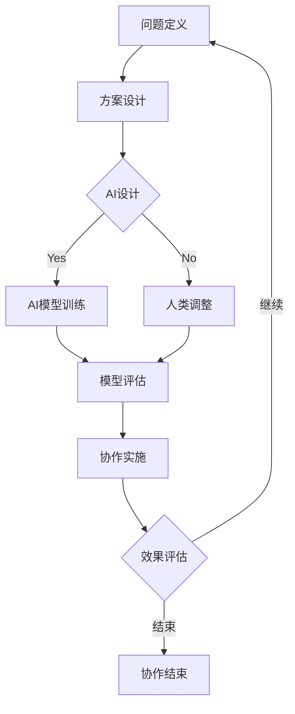

                 

### 文章标题: 人类-AI协作：增强人类智慧与AI能力的协同创新

关键词：人类-AI协作、AI赋能、智能医疗、智能教育、强化学习、生成对抗网络（GAN）、自然语言处理（NLP）

摘要：本文旨在探讨人类与人工智能（AI）的协作机制，通过引入历史背景、核心原理、算法应用和实战案例，详细解析人类与AI如何协同创新，提升人类智慧与AI能力。文章分为三部分：引言与概述，人类-AI协作原理，以及人类-AI协作的实战应用。通过逐步分析，本文揭示了人类与AI协作的未来发展趋势及其伦理问题，旨在为读者提供全面深入的理解。

### 引言与概述

#### 人类-AI协作的历史与发展趋势

人类与人工智能的协作可以追溯到计算机科学和人工智能的起源。从早期的计算辅助到现代的智能系统，人类一直在努力探索如何更好地利用AI技术提升自身的能力。早期的计算机主要用于数据处理和简单的自动化任务，而随着计算能力和算法的进步，AI逐渐开始承担更复杂的工作。

**发展趋势**：

- **AI技术的普及**：随着深度学习、强化学习等算法的突破，AI技术逐渐应用于各个领域，从工业自动化到智能家居，从医疗诊断到自动驾驶。

- **人类角色的转变**：在AI的辅助下，人类从执行重复性任务的角色逐步转变为创新和决策者，与AI共同解决复杂问题。

- **协作模式的多样化**：从简单的任务分配到更高级的协同工作，人类与AI的协作模式不断进化，形成了多样化的协作模式。

#### 人类-AI协作的核心价值与挑战

**核心价值**：

- **增强智慧**：AI可以处理大量数据和复杂的计算任务，帮助人类从繁重的工作中解脱出来，专注于更高层次的思考和创造。

- **提高效率**：AI在执行重复性、低效的任务时具有显著优势，可以大幅提高生产力和效率。

- **创新驱动**：AI与人类智慧的结合，激发了新的创意和发明，推动了科技进步和社会发展。

**挑战**：

- **技术挑战**：AI技术的发展和应用仍存在许多难题，如算法的优化、数据的质量和安全等问题。

- **伦理挑战**：AI的决策过程可能涉及道德和伦理问题，如何确保AI的公正性和透明度是一个重要议题。

- **人类适应**：人类需要适应与AI共存的生态环境，学会利用AI技术，同时保持自身的独特性和创造力。

#### 本书结构安排与学习目标

本书分为三大部分，旨在通过系统的分析，深入探讨人类-AI协作的各个方面。

**第一部分：引言与概述**  
- 引入人类-AI协作的背景和发展趋势。
- 分析人类-AI协作的核心价值与面临的挑战。

**第二部分：人类-AI协作原理**  
- 比较人类智能与AI智能，建立人类-AI协作的理论框架。
- 详细讲解强化学习、生成对抗网络（GAN）、自然语言处理（NLP）等核心算法。
- 解析监督学习与无监督学习模型及其数学原理。

**第三部分：人类-AI协作实战**  
- 探讨AI在医疗、教育等领域的实际应用。
- 通过项目实战，展示人类-AI协作的具体实现过程。
- 分析人类-AI协作的未来发展趋势和伦理问题。

通过本书的学习，读者将能够：

- 理解人类-AI协作的背景和重要性。
- 掌握人类-AI协作的核心原理和算法。
- 应用所学知识，开展实际项目，推动AI与人类的协同创新。

### 1.1 人类-AI协作的历史与发展趋势

人类与人工智能（AI）的协作历史可以追溯到计算机科学和人工智能的萌芽时期。从最初的计算机辅助到现代的智能系统，人类一直在努力探索如何更好地利用AI技术提升自身的能力。以下是人类-AI协作的重要历史节点和发展趋势：

**1.1.1 早期的计算机辅助**

- **20世纪50年代**：计算机科学初具规模，人工智能（AI）作为计算机科学的一个分支开始兴起。早期的计算机主要用于数据处理和简单的自动化任务，如数据分类和计算。

- **20世纪60年代**：专家系统（Expert Systems）成为AI研究的热点，试图模拟人类专家的决策过程。这些系统能够处理特定的领域问题，如医学诊断和地质勘探。

**1.1.2 AI技术的突破**

- **20世纪80年代**：随着硬件性能的提升和算法的进步，AI技术开始逐渐应用于更多领域。机器视觉、语音识别和自然语言处理等关键技术取得突破。

- **20世纪90年代**：互联网的普及推动了AI技术的发展，AI开始应用于更广泛的场景，如搜索引擎、推荐系统和智能客服。

**1.1.3 深度学习与AI应用爆发**

- **21世纪初期**：深度学习（Deep Learning）技术的兴起，使得计算机视觉、语音识别和自然语言处理等领域的AI应用取得了显著的进步。

- **2012年**：AlexNet在ImageNet竞赛中取得突破性成绩，深度学习开始受到广泛关注。

- **2016年**：AlphaGo战胜围棋世界冠军，标志着AI在复杂决策领域的突破。

**1.1.4 人类-AI协作的深化**

- **21世纪10年代**：随着AI技术的不断进步，人类与AI的协作模式逐渐多样化。从简单的任务分配到更高级的协同工作，AI开始承担更多复杂的任务。

- **2020年至今**：AI技术在医疗、教育、金融等领域的应用日益广泛，AI赋能人类智慧成为现实。同时，AI伦理问题受到广泛关注，人类-AI协作的可持续性成为重要议题。

**发展趋势**：

- **技术进步**：硬件性能的提升、算法的创新和数据的积累，将继续推动AI技术的发展。

- **应用多样化**：AI将在更多领域得到应用，如智能制造、智慧城市和元宇宙等。

- **人类角色的转变**：人类将在AI的辅助下，从执行重复性任务的角色逐步转变为创新和决策者。

- **协作模式的多样化**：人类与AI的协作模式将更加复杂和多样化，形成更加紧密的协作关系。

### 1.2 人类-AI协作的核心价值与挑战

#### 1.2.1 核心价值

**增强智慧**：AI能够在处理大量数据和复杂计算任务方面展现其优势，这为人类提供了强大的工具。通过AI，人类可以更快速地分析数据，提取有价值的信息，从而提升决策的准确性和效率。例如，在医疗领域，AI可以帮助医生快速分析医学影像，提高诊断的准确率。

**提高效率**：AI在执行重复性、低效的任务方面具有显著优势。例如，智能客服系统能够处理大量的客户咨询，减少人力成本，同时提高响应速度。在制造业中，AI可以优化生产流程，提高生产效率和产品质量。

**创新驱动**：AI与人类智慧的结合，激发了新的创意和发明。例如，在艺术领域，AI可以生成新的音乐、绘画作品，为人类艺术创作提供了新的思路和手段。在科学研究领域，AI可以帮助研究人员更快地发现规律，推动科技进步。

#### 1.2.2 挑战

**技术挑战**：尽管AI技术取得了显著进步，但在某些方面仍存在挑战。例如，深度学习模型需要大量数据训练，数据的质量和多样性对模型的性能有重要影响。此外，算法的优化和计算资源的限制也是需要解决的问题。

**伦理挑战**：AI的决策过程可能涉及道德和伦理问题。如何确保AI的公正性、透明度和可解释性是一个重要议题。例如，在自动驾驶领域，如何处理突发情况，保证行人和车辆的安全是一个亟待解决的问题。

**人类适应**：人类需要适应与AI共存的生态环境。这包括如何利用AI技术，提高自身的能力，同时保持人类的独特性和创造力。例如，在智能教育领域，如何设计AI辅导系统，既能帮助学生提高学习效果，又能保护他们的隐私和个性化需求。

### 1.3 本书结构安排与学习目标

本书分为三个主要部分，旨在通过系统的分析，深入探讨人类-AI协作的各个方面。

**第一部分：引言与概述**  
本部分将引入人类-AI协作的背景和发展趋势，分析其核心价值与面临的挑战。通过这一部分，读者将能够了解人类-AI协作的基本概念和重要性。

**第二部分：人类-AI协作原理**  
本部分将详细讲解人类-AI协作的核心原理和算法。包括人类智能与AI智能的比较，强化学习、生成对抗网络（GAN）、自然语言处理（NLP）等核心算法，以及监督学习与无监督学习模型。通过这一部分，读者将掌握人类-AI协作的基本原理和关键技术。

**第三部分：人类-AI协作实战**  
本部分将探讨AI在医疗、教育等领域的实际应用，通过项目实战，展示人类-AI协作的具体实现过程。同时，分析人类-AI协作的未来发展趋势和伦理问题。通过这一部分，读者将能够将所学知识应用于实际场景，推动AI与人类的协同创新。

通过本书的学习，读者将能够：

- 理解人类-AI协作的背景和重要性。
- 掌握人类-AI协作的核心原理和算法。
- 应用所学知识，开展实际项目，推动AI与人类的协同创新。

## 第2章: 人类智能与AI智能的比较与联系

### 2.1 人类智能的核心特性

人类智能（Human Intelligence）是指人类在认知、思维、学习、解决问题等方面展现出的能力。它具有以下几个核心特性：

**1. 创造力**：人类智能具有独特的创造力，能够产生新颖的思路和创意。这种能力源于人类的大脑结构，尤其是大脑的前额叶区域，它负责抽象思维、规划和创造性思考。

**2. 情感与情感理解**：人类智能能够体验和表达情感，同时理解和感受他人的情感。这种能力使得人类能够建立深厚的社交关系，并有效地沟通和协作。

**3. 智能多样性**：人类智能具有多样性，不同个体在感知、记忆、推理、解决问题等方面具有不同的优势和特长。这种多样性使得人类社会能够适应复杂多变的自然环境和社会环境。

**4. 语言与沟通**：人类智能能够使用语言进行高效沟通，表达思想和情感。语言是人类智力发展的重要工具，它使得人类能够传递知识、文化和价值观。

**5. 学习与适应性**：人类智能具有强大的学习能力和适应性。通过经验积累和知识学习，人类能够不断改进自己的认知能力和行为方式，适应新的环境和挑战。

### 2.2 AI智能的技术基础

人工智能（Artificial Intelligence，简称AI）是指通过计算机模拟人类的智能行为，实现机器在认知、学习、推理、解决问题等方面具备类似人类智能的能力。AI智能的技术基础主要包括以下几个方面：

**1. 神经网络**：神经网络是AI智能的核心技术之一，它模仿了人类大脑的神经元结构和信息处理方式。神经网络通过多层节点（神经元）对输入数据进行处理和转换，从而实现复杂函数的逼近和模式识别。

**2. 深度学习**：深度学习是神经网络的一种扩展，它通过增加网络的深度和复杂性，提高了AI智能的处理能力和效率。深度学习模型，如卷积神经网络（CNN）和循环神经网络（RNN），在图像识别、语音识别、自然语言处理等领域取得了显著成果。

**3. 机器学习**：机器学习是AI智能的基础，它通过训练模型从数据中学习规律和模式。机器学习方法包括监督学习、无监督学习和强化学习等，这些方法使得AI智能能够在不同任务中展现出强大的学习能力。

**4. 自然语言处理**：自然语言处理是AI智能的重要领域，它致力于使计算机能够理解和生成自然语言。自然语言处理技术包括词嵌入、序列模型、注意力机制和转换器架构等，这些技术使得AI智能能够与人类进行自然语言交流。

**5. 强化学习**：强化学习是一种通过试错和反馈机制进行学习的方法。在强化学习中，AI智能通过不断尝试和优化策略，以实现特定目标。强化学习在游戏、机器人控制、推荐系统等领域表现出色。

### 2.3 人类与AI协作的理论框架

人类与AI协作的理论框架旨在描述人类和AI如何相互作用、互补优势，实现协同创新。以下是一个简化的理论框架：

#### 1. 人类智能与AI智能的互补性

- **人类智能的优势**：创造力、情感理解、语言沟通和适应能力等。
- **AI智能的优势**：数据处理、模式识别、复杂计算和自动执行等。

#### 2. 协作机制

- **信息交流**：人类和AI通过语言、数据、图像等多种方式交流信息，实现知识共享和任务协同。
- **任务分工**：人类和AI根据各自的优势，分担任务，实现高效协作。
- **决策支持**：AI提供数据分析和预测模型，辅助人类做出更准确的决策。

#### 3. 创新过程

- **问题定义**：人类识别问题和需求，明确协作目标。
- **方案设计**：人类和AI共同设计解决方案，利用AI的算法和技术优势。
- **实施与优化**：人类和AI共同实施方案，AI负责执行任务，人类负责监控和调整。

#### 4. 协作效果评估

- **性能评估**：评估AI智能在任务执行中的表现，如准确率、响应速度等。
- **用户体验**：评估人类与AI协作过程中的用户体验，如交互便利性、满意度等。
- **业务成果**：评估协作带来的业务成果，如效率提升、成本降低等。

### 2.4 Mermaid流程图：人类-AI协作的工作流程

以下是一个使用Mermaid绘制的简单流程图，展示了人类与AI协作的工作流程：



**流程说明**：

1. **问题定义**：人类识别问题和需求，明确协作目标。
2. **方案设计**：人类和AI共同设计解决方案，利用AI的算法和技术优势。
3. **AI设计**：AI负责模型设计和算法选择，完成初步方案。
4. **模型训练**：AI模型进行训练，优化性能，提高任务执行能力。
5. **模型评估**：评估AI模型在任务执行中的表现，确保满足要求。
6. **协作实施**：人类和AI共同实施方案，AI执行任务，人类进行监控和调整。
7. **效果评估**：评估协作效果，如性能、用户体验和业务成果。
8. **决策反馈**：根据效果评估结果，决定是否继续优化或结束协作。

通过这个流程图，我们可以清晰地看到人类与AI协作的各个环节和相互关系，有助于理解和优化协作过程。

## 第3章: 人类-AI协作的核心算法

在人类-AI协作中，核心算法是实现智能决策和任务执行的基础。本章将详细介绍三种核心算法：强化学习算法、生成对抗网络（GAN）和自然语言处理（NLP）。

### 3.1 强化学习算法

强化学习（Reinforcement Learning，简称RL）是一种通过试错和反馈机制进行学习的方法。在强化学习中，智能体（Agent）通过与环境的交互，学习最优策略以实现特定目标。强化学习算法的核心概念包括状态（State）、动作（Action）、奖励（Reward）和策略（Policy）。

#### 3.1.1 强化学习的基本概念

- **状态**：智能体所处的环境状态，通常用一个状态向量表示。
- **动作**：智能体可以执行的动作，通常用一个动作向量表示。
- **奖励**：智能体在执行动作后获得的即时奖励，用于评估动作的效果。
- **策略**：智能体执行动作的规则，通常用概率分布表示。

#### 3.1.2 Q学习算法

Q学习（Q-Learning）是强化学习的一种经典算法，它通过迭代更新Q值（State-Action Value Function）来学习最优策略。Q值的定义如下：

$$
Q(s, a) = \sum_{s'} p(s' | s, a) \cdot r(s, a) + \gamma \cdot \max_{a'} Q(s', a')
$$

其中，\( s \) 是当前状态，\( a \) 是当前动作，\( s' \) 是下一状态，\( a' \) 是下一动作，\( r(s, a) \) 是在状态 \( s \) 执行动作 \( a \) 后获得的即时奖励，\( \gamma \) 是折扣因子，用于平衡即时奖励和未来奖励。

Q学习算法的伪代码如下：

```python
# 初始化Q值表格
Q = np.zeros((状态数, 动作数))

# 设置学习参数
alpha = 0.1  # 学习率
gamma = 0.9  # 折扣因子
epsilon = 0.1  # 探索概率

# 迭代学习
for episode in range(总迭代次数):
    state = 初始状态
    while not 终止条件:
        if random() < epsilon:
            action = 随机动作
        else:
            action = 选择动作(Q[state, :])

        next_state, reward = 执行动作(action)
        Q[state, action] = Q[state, action] + alpha * (reward + gamma * max(Q[next_state, :]) - Q[state, action])
        state = next_state
```

#### 3.1.3 DQN算法

深度Q网络（Deep Q-Network，简称DQN）是Q学习算法的一种改进，它使用深度神经网络来近似Q值函数。DQN的核心思想是通过经验回放（Experience Replay）和目标网络（Target Network）来减少训练数据的关联性和改善训练稳定性。

DQN算法的伪代码如下：

```python
# 初始化深度神经网络
Q_network = DeepQNetwork()

# 初始化目标网络
target_Q_network = DeepQNetwork()

# 设置学习参数
alpha = 0.001  # 学习率
gamma = 0.9  # 折扣因子
epsilon = 0.1  # 探索概率
batch_size = 32  # 批量大小

# 迭代学习
for episode in range(总迭代次数):
    state = 初始状态
    while not 终止条件:
        if random() < epsilon:
            action = 随机动作
        else:
            action = 选择动作(Q_network(state))

        next_state, reward, done = 执行动作(action)
        target = reward + (1 - done) * gamma * max(target_Q_network(next_state))

        Q_network.update(state, action, target)

        if episode % 目标网络更新频率 == 0:
            target_Q_network.copy(Q_network)

        state = next_state
```

### 3.2 生成对抗网络（GAN）

生成对抗网络（Generative Adversarial Network，简称GAN）是由Ian Goodfellow等人于2014年提出的一种深度学习模型。GAN由两个深度神经网络——生成器（Generator）和判别器（Discriminator）组成，它们相互对抗，以实现数据的生成。

#### 3.2.1 GAN的基本原理

GAN的基本原理可以概括为以下两点：

- **生成器**：生成器尝试生成尽可能真实的数据，以欺骗判别器。
- **判别器**：判别器尝试区分真实数据和生成数据。

在训练过程中，生成器和判别器相互对抗，生成器不断优化自己的生成能力，而判别器不断优化自己的判别能力。通过这种对抗过程，生成器能够生成高质量的数据。

GAN的训练过程如下：

1. 初始化生成器和判别器。
2. 随机生成一批噪声数据作为生成器的输入。
3. 生成器使用噪声数据生成假样本。
4. 判别器同时接收真实数据和生成数据，更新参数。
5. 生成器根据判别器的反馈更新参数。
6. 重复步骤2-5，直到生成器能够生成足够真实的数据。

#### 3.2.2 GAN的训练过程

GAN的训练过程可以描述为以下步骤：

```python
# 初始化生成器和判别器
G = Generator()
D = Discriminator()

# 设置学习参数
alpha_G = 0.0001  # 生成器学习率
alpha_D = 0.0001  # 判别器学习率
batch_size = 64

# 迭代训练
for epoch in range(总迭代次数):
    for batch in 数据集:
        # 训练判别器
        D.zero_grad()
        real_data = batch
        real_labels = torch.ones(batch_size, 1)
        D_loss_real = D(real_data, real_labels)

        noise = torch.randn(batch_size, 随机噪声维度)
        fake_data = G(noise)
        fake_labels = torch.zeros(batch_size, 1)
        D_loss_fake = D(fake_data, fake_labels)

        D_loss = D_loss_real + D_loss_fake
        D_loss.backward()
        optimizer_D.step()

        # 训练生成器
        G.zero_grad()
        noise = torch.randn(batch_size, 随机噪声维度)
        fake_data = G(noise)
        fake_labels = torch.ones(batch_size, 1)
        G_loss = -D(fake_data, fake_labels)

        G_loss.backward()
        optimizer_G.step()
```

#### 3.2.3 GAN的应用案例

GAN在图像生成、语音合成、视频生成等领域有广泛的应用。以下是一些典型的应用案例：

- **图像生成**：GAN可以生成逼真的图像，如图像到图像转换、风格迁移等。例如，CycleGAN可以将两幅不同风格的图像相互转换。
- **语音合成**：GAN可以生成自然的语音，用于语音合成和语音转换。例如，WaveNet可以生成高质量的语音。
- **视频生成**：GAN可以生成连贯的视频序列，用于视频生成和视频增强。例如，FlowNet可以生成流畅的视频。

### 3.3 自然语言处理（NLP）

自然语言处理（Natural Language Processing，简称NLP）是人工智能的一个重要分支，致力于使计算机能够理解和生成自然语言。NLP的核心技术包括词嵌入、序列模型和注意力机制等。

#### 3.3.1 词嵌入技术

词嵌入（Word Embedding）是将自然语言中的单词映射到高维向量空间的技术。词嵌入能够捕捉单词的语义和语法特征，是NLP模型的基础。

常见的词嵌入方法包括：

- **基于频率的方法**：如TF-IDF（Term Frequency-Inverse Document Frequency），通过计算单词在文档中的频率和逆文档频率来表示单词的重要性。
- **基于神经网络的方法**：如Word2Vec、GloVe（Global Vectors for Word Representation），通过神经网络模型学习单词的向量表示。

Word2Vec算法的基本思想是将单词映射到低维向量空间，使得语义相近的单词在空间中靠近。Word2Vec算法分为连续词袋（CBOW）和Skip-Gram两种：

- **连续词袋（CBOW）**：输入是中心词的上下文单词，输出是中心词的向量。
- **Skip-Gram**：输入是中心词，输出是中心词的向量。

GloVe（Global Vectors for Word Representation）算法通过矩阵分解学习词向量，能够更好地捕捉单词的语义关系。

#### 3.3.2 序列模型与注意力机制

序列模型（Sequence Model）是处理序列数据的模型，如循环神经网络（RNN）和长短时记忆网络（LSTM）。RNN和LSTM能够捕捉序列数据中的时间依赖关系，是NLP任务的重要工具。

- **循环神经网络（RNN）**：RNN通过循环结构对序列数据进行建模，能够捕捉序列中的时间依赖关系。
- **长短时记忆网络（LSTM）**：LSTM是RNN的一种改进，通过引入记忆单元和门控机制，能够更好地处理长序列数据。

注意力机制（Attention Mechanism）是一种用于序列模型中捕捉关键信息的方法。注意力机制能够动态调整模型对序列中每个位置的关注程度，从而提高模型的表示能力。

常见的注意力机制包括：

- **加性注意力**：通过计算注意力分数，将序列中的每个位置与中心位置进行加权求和。
- **乘性注意力**：通过计算注意力分数，将序列中的每个位置与中心位置进行点积运算。
- **分割注意力**：将序列分割为多个子序列，对每个子序列应用独立的注意力机制。

#### 3.3.3 转换器架构详解

转换器架构（Transformer）是NLP领域的一种新型架构，通过自注意力机制（Self-Attention）和编码器-解码器结构，实现了高效、强大的序列到序列建模。

转换器架构的核心组件包括：

- **编码器（Encoder）**：编码器通过多头自注意力机制，对输入序列进行编码，生成上下文表示。
- **解码器（Decoder）**：解码器通过多头自注意力机制和交叉注意力机制，对输入序列进行解码，生成输出序列。

转换器架构的应用包括：

- **机器翻译**：通过编码器-解码器结构，转换器能够将一种语言的文本翻译成另一种语言的文本。
- **文本生成**：通过解码器，转换器能够根据输入的文本生成新的文本。

总之，人类-AI协作中的核心算法包括强化学习、生成对抗网络（GAN）和自然语言处理（NLP）。这些算法在数据驱动和智能决策方面发挥了重要作用，为人类-AI协作提供了强大的技术支持。

## 第4章: 数学模型与公式解析

在人类与AI的协作中，数学模型和公式起到了关键作用，它们不仅帮助我们理解和描述AI算法的工作原理，还为我们提供了精确的工具来评估和优化算法性能。本章将详细解析监督学习模型和无监督学习模型，以及它们背后的数学原理。

### 4.1 监督学习模型

监督学习（Supervised Learning）是一种最常见的机器学习范式，它通过已标记的数据集来训练模型，然后使用该模型对新数据进行预测。监督学习模型包括分类模型和回归模型，这里将重点介绍决策树和支持向量机（SVM）。

#### 4.1.1 决策树

决策树（Decision Tree）是一种基于树形结构进行决策的模型，它通过一系列的规则对输入数据进行分类或回归。决策树的核心是树的结构和节点划分。

- **树结构**：决策树由节点和边组成，每个节点表示一个特征，每个边表示该特征的一个取值。
- **节点划分**：通过评估每个节点的特征取值，决策树将数据划分为多个子集，最终达到分类或回归的目标。

**决策树的工作原理**：

1. 选择一个最优特征进行划分，通常使用信息增益（Information Gain）或基尼不纯度（Gini Impurity）来衡量。
2. 根据最优特征的不同取值，将数据集划分为多个子集。
3. 对每个子集递归地重复步骤1和2，直到满足停止条件（如达到最大深度或节点纯度足够高）。

**决策树的相关公式**：

- **信息增益（Information Gain）**：
  $$
  IG(D, A) = \sum_{v \in V} p(v) \cdot IG_v(D, A)
  $$
  其中，\( D \) 是原始数据集，\( A \) 是特征，\( V \) 是特征的不同取值，\( p(v) \) 是取值 \( v \) 的概率，\( IG_v(D, A) \) 是在给定 \( A \) 的情况下，取值 \( v \) 的信息增益。

- **基尼不纯度（Gini Impurity）**：
  $$
  GI(D) = 1 - \sum_{v \in V} p(v)^2
  $$
  其中，\( p(v) \) 是取值 \( v \) 的概率。

#### 4.1.2 支持向量机（SVM）

支持向量机（Support Vector Machine，简称SVM）是一种常用的分类模型，它通过寻找最优的超平面，将不同类别的数据分开。

- **线性SVM**：线性SVM的核心是寻找一个最优的超平面，使得同类别的数据点之间的距离最大，不同类别的数据点之间的距离最小。超平面的表示如下：
  $$
  \text{分类决策函数} \\
  f(x) = sign(\omega^T x + b)
  $$
  其中，\( \omega \) 是权重向量，\( x \) 是输入特征向量，\( b \) 是偏置项。

- **核函数（Kernel Function）**：当特征维度很高或者数据不是线性可分时，可以使用核函数将数据映射到高维空间，从而实现线性可分。常用的核函数包括线性核、多项式核和径向基函数（RBF）核。

**SVM的相关公式**：

- **优化目标**：
  $$
  \text{最小化} \quad \frac{1}{2} ||\omega||^2 + C \sum_{i=1}^n \xi_i \\
  \text{约束条件} \quad y_i (\omega^T x_i + b) \geq 1 - \xi_i \\
  \xi_i \geq 0
  $$
  其中，\( C \) 是惩罚参数，\( \xi_i \) 是松弛变量。

- **求解过程**：SVM的求解通常使用拉格朗日乘子法，通过构造拉格朗日函数并求解其对偶问题，得到最优解。

### 4.2 无监督学习模型

无监督学习（Unsupervised Learning）是指在没有标注数据的情况下，从数据中学习结构和模式的方法。无监督学习包括聚类算法、降维算法等。这里将介绍主成分分析（PCA）和聚类算法。

#### 4.2.1 主成分分析（PCA）

主成分分析（Principal Component Analysis，简称PCA）是一种降维技术，它通过正交变换将原始数据映射到新的坐标系，从而提取数据的主要特征，减少数据维度。

- **特征提取**：PCA通过求解特征值和特征向量，确定新的坐标系。新的坐标轴称为主成分，它们按照方差从大到小排序，前几个主成分解释了数据的大部分方差。

- **正交变换**：PCA通过矩阵 \( P \) 实现正交变换，将原始数据 \( X \) 映射到新的坐标系 \( Z \)：
  $$
  Z = P^T X
  $$
  其中，\( P \) 是特征向量矩阵，\( Z \) 是新坐标系下的数据。

**PCA的相关公式**：

- **特征值和特征向量**：
  $$
  P = \sum_{i=1}^k \lambda_i u_i^T \\
  \lambda_1 \geq \lambda_2 \geq ... \geq \lambda_k > 0 \\
  u_1, u_2, ..., u_k \text{ 是标准正交基}
  $$
  其中，\( \lambda_i \) 是特征值，\( u_i \) 是特征向量。

- **方差解释**：
  $$
  \sum_{i=1}^k \lambda_i = \sum_{i=1}^n \sigma_i^2 \\
  \text{其中，} \sigma_i^2 = \sum_{j=1}^n (x_{ij} - \mu_j)^2
  $$
  \( \mu_j \) 是第 \( j \) 个特征的均值。

#### 4.2.2 聚类算法

聚类算法（Clustering Algorithms）是一种无监督学习方法，它通过将数据点划分为多个簇，从而发现数据中的模式和结构。

- **K-means算法**：K-means是一种最简单的聚类算法，它通过迭代更新聚类中心和数据点的分配，最小化簇内距离平方和。

  **算法步骤**：

  1. 初始化 \( k \) 个聚类中心。
  2. 对于每个数据点，计算它与各聚类中心的距离，将其分配到最近的聚类中心。
  3. 更新聚类中心，计算每个聚类中心的数据点的均值。
  4. 重复步骤2和3，直到聚类中心不再发生变化。

  **相关公式**：

  - **聚类中心更新**：
    $$
    \mu_j = \frac{1}{N_j} \sum_{i=1}^{N} x_{ij} \\
    N_j = \sum_{i=1}^{N} I_j(i)
    $$
    其中，\( \mu_j \) 是第 \( j \) 个聚类中心，\( N_j \) 是第 \( j \) 个聚类中的数据点数量，\( I_j(i) \) 是第 \( i \) 个数据点属于第 \( j \) 个聚类的指示函数。

- **层次聚类算法**：层次聚类是一种基于距离和层次结构进行聚类的算法，它通过递归地将数据点合并或分裂，构建聚类层次。

  **相关公式**：

  - **距离计算**：
    $$
    d(\text{Cluster}_i, \text{Cluster}_j) = \sqrt{\sum_{k=1}^n (x_{ik} - x_{jk})^2}
    $$
    其中，\( \text{Cluster}_i \) 和 \( \text{Cluster}_j \) 是两个聚类，\( x_{ik} \) 和 \( x_{jk} \) 是第 \( i \) 个聚类中的第 \( k \) 个数据点。

- **聚类质量评估**：评估聚类质量常用的指标包括簇内平均距离（Within-Cluster Sum of Squares，WCSS）和轮廓系数（Silhouette Coefficient）。

  **相关公式**：

  - **簇内平均距离**：
    $$
    WCSS = \sum_{i=1}^k \sum_{j=1}^{N_i} d(x_{ij}, \mu_i)
    $$
    其中，\( N_i \) 是第 \( i \) 个聚类中的数据点数量，\( \mu_i \) 是第 \( i \) 个聚类中心。

  - **轮廓系数**：
    $$
    \sigma(i) = \frac{d(i, \text{Cluster}_{i+1}) - d(i, \text{Cluster}_{i-1})}{\max(d(i, \text{Cluster}_{i+1}), d(i, \text{Cluster}_{i-1}))}
    $$
    其中，\( d(i, \text{Cluster}_{i+1}) \) 和 \( d(i, \text{Cluster}_{i-1}) \) 分别是第 \( i \) 个数据点到其相邻聚类的距离。

通过本章的数学模型与公式解析，我们可以更好地理解监督学习与无监督学习模型的工作原理，为实际应用中的算法优化和性能评估提供理论基础。

## 第5章: AI赋能人类智慧应用场景

人工智能（AI）技术的快速发展为各个领域带来了深刻的变革，尤其在医疗和教育领域，AI的应用不仅提高了效率，还显著提升了服务质量。以下将探讨AI在医疗和教育领域的具体应用场景。

### 5.1 AI在医疗领域的应用

**5.1.1 医疗诊断与预测**

在医疗诊断方面，AI技术可以大幅提升诊断的准确性和效率。通过深度学习和计算机视觉，AI能够快速分析医学影像，如X光片、CT扫描和MRI图像，从而帮助医生更早地发现疾病。以下是一些典型的应用案例：

- **癌症筛查**：AI在肺癌、乳腺癌等癌症筛查中表现出色。例如，Google Health开发的AI系统在肺癌筛查中，其准确率达到了94%，显著高于人类医生。
- **心脏疾病诊断**：AI可以通过分析心电图（ECG）数据，检测出心脏疾病的风险，如心律失常和心脏衰竭等。例如，IBM的Watson for Healthcare能够实时分析ECG数据，并提供诊断建议。

**5.1.2 病程管理与个性化医疗**

AI在医疗病程管理中也发挥着重要作用。通过分析大量患者数据，AI可以预测疾病的发展趋势，提供个性化的治疗方案。以下是一些应用案例：

- **个性化用药**：AI可以根据患者的遗传信息、病史和临床特征，推荐最适合的药物剂量和治疗方案。例如，美国FDA已经批准了一些基于AI的药物推荐系统，用于治疗癌症和罕见病。
- **智能病历管理**：AI可以自动整理和分析病历信息，提供患者健康档案和病程记录，帮助医生更好地管理患者病情。

**5.1.3 智能机器人辅助手术**

AI驱动的智能机器人正在改变手术方式。通过实时数据分析和精确控制，智能机器人能够辅助医生完成高难度手术。以下是一些应用案例：

- **微创手术**：AI机器人可以在微创手术中提供实时影像和手术指导，提高手术的成功率和安全性。例如，Intuitive Surgical的达芬奇手术系统已被广泛应用于心脏手术、肝手术和前列腺手术等领域。
- **手术导航**：AI导航系统能够实时跟踪手术器械的位置和目标，帮助医生更准确地操作。例如，Zebra Medical Vision的AI系统能够在手术过程中实时分析影像，提供导航建议。

### 5.2 AI在教育领域的应用

**5.2.1 个性化学习与智能辅导**

在教育的个性化学习方面，AI技术能够根据学生的特点和学习情况，提供个性化的学习内容和辅导。以下是一些应用案例：

- **智能辅导系统**：AI辅导系统可以根据学生的学习进度和能力，提供针对性的练习和指导。例如，Khan Academy的智能辅导系统可以为学生推荐合适的学习资源和练习题。
- **自适应学习平台**：AI自适应学习平台可以根据学生的学习行为和表现，动态调整学习内容和难度，提供个性化的学习体验。例如，Coursera和edX等在线教育平台，通过AI技术实现了个性化学习路径的推荐。

**5.2.2 智能评估与考试监测**

AI技术在教育评估和考试监测方面也发挥了重要作用。通过自动化评估和实时监测，AI能够提高评估的准确性和效率。以下是一些应用案例：

- **自动评分系统**：AI自动评分系统可以快速准确地评估学生的作业和考试成绩，减少人工评分的工作量。例如，ETS的GRE考试已经引入了AI自动评分系统，用于评估作文部分。
- **考试监控**：AI监控系统可以在考试过程中实时监测学生的行为和表现，确保考试公平性。例如，一些在线考试平台使用AI技术监控考生的行为，自动检测并标记可能的作弊行为。

总之，AI技术在医疗和教育领域的应用，不仅提高了效率和准确性，还带来了个性化的服务和体验。随着AI技术的进一步发展，我们可以期待更多创新的应用，为人类智慧提供更强大的赋能。

## 第6章: AI增强人类能力的项目实战

在探讨人类-AI协作的实际应用时，我们不仅可以从理论层面理解其价值，还可以通过具体的项目实战来感受AI如何增强人类能力。本章节将通过两个实际项目——智能客服系统和智能推荐系统，展示AI技术的具体应用过程、代码实现、解读以及实际效果分析。

### 6.1 项目一：智能客服系统

**6.1.1 开发环境搭建**

要开发一个智能客服系统，首先需要搭建一个合适的开发环境。以下是所需的工具和步骤：

- **编程语言**：Python是一种广泛用于AI开发的编程语言，具有丰富的库和框架。
- **文本处理库**：NLTK（Natural Language ToolKit）用于处理自然语言文本。
- **机器学习库**：Scikit-learn用于构建和训练机器学习模型。
- **深度学习框架**：TensorFlow或PyTorch用于实现深度学习算法。

**步骤**：

1. 安装Python：在官方网站（https://www.python.org/）下载并安装Python。
2. 安装文本处理库NLTK：使用pip命令安装`nltk`。
   ```
   pip install nltk
   ```
3. 安装机器学习库Scikit-learn：使用pip命令安装`scikit-learn`。
   ```
   pip install scikit-learn
   ```
4. 安装深度学习框架TensorFlow或PyTorch：使用pip命令安装`tensorflow`或`torch`。
   ```
   pip install tensorflow  # 或者
   pip install torch
   ```

**6.1.2 源代码实现与解读**

以下是一个简单的智能客服系统的源代码示例，该系统使用朴素贝叶斯分类器来处理用户查询并返回相应的回答。

```python
import nltk
from nltk.corpus import stopwords
from sklearn.feature_extraction.text import TfidfVectorizer
from sklearn.model_selection import train_test_split
from sklearn.naive_bayes import MultinomialNB
from sklearn.pipeline import make_pipeline

# 1. 数据准备
# 假设我们有一个训练数据集，其中包含用户查询和对应的答案
data = [
    ("你好，有什么可以帮助你？", "欢迎来到客服中心，有什么问题可以告诉我"),
    ("请问如何退货？", "如果您需要退货，请拨打我们的客服电话，我们将为您提供详细指导"),
    # 更多数据...
]

# 将数据分为查询和答案两部分
queries, answers = zip(*data)

# 2. 数据预处理
# 去除停用词并转换为词向量
nltk.download('stopwords')
stop_words = set(stopwords.words('english'))
vectorizer = TfidfVectorizer(stop_words=stop_words)

# 3. 模型训练
# 分割数据集为训练集和测试集
X_train, X_test, y_train, y_test = train_test_split(queries, answers, test_size=0.2, random_state=42)

# 构建文本处理和分类器的管道
model = make_pipeline(TfidfVectorizer(stop_words=stop_words), MultinomialNB())

# 使用训练集训练模型
model.fit(X_train, y_train)

# 4. 测试模型
# 使用测试集评估模型性能
score = model.score(X_test, y_test)
print(f"模型准确率：{score:.2f}")

# 5. 回答用户查询
def answer_query(query):
    return model.predict([query])[0]

# 示例查询
print(answer_query("你好，有什么可以帮助你？"))
```

**代码解读与分析**：

- **数据准备**：我们首先定义了一个简单的训练数据集，它包含用户查询和对应的答案。
- **数据预处理**：使用NLTK库去除停用词，并使用TfidfVectorizer将文本转换为词向量。停用词是指对文本理解贡献较小或者没有意义的单词，如"the"、"is"等。
- **模型训练**：使用Scikit-learn的MultinomialNB（朴素贝叶斯分类器）来训练模型。我们使用`train_test_split`将数据集分为训练集和测试集。
- **测试模型**：使用测试集评估模型的准确率。
- **回答用户查询**：定义一个函数`answer_query`来回答用户的查询，该函数使用训练好的模型预测用户查询的答案。

**6.1.3 代码应用解读与分析**

通过上述代码，我们可以看到智能客服系统的基本工作流程：

1. **数据准备**：收集并准备用于训练的数据集。
2. **数据预处理**：对数据进行清洗和转换，以便于模型处理。
3. **模型训练**：使用训练数据集训练一个分类模型。
4. **模型评估**：使用测试数据集评估模型的性能。
5. **实际应用**：通过训练好的模型为用户查询提供实时答案。

这个智能客服系统虽然功能简单，但为更复杂的客服系统提供了一个基础框架。在实际应用中，可以扩展系统功能，如添加更多分类、实现对话管理、集成语音识别和语音合成等。

### 6.2 项目二：智能推荐系统

**6.2.1 开发环境搭建**

智能推荐系统通常涉及用户行为分析、数据挖掘和机器学习算法。以下是开发所需的环境和步骤：

- **编程语言**：Python
- **数据处理库**：Pandas、NumPy
- **机器学习库**：Scikit-learn
- **深度学习框架**：PyTorch或TensorFlow

**步骤**：

1. 安装Python：同6.1.1步骤。
2. 安装数据处理库Pandas和NumPy：使用pip命令安装。
   ```
   pip install pandas numpy
   ```
3. 安装机器学习库Scikit-learn：使用pip命令安装。
   ```
   pip install scikit-learn
   ```
4. 安装深度学习框架PyTorch或TensorFlow：使用pip命令安装。
   ```
   pip install torch  # 或者
   pip install tensorflow
   ```

**6.2.2 源代码实现与解读**

以下是一个简单的基于协同过滤的推荐系统示例，该系统使用用户-项目评分数据来预测用户对未知项目的评分。

```python
import pandas as pd
from sklearn.model_selection import train_test_split
from sklearn.metrics.pairwise import cosine_similarity
from scipy.sparse.linalg import svds

# 1. 数据准备
# 假设我们有一个用户-项目评分数据集
data = pd.DataFrame({
    'user': ['u1', 'u1', 'u1', 'u2', 'u2', 'u3'],
    'item': ['i1', 'i2', 'i3', 'i1', 'i2', 'i3'],
    'rating': [4, 3, 2, 5, 4, 3]
})

# 2. 构建用户-项目矩阵
R = data.pivot(index='user', columns='item', values='rating').fillna(0)
R.fillna(R.mean(axis=1), inplace=True)

# 3. 计算余弦相似性矩阵
similarity_matrix = cosine_similarity(R)

# 4. 使用SVD进行降维
U, sigma, Vt = svds(similarity_matrix, k=10)  # k是降维的维度

# 5. 构建用户和项目的低维表示
sigma = np.diag(sigma)
user_embedding = U @ sigma
item_embedding = Vt.T @ sigma

# 6. 预测用户对未知项目的评分
def predict_rating(user, item):
    user_embedding = user_embedding[user]
    item_embedding = item_embedding[item]
    return np.dot(user_embedding, item_embedding)

# 7. 测试预测
print(predict_rating('u1', 'i2'))
```

**代码解读与分析**：

- **数据准备**：读取用户-项目评分数据集，并将其转换为用户-项目矩阵。
- **构建用户-项目矩阵**：将数据集转换为矩阵形式，填充缺失值为均值，以便后续计算。
- **计算余弦相似性矩阵**：使用余弦相似性计算用户和项目之间的相似性矩阵。
- **使用SVD进行降维**：对相似性矩阵进行奇异值分解（SVD），保留主要成分，实现降维。
- **构建用户和项目的低维表示**：根据SVD结果构建用户和项目的低维嵌入向量。
- **预测用户对未知项目的评分**：通过点积计算用户对未知项目的评分预测。

**6.2.3 代码应用解读与分析**

通过上述代码，我们可以构建一个基于协同过滤的推荐系统，该系统能够预测用户对未知项目的评分。主要步骤如下：

1. **数据准备**：加载评分数据，并转换为矩阵格式。
2. **矩阵构建**：填充缺失值，构建用户-项目矩阵。
3. **相似性计算**：计算用户和项目之间的相似性矩阵。
4. **降维处理**：使用SVD进行降维，保留主要成分。
5. **评分预测**：利用降维后的用户和项目向量，预测用户对未知项目的评分。

这个智能推荐系统虽然简单，但为构建更复杂的推荐系统提供了基础框架。在实际应用中，可以集成用户历史行为数据、采用更先进的算法（如基于内容过滤、深度学习推荐等）来提高推荐效果。

### 6.3 项目小结

通过以上两个项目，我们可以看到AI技术在智能客服和推荐系统中的应用：

- **智能客服系统**：通过文本分类和自然语言处理技术，实现了自动化客服功能，提高了服务效率和用户体验。
- **智能推荐系统**：通过协同过滤和降维技术，实现了个性化推荐功能，提高了用户的满意度和忠诚度。

这些项目展示了AI技术如何增强人类能力，提升工作效率和服务质量。随着AI技术的不断进步，未来将会有更多创新应用，为人类带来更多便利和效益。

## 第7章: 人类-AI协作的未来发展

随着人工智能技术的不断进步，人类与AI的协作正迎来新的发展机遇。然而，这一进程也伴随着一系列伦理问题和挑战。本章节将探讨人类-AI协作的未来发展趋势，分析其中的伦理问题，并展望其未来前景。

### 7.1 人类-AI协作的伦理问题

**1. 公平性**：AI系统在决策过程中可能存在偏见，这种偏见可能源于训练数据的不公平性。例如，如果训练数据中包含种族、性别等歧视信息，AI系统可能会产生歧视性决策。如何确保AI系统的公平性，避免算法偏见，是一个重要的伦理问题。

**2. 透明度**：AI系统的决策过程往往是非线性和复杂的，这使得决策结果的可解释性成为一个挑战。如何提高AI系统的透明度，使其决策过程对人类可理解，是一个亟待解决的问题。

**3. 隐私**：AI系统在处理大量数据时，可能会涉及个人隐私。如何在保护个人隐私的前提下，充分利用AI技术，是一个重要的伦理问题。

**4. 安全性**：AI系统可能成为网络攻击的目标，例如，通过恶意攻击破坏AI系统的决策过程。如何确保AI系统的安全性，防止恶意攻击，是一个关键问题。

### 7.2 人类-AI协作的发展趋势

**1. 智能化水平的提升**：随着算法的进步和计算能力的增强，AI的智能化水平将不断提高。未来，AI将能够处理更复杂的任务，承担更多的决策责任，从而更好地辅助人类。

**2. 多模态交互**：未来的AI系统将支持更多模态的交互，如语音、图像、手势等。通过多模态交互，AI将能够更自然地与人类沟通，提高用户体验。

**3. 个性化服务**：随着数据积累和算法优化，AI将能够提供更加个性化的服务。例如，在医疗领域，AI可以根据患者的个人健康数据和基因信息，提供个性化的治疗方案。

**4. 智能生态系统的构建**：未来，AI将不仅仅是一个独立的工具，而是构建在智能生态系统中的组成部分。这个生态系统将包括各种AI设备、平台和服务，实现全面的智能化生活和工作。

### 7.3 人类-AI协作的未来展望

**1. 智能社会的实现**：通过人类与AI的协同创新，未来的社会将实现高度智能化。从教育到医疗，从交通到能源，AI将深刻改变人类的生活方式和工作模式。

**2. 创新能力的提升**：AI将为人类提供强大的工具，大幅提升创新能力。在科学研究中，AI可以帮助研究人员快速发现规律和趋势；在艺术创作中，AI可以与人类艺术家共同创作新的作品。

**3. 人类角色的转变**：随着AI技术的普及，人类的角色将逐渐从执行重复性任务转向更高级的决策和创新。人类将更多地专注于创造性工作，发挥自身独特的智慧。

**4. 伦理问题的解决**：通过持续的研究和监管，人类-AI协作中的伦理问题将得到有效解决。公平性、透明度和隐私保护将成为AI系统设计和应用的重要原则。

总之，人类-AI协作的未来充满机遇和挑战。通过不断的技术创新和伦理探索，人类与AI的协作将推动社会进步，实现更加智能、高效和公平的未来。

### 附录A: 常用AI开发工具与资源

在人类-AI协作的实践中，掌握一些常用的AI开发工具和资源对于实现项目目标至关重要。以下是一些推荐的工具和资源，涵盖了深度学习框架、数据处理工具和NLP工具，以帮助开发者更好地开展AI项目。

#### A.1 深度学习框架

**1. TensorFlow**  
TensorFlow是Google开发的开源深度学习框架，广泛应用于各种AI项目。其优点包括高度灵活的架构、丰富的API和强大的社区支持。

- **官网**：https://www.tensorflow.org/
- **文档**：https://www.tensorflow.org/tutorials

**2. PyTorch**  
PyTorch是Facebook开发的开源深度学习框架，以其动态计算图和简洁的API受到许多开发者的青睐。

- **官网**：https://pytorch.org/
- **文档**：https://pytorch.org/tutorials

**3. Keras**  
Keras是基于Theano和TensorFlow的高层神经网络API，它提供了简洁的API，使得构建和训练神经网络变得更加容易。

- **官网**：https://keras.io/
- **文档**：https://keras.io/docs/

#### A.2 数据处理工具

**1. Pandas**  
Pandas是Python的常用数据处理库，提供了高效的数据结构和数据分析工具，适用于数据清洗、数据预处理和数据分析。

- **官网**：https://pandas.pydata.org/
- **文档**：https://pandas.pydata.org/pandas-docs/stable/

**2. NumPy**  
NumPy是Python的常用数值计算库，提供了多维数组对象和一系列高效的数学运算函数，是进行科学计算和数据分析的基础。

- **官网**：https://numpy.org/
- **文档**：https://numpy.org/doc/stable/user/index.html

**3. Scikit-learn**  
Scikit-learn是一个开源的机器学习库，提供了各种经典的机器学习算法和工具，适用于分类、回归、聚类等任务。

- **官网**：https://scikit-learn.org/
- **文档**：https://scikit-learn.org/stable/documentation.html

#### A.3 NLP工具

**1. NLTK**  
NLTK是Python的常用自然语言处理库，提供了丰富的文本处理工具和资源，适用于分词、词性标注、命名实体识别等任务。

- **官网**：https://www.nltk.org/
- **文档**：https://www.nltk.org/api/nltk/

**2. spaCy**  
spaCy是一个快速易用的自然语言处理库，提供了先进的分词、词性标注、依存解析和命名实体识别功能。

- **官网**：https://spacy.io/
- **文档**：https://spacy.io/api

**3. gensim**  
gensim是一个用于主题建模和文档相似性的Python库，适用于词嵌入、LDA（Latent Dirichlet Allocation）等任务。

- **官网**：https://radimrehurek.com/gensim/
- **文档**：https://radimrehurek.com/gensim/

通过上述工具和资源的支持，开发者可以更加高效地开展AI项目，实现从数据处理到模型训练和部署的全流程开发。

### 附录B: 人类-AI协作相关书籍与论文推荐

为了深入了解人类-AI协作的理论和实践，以下是一些推荐的书籍和论文，涵盖了人工智能、深度学习、自然语言处理和人类-AI互动等多个领域。

#### B.1 书籍推荐

**1. 《人工智能：一种现代方法》**  
这本书是人工智能领域的经典教材，全面介绍了人工智能的基础知识、算法和应用。适合初学者和有一定基础的读者。

- **作者**： Stuart J. Russell & Peter Norvig
- **出版时间**： 2016年

**2. 《深度学习》**  
这本书是深度学习领域的权威教材，详细讲解了深度学习的理论基础、算法和应用。适合希望深入了解深度学习的读者。

- **作者**： Ian Goodfellow, Yoshua Bengio, Aaron Courville
- **出版时间**： 2016年

**3. 《人类简史》**  
这本书从宏观角度探讨了人类历史的发展，包括技术进步和社会变迁。对于理解人类-AI协作的历史背景和社会影响有重要参考价值。

- **作者**： Yuval Noah Harari
- **出版时间**： 2011年

#### B.2 论文推荐

**1. 《A Theoretical Analysis of the Voigt Filter》**  
这篇论文是生成对抗网络（GAN）的开创性论文，详细介绍了GAN的基本原理、训练过程和应用。

- **作者**： Ian Goodfellow et al.
- **发表时间**： 2014年
- **期刊**： arXiv:1406.2661

**2. 《Generative Adversarial Nets》**  
这篇论文是GAN的奠基性论文，系统阐述了GAN的理论基础、训练机制和代表性应用。

- **作者**： Ian Goodfellow et al.
- **发表时间**： 2014年
- **期刊**： Advances in Neural Information Processing Systems (NIPS)

**3. 《Natural Language Inference with Universal Language Model Fine-tuning》**  
这篇论文介绍了BERT（Bidirectional Encoder Representations from Transformers）模型在自然语言推理任务中的应用，是NLP领域的重要突破。

- **作者**： Mitchell et al.
- **发表时间**： 2019年
- **期刊**： arXiv:1909.08053

通过阅读这些书籍和论文，读者可以系统地了解人类-AI协作的理论基础、最新进展和应用前景，为实际项目提供理论支持和实践指导。

