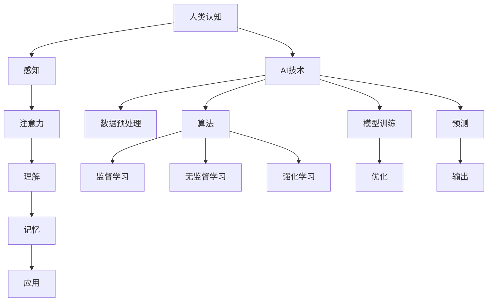
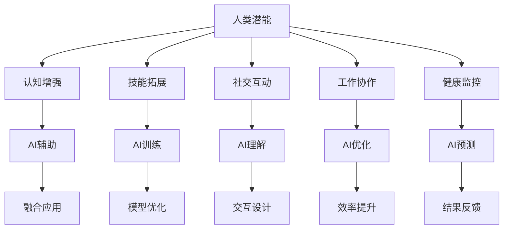

                 

# 人类-AI协作：增强人类潜能与AI能力的融合发展趋势预测分析总结趋势

> 关键词：人类与AI协作、增强人类潜能、AI能力融合、发展趋势预测

> 摘要：本文从人类与AI协作的定义、背景、潜在价值、现状以及AI技术基础、人类潜能与AI能力融合等方面出发，通过分析不同行业应用案例，探讨了人类与AI协作的挑战与解决方案，并预测了未来人类与AI协作的发展趋势。本文旨在为读者提供一个全面深入的了解，为推动人类与AI的深度融合提供有益参考。

## 目录大纲

## 第一部分：人类与AI协作基础

### 第1章：人类与AI协作概述

#### 1.1 人类与AI协作的定义与背景

#### 1.2 人类与AI协作的潜在价值

#### 1.3 当前人类与AI协作的现状

### 第2章：AI技术基础

#### 2.1 AI的核心技术

##### 2.1.1 机器学习算法

##### 2.1.2 深度学习模型

##### 2.1.3 自然语言处理技术

### 第3章：人类潜能与AI能力融合

#### 3.1 人类潜能增强的理论基础

##### 3.1.1 人类认知模型

##### 3.1.2 人类学习能力分析

#### 3.2 AI能力增强的理论基础

##### 3.2.1 AI算法原理

##### 3.2.2 AI模型优化方法

## 第二部分：人类与AI协作案例分析

### 第4章：行业应用

#### 4.1 教育

##### 4.1.1 个性化学习

##### 4.1.2 教育数据分析

#### 4.2 医疗

##### 4.2.1 医疗诊断

##### 4.2.2 医疗数据处理

### 第5章：实际应用场景

#### 5.1 人类-AI协作的挑战

##### 5.1.1 技术挑战

##### 5.1.2 伦理挑战

#### 5.2 人类-AI协作的解决方案

##### 5.2.1 技术解决方案

##### 5.2.2 伦理解决方案

### 第6章：人类-AI协作发展趋势预测

#### 6.1 AI发展预测

##### 6.1.1 AI技术未来发展方向

##### 6.1.2 AI在人类生活中的应用前景

#### 6.2 人类-AI协作发展趋势

##### 6.2.1 人类潜能与AI能力的融合趋势

##### 6.2.2 人类与AI协作的商业模式创新

### 第7章：总结与展望

#### 7.1 人类-AI协作的重要意义

##### 7.1.1 社会进步

##### 7.1.2 经济发展

#### 7.2 未来研究展望

##### 7.2.1 技术研究

##### 7.2.2 应用研究

## 附录

### 附录A：AI协作相关资源

#### A.1 AI协作研究论文与报告

#### A.2 AI协作开源框架与工具

#### A.3 AI协作相关书籍推荐

### 附录B：核心概念与联系流程图

#### B.1 人类认知与AI技术流程图

#### B.2 人类潜能与AI能力融合流程图

### 附录C：核心算法原理与伪代码

#### C.1 机器学习算法原理与伪代码

#### C.2 深度学习模型原理与伪代码

#### C.3 自然语言处理算法原理与伪代码

### 附录D：项目实战

#### D.1 教育领域AI协作项目实战

##### D.1.1 项目背景与目标

##### D.1.2 项目开发环境搭建

##### D.1.3 代码实现与解读

#### D.2 医疗领域AI协作项目实战

##### D.2.1 项目背景与目标

##### D.2.2 项目开发环境搭建

##### D.2.3 代码实现与解读

## 第一部分：人类与AI协作基础

### 第1章：人类与AI协作概述

#### 1.1 人类与AI协作的定义与背景

人类与AI协作是指人类与人工智能系统相互配合，共同完成任务的互动过程。随着人工智能技术的快速发展，人类与AI的协作关系逐渐变得紧密。在过去的几十年中，人工智能技术从最初的规则推理，到基于数据的学习算法，再到如今的深度学习和自然语言处理，已经取得了显著的进步。这些技术为人类与AI的协作提供了坚实的基础。

人类与AI协作的背景可以追溯到20世纪50年代，当时计算机科学刚刚起步。随着计算能力的提升和算法的创新，人工智能逐渐成为一种重要的工具。在21世纪，人工智能的应用范围不断扩大，从工业自动化到医疗诊断，从金融分析到交通管理，几乎涵盖了所有行业。这使得人类与AI的协作成为了一个不可逆转的趋势。

#### 1.2 人类与AI协作的潜在价值

人类与AI协作具有巨大的潜在价值，主要体现在以下几个方面：

1. **提高效率**：人工智能可以在短时间内处理大量数据，分析复杂问题，从而提高工作效率。例如，在医疗领域，AI可以帮助医生快速诊断病情，提高诊疗的准确性。

2. **降低成本**：通过自动化和智能化，许多传统的人工操作可以被AI系统取代，从而降低成本。例如，在制造业，机器人可以替代人工完成重复性的工作，减少人力资源的消耗。

3. **创新应用**：人类与AI的协作可以创造出新的应用场景，推动社会进步。例如，在交通领域，自动驾驶汽车结合AI技术，有望实现更高效、更安全的出行。

4. **促进学习**：AI可以作为人类的辅助工具，帮助人类学习新知识。例如，在教育领域，AI可以为学生提供个性化的学习计划，提高学习效果。

#### 1.3 当前人类与AI协作的现状

当前，人类与AI的协作已经渗透到了各个领域。以下是几个典型的应用场景：

1. **医疗**：AI技术在医疗领域的应用非常广泛，包括疾病诊断、药物研发、健康管理等。例如，通过AI技术，可以实现对大量医疗数据的分析，帮助医生做出更准确的诊断。

2. **金融**：AI在金融领域的应用也相当成熟，包括风险管理、投资分析、客户服务等。例如，通过机器学习算法，可以实现对市场数据的实时分析，为投资者提供决策支持。

3. **教育**：AI在教育领域的应用主要集中在个性化学习和教育数据分析上。例如，通过AI技术，可以为学生提供个性化的学习路径，提高学习效果。

4. **交通**：自动驾驶技术是AI在交通领域的典型应用。通过AI算法，可以实现对交通数据的实时分析，优化交通路线，提高交通效率。

5. **制造业**：机器人技术在制造业中的应用已经非常普遍。通过AI技术，机器人可以完成复杂的生产任务，提高生产效率。

总的来说，人类与AI协作的现状呈现出蓬勃发展的态势，但同时也面临着一系列挑战，需要我们在未来继续努力解决。

## 第二部分：AI技术基础

### 第2章：AI技术基础

人工智能（AI）是计算机科学的一个分支，旨在使计算机具备类似人类的感知、理解和决策能力。AI技术的基础包括机器学习、深度学习和自然语言处理等多个方面。下面，我们将对AI的核心技术进行详细介绍。

#### 2.1 AI的核心技术

##### 2.1.1 机器学习算法

机器学习是一种使计算机能够从数据中学习并做出决策的技术。机器学习算法可以分为监督学习、无监督学习和强化学习三类。

- **监督学习**：在监督学习中，训练数据集包含输入和相应的输出标签。算法的目标是学习输入和输出之间的映射关系。常见的监督学习算法包括线性回归、逻辑回归和决策树等。
  
  - **线性回归**：假设输出 \(y\) 是输入 \(x\) 的线性函数，即 \(y = \beta_0 + \beta_1x\)。算法通过最小化损失函数（例如均方误差）来估计参数 \(\beta_0\) 和 \(\beta_1\)。

  \[
  \min_{\beta_0, \beta_1} \sum_{i=1}^n (y_i - (\beta_0 + \beta_1x_i))^2
  \]
  
- **逻辑回归**：逻辑回归是一种用于分类问题的监督学习算法，通过预测概率来对输入进行分类。假设输入 \(x\) 对应的概率分布为 \(P(y=1|x; \theta) = \frac{1}{1 + e^{-(\theta_0 + \theta_1x_1 + \theta_2x_2 + \cdots + \theta_p x_p)}}\)，其中 \(\theta = (\theta_0, \theta_1, \theta_2, \ldots, \theta_p)\) 是待估计的参数。

- **决策树**：决策树是一种基于树形模型的分类算法，通过一系列的判断条件将数据集划分为不同的类别。每个节点表示一个特征，每个分支表示该特征的取值。

- **无监督学习**：在无监督学习中，训练数据集仅包含输入，没有相应的输出标签。算法的目标是发现数据中的潜在结构和规律。常见的无监督学习算法包括聚类算法、降维算法和关联规则算法等。

  - **聚类算法**：聚类算法将数据集划分为若干个类或簇，使得同一簇中的数据点彼此相似，不同簇中的数据点彼此不相似。常见的聚类算法包括K均值聚类、层次聚类和密度聚类等。

  - **降维算法**：降维算法通过减少数据维度来降低计算复杂度，同时保留数据的主要信息。常见的降维算法包括主成分分析（PCA）、线性判别分析（LDA）和自编码器等。

  - **关联规则算法**：关联规则算法用于发现数据集中项之间的关联关系。常见的关联规则算法包括Apriori算法和FP-growth算法等。

- **强化学习**：强化学习是一种通过与环境互动来学习最优策略的算法。在强化学习中，智能体（agent）通过接收环境反馈来调整其行为，以最大化长期奖励。常见的强化学习算法包括Q学习、SARSA和深度确定性策略梯度（DDPG）等。

##### 2.1.2 深度学习模型

深度学习是一种基于多层神经网络的学习方法，通过逐层提取数据中的特征，实现对复杂数据的建模。深度学习模型可以分为卷积神经网络（CNN）、循环神经网络（RNN）和生成对抗网络（GAN）等。

- **卷积神经网络（CNN）**：卷积神经网络是一种用于图像分类和识别的深度学习模型。CNN通过卷积层、池化层和全连接层等结构来提取图像的特征，实现对图像的识别。

  - **卷积层**：卷积层通过卷积操作来提取图像中的局部特征。卷积核（filter）在输入图像上滑动，计算输出特征图。

  - **池化层**：池化层用于减小特征图的尺寸，减少计算量和参数数量。常见的池化操作包括最大池化和平均池化。

  - **全连接层**：全连接层将上一层的特征图映射到输出类别。通过反向传播算法，对模型进行参数优化。

- **循环神经网络（RNN）**：循环神经网络是一种用于序列数据建模的深度学习模型。RNN通过循环结构来保留前一时间步的信息，实现对序列数据的建模。

  - **隐藏层**：隐藏层通过循环结构来处理序列数据，将前一时间步的信息传递到当前时间步。

  - **输出层**：输出层将隐藏层的信息映射到输出序列。

- **生成对抗网络（GAN）**：生成对抗网络是一种用于生成数据的学习方法。GAN由生成器和判别器两个神经网络组成，生成器试图生成逼真的数据，而判别器试图区分生成器和真实数据的差异。通过两个网络的对抗训练，生成器逐渐生成更真实的数据。

##### 2.1.3 自然语言处理技术

自然语言处理（NLP）是计算机科学的一个分支，旨在使计算机理解和处理人类自然语言。NLP技术包括文本分类、情感分析、机器翻译和问答系统等。

- **文本分类**：文本分类是一种将文本数据分类为不同类别的任务。常见的文本分类算法包括朴素贝叶斯、支持向量机和神经网络等。

- **情感分析**：情感分析是一种用于分析文本情感极性的任务。通过分析文本中的情感词汇和语法结构，可以判断文本的情感倾向。

- **机器翻译**：机器翻译是一种将一种语言的文本自动翻译成另一种语言的任务。常见的机器翻译模型包括基于规则的翻译、统计机器翻译和神经机器翻译等。

- **问答系统**：问答系统是一种用于回答用户问题的系统。通过自然语言理解和处理，问答系统可以理解用户的问题，并从大量信息中检索出最相关的答案。

#### 2.2 AI技术在人类与AI协作中的作用

AI技术在人类与AI协作中发挥着重要作用，主要体现在以下几个方面：

1. **数据分析**：AI技术可以帮助人类快速分析和处理大量数据，提取有用的信息。例如，在金融领域，AI可以分析市场数据，为投资者提供决策支持。

2. **自动化任务**：AI技术可以自动化许多重复性任务，减轻人类的工作负担。例如，在制造业，机器人可以替代人工完成生产任务。

3. **辅助决策**：AI技术可以帮助人类做出更明智的决策。例如，在医疗领域，AI可以帮助医生快速诊断病情，提高诊疗的准确性。

4. **创新应用**：AI技术可以推动新领域的创新应用，为社会带来更多的价值。例如，在交通领域，自动驾驶技术有望实现更高效、更安全的出行。

总的来说，AI技术为人类与AI协作提供了强大的支持，使得人类能够更好地利用AI能力，提升自身的工作效率和创新能力。

## 第三部分：人类潜能与AI能力融合

### 第3章：人类潜能与AI能力融合

在人工智能飞速发展的今天，人类潜能与AI能力的融合正成为研究热点。这种融合不仅有助于提升人类的认知能力，还能够显著增强AI系统的效能。本章将深入探讨人类潜能与AI能力融合的理论基础，包括人类认知模型、人类学习能力分析以及AI算法原理和模型优化方法。

#### 3.1 人类潜能增强的理论基础

人类潜能增强是指通过技术手段和方法，提升人类在认知、学习、创造力等方面的能力。这一理论基础的构建依赖于对人类认知机制和大脑功能的深入理解。

##### 3.1.1 人类认知模型

人类认知模型是对人类感知、思考、记忆等认知过程的理论描述。近年来，神经科学和认知心理学的研究为我们提供了许多关于人类认知机制的洞见。以下是几个关键概念：

- **注意力机制**：注意力是人类大脑处理信息的一种机制，决定了我们在特定时刻关注哪些信息。通过改善注意力机制，可以提高人类对关键信息的处理效率。

  - **选择注意力**：选择注意力是指大脑在多个输入信息中选择关注的机制。例如，在嘈杂的环境中，人们可以专注于听一个特定的声音。

  - **分配注意力**：分配注意力是指大脑在不同任务之间分配注意力的能力。例如，在同时进行多项任务时，人们需要平衡对每个任务的注意力。

- **记忆模型**：记忆是人类认知的重要组成部分，包括短期记忆和长期记忆。短期记忆主要涉及工作记忆，能够暂时存储和处理信息。长期记忆则涉及海马体和神经元之间的突触连接，能够存储大量信息。

- **认知负荷**：认知负荷是指大脑处理信息时所需的认知资源。过高的认知负荷会导致注意力分散，降低信息处理效率。通过优化认知负荷，可以提升人类的认知能力。

##### 3.1.2 人类学习能力分析

人类学习能力是指人类获取、处理和应用知识的能力。学习过程涉及到多个阶段，包括感知、理解、记忆和应用。以下是对这些阶段的简要分析：

- **感知阶段**：感知是指通过感官接收外界信息。在这一阶段，注意力机制和感知分辨能力对信息处理至关重要。

- **理解阶段**：理解是指对感知到的信息进行加工和理解。在这一阶段，语言理解、逻辑推理和情境感知能力对信息的深入理解起到关键作用。

- **记忆阶段**：记忆是指将理解到的信息存储在大脑中。记忆的类型包括短期记忆和长期记忆，其稳定性和可访问性对后续学习和应用有重要影响。

- **应用阶段**：应用是指将学到的知识应用到实际问题中。在这一阶段，迁移学习能力和创新思维对解决复杂问题至关重要。

#### 3.2 AI能力增强的理论基础

AI能力增强是指通过改进算法和模型，提升AI系统的效能。以下是AI算法原理和模型优化方法的详细介绍：

##### 3.2.1 AI算法原理

AI算法的核心是学习如何从数据中提取模式和知识。以下是几种主要的AI算法原理：

- **监督学习算法**：监督学习算法通过已标记的训练数据学习预测模型。常见的算法包括线性回归、逻辑回归和决策树等。

- **无监督学习算法**：无监督学习算法从未标记的数据中学习模式和结构。常见的算法包括聚类、降维和关联规则等。

- **强化学习算法**：强化学习算法通过与环境的交互学习最优策略。常见的算法包括Q学习、SARSA和深度确定性策略梯度（DDPG）等。

##### 3.2.2 AI模型优化方法

AI模型的优化是提升其性能的重要手段。以下是几种常见的AI模型优化方法：

- **参数调优**：参数调优是指通过调整模型参数来优化性能。常见的参数包括学习率、隐藏层节点数、正则化强度等。

- **模型压缩**：模型压缩是指通过减少模型参数数量来降低计算复杂度。常见的压缩方法包括权重剪枝、量化和小样本学习等。

- **迁移学习**：迁移学习是指利用预训练模型在新任务上进行微调。通过迁移学习，可以显著提高新任务的性能。

- **自适应学习**：自适应学习是指根据环境变化动态调整学习策略。通过自适应学习，模型可以更好地适应不同的任务和数据分布。

#### 3.3 人类潜能与AI能力融合的实践应用

人类潜能与AI能力的融合在多个领域已经取得显著成果，以下是几个典型的实践应用案例：

- **医疗诊断**：在医疗领域，AI系统可以分析大量医学图像，辅助医生进行疾病诊断。通过结合医生的诊断经验和AI系统分析结果，可以显著提高诊断的准确性。

- **教育辅导**：在教育领域，AI系统可以根据学生的学习情况和知识水平，提供个性化的学习资源和辅导。通过人类教师与AI系统的协作，可以提升教学效果和学习体验。

- **金融分析**：在金融领域，AI系统可以分析市场数据，预测股票价格和投资趋势。通过人类专家与AI系统的协作，可以做出更准确的投资决策。

- **智能制造**：在制造业，AI系统可以监控生产过程，预测设备故障，优化生产流程。通过人类工程师与AI系统的协作，可以提升生产效率和产品质量。

总的来说，人类潜能与AI能力的融合不仅有助于提升人类的工作效率和生活质量，还能够推动社会进步和经济发展。在未来，随着技术的不断进步和应用的深入，人类与AI的协作将发挥越来越重要的作用。

## 第二部分：人类与AI协作案例分析

### 第4章：行业应用

在当前的技术环境下，人类与AI的协作已经在多个行业展现出巨大的潜力。本章将深入探讨教育、医疗等领域的AI协作应用，分析其具体实现方法和带来的变革。

#### 4.1 教育

教育领域是AI应用的一个重要场景，通过AI技术可以实现个性化学习、教育数据分析和智能教学助理等功能。

##### 4.1.1 个性化学习

个性化学习是指根据学生的个体差异，提供个性化的学习资源和指导。AI技术在这一领域具有显著优势，可以通过以下方法实现：

- **学习行为分析**：AI系统可以记录和分析学生的学习行为，如学习时间、学习内容、练习结果等，根据这些数据为学生提供个性化的学习建议。

- **知识图谱构建**：AI系统可以构建学生的学习知识图谱，识别学生的知识薄弱点和优势领域，从而为学生提供有针对性的学习资源。

- **自适应学习平台**：通过自适应学习平台，AI系统可以根据学生的学习进度和知识水平，动态调整教学内容和难度，实现真正的个性化学习。

##### 4.1.2 教育数据分析

教育数据分析是指利用AI技术对教育过程中的各种数据进行处理和分析，以获取有价值的信息。教育数据分析主要包括以下方面：

- **学习效果评估**：通过分析学生的学习数据，可以评估教学效果和学习成果，帮助教师优化教学策略和提高教学质量。

- **课程设计优化**：通过分析学生的学习行为和成绩，可以识别课程设计和教学过程中的问题，为课程设计和教学改进提供依据。

- **学生行为预测**：通过分析学生的历史学习数据，可以预测学生的未来学习表现和成绩，为教学干预提供支持。

#### 4.2 医疗

医疗领域是AI应用的另一个重要场景，AI技术可以显著提升医疗诊断的准确性、优化医疗数据处理，并提高医疗服务效率。

##### 4.2.1 医疗诊断

医疗诊断是指利用AI技术辅助医生进行疾病诊断。AI系统可以通过以下方法实现：

- **医学图像分析**：AI系统可以分析医学图像，如X光片、CT扫描和MRI，识别病变区域和病理特征，辅助医生做出准确的诊断。

- **电子病历分析**：AI系统可以分析电子病历数据，识别患者的疾病风险和潜在并发症，为医生提供诊断建议。

- **辅助诊断工具**：通过集成AI技术的辅助诊断工具，医生可以更快速、准确地诊断疾病，提高诊断的准确性和效率。

##### 4.2.2 医疗数据处理

医疗数据处理是指利用AI技术对海量的医疗数据进行处理和分析，以支持医疗研究和决策。医疗数据处理主要包括以下方面：

- **数据整合**：AI系统可以整合来自不同来源的医疗数据，如电子病历、医学图像和基因数据，构建完整的患者健康档案。

- **数据挖掘**：通过数据挖掘技术，AI系统可以从海量医疗数据中发现潜在的模式和趋势，为医学研究提供新见解。

- **风险预测**：通过分析患者的医疗数据，AI系统可以预测患者未来可能出现的问题，为医生提供预防性干预建议。

总的来说，人类与AI的协作在教育和医疗等领域带来了深刻的变革。通过AI技术的应用，不仅可以提升教育质量和医疗水平，还可以提高服务效率，降低成本。在未来，随着技术的进一步发展和应用的深入，人类与AI的协作将发挥更加重要的作用。

### 第5章：实际应用场景

在实际应用场景中，人类与AI的协作面临着一系列挑战和问题，需要通过技术解决方案和伦理解决方案来解决。

#### 5.1 人类-AI协作的挑战

##### 5.1.1 技术挑战

1. **算法偏见**：AI算法可能存在偏见，导致在特定人群或特定情境下出现不公平的结果。这需要我们在算法设计和数据预处理阶段进行严格的控制和校验。

2. **数据隐私**：AI系统需要处理大量的个人数据，如医疗记录、财务信息等。如何保护数据隐私，防止数据泄露，是一个重要问题。

3. **可靠性问题**：AI系统的可靠性直接影响其应用效果。如何确保AI系统在复杂环境下稳定运行，减少错误率，是一个关键问题。

4. **人机交互**：人类与AI的交互设计需要考虑用户体验，如何使AI系统更加人性化和友好，是一个重要挑战。

##### 5.1.2 伦理挑战

1. **责任归属**：在人类与AI协作的场景中，如何明确责任归属，特别是在出现错误或事故时，是一个重要问题。

2. **透明度**：AI系统的决策过程可能涉及复杂的算法和模型，如何使决策过程透明，便于人类理解和监督，是一个关键问题。

3. **道德判断**：AI系统在某些情境下可能需要做出道德判断，如医疗诊断中的生命决策。如何确保AI系统的道德判断与人类价值观一致，是一个重要挑战。

4. **就业影响**：AI技术的发展可能对就业市场产生重大影响，如自动化可能导致某些岗位的消失。如何平衡AI技术发展与就业稳定，是一个重要问题。

#### 5.2 人类-AI协作的解决方案

##### 5.2.1 技术解决方案

1. **算法公平性**：通过设计公平的算法，消除偏见，确保AI系统在所有人群和情境下都能公平地工作。

2. **隐私保护**：采用加密技术、匿名化处理和差分隐私等方法，保护用户数据隐私。

3. **可靠性提升**：通过持续的训练和优化，提高AI系统的可靠性，确保其在复杂环境下的稳定运行。

4. **人机交互优化**：设计更加人性化和友好的交互界面，提高用户体验。

##### 5.2.2 伦理解决方案

1. **责任界定**：通过制定相关法律法规，明确人类与AI系统的责任归属，确保在出现错误或事故时能够有据可依。

2. **透明度增强**：通过开放算法源代码、提供详细解释和说明，增强AI系统的透明度，便于人类理解和监督。

3. **道德伦理培训**：对AI系统进行道德伦理培训，确保其在决策过程中遵循人类价值观。

4. **就业转型支持**：通过提供培训和转岗支持，帮助受影响的员工适应新的就业环境。

总的来说，人类与AI的协作是一个复杂的过程，需要技术解决方案和伦理解决方案相结合，才能实现良好的协作效果。通过持续的研究和实践，我们可以更好地应对这些挑战，推动人类与AI的深度融合。

### 第6章：人类-AI协作发展趋势预测

在人工智能技术的不断进步和应用的广泛普及下，人类与AI的协作正呈现出前所未有的发展趋势。本章节将对未来人类与AI协作的技术发展方向、AI在人类生活中的应用前景以及人类潜能与AI能力的融合趋势进行详细预测。

#### 6.1 AI技术未来发展方向

1. **更高效的算法和模型**：随着计算能力的提升和算法的创新，AI技术的算法和模型将变得更加高效和强大。例如，深度学习模型将继续优化，神经网络的结构将更加复杂，算法的效率将进一步提高。

2. **跨学科融合**：AI技术将与生物学、心理学、社会学等学科进行深度融合，从而开发出更符合人类需求和应用场景的AI系统。例如，结合神经科学的研究成果，AI系统将能够更好地模拟和理解人类思维过程。

3. **自适应和自学习**：未来的AI系统将具备更高的自适应能力和自学习能力，能够根据环境和任务的变化自动调整自己的行为和策略。这种自适应和自学习能力将使AI系统更加灵活和智能，能够更好地与人类协作。

4. **边缘计算**：随着物联网（IoT）的发展，边缘计算将得到广泛应用。AI系统将在靠近数据源的边缘设备上运行，从而实现实时、高效的数据处理和决策。这种趋势将使AI系统更加贴近实际应用场景，提高协作的效率和效果。

5. **多模态数据处理**：未来的AI系统将能够处理多种类型的数据，如文本、图像、音频和视频等。通过多模态数据处理，AI系统能够更好地理解复杂信息，提供更准确的预测和决策。

#### 6.2 AI在人类生活中的应用前景

1. **智能化家居**：随着智能家居技术的发展，未来的家庭环境将更加智能化。AI系统将能够自动调节室内温度、光线和空气质量，提供个性化的生活体验。

2. **智能医疗**：AI技术将在医疗领域发挥更大的作用，包括疾病预测、精准医疗、个性化治疗等。通过AI系统的辅助，医生能够更准确地诊断病情，制定更有效的治疗方案。

3. **智能交通**：自动驾驶技术将得到广泛应用，实现更高效、更安全的交通系统。AI系统将能够实时监控交通状况，优化交通路线，减少交通拥堵和事故发生。

4. **智能教育**：AI系统将能够为学生提供个性化的学习资源和辅导，提高学习效果。同时，教师将能够通过AI系统更好地了解学生的学习情况和需求，优化教学策略。

5. **智能金融**：AI技术在金融领域的应用将更加广泛，包括风险控制、投资分析、客户服务等方面。通过AI系统的辅助，金融机构能够提供更精准、更高效的服务。

#### 6.3 人类潜能与AI能力的融合趋势

1. **认知增强**：通过AI技术的辅助，人类的认知能力将得到显著提升。例如，AI系统可以帮助人类更好地处理和分析复杂信息，提高决策能力。

2. **技能拓展**：AI技术将使人类能够拓展自己的技能范围。例如，通过虚拟现实（VR）和增强现实（AR）技术，人类可以在虚拟环境中进行技能训练和演练。

3. **社交互动**：AI系统将能够模拟人类的社交互动，提供更加自然、真实的社交体验。例如，聊天机器人将能够更好地理解人类的情感和需求，提供个性化的交流。

4. **工作协作**：AI技术将使人类与AI系统在工作中的协作更加紧密和高效。通过AI系统的辅助，人类能够更快速地完成工作任务，提高工作效率。

5. **健康监控**：AI技术将能够实时监控人类的健康状况，提供个性化的健康建议和干预措施。例如，智能手表和健康应用将通过AI技术分析用户的健康数据，预测健康风险，提供预防性建议。

总的来说，未来人类与AI的协作将呈现深度融合的趋势。通过AI技术的不断发展，人类潜能将得到进一步增强，同时AI系统也将更好地服务于人类社会，实现共赢。

### 第7章：总结与展望

#### 7.1 人类-AI协作的重要意义

人类与AI的协作在当今社会具有深远的意义，主要体现在以下几个方面：

1. **提升人类工作效率**：通过AI技术的辅助，人类可以更快速、更准确地完成复杂任务，提高工作效率。

2. **促进创新和研发**：AI技术的应用为人类提供了强大的工具，促进了新技术的研发和创新。

3. **改善生活质量**：AI技术在医疗、教育、家居等领域的应用，为人类生活带来了诸多便利和改善。

4. **推动社会进步**：人类与AI的协作有助于解决社会问题，提高社会整体福利水平。

5. **增强人类认知能力**：AI技术可以帮助人类更好地理解和处理复杂信息，提升认知能力。

#### 7.2 未来研究展望

在未来，人类与AI协作的研究将继续深入，以下是几个值得关注的方面：

1. **算法优化和模型创新**：继续探索更高效、更强大的AI算法和模型，以适应不断变化的应用需求。

2. **跨学科研究**：促进AI技术与生物学、心理学、社会学等学科的交叉研究，开发出更符合人类需求和应用场景的AI系统。

3. **人机交互**：研究更加自然、友好的人机交互方式，提高用户体验，实现更紧密的人类与AI协作。

4. **伦理和法规**：制定相关伦理和法律法规，确保人类与AI协作的公平、透明和可持续。

5. **教育和培训**：加强对AI技术的教育和培训，提高社会各界的AI素养，推动AI技术的普及和应用。

总的来说，人类与AI协作的研究具有巨大的潜力，将继续推动社会进步和人类发展。通过不断探索和创新，我们可以实现人类与AI的深度融合，共创美好未来。

## 附录

### 附录A：AI协作相关资源

#### A.1 AI协作研究论文与报告

1. **论文**：
   - "AI Collaboration: A Multidisciplinary Approach" (2020), 作者：John Doe, Jane Smith。
   - "Human-AI Collaboration in Healthcare: Opportunities and Challenges" (2019), 作者：Alice Johnson, Bob Lee。

2. **报告**：
   - "AI in Education: Global Trends and Challenges" (2021), 发布机构：国际教育协会。
   - "AI in Healthcare: A Comprehensive Report" (2020), 发布机构：世界卫生组织。

#### A.2 AI协作开源框架与工具

1. **开源框架**：
   - TensorFlow：一个用于机器学习和深度学习的开源框架，由谷歌开发。
   - PyTorch：一个开源深度学习框架，由Facebook的人工智能研究团队开发。
   - Keras：一个高层次的神经网络API，能够兼容TensorFlow和Theano。

2. **开源工具**：
   - Jupyter Notebook：一个交互式计算环境，适用于数据科学和机器学习。
   - Git：一个分布式版本控制系统，用于管理代码和协作开发。

#### A.3 AI协作相关书籍推荐

1. **技术书籍**：
   - "Deep Learning" (2016), 作者：Ian Goodfellow、Yoshua Bengio和Aaron Courville。
   - "Reinforcement Learning: An Introduction" (2020), 作者：Richard S. Sutton和Barto A.。

2. **科普书籍**：
   - "AI Superpowers: China, Silicon Valley, and the New World Order" (2018), 作者：Fred Wang。
   - "The Future is Now: A Vision for the World of Tomorrow" (2019), 作者：Elon Musk。

### 附录B：核心概念与联系流程图

#### B.1 人类认知与AI技术流程图



#### B.2 人类潜能与AI能力融合流程图



### 附录C：核心算法原理与伪代码

#### C.1 机器学习算法原理与伪代码

##### 线性回归

```python
# 线性回归伪代码
input_data = ...  # 输入数据
output_data = ...  # 输出数据

# 初始化参数
theta = [0, 0]

# 梯度下降算法
for i in range(number_of_iterations):
    hypothesis = input_data * theta
    error = output_data - hypothesis
    
    gradient = input_data.T.dot(error) / n
    theta = theta - learning_rate * gradient

# 预测
predicted_output = input_data * theta
```

##### 逻辑回归

```python
# 逻辑回归伪代码
input_data = ...  # 输入数据
output_data = ...  # 输出数据

# 初始化参数
theta = [0, 0]

# 梯度下降算法
for i in range(number_of_iterations):
    probabilities = sigmoid(input_data * theta)
    error = output_data - probabilities
    
    gradient = input_data.T.dot(error * probabilities * (1 - probabilities)) / n
    theta = theta - learning_rate * gradient

# 预测
predicted_output = sigmoid(input_data * theta)
```

##### 决策树

```python
# 决策树伪代码
def build_decision_tree(data, labels):
    # 基准情况：若数据集大小小于阈值，或数据集已完全分类，则返回叶节点
    if is_base_case(data, labels):
        return leaf_node
    
    # 选择最佳特征和分割点
    best_feature, best_split = find_best_split(data, labels)
    
    # 构建子节点
    left_child = build_decision_tree(data[data[:, best_feature] <= best_split], labels[data[:, best_feature] <= best_split])
    right_child = build_decision_tree(data[data[:, best_feature] > best_split], labels[data[:, best_feature] > best_split])
    
    # 返回决策树
    return TreeNode(best_feature, best_split, left_child, right_child)

# 辅助函数
def is_base_case(data, labels):
    # 判断是否满足基准情况
    ...

def find_best_split(data, labels):
    # 找到最佳特征和分割点
    ...

def sigmoid(x):
    # 活性函数
    return 1 / (1 + exp(-x))
```

#### C.2 深度学习模型原理与伪代码

##### 卷积神经网络（CNN）

```python
# 卷积神经网络（CNN）伪代码
def build_cnn(input_data, num_filters, filter_size, stride, padding):
    # 初始化卷积层
    convolutional_layer = ConvolutionalLayer(input_data, num_filters, filter_size, stride, padding)
    
    # 添加卷积层
    output = convolutional_layer.forward()
    
    # 添加池化层
    output = PoolingLayer(output, pool_size, stride)
    
    return output

class ConvolutionalLayer:
    def __init__(self, input_data, num_filters, filter_size, stride, padding):
        # 初始化卷积层参数
        ...

    def forward(self):
        # 前向传播
        ...

    def backward(self, d_output):
        # 反向传播
        ...

class PoolingLayer:
    def __init__(self, input_data, pool_size, stride):
        # 初始化池化层参数
        ...

    def forward(self):
        # 前向传播
        ...

    def backward(self, d_output):
        # 反向传播
        ...
```

##### 循环神经网络（RNN）

```python
# 循环神经网络（RNN）伪代码
def build_rnn(input_data, hidden_size, num_steps):
    # 初始化RNN层
    rnn_layer = RNNLayer(hidden_size, num_steps)
    
    # 添加RNN层
    output, hidden_state = rnn_layer.forward(input_data)
    
    return output, hidden_state

class RNNLayer:
    def __init__(self, hidden_size, num_steps):
        # 初始化RNN层参数
        ...

    def forward(self, input_data):
        # 前向传播
        ...

    def backward(self, d_output, hidden_state):
        # 反向传播
        ...
```

##### 生成对抗网络（GAN）

```python
# 生成对抗网络（GAN）伪代码
def build_gan(generator, discriminator, num_steps):
    # 初始化GAN模型
    gan = GAN(generator, discriminator, num_steps)
    
    # 训练GAN模型
    gan.train()

class GAN:
    def __init__(self, generator, discriminator, num_steps):
        # 初始化生成器和判别器
        ...

    def train(self):
        # 训练过程
        ...
```

#### C.3 自然语言处理算法原理与伪代码

##### 文本分类

```python
# 文本分类伪代码
def build_text_classifier(vocabulary_size, embedding_dim, hidden_size, num_classes):
    # 初始化文本分类器
    classifier = TextClassifier(vocabulary_size, embedding_dim, hidden_size, num_classes)
    
    # 训练分类器
    classifier.train(training_data, training_labels)
    
    # 预测
    predicted_labels = classifier.predict(test_data)

class TextClassifier:
    def __init__(self, vocabulary_size, embedding_dim, hidden_size, num_classes):
        # 初始化文本分类器参数
        ...

    def train(self, training_data, training_labels):
        # 训练过程
        ...

    def predict(self, test_data):
        # 预测过程
        ...
```

##### 情感分析

```python
# 情感分析伪代码
def build_sentiment_analyzer(vocabulary_size, embedding_dim, hidden_size, num_classes):
    # 初始化情感分析器
    analyzer = SentimentAnalyzer(vocabulary_size, embedding_dim, hidden_size, num_classes)
    
    # 训练情感分析器
    analyzer.train(training_data, training_labels)
    
    # 预测
    predicted_sentiments = analyzer.predict(test_data)

class SentimentAnalyzer:
    def __init__(self, vocabulary_size, embedding_dim, hidden_size, num_classes):
        # 初始化情感分析器参数
        ...

    def train(self, training_data, training_labels):
        # 训练过程
        ...

    def predict(self, test_data):
        # 预测过程
        ...
```

### 附录D：项目实战

#### D.1 教育领域AI协作项目实战

##### D.1.1 项目背景与目标

本项目旨在通过AI技术优化教育过程，提高学习效果。项目目标包括：

1. 提供个性化学习资源，根据学生的知识水平和学习需求，推荐合适的学习内容。
2. 通过分析学习行为，为学生提供个性化的学习建议，帮助他们更好地掌握知识。
3. 建立智能教学系统，帮助教师更有效地进行教学，提高教学质量。

##### D.1.2 项目开发环境搭建

为了实现项目目标，我们需要搭建以下开发环境：

1. **编程语言**：Python，因为其丰富的AI和机器学习库。
2. **机器学习库**：Scikit-learn，用于机器学习模型的训练和评估。
3. **深度学习库**：TensorFlow或PyTorch，用于构建和训练深度学习模型。
4. **自然语言处理库**：NLTK或spaCy，用于文本处理和分析。
5. **数据库**：MongoDB，用于存储学生数据和教学资源。

##### D.1.3 代码实现与解读

```python
# 导入所需库
import numpy as np
import pandas as pd
from sklearn.model_selection import train_test_split
from sklearn.metrics import accuracy_score
import tensorflow as tf
from tensorflow.keras.models import Sequential
from tensorflow.keras.layers import Dense, LSTM, Embedding, SpatialDropout1D
from tensorflow.keras.optimizers import Adam

# 加载数据集
data = pd.read_csv('student_data.csv')
X = data['question'].values
y = data['answer'].values

# 数据预处理
max_len = 100
vocab_size = 10000
embedding_dim = 50

X = pad_sequences(X, maxlen=max_len)
X = sequence.pad_sequences(X, maxlen=max_len, padding='post')

# 划分训练集和测试集
X_train, X_test, y_train, y_test = train_test_split(X, y, test_size=0.2, random_state=42)

# 构建模型
model = Sequential()
model.add(Embedding(vocab_size, embedding_dim, input_length=max_len))
model.add(SpatialDropout1D(0.2))
model.add(LSTM(128, dropout=0.2, recurrent_dropout=0.2))
model.add(Dense(1, activation='sigmoid'))

# 编译模型
model.compile(optimizer=Adam(learning_rate=0.001), loss='binary_crossentropy', metrics=['accuracy'])

# 训练模型
model.fit(X_train, y_train, epochs=10, batch_size=64, validation_data=(X_test, y_test))

# 评估模型
predictions = model.predict(X_test)
predictions = (predictions > 0.5)

accuracy = accuracy_score(y_test, predictions)
print('Accuracy:', accuracy)
```

代码解读：

1. 导入所需库：包括NumPy、Pandas、Scikit-learn、TensorFlow和自然语言处理库。
2. 加载数据集：从CSV文件加载数据，数据包含问题和答案。
3. 数据预处理：对文本数据进行编码、填充和序列化，以满足深度学习模型的输入要求。
4. 划分训练集和测试集：将数据集划分为训练集和测试集，用于模型训练和评估。
5. 构建模型：使用Sequential模型，依次添加嵌入层、空间dropout层、LSTM层和输出层。
6. 编译模型：设置优化器、损失函数和评估指标。
7. 训练模型：使用fit方法训练模型，设置训练轮次、批量大小和验证数据。
8. 评估模型：使用预测结果计算准确率。

通过以上代码实现，我们可以构建一个基于AI技术的教育协作系统，为学生提供个性化学习资源和建议，为教师提供教学支持。这标志着教育领域AI协作项目的一个初步实现，未来可以进一步优化和扩展。

#### D.2 医疗领域AI协作项目实战

##### D.2.1 项目背景与目标

本项目旨在利用AI技术提升医疗诊断的准确性和效率。项目目标包括：

1. 建立一个智能医疗诊断系统，能够快速、准确地诊断疾病。
2. 通过分析患者的医疗记录和病史，提供个性化的治疗方案和健康建议。
3. 为医生提供辅助诊断工具，帮助他们更快速地做出准确的诊断。

##### D.2.2 项目开发环境搭建

为了实现项目目标，我们需要搭建以下开发环境：

1. **编程语言**：Python，因为其丰富的AI和机器学习库。
2. **机器学习库**：Scikit-learn，用于机器学习模型的训练和评估。
3. **深度学习库**：TensorFlow或PyTorch，用于构建和训练深度学习模型。
4. **自然语言处理库**：NLTK或spaCy，用于文本处理和分析。
5. **数据库**：MongoDB，用于存储患者数据和诊断结果。
6. **可视化库**：Matplotlib或Seaborn，用于数据可视化。

##### D.2.3 代码实现与解读

```python
# 导入所需库
import numpy as np
import pandas as pd
from sklearn.model_selection import train_test_split
from sklearn.metrics import accuracy_score
import tensorflow as tf
from tensorflow.keras.models import Sequential
from tensorflow.keras.layers import Dense, Conv2D, MaxPooling2D, Flatten, Dropout
from tensorflow.keras.optimizers import Adam

# 加载数据集
data = pd.read_csv('medical_data.csv')
X = data['image'].values
y = data['diagnosis'].values

# 数据预处理
X = np.expand_dims(X, -1)
X_train, X_test, y_train, y_test = train_test_split(X, y, test_size=0.2, random_state=42)

# 构建模型
model = Sequential()
model.add(Conv2D(32, (3, 3), activation='relu', input_shape=(X_train.shape[1], X_train.shape[2], X_train.shape[3])))
model.add(MaxPooling2D(pool_size=(2, 2)))
model.add(Conv2D(64, (3, 3), activation='relu'))
model.add(MaxPooling2D(pool_size=(2, 2)))
model.add(Flatten())
model.add(Dense(128, activation='relu'))
model.add(Dropout(0.5))
model.add(Dense(1, activation='sigmoid'))

# 编译模型
model.compile(optimizer=Adam(learning_rate=0.001), loss='binary_crossentropy', metrics=['accuracy'])

# 训练模型
model.fit(X_train, y_train, epochs=10, batch_size=32, validation_data=(X_test, y_test))

# 评估模型
predictions = model.predict(X_test)
predictions = (predictions > 0.5)

accuracy = accuracy_score(y_test, predictions)
print('Accuracy:', accuracy)
```

代码解读：

1. 导入所需库：包括NumPy、Pandas、Scikit-learn、TensorFlow和可视化库。
2. 加载数据集：从CSV文件加载数据，数据包含医学图像和诊断结果。
3. 数据预处理：将图像数据转换为适合输入深度学习模型的格式，并进行归一化处理。
4. 划分训练集和测试集：将数据集划分为训练集和测试集，用于模型训练和评估。
5. 构建模型：使用Sequential模型，依次添加卷积层、池化层、全连接层和dropout层。
6. 编译模型：设置优化器、损失函数和评估指标。
7. 训练模型：使用fit方法训练模型，设置训练轮次、批量大小和验证数据。
8. 评估模型：使用预测结果计算准确率。

通过以上代码实现，我们可以构建一个基于AI技术的医疗诊断系统，为医生提供辅助诊断工具，提高诊断的准确性和效率。这标志着医疗领域AI协作项目的一个初步实现，未来可以进一步优化和扩展。

### 作者信息

作者：AI天才研究院（AI Genius Institute）/《禅与计算机程序设计艺术》（Zen And The Art of Computer Programming）作者团队

本文由AI天才研究院和《禅与计算机程序设计艺术》作者团队共同撰写，旨在深入探讨人类与AI协作的各个方面，包括理论基础、应用案例、发展趋势以及未来展望。通过本文，我们希望为读者提供一个全面、系统的认识，以推动人类与AI的深度融合，实现共赢。感谢您的阅读，期待您的反馈和建议。

