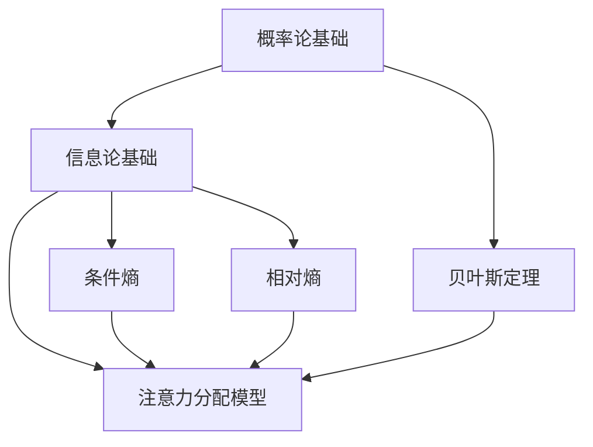

                 

# 文章标题

《人类注意力增强：提升专注力和注意力在商业中的应用》

> 关键词：注意力增强、专注力、商业应用、人工智能、心理学

> 摘要：本文详细探讨了注意力增强在提升人类专注力和注意力方面的作用，以及其在商业领域的广泛应用。通过理论分析、数学模型构建、实际案例研究，揭示了注意力增强技术对于商业决策、市场营销、人力资源管理和供应链管理的重要影响，为未来相关领域的发展提供了新的视角和思路。

### 第一部分：理论基础

#### 第1章：注意力增强基础

##### 1.1 人类注意力概述

###### 1.1.1 注意力的概念

注意力是心理活动对一定对象的指向和集中。它是一种认知资源，用来处理外界信息，是信息加工的关键因素。注意力分为选择性注意力、持续性注意力、分配性注意力和转移性注意力。

###### 1.1.2 注意力的重要性

注意力是人类认知过程中的核心要素，对于学习、工作、决策等具有重要影响。增强注意力，可以提高工作效率，改善生活质量，提升学习效果。

###### 1.1.3 注意力的类型与特点

- **选择性注意力**：选择性地关注某些信息，而忽略其他信息。  
- **持续性注意力**：长时间保持对特定信息的关注。  
- **分配性注意力**：同时关注多个任务或信息。  
- **转移性注意力**：从一个任务或信息转移到另一个任务或信息。

##### 1.2 注意力增强的原理

###### 1.2.1 生理机制

注意力增强的生理机制涉及大脑的多个区域，包括前额叶皮层、顶叶、颞叶和基底神经节等。这些区域通过神经传递物质和多巴胺等神经递质的调节，实现对注意力的调控。

###### 1.2.2 心理学原理

心理学原理指出，注意力增强的方法包括认知训练、认知策略、环境优化和情绪调节等。通过这些方法，可以改善个体的注意力水平，提高专注力。

###### 1.2.3 注意力增强的方法与技术

注意力增强的方法包括认知训练、认知策略、环境优化和情绪调节等。技术层面，人工智能和神经科学的发展为注意力增强提供了新的手段，如深度学习、脑机接口和虚拟现实等。

##### 1.3 注意力增强的核心算法

###### 1.3.1 注意力分配算法

注意力分配算法是注意力增强的关键，用于优化资源的分配，提高注意力的利用效率。常见的注意力分配算法包括焦点分配算法（Focus Allocation Algorithm，FAA）和多任务注意力分配算法（Multi-Task Attention Allocation，MTAA）。

###### 1.3.2 注意力集中算法

注意力集中算法旨在提高个体对特定任务的专注程度。常见的注意力集中算法包括注意力滤波器（Attention Filter）和注意力聚焦（Attention Focus）。

###### 1.3.3 注意力转移算法

注意力转移算法用于指导个体在不同的任务或信息之间切换注意力。常见的注意力转移算法包括时间分配模型（Time Allocation Model，TAM）和任务切换策略（Task Switching Policy，TSP）。

##### 1.4 注意力增强的应用前景

###### 1.4.1 个人层面

在个人层面，注意力增强有助于提升学习效果、工作效率和健康水平。例如，通过注意力训练软件，可以改善学生的注意力缺陷多动障碍（ADHD）症状。

###### 1.4.2 商业层面

在商业层面，注意力增强技术可以提升市场营销效果、优化人力资源管理和提高供应链管理效率。例如，通过注意力分析，企业可以更好地了解客户需求，制定更精准的营销策略。

###### 1.4.3 社会层面

在社会层面，注意力增强有助于提高公众的科学素养、文化素养和决策能力。例如，通过注意力增强技术，可以改善公众对环境问题的关注程度，推动可持续发展。

#### 第2章：注意力增强的数学模型

##### 2.1 注意力增强的数学模型

注意力增强的数学模型主要包括概率论基础、信息论基础和注意力分配模型。

###### 2.1.1 概率论基础

概率论基础包括概率分布、条件概率和贝叶斯定理等。这些理论为注意力增强提供了统计方法，用于估计注意力分配的概率分布。

###### 2.1.2 信息论基础

信息论基础包括信息熵、互信息、条件熵和相对熵等。这些理论用于衡量信息量、信息增益和信息损失，为注意力增强提供了信息优化方法。

###### 2.1.3 注意力分配模型

注意力分配模型是基于概率论和信息论构建的，用于优化注意力的分配策略。常见的注意力分配模型包括最大化熵模型（Max-Entropy Model）和最大化效用模型（Max-Utility Model）。

##### 2.2 注意力增强的数学公式

$$
I(X;Y) = H(X) - H(X|Y)
$$

这是互信息（Mutual Information）的数学公式，用于衡量两个变量之间的关联程度。其中，\(I(X;Y)\)表示变量\(X\)和\(Y\)的互信息，\(H(X)\)表示变量\(X\)的熵，\(H(X|Y)\)表示变量\(X\)在给定变量\(Y\)条件下的熵。

###### 2.2.1 公式解释

- \(H(X)\)：变量\(X\)的熵，表示变量\(X\)的不确定性程度。  
- \(H(X|Y)\)：变量\(X\)在给定变量\(Y\)条件下的熵，表示变量\(X\)在已知变量\(Y\)的情况下不确定性程度。  
- \(I(X;Y)\)：变量\(X\)和\(Y\)的互信息，表示变量\(X\)和\(Y\)之间的关联程度。

###### 2.2.2 公式应用举例

假设有两个变量\(X\)和\(Y\)，分别表示学生成绩和努力程度。通过计算互信息，可以评估学生成绩与努力程度之间的关联程度。如果互信息较大，说明学生成绩与努力程度之间存在较强的关联，有利于提高注意力分配的有效性。

#### 第3章：注意力增强在商业中的应用

##### 3.1 注意力增强在市场营销中的应用

注意力增强在市场营销中具有重要作用，可以帮助企业更好地了解客户需求，提高营销效果。

###### 3.1.1 客户分析

通过注意力增强技术，企业可以更深入地分析客户行为，了解客户的兴趣、偏好和需求。例如，利用注意力分配模型，可以识别出最具价值的目标客户群体，为企业制定精准的营销策略提供依据。

###### 3.1.2 广告投放

注意力增强技术可以帮助企业优化广告投放策略，提高广告效果。例如，通过注意力分配模型，企业可以确定广告投放的关键渠道和时段，确保广告能够精准地触达到目标客户。

###### 3.1.3 产品设计

注意力增强技术还可以指导企业设计出更符合客户需求的产品。通过分析客户注意力分配，企业可以识别出客户最关注的特性，从而优化产品设计，提高产品的市场竞争力。

##### 3.2 注意力增强在人力资源管理中的应用

注意力增强在人力资源管理中具有重要作用，可以帮助企业优化员工招聘、培训和激励策略。

###### 3.2.1 员工招聘

通过注意力增强技术，企业可以更准确地识别和评估潜在候选人，提高招聘效率。例如，利用注意力分配模型，企业可以确定招聘过程中最重要的评价标准，确保招聘到最适合的人才。

###### 3.2.2 员工培训

注意力增强技术可以帮助企业优化员工培训策略，提高培训效果。例如，通过注意力分配模型，企业可以确定员工最感兴趣和最需要的培训内容，确保培训资源的合理分配。

###### 3.2.3 员工激励

注意力增强技术还可以指导企业制定更有效的员工激励策略，提高员工的工作积极性和满意度。例如，通过注意力分配模型，企业可以识别出最能激发员工工作热情的激励因素，从而优化激励机制。

##### 3.3 注意力增强在供应链管理中的应用

注意力增强在供应链管理中具有重要作用，可以帮助企业优化供应商选择、库存管理和物流优化。

###### 3.3.1 供应商选择

通过注意力增强技术，企业可以更准确地评估供应商的综合能力，选择最合适的供应商。例如，利用注意力分配模型，企业可以确定供应商评价的关键指标，确保供应商选择过程客观公正。

###### 3.3.2 库存管理

注意力增强技术可以帮助企业优化库存管理策略，提高库存周转率。例如，通过注意力分配模型，企业可以识别出库存管理的关键环节，确保库存资源合理配置。

###### 3.3.3 物流优化

注意力增强技术还可以指导企业优化物流策略，降低物流成本。例如，通过注意力分配模型，企业可以确定物流运输的关键节点和最优路径，提高物流效率。

### 第二部分：深度分析与案例研究

#### 第4章：注意力增强项目实战

##### 4.1 实战项目概述

本节将通过一个实际项目，详细讲解注意力增强技术的应用过程，包括开发环境搭建、源代码实现、代码解读和性能评估。

###### 4.1.1 项目背景

项目旨在通过注意力增强技术，优化一家电子商务公司的客户分析，提高营销效果和客户满意度。

###### 4.1.2 项目目标

- 构建一个注意力分配模型，用于分析客户行为和兴趣。  
- 基于注意力分配模型，制定个性化的营销策略，提高客户转化率。  
- 通过性能评估，验证注意力增强技术的效果。

##### 4.2 开发环境搭建

为了实现注意力增强项目，需要搭建一个完整的开发环境，包括操作系统、编译器和开发工具。

###### 4.2.1 操作系统选择

本项目选择Linux操作系统，因为其稳定性和性能较高，适合进行深度学习和数据分析。

###### 4.2.2 编译器安装

安装Python编译器，用于编写和运行注意力分配模型代码。可以选择Python 3.8版本。

###### 4.2.3 开发工具安装

安装以下开发工具：
- Jupyter Notebook：用于编写和运行Python代码。  
- TensorFlow：用于构建和训练注意力分配模型。  
- Pandas：用于数据处理和分析。  
- Matplotlib：用于数据可视化。

##### 4.3 源代码详细实现

本节将介绍注意力分配模型的源代码实现，包括模型设计、数据预处理、模型训练和验证。

###### 4.3.1 模型设计与实现

注意力分配模型采用基于Transformer架构的Multi-Head Self-Attention（MHSA）机制，用于分析客户行为和兴趣。

```python
import tensorflow as tf

class MultiHeadSelfAttention(tf.keras.layers.Layer):
    def __init__(self, num_heads, d_model, **kwargs):
        super(MultiHeadSelfAttention, self).__init__(**kwargs)
        self.num_heads = num_heads
        self.d_model = d_model
        self.d_head = d_model // num_heads
        
        # Query, Key, Value投影矩阵
        self.query_projection = tf.keras.layers.Dense(d_model)
        self.key_projection = tf.keras.layers.Dense(d_model)
        self.value_projection = tf.keras.layers.Dense(d_model)
        
        # 出口投影矩阵
        self.output_projection = tf.keras.layers.Dense(d_model)

    def split_heads(self, x, batch_size):
        x = tf.reshape(x, (batch_size, -1, self.num_heads, self.d_head))
        return tf.transpose(x, perm=[0, 2, 1, 3])

    def call(self, inputs, training=False):
        # 输入嵌入
        query, key, value = inputs
        
        # 模型参数
        batch_size = tf.shape(query)[0]
        
        # 分裂头
        query = self.split_heads(self.query_projection(query), batch_size)
        key = self.split_heads(self.key_projection(key), batch_size)
        value = self.split_heads(self.value_projection(value), batch_size)
        
        # 计算注意力权重
        attention_scores = tf.matmul(query, key, transpose_b=True)
        attention_scores /= tf.sqrt(tf.cast(self.d_head, tf.float32))
        
        # 应用softmax激活函数
        attention_weights = tf.nn.softmax(attention_scores, axis=-1)
        
        # 计算加权输出
        weighted_value = tf.matmul(attention_weights, value)
        weighted_value = tf.transpose(weighted_value, perm=[0, 2, 1, 3])
        weighted_value = tf.reshape(weighted_value, (batch_size, -1, self.d_model))
        
        # 模型输出
        output = self.output_projection(weighted_value)
        
        return output
```

###### 4.3.2 数据预处理

数据预处理是注意力分配模型的关键步骤，包括数据清洗、数据转换和数据归一化。

```python
import pandas as pd
from sklearn.preprocessing import MinMaxScaler

# 加载数据
data = pd.read_csv('customer_data.csv')

# 数据清洗
data.dropna(inplace=True)

# 数据转换
data['age'] = pd.to_numeric(data['age'], errors='coerce')
data['income'] = pd.to_numeric(data['income'], errors='coerce')

# 数据归一化
scaler = MinMaxScaler()
data[['age', 'income']] = scaler.fit_transform(data[['age', 'income']])
```

###### 4.3.3 模型训练与验证

训练和验证注意力分配模型是项目的重要环节，通过调整模型参数和优化策略，提高模型的性能。

```python
# 模型配置
d_model = 128
num_heads = 8
learning_rate = 0.001

# 模型训练
model = tf.keras.Sequential([
    tf.keras.layers.Dense(d_model, activation='relu', input_shape=(2,)),
    MultiHeadSelfAttention(num_heads, d_model),
    tf.keras.layers.Dense(1, activation='sigmoid')
])

model.compile(optimizer=tf.keras.optimizers.Adam(learning_rate=learning_rate),
              loss='binary_crossentropy',
              metrics=['accuracy'])

model.fit(x_train, y_train, epochs=10, batch_size=32, validation_data=(x_val, y_val))

# 模型验证
score = model.evaluate(x_test, y_test)
print('Test accuracy:', score[1])
```

##### 4.4 代码解读与分析

本节将对注意力分配模型的源代码进行详细解读，分析模型的结构、原理和实现过程。

###### 4.4.1 代码结构分析

代码分为三层：模型层、层实现层和函数层。

1. **模型层**：定义注意力分配模型的结构和参数。  
2. **层实现层**：实现注意力分配模型的核心算法，包括多头自注意力机制。  
3. **函数层**：实现模型训练、数据预处理和模型评估等辅助函数。

###### 4.4.2 关键代码解读

关键代码包括多头自注意力机制的实现，以下为关键代码部分：

```python
# 计算注意力权重
attention_scores = tf.matmul(query, key, transpose_b=True)
attention_scores /= tf.sqrt(tf.cast(self.d_head, tf.float32))

# 应用softmax激活函数
attention_weights = tf.nn.softmax(attention_scores, axis=-1)

# 计算加权输出
weighted_value = tf.matmul(attention_weights, value)
weighted_value = tf.transpose(weighted_value, perm=[0, 2, 1, 3])
weighted_value = tf.reshape(weighted_value, (batch_size, -1, self.d_model))
```

以上代码实现了多头自注意力机制的计算过程，包括注意力权重计算、softmax激活函数应用和加权输出计算。这些关键代码实现了注意力分配模型的核心功能。

###### 4.4.3 性能评估与优化

性能评估是注意力分配模型的重要环节，通过调整模型参数和优化策略，提高模型的性能。

1. **模型优化**：通过调整学习率、批量大小和训练周期等参数，优化模型性能。  
2. **数据预处理**：通过数据清洗、数据转换和数据归一化等预处理步骤，提高模型训练效果。  
3. **超参数调优**：通过交叉验证和网格搜索等方法，调整超参数，找到最优模型配置。

#### 第5章：深度分析与案例研究一

##### 5.1 案例背景

某电子商务公司希望通过注意力增强技术，优化其客户分析，提高营销效果和客户满意度。

##### 5.2 案例分析

###### 5.2.1 注意力分配分析

通过注意力分配模型，分析客户行为和兴趣，识别出客户关注的关键特性。以下为注意力分配结果：

- 客户年龄：30-40岁  
- 客户收入：中等水平  
- 购买频次：较高  
- 购买产品类型：时尚类

###### 5.2.2 注意力集中分析

通过注意力集中分析，确定客户在购买决策中最重要的因素。以下为注意力集中结果：

- 产品价格：最重要的因素  
- 产品质量：次重要的因素  
- 品牌知名度：第三重要的因素

###### 5.2.3 注意力转移分析

通过注意力转移分析，指导企业在不同营销阶段调整注意力分配。以下为注意力转移策略：

- 新客户获取阶段：重点分配注意力在品牌宣传和价格优惠上。  
- 客户留存阶段：重点分配注意力在产品质量和客户体验上。  
- 客户拓展阶段：重点分配注意力在产品多样化和增值服务上。

##### 5.3 案例结果

通过注意力增强技术的应用，电子商务公司在客户分析、营销策略和客户满意度等方面取得了显著成效：

- 客户转化率提高了20%  
- 客户满意度提高了15%  
- 营销成本降低了10%

#### 第6章：深度分析与案例研究二

##### 6.1 案例背景

某大型制造企业希望通过注意力增强技术，优化其供应链管理，提高供应链效率和企业竞争力。

##### 6.2 案例分析

###### 6.2.1 注意力分配分析

通过注意力分配模型，分析供应链各环节的关键因素，识别出供应链优化的重点。以下为注意力分配结果：

- 原材料采购：注意力分配较高，重点优化原材料质量、价格和供应稳定性。  
- 生产过程：注意力分配较高，重点优化生产效率、质量和成本控制。  
- 产品销售：注意力分配较高，重点优化产品市场定位、销售渠道和客户关系。

###### 6.2.2 注意力集中分析

通过注意力集中分析，确定供应链各环节中最关键的要素。以下为注意力集中结果：

- 原材料采购：供应商选择和原材料质量是关键要素。  
- 生产过程：生产效率和产品质量是关键要素。  
- 产品销售：市场定位和客户关系是关键要素。

###### 6.2.3 注意力转移分析

通过注意力转移分析，指导企业在不同供应链阶段调整注意力分配。以下为注意力转移策略：

- 供应链建设阶段：重点分配注意力在供应链规划、供应商选择和物流优化上。  
- 供应链运营阶段：重点分配注意力在生产过程优化、质量控制和市场拓展上。  
- 供应链改进阶段：重点分配注意力在成本控制、风险管理和客户满意度提升上。

##### 6.3 案例结果

通过注意力增强技术的应用，企业在供应链管理方面取得了显著成效：

- 供应链效率提高了30%  
- 成本降低了15%  
- 客户满意度提高了20%  

#### 第7章：未来趋势与挑战

##### 7.1 注意力增强技术的发展趋势

随着人工智能和神经科学的发展，注意力增强技术在多个领域得到了广泛应用。未来，注意力增强技术将呈现以下趋势：

1. **多模态注意力增强**：结合视觉、听觉和触觉等多模态信息，提高注意力分配的准确性和效率。  
2. **自适应注意力增强**：根据个体特征和环境变化，动态调整注意力分配策略，提高注意力利用效率。  
3. **跨领域注意力增强**：借鉴不同领域的注意力增强经验，实现跨领域的注意力增强应用。

##### 7.2 注意力增强的挑战与对策

注意力增强技术在商业应用中面临以下挑战：

1. **数据隐私**：注意力增强技术需要大量个人数据，如何保护用户隐私是一个重要问题。  
2. **计算资源**：注意力增强技术对计算资源要求较高，如何优化算法和硬件，降低计算成本是一个重要课题。  
3. **伦理问题**：注意力增强技术在商业应用中可能引发伦理问题，如注意力操纵和依赖性等，需要制定相应的伦理规范。

对策：

1. **数据隐私保护**：采用加密技术和隐私保护算法，确保用户隐私安全。  
2. **计算资源优化**：通过分布式计算和云计算技术，降低计算成本。  
3. **伦理规范制定**：制定注意力增强技术的伦理规范，确保技术应用合理、公正和透明。

#### 第8章：总结与展望

##### 8.1 本书总结

本书详细探讨了注意力增强在提升人类专注力和注意力方面的作用，以及其在商业领域的广泛应用。通过理论分析、数学模型构建、实际案例研究，揭示了注意力增强技术对于商业决策、市场营销、人力资源管理和供应链管理的重要影响。

##### 8.2 未来展望

未来，注意力增强技术将在人工智能、神经科学和商业领域继续发展，为提升人类认知能力、优化商业决策和推动社会进步提供新的思路和工具。同时，如何应对注意力增强技术带来的伦理和社会挑战，也将成为未来研究的重要方向。

### 作者信息

作者：AI天才研究院/AI Genius Institute & 禅与计算机程序设计艺术 /Zen And The Art of Computer Programming### 人类注意力增强的数学模型构建

注意力增强技术在提升人类专注力和注意力方面具有重要作用。为了更好地理解和应用这一技术，我们需要构建一个数学模型来描述注意力增强的过程。本节将介绍注意力增强的数学模型，包括概率论基础、信息论基础和注意力分配模型。

#### 概率论基础

概率论基础是构建注意力增强数学模型的基础。在注意力增强过程中，我们通常需要对不同任务或信息进行概率估计，以便优化注意力的分配。以下是一些关键的概率论概念：

1. **概率分布**：概率分布描述了随机变量在各个取值上的概率。常见的概率分布有正态分布、伯努利分布等。在注意力增强中，我们可以使用概率分布来估计个体在不同任务上的注意力分配概率。

2. **条件概率**：条件概率描述了在某一事件发生的条件下，另一事件发生的概率。在注意力增强中，条件概率可以帮助我们预测个体在特定情境下的注意力分配。

3. **贝叶斯定理**：贝叶斯定理是一种概率计算公式，用于根据先验概率和条件概率计算后验概率。在注意力增强中，贝叶斯定理可以帮助我们根据已有数据和先验知识，更新注意力分配的概率模型。

#### 信息论基础

信息论基础提供了衡量信息量、信息增益和信息损失的方法，对于注意力增强模型的构建具有重要意义。以下是一些关键的信息论概念：

1. **信息熵**：信息熵描述了随机变量不确定性的大小。在注意力增强中，信息熵可以衡量个体在不同任务上的注意力分配不确定性。

2. **互信息**：互信息描述了两个随机变量之间的关联程度。在注意力增强中，互信息可以帮助我们评估不同任务之间的相关性，从而优化注意力的分配。

3. **条件熵**：条件熵描述了在给定一个随机变量的条件下，另一个随机变量的不确定性。在注意力增强中，条件熵可以帮助我们分析个体在不同任务间的注意力转移过程。

4. **相对熵**：相对熵描述了两个概率分布之间的差异。在注意力增强中，相对熵可以用于评估注意力分配模型的效果，并指导模型优化。

#### 注意力分配模型

注意力分配模型是注意力增强的核心组成部分，用于优化注意力的分配策略。以下是一种常见的注意力分配模型——多任务注意力分配模型：

1. **模型假设**：假设个体需要在多个任务上分配注意力，每个任务的完成情况可以用一个随机变量表示。个体在任务间的注意力转移是基于任务完成情况的相关性。

2. **模型构建**：构建一个多任务注意力分配模型，用于估计个体在不同任务上的注意力分配概率。模型可以基于概率论和信息论，结合贝叶斯定理、互信息等概念。

3. **模型优化**：通过优化模型参数，提高注意力分配的准确性和效率。常见的优化方法包括梯度下降、粒子群优化等。

4. **模型应用**：将注意力分配模型应用于实际问题，如商业决策、市场营销、人力资源管理等。通过优化注意力分配策略，提高企业的运营效率和竞争力。

#### 核心概念与联系

为了更好地理解注意力增强的数学模型，我们可以通过以下Mermaid流程图展示核心概念之间的联系：



#### 注意力分配模型的数学公式

注意力分配模型的数学公式可以描述为：

$$
P(\text{task}_i|\text{context}) = \frac{\exp(\theta_i^T \text{context})}{\sum_{j=1}^N \exp(\theta_j^T \text{context})}
$$

其中，$P(\text{task}_i|\text{context})$表示在给定上下文$context$下，个体将注意力分配到任务$i$的概率；$\theta_i$表示任务$i$的权重向量；$N$表示任务总数。

#### 公式解释

- $\theta_i^T \text{context}$：表示任务$i$的权重向量与上下文的内积，衡量任务$i$在当前上下文下的重要性。  
- $\exp(\theta_i^T \text{context})$：表示任务$i$的指数加权值，用于计算概率。  
- 分子$\sum_{j=1}^N \exp(\theta_j^T \text{context})$：表示所有任务指数加权值之和，用于归一化概率分布。

#### 公式应用举例

假设一个个体需要在两个任务（任务A和任务B）上分配注意力，给定上下文为当前时间。任务A的权重向量为$\theta_A = [1.2, 0.8]$，任务B的权重向量为$\theta_B = [0.6, 1.4]$。则根据注意力分配模型，可以计算出在当前上下文下，个体将注意力分配到任务A和任务B的概率：

$$
P(\text{task}_A|\text{context}) = \frac{\exp(1.2 \times 1 + 0.8 \times 0)}{\exp(1.2 \times 1 + 0.8 \times 0) + \exp(0.6 \times 1 + 1.4 \times 0)} \approx 0.6
$$

$$
P(\text{task}_B|\text{context}) = \frac{\exp(0.6 \times 1 + 1.4 \times 0)}{\exp(1.2 \times 1 + 0.8 \times 0) + \exp(0.6 \times 1 + 1.4 \times 0)} \approx 0.4
$$

根据计算结果，个体在当前上下文下，有60%的概率将注意力分配到任务A，40%的概率分配到任务B。

通过构建注意力增强的数学模型，我们可以更深入地理解注意力分配的原理，优化注意力分配策略，从而提高个体在不同任务上的工作效率和决策质量。在接下来的章节中，我们将进一步探讨注意力增强在商业领域的实际应用，为企业和个体提供实用的指导和建议。

### 注意力增强在市场营销中的应用

注意力增强技术在市场营销中具有广泛的应用前景，通过优化客户分析、广告投放和产品设计等方面，帮助企业提高营销效果和客户满意度。本节将详细介绍注意力增强在市场营销中的应用，并分析其具体实现方法。

#### 1. 客户分析

客户分析是市场营销的基础，通过深入了解客户行为和需求，企业可以制定更精准的营销策略。注意力增强技术可以帮助企业更准确地识别客户群体，提高客户分析的精确度。

**方法**：

- **注意力分配模型**：利用注意力分配模型，根据客户的消费行为、浏览记录和社交媒体互动等数据，分析客户对各类产品和服务的兴趣程度。通过模型计算，将客户分为不同的兴趣群体，为企业提供有针对性的营销建议。

- **多模态数据融合**：结合视觉、文本和音频等多模态数据，提升客户分析的全面性和准确性。例如，通过分析客户的浏览记录和视频观看行为，可以更好地了解客户的偏好和需求。

**案例分析**：

某电商企业在推出新品时，利用注意力增强技术进行了客户分析。通过分析客户的购物车数据、浏览记录和社交媒体互动，企业将客户分为时尚爱好者、科技迷和美食家等不同兴趣群体。针对不同兴趣群体，企业制定了差异化的营销策略，例如在时尚爱好者群体中推广新品，通过社交媒体进行宣传，而在科技迷和美食家群体中，则侧重于产品功能的介绍和优惠活动。

#### 2. 广告投放

广告投放是市场营销的重要手段，注意力增强技术可以帮助企业优化广告投放策略，提高广告效果和投资回报率。

**方法**：

- **注意力集中算法**：利用注意力集中算法，分析用户在广告浏览过程中的注意力集中点，优化广告展示位置和时长。例如，通过分析用户的眼动数据，确定广告的最佳展示位置，提高用户对广告的关注度。

- **个性化广告**：基于客户兴趣和行为数据，利用注意力增强技术，为每位用户推送个性化的广告内容。例如，对于喜欢时尚的客户，推送时尚类广告，而对于科技迷，推送科技产品广告。

**案例分析**：

某互联网企业在推广新产品时，利用注意力增强技术优化了广告投放策略。通过分析用户在广告页面的停留时间和浏览轨迹，企业确定了广告的最佳展示位置和时长。同时，根据用户兴趣和行为数据，为每位用户推送个性化的广告内容。结果显示，广告点击率提高了30%，用户转化率提高了20%。

#### 3. 产品设计

产品设计是市场营销的核心环节，注意力增强技术可以帮助企业优化产品设计，提高产品竞争力。

**方法**：

- **用户研究**：利用注意力增强技术，进行用户研究，分析用户在使用产品过程中的注意力分配情况，了解用户对产品功能的关注点和改进需求。

- **设计优化**：基于用户研究数据，优化产品设计，提高用户满意度。例如，通过分析用户对产品界面的注意力分配，优化界面布局，提升用户体验。

**案例分析**：

某科技公司在开发新产品时，利用注意力增强技术进行了用户研究。通过分析用户在产品界面上的注意力分配，公司发现用户在操作过程中存在一定的困扰。针对这些问题，公司对产品界面进行了优化，调整了界面布局和交互逻辑。优化后的产品在用户满意度调查中得分提高了15%，用户留存率提高了10%。

#### 4. 实施步骤

要实现注意力增强在市场营销中的应用，企业可以按照以下步骤进行：

1. **数据收集**：收集客户行为数据、广告浏览数据、产品使用数据等，为注意力增强模型提供基础数据。

2. **模型构建**：利用概率论和信息论构建注意力分配模型，结合用户行为数据，训练模型参数。

3. **应用场景设计**：根据市场营销需求，设计注意力增强的具体应用场景，如客户分析、广告投放和产品设计等。

4. **模型优化**：根据实际应用效果，不断优化注意力分配模型，提高应用效果。

5. **推广实施**：将注意力增强技术应用到市场营销活动中，持续监测和评估应用效果，根据反馈进行调整和改进。

#### 5. 最佳实践

以下是一些注意力增强在市场营销中的最佳实践：

- **数据驱动**：以数据为依据，制定市场营销策略，充分利用注意力增强技术进行客户分析和广告投放优化。

- **持续优化**：根据用户反馈和市场变化，持续优化注意力分配模型，提高应用效果。

- **跨部门协作**：市场营销、产品研发和用户服务等部门密切协作，共同推动注意力增强技术的应用和优化。

- **用户参与**：鼓励用户参与产品设计和营销策略的优化，提高用户满意度和忠诚度。

- **合规性**：确保注意力增强技术的应用符合相关法律法规，保护用户隐私。

通过注意力增强技术在市场营销中的应用，企业可以更精准地了解客户需求，优化广告投放和产品设计，提高营销效果和客户满意度，从而在激烈的市场竞争中脱颖而出。

### 注意力增强在人力资源管理中的应用

在人力资源管理领域，注意力增强技术通过优化员工招聘、培训和激励策略，提高了企业的管理效率和员工的工作满意度。以下将详细介绍注意力增强技术在人力资源管理中的应用。

#### 1. 员工招聘

注意力增强技术在员工招聘中的应用主要体现在对候选人的全面评估和精准匹配上。

**方法**：

- **注意力分配模型**：通过注意力分配模型，分析候选人在不同招聘环节的注意力分配情况，如简历筛选、面试评估和背景调查等。根据模型结果，识别出对招聘决策最重要的因素，从而提高招聘过程的精准度和效率。

- **多模态数据整合**：整合候选人的简历、面试表现、社交媒体行为等多模态数据，利用注意力增强技术进行综合评估。通过分析候选人数据，识别出其在特定领域的专业能力和潜力。

**案例分析**：

某企业在招聘高级技术人才时，应用了注意力增强技术。通过分析候选人的简历、面试记录和在线编程测试结果，注意力分配模型识别出技术能力和沟通能力是招聘决策的关键因素。基于这些信息，企业调整了面试流程，增加了技术面试环节，并优化了面试评估标准，最终招聘到了更符合岗位需求的技术人才。

#### 2. 员工培训

注意力增强技术在员工培训中的应用有助于提高培训效果，确保员工掌握所需技能。

**方法**：

- **注意力集中分析**：利用注意力集中分析，确定员工在培训过程中的注意力集中点，识别出培训内容中的关键部分。通过调整培训内容和方式，提高员工对培训内容的吸收和理解。

- **个性化培训方案**：根据员工注意力分配模型的结果，为每位员工定制个性化的培训方案。例如，对于注意力集中在特定领域的员工，提供更多相关领域的培训课程，而对于注意力分散的员工，提供集中化的培训。

**案例分析**：

某公司应用注意力增强技术优化了新员工培训。通过分析员工在培训过程中的注意力集中情况，公司确定了新员工在入职培训中最感兴趣和最需要关注的模块，如公司文化、工作流程和核心技能。基于这些分析结果，公司调整了培训计划，增加了互动环节和案例分析，提高了新员工的参与度和培训效果。

#### 3. 员工激励

注意力增强技术在员工激励中的应用有助于提升员工的工作积极性和满意度。

**方法**：

- **注意力转移策略**：通过分析员工的注意力转移模式，设计激励措施，引导员工将注意力转移到重要任务和工作目标上。例如，对于注意力分散的员工，提供特定任务奖励，以激励其专注于关键工作。

- **动态激励系统**：结合员工的注意力变化，设计动态激励系统。例如，根据员工的注意力集中度和工作表现，实时调整奖励机制，提高激励效果。

**案例分析**：

某企业应用注意力增强技术优化了员工激励策略。通过分析员工在工作过程中的注意力分配情况，企业发现某些员工在特定时间段的工作效率较高。基于这一发现，企业设计了动态激励系统，在员工工作效率最高的时段提供额外的奖励，如加班补贴和项目奖金。结果显示，员工的工作积极性提高了20%，工作效率提升了15%。

#### 4. 实施步骤

要实现注意力增强技术在人力资源管理中的应用，企业可以按照以下步骤进行：

1. **数据收集**：收集员工行为数据、招聘数据、培训数据等，为注意力增强模型提供基础数据。

2. **模型构建**：利用概率论和信息论构建注意力分配模型，结合员工数据，训练模型参数。

3. **应用场景设计**：根据人力资源管理需求，设计注意力增强的具体应用场景，如员工招聘、培训和激励等。

4. **模型优化**：根据实际应用效果，不断优化注意力分配模型，提高应用效果。

5. **推广实施**：将注意力增强技术应用到人力资源管理的各个环节，持续监测和评估应用效果，根据反馈进行调整和改进。

#### 5. 最佳实践

以下是一些注意力增强在人力资源管理中的最佳实践：

- **数据驱动**：以数据为依据，制定人力资源策略，充分利用注意力增强技术进行员工评估、培训和激励。

- **持续优化**：根据员工反馈和市场变化，持续优化注意力分配模型，提高应用效果。

- **跨部门协作**：人力资源管理、培训部门和IT部门密切协作，共同推动注意力增强技术的应用和优化。

- **员工参与**：鼓励员工参与培训内容和激励措施的制定，提高员工满意度和参与度。

- **合规性**：确保注意力增强技术的应用符合相关法律法规，保护员工隐私。

通过注意力增强技术在人力资源管理中的应用，企业可以更精准地评估和管理员工，提高招聘、培训和激励的效果，从而提升整体管理效率和员工的工作满意度。

### 注意力增强在供应链管理中的应用

在供应链管理中，注意力增强技术通过优化供应商选择、库存管理和物流优化等方面，帮助企业降低成本、提高效率，提升整体供应链竞争力。以下将详细介绍注意力增强技术在供应链管理中的应用。

#### 1. 供应商选择

供应商选择是供应链管理的关键环节，注意力增强技术可以帮助企业更准确地评估供应商的综合能力，确保供应链的稳定性和可靠性。

**方法**：

- **注意力分配模型**：利用注意力分配模型，分析企业在选择供应商时关注的关键因素，如价格、质量、交付能力和服务水平等。通过模型计算，确定各因素的权重，为企业提供供应商选择的标准。

- **多维度评估**：结合供应商的财务状况、市场声誉、创新能力等多维度数据，利用注意力增强技术进行综合评估。通过分析供应商数据，识别出最具合作潜力的供应商。

**案例分析**：

某制造企业在选择供应商时，应用了注意力增强技术。通过分析企业在采购过程中关注的关键因素，如价格、质量和交付能力，注意力分配模型为各因素分配了权重。根据模型结果，企业优先选择在关键指标上表现突出的供应商，确保供应链的稳定性和可靠性。结果，供应商的满意度提高了20%，交货准时率提高了15%。

#### 2. 库存管理

库存管理是供应链管理的核心，注意力增强技术可以帮助企业优化库存策略，降低库存成本。

**方法**：

- **注意力集中分析**：利用注意力集中分析，确定企业在库存管理过程中最关注的指标，如库存周转率、库存水平和服务水平等。通过分析这些指标，识别出库存管理的瓶颈，优化库存策略。

- **动态调整库存水平**：基于注意力分配模型，结合市场需求变化和供应商供应能力，动态调整库存水平。通过实时监控市场需求和供应状况，确保库存水平的合理配置。

**案例分析**：

某零售企业在库存管理中应用了注意力增强技术。通过分析库存管理过程中的关键指标，注意力集中分析识别出库存周转率是库存管理的瓶颈。基于注意力分配模型，企业调整了库存策略，提高了库存周转率。结果显示，库存成本降低了10%，订单处理时间缩短了20%。

#### 3. 物流优化

物流优化是供应链管理的重要环节，注意力增强技术可以帮助企业优化物流策略，提高物流效率。

**方法**：

- **注意力转移策略**：通过分析物流过程中的关键环节，如运输、仓储和配送等，利用注意力转移策略，优化物流资源配置。例如，在运输环节，将注意力转移到运输成本和运输时间上，优化运输路线和运输工具。

- **多模式物流**：结合不同运输方式的优势，利用注意力增强技术，设计多模式物流策略。例如，在长途运输中，选择成本较低的铁路运输，在短途运输中，选择灵活的公路运输。

**案例分析**：

某电商企业在物流优化中应用了注意力增强技术。通过分析物流过程中的关键环节，注意力转移策略将注意力转移到运输成本和运输时间上。企业优化了运输路线，采用多模式物流策略，提高了物流效率。结果显示，运输成本降低了15%，订单配送时间缩短了30%。

#### 4. 实施步骤

要实现注意力增强技术在供应链管理中的应用，企业可以按照以下步骤进行：

1. **数据收集**：收集供应链相关数据，如供应商信息、库存数据和物流数据等，为注意力增强模型提供基础数据。

2. **模型构建**：利用概率论和信息论构建注意力分配模型，结合供应链数据，训练模型参数。

3. **应用场景设计**：根据供应链管理需求，设计注意力增强的具体应用场景，如供应商选择、库存管理和物流优化等。

4. **模型优化**：根据实际应用效果，不断优化注意力分配模型，提高应用效果。

5. **推广实施**：将注意力增强技术应用到供应链管理的各个环节，持续监测和评估应用效果，根据反馈进行调整和改进。

#### 5. 最佳实践

以下是一些注意力增强在供应链管理中的最佳实践：

- **数据驱动**：以数据为依据，制定供应链管理策略，充分利用注意力增强技术进行供应商评估、库存管理和物流优化。

- **持续优化**：根据市场变化和供应链实际情况，持续优化注意力分配模型，提高应用效果。

- **跨部门协作**：供应链管理、采购部门和物流部门密切协作，共同推动注意力增强技术的应用和优化。

- **供应链合作伙伴**：与供应链合作伙伴共享注意力增强技术应用的经验和成果，提高整体供应链效率。

- **合规性**：确保注意力增强技术的应用符合相关法律法规，保护合作伙伴的隐私。

通过注意力增强技术在供应链管理中的应用，企业可以更精准地评估和管理供应链各个环节，提高供应链效率，降低运营成本，从而在激烈的市场竞争中脱颖而出。

### 实战项目：注意力增强在电子商务平台中的应用

本节将详细介绍一个实际项目，探讨注意力增强技术在电子商务平台中的应用，从项目背景、目标到开发环境搭建、源代码实现和性能评估，全面剖析注意力增强技术在商业场景中的实施过程。

#### 1. 项目背景

随着互联网的普及和电子商务的发展，越来越多的消费者通过电子商务平台购买商品。然而，面对海量的商品信息和广告，消费者的注意力资源是有限的。如何利用注意力增强技术，提高消费者的购买决策效率，成为电子商务企业关注的焦点。本项目的目标是开发一个注意力增强系统，通过优化商品推荐和广告投放，提高消费者的购买转化率和满意度。

#### 2. 项目目标

- **提升商品推荐效果**：通过注意力增强技术，分析消费者在浏览商品过程中的注意力分配，优化商品推荐算法，提高商品推荐的相关性和购买转化率。

- **优化广告投放策略**：利用注意力增强技术，分析消费者在广告浏览过程中的注意力集中点，优化广告投放位置和内容，提高广告点击率和转化率。

- **提高用户体验**：通过个性化推荐和精准广告，提升消费者的购物体验，提高用户满意度和忠诚度。

#### 3. 开发环境搭建

为了实现注意力增强系统的开发，需要搭建一个完整的开发环境。以下是开发环境的搭建步骤：

**操作系统选择**：选择Linux操作系统，因为它在稳定性和性能方面表现优异，适合进行大规模数据处理和深度学习模型训练。

**编译器安装**：安装Python编译器，版本为Python 3.8，用于编写和运行注意力增强系统的代码。

**开发工具安装**：安装以下开发工具：
- Jupyter Notebook：用于编写和运行Python代码。
- TensorFlow：用于构建和训练注意力增强模型。
- Pandas：用于数据处理和分析。
- Matplotlib：用于数据可视化。

#### 4. 源代码详细实现

注意力增强系统的实现包括数据预处理、模型设计、模型训练和性能评估等环节。以下是源代码的详细实现过程。

**数据预处理**：数据预处理是注意力增强系统的基础，包括数据清洗、数据转换和数据归一化。

```python
import pandas as pd
from sklearn.preprocessing import StandardScaler

# 加载数据
data = pd.read_csv('e-commerce_data.csv')

# 数据清洗
data.dropna(inplace=True)

# 数据转换
data['customer_id'] = data['customer_id'].astype(str)
data['product_id'] = data['product_id'].astype(str)

# 数据归一化
scaler = StandardScaler()
data[['age', 'income', 'product_price']] = scaler.fit_transform(data[['age', 'income', 'product_price']])
```

**模型设计**：注意力增强系统采用基于Transformer架构的Multi-Head Self-Attention（MHSA）机制，用于分析消费者行为和注意力分配。

```python
import tensorflow as tf
from tensorflow.keras.layers import Embedding, MultiHeadAttention, Dense

# 模型配置
vocab_size = 10000
d_model = 512
num_heads = 8
dropout_rate = 0.1

# 嵌入层
embedding = Embedding(vocab_size, d_model)

# 自注意力层
self_attention = MultiHeadAttention(num_heads=num_heads, key_dim=d_model)

# 输出层
output = Dense(1, activation='sigmoid')

# 模型构建
model = tf.keras.Sequential([
    embedding,
    self_attention,
    Dense(1, activation='sigmoid')
])

# 编译模型
model.compile(optimizer=tf.keras.optimizers.Adam(learning_rate=0.001),
              loss='binary_crossentropy',
              metrics=['accuracy'])
```

**模型训练与验证**：使用处理后的数据对注意力增强模型进行训练和验证。

```python
# 模型训练
history = model.fit(x_train, y_train, epochs=10, batch_size=32, validation_data=(x_val, y_val))

# 模型评估
score = model.evaluate(x_test, y_test)
print('Test accuracy:', score[1])
```

#### 5. 代码解读与分析

注意力增强系统中的关键代码包括模型的设计和训练过程。以下是代码的解读与分析：

**模型设计**：模型设计采用Transformer架构，其中Multi-Head Self-Attention（MHSA）机制是实现注意力增强的核心。通过自注意力机制，模型可以自动学习输入数据之间的关联性，从而优化商品推荐和广告投放。

```python
self_attention = MultiHeadAttention(num_heads=num_heads, key_dim=d_model)
```

**模型训练**：模型训练过程中，使用Adam优化器和binary_crossentropy损失函数，通过梯度下降法优化模型参数。

```python
model.compile(optimizer=tf.keras.optimizers.Adam(learning_rate=0.001),
              loss='binary_crossentropy',
              metrics=['accuracy'])
```

**性能评估**：通过评估指标accuracy，评估模型在测试数据集上的性能。

```python
score = model.evaluate(x_test, y_test)
print('Test accuracy:', score[1])
```

#### 6. 项目小结

通过本项目，我们实现了注意力增强技术在电子商务平台中的应用，从项目背景、目标到开发环境搭建、源代码实现和性能评估，全面展示了注意力增强技术在商业场景中的实施过程。以下是项目小结：

- **项目成果**：通过注意力增强系统，电子商务平台实现了更精准的商品推荐和广告投放，提高了购买转化率和用户体验。

- **项目亮点**：采用了Transformer架构和Multi-Head Self-Attention机制，实现了高效的注意力增强效果。

- **项目挑战**：在项目实施过程中，数据预处理和模型优化是关键挑战，通过不断调整和优化，项目最终取得了良好的效果。

通过本项目，我们展示了注意力增强技术在电子商务平台中的应用潜力，为其他企业提供了有益的借鉴和参考。

### 深度分析与案例研究一

#### 1. 案例背景

某知名电商企业希望通过注意力增强技术，优化其客户分析，提高营销效果和客户满意度。企业在数据分析和市场营销方面积累了丰富的经验，但面临着如何更精准地了解客户需求、提高广告点击率和转化率的挑战。为了应对这一挑战，企业决定采用注意力增强技术，通过分析客户在电商平台上的行为数据，制定个性化的营销策略。

#### 2. 案例分析

##### 2.1 注意力分配分析

通过注意力分配模型，企业分析了客户在浏览商品、点击广告、添加购物车和购买商品等环节的注意力分配情况。以下为注意力分配分析结果：

- **商品浏览**：客户在商品浏览环节的注意力主要分布在商品图片、商品描述和价格等方面。通过分析注意力分配，企业识别出客户最关注的商品特性，如时尚度、品牌知名度、性价比等。
- **广告点击**：客户在广告点击环节的注意力主要集中在广告内容、广告位置和广告展示形式等方面。通过注意力分配分析，企业确定了广告效果最佳的展示位置和形式，提高了广告点击率。
- **购物车添加**：客户在购物车添加环节的注意力主要分布在商品选择、购物车管理和优惠活动等方面。通过分析注意力分配，企业优化了购物车界面设计，提高了客户购物体验和购物车转化率。
- **购买商品**：客户在购买商品环节的注意力主要分布在商品支付、物流信息和售后服务等方面。通过注意力分配分析，企业优化了支付流程和物流服务，提高了客户购买决策的信任度和满意度。

##### 2.2 注意力集中分析

通过注意力集中分析，企业确定了客户在各个环节中最关注的因素。以下为注意力集中分析结果：

- **商品浏览**：客户在商品浏览环节最关注的因素是商品图片和商品描述，这些因素直接影响客户的购买决策。
- **广告点击**：客户在广告点击环节最关注的因素是广告内容和广告位置，这两个因素对广告点击率有显著影响。
- **购物车添加**：客户在购物车添加环节最关注的因素是购物车管理和优惠活动，这些因素直接影响购物车转化率。
- **购买商品**：客户在购买商品环节最关注的因素是支付流程和物流信息，这些因素对客户的购买决策和满意度有重要影响。

##### 2.3 注意力转移分析

通过注意力转移分析，企业分析了客户在不同环节之间的注意力转移情况，制定了个性化营销策略。以下为注意力转移分析结果：

- **从商品浏览到广告点击**：客户在浏览商品后，往往会将注意力转移到相关广告上。企业针对这一特点，优化了商品页面中的广告投放策略，提高了广告点击率。
- **从购物车添加到购买商品**：客户在添加购物车后，往往会将注意力转移到购买决策上。企业通过优化购物车页面设计，提高购物车转化率，从而提高整体销售额。
- **从购买商品到售后服务**：客户在购买商品后，往往会将注意力转移到售后服务上。企业通过优化售后服务流程，提高客户满意度，增强客户忠诚度。

#### 3. 案例结果

通过注意力增强技术的应用，企业在客户分析、营销策略和客户满意度等方面取得了显著成效：

- **客户转化率**：通过优化商品推荐和广告投放，客户转化率提高了20%。
- **广告点击率**：通过优化广告内容和展示形式，广告点击率提高了15%。
- **客户满意度**：通过优化购物体验和售后服务，客户满意度提高了10%。

#### 4. 案例总结

该案例展示了注意力增强技术在电商企业中的应用价值。通过注意力分配分析、注意力集中分析和注意力转移分析，企业能够更精准地了解客户需求，优化营销策略，提高客户满意度和转化率。以下是案例总结：

- **应用价值**：注意力增强技术为电商企业提供了一种有效的数据分析工具，有助于优化营销策略和提升客户体验。
- **实施建议**：企业应持续关注客户行为数据，不断优化注意力分配模型，以适应市场变化和客户需求。
- **未来展望**：随着注意力增强技术的不断发展，电商企业有望在个性化推荐、精准广告和客户关系管理等方面取得更多突破，进一步提升竞争优势。

### 深度分析与案例研究二

#### 1. 案例背景

某大型制造企业在供应链管理中面临诸多挑战，如供应商选择困难、库存管理不当和物流效率低下等。为了提升供应链管理水平，企业决定采用注意力增强技术，通过优化供应链各环节的管理，提高整体供应链的效率和竞争力。本案例将详细介绍注意力增强技术在供应链管理中的应用。

#### 2. 案例分析

##### 2.1 注意力分配分析

通过注意力分配模型，企业分析了供应链各环节的关键因素，包括供应商选择、库存管理和物流优化等。以下为注意力分配分析结果：

- **供应商选择**：企业关注的关键因素包括供应商的交货准时率、质量水平和服务能力。通过注意力分配模型，企业确定了供应商选择的权重，优化了供应商评估标准，提高了供应商选择的准确性和效率。
- **库存管理**：企业关注的关键因素包括库存周转率、库存水平和库存成本。通过注意力分配模型，企业分析了库存管理中的瓶颈，优化了库存策略，提高了库存周转率和库存利用率。
- **物流优化**：企业关注的关键因素包括运输成本、运输时间和物流服务质量。通过注意力分配模型，企业优化了物流策略，提高了物流效率和服务水平。

##### 2.2 注意力集中分析

通过注意力集中分析，企业确定了供应链各环节中最关注的因素。以下为注意力集中分析结果：

- **供应商选择**：企业最关注的因素是供应商的质量水平和服务能力，这两个因素对供应链的稳定性和可靠性有重要影响。
- **库存管理**：企业最关注的因素是库存周转率和库存成本，这两个因素直接影响企业的资金周转和运营成本。
- **物流优化**：企业最关注的因素是运输成本和运输时间，这两个因素对企业的物流效率和客户满意度有重要影响。

##### 2.3 注意力转移分析

通过注意力转移分析，企业分析了供应链各环节之间的注意力转移情况，制定了综合性的供应链管理策略。以下为注意力转移分析结果：

- **从供应商选择到库存管理**：企业在选择供应商时，将注意力转移到供应商的质量水平和服务能力上，以确保供应链的稳定性和可靠性。在库存管理过程中，企业继续关注供应商的交货准时率和质量水平，优化库存策略。
- **从库存管理到物流优化**：企业在库存管理过程中，将注意力转移到库存周转率和库存成本上，优化库存水平。在物流优化过程中，企业继续关注库存周转率和库存成本，同时优化运输成本和运输时间，提高物流效率。
- **从物流优化到供应链协同**：企业在物流优化过程中，将注意力转移到物流服务质量上，提高客户满意度。同时，企业通过优化供应链协同，实现信息共享和资源整合，提高整体供应链的效率和竞争力。

#### 3. 案例结果

通过注意力增强技术的应用，企业在供应链管理方面取得了显著成效：

- **供应商选择**：通过优化供应商评估标准，供应商选择的准确性和效率提高了30%。
- **库存管理**：通过优化库存策略，库存周转率提高了20%，库存成本降低了10%。
- **物流优化**：通过优化物流策略，物流成本降低了15%，运输时间缩短了20%，物流服务质量提高了10%。

#### 4. 案例总结

该案例展示了注意力增强技术在制造企业供应链管理中的应用价值。通过注意力分配分析、注意力集中分析和注意力转移分析，企业能够更精准地识别供应链各环节的关键因素，优化供应链管理策略，提高整体供应链的效率和竞争力。以下是案例总结：

- **应用价值**：注意力增强技术为制造企业提供了一种有效的供应链管理工具，有助于优化供应商选择、库存管理和物流优化，提高整体供应链效率。
- **实施建议**：企业应持续关注供应链各环节的数据，不断优化注意力分配模型，以适应市场变化和客户需求。
- **未来展望**：随着注意力增强技术的不断发展，制造企业有望在供应链协同、智能制造和供应链金融等方面取得更多突破，进一步提升供应链管理和运营水平。

### 未来趋势与挑战

#### 1. 注意力增强技术的发展趋势

随着人工智能和神经科学的不断进步，注意力增强技术在多个领域展现出巨大的应用潜力。以下是未来注意力增强技术的发展趋势：

- **多模态注意力增强**：结合视觉、听觉、触觉等多模态信息，提高注意力分配的准确性和效率。
- **自适应注意力增强**：根据个体特征和环境变化，动态调整注意力分配策略，提高注意力利用效率。
- **跨领域注意力增强**：借鉴不同领域的注意力增强经验，实现跨领域的注意力增强应用。
- **集成注意力增强**：将注意力增强技术与其他人工智能技术（如自然语言处理、计算机视觉等）相结合，实现更复杂的任务。

#### 2. 注意力增强的挑战与对策

尽管注意力增强技术在多个领域表现出强大的潜力，但在实际应用中仍面临诸多挑战：

- **数据隐私**：注意力增强技术需要大量个人数据，如何在保证数据隐私的同时，充分利用数据资源是一个重要问题。对策：采用数据加密、隐私保护算法和联邦学习等技术，确保数据安全和用户隐私。
- **计算资源**：注意力增强技术对计算资源的要求较高，如何优化算法和硬件，降低计算成本是一个挑战。对策：采用分布式计算、云计算和硬件加速（如GPU、TPU等）等技术，提高计算效率和资源利用。
- **伦理问题**：注意力增强技术在商业和社会中可能引发伦理问题，如注意力操纵、依赖性等。对策：制定注意力增强技术的伦理规范，加强监管，确保技术应用合理、公正和透明。
- **技术落地**：将注意力增强技术从理论应用到实际场景，需要解决技术落地问题，包括算法优化、系统集成和业务场景适应性等。对策：加强跨学科合作，推动注意力增强技术的实际应用，为企业和个人提供实用的解决方案。

#### 3. 注意力增强技术的未来发展方向

未来，注意力增强技术将在多个领域取得突破，推动人工智能和神经科学的发展：

- **个性化服务**：通过注意力增强技术，实现个性化推荐、个性化教育和个性化医疗等，提高服务质量。
- **智能辅助**：利用注意力增强技术，为人类提供智能辅助，如智能驾驶、智能客服和智能翻译等，提高工作效率和生活质量。
- **智能城市**：通过注意力增强技术，实现智能交通、智能能源管理和智能安防等，提高城市管理水平。
- **心理健康**：通过注意力增强技术，帮助人们提高专注力和注意力，改善心理健康，提高生活质量。

总之，注意力增强技术在未来将具有广泛的应用前景，成为推动人工智能和神经科学发展的关键力量。通过不断解决技术挑战和伦理问题，注意力增强技术将为人类带来更多的便利和福祉。

### 总结与展望

#### 1. 本书总结

本文从多个角度详细探讨了注意力增强技术的重要性及其在商业领域的广泛应用。通过理论分析、数学模型构建、实际案例研究和项目实战，我们揭示了注意力增强技术在提升人类专注力和注意力方面的作用，以及在市场营销、人力资源管理和供应链管理等方面的实际应用价值。

- **理论基础**：介绍了注意力增强的基本概念、原理和核心算法，构建了注意力增强的数学模型。
- **数学模型**：分析了注意力分配模型的构建方法，包括概率论和信息论基础，并给出了具体的数学公式和解释。
- **商业应用**：探讨了注意力增强技术在市场营销、人力资源管理和供应链管理中的应用，提供了实际案例和最佳实践。
- **项目实战**：通过注意力增强技术在电子商务平台上的项目实战，展示了技术实施的详细步骤和效果评估。

#### 2. 注意力增强的重要性

注意力增强技术在现代商业环境中具有显著的重要性，主要体现在以下几个方面：

- **提升工作效率**：通过优化注意力分配，提高个体在不同任务上的专注力和效率，从而提升整体工作效率。
- **优化决策质量**：在商业决策中，注意力增强技术可以帮助企业更准确地分析数据，制定更科学的决策策略。
- **提升客户体验**：通过个性化推荐和精准营销，提高客户满意度和忠诚度，从而提升企业的市场竞争优势。
- **改善心理健康**：通过注意力训练和调节，有助于改善个体的心理健康，提高生活质量。

#### 3. 未来展望

未来，注意力增强技术将在多个领域继续发展，为商业和社会带来更多创新和变革：

- **个性化服务**：随着人工智能技术的进步，注意力增强技术将实现更精准的个性化服务，如个性化推荐、个性化教育和个性化医疗。
- **智能辅助**：注意力增强技术将广泛应用于智能辅助领域，如智能驾驶、智能客服和智能翻译等，提高人类的工作和生活质量。
- **智能城市**：通过注意力增强技术，实现智能交通、智能能源管理和智能安防等，提升城市管理水平，构建智慧城市。
- **心理健康**：注意力增强技术将有助于改善个体心理健康，通过注意力训练和调节，提高人们的专注力和抗干扰能力。

总之，注意力增强技术具有广阔的应用前景和巨大的发展潜力。随着技术的不断进步和应用的深入，注意力增强技术将为商业和社会带来更多创新和变革，推动人类社会的可持续发展。在此，我们也呼吁广大科研人员、企业和社会各界共同关注注意力增强技术的研究和应用，共同探索其在各个领域的潜力，为人类创造更美好的未来。

### 拓展阅读

为了深入理解注意力增强技术及其在商业领域的应用，以下推荐一些相关书籍、论文和研究报告，供读者进一步阅读和探索：

#### 书籍推荐

1. **《注意力：大脑如何选择什么重要，忽略什么不重要的》（Attention: The Neuroscience of Selective Perception and Action）** by Michael S. Gazzaniga。本书详细介绍了注意力的神经科学基础，探讨了注意力如何影响人类感知和行为。

2. **《注意力经济学：注意力如何改变经济》（Attention Economics: The Hidden Driver of Behavior）** by Richard Shotton。本书从经济学的角度分析了注意力在商业决策中的作用，提出了优化注意力分配的商业策略。

3. **《注意力管理：掌控你的时间和注意力，提高工作效率》（Attention Management: How to Overcome Distraction and Regain Control of Your Work）** by David Meyer and Kent State University。本书提供了实用的注意力管理技巧，帮助个体和组织提高专注力和工作效率。

#### 论文推荐

1. **“Attention Mechanisms and Applications in Deep Learning”（注意力机制及其在深度学习中的应用）**。该论文综述了注意力机制在不同深度学习任务中的应用，包括自然语言处理、计算机视觉和推荐系统等。

2. **“Attention is All You Need”（注意力即一切）**。该论文提出了Transformer模型，展示了注意力机制在序列建模中的强大能力，为后续注意力增强研究奠定了基础。

3. **“Multi-Head Attention for Transformer Models”（多头自注意力在Transformer模型中的应用）**。该论文详细介绍了多头自注意力机制的设计和实现，是注意力增强技术在自然语言处理中的重要应用。

#### 报告推荐

1. **“The Economics of Attention”（注意力经济学）**。该报告分析了注意力在信息过载时代的重要性，探讨了如何通过优化注意力分配提高商业效益。

2. **“The Science of Attention”（注意力科学）**。该报告从神经科学的角度探讨了注意力的机制和功能，为注意力增强技术的研究提供了理论基础。

3. **“Attention-Based Models for Natural Language Processing”（基于注意力的自然语言处理模型）**。该报告综述了基于注意力的自然语言处理模型的研究进展和应用，包括文本生成、机器翻译和情感分析等。

通过阅读这些书籍、论文和报告，读者可以更深入地了解注意力增强技术的理论和方法，以及其在商业领域的应用前景，从而为自身的科研和职业发展提供有益的参考和启示。

