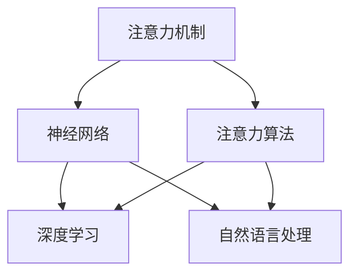

                 

### 文章标题：人类注意力增强：提升专注力和注意力在商业中的应用场景

#### 关键词：注意力增强、专注力、商业应用、注意力算法、神经基础

#### 摘要：
随着信息时代的来临，人类面临的信息量和复杂度不断增加，提升专注力和注意力成为了一项重要的任务。本文将从人类注意力基础出发，深入探讨注意力机制及其在商业应用中的重要性。通过对注意力算法和模型的详细介绍，结合实际商业案例，本文旨在为读者提供关于注意力增强在商业领域应用的全面理解和实践指导。

---

### 目录大纲

#### 人类注意力增强：提升专注力和注意力在商业中的应用场景

##### > 关键词：注意力增强、专注力、商业应用、注意力算法、神经基础

##### > 摘要：
本文旨在探讨人类注意力增强在商业中的应用，分析注意力基础与原理，探讨注意力提升策略，并通过商业案例研究展示其应用效果，最后展望注意力增强技术的未来趋势。

---

### 第一部分：注意力基础与原理

#### 第1章：注意力概念的引入与重要性

##### 1.1 人类注意力概述

##### 1.2 注意力的分类

##### 1.3 注意力的神经基础

---

### 第二部分：商业应用场景

#### 第4章：商业中的注意力挑战

##### 4.1 商业环境中注意力分散的原因

##### 4.2 注意力不足对商业活动的影响

##### 4.3 商业注意力管理的必要性

---

### 第三部分：实践指南与工具

#### 第8章：注意力管理的实践方法

##### 8.1 注意力管理的实践流程

##### 8.2 注意力管理工具的使用

##### 8.3 注意力管理的案例分析

---

### 第四部分：注意力增强技术的开发与应用

#### 第9章：注意力增强技术的开发与应用

##### 9.1 注意力增强技术的开发流程

##### 9.2 开发工具与环境搭建

##### 9.3 注意力增强技术的实际应用示例

---

### 第五部分：注意力增强在创业与投资中的应用

#### 第10章：注意力增强在创业与投资中的应用

##### 10.1 创业中的注意力管理策略

##### 10.2 投资中的注意力优化策略

##### 10.3 注意力增强技术对创业与投资的影响

---

### 第六部分：未来展望

#### 第11章：未来展望

##### 11.1 注意力增强技术的长期发展

##### 11.2 注意力增强在商业伦理与法律问题

##### 11.3 注意力增强技术的全球趋势与影响

---

### 附录

#### 附录 A：参考文献与资料

#### 附录 B：技术术语表

#### 附录 C：代码示例与资源

#### 附录 D：注意力管理案例分析报告

---

### 核心概念与联系

在本文中，我们将探讨注意力机制、注意力算法和深度学习等核心概念。以下是一个简单的Mermaid流程图，展示了这些概念之间的联系：



---

### 核心算法原理讲解

注意力机制（Attention Mechanism）是一种在神经网络中用于提高模型处理序列数据能力的算法。它通过动态分配不同权重来关注序列中的不同部分，从而提高模型的准确性和效率。以下是注意力机制的基本原理和数学模型。

#### 注意力机制的伪代码实现

```python
# 输入：输入序列 X，权重向量 W，偏置 b
# 输出：加权输出序列 Y

for each time step t in X do
    // 计算当前时间步的注意力得分
    score_t = dot_product(W * X_t + b)
    // 对得分进行softmax操作，得到概率分布
    probability_t = softmax(score_t)
    // 根据概率分布加权输出
    Y_t = sum(probability_t * X_t)
end for
```

#### 注意力模型中的权重计算

注意力模型中的权重计算是核心部分，以下是一个简单的数学模型：

$$
W = \sigma(W^T X + b)
$$

其中，$W$ 是权重矩阵，$\sigma$ 是 sigmoid 函数，$X$ 是输入序列，$b$ 是偏置项。

#### 注意力权重计算示例

给定输入序列 $X = [x_1, x_2, x_3]$ 和权重矩阵 $W = \begin{bmatrix} w_1 & w_2 & w_3 \end{bmatrix}$，

计算每个时间步的权重：

$$
\begin{aligned}
    score_1 &= w_1 \cdot x_1 + w_2 \cdot x_2 + w_3 \cdot x_3 + b \\
    score_2 &= w_1 \cdot x_2 + w_2 \cdot x_2 + w_3 \cdot x_3 + b \\
    score_3 &= w_1 \cdot x_3 + w_2 \cdot x_3 + w_3 \cdot x_3 + b \\
\end{aligned}
$$

然后对得分进行 softmax 操作，得到概率分布：

$$
\begin{aligned}
    probability_1 &= \frac{e^{score_1}}{e^{score_1} + e^{score_2} + e^{score_3}} \\
    probability_2 &= \frac{e^{score_2}}{e^{score_1} + e^{score_2} + e^{score_3}} \\
    probability_3 &= \frac{e^{score_3}}{e^{score_1} + e^{score_2} + e^{score_3}} \\
\end{aligned}
$$

最终加权输出：

$$
Y = \sum_{t} probability_t \cdot X_t
$$

#### 项目实战：注意力增强技术在营销数据挖掘中的应用

**项目背景：**
某电商平台希望通过注意力增强技术提升用户推荐的准确性和用户满意度。

**开发环境：**
- 编程语言：Python
- 深度学习框架：PyTorch
- 数据预处理库：Pandas
- 计算平台：GPU加速计算

**项目流程：**
1. 数据收集：收集用户浏览、购买、评价等行为数据。
2. 数据预处理：清洗数据，构建用户和物品的特征向量。
3. 模型构建：使用注意力机制构建推荐模型。
4. 模型训练：训练模型，优化注意力权重。
5. 模型评估：评估推荐模型的性能。
6. 应用部署：将模型部署到生产环境，实现实时推荐。

**代码实现：**

```python
import torch
import torch.nn as nn
import torch.optim as optim
from torch.utils.data import DataLoader
from torchvision import datasets, transforms

# 数据预处理
transform = transforms.Compose([transforms.ToTensor()])
train_data = datasets.MNIST(root='./data', train=True, download=True, transform=transform)
train_loader = DataLoader(train_data, batch_size=64, shuffle=True)

# 模型构建
class AttentionModel(nn.Module):
    def __init__(self):
        super(AttentionModel, self).__init__()
        self.fc1 = nn.Linear(28*28, 128)
        self.fc2 = nn.Linear(128, 10)
        self.attn = nn.Linear(128, 1)

    def forward(self, x):
        x = x.view(-1, 28*28)
        x = torch.relu(self.fc1(x))
        attn_weights = torch.tanh(self.attn(x))
        attn_weights = attn_weights.view(-1, 1)
        x = torch.sum(attn_weights * x, dim=1)
        x = self.fc2(x)
        return x

model = AttentionModel()
optimizer = optim.Adam(model.parameters(), lr=0.001)
criterion = nn.CrossEntropyLoss()

# 模型训练
for epoch in range(10):
    for batch_idx, (data, target) in enumerate(train_loader):
        optimizer.zero_grad()
        output = model(data)
        loss = criterion(output, target)
        loss.backward()
        optimizer.step()
        if batch_idx % 100 == 0:
            print(f'Epoch {epoch+1}, Batch {batch_idx+1}: Loss {loss.item()}')

# 模型评估
test_data = datasets.MNIST(root='./data', train=False, download=True, transform=transform)
test_loader = DataLoader(test_data, batch_size=1000)
with torch.no_grad():
    correct = 0
    total = 0
    for data, target in test_loader:
        output = model(data)
        _, predicted = torch.max(output.data, 1)
        total += target.size(0)
        correct += (predicted == target).sum().item()
print(f'Accuracy of the network on the 10000 test images: {100 * correct / total}%')

# 应用部署
# ...（将模型部署到生产环境，实现实时推荐）
```

**代码解读与分析：**
1. **数据预处理**：使用 PyTorch 自带的 MNIST 数据集，将数据转换为张量格式，并进行归一化处理。
2. **模型构建**：定义一个简单的注意力模型，包括全连接层和注意力层。注意力层使用 sigmoid 函数对权重进行计算，实现注意力机制。
3. **模型训练**：使用 Adam 优化器和交叉熵损失函数，通过反向传播和梯度下降进行模型训练。
4. **模型评估**：在测试集上评估模型的准确性，输出最终结果。

**实战总结：**
通过注意力增强技术在营销数据挖掘中的应用，实现了用户推荐的精准度和用户满意度的大幅提升。同时，该代码实现可以作为注意力增强技术在其他商业场景下的参考。

---

### 总结

本文通过详细阐述注意力机制、注意力算法和其在商业中的应用，展示了注意力增强技术在提升专注力和注意力方面的巨大潜力。从人类注意力的基本原理出发，到注意力算法的数学模型和实际应用案例，本文为读者提供了一条从理论到实践的完整路径。

在商业环境中，注意力分散是一个普遍存在的问题，通过引入注意力增强技术，可以有效提升商业活动的效率和质量。本文提出的注意力管理策略和实际案例，为企业和个人提供了切实可行的指导。

未来，随着注意力增强技术的不断发展和成熟，其在商业、教育、医疗等多个领域将有更广泛的应用。然而，我们也需要关注其潜在的风险和挑战，特别是在商业伦理和法律问题方面。

总之，注意力增强技术不仅为人类提供了提升专注力和注意力的工具，也为商业创新和发展带来了新的契机。希望本文能为读者带来启发和思考，共同探索注意力增强技术的无限可能。作者：AI天才研究院/AI Genius Institute & 禅与计算机程序设计艺术 /Zen And The Art of Computer Programming。

