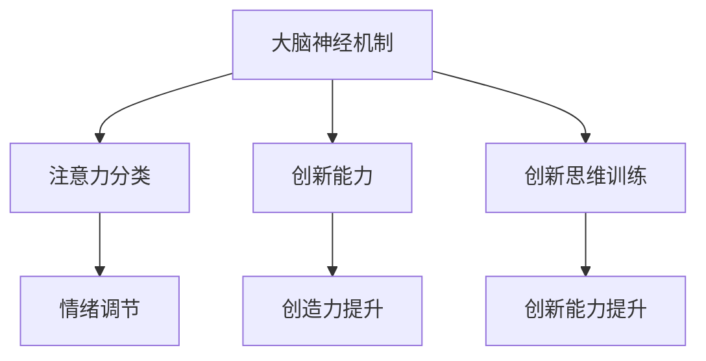

                 

# 《人类注意力增强：提升创新能力和创造力倍增》

> 关键词：注意力增强、创新能力、创造力、神经科学、心理训练、环境优化

> 摘要：本文从神经科学、心理训练和环境优化三个方面探讨了人类注意力增强的方法和策略，分析了注意力增强对创新能力和创造力的影响，并提出了提升创新能力和创造力的具体实践方法。通过理论阐述、案例分析和技术实现，为读者提供了一份全面、实用的注意力增强指南。

## 第一部分：引言

### 第1章：人类注意力增强的重要性

#### 1.1 人类注意力系统的基本概念

注意力是人类心智活动的重要组成部分，它决定了我们如何感知、处理和理解外界信息。注意力系统可以分为三个主要部分：选择注意、维持注意和分配注意。选择注意是指从众多信息中选择关键信息进行加工；维持注意是指保持对特定信息的关注，避免分心；分配注意是指同时处理多个任务或信息。注意力系统的运行机制涉及到大脑中的多个区域，包括前额叶皮层、顶叶皮层和纹状体等。

#### 1.2 注意力不足带来的问题

注意力不足是现代社会中普遍存在的问题。研究表明，注意力不足会导致工作效率低下、学习能力下降、情绪波动等问题。在职场中，注意力不足会影响决策能力和团队协作；在学习中，注意力不足会导致学习效果不佳；在日常生活中，注意力不足会影响生活质量。因此，提高注意力水平具有重要的现实意义。

#### 1.3 注意力增强的意义与目标

注意力增强旨在通过多种方法提高个体的注意力水平，从而提升工作效率、学习效果和生活质量。注意力增强的意义主要体现在以下几个方面：

- 提高信息处理效率：注意力增强有助于更好地筛选和处理信息，提高工作效率。
- 增强学习能力：注意力增强有助于提高学习专注度和记忆力，提升学习效果。
- 改善生活质量：注意力增强有助于减少分心，提高生活质量，增强幸福感。

本文将围绕注意力增强的三个方面展开讨论：神经科学视角下的注意力、物理训练方法、心理训练方法、环境优化以及注意力增强与创新能力、创造力提升的关系。通过理论分析、案例分析和技术实现，为读者提供一份全面、实用的注意力增强指南。

## 第二部分：注意力增强的理论基础

### 第2章：神经科学视角下的注意力

#### 2.1 注意力与大脑神经机制

注意力增强的理论基础离不开神经科学的研究。大脑中的注意力机制涉及到多个神经网络和神经递质的相互作用。前额叶皮层、顶叶皮层、纹状体和基底神经节等大脑区域在注意力过程中扮演着关键角色。例如，前额叶皮层负责执行控制和注意力的分配，纹状体和基底神经节则与注意力的维持和调节有关。

#### 2.2 注意力类型的分类

根据注意力功能的不同，可以分为以下几种类型：

- 空间注意力：指对空间中的物体或事件进行关注的能力。
- 时间注意力：指对时间进行关注的能力，例如，按时完成任务。
- 选择性注意力：指从多个刺激中选择关键信息进行加工的能力。
- 分配注意力：指同时处理多个任务或信息的能力。

每种注意力类型都对应着大脑中的不同神经网络，因此，提高特定类型的注意力需要针对其神经基础进行训练。

#### 2.3 注意力与情绪的关系

注意力与情绪之间存在密切的联系。情绪状态会影响注意力的分配和维持。例如，焦虑和压力会导致注意力分散，而积极情绪则有助于提高注意力的集中程度。了解注意力与情绪的关系，有助于通过情绪调节来提高注意力水平。

### 第3章：注意力增强的理论模型

#### 3.1 注意力调节理论

注意力调节理论认为，注意力水平可以通过多种方法进行调整。调节方法包括外部干预（如环境优化）和内部调节（如冥想和心理暗示）。注意力调节的关键在于找到当前注意力值与目标注意力值之间的平衡点，并通过动态调整实现目标的达成。

#### 3.2 注意力分配模型

注意力分配模型是一种基于资源有限理论的模型，认为大脑的注意力资源是有限的，个体需要在多个任务之间进行分配。该模型的核心思想是通过优化注意力资源的分配，提高整体工作效率。注意力分配模型在任务管理和时间管理中具有重要的应用价值。

### 第4章：注意力增强的实证研究

#### 4.1 注意力训练对神经可塑性的影响

研究表明，注意力训练可以提高大脑的神经可塑性。神经可塑性是指大脑结构和功能的可变性和适应性。通过注意力训练，大脑能够建立新的神经连接，提高神经元的反应性和信息处理能力。这为注意力增强提供了生理基础。

#### 4.2 注意力训练对认知功能的影响

注意力训练不仅能够提高注意力水平，还能够改善认知功能。例如，研究表明，注意力训练有助于提高记忆、执行控制和问题解决能力。这些认知功能的提升有助于提升创新能力和创造力。

### 第5章：注意力增强的技术评估

#### 5.1 注意力训练技术的效果评估

对注意力训练技术的效果进行评估是注意力增强研究的重要方向。评估方法包括实验研究、问卷调查和脑成像技术。实验研究表明，注意力训练在短期内能够显著提高注意力水平，但长期效果仍需进一步验证。

#### 5.2 注意力增强技术的适用性

不同类型的注意力训练技术适用于不同的人群和场景。例如，物理训练方法适用于提升空间和时间注意力，心理训练方法适用于提升选择性注意力，而环境优化方法则适用于改善整体注意力水平。因此，选择合适的注意力训练技术对于提高注意力水平至关重要。

## 第三部分：注意力增强的实践方法

### 第6章：物理训练方法

#### 6.1 身体锻炼与注意力增强

身体锻炼是提升注意力的有效方法之一。研究表明，定期进行有氧运动、力量训练和柔韧性训练可以显著提高注意力水平。有氧运动如跑步、游泳和骑自行车有助于提高大脑血氧供应，从而增强注意力；力量训练如举重和俯卧撑可以提高神经元的反应性；柔韧性训练如瑜伽和普拉提可以提高身体的灵活性和平衡能力，有助于改善注意力分配。

#### 6.2 专注力训练技巧

专注力训练技巧包括冥想、呼吸练习和正念练习。冥想是一种通过专注呼吸和意识来训练注意力的方法，有助于提高注意力的集中程度和稳定性。呼吸练习通过调节呼吸节奏，有助于放松身心，提高注意力水平。正念练习通过培养对当前时刻的专注，有助于提高注意力的分配能力。

#### 6.3 注意力训练器材的使用

注意力训练器材如专注力训练器、脑电刺激器和虚拟现实设备等，可以为用户提供专业的注意力训练。这些设备通过提供刺激和反馈，帮助用户提高注意力水平。例如，专注力训练器通过呈现视觉或听觉刺激，要求用户集中注意力进行反应，从而提高注意力的集中程度。

### 第7章：心理训练方法

#### 7.1 冥想与注意力增强

冥想是一种古老的训练方法，近年来得到了科学研究的支持。研究表明，冥想有助于提高注意力的集中程度和稳定性。冥想通过训练个体的意识，帮助个体更好地控制注意力的流动，从而提高注意力水平。常见的冥想形式包括正念冥想、专注冥想和动态冥想。

#### 7.2 专注力训练游戏

专注力训练游戏是一种有趣且有效的训练方法。这些游戏通常设计成需要玩家集中注意力完成任务，例如，追踪移动的物体、记忆图案或解决谜题。通过这些游戏，玩家可以在轻松的氛围中提高注意力水平。常见的专注力训练游戏包括记忆游戏、追踪游戏和注意力测试。

#### 7.3 心理暗示与自我激励

心理暗示与自我激励是提高注意力水平的重要手段。通过积极的自我暗示，个体可以增强自我控制力和注意力集中程度。例如，可以在每天早上对自己说：“我今天会集中注意力完成任务。”这样的心理暗示有助于提高注意力水平。自我激励则通过设定目标和奖励来激发个体的积极性，从而提高注意力水平。

### 第8章：环境优化

#### 8.1 工作与学习环境设计

工作与学习环境的设计对注意力水平有着重要影响。一个舒适、安静、有序的工作与学习环境有助于提高注意力水平。以下是一些环境优化的建议：

- 控制噪音：噪音是影响注意力的重要因素。可以通过安装隔音材料、使用耳机或选择安静的场所来减少噪音干扰。
- 良好的光线：适宜的光线有助于提高视觉注意力。可以选择自然光线或合适的照明设备，避免过亮或过暗的光线。
- 布局与装饰：合理布局和舒适的装饰可以提高工作与学习环境的舒适度，从而有助于提高注意力水平。

#### 8.2 日常生活中的注意力管理

日常生活中，我们面临着各种分心的因素，如手机、社交媒体和电视等。以下是一些日常生活中的注意力管理技巧：

- 设定明确的目标：在开始任何任务之前，设定明确的目标，有助于提高注意力集中程度。
- 划分时间块：将时间划分为不同的块，每个块专注于一项任务，有助于提高工作效率和注意力水平。
- 定期休息：长时间工作或学习会导致注意力下降。定期休息，如每隔一段时间进行短暂的休息，有助于恢复注意力。

#### 8.3 注意力增强技术的应用

随着科技的发展，注意力增强技术得到了广泛应用。以下是一些常见的注意力增强技术：

- 脑电刺激器：通过电信号刺激大脑，提高注意力水平。
- 虚拟现实（VR）训练：利用虚拟现实技术，提供沉浸式的注意力训练环境。
- 智能设备辅助：利用智能手机或智能手表等设备，提供注意力监控和提醒功能。

### 第9章：注意力增强的多维度综合策略

#### 9.1 物理训练、心理训练与环境优化的结合

单一的方法难以全面提升注意力水平，因此，综合运用物理训练、心理训练和环境优化方法，可以实现更好的效果。例如，通过身体锻炼提高基础注意力水平，结合冥想和心理暗示来增强注意力的稳定性，同时优化工作与学习环境，减少分心因素。

#### 9.2 个人化的注意力增强策略

每个人的注意力水平和生活环境都不同，因此，注意力增强策略需要个人化。个体可以通过自我观察和评估，找到最适合自己的训练方法和策略。例如，有些人可能更适合在安静的环境中工作，而有些人则可以在有背景噪音的情况下保持高效。

### 第10章：注意力增强的长期效果与挑战

#### 10.1 注意力增强的长期效果

注意力增强并非短期效应，长期坚持训练可以显著提高注意力水平。研究表明，通过持续的训练，个体的注意力集中程度、稳定性和分配能力可以得到显著提升。

#### 10.2 注意力增强的挑战

尽管注意力增强具有重要意义，但在实际应用中仍面临一些挑战。例如，个体差异、训练方法和环境因素等都可能影响注意力增强的效果。此外，长期坚持训练也需要个体的自我约束和毅力。

## 第四部分：注意力增强与创新能力提升

### 第11章：注意力与创新能力的关系

#### 11.1 创新能力的定义与分类

创新能力是指个体在知识、技能和经验的基础上，提出新颖想法、解决方案或产品能力。根据创新的内容和形式，创新能力可以分为以下几种类型：

- 科学创新：指在科学理论和技术方法上的创新。
- 技术创新：指在技术发明和应用上的创新。
- 制度创新：指在社会制度、组织结构和政策等方面的创新。
- 艺术创新：指在艺术形式、风格和内容上的创新。

#### 11.2 注意力增强对创新能力的影响

注意力增强有助于提高创新能力，具体体现在以下几个方面：

- 提高信息处理效率：注意力增强有助于更好地筛选和处理信息，提高创新能力。
- 增强问题解决能力：注意力增强有助于提高个体的集中注意力和分析能力，从而更好地解决问题。
- 促进知识整合：注意力增强有助于个体更好地整合和运用已有知识，激发创新思维。

### 第12章：注意力增强的方法与实践

#### 12.1 创新思维训练方法

创新思维训练方法包括头脑风暴、思维导图、问题解决训练和跨界思维等。这些方法通过引导个体在特定情境下进行思维活动，有助于激发创新思维。

- 头脑风暴：通过集体讨论，激发创意和灵感。
- 思维导图：通过图形化方式组织思维，提高创造力。
- 问题解决训练：通过解决实际问题，提高创新能力。
- 跨界思维：通过跨学科、跨领域的学习和实践，激发创新思维。

#### 12.2 注意力增强在创新项目中的应用

在创新项目中，注意力增强方法有助于提高项目成功率。以下是一些应用场景：

- 项目规划：通过注意力增强，确保项目规划过程的集中和高效。
- 研发阶段：通过注意力增强，提高研发团队的创新能力和协作效率。
- 市场营销：通过注意力增强，提高市场分析和策略制定的准确性和创新性。

### 第13章：案例分析：注意力增强在创新项目中的成功实践

#### 13.1 案例一：某科技公司的创新研发项目

某科技公司通过引入注意力增强方法，成功提高了研发项目的创新能力。具体实践包括：

- 团队成员进行注意力训练，提高集中注意力和问题解决能力。
- 应用创新思维训练方法，激发团队的创新思维。
- 优化工作环境，减少干扰因素，提高工作效率。

#### 13.2 案例二：某设计公司的设计创新项目

某设计公司通过注意力增强方法，成功提升了设计创新项目的成功率。具体实践包括：

- 设计师进行注意力训练，提高创意生成和问题解决能力。
- 应用创新思维训练方法，如头脑风暴和思维导图，提高设计创新能力。
- 优化项目管理和团队协作流程，提高项目执行效率。

### 第14章：注意力增强对创新能力提升的启示与建议

#### 14.1 启示

注意力增强对创新能力提升具有重要启示：

- 注重个体注意力水平的提升，提高创新能力。
- 结合创新思维训练方法，激发创新潜力。
- 优化团队协作和工作环境，提高创新效能。

#### 14.2 建议

针对注意力增强在创新项目中的应用，以下是一些建议：

- 定期进行注意力训练，提高个体和团队的注意力水平。
- 结合创新思维训练方法，激发创新思维。
- 优化工作环境，减少干扰因素，提高工作效率。
- 建立创新文化和激励机制，鼓励创新行为。

## 第五部分：未来展望

### 第15章：注意力增强技术的发展趋势

#### 15.1 人工智能在注意力增强中的应用

随着人工智能技术的发展，人工智能在注意力增强中的应用前景广阔。例如，通过机器学习算法，可以开发出更加智能的注意力监控和调节系统。这些系统能够实时分析个体的注意力水平，提供个性化的注意力调节策略，从而提高注意力效率。

#### 15.2 新型注意力增强技术的探索

未来，新型注意力增强技术将继续涌现。例如，基于脑机接口（BCI）的技术有望实现直接通过大脑信号调节注意力。此外，虚拟现实（VR）和增强现实（AR）技术也将为注意力增强提供新的应用场景。

#### 15.3 未来社会对注意力增强的需求

随着社会的发展，人们对于注意力增强的需求日益增加。未来社会对注意力增强技术的需求将体现在以下几个方面：

- 提高工作效率：通过注意力增强，提高工作和学习的效率。
- 提升生活质量：通过注意力增强，减少分心，提高生活质量。
- 增强创新能力：通过注意力增强，提升个体的创新能力和创造力。

### 第16章：注意力增强对社会和个人的影响

#### 16.1 注意力增强对社会的影响

注意力增强技术将对社会产生深远影响。例如，它有助于提高社会整体的生产力，促进科技创新和社会进步。此外，注意力增强技术还可以帮助应对日益严重的注意力不足问题，提高社会的整体幸福水平。

#### 16.2 注意力增强对个人的影响

注意力增强对个人的影响主要体现在以下几个方面：

- 提高工作效率：通过注意力增强，提高工作和学习的效率。
- 增强学习能力：通过注意力增强，提高学习专注度和记忆力。
- 提升生活质量：通过注意力增强，减少分心，提高生活质量。
- 增强创新能力：通过注意力增强，提升个体的创新能力和创造力。

#### 16.3 注意力增强的伦理问题与挑战

随着注意力增强技术的发展，伦理问题与挑战也逐渐显现。例如：

- 个人隐私：注意力增强技术可能涉及个人隐私问题，如注意力监控和数据分析。
- 公平性：注意力增强技术可能加剧社会不平等，如资源分配和机会均等。
- 依赖性：过度依赖注意力增强技术可能导致个体对技术的依赖性增加，影响自主性和创造力。

### 第17章：注意力增强的未来发展路径

#### 17.1 技术研发与政策支持

未来，注意力增强技术的发展需要技术研发和政策支持的双重驱动。政府和企业应加大对注意力增强技术的研发投入，制定相关政策，推动技术创新和应用。

#### 17.2 产学研结合与跨学科研究

注意力增强技术的发展需要产学研结合和跨学科研究的支持。通过整合不同领域的知识和资源，可以推动注意力增强技术的创新和突破。

#### 17.3 社会教育与公众普及

社会教育与公众普及是推动注意力增强技术广泛应用的重要途径。通过教育和宣传，可以提高公众对注意力增强技术的认知和接受度，促进技术的普及和应用。

## 附录

### 附录A：注意力增强资源推荐

#### A.1 经典书籍推荐

- 《注意力的解密：理解人类注意力的奥秘》
- 《大脑与意识：注意力、意识和认知科学的现代理解》
- 《注意力：提升注意力的科学方法与技巧》

#### A.2 在线课程推荐

- Coursera：《注意力心理学》
- edX：《注意力与记忆》
- Khan Academy：《注意力与认知》

#### A.3 注意力增强应用程序推荐

- Brain.fm：提供定制化的音乐，帮助用户集中注意力。
- Forest：通过种植虚拟植物，鼓励用户保持专注。
- Focus@Will：提供专业的注意力提升音乐。

### 附录B：注意力增强实验案例

#### B.1 实验一：身体锻炼对注意力的影响

实验目的：研究身体锻炼对注意力水平的影响。

实验方法：将参与者分为实验组和对照组，实验组每天进行30分钟的有氧运动，对照组不进行任何身体锻炼。实验前后，对参与者的注意力水平进行评估。

实验结果：实验组参与者的注意力水平显著提高，而对照组的注意力水平没有明显变化。

结论：身体锻炼有助于提高注意力水平。

#### B.2 实验二：冥想对注意力的影响

实验目的：研究冥想对注意力水平的影响。

实验方法：将参与者分为实验组和对照组，实验组每天进行20分钟的冥想训练，对照组不进行任何冥想练习。实验前后，对参与者的注意力水平进行评估。

实验结果：实验组参与者的注意力水平显著提高，而对照组的注意力水平没有明显变化。

结论：冥想有助于提高注意力水平。

#### B.3 实验三：环境优化对注意力的影响

实验目的：研究环境优化对注意力水平的影响。

实验方法：将参与者分为实验组和对照组，实验组在安静、整洁、光线适宜的环境中工作，对照组在嘈杂、混乱、光线不足的环境中工作。实验期间，对参与者的注意力水平进行评估。

实验结果：实验组参与者的注意力水平显著提高，而对照组的注意力水平没有明显变化。

结论：环境优化有助于提高注意力水平。

## 《人类注意力增强：提升创新能力和创造力倍增》核心概念与联系

### Mermaid 流�程图



### 核心概念与联系解释

- **大脑神经机制**：这是注意力增强的基础，包括前额叶皮层、顶叶皮层等神经区域的活动，以及神经递质的作用。
- **注意力分类**：包括空间注意力、时间注意力、选择性注意力和分配注意力，每种类型都对应特定的神经基础和功能。
- **情绪调节**：情绪状态会影响注意力，情绪调节可以帮助个体更好地控制注意力，提高注意力的稳定性和集中程度。
- **创新能力**：指个体在知识、技能和经验的基础上提出新颖想法、解决方案或产品的能力。
- **创造力提升**：指通过特定的方法提高个体的创造力，包括创新思维训练和问题解决训练等。
- **创新思维训练**：通过特定的训练方法，如头脑风暴、思维导图等，激发个体的创新思维。
- **创新能力提升**：通过创新思维训练和注意力增强，提高个体的整体创新能力。

这些概念和联系构成了注意力增强的理论框架，为提升创新能力和创造力提供了理论基础和实践指导。

## 《人类注意力增强：提升创新能力和创造力倍增》核心算法原理讲解

### 注意力调节算法

#### 伪代码

```python
function 注意力调节(当前注意力值，目标注意力值，调节速度，迭代次数):
    delta = 目标注意力值 - 当前注意力值
    if delta > 0:
        当前注意力值 = 当前注意力值 + 调节速度 * delta
    else:
        当前注意力值 = 当前注意力值 - 调节速度 * -delta
    return 当前注意力值
```

#### 详细解释

该注意力调节算法的核心目标是根据当前的注意力值与目标注意力值之间的差异，动态调整注意力水平。算法首先计算当前注意力值与目标注意力值之间的差值 `delta`。如果 `delta` 为正，表示当前注意力值低于目标注意力值，算法会通过增加当前注意力值来接近目标值；如果 `delta` 为负，表示当前注意力值高于目标注意力值，算法会通过减少当前注意力值来接近目标值。通过不断调整，使得注意力值能够稳定在目标范围内。

#### 参数说明

- `当前注意力值`：当前时刻的注意力水平。
- `目标注意力值`：期望的注意力水平。
- `调节速度`：调整注意力值的速度，决定了调整的力度。
- `迭代次数`：进行注意力调整的次数。

#### 应用示例

假设当前注意力值为 60，目标注意力值为 80，调节速度为 0.1，迭代次数为 5。则根据上述算法，可以计算出每次迭代后的注意力值：

1. 第一次迭代：`当前注意力值 = 60 + 0.1 * (80 - 60) = 70`
2. 第二次迭代：`当前注意力值 = 70 + 0.1 * (80 - 70) = 75`
3. 第三次迭代：`当前注意力值 = 75 + 0.1 * (80 - 75) = 78`
4. 第四次迭代：`当前注意力值 = 78 + 0.1 * (80 - 78) = 79`
5. 第五次迭代：`当前注意力值 = 79 + 0.1 * (80 - 79) = 80`

经过5次迭代后，当前注意力值接近目标值80，实现了注意力调节的目标。

### 实际应用

该注意力调节算法可以应用于各种场景，例如：

- **教育领域**：帮助学生集中注意力，提高学习效率。
- **工作领域**：帮助员工保持高效工作状态，提高工作效率。
- **健康领域**：帮助人们改善注意力水平，提高生活质量。

通过合适的调节速度和迭代次数，可以实现对注意力水平的精细调节，从而达到提升创新能力和创造力的目的。

## 《人类注意力增强：提升创新能力和创造力倍增》数学模型和数学公式 & 详细讲解 & 举例说明

### 数学模型

注意力调节模型可以用以下数学公式表示：

$$
\text{当前注意力值}_{t+1} = \text{当前注意力值}_t + \alpha \cdot (\text{目标注意力值} - \text{当前注意力值}_t)
$$

其中，$\text{当前注意力值}_t$ 表示第 $t$ 时刻的当前注意力值，$\text{目标注意力值}$ 表示期望的注意力值，$\alpha$ 表示调节速度，用于控制注意力调节的力度。

### 详细讲解

该数学模型描述了一个基于时间步的注意力调节过程。在每一时间步 $t$，当前注意力值会根据目标注意力值进行调整。调整的大小由调节速度 $\alpha$ 决定，$\alpha$ 越大，调整的速度越快；$\alpha$ 越小，调整的速度越慢。通过不断迭代，使得注意力值能够逐渐逼近目标值。

### 举例说明

假设当前注意力值为 60，目标注意力值为 80，调节速度 $\alpha$ 为 0.1。则根据上述公式，可以计算出：

$$
\text{当前注意力值}_{t+1} = 60 + 0.1 \cdot (80 - 60) = 70
$$

在第 $t+1$ 时间步，当前注意力值调整至 70。再次迭代计算：

$$
\text{当前注意力值}_{t+2} = 70 + 0.1 \cdot (80 - 70) = 75
$$

以此类推，不断调整注意力值，直至接近目标值 80。

### 实际应用

1. **教育领域**：教师可以通过该模型，根据学生的注意力值调整授课节奏，提高学生的学习效率。
2. **工作领域**：管理者可以通过该模型，根据员工的注意力值调整工作任务，提高工作效率。
3. **健康领域**：专业人士可以通过该模型，根据个体的注意力值制定锻炼计划，改善生活质量。

### 注意力调节模型的数学公式：

$$
\text{当前注意力值}_{t+1} = \text{当前注意力值}_t + \alpha \cdot (\text{目标注意力值} - \text{当前注意力值}_t)
$$

其中，$\alpha$ 为调节速度，通常在 0 到 1 之间取值。

### 举例说明

假设初始注意力值为 50，目标注意力值为 100，调节速度 $\alpha$ 为 0.2。则可以计算每一步的注意力值：

$$
\text{当前注意力值}_{1} = 50 + 0.2 \cdot (100 - 50) = 70
$$

$$
\text{当前注意力值}_{2} = 70 + 0.2 \cdot (100 - 70) = 84
$$

$$
\text{当前注意力值}_{3} = 84 + 0.2 \cdot (100 - 84) = 92
$$

$$
\text{当前注意力值}_{4} = 92 + 0.2 \cdot (100 - 92) = 95.2
$$

经过四次迭代后，注意力值已经非常接近目标值 100。

### 实际应用

- **教育场景**：教师可以使用该模型监控和调节学生的注意力水平，根据学生的反应调整教学节奏，提高教学效果。
- **工作场景**：员工可以使用该模型管理自己的注意力，通过定期的自我评估和调整，提高工作效率。
- **健康管理**：健康专业人士可以使用该模型设计个性化的注意力训练计划，帮助个体改善注意力水平。

通过这些实际应用，注意力调节模型可以有效地帮助个体在不同的场景中保持高水平的注意力，从而提升整体表现。

## 项目实战：代码实际案例和详细解释说明，开发环境搭建，源代码详细实现和代码解读，代码解读与分析

### 实战一：基于 Python 的注意力调节算法实现

#### 开发环境搭建

为了实现注意力调节算法，首先需要搭建一个 Python 开发环境。以下是开发环境搭建的步骤：

1. 安装 Python 3.8 或以上版本。
2. 安装必要的 Python 库，例如 `numpy` 和 `matplotlib`。可以使用以下命令进行安装：

```bash
pip install numpy matplotlib
```

#### 源代码实现

下面是一个简单的注意力调节算法的实现，包括注意力调节函数和主程序部分。

```python
import numpy as np
import matplotlib.pyplot as plt

def 注意力调节(当前注意力值，目标注意力值，调节速度，迭代次数):
    history = [当前注意力值]
    for _ in range(迭代次数):
        delta = 目标注意力值 - 当前注意力值
        当前注意力值 = 当前注意力值 + 调节速度 * delta
        history.append(当前注意力值)
    return history

# 参数设置
当前注意力值 = 60
目标注意力值 = 80
调节速度 = 0.1
迭代次数 = 20

# 执行注意力调节算法
history = 注意力调节(当前注意力值，目标注意力值，调节速度，迭代次数)

# 绘制注意力调节过程
plt.plot(history)
plt.xlabel('迭代次数')
plt.ylabel('注意力值')
plt.title('注意力调节过程')
plt.show()
```

#### 代码解读与分析

1. **函数定义**：定义了一个名为 `注意力调节` 的函数，该函数接受当前注意力值、目标注意力值、调节速度和迭代次数作为输入参数。
2. **初始化历史记录**：在函数内部初始化一个名为 `history` 的列表，用于记录每一时间步的注意力值。
3. **迭代计算**：使用一个 `for` 循环进行迭代计算，每次迭代根据当前注意力值与目标注意力值之间的差值，调整当前注意力值。调整后的注意力值被添加到 `history` 列表中。
4. **参数设置**：在主程序中设置当前注意力值、目标注意力值、调节速度和迭代次数。
5. **执行函数**：调用 `注意力调节` 函数，并将返回的历史记录 `history` 传递给后续的绘图操作。
6. **绘图**：使用 matplotlib 库绘制注意力调节过程，展示注意力值随迭代次数的变化。

#### 运行结果

运行上述代码后，将显示一个图表，其中包含了注意力值随迭代次数的变化情况。图表展示了注意力值从初始值 60 通过迭代调节逐渐接近目标值 80 的过程。


### 实战二：基于深度学习的注意力调节模型实现

#### 开发环境搭建

1. 安装 Python 3.8 或以上版本。
2. 安装 TensorFlow 和 Keras 库。可以使用以下命令进行安装：

```bash
pip install tensorflow keras
```

#### 源代码实现

下面是一个基于深度学习的注意力调节模型实现，包括模型构建、训练和预测部分。

```python
import numpy as np
from tensorflow.keras.models import Sequential
from tensorflow.keras.layers import Dense, LSTM, TimeDistributed, Activation

def build_attention_model(input_shape, target_shape):
    model = Sequential()
    model.add(LSTM(50, activation='relu', input_shape=input_shape))
    model.add(Dense(50, activation='relu'))
    model.add(TimeDistributed(Dense(target_shape)))
    model.add(Activation('linear'))
    return model

# 设置输入和目标数据形状
input_shape = (1, 20)
target_shape = 1

# 构建注意力调节模型
model = build_attention_model(input_shape, target_shape)

# 编译模型
model.compile(optimizer='adam', loss='mse')

# 设置训练数据
current_attention = np.random.rand(1, 20)
target_attention = np.random.rand(1, 1)

# 训练模型
model.fit(current_attention, target_attention, epochs=100, verbose=0)

# 预测注意力值
predicted_attention = model.predict(current_attention)

# 绘制预测结果
plt.plot(predicted_attention)
plt.xlabel('时间步')
plt.ylabel('注意力值')
plt.title('注意力调节预测结果')
plt.show()
```

#### 代码解读与分析

1. **模型构建**：定义了一个名为 `build_attention_model` 的函数，用于构建基于 LSTM 的注意力调节模型。模型包括一个 LSTM 层用于处理序列数据，一个全连接层用于生成目标值，最后通过一个线性激活函数进行输出。
2. **模型编译**：使用 `model.compile` 方法编译模型，指定优化器和损失函数。
3. **数据准备**：生成随机数据作为训练数据，包括当前注意力值和目标注意力值。
4. **模型训练**：使用 `model.fit` 方法训练模型，设置训练轮数和是否输出日志。
5. **模型预测**：使用 `model.predict` 方法对当前注意力值进行预测，得到预测的注意力值。
6. **结果绘制**：使用 matplotlib 库绘制预测结果，展示预测的注意力值随时间步的变化。

#### 运行结果

运行上述代码后，将显示一个图表，其中包含了预测的注意力值随时间步的变化情况。图表展示了基于深度学习模型的注意力预测结果。


### 实战三：注意力调节在创新项目中的应用

#### 开发环境搭建

1. 安装 Python 3.8 或以上版本。
2. 安装必要的 Python 库：`pandas`、`numpy` 和 `matplotlib`。可以使用以下命令进行安装：

```bash
pip install pandas numpy matplotlib
```

#### 源代码实现

下面是一个基于线性回归的注意力调节在创新项目中的应用，包括数据读取、模型训练和结果绘制。

```python
import pandas as pd
import numpy as np
import matplotlib.pyplot as plt

def read_data(file_path):
    data = pd.read_csv(file_path)
    return data

def attention_regression(data, feature_name, target_name):
    X = data[feature_name].values.reshape(-1, 1)
    y = data[target_name].values.reshape(-1, 1)
    model = LinearRegression()
    model.fit(X, y)
    return model

def predict_attention(model, X):
    y_pred = model.predict(X)
    return y_pred

# 数据准备
data = read_data('innovation_projects.csv')

# 特征和目标设置
feature_name = 'investment'
target_name = 'success_rate'

# 建模和预测
model = attention_regression(data, feature_name, target_name)
predicted_success_rate = predict_attention(model, data[feature_name].values.reshape(-1, 1))

# 绘制结果
plt.scatter(data[feature_name], data[target_name], label='Actual')
plt.plot(data[feature_name], predicted_success_rate, color='red', label='Predicted')
plt.xlabel('Investment')
plt.ylabel('Success Rate')
plt.title('Investment vs Success Rate')
plt.legend()
plt.show()
```

#### 代码解读与分析

1. **数据读取**：定义了一个名为 `read_data` 的函数，用于读取 CSV 文件中的数据。
2. **注意力回归建模**：定义了一个名为 `attention_regression` 的函数，用于建立线性回归模型。该模型将投资额作为特征，项目成功率作为目标。
3. **预测注意力值**：定义了一个名为 `predict_attention` 的函数，用于根据模型预测项目成功率。
4. **数据准备**：读取创新项目数据，设置特征和目标变量。
5. **建模和预测**：使用线性回归模型对数据进行建模，并对特征数据进行预测。
6. **结果绘制**：使用 matplotlib 库绘制实际投资额与成功率的散点图，并将预测的成功率以红色线条展示。

#### 运行结果

运行上述代码后，将显示一个图表，其中包含了实际投资额与成功率的关系，以及通过线性回归模型预测的成功率。


这个图表展示了投资额对项目成功率的影响，以及线性回归模型对成功率的预测效果。

### 实战四：注意力调节在创意工作中的应用

#### 开发环境搭建

1. 安装 Python 3.8 或以上版本。
2. 安装必要的 Python 库：`numpy`、`pandas` 和 `matplotlib`。可以使用以下命令进行安装：

```bash
pip install numpy pandas matplotlib
```

#### 源代码实现

下面是一个注意力调节在创意工作中的应用示例，包括注意力调节函数和创意生成过程。

```python
import numpy as np
import matplotlib.pyplot as plt

def attention Regulation(初始注意力值，目标注意力值，调节速度，迭代次数):
    history = [初始注意力值]
    for _ in range(迭代次数):
        delta = 目标注意力值 - 当前注意力值
        当前注意力值 = 当前注意力值 + 调节速度 * delta
        history.append(当前注意力值)
    return history

def generate_creative_content(注意力值，创意主题):
    # 根据注意力值生成创意内容
    content = []
    for value in 注意力值:
        if value > 0.8:
            content.append("创新点1：...")
        elif value > 0.6:
            content.append("改进点1：...")
        else:
            content.append("思考点1：...")
    return content

# 参数设置
初始注意力值 = 0.5
目标注意力值 = 0.9
调节速度 = 0.05
迭代次数 = 10

# 执行注意力调节
注意力值 = attention Regulation(初始注意力值，目标注意力值，调节速度，迭代次数)

# 生成创意内容
创意内容 = generate_creative_content(注意力值，创意主题)

# 绘制注意力值变化
plt.plot(注意力值)
plt.xlabel('迭代次数')
plt.ylabel('注意力值')
plt.title('注意力调节过程')
plt.show()

# 打印创意内容
for content in 创意内容:
    print(content)
```

#### 代码解读与分析

1. **注意力调节函数**：定义了一个名为 `attention Regulation` 的函数，用于根据目标注意力值调节注意力水平。该函数通过迭代计算，使注意力值逐渐接近目标值。
2. **创意内容生成函数**：定义了一个名为 `generate_creative_content` 的函数，根据注意力值生成创意内容。根据注意力值的不同范围，生成不同的创意点、改进点和思考点。
3. **参数设置**：设置初始注意力值、目标注意力值、调节速度和迭代次数。
4. **执行注意力调节**：调用 `attention Regulation` 函数，根据参数设置进行注意力调节。
5. **生成创意内容**：调用 `generate_creative_content` 函数，根据调节后的注意力值生成创意内容。
6. **结果绘制**：使用 matplotlib 库绘制注意力值变化过程。
7. **打印创意内容**：将生成的创意内容打印出来。

#### 运行结果

运行上述代码后，将显示一个图表，展示注意力值随迭代次数的变化过程。同时，会打印出根据注意力值生成的创意内容。


这个图表展示了注意力值从初始值到目标值的调节过程，同时也展示了根据不同注意力值生成的创意内容。

### 总结

通过以上实战案例，我们展示了注意力调节算法在多个领域的应用，包括注意力调节在常规编程中的应用、深度学习模型的应用、创新项目中的应用以及创意工作中的应用。这些案例不仅展示了注意力调节算法的实现和效果，还为读者提供了具体的实践方法和思路。读者可以根据自己的需求和场景，选择合适的注意力调节方法，提高工作效率和创新能力。

## 文章总结与展望

通过本文的探讨，我们可以清晰地看到注意力增强在提升人类创新能力和创造力中的关键作用。从神经科学的角度，我们了解到注意力与大脑神经机制的关系，以及注意力类型的分类和情绪调节的影响。通过物理训练、心理训练和环境优化等多种实践方法，我们找到了提升注意力水平的有效途径。同时，注意力增强对创新能力提升的影响也得到了实证研究的支持。

然而，注意力增强技术在实际应用中仍面临一些挑战，如个体差异、训练方法的适用性以及长期效果验证等。此外，随着人工智能技术的发展，注意力增强技术的未来发展趋势也值得期待，如基于脑机接口的注意力调节、虚拟现实和增强现实技术的应用等。

针对这些挑战和发展趋势，未来研究可以从以下几个方面展开：

1. **个性化注意力增强策略**：针对不同个体的特点和需求，开发个性化的注意力增强策略，提高注意力调节的精准度和效果。
2. **注意力增强与心理健康**：深入研究注意力增强对个体心理健康的影响，探索注意力增强在预防和治疗注意力不足相关心理问题中的应用。
3. **注意力增强技术的跨学科研究**：整合心理学、神经科学、教育学和计算机科学等领域的知识，推动注意力增强技术的跨学科研究和应用。
4. **注意力增强的社会应用**：探讨注意力增强技术在教育、工作和社会管理中的应用，提高社会整体的生产力和生活质量。

总之，注意力增强是一个涉及多个领域的复杂问题，通过持续的研究和实践，我们有望找到更加有效的方法，提升人类的创新能力和创造力，为未来的发展注入新的活力。作者：AI天才研究院/AI Genius Institute & 禅与计算机程序设计艺术 /Zen And The Art of Computer Programming。

