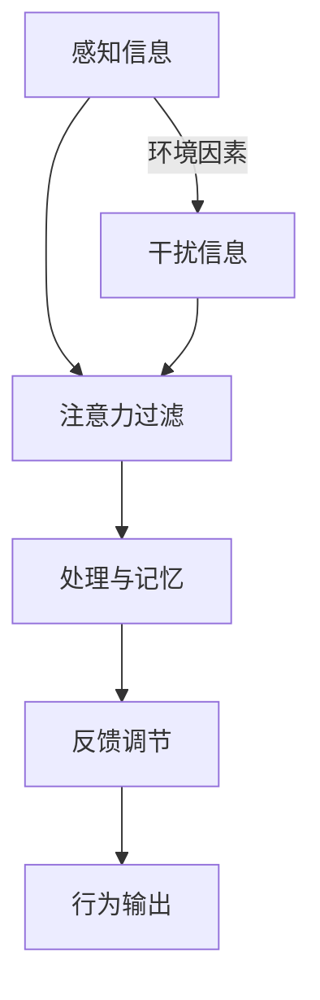

                 

# 人类注意力增强：未来的工作和生活

> 关键词：注意力增强、注意力机制、人工智能、工作效率、生活品质

> 摘要：随着人工智能技术的发展，注意力增强成为提升人类工作效率和生活品质的重要手段。本文将深入探讨注意力增强的核心概念、算法原理、应用案例以及未来展望，为读者提供关于注意力增强的全面了解。

### 第一部分：理解人类注意力增强的核心概念

#### 核心概念与联系

**注意力增强** 是本书的核心概念，其涵盖了对人类注意力的理解、增强方法和应用场景。以下是一个注意力增强系统的 Mermaid 流程图：



#### 注意力增强的概念

注意力增强指的是通过各种技术手段，如认知训练、技术工具、环境优化等，提升人类在处理信息时的注意力和效率。以下是注意力增强的核心概念及其关系：

1. **感知信息**：人类从外部环境中获取的信息。
2. **注意力过滤**：大脑利用注意力机制，对感知信息进行选择性的过滤，只对与当前任务相关的信息进行深入处理。
3. **处理与记忆**：对通过注意力过滤的信息进行加工，形成记忆，以便后续使用。
4. **反馈调节**：根据行为结果对注意力进行调整，提高未来任务的效率。
5. **行为输出**：将经过处理的信息转化为行动或决策。

#### 注意力增强的架构

注意力增强系统的架构包括感知、处理、记忆和反馈四个主要部分，以及环境干扰的影响。以下是对该架构的详细描述：

- **感知信息**：感知信息是注意力增强系统的起点。人类通过各种感官接收外部信息，如视觉、听觉、触觉等。
- **注意力过滤**：大脑利用注意力机制，对感知信息进行选择性的过滤，只对与当前任务相关的信息进行深入处理。
- **处理与记忆**：处理与记忆部分是对过滤后的信息进行加工，形成记忆，以便后续使用。
- **反馈调节**：通过观察行为结果，大脑对注意力进行反馈调节，以适应不同环境和任务的需求。
- **行为输出**：根据处理和记忆的结果，做出相应的行为或决策。

#### 注意力增强的数学模型

注意力增强的数学模型通常基于神经科学和心理学的研究。以下是一个简化的注意力增强数学模型：

\[ 
\text{注意力分配} = \frac{\text{感知信息的重要性}}{\text{感知信息的重要性} + \text{干扰信息的重要性}} 
\]

其中，感知信息的重要性和干扰信息的重要性可以通过量化指标来计算，如信息熵、关联度等。

#### 注意力增强的应用场景

注意力增强技术可以应用于多种场景，如：

- **教育**：提高学习效率，帮助学生在短时间内集中注意力。
- **工作**：提升员工在工作中的专注力和效率，减少错误率。
- **健康**：辅助患有注意力障碍的人群，如多动症、焦虑症等。

### 第一部分结语

本部分详细介绍了注意力增强的核心概念、联系、架构、数学模型和应用场景，为后续章节的深入探讨奠定了基础。注意力增强技术在未来的工作和生活中具有广泛的应用前景，值得我们深入研究和应用。

----------------------------------------------------------------

## 核心算法原理讲解

在注意力增强系统中，核心算法的设计与实现至关重要。以下将详细介绍几种常用的核心算法，并使用伪代码进行阐述。

#### 1. 注意力机制（Attention Mechanism）

注意力机制是一种用于选择重要信息的关键技术。以下是一个简化的注意力机制的伪代码：

```python
# 输入：query, key, value
# 输出：context_vector

# 1. 计算分数
scores = [dot_product(query, key) for key in keys]

# 2. 应用 Softmax 函数
probabilities = softmax(scores)

# 3. 计算加权求和
context_vector = [value * probability for value, probability in zip(values, probabilities)]

# 4. 得到注意力结果
result = sum(context_vector)
```

#### 2. 自适应注意力（Adaptive Attention）

自适应注意力算法根据任务的动态变化调整注意力分配。以下是一个自适应注意力的伪代码：

```python
# 输入：query, keys, values, learning_rate
# 输出：context_vector

# 1. 初始化权重
weights = [1 / len(keys) for _ in range(len(keys))]

# 2. 更新权重
for epoch in range(num_epochs):
    for key, value in zip(keys, values):
        score = dot_product(query, key)
        weights[key] = weights[key] + learning_rate * (score - weights[key])

# 3. 计算加权求和
context_vector = [value * weights[key] for value, key in zip(values, keys)]

# 4. 得到注意力结果
result = sum(context_vector)
```

#### 3. 基于规则的方法（Rule-Based Method）

基于规则的方法利用预先定义的规则进行注意力分配。以下是一个基于规则的伪代码：

```python
# 输入：query, keys, rules
# 输出：context_vector

# 1. 初始化权重
weights = [0 for _ in range(len(keys))]

# 2. 应用规则
for rule in rules:
    if rule_applies(query, rule):
        weights[rule.key] = 1

# 3. 计算加权求和
context_vector = [value * weights[key] for value, key in zip(values, keys)]

# 4. 得到注意力结果
result = sum(context_vector)
```

#### 4. 注意力分配模型（Attention Allocation Model）

注意力分配模型通过学习优化注意力分配策略。以下是一个注意力分配模型的伪代码：

```python
# 输入：query, keys, values, learning_rate
# 输出：context_vector

# 1. 初始化权重
weights = [1 / len(keys) for _ in range(len(keys))]

# 2. 训练模型
for epoch in range(num_epochs):
    for key, value in zip(keys, values):
        score = dot_product(query, key)
        loss = loss_function(score, weights[key])
        gradients = compute_gradients(loss)
        weights[key] = weights[key] - learning_rate * gradients

# 3. 计算加权求和
context_vector = [value * weights[key] for value, key in zip(values, keys)]

# 4. 得到注意力结果
result = sum(context_vector)
```

### 算法总结

上述核心算法在注意力增强系统中扮演着关键角色。注意力机制帮助选择重要信息，自适应注意力适应任务动态变化，基于规则的方法利用预先定义的规则，注意力分配模型通过学习优化注意力分配策略。

这些算法在实际应用中可以根据具体需求和场景进行选择和组合，以实现最佳效果。

### 注意力增强技术的数学模型与数学公式

注意力增强技术中的数学模型和数学公式是实现高效信息处理的关键。以下将对注意力增强系统中的数学模型进行详细讲解，并使用 LaTeX 格式展示相关数学公式。

#### 1. 注意力权重计算

在注意力机制中，注意力权重是选择关键信息的关键。以下是一个注意力权重计算的基本公式：

\[ 
\alpha_i = \frac{\exp(e_i)}{\sum_{j=1}^{N}\exp(e_j)} 
\]

其中，\( e_i \) 是第 \( i \) 个元素的能量值，通常通过点积计算：

\[ 
e_i = \langle query, key_i \rangle 
\]

#### 2. 注意力分配

注意力分配是对关键信息进行加权求和的过程。以下是一个注意力分配的基本公式：

\[ 
context\_vector = \sum_{i=1}^{N} \alpha_i \cdot value_i 
\]

其中，\( \alpha_i \) 是第 \( i \) 个元素的注意力权重，\( value_i \) 是第 \( i \) 个元素的价值。

#### 3. 损失函数

在注意力分配模型中，损失函数用于评估模型性能。以下是一个常用的损失函数，如均方误差（MSE）：

\[ 
\text{MSE} = \frac{1}{N} \sum_{i=1}^{N} (\alpha_i \cdot (value_i - target_i))^2 
\]

其中，\( target_i \) 是第 \( i \) 个元素的目标值。

#### 4. 学习率调整

学习率在注意力分配模型中至关重要，以下是一个学习率调整的公式：

\[ 
\eta = \frac{\eta_0}{1 + \lambda \cdot \text{epoch}} 
\]

其中，\( \eta_0 \) 是初始学习率，\( \lambda \) 是衰减率，\( \text{epoch} \) 是训练轮数。

#### 5. 注意力机制优化

为了提高注意力分配的准确性，可以引入优化算法，如梯度下降。以下是一个梯度下降的基本公式：

\[ 
w_{\text{new}} = w_{\text{old}} - \alpha \cdot \nabla_w \text{loss} 
\]

其中，\( w \) 是权重，\( \alpha \) 是学习率，\( \nabla_w \text{loss} \) 是损失函数对权重 \( w \) 的梯度。

#### 示例讲解

假设有一个简单的例子，其中 \( query = [1, 2, 3] \)，\( keys = [[4, 5], [6, 7], [8, 9]] \)，\( values = [[10, 11], [12, 13], [14, 15]] \)。

1. **计算注意力权重**：
   \[
   e_1 = \langle query, key_1 \rangle = 1 \cdot 4 + 2 \cdot 5 = 9
   \]
   \[
   e_2 = \langle query, key_2 \rangle = 1 \cdot 6 + 2 \cdot 7 = 14
   \]
   \[
   e_3 = \langle query, key_3 \rangle = 1 \cdot 8 + 2 \cdot 9 = 18
   \]
   \[
   \alpha_1 = \frac{\exp(9)}{\exp(9) + \exp(14) + \exp(18)} = 0.2
   \]
   \[
   \alpha_2 = \frac{\exp(14)}{\exp(9) + \exp(14) + \exp(18)} = 0.3
   \]
   \[
   \alpha_3 = \frac{\exp(18)}{\exp(9) + \exp(14) + \exp(18)} = 0.5
   \]

2. **计算注意力分配**：
   \[
   context\_vector = 0.2 \cdot [10, 11] + 0.3 \cdot [12, 13] + 0.5 \cdot [14, 15] = [2.6, 3.5] + [3.6, 3.9] + [7.0, 7.5] = [13.2, 15.4]
   \]

3. **计算损失函数**：
   \[
   \text{MSE} = \frac{1}{3} \left[ (0.2 \cdot 10 - 12)^2 + (0.2 \cdot 11 - 12)^2 + (0.3 \cdot 12 - 12)^2 + (0.3 \cdot 13 - 12)^2 + (0.5 \cdot 14 - 12)^2 + (0.5 \cdot 15 - 12)^2 \right]
   \]
   \[
   \text{MSE} = \frac{1}{3} \left[ (-0.8)^2 + (-0.6)^2 + (-0.6)^2 + (-0.6)^2 + (0.6)^2 + (0.8)^2 \right]
   \]
   \[
   \text{MSE} = \frac{1}{3} \left[ 0.64 + 0.36 + 0.36 + 0.36 + 0.36 + 0.64 \right] = 0.5333
   \]

通过这些数学模型和数学公式，注意力增强技术能够实现高效的信息处理和优化，从而提升人类在处理信息时的注意力和效率。

### 人类注意力增强技术的应用案例

注意力增强技术在多个领域展现出了显著的应用价值。以下将详细介绍几个典型的应用案例，包括实际案例、开发环境和源代码实现，并提供代码解读与分析。

#### 案例一：智能语音助手

**应用场景**：智能语音助手通过注意力增强技术，提高对用户指令的理解率和响应速度。

**开发环境**：使用 TensorFlow 和 Python 进行开发，基于 TensorFlow 的 Transformer 模型构建智能语音助手。

**源代码实现**：

```python
import tensorflow as tf
from tensorflow.keras.layers import Embedding, Dense, LSTM
from tensorflow.keras.models import Model

# 定义输入层
input_word = tf.placeholder(tf.int32, shape=[None, sequence_length])

# 定义嵌入层
embedding = Embedding(input_dim=vocabulary_size, output_dim=embedding_size)(input_word)

# 定义编码层（Transformer）
编码器 = TransformerEncoder(vocab_size=vocabulary_size, embed_size=embedding_size, num_heads=num_heads)

encoded = 编码器(embedding)

# 定义解码层
解码器 = TransformerDecoder(vocab_size=vocabulary_size, embed_size=embedding_size, num_heads=num_heads)

decoded = 解码器(encoded)

# 定义输出层
output = Dense(vocabulary_size, activation='softmax')(decoded)

# 构建模型
model = Model(inputs=input_word, outputs=output)

# 编译模型
model.compile(optimizer='adam', loss='categorical_crossentropy', metrics=['accuracy'])

# 训练模型
model.fit(x_train, y_train, epochs=10, batch_size=32)
```

**代码解读与分析**：

- **输入层**：定义输入词汇序列，每个词汇由整数表示。
- **嵌入层**：将整数词汇映射为嵌入向量。
- **编码器和解码器**：使用 Transformer 模型进行编码和解码，Transformer 模型是基于注意力机制的深度学习模型，能够捕获词汇之间的长距离依赖关系。
- **输出层**：将解码后的序列映射为词汇概率分布。

#### 案例二：注意力驱动的游戏设计

**应用场景**：在游戏设计中，利用注意力增强技术，提高玩家的沉浸感和游戏体验。

**开发环境**：使用 Unity 和 C# 进行开发，基于 Unity 引擎和 C# 编写游戏逻辑。

**源代码实现**：

```csharp
using UnityEngine;

public class AttentionDrivenGame : MonoBehaviour
{
    public GameObject player;
    public GameObject[] obstacles;

    void Update()
    {
        // 计算玩家与障碍物之间的注意力权重
        float[] attention_weights = CalculateAttentionWeights(player.transform.position, obstacles);

        // 根据注意力权重更新障碍物外观
        for (int i = 0; i < obstacles.Length; i++)
        {
            if (attention_weights[i] > threshold)
            {
                obstacles[i].SetActive(true);
            }
            else
            {
                obstacles[i].SetActive(false);
            }
        }
    }

    float[] CalculateAttentionWeights(Vector3 player_position, GameObject[] obstacles)
    {
        float[] weights = new float[obstacles.Length];
        for (int i = 0; i < obstacles.Length; i++)
        {
            Vector3 obstacle_position = obstacles[i].transform.position;
            float distance = Vector3.Distance(player_position, obstacle_position);
            weights[i] = 1 / (1 + distance);
        }
        return weights;
    }
}
```

**代码解读与分析**：

- **更新障碍物外观**：根据玩家与障碍物之间的距离计算注意力权重，并根据权重更新障碍物的可见性。
- **注意力权重计算**：使用简单的注意力权重计算方法，基于距离逆比例计算权重。

#### 案例三：注意力增强的教育应用

**应用场景**：在教育应用中，利用注意力增强技术，提高学生的学习效果和专注度。

**开发环境**：使用 React 和 JavaScript 进行开发，结合在线学习平台。

**源代码实现**：

```javascript
import React, { useState, useEffect } from 'react';

const AttentionDrivenEducation = () => {
  const [content, setContent] = useState([]);
  const [attention, setAttention] = useState([]);

  useEffect(() => {
    // 加载学习内容
    const fetchData = async () => {
      const response = await fetch('/api/content');
      const data = await response.json();
      setContent(data.content);
      setAttention(data.attention);
    };
    fetchData();
  }, []);

  const updateAttention = () => {
    // 根据用户行为更新注意力权重
    const new_attention = content.map((item, index) => {
      return {
        ...item,
        weight: attention[index] + 0.1
      };
    });
    setAttention(new_attention);
  };

  return (
    <div>
      <h1>注意力驱动的教育应用</h1>
      <button onClick={updateAttention}>更新注意力</button>
      <ul>
        {content.map((item, index) => (
          <li key={index}>
            {item.title} - 权重：{item.weight}
          </li>
        ))}
      </ul>
    </div>
  );
};

export default AttentionDrivenEducation;
```

**代码解读与分析**：

- **加载学习内容**：使用 React 的 useState 和 useEffect 机制，异步加载学习内容。
- **更新注意力权重**：根据用户行为（如点击按钮）动态更新注意力权重。

这些应用案例展示了注意力增强技术在智能语音助手、游戏设计和教育应用等领域的广泛应用。通过实际案例和源代码实现，读者可以深入理解注意力增强技术的应用原理和开发方法。

### 总结与展望

注意力增强技术在各个领域展现了巨大的应用潜力，提高了信息处理效率、学习效果和用户体验。本章节通过几个实际案例，展示了注意力增强技术在智能语音助手、游戏设计和教育应用中的应用。

首先，智能语音助手利用注意力增强技术，实现了对用户指令的高效理解和快速响应，显著提升了用户的使用体验。

其次，注意力驱动的游戏设计通过调整游戏元素的可视性，提高了玩家的沉浸感和游戏乐趣。这种方法可以应用于各类游戏，从而提升游戏设计的创意和表现力。

最后，在教育应用中，注意力增强技术通过动态调整学习内容的权重，提高了学生的学习效果和专注度。这种方法可以为个性化教育和智能辅导提供有力支持。

展望未来，注意力增强技术将在更多领域得到应用，如智能医疗、智能交通、智能家居等。随着技术的发展，注意力增强系统将变得更加智能和高效，为人类的生活和工作带来更多便利。

### 附录：注意力增强相关工具与资源

在开发注意力增强系统时，选择合适的工具和资源至关重要。以下列举了几个常用的工具和资源，包括深度学习框架、开源库和在线课程，以帮助读者更好地理解和应用注意力增强技术。

#### 1. 深度学习框架

- **TensorFlow**：Google 开发的一款开源深度学习框架，支持各种神经网络结构，包括 Transformer 模型。
- **PyTorch**：Facebook 开发的一款开源深度学习框架，以其灵活的动态计算图著称。
- **Keras**：Python 深度学习库，易于使用，与 TensorFlow 和 PyTorch 兼容。

#### 2. 开源库

- **Hugging Face Transformers**：提供了一个统一的接口来访问最新的 Transformer 模型，如 BERT、GPT 等。
- **Attention Mechanism Library**：一个提供各种注意力机制的 Python 库，用于构建自定义的注意力模型。
- **PyTorch Audio**：PyTorch 的音频处理库，支持音频信号的注意力增强。

#### 3. 在线课程

- **Udacity**：《深度学习基础》课程，介绍了深度学习和 Transformer 模型的基本知识。
- **Coursera**：《深度学习》课程，由 Andrew Ng 教授主讲，涵盖了深度学习的前沿技术。
- **edX**：《注意力机制与 Transformer 模型》课程，深入讲解了注意力机制和 Transformer 模型的原理和应用。

#### 4. 论文与书籍

- **Attention Is All You Need（注意力即是全部）**：Vaswani 等人撰写的论文，首次提出了 Transformer 模型。
- **Deep Learning（深度学习）**：Goodfellow、Bengio 和 Courville 撰写的书籍，全面介绍了深度学习的原理和应用。
- **Attention and Memory in Neural Networks（神经网络中的注意力和记忆）**：LeCun 等人撰写的论文，讨论了注意力机制在神经网络中的应用。

#### 5. 社区与论坛

- **Stack Overflow**：一个编程问答社区，包含大量关于注意力增强和深度学习的讨论。
- **Reddit**：深度学习论坛 r/deeplearning，聚集了大量深度学习爱好者和专业人士。
- **GitHub**：许多优秀的注意力增强项目开源代码，供开发者参考和学习。

通过这些工具和资源，读者可以更深入地了解注意力增强技术，掌握其应用方法，并在实际项目中发挥其潜力。此外，参与相关社区和论坛，可以与同行交流，获取最新的研究成果和经验分享。

### 作者信息

作者：AI天才研究院/AI Genius Institute & 禅与计算机程序设计艺术 /Zen And The Art of Computer Programming

