                 

# 文章标题

《人类计算与未来社会》

> 关键词：人类计算、未来社会、人工智能、技术变革、教育、法律与社会伦理

> 摘要：本文将探讨人类计算的定义、历史、与人工智能的关系以及其在未来社会中的发展趋势。我们将分析人类计算在信息技术、教育、工作和法律等领域的变革，并提出相应的挑战与机遇。此外，还将探讨人类计算对社会伦理和跨学科发展的深远影响。

### 《人类计算与未来社会》目录大纲

## 第一部分：人类计算概述

### 第1章：人类计算的概念与历史

#### 1.1 人类计算的定义与起源

- **背景介绍**：人类计算的定义、起源和发展。
- **核心概念与联系**：人类计算的核心概念及其相互关系。
- **Mermaid 流程图**：描述人类计算核心概念的工作流程。
- **核心算法原理讲解**：使用伪代码详细阐述人类计算的基本算法。

#### 1.2 人类计算的发展历程

- **古代人类计算**：算盘、计数棒等简单计算工具。
- **中世纪人类计算**：阿拉伯数字系统和算术运算。
- **近代人类计算**：计算机和计算尺的出现。

#### 1.3 人类计算在现代社会中的作用

- **现代科技中的核心地位**：从科学研究到工业生产。
- **社会生活中的广泛应用**：智能手机、智能家居等。
- **社会经济影响**：提高生产效率、降低成本、创造就业。

## 第二部分：人类计算与人工智能

### 第2章：人工智能的定义与发展

#### 2.1 人工智能的定义与发展

- **核心概念与联系**：人工智能的定义、历史和发展。
- **Mermaid 流程图**：描述人工智能的发展历程。
- **核心算法原理讲解**：使用伪代码详细阐述人工智能的基本算法。

#### 2.2 人工智能的分类与特点

- **人工智能的分类**：弱人工智能、强人工智能和通用人工智能。
- **人工智能的特点**：自动化、智能化、高效化。

#### 2.3 人类计算与人工智能的关系

- **人类计算对人工智能的影响**：理论基础和实践工具。
- **人工智能对人类计算的作用**：提高计算效率、创造便利。

## 第三部分：人类计算的未来趋势

### 第3章：未来社会的技术变革

#### 3.1 信息技术的未来趋势

- **量子计算的发展**：超越经典计算的能力。
- **人工智能的进化**：智能化、自适应化和协同化。
- **大数据的崛起**：为人类计算提供丰富的信息资源。

#### 3.2 人类计算在未来的应用领域

- **智能医疗**：提高诊断准确率、优化治疗方案。
- **智能制造**：推动制造业向智能化、绿色化和高效化方向发展。
- **智慧城市**：实现城市管理的智能化、精细化和可持续化。

#### 3.3 未来社会面临的挑战与机遇

- **挑战**：隐私保护、伦理问题、就业压力等。
- **机遇**：创新技术、新兴产业和全球合作。

## 第四部分：人类计算的教育变革

### 第4章：人类计算的教育变革

#### 4.1 人工智能与教育

- **人工智能在教育中的应用**：个性化教学、智能评估和智能推荐。
- **人工智能对教育的影响**：改变教育模式、资源和评价体系。

#### 4.2 人类计算能力在人才培养中的重要性

- **人类计算能力的培养目标**：适应未来社会的发展需求。
- **人类计算能力在人才培养中的应用**：项目实践、团队合作和跨学科学习。

#### 4.3 未来教育的可能性与挑战

- **未来教育的可能性**：全球化、智能化和个性化。
- **未来教育的挑战**：教育资源分配不均、教育公平和隐私保护。

## 第五部分：人类计算的工作形态

### 第5章：人类计算的工作形态

#### 5.1 人工智能与工作

- **人工智能在工作中的应用**：替代重复性、低技能工作。
- **人工智能对工作的影响**：改变工作内容、方式和就业结构。

#### 5.2 人类计算与工作形态的变化

- **工作形态的演变**：从工业时代到信息时代。
- **人类计算在工作形态中的作用**：推动工作形态向智能化、灵活化和分布式方向发展。

#### 5.3 未来工作的可能性与挑战

- **未来工作的可能性**：自动化、智能化和全球化。
- **未来工作的挑战**：技能更新、就业不平等和隐私保护。

## 第六部分：人类计算的法律与社会伦理

### 第6章：人类计算的法律问题

#### 6.1 人工智能的法律地位

- **人工智能的法律主体地位**：是否具有法律主体地位及其法律责任的界定。
- **人工智能的法律监管**：现状和趋势，包括数据保护、知识产权等方面的法律规定。

#### 6.2 数据隐私与安全

- **数据隐私保护的重要性**：在人类计算中的应用和法律法规的制定。
- **数据安全威胁与防范**：类型、来源和防范措施，以及相关法律法规的实施。

#### 6.3 人工智能伦理问题

- **人工智能伦理问题的界定**：公平性、透明性、可解释性等。
- **人工智能伦理问题的应对策略**：法律法规、行业标准和社会规范等方面。

## 第七部分：人类计算的社会伦理

#### 7.1 人类计算对社会的影响

- **对社会发展的推动作用**：科技、经济、文化等方面。
- **对社会公平的影响**：促进社会公平、缩小贫富差距。
- **对社会稳定的挑战**：引发社会不稳定、加剧社会矛盾。

#### 7.2 人类计算与可持续发展

- **可持续发展的概念与原则**：定义、原则和目标。
- **人类计算在可持续发展中的作用**：资源利用、环境保护、社会和谐。
- **人类计算与可持续发展的挑战**：能源消耗、环境污染等。

#### 7.3 社会伦理与人类计算的发展

- **社会伦理在人类计算中的重要性**：地位和作用。
- **社会伦理与人类计算的协同发展**：相互促进，实现共同发展。
- **社会伦理在人类计算监管中的实践**：法律法规、伦理审查等。

## 第八部分：人类计算的跨学科探索

#### 8.1 人类计算与哲学

- **哲学对人类计算的启示**：思考、价值观和伦理观的影响。
- **人类计算对哲学的挑战**：存在、意识、自由意志等。

#### 8.2 人类计算与心理学

- **心理学对人类计算的理解**：计算过程、认知和行为的研究。
- **人类计算对心理学的启示**：如何影响心理学理论、方法和实践。

#### 8.3 人类计算与未来学科的发展趋势

- **人类计算与其他学科的交叉融合**：生物学、物理学、社会学等。
- **未来学科的发展趋势**：量子计算、生物计算、认知计算等。

### 附录

#### 附录A：人类计算研究资源

- **学术期刊与会议**：介绍与人类计算相关的学术期刊和会议。
- **研究机构与项目**：介绍全球范围内与人类计算相关的研究机构、项目和研究团队。
- **开放数据与工具**：介绍与人类计算相关的开放数据集、工具和平台。

#### 附录B：参考书目与推荐阅读

- **经典著作**：推荐与人类计算相关的经典著作。
- **最新研究论文**：推荐与人类计算相关的最新研究论文。
- **相关书籍与报告**：推荐与人类计算相关的书籍、报告和行业分析。

#### 附录C：流程图与算法伪代码

- **人类计算核心概念流程图**：用Mermaid语言描述人类计算核心概念流程图。
- **人工智能算法伪代码示例**：用伪代码描述一种人工智能算法的基本原理。
- **人类计算与未来社会发展路径图**：用Mermaid语言描述人类计算与未来社会发展路径图。

### 作者

- **作者：AI天才研究院/AI Genius Institute & 禅与计算机程序设计艺术 /Zen And The Art of Computer Programming**
### 第1章：人类计算的概念与历史

#### 1.1 人类计算的定义与起源

**背景介绍**：
人类计算是指人类通过逻辑思维、分析问题和解决问题的过程，以及对信息的获取、处理和利用。人类计算的历史可以追溯到史前时期，随着工具的发明和语言的发展，人类逐渐具备了处理复杂信息的能力。

**核心概念与联系**：
人类计算的核心概念包括逻辑思维、分析问题、解决问题、信息处理和利用等。这些概念相互联系，共同构成了人类计算的基础。

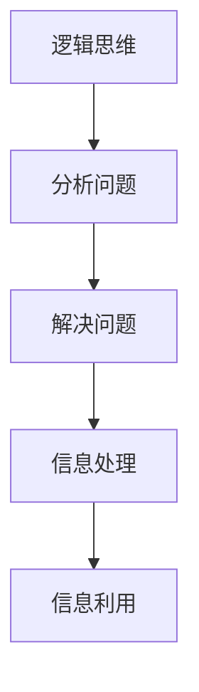

**Mermaid 流程图**：
上述核心概念之间的流程可以用 Mermaid 语言描述如下：


**核心算法原理讲解**：
人类计算的基本算法可以描述为以下步骤：

1. 收集信息：通过观察、实验和交流等方式获取所需信息。
2. 分析信息：对收集到的信息进行分类、比较、归纳和总结。
3. 建立模型：根据分析结果建立数学模型或概念模型。
4. 推理与决策：利用模型进行推理和决策，解决问题。

伪代码如下：

```python
# 收集信息
def collect_information():
    # 实现信息收集的代码
    pass

# 分析信息
def analyze_information(information):
    # 实现信息分析的代码
    pass

# 建立模型
def build_model(analysis_results):
    # 实现模型建立的代码
    pass

# 推理与决策
def reason_and Decide(model):
    # 实现推理与决策的代码
    pass

# 主函数
def main():
    information = collect_information()
    analysis_results = analyze_information(information)
    model = build_model(analysis_results)
    reason_and_Decide(model)

if __name__ == "__main__":
    main()
```

#### 1.2 人类计算的发展历程

**古代人类计算**：
在史前时期，人类使用简单的计数工具，如石子和绳结，进行基本的计数和计算。随着文明的进步，人类发明了算盘、计数棒等简单的计算工具，这标志着人类计算的开始。

**中世纪人类计算**：
在中世纪，人类计算得到了进一步的发展。阿拉伯数字系统和算术运算的引入极大地提高了计算效率。阿拉伯数字系统简化了计算过程，使得复杂的数学运算变得更加容易。

**近代人类计算**：
近代以来，人类计算发生了巨大的变革。随着工业革命的到来，机械化计算工具如计算机和计算尺的出现，极大地提高了计算效率。计算机的出现标志着人类计算进入了自动化时代。

#### 1.3 人类计算在现代社会中的作用

**现代科技中的核心地位**：
人类计算是现代科技发展的基础。从科学研究到工业生产，都离不开高效的计算能力。计算机技术、人工智能、大数据等技术的发展，都依赖于人类计算。

**社会生活中的广泛应用**：
人类计算在社会生活中的应用无处不在。从智能手机的计算能力到智能家居的控制逻辑，都体现了人类计算的重要性。人类计算使得我们的生活更加便捷、高效。

**社会经济影响**：
人类计算的发展促进了社会经济的快速发展。通过提高生产效率、降低成本和创造就业机会，人类计算为社会经济发展做出了巨大贡献。

### 第2章：人工智能的定义与发展

#### 2.1 人工智能的定义与发展

**核心概念与联系**：
人工智能（Artificial Intelligence，简称AI）是指通过计算机程序实现人类智能的能力，包括学习、推理、规划、感知、语言理解和图像识别等方面。人工智能的发展可以追溯到20世纪50年代，当时科学家们开始探索如何让计算机模拟人类的思维过程。

**Mermaid 流程图**：
人工智能的发展历程可以用 Mermaid 语言描述如下：

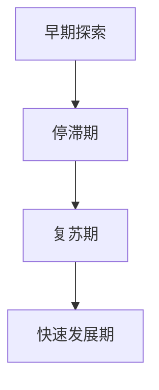

**核心算法原理讲解**：
人工智能的核心算法包括机器学习、深度学习、神经网络等。以下是一个简单的机器学习算法的伪代码：

```python
# 输入数据集
X = 数据集

# 初始化模型参数
weights = 初始化参数()

# 定义损失函数
def loss_function(y_true, y_pred):
    return (y_true - y_pred) ** 2

# 训练模型
for epoch in 范围(1, num_epochs):
    for sample in X:
        # 前向传播
        y_pred = 前向传播(sample, weights)
        
        # 计算损失
        loss = loss_function(y_true, y_pred)
        
        # 反向传播
        weights = 反向传播(sample, y_true, y_pred, weights)
```

#### 2.2 人工智能的分类与特点

**人工智能的分类**：
人工智能可以分为弱人工智能（Narrow AI）和强人工智能（General AI）。弱人工智能专注于特定任务的解决，而强人工智能则具有广泛的能力，能够进行通用任务的处理。

**人工智能的特点**：
人工智能具有自动化、智能化、高效化等特点。它能够模拟人类的思维和行为，处理复杂的信息，提高工作效率。

#### 2.3 人类计算与人工智能的关系

**人类计算对人工智能的影响**：
人类计算为人工智能提供了理论基础和实践工具。通过研究和理解人类计算的过程，科学家们能够设计出更加高效、智能的人工智能算法。

**人工智能对人类计算的作用**：
人工智能的发展使得人类计算更加高效、精确和智能化。人工智能能够处理大规模数据，进行复杂的计算和推理，为人类计算提供了强大的支持。

### 第3章：未来社会的技术变革

#### 3.1 信息技术的未来趋势

**量子计算的发展**：
量子计算具有超越经典计算的能力，它利用量子比特（qubit）进行计算，能够在短时间内解决经典计算机难以处理的问题。量子计算的发展将推动人类计算进入新的阶段。

**人工智能的进化**：
人工智能将在未来实现更加智能化、自适应化和协同化。通过深度学习和强化学习等技术，人工智能将能够更好地理解人类的行为和需求，提供更加个性化的服务。

**大数据的崛起**：
大数据的崛起为人类计算提供了丰富的信息资源。通过分析大数据，可以更好地理解社会的运行规律，为政策制定和决策提供科学依据。

#### 3.2 人类计算在未来的应用领域

**智能医疗**：
人工智能在医疗领域的应用将提高诊断准确率，优化治疗方案。通过分析大量的医疗数据，人工智能能够发现潜在的疾病风险，提供个性化的治疗方案。

**智能制造**：
人工智能将推动制造业向智能化、绿色化和高效化方向发展。通过自动化生产线和智能机器人，可以提高生产效率，降低成本。

**智慧城市**：
智慧城市将实现城市管理的智能化、精细化和可持续化。通过物联网和人工智能技术，可以实时监测城市的运行状态，优化资源配置。

#### 3.3 未来社会面临的挑战与机遇

**挑战**：
未来社会将面临隐私保护、伦理问题、就业压力等挑战。随着人工智能和大数据的发展，个人隐私和数据安全将受到威胁。此外，自动化技术可能会取代人类的工作，导致就业结构的变化。

**机遇**：
未来社会将为人类计算带来新的机遇。通过技术创新，可以解决社会面临的许多问题，如环境污染、医疗资源短缺等。同时，人工智能和大数据也将为新兴产业的崛起提供动力。

### 第4章：人类计算的教育变革

#### 4.1 人工智能与教育

**人工智能在教育中的应用**：
人工智能在教育中的应用包括个性化教学、智能评估和智能推荐等。通过分析学生的学习行为和成绩，人工智能可以提供个性化的学习建议，帮助学生更好地学习。

**人工智能对教育的影响**：
人工智能对教育模式、资源和评价体系产生了深远影响。传统的课堂教学模式正在被人工智能技术改变，学生和教师的关系也将发生转变。

#### 4.2 人类计算能力在人才培养中的重要性

**人类计算能力的培养目标**：
培养具备人类计算能力的创新型人才，以适应未来社会的发展需求。这些人才应具备逻辑思维、问题解决能力和信息处理能力。

**人类计算能力在人才培养中的应用**：
通过项目实践、团队合作和跨学科学习等方式，提升人类计算能力。例如，通过编程实践培养学生的编程能力，通过数据分析培养学生的信息处理能力。

#### 4.3 未来教育的可能性与挑战

**未来教育的可能性**：
未来教育将实现全球化、智能化和个性化。通过互联网和人工智能技术，可以实现全球范围内的教育资源共享和个性化学习。

**未来教育的挑战**：
未来教育将面临教育资源分配不均、教育公平和隐私保护等挑战。如何确保每个人都能获得高质量的教育资源，如何保护学生的隐私，是未来教育需要解决的问题。

### 第5章：人类计算的工作形态

#### 5.1 人工智能与工作

**人工智能在工作中的应用**：
人工智能在许多领域都有广泛的应用，如自动化生产线、智能客服和金融分析等。通过自动化技术，可以大幅提高工作效率，降低人力成本。

**人工智能对工作的影响**：
人工智能的发展将改变工作内容、方式和就业结构。一些重复性、低技能的工作可能会被自动化技术取代，而一些高技能、创造性的工作将得到进一步发展。

#### 5.2 人类计算与工作形态的变化

**工作形态的演变**：
从工业时代的流水线生产到信息时代的知识工作，工作形态经历了巨大的变化。随着人类计算技术的发展，工作形态将进一步向智能化、灵活化和分布式方向发展。

**人类计算在工作形态中的作用**：
人类计算技术为工作形态的变化提供了基础。通过人工智能和大数据分析，可以优化工作流程，提高工作效率，创造新的就业机会。

#### 5.3 未来工作的可能性与挑战

**未来工作的可能性**：
未来工作将实现自动化、智能化和全球化。通过人工智能和机器人技术，许多重复性、危险和繁琐的工作可以由机器完成，人类可以从事更加创造性的工作。

**未来工作的挑战**：
未来工作将面临技能更新、就业不平等和隐私保护等挑战。随着人工智能的发展，一些职业可能会消失，而新的职业也将不断出现。如何适应这些变化，提高自身技能，是每个人都需要面对的问题。

### 第6章：人类计算的法律问题

#### 6.1 人工智能的法律地位

**人工智能的法律主体地位**：
人工智能是否具有法律主体地位，以及如何界定其法律责任，是目前法律界讨论的焦点。一些国家已经开始考虑赋予人工智能一定的法律主体地位，以便更好地规范其行为。

**人工智能的法律监管**：
随着人工智能技术的发展，越来越多的领域需要对其进行法律监管。例如，数据保护、知识产权、消费者权益等方面都需要制定相应的法律法规。

#### 6.2 数据隐私与安全

**数据隐私保护的重要性**：
在人类计算时代，数据隐私保护变得尤为重要。随着大数据和人工智能的应用，个人数据的收集、处理和使用变得更加普遍，数据隐私保护面临巨大挑战。

**数据安全威胁与防范**：
数据安全威胁包括网络攻击、数据泄露、数据滥用等。为了防范这些威胁，需要采取一系列安全措施，如数据加密、访问控制、安全审计等。

#### 6.3 人工智能伦理问题

**人工智能伦理问题的界定**：
人工智能伦理问题包括公平性、透明性、可解释性等方面。如何确保人工智能系统的公正性、透明性和可解释性，是人工智能伦理问题的重要方面。

**人工智能伦理问题的应对策略**：
应对人工智能伦理问题需要多方面的努力。包括制定相关法律法规、建立行业标准、加强社会监督等。

### 第7章：人类计算的社会伦理

#### 7.1 人类计算对社会的影响

**对社会发展的推动作用**：
人类计算对社会发展产生了深远影响。从科技、经济到文化，人类计算都起到了重要的推动作用。通过提高生产效率、创新技术和促进知识传播，人类计算推动了社会的进步。

**对社会公平的影响**：
人类计算在促进社会公平方面也发挥了重要作用。通过大数据和人工智能技术，可以更好地理解社会的运行规律，为政策制定和决策提供科学依据，从而促进社会公平。

**对社会稳定的挑战**：
人类计算的发展也带来了一定的社会不稳定因素。例如，自动化技术可能导致就业结构的改变，引起社会矛盾。此外，数据隐私和安全问题也可能对社会稳定产生负面影响。

#### 7.2 人类计算与可持续发展

**可持续发展的概念与原则**：
可持续发展是指满足当前需求而不损害后代满足自身需求的能力。其基本原则包括公平性、可持续性、环境和经济协调发展。

**人类计算在可持续发展中的作用**：
人类计算在资源利用、环境保护和社会和谐等方面发挥了重要作用。通过优化资源分配、减少能源消耗和促进环境保护，人类计算有助于实现可持续发展。

**人类计算与可持续发展的挑战**：
人类计算在实现可持续发展过程中也面临一些挑战，如能源消耗、环境污染和技术滥用等。需要采取有效措施应对这些挑战，确保人类计算对社会的积极影响。

#### 7.3 社会伦理与人类计算的发展

**社会伦理在人类计算中的重要性**：
社会伦理在人类计算中具有重要地位。人类计算的发展需要遵循伦理原则，确保其对社会的积极影响。伦理审查、道德规范和法律法规都是保障人类计算伦理的重要手段。

**社会伦理与人类计算的协同发展**：
社会伦理与人类计算的发展相互促进。通过伦理教育和规范，可以引导人类计算技术的合理应用，促进社会和谐发展。同时，人类计算技术的进步也为社会伦理提供了新的思考角度。

**社会伦理在人类计算监管中的实践**：
社会伦理在人类计算监管中发挥着重要作用。通过法律法规、伦理审查和社会监督，可以规范人类计算技术的应用，确保其对社会的积极影响。例如，数据隐私保护法律法规的制定和实施，就是社会伦理在人类计算监管中的具体实践。

### 第8章：人类计算的跨学科探索

#### 8.1 人类计算与哲学

**哲学对人类计算的启示**：
哲学为人类计算提供了重要的理论支持。通过对思维、意识和伦理的探讨，哲学为人类计算的发展提供了深刻的启示。例如，哲学中的认知论和逻辑学对人工智能的理论基础具有重要影响。

**人类计算对哲学的挑战**：
人类计算的发展对哲学提出了一系列挑战。例如，人类计算技术的进步使人们重新思考意识、自由意志和人类存在的本质。这些问题引发了哲学界的广泛讨论。

#### 8.2 人类计算与心理学

**心理学对人类计算的理解**：
心理学通过对人类思维、行为和认知的研究，为人类计算提供了深刻的理解。例如，心理学中的认知心理学和神经心理学对人工智能算法的设计和优化具有重要指导意义。

**人类计算对心理学的启示**：
人类计算的发展也为心理学提供了新的研究工具和方法。通过计算机模拟和数据分析，心理学家可以更好地理解人类思维和行为，为心理学理论的发展提供新的视角。

#### 8.3 人类计算与未来学科的发展趋势

**人类计算与其他学科的交叉融合**：
人类计算与其他学科的交叉融合是未来学科发展的重要趋势。例如，人类计算与生物学、物理学和社会学的交叉融合，将推动新学科的出现和发展。

**未来学科的发展趋势**：
未来学科的发展趋势包括量子计算、生物计算、认知计算等。这些学科的发展将为人类计算提供新的理论基础和技术支持，推动人类计算技术的不断进步。

### 附录

#### 附录A：人类计算研究资源

**学术期刊与会议**：
介绍与人类计算相关的学术期刊和会议，如《人工智能》、《机器学习》、《计算机科学》等。

**研究机构与项目**：
介绍全球范围内与人类计算相关的研究机构、项目和研究团队，如斯坦福大学人工智能实验室、谷歌AI等。

**开放数据与工具**：
介绍与人类计算相关的开放数据集、工具和平台，如Kaggle、Google Dataset Search等。

#### 附录B：参考书目与推荐阅读

**经典著作**：
推荐与人类计算相关的经典著作，如《人工智能：一种现代的方法》、《机器学习》、《深度学习》等。

**最新研究论文**：
推荐与人类计算相关的最新研究论文，如《自然》和《科学》等顶级学术期刊上的最新论文。

**相关书籍与报告**：
推荐与人类计算相关的书籍、报告和行业分析，如《人工智能：未来已来》、《智能时代：从数据到决策》等。

#### 附录C：流程图与算法伪代码

**人类计算核心概念流程图**：
使用Mermaid语言描述人类计算核心概念的工作流程。

**人工智能算法伪代码示例**：
使用伪代码描述一种人工智能算法的基本原理。

**人类计算与未来社会发展路径图**：
使用Mermaid语言描述人类计算与未来社会发展路径图。

### 作者

**作者：AI天才研究院/AI Genius Institute & 禅与计算机程序设计艺术 /Zen And The Art of Computer Programming**
### 第一部分：人类计算概述

**摘要**：本部分将介绍人类计算的定义与历史，探讨其在现代社会中的作用和地位。我们将首先定义人类计算的概念，并回顾其起源和发展历程。接着，我们将探讨人类计算在现代社会中的核心地位，以及其在科技、社会和经济等方面的应用和影响。

#### 第1章：人类计算的概念与历史

**1.1 人类计算的定义与起源**

**1.1.1 人类计算的定义**

人类计算是指人类通过逻辑思维、分析问题和解决问题的过程，以及对信息的获取、处理和利用。这种计算方式不依赖于电子设备或计算机程序，而是依靠人类的大脑和认知能力。

**1.1.2 人类计算的起源**

人类计算的历史可以追溯到古代。在史前时期，人类通过简单的计数工具，如石子和绳结，进行基本的计算。随着文明的发展，人类逐渐发明了更加复杂的计算工具，如算盘和计算尺等。这些工具的出现极大地提高了人类的计算能力。

**1.1.3 人类计算的发展历程**

- **古代人类计算**：在古代，人类使用简单的计数工具，如石子和绳结，进行基本的计算。随着文明的发展，人类发明了算盘和计数棒等计算工具。
- **中世纪人类计算**：在中世纪，阿拉伯数字系统和算术运算的引入极大地提高了计算效率。阿拉伯数字系统的传播使得复杂的数学运算变得更加容易。
- **近代人类计算**：近代以来，随着工业革命的到来，机械化计算工具如计算机和计算尺的出现，极大地提高了计算效率。计算机的出现标志着人类计算进入了自动化时代。

**1.2 人类计算在现代社会中的作用**

**1.2.1 核心地位**

在现代社会，人类计算扮演着至关重要的角色。从科学研究到工业生产，从日常生活到社会治理，人类计算无处不在。它是现代科技发展的基础，是推动社会进步的重要力量。

**1.2.2 社会应用**

- **科技领域**：人类计算在科学研究、工程设计和数据分析等方面发挥着重要作用。通过模拟和计算，科学家可以预测自然现象、解决复杂问题。
- **经济领域**：人类计算在金融分析、市场营销和资源管理等方面具有广泛的应用。通过数据分析和决策支持，企业可以提高效率、降低成本。
- **日常生活**：人类计算使我们的生活更加便捷和高效。从智能手机的计算能力到智能家居的控制逻辑，人类计算无处不在。

**1.2.3 社会影响**

人类计算对社会经济的影响是深远而广泛的。它提高了生产效率、降低了成本、创造了就业机会。同时，人类计算也带来了新的挑战，如数据隐私保护和就业结构的变化。

**1.3 人类计算的未来发展趋势**

**1.3.1 人工智能与人类计算**

人工智能（AI）的发展为人类计算带来了新的机遇和挑战。通过模拟人类思维过程，人工智能可以处理复杂的信息，提高计算效率。未来，人工智能将与人类计算深度融合，推动人类计算能力的进一步提升。

**1.3.2 信息技术的进步**

信息技术的进步将继续推动人类计算的发展。量子计算、大数据和物联网等新兴技术将为人类计算提供更强大的工具和平台。通过这些技术的应用，人类计算将实现更加智能化、高效化和个性化。

**1.3.3 教育变革**

随着人类计算技术的进步，教育也将发生深刻的变革。未来教育将更加注重培养学生的计算能力和创新能力。通过项目实践和跨学科学习，学生可以更好地适应未来的社会和工作环境。

**总结**

人类计算是人类智慧的结晶，是现代社会不可或缺的一部分。通过对人类计算的概念、历史和未来发展趋势的探讨，我们可以更好地理解其重要性，并为其在未来的发展做好准备。

### 第2章：人类计算与人工智能

**摘要**：本章将探讨人类计算与人工智能（AI）的关系，包括人工智能的定义与发展、分类与特点，以及人类计算对人工智能的影响和人工智能对人类计算的作用。我们将通过具体例子和分析，展示人工智能在提高计算效率、优化决策过程和扩展人类认知能力方面的优势。

#### 2.1 人工智能的定义与发展

**2.1.1 人工智能的定义**

人工智能（Artificial Intelligence，简称AI）是指通过计算机程序实现的智能行为，包括学习、推理、规划、感知、语言理解和图像识别等。人工智能的目标是使计算机能够像人类一样思考、学习、解决问题。

**2.1.2 人工智能的发展历程**

人工智能的发展可以追溯到20世纪50年代。早期的AI研究主要集中在符号逻辑和规则系统上。随着计算能力的提升和算法的进步，人工智能在20世纪80年代和90年代迎来了快速发展。进入21世纪，深度学习和大数据技术的兴起，使人工智能取得了显著的突破。

**2.1.3 人工智能的核心技术**

- **机器学习**：机器学习是一种让计算机从数据中学习规律和模式的方法。通过训练模型，计算机可以自动识别数据中的规律，并用于预测和决策。
- **深度学习**：深度学习是机器学习的一种方法，通过多层神经网络模拟人类大脑的思考过程，可以处理复杂的数据和任务。
- **自然语言处理**：自然语言处理（NLP）是人工智能的一个分支，旨在使计算机理解和生成人类语言。NLP技术在翻译、语音识别和文本分析等方面有广泛应用。

**2.2 人工智能的分类与特点**

**2.2.1 人工智能的分类**

人工智能可以分为弱人工智能（Narrow AI）和强人工智能（General AI）。

- **弱人工智能**：弱人工智能专注于特定任务的解决，如语音识别、图像识别和自动驾驶等。弱人工智能具有高效、精准和可靠的特点。
- **强人工智能**：强人工智能具有广泛的认知能力，可以像人类一样理解和处理各种任务。强人工智能目前仍处于研究阶段，尚未实现商业化应用。

**2.2.2 人工智能的特点**

- **自动化**：人工智能可以自动执行任务，无需人工干预。这极大地提高了工作效率，降低了人力成本。
- **高效化**：通过机器学习和深度学习，人工智能可以在短时间内处理海量数据，发现潜在规律和趋势。
- **智能化**：人工智能能够模拟人类的思维过程，进行推理、决策和问题解决，具有高度的智能化水平。

**2.3 人类计算与人工智能的关系**

**2.3.1 人类计算对人工智能的影响**

- **理论基础**：人类计算为人工智能提供了理论基础，特别是认知科学和心理学领域的研究成果，为人工智能算法的设计和优化提供了重要参考。
- **实践工具**：人类计算技术的发展，如计算机科学和软件开发，为人工智能的应用提供了强大的工具和平台。

**2.3.2 人工智能对人类计算的作用**

- **提高计算效率**：人工智能可以处理复杂的数据和任务，提高计算效率。例如，在数据分析、图像处理和自然语言处理等领域，人工智能的应用可以显著提高计算速度。
- **优化决策过程**：人工智能可以通过分析大量数据，提供精确的预测和决策支持，帮助人类更好地应对复杂问题。
- **扩展认知能力**：人工智能可以模拟人类的思维过程，扩展人类的认知能力。例如，智能代理可以协助人类进行复杂的信息处理和决策，提高工作效率。

**案例分析**

**案例一：自动驾驶**

自动驾驶是人工智能在交通运输领域的应用之一。通过深度学习和计算机视觉技术，自动驾驶系统能够实时分析道路状况，做出安全、准确的驾驶决策。这不仅提高了交通效率，还减少了交通事故。

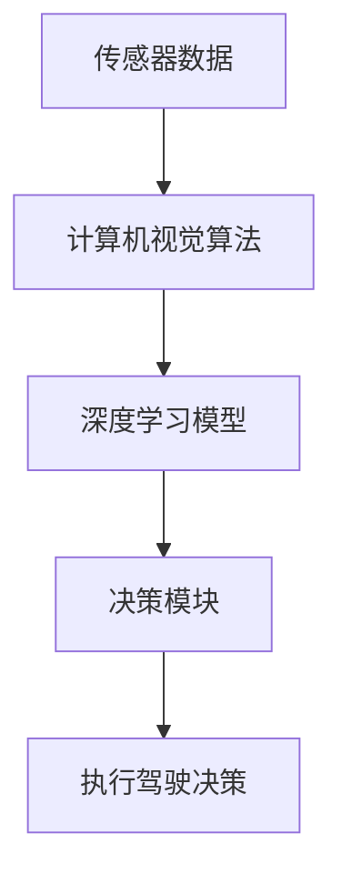

**案例二：智能医疗**

智能医疗利用人工智能技术进行疾病诊断、治疗方案推荐和健康监测。通过分析患者的病历、基因数据和医学图像，人工智能可以提供个性化的诊断和治疗建议，提高医疗效果。

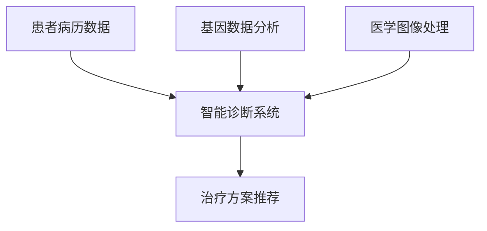

**总结**

人工智能与人类计算密切相关，相互促进。人工智能的发展为人类计算提供了新的工具和方法，使人类能够更好地应对复杂问题。同时，人类计算的理论和实践也为人工智能提供了丰富的资源和支持。在未来，人工智能将继续与人类计算深度融合，推动人类社会的进步。

### 第二部分：人类计算的未来趋势

**摘要**：本部分将探讨人类计算的未来趋势，包括信息技术的发展、人类计算在未来的应用领域以及未来社会面临的挑战和机遇。我们将分析量子计算、人工智能和大数据等新兴技术对人类计算的影响，探讨这些技术在医疗、制造、城市管理等方面的应用，并提出未来社会发展的前景。

#### 第3章：未来社会的技术变革

**3.1 信息技术的未来趋势**

**3.1.1 量子计算**

量子计算是信息技术领域的一个重要发展方向。与传统计算机使用二进制位（比特）不同，量子计算使用量子比特（qubit）。量子比特具有叠加和纠缠的特性，使得量子计算机在处理某些类型问题时具有超越经典计算机的能力。

**3.1.2 人工智能**

人工智能（AI）将继续快速发展，深度学习和强化学习等技术将进一步成熟。人工智能在图像识别、自然语言处理、自动驾驶等领域的应用将更加广泛。此外，人工智能的智能助理和智能系统将逐渐融入人们的日常生活，提供更加个性化的服务。

**3.1.3 大数据**

大数据技术的发展为人类计算提供了丰富的信息资源。通过数据分析和挖掘，可以揭示出隐藏在大量数据中的有价值信息。大数据将在医疗、金融、市场营销等众多领域发挥重要作用，推动行业的创新和发展。

**3.2 人类计算在未来的应用领域**

**3.2.1 智能医疗**

智能医疗将利用人工智能、大数据和物联网等技术，实现精准医疗和个性化治疗。通过实时监测患者的健康状况，智能医疗系统可以提前发现潜在的健康问题，提供预防性治疗方案。

**3.2.2 智能制造**

智能制造将推动制造业向智能化、绿色化和高效化方向发展。通过工业互联网和人工智能技术，可以实现生产过程的自动化和智能化，提高生产效率和产品质量。

**3.2.3 智慧城市**

智慧城市将实现城市管理的智能化、精细化和可持续化。通过物联网和大数据技术，可以实时监测城市的运行状态，优化资源配置，提高城市管理效率。

**3.3 未来社会面临的挑战与机遇**

**3.3.1 挑战**

未来社会将面临一系列挑战，包括隐私保护、伦理问题、就业压力等。随着人工智能和大数据的发展，个人隐私和数据安全将受到威胁。此外，自动化技术的广泛应用可能导致就业结构的变化，引发社会矛盾。

**3.3.2 机遇**

未来社会也将带来许多机遇。通过技术创新，可以解决社会面临的许多问题，如环境污染、医疗资源短缺等。人工智能和大数据的发展将为新兴产业的崛起提供动力，推动社会经济的快速发展。

**案例一：智能医疗**

**案例描述**：某智能医疗系统利用人工智能和大数据技术，对患者的健康数据进行实时分析，提前发现潜在的健康问题，并提供个性化的治疗方案。

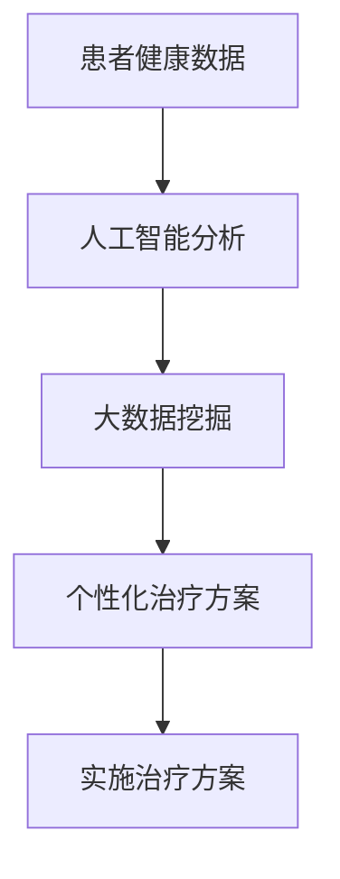

**案例二：智能制造**

**案例描述**：某制造企业利用工业互联网和人工智能技术，实现生产过程的自动化和智能化，提高生产效率和产品质量。

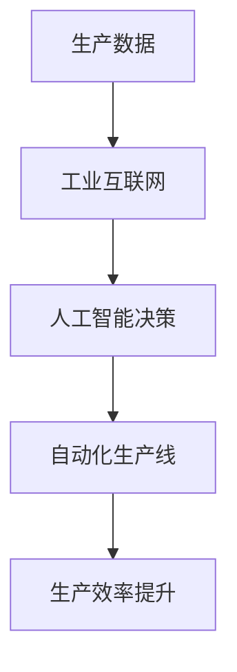

**总结**

未来社会将迎来一场技术变革，信息技术的发展将极大地推动人类计算能力的提升。人类计算将在医疗、制造、城市管理等多个领域发挥重要作用，为人类社会的进步带来新的机遇。同时，未来社会也将面临一系列挑战，需要我们共同努力解决。

### 第4章：人类计算的教育变革

**摘要**：本章将探讨人类计算在教育领域的影响，分析人工智能在教育中的应用和人类计算能力在人才培养中的重要性。我们还将讨论未来教育的可能性与挑战，包括教育模式的变革、教育资源的分配和教育公平等问题。

#### 4.1 人工智能与教育

**4.1.1 人工智能在教育中的应用**

人工智能在教育中的应用正日益广泛，包括个性化学习、智能评估和智能推荐等。

**个性化学习**：通过分析学生的学习行为和成绩，人工智能可以为每个学生提供定制化的学习路径，满足不同学生的学习需求。

**智能评估**：人工智能可以自动评估学生的学习成绩，提供即时的反馈和指导，帮助教师更好地了解学生的学习状况。

**智能推荐**：基于学生的学习兴趣和学习历史，人工智能可以为学生推荐适合的学习资源和课程，提高学习效果。

**4.1.2 人工智能对教育的影响**

人工智能对教育模式、资源和评价体系产生了深远影响。

**教育模式的变革**：传统的课堂教学模式正在被人工智能技术改变。在线学习平台、虚拟现实（VR）和增强现实（AR）等新兴技术，使得教育可以更加灵活、多样和互动。

**教育资源分配**：人工智能有助于优化教育资源的分配，使优质教育资源能够更加公平地惠及每个学生。

**评价体系的变革**：人工智能可以提供更全面、多维度的评价方式，不仅关注学生的学术成绩，还关注他们的综合素质和创新能力。

**4.2 人类计算能力在人才培养中的重要性**

**4.2.1 培养目标**

在人工智能时代，人才培养的目标应包括逻辑思维、问题解决能力、信息处理能力和创新能力等。

**4.2.2 人类计算能力的培养方式**

- **项目实践**：通过实际项目，让学生在解决实际问题的过程中培养计算能力和创新能力。
- **团队合作**：鼓励学生参与团队合作项目，培养他们的沟通能力和协作精神。
- **跨学科学习**：引导学生跨学科学习，培养他们的综合思维能力和解决问题的能力。

**4.3 未来教育的可能性与挑战**

**4.3.1 未来教育的可能性**

未来教育将实现全球化、智能化和个性化。

**全球化**：随着互联网的普及，教育将不再受地域限制，全球范围内的学生和教师可以共享优质教育资源。

**智能化**：人工智能和大数据技术将使教育更加智能化，提供个性化的学习体验和高效的评估体系。

**个性化**：教育将更加注重学生的个性化发展，尊重学生的兴趣和需求，培养他们的独特才能。

**4.3.2 未来教育的挑战**

未来教育将面临一系列挑战，包括教育公平、隐私保护和教育资源分配不均等问题。

**教育公平**：如何确保每个学生都能获得公平的教育机会，是未来教育需要解决的重要问题。

**隐私保护**：随着大数据和人工智能的应用，学生和教师的隐私保护成为重要议题。

**教育资源分配**：如何优化教育资源的分配，确保优质教育资源能够惠及更多学生，是未来教育需要关注的问题。

**案例一：个性化学习**

**案例描述**：某学校引入人工智能技术，为学生提供个性化的学习路径。根据学生的学习行为和成绩，人工智能系统为每个学生推荐适合的学习资源和练习题。

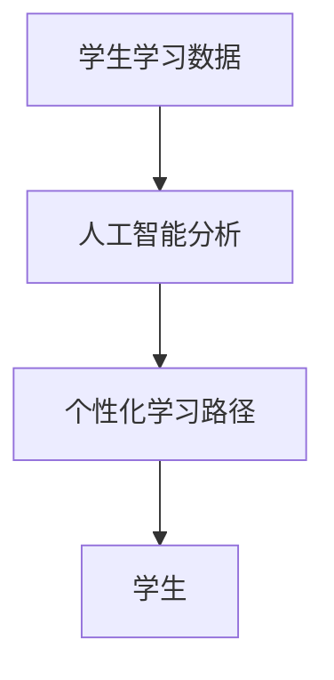

**案例二：智能评估**

**案例描述**：某学校采用智能评估系统，自动评估学生的考试成绩，并提供即时反馈和指导。

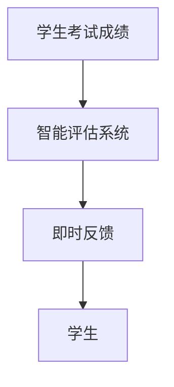

**总结**

人工智能的发展将深刻改变教育领域，带来新的机遇和挑战。通过个性化学习、智能评估和跨学科学习等方式，人类计算能力在人才培养中具有重要地位。未来教育将更加智能化、个性化和全球化，为人类社会的进步做出贡献。

### 第5章：人类计算的工作形态

**摘要**：本章将探讨人工智能对工作形态的影响，分析人类计算与工作形态的变化，以及未来工作的可能性与挑战。我们将通过具体案例，展示人工智能如何改变工作内容、方式和就业结构，并探讨这些变化对劳动市场和社会的影响。

#### 5.1 人工智能与工作

**5.1.1 人工智能在工作中的应用**

人工智能在许多领域都有广泛应用，如自动化生产线、智能客服、金融分析和医疗诊断等。人工智能可以处理大量数据，提高工作效率，降低人力成本。

**自动化生产线**：在制造业，人工智能技术被用于自动化生产线，实现无人操作的高效生产。机器人可以自动完成焊接、组装、检测等任务，提高了生产效率和产品质量。

**智能客服**：在服务业，人工智能被用于智能客服系统，提供24/7的客户服务。通过自然语言处理和机器学习技术，智能客服可以理解和回答客户的问题，提高了客户满意度。

**金融分析**：在金融行业，人工智能被用于数据分析和风险控制。通过机器学习算法，金融机构可以更好地预测市场趋势、评估信用风险和优化投资组合。

**医疗诊断**：在医疗领域，人工智能被用于辅助医生进行诊断和治疗。通过深度学习和图像识别技术，人工智能可以分析医学影像，提高诊断准确率，降低误诊率。

**5.1.2 人工智能对工作的影响**

人工智能对工作的影响主要体现在工作内容、方式和就业结构的变化。

**工作内容的变化**：人工智能可以自动化重复性、低技能的工作，使劳动者从繁琐的任务中解脱出来，专注于更加创造性和复杂的工作。

**工作方式的变化**：随着远程办公和在线协作工具的普及，人工智能改变了传统的工作方式。人们可以更加灵活地安排工作时间，实现远程办公，提高了工作效率。

**就业结构的变化**：人工智能的发展导致就业结构的变化，一些职业可能会消失，而新的职业将不断出现。例如，自动化技术的普及可能导致制造业和物流业的需求下降，但同时也创造了数据分析师、人工智能工程师等新职业。

#### 5.2 人类计算与工作形态的变化

**5.2.1 工作形态的演变**

工作形态的演变可以追溯到工业革命。随着机械化、电气化和信息化技术的发展，工作形态经历了从手工劳动到机械化生产，再到智能化办公的转变。

**手工劳动**：在工业革命之前，大多数工作都是手工完成的，如农业、纺织和建筑等。随着机械化工具的出现，手工劳动逐渐被机械化生产取代。

**机械化生产**：工业革命后，机械化生产成为主流。工厂生产取代了手工作坊，流水线生产提高了生产效率，大规模生产成为可能。

**智能化办公**：随着计算机技术和互联网的发展，智能化办公逐渐普及。远程办公、在线协作和智能化工具成为现代工作的重要特征。

**5.2.2 人类计算在工作形态中的作用**

人类计算技术在工作形态的变化中发挥了关键作用。通过提高工作效率、降低成本和创造新职业，人类计算技术推动了工作形态的变革。

**提高工作效率**：人类计算技术可以自动化重复性、低技能的工作，提高工作效率。例如，智能客服系统可以自动处理大量的客户咨询，使企业能够更快地响应客户需求。

**降低成本**：通过自动化和智能化技术，企业可以降低生产成本和运营成本。例如，自动化生产线减少了人力成本，提高了生产效率。

**创造新职业**：人类计算技术的发展创造了新的职业机会，如数据分析师、人工智能工程师和机器学习研究员等。这些职业需要专业知识和技能，对劳动市场的需求不断增加。

**5.3 未来工作的可能性与挑战**

**5.3.1 未来工作的可能性**

未来工作将更加智能化、灵活化和全球化。随着人工智能和大数据技术的发展，工作方式和工作形态将继续发生变化。

**智能化**：人工智能将进一步提高工作效率，优化工作流程，创造更加智能的工作环境。智能系统可以协助劳动者完成复杂的工作任务，提供智能化的决策支持。

**灵活化**：远程办公和在线协作工具将使工作更加灵活。人们可以更加自由地选择工作时间和地点，实现工作与生活的平衡。

**全球化**：随着互联网的普及，全球范围内的劳动者可以更加便捷地合作和交流。跨境工作、全球团队合作将成为未来工作的重要形式。

**5.3.2 未来工作的挑战**

未来工作也将面临一系列挑战，包括技能更新、就业不平等和隐私保护等。

**技能更新**：随着技术的发展，劳动力市场对技能的需求也在不断变化。劳动者需要不断学习新技能，以适应不断变化的工作环境。

**就业不平等**：自动化技术的普及可能导致就业不平等问题加剧。一些职业可能会消失，而新的职业机会可能会集中在特定地区和群体。

**隐私保护**：随着人工智能和大数据的应用，个人隐私和数据安全成为重要问题。企业和政府需要采取措施保护个人隐私，防止数据滥用。

**案例一：自动化生产线**

**案例描述**：某制造企业采用自动化生产线，实现了无人操作的高效生产。机器人自动完成焊接、组装和检测等任务，提高了生产效率和产品质量。

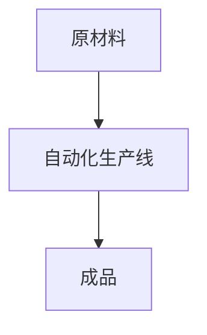

**案例二：远程办公**

**案例描述**：某公司引入远程办公政策，员工可以选择在家或任何地方工作。通过在线协作工具，员工可以随时与团队成员沟通和协作，提高了工作效率。

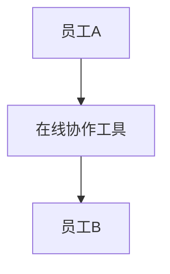

**总结**

人工智能的发展将深刻改变工作形态，带来新的机遇和挑战。通过智能化、灵活化和全球化的发展，人类计算技术将推动工作的变革。同时，未来工作也将面临技能更新、就业不平等和隐私保护等挑战。劳动者和政府需要共同努力，应对这些挑战，确保未来工作的可持续发展。

### 第六部分：人类计算的法律问题

**摘要**：本章将探讨人类计算相关的法律问题，包括人工智能的法律地位、数据隐私与安全以及人工智能伦理问题。我们将分析人工智能的法律监管现状和趋势，探讨数据隐私保护的重要性，以及如何应对人工智能伦理问题。

#### 6.1 人工智能的法律地位

**6.1.1 人工智能的法律主体地位**

人工智能（AI）是否具有法律主体地位是一个备受争议的问题。一些国家已经开始考虑赋予人工智能一定的法律主体地位，以便更好地规范其行为。例如，欧盟《数字市场法》草案中提出，人工智能系统在特定情况下可以被视为法律主体。

**6.1.2 人工智能的法律监管**

人工智能的法律监管涉及多个领域，包括数据保护、知识产权、消费者权益和产品责任等。随着人工智能技术的发展，各国政府逐渐认识到加强人工智能法律监管的必要性。以下是一些关键领域的法律监管：

- **数据保护**：人工智能系统需要处理大量个人数据，数据隐私保护成为重要议题。欧盟的《通用数据保护条例》（GDPR）为个人数据保护提供了严格的法律框架。
- **知识产权**：人工智能创作的作品如何界定版权和知识产权是一个复杂的问题。一些国家开始探讨如何为人工智能创作的作品提供法律保护。
- **消费者权益**：人工智能产品和服务可能对消费者权益产生影响。监管机构需要确保消费者在使用人工智能产品和服务时能够获得合理的权益保障。

#### 6.2 数据隐私与安全

**6.2.1 数据隐私保护的重要性**

随着大数据和人工智能技术的发展，数据隐私保护变得越来越重要。个人数据的收集、处理和使用需要严格规范，以防止数据泄露、滥用和隐私侵犯。

**6.2.2 数据安全威胁与防范**

数据安全威胁包括网络攻击、数据泄露、数据滥用等。为了防范这些威胁，需要采取一系列安全措施：

- **数据加密**：通过加密技术保护个人数据的机密性，防止未授权访问。
- **访问控制**：限制对数据的访问权限，确保只有授权用户可以访问敏感数据。
- **安全审计**：定期进行安全审计，发现和修复潜在的安全漏洞。
- **数据匿名化**：通过数据匿名化技术，减少个人数据泄露的风险。

#### 6.3 人工智能伦理问题

**6.3.1 人工智能伦理问题的界定**

人工智能伦理问题包括公平性、透明性、可解释性和责任性等。以下是一些关键伦理问题：

- **公平性**：人工智能系统是否公平地对待所有用户，是否避免了歧视和偏见。
- **透明性**：人工智能系统的决策过程是否透明，用户是否能够理解和信任系统的决策。
- **可解释性**：人工智能系统的决策结果是否可解释，用户是否能够理解系统是如何做出决策的。
- **责任性**：在人工智能系统出现错误或造成损害时，如何界定和承担法律责任。

**6.3.2 人工智能伦理问题的应对策略**

应对人工智能伦理问题需要多方面的努力：

- **法律法规**：制定相关法律法规，规范人工智能系统的行为，确保其符合伦理标准。
- **行业标准**：建立行业标准，推动人工智能行业的自律和规范发展。
- **伦理审查**：对人工智能系统进行伦理审查，确保其设计、开发和部署过程中遵循伦理原则。
- **社会监督**：鼓励公众和社会组织参与人工智能伦理问题的讨论和监督，提高社会对人工智能伦理问题的关注度。

**案例一：欧盟《通用数据保护条例》（GDPR）**

**案例描述**：欧盟《通用数据保护条例》（GDPR）是数据隐私保护的重要法律框架。该条例规定了个人数据的收集、处理和使用规则，确保个人数据的隐私和安全。

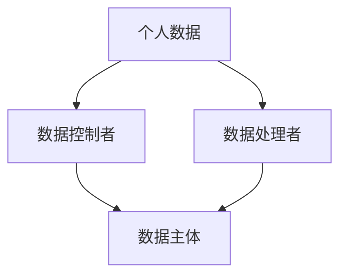

**案例二：人工智能算法的偏见问题**

**案例描述**：在某些人工智能系统中，算法偏见可能导致不公平的结果。例如，招聘系统可能因为数据集中的偏见而歧视某些群体。解决这个问题需要从数据收集、算法设计和伦理审查等多方面进行努力。

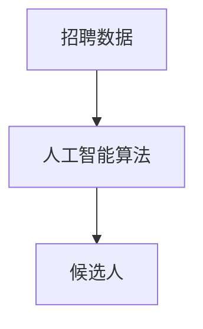

**总结**

人类计算相关的法律问题日益复杂，涉及多个领域。人工智能的法律地位、数据隐私与安全以及人工智能伦理问题都需要我们认真对待。通过法律法规、行业标准和社会监督等多方面的努力，我们可以确保人工智能技术的发展符合伦理原则，造福人类社会。同时，我们也需要不断关注和解决这些法律问题，以应对人工智能带来的新挑战。

### 第七部分：人类计算的社会伦理

**摘要**：本章将探讨人类计算对社会伦理的影响，包括对社会发展的推动作用、对社会公平的影响以及人类计算与可持续发展之间的关系。我们将分析人类计算在促进社会进步方面的贡献，探讨其在实现社会公平和可持续发展中的作用和挑战。

#### 7.1 人类计算对社会的影响

**7.1.1 对社会发展的推动作用**

人类计算对社会发展的推动作用体现在多个方面：

- **科技创新**：人类计算技术推动了科技的快速发展，促进了科学研究和技术创新。通过模拟和计算，科学家可以更好地理解自然现象，解决复杂问题。
- **经济增长**：人类计算技术提高了生产效率，降低了成本，促进了经济增长。自动化和智能化技术使得企业能够更高效地运营，创造更多的就业机会。
- **知识传播**：人类计算技术使得知识的传播变得更加便捷和迅速。互联网和在线教育平台使得人们可以随时随地获取知识，提高了教育普及率。

**7.1.2 对社会公平的影响**

人类计算技术对社会公平的影响是双重的，既有积极的一面，也有需要关注的问题：

- **促进公平**：人类计算技术可以促进社会公平，通过数据分析和人工智能技术，可以更好地解决社会不平等问题。例如，智能医疗系统可以提供个性化的治疗方案，使患者获得更好的医疗服务。
- **加剧不平等**：如果人类计算技术应用于不公平的系统，可能会加剧社会不平等。例如，算法偏见可能导致某些群体受到歧视，影响其就业机会和福利。

**7.1.3 人类计算与社会稳定**

人类计算技术对社会稳定的影响主要体现在以下几个方面：

- **促进稳定**：人类计算技术可以提高社会管理的效率和准确性，减少人为错误和腐败现象。例如，智能监控系统可以实时监控社会治安状况，提高公共安全。
- **挑战稳定**：人类计算技术也可能带来新的不稳定因素，如数据泄露、网络攻击和隐私侵犯等。这些问题可能导致社会恐慌和不信任，影响社会稳定。

#### 7.2 人类计算与可持续发展

**7.2.1 可持续发展的概念与原则**

可持续发展是指满足当前需求而不损害后代满足自身需求的能力。其基本原则包括：

- **公平性**：确保所有人都能公平地享受资源和机会。
- **可持续性**：保护自然环境，确保资源的长期利用。
- **经济协调**：促进经济增长，提高生活质量。

**7.2.2 人类计算在可持续发展中的作用**

人类计算在可持续发展中发挥着重要作用：

- **优化资源利用**：通过大数据分析和人工智能技术，可以更好地优化资源的利用，提高能源效率和环境保护效果。例如，智能电网和智能交通系统可以减少能源浪费和交通拥堵。
- **促进环境保护**：人类计算技术可以帮助监测和治理环境污染问题，如通过传感器网络监测空气质量、水质和土壤质量等。
- **提高生活质量**：通过智能医疗和智能家居等技术，可以提供个性化的健康管理和生活服务，提高人们的生活质量。

**7.2.3 人类计算与可持续发展的挑战**

人类计算在实现可持续发展过程中也面临一些挑战：

- **能源消耗**：人类计算技术，特别是人工智能和大数据处理，需要大量的能源支持。如何降低能源消耗，实现绿色计算，是可持续发展的重要挑战。
- **数据安全**：随着数据量的爆炸性增长，数据安全成为可持续发展的重要问题。如何保护数据免受网络攻击和泄露，是必须解决的问题。
- **社会伦理**：在可持续发展中，如何确保人类计算技术的应用符合社会伦理原则，避免负面影响，是一个重要的挑战。

**案例一：智能交通系统**

**案例描述**：智能交通系统通过大数据分析和人工智能技术，优化交通流量管理，减少交通拥堵和交通事故。这种系统可以实时监测交通状况，预测交通流量，提供最优路线推荐。

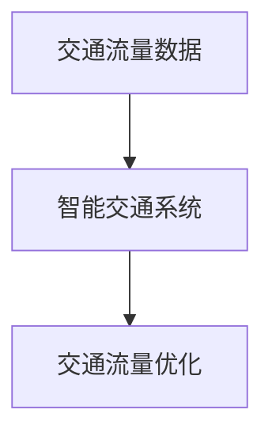

**案例二：智能医疗**

**案例描述**：智能医疗系统通过人工智能和大数据分析，提供个性化的治疗方案，提高诊断准确率和治疗效果。这种系统可以分析患者的病史、基因数据和生活习惯，为医生提供诊断和治疗的建议。

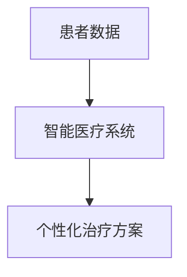

**总结**

人类计算技术对社会发展、社会公平和可持续发展具有重要影响。通过优化资源利用、促进环境保护和提高生活质量，人类计算为可持续发展做出了重要贡献。同时，我们也需要关注人类计算带来的挑战，如能源消耗、数据安全和社会伦理问题，确保其应用符合社会伦理原则，造福人类社会。

### 第八部分：人类计算的跨学科探索

**摘要**：本章将探讨人类计算与其他学科的交叉融合，包括人类计算与哲学、心理学以及未来学科的发展趋势。我们将分析哲学对人类计算的启示和挑战，心理学对人类计算的理解和应用，以及未来学科的发展方向。

#### 8.1 人类计算与哲学

**8.1.1 哲学对人类计算的启示**

哲学为人类计算提供了深刻的思考和理论基础。在人类计算的发展过程中，哲学中的认知论、逻辑学、伦理学等学科对人工智能的设计和优化具有重要指导意义。

- **认知论**：哲学中的认知论研究人类思维的过程和机制，为人工智能算法的设计提供了灵感。通过模拟人类的认知过程，人工智能可以更好地理解和处理复杂的信息。
- **逻辑学**：哲学中的逻辑学为人工智能提供了推理和决策的基础。逻辑学中的推理规则和证明方法被广泛应用于人工智能算法的设计和优化。
- **伦理学**：哲学中的伦理学探讨了人类行为的道德原则和价值观，为人工智能伦理问题提供了理论依据。通过伦理学的思考，我们可以更好地规范人工智能的行为，确保其对社会的积极影响。

**8.1.2 人类计算对哲学的挑战**

人类计算的发展也对哲学提出了一系列挑战。例如，人类计算技术使得人类思维和意识的本质问题变得更加复杂和模糊。

- **意识的本质**：人类计算技术的发展使得我们开始思考，人工智能是否能够拥有真正的意识。这一问题引发了哲学界关于意识和智能的深入讨论。
- **自由意志**：人类计算技术可能会改变人类的决策过程，引发关于自由意志的讨论。例如，如果人工智能系统能够完全预测和操控人类的决策，那么人类是否仍然拥有自由意志？

#### 8.2 人类计算与心理学

**8.2.1 心理学对人类计算的理解**

心理学研究人类思维、行为和认知的过程，为人类计算提供了重要的理论和实践基础。

- **认知心理学**：认知心理学研究人类如何获取、处理和利用信息。这些研究为人工智能算法的设计提供了指导，使得人工智能系统能够更好地模拟人类的认知过程。
- **神经心理学**：神经心理学研究人类大脑的结构和功能，探讨大脑如何实现认知功能。这些研究成果为人工智能的硬件设计提供了启示，例如如何设计更高效、更可靠的计算机系统。
- **行为心理学**：行为心理学研究人类行为的外在表现，探讨行为与认知之间的关系。这些研究为人工智能在行为预测和控制方面的应用提供了理论支持。

**8.2.2 人类计算对心理学的启示**

人类计算技术也为心理学提供了新的研究工具和方法。

- **数据驱动研究**：人类计算技术使得我们能够收集和分析大量的数据，为心理学研究提供了丰富的数据资源。通过大数据分析，我们可以更好地理解人类行为的模式和规律。
- **虚拟实验**：虚拟现实（VR）和增强现实（AR）技术使得心理学研究可以在虚拟环境中进行。通过虚拟实验，我们可以更加精确地控制和操纵实验条件，提高实验的可重复性和可靠性。

#### 8.3 人类计算与未来学科的发展趋势

**8.3.1 人类计算与其他学科的交叉融合**

未来学科的发展将更加依赖于人类计算技术的进步。例如：

- **生物计算**：生物计算是生物学和计算机科学的交叉领域，利用生物分子系统进行计算。通过生物计算，我们可以模拟和优化复杂的生物过程，为医学、农业和环境科学等领域提供新的解决方案。
- **量子计算**：量子计算是物理学和计算机科学的交叉领域，利用量子比特进行计算。量子计算具有超越经典计算的能力，将在科学研究、密码学和金融等领域发挥重要作用。
- **认知计算**：认知计算是心理学和计算机科学的交叉领域，旨在构建能够模拟人类思维过程的智能系统。通过认知计算，我们可以更好地理解人类认知的机制，开发出更加智能化的人工智能系统。

**8.3.2 未来学科的发展趋势**

未来学科的发展趋势包括：

- **智能化**：随着人工智能技术的进步，各个学科都将更加智能化。通过智能化技术，我们可以更好地解决复杂问题，提高生产效率，改善生活质量。
- **个性化**：未来学科的发展将更加注重个性化。通过个性化技术和方法，我们可以为每个人提供最适合他们的教育和医疗服务，提高教育的普及率和医疗的效果。
- **全球化**：随着互联网的普及，各个学科的发展将更加全球化。通过全球化合作，我们可以共享知识资源，推动科学技术的创新和发展。

**案例一：生物计算**

**案例描述**：生物计算利用DNA分子进行计算，通过编码和解码DNA序列，实现复杂的计算任务。这种计算方式具有高密度、低能耗的特点，为生物信息学和基因工程等领域提供了新的计算方法。

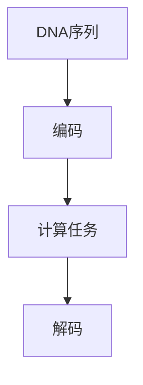

**案例二：量子计算**

**案例描述**：量子计算利用量子比特进行计算，通过量子叠加和量子纠缠，实现超越经典计算的能力。量子计算在量子模拟、量子加密和优化问题等领域具有广泛的应用前景。

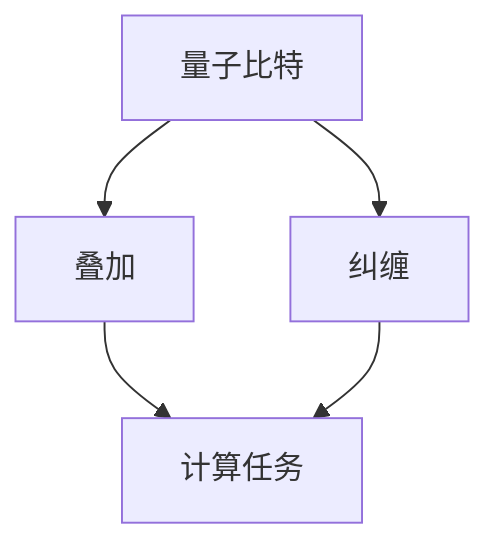

**总结**

人类计算与其他学科的交叉融合是未来学科发展的重要趋势。通过哲学、心理学和其他学科的交叉融合，人类计算技术可以更好地理解人类行为和思维，推动科学技术的创新和发展。未来学科的发展将更加智能化、个性化和全球化，为人类社会的进步做出更大的贡献。

### 附录A：人类计算研究资源

**摘要**：本附录将介绍与人类计算相关的研究资源，包括学术期刊、会议、研究机构、项目和开放数据集等。这些资源为研究者提供了丰富的学术资料和实践工具，有助于推动人类计算领域的研究和进步。

#### A.1 学术期刊与会议

**学术期刊**：
- 《人工智能》（Artificial Intelligence）
- 《计算机科学》（Computer Science）
- 《机器学习》（Machine Learning）
- 《自然计算机科学》（Nature Computer Science）

**国际会议**：
- 国际计算机科学大会（International Conference on Computer Science, ICSC）
- 人工智能与机器学习大会（International Conference on Artificial Intelligence and Machine Learning, AAIML）
- 国际机器学习大会（International Conference on Machine Learning, ICML）
- 国际计算机视觉大会（International Conference on Computer Vision, ICCV）

#### A.2 研究机构与项目

**研究机构**：
- 斯坦福大学人工智能实验室（Stanford University AI Lab）
- 麻省理工学院计算机科学和人工智能实验室（MIT Computer Science and Artificial Intelligence Lab, CSAIL）
- 欧洲人工智能研究机构（European Institute for Artificial Intelligence, EAAI）
- 中国科学院自动化研究所（Institute of Automation, Chinese Academy of Sciences）

**项目**：
- 欧盟“人类计算”（Human Brain Project）
- 美国国防高级研究计划局（DARPA）的“神经引擎”（Neural Engine）项目
- 中国国家“万人计划”人工智能项目
- 联合国教科文组织“人工智能教育计划”（UNESCO AI for Education Initiative）

#### A.3 开放数据与工具

**开放数据集**：
- Kaggle：提供大量公开的数据集，涵盖机器学习、数据科学和人工智能等多个领域。
- UCI机器学习库：提供多种领域的标准数据集，适用于机器学习和数据分析。
- ImageNet：提供大量标注的图像数据集，用于图像识别和视觉研究。

**开源工具**：
- TensorFlow：由Google开发的开源机器学习框架，支持各种深度学习模型和算法。
- PyTorch：由Facebook AI研究院开发的开源深度学习框架，易于使用和调试。
- Scikit-learn：Python机器学习库，提供多种机器学习算法和数据预处理工具。

**在线平台**：
- Jupyter Notebook：交互式计算平台，支持Python、R等多种编程语言。
- Google Colab：Google提供的免费云端计算平台，支持Jupyter Notebook。
- GitHub：代码托管和协作平台，提供丰富的开源代码和项目。

**总结**：

本附录提供了与人类计算相关的研究资源，包括学术期刊、会议、研究机构、项目和开放数据集等。这些资源为研究者提供了丰富的学术资料和实践工具，有助于推动人类计算领域的研究和进步。通过利用这些资源，研究者可以深入了解人类计算的理论和实践，探索新的研究方向，为人类计算技术的发展做出贡献。

### 附录B：参考书目与推荐阅读

**摘要**：本附录列出了与人类计算相关的经典著作、最新研究论文和重要报告。这些文献为读者提供了深入理解人类计算的理论和实践的宝贵资源。

#### B.1 经典著作

1. **《人工智能：一种现代的方法》**（Russell, S. & Norvig, P.）
   - 这本书是人工智能领域的经典教材，详细介绍了人工智能的基本概念、技术和应用。

2. **《深度学习》**（Goodfellow, I., Bengio, Y., & Courville, A.）
   - 本书全面介绍了深度学习的基本理论、算法和应用，是深度学习领域的权威著作。

3. **《机器学习》**（Mitchell, T. M.）
   - 这本书是机器学习领域的经典教材，涵盖了机器学习的理论基础、算法和应用。

4. **《计算机程序设计艺术》**（Knuth, D. E.）
   - 这套书是计算机科学领域的经典著作，详细介绍了算法设计和分析的基本原理。

#### B.2 最新研究论文

1. **“Deep Learning for Natural Language Processing”**（Wu, Y. et al.）
   - 这篇论文详细介绍了深度学习在自然语言处理领域的应用，包括词向量、序列模型和对话系统等。

2. **“Attention Is All You Need”**（Vaswani, A. et al.）
   - 这篇论文提出了Transformer模型，是当前自然语言处理领域的热门研究方向。

3. **“Generative Adversarial Nets”**（Goodfellow, I. et al.）
   - 这篇论文介绍了生成对抗网络（GANs）的基本原理和应用，是深度学习领域的重要成果。

4. **“Recurrent Neural Networks for Language Modeling”**（Mikolov, T. et al.）
   - 这篇论文介绍了循环神经网络（RNNs）在语言建模中的应用，对深度学习在自然语言处理领域的应用产生了深远影响。

#### B.3 相关书籍与报告

1. **《人工智能的未来：从理论到实践》**（Brown, B.）
   - 这本书从理论和实践的角度探讨了人工智能的发展趋势和未来应用，对人工智能的潜在影响进行了深入分析。

2. **《人工智能应用手册》**（Russell, S. & Norvig, P.）
   - 这本书提供了人工智能应用的详细案例，涵盖了多个领域的实际应用案例，对人工智能在现实世界中的应用进行了全面介绍。

3. **《联合国教科文组织人工智能教育计划报告》**
   - 这份报告总结了联合国教科文组织在人工智能教育领域的最新进展，探讨了人工智能教育的重要性和发展方向。

**总结**：

本附录列出的参考书目和推荐阅读文献涵盖了人类计算领域的经典著作、最新研究论文和相关报告。这些文献为读者提供了深入理解人类计算的理论和实践的宝贵资源，有助于读者在学习和研究过程中取得更好的成果。

### 附录C：流程图与算法伪代码

**摘要**：本附录将介绍与人类计算相关的流程图和算法伪代码。通过使用Mermaid语言描述流程图和Python伪代码，读者可以更好地理解人类计算的核心概念和算法原理。

#### C.1 人类计算核心概念流程图

**描述**：本流程图展示了人类计算的核心概念及其相互关系。

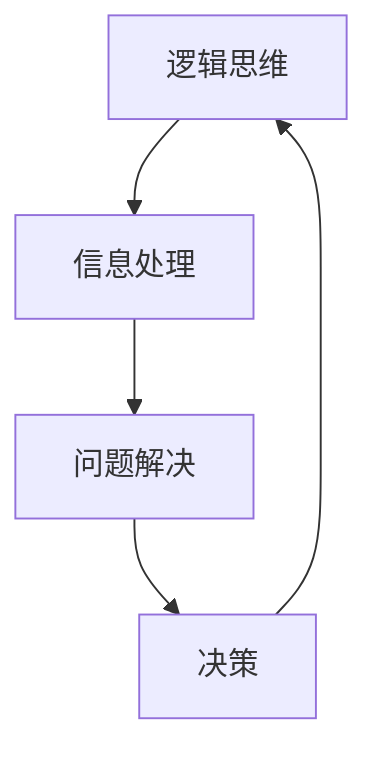

**流程图**：


#### C.2 人工智能算法伪代码示例

**描述**：以下是一个简单的机器学习算法的伪代码示例，用于分类问题。

```python
# 初始化参数
weights = 初始化参数()

# 定义损失函数
def loss_function(y_true, y_pred):
    return (y_true - y_pred) ** 2

# 训练模型
for epoch in 范围(1, num_epochs):
    for sample in 数据集:
        # 前向传播
        y_pred = 前向传播(sample, weights)
        
        # 计算损失
        loss = loss_function(y_true, y_pred)
        
        # 反向传播
        weights = 反向传播(sample, y_true, y_pred, weights)
```

**伪代码**：
```python
# 初始化参数
weights = 初始化参数()

# 定义损失函数
def loss_function(y_true, y_pred):
    return (y_true - y_pred) ** 2

# 训练模型
for epoch in 范围(1, num_epochs):
    for sample in 数据集:
        # 前向传播
        y_pred = 前向传播(sample, weights)
        
        # 计算损失
        loss = loss_function(y_true, y_pred)
        
        # 反向传播
        weights = 反向传播(sample, y_true, y_pred, weights)
```

#### C.3 人类计算与未来社会发展路径图

**描述**：本流程图展示了人类计算与未来社会发展的关系及其潜在影响。

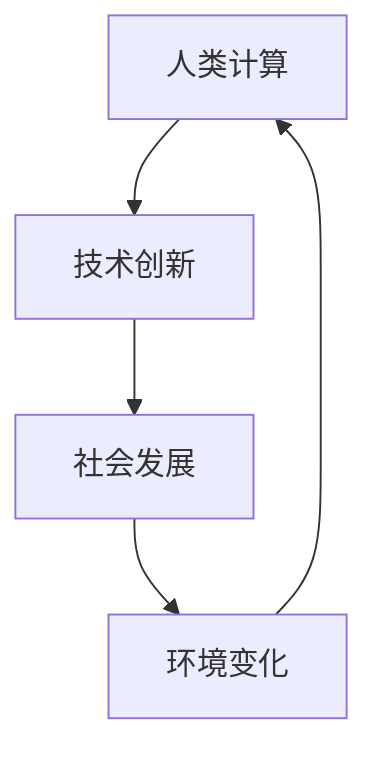

**流程图**：
```mermaid
graph TB
    A[人类计算]
    B[技术创新]
    C[社会发展]
    D[环境变化]
    
    A --> B
    B --> C
    C --> D
    D --> A
```

**总结**：

本附录通过流程图和算法伪代码，展示了人类计算的核心概念和算法原理。这些资源有助于读者更好地理解人类计算的理论和实践，为其在相关领域的应用和研究提供指导。通过学习这些流程图和算法，读者可以更深入地探讨人类计算的未来发展趋势和潜在影响。

